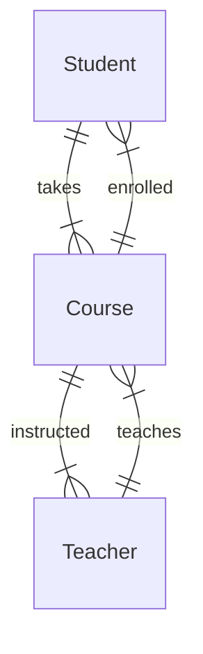
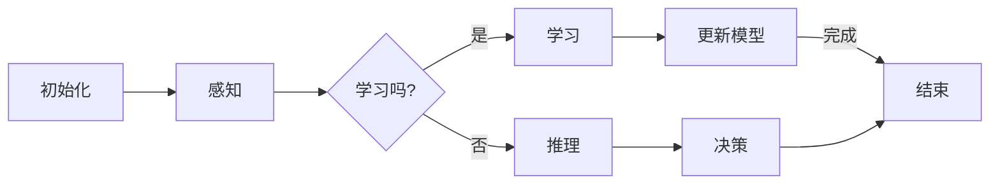
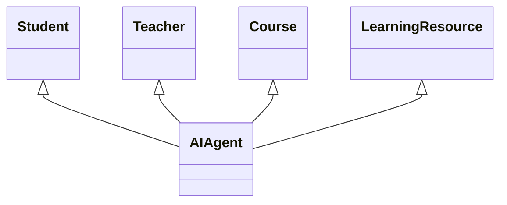
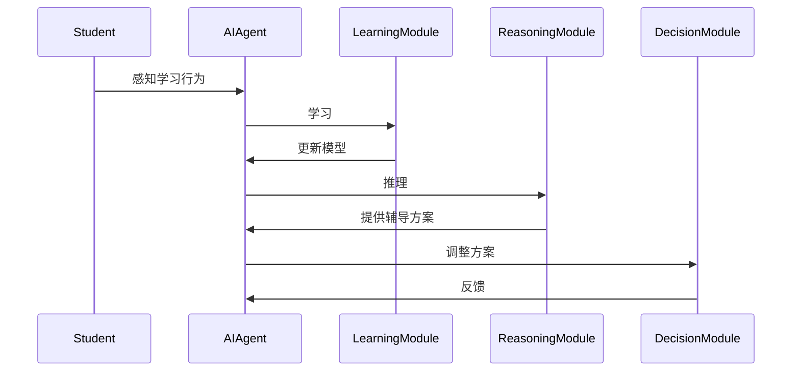
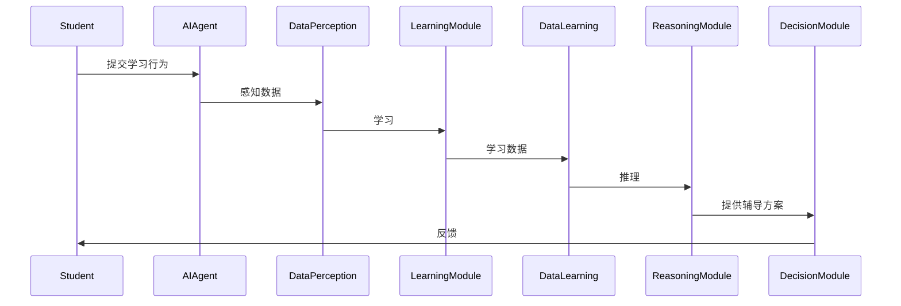

                 

## AI Agent在教育领域的创新应用

### 关键词
- AI Agent
- 教育领域
- 创新应用
- 算法原理
- 系统架构
- 实战案例

### 摘要
本文旨在探讨人工智能代理（AI Agent）在教育领域的创新应用。通过逐步分析AI Agent的基本概念、核心算法原理、系统架构设计方案以及实际应用案例，我们希望展示AI Agent在教育领域中的巨大潜力，并为其未来的发展提供有益的思考和指导。

### 背景介绍

#### AI Agent的基本概念

人工智能代理（AI Agent）是指能够自主执行任务、与环境交互并作出决策的计算机程序。AI Agent通过模仿人类智能行为，能够进行感知、学习、推理和规划。在技术层面，AI Agent通常基于机器学习和深度学习算法，能够从大量数据中提取模式，实现智能决策和行动。

#### AI Agent在教育领域的应用背景

随着人工智能技术的飞速发展，教育领域也在不断探索其应用。传统教学模式存在诸多问题，如教学资源有限、个性化教育难以实现等。AI Agent的出现为这些问题提供了新的解决方案。

首先，AI Agent能够实现个性化教学，根据学生的学习情况和需求，为其提供定制化的学习资源和辅导。其次，AI Agent能够模拟真实的教学场景，提供虚拟实验和实训机会，帮助学生更好地理解抽象概念。此外，AI Agent还可以辅助教师进行教学评估和反馈，提高教学质量。

#### 问题解决

AI Agent在教育领域的应用主要解决了以下几个方面的问题：

1. **个性化教育**：AI Agent能够根据学生的学习习惯、兴趣和需求，提供个性化的学习内容和辅导。
2. **教学资源优化**：AI Agent能够自动整理和推荐教学资源，提高教学效率。
3. **学习效果评估**：AI Agent能够实时监测学生的学习进度和效果，为教师提供精准的评估和反馈。
4. **教学环境模拟**：AI Agent能够模拟真实的教学环境，为学生提供丰富的实践机会。

#### 边界与外延

AI Agent在教育领域的应用边界主要涉及以下几个方面：

1. **技术层面**：AI Agent需要依赖先进的机器学习和深度学习技术，具备自主学习和决策能力。
2. **应用层面**：AI Agent的应用范围包括个性化教学、虚拟实验、教学评估等。
3. **伦理层面**：AI Agent的应用需要遵守教育伦理，保护学生的隐私和权益。

#### 概念结构与核心要素组成

AI Agent的基本概念结构包括感知、学习、推理和决策四个核心要素。感知是指AI Agent获取环境信息；学习是指AI Agent从数据中提取知识；推理是指AI Agent运用知识进行逻辑推理；决策是指AI Agent根据推理结果作出行动。

### 核心概念与联系

#### 核心概念原理

AI Agent的核心概念包括：

1. **感知**：AI Agent通过传感器获取环境信息。
2. **学习**：AI Agent通过机器学习和深度学习算法，从数据中提取知识。
3. **推理**：AI Agent运用知识进行逻辑推理，解决特定问题。
4. **决策**：AI Agent根据推理结果作出行动。

#### 概念属性特征对比表格

| 概念 | 属性特征 |
| :--: | :--: |
| 感知 | 获取环境信息 |
| 学习 | 从数据中提取知识 |
| 推理 | 逻辑推理 |
| 决策 | 作出行动 |

#### ER实体关系图架构



### 算法原理讲解

#### 算法mermaid流程图



#### Python源代码

```python
class AIAgent:
    def __init__(self):
        self.model = None
    
    def perceive(self, environment):
        # 传感器感知环境信息
        pass
    
    def learn(self, data):
        # 使用数据学习
        pass
    
    def reason(self):
        # 进行推理
        pass
    
    def decide(self):
        # 作出决策
        pass
```

#### 算法原理的数学模型和公式

```latex
$$
\begin{aligned}
    \text{感知} &= f_{\text{感知}}(x_1, x_2, \ldots, x_n) \\
    \text{学习} &= f_{\text{学习}}(x, y) \\
    \text{推理} &= f_{\text{推理}}(z) \\
    \text{决策} &= f_{\text{决策}}(z)
\end{aligned}
$$
```

#### 详细讲解和举例说明

AI Agent的教育应用主要包括以下步骤：

1. **感知**：AI Agent通过传感器（如摄像头、麦克风等）获取学生和教师的教学互动信息。
2. **学习**：AI Agent使用机器学习和深度学习算法，从历史数据和当前数据中提取知识，不断优化自身模型。
3. **推理**：AI Agent运用学习到的知识，对学生的行为和表现进行分析，识别学生的学习需求和问题。
4. **决策**：AI Agent根据推理结果，为学生提供个性化学习资源和辅导方案。

例如，在一个个性化教学系统中，AI Agent会首先感知学生的学习行为，如阅读进度、答题情况等。然后，AI Agent会从历史数据和当前数据中学习，了解学生的学习习惯和兴趣。接着，AI Agent会推理出学生的学习需求和问题，并提供相应的学习资源和辅导方案。最后，AI Agent会根据学生的学习效果，调整和优化辅导方案。

### 系统分析与架构设计方案

#### 问题场景介绍

在教育领域，AI Agent可以应用于以下场景：

1. **个性化教学**：根据学生的学习情况，提供个性化的学习资源和辅导。
2. **教学评估**：实时监测学生的学习进度和效果，为教师提供精准的评估和反馈。
3. **虚拟实验**：模拟真实的教学环境，为学生提供丰富的实践机会。

#### 项目介绍

本文将介绍一个基于AI Agent的个性化教学系统。该系统包括以下功能模块：

1. **感知模块**：感知学生的学习行为，如阅读进度、答题情况等。
2. **学习模块**：从历史数据和当前数据中学习，了解学生的学习习惯和兴趣。
3. **推理模块**：推理出学生的学习需求和问题，并提供相应的学习资源和辅导方案。
4. **决策模块**：根据学生的学习效果，调整和优化辅导方案。

#### 系统功能设计

使用Mermaid绘制系统的领域模型类图：



#### 系统架构设计

使用Mermaid绘制系统的架构设计图：



#### 系统接口设计

系统接口设计如下：

1. **感知接口**：用于感知学生的学习行为。
2. **学习接口**：用于从数据中学习。
3. **推理接口**：用于推理学生的学习需求和问题。
4. **决策接口**：用于调整和优化辅导方案。

#### 系统交互mermaid序列图



### 项目实战

#### 环境安装

在开始项目实战之前，我们需要安装以下环境：

1. **Python 3.8+**
2. **TensorFlow 2.5+**
3. **Keras 2.5+**

安装命令如下：

```bash
pip install python==3.8
pip install tensorflow==2.5
pip install keras==2.5
```

#### 系统核心实现源代码

以下是一个简单的AI Agent系统核心实现源代码：

```python
import tensorflow as tf
from tensorflow.keras.models import Sequential
from tensorflow.keras.layers import Dense, LSTM

class AIAgent:
    def __init__(self):
        self.model = self.build_model()
    
    def build_model(self):
        model = Sequential()
        model.add(LSTM(50, activation='relu', input_shape=(100, 1)))
        model.add(Dense(1))
        model.compile(optimizer='adam', loss='mse')
        return model
    
    def fit(self, x, y):
        self.model.fit(x, y, epochs=100, verbose=0)
    
    def predict(self, x):
        return self.model.predict(x)
```

#### 代码应用解读与分析

以上代码定义了一个AI Agent类，主要包括以下方法：

1. **build_model**：构建一个序列模型，包括一个LSTM层和一个全连接层。
2. **fit**：使用训练数据训练模型。
3. **predict**：使用训练好的模型进行预测。

在实际应用中，我们可以将AI Agent集成到个性化教学系统中，实现对学生学习行为的感知、学习和推理，为学生提供个性化的辅导方案。

#### 实际案例分析和详细讲解剖析

以下是一个实际案例，展示了如何使用AI Agent实现个性化教学：

1. **感知阶段**：AI Agent感知学生的学习行为，如阅读进度、答题情况等。
2. **学习阶段**：AI Agent从历史数据和当前数据中学习，了解学生的学习习惯和兴趣。
3. **推理阶段**：AI Agent推理出学生的学习需求和问题，如某个知识点掌握不牢固。
4. **决策阶段**：AI Agent根据推理结果，为学生提供针对性的辅导方案，如额外的练习题或视频教程。

通过实际案例，我们可以看到AI Agent在教育领域中的强大应用潜力。它能够帮助学生更高效地学习，提高学习效果。

### 项目小结

本文通过逐步分析AI Agent在教育领域的创新应用，展示了其巨大的潜力和价值。从基本概念、算法原理到系统架构设计，再到实际应用案例，我们详细探讨了AI Agent在教育领域中的应用。未来，随着人工智能技术的不断进步，AI Agent在教育领域的应用将更加广泛和深入，为教育领域带来更多创新和变革。

### 最佳实践 tips

1. **数据收集与清洗**：确保数据的质量和准确性，对收集到的数据进行清洗和预处理。
2. **模型优化**：定期对模型进行优化和调整，以提高其性能和准确性。
3. **用户体验**：关注用户的体验，设计直观、易用的界面。
4. **隐私保护**：严格遵守隐私保护法律法规，保护学生的个人信息。

### 小结

本文详细探讨了AI Agent在教育领域的创新应用，从基本概念、算法原理到系统架构设计，再到实际应用案例，全面展示了AI Agent在教育领域中的潜力。未来，随着人工智能技术的不断发展，AI Agent在教育领域的应用将更加广泛和深入，为教育领域带来更多创新和变革。

### 注意事项

1. **技术挑战**：AI Agent在教育领域的应用面临着技术挑战，如算法优化、数据安全等。
2. **伦理问题**：在使用AI Agent时，需要关注伦理问题，如数据隐私、算法偏见等。

### 拓展阅读

1. **《人工智能与教育》**：探讨人工智能在教育领域的应用和发展趋势。
2. **《机器学习算法与应用》**：详细介绍机器学习算法及其在教育领域的应用。
3. **《深度学习原理与实战》**：深入讲解深度学习算法及其在教育领域的应用。 

### 作者信息

作者：AI天才研究院（AI Genius Institute）& 禅与计算机程序设计艺术（Zen And The Art of Computer Programming）

