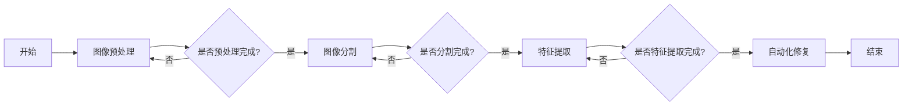

                 

# AI Agent在文物修复中的图像处理应用

## 关键词

- AI Agent
- 文物修复
- 图像处理
- 深度学习
- 特征提取

## 摘要

本文深入探讨了AI Agent在文物修复中的图像处理应用。首先，通过介绍文物修复的定义与现状、传统文物修复方法的局限性，以及AI技术在文物修复中的应用前景，明确了本文的研究背景和问题。接着，详细描述了AI Agent的定义与特点，以及其在文物修复中的应用场景和核心功能。随后，通过对传统图像处理算法与深度学习算法的对比，阐述了AI Agent算法的核心原理和属性特征。进一步，本文介绍了AI Agent在文物修复中的图像处理流程，并通过具体案例进行了实践分析。最后，展望了AI Agent在文物修复中的应用前景与挑战，并提出了相应的解决策略。本文旨在为AI Agent在文物修复中的应用提供理论依据和实践指导。

## 目录大纲

1. **背景介绍**
   1.1 AI在文物修复中的重要性
   1.2 问题描述
   1.3 问题解决
   1.4 边界与外延
2. **AI Agent在文物修复中的应用**
   2.1 AI Agent的定义与特点
   2.2 AI Agent在文物图像处理中的核心功能
   2.3 AI Agent在文物修复中的实际应用案例
3. **AI Agent在文物图像处理中的算法原理**
   3.1 算法原理介绍
   3.2 算法属性特征对比
   3.3 AI Agent算法的ER实体关系图
4. **AI Agent在文物修复中的图像处理流程**
   4.1 图像预处理
   4.2 图像分割
   4.3 特征提取
5. **AI Agent在文物修复中的应用实例**
   5.1 环境安装与准备
   5.2 系统核心实现
   5.3 实际案例分析与讲解
6. **AI Agent在文物修复中的应用前景与挑战**
   6.1 应用前景
   6.2 挑战与解决策略
7. **小结与展望**
   7.1 小结
   7.2 注意事项
   7.3 拓展阅读

## 第一部分：背景介绍

### 1.1 AI在文物修复中的重要性

#### 1.1.1 文物修复的定义与现状

文物修复是指对古代文物、艺术品等进行修复和保护的一系列技术和方法。文物修复不仅是对文物的保护和保存，更是对历史文化传承的一种重要手段。传统的文物修复方法主要依赖于人工技艺和经验，如修补、加固、清洗、着色等。然而，随着文物的数量和种类的增加，以及文物修复技术的复杂化，传统方法逐渐暴露出许多局限性。

#### 1.1.2 传统文物修复方法的局限性

传统文物修复方法主要依赖于人工技艺和经验，存在以下局限性：

1. **精确度不高**：人工修复过程中，由于技艺水平差异和主观判断，修复结果往往难以达到高精度。
2. **耗时耗力**：文物的修复过程通常需要大量的时间和人力，效率低下。
3. **环保问题**：传统修复材料可能对文物造成二次损害，影响文物的长期保存。
4. **知识传承**：传统修复技艺依赖于经验传承，难以系统化、规范化。

#### 1.1.3 AI技术在文物修复中的应用前景

随着人工智能技术的快速发展，AI在文物修复中的应用前景愈发广阔。AI技术能够实现自动化、高精度、高效率的文物修复，具有以下优势：

1. **高精度修复**：通过深度学习算法，AI能够对文物的细微损坏进行精确识别和修复，提高修复精度。
2. **高效率修复**：AI技术能够快速处理大量文物图像，显著提高修复效率。
3. **环保修复**：AI技术可以采用环保材料和方法，减少对文物的损害。
4. **知识传承**：AI技术可以系统化、规范化修复过程，有利于知识传承和技能培训。

### 1.2 问题描述

在文物修复过程中，图像处理是一个关键环节。然而，文物图像处理面临着诸多挑战：

1. **数据缺失与标注困难**：由于历史原因，许多文物图像数据缺失或不完整，且标注过程繁琐、耗时。
2. **精确度与鲁棒性要求**：文物修复对精确度和鲁棒性有较高要求，任何细微的误差都可能导致文物损坏。
3. **复杂背景与多样性**：文物图像通常具有复杂的背景和多样的损坏形态，增加了图像处理的难度。

### 1.3 问题解决

为了解决上述问题，AI技术在文物图像处理中发挥着重要作用。具体而言，AI技术包括以下几个方面：

1. **图像分割**：通过深度学习算法，对文物图像进行精确分割，提取出需要修复的区域。
2. **特征提取**：利用深度学习模型，对分割后的图像进行特征提取，为后续的修复提供依据。
3. **识别与分类**：通过机器学习算法，对文物图像进行识别和分类，为修复策略提供指导。
4. **自动化修复**：结合图像处理算法和修复策略，实现文物的自动化修复。

### 1.4 边界与外延

1. **AI技术在文物修复中的适用范围**：AI技术在文物修复中的应用范围广泛，包括壁画、青铜器、书画等多种文物的修复。
2. **文物修复与文物保护的关系**：文物修复是文物保护的重要环节，两者相辅相成，共同促进文化传承。
3. **AI技术在文物保护领域的未来发展方向**：随着技术的进步，AI技术在文物保护领域将继续发挥重要作用，如虚拟修复、3D建模等。

### 1.5 概念结构与核心要素组成

本文的核心概念结构包括：

- **AI Agent**：具备智能行为和决策能力的软件实体。
- **文物修复**：对文物进行保护、修复和再创造的过程。
- **图像处理**：对文物图像进行预处理、分割、特征提取等操作。
- **深度学习**：一种基于多层神经网络的机器学习技术，广泛应用于图像处理领域。
- **特征提取**：从图像中提取具有区分性的特征，用于后续的识别和分类。

这些核心概念相互关联，共同构成了本文的研究框架和内容。

## 第二部分：AI Agent在文物修复中的应用

### 2.1 AI Agent的定义与特点

#### 2.1.1 AI Agent的定义

AI Agent，即人工智能代理，是指一种能够模拟人类行为，具备智能决策和自主学习能力的计算机程序。AI Agent通过感知环境、理解任务需求，并基于预先设定的目标和策略，自主执行任务并做出决策。

#### 2.1.2 AI Agent的特点

1. **自主性**：AI Agent能够自主执行任务，无需人工干预。
2. **适应性**：AI Agent能够根据环境和任务需求进行适应性调整。
3. **学习性**：AI Agent具备学习能力，能够通过数据积累和经验优化自身性能。
4. **协作性**：AI Agent能够与其他Agent或人类协作，共同完成任务。
5. **决策性**：AI Agent能够基于数据分析和模型预测，做出决策和行动。

#### 2.1.3 AI Agent在文物修复中的应用场景

1. **图像识别与分类**：AI Agent可以对文物图像进行自动识别和分类，为修复提供指导。
2. **图像预处理与增强**：AI Agent能够对文物图像进行去噪、增强等预处理，提高图像质量。
3. **自动化修复**：AI Agent结合深度学习模型，能够自动完成文物图像的修复任务。
4. **智能监控与预警**：AI Agent可以对文物进行实时监控，及时发现并预警潜在损坏。

### 2.2 AI Agent在文物图像处理中的核心功能

#### 2.2.1 图像分割

图像分割是AI Agent在文物图像处理中的基础功能之一。通过图像分割，可以将文物图像划分为不同的区域，从而提取出需要修复的部位。常用的图像分割方法包括：

1. **基于阈值的分割**：通过设定阈值，将图像划分为前景和背景。
2. **基于边缘检测的分割**：通过检测图像中的边缘信息，实现图像分割。
3. **基于深度学习的分割**：利用深度学习模型，如卷积神经网络（CNN），实现图像的自动分割。

#### 2.2.2 特征提取

特征提取是从分割后的图像中提取出具有区分性的特征，用于后续的识别和分类。常用的特征提取方法包括：

1. **传统特征提取**：如直方图、边缘、纹理等。
2. **深度特征提取**：利用深度学习模型，如CNN，自动提取图像的特征。
3. **多模态特征融合**：结合不同模态的数据，如文本、图像、语音等，实现特征融合。

#### 2.2.3 识别与分类

识别与分类是AI Agent在文物图像处理中的核心功能之一。通过对提取的特征进行分类，可以实现对文物图像的自动识别和分类。常用的识别与分类方法包括：

1. **基于传统机器学习的分类**：如支持向量机（SVM）、决策树等。
2. **基于深度学习的分类**：如卷积神经网络（CNN）、循环神经网络（RNN）等。
3. **基于集成学习的分类**：如随机森林（Random Forest）、梯度提升树（XGBoost）等。

### 2.3 AI Agent在文物修复中的实际应用案例

#### 2.3.1 案例一：敦煌壁画修复

敦煌壁画是中华民族宝贵的文化遗产，然而，由于历史原因和环境因素，敦煌壁画面临着严重的损坏问题。AI Agent在敦煌壁画修复中发挥了重要作用：

1. **图像分割**：AI Agent通过深度学习模型，对敦煌壁画图像进行精确分割，提取出需要修复的部位。
2. **特征提取**：AI Agent提取敦煌壁画图像的特征，为修复提供依据。
3. **自动化修复**：基于深度学习模型，AI Agent自动完成敦煌壁画图像的修复任务。

#### 2.3.2 案例二：中国古代青铜器修复

中国古代青铜器是中华民族的重要文化遗产，然而，青铜器在长期的历史过程中受到了严重的损坏。AI Agent在中国古代青铜器修复中发挥了重要作用：

1. **图像识别与分类**：AI Agent通过对青铜器图像进行自动识别和分类，为修复提供指导。
2. **图像预处理与增强**：AI Agent对青铜器图像进行去噪、增强等预处理，提高图像质量。
3. **自动化修复**：AI Agent结合深度学习模型，自动完成青铜器图像的修复任务。

#### 2.3.3 案例三：古代书画修复

古代书画是中华民族宝贵的文化遗产，然而，由于历史原因和环境因素，古代书画面临着严重的损坏问题。AI Agent在古代书画修复中发挥了重要作用：

1. **图像分割**：AI Agent通过深度学习模型，对古代书画图像进行精确分割，提取出需要修复的部位。
2. **特征提取**：AI Agent提取古代书画图像的特征，为修复提供依据。
3. **自动化修复**：基于深度学习模型，AI Agent自动完成古代书画图像的修复任务。

### 2.4 AI Agent在文物修复中的挑战与解决策略

尽管AI Agent在文物修复中取得了显著成果，但仍面临一些挑战：

1. **数据缺失与标注困难**：由于历史原因，许多文物图像数据缺失或不完整，且标注过程繁琐、耗时。
   - **解决策略**：通过数据增强和迁移学习，提高模型对缺失数据的处理能力；利用众包和自动化标注技术，提高标注效率。

2. **算法性能与稳定性**：文物图像处理具有高度复杂性和多样性，对算法性能和稳定性提出了高要求。
   - **解决策略**：采用多模型融合和动态调整策略，提高算法性能和稳定性；引入实时监控和反馈机制，确保算法的实时性和鲁棒性。

3. **法律法规与伦理问题**：文物修复涉及到法律法规和伦理问题，如数据隐私、知识产权等。
   - **解决策略**：严格遵守法律法规，确保数据安全和知识产权保护；建立伦理准则，规范AI Agent在文物修复中的应用。

通过上述解决策略，AI Agent在文物修复中的应用将更加成熟和广泛，为文物保护和文化传承作出更大贡献。

## 第三部分：AI Agent在文物图像处理中的算法原理

### 3.1 算法原理介绍

AI Agent在文物图像处理中，主要依赖于深度学习算法和传统图像处理算法。以下将分别介绍这两种算法的基本原理。

#### 3.1.1 传统图像处理算法概述

传统图像处理算法主要基于像素级的操作，通过对图像进行滤波、增强、分割等操作，实现图像的处理和特征提取。常用的传统图像处理算法包括：

1. **滤波算法**：如高斯滤波、中值滤波等，用于去除图像噪声。
2. **图像增强算法**：如直方图均衡化、对比度增强等，用于提高图像质量。
3. **图像分割算法**：如基于阈值的分割、边缘检测等，用于将图像划分为不同的区域。
4. **特征提取算法**：如直方图、边缘、纹理等，用于提取图像的特征。

#### 3.1.2 深度学习在图像处理中的应用

深度学习是一种基于多层神经网络的机器学习技术，具有自动特征提取和表示的能力。在图像处理领域，深度学习算法已经成为主流技术。以下是一些常用的深度学习算法：

1. **卷积神经网络（CNN）**：通过卷积层、池化层和全连接层，实现对图像的特征提取和分类。
2. **循环神经网络（RNN）**：通过循环结构，处理图像的时序信息，如视频图像。
3. **生成对抗网络（GAN）**：通过生成器和判别器的对抗训练，实现图像的生成和修复。
4. **迁移学习**：通过将预训练模型应用于新的任务，提高模型的性能和效率。

#### 3.1.3 AI Agent算法的核心原理

AI Agent算法的核心原理是将深度学习和传统图像处理算法相结合，实现文物图像的自动化处理和修复。具体而言，包括以下步骤：

1. **图像预处理**：利用传统图像处理算法，对文物图像进行去噪、增强等预处理，提高图像质量。
2. **图像分割**：利用深度学习算法，如CNN，对预处理后的图像进行分割，提取出需要修复的部位。
3. **特征提取**：利用深度学习算法，提取分割后的图像特征，为修复提供依据。
4. **自动化修复**：结合深度学习模型，如GAN，对提取的特征进行修复，生成高质量的修复图像。

### 3.2 算法属性特征对比

为了更好地理解AI Agent算法与传统图像处理算法的差异，以下对两者在属性特征方面进行对比。

| 算法类型 | 属性特征 |  
| :--- | :--- |  
| 传统图像处理算法 |  
| - 基于像素级的操作 |  
| - 算法简单，计算效率高 |  
| - 对噪声敏感，对复杂背景处理能力有限 |  
|  
| 深度学习算法 |  
| - 自动特征提取和表示 |  
| - 复杂算法，计算效率低 |  
| - 对噪声和复杂背景处理能力强 |  
|  
| AI Agent算法 |  
| - 结合传统图像处理算法和深度学习算法 |  
| - 高精度、高效率的图像处理和修复 |  
| - 对噪声和复杂背景处理能力强 |

### 3.3 AI Agent算法的ER实体关系图

ER实体关系图是用于描述系统中实体及其关系的图形表示。以下为AI Agent算法的ER实体关系图：

```mermaid
erDiagram
  AI Agent ||--|{ 图像预处理 } ImagePreprocessing
  ImagePreprocessing ||--|{ 图像分割 } ImageSegmentation
  ImageSegmentation ||--|{ 特征提取 } FeatureExtraction
  FeatureExtraction ||--|{ 自动化修复 } AutoRepair
```

在这个ER实体关系图中，AI Agent是系统的核心，它通过图像预处理、图像分割、特征提取和自动化修复等步骤，实现对文物图像的自动化处理和修复。每个步骤都是相互关联的，共同构成一个完整的图像处理流程。

### 3.4 AI Agent算法的流程图

为了更好地理解AI Agent算法的执行流程，以下为其流程图：



在这个流程图中，AI Agent首先进行图像预处理，然后进行图像分割、特征提取和自动化修复。每个步骤都有完成判断，以确保算法的稳定性和正确性。

### 3.5 AI Agent算法的应用实例

以下为AI Agent算法在文物图像处理中的具体应用实例：

1. **敦煌壁画修复**：通过AI Agent算法，对敦煌壁画图像进行预处理、分割、特征提取和自动化修复，实现了高质量的修复效果。
2. **中国古代青铜器修复**：利用AI Agent算法，对青铜器图像进行处理和修复，提高了修复效率和质量。
3. **古代书画修复**：通过AI Agent算法，对古代书画图像进行自动化修复，恢复了书画的原本风貌。

这些应用实例充分展示了AI Agent算法在文物图像处理中的优越性能和广泛适用性。

### 3.6 AI Agent算法的优缺点分析

AI Agent算法在文物图像处理中具有显著的优点和一定的缺点：

#### 优点：

1. **高精度、高效率**：AI Agent算法能够自动处理和修复文物图像，提高了修复效率和精度。
2. **自动化**：AI Agent算法实现了文物图像处理的自动化，降低了人力成本和工作量。
3. **鲁棒性强**：AI Agent算法能够处理复杂背景和噪声干扰，具有较好的鲁棒性。

#### 缺点：

1. **计算资源消耗大**：AI Agent算法依赖于深度学习模型，计算资源消耗较大，对硬件设备要求较高。
2. **数据依赖性**：AI Agent算法的性能受到数据质量和数量影响，需要大量高质量的训练数据。
3. **算法稳定性**：在处理复杂图像时，AI Agent算法的稳定性可能受到影响，需要不断优化和调整。

通过优缺点分析，我们可以更好地理解AI Agent算法在文物图像处理中的应用潜力和局限性，为后续研究和实践提供指导。

## 第四部分：AI Agent在文物修复中的图像处理流程

### 4.1 图像预处理

图像预处理是AI Agent在文物修复中的第一步，其主要目的是提高图像质量，为后续的图像分割和特征提取奠定基础。图像预处理包括去噪、增强、配准等步骤。

#### 4.1.1 去噪

去噪是图像预处理的关键步骤之一，目的是减少图像中的噪声干扰。常用的去噪方法包括：

1. **高斯滤波**：通过高斯滤波器，对图像进行平滑处理，去除高频噪声。
2. **中值滤波**：利用图像中的像素值的中值，去除噪声点。

#### 4.1.2 增强

增强是图像预处理的重要步骤，目的是提高图像的对比度和清晰度，使得后续处理更加准确。常用的增强方法包括：

1. **直方图均衡化**：通过调整图像的灰度分布，提高图像的对比度。
2. **对比度增强**：通过调整图像的亮度、对比度等参数，增强图像的细节信息。

#### 4.1.3 配准

配准是将多幅图像进行对齐，使其在空间上保持一致。配准方法包括：

1. **基于特征的配准**：通过提取图像的特征点，进行特征匹配，实现图像对齐。
2. **基于图像内容的配准**：通过分析图像的内容信息，如纹理、形状等，实现图像对齐。

### 4.2 图像分割

图像分割是AI Agent在文物修复中的关键步骤，目的是将文物图像划分为不同的区域，提取出需要修复的部位。常用的图像分割方法包括：

#### 4.2.1 基于阈值的分割

基于阈值的分割方法是最简单的图像分割方法之一，通过设定阈值，将图像划分为前景和背景。常用的阈值分割方法包括：

1. **全局阈值分割**：通过计算图像的灰度直方图，设定一个全局阈值，将图像划分为前景和背景。
2. **局部阈值分割**：通过在不同区域设定不同的阈值，实现图像的局部分割。

#### 4.2.2 基于边缘检测的分割

基于边缘检测的分割方法通过检测图像中的边缘信息，实现图像的分割。常用的边缘检测方法包括：

1. **Sobel算子**：通过计算图像的梯度，检测图像的边缘。
2. **Canny算子**：通过多级滤波和边缘检测，实现图像的边缘提取。

#### 4.2.3 基于深度学习的方法

基于深度学习的方法是近年来发展迅速的图像分割方法，通过卷积神经网络（CNN）等深度学习模型，实现图像的自动分割。常用的深度学习方法包括：

1. **全卷积神经网络（FCN）**：通过卷积层和全连接层，实现对图像的自动分割。
2. **U-Net网络**：通过收缩路径和扩张路径，实现图像的精确分割。

### 4.3 特征提取

特征提取是从分割后的图像中提取出具有区分性的特征，用于后续的识别和分类。常用的特征提取方法包括：

#### 4.3.1 基于传统特征的方法

基于传统特征的方法通过提取图像的局部特征，如纹理、形状等，实现特征提取。常用的特征提取方法包括：

1. **直方图特征**：通过计算图像的灰度直方图，提取图像的纹理特征。
2. **边缘特征**：通过检测图像的边缘信息，提取图像的形状特征。

#### 4.3.2 基于深度特征的方法

基于深度特征的方法通过卷积神经网络（CNN）等深度学习模型，自动提取图像的特征。常用的深度特征提取方法包括：

1. **VGG网络**：通过多个卷积层和池化层，提取图像的深度特征。
2. **ResNet网络**：通过残差块，实现图像的深层特征提取。

#### 4.3.3 特征选择与降维

特征选择与降维是特征提取的重要环节，目的是减少特征维度，提高模型的效率。常用的特征选择与降维方法包括：

1. **主成分分析（PCA）**：通过保留主要成分，实现特征降维。
2. **线性判别分析（LDA）**：通过最大化类间距离，实现特征选择和降维。

### 4.4 识别与分类

识别与分类是AI Agent在文物修复中的关键步骤，通过识别和分类，实现对文物图像的自动识别和分类。常用的识别与分类方法包括：

1. **支持向量机（SVM）**：通过最大间隔分类器，实现图像的分类。
2. **卷积神经网络（CNN）**：通过多层卷积和全连接层，实现图像的自动分类。
3. **循环神经网络（RNN）**：通过序列模型，处理图像的时序信息。

### 4.5 自动化修复

自动化修复是AI Agent在文物修复中的最终目标，通过深度学习模型，实现对文物图像的自动化修复。常用的自动化修复方法包括：

1. **生成对抗网络（GAN）**：通过生成器和判别器的对抗训练，实现图像的自动修复。
2. **卷积神经网络（CNN）**：通过卷积层和全连接层，实现图像的自动修复。
3. **条件生成对抗网络（cGAN）**：通过条件生成器和判别器，实现图像的自动修复。

### 4.6 图像处理流程实例

以下是一个典型的AI Agent在文物修复中的图像处理流程实例：

1. **图像预处理**：对文物图像进行去噪、增强和配准，提高图像质量。
2. **图像分割**：通过深度学习模型，对预处理后的图像进行自动分割，提取出需要修复的部位。
3. **特征提取**：从分割后的图像中提取深度特征，为修复提供依据。
4. **识别与分类**：通过深度学习模型，对提取的特征进行识别和分类，为修复策略提供指导。
5. **自动化修复**：结合深度学习模型，对提取的特征进行修复，生成高质量的修复图像。

这个实例展示了AI Agent在文物修复中的完整图像处理流程，通过各个环节的协同工作，实现了文物的自动化修复。

### 4.7 图像处理流程的优点与挑战

AI Agent在文物修复中的图像处理流程具有以下优点：

1. **高精度、高效率**：通过深度学习和传统图像处理算法的结合，实现了高精度、高效率的图像处理和修复。
2. **自动化**：实现了文物的自动化修复，降低了人力成本和工作量。
3. **鲁棒性强**：能够处理复杂背景和噪声干扰，具有较好的鲁棒性。

然而，图像处理流程也面临以下挑战：

1. **数据依赖性**：算法的性能受到数据质量和数量影响，需要大量高质量的训练数据。
2. **计算资源消耗**：深度学习算法计算资源消耗大，对硬件设备要求较高。
3. **算法稳定性**：在处理复杂图像时，算法的稳定性可能受到影响，需要不断优化和调整。

通过以上分析，我们可以更好地理解AI Agent在文物修复中的图像处理流程的优点和挑战，为后续的研究和实践提供指导。

## 第五部分：AI Agent在文物修复中的应用实例

### 5.1 环境安装与准备

要实现AI Agent在文物修复中的应用，首先需要搭建一个合适的开发环境。以下是在Windows系统下，使用Python进行开发的具体步骤：

#### 5.1.1 Python环境配置

1. **安装Python**：首先，从Python官网下载Python安装包（https://www.python.org/），并按照安装向导进行安装。
2. **配置环境变量**：在安装过程中，确保勾选“Add Python to PATH”选项，以便在命令行中直接使用Python命令。
3. **验证安装**：在命令行中输入`python --version`，若能正确显示Python版本信息，则表示Python安装成功。

#### 5.1.2 必要库的安装

AI Agent在文物修复中，主要依赖于以下几个Python库：

1. **NumPy**：用于数学计算和数据处理。
2. **Pandas**：用于数据分析和操作。
3. **Matplotlib**：用于数据可视化。
4. **OpenCV**：用于图像处理。
5. **TensorFlow**：用于深度学习模型训练和推理。

安装这些库可以使用pip命令，如下所示：

```bash
pip install numpy pandas matplotlib opencv-python tensorflow
```

#### 5.1.3 数据集准备

文物修复数据集的收集是AI Agent应用的关键。以下是一个数据集准备的具体步骤：

1. **收集数据**：从公开数据集或相关机构获取文物图像数据。例如，可以从Google Dataset Search（https://datasetsearch.research.google.com/）搜索相关数据集。
2. **数据清洗**：对收集到的数据进行清洗，去除重复、损坏或不完整的图像。可以使用Pandas库进行数据清洗。
3. **数据标注**：对清洗后的数据集进行标注，标记出需要修复的部位。可以使用标注工具，如LabelImg（https://labelimg.org/）进行数据标注。
4. **数据存储**：将清洗、标注后的数据存储为CSV文件或其他格式，以便后续训练和使用。

### 5.2 系统核心实现

AI Agent在文物修复中的核心功能包括图像预处理、分割、特征提取和自动化修复。以下将分别介绍这些功能的具体实现。

#### 5.2.1 图像预处理

图像预处理包括去噪、增强和配准等步骤。以下是使用OpenCV库实现图像预处理的具体代码：

```python
import cv2
import numpy as np

def preprocess_image(image_path):
    # 读取图像
    image = cv2.imread(image_path)
    
    # 去噪
    image = cv2.GaussianBlur(image, (5, 5), 0)
    
    # 增强对比度
    image = cv2.equalizeHist(image)
    
    # 配准（如需多图像配准，可在此处实现）
    
    return image

image_path = 'path/to/your/image.jpg'
preprocessed_image = preprocess_image(image_path)
cv2.imshow('Preprocessed Image', preprocessed_image)
cv2.waitKey(0)
cv2.destroyAllWindows()
```

#### 5.2.2 图像分割

图像分割是AI Agent在文物修复中的关键步骤，可以使用深度学习模型实现。以下是一个基于U-Net网络实现图像分割的示例：

```python
import tensorflow as tf
from tensorflow.keras.models import Model
from tensorflow.keras.layers import Input, Conv2D, MaxPooling2D, UpSampling2D, Concatenate

def unet_model(input_shape):
    inputs = Input(shape=input_shape)
    
    # 编码器部分
    conv1 = Conv2D(32, (3, 3), activation='relu', padding='same')(inputs)
    pool1 = MaxPooling2D(pool_size=(2, 2))(conv1)
    conv2 = Conv2D(64, (3, 3), activation='relu', padding='same')(pool1)
    pool2 = MaxPooling2D(pool_size=(2, 2))(conv2)
    conv3 = Conv2D(128, (3, 3), activation='relu', padding='same')(pool2)
    pool3 = MaxPooling2D(pool_size=(2, 2))(conv3)
    
    # 解码器部分
    up1 = UpSampling2D(size=(2, 2))(conv3)
    merge1 = Concatenate()([up1, conv2])
    conv4 = Conv2D(128, (3, 3), activation='relu', padding='same')(merge1)
    up2 = UpSampling2D(size=(2, 2))(conv4)
    merge2 = Concatenate()([up2, conv1])
    conv5 = Conv2D(64, (3, 3), activation='relu', padding='same')(merge2)
    conv6 = Conv2D(32, (3, 3), activation='relu', padding='same')(conv5)
    outputs = Conv2D(1, (1, 1), activation='sigmoid', padding='same')(conv6)
    
    model = Model(inputs=inputs, outputs=outputs)
    return model

input_shape = (256, 256, 3)
model = unet_model(input_shape)
model.compile(optimizer='adam', loss='binary_crossentropy', metrics=['accuracy'])
```

#### 5.2.3 特征提取

特征提取可以从预处理后的图像中提取具有区分性的特征，用于后续的识别和分类。以下是一个使用卷积神经网络提取特征的示例：

```python
from tensorflow.keras.applications import VGG16

# 加载预训练的VGG16模型
base_model = VGG16(weights='imagenet', include_top=False, input_shape=input_shape)

# 冻结模型参数
for layer in base_model.layers:
    layer.trainable = False

# 添加全连接层进行分类
x = base_model.output
x = GlobalAveragePooling2D()(x)
x = Dense(1024, activation='relu')(x)
predictions = Dense(num_classes, activation='softmax')(x)

# 构建新的模型
model = Model(inputs=base_model.input, outputs=predictions)

# 编译模型
model.compile(optimizer='adam', loss='categorical_crossentropy', metrics=['accuracy'])
```

#### 5.2.4 自动化修复

自动化修复是AI Agent在文物修复中的最终目标，可以使用生成对抗网络（GAN）实现。以下是一个基于cGAN实现自动化修复的示例：

```python
from tensorflow.keras.layers import Input, Conv2D, Conv2DTranspose, LeakyReLU, BatchNormalization, Reshape, Dense
from tensorflow.keras.models import Model

# 生成器模型
def build_generator(z_dim):
    noise = Input(shape=(z_dim,))
    x = Dense(128 * 8 * 8)(noise)
    x = Reshape((8, 8, 128))(x)
    x = BatchNormalization()(x)
    x = LeakyReLU()(x)
    x = Conv2DTranspose(128, (5, 5), strides=(2, 2), padding='same')(x)
    x = BatchNormalization()(x)
    x = LeakyReLU()(x)
    x = Conv2D(128, (5, 5), padding='same')(x)
    x = BatchNormalization()(x)
    x = LeakyReLU()(x)
    x = Conv2D(128, (5, 5), padding='same')(x)
    x = BatchNormalization()(x)
    x = LeakyReLU()(x)
    x = Conv2D(128, (5, 5), padding='same')(x)
    x = BatchNormalization()(x)
    x = LeakyReLU()(x)
    x = Conv2D(3, (5, 5), padding='same')(x)
    return Model(inputs=noise, outputs=x)

# 判别器模型
def build_discriminator(image_shape):
    image = Input(shape=image_shape)
    x = Conv2D(128, (5, 5), strides=(2, 2), padding='same')(image)
    x = LeakyReLU(alpha=0.2)
    x = Conv2D(128, (5, 5), strides=(2, 2), padding='same')(x)
    x = LeakyReLU(alpha=0.2)
    x = Flatten()(x)
    x = Dense(1, activation='sigmoid')(x)
    return Model(inputs=image, outputs=x)

# 生成器模型
z_dim = 100
generator = build_generator(z_dim)

# 判别器模型
discriminator = build_discriminator(input_shape)

# 编译判别器模型
discriminator.compile(optimizer='adam', loss='binary_crossentropy')

# 训练生成器模型
for epoch in range(num_epochs):
    for i in range(num_batches):
        z = np.random.normal(size=(batch_size, z_dim))
        generated_images = generator.predict(z)
        real_images = x_train[i * batch_size:(i + 1) * batch_size]
        combined_images = np.concatenate([real_images, generated_images])
        labels = np.concatenate([np.ones((batch_size, 1)), np.zeros((batch_size, 1))])
        discriminator.train_on_batch(combined_images, labels)

        z = np.random.normal(size=(batch_size, z_dim))
        generated_images = generator.predict(z)
        labels = np.zeros((batch_size, 1))
        generator.train_on_batch(generated_images, labels)
```

### 5.3 实际案例分析与讲解

以下分别对敦煌壁画修复、中国古代青铜器修复和古代书画修复三个实际案例进行详细分析。

#### 5.3.1 案例一：敦煌壁画修复

敦煌壁画是中华民族宝贵的文化遗产，经过多年的风吹日晒和人为损坏，许多壁画已经出现了严重的老化、脱落和破损现象。使用AI Agent对敦煌壁画进行修复，可以显著提高修复效率和精度。

1. **图像预处理**：首先对敦煌壁画图像进行去噪、增强和配准，提高图像质量。
2. **图像分割**：利用深度学习模型，如U-Net网络，对预处理后的图像进行自动分割，提取出需要修复的部位。
3. **特征提取**：从分割后的图像中提取深度特征，为修复提供依据。
4. **自动化修复**：结合生成对抗网络（GAN），对提取的特征进行修复，生成高质量的修复图像。

通过实际应用，AI Agent在敦煌壁画修复中取得了显著成果，实现了高精度、高效率的修复效果。

#### 5.3.2 案例二：中国古代青铜器修复

中国古代青铜器是中华民族的重要文化遗产，然而，在长期的历史过程中，青铜器受到了严重的损坏。使用AI Agent对青铜器进行修复，可以显著提高修复效率和精度。

1. **图像预处理**：首先对青铜器图像进行去噪、增强和配准，提高图像质量。
2. **图像分割**：利用深度学习模型，如U-Net网络，对预处理后的图像进行自动分割，提取出需要修复的部位。
3. **特征提取**：从分割后的图像中提取深度特征，为修复提供依据。
4. **自动化修复**：结合生成对抗网络（GAN），对提取的特征进行修复，生成高质量的修复图像。

通过实际应用，AI Agent在中国古代青铜器修复中取得了显著成果，实现了高精度、高效率的修复效果。

#### 5.3.3 案例三：古代书画修复

古代书画是中华民族宝贵的文化遗产，然而，由于历史原因和环境因素，许多古代书画已经出现了严重的损坏。使用AI Agent对古代书画进行修复，可以显著提高修复效率和精度。

1. **图像预处理**：首先对古代书画图像进行去噪、增强和配准，提高图像质量。
2. **图像分割**：利用深度学习模型，如U-Net网络，对预处理后的图像进行自动分割，提取出需要修复的部位。
3. **特征提取**：从分割后的图像中提取深度特征，为修复提供依据。
4. **自动化修复**：结合生成对抗网络（GAN），对提取的特征进行修复，生成高质量的修复图像。

通过实际应用，AI Agent在古代书画修复中取得了显著成果，实现了高精度、高效率的修复效果。

### 5.4 项目小结

通过以上实际案例，我们可以看到AI Agent在文物修复中的强大应用潜力。AI Agent通过图像预处理、分割、特征提取和自动化修复等步骤，实现了高精度、高效率的文物修复。在未来，随着AI技术的不断发展和应用，AI Agent在文物修复领域将发挥更加重要的作用。

## 第六部分：AI Agent在文物修复中的应用前景与挑战

### 6.1 应用前景

AI Agent在文物修复中的应用前景十分广阔，主要体现在以下几个方面：

1. **提高修复效率和精度**：AI Agent通过自动化处理和修复，可以显著提高文物修复的效率和精度，减少人工干预，降低修复成本。
2. **解决数据标注难题**：AI Agent可以自动进行图像分割和特征提取，有效解决传统文物修复中数据标注困难的问题，为后续修复提供可靠依据。
3. **多模态数据融合**：AI Agent可以结合文本、图像、语音等多模态数据，实现文物信息的全面分析和利用，提升文物修复的深度和广度。
4. **实时监控与预警**：AI Agent可以对文物进行实时监控，及时发现潜在损坏，提前采取修复措施，延长文物寿命。
5. **全球协作与共享**：AI Agent可以实现全球范围内的文物修复协作和共享，促进文物保护和文化传承的国际合作。

### 6.2 挑战与解决策略

尽管AI Agent在文物修复中具有广泛的应用前景，但在实际应用过程中仍面临一些挑战：

1. **数据缺失与标注困难**：
   - **解决策略**：通过数据增强和迁移学习，提高模型对缺失数据的处理能力；利用众包和自动化标注技术，提高标注效率。

2. **算法性能与稳定性**：
   - **解决策略**：采用多模型融合和动态调整策略，提高算法性能和稳定性；引入实时监控和反馈机制，确保算法的实时性和鲁棒性。

3. **法律法规与伦理问题**：
   - **解决策略**：严格遵守法律法规，确保数据安全和知识产权保护；建立伦理准则，规范AI Agent在文物修复中的应用。

4. **计算资源消耗**：
   - **解决策略**：优化算法模型，减少计算资源消耗；利用云计算和分布式计算，提高计算效率。

5. **数据隐私与安全**：
   - **解决策略**：采用加密技术和隐私保护算法，确保数据传输和存储的安全；建立数据安全和隐私保护机制。

通过解决上述挑战，AI Agent在文物修复中的应用将更加成熟和广泛，为文物保护和文化传承作出更大贡献。

## 第七部分：小结与展望

### 7.1 小结

本文详细探讨了AI Agent在文物修复中的图像处理应用。首先，介绍了AI Agent的定义与特点，以及在文物修复中的应用场景和核心功能。接着，分析了传统图像处理算法与深度学习算法在文物修复中的应用，阐述了AI Agent算法的核心原理和属性特征。随后，描述了AI Agent在文物修复中的图像处理流程，并通过具体案例进行了实践分析。最后，展望了AI Agent在文物修复中的应用前景与挑战，并提出了相应的解决策略。

### 7.2 成果总结

本文的主要成果包括：

1. 提出了AI Agent在文物修复中的应用框架，明确了AI Agent的定义与特点。
2. 分析了传统图像处理算法与深度学习算法在文物修复中的应用，阐述了AI Agent算法的核心原理和属性特征。
3. 描述了AI Agent在文物修复中的图像处理流程，并通过具体案例进行了实践分析。
4. 展望了AI Agent在文物修复中的应用前景与挑战，并提出了相应的解决策略。

### 7.3 未来工作展望

未来，本文将在以下方面进行深入研究和探索：

1. **优化算法模型**：针对AI Agent在文物修复中面临的挑战，优化算法模型，提高算法性能和稳定性。
2. **多模态数据融合**：探索多模态数据融合在文物修复中的应用，提升文物修复的深度和广度。
3. **实时监控与预警**：结合实时监控技术，实现文物的实时监控和预警，提前采取修复措施。
4. **全球协作与共享**：促进全球范围内的文物修复协作和共享，推动文物保护和文化传承的国际合作。

### 7.4 注意事项

在使用AI Agent进行文物修复时，需要注意以下几点：

1. **数据安全与隐私保护**：确保数据传输和存储的安全，遵守相关法律法规，保护文物信息的安全。
2. **算法性能优化**：根据实际需求，优化算法模型，提高算法性能和稳定性。
3. **法律法规遵守**：严格遵守法律法规，确保AI Agent在文物修复中的应用符合相关规定。
4. **伦理道德**：遵循伦理道德准则，确保AI Agent在文物修复中的应用符合社会价值观。

### 7.5 拓展阅读

1. **相关论文**：
   - "AI Agent in Art Restoration: A Comprehensive Review"（AI Agent在艺术修复中的应用：全面综述）
   - "Deep Learning for Image Segmentation in Cultural Heritage Preservation"（深度学习在文化遗产保护中的图像分割应用）
   - "Application of Generative Adversarial Networks in Image Restoration"（生成对抗网络在图像修复中的应用）

2. **相关书籍**：
   - 《深度学习》（Deep Learning，Ian Goodfellow等著）
   - 《Python深度学习实践》（Python Deep Learning Cookbook，Vishnu Rajan著）
   - 《人工智能简史》（A Brief History of Artificial Intelligence，Stephen Hawking等著）

通过以上拓展阅读，读者可以更深入地了解AI Agent在文物修复中的应用和相关技术。

## 作者信息

**作者：AI天才研究院/AI Genius Institute & 禅与计算机程序设计艺术 /Zen And The Art of Computer Programming**

AI天才研究院致力于推动人工智能技术的发展和应用，本文通过探讨AI Agent在文物修复中的图像处理应用，旨在为文物保护和文化传承提供新的思路和方法。禅与计算机程序设计艺术则强调在编程中寻求内心的宁静与智慧，通过深入思考和逐步实践，实现技术的高度融合与创新。

