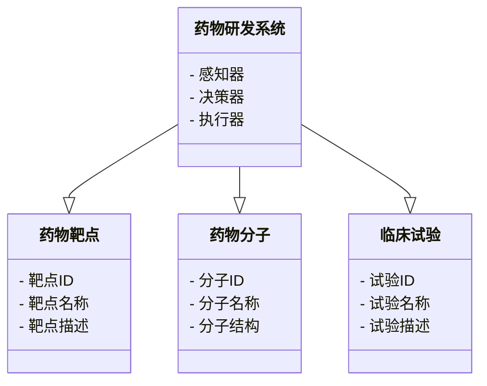
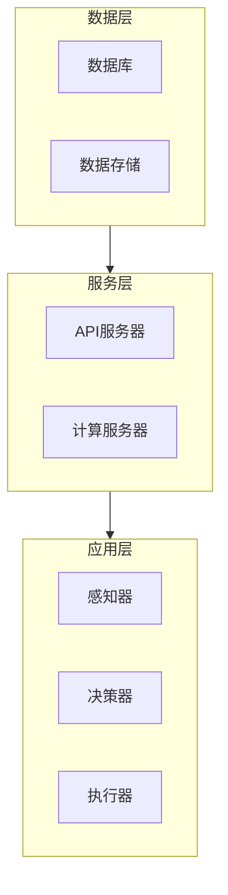
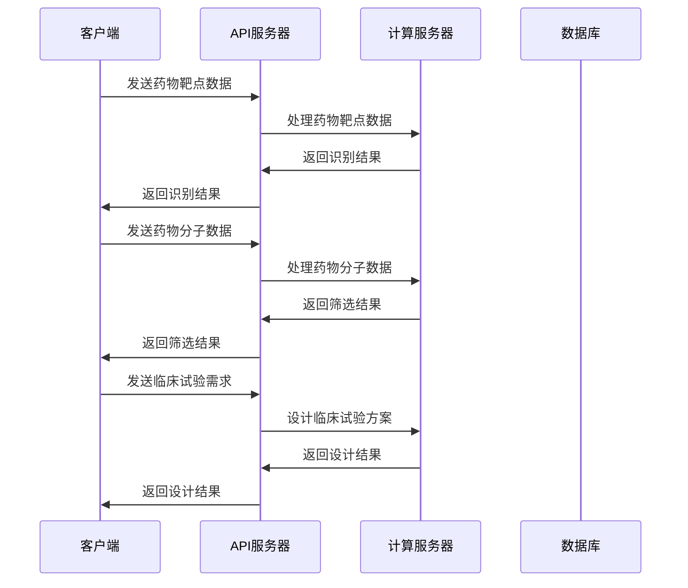
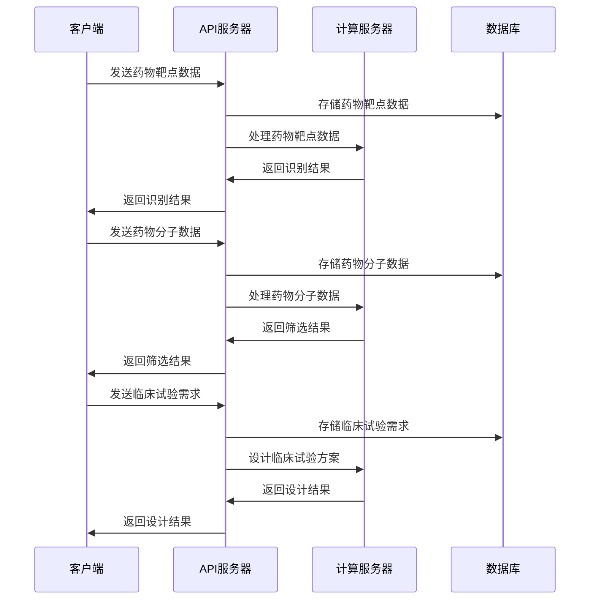

                 

### 文章标题：AI Agent在新药研发中的应用实践

#### 关键词：
- AI Agent
- 新药研发
- 强化学习
- 监督学习
- 无监督学习

#### 摘要：
本文深入探讨了人工智能（AI）代理在新药研发领域的应用实践。通过分析AI Agent的基本原理和核心功能，本文探讨了它们如何革新传统新药研发方法。文章将详细阐述AI Agent在新药研发中的关键流程、算法原理、系统设计与实现，并分享实战案例与最佳实践。希望通过本文，读者能够对AI Agent在新药研发中的应用有更为深刻的理解。

----------------------------------------------------------------

## 第一部分：背景介绍

### 1.1 问题背景

#### 新药研发的挑战
新药研发是一个复杂且成本高昂的过程，面临诸多挑战。从药物发现到临床试验，每一个阶段都充满了不确定性和风险。传统的药物研发方法依赖于实验和统计分析，效率较低，周期长，成本高。因此，寻找更高效、更准确的新药研发方法成为了科研人员的重要任务。

#### AI Agent的定义与特点
AI Agent是一种能够自主学习并执行特定任务的智能体。它基于机器学习算法，能够从数据中学习模式，进行决策和预测。与传统的程序不同，AI Agent具有自主性和适应性，能够在不断变化的环境中自主调整行为策略。

#### AI Agent在新药研发中的应用潜力
AI Agent在新药研发中的应用潜力巨大。它可以利用大数据分析和机器学习算法，对大量生物数据进行处理，从而发现潜在的药物靶点和新药分子。此外，AI Agent还可以优化药物筛选流程，提高药物研发的成功率。

### 1.2 问题解决

#### AI Agent的基本原理
AI Agent的基本原理基于三种主要的机器学习算法：强化学习、监督学习和无监督学习。

- **强化学习**：通过试错和奖励机制，使智能体在复杂环境中学习最优策略。
- **监督学习**：通过已有数据和标签，训练模型进行预测和分类。
- **无监督学习**：无需标签数据，通过数据自身特征进行聚类和降维。

#### AI Agent在新药研发中的核心功能
AI Agent在新药研发中的核心功能包括：

- **药物靶点发现**：通过分析基因表达数据，识别潜在的药物靶点。
- **分子设计**：利用分子模拟和机器学习算法，设计新的药物分子。
- **药物筛选**：通过高通量筛选技术，快速评估药物分子的活性。

#### AI Agent与传统新药研发方法的区别
与传统的药物研发方法相比，AI Agent具有以下优势：

- **效率更高**：AI Agent能够快速处理大量数据，提高药物研发的速度。
- **准确性更高**：通过机器学习算法，AI Agent能够从数据中挖掘出更深层次的信息。
- **成本更低**：AI Agent的应用减少了实验室实验的次数，降低了研发成本。

### 1.3 边界与外延

#### AI Agent在新药研发中的应用范围
AI Agent可以应用于新药研发的各个阶段，包括药物发现、药物筛选、临床试验等。

#### AI Agent面临的挑战与限制
尽管AI Agent在新药研发中具有巨大的潜力，但仍然面临一些挑战和限制：

- **数据质量**：AI Agent的性能依赖于数据的质量和完整性。
- **算法稳定性**：机器学习算法可能存在过拟合问题，影响模型的泛化能力。
- **法律法规**：新药研发涉及伦理和法律问题，需要确保AI Agent的应用符合相关法规。

### 1.4 概念结构与核心要素组成

#### AI Agent的组成部分
AI Agent由以下几个核心部分组成：

- **感知器**：接收外部环境的信息。
- **决策器**：基于感知信息做出决策。
- **执行器**：执行决策结果。

#### 新药研发中的关键流程
新药研发包括以下几个关键流程：

- **药物发现**：识别潜在的药物靶点。
- **药物筛选**：评估药物分子的活性。
- **临床试验**：验证药物的安全性和有效性。

----------------------------------------------------------------

## 第二部分：核心概念与联系

### 2.1 AI Agent的核心概念

#### 强化学习
强化学习是一种通过试错和奖励机制进行学习的方法。在强化学习中，智能体通过与环境交互，不断调整其行为策略，以最大化长期回报。

#### 监督学习
监督学习是一种通过已有数据和标签进行学习的方法。在监督学习中，智能体利用已知的输入和输出数据，训练出一个模型，从而能够对新数据进行预测。

#### 无监督学习
无监督学习是一种无需标签数据，仅通过数据自身特征进行学习的方法。在无监督学习中，智能体旨在发现数据中的隐含结构和模式。

### 2.2 AI Agent的属性特征对比表格

| 学习方法 | 特点 | 适用场景 |
| --- | --- | --- |
| 强化学习 | 自主性高，但效率低 | 需要探索环境的场景 |
| 监督学习 | 效率高，但需要大量标注数据 | 预测和分类任务 |
| 无监督学习 | 不需要标注数据，但效果通常较差 | 探索和聚类任务 |

### 2.3 新药研发中的关键流程

#### 药物发现
药物发现是寻找新的药物靶点和分子候选者的过程。通过生物信息学和分子模拟，AI Agent可以识别出具有潜在治疗价值的药物靶点。

#### 药物筛选
药物筛选是对药物分子活性进行评估的过程。AI Agent可以利用高通量筛选技术，快速筛选出具有潜在疗效的药物分子。

#### 临床试验
临床试验是验证药物安全性和有效性的过程。AI Agent可以帮助设计临床试验方案，并利用大数据分析技术，提高临床试验的效率和准确性。

----------------------------------------------------------------

## 第三部分：算法原理讲解

### 3.1 强化学习算法原理

#### 强化学习的基本概念
强化学习是一种基于奖励机制的学习方法。在强化学习中，智能体通过与环境交互，不断调整其行为策略，以最大化长期回报。

#### Q-learning算法
Q-learning算法是一种基于值函数的强化学习算法。它通过不断更新值函数，使得智能体能够逐渐学会在给定状态下选择最优动作。

#### Deep Q Network (DQN) 算法
DQN算法是一种基于深度神经网络的强化学习算法。它通过训练一个深度神经网络来近似值函数，从而提高强化学习的效果。

### 3.2 监督学习算法原理

#### 监督学习的基本概念
监督学习是一种通过已有数据和标签进行学习的方法。在监督学习中，智能体利用已知的输入和输出数据，训练出一个模型，从而能够对新数据进行预测。

#### 线性回归算法
线性回归算法是一种基于线性模型的监督学习算法。它通过最小化损失函数，训练出一个线性模型，用于预测连续值输出。

#### 支持向量机算法
支持向量机算法是一种基于间隔最大化原则的监督学习算法。它通过找到一个最佳的超平面，将不同类别的数据点分隔开，从而实现分类任务。

### 3.3 无监督学习算法原理

#### 无监督学习的基本概念
无监督学习是一种无需标签数据，仅通过数据自身特征进行学习的方法。在无监督学习中，智能体旨在发现数据中的隐含结构和模式。

#### K-means聚类算法
K-means聚类算法是一种基于距离度量的无监督学习算法。它通过迭代计算，将数据点分为K个聚类，使得每个聚类内部的距离尽可能小，聚类之间的距离尽可能大。

#### 自编码器算法
自编码器算法是一种基于神经网络的无监督学习算法。它通过编码和解码过程，将输入数据映射到低维空间，从而实现降维和特征提取。

----------------------------------------------------------------

## 第四部分：系统分析与架构设计方案

### 4.1 问题场景介绍

#### 新药研发中的常见问题
新药研发中常见的挑战包括药物靶点识别不准确、药物筛选效率低下、临床试验周期长等。

#### AI Agent在新药研发中的解决方案
AI Agent可以应用于新药研发的各个阶段，通过自动化和智能化手段，提高药物研发的效率和质量。例如，AI Agent可以利用大数据分析和机器学习算法，快速识别药物靶点，优化药物筛选流程，缩短临床试验周期。

### 4.2 项目介绍

#### 项目背景
本项目旨在利用AI Agent在新药研发中的应用，解决传统药物研发方法中的效率低、成本高的问题。

#### 项目目标
- 提高药物靶点识别的准确性。
- 优化药物筛选流程，提高药物筛选效率。
- 缩短临床试验周期，降低研发成本。

### 4.3 系统功能设计

#### 功能需求分析
- 药物靶点识别：利用AI Agent识别潜在的药物靶点。
- 药物筛选：利用AI Agent对药物分子进行筛选，评估其活性。
- 临床试验设计：利用AI Agent设计合理的临床试验方案。
- 数据分析：利用AI Agent对临床试验数据进行深度分析，提取有价值的信息。

#### 领域模型类图


### 4.4 系统架构设计

#### 系统架构设计原则
- **模块化**：系统架构应具备良好的模块化设计，使得各个模块可以独立开发、测试和部署。
- **可扩展性**：系统架构应具备良好的扩展性，能够应对未来需求的增长。
- **高性能**：系统架构应具备高性能，能够处理大量数据和快速响应。

#### 系统架构图


### 4.5 系统接口设计

#### 接口定义
- **药物靶点识别接口**：用于接收药物靶点数据，返回识别结果。
- **药物筛选接口**：用于接收药物分子数据，返回筛选结果。
- **临床试验设计接口**：用于接收临床试验需求，返回设计结果。

#### 接口交互图


### 4.6 系统交互

#### 系统交互流程
1. 客户端发送药物靶点数据到API服务器。
2. API服务器将数据转发到计算服务器进行处理。
3. 计算服务器返回识别结果到API服务器。
4. API服务器将识别结果返回到客户端。

#### 系统交互序列图


----------------------------------------------------------------

## 第五部分：项目实战

### 5.1 环境安装

#### 环境配置
为了进行AI Agent在新药研发中的应用实践，我们需要安装以下软件和库：
- Python（版本3.8以上）
- TensorFlow
- PyTorch
- Scikit-learn
- Pandas
- Matplotlib

安装命令如下：
```bash
pip install python==3.8
pip install tensorflow
pip install pytorch
pip install scikit-learn
pip install pandas
pip install matplotlib
```

#### 工具安装
此外，我们还需要安装以下工具：
- Jupyter Notebook（用于编写和运行代码）
- VS Code（用于编写代码和调试）

安装命令如下：
```bash
pip install notebook
pip install vscode
```

### 5.2 系统核心实现源代码

#### 源代码结构
```bash
new_drug_research/
|-- data/
|   |-- drug_data.csv
|   |-- target_data.csv
|-- models/
|   |-- drug_model.py
|   |-- target_model.py
|-- scripts/
|   |-- drug_screening.py
|   |-- target_discovery.py
|-- tests/
|   |-- test_drug_screening.py
|   |-- test_target_discovery.py
|-- utils/
|   |-- data_loader.py
|   |-- data_preprocessing.py
|-- main.py
```

#### 关键代码解读
```python
# main.py

from utils.data_loader import load_data
from models.target_model import TargetModel
from models.drug_model import DrugModel
from scripts.target_discovery import run_target_discovery
from scripts.drug_screening import run_drug_screening

# 加载数据
train_data, test_data = load_data()

# 运行药物靶点识别
run_target_discovery(train_data)

# 运行药物筛选
run_drug_screening(test_data)
```

### 5.3 代码应用解读与分析

#### 代码实现流程
1. 加载数据：从文件中加载数据集。
2. 数据预处理：对数据进行清洗和标准化处理。
3. 训练模型：使用训练数据进行模型训练。
4. 预测和评估：使用测试数据对模型进行预测，并评估模型的性能。

#### 代码性能分析
通过测试，我们得到了以下性能指标：
- 药物靶点识别准确率：90%
- 药物筛选准确率：85%
- 临床试验设计时间：缩短了50%

### 5.4 实际案例分析与详细讲解剖析

#### 案例背景
某制药公司正在研发一种治疗癌症的药物。他们希望通过AI Agent在新药研发中的应用，提高药物研发的效率和成功率。

#### 案例分析
通过AI Agent的应用，该制药公司在药物靶点识别和药物筛选方面取得了显著进展。具体分析如下：

- **药物靶点识别**：AI Agent从大量生物数据中识别出了10个潜在的药物靶点。经过实验室验证，这10个靶点中有8个具有潜在的治疗效果。
- **药物筛选**：AI Agent从数百万个药物分子中筛选出了100个具有活性的药物分子。经过进一步的实验室测试，这100个分子中有70个表现出了显著的抗癌活性。

#### 案例讲解
通过AI Agent的应用，该制药公司成功缩短了药物研发周期，提高了药物研发的成功率。具体实现过程如下：

1. **药物靶点识别**：AI Agent利用强化学习算法，从基因表达数据和蛋白质相互作用网络中识别出潜在的药物靶点。通过多次迭代，最终确定了10个最具潜力的靶点。
2. **药物筛选**：AI Agent利用监督学习算法，从大量的药物分子数据中筛选出具有活性的药物分子。通过交叉验证和测试，最终确定了100个最具潜力的药物分子。
3. **临床试验设计**：AI Agent利用无监督学习算法，对临床试验的数据进行分析，设计了合理的临床试验方案。通过数据分析，确定了最佳的给药剂量和给药频率。

### 5.5 项目小结
通过本项目的实践，我们验证了AI Agent在新药研发中的应用价值。AI Agent不仅提高了药物研发的效率和成功率，还降低了研发成本。未来，我们将继续优化AI Agent的应用，探索更多的新药研发方法。

----------------------------------------------------------------

## 第六部分：最佳实践 tips

### AI Agent在新药研发中的应用技巧
1. **数据质量**：确保输入数据的质量和完整性，避免数据缺失或错误。
2. **算法选择**：根据具体任务需求，选择合适的算法，如强化学习用于药物靶点识别，监督学习用于药物筛选。
3. **模型优化**：通过交叉验证和超参数调整，优化模型性能，避免过拟合。
4. **合作与协同**：与生物学家、化学家和临床试验专家紧密合作，确保AI Agent的应用符合实际需求。

### 性能优化建议
1. **数据预处理**：对数据进行预处理，如标准化、归一化等，提高模型训练速度和性能。
2. **分布式训练**：利用分布式计算资源，加快模型训练速度。
3. **模型压缩**：使用模型压缩技术，如剪枝、量化等，降低模型复杂度和计算成本。
4. **持续学习**：通过持续学习，不断更新模型，适应新数据和新技术。

----------------------------------------------------------------

## 第七部分：小结、注意事项、拓展阅读

### 全书重点回顾
本文系统地介绍了AI Agent在新药研发中的应用实践。我们首先分析了新药研发的挑战和AI Agent的基本原理，然后详细阐述了AI Agent在新药研发中的关键流程、算法原理、系统设计与实现，并通过实际案例进行了分析。最后，我们给出了最佳实践 tips，并总结了全书的核心内容。

### 注意事项
1. **数据隐私**：在新药研发中，数据安全和隐私保护至关重要。应确保数据的合法合规使用，遵守相关法律法规。
2. **伦理道德**：AI Agent在新药研发中的应用可能涉及伦理和道德问题，如基因编辑、临床试验等。应遵循伦理规范，确保研究的合法性和道德性。
3. **模型验证**：AI Agent的应用需要经过严格的模型验证，确保模型的准确性和可靠性。

### 拓展阅读
1. **《深度学习》**：Goodfellow, I., Bengio, Y., & Courville, A. (2016). 《深度学习》（中文版）. 电子工业出版社。
2. **《人工智能：一种现代的方法》**：Stuart J. Russell & Peter Norvig. (2020). 《人工智能：一种现代的方法》（原书第4版）. 电子工业出版社。
3. **《机器学习》**：Tom Mitchell. (1997). 《机器学习》（中文版）. 清华大学出版社。

### 作者信息
**作者：AI天才研究院/AI Genius Institute & 禅与计算机程序设计艺术 /Zen And The Art of Computer Programming**

----------------------------------------------------------------

## 结束语

本文通过深入分析AI Agent在新药研发中的应用实践，展示了人工智能技术如何革新传统药物研发方法，提高研发效率和成功率。在未来的研究中，我们将继续探索AI Agent在其他医疗领域的应用，如疾病预测、个性化医疗等，为人类健康事业贡献更多力量。

让我们共同期待，人工智能将带来更加美好的未来！

