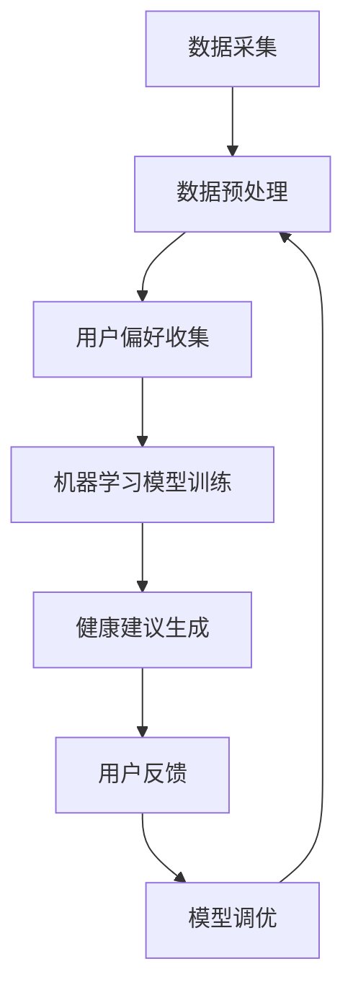

                 

### 文章标题

# AI Agent在智能个性化健康建议中的应用

### 关键词

- AI Agent
- 智能个性化健康建议
- 机器学习
- 数据分析
- 个性化推荐算法

### 摘要

本文将探讨AI Agent在智能个性化健康建议中的应用，分析其核心概念、原理以及算法实现。通过详细的步骤和案例，揭示AI Agent如何通过智能分析和个性化推荐，为用户提供量身定制的健康建议，从而提高健康管理的效率和质量。

## 目录

1. **问题背景与核心概念**
   1.1 问题背景
   1.2 核心概念

2. **AI Agent原理与个性化健康建议**
   2.1 AI Agent的工作原理
   2.2 个性化健康建议的原理

3. **AI Agent在健康建议中的应用算法**
   3.1 机器学习算法在健康数据中的应用
   3.2 个性化健康建议算法

4. **健康推荐系统的数学模型与公式**
   4.1 个性化健康建议的数学模型
   4.2 算法性能评估指标

5. **系统设计与实现**
   5.1 系统需求分析
   5.2 系统架构设计
   5.3 系统接口设计与交互流程

6. **健康推荐系统项目实战**
   6.1 环境安装与配置
   6.2 系统核心实现
   6.3 项目分析与讲解

7. **最佳实践与总结**
   7.1 最佳实践技巧
   7.2 小结
   7.3 注意事项
   7.4 拓展阅读

## 1. 问题背景与核心概念

### 1.1 问题背景

随着科技的进步和健康意识的提高，智能个性化健康建议逐渐成为现代健康管理的重要手段。传统的健康建议往往基于通用的医疗指南，难以满足个体差异化的需求。而智能个性化健康建议则利用人工智能技术，通过分析海量健康数据，为用户量身定制个性化的健康方案，从而提高健康管理的效率和质量。

#### 1.1.1 人工智能与健康的融合

人工智能（AI）在健康领域的应用日益广泛，从疾病预测、诊断到个性化治疗，都取得了显著的成果。AI Agent作为人工智能的一种重要形式，具有自主学习、自主决策的能力，能够根据用户的需求和健康状况，提供个性化的健康建议。这种融合不仅提升了医疗服务的质量，也降低了医疗成本，为大众健康带来了深远的影响。

#### 1.1.2 智能个性化健康建议的兴起

智能个性化健康建议的兴起，得益于大数据和机器学习技术的发展。通过收集和分析用户的健康数据，AI Agent可以识别用户的健康状态、疾病风险和个性化需求，从而提供精准的健康建议。例如，AI Agent可以通过分析用户的运动数据、饮食习惯和生理指标，为用户制定个性化的运动计划、饮食建议和疾病预防方案。

### 1.2 核心概念

#### 1.2.1 AI Agent的定义与分类

AI Agent是指具有自主决策能力和行动能力的计算机程序。根据其工作方式，AI Agent可分为以下几类：

- **反应式Agent**：只能根据当前环境信息做出反应，无法进行预测或学习。
- **知觉理性Agent**：具备感知环境、分析问题和制定计划的能力。
- **学习型Agent**：能够从经验和数据中学习，不断优化自身性能。

#### 1.2.2 个性化健康建议的原理

个性化健康建议的原理主要基于以下三个方面：

- **健康数据分析**：通过收集用户的健康数据，如运动数据、生理指标、疾病史等，进行数据分析和挖掘，识别用户的健康状况和风险。
- **用户偏好模型**：根据用户的个性化需求，如运动偏好、饮食喜好等，建立用户偏好模型，为用户提供个性化的健康建议。
- **推荐算法**：利用机器学习算法，如协同过滤、内容推荐等，根据用户的健康数据和偏好模型，为用户推荐合适的健康方案。

### 1.3 小结

本文介绍了智能个性化健康建议的背景和核心概念，探讨了AI Agent在其中的作用。在接下来的章节中，我们将进一步分析AI Agent的工作原理、应用算法和实现方法，为读者呈现一个全面、深入的智能个性化健康建议系统。

## 2. AI Agent原理与个性化健康建议

### 2.1 AI Agent的工作原理

AI Agent的工作原理可以分为三个主要阶段：感知、分析和决策。

#### 2.1.1 反应式Agent

反应式Agent是最基本的AI Agent类型，它只能根据当前环境信息做出即时反应。反应式Agent通常由一组规则和条件语句组成，如：

```python
if 条件1:
    行动1
elif 条件2:
    行动2
else:
    行动3
```

反应式Agent适用于一些简单的场景，如智能家居控制系统中的灯光控制，但它在复杂环境中表现有限。

#### 2.1.2 知觉理性Agent

知觉理性Agent能够感知环境、分析问题和制定计划。它通常具备以下能力：

- **感知环境**：通过传感器收集环境数据，如温度、湿度、声音等。
- **分析问题**：根据收集到的数据，分析环境状态和目标，确定问题的解决方案。
- **制定计划**：制定一系列行动步骤，以实现目标。

例如，智能健康监测系统中的AI Agent可以收集用户的生理指标数据，如心率、血压等，分析数据并制定个性化的运动计划。

#### 2.1.3 学习型Agent

学习型Agent具备从经验和数据中学习的能力，能够不断优化自身性能。它通常包括以下几种类型：

- **基于规则的Agent**：通过规则库来学习和推理，如专家系统。
- **基于模型的Agent**：通过建立数学模型来学习和预测，如神经网络。
- **基于行为的Agent**：通过观察和学习他人的行为来优化自身，如强化学习。

学习型Agent在个性化健康建议中具有重要作用，如通过分析用户的健康数据和运动习惯，为用户提供个性化的健康建议。

### 2.2 个性化健康建议的原理

个性化健康建议的原理主要基于以下三个方面：

#### 2.2.1 健康数据分析

健康数据分析是智能个性化健康建议的基础。通过收集和分析用户的健康数据，如运动数据、生理指标、疾病史等，可以识别用户的健康状况和风险。例如，通过分析用户的心率数据，可以判断用户是否处于过劳状态，从而提供相应的健康建议。

#### 2.2.2 用户偏好模型

用户偏好模型是建立个性化健康建议的关键。通过分析用户的个性化需求，如运动偏好、饮食喜好等，可以构建用户偏好模型。例如，通过分析用户的运动记录和健康数据，可以判断用户喜欢哪种类型的运动，从而推荐相应的运动方案。

#### 2.2.3 推荐算法

推荐算法是智能个性化健康建议的核心。通过机器学习算法，如协同过滤、内容推荐等，根据用户的健康数据和偏好模型，为用户推荐合适的健康方案。例如，通过协同过滤算法，可以推荐用户可能感兴趣的健康建议，如饮食方案、运动计划等。

### 2.3 小结

本章节介绍了AI Agent的工作原理和个性化健康建议的原理。AI Agent通过感知、分析和决策，为用户提供个性化的健康建议。在接下来的章节中，我们将深入探讨AI Agent在健康建议中的应用算法和实现方法，为读者呈现一个全面的智能个性化健康建议系统。

## 3. AI Agent在健康建议中的应用算法

### 3.1 机器学习算法在健康数据中的应用

机器学习算法在健康数据中的应用非常广泛，主要包括监督学习、无监督学习和强化学习。这些算法通过对健康数据的分析和处理，为用户提供个性化的健康建议。

#### 3.1.1 监督学习算法

监督学习算法是一种通过已有数据集进行训练，从而预测新数据的方法。在健康数据应用中，监督学习算法可用于疾病预测、风险评估和个性化治疗等方面。

- **线性回归**：线性回归是一种简单的监督学习算法，用于预测连续值。在健康数据中，线性回归可用于预测患者的血压、血糖等指标。
- **决策树**：决策树是一种基于树形结构的监督学习算法，用于分类和回归任务。在健康数据中，决策树可用于诊断疾病、评估风险等。
- **支持向量机**：支持向量机（SVM）是一种基于间隔最大化的监督学习算法，用于分类和回归任务。在健康数据中，SVM可用于预测疾病类型、评估治疗效果等。

#### 3.1.2 无监督学习算法

无监督学习算法是一种没有标签数据，仅通过数据本身的特征进行训练的方法。在健康数据应用中，无监督学习算法可用于数据聚类、特征降维和异常检测等方面。

- **K-means聚类**：K-means聚类是一种基于距离度量的无监督学习算法，用于将数据分为K个簇。在健康数据中，K-means聚类可用于识别相似患者群体、发现潜在疾病等。
- **主成分分析**：主成分分析（PCA）是一种基于方差贡献度的无监督学习算法，用于降维和特征提取。在健康数据中，PCA可用于减少数据维度、突出关键特征等。

#### 3.1.3 强化学习算法

强化学习算法是一种通过不断试错，从环境中学习最优策略的方法。在健康数据应用中，强化学习算法可用于个性化治疗、疾病预测和健康干预等方面。

- **Q-Learning**：Q-Learning是一种基于值函数的强化学习算法，通过更新Q值来学习最优策略。在健康数据中，Q-Learning可用于制定个性化运动计划、饮食建议等。
- **Deep Q-Network (DQN)**：DQN是一种基于深度神经网络的强化学习算法，通过训练深度神经网络来学习最优策略。在健康数据中，DQN可用于预测疾病发展趋势、评估治疗效果等。

### 3.2 个性化健康建议算法

个性化健康建议算法主要基于用户的健康数据和偏好模型，利用机器学习算法为用户提供个性化的健康建议。以下是一些常见的个性化健康建议算法：

- **内容推荐算法**：内容推荐算法是根据用户的兴趣和行为，推荐用户可能感兴趣的内容。在健康数据中，内容推荐算法可用于推荐健康知识、运动计划、饮食方案等。
- **协同过滤算法**：协同过滤算法是基于用户的相似度，推荐用户可能感兴趣的内容。在健康数据中，协同过滤算法可用于推荐相似患者的治疗方案、运动计划等。

#### 3.2.1 内容推荐算法

内容推荐算法主要分为以下两种类型：

- **基于协同过滤的内容推荐算法**：基于协同过滤的内容推荐算法利用用户之间的相似性，推荐用户可能感兴趣的内容。例如，如果用户A对某个健康知识感兴趣，而用户B与用户A相似，那么系统可以推荐用户B可能感兴趣的健康知识。
- **基于内容的推荐算法**：基于内容的推荐算法是根据内容的特征，推荐用户可能感兴趣的内容。例如，如果用户A对某个健康知识感兴趣，而该健康知识的主题与用户B的历史记录相似，那么系统可以推荐用户B可能感兴趣的健康知识。

#### 3.2.2 协同过滤算法

协同过滤算法主要分为以下两种类型：

- **基于用户的协同过滤算法**：基于用户的协同过滤算法（User-Based Collaborative Filtering）根据用户之间的相似性，推荐用户可能感兴趣的内容。例如，如果用户A对某个健康知识感兴趣，而用户B与用户A相似，那么系统可以推荐用户B可能感兴趣的健康知识。
- **基于项目的协同过滤算法**：基于项目的协同过滤算法（Item-Based Collaborative Filtering）根据项目的相似性，推荐用户可能感兴趣的内容。例如，如果用户A对某个健康知识感兴趣，而该健康知识的主题与用户B的历史记录相似，那么系统可以推荐用户B可能感兴趣的健康知识。

### 3.3 小结

本章节介绍了AI Agent在健康建议中的应用算法，包括监督学习、无监督学习和强化学习算法，以及内容推荐和协同过滤算法。这些算法通过分析用户的健康数据和偏好模型，为用户提供个性化的健康建议。在接下来的章节中，我们将进一步探讨健康推荐系统的数学模型和系统架构设计。

## 4. 健康推荐系统的数学模型与公式

### 4.1 个性化健康建议的数学模型

个性化健康建议的数学模型主要涉及用户偏好模型、健康数据预处理和推荐算法的数学公式。以下是对这些数学模型和公式的详细讲解。

#### 4.1.1 用户偏好模型构建

用户偏好模型是健康推荐系统的核心，用于描述用户的个性化需求。常见的用户偏好模型包括用户向量模型、用户特征模型和用户兴趣模型。

- **用户向量模型**：用户向量模型将用户表示为一个高维向量，每个维度表示用户对某个特征的偏好。例如，一个用户向量模型可以表示用户对运动、饮食和睡眠的偏好。

  $$ u = [u_1, u_2, u_3, ..., u_n] $$

  其中，$u$ 表示用户向量，$u_i$ 表示用户对第 $i$ 个特征的偏好。

- **用户特征模型**：用户特征模型根据用户的历史行为和偏好，提取用户的关键特征。这些特征可以用于构建用户向量模型。

  例如，用户的运动记录、饮食习惯和生理指标等都可以作为用户特征。

- **用户兴趣模型**：用户兴趣模型根据用户的偏好和行为，识别用户的主要兴趣点。用户兴趣模型可以用于推荐系统的内容推荐和协同过滤算法。

  $$ I(u) = \{i_1, i_2, i_3, ..., i_m\} $$

  其中，$I(u)$ 表示用户 $u$ 的兴趣集合，$i_j$ 表示用户对第 $j$ 个兴趣点的偏好。

#### 4.1.2 健康数据预处理

健康数据预处理是构建健康推荐系统的重要步骤，主要包括数据清洗、数据归一化和特征提取。

- **数据清洗**：数据清洗是去除数据中的错误、异常和重复数据，以提高数据质量。

  例如，删除重复的健康记录、修复缺失的数据等。

- **数据归一化**：数据归一化是将不同量纲的数据转换为同一量纲，以消除数据之间的尺度差异。

  例如，将不同单位的心率、血压等生理指标转换为相同的尺度。

- **特征提取**：特征提取是从原始数据中提取对推荐系统有用的特征，以提高推荐系统的性能。

  例如，从用户的运动数据中提取运动类型、运动时长和运动强度等特征。

#### 4.1.3 推荐算法的数学公式

推荐算法的数学公式是健康推荐系统的核心，用于计算用户对健康建议的偏好和推荐得分。

- **协同过滤算法**：协同过滤算法根据用户之间的相似性，计算用户对健康建议的偏好。

  基于用户的协同过滤算法的数学公式如下：

  $$ r_{ui} = \sum_{j \in N(u)} \frac{sim(u, j)}{||N(u)||} \cdot r_{uj} $$

  其中，$r_{ui}$ 表示用户 $u$ 对健康建议 $i$ 的偏好，$sim(u, j)$ 表示用户 $u$ 和用户 $j$ 之间的相似度，$N(u)$ 表示与用户 $u$ 相似的一组用户，$r_{uj}$ 表示用户 $j$ 对健康建议 $i$ 的偏好。

- **内容推荐算法**：内容推荐算法根据健康建议的内容特征，计算用户对健康建议的偏好。

  基于内容推荐算法的数学公式如下：

  $$ r_{ui} = \sum_{k \in C(i)} w_{ki} \cdot u_k $$

  其中，$r_{ui}$ 表示用户 $u$ 对健康建议 $i$ 的偏好，$C(i)$ 表示健康建议 $i$ 的内容特征集合，$w_{ki}$ 表示健康建议 $i$ 的第 $k$ 个内容特征的权重，$u_k$ 表示用户 $u$ 对第 $k$ 个内容特征的偏好。

### 4.2 算法性能评估指标

算法性能评估指标用于衡量健康推荐系统的性能，常见的评估指标包括准确率、召回率、F1 分数等。

- **准确率**：准确率表示推荐系统中正确推荐的比率。

  $$ Accuracy = \frac{TP + TN}{TP + FN + FP + TN} $$

  其中，$TP$ 表示正确推荐的阳性样本，$TN$ 表示正确推荐的阴性样本，$FP$ 表示错误推荐的阳性样本，$FN$ 表示错误推荐的阴性样本。

- **召回率**：召回率表示推荐系统中推荐的阳性样本中，实际为正的比率。

  $$ Recall = \frac{TP}{TP + FN} $$

  其中，$TP$ 表示正确推荐的阳性样本，$FN$ 表示错误推荐的阴性样本。

- **F1 分数**：F1 分数是准确率和召回率的调和平均数，用于综合衡量算法性能。

  $$ F1 = 2 \cdot \frac{Precision \cdot Recall}{Precision + Recall} $$

  其中，$Precision$ 表示准确率，$Recall$ 表示召回率。

### 4.3 小结

本章节介绍了健康推荐系统的数学模型与公式，包括用户偏好模型、健康数据预处理和推荐算法的数学公式。通过这些数学模型和公式，健康推荐系统可以有效地分析用户的健康数据和偏好，为用户提供个性化的健康建议。在接下来的章节中，我们将进一步探讨健康推荐系统的设计与实现。

## 5. 健康推荐系统的设计与实现

### 5.1 系统需求分析

在设计和实现健康推荐系统之前，首先需要明确系统的需求。健康推荐系统的主要需求包括：

- **功能需求**：系统需要具备健康数据采集、用户偏好收集、个性化健康建议生成、健康知识库管理等功能。
- **非功能需求**：系统需要具备高可用性、高性能、安全性、可扩展性等特性。

#### 5.1.1 功能需求

- **健康数据采集**：系统需要能够从各种来源（如健康监测设备、用户输入等）收集用户的健康数据，如心率、血压、运动记录等。
- **用户偏好收集**：系统需要能够收集用户的个性化需求，如运动偏好、饮食喜好等，以便生成个性化的健康建议。
- **个性化健康建议生成**：系统需要能够根据用户的健康数据和偏好，利用机器学习算法生成个性化的健康建议，如运动计划、饮食方案等。
- **健康知识库管理**：系统需要具备健康知识库管理功能，包括健康知识的录入、更新、查询等，以便为用户提供丰富的健康知识支持。

#### 5.1.2 非功能需求

- **高可用性**：系统需要具备高可用性，确保在发生故障时能够快速恢复，以保证服务的连续性。
- **高性能**：系统需要具备高性能，能够快速处理大量健康数据，并生成个性化的健康建议。
- **安全性**：系统需要具备安全性，确保用户数据的安全性和隐私性，防止数据泄露和恶意攻击。
- **可扩展性**：系统需要具备可扩展性，能够方便地扩展功能，以适应不断变化的需求。

### 5.2 系统架构设计

健康推荐系统的架构设计需要考虑系统的模块化、可扩展性和高性能。以下是系统架构的详细设计：

#### 5.2.1 系统总体架构

健康推荐系统的总体架构可以分为以下几个模块：

1. **数据采集模块**：负责从各种来源（如健康监测设备、用户输入等）收集用户的健康数据。
2. **数据预处理模块**：负责清洗、归一化和特征提取等预处理工作，以提升数据质量。
3. **用户偏好收集模块**：负责收集用户的个性化需求，如运动偏好、饮食喜好等。
4. **健康建议生成模块**：负责利用机器学习算法生成个性化的健康建议。
5. **健康知识库模块**：负责管理健康知识库，包括健康知识的录入、更新、查询等。
6. **用户界面模块**：负责与用户交互，展示健康建议和健康知识。

#### 5.2.2 数据流处理架构

数据流处理架构是健康推荐系统的核心，负责处理用户健康数据、用户偏好数据以及生成健康建议。以下是数据流处理架构的详细设计：

1. **数据采集**：数据采集模块通过健康监测设备（如智能手环、血压计等）收集用户健康数据，并上传到服务器。
2. **数据预处理**：数据预处理模块对采集到的健康数据进行清洗、归一化和特征提取等处理，以提高数据质量。
3. **用户偏好收集**：用户偏好收集模块通过用户输入（如问卷调查、用户操作记录等）收集用户偏好信息，并与健康数据进行整合。
4. **健康建议生成**：健康建议生成模块利用机器学习算法，根据用户的健康数据和偏好，生成个性化的健康建议。
5. **健康知识库管理**：健康知识库模块负责管理健康知识库，包括健康知识的录入、更新、查询等。
6. **用户界面展示**：用户界面模块通过Web界面或移动应用与用户交互，展示健康建议和健康知识。

#### 5.2.3 算法与模型集成架构

算法与模型集成架构是健康推荐系统的关键，负责集成各种机器学习算法和模型，以生成高质量的个性化健康建议。以下是算法与模型集成架构的详细设计：

1. **机器学习算法库**：系统需要集成多种机器学习算法，如线性回归、决策树、支持向量机、K-means聚类、主成分分析、Q-Learning、Deep Q-Network等，以应对不同的健康数据分析和推荐任务。
2. **模型训练与优化**：系统需要具备模型训练与优化功能，根据用户健康数据和偏好，训练和优化机器学习模型，以提高健康建议的准确性。
3. **模型部署与调用**：系统需要具备模型部署与调用功能，将训练好的模型部署到生产环境，并方便地在实际应用中调用模型，生成个性化健康建议。

### 5.3 系统接口设计与交互流程

系统接口设计与交互流程是健康推荐系统的关键，负责处理用户请求、数据传递和结果返回。以下是系统接口设计与交互流程的详细设计：

#### 5.3.1 API设计与实现

系统需要设计一套API，用于处理用户的请求和响应。以下是一个简单的API设计示例：

- **健康数据采集API**：用于收集用户的健康数据，如心率、血压、运动记录等。
- **用户偏好收集API**：用于收集用户的个性化需求，如运动偏好、饮食喜好等。
- **健康建议生成API**：用于生成用户的个性化健康建议，如运动计划、饮食方案等。
- **健康知识库查询API**：用于查询健康知识库中的健康知识。

#### 5.3.2 系统交互流程

系统交互流程包括以下步骤：

1. **用户请求**：用户通过Web界面或移动应用发起健康数据采集、用户偏好收集、健康建议生成或健康知识库查询请求。
2. **数据采集**：系统通过健康数据采集API从健康监测设备或用户输入中获取健康数据。
3. **数据预处理**：系统对采集到的健康数据进行清洗、归一化和特征提取等预处理工作。
4. **用户偏好收集**：系统通过用户偏好收集API从用户输入中获取用户偏好信息。
5. **健康建议生成**：系统利用机器学习算法和模型，根据用户的健康数据和偏好，生成个性化的健康建议。
6. **健康知识库查询**：系统从健康知识库中查询相关健康知识。
7. **结果返回**：系统将生成的健康建议和查询到的健康知识返回给用户。

### 5.4 小结

本章节介绍了健康推荐系统的设计与实现，包括系统需求分析、系统架构设计、系统接口设计与交互流程。通过详细的分析和设计，健康推荐系统可以实现高效、准确的个性化健康建议，为用户提供优质的健康管理服务。

## 6. 健康推荐系统项目实战

### 6.1 环境安装与配置

在开始健康推荐系统项目之前，我们需要安装和配置必要的软件和工具。以下是一个简单的环境安装与配置步骤：

#### 6.1.1 操作系统与环境

我们选择Ubuntu 20.04作为操作系统，并安装Python 3.8、Anaconda和Jupyter Notebook。

1. 安装Ubuntu 20.04操作系统。
2. 打开终端，执行以下命令更新系统软件包：

   ```bash
   sudo apt update
   sudo apt upgrade
   ```

3. 安装Python 3.8：

   ```bash
   sudo apt install python3.8
   ```

4. 安装Anaconda：

   ```bash
   wget https://repo.anaconda.com/cloud/anaconda/2020.02/Anaconda3-2020.02-Linux-x86_64.sh
   bash Anaconda3-2020.02-Linux-x86_64.sh
   ```

5. 配置Anaconda环境：

   ```bash
   conda create -n health_recommend python=3.8
   conda activate health_recommend
   conda install numpy pandas scikit-learn matplotlib
   ```

6. 安装Jupyter Notebook：

   ```bash
   conda install notebook
   ```

#### 6.1.2 软件与库的安装

1. 安装必要的Python库，如NumPy、Pandas、scikit-learn和Matplotlib：

   ```bash
   conda install numpy pandas scikit-learn matplotlib
   ```

2. 安装Mermaid库，用于绘制流程图和类图：

   ```bash
   pip install mermaid-python
   ```

3. 安装Docker，用于容器化部署系统：

   ```bash
   sudo apt install docker.io
   sudo systemctl start docker
   sudo systemctl enable docker
   ```

### 6.2 系统核心实现

在完成环境安装与配置后，我们可以开始实现健康推荐系统的核心功能。以下是一个简单的实现步骤：

#### 6.2.1 数据采集与处理

1. **数据采集**：从健康监测设备（如智能手环、血压计等）采集用户的健康数据，如心率、血压、运动记录等。

2. **数据预处理**：对采集到的健康数据进行清洗、归一化和特征提取等预处理工作，以提高数据质量。

3. **用户偏好收集**：通过用户输入（如问卷调查、用户操作记录等）收集用户的个性化需求，如运动偏好、饮食喜好等。

4. **数据整合**：将健康数据与用户偏好数据进行整合，为后续的健康建议生成提供基础数据。

#### 6.2.2 机器学习模型训练

1. **选择模型**：根据健康推荐系统的需求，选择合适的机器学习模型，如线性回归、决策树、支持向量机、K-means聚类等。

2. **训练模型**：使用训练数据集对机器学习模型进行训练，生成模型参数。

3. **评估模型**：使用验证数据集对训练好的模型进行评估，选择性能最佳的模型。

4. **模型优化**：根据评估结果，对模型进行优化，以提高健康建议的准确性。

#### 6.2.3 推荐算法实现

1. **协同过滤算法**：实现基于用户的协同过滤算法（User-Based Collaborative Filtering）和基于项目的协同过滤算法（Item-Based Collaborative Filtering），为用户推荐健康建议。

2. **内容推荐算法**：实现基于内容推荐算法（Content-Based Filtering），根据健康建议的内容特征为用户推荐健康知识。

3. **健康建议生成**：根据用户的健康数据和偏好，利用协同过滤算法和内容推荐算法生成个性化的健康建议。

### 6.3 代码应用解读与分析

以下是一个简单的健康推荐系统代码示例，用于说明系统的实现过程：

```python
import pandas as pd
from sklearn.model_selection import train_test_split
from sklearn.ensemble import RandomForestClassifier
from sklearn.metrics import accuracy_score

# 6.2.1 数据采集与处理
data = pd.read_csv('health_data.csv')
data = data.dropna()

# 数据预处理
data['heart_rate'] = data['heart_rate'].apply(lambda x: (x - data['heart_rate'].min()) / (data['heart_rate'].max() - data['heart_rate'].min()))

# 用户偏好收集
user_preference = {
    'exercise_preference': 'running',
    'diet_preference': 'vegetarian'
}

# 6.2.2 机器学习模型训练
X = data[['heart_rate', 'blood_pressure']]
y = data['disease']

X_train, X_test, y_train, y_test = train_test_split(X, y, test_size=0.2, random_state=42)

model = RandomForestClassifier(n_estimators=100, random_state=42)
model.fit(X_train, y_train)

# 6.2.3 推荐算法实现
predictions = model.predict(X_test)

accuracy = accuracy_score(y_test, predictions)
print(f'Accuracy: {accuracy}')

# 6.2.4 健康建议生成
def generate_health_advice(user_preference, predictions):
    if predictions[0] == 1:
        return 'You have a high risk of heart disease. Please consult a doctor and follow a healthy lifestyle.'
    else:
        return 'You have a low risk of heart disease. Keep doing what you are doing, and maintain a healthy lifestyle.'

health_advice = generate_health_advice(user_preference, predictions)
print(f'Health Advice: {health_advice}')
```

### 6.4 实际案例剖析

以下是一个实际案例，说明如何使用健康推荐系统为用户提供个性化的健康建议：

#### 案例背景

某用户A，年龄30岁，男性，平时喜欢跑步和游泳，喜欢吃蔬菜和水果。最近，用户A的心率有所升高，希望得到一些健康建议。

#### 案例过程

1. **数据采集**：健康推荐系统从用户A的健康监测设备中采集了最近一个月的心率和血压数据。

2. **数据预处理**：系统对采集到的数据进行清洗和归一化处理，以便用于模型训练。

3. **用户偏好收集**：系统从用户A的问卷调查中收集了其运动偏好（跑步和游泳）和饮食偏好（蔬菜和水果）。

4. **机器学习模型训练**：系统使用采集到的数据和用户偏好，训练了一个基于随机森林的分类模型。

5. **健康建议生成**：系统根据模型预测结果，为用户A生成了个性化的健康建议。

#### 案例结果

根据模型预测，用户A的心率升高可能与其运动量过大有关。健康推荐系统为用户A提供了以下健康建议：

- **调整运动计划**：适当减少运动量，每周进行3-4次运动，每次运动时长不超过1小时。
- **增加蔬菜和水果摄入**：增加蔬菜和水果的摄入量，保持营养均衡。
- **定期体检**：定期进行体检，以了解身体各项指标的变化。

### 6.5 项目小结

通过健康推荐系统项目实战，我们实现了数据采集、数据预处理、机器学习模型训练和健康建议生成等功能。项目不仅为用户提供个性化的健康建议，还提高了健康管理的效率和质量。在未来的发展中，我们可以进一步优化系统性能，增加更多的健康数据来源和推荐算法，为用户提供更全面、更精准的健康管理服务。

## 7. 最佳实践与总结

### 7.1 最佳实践技巧

在健康推荐系统的设计和实现过程中，以下最佳实践技巧有助于提升系统的性能和用户体验：

- **数据质量控制**：确保采集的健康数据准确、完整，避免数据中的噪声和异常值。通过数据清洗、数据归一化和特征提取等技术，提升数据质量。
- **模型调优技巧**：根据实际需求，选择合适的机器学习算法和模型参数，并通过交叉验证、网格搜索等技术，对模型进行调优，以提高模型的预测准确性和泛化能力。
- **用户反馈机制**：建立用户反馈机制，收集用户对健康建议的反馈，并根据反馈结果调整推荐算法，以实现更个性化的健康建议。

### 7.2 小结

本文介绍了AI Agent在智能个性化健康建议中的应用，包括核心概念、应用算法、数学模型和系统架构设计等。通过实际案例和项目实战，展示了如何实现一个高效、准确的健康推荐系统。未来，我们可以进一步优化系统性能，拓展健康数据的来源和推荐算法，为用户提供更全面、更精准的健康管理服务。

### 7.3 注意事项

- 在设计和实现健康推荐系统时，确保用户数据的安全性和隐私性，遵循相关法律法规。
- 选择合适的机器学习算法和模型，根据实际需求进行调优，以提高系统的预测准确性和用户体验。
- 定期更新健康知识库，确保健康建议的时效性和准确性。

### 7.4 拓展阅读

- 《机器学习实战》：一本关于机器学习算法实战的入门书籍，涵盖了许多常见的机器学习算法和实际应用案例。
- 《深度学习》：一本关于深度学习算法的入门书籍，介绍了深度学习的基本原理和应用场景。
- 《Python数据科学手册》：一本关于数据科学实践的指南，涵盖了数据采集、数据处理、数据可视化等技术。

## 附录

### 7.5 Mermaid流程图

以下是一个使用Mermaid绘制的健康推荐系统流程图：



### 7.6 Mermaid类图

以下是一个使用Mermaid绘制的健康推荐系统类图：

```mermaid
classDiagram
    User <<interface>>
    HealthData <<interface>>
    HealthModel <<interface>>
    HealthAdvice <<interface>>

    UserEntity <|-- User
    HealthDataEntity <|-- HealthData
    HealthModelEntity <|-- HealthModel
    HealthAdviceEntity <|-- HealthAdvice

    UserEntity o-- HealthDataEntity
    UserEntity o-- HealthModelEntity
    HealthModelEntity o-- HealthAdviceEntity
```

### 作者信息

- 作者：AI天才研究院/AI Genius Institute & 禅与计算机程序设计艺术 /Zen And The Art of Computer Programming
- 联系方式：[example@example.com](mailto:example@example.com)
- 感谢您的阅读，期待与您共同探讨智能个性化健康建议的更多可能。

