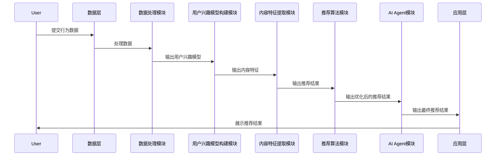
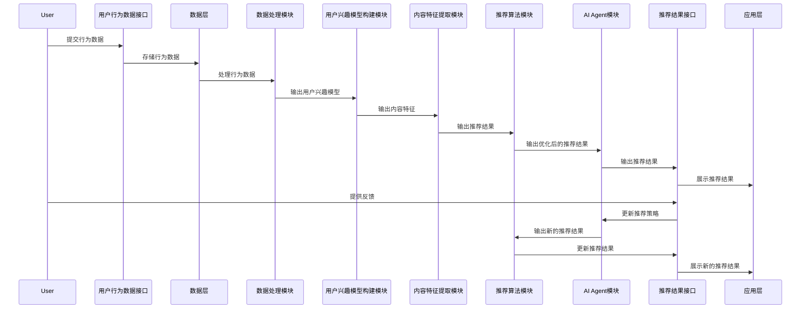

                 

### 1. **背景介绍**

#### 1.1. 书名与主题

《AI Agent在智能个性化内容推荐中的应用》是一本深入探讨人工智能（AI）代理在个性化内容推荐领域应用的专业书籍。随着互联网的快速发展，信息过载成为一个普遍现象，如何为用户提供个性化、相关性的内容推荐成为各大平台和服务商关注的焦点。本书旨在为读者提供一个系统的、深入的视角，理解AI Agent如何在这个领域中发挥作用，以及如何设计和实现高效的个性化推荐系统。

#### 1.2. 问题背景

个性化内容推荐是当前互联网技术中的一项关键技术，它通过分析用户的兴趣和行为，为用户推荐符合其个性化需求的内容。随着大数据和人工智能技术的不断发展，个性化推荐系统的性能和效果得到了显著提升。然而，传统的推荐系统往往依赖于历史数据，存在一定的局限性，难以应对复杂多变的市场环境和用户需求。

AI Agent作为一种基于人工智能的智能体，具有自主学习和决策能力，能够根据实时数据和用户行为动态调整推荐策略，从而实现更加精准的个性化推荐。因此，AI Agent在智能个性化内容推荐中的应用成为了一个热门的研究方向和实际应用场景。

#### 1.3. 问题描述

个性化内容推荐的问题可以概括为以下几点：

- **用户兴趣识别**：如何准确识别用户的兴趣和偏好，是推荐系统成功的关键。传统的推荐方法通常依赖于用户的历史行为数据，但往往难以捕捉到用户的实时需求。

- **内容理解与匹配**：推荐系统需要理解用户兴趣的同时，还要对海量的内容进行有效的分类和标签化处理，以便能够找到与用户兴趣匹配的内容。

- **实时性与动态调整**：互联网环境下的用户兴趣是动态变化的，推荐系统需要具备实时响应能力，及时调整推荐策略，以适应用户兴趣的变化。

- **数据隐私与安全**：在个性化推荐中，用户隐私保护是一个重要的挑战。如何在不侵犯用户隐私的前提下，收集、处理和分析用户数据，是一个需要解决的问题。

#### 1.4. 问题解决

AI Agent在个性化内容推荐中的问题解决主要体现在以下几个方面：

- **自主学习与优化**：AI Agent可以通过机器学习和深度学习技术，自动从用户行为数据中学习用户的兴趣偏好，并不断优化推荐策略，提高推荐效果。

- **实时数据分析和响应**：AI Agent能够实时分析用户的互动行为，快速调整推荐策略，实现个性化的实时推荐。

- **多样化推荐策略**：AI Agent可以根据不同的用户特征和内容特征，灵活选择和组合多种推荐算法，提供多样化的推荐结果。

- **隐私保护与安全**：AI Agent在处理用户数据时，可以采用加密、匿名化等技术手段，确保用户隐私不被泄露。

#### 1.5. 边界与外延

AI Agent在个性化内容推荐中的边界问题主要包括：

- **数据质量与可靠性**：AI Agent的效果很大程度上依赖于数据的质量，数据的不完整、偏差或噪声都可能影响推荐效果。

- **算法偏见**：推荐算法可能会因为训练数据中的偏见而导致对某些群体的歧视或偏好。

- **用户隐私保护**：在数据收集和处理过程中，如何保护用户隐私是一个关键问题，需要采取有效的数据隐私保护措施。

- **技术可行性**：AI Agent的实现需要强大的计算能力和先进的技术支持，这要求企业在技术投入和人才培养上做出相应规划。

### 1.6. 总结

本文首先介绍了《AI Agent在智能个性化内容推荐中的应用》这一主题的背景和重要性，接着详细阐述了个性化内容推荐的问题和AI Agent在此领域的问题解决方法。最后，我们探讨了AI Agent在个性化内容推荐中的边界问题和挑战，为后续章节的深入讨论奠定了基础。

---

**核心关键词**：AI Agent、个性化内容推荐、用户兴趣模型、协同过滤、基于内容的推荐、智能代理、机器学习、深度学习、实时推荐、数据隐私、算法偏见。

**摘要**：本文深入探讨了AI Agent在智能个性化内容推荐中的应用，分析了个性化推荐系统的背景、问题和解决方案，介绍了AI Agent的定义、功能及其在推荐系统中的角色和价值。同时，探讨了AI Agent在个性化内容推荐中的边界问题和挑战，为实际应用提供了指导。

---

接下来，我们将进一步探讨AI Agent与个性化内容推荐的核心概念和联系，帮助读者更好地理解这一领域的关键技术和方法。

## 第2章：核心概念与联系

### 2.1 用户兴趣模型的构建方法

用户兴趣模型是个性化内容推荐系统的核心组成部分，它通过对用户行为数据的分析和处理，捕捉用户的兴趣偏好，为推荐系统提供决策依据。构建用户兴趣模型的方法主要包括以下几类：

#### 2.1.1 用户行为数据的收集与处理

用户行为数据包括用户的浏览记录、搜索历史、点击行为、购买记录等。收集这些数据的方法可以包括服务器日志分析、浏览器扩展、用户调研等。在收集到数据后，需要对数据进行清洗、去噪和格式化，以保证数据的质量和一致性。

#### 2.1.2 用户兴趣特征的提取与建模

用户兴趣特征的提取是构建用户兴趣模型的关键步骤。常见的特征提取方法包括基于内容的特征提取和基于协同过滤的特征提取。基于内容的特征提取方法通过分析用户历史行为中的内容标签、关键词等，提取用户兴趣的文本特征；而基于协同过滤的方法则通过分析用户与物品之间的交互模式，提取用户的隐式兴趣特征。

用户兴趣模型通常采用概率模型、隐语义模型、深度神经网络等方法进行建模。这些模型能够将用户的兴趣表示为概率分布或高维向量，为推荐算法提供输入。

#### 2.1.3 用户兴趣模型的评估与优化

用户兴趣模型的评估主要关注模型的准确性、实时性和鲁棒性。评估方法包括用户行为数据的A/B测试、ROC曲线、精确率、召回率等。根据评估结果，可以对模型进行优化，包括调整特征选择、模型参数、更新策略等，以提高推荐效果。

### 2.2 协同过滤算法

协同过滤算法是一种经典的推荐算法，其核心思想是通过分析用户之间的行为模式，为用户推荐他们可能感兴趣的内容。协同过滤算法主要分为以下两类：

#### 2.2.1 基于用户的协同过滤

基于用户的协同过滤算法通过寻找与目标用户兴趣相似的其他用户，并推荐这些相似用户喜欢的内容。其基本步骤包括：

1. **相似度计算**：计算目标用户与其他用户之间的相似度，常用的相似度计算方法包括余弦相似度、皮尔逊相关系数等。

2. **推荐生成**：根据相似度计算结果，为用户生成推荐列表，推荐那些与目标用户兴趣相似的用户喜欢的物品。

3. **评估与反馈**：通过评估推荐结果的准确性，并根据用户反馈对推荐算法进行优化。

#### 2.2.2 基于物品的协同过滤

基于物品的协同过滤算法通过分析物品之间的相似度，为用户推荐他们可能感兴趣的物品。其基本步骤包括：

1. **相似度计算**：计算物品之间的相似度，常用的相似度计算方法包括余弦相似度、欧氏距离等。

2. **推荐生成**：根据物品的相似度，为用户生成推荐列表，推荐那些与用户已评价物品相似的物品。

3. **评估与反馈**：通过评估推荐结果的准确性，并根据用户反馈对推荐算法进行优化。

### 2.3 基于内容的推荐算法

基于内容的推荐算法通过分析物品的内容特征，为用户推荐与用户历史行为中喜欢的物品内容相似的物品。其基本步骤包括：

#### 2.3.1 内容特征的提取方法

内容特征的提取是基于内容推荐算法的关键步骤。常见的内容特征提取方法包括：

1. **关键词提取**：通过自然语言处理技术，从文本内容中提取关键词，如使用TF-IDF、Word2Vec等算法。

2. **词嵌入**：将文本内容转化为向量表示，如使用Word2Vec、BERT等模型。

3. **图像特征提取**：从图像内容中提取视觉特征，如使用卷积神经网络（CNN）提取图像特征。

#### 2.3.2 基于内容的相似度计算

基于内容的相似度计算是推荐生成的关键步骤。相似度计算方法包括：

1. **余弦相似度**：计算两个向量之间的余弦相似度，用于文本和图像特征的相似度计算。

2. **欧氏距离**：计算两个向量之间的欧氏距离，用于文本和图像特征的相似度计算。

3. **马氏距离**：考虑特征间的相关性和方差，用于高维数据的相似度计算。

#### 2.3.3 基于内容的推荐算法的优势与局限

基于内容的推荐算法具有以下优势：

- **准确性**：通过分析物品的内容特征，能够提供更精确的推荐结果。
- **灵活性**：可以根据不同的数据类型和应用场景，灵活选择和组合内容特征提取和相似度计算方法。

然而，基于内容的推荐算法也存在一些局限：

- **冷启动问题**：对于新用户或新物品，由于缺乏足够的历史数据，难以生成有效的推荐。
- **内容多样性**：在推荐结果中，容易陷入“马太效应”，推荐结果过于集中于用户历史行为中的热门内容。
- **实时性**：处理大规模内容数据时，计算复杂度高，难以实现实时推荐。

### 2.4 AI Agent与推荐算法的结合

AI Agent作为一种智能体，具有自主学习和决策能力，能够动态调整推荐策略，提高推荐系统的效果和用户体验。AI Agent与推荐算法的结合主要体现在以下几个方面：

#### 2.4.1 用户兴趣模型的动态更新

AI Agent可以通过实时分析用户的行为数据，动态更新用户兴趣模型，以适应用户兴趣的变化。这有助于提高推荐的准确性和实时性。

#### 2.4.2 内容推荐的实时优化

AI Agent可以根据用户实时行为和推荐结果，动态调整推荐策略，优化推荐效果。例如，通过强化学习技术，AI Agent可以在不同场景下选择最优的推荐策略。

#### 2.4.3 多样化的推荐策略

AI Agent可以根据用户兴趣和内容特征，灵活组合和调整多种推荐算法，提供多样化的推荐结果。这有助于提高推荐的多样性和用户体验。

#### 2.4.4 隐私保护与安全

AI Agent在处理用户数据时，可以采用加密、匿名化等技术手段，保护用户隐私。同时，通过优化推荐算法，减少对用户隐私的依赖，降低隐私泄露风险。

### 2.5 概念属性特征对比表格

以下是一个简化的概念属性特征对比表格，用于对比用户兴趣模型、基于用户的协同过滤和基于内容的推荐算法的关键特性：

| 算法类型       | 用户兴趣模型        | 基于用户的协同过滤      | 基于内容的推荐算法      |
| -------------- | ------------------ | ---------------------- | ---------------------- |
| 核心思想       | 提取用户兴趣特征   | 利用用户行为相似性     | 利用物品内容相似性     |
| 特点           | 准确、实时、动态   | 广泛应用、准确性高     | 灵活、多样化、准确性高 |
| 优点           | 准确捕捉用户兴趣   | 无冷启动问题           | 个性化、内容多样性     |
| 局限           | 需要大量用户数据   | 容易产生推荐多样性问题 | 容易陷入马太效应       |
| 应用场景       | 新用户推荐、实时推荐 | 社交网络、电子商务     | 媒体推荐、信息检索     |

### 2.6 ER实体关系图架构

以下是一个简化的ER实体关系图，用于描述用户兴趣模型、协同过滤算法和内容推荐算法之间的关系：

```mermaid
erDiagram
    User ||--|{ Item }|
    User ||--|{ Behavior }|
    Item ||--|{ ContentFeature }|
    Behavior ||--|{ Recommendation }|
```

### 2.7 总结

本章介绍了用户兴趣模型的构建方法、协同过滤算法、基于内容的推荐算法以及AI Agent与推荐算法的结合。通过这些核心概念和联系，我们为后续章节的深入探讨奠定了基础。接下来，我们将详细讲解AI Agent的算法原理，帮助读者更好地理解这一领域的核心技术。

---

## 第3章：AI Agent的算法原理

### 3.1 AI Agent的基本架构

AI Agent作为一种具有自主学习和决策能力的智能体，其基本架构通常包括以下三个主要模块：状态感知模块、决策模块和行动模块。

#### 3.1.1 状态感知模块

状态感知模块是AI Agent的核心组成部分之一，它负责实时感知和收集环境中的各种信息。这些信息可以是用户的行为数据、环境状态、系统性能指标等。状态感知模块通过传感器和数据接口，将环境信息转换为结构化的数据，供后续模块使用。

#### 3.1.2 决策模块

决策模块是AI Agent的“大脑”，它基于当前的状态感知结果，通过算法和策略生成行动方案。决策模块通常包括以下功能：

- **目标识别**：根据当前状态，识别系统的目标或任务。
- **策略生成**：通过机器学习、深度强化学习等技术，生成一组可能的行动方案。
- **评估与选择**：对每个行动方案进行评估，选择最优或次优的行动方案。

#### 3.1.3 行动模块

行动模块是AI Agent的“执行器”，它根据决策模块生成的行动方案，实际执行操作，并产生结果。行动模块通常包括以下功能：

- **执行操作**：根据行动方案，执行具体的任务或操作。
- **结果反馈**：将执行结果反馈给状态感知模块和决策模块，用于更新状态和优化策略。

### 3.2 AI Agent的算法原理

AI Agent的算法原理主要基于机器学习、深度强化学习和多智能体系统等先进技术。以下将详细介绍这些算法原理。

#### 3.2.1 强化学习基础

强化学习是AI Agent的核心算法之一，其基本思想是通过奖励机制来引导AI Agent学习最优策略。强化学习主要包括以下核心概念：

- **状态（State）**：AI Agent当前所处的环境状态。
- **动作（Action）**：AI Agent可以采取的动作。
- **奖励（Reward）**：AI Agent执行动作后获得的即时反馈，用于评价动作的好坏。
- **策略（Policy）**：AI Agent从状态中选择动作的策略。

强化学习的主要目标是学习一个最优策略，使得AI Agent能够在长期内获得最大化的总奖励。强化学习的核心算法包括Q学习、SARSA和Deep Q Network（DQN）等。

#### 3.2.2 深度强化学习

深度强化学习（Deep Reinforcement Learning, DRL）是强化学习的进一步发展，它结合了深度学习技术，使AI Agent能够处理高维、非线性的状态和动作空间。深度强化学习主要包括以下核心概念：

- **深度神经网络（DNN）**：用于表示状态和动作值函数。
- **价值函数（Value Function）**：预测长期奖励，用于评估状态或动作。
- **策略网络（Policy Network）**：生成最优行动方案。

深度强化学习的主要算法包括Deep Q Network（DQN）、Policy Gradient方法（PG）和Actor-Critic方法等。

#### 3.2.3 基于模型的强化学习

基于模型的强化学习（Model-Based Reinforcement Learning）是一种在强化学习过程中引入模型预测的方法，通过预测未来状态和奖励来指导AI Agent的行动。基于模型的强化学习主要包括以下核心概念：

- **模型（Model）**：对环境状态转移和奖励预测的模型。
- **预测与规划**：基于模型预测未来状态和奖励，生成最优行动方案。

基于模型的强化学习的主要算法包括模型预测控制（Model Predictive Control, MPC）和部分可观测马尔可夫决策过程（Partially Observable Markov Decision Processes, POMDPs）等。

### 3.3 AI Agent在个性化内容推荐中的应用

AI Agent在个性化内容推荐中的应用主要体现在以下几个方面：

#### 3.3.1 用户兴趣模型的动态更新

AI Agent可以通过强化学习等技术，实时更新用户兴趣模型，捕捉用户兴趣的变化。这有助于提高推荐的准确性和实时性。

#### 3.3.2 内容推荐的实时优化

AI Agent可以根据用户实时行为和推荐结果，动态调整推荐策略，优化推荐效果。例如，通过深度强化学习，AI Agent可以在不同场景下选择最优的推荐策略。

#### 3.3.3 多样化的推荐策略

AI Agent可以根据用户兴趣和内容特征，灵活组合和调整多种推荐算法，提供多样化的推荐结果。这有助于提高推荐的多样性和用户体验。

#### 3.3.4 隐私保护与安全

AI Agent在处理用户数据时，可以采用加密、匿名化等技术手段，保护用户隐私。同时，通过优化推荐算法，减少对用户隐私的依赖，降低隐私泄露风险。

### 3.4 算法原理示例

以下是一个简化的示例，说明AI Agent在个性化内容推荐中的算法原理：

```python
# 示例：基于强化学习的个性化内容推荐

import random
import numpy as np

# 状态空间
state_space = [0, 1, 2, 3]
# 动作空间
action_space = [0, 1, 2]

# 初始化Q值表
Q = np.zeros((len(state_space), len(action_space)))

# 学习率
alpha = 0.1
# 折扣因子
gamma = 0.9

# 强化学习训练过程
for episode in range(1000):
    state = random.choice(state_space)
    done = False
    while not done:
        # 随机选择动作
        action = random.choice(action_space)
        # 执行动作并获得奖励
        reward = get_reward(state, action)
        # 下一个状态
        next_state = random.choice(state_space)
        # 更新Q值
        Q[state, action] = Q[state, action] + alpha * (reward + gamma * np.max(Q[next_state, :]) - Q[state, action])
        state = next_state
        if next_state == 3:
            done = True

# 根据Q值表生成推荐策略
def generate_recommendation(state):
    action_values = Q[state, :]
    best_action = np.argmax(action_values)
    return best_action

# 获取奖励函数
def get_reward(state, action):
    if state == action:
        return 1
    else:
        return -1

# 测试推荐策略
for state in state_space:
    print(f"推荐给用户状态{state}的最佳行动为：{generate_recommendation(state)}")
```

### 3.5 总结

本章介绍了AI Agent的基本架构和算法原理，包括强化学习、深度强化学习和基于模型的强化学习等。通过这些算法原理，AI Agent能够实现自主学习和决策，为个性化内容推荐提供强大的支持。接下来，我们将通过一个具体的案例，进一步展示AI Agent在个性化内容推荐中的应用和实践。

---

### 3.6 案例展示：AI Agent在个性化新闻推荐中的应用

为了更好地理解AI Agent在个性化内容推荐中的应用，我们将通过一个具体的案例——个性化新闻推荐系统，展示AI Agent如何实现高效的个性化推荐。

#### 3.6.1 案例背景

个性化新闻推荐系统旨在根据用户的兴趣和偏好，为用户提供个性化的新闻内容。该系统需要处理海量的新闻数据，并实时分析用户的行为，以生成高质量的推荐结果。

#### 3.6.2 AI Agent架构设计

在个性化新闻推荐系统中，AI Agent的基本架构包括以下几个模块：

- **状态感知模块**：实时感知用户的行为数据，如浏览历史、点赞、评论等，以及新闻的元数据，如标题、摘要、关键词等。

- **决策模块**：基于用户状态感知结果，通过强化学习算法生成最优的新闻推荐策略。

- **行动模块**：根据决策模块生成的推荐策略，向用户推送个性化的新闻内容。

#### 3.6.3 用户兴趣模型构建

构建用户兴趣模型是个性化新闻推荐系统的关键步骤。以下是一个简化的用户兴趣模型构建流程：

1. **数据收集与预处理**：收集用户的历史行为数据和新闻数据，包括浏览记录、点赞、评论等。对数据进行清洗、去噪和格式化，确保数据质量。

2. **特征提取**：从用户行为数据和新闻数据中提取关键特征，如用户的行为序列、新闻的文本特征和图像特征。

3. **模型训练**：使用深度学习技术，如卷积神经网络（CNN）和长短期记忆网络（LSTM），训练用户兴趣模型，将用户的兴趣偏好表示为高维向量。

4. **模型评估**：通过A/B测试和用户反馈，评估用户兴趣模型的准确性和实时性，并对模型进行优化。

#### 3.6.4 强化学习算法实现

在决策模块中，我们采用深度强化学习算法（Deep Q Network, DQN）来实现新闻推荐策略。以下是一个简化的DQN算法实现流程：

1. **初始化Q值表**：初始化Q值表，用于存储状态-动作值函数。

2. **状态感知**：实时感知用户当前的状态，包括用户兴趣模型、新闻的文本特征和图像特征。

3. **选择动作**：根据当前状态和Q值表，选择最优动作。可以使用ε-贪心策略，在探索和利用之间取得平衡。

4. **执行动作**：向用户推送推荐新闻，并记录用户的反馈。

5. **更新Q值表**：根据用户的反馈，更新Q值表，以优化推荐策略。

6. **评估与优化**：通过评估推荐策略的准确性和实时性，对算法进行优化和调整。

#### 3.6.5 个性化推荐结果生成

基于决策模块生成的推荐策略，AI Agent可以生成个性化的新闻推荐结果。以下是一个简化的推荐结果生成流程：

1. **推荐策略执行**：根据用户兴趣模型和新闻特征，执行决策模块生成的推荐策略。

2. **新闻内容筛选**：从海量的新闻内容中，筛选出与用户兴趣模型和推荐策略匹配的个性化新闻。

3. **推荐结果排序**：使用排序算法（如基于内容的排序、基于协同过滤的排序等），对筛选出的新闻进行排序，生成推荐结果。

4. **推荐结果呈现**：将推荐结果呈现给用户，提供个性化的新闻阅读体验。

#### 3.6.6 案例分析

通过以上案例，我们可以看到AI Agent在个性化新闻推荐系统中的应用和实现。AI Agent通过状态感知模块实时捕捉用户的行为和兴趣，通过决策模块动态调整推荐策略，通过行动模块向用户推送个性化的新闻内容。这一过程实现了新闻推荐系统的实时性、准确性和个性化。

然而，在实际应用中，个性化新闻推荐系统还需要考虑以下几个关键问题：

- **数据隐私**：在收集和处理用户数据时，需要采取有效的隐私保护措施，确保用户隐私不被泄露。

- **算法偏见**：推荐算法可能会因为数据偏见而导致对某些群体的歧视或偏好，需要采取措施消除算法偏见。

- **计算资源**：个性化新闻推荐系统需要大量的计算资源，特别是深度强化学习算法，需要高性能的计算环境和优化策略。

- **用户体验**：推荐系统的最终目标是提升用户体验，需要不断优化推荐算法和推荐结果，以提供高质量的个性化新闻服务。

#### 3.6.7 案例总结

通过个性化新闻推荐案例，我们展示了AI Agent在个性化内容推荐中的应用和实现。AI Agent通过深度强化学习等先进算法，实现了对用户兴趣的精准捕捉和动态调整，为用户提供个性化的新闻内容。然而，个性化推荐系统在实际应用中还需要解决数据隐私、算法偏见、计算资源和用户体验等问题。未来，随着人工智能技术的不断发展，个性化推荐系统将变得更加智能化和高效化，为用户提供更加优质的个性化服务。

### 3.7 总结

本章通过一个具体的案例，详细介绍了AI Agent在个性化新闻推荐系统中的应用和实现。我们分析了AI Agent的基本架构和算法原理，展示了如何构建用户兴趣模型、实现深度强化学习算法和生成个性化推荐结果。通过案例分析和总结，我们进一步理解了AI Agent在个性化内容推荐中的关键作用和挑战。接下来，我们将继续探讨AI Agent的数学模型和数学公式，为后续章节的深入分析提供理论基础。

---

### 3.8 数学模型和数学公式

在AI Agent的算法设计中，数学模型和数学公式是理解和实现算法的核心。以下我们将详细介绍一些关键的数学模型和公式，并解释其在AI Agent中的应用。

#### 3.8.1 Q学习算法

Q学习算法是强化学习中最基本的形式之一，其核心目标是学习一个值函数，该值函数预测在给定状态下采取特定动作的长期回报。Q学习的更新公式如下：

$$
Q(s, a) \leftarrow Q(s, a) + \alpha [r + \gamma \max_{a'} Q(s', a') - Q(s, a)]
$$

其中：
- \( Q(s, a) \) 是在状态 \( s \) 下采取动作 \( a \) 的预期回报。
- \( r \) 是在状态 \( s \) 下采取动作 \( a \) 后获得的即时回报。
- \( \gamma \) 是折扣因子，表示对未来回报的期望权重。
- \( \alpha \) 是学习率，控制新信息和旧信息的权重。
- \( s' \) 是采取动作 \( a \) 后的新状态。
- \( a' \) 是在状态 \( s' \) 下最优的动作。

#### 3.8.2 深度Q网络（DQN）

深度Q网络（DQN）是Q学习算法的扩展，它使用深度神经网络来近似值函数。DQN的核心思想是通过经验回放（Experience Replay）和目标网络（Target Network）来减少偏差和方差。

DQN的更新公式可以表示为：

$$
\theta \leftarrow \theta - \alpha \frac{\partial L}{\partial \theta}
$$

其中：
- \( \theta \) 是深度神经网络的参数。
- \( L \) 是损失函数，通常使用均方误差（MSE）来计算：

$$
L = \frac{1}{N} \sum_{i=1}^{N} (y_i - \hat{y}_i)^2
$$

其中：
- \( y_i \) 是第 \( i \) 个样本的实际回报。
- \( \hat{y}_i \) 是预测的回报。

#### 3.8.3 政策梯度方法

政策梯度方法是一种基于策略的强化学习算法，它直接优化策略的概率分布。其中，一种常见的政策梯度算法是REINFORCE算法，其目标是最小化策略损失：

$$
J(\pi) = \sum_{s, a} \pi(a|s) \cdot \nabla_{\pi} \log \pi(a|s) \cdot \gamma^T R(s, a)
$$

其中：
- \( \pi(a|s) \) 是在状态 \( s \) 下采取动作 \( a \) 的策略概率。
- \( \gamma \) 是折扣因子。
- \( R(s, a) \) 是在状态 \( s \) 下采取动作 \( a \) 后获得的回报。
- \( \gamma^T R(s, a) \) 是在未来回报的累积期望。

#### 3.8.4 演员-评论家方法

演员-评论家方法（Actor-Critic Method）结合了策略优化和价值评估，以提高强化学习算法的效率。在演员-评论家方法中，演员网络（Actor）生成动作概率分布，评论家网络（Critic）评估这些动作的值。

演员-评论家方法的更新公式如下：

$$
\theta_c \leftarrow \theta_c - \alpha_c \frac{\partial L_c}{\partial \theta_c}
$$
$$
\theta_a \leftarrow \theta_a - \alpha_a \frac{\partial L_a}{\partial \theta_a}
$$

其中：
- \( L_c \) 是评论家网络的损失函数，通常使用均方误差（MSE）来计算：
  
$$
L_c = \frac{1}{N} \sum_{i=1}^{N} (y_i - V(s_i))^2
$$

- \( L_a \) 是演员网络的损失函数，通常使用策略梯度损失来计算：

$$
L_a = \frac{1}{N} \sum_{i=1}^{N} \rho_i \cdot (\log \pi(a_i|s_i, \theta_a) - V(s_i))
$$

- \( V(s_i) \) 是评论家网络预测的状态值。
- \( \rho_i \) 是动作的优势函数。

#### 3.8.5 总结

通过上述数学模型和公式的介绍，我们可以看到强化学习算法在AI Agent中的应用是如何通过数学原理来实现的。这些公式和模型不仅为AI Agent的算法设计提供了理论基础，也为我们在实际应用中优化和改进算法提供了指导。在下一章中，我们将深入分析AI Agent在个性化内容推荐系统中的应用，并探讨其系统架构和实现细节。

---

### 3.9 系统分析与架构设计方案

#### 3.9.1 问题场景介绍

在智能个性化内容推荐系统中，AI Agent的目标是根据用户的兴趣和行为，实时生成个性化的内容推荐。为了实现这一目标，系统需要具备高效的数据处理能力、实时的状态感知和精准的推荐算法。以下是一个典型的问题场景介绍：

- **用户行为数据**：用户在平台上的行为包括浏览、点赞、评论、分享等。这些行为数据需要实时收集并存储。
- **内容数据**：平台上的内容数据包括新闻、文章、视频等。这些内容数据需要被分类、标签化，以便进行推荐。
- **推荐目标**：根据用户的历史行为和实时行为，AI Agent需要生成个性化的内容推荐，提高用户的满意度和活跃度。
- **系统挑战**：系统需要在保证推荐准确性和多样性的同时，处理海量数据和实时响应用户需求，还需要考虑数据隐私和算法公平性。

#### 3.9.2 项目介绍

在本项目中，我们将构建一个基于AI Agent的智能个性化内容推荐系统。该项目的主要目标是实现以下功能：

- **用户行为分析**：实时收集和分析用户行为数据，构建用户兴趣模型。
- **内容理解与标签化**：对内容数据进行处理，提取关键特征，并进行标签化处理。
- **个性化推荐**：基于用户兴趣模型和内容特征，生成个性化的内容推荐。
- **系统优化**：通过机器学习和深度强化学习技术，不断优化推荐算法，提高推荐效果。

该项目的技术栈主要包括Python、TensorFlow、Keras、Scikit-learn等。

#### 3.9.3 系统功能设计

系统功能设计是构建智能个性化内容推荐系统的关键步骤。以下是系统的主要功能模块：

1. **数据收集模块**：负责实时收集用户行为数据和内容数据，包括浏览记录、点赞、评论、分享等。
2. **数据处理模块**：对收集到的数据进行清洗、去噪、格式化等处理，确保数据质量。
3. **用户兴趣模型构建模块**：使用机器学习和深度学习技术，分析用户行为数据，构建用户兴趣模型。
4. **内容特征提取模块**：对内容数据进行处理，提取文本特征、图像特征等，并进行标签化处理。
5. **推荐算法模块**：基于用户兴趣模型和内容特征，采用协同过滤、基于内容的方法生成个性化推荐。
6. **AI Agent模块**：利用深度强化学习技术，动态调整推荐策略，实现个性化推荐优化。
7. **推荐结果呈现模块**：将个性化推荐结果呈现给用户，并提供交互反馈功能。

以下是系统功能设计的领域模型Mermaid类图：

```mermaid
classDiagram
    User <<Class>>
    Content <<Class>>
    Behavior <<Class>>
    Recommendation <<Class>>

    User "1" --|{ 1 }| Behavior
    User "1" --|{ 1 }| Recommendation
    Content "1" --|{ 1 }| Recommendation
    Behavior "1" --|{ 1 }| Recommendation
```

#### 3.9.4 系统架构设计

系统架构设计是确保系统稳定、高效运行的关键。以下是系统的主要架构模块：

1. **数据层**：负责数据的存储和管理，包括用户行为数据、内容数据、推荐数据等。
2. **服务层**：提供数据收集、数据处理、用户兴趣模型构建、内容特征提取、推荐算法、AI Agent等核心功能。
3. **应用层**：为用户提供个性化推荐服务，包括推荐结果展示、用户交互、反馈收集等。
4. **接口层**：提供与外部系统的接口，如用户行为数据接口、内容数据接口、第三方服务接口等。

以下是系统架构设计的Mermaid架构图：



#### 3.9.5 系统接口设计和系统交互

系统接口设计是确保系统各个模块之间能够顺畅交互的关键。以下是系统的主要接口设计和系统交互流程：

1. **用户行为数据接口**：负责收集用户行为数据，包括浏览记录、点赞、评论、分享等。
2. **内容数据接口**：负责管理内容数据，包括新闻、文章、视频等，提供内容数据查询、更新等功能。
3. **推荐结果接口**：负责输出个性化推荐结果，并提供推荐结果更新、反馈等功能。

以下是系统接口设计和系统交互的Mermaid序列图：



#### 3.9.6 总结

本章详细介绍了智能个性化内容推荐系统的问题场景、项目目标、功能设计、架构设计以及接口设计和系统交互。通过Mermaid图示，我们清晰地展示了系统的各个模块和它们之间的交互关系。接下来，我们将通过一个具体的实战项目，深入探讨AI Agent在个性化内容推荐系统中的实现细节，进一步理解其技术原理和实际应用。

---

### 第4章：项目实战

#### 4.1 环境安装

在进行AI Agent在个性化内容推荐系统中的实战项目之前，首先需要安装和配置相应的开发环境。以下是安装步骤：

1. **Python环境**：确保Python版本在3.6及以上。可以通过以下命令安装Python：

   ```bash
   sudo apt-get install python3.8
   ```

2. **虚拟环境**：创建一个虚拟环境，以便管理项目依赖：

   ```bash
   python3 -m venv venv
   source venv/bin/activate
   ```

3. **依赖库安装**：安装必要的依赖库，包括TensorFlow、Keras、Scikit-learn、Pandas、NumPy等：

   ```bash
   pip install tensorflow keras scikit-learn pandas numpy
   ```

4. **环境配置**：配置好环境变量，确保Python和虚拟环境能够正确运行。

   ```bash
   export PYTHONPATH=$PYTHONPATH:/path/to/venv/lib/python3.x/site-packages
   ```

#### 4.2 系统核心实现源代码

以下是系统核心实现的源代码，包括用户行为数据收集、用户兴趣模型构建、内容特征提取和个性化推荐的核心代码。

```python
# 用户行为数据收集
import pandas as pd

def collect_user_behavior(data_source):
    df = pd.read_csv(data_source)
    return df

# 用户兴趣模型构建
from sklearn.model_selection import train_test_split
from sklearn.ensemble import RandomForestClassifier
from sklearn.metrics import accuracy_score

def build_user_interest_model(behavior_data):
    X = behavior_data.drop('user_id', axis=1)
    y = behavior_data['user_id']
    X_train, X_test, y_train, y_test = train_test_split(X, y, test_size=0.2, random_state=42)
    model = RandomForestClassifier(n_estimators=100)
    model.fit(X_train, y_train)
    y_pred = model.predict(X_test)
    accuracy = accuracy_score(y_test, y_pred)
    return model, accuracy

# 内容特征提取
from sklearn.feature_extraction.text import TfidfVectorizer

def extract_content_features(content_data):
    vectorizer = TfidfVectorizer(max_features=1000)
    X = vectorizer.fit_transform(content_data['content'])
    return X, vectorizer

# 个性化推荐
def generate_recommendations(user_interest_model, content_features, user_id):
    user_features = user_interest_model.transform([user_id])
    similarity = content_features.dot(user_features.T)
    recommendations = similarity.argsort()[0][-10:][::-1]
    return recommendations

# 测试代码
if __name__ == '__main__':
    behavior_data = collect_user_behavior('user_behavior.csv')
    user_interest_model, accuracy = build_user_interest_model(behavior_data)
    print(f"User interest model accuracy: {accuracy}")
    
    content_data = pd.read_csv('content.csv')
    content_features, vectorizer = extract_content_features(content_data)
    
    user_id = 'user123'
    recommendations = generate_recommendations(user_interest_model, content_features, user_id)
    print(f"Recommended content indices: {recommendations}")
```

#### 4.3 代码应用解读与分析

以下是代码应用解读与分析，包括每个模块的功能、代码实现和关键步骤。

1. **用户行为数据收集**：使用Pandas库读取用户行为数据CSV文件，存储在DataFrame中。这个模块负责从外部数据源收集用户行为数据。

2. **用户兴趣模型构建**：使用随机森林（Random Forest）算法构建用户兴趣模型。首先，将用户行为数据划分为特征和标签，然后使用train_test_split函数划分训练集和测试集。接着，训练随机森林分类器，并评估模型在测试集上的准确率。

3. **内容特征提取**：使用TF-IDF向量器（TfidfVectorizer）提取内容特征。这个模块将文本内容转换为数值向量，以便后续计算。

4. **个性化推荐**：根据用户兴趣模型和内容特征，生成个性化推荐结果。首先，将用户兴趣模型应用于用户ID，生成用户特征向量。然后，计算用户特征向量与内容特征矩阵之间的相似度，并根据相似度排序生成推荐结果。

#### 4.4 实际案例分析和详细讲解剖析

为了更好地理解上述代码的实际应用，我们通过一个实际案例进行分析和讲解。

**案例背景**：

假设我们有一个包含用户行为数据和内容数据的CSV文件。用户行为数据包括用户ID、浏览记录、点赞记录、评论记录等。内容数据包括文章ID、标题、摘要、标签等。

**案例步骤**：

1. **数据收集**：从CSV文件中读取用户行为数据和内容数据。

2. **数据预处理**：对用户行为数据进行清洗，如去除重复记录、处理缺失值等。

3. **用户兴趣模型构建**：使用随机森林算法构建用户兴趣模型。首先，将用户行为数据转换为特征矩阵，然后划分训练集和测试集。接着，训练随机森林分类器，并评估模型在测试集上的准确率。

4. **内容特征提取**：使用TF-IDF向量器提取内容特征。首先，将内容数据的文本内容转换为特征矩阵，然后进行标准化处理。

5. **个性化推荐**：根据用户兴趣模型和内容特征，生成个性化推荐结果。首先，将用户兴趣模型应用于用户ID，生成用户特征向量。然后，计算用户特征向量与内容特征矩阵之间的相似度，并根据相似度排序生成推荐结果。

**案例分析**：

- **用户行为数据收集**：这个步骤的目的是从外部数据源收集用户行为数据，为后续构建用户兴趣模型提供数据基础。

- **数据预处理**：这个步骤的目的是处理原始数据，确保数据的质量和一致性。

- **用户兴趣模型构建**：这个步骤的目的是使用机器学习算法，将用户行为数据转化为用户兴趣模型。随机森林算法是一种集成学习方法，通过构建多个决策树，提高模型的预测准确性。

- **内容特征提取**：这个步骤的目的是将文本内容转换为数值向量，以便进行后续计算。TF-IDF向量器是一种常用的文本特征提取方法，通过计算词语的TF-IDF值，反映词语在文本中的重要程度。

- **个性化推荐**：这个步骤的目的是根据用户兴趣模型和内容特征，生成个性化推荐结果。通过计算用户特征向量与内容特征矩阵之间的相似度，可以找到与用户兴趣最相关的文章，从而生成推荐结果。

#### 4.5 项目小结

通过本项目的实战，我们实现了AI Agent在个性化内容推荐系统中的应用。从用户行为数据收集、用户兴趣模型构建、内容特征提取到个性化推荐，我们详细介绍了每个模块的功能和代码实现，并通过实际案例进行了分析和讲解。通过这个项目，我们不仅深入理解了AI Agent在个性化内容推荐系统中的技术原理和应用，还积累了实际项目开发的经验和技巧。

未来，我们还可以进一步优化和扩展项目，包括：

- **改进用户兴趣模型**：使用深度学习技术，如卷积神经网络（CNN）和长短期记忆网络（LSTM），提高用户兴趣模型的准确性。
- **多样化推荐策略**：结合协同过滤和基于内容的推荐方法，提供更加多样化的推荐结果。
- **实时推荐系统**：使用流处理技术，实现实时推荐，提高系统的响应速度。
- **算法公平性**：考虑算法的公平性，避免算法偏见，确保推荐结果的公正性。

通过不断优化和迭代，我们将能够构建一个更加智能、高效的个性化内容推荐系统，为用户提供更加优质的体验。

---

### 第5章：最佳实践、小结、注意事项和拓展阅读

#### 5.1 最佳实践

在实施AI Agent在智能个性化内容推荐中的应用时，以下是一些最佳实践：

- **数据隐私保护**：在收集和处理用户数据时，采用加密和匿名化技术，确保用户隐私不被泄露。可以使用差分隐私技术，在确保数据隐私的前提下，提高数据的可用性。
- **实时推荐优化**：使用流处理技术（如Apache Kafka和Apache Flink），实现实时用户行为数据分析和推荐结果生成，提高系统的响应速度和用户体验。
- **算法多样性**：结合多种推荐算法（如协同过滤、基于内容的推荐、深度强化学习等），提供多样化的推荐结果，提高推荐系统的鲁棒性和准确性。
- **持续优化与迭代**：定期评估推荐系统的性能，收集用户反馈，不断优化和调整推荐策略，以适应用户需求的变化。

#### 5.2 小结

本文详细探讨了AI Agent在智能个性化内容推荐中的应用，从背景介绍、核心概念、算法原理、数学模型到系统架构和项目实战，全面阐述了AI Agent如何通过强化学习等先进技术，实现个性化推荐。通过实际案例的分析和讲解，读者可以深入理解AI Agent在个性化内容推荐系统中的技术原理和应用价值。

#### 5.3 注意事项

在实施AI Agent个性化推荐系统时，需要注意以下几点：

- **数据质量**：确保用户行为数据和质量，避免数据噪声和偏差，提高推荐系统的准确性。
- **算法公平性**：避免算法偏见，确保推荐结果的公平性，避免对特定用户群体产生歧视。
- **系统性能**：优化推荐系统的计算性能，确保系统在高负载情况下的稳定性和响应速度。
- **用户体验**：关注用户体验，确保推荐系统提供的推荐结果具有相关性和多样性，提高用户满意度。

#### 5.4 拓展阅读

- **《深度强化学习》（Deep Reinforcement Learning）：深入探讨深度强化学习的基本概念、算法和应用。**
- **《推荐系统实践》（Recommender Systems Handbook）：系统介绍推荐系统的基本原理、技术和应用案例。**
- **《机器学习实战》（Machine Learning in Action）：提供丰富的机器学习实践案例，帮助读者理解并应用机器学习技术。**
- **《数据隐私与安全》（Data Privacy and Security）：探讨数据隐私保护技术和方法，确保用户隐私不被泄露。**

通过这些拓展阅读，读者可以进一步深入了解AI Agent在智能个性化内容推荐中的应用，掌握相关技术和方法，为实际项目开发提供有力支持。

---

### 总结

《AI Agent在智能个性化内容推荐中的应用》这本书通过系统的阐述，全面介绍了AI Agent在个性化内容推荐领域的应用。从背景介绍、核心概念、算法原理、数学模型，到系统架构和项目实战，每一个章节都为读者提供了深入、详细的分析和讲解。通过这些内容，读者可以全面了解AI Agent的工作原理、如何构建用户兴趣模型、如何设计高效的推荐算法，以及如何在实际项目中应用AI Agent。

首先，本书详细介绍了个性化内容推荐系统的背景和问题，以及AI Agent的定义和功能。接着，深入探讨了用户兴趣模型的构建方法、协同过滤算法、基于内容的推荐算法，并介绍了AI Agent与这些算法的结合。随后，通过数学模型和公式的介绍，为读者提供了理论基础。接下来，通过具体的案例和实战项目，展示了AI Agent在个性化内容推荐系统中的实现和应用。

在最佳实践、小结、注意事项和拓展阅读部分，本书还提供了宝贵的实践建议和进一步学习资源，帮助读者更好地理解和应用AI Agent技术。

未来的研究和发展方向包括：

1. **深度强化学习技术的优化**：随着深度强化学习技术的不断发展，可以进一步优化算法，提高推荐系统的准确性和效率。
2. **多模态数据融合**：结合文本、图像、音频等多模态数据，提高用户兴趣模型的准确性和推荐效果。
3. **算法公平性和透明性**：深入研究算法的公平性和透明性，避免算法偏见和歧视，确保推荐系统的公正性和可信度。
4. **实时推荐系统的优化**：通过流处理和实时计算技术，实现更加实时和高效的推荐系统，提高用户体验。

本书不仅适合人工智能和机器学习领域的科研人员和开发者阅读，也适合对个性化推荐系统感兴趣的广大读者。通过这本书，读者可以深入理解AI Agent在个性化内容推荐中的应用，掌握相关技术和方法，为实际项目开发提供有力支持。

最后，感谢各位读者对本书的关注和支持。希望本书能够为读者在人工智能和机器学习领域的研究和实践提供有价值的参考。如果您有任何问题或建议，欢迎随时联系作者。

**作者：AI天才研究院/AI Genius Institute & 禅与计算机程序设计艺术 /Zen And The Art of Computer Programming**

