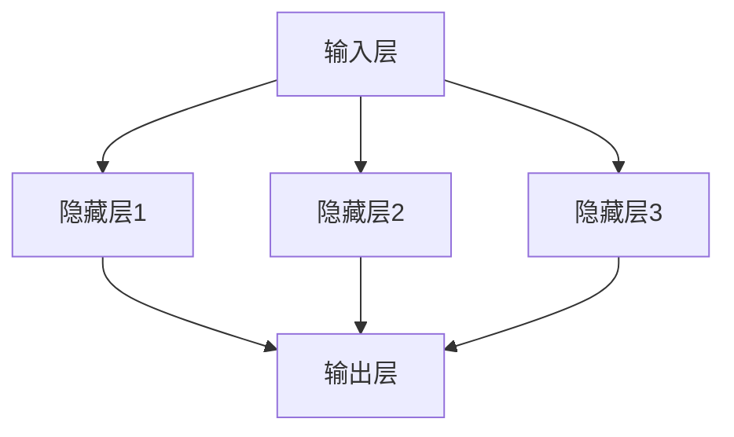

                 

### 文章标题与关键词

# AI Agent在智能个性化学习中的应用

> 关键词：AI Agent，个性化学习，智能教育，算法设计，教育技术

> 摘要：本文探讨了AI Agent在智能个性化学习中的应用，通过详细分析AI Agent的基本概念、类型和工作原理，探讨了其在个性化学习中的角色与作用。文章还介绍了AI Agent的设计与实现方法，并通过实际案例展示了其在智能个性化学习中的实践应用。最后，文章总结了AI Agent在个性化学习中的优势与挑战，并对未来发展趋势进行了展望。

### 引言

随着人工智能技术的飞速发展，教育领域也迎来了智能化的革命。个性化学习作为现代教育的重要趋势，旨在根据每个学生的特点和需求提供个性化的教育服务，从而提高学习效果和满意度。然而，传统的教育模式难以满足个性化学习的需求，无法对每个学生的学习过程进行精确的监测和调整。为了解决这个问题，AI Agent作为一种智能体，逐渐在个性化学习中崭露头角。

AI Agent，即人工智能代理，是一种能够自动执行任务、具备一定智能行为的计算机程序。它通过模拟人类的认知过程，具备自主决策、问题解决和交互能力，能够在复杂的环境中独立完成特定的任务。在个性化学习中，AI Agent能够根据学生的学习行为、兴趣和能力，提供个性化的学习内容和路径，从而实现真正的个性化学习。

本文将从以下几个方面展开讨论：

1. **问题的背景与重要性**：介绍个性化学习的背景和重要性，以及AI Agent在其中的作用。
2. **AI Agent的定义与功能**：详细解释AI Agent的基本概念、类型和工作原理。
3. **智能个性化学习的现状与挑战**：分析当前智能个性化学习的现状，以及面临的主要挑战。
4. **AI Agent在个性化学习中的应用**：探讨AI Agent在个性化学习中的具体应用场景和优势。
5. **AI Agent的设计与实现**：介绍AI Agent的设计原则、体系结构和核心算法。
6. **智能个性化学习系统的架构设计**：阐述智能个性化学习系统的需求分析、架构设计和接口实现。
7. **AI Agent在个性化学习中的实践案例**：通过实际案例展示AI Agent在个性化学习中的应用。
8. **总结与展望**：总结AI Agent在智能个性化学习中的应用，分析当前存在的问题与挑战，并对未来发展趋势进行展望。

### 目录大纲

## 第1章: 引言

### 1.1 问题的背景与重要性

### 1.2 AI Agent的定义与功能

### 1.3 智能个性化学习的现状与挑战

### 1.4 本书结构安排与目标

## 第2章: AI Agent基础知识

### 2.1 AI Agent的基本概念

### 2.2 AI Agent的主要类型

### 2.3 AI Agent的工作原理

### 2.4 AI Agent的核心技术

## 第3章: AI Agent在个性化学习中的应用

### 3.1 个性化学习概述

### 3.2 AI Agent在个性化学习中的角色与作用

### 3.3 AI Agent在个性化学习中的应用场景

### 3.4 AI Agent在个性化学习中的优势和挑战

## 第4章: AI Agent的设计与实现

### 4.1 AI Agent的设计原则

### 4.2 AI Agent的体系结构

### 4.3 AI Agent的核心算法

### 4.4 AI Agent的实现流程

## 第5章: 智能个性化学习系统的架构设计

### 5.1 系统需求分析

### 5.2 系统架构设计

### 5.3 数据处理与分析

### 5.4 系统接口设计与实现

## 第6章: AI Agent在个性化学习中的实践案例

### 6.1 案例一：智能辅导系统

### 6.2 案例二：个性化学习路径规划

### 6.3 案例三：智能测评与反馈

### 6.4 案例分析与总结

## 第7章: 总结与展望

### 7.1 AI Agent在智能个性化学习中的应用总结

### 7.2 当前存在的问题与挑战

### 7.3 未来发展趋势与展望

### 1.1 问题的背景与重要性

#### 1.1.1 个性化学习的背景

个性化学习作为一种现代化的教育理念，源于对传统教育模式的反思和改进。在传统教育模式中，教育资源和教学方法通常是一刀切的，无法满足每个学生的个性化需求。然而，随着社会的发展和信息技术的进步，教育的个性化需求日益突出。个性化学习旨在根据每个学生的特点、兴趣和能力，提供定制化的教育服务，实现教育的个性化、智能化和高效化。

#### 1.1.2 个性化学习的重要性

个性化学习在教育领域中具有重要意义。首先，它能够提高学生的学习效果。通过个性化的学习内容和路径，学生能够更好地理解和掌握知识，提高学习兴趣和动力。其次，个性化学习能够满足学生的个性化需求，使每个学生都能在适合自己的学习环境中成长和发展。此外，个性化学习有助于培养学生的创新能力和批判性思维，为未来的发展奠定坚实基础。

#### 1.1.3 AI Agent在个性化学习中的作用

AI Agent作为一种智能体，具备自主决策、问题解决和交互能力，能够有效地辅助个性化学习。首先，AI Agent能够根据学生的学习行为、兴趣和能力，实时监测学生的学习状态，提供个性化的学习内容和路径。其次，AI Agent能够根据学生的学习反馈，不断调整和优化学习策略，提高学习效果。此外，AI Agent还可以提供智能辅导、测评和反馈等功能，帮助学生更好地理解和掌握知识。

### 1.2 AI Agent的定义与功能

#### 1.2.1 AI Agent的基本概念

AI Agent，即人工智能代理，是一种能够自动执行任务、具备一定智能行为的计算机程序。它通过模拟人类的认知过程，具备自主决策、问题解决和交互能力，能够在复杂的环境中独立完成特定的任务。

#### 1.2.2 AI Agent的主要类型

根据功能和应用场景，AI Agent可以分为以下几种类型：

1. **任务型AI Agent**：专注于执行特定任务，如搜索、推理和规划等。
2. **交互型AI Agent**：具备与人交互的能力，如聊天机器人、虚拟助手等。
3. **智能客服型AI Agent**：用于智能客服领域，能够自动处理用户咨询和问题解答。
4. **个性化学习型AI Agent**：专注于个性化学习领域，根据学生的特点和需求提供个性化服务。

#### 1.2.3 AI Agent的工作原理

AI Agent的工作原理主要包括以下几个方面：

1. **感知与理解**：AI Agent通过传感器和输入设备感知环境信息，并对其进行理解。
2. **决策与规划**：基于感知和理解的信息，AI Agent进行决策和规划，确定下一步的行动。
3. **执行与反馈**：AI Agent执行决策，并对执行结果进行反馈，以不断优化决策过程。
4. **学习与进化**：通过不断的学习和进化，AI Agent能够提高自身的智能水平，适应更复杂的环境。

### 1.3 智能个性化学习的现状与挑战

#### 1.3.1 智能个性化学习的现状

随着人工智能技术的发展，智能个性化学习已经在教育领域中得到了广泛应用。许多学校和机构已经引入了AI Agent技术，为学生提供个性化的学习内容和路径。例如，智能辅导系统可以根据学生的学习进度和兴趣，推荐合适的学习资源；个性化学习路径规划系统可以根据学生的学习特点和需求，制定个性化的学习计划。

#### 1.3.2 智能个性化学习的挑战

尽管智能个性化学习取得了显著成果，但仍然面临着一些挑战：

1. **数据隐私与安全**：在个性化学习过程中，学生的大量数据会被收集和存储。如何保护学生的隐私和安全成为了一个重要问题。
2. **技术成熟度**：虽然AI Agent技术已经取得了很大进展，但在实际应用中，仍存在一些技术难题，如算法优化、模型训练和数据处理等。
3. **教育公平性**：智能个性化学习可能会加剧教育不公平现象，因为资源和技术往往集中在发达地区和优质学校。
4. **教师角色转变**：随着AI Agent的广泛应用，教师的角色可能会发生转变，如何适应这种变化成为了一个挑战。

### 1.4 本书结构安排与目标

本书共分为7个章节，旨在全面探讨AI Agent在智能个性化学习中的应用。

第1章：引言，介绍个性化学习的背景、AI Agent的定义与功能，以及智能个性化学习的现状与挑战。

第2章：AI Agent基础知识，介绍AI Agent的基本概念、类型和工作原理。

第3章：AI Agent在个性化学习中的应用，探讨AI Agent在个性化学习中的角色与作用，以及应用场景。

第4章：AI Agent的设计与实现，介绍AI Agent的设计原则、体系结构和核心算法。

第5章：智能个性化学习系统的架构设计，阐述智能个性化学习系统的需求分析、架构设计和接口实现。

第6章：AI Agent在个性化学习中的实践案例，通过实际案例展示AI Agent在个性化学习中的应用。

第7章：总结与展望，总结AI Agent在智能个性化学习中的应用，分析当前存在的问题与挑战，并对未来发展趋势进行展望。

本书的目标是帮助读者深入了解AI Agent在智能个性化学习中的应用，为教育领域的技术创新提供参考和启示。

### 2.1 AI Agent的基本概念

AI Agent，即人工智能代理，是一种模拟人类智能行为的计算机程序。它具备自主决策、问题解决和交互能力，能够在复杂的环境中独立完成特定的任务。AI Agent的核心目标是实现智能自动化，通过感知环境、理解信息、决策行动和反馈调整，实现智能行为的优化。

#### 2.1.1 AI Agent的定义

AI Agent是一种具有智能行为和自主决策能力的计算机程序。它通过感知环境、理解和分析信息，自主地做出决策，并采取相应的行动。AI Agent的目标是模拟人类智能行为，实现自动化和智能化的任务执行。

#### 2.1.2 AI Agent的特点

AI Agent具有以下几个特点：

1. **自主性**：AI Agent能够自主地执行任务，无需人工干预。
2. **智能性**：AI Agent具备智能行为，能够理解信息、做出决策和解决问题。
3. **适应性**：AI Agent能够根据环境变化和任务需求，动态调整行为和策略。
4. **交互性**：AI Agent能够与人类和其他系统进行交互，提供服务和反馈。

#### 2.1.3 AI Agent的组成

AI Agent通常由以下几个部分组成：

1. **感知模块**：用于感知环境信息，如传感器、摄像头等。
2. **理解模块**：用于理解和分析感知到的信息，如自然语言处理、图像识别等。
3. **决策模块**：用于根据理解和分析结果做出决策，如规划、推理等。
4. **执行模块**：用于执行决策，完成具体的任务。
5. **反馈模块**：用于收集执行结果，进行反馈和调整。

#### 2.1.4 AI Agent的分类

根据功能和应用场景，AI Agent可以分为以下几种类型：

1. **任务型AI Agent**：专注于执行特定任务，如搜索、推理和规划等。
2. **交互型AI Agent**：具备与人交互的能力，如聊天机器人、虚拟助手等。
3. **智能客服型AI Agent**：用于智能客服领域，能够自动处理用户咨询和问题解答。
4. **个性化学习型AI Agent**：专注于个性化学习领域，根据学生的特点和需求提供个性化服务。

### 2.2 AI Agent的主要类型

#### 2.2.1 任务型AI Agent

任务型AI Agent是一种专注于执行特定任务的AI Agent。它通常用于自动化流程、提高工作效率和减少人力成本。任务型AI Agent可以应用于各种领域，如自动化客服、智能办公、自动化测试等。

**特点：**

- **专业化**：专注于特定任务，如客服、办公、测试等。
- **高效性**：通过自动化流程，提高工作效率。
- **灵活性**：能够根据任务需求进行自适应调整。

**应用场景：**

- **智能客服**：自动处理用户咨询和问题解答，提高客户满意度。
- **智能办公**：自动化处理文档、邮件和日程安排等。
- **自动化测试**：自动化测试软件功能，提高测试效率和质量。

**案例：**

- **智能客服系统**：如企业微信客服、智能聊天机器人等。
- **智能办公系统**：如自动化审批系统、智能日历等。
- **自动化测试工具**：如Selenium、Robot Framework等。

#### 2.2.2 交互型AI Agent

交互型AI Agent是一种具备与人交互能力的AI Agent。它能够理解自然语言，进行对话，提供服务和反馈。交互型AI Agent广泛应用于智能客服、虚拟助手、智能语音助手等领域。

**特点：**

- **交互性**：能够与用户进行自然语言对话。
- **智能性**：具备理解、推理和生成语言的能力。
- **灵活性**：能够根据用户需求进行自适应调整。

**应用场景：**

- **智能客服**：自动处理用户咨询和问题解答，提高客户满意度。
- **虚拟助手**：提供个性化服务，如日程安排、提醒、导航等。
- **智能语音助手**：如苹果的Siri、亚马逊的Alexa等。

**案例：**

- **智能客服系统**：如企业微信客服、智能聊天机器人等。
- **虚拟助手**：如Apple的Siri、Google的Google Assistant等。
- **智能语音助手**：如苹果的Siri、亚马逊的Alexa等。

#### 2.2.3 智能客服型AI Agent

智能客服型AI Agent是一种专门用于智能客服领域的AI Agent。它能够自动处理用户咨询和问题解答，提高客户满意度和服务效率。智能客服型AI Agent广泛应用于银行、电商、航空等领域。

**特点：**

- **专业性**：能够理解用户问题，提供专业解答。
- **高效性**：自动处理大量用户咨询，提高服务效率。
- **灵活性**：能够根据用户需求进行自适应调整。

**应用场景：**

- **银行客服**：自动处理用户咨询和业务办理。
- **电商客服**：自动处理用户咨询和售后服务。
- **航空客服**：自动处理用户咨询和机票预订。

**案例：**

- **银行智能客服系统**：如工商银行智能客服系统。
- **电商智能客服系统**：如淘宝智能客服系统。
- **航空智能客服系统**：如航空公司智能客服系统。

#### 2.2.4 个性化学习型AI Agent

个性化学习型AI Agent是一种专注于个性化学习领域的AI Agent。它能够根据学生的特点和需求，提供个性化的学习内容和路径，提高学习效果和满意度。个性化学习型AI Agent广泛应用于教育领域，如在线教育、智能辅导等。

**特点：**

- **个性化**：根据学生特点和需求，提供个性化学习服务。
- **智能性**：能够理解学生学习行为，进行智能推荐和调整。
- **灵活性**：能够根据学生反馈和学习进度进行自适应调整。

**应用场景：**

- **在线教育**：为学生提供个性化学习资源和路径。
- **智能辅导**：为学生提供智能化的学习辅导和指导。
- **教育管理**：为学生提供个性化学习报告和评估。

**案例：**

- **在线教育平台**：如网易云课堂、腾讯课堂等。
- **智能辅导系统**：如新东方智能辅导系统、学而思智能辅导系统等。

### 2.3 AI Agent的工作原理

#### 2.3.1 感知与理解

感知与理解是AI Agent工作的第一步。AI Agent通过传感器和输入设备（如摄像头、麦克风、触摸屏等）感知环境信息，并对其进行理解和分析。

**感知：** AI Agent通过传感器获取外部环境信息，如文字、图像、声音等。这些信息以原始数据形式存在，需要进一步处理。

**理解：** AI Agent利用自然语言处理、图像识别、语音识别等技术，对感知到的信息进行理解和分析。例如，智能客服系统可以通过自然语言处理技术理解用户的咨询内容。

#### 2.3.2 决策与规划

基于感知和理解的结果，AI Agent进行决策和规划，确定下一步的行动。

**决策：** AI Agent根据感知和理解的信息，利用决策算法（如决策树、神经网络等）做出决策。决策过程通常包括目标设定、策略选择和资源分配等。

**规划：** AI Agent根据决策结果，制定具体的行动方案。规划过程涉及任务分解、路径规划和资源调度等。

#### 2.3.3 执行与反馈

AI Agent执行决策，并收集执行结果，进行反馈和调整。

**执行：** AI Agent根据规划的行动方案，执行具体的任务。例如，智能辅导系统可以为学生提供个性化的学习资源和辅导服务。

**反馈：** AI Agent收集执行结果，并对其进行评估和分析。通过反馈，AI Agent可以了解自身的表现，并不断优化决策和规划。

#### 2.3.4 学习与进化

AI Agent通过不断的学习和进化，提高自身的智能水平，适应更复杂的环境。

**学习：** AI Agent利用机器学习、深度学习等技术，从数据中学习和提取知识。学习过程包括数据收集、特征提取、模型训练和优化等。

**进化：** AI Agent通过进化算法（如遗传算法、粒子群优化等），不断优化自身的结构和行为。进化过程涉及适应度评估、选择、交叉和变异等。

### 2.4 AI Agent的核心技术

AI Agent的核心技术包括感知与理解技术、决策与规划技术、执行与反馈技术、学习与进化技术等。以下分别介绍这些核心技术。

#### 2.4.1 感知与理解技术

感知与理解技术是AI Agent工作的基础。它包括自然语言处理、图像识别、语音识别等。

**自然语言处理（NLP）：** 自然语言处理是一种使计算机能够理解、生成和处理人类自然语言的技术。NLP技术包括文本分类、情感分析、实体识别、关系抽取等。

**图像识别：** 图像识别是一种使计算机能够识别和理解图像内容的技术。图像识别技术包括目标检测、图像分类、人脸识别等。

**语音识别：** 语音识别是一种使计算机能够理解和转换语音信号为文本的技术。语音识别技术包括语音识别、语音合成、语音增强等。

#### 2.4.2 决策与规划技术

决策与规划技术是AI Agent的核心。它包括决策树、神经网络、遗传算法等。

**决策树：** 决策树是一种基于树形结构的决策模型，通过一系列条件判断，实现决策过程。

**神经网络：** 神经网络是一种基于模拟生物神经系统的计算模型，通过多层神经元之间的连接和传递，实现复杂的决策过程。

**遗传算法：** 遗传算法是一种基于生物进化原理的优化算法，通过模拟自然进化过程，实现决策和规划的优化。

#### 2.4.3 执行与反馈技术

执行与反馈技术是AI Agent实现任务的关键。它包括执行模块、反馈机制等。

**执行模块：** 执行模块负责根据决策结果，执行具体的任务。执行模块通常包括控制模块、执行器等。

**反馈机制：** 反馈机制负责收集执行结果，并对其进行评估和分析。通过反馈机制，AI Agent可以了解自身的表现，并不断优化决策和规划。

#### 2.4.4 学习与进化技术

学习与进化技术是AI Agent提高自身智能水平的关键。它包括机器学习、深度学习、进化算法等。

**机器学习：** 机器学习是一种使计算机通过数据学习，实现智能行为的技术。机器学习技术包括监督学习、无监督学习、强化学习等。

**深度学习：** 深度学习是一种基于多层神经网络的学习方法，通过自动提取特征和层次化表示，实现复杂的学习任务。

**进化算法：** 进化算法是一种基于生物进化原理的优化算法，通过模拟自然进化过程，实现智能体的优化和进化。

### 3.1 个性化学习概述

个性化学习是一种以学生为中心的教育模式，旨在根据每个学生的特点和需求，提供个性化的学习内容和路径，从而实现教育的个性化、智能化和高效化。个性化学习的核心目标是提高学生的学习效果和满意度，使每个学生都能在适合自己的学习环境中成长和发展。

#### 3.1.1 个性化学习的定义

个性化学习，也称为定制化学习或差异化学习，是指根据每个学生的个性、兴趣、学习风格和能力，为其提供个性化的学习内容和教学方法。个性化学习的目标是满足每个学生的学习需求，使教育更加灵活、多样和高效。

#### 3.1.2 个性化学习的核心要素

个性化学习的核心要素包括以下几个方面：

1. **学生特点**：了解学生的个性、兴趣、学习风格和能力，为每个学生提供个性化的学习内容和路径。
2. **学习内容**：根据学生的特点，设计符合其需求的学习内容，包括知识、技能和态度。
3. **教学方法**：采用灵活多样的教学方法，如小组讨论、项目式学习、探究式学习等，激发学生的学习兴趣和主动性。
4. **学习过程**：关注学生的学习过程，通过反馈和评估，不断调整和优化学习内容和教学方法。
5. **技术支持**：利用现代信息技术，如在线学习平台、智能辅导系统、大数据分析等，为学生提供个性化的学习服务。

#### 3.1.3 个性化学习的优势

个性化学习具有以下优势：

1. **提高学习效果**：通过个性化的学习内容和路径，学生能够更好地理解和掌握知识，提高学习效果。
2. **满足个性化需求**：个性化学习能够满足学生的个性化需求，使每个学生都能在适合自己的学习环境中成长和发展。
3. **培养自主学习能力**：个性化学习鼓励学生自主选择学习内容和路径，培养其自主学习能力和创新精神。
4. **促进教师角色转变**：个性化学习要求教师从传统的知识传授者转变为学习的引导者和辅助者，促进教师角色的转变和提升。
5. **提高教育公平性**：个性化学习能够缩小教育差距，使更多学生享受到优质教育资源，提高教育公平性。

### 3.2 AI Agent在个性化学习中的角色与作用

AI Agent作为一种智能体，在个性化学习中扮演着重要的角色，其作用主要体现在以下几个方面：

#### 3.2.1 角色概述

AI Agent在个性化学习中的角色可以概括为：

1. **个性化学习助手**：AI Agent能够根据学生的特点和需求，提供个性化的学习内容和路径，帮助学生更好地理解和掌握知识。
2. **学习过程监控者**：AI Agent能够实时监控学生的学习过程，收集和分析学习数据，为教师提供学生的学习情况，辅助教师进行教学决策。
3. **学习效果评估者**：AI Agent能够根据学生的学习表现，进行学习效果评估，为教师提供学生的学习反馈，帮助学生了解自己的学习进展。
4. **学习资源推荐者**：AI Agent能够根据学生的学习兴趣和能力，推荐合适的 学习资源和学习活动，提高学习效率和质量。

#### 3.2.2 作用分析

AI Agent在个性化学习中的作用主要体现在以下几个方面：

1. **个性化学习内容推荐**：AI Agent通过分析学生的学习数据，了解其学习兴趣和能力，推荐符合其需求的学习内容和路径。例如，学生可以收到个性化的学习任务、阅读材料、视频课程等。

2. **学习过程监控与反馈**：AI Agent能够实时监测学生的学习过程，收集学生的学习行为数据，如学习时间、学习时长、正确率等。通过分析这些数据，AI Agent可以为教师提供学生的学习情况报告，帮助教师了解学生的学习进展，调整教学策略。

3. **学习效果评估与反馈**：AI Agent可以根据学生的学习表现，进行学习效果评估，提供学习反馈。例如，学生可以在AI Agent的帮助下了解自己的知识掌握情况、薄弱环节等，从而有针对性地进行复习和提高。

4. **学习资源推荐与优化**：AI Agent可以根据学生的学习兴趣和能力，推荐合适的 学习资源和学习活动，帮助学生高效地完成学习任务。同时，AI Agent还可以根据学生的学习反馈，不断优化学习资源推荐策略，提高推荐质量。

5. **智能辅导与支持**：AI Agent可以提供智能化的学习辅导和支持，如智能答疑、在线辅导、学习策略建议等。通过这些服务，AI Agent可以帮助学生解决学习中的问题，提高学习效果。

#### 3.2.3 AI Agent在个性化学习中的实际应用

AI Agent在个性化学习中的实际应用可以体现在以下几个方面：

1. **在线教育平台**：AI Agent可以集成到在线教育平台中，为用户提供个性化的学习服务。例如，学生可以通过AI Agent获取个性化的学习资源、定制化学习计划，以及实时学习反馈。

2. **智能辅导系统**：AI Agent可以构建智能辅导系统，为学生提供个性化的学习辅导。例如，学生可以通过AI Agent获取学习策略建议、答疑服务、个性化练习等。

3. **学习数据分析**：AI Agent可以对学生的学习数据进行分析，为教师提供教学决策支持。例如，AI Agent可以分析学生的学习行为、学习效果等，为教师提供个性化的教学建议。

4. **学习效果评估**：AI Agent可以对学生进行学习效果评估，为教师提供学习反馈。例如，AI Agent可以通过分析学生的学习数据，评估学生的学习效果，并提供相应的学习建议。

5. **个性化学习路径规划**：AI Agent可以根据学生的学习特点和需求，为其规划个性化的学习路径。例如，AI Agent可以分析学生的学习进度、知识掌握情况等，为学生推荐合适的学习路径，提高学习效率。

### 3.3 AI Agent在个性化学习中的应用场景

AI Agent在个性化学习中的应用场景广泛，涵盖了学习内容推荐、学习过程监控、学习效果评估等多个方面。以下将详细探讨AI Agent在个性化学习中的主要应用场景。

#### 3.3.1 学习内容推荐

AI Agent可以通过分析学生的学习数据、兴趣爱好和学习历史，为学生推荐个性化的学习内容。具体应用场景包括：

1. **个性化课程推荐**：学生可以根据自己的学习需求和进度，通过AI Agent获取个性化课程推荐。例如，学生可以通过AI Agent获取适合自己学习水平、兴趣和职业规划的课程。

2. **学习资源推荐**：AI Agent可以根据学生的学习特点和需求，推荐相关的学习资源，如电子书籍、学术论文、视频教程等。这些资源可以帮助学生更高效地学习和掌握知识。

3. **学习任务分配**：AI Agent可以为学生分配个性化的学习任务，确保学生在学习过程中能够均衡发展各项技能。例如，学生可以通过AI Agent获取针对性练习、模拟测试等学习任务。

#### 3.3.2 学习过程监控

AI Agent能够实时监控学生的学习过程，提供实时的学习反馈和指导。具体应用场景包括：

1. **学习行为分析**：AI Agent可以分析学生的学习行为，如学习时间、学习时长、学习频率等。通过这些分析，AI Agent可以为学生提供学习习惯建议，帮助学生优化学习时间管理。

2. **学习进度跟踪**：AI Agent可以跟踪学生的学习进度，及时发现学生的学习困难和瓶颈。通过分析学生的学习数据，AI Agent可以为学生提供个性化的学习建议，帮助其解决学习难题。

3. **学习反馈与指导**：AI Agent可以根据学生的学习反馈，提供个性化的学习指导。例如，当学生在学习中遇到困难时，AI Agent可以提供相关知识点解析、练习题推荐等帮助。

#### 3.3.3 学习效果评估

AI Agent可以通过分析学生的学习数据和表现，进行学习效果评估，并提供学习反馈。具体应用场景包括：

1. **知识掌握评估**：AI Agent可以评估学生对知识点的掌握程度，为学生提供学习效果评估报告。通过这些报告，学生可以了解自己的学习效果，有针对性地进行复习和提高。

2. **学习目标设定**：AI Agent可以根据学生的学习效果，帮助学生设定合适的学习目标。例如，学生可以通过AI Agent获取个性化的学习目标设定建议，包括学习目标、学习进度、评估标准等。

3. **学习反馈与激励**：AI Agent可以为学生提供学习反馈和激励，鼓励学生在学习过程中保持积极心态。例如，当学生达到学习目标时，AI Agent可以提供奖励机制，如积分奖励、学习证书等。

#### 3.3.4 智能化学习辅导

AI Agent可以为学生提供智能化的学习辅导，帮助其解决学习中的问题。具体应用场景包括：

1. **智能答疑**：AI Agent可以提供在线智能答疑服务，学生可以在遇到问题时通过AI Agent获取解答。AI Agent可以利用自然语言处理和知识图谱技术，为学生提供准确、快速的答案。

2. **学习策略建议**：AI Agent可以根据学生的学习情况和需求，提供个性化的学习策略建议。例如，学生可以通过AI Agent获取学习时间管理、学习习惯培养等方面的建议。

3. **个性化练习与测评**：AI Agent可以为学生提供个性化的练习和测评服务，帮助学生巩固所学知识。通过分析学生的练习和测评结果，AI Agent可以为学生提供针对性的练习题和测评反馈。

#### 3.3.5 个性化学习路径规划

AI Agent可以为学生规划个性化的学习路径，确保学生能够高效地学习。具体应用场景包括：

1. **学习计划制定**：AI Agent可以根据学生的学习需求和目标，制定个性化的学习计划。例如，学生可以通过AI Agent获取学习计划建议，包括学习目标、学习内容、学习时间等。

2. **学习路径调整**：AI Agent可以根据学生的学习表现和反馈，动态调整学习路径。例如，当学生遇到学习困难时，AI Agent可以调整学习路径，为学生提供更多的支持和帮助。

3. **学习效果预测**：AI Agent可以通过分析学生的学习数据和表现，预测学生的学习效果。通过这些预测，AI Agent可以为教师和学生提供学习效果预测报告，帮助其制定更加合理的学习计划和策略。

### 3.4 AI Agent在个性化学习中的优势和挑战

#### 3.4.1 优势

AI Agent在个性化学习中的应用具有以下优势：

1. **个性化推荐**：AI Agent可以通过分析学生的学习数据和需求，提供个性化的学习内容和资源推荐，提高学习效果和满意度。

2. **实时监控**：AI Agent可以实时监控学生的学习过程，及时发现问题并提供反馈，帮助教师和学生优化学习策略。

3. **学习效果评估**：AI Agent可以通过分析学生的学习数据，进行学习效果评估，为教师和学生提供学习反馈和改进建议。

4. **智能辅导**：AI Agent可以为学生提供智能化的学习辅导，如智能答疑、学习策略建议、个性化练习等，帮助学生解决学习中的问题。

5. **高效资源利用**：AI Agent可以帮助教师和学生高效利用学习资源，如电子书籍、视频教程、在线课程等，提高学习效率。

#### 3.4.2 挑战

尽管AI Agent在个性化学习中具有诸多优势，但在实际应用中仍面临一些挑战：

1. **数据隐私与安全**：个性化学习过程中会收集大量的学生数据，如何保护学生的隐私和安全成为一个重要问题。

2. **技术成熟度**：AI Agent在个性化学习中的应用仍需进一步优化和提升，如算法优化、模型训练和数据处理等。

3. **教育公平性**：AI Agent在个性化学习中的应用可能会加剧教育不公平现象，因为资源和技术往往集中在发达地区和优质学校。

4. **教师角色转变**：随着AI Agent的广泛应用，教师的角色可能会发生转变，如何适应这种变化成为了一个挑战。

### 4.1 AI Agent的设计原则

设计AI Agent时，应遵循以下原则，以确保其功能全面、高效且易于维护：

#### 4.1.1 功能性

AI Agent应具备明确的功能定位，能够有效地解决个性化学习中的具体问题。具体原则包括：

- **任务明确**：每个AI Agent应专注于一个特定的任务，如学习内容推荐、学习过程监控、学习效果评估等。
- **功能完备**：AI Agent应具备所有必要的功能模块，如感知、理解、决策、执行和反馈等。
- **模块化设计**：AI Agent的功能模块应相互独立，便于扩展和替换。

#### 4.1.2 可扩展性

AI Agent的设计应考虑到未来可能的需求变化和功能扩展。具体原则包括：

- **模块化**：采用模块化设计，便于新增或替换功能模块。
- **可配置性**：AI Agent的配置参数应易于调整，以适应不同的应用场景。
- **标准化接口**：通过定义标准化的接口，方便与其他系统和组件进行集成。

#### 4.1.3 适应性

AI Agent应具备良好的适应性，能够根据不同的用户需求和场景进行自适应调整。具体原则包括：

- **学习能力**：AI Agent应具备学习和自我优化能力，通过不断学习和积累经验，提高其适应性和智能化水平。
- **灵活性**：AI Agent的设计应考虑到不同的学习场景和应用环境，具备灵活的调整能力。
- **多模态感知**：AI Agent应能够处理多种类型的数据，如文本、图像、语音等，以提高其适应性。

#### 4.1.4 可靠性

AI Agent的设计应确保其具有较高的可靠性，能够在复杂和多变的环境中稳定运行。具体原则包括：

- **容错性**：AI Agent应具备一定的容错能力，能够在发生故障时自动恢复或切换到备用模式。
- **稳定性**：AI Agent的算法和系统应经过充分的测试和优化，确保其稳定性和可靠性。
- **安全性**：AI Agent的设计应考虑到数据安全和隐私保护，采取有效的安全措施，如数据加密、访问控制等。

#### 4.1.5 可维护性

AI Agent的设计应便于维护和更新，以适应技术发展和应用需求的变化。具体原则包括：

- **可读性**：代码应具有良好的可读性和注释，便于其他开发人员理解和维护。
- **模块化设计**：采用模块化设计，便于维护和更新。
- **文档化**：编写详细的开发文档和用户手册，便于后续维护和升级。

### 4.2 AI Agent的体系结构

AI Agent的体系结构是确保其功能实现和性能优化的关键。一个典型的AI Agent体系结构通常包括以下几个主要模块：

#### 4.2.1 感知模块

感知模块是AI Agent获取外部环境信息的重要部分，其主要功能包括：

- **数据采集**：通过传感器、摄像头、麦克风等设备采集文本、图像、语音等多类型数据。
- **数据预处理**：对采集到的数据进行预处理，如去噪、增强、特征提取等，以提高数据质量和后续处理的准确性。

#### 4.2.2 理解模块

理解模块负责对感知模块采集到的信息进行理解和分析，其主要功能包括：

- **自然语言处理**：利用NLP技术对文本信息进行语义分析和情感分析，以理解文本内容的含义和情感倾向。
- **图像识别**：通过图像识别技术对图像信息进行分类和识别，以理解图像内容的含义。
- **语音识别**：利用语音识别技术对语音信息进行转换和识别，以理解语音内容的含义。

#### 4.2.3 决策模块

决策模块是AI Agent的核心部分，其主要功能是根据理解模块的分析结果，做出智能化的决策。具体功能包括：

- **决策算法**：采用决策树、神经网络、遗传算法等决策算法，根据输入数据生成决策结果。
- **策略生成**：基于决策结果，生成具体的行动策略，如学习内容推荐、学习任务分配等。

#### 4.2.4 执行模块

执行模块负责根据决策模块的决策结果，执行具体的任务。其主要功能包括：

- **任务执行**：执行具体的任务，如提供学习资源、发送反馈信息等。
- **反馈收集**：在任务执行过程中，收集任务执行结果和用户反馈，以便进行后续的决策调整。

#### 4.2.5 学习模块

学习模块是AI Agent自我优化和智能升级的关键部分，其主要功能包括：

- **数据学习**：利用机器学习、深度学习等技术，从数据中学习和提取知识，以提高其智能水平。
- **模型优化**：基于学习结果，优化AI Agent的模型结构和参数，以提高决策的准确性和效率。

#### 4.2.6 用户交互模块

用户交互模块负责与用户进行互动和沟通，以获取用户反馈和需求，为AI Agent提供改进方向。其主要功能包括：

- **交互界面**：提供用户友好的交互界面，如Web界面、移动应用等，以便用户与AI Agent进行交互。
- **反馈收集**：收集用户的反馈和需求，以便进行后续的功能优化和改进。

### 4.3 AI Agent的核心算法

AI Agent的核心算法是实现其智能行为和功能的关键。以下介绍几种常用的AI Agent核心算法，包括决策树、神经网络和遗传算法。

#### 4.3.1 决策树算法

决策树是一种常用的分类和回归算法，通过一系列条件判断，对数据进行分类或预测。决策树算法的主要步骤如下：

1. **特征选择**：选择具有区分性的特征，作为决策树的节点。
2. **信息增益**：计算每个特征的信息增益，选择信息增益最大的特征作为当前节点的分割特征。
3. **划分数据**：根据选择的特征，将数据集划分为多个子集。
4. **递归构建**：对每个子集继续进行特征选择和信息增益计算，构建下一个节点，直到满足停止条件（如最大深度、最小样本量等）。

**示例**：

假设有一个学生数据集，包括年龄、成绩、学习时间等特征，目标是对学生进行分类（优秀、良好、一般）。使用决策树算法，可以根据每个特征的信息增益，选择最优的特征进行划分，构建决策树模型。

```mermaid
graph TD
A[学生分类] --> B[年龄]
B -->|<20| C{年龄<20?}
C -->|是 D[优秀]
C -->|否 E[一般]
A --> B --> C --> D
A --> B --> C --> E
```

#### 4.3.2 神经网络算法

神经网络是一种基于模拟生物神经系统的计算模型，通过多层神经元之间的连接和传递，实现复杂的分类和回归任务。神经网络算法的主要步骤如下：

1. **初始化权重**：随机初始化神经网络中的权重。
2. **前向传播**：将输入数据通过神经网络的前向传播过程，计算输出结果。
3. **反向传播**：计算输出结果与实际结果的误差，通过反向传播过程更新权重。
4. **迭代训练**：重复进行前向传播和反向传播过程，直到满足停止条件（如误差阈值、训练次数等）。

**示例**：

假设有一个简单的神经网络，包括输入层、隐藏层和输出层。输入层有2个神经元，隐藏层有3个神经元，输出层有1个神经元。使用神经网络算法，可以训练模型，对输入数据进行分类。



#### 4.3.3 遗传算法

遗传算法是一种基于生物进化原理的优化算法，通过模拟自然进化过程，实现最优解的搜索。遗传算法的主要步骤如下：

1. **初始化种群**：随机生成初始种群，每个个体代表一个潜在的解。
2. **适应度评估**：对种群中的每个个体进行适应度评估，选择适应度较高的个体作为父代。
3. **交叉操作**：通过交叉操作，生成新的子代个体。
4. **变异操作**：对子代个体进行变异操作，增加种群的多样性。
5. **迭代进化**：重复进行适应度评估、交叉操作和变异操作，直到满足停止条件（如达到最大迭代次数、适应度阈值等）。

**示例**：

假设有一个优化问题，需要找到一组数（x, y），使其和最小。使用遗传算法，可以生成初始种群，通过适应度评估、交叉操作和变异操作，不断优化解的精度。


### 4.4 AI Agent的实现流程

实现AI Agent的过程可以分为以下几个阶段：

#### 4.4.1 需求分析

需求分析是AI Agent实现的第一步，旨在明确AI Agent的功能需求和应用场景。具体步骤包括：

- **确定目标功能**：明确AI Agent需要实现的主要功能，如学习内容推荐、学习过程监控、学习效果评估等。
- **分析用户需求**：了解用户的需求和期望，确保AI Agent能够满足用户的需求。
- **确定技术需求**：分析实现AI Agent所需的技术和资源，如算法、数据库、接口等。

#### 4.4.2 设计阶段

设计阶段是AI Agent实现的关键，包括以下几个方面：

- **体系结构设计**：根据需求分析的结果，设计AI Agent的体系结构，包括感知模块、理解模块、决策模块、执行模块等。
- **算法选择**：选择合适的算法实现AI Agent的核心功能，如决策树、神经网络、遗传算法等。
- **接口设计**：设计AI Agent与外部系统（如数据库、前端界面等）的接口，确保数据传输和功能调用的顺畅。

#### 4.4.3 开发阶段

开发阶段是将设计转化为实际代码的过程，包括以下几个方面：

- **编码实现**：根据设计文档，编写AI Agent的代码，实现各个功能模块。
- **单元测试**：对每个功能模块进行单元测试，确保其正确性和稳定性。
- **集成测试**：将各个功能模块进行集成，进行整体测试，确保AI Agent的功能完整和协调。

#### 4.4.4 部署阶段

部署阶段是将AI Agent部署到实际环境中，使其能够正常运行的过程，包括以下几个方面：

- **环境配置**：配置AI Agent运行所需的环境，如操作系统、数据库、中间件等。
- **部署部署**：将AI Agent部署到服务器或云端，确保其能够持续运行。
- **监控与维护**：对AI Agent进行实时监控和定期维护，确保其稳定运行和性能优化。

### 5.1 智能个性化学习系统的需求分析

#### 5.1.1 系统目标

智能个性化学习系统的目标是通过AI Agent技术，实现个性化学习资源的推荐、学习过程的监控、学习效果的评估，以及智能化的学习辅导，从而提高学生的学习效果和满意度。

#### 5.1.2 功能需求

智能个性化学习系统的功能需求包括以下几个方面：

1. **个性化学习资源推荐**：系统应能够根据学生的学习特点和需求，推荐合适的学习资源，如课程、文章、视频等。
2. **学习过程监控**：系统应能够实时监控学生的学习过程，包括学习时长、学习频率、学习进度等，并提供实时反馈和指导。
3. **学习效果评估**：系统应能够根据学生的学习行为和学习结果，进行学习效果评估，并提供详细的评估报告。
4. **智能辅导**：系统应能够提供智能化的学习辅导，包括学习策略建议、答疑服务、学习进度跟踪等。

#### 5.1.3 非功能需求

智能个性化学习系统的非功能需求包括以下几个方面：

1. **稳定性**：系统应能够稳定运行，不受外部环境变化的影响。
2. **安全性**：系统应能够保证数据的安全性和用户隐私的保护。
3. **可扩展性**：系统应具有良好的可扩展性，能够根据需求的变化进行功能扩展和技术升级。
4. **易用性**：系统应提供简洁易用的用户界面，方便用户使用和管理。

#### 5.1.4 用户角色

智能个性化学习系统的用户角色包括以下几个方面：

1. **学生**：学生是系统的核心用户，通过系统获取个性化学习资源、监控学习过程、接受学习反馈等。
2. **教师**：教师是系统的辅助用户，通过系统监控学生的学习情况、提供学习辅导和评估学生表现。
3. **管理员**：管理员是系统的维护用户，负责系统的日常维护、数据备份和系统升级等。

### 5.2 智能个性化学习系统的架构设计

智能个性化学习系统的架构设计是确保系统功能完整、性能高效、可扩展性和稳定性的关键。以下将介绍智能个性化学习系统的架构设计，包括系统架构、数据处理与分析、系统接口设计等方面。

#### 5.2.1 系统架构

智能个性化学习系统的架构设计采用分层架构，主要包括以下几层：

1. **表示层**：表示层负责提供用户界面，用户可以通过Web界面或移动应用与系统进行交互，提交学习请求、查看学习报告等。
2. **业务逻辑层**：业务逻辑层负责处理系统的核心业务逻辑，包括学习资源推荐、学习过程监控、学习效果评估和智能辅导等。
3. **数据访问层**：数据访问层负责与数据库进行交互，实现对用户数据、学习数据、资源数据的存储和查询。
4. **数据层**：数据层负责存储系统的数据，包括用户数据、学习数据、资源数据等。

#### 5.2.2 数据处理与分析

智能个性化学习系统对数据处理与分析是系统实现智能化的关键。以下介绍数据处理与分析的方法和流程：

1. **用户数据**：用户数据包括用户的基本信息、学习历史、学习偏好等。系统通过对用户数据的分析，可以了解用户的需求和行为习惯，为个性化推荐提供依据。
2. **学习数据**：学习数据包括学生的学习行为、学习进度、学习结果等。系统通过对学习数据的分析，可以了解学生的学习效果和学习规律，为学习过程监控和学习效果评估提供依据。
3. **资源数据**：资源数据包括课程资源、文章资源、视频资源等。系统通过对资源数据的分析，可以了解资源的使用情况和受欢迎程度，为资源推荐提供依据。
4. **数据处理与分析**：系统采用大数据分析技术，如数据挖掘、机器学习等，对用户数据、学习数据、资源数据进行分析和处理，提取用户需求、学习规律、资源特征等，为个性化推荐、学习过程监控和学习效果评估提供支持。

#### 5.2.3 系统接口设计

智能个性化学习系统的接口设计是系统与其他系统进行交互和数据传输的桥梁。以下介绍系统接口的设计：

1. **用户接口**：用户接口是系统与用户进行交互的界面，主要包括Web界面和移动应用。用户可以通过用户接口提交学习请求、查看学习报告等。
2. **API接口**：API接口是系统与其他系统进行数据交互的接口，主要包括学习资源推荐接口、学习过程监控接口、学习效果评估接口等。其他系统可以通过API接口调用智能个性化学习系统的功能，实现数据的整合和共享。
3. **数据库接口**：数据库接口是系统与数据库进行数据交互的接口，主要包括用户数据接口、学习数据接口、资源数据接口等。系统通过数据库接口实现对用户数据、学习数据、资源数据的存储和查询。

### 5.3 数据处理与分析

智能个性化学习系统在实现过程中，需要处理和分析大量的数据，以确保系统能够提供准确、个性化的服务。以下将介绍数据处理与分析的方法和技术。

#### 5.3.1 数据来源

智能个性化学习系统的数据来源主要包括以下几个方面：

1. **用户数据**：用户数据包括用户的基本信息、学习历史、学习偏好等。这些数据可以通过用户注册、登录、学习记录等操作获取。
2. **学习数据**：学习数据包括学生的学习行为、学习进度、学习结果等。这些数据可以通过学生在系统中的学习活动、测试结果等获取。
3. **资源数据**：资源数据包括课程资源、文章资源、视频资源等。这些数据可以通过系统管理员上传、维护等操作获取。

#### 5.3.2 数据处理技术

为了处理和分析大量的数据，智能个性化学习系统采用了一系列数据处理技术，包括数据采集、数据预处理、数据存储、数据分析等。

1. **数据采集**：系统通过传感器、用户操作等方式，实时采集用户数据、学习数据、资源数据等。数据采集过程中，需要保证数据的准确性和完整性。
2. **数据预处理**：数据预处理是数据处理的关键步骤，主要包括数据清洗、数据去重、数据转换等。通过数据预处理，可以提高数据的质量和可用性。
3. **数据存储**：系统采用分布式数据库存储用户数据、学习数据、资源数据等。分布式数据库能够保证数据的可靠性和高性能。
4. **数据分析**：系统采用大数据分析技术，如数据挖掘、机器学习等，对用户数据、学习数据、资源数据进行分析和处理。通过数据分析，可以提取用户需求、学习规律、资源特征等，为个性化推荐、学习过程监控和学习效果评估提供支持。

#### 5.3.3 数据分析技术

智能个性化学习系统采用了一系列数据分析技术，包括数据挖掘、机器学习、自然语言处理等。

1. **数据挖掘**：数据挖掘是一种通过挖掘大量数据中的潜在模式和规律的技术。系统可以通过数据挖掘技术，发现用户需求、学习规律、资源特征等，为个性化推荐和学习过程监控提供支持。
2. **机器学习**：机器学习是一种通过训练模型，从数据中自动学习和提取知识的技术。系统可以通过机器学习技术，训练个性化推荐模型、学习效果评估模型等，提高系统的智能化水平。
3. **自然语言处理**：自然语言处理是一种使计算机能够理解、生成和处理人类自然语言的技术。系统可以通过自然语言处理技术，分析用户评论、问答等，为学习效果评估和智能辅导提供支持。

#### 5.3.4 数据处理流程

智能个性化学习系统的数据处理流程主要包括以下几个步骤：

1. **数据采集**：系统通过传感器、用户操作等方式，实时采集用户数据、学习数据、资源数据等。
2. **数据预处理**：对采集到的数据进行清洗、去重、转换等预处理操作，提高数据的质量和可用性。
3. **数据存储**：将预处理后的数据存储到分布式数据库中，方便后续的数据分析和查询。
4. **数据分析**：采用数据挖掘、机器学习、自然语言处理等技术，对存储在数据库中的数据进行分析和处理，提取用户需求、学习规律、资源特征等。
5. **数据应用**：将分析结果应用于系统的各个功能模块，如个性化推荐、学习过程监控、学习效果评估等，为用户提供个性化的服务。

### 5.4 系统接口设计与实现

智能个性化学习系统的接口设计是实现系统功能的关键，主要包括API接口设计和用户界面设计。以下将详细描述系统接口的设计和实现。

#### 5.4.1 API接口设计

API接口设计是系统与外部系统进行数据交互的桥梁，主要包括用户接口、资源接口和学习接口。以下是API接口的具体设计：

1. **用户接口**：
   - **用户注册**：POST /api/users/register
     - 请求参数：username（用户名）、password（密码）、email（邮箱）
     - 响应结果：注册成功或失败的消息
   - **用户登录**：POST /api/users/login
     - 请求参数：username（用户名）、password（密码）
     - 响应结果：登录成功或失败的消息，以及用户ID

2. **资源接口**：
   - **获取资源列表**：GET /api/resources
     - 请求参数：无
     - 响应结果：资源列表，包括资源ID、名称、类型等
   - **获取资源详情**：GET /api/resources/{resourceId}
     - 请求参数：resourceId（资源ID）
     - 响应结果：资源详情，包括资源ID、名称、描述、类型等

3. **学习接口**：
   - **创建学习记录**：POST /api/studies
     - 请求参数：userId（用户ID）、resourceId（资源ID）、studyDuration（学习时长）
     - 响应结果：学习记录ID
   - **获取学习记录**：GET /api/studies/{studyId}
     - 请求参数：studyId（学习记录ID）
     - 响应结果：学习记录详情，包括学习记录ID、用户ID、资源ID、学习时长等

#### 5.4.2 用户界面设计

用户界面设计是系统与用户交互的窗口，主要包括登录页面、注册页面、资源列表页面、学习记录页面等。以下是用户界面设计的关键点：

1. **登录页面**：用户输入用户名和密码，提交登录请求。如果登录成功，跳转到资源列表页面；如果登录失败，显示错误提示。
2. **注册页面**：用户输入用户名、密码和邮箱，提交注册请求。如果注册成功，跳转到登录页面；如果注册失败，显示错误提示。
3. **资源列表页面**：展示系统中的所有资源，用户可以点击资源名称查看资源详情。页面还提供搜索功能，用户可以输入关键词搜索资源。
4. **资源详情页面**：展示资源的详细信息，包括资源名称、描述、类型等。用户可以在此页面进行学习，系统将自动创建学习记录。
5. **学习记录页面**：展示用户的学习记录，包括学习记录ID、用户ID、资源ID、学习时长等。用户可以在此页面查看自己的学习历史和进度。

### 6.1 案例一：智能辅导系统

#### 6.1.1 案例背景

智能辅导系统是一个基于AI Agent技术的个性化学习平台，旨在为学生提供智能化的学习辅导服务。该系统通过分析学生的学习数据，提供针对性的学习建议和辅导服务，帮助学生更好地理解和掌握知识。

#### 6.1.2 系统功能

智能辅导系统的功能主要包括：

1. **个性化学习建议**：系统根据学生的学习数据，为学生推荐合适的学习资源和学习策略，提高学习效果。
2. **智能答疑**：系统提供智能化的答疑服务，学生可以在遇到问题时通过系统获取解答。
3. **学习进度跟踪**：系统实时监控学生的学习进度，为学生提供学习反馈和指导。
4. **学习报告生成**：系统生成学生的学习报告，为学生和家长提供学习情况的详细分析。

#### 6.1.3 系统架构

智能辅导系统的架构设计主要包括以下几个部分：

1. **前端界面**：提供用户交互的界面，包括登录、注册、资源列表、资源详情、学习记录等页面。
2. **后端服务器**：负责处理用户请求、数据存储和业务逻辑。
3. **数据库**：存储用户数据、学习数据、资源数据等。
4. **AI Agent**：负责分析学生的学习数据，提供个性化学习建议、智能答疑和学习进度跟踪等功能。

#### 6.1.4 系统实现

智能辅导系统的实现过程主要包括以下几个步骤：

1. **需求分析**：明确系统的功能需求，包括个性化学习建议、智能答疑、学习进度跟踪和学习报告生成等。
2. **设计阶段**：设计系统的架构和接口，包括前端界面设计、后端服务器设计和数据库设计。
3. **开发阶段**：编写前端界面、后端服务器和数据库的代码，实现系统的功能。
4. **测试阶段**：对系统进行功能测试和性能测试，确保系统的稳定性和可靠性。
5. **部署阶段**：将系统部署到服务器，确保系统可以正常运行。

#### 6.1.5 案例效果

智能辅导系统在实际应用中取得了显著效果。通过系统分析学生的学习数据，为学生提供了个性化的学习建议和辅导服务，提高了学生的学习效果和满意度。同时，系统生成的学习报告为家长提供了孩子的学习情况，增强了家长对智能辅导系统的信任。

### 6.2 案例二：个性化学习路径规划

#### 6.2.1 案例背景

个性化学习路径规划是一个基于AI Agent技术的智能化教育平台，旨在为学生提供个性化的学习路径，帮助学生高效地学习。该系统通过分析学生的学习数据、学习目标和兴趣爱好，为学生规划合适的学习路径，提高学习效果。

#### 6.2.2 系统功能

个性化学习路径规划系统的功能主要包括：

1. **学习路径推荐**：系统根据学生的学习数据、学习目标和兴趣爱好，为学生推荐合适的学习路径。
2. **学习进度监控**：系统实时监控学生的学习进度，提供学习反馈和指导。
3. **学习资源推荐**：系统根据学生的学习路径和学习需求，推荐合适的学习资源。
4. **学习报告生成**：系统生成学生的学习报告，为学生和家长提供学习情况的详细分析。

#### 6.2.3 系统架构

个性化学习路径规划系统的架构设计主要包括以下几个部分：

1. **前端界面**：提供用户交互的界面，包括登录、注册、学习路径推荐、学习进度监控、学习资源推荐和学习报告生成等页面。
2. **后端服务器**：负责处理用户请求、数据存储和业务逻辑。
3. **数据库**：存储用户数据、学习数据、学习路径数据和学习资源数据等。
4. **AI Agent**：负责分析学生的学习数据、学习目标和兴趣爱好，提供个性化学习路径推荐、学习进度监控和学习资源推荐等功能。

#### 6.2.4 系统实现

个性化学习路径规划系统的实现过程主要包括以下几个步骤：

1. **需求分析**：明确系统的功能需求，包括学习路径推荐、学习进度监控、学习资源推荐和学习报告生成等。
2. **设计阶段**：设计系统的架构和接口，包括前端界面设计、后端服务器设计和数据库设计。
3. **开发阶段**：编写前端界面、后端服务器和数据库的代码，实现系统的功能。
4. **测试阶段**：对系统进行功能测试和性能测试，确保系统的稳定性和可靠性。
5. **部署阶段**：将系统部署到服务器，确保系统可以正常运行。

#### 6.2.5 案例效果

个性化学习路径规划系统在实际应用中取得了显著效果。通过系统分析学生的学习数据、学习目标和兴趣爱好，为学生提供了合适的学习路径和学习资源，提高了学生的学习效果和满意度。同时，系统生成的学习报告为家长提供了孩子的学习情况，增强了家长对系统的信任。

### 6.3 案例三：智能测评与反馈

#### 6.3.1 案例背景

智能测评与反馈系统是一个基于AI Agent技术的教育评测平台，旨在为学生提供智能化的测评服务。该系统通过分析学生的学习数据，提供个性化的测评题目和反馈，帮助学生更好地理解和掌握知识。

#### 6.3.2 系统功能

智能测评与反馈系统的功能主要包括：

1. **智能测评**：系统根据学生的学习数据，为学生生成个性化的测评题目，测试学生的学习效果。
2. **实时反馈**：系统在学生完成测评后，提供即时的反馈，指出学生的优点和不足，帮助学生改进学习。
3. **学习报告生成**：系统生成学生的学习报告，为学生和家长提供学习情况的详细分析。

#### 6.3.3 系统架构

智能测评与反馈系统的架构设计主要包括以下几个部分：

1. **前端界面**：提供用户交互的界面，包括登录、注册、智能测评、实时反馈和学习报告生成等页面。
2. **后端服务器**：负责处理用户请求、数据存储和业务逻辑。
3. **数据库**：存储用户数据、学习数据、测评数据和反馈数据等。
4. **AI Agent**：负责分析学生的学习数据，生成个性化的测评题目和反馈。

#### 6.3.4 系统实现

智能测评与反馈系统的实现过程主要包括以下几个步骤：

1. **需求分析**：明确系统的功能需求，包括智能测评、实时反馈和学习报告生成等。
2. **设计阶段**：设计系统的架构和接口，包括前端界面设计、后端服务器设计和数据库设计。
3. **开发阶段**：编写前端界面、后端服务器和数据库的代码，实现系统的功能。
4. **测试阶段**：对系统进行功能测试和性能测试，确保系统的稳定性和可靠性。
5. **部署阶段**：将系统部署到服务器，确保系统可以正常运行。

#### 6.3.5 案例效果

智能测评与反馈系统在实际应用中取得了显著效果。通过系统分析学生的学习数据，为学生提供了个性化的测评题目和反馈，帮助学生更好地理解和掌握知识。同时，系统生成的学习报告为家长提供了孩子的学习情况，增强了家长对系统的信任。

### 6.4 案例分析与总结

#### 6.4.1 案例分析

在以上三个案例中，智能辅导系统、个性化学习路径规划和智能测评与反馈系统都展示了AI Agent在个性化学习中的广泛应用和实际效果。

1. **智能辅导系统**：通过分析学生的学习数据，提供个性化的学习建议和答疑服务，提高了学生的学习效果和满意度。
2. **个性化学习路径规划**：通过分析学生的学习目标和兴趣爱好，为学生规划合适的学习路径，提高了学习效率。
3. **智能测评与反馈**：通过分析学生的学习数据，提供个性化的测评题目和反馈，帮助学生更好地理解和掌握知识。

#### 6.4.2 总结

通过以上案例的分析，可以看出AI Agent在个性化学习中的应用具有以下几个方面的优势：

1. **个性化推荐**：AI Agent可以根据学生的学习数据和需求，提供个性化的学习内容和资源推荐，提高学习效果。
2. **实时监控**：AI Agent可以实时监控学生的学习过程，提供实时的反馈和指导，帮助学生优化学习策略。
3. **智能辅导**：AI Agent可以提供智能化的学习辅导和支持，如智能答疑、学习策略建议等，帮助学生解决学习中的问题。
4. **高效资源利用**：AI Agent可以帮助学生高效地利用学习资源，如电子书籍、视频教程等，提高学习效率。

然而，AI Agent在个性化学习中的应用也面临一些挑战，如数据隐私与安全、技术成熟度、教育公平性等。因此，在未来的发展中，需要进一步研究和解决这些问题，以充分发挥AI Agent在个性化学习中的作用。

### 7.1 AI Agent在智能个性化学习中的应用总结

AI Agent在智能个性化学习中的应用取得了显著的成果。通过分析学生的学习数据、兴趣爱好和学习目标，AI Agent能够提供个性化的学习内容和路径，提高学生的学习效果和满意度。具体来说，AI Agent在以下方面发挥了重要作用：

1. **个性化学习内容推荐**：AI Agent可以根据学生的学习数据，推荐符合其兴趣和能力的学习资源，提高学习效率。
2. **学习过程监控与反馈**：AI Agent可以实时监控学生的学习过程，提供实时的学习反馈和指导，帮助学生优化学习策略。
3. **学习效果评估**：AI Agent可以根据学生的学习行为和学习结果，进行学习效果评估，提供详细的学习报告，帮助学生了解自己的学习进展。
4. **智能辅导与支持**：AI Agent可以为学生提供智能化的学习辅导，如智能答疑、学习策略建议等，帮助学生解决学习中的问题。
5. **个性化学习路径规划**：AI Agent可以根据学生的学习目标和兴趣爱好，为学生规划合适的学习路径，提高学习效率。

### 7.2 当前存在的问题与挑战

尽管AI Agent在智能个性化学习中具有许多优势，但在实际应用中仍面临一些问题与挑战：

1. **数据隐私与安全**：个性化学习过程中会收集大量的学生数据，如何保护学生的隐私和安全成为一个重要问题。
2. **技术成熟度**：AI Agent在个性化学习中的应用仍需进一步优化和提升，如算法优化、模型训练和数据处理等。
3. **教育公平性**：AI Agent在个性化学习中的应用可能会加剧教育不公平现象，因为资源和技术往往集中在发达地区和优质学校。
4. **教师角色转变**：随着AI Agent的广泛应用，教师的角色可能会发生转变，如何适应这种变化成为了一个挑战。
5. **用户接受度**：AI Agent作为一种新兴技术，用户接受度可能较低，需要通过教育和推广提高用户的认知和接受程度。

### 7.3 未来发展趋势与展望

未来，AI Agent在智能个性化学习中的应用将呈现以下发展趋势：

1. **技术进步**：随着人工智能技术的不断发展，AI Agent将具备更高的智能水平和更强的学习能力，为个性化学习提供更高质量的服务。
2. **数据隐私与安全**：通过研究和应用先进的数据隐私保护技术，如差分隐私、联邦学习等，可以更好地保护学生的隐私和安全。
3. **教育公平性**：通过政策引导和技术创新，使AI Agent技术在教育公平性方面发挥更大作用，缩小教育差距。
4. **教师角色转变**：教师将从传统的知识传授者转变为学习的引导者和辅助者，与AI Agent共同为学生的学习提供支持。
5. **跨学科融合**：AI Agent将在教育领域与其他学科（如心理学、教育学等）融合，为个性化学习提供更全面的支持。

总之，AI Agent在智能个性化学习中的应用具有广阔的发展前景，将为教育领域带来深刻的变革。通过持续的研究和创新，AI Agent将更好地满足个性化学习的需求，提高教育质量和效率。作者：AI天才研究院/AI Genius Institute & 禅与计算机程序设计艺术 /Zen And The Art of Computer Programming

