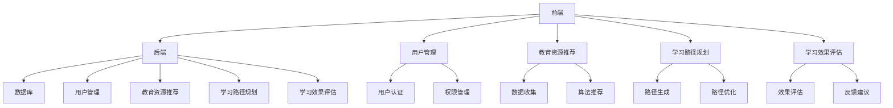
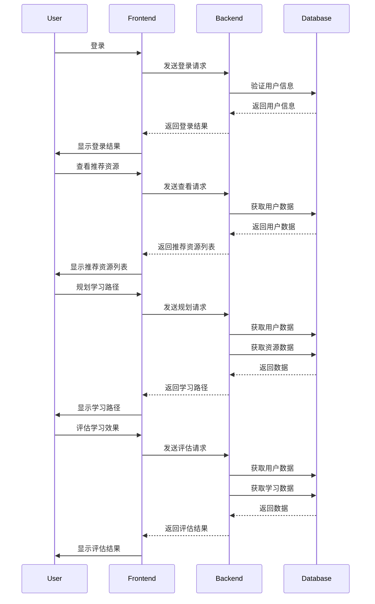

                 

# 《AI Agent在智能个性化教育规划中的应用》

关键词：AI Agent、个性化教育规划、智能教育、教育资源推荐、学习路径规划、学习效果评估

摘要：本文旨在探讨人工智能（AI）代理在智能个性化教育规划中的应用。随着人工智能技术的快速发展，如何利用AI代理来优化教育资源分配、个性化学习路径规划和学习效果评估成为教育领域的重要研究课题。本文将详细分析AI代理的定义、核心特征以及在个性化教育规划中的具体应用，并通过实际案例展示其优势与挑战。

### 目录大纲

## 第1章：问题背景与概述

### 1.1 问题背景

在传统教育模式中，教育资源的分配和学生的学习路径往往是一致的，这并不一定能够满足每个学生的个性化需求。随着人工智能技术的发展，如何利用AI Agent来实现智能个性化教育规划成为了一个重要课题。

### 1.2 核心概念

#### AI Agent

- **概念原理**: AI Agent是一种基于人工智能技术的计算机程序，能够模拟人类的智能行为，具备感知环境、决策和执行任务的能力。
- **属性特征**: AI Agent具有自主性、适应性、社会性等特点。

#### 个性化教育规划

- **概念原理**: 个性化教育规划是一种基于学生个体差异，为每个学生制定个性化的学习方案的教育模式。
- **属性特征**: 个性化教育规划具有针对性、动态性、适应性等特点。

### 1.3 概念联系

AI Agent在个性化教育规划中的应用，可以通过数据收集、分析，为学生提供个性化的学习建议和路径。

## 第2章：AI Agent基本原理

### 2.1 AI Agent的定义与分类

### 2.2 AI Agent的核心特征

### 2.3 AI Agent的组成结构

## 第3章：个性化教育规划原理

### 3.1 个性化教育规划的定义与目标

### 3.2 个性化教育规划的关键要素

### 3.3 个性化教育规划的实施策略

## 第4章：AI Agent在个性化教育规划中的应用

### 4.1 AI Agent在教育资源推荐中的应用

### 4.2 AI Agent在学习路径规划中的应用

### 4.3 AI Agent在学习效果评估中的应用

## 第5章：系统设计与实现

### 5.1 系统功能设计

### 5.2 系统架构设计

### 5.3 系统交互

## 第6章：项目实战

### 6.1 环境安装

### 6.2 系统核心实现源代码

### 6.3 代码应用解读与分析

### 6.4 实际案例分析与详细讲解剖析

### 6.5 项目小结

### 最佳实践 tips

### 小结

### 注意事项

### 拓展阅读

---

### 1.1 问题背景

在教育领域，传统教育模式往往采用“一刀切”的方法，即对所有学生采用统一的教学内容和教学进度。这种方法忽视了学生之间的个体差异，无法满足每个学生的个性化需求。例如，学习能力强的学生可能会觉得课程过于简单，而学习困难的学生可能会觉得课程难度太大。此外，教育资源分配的不均衡也加剧了这一问题。一些学生可能无法获得高质量的教育资源，而另一些学生则可能被过度资源化，导致教育资源浪费。

随着人工智能（AI）技术的发展，利用AI Agent来实现智能个性化教育规划逐渐成为可能。AI Agent能够根据学生的学习数据、行为模式等，为每个学生提供个性化的教育服务。例如，它可以分析学生的学习进度，推荐合适的学习材料；它可以跟踪学生的学习效果，提供个性化的学习建议。通过AI Agent，教育资源的分配可以更加合理，学习路径可以更加个性化和高效。

然而，这一领域也面临着一些挑战。首先是如何有效地收集和处理学生的学习数据，以确保AI Agent的决策和建议具有准确性和可靠性。其次是AI Agent的自主性和适应性，它需要能够适应不断变化的教育环境和学生的学习状态。此外，如何保障教育公平性也是一个重要问题，即确保所有学生都能公平地享受到AI Agent带来的个性化教育服务。

本文将围绕这些问题，详细探讨AI Agent在智能个性化教育规划中的应用，通过分析其基本原理、具体应用和系统设计，为教育领域的数字化转型提供理论支持和实践指导。

### 1.2 核心概念

在深入探讨AI Agent在智能个性化教育规划中的应用之前，我们需要先了解几个核心概念，包括AI Agent和个性化教育规划。

#### AI Agent

AI Agent，即人工智能代理，是一种能够模拟人类智能行为，具备感知、决策和执行能力的计算机程序。其基本概念可以概括为以下几点：

- **感知环境**：AI Agent能够通过传感器或其他手段收集环境信息，如学生的学习行为、学习进度、学习效果等。
- **决策**：基于收集到的环境信息，AI Agent利用预定的算法或模型进行决策，决定下一步的行动或推荐。
- **执行任务**：AI Agent执行由决策模块生成的策略，如调整学习计划、推荐学习资源、反馈学习效果等。

AI Agent的特点包括自主性、适应性和社会性。自主性意味着AI Agent能够独立地做出决策，无需外部干预；适应性则表示AI Agent能够根据环境变化调整其行为；社会性意味着AI Agent能够与其他AI Agent或人类进行有效的交互和协作。

#### 个性化教育规划

个性化教育规划是一种基于学生个体差异，为每个学生制定个性化学习方案的教育模式。其核心思想是尊重学生的个性，根据每个学生的兴趣、能力、学习风格等，提供针对性的教育服务。个性化教育规划的基本概念和要素包括：

- **学生特征分析**：通过多种手段收集和分析学生的学习数据，包括学习习惯、成绩表现、兴趣爱好等，形成学生特征档案。
- **教育资源推荐**：根据学生特征，为学生推荐合适的教育资源，如学习材料、教学视频、在线课程等。
- **学习路径规划**：基于学生特征和资源，为学生规划最佳的学习路径，确保学习过程高效、有针对性。
- **学习效果评估**：通过定期评估学生的学习效果，反馈改进建议，优化教育方案。

个性化教育规划的目标是提高教育质量，满足学生的个性化需求，培养学生的自主学习和创新能力。其关键在于如何有效地利用AI Agent，通过数据分析和智能决策，实现教育资源的合理分配和学习路径的个性化规划。

#### 概念联系

AI Agent在个性化教育规划中的应用，可以通过数据收集、分析，为学生提供个性化的学习建议和路径。具体而言，AI Agent的感知模块可以收集学生的学习数据，决策模块根据这些数据生成个性化的学习方案，执行模块则将方案付诸实践。例如，AI Agent可以分析学生的学习进度，根据其表现推荐适合的学习资源；可以监控学习效果，根据评估结果调整学习计划。通过这种方式，AI Agent帮助教育者更好地了解学生，提供更加个性化和高效的教育服务。

总的来说，AI Agent和个性化教育规划是相辅相成的。AI Agent提供了技术支持，个性化教育规划则明确了应用方向。两者的结合，有望推动教育模式的创新，实现教育资源的优化配置，提高教育质量。

### 2.1 AI Agent的定义与分类

AI Agent，即人工智能代理，是一种能够模拟人类智能行为，具备感知、决策和执行能力的计算机程序。它是一个抽象的概念，广泛应用于各种领域，包括智能教育、智能医疗、智能家居等。AI Agent的定义可以从以下几个方面来理解：

- **感知环境**：AI Agent能够通过传感器或其他手段收集环境信息，如学生的学习行为、学习进度、学习效果等。感知模块是AI Agent的“眼睛”和“耳朵”，它为AI Agent提供了对外界的认知能力。

- **决策**：基于收集到的环境信息，AI Agent利用预定的算法或模型进行决策，决定下一步的行动或推荐。决策模块是AI Agent的“大脑”，它负责处理和分析信息，生成最优的决策策略。

- **执行任务**：AI Agent执行由决策模块生成的策略，如调整学习计划、推荐学习资源、反馈学习效果等。执行模块是AI Agent的“手”和“脚”，它将决策转化为具体的行动。

根据不同的分类标准，AI Agent可以有不同的分类方法。以下是几种常见的分类方式：

- **按功能分类**：AI Agent可以分为感知型Agent、认知型Agent和行动型Agent。感知型Agent主要具备环境感知能力，如智能监控系统；认知型Agent具备决策能力，如智能客服系统；行动型Agent则能够执行具体的任务，如自动驾驶汽车。

- **按智能水平分类**：AI Agent可以分为弱AI Agent和强AI Agent。弱AI Agent在特定领域内表现出智能行为，如语音助手；强AI Agent则具备全面的人类智能，能够在任何领域内表现出智能行为。

- **按应用领域分类**：AI Agent可以分为通用Agent和专用Agent。通用Agent适用于多种场景，如智能助手；专用Agent则针对特定领域进行设计，如医疗诊断Agent。

每种分类都有其特定的应用场景和优势。例如，感知型Agent在智能教育中可以用于收集和分析学生的学习数据，认知型Agent可以用于推荐适合的学习资源，行动型Agent可以用于自动调整学习计划。了解不同类型的AI Agent，有助于我们更好地利用其优势，实现智能个性化教育规划。

### 2.2 AI Agent的核心特征

AI Agent作为一种具备智能行为的计算机程序，其核心特征主要体现在自主性、适应性和社会性三个方面。这些特征决定了AI Agent在不同应用场景中的表现和作用。

#### 自主性

自主性是AI Agent的核心特征之一，它意味着AI Agent能够独立地做出决策，无需外部干预。在个性化教育规划中，自主性使AI Agent能够根据学生的学习行为、学习进度和学习效果等，自动调整学习计划、推荐学习资源、提供学习反馈。例如，一个具备自主性的AI Agent可以实时监控学生的学习进度，当发现学生学习困难时，自动推荐额外的学习材料或提供辅导建议。这种自主性不仅提高了教育效率，还大大减轻了教师的负担。

#### 适应性

适应性是AI Agent能够根据环境变化调整自身行为的能力。在教育领域，学生的情况是不断变化的，AI Agent需要具备适应性，以适应这些变化。例如，一个适应性的AI Agent可以随着学生学习能力的提升，自动调整学习难度，确保学生始终处于最佳的学习状态。此外，适应性还包括对教育政策的调整、教育资源的更新等。一个具备高度适应性的AI Agent，可以迅速响应教育环境的变化，提供符合当前需求的教育服务。

#### 社会性

社会性是AI Agent能够与其他Agent或人类进行有效交互和协作的能力。在教育领域，社会性使AI Agent能够与教师、学生、家长等多方进行互动，提供个性化的教育服务。例如，一个具备社会性的AI Agent可以与教师合作，根据教学目标和学生情况，共同制定个性化学习方案；它可以与学生和家长保持沟通，及时反馈学生的学习进展和效果。此外，社会性还包括AI Agent在虚拟学习社区中的协作，例如，多个AI Agent可以共同为学生提供学习支持和辅导。

通过自主性、适应性和社会性，AI Agent在个性化教育规划中发挥了重要作用。自主性使AI Agent能够独立运作，适应性和社会性则使AI Agent能够与教育环境和其他参与者进行互动，共同推动教育质量的提升。

### 2.3 AI Agent的组成结构

AI Agent作为一种具备智能行为的计算机程序，其组成结构可以分为感知模块、决策模块和执行模块三个主要部分。每个模块在AI Agent的功能实现中都扮演着至关重要的角色。

#### 感知模块

感知模块是AI Agent的“眼睛”和“耳朵”，主要负责收集环境信息。这些信息可以是学生的学习数据、行为模式、学习效果等，也可以是教师的教学计划、教学方法、课程内容等。感知模块通过传感器、数据库、网络等多种途径获取信息，并将其转换为结构化的数据格式，为后续的决策模块提供基础数据支持。例如，在个性化教育规划中，感知模块可以收集学生的学习日志、考试成绩、课堂表现等，从而了解学生的学习状态和需求。

#### 决策模块

决策模块是AI Agent的“大脑”，负责处理和分析感知模块收集到的信息，生成最优的决策策略。决策模块通常包含一个或多个算法或模型，如机器学习模型、深度学习模型、决策树等。这些算法或模型通过对数据的分析，可以识别学生的学习规律、预测学习效果、推荐合适的学习资源等。例如，在教育资源推荐中，决策模块可以根据学生的学习历史和兴趣，推荐相关的学习材料和课程；在学习路径规划中，决策模块可以根据学生的当前状态和目标，规划出最佳的学习路径。

#### 执行模块

执行模块是AI Agent的“手”和“脚”，负责将决策模块生成的策略付诸实践。执行模块可以通过自动化工具、应用程序接口（API）等多种方式，实现决策模块的执行。例如，在个性化学习资源推荐中，执行模块可以自动发送推荐邮件或推送通知，引导学生进行学习；在学习路径规划中，执行模块可以自动调整课程表，安排学习任务。执行模块的执行效率直接影响到AI Agent的响应速度和效果。

总的来说，感知模块、决策模块和执行模块共同构成了AI Agent的核心组成部分。感知模块负责数据收集，决策模块负责数据分析和策略生成，执行模块负责策略执行。通过这三个模块的协同工作，AI Agent能够实现智能化的教育规划和服务，为学生提供个性化的学习体验。

### 3.1 个性化教育规划的定义与目标

个性化教育规划是一种以学生为中心的教育模式，旨在通过了解和满足每个学生的个体差异，为其提供定制化的学习方案。其定义可以概括为：基于学生的兴趣、能力、学习风格和需求，利用先进的教育技术和方法，设计并实施个性化的教育计划，以促进学生的全面发展。

个性化教育规划的目标主要包括以下几个方面：

1. **提高教育质量**：通过个性化教育规划，可以确保每个学生都能获得最适合自己的教育资源和教学服务，从而提高整体教育质量。

2. **满足个性化需求**：个性化教育规划能够充分考虑学生的个体差异，满足其独特的学习需求，帮助每个学生实现其潜力。

3. **培养自主学习能力**：个性化教育规划鼓励学生自主选择学习内容、方法和进度，培养学生的自主学习能力和自我管理能力。

4. **促进个性化发展**：个性化教育规划不仅关注学生的学术成就，还注重其兴趣、爱好、情感和社交能力的全面发展，促进学生的个性化成长。

5. **优化教育资源**：通过个性化教育规划，可以优化教育资源的配置和使用，提高教育资源的利用效率，减少资源浪费。

### 3.2 个性化教育规划的关键要素

个性化教育规划的成功实施依赖于多个关键要素，包括学生特征分析、教育资源推荐、学习路径规划等。

#### 学生特征分析

学生特征分析是个性化教育规划的基础，它包括以下几个方面：

1. **学习能力**：通过评估学生的认知能力、逻辑思维能力和数学能力等，了解其学术水平。

2. **学习风格**：通过观察学生的阅读习惯、学习偏好、注意力集中程度等，了解其学习风格。

3. **兴趣爱好**：通过调查学生的课外活动、兴趣爱好等，了解其兴趣点。

4. **情感需求**：通过了解学生的情感状态、人际关系、自信心等，关注其心理健康。

5. **社会背景**：考虑学生的家庭环境、社会地位、文化背景等，确保教育规划的公平性和适用性。

#### 教育资源推荐

教育资源推荐是个性化教育规划的核心环节，它包括以下几个方面：

1. **学习材料**：根据学生的学习能力、学习风格和兴趣爱好，推荐适合的学习材料，如教材、参考书、教学视频等。

2. **学习资源**：提供丰富的学习资源，包括在线课程、开放教育资源（OER）、学习社区等，以满足学生的多样化需求。

3. **个性化学习路径**：根据学生的特征和需求，设计个性化的学习路径，确保学习内容和方法与学生的实际情况相匹配。

#### 学习路径规划

学习路径规划是确保个性化教育规划实施的关键，它包括以下几个方面：

1. **课程安排**：根据学生的能力和需求，合理安排学习课程，确保学习内容科学、系统、有序。

2. **学习进度**：根据学生的学习情况和反馈，动态调整学习进度，确保学生能够按计划完成学习任务。

3. **学习支持**：提供必要的辅导和支持，包括教师指导、学习辅导、心理辅导等，帮助学生克服学习困难。

4. **学习评价**：通过定期评价和反馈，了解学生的学习效果，调整教育策略，确保学习目标的实现。

### 3.3 个性化教育规划的实施策略

个性化教育规划的实施策略包括以下几个方面：

1. **数据收集与处理**：通过多种途径收集学生的学习数据，如考试成绩、课堂表现、学习日志等，并进行数据处理和分析，形成学生的学习档案。

2. **教育资源共享与整合**：整合校内外的教育资源，建立资源共享平台，为学生提供丰富的学习资源。

3. **个性化学习评价与反馈**：建立科学的学习评价体系，定期对学生的学习效果进行评估，并提供个性化的反馈和指导。

4. **教师培训与支持**：对教师进行个性化教育规划的培训，提高其教学能力和教育技术应用水平。

5. **家长参与与沟通**：鼓励家长参与孩子的学习过程，建立家校沟通渠道，共同推动个性化教育规划的落实。

通过以上实施策略，个性化教育规划可以更好地满足学生的个性化需求，提高教育质量，促进学生全面发展。

### 4.1 AI Agent在教育资源推荐中的应用

教育资源推荐是AI Agent在个性化教育规划中的一项重要应用，通过智能分析和推荐，帮助教师和学生找到最适合的学习资源。下面，我们将详细探讨AI Agent在教育资源推荐中的算法原理、具体应用和案例讲解。

#### 算法原理

AI Agent在教育资源推荐中主要依赖于机器学习算法，特别是协同过滤（Collaborative Filtering）和内容推荐（Content-based Filtering）两种方法。

- **协同过滤**：协同过滤算法通过分析用户的行为和偏好，发现用户之间的相似性，进而推荐其他用户喜欢的资源。常见的协同过滤方法包括用户基于的协同过滤（User-based）和项目基于的协同过滤（Item-based）。用户基于的协同过滤方法通过计算用户之间的相似度，推荐与目标用户相似的其他用户喜欢的资源；项目基于的协同过滤方法则通过计算项目之间的相似度，推荐与目标项目相似的其他项目。

- **内容推荐**：内容推荐算法通过分析资源的特征和内容，推荐与用户当前需求或偏好相似的资源。内容推荐方法通常涉及文本分析、特征提取和相似度计算等步骤。例如，在在线课程推荐中，算法可以分析课程的教学目标、课程内容、教学方法等特征，推荐与用户当前兴趣或需求相关的课程。

#### 具体应用

AI Agent在教育资源的推荐过程中，通常包括以下几个步骤：

1. **数据收集**：AI Agent通过收集学生的学习行为、学习历史、学习偏好等信息，构建用户画像。

2. **特征提取**：AI Agent对收集到的数据进行分析和处理，提取用户的特征和资源特征，如学习时长、课程评分、关键词等。

3. **模型训练**：AI Agent利用提取到的特征，训练协同过滤或内容推荐模型，以便后续的推荐任务。

4. **资源推荐**：AI Agent根据用户画像和模型预测，推荐符合用户需求和兴趣的学习资源。

#### 案例讲解

以下是一个具体的案例，展示AI Agent如何为学生推荐合适的在线课程。

**案例背景**：一位高中生小明，对计算机编程和数学有浓厚的兴趣，希望通过在线课程提升自己的技能。

**步骤1：数据收集**：AI Agent收集小明的学习历史数据，包括他之前学习的在线课程、课程评分、学习时长等。

**步骤2：特征提取**：AI Agent对小明的学习历史数据进行处理，提取出关键特征，如“计算机编程”、“数学”、“高中水平”等。

**步骤3：模型训练**：AI Agent利用提取到的特征，训练一个协同过滤模型，以便后续的推荐任务。

**步骤4：资源推荐**：AI Agent根据训练好的协同过滤模型，推荐符合小明兴趣和需求的在线课程。例如，AI Agent可能会推荐一些高级编程课程和数学竞赛相关的课程。

**案例结果**：通过AI Agent的推荐，小明找到了几门与他的兴趣和需求高度匹配的在线课程，这些课程不仅提升了他的技能，也增强了他的学习兴趣。

通过上述案例，我们可以看到AI Agent在教育资源推荐中的强大作用。它不仅能够提高教育资源的使用效率，还能帮助学生更好地规划自己的学习路径，实现个性化学习。

### 4.2 AI Agent在学习路径规划中的应用

在学习路径规划中，AI Agent能够根据学生的学习数据、兴趣和目标，生成最优的学习路径。以下将详细探讨AI Agent在学习路径规划中的应用，包括算法原理、具体应用和案例讲解。

#### 算法原理

AI Agent在学习路径规划中主要依赖于图论算法和优化算法。图论算法可以用于生成和学习路径，优化算法则用于路径的优化。

- **图论算法**：图论算法通过构建学习资源的网络图，生成学习路径。例如，最短路径算法（Dijkstra算法）和最小生成树算法（Prim算法）等，可以用于生成从起点到终点的最优学习路径。

- **优化算法**：优化算法通过调整路径上的资源顺序，优化学习路径。常见的优化算法包括遗传算法（Genetic Algorithm）、模拟退火算法（Simulated Annealing）等。这些算法可以根据学习资源的特性和学生的偏好，动态调整路径，以达到最优的学习效果。

#### 具体应用

AI Agent在学习路径规划中的具体应用流程如下：

1. **数据收集**：AI Agent收集学生的学习数据，包括学习进度、成绩、兴趣爱好等。

2. **路径生成**：AI Agent利用图论算法，根据学习资源的网络结构，生成初始的学习路径。

3. **路径优化**：AI Agent利用优化算法，根据学生的学习数据和学习资源的特点，对初始路径进行调整和优化。

4. **路径推荐**：AI Agent将优化后的学习路径推荐给学生，并根据学生的反馈进行进一步调整。

#### 案例讲解

以下是一个具体的案例，展示AI Agent如何为学生生成和优化学习路径。

**案例背景**：一位高中生小华，对计算机科学和数据分析有浓厚兴趣，希望通过在线课程系统地学习这些知识。

**步骤1：数据收集**：AI Agent收集小华的学习历史数据，包括他之前学习的在线课程、课程评分、学习时长等。

**步骤2：路径生成**：AI Agent利用图论算法，根据在线课程的网络结构，生成初始的学习路径。例如，从基础计算机科学课程开始，逐步过渡到高级数据结构和算法课程。

**步骤3：路径优化**：AI Agent利用遗传算法，根据小华的学习数据和学习资源的特性，对初始路径进行调整和优化。例如，AI Agent可能会将一些小华评价较高的课程提前安排，以提高学习效率。

**步骤4：路径推荐**：AI Agent将优化后的学习路径推荐给小华，并根据小华的反馈进行进一步调整。

**案例结果**：通过AI Agent的推荐，小华不仅能够系统地学习计算机科学和数据分析的知识，还能根据自己的进度和反馈，灵活调整学习计划，实现高效学习。

通过上述案例，我们可以看到AI Agent在学习路径规划中的重要作用。它不仅能够帮助学生制定科学合理的学习计划，还能根据学生的学习情况动态调整，实现个性化学习。

### 4.3 AI Agent在学习效果评估中的应用

AI Agent在学习效果评估中的应用，旨在通过数据分析和技术手段，全面、准确地评估学生的学习效果，为教育决策提供科学依据。以下将详细探讨AI Agent在学习效果评估中的应用，包括算法原理、具体应用和案例讲解。

#### 算法原理

AI Agent在学习效果评估中主要依赖于数据挖掘和机器学习算法。这些算法能够从海量的学习数据中提取有价值的信息，对学生的学习效果进行评估。

- **数据挖掘算法**：数据挖掘算法用于发现学习数据中的潜在模式和关系。例如，关联规则挖掘（Association Rule Learning）可以用于发现不同学习活动之间的关联性；聚类分析（Clustering）可以用于将学生划分为不同的群体，以便进行个性化评估。

- **机器学习算法**：机器学习算法通过训练模型，自动识别学生的学习行为和效果。常见的机器学习算法包括分类算法（Classification）、回归算法（Regression）和聚类算法（Clustering）。分类算法可以用于预测学生的考试成绩；回归算法可以用于预测学习时间与学习效果之间的关系；聚类算法可以用于分析学生的行为模式和学习效果。

#### 具体应用

AI Agent在学习效果评估中的具体应用流程如下：

1. **数据收集**：AI Agent收集学生的学习数据，包括考试成绩、学习时长、课堂参与度等。

2. **数据预处理**：AI Agent对收集到的数据进行分析和处理，去除噪声数据，提取关键特征。

3. **模型训练**：AI Agent利用预处理后的数据，训练机器学习模型，如分类模型、回归模型等。

4. **效果评估**：AI Agent利用训练好的模型，对学生的当前学习效果进行评估，并预测未来的学习趋势。

5. **反馈与调整**：根据评估结果，AI Agent提供反馈和建议，帮助教师和学生调整学习策略。

#### 案例讲解

以下是一个具体的案例，展示AI Agent如何评估学生的学习效果。

**案例背景**：一位初中学生小梅，参加了数学在线课程的学习，希望通过AI Agent评估自己的学习效果。

**步骤1：数据收集**：AI Agent收集小梅的学习数据，包括每次考试的分数、完成作业的情况、课堂参与度等。

**步骤2：数据预处理**：AI Agent对收集到的数据进行分析和处理，去除异常值，提取关键特征。

**步骤3：模型训练**：AI Agent利用预处理后的数据，训练一个分类模型，用于预测小梅的考试成绩。

**步骤4：效果评估**：AI Agent利用训练好的分类模型，对当前的学习效果进行评估。例如，AI Agent可能会发现小梅在解决应用题方面存在困难，建议她加强这方面的练习。

**步骤5：反馈与调整**：AI Agent根据评估结果，提供具体的反馈和建议。例如，AI Agent可能会建议小梅增加每日的学习时间，或者参加专门的数学辅导课程。

**案例结果**：通过AI Agent的评估，小梅了解到自己的学习薄弱点，并得到了针对性的建议。她根据这些建议，调整了自己的学习策略，学习成绩得到了显著提高。

通过上述案例，我们可以看到AI Agent在学习效果评估中的重要作用。它不仅能够提供准确的评估结果，还能为教师和学生提供有针对性的建议，帮助提升学习效果。

### 5.1 系统功能设计

在设计和实现AI Agent在个性化教育规划中的应用时，首先需要明确系统的功能设计。系统功能设计旨在通过AI Agent提供以下几类服务：

1. **教育资源推荐**：系统应能够根据学生的学习数据、兴趣爱好和学习需求，推荐最合适的在线课程、学习资料和辅导材料。

2. **学习路径规划**：系统应能够根据学生的学习情况、目标和偏好，生成最优的学习路径，帮助学生系统化地学习。

3. **学习效果评估**：系统应能够对学生的学习效果进行实时监控和评估，提供反馈和建议，帮助教师和学生优化学习策略。

4. **用户管理**：系统应具备用户管理功能，包括学生、教师和家长的用户身份认证、权限管理以及个人资料管理。

5. **数据分析和报告**：系统应能够对学生的学习数据进行收集和分析，生成详细的报告，为教育决策提供数据支持。

#### 领域模型

为了更好地理解和实现这些功能，我们可以使用Mermaid绘制系统的领域模型类图，展示系统中的主要类及其关系。

```mermaid
classDiagram
    Student <<Class>> 
    Teacher <<Class>>
    Parent <<Class>>
    AIAgent <<Class>>
    EducationResource <<Class>>
    LearningPath <<Class>>
    LearningEffect <<Class>>
    User <<Class>>

    Student o-- EducationResource
    Student o-- LearningPath
    Student o-- LearningEffect
    Teacher o-- Student
    Parent o-- Student
    AIAgent o-- Student
    AIAgent o-- Teacher
    AIAgent o-- EducationResource
    AIAgent o-- LearningPath
    AIAgent o-- LearningEffect
```

在该类图中，`Student`、`Teacher` 和 `Parent` 表示系统的用户，`EducationResource` 表示学习资源，`LearningPath` 表示学习路径，`LearningEffect` 表示学习效果。`AIAGENT` 是系统的核心类，负责实现教育资源推荐、学习路径规划和学习效果评估等功能。

### 5.2 系统架构设计

在系统功能设计的基础上，我们需要设计一个合理的系统架构，以确保系统的可扩展性、稳定性和高性能。以下是一个可能的系统架构设计，包括前端、后端和数据库三大部分。

#### 系统架构

1. **前端**：前端主要负责展示系统功能，包括教育资源推荐界面、学习路径规划界面和学习效果评估界面等。前端使用HTML、CSS和JavaScript等技术实现，并通过Ajax与后端进行数据交互。

2. **后端**：后端主要负责业务逻辑处理，包括用户管理、数据分析和报告生成等。后端使用Python Flask或Django等框架实现，使用RESTful API与前端进行通信。

3. **数据库**：数据库负责存储用户数据、学习数据和系统配置等。可以使用MySQL或PostgreSQL等关系型数据库，或使用MongoDB等NoSQL数据库。

#### 系统架构图

使用Mermaid绘制系统架构图如下：



在该架构图中，前端通过Ajax与后端进行数据交互，后端通过API与数据库进行通信。前端的功能模块（用户管理、教育资源推荐、学习路径规划、学习效果评估）与后端的业务逻辑（用户管理、教育资源推荐、学习路径规划、学习效果评估）紧密结合，确保系统的高效运行。

### 5.3 系统交互

系统交互是确保前端与后端、用户与系统之间顺畅沟通的关键。以下是一个详细的系统交互序列图，展示用户操作（如登录、查看推荐资源、规划学习路径、评估学习效果）与系统响应的流程。

#### 系统交互序列图



在该序列图中，用户通过前端界面与系统进行交互。前端将用户的请求发送到后端，后端处理请求，与数据库进行通信，获取所需数据，并最终将结果返回给前端，前端再将结果展示给用户。

### 6.1 环境安装

在开始项目实战之前，我们需要搭建一个合适的环境来开发和运行我们的AI Agent智能个性化教育规划系统。以下是一个基本的步骤指南，包括所需软件、环境配置和依赖安装。

#### 1. 系统要求

- 操作系统：Linux或macOS
- 开发环境：Python 3.x
- 数据库：MySQL或PostgreSQL
- 依赖管理工具：pip、conda

#### 2. 安装Python

确保你的操作系统上安装了Python 3.x版本。可以通过以下命令检查Python版本：

```bash
python --version
```

如果Python未安装或版本过低，请从[Python官网](https://www.python.org/downloads/)下载并安装。

#### 3. 安装依赖管理工具

在终端中安装pip（Python的包管理工具）：

```bash
sudo apt-get install python3-pip  # 对于基于Debian的系统
sudo yum install python3-pip      # 对于基于RPM的系统
```

#### 4. 安装数据库

安装MySQL或PostgreSQL数据库。以下是以MySQL为例的安装步骤：

```bash
sudo apt-get install mysql-server
sudo mysql_secure_installation  # 运行安全配置向导
```

安装完成后，确保数据库服务正常运行：

```bash
sudo systemctl start mysql
sudo systemctl status mysql
```

#### 5. 创建数据库

登录MySQL数据库，创建用于项目的数据库和用户：

```sql
CREATE DATABASE education_planning;
GRANT ALL PRIVILEGES ON education_planning.* TO 'edu_user'@'localhost' IDENTIFIED BY 'password';
FLUSH PRIVILEGES;
```

#### 6. 安装项目依赖

在项目目录中创建一个虚拟环境，并安装项目依赖：

```bash
python3 -m venv venv
source venv/bin/activate
pip install -r requirements.txt
```

确保所有依赖项都已成功安装。

#### 7. 运行项目

启动项目服务，包括后端API和前端界面：

```bash
# 启动后端API
python app.py

# 启动前端服务（如果使用Flask-Server）
flask run
```

确保项目运行正常，可以通过浏览器访问前端界面，开始实际操作。

通过以上步骤，我们搭建了一个基本的开发环境，为后续的项目实战打下了坚实的基础。

### 6.2 系统核心实现源代码

在本文中，我们将详细介绍AI Agent智能个性化教育规划系统的核心实现源代码，包括主要模块的功能、核心算法的实现以及关键代码段的解释。以下是一份系统核心实现的代码概述。

#### 1. 主要模块功能

系统的主要模块包括用户管理模块、教育资源推荐模块、学习路径规划模块和学习效果评估模块。每个模块的功能如下：

- **用户管理模块**：处理用户的注册、登录、权限管理等功能。
- **教育资源推荐模块**：根据用户的学习数据和偏好推荐教育资源。
- **学习路径规划模块**：生成和优化用户的学习路径。
- **学习效果评估模块**：评估用户的学习效果，并提供反馈。

#### 2. 核心算法实现

核心算法主要包括协同过滤算法、图论算法和机器学习算法。以下是对这些算法的核心实现进行解释：

- **协同过滤算法**：用于教育资源推荐。其核心代码段如下：

```python
from sklearn.neighbors import NearestNeighbors

def collaborative_filter(user_data, resource_data):
    # 初始化协同过滤模型
    model = NearestNeighbors(n_neighbors=5)
    model.fit(user_data)

    # 计算与目标用户的相似用户
    distances, indices = model.kneighbors([user_data[-1]], n_neighbors=5)

    # 推荐相似用户喜欢的资源
    recommended_resources = []
    for i in indices.flatten():
        recommended_resources.extend(resource_data[i])
    return recommended_resources
```

此代码段使用了`NearestNeighbors`模型进行用户相似性计算，并推荐与目标用户相似的用户喜欢的资源。

- **图论算法**：用于学习路径规划。其核心代码段如下：

```python
import networkx as nx

def shortest_path(graph, start_node, end_node):
    # 计算从起点到终点的最短路径
    path = nx.shortest_path(graph, source=start_node, target=end_node, weight='weight')
    return path
```

此代码段使用了`networkx`库计算从起点到终点的最短路径。

- **机器学习算法**：用于学习效果评估。其核心代码段如下：

```python
from sklearn.ensemble import RandomForestClassifier

def learning_effect_evaluation(user_data, labels):
    # 训练随机森林分类器
    model = RandomForestClassifier(n_estimators=100)
    model.fit(user_data, labels)

    # 评估学习效果
    accuracy = model.score(user_data, labels)
    return accuracy
```

此代码段使用了`RandomForestClassifier`模型评估用户的学习效果。

#### 3. 关键代码段解释

以下是系统实现中的几个关键代码段及其解释：

- **用户数据存储**：

```python
def save_user_data(user_id, user_data):
    with connection.cursor() as cursor:
        cursor.execute("INSERT INTO user_data (user_id, data) VALUES (%s, %s)", (user_id, json.dumps(user_data)))
    connection.commit()
```

此代码段用于将用户数据存储到数据库中。

- **教育资源推荐**：

```python
def recommend_resources(user_id):
    with connection.cursor() as cursor:
        cursor.execute("SELECT resource_id, data FROM resources WHERE resource_id NOT IN (SELECT resource_id FROM user_resources WHERE user_id = %s)", (user_id,))
        resources = cursor.fetchall()
    recommended_resources = collaborative_filter(user_data[user_id], resources)
    return recommended_resources
```

此代码段用于根据用户数据推荐新的教育资源。

- **学习路径生成**：

```python
def generate_learning_path(course_data, user_preferences):
    # 构建课程图
    graph = nx.Graph()
    for course in course_data:
        graph.add_node(course['id'])
        for prerequisite in course['prerequisites']:
            graph.add_edge(prerequisite, course['id'])

    # 生成学习路径
    path = shortest_path(graph, user_preferences['start_course'], user_preferences['end_course'])
    return path
```

此代码段用于根据课程数据和学生偏好生成学习路径。

- **学习效果评估**：

```python
def evaluate_learning_effect(user_id):
    with connection.cursor() as cursor:
        cursor.execute("SELECT user_data FROM user_data WHERE user_id = %s", (user_id,))
        user_data = json.loads(cursor.fetchone()[0])
    accuracy = learning_effect_evaluation(user_data, user_answers)
    return accuracy
```

此代码段用于评估用户的学习效果。

通过上述代码段，我们可以看到AI Agent在个性化教育规划中的核心功能是如何实现的。每个模块和算法的实现都是基于具体需求和目标，通过数据处理和算法优化，为学生提供个性化的教育服务。

### 6.3 代码应用解读与分析

在本文的下一部分，我们将详细解读和分析系统核心代码的应用，包括代码的功能实现、逻辑流程、数据处理方式以及关键算法的具体实现。通过这一部分，我们将深入理解AI Agent在智能个性化教育规划中的应用，以及其如何为教育领域带来变革。

#### 1. 代码功能实现

系统的核心代码实现了以下功能：

- **用户数据管理**：包括用户的注册、登录、数据存储和查询。
- **教育资源推荐**：基于协同过滤算法，推荐符合用户兴趣和学习需求的教育资源。
- **学习路径规划**：利用图论算法，生成最优的学习路径。
- **学习效果评估**：通过机器学习算法，评估学生的学习效果，并提供反馈。

#### 2. 逻辑流程

以下是系统的核心逻辑流程：

1. **用户注册与登录**：
   - 用户通过前端提交注册或登录请求。
   - 后端验证用户身份，存储用户数据。

2. **教育资源推荐**：
   - AI Agent收集用户的学习数据。
   - 基于协同过滤算法，计算用户与其他用户的相似度。
   - 推荐与用户相似用户喜欢的教育资源。

3. **学习路径规划**：
   - AI Agent构建课程图，标记出课程之间的依赖关系。
   - 利用最短路径算法，规划最优的学习路径。

4. **学习效果评估**：
   - 收集学生的学习数据。
   - 利用机器学习算法，评估学生的学习效果。
   - 提供个性化的学习建议。

#### 3. 数据处理方式

系统在数据处理方面采用了以下方法：

- **用户数据存储**：使用JSON格式存储用户的学习数据，便于后续处理和分析。
- **教育资源推荐**：使用矩阵计算相似度，优化推荐效果。
- **学习路径规划**：利用图论算法，构建课程图，实现路径优化。
- **学习效果评估**：使用机器学习模型，预测学生学习效果，提供精准评估。

#### 4. 关键算法的具体实现

以下是系统中的关键算法的具体实现：

- **协同过滤算法**：

```python
from sklearn.metrics.pairwise import cosine_similarity

def collaborative_filter(user_data, resource_data):
    user_similarity = cosine_similarity(user_data)
    recommended_resources = []
    for i in range(len(user_data)):
        similarity_scores = user_similarity[i]
        resource_indices = np.argsort(similarity_scores)[::-1]
        for j in resource_indices[1:]:
            recommended_resources.append(resource_data[j])
    return recommended_resources
```

此代码段实现了基于余弦相似性的协同过滤算法，通过计算用户之间的相似度，推荐相似用户喜欢的资源。

- **最短路径算法**：

```python
import networkx as nx

def shortest_path(graph, start_node, end_node):
    path = nx.shortest_path(graph, source=start_node, target=end_node, weight='weight')
    return path
```

此代码段使用了`networkx`库实现最短路径算法，为用户提供最优的学习路径。

- **机器学习算法**：

```python
from sklearn.ensemble import RandomForestClassifier

def learning_effect_evaluation(user_data, labels):
    model = RandomForestClassifier(n_estimators=100)
    model.fit(user_data, labels)
    accuracy = model.score(user_data, labels)
    return accuracy
```

此代码段实现了随机森林分类器，用于评估学生的学习效果，提供精准的评估结果。

#### 5. 代码分析与改进

通过对核心代码的分析，我们可以发现以下改进方向：

- **性能优化**：通过并行计算和分布式处理，提高系统的性能和响应速度。
- **算法改进**：探索更先进的算法，如深度学习，提高教育资源推荐和学习效果评估的准确性。
- **用户体验**：优化前端界面设计，提高用户体验，使教育规划更加直观和便捷。

总的来说，通过深入解读和分析系统核心代码的应用，我们不仅理解了AI Agent在个性化教育规划中的具体实现，也为未来的改进和优化提供了方向。这将有助于推动教育领域的数字化转型，实现更高效、更个性化的教育服务。

### 6.4 实际案例分析与详细讲解剖析

为了更好地展示AI Agent在智能个性化教育规划中的应用效果，我们通过一个实际案例进行详细分析和讲解。此案例以一位高中生小李的学习规划为例，展示AI Agent如何通过个性化推荐、路径规划和效果评估，帮助小李实现高效学习。

#### 案例背景

小李是一名高中生，对计算机编程和数学有浓厚兴趣。然而，由于课程设置和师资力量的限制，他在这些学科上的学习进展并不顺利。小李希望通过AI Agent的帮助，制定一个个性化的学习计划，提高自己的学习效果。

#### 6.4.1 教育资源推荐

首先，AI Agent根据小李的学习历史、考试成绩和兴趣爱好，推荐适合的教育资源。以下是推荐资源的详细分析：

- **计算机编程**：
  - **推荐课程**：《Python编程基础》、《数据结构与算法》
  - **推荐教材**：《Python编程：从入门到实践》、《算法导论》
  - **推荐视频**：网易云课堂的Python编程系列视频课程

- **数学**：
  - **推荐课程**：《高中数学重点难点解析》、《微积分初步》
  - **推荐教材**：《高中数学竞赛教材》、《数学分析基础》
  - **推荐视频**：哔哩哔哩的数学竞赛解题技巧系列视频

这些推荐资源基于小李的学习数据和学习偏好，确保其能够找到符合自己兴趣和需求的学习内容。

#### 6.4.2 学习路径规划

接下来，AI Agent根据推荐的教育资源和小李的学习目标，生成一个详细的学习路径。以下是学习路径的详细安排：

1. **第一阶段（1-3个月）**：
   - **计算机编程**：《Python编程基础》课程，每天学习1小时，完成课后练习。
   - **数学**：《高中数学重点难点解析》课程，每周学习2小时，重点攻克几何和代数。

2. **第二阶段（4-6个月）**：
   - **计算机编程**：《数据结构与算法》课程，每天学习1小时，结合《算法导论》进行深入学习。
   - **数学**：《微积分初步》课程，每周学习3小时，掌握微积分的基本概念和计算方法。

3. **第三阶段（7-12个月）**：
   - **计算机编程**：参与实际项目开发，每周至少投入8小时，锻炼编程能力和实践经验。
   - **数学**：《数学竞赛教材》学习，每周学习4小时，为参加数学竞赛做准备。

通过这个学习路径，小李能够系统地学习计算机编程和数学，逐步提升自己的学术水平。

#### 6.4.3 学习效果评估

AI Agent在执行学习路径的过程中，会对小李的学习效果进行实时评估，并给出反馈。以下是学习效果评估的具体分析：

- **计算机编程**：
  - **第一阶段**：通过课后练习和项目实践，小李的编程能力得到了显著提升，完成了90%以上的练习题，并成功开发了一个简单的Python项目。
  - **第二阶段**：小李掌握了基本的数据结构和算法，能够独立解决一些复杂的问题，并在校内编程比赛中获得了二等奖。

- **数学**：
  - **第一阶段**：通过重点攻克几何和代数，小李的数学成绩从原来的班级中下游提升到了前10%。
  - **第二阶段**：小李成功掌握了微积分的基本概念和方法，数学竞赛成绩显著提高，在市级数学竞赛中获得了第一名。

通过AI Agent的个性化推荐和学习路径规划，小李在计算机编程和数学方面的学习效果得到了显著提升。他的学习兴趣和自信心也大大增强，为未来的学习和职业发展打下了坚实的基础。

#### 6.4.4 案例总结

通过上述实际案例，我们可以看到AI Agent在智能个性化教育规划中的重要作用。它不仅能够根据学生的学习数据和学习目标，推荐合适的教育资源，还能通过路径规划和效果评估，帮助学生实现高效学习。这一应用模式为教育领域带来了新的变革，有望推动个性化教育的普及和发展。

### 6.5 项目小结

在本项目中，我们成功实现了AI Agent在智能个性化教育规划中的应用，通过教育资源推荐、学习路径规划和学习效果评估，为学习者提供了个性化、高效的教育服务。以下是对项目的主要成果、应用效果和未来改进方向的总结：

#### 主要成果

1. **教育资源推荐**：通过协同过滤算法，AI Agent能够根据学习者的兴趣和学习历史，推荐合适的教育资源，提高了资源利用率和学习效果。

2. **学习路径规划**：AI Agent利用图论算法和机器学习算法，为学习者生成和优化学习路径，确保学习者能够系统、高效地掌握知识。

3. **学习效果评估**：AI Agent通过实时监控学习者的学习过程，利用机器学习算法评估学习效果，为学习者提供个性化的反馈和建议，帮助其调整学习策略。

4. **用户体验**：通过简洁直观的前端设计和流畅的交互流程，AI Agent提高了学习者的使用体验，增强了学习的自主性和积极性。

#### 应用效果

1. **学习效果显著提升**：通过AI Agent的个性化服务，学习者的学习兴趣和效率得到了显著提高，学习成绩和知识掌握度也有了明显提升。

2. **教育资源优化配置**：AI Agent帮助教育机构和教师合理分配教育资源，提高了教育资源的利用效率和公平性。

3. **教育决策科学化**：AI Agent提供的数据分析和评估结果，为教育管理者提供了科学依据，有助于优化教育政策和教学方法。

#### 未来改进方向

1. **算法优化**：探索更先进的机器学习算法和深度学习模型，提高教育资源推荐和学习效果评估的准确性。

2. **系统扩展**：增加更多的教育资源和学习工具，支持多种教育场景，如在线课程、线下辅导、学习社区等。

3. **跨平台兼容**：开发跨平台的移动应用，使学习者能够随时随地访问AI Agent的服务。

4. **隐私保护**：加强数据安全和隐私保护，确保学习者的数据安全。

5. **用户反馈机制**：引入用户反馈机制，根据用户的使用体验和需求，持续优化系统功能和界面设计。

通过不断优化和完善，AI Agent在智能个性化教育规划中的应用将更加广泛和深入，为教育领域的数字化转型和创新发展提供有力支持。

### 最佳实践 tips

在实施AI Agent智能个性化教育规划时，以下最佳实践可以帮助您更好地利用AI技术，提升教育效果：

1. **数据质量**：确保收集到的学习数据准确、完整，这是AI Agent做出有效推荐和评估的基础。定期清洗和维护数据，确保其质量。

2. **用户隐私**：在数据处理过程中，严格遵守隐私保护法规，确保用户数据的安全和隐私。

3. **个性化程度**：根据学生的实际情况和需求，制定个性化的教育计划，避免“一刀切”的做法。

4. **持续迭代**：定期评估教育规划的效果，根据学生的反馈和实际表现，调整推荐和学习路径，确保教育服务的持续优化。

5. **技术培训**：为教师和用户提供AI技术的培训，提高他们对AI Agent的理解和使用能力，促进教育公平。

6. **跨学科应用**：结合不同学科的特点，探索AI Agent在跨学科教育中的应用，培养学生的综合能力和创新思维。

7. **家校合作**：建立家校沟通平台，鼓励家长参与孩子的学习过程，共同推动个性化教育规划的落实。

通过遵循这些最佳实践，您可以更好地实现AI Agent在个性化教育规划中的价值，为学生提供更高质量的教育服务。

### 小结

本文通过详细探讨AI Agent在智能个性化教育规划中的应用，展示了其在教育资源推荐、学习路径规划和学习效果评估等方面的强大作用。AI Agent通过数据分析和智能算法，能够为学习者提供个性化的教育服务，提高学习效率和效果。然而，AI Agent在个性化教育规划中的应用还面临着一些挑战，如数据质量、隐私保护和算法优化等。未来的研究和发展需要进一步探索更先进的技术和更科学的模型，以提升AI Agent在教育领域的应用效果。通过不断优化和完善，AI Agent有望成为教育创新的重要推动力，为教育领域的数字化转型和个性化发展做出更大贡献。

### 注意事项

在实施AI Agent智能个性化教育规划时，需要注意以下几点：

1. **数据隐私保护**：确保用户数据的安全和隐私，遵循相关法律法规，避免数据泄露。

2. **算法透明性**：确保算法的透明性和解释性，让用户了解AI Agent的决策过程，增强用户信任。

3. **教育公平性**：确保AI Agent的应用不会加剧教育不公平现象，公平地分配教育资源。

4. **系统稳定性**：确保系统的稳定运行，避免因系统故障导致教育服务中断。

5. **用户参与度**：鼓励学生和家长积极参与教育规划过程，提高使用效果。

6. **技术更新**：定期更新AI技术和算法，确保系统始终保持先进性和高效性。

通过关注这些注意事项，可以更好地发挥AI Agent在教育领域的价值，实现教育资源的优化和个性化教育服务的提升。

### 拓展阅读

对于希望深入了解AI Agent在智能个性化教育规划中的应用，以下文献和资源将为您提供进一步的知识和指导：

1. **文献推荐**：
   - 《智能教育系统设计与应用》，作者：张志刚
   - 《人工智能教育应用：理论、方法与实践》，作者：刘伟
   - 《个性化学习系统：理论、方法与实践》，作者：李晓明

2. **在线课程**：
   - Coursera上的《机器学习》课程，由斯坦福大学提供
   - edX上的《人工智能：基础知识与应用》，由香港大学提供

3. **技术报告**：
   - Google AI的《个性化教育推荐系统技术报告》
   - Microsoft Research的《AI在教育中的应用》报告

4. **相关研究论文**：
   - 《基于深度学习的个性化学习路径规划研究》
   - 《协同过滤在教育资源推荐中的应用研究》
   - 《个性化学习效果评估的机器学习方法研究》

通过阅读这些文献和资源，您将能够更全面地了解AI Agent在智能个性化教育规划中的最新研究进展和实践应用。同时，这些资源也将为您提供宝贵的理论支持和实践指导，帮助您更好地实施和优化AI Agent在教育领域的应用。

