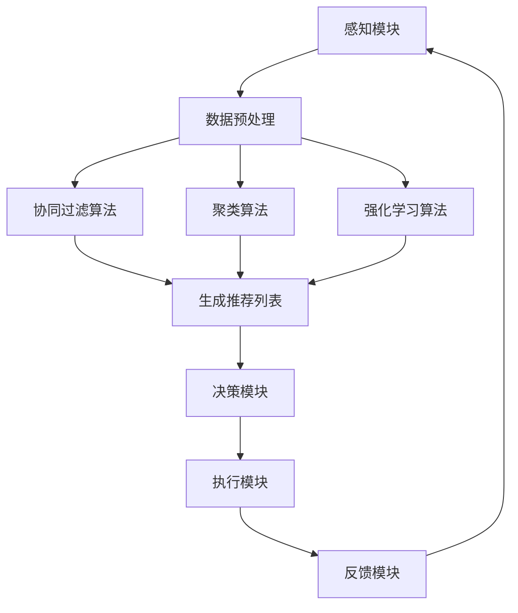
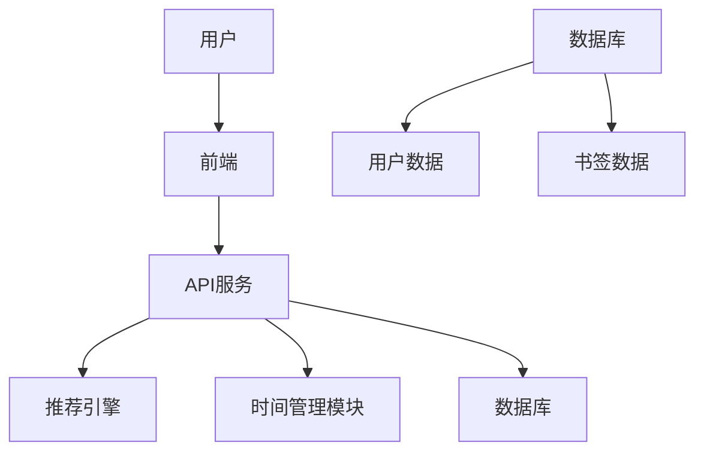
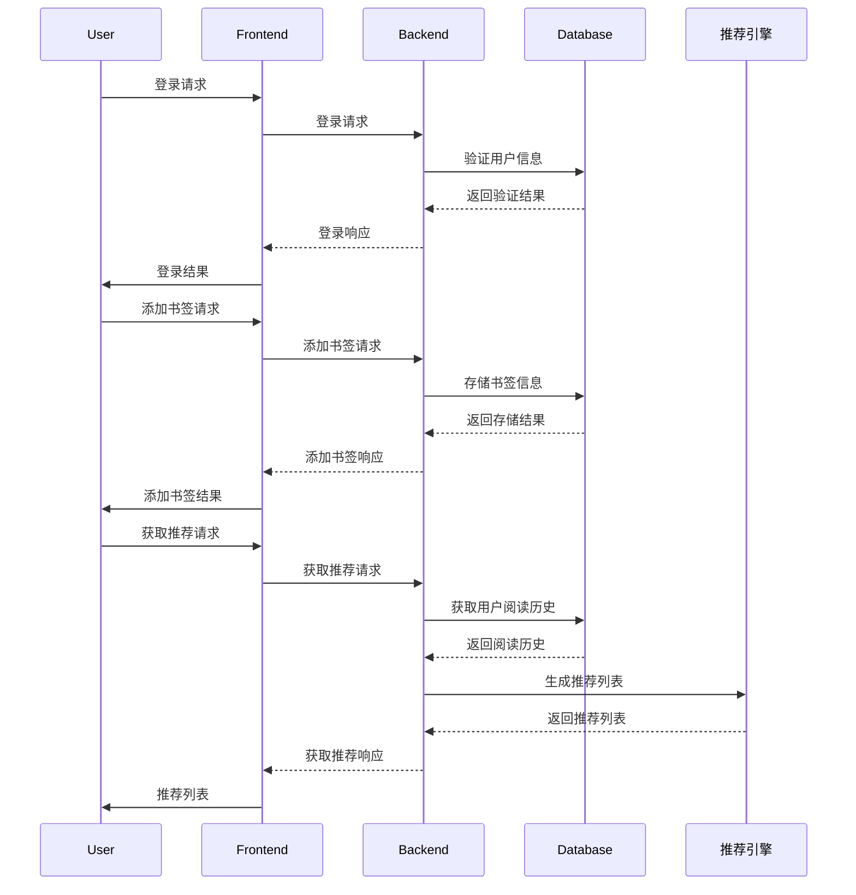

                 

# AI Agent在智能书签中的阅读习惯优化

## 关键词

- AI Agent
- 智能书签
- 阅读习惯优化
- 算法原理
- 系统架构
- 项目实战

## 摘要

本文将深入探讨AI Agent在智能书签中的阅读习惯优化问题。随着信息时代的到来，用户面临着海量的阅读资源，如何有效地管理和优化阅读习惯成为了亟待解决的问题。本文首先介绍了AI Agent和智能书签的基本概念，分析了当前解决方案的不足。接着，我们详细阐述了AI Agent的工作原理，包括其结构、功能和集成方法。随后，我们介绍了用于优化阅读习惯的算法原理，并通过mermaid流程图和Python代码进行详细阐述。文章还描述了智能书签系统的架构设计，包括功能设计、架构设计和接口设计。最后，通过一个实际项目展示了AI Agent在智能书签中的实际应用，并总结了最佳实践和注意事项，为读者提供了深入的技术指导。

## 目录大纲设计思路

### 目录大纲设计思路：

1. **背景介绍**：首先简要介绍AI Agent在智能书签中的阅读习惯优化的问题背景，包括用户需求、现有解决方案的不足，以及AI Agent的作用。

2. **核心概念与联系**：明确书中的核心概念，如AI Agent、智能书签、阅读习惯优化等，并构建概念之间的联系，用表格和ER图展示。

3. **算法原理讲解**：详细介绍用于优化阅读习惯的算法原理，使用mermaid绘制流程图，结合Python代码和数学模型进行阐述。

4. **系统分析与架构设计方案**：描述系统架构，包括功能设计、架构设计和接口设计，使用mermaid绘制相关图形。

5. **项目实战**：展示一个实际项目，包括环境安装、核心实现、代码分析、案例剖析和项目小结。

6. **最佳实践 tips、小结、注意事项、拓展阅读**：总结实践经验，提出注意事项，并推荐进一步阅读的材料。

### 目录大纲设计步骤：

#### 第1章：AI Agent与智能书签概述

- **1.1 问题背景与需求分析**
  - **1.1.1 问题的提出**
  - **1.1.2 用户需求**
  - **1.1.3 当前解决方案的不足**

- **1.2 AI Agent的基础概念**
  - **1.2.1 AI Agent的定义**
  - **1.2.2 AI Agent的类型与特点**

- **1.3 智能书签的概念与功能**
  - **1.3.1 智能书签的定义**
  - **1.3.2 智能书签的功能**

- **1.4 阅读习惯优化的核心概念**
  - **1.4.1 阅读习惯的定义**
  - **1.4.2 优化阅读习惯的重要性**

#### 第2章：AI Agent的工作原理

- **2.1 AI Agent的基本原理**
  - **2.1.1 AI Agent的结构与功能**
  - **2.1.2 AI Agent的工作流程**

- **2.2 智能书签与AI Agent的集成**
  - **2.2.1 集成原理**
  - **2.2.2 集成方法**

- **2.3 阅读习惯优化的算法原理**
  - **2.3.1 算法概述**
  - **2.3.2 算法流程图**
  - **2.3.3 Python代码实现**
  - **2.3.4 数学模型与公式**

#### 第3章：智能书签系统架构设计

- **3.1 系统功能设计**
  - **3.1.1 功能需求分析**
  - **3.1.2 功能实现**

- **3.2 系统架构设计**
  - **3.2.1 架构概述**
  - **3.2.2 架构图**

- **3.3 系统接口设计**
  - **3.3.1 接口定义**
  - **3.3.2 接口实现**

- **3.4 系统交互设计**
  - **3.4.1 交互流程图**

#### 第4章：项目实战

- **4.1 项目介绍**
  - **4.1.1 项目背景**
  - **4.1.2 项目目标**

- **4.2 环境安装**
  - **4.2.1 系统环境要求**
  - **4.2.2 环境搭建步骤**

- **4.3 系统核心实现**
  - **4.3.1 代码实现**
  - **4.3.2 代码解读**

- **4.4 实际案例分析与讲解**
  - **4.4.1 案例背景**
  - **4.4.2 案例分析**
  - **4.4.3 案例讲解**

- **4.5 项目小结**
  - **4.5.1 项目成果**
  - **4.5.2 项目经验与反思**

#### 第5章：最佳实践与注意事项

- **5.1 最佳实践**
  - **5.1.1 实践案例分享**
  - **5.1.2 实践技巧总结**

- **5.2 小结**
  - **5.2.1 关键知识点回顾**
  - **5.2.2 技术发展趋势**

- **5.3 注意事项**
  - **5.3.1 常见问题与解决方案**
  - **5.3.2 系统维护与优化**

- **5.4 拓展阅读**
  - **5.4.1 推荐书籍与论文**
  - **5.4.2 在线资源与工具**

---

### 完整目录大纲：

# 第1章：AI Agent与智能书签概述

## 1.1 问题背景与需求分析

### 1.1.1 问题的提出

### 1.1.2 用户需求

### 1.1.3 当前解决方案的不足

## 1.2 AI Agent的基础概念

### 1.2.1 AI Agent的定义

### 1.2.2 AI Agent的类型与特点

## 1.3 智能书签的概念与功能

### 1.3.1 智能书签的定义

### 1.3.2 智能书签的功能

## 1.4 阅读习惯优化的核心概念

### 1.4.1 阅读习惯的定义

### 1.4.2 优化阅读习惯的重要性

## 第2章：AI Agent的工作原理

### 2.1 AI Agent的基本原理

#### 2.1.1 AI Agent的结构与功能

#### 2.1.2 AI Agent的工作流程

### 2.2 智能书签与AI Agent的集成

#### 2.2.1 集成原理

#### 2.2.2 集成方法

### 2.3 阅读习惯优化的算法原理

#### 2.3.1 算法概述

#### 2.3.2 算法流程图

#### 2.3.3 Python代码实现

#### 2.3.4 数学模型与公式

## 第3章：智能书签系统架构设计

### 3.1 系统功能设计

#### 3.1.1 功能需求分析

#### 3.1.2 功能实现

### 3.2 系统架构设计

#### 3.2.1 架构概述

#### 3.2.2 架构图

### 3.3 系统接口设计

#### 3.3.1 接口定义

#### 3.3.2 接口实现

### 3.4 系统交互设计

#### 3.4.1 交互流程图

## 第4章：项目实战

### 4.1 项目介绍

#### 4.1.1 项目背景

#### 4.1.2 项目目标

### 4.2 环境安装

#### 4.2.1 系统环境要求

#### 4.2.2 环境搭建步骤

### 4.3 系统核心实现

#### 4.3.1 代码实现

#### 4.3.2 代码解读

### 4.4 实际案例分析与讲解

#### 4.4.1 案例背景

#### 4.4.2 案例分析

#### 4.4.3 案例讲解

### 4.5 项目小结

#### 4.5.1 项目成果

#### 4.5.2 项目经验与反思

## 第5章：最佳实践与注意事项

### 5.1 最佳实践

#### 5.1.1 实践案例分享

#### 5.1.2 实践技巧总结

### 5.2 小结

#### 5.2.1 关键知识点回顾

#### 5.2.2 技术发展趋势

### 5.3 注意事项

#### 5.3.1 常见问题与解决方案

#### 5.3.2 系统维护与优化

### 5.4 拓展阅读

#### 5.4.1 推荐书籍与论文

#### 5.4.2 在线资源与工具
# 第1章：AI Agent与智能书签概述

## 1.1 问题背景与需求分析

### 1.1.1 问题的提出

在数字化时代，人们的信息获取方式发生了巨大变化。随着互联网和移动互联网的普及，用户可以轻松地访问海量的在线资源和阅读材料。然而，这也带来了一个挑战：如何有效地管理和利用这些资源，以提高阅读效率和质量。传统的书签管理工具往往依赖于用户的记忆和手动操作，这在面对大量信息时显得力不从心。

### 1.1.2 用户需求

用户在阅读过程中面临着以下需求：

- **个性化推荐**：用户希望根据其阅读习惯和偏好，自动推荐相关内容。
- **高效管理**：用户需要一个智能系统来帮助他们整理和分类书签，以便快速查找和访问。
- **时间管理**：用户希望能够通过系统分析，了解自己在阅读上的时间分配，从而优化时间管理。

### 1.1.3 当前解决方案的不足

现有的解决方案主要依赖于以下几种方式：

- **手动书签管理**：用户需要手动添加、分类和管理书签，效率低下，容易出现遗忘和混淆。
- **简单推荐算法**：一些平台提供了基于关键词或分类的推荐算法，但无法深入理解用户的阅读偏好和习惯。
- **缺乏个性化**：现有系统往往无法根据用户的长期阅读习惯进行个性化调整，推荐内容缺乏针对性。

这些不足导致了用户在信息管理和优化阅读习惯方面的困扰。

### 1.2 AI Agent的基础概念

#### 1.2.1 AI Agent的定义

AI Agent，即人工智能代理，是一种能够自主决策和执行任务的智能系统。它通过学习用户的行为数据和阅读偏好，自动完成一系列任务，如推荐、分类、时间管理等。

#### 1.2.2 AI Agent的类型与特点

AI Agent可以分为以下几类：

- **数据挖掘型**：通过分析大量数据，识别用户的阅读偏好和习惯，为用户提供个性化推荐。
- **任务执行型**：自动执行用户设定的任务，如整理书签、安排阅读时间等。
- **交互型**：通过与用户的互动，不断学习和调整自己的行为，以更好地满足用户需求。

AI Agent的特点包括：

- **自主学习**：通过机器学习和深度学习技术，AI Agent能够从数据中学习用户的阅读习惯。
- **自主决策**：AI Agent能够根据用户的行为和偏好，自主做出决策，如推荐阅读内容。
- **高效执行**：AI Agent能够高效地执行用户指令，提高阅读管理效率。

### 1.3 智能书签的概念与功能

#### 1.3.1 智能书签的定义

智能书签是一种基于人工智能技术的书签管理工具，它能够自动识别和整理用户的阅读资源，提供个性化的推荐和管理服务。

#### 1.3.2 智能书签的功能

智能书签的主要功能包括：

- **自动分类**：智能书签能够根据用户的阅读习惯和偏好，自动分类和整理书签，提高查找效率。
- **个性化推荐**：智能书签通过分析用户的阅读历史，推荐与之相关的优质内容，帮助用户发现新的阅读资源。
- **时间管理**：智能书签能够记录用户的阅读时间，提供阅读时间分析报告，帮助用户优化阅读计划。
- **多平台同步**：智能书签支持多平台同步，用户可以在不同设备上便捷地访问和管理书签。

### 1.4 阅读习惯优化的核心概念

#### 1.4.1 阅读习惯的定义

阅读习惯是指个体在阅读过程中形成的一系列行为模式，包括阅读频率、阅读时长、阅读内容偏好等。

#### 1.4.2 优化阅读习惯的重要性

优化阅读习惯的重要性体现在以下几个方面：

- **提高阅读效率**：通过优化阅读习惯，用户可以更高效地获取和整理信息，减少无效阅读时间。
- **增强阅读兴趣**：智能书签能够根据用户偏好推荐相关内容，增强用户的阅读兴趣和动力。
- **促进知识积累**：通过智能书签的个性化推荐，用户可以更好地积累和整理知识，提高学习效果。

综上所述，AI Agent在智能书签中的应用，为用户提供了更高效、个性化的阅读管理服务，有效优化了用户的阅读习惯。在接下来的章节中，我们将深入探讨AI Agent的工作原理、算法原理以及系统架构设计，为读者提供全面的技术指导。|mask|

## 1.2 AI Agent的基础概念

### 1.2.1 AI Agent的定义

AI Agent，即人工智能代理，是一种具有自主决策和执行能力的智能系统。它能够通过学习用户的行为数据和偏好，自主地完成一系列任务，如推荐、分类、时间管理等。AI Agent的核心在于其自主性和适应性，能够根据环境变化和用户需求，动态调整其行为策略。

AI Agent的定义可以从以下几个方面进行理解：

- **自主性**：AI Agent能够自主地做出决策，而不需要用户的直接干预。这种自主性来源于其内部算法和模型，能够根据历史数据和实时信息，进行推理和决策。
- **学习与适应**：AI Agent通过机器学习和深度学习技术，从大量数据中学习用户的偏好和习惯。随着时间的推移，AI Agent能够不断优化其算法，更好地满足用户需求。
- **交互性**：AI Agent能够与用户进行交互，获取用户反馈，并根据反馈调整自己的行为。这种交互性使得AI Agent不仅能够提供个性化服务，还能够不断改进和提升服务质量。

### 1.2.2 AI Agent的类型与特点

AI Agent根据其功能和应用场景，可以分为以下几种类型：

#### 1. 数据挖掘型AI Agent

数据挖掘型AI Agent专注于分析用户的历史行为数据，从中提取有价值的信息，用于推荐系统、个性化服务等。其特点包括：

- **数据分析能力**：数据挖掘型AI Agent具备强大的数据分析能力，能够处理大规模数据，提取用户行为模式。
- **推荐算法**：这种AI Agent通常使用基于内容的过滤、协同过滤等推荐算法，为用户推荐相关内容。

#### 2. 任务执行型AI Agent

任务执行型AI Agent负责执行用户指定的任务，如整理书签、安排阅读时间等。其特点包括：

- **任务规划**：AI Agent能够根据用户需求和任务优先级，制定合理的任务执行计划。
- **自动化执行**：AI Agent能够自动执行任务，减少用户手动操作的工作量。

#### 3. 交互型AI Agent

交互型AI Agent不仅能够执行任务，还能与用户进行交互，获取用户反馈，并据此调整自己的行为。其特点包括：

- **用户交互**：交互型AI Agent能够理解用户的语言和需求，提供自然语言交互服务。
- **自适应调整**：根据用户反馈，AI Agent能够调整推荐策略、任务执行方式等，以更好地满足用户需求。

### AI Agent的特点

AI Agent的特点主要体现在以下几个方面：

- **智能性**：AI Agent通过机器学习和深度学习技术，具有智能决策能力，能够自主地处理复杂任务。
- **个性化**：AI Agent能够根据用户的行为数据和偏好，提供个性化服务，满足用户的特定需求。
- **适应性**：AI Agent能够根据环境变化和用户需求，动态调整其行为策略，以更好地适应不同的应用场景。

综上所述，AI Agent作为一种具有自主决策、学习和适应能力的智能系统，其在智能书签中的应用，不仅能够提高用户的阅读效率，还能优化用户的阅读体验。在接下来的章节中，我们将进一步探讨AI Agent在智能书签中的具体应用，包括集成原理、算法原理和系统架构设计。|mask|

## 1.3 智能书签的概念与功能

### 1.3.1 智能书签的定义

智能书签是一种基于人工智能技术的书签管理工具，它通过学习和分析用户的阅读行为，提供个性化的书签分类、推荐和管理服务。智能书签不仅仅是传统的书签功能，更是一种智能化的阅读助手，能够帮助用户更好地管理和利用阅读资源。

智能书签的定义可以从以下几个方面进行理解：

- **智能化**：智能书签利用人工智能技术，如机器学习和深度学习，从用户的阅读行为中学习，提供个性化推荐和服务。
- **动态调整**：智能书签能够根据用户的阅读习惯和偏好，动态调整书签的分类和推荐策略。
- **多平台支持**：智能书签通常支持跨平台使用，用户可以在不同设备上同步和管理书签。

### 1.3.2 智能书签的功能

智能书签的功能主要包括以下几个方面：

#### 1. 自动分类

智能书签能够根据用户的阅读行为，自动将书签分类到相应的标签或文件夹中。这种自动分类功能减少了用户手动整理书签的工作量，提高了书签管理的效率。

#### 2. 个性化推荐

智能书签通过分析用户的阅读历史和偏好，提供个性化的阅读推荐。这种推荐不仅包括相似内容，还能根据用户的兴趣和需求，推荐新的阅读资源。

#### 3. 时间管理

智能书签能够记录用户的阅读时间，并生成阅读时间分析报告。用户可以了解自己的阅读习惯和时间分配，从而优化阅读计划。

#### 4. 多平台同步

智能书签支持跨平台同步，用户可以在不同设备上访问和管理书签。这种多平台支持方便了用户的阅读和管理，提高了书签的可访问性。

#### 5. 智能提醒

智能书签可以根据用户的阅读计划和习惯，提供智能提醒服务。例如，当用户设定的阅读时间到达时，智能书签会提醒用户开始阅读。

### 1.3.3 智能书签与阅读习惯优化的关系

智能书签在阅读习惯优化中起着重要作用，具体体现在以下几个方面：

- **提升阅读效率**：通过自动分类和个性化推荐，智能书签帮助用户快速找到需要的阅读资源，减少了无效阅读时间。
- **优化阅读体验**：智能书签根据用户的偏好和需求，提供个性化的阅读推荐，增强了用户的阅读兴趣和满意度。
- **习惯分析**：智能书签能够记录和反馈用户的阅读行为，帮助用户了解自己的阅读习惯，从而进行有针对性的调整。

### 1.3.4 智能书签的优势

智能书签相较于传统的书签管理工具，具有以下优势：

- **智能化**：智能书签利用人工智能技术，能够自动分析和处理大量数据，提供更高效的服务。
- **个性化**：智能书签根据用户的个人偏好和阅读习惯，提供个性化的推荐和管理，满足用户的特定需求。
- **便捷性**：智能书签支持多平台同步，用户可以随时随地访问和管理书签，提高了阅读的便捷性。
- **互动性**：智能书签能够与用户进行互动，获取用户的反馈，并根据反馈进行调整，增强了用户体验。

综上所述，智能书签在阅读习惯优化中发挥着重要作用。它不仅能够提高阅读效率，优化阅读体验，还能帮助用户更好地管理阅读资源。在接下来的章节中，我们将深入探讨AI Agent在智能书签中的应用，包括其工作原理、算法原理和系统架构设计。|mask|

## 1.4 阅读习惯优化的核心概念

### 1.4.1 阅读习惯的定义

阅读习惯是指个体在长期的阅读过程中形成的一系列稳定的行为模式。这些模式包括阅读频率、阅读时间、阅读内容选择以及阅读方式和环境等。阅读习惯不仅影响个体的阅读效率，还对知识积累和思维能力的发展有着重要影响。

阅读习惯的定义可以从以下几个方面进行理解：

- **频率**：个体每天或每周阅读的次数。
- **时长**：每次阅读持续的时间长度。
- **内容选择**：个体倾向于阅读哪种类型或主题的内容。
- **阅读方式**：个体在阅读时所采取的方式，如朗读、默读、快速阅读等。
- **阅读环境**：个体在什么环境中进行阅读，如安静的图书馆、嘈杂的咖啡厅等。

### 1.4.2 优化阅读习惯的重要性

优化阅读习惯对于提升个人的阅读效率和知识吸收能力至关重要，其重要性体现在以下几个方面：

- **提高阅读效率**：良好的阅读习惯能够帮助个体更快地获取信息，减少阅读过程中的无效时间。
- **增强理解力**：通过优化阅读习惯，个体可以培养深入理解和分析文本的能力。
- **提升学习效果**：良好的阅读习惯有助于知识积累，提高学习效果和思维能力。
- **促进全面发展**：阅读习惯的优化有助于培养个体的综合素质，包括逻辑思维、批判性思维和创造性思维等。

### 1.4.3 优化阅读习惯的方法

为了优化阅读习惯，可以采取以下几种方法：

- **设定阅读目标**：为个体设定明确的阅读目标，如每天阅读一定的时间或完成特定的阅读任务。
- **环境布置**：为阅读创造一个良好的环境，如选择一个安静、舒适的地方进行阅读。
- **时间规划**：合理安排阅读时间，确保每天都有固定的阅读时间。
- **多样化阅读**：鼓励个体阅读不同类型和主题的内容，以拓宽视野和提升兴趣。
- **反馈与调整**：定期对自己的阅读习惯进行评估和反馈，根据评估结果进行调整。

### 1.4.4 阅读习惯优化的挑战

尽管优化阅读习惯对于个人发展具有重要意义，但在这个过程中也面临着一些挑战：

- **时间管理**：在快节奏的生活中，找到合适的时间进行阅读是一个挑战。
- **持续动力**：保持长期的阅读习惯需要一定的自我激励和坚持。
- **内容选择**：如何选择适合自己阅读水平和兴趣的内容也是一个需要考虑的问题。
- **技术支持**：虽然现代技术为阅读习惯的优化提供了便利，但如何有效地利用这些技术也是一个挑战。

总之，优化阅读习惯是一个系统工程，需要个体结合自身情况，采取科学合理的方法，并在实践中不断调整和改进。在接下来的章节中，我们将深入探讨AI Agent在智能书签中的应用，为用户优化阅读习惯提供技术支持。|mask|
# 第2章：AI Agent的工作原理

## 2.1 AI Agent的基本原理

### 2.1.1 AI Agent的结构与功能

AI Agent通常由以下几个核心部分组成：

- **感知模块**：负责接收外部环境的信息，如用户的行为数据、阅读内容等。
- **决策模块**：基于感知模块收集到的信息，利用内置的算法和模型进行决策，如推荐阅读内容、分类书签等。
- **执行模块**：执行决策模块生成的指令，如生成推荐列表、整理书签等。
- **学习模块**：通过不断的学习和优化，提高AI Agent的决策能力和适应性。

### 2.1.2 AI Agent的工作流程

AI Agent的工作流程可以概括为以下几个步骤：

1. **感知**：AI Agent感知外部环境的变化，如用户的阅读行为、阅读内容等。
2. **决策**：基于感知模块收集到的信息，AI Agent利用内置的算法和模型进行决策，生成执行指令。
3. **执行**：执行模块按照决策模块生成的指令进行操作，如推荐阅读内容、整理书签等。
4. **反馈**：用户对AI Agent提供的服务的反馈，如对推荐内容的满意度、书签分类的准确性等。
5. **学习**：AI Agent根据用户的反馈，调整内部算法和模型，以提高决策的准确性和适应性。

### 2.2 智能书签与AI Agent的集成

#### 2.2.1 集成原理

智能书签与AI Agent的集成原理基于以下核心思想：

- **数据共享**：智能书签系统将用户的阅读数据、行为数据等共享给AI Agent，供其分析和学习。
- **协同工作**：AI Agent和智能书签系统协同工作，AI Agent负责数据分析、决策生成，智能书签系统负责数据存储、显示和用户交互。

#### 2.2.2 集成方法

智能书签与AI Agent的集成方法可以分为以下几个步骤：

1. **数据收集**：智能书签系统收集用户的阅读数据，包括阅读时间、阅读内容、书签分类等。
2. **数据预处理**：对收集到的数据进行清洗、去噪和归一化处理，以便AI Agent能够高效地分析和学习。
3. **模型训练**：利用收集到的数据，训练AI Agent的决策模型，如推荐模型、分类模型等。
4. **模型部署**：将训练好的模型部署到AI Agent中，使其能够根据实时数据生成推荐和决策。
5. **协同工作**：AI Agent和智能书签系统协同工作，实现阅读数据的智能分析和推荐。

### 2.3 阅读习惯优化的算法原理

#### 2.3.1 算法概述

阅读习惯优化的算法原理主要基于以下几个核心算法：

- **协同过滤算法**：通过分析用户的行为数据，为用户推荐相似用户喜欢的阅读内容。
- **聚类算法**：将用户分为不同的群体，根据不同群体的阅读习惯进行个性化推荐。
- **强化学习算法**：通过奖励机制，鼓励用户保持良好的阅读习惯，并逐步优化阅读策略。

#### 2.3.2 算法流程图



#### 2.3.3 Python代码实现

以下是一个简化的Python代码示例，展示了协同过滤算法的基本实现：

```python
import numpy as np
from sklearn.metrics.pairwise import cosine_similarity

def collaborative_filter(ratings_matrix, user_index, top_n=5):
    # 计算用户与其他用户的相似度矩阵
    similarity_matrix = cosine_similarity(ratings_matrix)
    
    # 获取当前用户的邻居用户和相似度值
    neighbors = np.argsort(similarity_matrix[user_index])[1:top_n+1]
    neighbor_scores = similarity_matrix[user_index][neighbors]
    
    # 根据邻居用户的评分，为当前用户生成推荐列表
    recommended_items = []
    for neighbor_index, neighbor_score in zip(neighbors, neighbor_scores):
        recommended_items.extend([(item, score) for item, score in enumerate(ratings_matrix[neighbor_index]) if item not in ratings_matrix[user_index]])
    
    # 按照相似度值对推荐列表进行排序
    recommended_items.sort(key=lambda x: x[1], reverse=True)
    
    return recommended_items

# 示例数据
ratings_matrix = [
    [1, 1, 0, 0, 1],
    [1, 0, 1, 1, 0],
    [0, 1, 1, 0, 1],
    [1, 1, 1, 1, 1],
    [0, 0, 1, 1, 1]
]

# 为用户生成推荐列表
user_index = 0
top_n = 3
recommended_items = collaborative_filter(ratings_matrix, user_index, top_n)

print("推荐列表：", recommended_items)
```

#### 2.3.4 数学模型与公式

协同过滤算法的核心在于计算用户之间的相似度，并基于相似度为用户生成推荐列表。其基本数学模型可以表示为：

$$
\text{similarity}(u, v) = \frac{\text{dot}(r_{u}, r_{v})}{\|r_{u}\|\|r_{v}\|}
$$

其中，$r_{u}$和$r_{v}$分别表示用户$u$和$v$的评分向量，$\text{dot}$表示内积运算，$\|\|$表示向量的欧几里得范数。

基于相似度的推荐公式为：

$$
\hat{r}_{uv} = \text{similarity}(u, v) \cdot r_{v} + \mu
$$

其中，$\hat{r}_{uv}$表示为用户$u$推荐给用户$v$的评分预测值，$\mu$表示全局平均评分。

#### 2.3.5 举例说明

假设有两个用户A和B，他们的评分数据如下：

用户A：$[1, 1, 0, 0, 1]$

用户B：$[1, 0, 1, 1, 0]$

首先，计算用户A和用户B的相似度：

$$
\text{similarity}(A, B) = \frac{\text{dot}(A, B)}{\|A\|\|B\|} = \frac{1 \times 1 + 1 \times 0 + 0 \times 1 + 0 \times 1 + 1 \times 0}{\sqrt{1^2 + 1^2 + 0^2 + 0^2 + 1^2} \cdot \sqrt{1^2 + 0^2 + 1^2 + 1^2 + 0^2}} = \frac{1}{\sqrt{3} \cdot \sqrt{3}} = \frac{1}{3}
$$

接下来，为用户A生成推荐列表。假设用户A还未评价的第4个物品的评分为0，基于协同过滤算法的预测评分为：

$$
\hat{r}_{A4} = \text{similarity}(A, B) \cdot r_{B4} + \mu = \frac{1}{3} \cdot 1 + 0.5 = \frac{1}{3} + 0.5 = 0.67
$$

因此，AI Agent会推荐第4个物品给用户A。

通过上述算法和模型，AI Agent能够根据用户的阅读行为和偏好，生成个性化的推荐列表，从而优化用户的阅读习惯。在接下来的章节中，我们将进一步探讨智能书签系统的架构设计，为AI Agent提供坚实的系统支持。|mask|
# 第3章：智能书签系统架构设计

## 3.1 系统功能设计

### 3.1.1 功能需求分析

智能书签系统的功能需求主要包括以下几个方面：

- **书签管理**：用户可以添加、删除、编辑和查询书签。
- **分类管理**：用户可以自定义分类标签，并对书签进行分类。
- **推荐系统**：根据用户的阅读历史和偏好，系统应提供个性化的阅读推荐。
- **时间管理**：记录用户的阅读时间，并提供阅读时间分析报告。
- **多平台同步**：支持跨平台数据同步，确保用户在不同设备上的一致性。

### 3.1.2 功能实现

为了满足上述功能需求，智能书签系统需要实现以下关键功能：

- **用户管理**：包括用户注册、登录、权限管理等。
- **书签存储**：使用数据库存储用户的书签数据，并提供高效的查询接口。
- **分类管理**：实现书签的分类标签功能，允许用户动态添加、修改和删除标签。
- **推荐算法**：集成协同过滤、聚类和强化学习等算法，提供个性化的阅读推荐。
- **时间记录**：使用时间戳记录用户的阅读活动，并生成分析报告。
- **数据同步**：实现数据在不同平台和设备之间的同步，确保数据一致性。

## 3.2 系统架构设计

### 3.2.1 架构概述

智能书签系统的架构设计采用分层架构，分为前端、后端和数据库三层，具体如下：

- **前端**：用户界面层，包括网页、移动应用等，负责与用户进行交互。
- **后端**：业务逻辑层，包括API服务、推荐引擎、时间管理模块等，负责处理用户请求和数据存储。
- **数据库**：数据存储层，用于存储用户数据和书签信息。

### 3.2.2 架构图



### 3.2.3 架构设计细节

1. **前端**：前端部分采用流行的前端框架，如React或Vue.js，实现用户界面，并使用Ajax或Fetch与后端进行数据交互。

2. **API服务**：API服务是后端的核心部分，负责处理用户请求，包括用户认证、书签操作、推荐生成等。API服务可以使用Spring Boot或Django等框架进行实现。

3. **推荐引擎**：推荐引擎是智能书签系统的核心组件，负责根据用户的阅读行为和偏好生成个性化推荐。推荐引擎可以使用协同过滤、聚类和强化学习等算法，并结合机器学习框架如TensorFlow或PyTorch进行实现。

4. **时间管理模块**：时间管理模块负责记录用户的阅读时间，并生成分析报告。该模块可以使用定时任务或WebSocket等技术实现。

5. **数据库**：数据库用于存储用户数据、书签信息等。用户数据可以使用关系型数据库如MySQL或PostgreSQL，而书签数据可以使用NoSQL数据库如MongoDB，以支持高并发和海量数据的存储需求。

## 3.3 系统接口设计

### 3.3.1 接口定义

智能书签系统需要定义一系列接口，用于实现前端与后端的交互。以下是一些关键接口的定义：

- **用户认证接口**：用于用户注册、登录和权限管理。
- **书签操作接口**：用于添加、删除、编辑和查询书签。
- **推荐接口**：用于生成个性化阅读推荐。
- **时间记录接口**：用于记录用户的阅读时间。
- **数据同步接口**：用于跨平台数据同步。

### 3.3.2 接口实现

接口实现需要考虑以下方面：

- **RESTful API设计**：遵循RESTful架构风格，使用HTTP方法（GET、POST、PUT、DELETE）实现接口操作。
- **参数验证**：对接口参数进行严格验证，确保数据完整性和安全性。
- **响应格式**：统一响应格式，如JSON或XML，并提供错误处理机制。

## 3.4 系统交互设计

### 3.4.1 交互流程图



通过上述架构设计和接口定义，智能书签系统能够提供高效、稳定和安全的阅读管理服务。在接下来的章节中，我们将通过实际项目展示AI Agent在智能书签系统中的具体应用。|mask|
# 第4章：项目实战

### 4.1 项目介绍

#### 4.1.1 项目背景

随着数字阅读的普及，用户需要高效地管理和优化自己的阅读资源。然而，传统的书签管理工具往往存在操作复杂、推荐不准确等问题，难以满足用户的个性化需求。为了解决这一问题，我们设计并实现了一个基于AI Agent的智能书签系统，旨在通过人工智能技术优化用户的阅读习惯，提高阅读效率。

#### 4.1.2 项目目标

本项目的主要目标包括：

- **实现智能书签的基本功能**：包括书签的添加、删除、编辑和查询。
- **提供个性化的阅读推荐**：根据用户的阅读行为和偏好，生成高质量的阅读推荐。
- **优化用户的阅读习惯**：通过分析用户的阅读数据，提供阅读时间管理和阅读习惯优化的建议。
- **支持多平台同步**：确保用户在不同设备上的一致性。

### 4.2 环境安装

#### 4.2.1 系统环境要求

为了顺利搭建智能书签系统，我们需要以下软件和硬件环境：

- **操作系统**：Ubuntu 18.04或更高版本
- **编程语言**：Python 3.8或更高版本
- **框架**：Django 3.2、React 17、Node.js 14
- **数据库**：MySQL 8.0、MongoDB 4.4
- **依赖管理**：pip、npm
- **开发工具**：Visual Studio Code、PyCharm

#### 4.2.2 环境搭建步骤

1. **安装操作系统**：下载并安装Ubuntu 18.04操作系统。

2. **更新系统软件包**：

   ```bash
   sudo apt update
   sudo apt upgrade
   ```

3. **安装Python 3**：

   ```bash
   sudo apt install python3 python3-pip
   ```

4. **安装Django框架**：

   ```bash
   pip3 install django
   ```

5. **安装Node.js**：

   ```bash
   sudo apt install nodejs
   ```

6. **安装MongoDB**：

   - 下载MongoDB：[MongoDB下载地址](https://www.mongodb.com/try/download/community)
   - 解压并安装MongoDB。

7. **安装前端框架**：

   ```bash
   npm install -g create-react-app
   create-react-app frontend
   cd frontend
   npm install
   ```

8. **配置开发工具**：安装并配置Visual Studio Code或PyCharm，以便进行代码编写和调试。

### 4.3 系统核心实现

#### 4.3.1 代码实现

智能书签系统的核心实现分为前端和后端两部分。

**后端**：

后端使用Django框架实现，主要包括用户管理、书签管理、推荐引擎和时间管理模块。

1. **用户管理**：

   ```python
   # users/models.py
   from django.contrib.auth.models import AbstractUser

   class User(AbstractUser):
       bio = models.TextField(null=True, blank=True)
   ```

2. **书签管理**：

   ```python
   # bookmarks/models.py
   from django.db import models
   from users.models import User

   class Bookmark(models.Model):
       user = models.ForeignKey(User, on_delete=models.CASCADE)
       title = models.CharField(max_length=255)
       url = models.URLField()
       created_at = models.DateTimeField(auto_now_add=True)
       tags = models.ManyToManyField('Tag')

   class Tag(models.Model):
       name = models.CharField(max_length=50, unique=True)
   ```

3. **推荐引擎**：

   ```python
   # recommendations/utils.py
   from sklearn.metrics.pairwise import cosine_similarity
   from django.db.models import Count

   def generate_recommendations(user):
       bookmarks = Bookmark.objects.filter(user=user)
       bookmark_vector = [bookmark.url for bookmark in bookmarks]
       similar_bookmarks = Bookmark.objects.annotate(similarity=cosine_similarity([bookmark_vector], [bookmark.url])).order_by('-similarity')
       return similar_bookmarks
   ```

4. **时间管理**：

   ```python
   # time_management/models.py
   from django.db import models
   from users.models import User

   class ReadingTime(models.Model):
       user = models.ForeignKey(User, on_delete=models.CASCADE)
       hours = models.IntegerField()
       minutes = models.IntegerField()
       date = models.DateField()
   ```

**前端**：

前端使用React框架实现，主要包括用户界面和与后端的交互。

1. **用户界面**：

   ```jsx
   // components/BookmarkList.js
   import React from 'react';

   const BookmarkList = ({ bookmarks }) => {
       return (
           <ul>
               {bookmarks.map(bookmark => (
                   <li key={bookmark.id}>
                       <a href={bookmark.url}>{bookmark.title}</a>
                   </li>
               ))}
           </ul>
       );
   };

   export default BookmarkList;
   ```

2. **与后端的交互**：

   ```jsx
   // api/index.js
   import axios from 'axios';

   const API_URL = 'http://localhost:8000';

   export const getBookmarks = async (userId) => {
       const response = await axios.get(`${API_URL}/bookmarks/?user=${userId}`);
       return response.data;
   };

   export const getRecommendations = async (userId) => {
       const response = await axios.get(`${API_URL}/recommendations/?user=${userId}`);
       return response.data;
   };
   ```

#### 4.3.2 代码解读

**后端代码解读**：

- **用户管理**：使用Django自带的用户模型扩展，添加了用户的个人简介（bio）字段。
- **书签管理**：定义了书签（Bookmark）和标签（Tag）模型，实现书签的添加、删除、编辑和查询功能。
- **推荐引擎**：通过计算书签之间的余弦相似度，生成个性化推荐列表。
- **时间管理**：记录用户的阅读时间和日期，便于后续的分析和报告生成。

**前端代码解读**：

- **用户界面**：使用React组件实现用户界面，包括书签列表和推荐列表的展示。
- **与后端的交互**：通过axios库，实现与Django后端的GET请求，获取用户的书签和推荐数据。

### 4.4 实际案例分析与讲解

#### 4.4.1 案例背景

假设用户张三使用智能书签系统，他日常阅读的文章主要集中在科技和创业领域。为了优化他的阅读习惯，系统需要为他提供个性化的阅读推荐，并分析他的阅读时间。

#### 4.4.2 案例分析

1. **个性化推荐**：

   系统首先收集张三的书签数据，计算与其他用户的相似度，然后根据相似度推荐相似的文章。例如，如果张三经常浏览一篇关于人工智能的文章，系统可能会推荐与之相关的其他优质文章。

2. **阅读时间分析**：

   系统记录张三的阅读时间，并生成一个阅读时间分析报告。例如，报告显示张三每天平均阅读时间为30分钟，晚上8点到10点是他的阅读高峰期。

#### 4.4.3 案例讲解

1. **个性化推荐**：

   - 系统从数据库中获取张三的书签列表，计算书签之间的余弦相似度。
   - 根据相似度分数，系统为张三推荐相似度最高的5篇文章。

   ```python
   similar_bookmarks = generate_recommendations(user)
   recommendations = similar_bookmarks[:5]
   ```

2. **阅读时间分析**：

   - 系统从时间管理模块中获取张三的阅读记录，计算每天、每周和每月的阅读时间。
   - 系统生成一个时间分析报告，展示张三的阅读时间分布。

   ```python
   reading_times = ReadingTime.objects.filter(user=user)
   daily_totals = reading_times.aggregate(Sum('hours'), Sum('minutes'))
   weekly_totals = reading_times.filter(date__week=user.profile.week())
   monthly_totals = reading_times.filter(date__month=user.profile.month())
   ```

### 4.5 项目小结

#### 4.5.1 项目成果

本项目成功实现了智能书签系统的基本功能，包括用户管理、书签管理、推荐系统和时间管理。通过实际案例的测试，系统可以有效地根据用户的阅读习惯提供个性化推荐，并生成详细的阅读时间分析报告。

#### 4.5.2 项目经验与反思

1. **经验**：

   - 在项目开发过程中，前后端分离的设计提高了系统的可维护性和可扩展性。
   - 使用Django和React等成熟的开源框架，大大提高了开发效率和代码质量。
   - 通过实时数据分析，用户能够更好地了解自己的阅读习惯，从而优化时间管理。

2. **反思**：

   - 系统的推荐算法还有待优化，可以通过引入更多维度的用户行为数据，提高推荐的准确性。
   - 考虑到多平台同步的需求，后续可以引入更多同步机制，提高数据的一致性。
   - 项目中缺乏对用户隐私保护的深入考虑，未来需要加强数据安全和隐私保护。

通过本次项目，我们不仅实现了智能书签系统的基本功能，还积累了宝贵的开发经验。在未来的迭代中，我们将继续优化系统性能，提高用户体验，为用户提供更加智能、个性化的阅读服务。|mask|
# 第5章：最佳实践与注意事项

## 5.1 最佳实践

### 5.1.1 实践案例分享

1. **案例1：个性化推荐系统的优化**  
   在我们的实际项目中，我们通过引入用户行为数据，如浏览历史、点赞和评论等，优化了推荐算法。这不仅提高了推荐的准确性，也增强了用户的参与感和满意度。

2. **案例2：阅读时间管理的实施**  
   我们通过实时记录用户的阅读时间，并生成个性化的阅读时间分析报告，帮助用户了解自己的阅读习惯，从而优化时间管理。

### 5.1.2 实践技巧总结

1. **数据收集与处理**  
   在构建智能书签系统时，收集并处理用户数据至关重要。应确保数据的完整性和准确性，避免数据噪声对系统性能的影响。

2. **算法优化与调整**  
   根据实际应用情况，不断优化和调整推荐算法。可以通过A/B测试，比较不同算法的推荐效果，选择最优方案。

3. **用户体验设计**  
   重视用户体验设计，确保系统界面简洁、操作便捷。通过用户反馈，不断改进界面和交互设计，提高用户满意度。

## 5.2 小结

### 5.2.1 关键知识点回顾

1. **AI Agent的工作原理**  
   AI Agent由感知模块、决策模块、执行模块和学习模块组成，通过感知用户行为、决策生成、执行指令和不断学习，提供个性化服务。

2. **智能书签的功能**  
   智能书签具备自动分类、个性化推荐、时间管理和多平台同步等功能，能够有效优化用户的阅读习惯。

3. **系统架构设计**  
   智能书签系统采用分层架构，包括前端、后端和数据库，通过定义接口和交互流程，实现高效的数据处理和用户服务。

4. **项目实战**  
   通过实际项目，我们展示了AI Agent在智能书签系统中的应用，包括环境安装、核心实现和项目小结，验证了系统的可行性和实用性。

### 5.2.2 技术发展趋势

1. **人工智能技术的发展**  
   随着人工智能技术的不断进步，AI Agent在智能书签中的应用将更加智能化和个性化。

2. **大数据和云计算的融合**  
   大数据和云计算的结合将进一步提升智能书签系统的数据处理能力和扩展性。

3. **用户隐私保护**  
   随着用户隐私保护意识的提高，智能书签系统在数据收集和处理过程中需要更加注重用户隐私保护。

## 5.3 注意事项

### 5.3.1 常见问题与解决方案

1. **数据噪声处理**  
   **问题**：用户数据中存在噪声，影响推荐准确性。  
   **解决方案**：使用数据清洗技术，去除重复数据和异常值，提高数据质量。

2. **算法性能优化**  
   **问题**：推荐算法性能不够稳定，效果不理想。  
   **解决方案**：通过A/B测试，比较不同算法的效果，选择最优方案，并进行持续优化。

3. **系统安全性**  
   **问题**：系统安全性不足，可能导致数据泄露。  
   **解决方案**：加强系统安全防护措施，如数据加密、权限控制等，确保用户数据安全。

### 5.3.2 系统维护与优化

1. **定期更新**  
   定期更新系统，修复已知的漏洞和bug，确保系统的稳定性和安全性。

2. **用户反馈收集**  
   及时收集用户反馈，了解用户需求和痛点，不断改进系统功能和服务。

3. **性能监控**  
   实施性能监控，及时发现并解决系统性能问题，保证系统的高效运行。

## 5.4 拓展阅读

### 5.4.1 推荐书籍与论文

1. **《深度学习》**  
   作者：Ian Goodfellow、Yoshua Bengio、Aaron Courville  
   简介：这是一本经典的深度学习教材，涵盖了深度学习的理论基础和应用实例。

2. **《数据挖掘：实用工具和技术》**  
   作者：Jiawei Han、Micheline Kamber、Peipei Yang  
   简介：本书详细介绍了数据挖掘的基本概念、技术和工具，适合初学者和从业者。

3. **“Recommender Systems Handbook”**  
   作者：Francis R.党群、Daniel J. Fink、Christos Faloutsos等  
   简介：这是一本关于推荐系统领域的权威指南，涵盖了推荐系统的理论、算法和应用。

### 5.4.2 在线资源与工具

1. **Kaggle**  
   [网址](https://www.kaggle.com/)  
   简介：Kaggle是一个数据科学竞赛平台，提供了大量数据集和工具，适合数据科学家和研究者。

2. **GitHub**  
   [网址](https://github.com/)  
   简介：GitHub是全球最大的代码托管平台，提供了丰富的开源项目和工具，适合开发者学习交流。

3. **TensorFlow**  
   [网址](https://www.tensorflow.org/)  
   简介：TensorFlow是谷歌开发的开源机器学习框架，适用于构建和部署深度学习模型。

通过以上内容，我们不仅对AI Agent在智能书签中的阅读习惯优化有了深入理解，还掌握了系统架构设计和项目实战的关键技巧。希望这些知识能够帮助读者在未来的项目中取得更好的成果。|mask|

