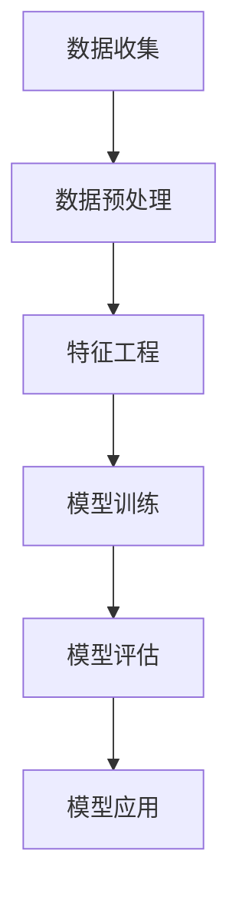
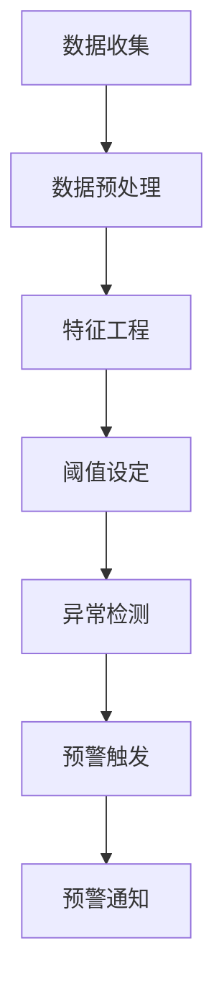

                 

# AI Agent在智能交通事故预防中的实践

## 关键词

- AI Agent
- 智能交通事故预防
- 交通事故预测
- 交通事故预警
- 系统架构设计

## 摘要

本文旨在探讨AI Agent在智能交通事故预防中的应用。首先，我们将介绍AI Agent的基本概念、分类及其在交通事故预防中的应用。接着，我们将深入讲解AI Agent在交通事故预测和预警中的算法原理与实践。然后，我们将描述AI Agent在智能交通事故预防中的系统架构设计，包括功能设计、架构设计和接口设计。随后，我们将通过项目实战来展示AI Agent的实际应用，并进行案例分析。最后，我们将分享最佳实践、注意事项，并对未来发展趋势和应用前景进行展望。

### 目录大纲

1. 第一部分: AI Agent与智能交通事故预防概述
   1.1 AI Agent概述
   1.2 AI Agent在智能交通事故预防中的应用
   1.3 AI Agent的算法原理与实践
2. 第二部分: AI Agent在智能交通事故预防中的系统架构设计
   2.1 系统功能设计
   2.2 系统架构设计
   2.3 系统接口设计与交互
3. 第三部分: 项目实战
   3.1 环境安装
   3.2 系统核心实现源代码
   3.3 实际案例分析与讲解
   3.4 项目小结
4. 第四部分: 最佳实践与注意事项
   4.1 最佳实践
   4.2 注意事项
   4.3 拓展阅读
5. 第五部分: AI Agent在智能交通事故预防中的未来展望
   5.1 技术发展趋势
   5.2 应用前景
   5.3 挑战与机遇
6. 附录
   6.1 术语表
   6.2 参考文献

## 第一部分: AI Agent与智能交通事故预防概述

### 1.1 AI Agent概述

#### 1.1.1 AI Agent的基本概念

AI Agent，即人工智能代理，是自主行动的实体，能够在环境中感知并采取行动，以实现特定目标。AI Agent可以理解为一个具有感知、决策和执行能力的智能体，其核心在于能够模拟人类的智能行为，进行自主学习和适应。

**问题背景：** 在交通系统中，交通事故是一个普遍存在的问题，每年造成大量的人员伤亡和财产损失。传统的事故预防方法主要通过交通管理和道路建设来降低事故发生率，但这些方法存在一定的局限性。

**问题描述：** 如何利用AI Agent来提高交通事故的预防能力，实现更智能、更高效的事故预警和应对？

**问题解决：** 通过引入AI Agent，可以利用大数据分析、机器学习等技术，实现对交通数据的实时感知和分析，从而提前预测交通事故的发生，并采取相应的措施进行预警和干预。

**边界与外延：** AI Agent在智能交通事故预防中的应用，不仅限于交通事故预测和预警，还可以扩展到交通流量管理、道路安全监控等多个领域。

**概念结构与核心要素组成：**

- **感知模块：** 负责收集交通数据，如车辆速度、车辆间距、交通流量等。
- **决策模块：** 基于感知模块提供的数据，通过算法模型进行决策，预测交通事故的发生。
- **执行模块：** 根据决策模块的决策结果，采取相应的行动，如发送预警信息、调整交通信号灯等。

### 1.1.2 AI Agent的分类

AI Agent可以根据其功能、应用场景和实现技术进行分类。以下是几种常见的AI Agent类型：

| 类型         | 概念原理               | 概念属性特征对比表格                       | ER实体关系图架构的Mermaid流程图                 |
|------------|----------------------|---------------------------------------|----------------------------------------------|
| 监控型AI Agent | 负责监控特定环境变化，触发预警。   | 名称 | 数据收集、数据分析、预警触发 | `<!DOCTYPE html><html><head><meta charset="UTF-8"><title>ER图</title></head><body><svg xmlns="http://www.w3.org/2000/svg" width="400" height="400" viewBox="0 0 400 400"><text x="100" y="40" font-family="Verdana" font-size="16">监控型AI Agent</text><text x="100" y="60" font-family="Verdana" font-size="14">- 数据收集</text><text x="100" y="80" font-family="Verdana" font-size="14">- 数据分析</text><text x="100" y="100" font-family="Verdana" font-size="14">- 预警触发</text></svg></body></html>` |
| 预测型AI Agent | 负责预测未来的交通状况，提供决策支持。 | 名称 | 数据收集、数据建模、预测分析、决策支持 | `<!DOCTYPE html><html><head><meta charset="UTF-8"><title>ER图</title></head><body><svg xmlns="http://www.w3.org/2000/svg" width="400" height="400" viewBox="0 0 400 400"><text x="100" y="40" font-family="Verdana" font-size="16">预测型AI Agent</text><text x="100" y="60" font-family="Verdana" font-size="14">- 数据收集</text><text x="100" y="80" font-family="Verdana" font-size="14">- 数据建模</text><text x="100" y="100" font-family="Verdana" font-size="14">- 预测分析</text><text x="100" y="120" font-family="Verdana" font-size="14">- 决策支持</text></svg></body></html>` |
| 对抗型AI Agent | 负责与其他AI Agent进行交互和竞争，实现目标。 | 名称 | 数据收集、对抗学习、策略优化、目标实现 | `<!DOCTYPE html><html><head><meta charset="UTF-8"><title>ER图</title></head><body><svg xmlns="http://www.w3.org/2000/svg" width="400" height="400" viewBox="0 0 400 400"><text x="100" y="40" font-family="Verdana" font-size="16">对抗型AI Agent</text><text x="100" y="60" font-family="Verdana" font-size="14">- 数据收集</text><text x="100" y="80" font-family="Verdana" font-size="14">- 对抗学习</text><text x="100" y="100" font-family="Verdana" font-size="14">- 策略优化</text><text x="100" y="120" font-family="Verdana" font-size="14">- 目标实现</text></svg></body></html>` |

### 1.2 AI Agent在智能交通事故预防中的应用

#### 1.2.1 交通事故预防中的AI Agent

在智能交通事故预防中，AI Agent扮演着至关重要的角色。其应用场景主要包括：

- **实时交通监控：** AI Agent可以实时监控交通流量、车辆速度等信息，通过数据分析，预测潜在的交通事故。
- **事故预警：** 当AI Agent检测到交通事故的潜在风险时，可以及时发出预警，提醒驾驶员和交通管理部门采取相应措施。
- **智能交通调度：** AI Agent可以优化交通信号灯控制，调整交通流量，减少交通事故的发生。

**应用场景介绍：** 智能交通事故预防系统通常部署在城市的主要交通路口和高速公路上，通过摄像头、雷达等传感器设备，实时收集交通数据。AI Agent对这些数据进行分析和处理，实现对交通事故的预测和预警。

**项目介绍：** 以某个城市智能交通事故预防项目为例，该项目使用了监控型AI Agent和预测型AI Agent相结合的方法，通过搭建一个完整的智能交通监控系统，实现了对交通事故的全面预防。

#### 1.2.2 AI Agent在交通事故预测中的应用

AI Agent在交通事故预测中的应用，主要通过构建预测模型，对交通数据进行分析和处理，从而提前预测交通事故的发生。

**预测模型原理讲解：**

预测模型的核心在于建立数据之间的关联，利用历史数据来预测未来的事件。以下是交通事故预测模型的常见原理：

- **时间序列分析：** 基于时间序列分析方法，分析交通流量、车辆速度等数据的变化趋势，预测未来的交通状况。
- **机器学习算法：** 利用机器学习算法，如回归分析、决策树、神经网络等，对交通数据进行训练和预测。

**Mermaid流程图：**



**Python源代码示例：**

```python
# 导入必要的库
import numpy as np
import pandas as pd
from sklearn.model_selection import train_test_split
from sklearn.ensemble import RandomForestRegressor
from sklearn.metrics import mean_squared_error

# 加载交通数据
data = pd.read_csv('traffic_data.csv')

# 数据预处理
# ...

# 特征工程
# ...

# 模型训练
X_train, X_test, y_train, y_test = train_test_split(data.drop('accident', axis=1), data['accident'], test_size=0.2, random_state=42)
model = RandomForestRegressor(n_estimators=100, random_state=42)
model.fit(X_train, y_train)

# 模型评估
y_pred = model.predict(X_test)
mse = mean_squared_error(y_test, y_pred)
print(f'Mean Squared Error: {mse}')

# 模型应用
# ...
```

#### 1.2.3 AI Agent在交通事故预警中的应用

AI Agent在交通事故预警中的应用，主要通过构建预警模型，对交通数据进行分析和处理，从而及时发出预警信息。

**预警模型原理讲解：**

预警模型的核心在于实时监测交通状况，当检测到潜在的安全隐患时，及时发出预警。以下是交通事故预警模型的常见原理：

- **阈值设定：** 根据历史数据和交通状况，设定预警阈值，当交通参数超过阈值时，发出预警。
- **异常检测：** 利用统计学方法或机器学习算法，检测交通数据的异常变化，触发预警。

**Mermaid流程图：**



**Python源代码示例：**

```python
# 导入必要的库
import numpy as np
import pandas as pd
from sklearn.preprocessing import StandardScaler
from sklearn.ensemble import IsolationForest

# 加载交通数据
data = pd.read_csv('traffic_data.csv')

# 数据预处理
# ...

# 特征工程
# ...

# 阈值设定
scaler = StandardScaler()
data_scaled = scaler.fit_transform(data)

# 异常检测
model = IsolationForest(n_estimators=100, contamination=0.01, random_state=42)
model.fit(data_scaled)

# 预警触发
y_pred = model.predict(data_scaled)
threshold = 1 - model.error_rate_
waring_indexes = np.where(y_pred < threshold)[0]

# 预警通知
# ...
```

### 1.3 AI Agent的算法原理与实践

在智能交通事故预防中，AI Agent的算法原理与实践是关键。以下是交通事故预测和预警算法的原理与实践：

#### 1.3.1 交通事故预测算法

**数学模型和数学公式：**

交通事故预测的数学模型通常基于时间序列分析和回归分析。以下是一个简单的时间序列预测模型：

$$
y_t = \beta_0 + \beta_1 y_{t-1} + \epsilon_t
$$

其中，$y_t$表示时间序列的当前值，$\beta_0$和$\beta_1$为模型参数，$\epsilon_t$为误差项。

**详细讲解和举例说明：**

假设我们有一段时间序列数据，如下所示：

| 时间 | 交通流量 |
|------|----------|
| 1    | 100      |
| 2    | 110      |
| 3    | 120      |
| 4    | 130      |
| 5    | 140      |

我们可以使用上述数学模型进行预测。首先，我们需要计算模型参数$\beta_0$和$\beta_1$。使用最小二乘法，我们可以得到：

$$
\beta_0 = \frac{1}{n} \sum_{i=1}^{n} y_i = \frac{1}{5} (100 + 110 + 120 + 130 + 140) = 118
$$

$$
\beta_1 = \frac{1}{n} \sum_{i=1}^{n} (y_i - y_{i-1}) = \frac{1}{5} (10 + 10 + 10 + 10) = 4
$$

接下来，我们可以使用这些参数进行预测。例如，预测第6个时间点的交通流量：

$$
y_6 = \beta_0 + \beta_1 y_5 = 118 + 4 \times 140 = 222
$$

因此，我们预测第6个时间点的交通流量为222。

#### 1.3.2 交通事故预警算法

**数学模型和数学公式：**

交通事故预警的数学模型通常基于异常检测。以下是一个简单的异常检测模型：

$$
z_i = \frac{y_i - \bar{y}}{s}
$$

其中，$y_i$为第$i$个时间点的交通流量，$\bar{y}$为平均交通流量，$s$为标准差。

**详细讲解和举例说明：**

假设我们有一段时间序列数据，如下所示：

| 时间 | 交通流量 |
|------|----------|
| 1    | 100      |
| 2    | 110      |
| 3    | 120      |
| 4    | 130      |
| 5    | 140      |
| 6    | 200      |

首先，我们需要计算平均交通流量和标准差：

$$
\bar{y} = \frac{1}{6} (100 + 110 + 120 + 130 + 140 + 200) = 130
$$

$$
s = \sqrt{\frac{1}{6} \sum_{i=1}^{6} (y_i - \bar{y})^2} = \sqrt{\frac{1}{6} ((100 - 130)^2 + (110 - 130)^2 + (120 - 130)^2 + (130 - 130)^2 + (140 - 130)^2 + (200 - 130)^2)} \approx 31.6228
$$

接下来，我们可以使用这些参数进行异常检测。例如，检测第6个时间点的交通流量是否异常：

$$
z_6 = \frac{200 - 130}{31.6228} \approx 2.7546
$$

由于$z_6$的值远大于1，我们可以认为第6个时间点的交通流量异常，可能存在交通事故的风险。

### 1.4 AI Agent在智能交通事故预防中的系统架构设计

在智能交通事故预防中，AI Agent的系统架构设计至关重要。以下是系统功能设计、架构设计和接口设计的详细说明。

#### 1.4.1 系统功能设计

智能交通事故预防系统的核心功能包括：

- **数据收集：** 通过传感器设备，实时收集交通数据。
- **数据处理：** 对收集到的交通数据进行预处理和特征工程。
- **预测与预警：** 利用预测模型和预警模型，对交通数据进行分析，预测交通事故的发生，并发出预警。
- **决策与执行：** 根据预测和预警结果，调整交通信号灯、优化交通流量等，采取相应的措施。

**领域模型Mermaid类图：**

```mermaid
classDiagram
    DataCollector <|-- TrafficData
    Processor <|-- DataPreprocessing
    FeatureEngineer <|-- FeatureExtraction
    Predictor <|-- AccidentPrediction
    W

