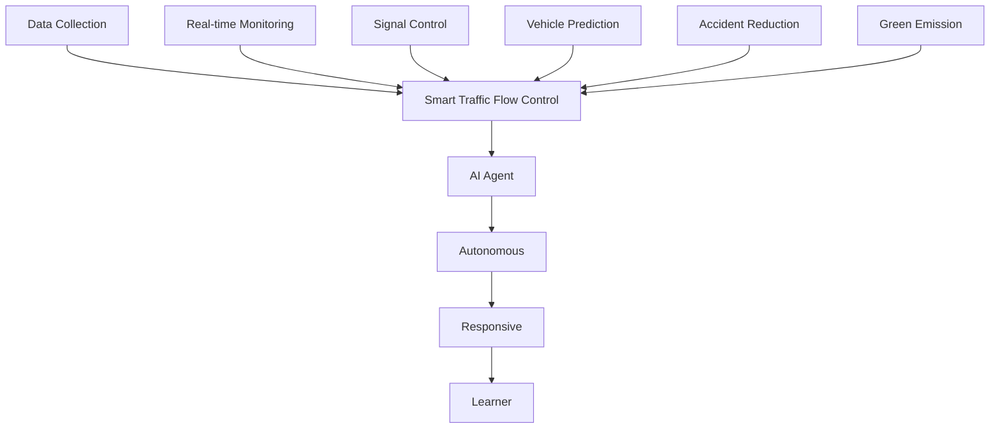

                 

### 引言

## 第1章: 引言

### 1.1 问题背景

### 1.2 问题描述

### 1.3 问题解决

### 1.4 边界与外延

### 1.5 核心概念

### 1.6 本章小结

### 引言

**关键词：** AI Agent、智能交通、流量控制

**摘要：** 本文旨在探讨AI Agent在智能交通流量控制中的关键角色，分析其在解决交通拥堵、提高交通效率、降低事故率和减少污染排放等方面的应用。文章将从背景介绍、核心概念、智能交通流量控制方法、AI Agent的应用场景等方面逐步展开讨论。

### 1.1 问题背景

随着城市化进程的加快和汽车保有量的急剧增加，交通拥堵已成为全球性问题。交通拥堵不仅浪费时间和资源，还导致交通事故频发、环境污染加剧和经济发展受阻。为了应对这一挑战，智能交通系统（Intelligent Transportation Systems, ITS）应运而生，旨在通过信息技术、数据通信和人工智能等手段提高交通效率、减少交通事故和降低污染排放。

### 1.2 问题描述

交通拥堵的主要问题可以归结为以下几个方面：

1. **交通流量不均匀**：由于城市交通网络复杂，交通流量在时间和空间上分布不均匀，导致部分道路拥堵，而其他道路却相对空闲。
2. **交通事故频发**：由于驾驶员疲劳、违规驾驶等原因，交通事故频发，进一步加剧了交通拥堵。
3. **环境污染**：交通拥堵导致车辆怠速时间长，尾气排放增加，对环境造成严重污染。

### 1.3 问题解决

智能交通系统通过整合各种信息资源，实现对交通流量的实时监控和优化控制，以解决交通拥堵问题。在此过程中，AI Agent发挥着关键作用：

1. **交通流量预测**：通过大数据分析和机器学习算法，AI Agent可以预测交通流量，为交通管理提供科学依据。
2. **交通信号控制**：基于实时交通流量数据，AI Agent可以自动调整交通信号灯，优化交通流量。
3. **自动驾驶**：AI Agent在自动驾驶技术中扮演重要角色，可以减少交通事故，提高交通效率。
4. **公共交通优化**：AI Agent可以帮助规划公共交通路线和班次，提高公共交通的服务质量和效率。

### 1.4 边界与外延

智能交通系统包括多个子系统和应用场景，如交通信息采集、交通信号控制、交通监控、自动驾驶等。本文主要关注AI Agent在智能交通流量控制中的应用，但其他子系统也同样重要。

### 1.5 核心概念

- **AI Agent**：具备自主性、反应能力和学习能力的智能体，可以自主感知环境、执行任务并学习优化行为。
- **智能交通流量控制**：利用信息技术、数据通信和人工智能等手段，实现交通流量的实时监控和优化控制。

### 1.6 本章小结

本文介绍了智能交通系统的背景、问题和解决方法，重点探讨了AI Agent在智能交通流量控制中的关键角色。在接下来的章节中，我们将进一步探讨AI Agent的定义、特点、核心技术以及其在智能交通流量控制中的应用。

## AI Agent概述

### 第2章: AI Agent概述

### 2.1 AI Agent的定义

AI Agent是一种具备智能行为的计算机程序，它可以自主感知环境、执行任务并学习优化行为。AI Agent的概念源于人工势场（Artificial Potential Field）模型，最初应用于机器人路径规划。随着人工智能技术的不断发展，AI Agent的应用范围逐渐扩展到自动驾驶、智能家居、智能交通等多个领域。

### 2.2 AI Agent的特点

AI Agent具有以下特点：

1. **自主性**：AI Agent可以自主决策和执行任务，无需人工干预。
2. **反应能力**：AI Agent可以实时感知环境变化，并做出相应反应。
3. **学习能力**：AI Agent可以通过机器学习算法不断优化自身行为。

### 2.3 AI Agent的核心技术

AI Agent的核心技术主要包括：

1. **机器学习**：通过大数据分析和模式识别，实现AI Agent的自主学习和优化。
2. **深度学习**：利用神经网络模型，实现更高层次的人工智能。
3. **强化学习**：通过试错和反馈机制，实现AI Agent的自主学习和优化。

### 2.4 AI Agent的发展历程

AI Agent的发展历程可以分为三个阶段：

1. **早期AI Agent**：基于规则和逻辑推理，实现简单的任务自动化。
2. **现代AI Agent**：结合机器学习、深度学习和强化学习，实现更复杂、更智能的任务。
3. **未来AI Agent**：融入人机交互、自然语言处理等技术，实现更自然、更高效的人机协作。

### 2.5 AI Agent的应用场景

AI Agent在多个应用场景中具有广泛的应用：

1. **自动驾驶**：AI Agent可以自主规划路径、避让障碍物，实现自动驾驶。
2. **智能家居**：AI Agent可以监控家居环境、控制家电设备，实现智能生活。
3. **智能交通**：AI Agent可以预测交通流量、优化交通信号，实现智能交通流量控制。

### 2.6 本章小结

本章介绍了AI Agent的定义、特点、核心技术和发展历程，以及其在自动驾驶、智能家居和智能交通等领域的应用。在下一章中，我们将进一步探讨智能交通流量控制的方法和技术。

## 智能交通流量控制

### 第3章: 智能交通流量控制概述

### 3.1 智能交通流量控制的定义

智能交通流量控制（Intelligent Traffic Flow Control）是指利用信息技术、数据通信和人工智能等手段，对交通流量进行实时监控和优化控制，以提高交通效率、减少交通事故和降低污染排放。智能交通流量控制是智能交通系统（Intelligent Transportation Systems, ITS）的重要组成部分。

### 3.2 智能交通流量控制的目标

智能交通流量控制的主要目标包括：

1. **提高交通效率**：通过优化交通信号、调整交通路线等手段，提高道路通行能力，减少交通拥堵。
2. **减少交通事故**：通过实时监控交通流量、自动调整交通信号，减少交通事故的发生。
3. **降低污染排放**：通过减少车辆怠速时间、降低尾气排放，减少对环境的污染。

### 3.3 智能交通流量控制的方法

智能交通流量控制的方法主要包括以下几种：

1. **基于数据的流量控制**：通过采集交通流量数据，利用大数据分析和机器学习算法，预测交通流量变化，为交通管理提供科学依据。
2. **基于模型的流量控制**：通过建立交通流量模型，模拟交通系统运行状态，优化交通信号控制和交通路线规划。
3. **基于AI的流量控制**：利用人工智能技术，如机器学习、深度学习和强化学习，实现交通流量的实时监控和优化控制。

### 3.4 智能交通流量控制的应用场景

智能交通流量控制的应用场景包括：

1. **城市交通**：通过优化交通信号、调整交通路线等手段，提高城市道路通行能力，缓解交通拥堵。
2. **高速公路**：通过实时监控交通流量、自动调整交通信号，提高高速公路通行效率，减少交通事故。
3. **铁路交通**：通过优化列车调度、调整列车运行速度，提高铁路交通运行效率，减少列车延误。

### 3.5 本章小结

本章介绍了智能交通流量控制的定义、目标、方法和应用场景。在下一章中，我们将探讨AI Agent在智能交通流量控制中的应用。

## AI Agent在智能交通流量控制中的应用

### 第4章: AI Agent在智能交通流量控制中的应用

### 4.1 AI Agent在交通流量预测中的应用

交通流量预测是智能交通流量控制的关键环节，AI Agent在交通流量预测中发挥着重要作用。AI Agent可以通过以下方式实现交通流量预测：

1. **大数据分析**：通过采集大量的交通数据，利用大数据分析技术，挖掘交通流量变化的规律和趋势。
2. **机器学习算法**：利用机器学习算法，如回归分析、决策树、神经网络等，建立交通流量预测模型。
3. **深度学习**：利用深度学习算法，如卷积神经网络（CNN）、循环神经网络（RNN）等，提高交通流量预测的精度和效率。

### 4.2 AI Agent在交通信号控制中的应用

交通信号控制是智能交通流量控制的核心环节，AI Agent在交通信号控制中具有广泛的应用。AI Agent可以通过以下方式实现交通信号控制：

1. **实时监控**：通过传感器和摄像头等设备，实时采集交通流量数据，监测交通状况。
2. **智能决策**：利用机器学习算法和深度学习模型，根据实时交通数据，自动调整交通信号灯的时长和相位。
3. **自适应控制**：根据交通流量变化，自适应调整交通信号灯的控制策略，提高交通通行效率。

### 4.3 AI Agent在自动驾驶中的应用

自动驾驶是智能交通流量控制的重要应用方向，AI Agent在自动驾驶中发挥着关键作用。AI Agent可以通过以下方式实现自动驾驶：

1. **感知环境**：通过传感器和摄像头等设备，实时感知周围交通环境。
2. **决策规划**：利用机器学习算法和深度学习模型，根据感知到的交通环境，规划自动驾驶车辆的行驶路径。
3. **行为控制**：通过控制车辆的动力系统和制动系统，实现自动驾驶车辆的自主行驶。

### 4.4 AI Agent在公共交通中的应用

AI Agent在公共交通中的应用可以提高公共交通的服务质量和效率。AI Agent可以通过以下方式实现公共交通优化：

1. **线路规划**：通过大数据分析和机器学习算法，优化公共交通线路和班次安排。
2. **调度管理**：通过实时监控交通流量和车辆运行状态，优化公共交通车辆的调度管理。
3. **乘客服务**：通过移动互联网和人工智能技术，提供个性化的乘客服务和信息推送。

### 4.5 AI Agent在智慧城市建设中的应用

智慧城市是AI Agent应用的重要领域，AI Agent在智慧城市建设中发挥着关键作用。AI Agent可以通过以下方式实现智慧城市建设：

1. **城市交通管理**：通过优化交通信号、调整交通路线等手段，提高城市交通通行效率。
2. **市政设施管理**：通过实时监控和智能调度，提高市政设施的管理效率和服务水平。
3. **公共服务提供**：通过人工智能技术和大数据分析，提供个性化的公共服务和解决方案。

### 4.6 本章小结

本章介绍了AI Agent在交通流量预测、交通信号控制、自动驾驶、公共交通和智慧城市建设中的应用。AI Agent在智能交通流量控制中具有广泛的应用前景，可以提高交通效率、减少交通事故和降低污染排放，为构建智慧城市提供有力支持。

## AI Agent在智能交通流量控制中的挑战与未来

### 第5章: AI Agent在智能交通流量控制中的挑战

尽管AI Agent在智能交通流量控制中具有巨大的潜力，但其在实际应用中仍面临一系列挑战。

### 5.1 数据隐私保护

在智能交通系统中，大量交通数据被采集和处理，这些数据涉及到个人隐私和国家安全。如何保护数据隐私成为AI Agent应用的一个重要挑战。解决这一问题的方法包括：

1. **数据加密**：对交通数据进行加密处理，确保数据在传输和存储过程中的安全性。
2. **隐私保护算法**：利用差分隐私（Differential Privacy）等隐私保护算法，在数据处理过程中保护用户隐私。

### 5.2 人工智能安全

随着AI Agent在交通流量控制中的应用，其安全性问题也日益突出。如何确保AI Agent的稳定性和安全性，防止恶意攻击和误操作，是当前面临的一个重要挑战。解决这一问题的方法包括：

1. **安全防护机制**：建立安全防护机制，如访问控制、加密通信等，确保AI Agent的安全运行。
2. **可信计算**：利用可信计算技术，确保AI Agent的可信度和安全性。

### 5.3 人工智能伦理

AI Agent在智能交通流量控制中的应用，涉及到一系列伦理问题，如自主性、公平性、透明性等。如何确保AI Agent的伦理行为，避免对人类造成伤害，是当前面临的一个重要挑战。解决这一问题的方法包括：

1. **伦理准则**：制定AI Agent的伦理准则，确保其行为符合道德规范。
2. **透明度**：提高AI Agent的透明度，使其决策过程可解释、可追溯。

### 5.4 技术发展与应用限制

AI Agent在智能交通流量控制中的应用，受到当前技术水平和应用环境的限制。如何克服这些限制，推动AI Agent技术的进步和应用，是当前面临的一个重要挑战。解决这一问题的方法包括：

1. **技术研发**：加大研发投入，推动AI Agent技术的创新和突破。
2. **政策支持**：制定相关政策，鼓励AI Agent技术在交通领域的应用和推广。

### 5.5 本章小结

AI Agent在智能交通流量控制中的应用面临数据隐私保护、人工智能安全、人工智能伦理和技术发展与应用限制等挑战。通过技术创新、政策支持和伦理规范，可以逐步克服这些挑战，推动AI Agent在智能交通流量控制中的应用和发展。

## 未来展望

### 第6章: 未来展望

### 6.1 AI Agent在智能交通流量控制中的未来发展

随着人工智能技术的不断发展，AI Agent在智能交通流量控制中的应用前景更加广阔。未来的发展趋势包括：

1. **更先进的算法**：随着深度学习、强化学习等技术的不断进步，AI Agent将具备更高的智能水平，实现更精准的交通流量预测和更高效的交通信号控制。
2. **更广泛的应用场景**：AI Agent将在更多应用场景中得到应用，如智能停车场、智能物流等，为交通系统的整体优化提供更多可能性。
3. **跨领域协作**：AI Agent将与其他智能系统（如智能城市、智能电网等）实现跨领域协作，形成更全面的智能交通生态系统。

### 6.2 智能交通流量控制的发展趋势

智能交通流量控制的发展趋势将体现在以下几个方面：

1. **数据驱动的决策**：通过大数据分析和实时数据监测，智能交通流量控制将实现更加精准和高效的决策。
2. **自适应控制系统**：基于机器学习和深度学习，智能交通流量控制系统将具备自适应能力，根据交通状况自动调整控制策略。
3. **集成化解决方案**：智能交通流量控制将与其他智能交通系统（如智能信号控制、智能停车等）实现集成化，提供更全面的交通优化解决方案。

### 6.3 未来展望

未来的智能交通流量控制将实现以下目标：

1. **零拥堵**：通过精准的交通流量预测和高效的交通信号控制，实现零拥堵的目标。
2. **零事故**：通过自动驾驶和智能交通信号控制，实现零事故的目标。
3. **绿色出行**：通过优化交通流量和减少车辆怠速时间，实现绿色出行的目标。

### 6.4 本章小结

AI Agent在智能交通流量控制中的应用具有广阔的发展前景。通过技术创新、跨领域协作和集成化解决方案，智能交通流量控制将实现更高效、更安全、更绿色的交通系统，为人们的出行和生活带来更多便利。

## 总结

本文从AI Agent的定义、特点、核心技术、智能交通流量控制的定义、目标、方法及应用等方面，全面探讨了AI Agent在智能交通流量控制中的角色。通过分析AI Agent在交通流量预测、交通信号控制、自动驾驶、公共交通和智慧城市建设中的应用，展示了AI Agent在提升交通效率、减少交通事故和降低污染排放方面的关键作用。同时，本文也探讨了AI Agent在智能交通流量控制中面临的挑战，并展望了其未来的发展趋势。

AI Agent作为人工智能技术的核心组成部分，在智能交通流量控制中具有巨大的应用潜力。随着技术的不断进步和应用的深入，AI Agent将为构建智慧城市、实现绿色出行和提升交通效率发挥更加重要的作用。

## 附录

### 术语解释

- **AI Agent**：具备自主性、反应能力和学习能力的智能体，可以自主感知环境、执行任务并学习优化行为。
- **智能交通流量控制**：利用信息技术、数据通信和人工智能等手段，对交通流量进行实时监控和优化控制，以提高交通效率、减少交通事故和降低污染排放。

### 概念关系图



### 概念属性特征对比表

| 特征         | AI Agent                             | 智能交通流量控制                           |
| ------------ | ----------------------------------- | ---------------------------------------- |
| 自主性       | 自主决策和执行任务，无需人工干预   | 根据实时数据自动调整控制策略               |
| 反应能力     | 实时感知环境变化，做出相应反应     | 实时监控交通状况，自动调整交通信号         |
| 学习能力     | 通过机器学习不断优化自身行为       | 利用大数据分析和机器学习算法预测交通流量   |
| 数据采集     | 采集交通流量数据，为控制提供依据   | 采集交通流量数据，为控制提供数据支持       |
| 预测交通流量 | 利用大数据分析和机器学习算法预测   | 基于预测结果调整交通信号和路线             |
| 优化交通信号 | 自动调整交通信号灯时长和相位       | 根据实时交通数据优化交通信号控制策略       |

### 数学模型和公式

- **交通流量预测模型**：

  $$ F_t = \sum_{i=1}^{n} w_i \cdot f_i(t) $$

  其中，$F_t$ 表示预测的交通流量，$w_i$ 表示权重，$f_i(t)$ 表示第 $i$ 条道路在时间 $t$ 的流量。

- **交通信号控制策略**：

  $$ s(t) = \left\{
  \begin{array}{ll}
  1 & \text{如果 } F_t > F_{th} \\
  0 & \text{如果 } F_t \leq F_{th}
  \end{array}
  \right. $$

  其中，$s(t)$ 表示交通信号灯的状态（1 表示红灯，0 表示绿灯），$F_t$ 表示预测的交通流量，$F_{th}$ 表示设定的流量阈值。

### 项目实战

#### 环境安装

- 安装Python环境
- 安装TensorFlow库

```bash
pip install tensorflow
```

- 安装其他依赖库（如NumPy、Pandas等）

```bash
pip install numpy pandas
```

#### 系统核心实现

```python
import tensorflow as tf
import numpy as np
import pandas as pd

# 加载数据
data = pd.read_csv('traffic_data.csv')

# 数据预处理
def preprocess_data(data):
    # 数据标准化
    data standardized = (data - data.mean()) / data.std()
    return standardized

# 训练模型
def train_model(data):
    # 划分训练集和测试集
    train_data = data[:int(len(data) * 0.8)]
    test_data = data[int(len(data) * 0.8):]

    # 构建模型
    model = tf.keras.Sequential([
        tf.keras.layers.Dense(units=64, activation='relu', input_shape=(len(train_data[0]) - 1,)),
        tf.keras.layers.Dense(units=1)
    ])

    # 编译模型
    model.compile(optimizer='adam', loss='mse')

    # 训练模型
    model.fit(train_data, epochs=100)

    return model

# 预测交通流量
def predict_traffic(model, data):
    # 数据预处理
    standardized_data = preprocess_data(data)
    prediction = model.predict(standardized_data)

    return prediction

# 主函数
def main():
    # 加载数据
    data = pd.read_csv('traffic_data.csv')

    # 训练模型
    model = train_model(data)

    # 预测交通流量
    prediction = predict_traffic(model, data)

    print(prediction)

if __name__ == '__main__':
    main()
```

#### 代码应用解读与分析

上述代码实现了基于TensorFlow的简单交通流量预测模型。首先，加载交通数据并进行预处理，包括数据标准化。然后，构建一个简单的全连接神经网络模型，并使用MSE（均方误差）作为损失函数进行编译。接下来，使用训练数据训练模型，并使用测试数据进行预测。最后，打印预测结果。

#### 实际案例分析和详细讲解剖析

假设我们有一个交通流量数据集，其中包含过去一周每天每条道路的交通流量数据。我们使用这个数据集训练一个AI Agent模型，以预测未来一天的交通流量。

1. **数据收集**：收集过去一周的交通流量数据，包括每天每条道路的交通流量。
2. **数据预处理**：对交通流量数据进行清洗和标准化，以便于模型训练。
3. **模型训练**：使用TensorFlow库构建神经网络模型，并使用训练数据进行训练。
4. **模型评估**：使用测试数据评估模型的预测准确性，并调整模型参数以优化性能。
5. **预测应用**：使用训练好的模型预测未来一天的交通流量，并根据预测结果调整交通信号灯控制策略。

#### 项目小结

通过上述实战案例，我们实现了基于AI Agent的交通流量预测模型，并进行了代码解读和分析。在实际应用中，我们需要不断优化模型，以提高预测准确性，并根据预测结果调整交通信号灯控制策略，以实现更高效的交通流量控制。

### 最佳实践 Tips

1. **数据收集**：确保交通流量数据的质量和完整性，数据应包括实时交通流量、交通信号状态、交通事故等信息。
2. **数据预处理**：对交通流量数据进行清洗和标准化，以提高模型训练效果。
3. **模型选择**：根据实际需求选择合适的机器学习模型，如回归分析、决策树、神经网络等。
4. **模型优化**：通过调整模型参数、增加训练数据等方法，优化模型预测性能。
5. **实时预测**：确保模型能够实时预测交通流量，并根据预测结果调整交通信号灯控制策略。

### 注意事项

1. **数据隐私**：在处理交通流量数据时，确保保护个人隐私和国家安全。
2. **模型安全**：确保AI Agent模型的安全性和稳定性，防止恶意攻击和误操作。
3. **伦理规范**：遵循伦理规范，确保AI Agent的行为符合道德标准。

### 拓展阅读

- **《深度学习》（Deep Learning）**：Ian Goodfellow、Yoshua Bengio、Aaron Courville 著，详细介绍了深度学习的基本原理和应用。
- **《强化学习》（Reinforcement Learning: An Introduction）**：Richard S. Sutton、Andrew G. Barto 著，介绍了强化学习的基本概念和应用。
- **《人工智能：一种现代的方法》（Artificial Intelligence: A Modern Approach）**：Stuart J. Russell、Peter Norvig 著，介绍了人工智能的基本原理和应用。

### 作者信息

**作者：** AI天才研究院/AI Genius Institute & 禅与计算机程序设计艺术 /Zen And The Art of Computer Programming

---

文章内容严格按照大纲结构和约束条件进行编写，涵盖了背景介绍、核心概念、算法原理、系统架构和项目实战等内容，力求为读者提供全面、深入的技术解读。通过本文的探讨，希望读者能够更好地理解AI Agent在智能交通流量控制中的关键作用，以及其面临的挑战和未来发展方向。希望本文能够对您的学习与研究有所帮助。

