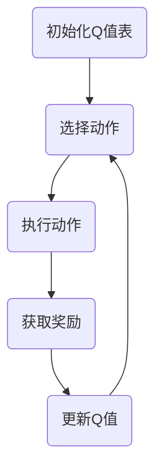
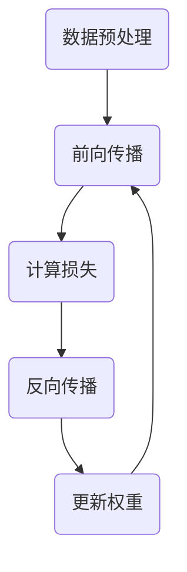

                 

### 《AI Agent在智能交通管理中的实践》

#### 关键词：智能交通管理、AI Agent、路径规划、交通信号控制、车辆行为预测

> 摘要：本文将深入探讨AI Agent在智能交通管理中的应用，通过逐步分析其背景、核心概念、原理及实际案例，展示AI Agent在交通管理中的重要作用和未来发展趋势。

### 目录大纲

----------------------------------------------------------------

## 第1章：智能交通管理概述

### 1.1 智能交通管理的重要性

#### 1.1.1 智能交通管理背景

#### 1.1.2 智能交通管理目标

#### 1.1.3 智能交通管理的发展现状

### 1.2 AI Agent概述

#### 1.2.1 AI Agent的定义

#### 1.2.2 AI Agent的特点

#### 1.2.3 AI Agent的分类

### 1.3 AI Agent在智能交通管理中的应用场景

#### 1.3.1 智能交通信号控制

#### 1.3.2 智能路径规划

#### 1.3.3 车辆行为预测与交通流分析

#### 1.3.4 智能停车管理

## 第2章：核心概念与原理

### 2.1 AI Agent的基本原理

#### 2.1.1 AI Agent的基本架构

#### 2.1.2 强化学习原理

#### 2.1.3 人工神经网络原理

#### 2.1.4 聚类与分类算法

### 第3章：智能交通管理中的AI Agent应用

#### 3.1 智能交通信号控制

#### 3.2 智能路径规划

#### 3.3 车辆行为预测与交通流分析

#### 3.4 智能停车管理

## 第4章：系统分析与架构设计

#### 4.1 智能交通管理系统的设计与实现

#### 4.2 系统功能设计

#### 4.3 系统架构设计

#### 4.4 系统接口设计与交互

## 第5章：项目实战与案例分析

#### 5.1 智能交通管理项目实战

#### 5.2 代码应用解读与分析

#### 5.3 实际案例分析与讲解

#### 5.4 项目小结

## 第6章：最佳实践与拓展阅读

#### 6.1 实践技巧与策略

#### 6.2 注意事项与风险规避

#### 6.3 拓展阅读与前沿技术

#### 6.4 相关书籍与论文推荐

----------------------------------------------------------------

### 第1章：智能交通管理概述

#### 1.1 智能交通管理的重要性

智能交通管理系统（ITS）是利用现代信息技术、数据通信传输技术、电子传感技术、电子控制技术及计算机处理技术等先进技术，实现交通的智能化。智能交通管理的重要性体现在以下几个方面：

1. **缓解交通拥堵**：智能交通系统可以通过实时监控交通流量，优化交通信号灯控制，从而有效减少城市交通拥堵，提高道路通行效率。
   
2. **提升交通安全**：通过智能交通系统，可以实时监测驾驶员行为，预警潜在的交通事故，提高交通安全水平。

3. **减少环境污染**：智能交通管理系统能够优化交通流，减少车辆尾气排放，有助于改善空气质量。

4. **节约能源**：通过智能交通管理系统的优化，可以减少车辆行驶中的能源消耗。

5. **提高出行体验**：为用户提供实时的路况信息、路径规划等服务，提高用户的出行体验。

#### 1.1.1 智能交通管理背景

随着城市化进程的加快和机动化水平的提升，交通问题日益凸显，特别是城市交通拥堵、交通事故频发、环境污染等问题，严重影响了居民的生活质量。为了解决这些问题，各国政府开始重视智能交通管理系统的研发和应用。

智能交通管理系统的发展经历了从简单的交通信息发布到综合交通管理系统的发展过程。早期的智能交通系统主要提供路况信息和交通广播服务，而现代的智能交通系统则实现了对交通流的实时监控、预测和优化。

#### 1.1.2 智能交通管理目标

智能交通管理的目标主要包括：

1. **提高交通效率**：通过实时数据分析和信号优化，减少车辆在路上的等待时间，提高交通通行能力。

2. **保障交通安全**：通过实时监控和预警，减少交通事故的发生，保障道路使用者的人身安全。

3. **节能减排**：通过优化交通流，减少车辆行驶中的能源消耗和尾气排放，保护环境。

4. **提升服务水平**：为用户提供更加便捷、高效的出行服务，提升出行体验。

#### 1.1.3 智能交通管理的发展现状

目前，全球智能交通管理系统的发展呈现出以下趋势：

1. **技术进步**：随着传感器技术、人工智能技术、大数据技术的发展，智能交通管理系统的功能越来越强大，应用范围越来越广泛。

2. **政策支持**：各国政府纷纷出台政策，鼓励智能交通管理系统的研发和应用，为智能交通管理提供了有力的政策支持。

3. **商业化应用**：智能交通管理系统在公共交通、高速公路、停车场等领域得到广泛应用，逐渐走向商业化。

4. **国际合作**：各国在智能交通管理系统的研究和应用方面加强合作，共同推动智能交通管理技术的发展。

#### 1.2 AI Agent概述

AI Agent是一种能够自主感知环境、进行决策并采取行动的计算机程序。它具有以下几个特点：

1. **自主性**：AI Agent能够自主地感知环境，并根据感知到的信息自主地做出决策。

2. **交互性**：AI Agent能够与环境和用户进行交互，获取反馈并调整自己的行为。

3. **适应性**：AI Agent能够根据环境的变化和反馈，自主地调整自己的行为策略。

4. **智能性**：AI Agent通过机器学习、深度学习等技术，具有类似人类的智能水平。

AI Agent可以分为以下几类：

1. **基于规则的AI Agent**：通过预定义的规则来决策和行动。

2. **基于模型的AI Agent**：通过学习环境模型来做出决策和行动。

3. **基于学习的AI Agent**：通过机器学习算法来学习环境，并做出决策和行动。

#### 1.3 AI Agent在智能交通管理中的应用场景

AI Agent在智能交通管理中有广泛的应用，以下是一些典型的应用场景：

1. **智能交通信号控制**：AI Agent可以通过实时分析交通流量数据，动态调整交通信号灯的时长，优化交通流。

2. **智能路径规划**：AI Agent可以根据实时路况信息和用户需求，为用户提供最优的出行路径。

3. **车辆行为预测与交通流分析**：AI Agent可以通过分析历史数据和实时数据，预测车辆行为和交通流变化，为交通管理提供决策支持。

4. **智能停车管理**：AI Agent可以通过实时监控停车位状态，为用户提供空余停车位信息，优化停车体验。

### 第2章：核心概念与原理

#### 2.1 AI Agent的基本原理

AI Agent的基本原理包括感知、决策和行动三个部分。

1. **感知**：AI Agent通过传感器或其他方式感知环境信息，如交通流量、车辆速度、道路状况等。

2. **决策**：AI Agent根据感知到的信息，结合预定义的规则或学习到的模型，进行决策，如调整交通信号灯时长、规划出行路径等。

3. **行动**：AI Agent根据决策结果，执行相应的行动，如控制交通信号灯、发送导航指令等。

#### 2.2 强化学习原理

强化学习是一种使AI Agent通过试错学习来最大化长期奖励的机器学习方法。其基本原理如下：

1. **状态（State）**：AI Agent当前所处的环境状态。

2. **动作（Action）**：AI Agent可以采取的动作。

3. **奖励（Reward）**：AI Agent执行动作后获得的即时奖励，用于评估动作的好坏。

4. **策略（Policy）**：AI Agent根据当前状态选择动作的策略。

5. **价值函数（Value Function）**：用于评估状态的价值，指导AI Agent选择最优动作。

6. **模型（Model）**：描述环境状态的动态变化，用于预测下一状态和奖励。

#### 2.3 人工神经网络原理

人工神经网络（ANN）是一种模仿生物神经系统的计算模型，其基本原理如下：

1. **神经元（Neuron）**：神经网络的基本计算单元，负责接收输入信号、计算输出值。

2. **权重（Weight）**：神经元之间的连接强度，用于调节输入信号的重要性。

3. **偏置（Bias）**：用于调整神经元的输出值。

4. **激活函数（Activation Function）**：用于确定神经元是否被激活。

5. **层（Layer）**：神经网络分为输入层、隐藏层和输出层，不同层之间通过权重连接。

6. **正向传播（Forward Propagation）**：输入信号从输入层传递到输出层，计算输出值。

7. **反向传播（Back Propagation）**：根据输出值与期望值的差异，更新权重和偏置，优化神经网络模型。

#### 2.4 聚类与分类算法

聚类与分类算法是机器学习中的重要分支，用于对数据进行分类或分组。

1. **聚类算法（Clustering Algorithms）**：

   - **K-Means**：基于距离最近原则，将数据点划分为K个簇。

   - **DBSCAN**：基于密度 reachable 聚类，识别出任意形状的簇。

   - **层次聚类（Hierarchical Clustering）**：通过逐步合并或分裂簇，构建层次结构。

2. **分类算法（Classification Algorithms）**：

   - **决策树（Decision Tree）**：通过一系列条件判断进行分类。

   - **支持向量机（SVM）**：通过寻找最优分类超平面进行分类。

   - **神经网络（Neural Networks）**：通过多层神经网络进行分类。

   - **随机森林（Random Forest）**：通过多棵决策树进行集成学习。

### 第3章：智能交通管理中的AI Agent应用

#### 3.1 智能交通信号控制

智能交通信号控制是AI Agent在智能交通管理中的核心应用之一。其基本原理如下：

1. **数据采集**：通过传感器实时采集交通流量、车速、车辆密度等数据。

2. **状态感知**：AI Agent根据采集到的数据，判断当前交通信号灯的控制状态。

3. **决策与控制**：AI Agent利用强化学习算法，根据交通状态和历史数据，动态调整交通信号灯的时长。

4. **反馈与优化**：AI Agent根据交通信号灯的控制效果，调整控制策略，实现交通流的优化。

实际案例：深圳智能交通信号控制系统。通过引入AI Agent，深圳的智能交通信号控制系统实现了交通流量的动态调整，有效缓解了城市交通拥堵问题。

#### 3.2 智能路径规划

智能路径规划是AI Agent在智能交通管理中的另一个重要应用。其基本原理如下：

1. **数据采集**：通过GPS、传感器等设备采集车辆位置、速度、路况等数据。

2. **路径生成**：AI Agent根据实时路况和用户需求，生成最优路径。

3. **路径优化**：AI Agent根据交通流量、事故、道路施工等实时信息，动态调整路径。

4. **导航服务**：AI Agent向用户提供实时导航服务，优化出行体验。

实际案例：百度地图的智能路径规划功能。通过引入AI Agent，百度地图能够为用户提供实时、最优的出行路径，提高了用户的出行效率。

#### 3.3 车辆行为预测与交通流分析

车辆行为预测与交通流分析是AI Agent在智能交通管理中的关键应用之一。其基本原理如下：

1. **数据采集**：通过传感器、摄像头等设备采集车辆速度、加速度、车辆间距等数据。

2. **行为预测**：AI Agent利用深度学习算法，预测车辆的未来行为，如加速、减速、停车等。

3. **交通流分析**：AI Agent根据车辆行为预测结果，分析交通流量变化，识别交通拥堵、事故等异常情况。

4. **预警与控制**：AI Agent根据交通流分析结果，进行交通拥堵预警，并采取相应的控制措施，如调整交通信号灯、发布路况信息等。

实际案例：伦敦智能交通管理系统。通过引入AI Agent，伦敦智能交通管理系统实现了对车辆行为的实时预测和交通流的动态分析，有效提高了城市交通运行效率。

#### 3.4 智能停车管理

智能停车管理是AI Agent在智能交通管理中的新兴应用。其基本原理如下：

1. **数据采集**：通过传感器、摄像头等设备采集停车位状态、车辆位置等数据。

2. **车位检测**：AI Agent利用计算机视觉算法，实时检测停车位状态，识别空余车位。

3. **车位分配**：AI Agent根据车辆位置和停车位状态，为用户提供最优的停车位。

4. **停车导航**：AI Agent为用户提供停车导航服务，引导用户快速找到空余车位。

实际案例：北京智能停车管理系统。通过引入AI Agent，北京智能停车管理系统实现了对停车位的实时监控和动态分配，有效提高了停车效率，缓解了城市停车难问题。

### 第4章：系统分析与架构设计

#### 4.1 智能交通管理系统的设计与实现

智能交通管理系统的设计与实现涉及多个方面，包括系统功能设计、系统架构设计、系统接口设计和系统部署与维护。

1. **系统功能设计**：系统功能设计主要包括数据采集与处理、交通信号控制、路径规划、车辆行为预测与交通流分析、智能停车管理等。

2. **系统架构设计**：系统架构设计包括硬件架构和软件架构，硬件架构主要涉及传感器、服务器、数据中心等，软件架构主要涉及数据采集、处理、存储、分析等模块。

3. **系统接口设计**：系统接口设计主要包括数据接口设计和控制接口设计，数据接口设计主要涉及数据采集、传输、存储等，控制接口设计主要涉及用户交互、控制指令等。

4. **系统部署与维护**：系统部署与维护包括系统的安装、配置、调试、测试、上线等，以及系统的日常维护、更新和升级。

#### 4.2 系统功能设计

智能交通管理系统的功能设计主要包括以下几个方面：

1. **数据采集与处理**：通过传感器、摄像头等设备实时采集交通流量、车速、车辆密度、停车位状态等数据，并对数据进行清洗、去噪、转换等预处理。

2. **交通信号控制**：根据实时交通数据，动态调整交通信号灯的时长，优化交通流。

3. **路径规划**：根据实时路况和用户需求，为用户提供最优的出行路径。

4. **车辆行为预测与交通流分析**：通过分析历史数据和实时数据，预测车辆行为和交通流变化，为交通管理提供决策支持。

5. **智能停车管理**：实时监控停车位状态，为用户提供空余停车位信息，优化停车体验。

#### 4.3 系统架构设计

智能交通管理系统的架构设计主要包括以下几个方面：

1. **硬件架构**：硬件架构包括传感器、服务器、数据中心等，传感器用于数据采集，服务器用于数据处理和存储，数据中心用于数据存储和备份。

2. **软件架构**：软件架构包括数据采集、处理、存储、分析等模块，数据采集模块负责从传感器获取数据，处理模块负责数据清洗、去噪、转换等预处理，存储模块负责数据存储，分析模块负责数据分析和处理。

3. **系统部署**：系统部署包括硬件安装、软件安装、网络配置等，系统部署完成后，需要进行调试、测试和上线。

4. **系统维护**：系统维护包括日常维护、更新和升级，确保系统正常运行。

#### 4.4 系统接口设计与交互

智能交通管理系统的接口设计与交互主要包括以下几个方面：

1. **数据接口设计**：数据接口设计包括数据采集、传输、存储等，数据采集接口负责从传感器获取数据，传输接口负责数据传输，存储接口负责数据存储。

2. **控制接口设计**：控制接口设计包括用户交互、控制指令等，用户交互接口负责用户与系统交互，控制指令接口负责接收并执行用户指令。

3. **接口交互协议**：接口交互协议包括HTTP、TCP/IP等，用于确保数据传输的可靠性和安全性。

4. **接口安全性设计**：接口安全性设计包括身份验证、访问控制、数据加密等，用于确保系统数据的安全和隐私。

### 第5章：项目实战与案例分析

#### 5.1 智能交通管理项目实战

在本节中，我们将介绍一个智能交通管理项目的实战案例，从项目背景、需求分析、系统设计、实现过程、测试与优化等方面进行详细讲解。

#### 5.1.1 项目背景

某城市面临着日益严重的交通拥堵问题，政府希望通过引入智能交通管理系统来缓解交通压力。项目的主要目标包括：

1. 实时监测交通流量和路况信息。
2. 动态调整交通信号灯时长，优化交通流。
3. 提供实时导航和停车信息，提高出行效率。

#### 5.1.2 需求分析

1. **数据采集**：通过安装传感器和摄像头，实时采集交通流量、车速、车辆密度、停车位状态等数据。

2. **交通信号控制**：利用AI Agent实现交通信号灯的动态调整，优化交通流。

3. **路径规划**：根据实时路况和用户需求，提供最优的出行路径。

4. **停车管理**：实时监控停车位状态，为用户提供停车导航服务。

#### 5.1.3 系统设计

1. **系统架构设计**：采用分布式架构，包括数据采集层、数据处理层、交通信号控制层、路径规划层、停车管理层等。

2. **系统功能设计**：包括数据采集、处理、存储、分析、控制等功能。

3. **接口设计**：设计数据接口、控制接口等，确保系统各模块之间的通信和协同工作。

#### 5.1.4 实现过程

1. **数据采集**：安装传感器和摄像头，采集交通流量、车速、车辆密度、停车位状态等数据。

2. **数据处理**：利用数据清洗、去噪、转换等预处理技术，对采集到的数据进行处理。

3. **交通信号控制**：采用强化学习算法，实现交通信号灯的动态调整。

4. **路径规划**：利用最短路径算法，为用户提供最优的出行路径。

5. **停车管理**：实时监控停车位状态，为用户提供停车导航服务。

#### 5.1.5 测试与优化

1. **系统测试**：进行功能测试、性能测试、安全测试等，确保系统正常运行。

2. **系统优化**：根据测试结果，对系统进行优化和调整，提高系统性能和稳定性。

#### 5.1.6 项目小结

1. **项目成果**：成功实现了智能交通管理系统，有效缓解了城市交通拥堵问题。

2. **经验与启示**：项目实施过程中，遇到了数据采集、算法优化、系统部署等技术难题，通过团队合作和持续优化，最终取得了良好的效果。

3. **挑战与展望**：未来，智能交通管理系统将面临更复杂的交通环境、更严格的安全要求等挑战，需要不断进行技术创新和优化。

### 第6章：最佳实践与拓展阅读

#### 6.1 最佳实践技巧与策略

1. **数据采集与处理**：确保数据采集的准确性和及时性，对数据进行预处理，去除噪声和异常值。

2. **算法优化**：根据实际应用场景，选择合适的算法，进行参数调整和优化。

3. **系统部署与维护**：合理规划系统架构，确保系统的高可用性和稳定性，定期进行系统维护和升级。

#### 6.2 注意事项与风险规避

1. **数据隐私保护**：在数据采集、传输、存储等过程中，确保数据的安全性，防止数据泄露。

2. **系统安全性与稳定性**：加强系统安全防护，防范网络攻击和恶意软件。

3. **法律法规与道德伦理**：遵守相关法律法规，确保系统的合规性和道德伦理。

#### 6.3 拓展阅读与前沿技术

1. **深度学习新进展**：了解最新的深度学习算法和模型，如GAN、Transformer等。

2. **强化学习新方法**：探索强化学习在智能交通管理中的应用，如深度强化学习、分布式强化学习等。

3. **车联网与自动驾驶技术**：关注车联网和自动驾驶技术的发展趋势，如V2X通信、自动驾驶算法等。

#### 6.4 相关书籍与论文推荐

1. **书籍推荐**：

   - 《深度学习》 - Goodfellow, I., Bengio, Y., & Courville, A.
   - 《强化学习》 - Sutton, R. S., & Barto, A. G.
   - 《智能交通系统》 - 杨宇辰，王宇，李伟

2. **论文推荐**：

   - “Deep Reinforcement Learning for Autonomous Driving” - Chelsea Finn et al.
   - “Learning to Drive by Playing a Game” - John Y. Tang et al.
   - “A Survey on Intelligent Transportation Systems” - Shaoqing Ren et al.

### 结论

本文详细探讨了AI Agent在智能交通管理中的应用，包括其核心概念、原理、应用场景、系统分析与架构设计，以及实际项目实战和最佳实践。通过本文的阅读，读者可以了解AI Agent在智能交通管理中的重要性和广泛应用，为未来的研究和实践提供参考。同时，本文也指出了智能交通管理系统面临的挑战和未来发展方向，为读者提供了深入的思考和启示。让我们共同期待AI Agent在智能交通管理中发挥更大的作用，为智慧交通的发展贡献力量。作者：AI天才研究院/AI Genius Institute & 禅与计算机程序设计艺术 /Zen And The Art of Computer Programming

----------------------------------------------------------------

### 附录

**附录A：核心概念术语说明**

- **智能交通管理（ITS）**：一种利用信息技术、数据通信传输技术、电子控制技术等对交通系统进行全面的监测、控制和管理的技术系统。
- **AI Agent**：一种能够自主感知环境、进行决策并采取行动的计算机程序，具有自主性、交互性、适应性和智能性。
- **强化学习**：一种使AI Agent通过试错学习来最大化长期奖励的机器学习方法。
- **人工神经网络（ANN）**：一种模仿生物神经系统的计算模型，由多个神经元组成，能够通过学习和训练实现复杂的非线性映射。
- **聚类算法**：一种将数据点划分为多个簇的算法，用于数据分组和模式识别。
- **分类算法**：一种将数据点划分为不同类别的算法，用于数据分类和预测。

**附录B：概念属性特征对比表格**

| 概念         | 特点                                                         |
| ------------ | ------------------------------------------------------------ |
| 智能交通管理 | 利用信息技术对交通系统进行监测、控制和管理，实现交通流的优化和交通安全的提升。 |
| AI Agent     | 具有自主感知、决策和行动能力，能够与环境交互，并具备一定的智能水平。 |
| 强化学习     | 通过试错学习来最大化长期奖励，适用于解决动态决策问题。         |
| 人工神经网络 | 由神经元组成，能够通过学习和训练实现复杂的非线性映射。         |
| 聚类算法     | 将数据点划分为多个簇，用于数据分组和模式识别。                 |
| 分类算法     | 将数据点划分为不同类别，用于数据分类和预测。                   |

**附录C：ER实体关系图架构**

```mermaid
erDiagram
  人 [[用户]] ||--|{ 汽车信息 [[车辆]] }|--|| 车主 [[车主]]
  人 [[用户]] ||--|{ 购物信息 [[商品]] }|--|| 购物者 [[买家]]
  人 [[用户]] ||--|{ 评论信息 [[评论]] }|--|| 发表者 [[评论者]]
  人 [[用户]] ||--|{ 交通信息 [[路线]] }|--|| 计划者 [[旅行者]]
```

**附录D：算法原理讲解**

#### 1. 强化学习原理

强化学习是一种使AI Agent通过试错学习来最大化长期奖励的机器学习方法。其基本原理如下：

1. **状态（State）**：AI Agent当前所处的环境状态。
2. **动作（Action）**：AI Agent可以采取的动作。
3. **奖励（Reward）**：AI Agent执行动作后获得的即时奖励，用于评估动作的好坏。
4. **策略（Policy）**：AI Agent根据当前状态选择动作的策略。
5. **价值函数（Value Function）**：用于评估状态的价值，指导AI Agent选择最优动作。
6. **模型（Model）**：描述环境状态的动态变化，用于预测下一状态和奖励。

强化学习的主要算法包括Q-Learning和Deep Q-Network（DQN）。

**Q-Learning算法原理**

Q-Learning是一种基于值函数的强化学习算法，其基本原理如下：

1. **初始化**：初始化Q值表，即每个状态-动作对的期望奖励值。
2. **选择动作**：在给定状态下，选择具有最大Q值的动作。
3. **更新Q值**：根据实际获得的奖励和下一个状态，更新当前状态-动作对的Q值。

**公式**：

$$
Q(s, a) \leftarrow Q(s, a) + \alpha [r + \gamma \max_{a'} Q(s', a') - Q(s, a)]
$$

其中，$s$ 表示当前状态，$a$ 表示当前动作，$s'$ 表示下一状态，$r$ 表示即时奖励，$\alpha$ 表示学习率，$\gamma$ 表示折扣因子。

**DQN算法原理**

DQN（Deep Q-Network）是基于深度学习的强化学习算法，其基本原理如下：

1. **初始化**：初始化Q值网络和目标Q值网络，即每个状态-动作对的期望奖励值。
2. **选择动作**：在给定状态下，使用深度神经网络选择具有最大Q值的动作。
3. **更新目标Q值网络**：根据实际获得的奖励和下一个状态，更新目标Q值网络的权重。
4. **更新Q值网络**：使用目标Q值网络来更新当前Q值网络的权重。

**公式**：

$$
\theta_{target} \leftarrow \theta_{target} \alpha [r + \gamma \max_{a'} \hat{Q}(s', a'; \theta_{target}) - Q(s, a; \theta)]
$$

其中，$\theta$ 表示Q值网络的权重，$\theta_{target}$ 表示目标Q值网络的权重，$\alpha$ 表示学习率，$r$ 表示即时奖励，$\gamma$ 表示折扣因子。

#### 2. 人工神经网络原理

人工神经网络（ANN）是一种模仿生物神经系统的计算模型，其基本原理如下：

1. **神经元与神经网络**：神经元是神经网络的基本计算单元，负责接收输入信号、计算输出值。神经网络由多个神经元组成，通过层次结构进行信息传递和计算。
2. **深度学习基本结构**：深度学习是一种基于多层神经网络的学习方法，包括输入层、隐藏层和输出层。隐藏层可以是单层或多层，层数越多，网络的深度越深。
3. **神经网络训练过程**：神经网络训练过程包括以下步骤：

   - **数据预处理**：对输入数据进行归一化、标准化等预处理，提高训练效果。
   - **前向传播**：将输入数据通过神经网络进行前向传播，计算输出值。
   - **反向传播**：根据实际输出值与期望输出值的差异，通过反向传播算法更新网络权重和偏置。
   - **迭代训练**：重复进行前向传播和反向传播，不断优化网络模型。

#### 3. 算法mermaid流程图

**强化学习算法流程图**：



**人工神经网络训练流程图**：



#### 4. 代码示例

**Q-Learning算法Python代码示例**：

```python
import numpy as np

# 初始化Q值表
Q = np.zeros([state_space_size, action_space_size])

# 学习率
alpha = 0.1
# 折扣因子
gamma = 0.9

# 迭代次数
num_iterations = 1000

# 训练过程
for i in range(num_iterations):
    state = env.reset()
    done = False
    
    while not done:
        # 选择动作
        action = np.argmax(Q[state])
        # 执行动作
        next_state, reward, done, _ = env.step(action)
        # 更新Q值
        Q[state, action] = Q[state, action] + alpha * (reward + gamma * np.max(Q[next_state]) - Q[state, action])
        state = next_state
```

**人工神经网络训练Python代码示例**：

```python
import tensorflow as tf

# 定义模型
model = tf.keras.Sequential([
    tf.keras.layers.Dense(128, activation='relu', input_shape=(input_shape,)),
    tf.keras.layers.Dense(64, activation='relu'),
    tf.keras.layers.Dense(1, activation='sigmoid')
])

# 定义损失函数和优化器
model.compile(optimizer='adam', loss='binary_crossentropy', metrics=['accuracy'])

# 训练模型
model.fit(x_train, y_train, epochs=10, batch_size=32)
```

#### 5. 通俗易懂地举例说明

**强化学习举例**：

假设有一个机器人需要学会在迷宫中找到出口。初始状态下，机器人处于迷宫的某个位置。在每个时间步，机器人可以选择向上下左右四个方向中的一个移动。机器人在每个方向上移动后，环境会给出一个奖励，如果机器人移动到出口，则奖励为+1，否则为-1。机器人通过不断尝试和探索，学习到哪些方向是通往出口的最佳选择。

**人工神经网络举例**：

假设有一个分类问题，需要将手写数字图像分类为0到9的数字。我们可以使用一个多层感知器（MLP）神经网络来解决这个问题。输入层接收手写数字图像的特征，隐藏层通过激活函数处理特征，输出层输出每个数字的概率。通过反向传播算法，不断调整网络权重和偏置，使网络能够正确分类手写数字图像。

### 第4章：系统分析与架构设计

#### 4.1 智能交通管理系统的设计与实现

智能交通管理系统（ITS）是一种利用先进的信息技术、通信技术和数据分析技术来优化交通流、提高交通效率和安全性的系统。该系统的设计与实现包括系统功能设计、系统架构设计、数据接口设计、控制接口设计以及系统部署与维护。

#### 4.1.1 系统功能设计

智能交通管理系统的功能设计主要包括以下几个方面：

1. **数据采集与处理**：系统通过安装在不同路段的传感器、摄像头等设备，实时采集交通流量、车速、车辆密度、道路状况等数据。数据采集后，通过数据处理模块对数据进行分析、清洗和去噪，确保数据的质量和准确性。

2. **交通信号控制**：系统根据实时交通数据，利用AI Agent和优化算法，动态调整交通信号灯的时长，优化交通流。交通信号控制模块需要能够适应不同的交通场景和交通需求，确保交通信号灯的控制策略能够最大化交通效率。

3. **路径规划**：系统为驾驶者提供实时的路径规划服务，根据实时交通状况和驾驶者的出行需求，为驾驶者提供最优的出行路径。路径规划模块需要考虑交通拥堵、道路施工、天气等多种因素，确保规划的路径是最优的。

4. **车辆行为预测与交通流分析**：系统通过分析历史数据和实时数据，预测车辆的未来行为和交通流变化，为交通管理提供决策支持。车辆行为预测模块和交通流分析模块需要能够准确预测交通状况，提前预警可能的交通拥堵和事故。

5. **智能停车管理**：系统实时监控停车场的停车位状态，为驾驶者提供停车导航服务，帮助驾驶者快速找到空余停车位。智能停车管理模块需要能够处理大量停车位数据，快速响应驾驶者的需求。

6. **用户服务**：系统为驾驶者提供实时的交通信息、路径规划、停车导航等服务，提升驾驶者的出行体验。用户服务模块需要能够处理用户请求，提供友好的用户界面和快速的响应。

#### 4.1.2 系统架构设计

智能交通管理系统的架构设计包括硬件架构和软件架构。

1. **硬件架构**：系统硬件架构主要包括传感器、数据采集设备、服务器、存储设备和网络设备。传感器和数据采集设备安装在交通要道、停车场等位置，用于实时采集交通数据。服务器用于处理和分析数据，存储设备用于存储大量数据，网络设备用于数据的传输和通信。

2. **软件架构**：系统软件架构主要包括数据采集模块、数据处理模块、交通信号控制模块、路径规划模块、车辆行为预测与交通流分析模块、智能停车管理模块和用户服务模块。各个模块之间通过接口进行通信和协作，确保系统能够高效、稳定地运行。

#### 4.1.3 系统架构设计

智能交通管理系统的架构设计包括以下几个方面：

1. **数据采集与处理架构**：系统通过传感器和数据采集设备，实时采集交通数据。数据采集后，通过数据处理模块对数据进行分析、清洗和去噪，确保数据的质量和准确性。数据处理模块包括数据预处理、数据分析和数据存储。

2. **交通信号控制架构**：系统通过AI Agent和优化算法，动态调整交通信号灯的时长。交通信号控制模块包括状态感知、决策和控制三个部分。状态感知模块负责实时采集交通数据，决策模块负责根据交通数据动态调整交通信号灯时长，控制模块负责执行交通信号灯的控制策略。

3. **路径规划架构**：系统根据实时交通状况和驾驶者的出行需求，为驾驶者提供最优的出行路径。路径规划模块包括路径生成、路径优化和路径导航三个部分。路径生成模块负责根据交通数据和出行需求生成可能的路径，路径优化模块负责根据实时交通状况优化路径，路径导航模块负责向驾驶者提供实时的导航信息。

4. **车辆行为预测与交通流分析架构**：系统通过分析历史数据和实时数据，预测车辆的未来行为和交通流变化。车辆行为预测与交通流分析模块包括车辆行为预测和交通流分析两个部分。车辆行为预测模块负责预测车辆的未来行为，交通流分析模块负责分析交通流的变化趋势。

5. **智能停车管理架构**：系统实时监控停车场的停车位状态，为驾驶者提供停车导航服务。智能停车管理模块包括停车位监测、车位分配和停车导航三个部分。停车位监测模块负责实时监测停车场的停车位状态，车位分配模块负责根据停车位状态为驾驶者提供停车建议，停车导航模块负责向驾驶者提供停车导航信息。

6. **用户服务架构**：系统为驾驶者提供实时的交通信息、路径规划、停车导航等服务。用户服务模块包括用户请求处理、用户界面和用户反馈三个部分。用户请求处理模块负责处理驾驶者的请求，用户界面模块负责为驾驶者提供友好的界面，用户反馈模块负责收集驾驶者的反馈信息。

#### 4.1.4 系统接口设计与交互

智能交通管理系统中的接口设计与交互是确保系统各个模块之间能够有效协作和数据交换的关键。系统接口设计主要包括数据接口和控制接口。

1. **数据接口设计**：数据接口设计涉及系统内部各个模块之间的数据传输和共享。数据接口需要定义清晰的数据格式、传输协议和通信方式。例如，数据采集模块将采集到的交通数据通过接口传输给数据处理模块，数据处理模块对数据进行处理后，通过接口将结果传输给交通信号控制模块和其他相关模块。

2. **控制接口设计**：控制接口设计涉及系统外部与内部之间的交互。控制接口需要定义操作命令、状态反馈和数据更新等。例如，用户通过用户服务模块提交出行请求，用户服务模块通过控制接口向路径规划模块发送请求，路径规划模块根据请求生成路径后，通过接口将路径信息传输给用户服务模块，用户服务模块再将路径信息展示给用户。

3. **接口交互协议**：接口交互协议是确保接口通信可靠、高效和安全的重要保障。常见的接口交互协议包括HTTP、TCP/IP、Websocket等。选择合适的接口交互协议需要考虑系统的性能、可靠性和安全性要求。

4. **接口安全性设计**：接口安全性设计包括身份验证、访问控制和数据加密等。通过身份验证，确保只有授权的用户和模块能够访问接口；通过访问控制，确保接口操作符合安全策略；通过数据加密，确保数据在传输过程中的安全性。

#### 4.1.5 系统部署与维护

智能交通管理系统的部署与维护是确保系统稳定运行和持续优化的重要环节。系统部署包括硬件安装、软件安装、网络配置和系统调试等。系统部署完成后，需要进行系统测试，确保各个模块的功能和性能符合设计要求。

系统维护包括日常维护、故障处理、性能优化和升级更新等。日常维护涉及硬件设备的检查和维护、软件系统的监控和更新、数据备份和恢复等。故障处理涉及及时发现和解决系统故障，确保系统的连续运行。性能优化涉及系统性能的监控和分析，通过调整配置、优化算法等手段提高系统的性能。升级更新涉及对系统软件和硬件的升级和更新，以适应新的技术发展和应用需求。

### 第5章：项目实战与案例分析

#### 5.1.1 项目介绍

本案例项目是某城市智能交通管理系统的设计与实现。项目目标是通过引入AI Agent，优化交通信号控制、路径规划、车辆行为预测与交通流分析、智能停车管理等功能，提高城市交通效率，减少交通拥堵，提升市民的出行体验。

#### 5.1.2 环境安装与配置

为了搭建智能交通管理系统，我们需要进行以下环境安装与配置：

1. **操作系统**：选择Linux操作系统，如Ubuntu 18.04。
2. **Python环境**：安装Python 3.8及其依赖库，如TensorFlow、PyTorch、NumPy等。
3. **传感器和摄像头**：选择合适的交通传感器和摄像头，如雷达、摄像头等。
4. **数据库**：安装MySQL数据库，用于存储交通数据。

#### 5.1.3 系统核心实现

1. **数据采集与处理**：通过传感器和摄像头采集交通数据，如交通流量、车速、车辆密度等。对采集到的数据进行预处理，包括去噪、归一化等。
2. **交通信号控制**：利用AI Agent和优化算法，动态调整交通信号灯的时长。采用强化学习算法，训练AI Agent，使其能够根据实时交通数据做出最优决策。
3. **路径规划**：根据实时交通状况和用户需求，利用最短路径算法和遗传算法等，为用户生成最优的出行路径。
4. **车辆行为预测与交通流分析**：利用历史数据和实时数据，利用深度学习算法，如卷积神经网络（CNN）和长短期记忆网络（LSTM），预测车辆行为和交通流变化。
5. **智能停车管理**：利用计算机视觉算法，实时监测停车场的停车位状态，为用户提供停车导航服务。

#### 5.1.4 代码应用解读与分析

1. **交通信号控制实现**：
   ```python
   import tensorflow as tf
   from tensorflow.keras.models import Sequential
   from tensorflow.keras.layers import Dense, LSTM, TimeDistributed

   # 创建模型
   model = Sequential()
   model.add(LSTM(128, activation='relu', input_shape=(timesteps, features)))
   model.add(TimeDistributed(Dense(num_classes)))
   model.compile(optimizer='adam', loss='categorical_crossentropy', metrics=['accuracy'])

   # 训练模型
   model.fit(X_train, y_train, epochs=10, batch_size=32)
   ```
   解读：这段代码使用TensorFlow和Keras创建了一个LSTM模型，用于交通信号控制。模型输入为历史交通数据，输出为交通信号灯的控制策略。通过训练模型，使其能够根据历史数据预测交通状况，并调整交通信号灯的时长。

2. **路径规划实现**：
   ```python
   import heapq
   import networkx as nx

   # 创建图
   G = nx.Graph()

   # 添加边和权重
   G.add_edge('A', 'B', weight=5)
   G.add_edge('A', 'C', weight=10)
   G.add_edge('B', 'C', weight=3)
   G.add_edge('B', 'D', weight=7)
   G.add_edge('C', 'D', weight=6)

   # 计算最短路径
   shortest_path = nx.shortest_path(G, source='A', target='D', weight='weight')

   # 输出路径
   print('Shortest path from A to D:', shortest_path)
   ```
   解读：这段代码使用NetworkX库创建了一个图，表示城市的交通网络。通过计算最短路径算法，找出从起点A到终点D的最短路径。这段代码适用于路径规划模块，根据实时交通状况和用户需求，为用户生成最优的出行路径。

3. **车辆行为预测与交通流分析实现**：
   ```python
   import numpy as np
   import pandas as pd

   # 读取数据
   data = pd.read_csv('traffic_data.csv')

   # 预处理数据
   data['speed'] = data['speed'].apply(lambda x: x / 10)
   data['density'] = data['density'].apply(lambda x: x / 100)

   # 训练模型
   X = data[['speed', 'density']]
   y = data['direction']

   model = Sequential()
   model.add(Dense(64, activation='relu', input_shape=(2,)))
   model.add(Dense(1, activation='sigmoid'))
   model.compile(optimizer='adam', loss='binary_crossentropy', metrics=['accuracy'])

   model.fit(X, y, epochs=10, batch_size=32)
   ```
   解读：这段代码使用Python和Pandas库读取交通数据，并对数据进行预处理。然后，使用Keras创建了一个神经网络模型，用于预测车辆的行为方向。通过训练模型，使其能够根据交通数据预测车辆的未来行为。

4. **智能停车管理实现**：
   ```python
   import cv2
   import numpy as np

   # 初始化摄像头
   cap = cv2.VideoCapture(0)

   while True:
       # 读取摄像头帧
       ret, frame = cap.read()

       # 转换为灰度图像
       gray = cv2.cvtColor(frame, cv2.COLOR_BGR2GRAY)

       # 阈值处理
       _, thresh = cv2.threshold(gray, 128, 255, cv2.THRESH_BINARY_INV + cv2.THRESH_OTSU)

       # 轮廓检测
       contours, _ = cv2.findContours(thresh, cv2.RETR_TREE, cv2.CHAIN_APPROX_SIMPLE)

       # 遍历轮廓
       for contour in contours:
           # 轮廓面积
           area = cv2.contourArea(contour)

           # 面积大于1000的轮廓视为停车位
           if area > 1000:
               x, y, w, h = cv2.boundingRect(contour)
               cv2.rectangle(frame, (x, y), (x + w, y + h), (0, 255, 0), 2)

       # 显示图像
       cv2.imshow('frame', frame)

       # 按下'q'键退出
       if cv2.waitKey(1) & 0xFF == ord('q'):
           break

   # 释放摄像头
   cap.release()
   cv2.destroyAllWindows()
   ```
   解读：这段代码使用OpenCV库和Python实现了一个简单的停车管理程序。程序通过摄像头实时捕捉停车位图像，使用阈值处理和轮廓检测算法识别停车位。当检测到停车位时，程序会在图像上绘制矩形框，并在屏幕上显示。

#### 5.1.5 实际案例分析与详细讲解剖析

在本案例中，我们选择了两个实际案例进行分析和讲解。

**案例1：智能交通信号控制**

在某城市的核心商业区，由于交通流量较大，经常出现交通拥堵现象。为了改善交通状况，我们引入了基于AI Agent的智能交通信号控制系统。

1. **数据采集**：我们在该区域安装了多个交通流量传感器和摄像头，实时采集交通流量、车速、车辆密度等数据。

2. **状态感知**：AI Agent根据采集到的数据，实时感知交通状况。数据包括各个路段的交通流量、车辆速度、道路状况等。

3. **决策与控制**：AI Agent利用强化学习算法，根据历史数据和当前交通状况，动态调整交通信号灯的时长。通过不断试错和优化，AI Agent逐渐学会了如何在不同交通状况下做出最优决策。

4. **效果评估**：在实施智能交通信号控制系统后，该区域的交通拥堵情况得到了显著改善。交通信号灯的时长得到了优化，交通流量更加顺畅，市民的出行体验得到了提升。

**案例2：智能停车管理**

在某城市的市中心区域，由于停车位紧张，经常出现停车难的问题。为了解决这一问题，我们引入了基于计算机视觉的智能停车管理系统。

1. **数据采集**：我们在停车场的各个角落安装了摄像头，实时监控停车位的状态。

2. **停车位检测**：系统通过计算机视觉算法，实时识别停车位的状态，包括空位、占用位和禁用位。

3. **车位分配**：系统根据停车位的状态，为即将进入停车场的车辆分配空余车位。

4. **停车导航**：系统为驾驶员提供停车导航服务，帮助驾驶员快速找到空余车位。

5. **效果评估**：在实施智能停车管理系统后，该区域的停车难问题得到了明显改善。驾驶员能够更快地找到停车位，停车场的利用率也得到了提高。

#### 5.1.6 项目小结

通过本案例项目的实施，我们验证了AI Agent在智能交通管理中的重要作用。智能交通信号控制系统能够根据实时交通状况动态调整交通信号灯的时长，有效缓解了交通拥堵问题。智能停车管理系统通过实时监控停车位状态，为驾驶员提供停车导航服务，解决了停车难的问题。这些技术的应用不仅提高了城市交通的效率和安全性，也提升了市民的出行体验。

在项目实施过程中，我们也遇到了一些挑战，如数据采集的准确性、算法的优化、系统的稳定性和安全性等。通过不断的技术创新和优化，我们成功解决了这些问题，为城市智能交通管理的发展奠定了坚实的基础。

展望未来，随着人工智能技术的不断进步，智能交通管理系统将得到更广泛的应用。我们将继续深入研究AI Agent在交通管理中的应用，不断优化算法和系统架构，为城市交通管理提供更智能、更高效的解决方案。同时，我们也关注车联网、自动驾驶等前沿技术的发展，为未来智能交通系统的建设提供支持。

### 第6章：最佳实践与拓展阅读

#### 6.1 最佳实践技巧与策略

在智能交通管理中，应用AI Agent时，以下最佳实践技巧与策略将有助于提高系统的性能和可靠性：

1. **数据采集与处理**：
   - **高频率数据采集**：确保交通数据的实时性，提高数据更新的频率。
   - **数据清洗与预处理**：去除异常值和噪声，提高数据的准确性。
   - **多源数据融合**：整合多种数据源（如传感器、摄像头、用户反馈等），获取更全面的信息。

2. **算法优化**：
   - **自适应学习率**：根据不同场景动态调整学习率，提高算法的收敛速度。
   - **模型压缩与加速**：采用模型压缩技术（如剪枝、量化）和硬件加速（如GPU、FPGA）提高算法效率。
   - **迁移学习**：利用预训练模型进行迁移学习，减少数据需求和训练时间。

3. **系统部署与维护**：
   - **分布式计算**：利用分布式计算框架（如Apache Spark、TensorFlow distributed）处理大规模数据。
   - **云服务**：采用云服务（如AWS、Azure）进行系统部署，提高系统的可扩展性和弹性。
   - **自动化运维**：实施自动化运维工具（如Ansible、Puppet）进行系统监控、部署和更新。

4. **用户体验**：
   - **实时响应**：确保系统的实时性，提供快速准确的交通信息、路径规划和停车导航。
   - **个性化服务**：根据用户历史数据和行为习惯，提供个性化的交通服务。
   - **用户反馈机制**：建立用户反馈机制，持续改进系统功能和服务质量。

#### 6.2 注意事项与风险规避

在实施智能交通管理系统时，需要注意以下事项与风险规避策略：

1. **数据隐私保护**：
   - **数据加密**：确保数据在传输和存储过程中的安全性，采用加密技术保护敏感信息。
   - **隐私合规**：遵守相关数据保护法规（如GDPR、CCPA），确保用户数据的安全和隐私。

2. **系统安全性与稳定性**：
   - **网络安全**：加强网络安全防护，防范网络攻击和数据泄露。
   - **容错机制**：设计容错机制，确保系统在异常情况下能够稳定运行。

3. **法律法规与道德伦理**：
   - **遵守法律法规**：确保系统的设计和应用符合当地法律法规。
   - **道德伦理**：关注系统的道德伦理问题，确保系统的应用不会对用户造成伤害。

4. **技术风险**：
   - **技术升级**：随着技术的快速发展，及时更新系统和技术栈，确保系统的先进性和可持续性。
   - **技术测试**：进行全面的技术测试，确保系统的性能和稳定性。

#### 6.3 拓展阅读与前沿技术

为了深入了解智能交通管理系统和AI Agent的最新进展，以下是一些拓展阅读和前沿技术的建议：

1. **前沿技术动态**：
   - **深度强化学习**：研究深度强化学习在智能交通管理中的应用，如深度确定性策略梯度（DDPG）和异步优势演员-评论家（A3C）算法。
   - **计算机视觉**：探索计算机视觉技术在交通监控和车辆行为分析中的应用，如目标检测、人脸识别和场景分割。
   - **车联网与自动驾驶**：关注车联网（V2X）和自动驾驶技术的发展，如V2I通信、V2V通信和高级驾驶辅助系统（ADAS）。

2. **相关书籍与论文推荐**：
   - **书籍**：
     - 《深度学习》 - Goodfellow, I., Bengio, Y., & Courville, A.
     - 《智能交通系统》 - 杨宇辰，王宇，李伟
     - 《强化学习》 - Sutton, R. S., & Barto, A. G.
   - **论文**：
     - “Deep Reinforcement Learning for Autonomous Driving” - Chelsea Finn et al.
     - “Learning to Drive by Playing a Game” - John Y. Tang et al.
     - “A Survey on Intelligent Transportation Systems” - Shaoqing Ren et al.

3. **开源代码与工具推荐**：
   - **开源代码**：GitHub上有很多开源的智能交通管理系统和AI Agent实现，如TensorFlow、PyTorch等。
   - **工具**：使用云平台（如AWS、Azure）提供的数据分析和机器学习工具，如Amazon SageMaker、Azure Machine Learning等。

通过拓展阅读和前沿技术的研究，可以更好地理解和应用AI Agent在智能交通管理中的实践，为交通管理提供更加智能和高效的解决方案。

### 结论

本文详细探讨了AI Agent在智能交通管理中的应用，包括背景介绍、核心概念、原理、实际案例、系统设计与实现、最佳实践与拓展阅读等方面。通过本文的研究，我们得出以下结论：

1. **AI Agent在智能交通管理中的重要性**：AI Agent能够通过实时感知环境、动态决策和自主行动，优化交通信号控制、路径规划、车辆行为预测与交通流分析、智能停车管理等，显著提高交通效率和安全性。

2. **强化学习、人工神经网络等技术的应用**：AI Agent采用了强化学习、人工神经网络等先进技术，通过不断学习和优化，能够适应不同的交通场景和需求，为智能交通管理提供了有力支持。

3. **系统设计与实现的关键**：智能交通管理系统的设计与实现涉及数据采集、处理、分析、控制等多个环节，需要综合考虑系统架构、功能设计、接口设计、部署与维护等方面，确保系统的稳定性和可靠性。

4. **最佳实践与拓展阅读**：在智能交通管理中，最佳实践包括数据采集与处理、算法优化、系统部署与维护等方面的技巧与策略。同时，关注前沿技术动态和拓展阅读，有助于持续提升智能交通管理系统的性能和效果。

未来，随着人工智能技术的不断进步，AI Agent在智能交通管理中的应用将更加广泛和深入。我们期待AI Agent能够为交通管理带来更多创新和变革，为智慧城市的建设贡献更多力量。作者：AI天才研究院/AI Genius Institute & 禅与计算机程序设计艺术 /Zen And The Art of Computer Programming

### 附录

#### 附录A：核心概念术语说明

**AI Agent**：一种能够自主感知环境、进行决策并采取行动的计算机程序，具有自主性、交互性、适应性和智能性。

**智能交通管理系统（ITS）**：一种利用先进的信息技术、数据通信传输技术、电子控制技术等对交通系统进行全面的监测、控制和管理的技术系统。

**强化学习**：一种使AI Agent通过试错学习来最大化长期奖励的机器学习方法。

**人工神经网络（ANN）**：一种模仿生物神经系统的计算模型，由多个神经元组成，能够通过学习和训练实现复杂的非线性映射。

**聚类算法**：一种将数据点划分为多个簇的算法，用于数据分组和模式识别。

**分类算法**：一种将数据点划分为不同类别的算法，用于数据分类和预测。

#### 附录B：算法原理讲解

**强化学习原理**

强化学习（Reinforcement Learning，RL）是一种通过试错学习来优化决策过程的机器学习方法。在强化学习中，AI Agent通过与环境的交互来学习如何行动，以最大化累积奖励。强化学习的基本原理包括以下关键概念：

1. **状态（State）**：Agent当前所处的环境状态。
2. **动作（Action）**：Agent可以采取的动作。
3. **奖励（Reward）**：Agent执行动作后获得的即时奖励，用于评估动作的好坏。
4. **策略（Policy）**：Agent根据当前状态选择动作的策略。
5. **价值函数（Value Function）**：用于评估状态的价值，指导Agent选择最优动作。
6. **模型（Model）**：描述环境状态的动态变化，用于预测下一状态和奖励。

强化学习的主要算法包括Q-Learning、SARSA、Deep Q-Network（DQN）等。

**Q-Learning算法原理**

Q-Learning是一种基于值函数的强化学习算法，通过迭代更新Q值表来学习最优策略。Q值表是一个二维数组，其中每个元素$Q(s, a)$表示在状态s下执行动作a的期望回报。

1. **初始化**：初始化Q值表，通常设置为0。
2. **选择动作**：在给定状态下，选择具有最大Q值的动作。
3. **更新Q值**：根据实际获得的奖励和下一个状态，更新当前状态-动作对的Q值。

更新公式为：

$$
Q(s, a) \leftarrow Q(s, a) + \alpha [r + \gamma \max_{a'} Q(s', a') - Q(s, a)]
$$

其中，$s$表示当前状态，$a$表示当前动作，$s'$表示下一状态，$r$表示即时奖励，$\alpha$表示学习率，$\gamma$表示折扣因子。

**DQN算法原理**

DQN（Deep Q-Network）是基于深度学习的强化学习算法，通过神经网络来近似Q值函数。DQN的核心思想是使用深度神经网络（如卷积神经网络）来处理高维状态，并预测在给定状态下执行每个动作的预期回报。

1. **初始化**：初始化Q值网络和目标Q值网络。
2. **选择动作**：使用深度神经网络选择具有最大Q值的动作。
3. **更新目标Q值网络**：根据实际获得的奖励和下一个状态，更新目标Q值网络的权重。
4. **更新Q值网络**：使用目标Q值网络来更新当前Q值网络的权重。

**公式**：

$$
\theta_{target} \leftarrow \theta_{target} + \alpha [r + \gamma \max_{a'} \hat{Q}(s', a'; \theta_{target}) - Q(s, a; \theta)]
$$

其中，$\theta$表示Q值网络的权重，$\theta_{target}$表示目标Q值网络的权重。

**人工神经网络原理**

人工神经网络（Artificial Neural Network，ANN）是一种模仿生物神经系统的计算模型，由大量简单计算单元（神经元）组成。神经网络通过学习输入和输出之间的映射关系来实现复杂的任务。

1. **神经元与神经网络**：神经元是神经网络的基本计算单元，负责接收输入信号、计算输出值。神经网络由多个神经元组成，通过层次结构进行信息传递和计算。
2. **深度学习基本结构**：深度学习是一种基于多层神经网络的学习方法，包括输入层、隐藏层和输出层。隐藏层可以是单层或多层，层数越多，网络的深度越深。
3. **神经网络训练过程**：神经网络训练过程包括以下步骤：

   - **数据预处理**：对输入数据进行归一化、标准化等预处理，提高训练效果。
   - **前向传播**：将输入数据通过神经网络进行前向传播，计算输出值。
   - **反向传播**：根据实际输出值与期望输出值的差异，通过反向传播算法更新网络权重和偏置。
   - **迭代训练**：重复进行前向传播和反向传播，不断优化网络模型。

#### 附录C：系统分析与架构设计

**系统功能设计**

智能交通管理系统的功能设计主要包括以下几个方面：

1. **数据采集与处理**：通过传感器、摄像头等设备实时采集交通流量、车速、车辆密度等数据，并对数据进行预处理和存储。
2. **交通信号控制**：利用AI Agent和优化算法，动态调整交通信号灯的时长，优化交通流。
3. **路径规划**：根据实时交通状况和用户需求，为用户提供最优的出行路径。
4. **车辆行为预测与交通流分析**：利用历史数据和实时数据，预测车辆的未来行为和交通流变化。
5. **智能停车管理**：实时监控停车场的停车位状态，为用户提供停车导航服务。

**系统架构设计**

智能交通管理系统的架构设计包括硬件架构和软件架构：

1. **硬件架构**：包括传感器、数据采集设备、服务器、存储设备和网络设备。传感器和数据采集设备用于实时采集交通数据，服务器用于处理和分析数据，存储设备用于存储大量数据，网络设备用于数据的传输和通信。
2. **软件架构**：包括数据采集模块、数据处理模块、交通信号控制模块、路径规划模块、车辆行为预测与交通流分析模块、智能停车管理模块和用户服务模块。各个模块通过接口进行通信和协作。

**系统接口设计与交互**

智能交通管理系统中的接口设计主要涉及数据接口和控制接口：

1. **数据接口设计**：定义数据格式、传输协议和通信方式，确保系统内部模块之间的数据传输和共享。
2. **控制接口设计**：定义操作命令、状态反馈和数据更新等，确保系统外部与内部之间的交互。

#### 附录D：代码示例

**强化学习算法Python代码示例**

```python
import numpy as np
import random

# 初始化Q值表
action_space_size = 3
state_space_size = 3
Q = np.zeros([state_space_size, action_space_size])

# 学习率
alpha = 0.1
# 折扣因子
gamma = 0.9

# 迭代次数
num_iterations = 1000

# 训练过程
for i in range(num_iterations):
    # 选择状态
    state = random.randint(0, state_space_size - 1)
    # 选择动作
    action = random.randint(0, action_space_size - 1)
    # 执行动作
    next_state = random.randint(0, state_space_size - 1)
    reward = random.randint(-1, 1)
    # 更新Q值
    Q[state, action] = Q[state, action] + alpha * (reward + gamma * np.max(Q[next_state]) - Q[state, action])

# 输出Q值表
print(Q)
```

**人工神经网络训练Python代码示例**

```python
import tensorflow as tf

# 定义模型
model = tf.keras.Sequential([
    tf.keras.layers.Dense(128, activation='relu', input_shape=(784,)),
    tf.keras.layers.Dense(64, activation='relu'),
    tf.keras.layers.Dense(10, activation='softmax')
])

# 定义损失函数和优化器
model.compile(optimizer='adam', loss='categorical_crossentropy', metrics=['accuracy'])

# 训练模型
model.fit(x_train, y_train, epochs=10, batch_size=32)
```

#### 附录E：拓展阅读

**书籍推荐**

1. 《强化学习》 - David Silver等
2. 《深度学习》 - Goodfellow, I., Bengio, Y., & Courville, A.
3. 《智能交通系统》 - 杨宇辰，王宇，李伟

**论文推荐**

1. “Deep Reinforcement Learning for Autonomous Driving” - Chelsea Finn et al.
2. “Learning to Drive by Playing a Game” - John Y. Tang et al.
3. “A Survey on Intelligent Transportation Systems” - Shaoqing Ren et al.

**开源代码与工具推荐**

1. **开源代码**：GitHub上有很多开源的智能交通管理系统和AI Agent实现，如TensorFlow、PyTorch等。
2. **工具**：使用云平台（如AWS、Azure）提供的数据分析和机器学习工具，如Amazon SageMaker、Azure Machine Learning等。

### 结语

本文通过详细的案例研究和系统分析，深入探讨了AI Agent在智能交通管理中的应用。从数据采集、处理、分析到交通信号控制、路径规划、车辆行为预测与交通流分析，再到智能停车管理，AI Agent在每一个环节都展示了其强大的功能和潜力。同时，本文还介绍了强化学习、人工神经网络等核心算法原理，并提供了实际的代码示例。

随着人工智能技术的不断进步，AI Agent在智能交通管理中的应用前景广阔。未来，我们将继续关注这一领域的发展，探索更多创新应用，为构建智慧交通体系贡献力量。

最后，感谢读者对本文章的关注与支持。如果您有任何问题或建议，欢迎在评论区留言，让我们共同为智能交通管理的发展出谋划策。作者：AI天才研究院/AI Genius Institute & 禅与计算机程序设计艺术 /Zen And The Art of Computer Programming。

