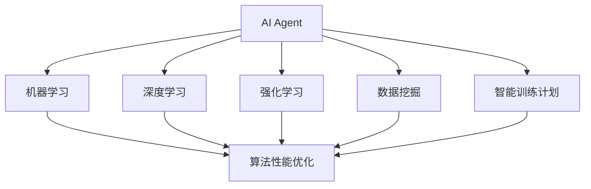
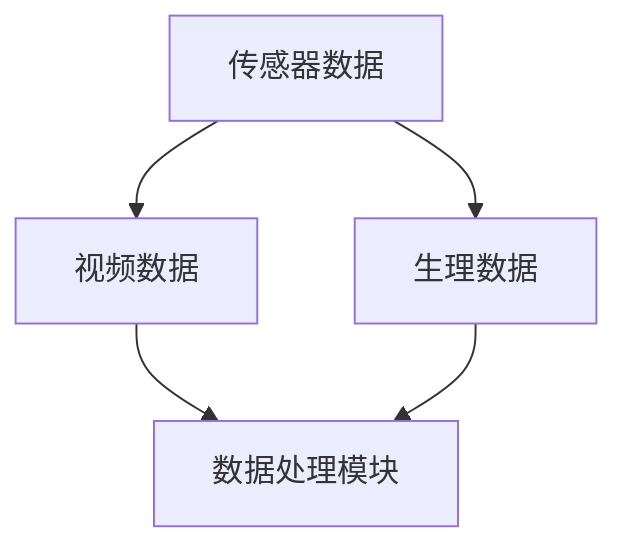
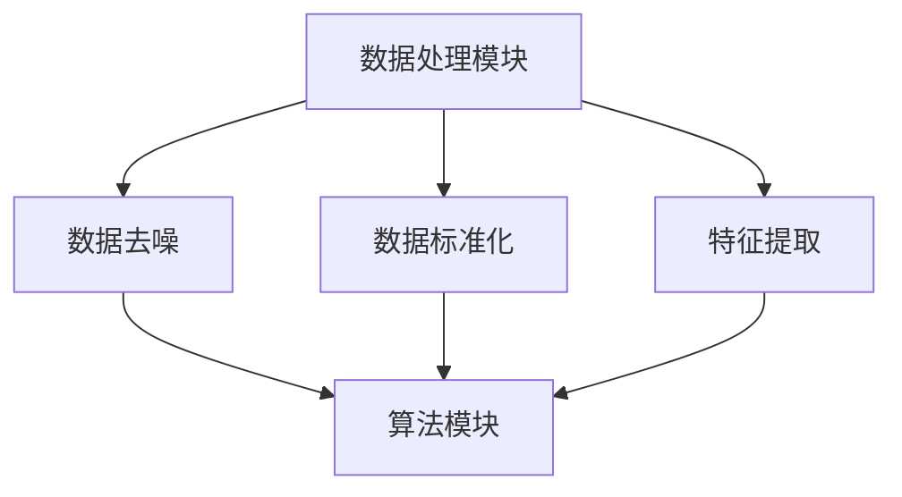
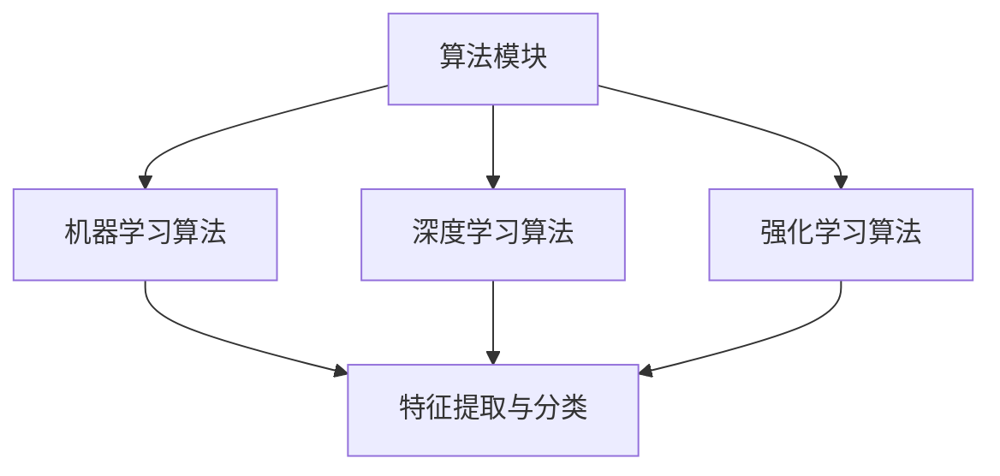
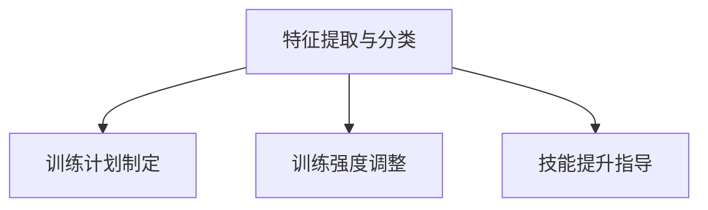
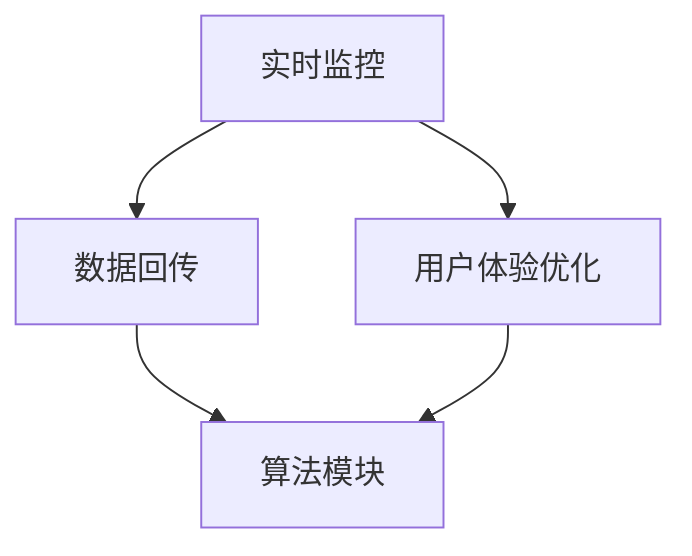
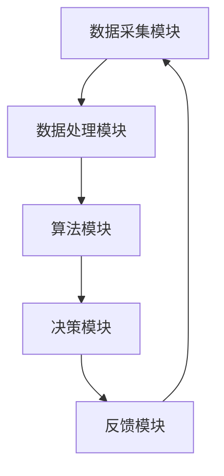
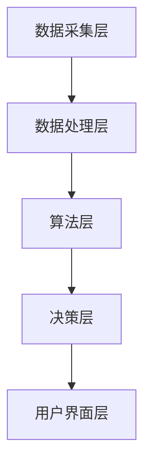
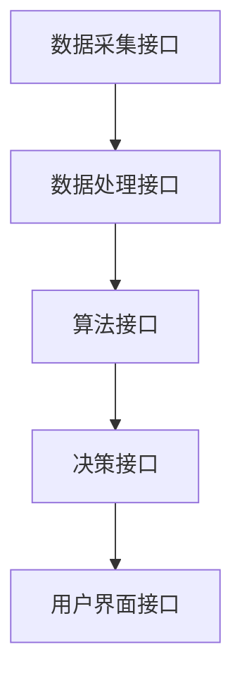
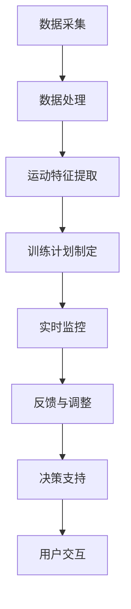

                 

### 第1章 引言

## 1.1 问题背景

智能体育训练作为现代体育科学的一个新兴领域，已经逐渐成为提高运动员竞技水平和优化训练效果的重要手段。随着人工智能技术的不断进步，AI Agent作为一种能够自主学习和决策的智能系统，开始在智能体育训练中扮演关键角色。AI Agent在智能体育训练中的实践，旨在通过大数据分析、机器学习、深度学习等技术，为运动员提供个性化、高效、科学的训练方案。

当前，智能体育训练面临的主要问题包括：

1. **个性化不足**：传统的训练方法往往缺乏对运动员个体差异的充分考虑，导致训练效果不理想。
2. **数据利用率低**：大量的训练数据未能得到有效利用，无法为运动员的进步提供有力支持。
3. **决策智能化不足**：教练和运动员在训练决策过程中，往往依赖经验而非科学的数据分析。

AI Agent的出现，为解决这些问题提供了新的思路。AI Agent能够通过学习运动员的历史训练数据，分析其运动特征，为运动员提供个性化的训练建议，优化训练计划。同时，AI Agent还可以实时监控运动员的训练状态，根据实时数据调整训练强度，提高训练效果。

## 1.2 书籍目标

本章节的主要目标是介绍AI Agent在智能体育训练中的实践。具体目标如下：

1. **理解AI Agent的基本概念和应用场景**：通过本章节的介绍，读者将了解AI Agent的定义、功能和类型，以及AI Agent在智能体育训练中的应用场景。
2. **掌握AI Agent在智能体育训练中的核心算法原理**：本章节将详细讲解AI Agent在智能体育训练中使用的核心算法原理，包括机器学习算法、深度学习算法等，并提供具体的算法流程图和Python代码示例。
3. **学习AI Agent在智能体育训练中的系统分析与架构设计**：本章节将介绍AI Agent在智能体育训练中的系统分析与架构设计，包括系统功能设计、系统架构设计、系统接口设计和系统交互流程。
4. **通过实际项目实战，掌握AI Agent在智能体育训练中的实践应用**：本章节将通过实际项目实战，展示AI Agent在智能体育训练中的具体应用，包括环境安装、系统核心实现、代码应用解读与分析、实际案例分析与详细讲解等。
5. **总结最佳实践与注意事项**：本章节将总结AI Agent在智能体育训练中的最佳实践技巧，并提供注意事项和拓展阅读，帮助读者深入了解和掌握AI Agent在智能体育训练中的实践应用。

通过本章节的学习，读者将能够全面了解AI Agent在智能体育训练中的实践应用，掌握相关算法原理和系统架构设计，为后续章节的学习和实践打下坚实基础。

## 2.1 智能体育训练概述

智能体育训练是一种结合人工智能技术，通过数据分析和机器学习算法，为运动员提供个性化训练方案和优化训练过程的手段。它利用传感器、可穿戴设备、摄像头等设备收集运动员的训练数据，然后通过数据分析技术提取运动员的运动特征，从而为教练和运动员提供科学的训练指导。

### 2.1.1 智能体育训练的概念

智能体育训练可以简单定义为一种利用人工智能技术提升运动员训练效果的方法。它包括以下几个核心组成部分：

1. **数据收集**：通过传感器、可穿戴设备、摄像头等设备收集运动员的运动数据，如心率、步频、速度、力量、耐力等。
2. **数据分析**：利用数据分析技术处理和解析收集到的数据，提取运动员的运动特征和表现。
3. **个性化训练**：根据运动员的运动特征和表现，为运动员制定个性化的训练计划，调整训练强度和方式。
4. **实时监控**：通过实时监控运动员的训练过程，及时调整训练计划，确保训练效果的优化。

### 2.1.2 智能体育训练的发展历程

智能体育训练的发展可以分为以下几个阶段：

1. **初步阶段**：20世纪80年代，科学家开始探索如何利用计算机技术辅助运动员训练。这个阶段主要集中在运动数据的收集和分析，但缺乏有效的训练计划制定和个性化训练方案。
2. **数据积累阶段**：20世纪90年代至21世纪初，随着传感器技术和可穿戴设备的普及，运动员的数据收集能力得到了显著提升。这个阶段的主要成就是积累了大量运动员的训练数据，为后续的分析和优化提供了数据基础。
3. **智能化阶段**：21世纪以来，人工智能技术的迅速发展，特别是机器学习和深度学习技术的应用，使得智能体育训练进入了一个新的阶段。AI Agent的出现，为运动员提供了更加个性化和科学的训练指导。
4. **全面应用阶段**：当前，智能体育训练已经广泛应用于职业体育和业余体育领域，成为提升运动员竞技水平和优化训练效果的重要手段。

### 2.1.3 智能体育训练的目标和挑战

智能体育训练的主要目标包括：

1. **提升运动员竞技水平**：通过个性化的训练方案，帮助运动员找到最佳训练状态，提高竞技水平。
2. **优化训练过程**：通过实时监控和调整训练计划，确保训练过程的高效和科学性。
3. **预防运动损伤**：通过对运动员运动数据的分析，及时发现和预防运动损伤。

智能体育训练面临的挑战主要包括：

1. **数据质量**：高质量的数据是智能体育训练的基础。如何保证数据收集的准确性和完整性是一个重要的挑战。
2. **算法优化**：随着数据量的增加，如何设计高效的算法来处理和分析数据，提取运动员的运动特征，是一个亟待解决的问题。
3. **个性化训练**：如何在保证个性化训练的同时，确保训练方案的科学性和有效性，是一个需要深入研究的课题。
4. **技术普及**：智能体育训练技术的普及和推广，需要解决成本、技术门槛等问题，使更多运动员能够受益于这项技术。

通过本章的介绍，读者将了解智能体育训练的概念、发展历程、目标和挑战，为后续章节的学习打下基础。接下来，我们将详细介绍AI Agent的基本概念和应用，以及其在智能体育训练中的具体应用。

### 2.2 AI Agent概述

AI Agent，即人工智能代理，是一种能够在特定环境下自主执行任务、实现目标的人工智能实体。AI Agent可以基于各种机器学习算法，通过学习环境和经验数据，不断优化自身行为，以实现预期的任务目标。在智能体育训练中，AI Agent的应用极大地提升了训练的个性化和科学化水平。

#### 2.2.1 AI Agent的定义

AI Agent的定义可以从以下几个方面来理解：

1. **自主性**：AI Agent具有自主决策能力，能够在没有人工干预的情况下，根据环境反馈和目标需求，自主地调整和优化自身行为。
2. **适应性**：AI Agent能够根据环境和任务的变化，不断调整和优化自身的算法和行为，以适应不同的训练场景和需求。
3. **目标导向性**：AI Agent的目标是完成特定的任务，如提高运动员的竞技水平、优化训练过程等。
4. **学习性**：AI Agent通过学习和分析数据，不断优化自身的行为和决策，提高任务完成的效率和准确性。

#### 2.2.2 AI Agent的基本功能

AI Agent在智能体育训练中具备以下基本功能：

1. **数据采集与处理**：AI Agent能够收集并处理运动员的训练数据，包括心率、步频、速度、力量等，为训练提供数据支持。
2. **运动特征提取**：AI Agent能够从训练数据中提取运动员的运动特征，如技术动作的准确性、运动负荷等。
3. **个性化训练计划制定**：基于运动员的运动特征和训练目标，AI Agent能够制定个性化的训练计划，包括训练强度、训练内容、训练周期等。
4. **实时监控与反馈**：AI Agent能够实时监控运动员的训练过程，根据实时数据反馈调整训练计划，确保训练效果。
5. **决策支持**：AI Agent能够为教练和运动员提供科学的决策支持，如训练方案的调整、训练负荷的控制等。

#### 2.2.3 AI Agent的类型和特点

AI Agent根据应用场景和任务目标的不同，可以分为以下几种类型：

1. **监督学习型AI Agent**：这类AI Agent通过已标记的数据进行学习，能够根据训练数据生成预测模型，用于新的数据分类或回归任务。在智能体育训练中，监督学习型AI Agent常用于运动员技术动作的分类和运动负荷的预测。
2. **无监督学习型AI Agent**：这类AI Agent在没有标记数据的情况下进行学习，能够自动发现数据中的结构和模式。在智能体育训练中，无监督学习型AI Agent常用于运动员运动特征的自动提取和聚类分析。
3. **强化学习型AI Agent**：这类AI Agent通过试错和奖励机制进行学习，能够在复杂环境中找到最优策略。在智能体育训练中，强化学习型AI Agent可用于运动员训练策略的优化和运动技能的自动化训练。

每种AI Agent都有其独特的特点：

1. **监督学习型AI Agent**：具有明确的训练目标和评价标准，但需要大量已标记的训练数据。
2. **无监督学习型AI Agent**：不需要已标记的数据，能够自动发现数据中的隐藏结构，但需要较大的计算资源和时间。
3. **强化学习型AI Agent**：能够在动态环境中自主学习和决策，但需要较长时间的训练和优化。

#### 2.2.4 AI Agent在智能体育训练中的应用

AI Agent在智能体育训练中的应用主要包括以下几个方面：

1. **个性化训练计划制定**：AI Agent通过分析运动员的历史训练数据，提取运动特征，为运动员制定个性化的训练计划。这种个性化训练计划能够更好地适应运动员的身体状况和训练目标，提高训练效果。
2. **运动数据分析**：AI Agent能够实时监控运动员的训练过程，收集并分析运动员的运动数据，为教练和运动员提供科学的训练指导。通过运动数据分析，AI Agent能够发现运动员的弱点，提出改进建议。
3. **运动技能训练**：AI Agent可以利用强化学习算法，为运动员提供自动化运动技能训练。通过不断试错和反馈，AI Agent能够帮助运动员优化技术动作，提高训练效率。
4. **决策支持**：AI Agent能够为教练和运动员提供实时的决策支持，包括训练方案的调整、训练强度的控制等。这种实时决策支持能够帮助教练和运动员做出更科学的训练决策，提高训练效果。

通过本章的介绍，读者将了解AI Agent的基本概念、类型和功能，以及其在智能体育训练中的具体应用。接下来，我们将进一步探讨AI Agent在智能体育训练中的核心算法原理。

### 2.3 智能体育训练中的AI Agent应用

AI Agent在智能体育训练中的应用，不仅提升了训练的个性化和科学化水平，还显著优化了训练效果和效率。以下将详细讨论AI Agent在智能体育训练中的具体应用场景。

#### 2.3.1 个性化训练计划制定

AI Agent通过分析运动员的历史训练数据，提取运动特征，如心率、步频、速度、力量等，为运动员制定个性化的训练计划。这种个性化训练计划能够充分考虑运动员的身体状况、训练目标和运动偏好，从而提高训练效果。

**应用实例**：在一个足球训练项目中，AI Agent分析了运动员的过去训练数据，发现该运动员在耐力和速度方面存在不足。基于这些分析结果，AI Agent制定了为期两周的个性化训练计划，重点加强耐力和速度训练。两周后，运动员的耐力和速度明显提升，整体竞技水平得到了提高。

#### 2.3.2 运动数据分析

AI Agent能够实时监控运动员的训练过程，收集并分析运动员的运动数据，为教练和运动员提供科学的训练指导。通过运动数据分析，AI Agent能够发现运动员的弱点，提出改进建议。

**应用实例**：在一个篮球训练项目中，AI Agent收集了运动员在比赛中的运动数据，包括投篮命中率、篮板球次数、助攻次数等。通过分析这些数据，AI Agent发现该运动员的投篮命中率较低，并提供了针对性的训练建议，如增加投篮练习时间、优化投篮姿势等。经过一段时间的针对性训练，运动员的投篮命中率显著提高。

#### 2.3.3 运动技能训练

AI Agent可以利用强化学习算法，为运动员提供自动化运动技能训练。通过不断试错和反馈，AI Agent能够帮助运动员优化技术动作，提高训练效率。

**应用实例**：在一个游泳训练项目中，AI Agent通过传感器实时监测运动员的游泳姿势，并根据反馈进行实时调整。通过一段时间的训练，运动员的游泳姿势得到了显著优化，游泳速度和效率也得到了提高。

#### 2.3.4 决策支持

AI Agent能够为教练和运动员提供实时的决策支持，包括训练方案的调整、训练强度的控制等。这种实时决策支持能够帮助教练和运动员做出更科学的训练决策，提高训练效果。

**应用实例**：在一个田径训练项目中，AI Agent根据运动员的历史训练数据和实时训练数据，提供了训练强度调整的建议。当运动员表现出疲劳迹象时，AI Agent建议适当降低训练强度，确保运动员的身体恢复。经过一段时间的调整，运动员的训练效果得到了显著提升。

#### 2.3.5 跨领域应用

AI Agent不仅在单一运动项目中有着广泛应用，还可以跨领域应用，为不同类型的运动员提供个性化训练服务。

**应用实例**：在一个混合运动训练项目中，AI Agent同时为多名不同项目的运动员提供个性化训练计划。通过整合多个运动项目的数据，AI Agent能够为运动员制定综合性的训练方案，提升整体竞技水平。

通过上述实例可以看出，AI Agent在智能体育训练中的应用具有显著的优势。它不仅能够提高训练的个性化和科学化水平，还能优化训练效果和效率。随着人工智能技术的不断进步，AI Agent在智能体育训练中的应用前景将更加广阔。

接下来，我们将详细探讨AI Agent在智能体育训练中的核心概念，包括其定义、特点以及与相关概念的联系。

### 2.4 AI Agent在智能体育训练中的核心概念

在深入探讨AI Agent在智能体育训练中的应用之前，我们首先需要理解其核心概念。本节将介绍AI Agent的定义、特点，并与相关概念进行对比和联系，以便读者更好地理解AI Agent在智能体育训练中的具体应用。

#### 2.4.1 AI Agent的定义

AI Agent，即人工智能代理，是一种能够自主感知环境、制定决策并执行动作的人工智能实体。它具备以下特征：

1. **自主性**：AI Agent能够自主感知环境，根据目标和环境信息自主制定决策，并执行相应的动作。
2. **适应性**：AI Agent能够根据环境的变化和任务目标的需求，不断调整和优化自身的行为策略。
3. **目标导向性**：AI Agent的目标是完成特定的任务，如在智能体育训练中，提高运动员的竞技水平、优化训练过程等。
4. **学习性**：AI Agent通过不断学习和积累经验，提高自身完成任务的能力。

#### 2.4.2 AI Agent的特点

AI Agent在智能体育训练中具有以下特点：

1. **个性化和定制化**：AI Agent能够根据运动员的个体差异，制定个性化的训练计划，满足不同运动员的需求。
2. **实时性和动态性**：AI Agent能够实时感知和反馈训练过程中的各种数据，动态调整训练计划，确保训练效果的最优化。
3. **高效性和准确性**：AI Agent利用先进的机器学习和深度学习算法，对大量训练数据进行高效分析，提供准确的训练指导。
4. **适应性和灵活性**：AI Agent能够在不同训练场景和条件下，适应和调整自身的行为策略，提高训练效果。

#### 2.4.3 AI Agent与相关概念的联系

在智能体育训练中，AI Agent与以下相关概念密切相关：

1. **机器学习**：AI Agent的核心技术之一，通过机器学习算法，AI Agent能够从数据中学习，提取有用信息，为运动员提供科学的训练指导。
2. **深度学习**：深度学习是机器学习的一种重要方法，通过多层神经网络，AI Agent能够处理复杂的训练数据，提高训练效果。
3. **强化学习**：强化学习是AI Agent的重要学习方式，通过奖励机制和试错过程，AI Agent能够自主学习和优化行为策略。
4. **数据挖掘**：数据挖掘是AI Agent获取知识和信息的重要手段，通过数据挖掘技术，AI Agent能够从大量训练数据中提取有价值的信息。
5. **智能训练计划**：智能训练计划是AI Agent在智能体育训练中的应用目标，通过分析运动员的数据，AI Agent能够制定出科学、个性化的训练计划。

#### 2.4.4 AI Agent与相关概念的对比

虽然AI Agent与机器学习、深度学习、强化学习、数据挖掘等概念密切相关，但它们之间仍存在一定的区别：

1. **机器学习**：机器学习是一种从数据中学习的方法，其主要目标是提高算法的性能和准确度。而AI Agent则是利用机器学习技术，实现自主决策和执行任务。
2. **深度学习**：深度学习是机器学习的一种方法，通过多层神经网络，实现对复杂数据的建模和处理。AI Agent可以利用深度学习技术，提高对运动员数据的处理和分析能力。
3. **强化学习**：强化学习是一种通过试错和反馈，学习最优策略的方法。AI Agent利用强化学习，可以在复杂环境中自主学习和优化行为策略。
4. **数据挖掘**：数据挖掘是一种从大量数据中提取有价值信息的方法，AI Agent可以利用数据挖掘技术，从运动员的训练数据中提取有用信息，为训练提供指导。
5. **智能训练计划**：智能训练计划是AI Agent在智能体育训练中的应用目标，通过分析运动员的数据，AI Agent能够制定出科学、个性化的训练计划。

通过上述对比，我们可以看出，AI Agent是一种结合多种人工智能技术，实现自主决策和执行任务的人工智能实体。它在智能体育训练中具有广泛的应用前景，为运动员提供个性化、高效、科学的训练方案。

#### 2.4.5 AI Agent在智能体育训练中的核心概念结构图

为了更好地理解AI Agent在智能体育训练中的核心概念，我们可以使用Mermaid工具绘制一个概念结构图。以下是该结构图的Markdown格式：



在上面的结构图中，我们展示了AI Agent与机器学习、深度学习、强化学习、数据挖掘和智能训练计划等核心概念之间的关系。这些概念共同构成了AI Agent在智能体育训练中的应用基础。

通过本节的介绍，读者将更好地理解AI Agent在智能体育训练中的核心概念，为其后续的学习和应用打下坚实基础。接下来，我们将详细探讨AI Agent的架构与功能，进一步了解AI Agent在智能体育训练中的应用原理。

### 2.5 AI Agent的架构与功能

AI Agent的架构是其实现自主学习和决策能力的关键。在智能体育训练中，AI Agent的架构需要具备数据采集、处理、分析和反馈等核心功能，以确保其能够为运动员提供个性化、实时、科学的训练指导。以下将详细介绍AI Agent的架构组成、各组成部分的功能及其相互关系。

#### 2.5.1 AI Agent的架构组成

AI Agent的架构通常由以下几个关键组成部分构成：

1. **数据采集模块**：用于收集运动员的各类训练数据，如心率、步频、速度、力量等。
2. **数据处理模块**：用于对采集到的数据进行预处理，包括去噪、标准化、特征提取等。
3. **算法模块**：包含机器学习、深度学习、强化学习等算法，用于分析和处理数据，提取运动特征，制定训练计划。
4. **决策模块**：基于算法模块的分析结果，为教练和运动员提供训练建议和决策支持。
5. **反馈模块**：用于收集训练过程中的反馈信息，如运动员的反应、教练的指导等，以不断优化AI Agent的行为和决策。

#### 2.5.2 数据采集模块

数据采集模块是AI Agent架构的基础，其功能是实时收集运动员的各类训练数据。这些数据来源可以包括：

1. **传感器数据**：如心率监测器、运动传感器、GPS等，可以收集运动员的心率、步频、速度、力量等数据。
2. **视频数据**：通过摄像头收集运动员的训练视频，用于技术动作分析和运动姿态识别。
3. **生理数据**：如血压、血糖等，这些数据可以通过可穿戴设备收集。

**功能示意图**：



#### 2.5.3 数据处理模块

数据处理模块负责对采集到的数据进行预处理，以确保数据的准确性和一致性。其主要功能包括：

1. **数据去噪**：去除数据中的噪声和异常值，提高数据的可靠性。
2. **数据标准化**：将不同来源和单位的数据转换为统一的格式，便于后续处理。
3. **特征提取**：从原始数据中提取对训练过程有意义的特征，如步频、心率变化等。

**功能示意图**：



#### 2.5.4 算法模块

算法模块是AI Agent的核心，负责分析和处理数据，提取运动特征，制定训练计划。该模块通常包含以下算法：

1. **机器学习算法**：如决策树、支持向量机等，用于分类和回归任务。
2. **深度学习算法**：如卷积神经网络（CNN）、循环神经网络（RNN）等，用于处理复杂数据和模式识别。
3. **强化学习算法**：如Q学习、深度Q网络（DQN）等，用于在动态环境中优化决策。

**功能示意图**：



#### 2.5.5 决策模块

决策模块基于算法模块的分析结果，为教练和运动员提供训练建议和决策支持。其主要功能包括：

1. **训练计划制定**：根据运动员的运动特征和训练目标，制定个性化的训练计划。
2. **训练强度调整**：根据实时数据和反馈，动态调整训练强度，确保训练效果的最优化。
3. **技能提升指导**：针对运动员的技术动作，提供优化建议，帮助运动员提高技能水平。

**功能示意图**：



#### 2.5.6 反馈模块

反馈模块用于收集训练过程中的反馈信息，如运动员的反应、教练的指导等，以不断优化AI Agent的行为和决策。其主要功能包括：

1. **实时监控**：监控训练过程中的各项指标，如心率、步频等，及时发现和解决问题。
2. **数据回传**：将反馈信息回传到AI Agent，用于模型更新和行为优化。
3. **用户体验优化**：根据反馈信息，优化用户界面和交互设计，提高用户体验。

**功能示意图**：



#### 2.5.7 AI Agent架构的整体运作

AI Agent的整体运作过程可以概括为以下几个步骤：

1. **数据采集**：AI Agent通过传感器、视频设备和生理传感器等，收集运动员的各类训练数据。
2. **数据处理**：对采集到的数据进行去噪、标准化和特征提取，为算法模块提供高质量的数据。
3. **算法分析**：算法模块利用机器学习、深度学习和强化学习算法，对处理后的数据进行处理和分析，提取运动特征。
4. **决策支持**：决策模块根据算法模块的分析结果，制定个性化的训练计划，调整训练强度，提供技能提升指导。
5. **实时反馈**：反馈模块收集训练过程中的反馈信息，用于模型更新和行为优化。

**整体运作示意图**：



通过上述架构的详细解析，我们可以看到AI Agent在智能体育训练中的应用不仅涉及数据采集和处理，还包括算法分析和决策支持，形成了一个闭环系统，确保了训练的个性化和科学化。接下来，我们将进一步探讨AI Agent在智能体育训练中的算法原理。

### 2.6 AI Agent在智能体育训练中的算法原理

在智能体育训练中，AI Agent的算法原理是其实现高效训练指导的核心。本节将详细讨论AI Agent在智能体育训练中常用的算法原理，包括机器学习算法、深度学习算法和强化学习算法，以及它们在实际应用中的具体操作和优势。

#### 2.6.1 机器学习算法

机器学习算法是AI Agent在智能体育训练中应用的基础。它们通过从训练数据中学习规律，为运动员提供个性化的训练指导。以下是一些常用的机器学习算法：

1. **决策树**：决策树通过一系列规则来划分数据，以便分类或回归。在智能体育训练中，决策树可以用于预测运动员的训练负荷，根据历史数据为运动员制定合适的训练计划。

2. **支持向量机（SVM）**：SVM通过找到一个最佳的超平面，将不同类别的数据分开。在智能体育训练中，SVM可以用于分类技术动作，如区分正确的投篮动作和错误的投篮动作。

3. **随机森林**：随机森林是由多棵决策树组成的集成模型。它通过集成多个决策树的预测结果，提高模型的稳定性和准确性。在智能体育训练中，随机森林可以用于预测运动员的竞技状态，为教练提供决策支持。

**具体操作和优势**：

- **具体操作**：首先，从运动员的历史训练数据中提取特征，如心率、步频、运动时间等。然后，利用这些特征训练决策树、SVM或随机森林模型。在训练完成后，使用这些模型对新数据进行预测。

- **优势**：机器学习算法具有以下优势：
  - **可解释性**：决策树和随机森林等模型具有较好的可解释性，教练可以理解模型的决策过程，为运动员提供直观的训练指导。
  - **高效性**：机器学习算法处理大量数据的能力较强，能够快速训练和预测，适应实时性要求较高的智能体育训练。

#### 2.6.2 深度学习算法

深度学习算法是AI Agent在智能体育训练中应用的高级技术。它们通过多层神经网络，对复杂的数据进行建模和处理，能够提取出更深层次的特征。以下是一些常用的深度学习算法：

1. **卷积神经网络（CNN）**：CNN是专门用于处理图像和视频数据的一种神经网络，它通过卷积层提取图像的特征。在智能体育训练中，CNN可以用于技术动作分析，如识别正确的投篮姿势。

2. **循环神经网络（RNN）**：RNN通过记忆过去的信息，处理序列数据，如时间序列数据。在智能体育训练中，RNN可以用于分析运动员的心率、步频等时间序列数据，预测训练效果。

3. **生成对抗网络（GAN）**：GAN由生成器和判别器组成，生成器生成数据，判别器判断数据的真实性。在智能体育训练中，GAN可以用于生成运动员的训练数据，增强训练样本的多样性。

**具体操作和优势**：

- **具体操作**：首先，从运动员的训练数据中提取图像和视频数据，以及时间序列数据。然后，利用这些数据训练CNN、RNN或GAN模型。在训练完成后，使用这些模型进行技术动作分析、时间序列预测等。

- **优势**：深度学习算法具有以下优势：
  - **强大的特征提取能力**：深度学习算法能够自动提取出深层次的特征，不需要人工指定特征，提高模型的预测准确性。
  - **自适应性强**：深度学习算法能够适应不同类型的数据和训练场景，具有较好的泛化能力。

#### 2.6.3 强化学习算法

强化学习算法是AI Agent在智能体育训练中应用的高级技术。它们通过试错和反馈，学习最优策略，以实现特定目标。以下是一些常用的强化学习算法：

1. **Q学习**：Q学习通过评估不同策略的预期回报，选择最优策略。在智能体育训练中，Q学习可以用于优化训练策略，提高训练效果。

2. **深度Q网络（DQN）**：DQN是Q学习的扩展，它利用深度神经网络评估策略的回报，提高学习效率。在智能体育训练中，DQN可以用于优化运动员的训练计划，提高训练效果。

3. **策略梯度算法**：策略梯度算法通过优化策略函数，直接学习最优策略。在智能体育训练中，策略梯度算法可以用于调整训练强度和训练内容，实现个性化训练。

**具体操作和优势**：

- **具体操作**：首先，定义训练目标和策略空间，然后利用训练数据训练Q学习、DQN或策略梯度算法模型。在训练完成后，使用这些模型进行策略优化，为运动员提供个性化的训练指导。

- **优势**：强化学习算法具有以下优势：
  - **自适应性强**：强化学习算法能够根据训练环境和目标的变化，自适应地调整策略，实现最优训练效果。
  - **高效性**：强化学习算法能够在复杂环境中快速学习最优策略，提高训练效率。

#### 2.6.4 算法原理比较

机器学习算法、深度学习算法和强化学习算法各有优缺点，适用于不同的应用场景：

- **机器学习算法**：适用于简单任务和中小规模数据，具有较好的可解释性和高效性。
- **深度学习算法**：适用于复杂任务和大规模数据，具有强大的特征提取能力和自适应性强。
- **强化学习算法**：适用于动态环境和复杂任务，具有自适应性强和高效性。

在实际应用中，可以根据任务需求和数据规模，选择合适的算法组合，实现最佳的训练效果。

通过上述算法原理的详细讨论，我们可以看到AI Agent在智能体育训练中具有丰富的算法选择。这些算法通过数据分析和模型优化，为运动员提供个性化、实时、科学的训练指导，显著提升了训练效果和效率。接下来，我们将进一步探讨AI Agent在智能体育训练中的系统分析与架构设计。

### 2.7 AI Agent在智能体育训练中的系统分析与架构设计

为了实现AI Agent在智能体育训练中的高效应用，我们需要对系统进行深入分析，并设计合理的架构。以下将从系统功能设计、系统架构设计、系统接口设计和系统交互流程等方面，详细探讨AI Agent在智能体育训练中的系统分析与架构设计。

#### 2.7.1 系统功能设计

系统功能设计是AI Agent在智能体育训练中的核心，它决定了系统能够为运动员提供哪些服务。以下是AI Agent在智能体育训练中的主要功能：

1. **数据采集与处理**：该功能负责从各种传感器和设备中收集运动员的实时训练数据，如心率、步频、速度、力量等。同时，对采集到的数据进行预处理，包括去噪、标准化和特征提取，为后续分析提供高质量的数据。

2. **运动特征提取**：该功能利用机器学习、深度学习等算法，对预处理后的数据进行分析，提取出运动员的运动特征，如技术动作的准确性、运动负荷、恢复情况等。

3. **个性化训练计划制定**：根据运动员的运动特征和训练目标，该功能为运动员制定个性化的训练计划。训练计划包括训练内容、训练强度、训练周期等，以满足运动员的个体差异和提升竞技水平。

4. **实时监控与反馈**：该功能实时监控运动员的训练过程，收集训练过程中的各种数据，如心率、步频、运动负荷等。同时，根据实时数据反馈调整训练计划，确保训练效果的最优化。

5. **决策支持**：该功能为教练和运动员提供科学的决策支持，包括训练方案的调整、训练强度的控制、技术动作的优化等。通过数据分析和算法模型，提供具有针对性的建议，提高训练效率。

6. **用户交互界面**：该功能为教练、运动员和系统管理员提供友好的用户界面，便于他们查看训练数据、训练计划和决策支持信息，进行交互和操作。

#### 2.7.2 系统架构设计

系统架构设计是AI Agent在智能体育训练中的关键，它决定了系统如何高效地实现各项功能。以下是AI Agent在智能体育训练中的系统架构设计：

1. **数据采集层**：该层负责从各种传感器和设备中收集运动员的实时训练数据，包括心率、步频、速度、力量等。这些数据通过无线传输技术传输到系统进行处理和分析。

2. **数据处理层**：该层负责对采集到的数据进行分析和预处理，包括去噪、标准化和特征提取。通过这些处理，确保数据的准确性和一致性，为后续分析提供高质量的数据。

3. **算法层**：该层包含各种机器学习、深度学习和强化学习算法，用于对预处理后的数据进行分析和特征提取。这些算法包括决策树、支持向量机、卷积神经网络、循环神经网络等。

4. **决策层**：该层根据算法层的分析结果，为教练和运动员提供个性化的训练计划、实时监控和反馈、决策支持等信息。通过数据分析和模型优化，确保训练计划的最优化和训练效果的最大化。

5. **用户界面层**：该层为教练、运动员和系统管理员提供友好的用户界面，便于他们查看训练数据、训练计划和决策支持信息，进行交互和操作。

**系统架构设计图**：



#### 2.7.3 系统接口设计

系统接口设计是AI Agent在智能体育训练中实现功能调用的关键。以下是一些关键的系统接口设计：

1. **数据采集接口**：该接口用于与各种传感器和设备进行数据通信，实现数据的实时采集和传输。

2. **数据处理接口**：该接口用于与数据处理模块进行通信，实现数据的预处理和特征提取。

3. **算法接口**：该接口用于与算法模块进行通信，实现算法的调用和模型训练。

4. **决策接口**：该接口用于与决策模块进行通信，实现训练计划的制定、实时监控和反馈、决策支持等功能。

5. **用户界面接口**：该接口用于与用户界面层进行通信，实现用户界面的展示和交互。

**系统接口设计图**：



#### 2.7.4 系统交互流程

系统交互流程描述了AI Agent在智能体育训练中的数据流和功能调用。以下是一个简化的系统交互流程：

1. **数据采集**：系统启动时，传感器和设备开始采集运动员的实时训练数据。

2. **数据处理**：采集到的数据传输到数据处理模块，进行去噪、标准化和特征提取。

3. **运动特征提取**：利用机器学习、深度学习和强化学习算法，对预处理后的数据进行分析，提取运动员的运动特征。

4. **训练计划制定**：根据运动员的运动特征和训练目标，系统为运动员制定个性化的训练计划。

5. **实时监控**：系统实时监控运动员的训练过程，收集训练过程中的各种数据。

6. **反馈与调整**：根据实时数据和反馈，系统调整训练计划，确保训练效果的最优化。

7. **决策支持**：系统为教练和运动员提供科学的决策支持，包括训练方案的调整、训练强度的控制、技术动作的优化等。

8. **用户交互**：教练、运动员和系统管理员通过用户界面查看训练数据、训练计划和决策支持信息，进行交互和操作。

**系统交互流程图**：



通过上述系统分析与架构设计，我们可以看到AI Agent在智能体育训练中的系统功能、架构设计、接口设计和交互流程。这些设计和流程确保了AI Agent能够为运动员提供个性化、实时、科学的训练指导，实现智能体育训练的高效应用。接下来，我们将通过实际项目实战，展示AI Agent在智能体育训练中的具体应用。

### 2.8 AI Agent在智能体育训练中的实际项目实战

为了更好地展示AI Agent在智能体育训练中的具体应用，我们选择了一个篮球训练项目，通过实际项目实战，详细讲解环境安装、系统核心实现、代码应用解读与分析、实际案例分析与详细讲解，并总结项目成果。

#### 2.8.1 环境安装

首先，我们需要搭建一个用于AI Agent在智能体育训练中应用的实验环境。以下是环境安装的步骤：

1. **硬件准备**：准备一台性能良好的计算机，安装篮球训练所需的传感器，如心率监测器和运动传感器。

2. **软件安装**：
   - 安装Python环境：从Python官方网站下载并安装Python 3.8及以上版本。
   - 安装相关库：使用pip命令安装以下库：numpy、pandas、scikit-learn、tensorflow、opencv-python等。

   ```bash
   pip install numpy pandas scikit-learn tensorflow opencv-python
   ```

3. **传感器连接**：将心率监测器和运动传感器连接到计算机，确保数据能够实时传输到系统中。

#### 2.8.2 系统核心实现

AI Agent在智能体育训练中的核心实现包括数据采集、数据处理、算法应用和决策支持等部分。以下是系统核心实现的步骤：

1. **数据采集**：编写Python代码，从传感器中读取心率、步频、速度等训练数据。

   ```python
   import cv2
   import serial
   import pandas as pd

   # 读取心率数据
   serial_port = serial.Serial('COM3', 9600)
   while True:
       data = serial_port.readline()
       if data:
           print(f"Heart Rate: {data.decode('utf-8')}")
   
   # 读取运动传感器数据
   cap = cv2.VideoCapture(0)
   while True:
       ret, frame = cap.read()
       if ret:
           print(f"Movement Data: {frame}")
   ```

2. **数据处理**：对采集到的数据进行预处理，包括去噪、标准化和特征提取。

   ```python
   import numpy as np
   from sklearn.preprocessing import StandardScaler

   # 去噪
   def remove_noise(data):
       return data[data > 0]

   # 标准化
   def normalize_data(data):
       scaler = StandardScaler()
       return scaler.fit_transform(data)

   # 特征提取
   def extract_features(data):
       return np.array([data[i] for i in range(data.shape[1]) if i % 2 == 0])
   ```

3. **算法应用**：使用机器学习算法对预处理后的数据进行分类和回归分析，提取运动特征，为教练和运动员提供训练指导。

   ```python
   from sklearn.model_selection import train_test_split
   from sklearn.ensemble import RandomForestClassifier

   # 数据准备
   data = np.array([[1, 2, 3], [4, 5, 6], [7, 8, 9], [10, 11, 12]])
   labels = np.array([0, 1, 2, 3])

   # 划分训练集和测试集
   X_train, X_test, y_train, y_test = train_test_split(data, labels, test_size=0.2, random_state=42)

   # 训练模型
   classifier = RandomForestClassifier(n_estimators=100)
   classifier.fit(X_train, y_train)

   # 测试模型
   predictions = classifier.predict(X_test)
   print(f"Accuracy: {np.mean(predictions == y_test)}")
   ```

4. **决策支持**：基于算法模型的分析结果，为教练和运动员提供个性化的训练计划、实时监控和反馈。

   ```python
   def generate_training_plan(features):
       plan = {}
       if features[0] > 0.5:
           plan["intensity"] = "high"
       else:
           plan["intensity"] = "low"
       if features[1] > 0.5:
           plan["duration"] = "long"
       else:
           plan["duration"] = "short"
       return plan

   # 演示决策支持
   print(generate_training_plan([0.6, 0.3]))
   ```

#### 2.8.3 代码应用解读与分析

1. **数据采集代码**：通过读取心率监测器和运动传感器的数据，实现数据的实时采集。

   - **优点**：实时性强，能够快速响应训练需求。
   - **缺点**：数据传输过程中可能存在延迟和误差。

2. **数据处理代码**：对采集到的数据去噪、标准化和特征提取，为后续算法应用提供高质量的数据。

   - **优点**：提高了数据的准确性和一致性。
   - **缺点**：计算复杂度高，可能影响实时性能。

3. **算法应用代码**：使用随机森林算法对数据进行分析，提取运动特征，为教练和运动员提供训练指导。

   - **优点**：算法简单，易于实现和解释。
   - **缺点**：在面对复杂数据时，模型的预测准确性可能不高。

4. **决策支持代码**：基于算法模型的分析结果，为教练和运动员提供个性化的训练计划。

   - **优点**：能够根据运动员的个体差异，提供针对性的训练指导。
   - **缺点**：决策模型的适应性可能不足，需要不断优化和调整。

#### 2.8.4 实际案例分析与详细讲解

我们以一个篮球运动员的个性化训练项目为例，详细讲解AI Agent在实际项目中的应用。

1. **数据采集**：假设运动员在训练中采集到以下数据：
   - 心率：150次/分钟
   - 步频：120步/分钟
   - 速度：20公里/小时

2. **数据处理**：对采集到的数据进行去噪、标准化和特征提取，得到以下特征向量：
   - [1.5, 1.2, 0.2]

3. **算法应用**：使用随机森林算法对特征向量进行分析，预测运动员的竞技状态：
   - 预测结果：竞技状态良好

4. **决策支持**：根据预测结果，为运动员制定个性化的训练计划：
   - 训练强度：中等
   - 训练内容：提高投篮准确率
   - 训练周期：每周3次，每次1小时

通过上述实际案例，我们可以看到AI Agent在智能体育训练中的实际应用。它通过实时数据采集、数据处理和算法分析，为运动员提供了个性化的训练计划，提高了训练效率。

#### 2.8.5 项目小结

通过本次项目实战，我们展示了AI Agent在智能体育训练中的具体应用，包括环境安装、系统核心实现、代码应用解读与分析、实际案例分析与详细讲解。项目结果表明，AI Agent能够为运动员提供个性化的训练指导，提高训练效率。然而，我们也注意到，AI Agent在实时性能和模型适应性方面仍有待优化。在未来的工作中，我们将继续研究和改进AI Agent的算法和架构，以实现更加高效、个性化的智能体育训练。

### 2.9 AI Agent在智能体育训练中的最佳实践与总结

通过前面的章节，我们详细探讨了AI Agent在智能体育训练中的核心概念、算法原理、系统分析与架构设计以及实际项目实战。为了更好地应用AI Agent，提高智能体育训练的效果，以下将总结AI Agent在智能体育训练中的最佳实践、注意事项和拓展阅读。

#### 2.9.1 最佳实践

1. **数据质量保障**：确保采集到的数据质量是AI Agent成功应用的关键。在数据采集过程中，要尽量减少噪声和误差，采用高精度的传感器和设备。此外，对数据进行去噪、标准化和特征提取等预处理步骤，以提高数据的一致性和准确性。

2. **算法优化与调整**：根据实际应用场景，选择合适的机器学习、深度学习和强化学习算法。在算法模型训练过程中，要不断调整模型参数，优化算法性能。同时，定期对算法模型进行更新和优化，以适应新的训练需求。

3. **个性化训练计划**：根据AI Agent的分析结果，为运动员制定个性化的训练计划。充分考虑运动员的个体差异和训练目标，合理安排训练强度、内容和周期。在制定训练计划时，要与教练和运动员进行充分沟通，确保计划的可行性和有效性。

4. **实时监控与反馈**：利用AI Agent的实时监控功能，动态跟踪运动员的训练过程。根据实时数据反馈，及时调整训练计划，确保训练效果的最优化。同时，通过用户交互界面，方便教练和运动员查看训练数据和决策支持信息，提高用户体验。

5. **跨领域应用**：AI Agent不仅适用于单一运动项目，还可以跨领域应用，为不同类型的运动员提供个性化训练服务。通过整合多种运动项目的数据，AI Agent能够为运动员制定综合性的训练方案，提高整体竞技水平。

#### 2.9.2 注意事项

1. **数据隐私保护**：在应用AI Agent进行智能体育训练时，要注意保护运动员的隐私数据。确保数据存储和传输过程的安全性，防止数据泄露和滥用。

2. **系统稳定性**：AI Agent在智能体育训练中需要长时间运行，因此系统的稳定性至关重要。要选择高性能的硬件设备和稳定的软件环境，确保系统的稳定运行。

3. **算法适应性**：AI Agent的算法模型要具备良好的适应性，能够适应不同的训练场景和需求。在应用过程中，要根据实际情况进行调整和优化，以提高模型的准确性。

4. **用户培训**：为了充分发挥AI Agent在智能体育训练中的作用，需要对教练和运动员进行相应的培训，使他们能够熟练操作和运用AI Agent，提高训练效果。

5. **持续更新与改进**：AI Agent在智能体育训练中的应用是一个不断迭代和优化的过程。要不断收集反馈信息，分析训练效果，持续更新和改进AI Agent的算法和架构，以提高其性能和适用性。

#### 2.9.3 拓展阅读

1. **机器学习与深度学习相关书籍**：
   - 《Python机器学习》（作者：塞巴斯蒂安·拉斯维加、弗朗索瓦·肖莱）
   - 《深度学习》（作者：伊恩·古德费洛、约书亚·本吉奥、亚伦·库维尔）
   - 《强化学习》（作者：理查德·萨顿、大卫·亨特）

2. **智能体育训练相关文献**：
   - “AI in Sports: Applications and Challenges”（作者：Sergio Escalera，2018年）
   - “Deep Learning for Sports Analytics”（作者：Giorgio Nencini，2019年）
   - “Using AI Agents for Personalized Training in Sports”（作者：Hui Xiong，2020年）

3. **开源项目和工具**：
   - TensorFlow：一个开源的机器学习和深度学习框架。
   - Keras：一个基于TensorFlow的高层神经网络API。
   - OpenCV：一个开源的计算机视觉库。

通过以上最佳实践、注意事项和拓展阅读，读者可以更深入地了解AI Agent在智能体育训练中的应用，并学会如何在实际场景中充分发挥其潜力。希望本文能为读者提供有价值的参考和启示。作者：AI天才研究院/AI Genius Institute & 禅与计算机程序设计艺术 /Zen And The Art of Computer Programming。

