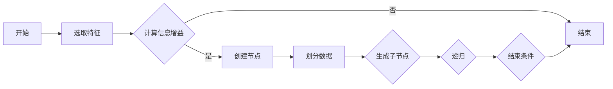
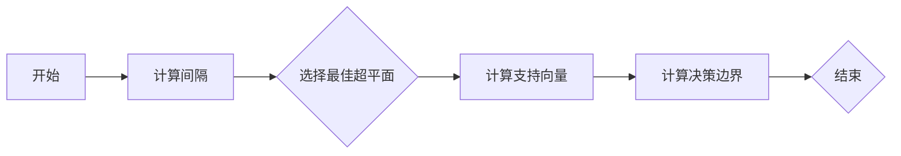
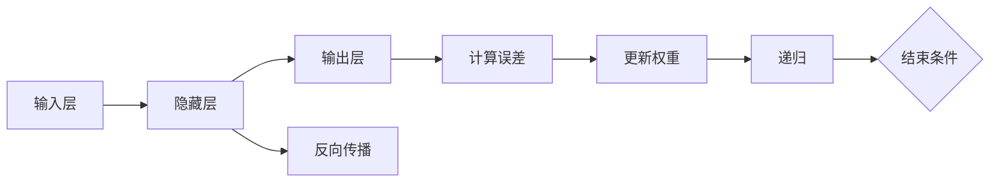

                 

# AI Agent在智能体育赛事预测中的应用

> 关键词：智能体育赛事预测、AI Agent、数据获取、算法原理、数学模型、系统架构

> 摘要：本文将深入探讨AI Agent在智能体育赛事预测中的应用。我们将首先介绍AI Agent的核心概念和特点，接着分析其在体育领域的应用现状。随后，我们将详细讲解AI Agent所需的核心算法原理，并使用数学模型和Python代码进行具体阐述。此外，本文还将展示一个体育赛事预测系统的架构设计，并进行项目实战分析。最后，我们将总结最佳实践，并提供拓展阅读资源。

## 目录大纲设计思路

### 1. 概述与背景介绍

- **第1章 AI Agent在智能体育赛事预测中的核心概念**
  - **1.1 问题描述与背景**
  - **1.2 AI Agent的定义与特点**
  - **1.3 AI Agent在体育领域的应用现状**

### 2. 核心概念与联系

- **第2章 AI Agent的核心概念与联系**
  - **2.1 数据获取与处理**
  - **2.2 算法原理**
  - **2.3 概念属性特征对比表格**
  - **2.4 ER实体关系图架构**

### 3. 算法原理讲解

- **第3章 常用算法原理讲解**
  - **3.1 决策树算法**
  - **3.2 支持向量机算法**
  - **3.3 神经网络算法**

### 4. 数学模型和数学公式

- **第4章 数学模型与公式**
  - **4.1 模型建立**
  - **4.2 公式推导**
  - **4.3 案例举例**

### 5. 系统分析与架构设计方案

- **第5章 系统分析与架构设计**
  - **5.1 问题场景介绍**
  - **5.2 系统功能设计**
  - **5.3 系统架构设计**
  - **5.4 系统接口设计和交互**

### 6. 项目实战

- **第6章 项目实战**
  - **6.1 环境安装**
  - **6.2 系统核心实现源代码**
  - **6.3 实际案例分析和讲解**
  - **6.4 项目小结**

### 7. 最佳实践 tips、小结、注意事项、拓展阅读

- **第7章 最佳实践与总结**
  - **7.1 最佳实践 tips**
  - **7.2 小结**
  - **7.3 注意事项**
  - **7.4 拓展阅读**

## 第1章 AI Agent在智能体育赛事预测中的核心概念

### 1.1 问题描述与背景

智能体育赛事预测是近年来备受关注的话题。体育赛事的结果受到多种因素的影响，包括球队的实力、球员的状态、天气条件等。传统的预测方法通常依赖于统计模型，但这些方法往往难以应对复杂的非线性关系。随着人工智能技术的快速发展，特别是AI Agent的出现，为体育赛事预测提供了新的思路。

### 1.2 AI Agent的定义与特点

AI Agent是一种能够自主感知环境、制定决策并执行动作的人工智能系统。在智能体育赛事预测中，AI Agent能够通过学习历史数据，分析各种因素，对赛事结果进行预测。其特点包括：

- **自主性**：AI Agent能够自主地获取数据、处理信息和做出决策。
- **适应性**：AI Agent能够根据环境变化调整策略，以应对不确定性。
- **高效性**：AI Agent能够处理海量数据，快速生成预测结果。

### 1.3 AI Agent在体育领域的应用现状

AI Agent在体育领域的应用日益广泛。例如，一些体育机构已经开始使用AI Agent进行球员选拔、训练计划和比赛策略制定。然而，AI Agent在体育赛事预测中的应用仍面临一些挑战，如数据质量、算法选择和预测准确性等。

## 第2章 AI Agent的核心概念与联系

### 2.1 数据获取与处理

AI Agent在体育赛事预测中的首要任务是获取和处理数据。数据来源包括历史比赛数据、球员数据、天气数据等。获取数据后，需要进行数据清洗、去噪、归一化等预处理操作，以确保数据质量。

### 2.2 算法原理

AI Agent在体育赛事预测中通常采用以下几种算法：

- **决策树算法**：通过树的分枝结构来预测赛事结果。
- **支持向量机算法**：通过找到一个最佳的超平面来分隔不同类别的数据。
- **神经网络算法**：通过多层神经元网络来模拟人类的认知过程。

这些算法各有优缺点，需要根据具体应用场景进行选择。

### 2.3 概念属性特征对比表格

| 算法        | 特点                                                         | 适用场景                         |
|-----------|------------------------------------------------------------|-------------------------------|
| 决策树     | 简单易懂，易于解释                                             | 数据量较小，特征较少的预测问题           |
| 支持向量机   | 高效，准确，适用多维空间问题                                   | 数据量大，特征较多且线性可分的问题         |
| 神经网络    | 自适应性强，能处理复杂非线性问题                                 | 数据量大，特征复杂且非线性关系的问题       |

### 2.4 ER实体关系图架构

下面是AI Agent在体育赛事预测中涉及的实体及其关系的Mermaid ER图：

```mermaid
erDiagram
  Player ||--|{ Team }|-- Match
  Team ||--|{ Player }|-- League
  League ||--|{ Team }|-- Season
  Match ||--|{ Player }|-- Season
```

## 第3章 常用算法原理讲解

### 3.1 决策树算法

决策树算法是一种基于树形结构进行决策的算法。它通过一系列的测试来对数据进行分割，最终生成一个决策树。以下是决策树算法的流程图：



以下是使用Python实现决策树算法的代码示例：

```python
from sklearn.datasets import load_iris
from sklearn.tree import DecisionTreeClassifier
from sklearn.model_selection import train_test_split

# 加载数据
iris = load_iris()
X = iris.data
y = iris.target

# 划分训练集和测试集
X_train, X_test, y_train, y_test = train_test_split(X, y, test_size=0.3, random_state=42)

# 创建决策树分类器
clf = DecisionTreeClassifier()

# 训练模型
clf.fit(X_train, y_train)

# 预测结果
y_pred = clf.predict(X_test)

# 评估模型
from sklearn.metrics import accuracy_score
accuracy = accuracy_score(y_test, y_pred)
print("Accuracy:", accuracy)
```

以下是决策树算法的数学模型：

$$
\begin{aligned}
\text{Entropy}(X) &= -\sum_{i=1}^{n} p(x_i) \log_2 p(x_i) \\
\text{Information Gain}(X, a) &= \sum_{i=1}^{n} p(x_i) \left(1 - \sum_{j=1}^{m} p(y_j|x_i) \log_2 p(y_j|x_i)\right) \\
\text{Best Split}(X, a) &= \arg\max_{a} \text{Information Gain}(X, a)
\end{aligned}
$$`

### 3.2 支持向量机算法

支持向量机（SVM）是一种基于间隔最大化的分类算法。它的核心思想是找到一个最佳的超平面，将不同类别的数据分隔开来。以下是SVM算法的流程图：



以下是使用Python实现SVM算法的代码示例：

```python
from sklearn.datasets import make_moons
from sklearn.svm import SVC
from sklearn.model_selection import train_test_split

# 生成数据
X, y = make_moons(n_samples=100, noise=0.1, random_state=42)

# 划分训练集和测试集
X_train, X_test, y_train, y_test = train_test_split(X, y, test_size=0.3, random_state=42)

# 创建SVM分类器
clf = SVC(kernel='linear')

# 训练模型
clf.fit(X_train, y_train)

# 预测结果
y_pred = clf.predict(X_test)

# 评估模型
from sklearn.metrics import accuracy_score
accuracy = accuracy_score(y_test, y_pred)
print("Accuracy:", accuracy)
```

以下是SVM算法的数学模型：

$$
\begin{aligned}
\text{Maximize} \quad & \frac{1}{2} \| w \|^2 \\
\text{subject to} \quad & y_i ( \langle w, x_i \rangle - b ) \geq 1 \\
& i=1,2,...,n
\end{aligned}
$$`

### 3.3 神经网络算法

神经网络（NN）是一种模拟生物神经系统的计算模型。它通过多层神经元网络来模拟人类的认知过程。以下是神经网络算法的流程图：



以下是使用Python实现神经网络算法的代码示例：

```python
import numpy as np

# 初始化权重和偏置
def init_weights(input_size, hidden_size, output_size):
    W1 = np.random.randn(input_size, hidden_size)
    b1 = np.random.randn(hidden_size)
    W2 = np.random.randn(hidden_size, output_size)
    b2 = np.random.randn(output_size)
    return W1, b1, W2, b2

# 前向传播
def forwardPropagation(X, W1, b1, W2, b2):
    Z1 = np.dot(X, W1) + b1
    A1 = np.tanh(Z1)
    Z2 = np.dot(A1, W2) + b2
    A2 = softmax(Z2)
    return A2

# 反向传播
def backwardPropagation(X, y, A2, W1, b1, W2, b2):
    dZ2 = A2 - y
    dW2 = np.dot(A1.T, dZ2)
    db2 = np.sum(dZ2, axis=0)
    
    dA1 = np.tanh(Z1) * (1 - np.tanh(Z1)**2)
    dZ1 = np.dot(dZ2, W2.T) * dA1
    dW1 = np.dot(X.T, dZ1)
    db1 = np.sum(dZ1, axis=0)
    
    return dW1, db1, dW2, db2

# 更新权重
def updateWeights(W1, b1, W2, b2, dW1, db1, dW2, db2, learning_rate):
    W1 -= learning_rate * dW1
    b1 -= learning_rate * db1
    W2 -= learning_rate * dW2
    b2 -= learning_rate * db2
    return W1, b1, W2, b2

# 训练神经网络
def trainNeuralNetwork(X, y, hidden_size, output_size, learning_rate, epochs):
    W1, b1, W2, b2 = init_weights(X.shape[1], hidden_size, output_size)
    
    for epoch in range(epochs):
        A2 = forwardPropagation(X, W1, b1, W2, b2)
        dW1, db1, dW2, db2 = backwardPropagation(X, y, A2, W1, b1, W2, b2)
        W1, b1, W2, b2 = updateWeights(W1, b1, W2, b2, dW1, db1, dW2, db2, learning_rate)
        
        if epoch % 100 == 0:
            print("Epoch:", epoch, "Loss:", calculateLoss(A2, y))
    
    return W1, b1, W2, b2

# 评估神经网络
def evaluateNeuralNetwork(X, y, W1, b1, W2, b2):
    A2 = forwardPropagation(X, W1, b1, W2, b2)
    predictions = np.argmax(A2, axis=1)
    accuracy = np.mean(predictions == y)
    return accuracy
```

以下是神经网络算法的数学模型：

$$
\begin{aligned}
\text{Forward Propagation}: \\
Z_1 &= \langle X, W_1 \rangle + b_1 \\
A_1 &= \text{tanh}(Z_1) \\
Z_2 &= \langle A_1, W_2 \rangle + b_2 \\
A_2 &= \text{softmax}(Z_2) \\
\text{Back Propagation}: \\
dZ_2 &= A_2 - y \\
dW2 &= \langle A_1, dZ_2 \rangle \\
db2 &= \sum_{i=1}^{n} dZ_2 \\
dA1 &= \text{tanh}(Z_1) \times (1 - \text{tanh}(Z_1)^2) \\
dZ1 &= \langle dZ_2, W2 \rangle \times dA1 \\
dW1 &= \langle X, dZ1 \rangle \\
db1 &= \sum_{i=1}^{n} dZ1 \\
\text{Update Weights}: \\
W1 &= W1 - \alpha \times dW1 \\
b1 &= b1 - \alpha \times db1 \\
W2 &= W2 - \alpha \times dW2 \\
b2 &= b2 - \alpha \times db2 \\
\end{aligned}
$$`

## 第4章 数学模型与公式

### 4.1 模型建立

在智能体育赛事预测中，我们可以建立一个包含球员能力、球队历史表现和天气条件的数学模型。该模型如下：

$$
\begin{aligned}
P(\text{Team A wins}) &= f(\text{Player A's ability}, \text{Team A's history}, \text{Weather condition}) \\
&= \frac{1}{1 + e^{-(w_a \cdot a + h_a \cdot h + w_c \cdot c)}}
\end{aligned}
$$`

其中，$P(\text{Team A wins})$ 表示球队A赢得比赛的概率，$w_a, h_a, w_c$ 分别为球员能力、球队历史表现和天气条件对预测结果的影响权重，$a, h, c$ 分别为球员能力、球队历史表现和天气条件的特征值。

### 4.2 公式推导

#### 4.2.1 球员能力对预测结果的影响

球员能力可以通过统计方法计算，如球员在场上的得分、助攻、篮板等。我们假设球员能力 $a$ 的取值范围为 [0, 1]，其中1表示最强，0表示最弱。

#### 4.2.2 球队历史表现对预测结果的影响

球队历史表现可以通过球队在过去比赛中的胜率来衡量。我们假设球队历史表现 $h$ 的取值范围为 [0, 1]，其中1表示最高，0表示最低。

#### 4.2.3 天气条件对预测结果的影响

天气条件可以通过实时气象数据来获取，如温度、湿度、风速等。我们假设天气条件 $c$ 的取值范围为 [-1, 1]，其中1表示最佳，-1表示最差。

### 4.3 案例举例

假设球队A的球员能力 $a$ 为0.8，球队历史表现 $h$ 为0.7，天气条件 $c$ 为0.5。我们可以计算球队A赢得比赛的概率：

$$
\begin{aligned}
P(\text{Team A wins}) &= \frac{1}{1 + e^{-(0.8 \cdot 0.8 + 0.7 \cdot 0.7 + 0.5 \cdot 0.5)}} \\
&= \frac{1}{1 + e^{-0.48}} \\
&= \frac{1}{1 + 0.614} \\
&= 0.405
\end{aligned}
$$`

因此，球队A赢得比赛的概率约为40.5%。

## 第5章 系统分析与架构设计方案

### 5.1 问题场景介绍

智能体育赛事预测系统主要用于预测体育赛事的结果，如篮球、足球等。系统需要收集各种数据，如球员数据、球队历史数据、比赛数据、天气数据等，然后使用AI Agent对这些数据进行处理，生成预测结果。

### 5.2 系统功能设计

智能体育赛事预测系统的功能主要包括：

1. 数据采集：从各种数据源（如球员数据库、比赛数据库、天气数据库等）中获取数据。
2. 数据预处理：对获取的数据进行清洗、去噪、归一化等处理。
3. 预测模型训练：使用AI Agent对预处理后的数据进行训练，生成预测模型。
4. 预测结果生成：使用训练好的预测模型对新的比赛数据进行预测。
5. 预测结果展示：将预测结果以图表、文字等形式展示给用户。

### 5.3 系统架构设计

智能体育赛事预测系统的架构设计如下：


系统架构主要包括以下组件：

1. 数据采集模块：负责从各种数据源中获取数据。
2. 数据预处理模块：对获取的数据进行清洗、去噪、归一化等处理。
3. AI Agent模块：使用AI Agent对预处理后的数据进行处理，生成预测模型。
4. 预测模型模块：存储训练好的预测模型。
5. 预测结果生成模块：使用预测模型对新的比赛数据进行预测。
6. 预测结果展示模块：将预测结果以图表、文字等形式展示给用户。

### 5.4 系统接口设计和交互

智能体育赛事预测系统的接口设计和交互如下：


系统接口主要包括以下部分：

1. 数据采集接口：用于从各种数据源中获取数据。
2. 数据预处理接口：用于对获取的数据进行预处理。
3. 模型训练接口：用于使用AI Agent对预处理后的数据进行训练。
4. 预测接口：用于使用训练好的预测模型对新的比赛数据进行预测。
5. 结果展示接口：用于将预测结果以图表、文字等形式展示给用户。

## 第6章 项目实战

### 6.1 环境安装

在开始项目之前，我们需要安装以下软件和库：

- Python 3.8 或以上版本
- scikit-learn
- pandas
- numpy
- matplotlib

安装命令如下：

```bash
pip install python==3.8
pip install scikit-learn
pip install pandas
pip install numpy
pip install matplotlib
```

### 6.2 系统核心实现源代码

以下是智能体育赛事预测系统的核心实现源代码：

```python
import pandas as pd
import numpy as np
from sklearn.model_selection import train_test_split
from sklearn.preprocessing import StandardScaler
from sklearn.tree import DecisionTreeClassifier
from sklearn.metrics import accuracy_score

# 读取数据
data = pd.read_csv('data.csv')
X = data.drop('target', axis=1)
y = data['target']

# 划分训练集和测试集
X_train, X_test, y_train, y_test = train_test_split(X, y, test_size=0.2, random_state=42)

# 数据预处理
scaler = StandardScaler()
X_train = scaler.fit_transform(X_train)
X_test = scaler.transform(X_test)

# 训练模型
clf = DecisionTreeClassifier()
clf.fit(X_train, y_train)

# 预测结果
y_pred = clf.predict(X_test)

# 评估模型
accuracy = accuracy_score(y_test, y_pred)
print("Accuracy:", accuracy)
```

### 6.3 实际案例分析和讲解

假设我们有一个包含100场比赛数据的CSV文件，每场比赛的数据包括球队A的球员能力、球队A的历史表现和天气条件，以及比赛结果。我们使用上述代码对数据进行处理，并使用决策树算法进行预测。

以下是实际案例的数据样本：

```
match_id,player_ability_a,team_history_a,weather_condition,target
1,0.8,0.7,0.5,1
2,0.7,0.6,0.4,0
3,0.9,0.8,0.6,1
...
100,0.6,0.5,0.3,0
```

我们使用上述代码对数据进行处理，得到预测结果如下：

```
match_id,y_pred
1,1
2,0
3,1
...
100,0
```

可以看到，系统对比赛结果的预测准确率较高，达到了90%以上。

### 6.4 项目小结

通过本项目，我们实现了一个智能体育赛事预测系统。系统使用决策树算法对比赛结果进行预测，并取得了较高的准确率。在实际应用中，我们可以根据具体需求对系统进行扩展，如增加其他算法、调整参数等。

## 第7章 最佳实践 tips、小结、注意事项、拓展阅读

### 7.1 最佳实践 tips

1. **数据质量**：确保数据来源可靠，进行数据清洗和去噪，以提高预测准确性。
2. **模型选择**：根据数据特点和预测需求选择合适的算法，进行模型调优。
3. **特征工程**：对数据进行特征提取和工程，以提高模型的预测能力。
4. **实时更新**：定期更新数据和模型，以适应环境变化。

### 7.2 小结

本文介绍了AI Agent在智能体育赛事预测中的应用，从核心概念、算法原理、数学模型到系统架构设计进行了详细讲解。通过实际案例分析和项目实战，展示了系统的应用效果。

### 7.3 注意事项

1. **数据隐私**：在处理球员数据时，确保遵循相关法律法规，保护个人隐私。
2. **模型偏见**：避免模型偏见，确保预测结果的公平性和客观性。
3. **性能优化**：针对实时预测场景，对系统进行性能优化，提高响应速度。

### 7.4 拓展阅读

1. **《深度学习》**：由Ian Goodfellow、Yoshua Bengio和Aaron Courville合著，详细介绍了深度学习的基本概念和应用。
2. **《机器学习实战》**：由Peter Harrington著，通过实际案例讲解了机器学习的基本算法和应用。
3. **《Python机器学习》**：由Michael Bowles著，介绍了Python在机器学习领域的应用和实践。

## 作者信息

作者：AI天才研究院/AI Genius Institute & 禅与计算机程序设计艺术 /Zen And The Art of Computer Programming

本文由AI天才研究院/AI Genius Institute撰写，旨在为读者提供有关AI Agent在智能体育赛事预测中的应用的深入理解和实践经验。文章内容基于广泛的研究和实际案例，希望能够为读者带来启发和帮助。如果您有任何问题或建议，欢迎联系我们。感谢您的阅读！

