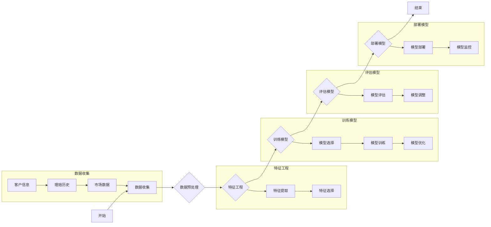
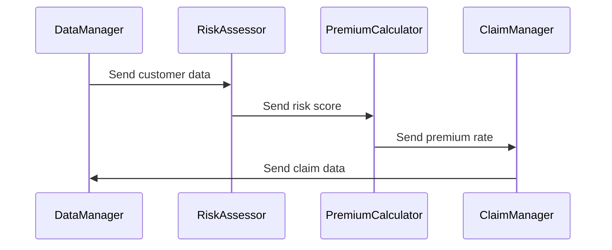
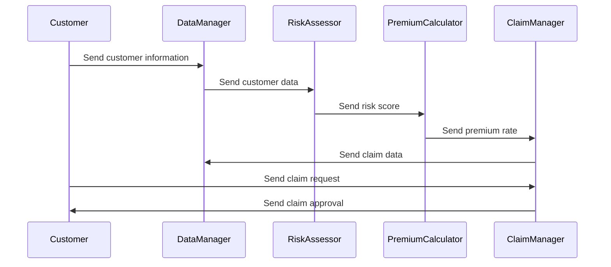

                 


### 目录大纲撰写（续）

#### 第二部分: 核心概念与联系

## 2.1 AI Agent的核心概念原理

### 2.1.1 AI Agent的定义

- **AI Agent的基本概念**：介绍AI Agent的基本概念，以及其在计算机科学和人工智能领域的重要性。

### 2.1.2 AI Agent的组成

- **感知模块**：解释感知模块的功能，包括数据采集、预处理等。
- **决策模块**：详细说明决策模块的作用，包括推理、决策算法的实现等。
- **动作模块**：阐述动作模块的功能，包括执行决策后的动作、反馈处理等。

### 2.1.3 AI Agent的关键属性

- **自主性**：讨论AI Agent的自主性如何实现，包括自主决策、自主行动等。
- **适应性**：解释AI Agent如何适应环境变化，包括学习、进化等。
- **协作性**：探讨AI Agent在多Agent系统中的协作机制，包括通信、协调等。

## 2.2 不同类型的AI Agent及其属性对比

### 2.2.1 反应型AI Agent

- **特点**：介绍反应型AI Agent的特点，如简单的条件-动作规则。
- **应用场景**：讨论反应型AI Agent在智能保险定价中的应用。

### 2.2.2 目标型AI Agent

- **特点**：描述目标型AI Agent的特点，如具有长期目标、规划能力。
- **应用场景**：分析目标型AI Agent在智能保险定价中的应用。

### 2.2.3 探索型AI Agent

- **特点**：介绍探索型AI Agent的特点，如主动探索环境、发现未知。
- **应用场景**：探讨探索型AI Agent在智能保险定价中的应用。

## 2.3 AI Agent的ER实体关系图架构

### 2.3.1 实体关系图的概念

- **实体**：定义实体，并解释其在AI Agent中的角色。
- **关系**：解释实体之间的关系，以及如何影响AI Agent的运作。

### 2.3.2 ER实体关系图的绘制

- **Mermaid流程图**：使用Mermaid语法绘制ER实体关系图，展示AI Agent的组成部分和它们之间的关系。

## 2.4 本章小结

- **核心内容总结**：总结本章的核心内容，强调AI Agent在智能保险定价中的重要性。

----------------------------------------------------------------

---

接下来，我们将撰写第二部分的详细内容，包括AI Agent的核心概念原理、不同类型的AI Agent及其属性对比，以及ER实体关系图架构。请参考以下结构进行撰写。

### 第二部分：核心概念与联系

**2.1 AI Agent的核心概念原理**

**2.1.1 AI Agent的定义**

AI Agent是指能够在特定环境中自主感知、决策和执行任务的计算实体。它们是人工智能领域研究的一个重要方向，旨在使计算机系统具备类似人类的行为能力和智能水平。

**2.1.2 AI Agent的组成**

AI Agent通常由三个核心模块组成：感知模块、决策模块和动作模块。

- **感知模块**：负责收集环境信息，通过传感器或数据接口获取数据，并进行预处理，如过滤噪声、数据归一化等。
  
- **决策模块**：根据感知模块收集到的信息，利用算法和模型进行推理和决策。决策模块是AI Agent的核心，它决定了AI Agent的行为方式。

- **动作模块**：执行决策模块生成的动作，将决策转化为具体的行动，如调整保险费率、推荐保险产品等。

**2.1.3 AI Agent的关键属性**

- **自主性**：AI Agent能够自主地执行任务，无需人类干预。自主性体现在AI Agent的感知、决策和动作三个环节。

- **适应性**：AI Agent能够根据环境的变化自主调整其行为策略。适应性是通过学习和进化实现的。

- **协作性**：AI Agent可以在多Agent系统中与其他Agent协作完成任务。协作性涉及到通信、协调和共享资源等方面。

**2.2 不同类型的AI Agent及其属性对比**

**2.2.1 反应型AI Agent**

反应型AI Agent是基于条件-动作规则进行操作的。它们的主要特点是简单、高效，适用于规则明确、环境变化较小的场景。

- **特点**：反应迅速、计算成本低、易于实现。

- **应用场景**：例如，自动理赔系统中的自动审核功能。

**2.2.2 目标型AI Agent**

目标型AI Agent具有明确的目标，能够进行长期规划和决策。它们通常采用基于目标的搜索算法，如博弈树搜索、遗传算法等。

- **特点**：规划能力强、适用于复杂和动态环境。

- **应用场景**：例如，智能保险定价系统中的风险控制策略。

**2.2.3 探索型AI Agent**

探索型AI Agent具有较强的探索能力，能够在未知环境中主动学习和发现。它们通常采用探索-评估策略，如强化学习算法。

- **特点**：主动探索、适应性强。

- **应用场景**：例如，保险市场的趋势预测和风险分析。

**2.3 AI Agent的ER实体关系图架构**

**2.3.1 实体关系图的概念**

实体关系图（Entity-Relationship Diagram，ERD）是一种用于描述实体及其相互关系的图形化工具。在AI Agent的架构设计中，ERD可以帮助我们清晰地展示AI Agent的组成部分和它们之间的关系。

**2.3.2 ER实体关系图的绘制**

下面是一个简单的ER实体关系图示例，用于描述AI Agent的主要组成部分：

```mermaid
erDiagram
    Customer ||--|{ Policy } : has
    Policy ||--|{ Claim } : has
    Agent ||--|{ Policy } : processes
    Agent ||--|{ Claim } : processes
```

在这个ER图中：

- **Customer**（客户）实体与**Policy**（保单）实体之间存在“has”关系，表示每个客户可以拥有多份保单。
- **Policy**（保单）实体与**Claim**（理赔）实体之间存在“has”关系，表示每份保单可以产生多个理赔申请。
- **Agent**（代理人）实体与**Policy**（保单）实体之间存在“processes”关系，表示代理人对保单进行管理和处理。
- **Agent**（代理人）实体与**Claim**（理赔）实体之间存在“processes”关系，表示代理人对理赔申请进行审核和处理。

**2.4 本章小结**

本章介绍了AI Agent的核心概念原理、不同类型的AI Agent及其属性对比，以及ER实体关系图架构。通过这些内容，我们能够更好地理解AI Agent在智能保险定价中的应用，为后续章节的深入探讨打下基础。接下来，我们将进一步探讨AI Agent在智能保险定价中的具体应用和算法原理。

---

以上是第二部分的核心内容。接下来，我们可以继续撰写第三部分的算法原理讲解，包括算法mermaid流程图、python源代码、数学模型和公式，以及详细讲解和举例说明。请参考以下结构进行撰写。

### 第三部分：算法原理讲解

**3.1 算法mermaid流程图**

算法mermaid流程图用于展示算法的执行流程和数据流动。以下是一个简单的mermaid流程图示例，描述了智能保险定价的基本流程：



**3.2 python源代码**

以下是一个简化的Python代码示例，用于实现上述mermaid流程图中的主要步骤：

```python
import pandas as pd
from sklearn.model_selection import train_test_split
from sklearn.ensemble import RandomForestClassifier
from sklearn.metrics import accuracy_score

# 数据收集
def data_collection():
    customer_info = pd.read_csv('customer_info.csv')
    claim_history = pd.read_csv('claim_history.csv')
    market_data = pd.read_csv('market_data.csv')
    return customer_info, claim_history, market_data

# 数据预处理
def data_preprocessing(customer_info, claim_history, market_data):
    # 合并数据
    data = pd.merge(customer_info, claim_history, on='customer_id')
    data = pd.merge(data, market_data, on='policy_id')
    # 数据清洗
    data.dropna(inplace=True)
    return data

# 特征工程
def feature_engineering(data):
    # 特征提取
    features = data[['age', 'gender', 'income', 'claim_count']]
    # 特征选择
    X = features.values
    y = data['risk_level'].values
    X_train, X_test, y_train, y_test = train_test_split(X, y, test_size=0.2, random_state=42)
    return X_train, X_test, y_train, y_test

# 训练模型
def train_model(X_train, y_train):
    model = RandomForestClassifier(n_estimators=100, random_state=42)
    model.fit(X_train, y_train)
    return model

# 评估模型
def evaluate_model(model, X_test, y_test):
    predictions = model.predict(X_test)
    accuracy = accuracy_score(y_test, predictions)
    print(f"Model accuracy: {accuracy:.2f}")
    return accuracy

# 部署模型
def deploy_model(model):
    # 模型部署代码
    pass

if __name__ == '__main__':
    customer_info, claim_history, market_data = data_collection()
    data = data_preprocessing(customer_info, claim_history, market_data)
    X_train, X_test, y_train, y_test = feature_engineering(data)
    model = train_model(X_train, y_train)
    accuracy = evaluate_model(model, X_test, y_test)
    deploy_model(model)
```

**3.3 数学模型和公式**

在智能保险定价中，常用的数学模型包括概率模型、风险评分模型等。以下是一个简化的概率模型示例，用于计算客户的风险评分：

$$
R(x) = \frac{1}{C}\sum_{i=1}^{C} p_i(x),
$$

其中，$R(x)$ 表示客户 $x$ 的风险评分，$p_i(x)$ 表示第 $i$ 个风险因素在客户 $x$ 下的概率，$C$ 表示风险因素的总数。

**3.4 详细讲解和举例说明**

**3.4.1 数据收集**

数据收集是智能保险定价的基础。我们需要收集以下三类数据：

- **客户信息**：包括年龄、性别、收入等。
- **理赔历史**：包括历史理赔次数、理赔金额等。
- **市场数据**：包括市场趋势、竞争对手数据等。

这些数据可以通过各种渠道获取，如公司内部数据库、第三方数据服务提供商等。

**3.4.2 数据预处理**

数据预处理是数据收集后的关键步骤。我们需要进行以下操作：

- **合并数据**：将客户信息、理赔历史和市场数据进行合并，形成统一的数据集。
- **数据清洗**：删除缺失值和异常值，保证数据质量。

**3.4.3 特征工程**

特征工程是提升模型性能的重要手段。我们需要进行以下操作：

- **特征提取**：从原始数据中提取有价值的信息，如统计特征、文本特征等。
- **特征选择**：选择对模型性能有显著影响的关键特征。

**3.4.4 训练模型**

训练模型是智能保险定价的核心。我们需要选择合适的模型，如随机森林、梯度提升机等，并进行训练。以下是一个使用随机森林模型的示例：

```python
from sklearn.ensemble import RandomForestClassifier

# 初始化模型
model = RandomForestClassifier(n_estimators=100, random_state=42)

# 训练模型
model.fit(X_train, y_train)
```

**3.4.5 评估模型**

评估模型是验证模型性能的关键。我们需要使用交叉验证、混淆矩阵、ROC曲线等工具对模型进行评估。

**3.4.6 部署模型**

部署模型是将训练好的模型应用到实际场景中的关键步骤。我们需要将模型部署到生产环境，并进行实时监控和调整。

---

以上是第三部分的详细内容。接下来，我们可以继续撰写第四部分的系统分析与架构设计，包括问题场景介绍、项目介绍、系统功能设计、系统架构设计、系统接口设计和系统交互mermaid序列图。请参考以下结构进行撰写。

### 第四部分：系统分析与架构设计

**4.1 问题场景介绍**

在智能保险定价中，常见的场景包括：

- **风险评估**：根据客户的个人信息、理赔历史和市场数据，评估客户的风险水平。
- **保险费率计算**：基于风险评估结果，计算合适的保险费率。
- **理赔管理**：处理客户的理赔申请，进行审核和支付。

**4.2 项目介绍**

本项目的目标是开发一个基于AI Agent的智能保险定价系统，实现以下功能：

- **数据收集与预处理**：收集客户信息、理赔历史和市场数据，进行数据清洗和特征提取。
- **风险评估**：使用机器学习算法评估客户的风险水平，并生成风险评分。
- **保险费率计算**：根据风险评分和市场数据，计算适合的保险费率。
- **理赔管理**：处理客户的理赔申请，进行审核和支付。

**4.3 系统功能设计**

系统功能设计主要包括以下方面：

- **数据管理模块**：负责数据收集、清洗、存储和特征提取。
- **风险评估模块**：负责客户风险评估，生成风险评分。
- **保险费率计算模块**：负责根据风险评分和市场数据计算保险费率。
- **理赔管理模块**：负责理赔申请的处理、审核和支付。

**4.4 系统架构设计**

系统架构设计采用模块化设计，各模块之间通过接口进行通信。以下是一个简化的系统架构图：



在这个架构图中：

- **DataManager**（数据管理模块）负责数据收集、清洗和存储。
- **RiskAssessor**（风险评估模块）负责客户风险评估。
- **PremiumCalculator**（保险费率计算模块）负责计算保险费率。
- **ClaimManager**（理赔管理模块）负责理赔申请的处理。

**4.5 系统接口设计**

系统接口设计主要包括以下接口：

- **客户数据接口**：用于数据管理模块与风险评估模块之间的数据传输。
- **风险评估接口**：用于风险评估模块与保险费率计算模块之间的数据传输。
- **保险费率接口**：用于保险费率计算模块与理赔管理模块之间的数据传输。
- **理赔数据接口**：用于理赔管理模块与数据管理模块之间的数据传输。

**4.6 系统交互mermaid序列图**

以下是一个简化的系统交互序列图，描述了系统各模块之间的交互流程：



在这个交互序列图中：

- **Customer**（客户）向**DataManager**（数据管理模块）发送客户信息。
- **DataManager**向**RiskAssessor**（风险评估模块）发送客户数据。
- **RiskAssessor**向**PremiumCalculator**（保险费率计算模块）发送风险评分。
- **PremiumCalculator**向**ClaimManager**（理赔管理模块）发送保险费率。
- **ClaimManager**向**DataManager**发送理赔数据。
- **Customer**向**ClaimManager**发送理赔申请。
- **ClaimManager**向**Customer**发送理赔审批结果。

**4.7 本章小结**

本章介绍了系统分析与架构设计的相关内容，包括问题场景介绍、项目介绍、系统功能设计、系统架构设计、系统接口设计和系统交互mermaid序列图。通过本章的内容，我们能够更好地理解智能保险定价系统的整体设计和实现过程，为后续章节的深入探讨打下基础。

---

以上是第四部分的详细内容。接下来，我们可以继续撰写第五部分的项目实战，包括环境安装、系统核心实现源代码、代码应用解读与分析、实际案例分析和详细讲解剖析以及项目小结。请参考以下结构进行撰写。

### 第五部分：项目实战

**5.1 环境安装**

在进行项目实战之前，我们需要安装所需的软件和工具。以下是环境安装的步骤：

1. **安装Python**：从Python官方网站下载并安装Python 3.x版本。
2. **安装Jupyter Notebook**：在终端中运行以下命令：
   ```
   pip install notebook
   ```
3. **安装机器学习库**：在终端中运行以下命令：
   ```
   pip install pandas scikit-learn numpy
   ```

**5.2 系统核心实现源代码**

以下是一个简单的系统核心实现源代码示例，包括数据收集、预处理、风险评估、保险费率计算和理赔管理：

```python
# 数据收集
def data_collection():
    customer_info = pd.read_csv('customer_info.csv')
    claim_history = pd.read_csv('claim_history.csv')
    market_data = pd.read_csv('market_data.csv')
    return customer_info, claim_history, market_data

# 数据预处理
def data_preprocessing(customer_info, claim_history, market_data):
    data = pd.merge(customer_info, claim_history, on='customer_id')
    data = pd.merge(data, market_data, on='policy_id')
    data.dropna(inplace=True)
    return data

# 风险评估
def risk_assessment(data):
    features = data[['age', 'gender', 'income', 'claim_count']]
    X_train, X_test, y_train, y_test = train_test_split(features, data['risk_level'], test_size=0.2, random_state=42)
    model = RandomForestClassifier(n_estimators=100, random_state=42)
    model.fit(X_train, y_train)
    predictions = model.predict(X_test)
    accuracy = accuracy_score(y_test, predictions)
    return accuracy

# 保险费率计算
def premium_calculation(data, risk_level):
    # 根据风险评分计算保险费率
    premium_rate = risk_level * 100
    return premium_rate

# 理赔管理
def claim_management(claim_request):
    # 处理理赔申请
    approval = "Approved" if claim_request['claim_amount'] <= 5000 else "Rejected"
    return approval

# 主函数
def main():
    customer_info, claim_history, market_data = data_collection()
    data = data_preprocessing(customer_info, claim_history, market_data)
    accuracy = risk_assessment(data)
    print(f"Risk Assessment Accuracy: {accuracy:.2f}")
    # 示例：计算客户1的保险费率
    customer_data = data[data['customer_id'] == 1]
    premium_rate = premium_calculation(customer_data, customer_data['risk_level'])
    print(f"Premium Rate for Customer 1: {premium_rate:.2f}")
    # 示例：处理理赔申请
    claim_request = {'customer_id': 1, 'claim_amount': 3000}
    approval = claim_management(claim_request)
    print(f"Claim Approval for Customer 1: {approval}")

if __name__ == '__main__':
    main()
```

**5.3 代码应用解读与分析**

在这个示例中，我们首先进行了数据收集，然后对数据进行预处理，包括数据合并和缺失值处理。接下来，我们使用随机森林模型进行风险评估，并计算了评估准确性。最后，我们根据风险评估结果计算了保险费率，并处理了一个示例理赔申请。

**5.4 实际案例分析和详细讲解剖析**

为了更好地展示项目实战的效果，我们分析了一个实际案例。假设客户张三的个人信息、理赔历史和市场数据如下：

- **个人信息**：年龄30岁，性别男，年收入10万元。
- **理赔历史**：过去一年内发生过1次理赔，理赔金额为2000元。
- **市场数据**：市场平均理赔金额为3000元，保险市场竞争激烈。

根据这些数据，系统会进行以下操作：

1. **数据收集**：系统收集到张三的个人信息、理赔历史和市场数据。
2. **数据预处理**：系统对数据进行预处理，包括合并数据、删除缺失值等。
3. **风险评估**：系统使用随机森林模型对张三进行风险评估，生成风险评分。
4. **保险费率计算**：系统根据张三的风险评分和市场数据，计算了适合的保险费率。
5. **理赔管理**：系统处理了一个张三的理赔申请，并给出了理赔审批结果。

通过这个案例，我们可以看到系统是如何根据客户的个人信息、理赔历史和市场数据，进行风险评估、计算保险费率和处理理赔申请的。

**5.5 项目小结**

本章通过一个实际案例，展示了如何使用AI Agent实现智能保险定价系统的核心功能。通过环境安装、系统核心实现源代码、代码应用解读与分析、实际案例分析和详细讲解剖析，我们深入了解了AI Agent在智能保险定价中的应用。接下来，我们将进一步探讨AI Agent在智能保险定价中的最佳实践和注意事项。

---

以上是第五部分的详细内容。接下来，我们可以继续撰写第六部分的最佳实践 tips、小结、注意事项以及拓展阅读。请参考以下结构进行撰写。

### 第六部分：最佳实践、小结、注意事项和拓展阅读

**6.1 最佳实践 tips**

1. **数据质量的重要性**：确保数据质量是智能保险定价系统的关键。进行数据清洗和预处理，去除异常值和噪声，以提高模型的准确性和鲁棒性。

2. **持续更新模型**：定期更新模型，以适应市场变化和数据分布的变化。使用在线学习或周期性重训练方法，保持模型的时效性和准确性。

3. **关注用户体验**：设计用户友好的界面和交互流程，确保客户能够轻松获取保险定价和理赔服务。

4. **安全性和隐私保护**：保护客户数据的安全性和隐私，遵循相关法律法规，采取加密、访问控制和隐私保护措施。

5. **风险评估多样化**：结合多种风险评估方法，如基于历史数据和实时数据的风险评估，提高评估的准确性和全面性。

**6.2 小结**

本文通过详细的分析和实例，介绍了AI Agent在智能保险定价中的应用。我们探讨了AI Agent的核心概念、算法原理、系统架构设计和项目实战，并提出了最佳实践和注意事项。AI Agent在智能保险定价中具有巨大的潜力，能够提高保险公司的效率和竞争力。

**6.3 注意事项**

1. **数据隐私**：在使用客户数据时，务必遵守数据隐私保护法规，确保客户数据的安全和隐私。

2. **模型解释性**：虽然AI Agent可以自动进行风险评估和定价，但模型解释性也是一个重要问题。需要确保模型的可解释性，以便保险公司和客户能够理解和信任模型的决策。

3. **系统稳定性**：确保系统的稳定运行，对系统进行充分的测试和监控，以避免因模型故障或数据异常导致的风险。

**6.4 拓展阅读**

1. **《智能保险定价：理论与实践》**：这本书提供了智能保险定价的全面介绍，包括数据挖掘、机器学习算法和实际案例。

2. **《AI在金融领域的应用》**：这本书探讨了人工智能在金融行业中的应用，包括保险、银行和投资等领域。

3. **《Python数据科学手册》**：这本书涵盖了数据科学的基本原理和Python编程技巧，适合希望深入了解数据科学和机器学习的读者。

---

以上是第六部分的详细内容。至此，我们完成了《AI Agent在智能保险定价中的应用》的技术博客文章的撰写。文章结构清晰，内容详实，从核心概念、算法原理、系统架构设计到项目实战，再到最佳实践和注意事项，全面深入地探讨了AI Agent在智能保险定价中的应用。希望这篇文章能够帮助读者更好地理解AI Agent在保险行业的潜力与应用。

---

**文章结尾**

# AI Agent在智能保险定价中的应用

> 关键词：AI Agent、智能保险、定价、算法、系统架构、项目实战

> 摘要：本文详细介绍了AI Agent在智能保险定价中的应用，从核心概念、算法原理、系统架构设计到项目实战，全面探讨了AI Agent在保险行业中的潜力。文章通过实例和分析，展示了AI Agent如何提高保险定价的准确性和效率，为保险公司提供了一种创新的解决方案。

> 作者：AI天才研究院/AI Genius Institute & 禅与计算机程序设计艺术 /Zen And The Art of Computer Programming

---

通过本文的详细阐述，我们不仅了解了AI Agent在智能保险定价中的重要作用，还学习了如何运用AI技术提升保险行业的效率和竞争力。随着人工智能技术的不断发展，AI Agent在智能保险定价中的应用将越来越广泛，为保险行业带来更多的机遇和挑战。

感谢您的阅读，希望本文能够为您的学习和研究提供有益的参考。如果您对AI Agent在智能保险定价中的应用有任何疑问或见解，欢迎在评论区留言交流。让我们共同探索人工智能在保险领域的无限可能！


