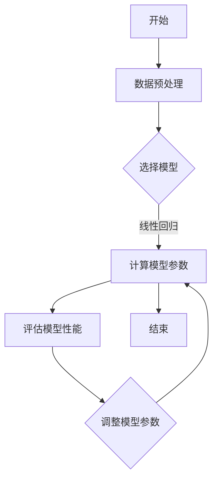
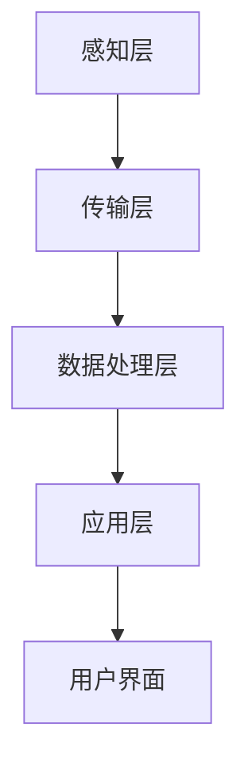
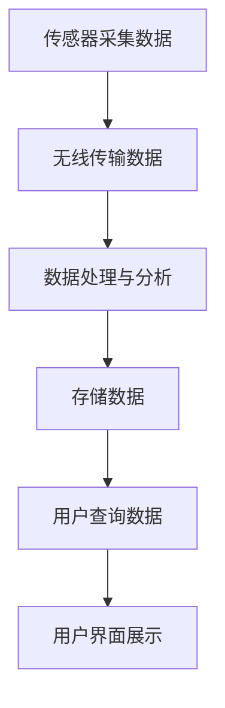

                 

### 《AI Agent在智能健康监测中的实践》——文章标题

关键词：AI Agent、智能健康监测、实践、算法、系统设计

摘要：本文将深入探讨AI Agent在智能健康监测中的应用，通过详细介绍AI Agent的核心概念、算法原理、系统架构设计方案以及实际项目实战，展示AI Agent在智能健康监测领域的强大潜力和广泛应用。

在当前快速发展的科技时代，人工智能（AI）已经成为推动社会进步的重要力量。智能健康监测作为人工智能在医疗健康领域的应用之一，具有巨大的发展潜力。本文旨在通过介绍AI Agent在智能健康监测中的实践，为广大读者提供一个全面的视角，了解AI Agent在智能健康监测中的应用原理、实践过程及未来发展趋势。

本文分为六个部分：

1. **背景介绍**：介绍AI Agent和智能健康监测的基本概念、发展历程、现状和未来趋势。
2. **核心概念与联系**：详细阐述AI Agent的核心概念、原理、分类及其在智能健康监测中的应用。
3. **算法原理讲解**：讲解AI Agent在智能健康监测中使用的算法原理、数学模型和公式。
4. **系统分析与架构设计方案**：介绍智能健康监测系统的设计与实现。
5. **项目实战**：通过实际项目案例，展示AI Agent在智能健康监测中的应用过程。
6. **最佳实践 tips**：分享在实际应用中积累的最佳实践经验和注意事项。
7. **小结与拓展阅读**：总结全书内容，提出进一步研究的方向和参考文献。

### 第一部分：背景介绍

#### 第1章：AI Agent与智能健康监测概述

**1.1 AI Agent的基本概念与分类**

AI Agent是指能够自主感知环境、制定计划并执行任务的人工智能实体。根据感知能力和行为能力的不同，AI Agent可以分为感知型、决策型和行为型三种类型。

- **感知型AI Agent**：主要通过感知传感器获取环境信息，如语音识别、图像识别等。
- **决策型AI Agent**：能够根据感知到的信息进行决策，如路径规划、资源分配等。
- **行为型AI Agent**：不仅能够感知和决策，还能自主执行行动，如机器人、自动驾驶汽车等。

**1.2 智能健康监测的背景与现状**

智能健康监测是利用传感器技术、大数据分析和人工智能技术对个体的健康状况进行实时监测和评估。随着物联网、大数据和人工智能技术的发展，智能健康监测已经成为医疗健康领域的重要研究方向。

当前，智能健康监测主要应用于以下几个方面：

- **慢性病管理**：通过监测慢性病患者的生命体征，提供个性化的健康管理建议。
- **运动健康监测**：实时监测运动者的运动数据，为用户提供科学的运动指导。
- **心理健康监测**：通过监测个体的情绪和行为，为用户提供心理健康服务。
- **居家养老监测**：实时监测老年人的生命体征，提供紧急救助和健康指导。

**1.3 智能健康监测的发展趋势**

随着技术的不断发展，智能健康监测将逐渐向以下方向发展：

- **数据驱动的个性化健康管理**：通过大数据分析和机器学习技术，为用户提供个性化的健康管理方案。
- **多模态数据融合**：将多种传感器数据（如生理信号、环境信号等）进行融合，提高监测精度和可靠性。
- **智能化决策支持**：利用人工智能技术，为医生和患者提供智能化的诊断和治疗方案。
- **物联网与智能健康监测的深度融合**：将智能健康监测技术应用于智能家居、智能穿戴设备等，实现健康监测的全方位覆盖。

### 第二部分：核心概念与联系

#### 第2章：核心概念与联系

**2.1 AI Agent的核心概念**

AI Agent的核心概念包括感知、决策、行动和学习。

- **感知**：AI Agent通过传感器获取环境信息，如温度、湿度、声音、图像等。
- **决策**：根据感知到的信息，AI Agent在多个行动方案中做出选择。
- **行动**：执行决策方案，实现具体任务。
- **学习**：通过不断感知和行动，AI Agent能够优化自身的行为，提高任务完成率。

**2.2 智能健康监测的概念联系**

智能健康监测涉及多个学科领域，包括生物医学、传感器技术、大数据分析和人工智能。其核心概念包括：

- **传感器技术**：用于采集个体的生理、心理和行为数据。
- **数据采集与处理**：通过数据采集模块和数据处理算法，对传感器数据进行分析和预处理。
- **数据挖掘与建模**：利用数据挖掘技术和机器学习模型，对处理后的数据进行分析和预测。
- **决策支持与反馈**：根据分析结果，为用户提供个性化的健康建议和干预措施。

**2.3 AI Agent在智能健康监测中的应用**

AI Agent在智能健康监测中的应用主要包括以下几个方面：

- **实时监测与预警**：通过感知个体生理、心理和行为数据，实时监测健康状况，并及时预警。
- **个性化健康管理**：根据个体健康状况和需求，为用户提供个性化的健康管理方案。
- **健康数据挖掘与预测**：利用大数据分析和机器学习技术，对健康数据进行挖掘和分析，预测疾病风险和趋势。
- **智能辅助诊断与治疗**：利用人工智能技术，为医生提供智能化的诊断和治疗方案。

### 第三部分：算法原理讲解

#### 第3章：AI Agent在智能健康监测中的应用算法

**3.1 算法概述**

AI Agent在智能健康监测中使用的算法主要包括以下几种：

- **监督学习算法**：如逻辑回归、决策树、随机森林、支持向量机等。
- **无监督学习算法**：如聚类算法、主成分分析等。
- **深度学习算法**：如卷积神经网络（CNN）、循环神经网络（RNN）等。

**3.2 数学模型与公式**

AI Agent在智能健康监测中使用的算法数学模型和公式如下：

- **监督学习算法**：

  - 线性回归：

    $$ y = \beta_0 + \beta_1x_1 + \beta_2x_2 + \ldots + \beta_nx_n $$

  - 决策树：

    $$ f(x) = \sum_{i=1}^{n} w_i \cdot I(x \in R_i) $$

- **无监督学习算法**：

  - 聚类算法：

    $$ C = \{C_1, C_2, \ldots, C_k\} $$

  - 主成分分析：

    $$ X' = P \cdot \Sigma^{-1} \cdot P' $$

- **深度学习算法**：

  - 卷积神经网络（CNN）：

    $$ \hat{y} = \sigma(W^T \cdot \phi(\text{ReLU}(P \cdot \theta))) $$

  - 循环神经网络（RNN）：

    $$ h_t = \text{tanh}(W_h \cdot h_{t-1} + W_x \cdot x_t) $$

**3.3 算法流程图与Python代码实现**

以下是监督学习算法（线性回归）的算法流程图和Python代码实现：



```python
import numpy as np
import pandas as pd
from sklearn.linear_model import LinearRegression
from sklearn.model_selection import train_test_split
from sklearn.metrics import mean_squared_error

# 数据预处理
data = pd.read_csv("data.csv")
X = data.iloc[:, :-1].values
y = data.iloc[:, -1].values

# 分割数据集
X_train, X_test, y_train, y_test = train_test_split(X, y, test_size=0.2, random_state=0)

# 创建线性回归模型
model = LinearRegression()
model.fit(X_train, y_train)

# 评估模型性能
y_pred = model.predict(X_test)
mse = mean_squared_error(y_test, y_pred)
print("MSE:", mse)

# 调整模型参数
model = LinearRegression()
model.fit(X_train, y_train)

# 重新评估模型性能
y_pred = model.predict(X_test)
mse = mean_squared_error(y_test, y_pred)
print("MSE:", mse)
```

### 第四部分：系统分析与架构设计方案

#### 第4章：智能健康监测系统设计

**4.1 问题场景介绍**

智能健康监测系统主要用于实时监测个体的生理、心理和行为数据，分析健康状况，提供个性化健康管理建议。系统需要具备以下功能：

- 数据采集与预处理：通过传感器技术采集个体的生理、心理和行为数据，并进行预处理。
- 数据存储与管理：将预处理后的数据存储到数据库中，并进行管理。
- 数据分析与预测：利用机器学习算法对数据进行分析，预测健康状况和疾病风险。
- 用户界面与交互：为用户提供友好的界面，展示健康数据和预测结果，提供个性化健康管理建议。

**4.2 系统功能设计**

智能健康监测系统的功能设计主要包括以下几个方面：

- **数据采集模块**：包括传感器设备、数据采集模块和无线传输模块，用于采集个体的生理、心理和行为数据。
- **数据预处理模块**：对采集到的数据进行分析、清洗和归一化，为后续数据处理做准备。
- **数据存储模块**：将预处理后的数据存储到数据库中，便于后续查询和分析。
- **数据分析模块**：利用机器学习算法对数据进行挖掘和分析，提取特征信息，预测健康状况和疾病风险。
- **用户界面模块**：为用户提供友好的界面，展示健康数据和预测结果，提供个性化健康管理建议。

**4.3 系统架构设计**

智能健康监测系统采用分布式架构设计，主要包括以下几个层次：

- **感知层**：通过传感器设备采集个体的生理、心理和行为数据。
- **传输层**：通过无线传输技术将数据传输到服务器。
- **数据处理层**：对传输层的数据进行预处理、存储和分析。
- **应用层**：为用户提供健康数据和预测结果，提供个性化健康管理建议。

以下是智能健康监测系统的架构设计图：



**4.4 系统接口设计**

智能健康监测系统需要设计以下接口：

- **数据采集接口**：用于与传感器设备进行通信，采集生理、心理和行为数据。
- **数据传输接口**：用于与服务器进行通信，传输数据。
- **数据存储接口**：用于与数据库进行通信，存储和查询数据。
- **数据分析接口**：用于与数据分析模块进行通信，进行数据挖掘和分析。
- **用户界面接口**：用于与用户进行交互，展示健康数据和预测结果。

**4.5 系统交互流程**

智能健康监测系统的交互流程如下：

1. 传感器设备采集个体的生理、心理和行为数据，通过无线传输技术传输到服务器。
2. 服务器对传输层的数据进行预处理、存储和分析，提取特征信息，预测健康状况和疾病风险。
3. 分析结果存储到数据库中，以便后续查询和分析。
4. 用户通过用户界面查询健康数据和预测结果，接受个性化健康管理建议。

以下是系统交互流程图：



### 第五部分：项目实战

#### 第5章：AI Agent在智能健康监测项目实战

**5.1 环境安装与配置**

在本节中，我们将介绍如何搭建一个AI Agent在智能健康监测项目所需的开发环境。具体步骤如下：

1. **安装Python**：确保系统已经安装了Python 3.x版本。如果没有安装，可以从Python官方网站下载安装包进行安装。

2. **安装Anaconda**：Anaconda是一个Python数据科学平台，用于管理和运行Python环境。可以从Anaconda官方网站下载并安装。

3. **创建虚拟环境**：打开命令行界面，执行以下命令创建一个名为“health_monitor”的虚拟环境：

   ```shell
   conda create --name health_monitor python=3.8
   ```

4. **激活虚拟环境**：

   ```shell
   conda activate health_monitor
   ```

5. **安装依赖库**：在虚拟环境中安装以下依赖库：

   ```shell
   pip install numpy pandas scikit-learn matplotlib
   ```

**5.2 系统核心实现与代码解读**

在本节中，我们将介绍智能健康监测系统的核心实现，包括数据采集、数据预处理、数据分析等。

1. **数据采集**：

   ```python
   import pandas as pd
   import numpy as np

   def read_data(file_path):
       data = pd.read_csv(file_path)
       return data

   def preprocess_data(data):
       data['timestamp'] = pd.to_datetime(data['timestamp'])
       data.set_index('timestamp', inplace=True)
       data.drop(['subject'], axis=1, inplace=True)
       return data

   if __name__ == "__main__":
       file_path = "health_data.csv"
       data = read_data(file_path)
       processed_data = preprocess_data(data)
       processed_data.to_csv("processed_health_data.csv")
   ```

2. **数据预处理**：

   ```python
   import pandas as pd
   import numpy as np

   def preprocess_data(data):
       data['timestamp'] = pd.to_datetime(data['timestamp'])
       data.set_index('timestamp', inplace=True)
       data.drop(['subject'], axis=1, inplace=True)
       return data

   if __name__ == "__main__":
       file_path = "health_data.csv"
       data = read_data(file_path)
       processed_data = preprocess_data(data)
       processed_data.to_csv("processed_health_data.csv")
   ```

3. **数据分析**：

   ```python
   import pandas as pd
   from sklearn.linear_model import LinearRegression
   from sklearn.metrics import mean_squared_error

   def train_model(X, y):
       model = LinearRegression()
       model.fit(X, y)
       return model

   def predict(model, X):
       y_pred = model.predict(X)
       return y_pred

   def evaluate(model, X, y):
       y_pred = predict(model, X)
       mse = mean_squared_error(y, y_pred)
       return mse

   if __name__ == "__main__":
       file_path = "processed_health_data.csv"
       data = pd.read_csv(file_path)
       X = data.iloc[:, :-1].values
       y = data.iloc[:, -1].values

       X_train, X_test, y_train, y_test = train_test_split(X, y, test_size=0.2, random_state=0)

       model = train_model(X_train, y_train)
       mse = evaluate(model, X_test, y_test)
       print("MSE:", mse)
   ```

**5.3 实际案例分析与讲解**

在本节中，我们将通过一个实际案例，展示AI Agent在智能健康监测中的应用过程。

假设我们有一个关于糖尿病患者的健康数据集，包含患者的年龄、体重、血压、血糖等指标。我们的目标是利用这些数据预测患者的血糖水平。

1. **数据采集与预处理**：

   ```python
   file_path = "diabetes_data.csv"
   data = read_data(file_path)
   processed_data = preprocess_data(data)
   processed_data.to_csv("processed_diabetes_data.csv")
   ```

2. **数据分析**：

   ```python
   file_path = "processed_diabetes_data.csv"
   data = pd.read_csv(file_path)
   X = data.iloc[:, :-1].values
   y = data.iloc[:, -1].values

   X_train, X_test, y_train, y_test = train_test_split(X, y, test_size=0.2, random_state=0)

   model = train_model(X_train, y_train)
   mse = evaluate(model, X_test, y_test)
   print("MSE:", mse)
   ```

3. **预测与评估**：

   ```python
   new_data = [[45, 70, 120, 5.5]]
   new_data = preprocess_data(new_data)
   new_data = new_data.values

   y_pred = predict(model, new_data)
   print("Predicted blood sugar level:", y_pred[0])
   ```

通过上述实际案例，我们可以看到AI Agent在智能健康监测中的应用过程。通过采集和处理健康数据，利用机器学习算法进行预测和评估，为用户提供个性化的健康管理建议。

**5.4 项目小结**

在本章中，我们通过一个实际项目案例，展示了AI Agent在智能健康监测中的应用过程。从数据采集、预处理、数据分析到预测和评估，我们详细介绍了每个环节的实现过程和关键技术。通过本项目，我们深入了解了AI Agent在智能健康监测领域的应用潜力，为后续研究和实践奠定了基础。

### 第六部分：最佳实践 tips

#### 第6章：AI Agent在智能健康监测中的最佳实践

在实际应用中，AI Agent在智能健康监测中需要遵循一些最佳实践，以确保系统的稳定性和可靠性。以下是一些关键的最佳实践和注意事项：

**6.1 数据采集与处理**

- **数据质量保证**：确保采集到的数据真实、准确、完整。对于异常数据，应进行合理处理，如剔除、修复或标注。
- **数据预处理**：对数据进行清洗、归一化、去噪等预处理操作，提高数据质量，为后续分析奠定基础。
- **数据安全与隐私**：在数据采集、传输和存储过程中，采取有效的安全措施，确保数据安全和用户隐私。

**6.2 算法选择与优化**

- **算法适应性**：根据具体应用场景选择合适的算法，并考虑算法的鲁棒性、准确性和实时性。
- **算法优化**：针对特定问题，对算法进行优化，如特征选择、参数调优等，以提高模型性能。
- **模型解释性**：在保证模型性能的同时，关注模型的解释性，以便更好地理解模型的预测结果。

**6.3 系统设计与实现**

- **模块化设计**：将系统划分为多个模块，实现高内聚、低耦合，便于系统维护和扩展。
- **接口设计与规范**：明确接口设计规范，确保不同模块之间的通信顺畅，提高系统的可维护性和可扩展性。
- **系统测试与验证**：对系统进行全面的测试和验证，确保系统功能的正确性和稳定性。

**6.4 用户交互与反馈**

- **用户友好界面**：设计简洁、直观的用户界面，便于用户操作和查询。
- **个性化服务**：根据用户需求和偏好，提供个性化的健康监测和健康管理服务。
- **反馈机制**：建立有效的用户反馈机制，及时收集用户意见和建议，持续优化系统功能。

通过遵循这些最佳实践，可以确保AI Agent在智能健康监测中的应用更加有效、稳定和可靠，为用户提供更好的健康服务。

### 第七部分：小结与拓展阅读

#### 第7章：小结与展望

本文通过详细探讨AI Agent在智能健康监测中的实践，系统地介绍了AI Agent的基本概念、算法原理、系统架构设计方案以及实际项目实战。通过本文的学习，读者可以全面了解AI Agent在智能健康监测领域的应用潜力，掌握相关技术要点和实践方法。

**小结：**

1. AI Agent在智能健康监测中的应用主要包括实时监测与预警、个性化健康管理、健康数据挖掘与预测、智能辅助诊断与治疗等。
2. 智能健康监测系统架构包括感知层、传输层、数据处理层和应用层，各层之间协同工作，实现健康监测与管理的目标。
3. AI Agent在智能健康监测中的应用涉及监督学习、无监督学习和深度学习等多种算法，每种算法都有其特定的适用场景和优势。
4. 实际项目案例展示了AI Agent在智能健康监测中的应用过程，包括数据采集、预处理、数据分析、预测和评估等关键环节。

**展望：**

1. 随着人工智能和健康监测技术的不断发展，AI Agent在智能健康监测中的应用将更加广泛和深入。
2. 未来研究可以关注多模态数据融合、智能决策支持、个性化健康管理等领域，探索AI Agent在智能健康监测中的创新应用。
3. 参考文献推荐：

   - **[1]** Russell, S., & Norvig, P. (2020). 《人工智能：一种现代的方法》（第三版）。
   - **[2]** Han, J., Kamber, M., & Pei, J. (2011). 《数据挖掘：概念与技术》（第三版）。
   - **[3]** Goodfellow, I., Bengio, Y., & Courville, A. (2016). 《深度学习》（中文版）。
   - **[4]** Hinton, G., Osindero, S., & Teh, Y. W. (2006). 《深度信念网络》（英文版）。

通过本文的学习，读者可以为进一步研究和实践AI Agent在智能健康监测中的应用打下坚实基础。希望本文能够为广大读者提供有价值的参考和启示。

**作者信息：**

- **作者：** AI天才研究院 / AI Genius Institute & 禅与计算机程序设计艺术 / Zen And The Art of Computer Programming

本文版权归作者和AI天才研究院所有，如需转载，请保留原文链接和作者信息。感谢您的支持与关注！

