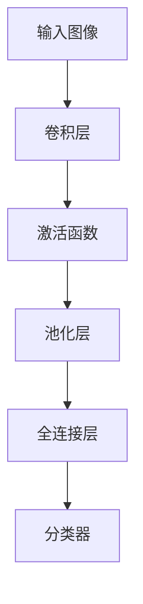
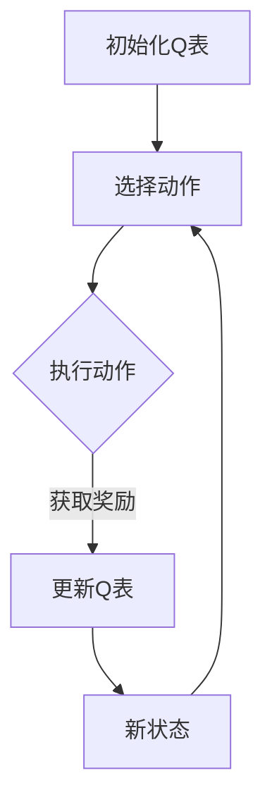
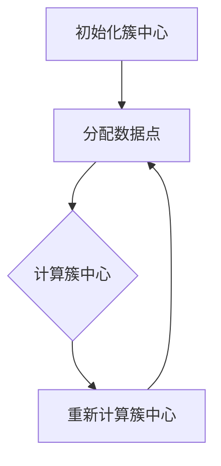
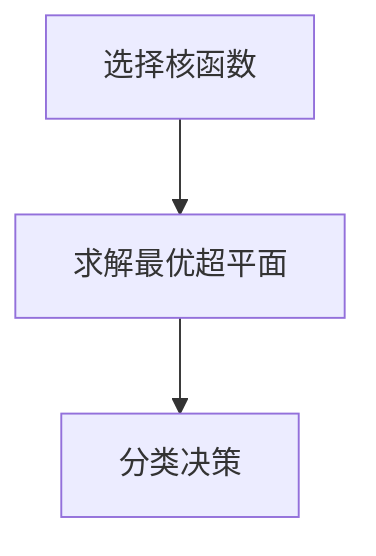

                 

## AI Agent在智能健身镜中的实时动作纠正

### 关键词：智能健身镜、AI Agent、实时动作纠正、深度学习、强化学习

> 摘要：本文深入探讨了AI Agent在智能健身镜中实时动作纠正的应用。首先，通过分析当前智能健身镜动作纠正的不足，指出AI Agent在此领域的巨大潜力。接着，我们介绍了AI Agent的定义、分类及其在动作纠正中的优势。随后，详细解析了AI Agent的三大核心功能——监测与识别、动作评估、动作纠正的算法原理与实现方法。最后，我们探讨了AI Agent在实时动作纠正中的挑战与优化策略，并通过实际项目案例进行了深入分析。

----------------------------------------------------------------

### 第一部分：引言与背景

#### 第1章：问题背景与定义

##### 1.1.1 问题背景

##### 1.1.1.1 人工智能与智能健身镜的发展

随着人工智能（AI）技术的迅猛发展，智能健身镜逐渐成为健身领域的热门产品。智能健身镜结合了摄像头、显示屏和智能算法，可以实现实时动作监测、动作评估和动作纠正。用户只需在镜子前完成相应动作，系统便能通过摄像头捕捉并分析动作数据，为用户提供个性化的健身指导。

##### 1.1.1.2 智能健身镜的功能与市场现状

智能健身镜的主要功能包括：实时动作捕捉、动作评估、动作纠正、健身数据统计和用户互动等。目前，智能健身镜市场呈现出高速发展的态势，各大科技公司和健身品牌纷纷布局，推出了一系列具有不同功能的智能健身镜产品。

##### 1.1.2 问题描述

##### 1.1.2.1 当前智能健身镜动作纠正的不足

虽然智能健身镜在动作监测和评估方面具有一定的优势，但其在动作纠正方面的表现仍存在明显不足。首先，现有系统对动作纠正的实时性要求较低，往往无法在用户完成动作的瞬间进行有效纠正。其次，系统对动作的精确性要求不高，容易导致纠正效果不佳。此外，现有系统在可解释性方面也较弱，用户难以理解纠正建议的依据和原因。

##### 1.1.2.2 AI Agent在智能健身镜中的应用需求

针对上述不足，AI Agent在智能健身镜中的应用需求显得尤为重要。AI Agent具备实时性、精确性和可解释性的特点，能够在用户完成动作的瞬间进行精准分析，并给出合理有效的纠正建议。此外，AI Agent还可通过不断学习和优化，提高动作纠正的准确性，从而提升用户的使用体验。

##### 1.1.3 问题解决

##### 1.1.3.1 AI Agent的定义与特点

AI Agent，即人工智能代理，是指具备自主思考、学习、决策能力的计算机程序。AI Agent在智能健身镜中的应用，可以理解为一种智能化的健身教练，它能够实时监测用户的动作，进行动作评估和纠正，并根据用户反馈进行自我优化。

##### 1.1.3.2 AI Agent在动作纠正中的优势

AI Agent在动作纠正中的优势主要体现在以下几个方面：

1. **实时性**：AI Agent能够实时监测用户的动作，迅速分析并给出纠正建议。
2. **精确性**：AI Agent采用先进的算法和模型，对用户的动作进行精细分析，确保纠正建议的准确性。
3. **可解释性**：AI Agent能够为用户解释纠正建议的依据和原因，提高用户的理解度和信任度。
4. **适应性**：AI Agent可以通过不断学习和优化，适应不同用户的需求和偏好，提供个性化的纠正建议。

##### 1.1.4 边界与外延

##### 1.1.4.1 AI Agent的应用范围

AI Agent不仅可以应用于智能健身镜，还可以拓展到其他领域，如智能康复、智能舞蹈等。在这些领域中，AI Agent同样能够发挥其优势，为用户提供个性化、智能化的服务。

##### 1.1.4.2 AI Agent的技术挑战与应对策略

AI Agent在智能健身镜中的应用面临一些技术挑战，如数据采集与处理、实时性、精确性等。针对这些挑战，我们可以采用以下应对策略：

1. **优化算法**：采用先进的深度学习、强化学习等算法，提高AI Agent的准确性和实时性。
2. **增强硬件支持**：提高摄像头、传感器等硬件设备的性能，为AI Agent提供更高质量的数据输入。
3. **数据融合**：结合多种数据源，如摄像头、传感器、用户反馈等，提高AI Agent对用户动作的理解和识别能力。
4. **持续优化**：通过不断收集用户反馈和数据，持续优化AI Agent的性能，提高其适应性和用户体验。

---

### 第二部分：AI Agent的基础理论

#### 第2章：AI Agent的基础理论

##### 2.1 AI Agent的概念与分类

##### 2.1.1 AI Agent的定义

AI Agent是一种能够根据环境信息自主决策、执行任务的计算机程序。它通过感知环境、分析信息、生成行动，实现自主学习和优化。AI Agent的核心目标是在复杂的动态环境中，最大化满足特定目标或任务。

##### 2.1.2 AI Agent的分类

AI Agent可以根据其功能、应用场景、学习策略等进行分类。常见的分类方法如下：

1. **按功能分类**：
   - 监测与识别类：用于监测和识别环境中的物体、事件等。
   - 评估与决策类：用于对环境中的信息进行评估，生成决策建议。
   - 纠正与优化类：用于对执行结果进行调整和优化。

2. **按应用场景分类**：
   - 室内场景：如智能健身镜、智能家居等。
   - 室外场景：如自动驾驶、无人机等。
   - 特定任务场景：如医疗诊断、金融分析等。

3. **按学习策略分类**：
   - 监督学习：依赖于已标注的数据集进行训练。
   - 无监督学习：不依赖已标注的数据集，通过自身发现规律。
   - 强化学习：通过与环境的交互，不断调整策略以实现最优结果。

##### 2.2 AI Agent的核心功能

##### 2.2.1 监测与识别

监测与识别是AI Agent的基本功能之一。它通过对摄像头、传感器等设备采集的数据进行分析和处理，实现对环境中的物体、事件等信息的识别和定位。监测与识别的关键技术包括：

1. **目标检测**：通过检测图像中的目标物体，实现对环境的初步感知。
2. **目标跟踪**：在动态场景中，对目标物体进行实时跟踪。
3. **识别与分类**：对监测到的目标进行分类和识别，提取关键特征信息。

##### 2.2.2 动作评估

动作评估是AI Agent在智能健身镜中的应用之一。它通过对用户动作的分析和评估，为用户提供个性化的健身指导和建议。动作评估的关键技术包括：

1. **动作识别**：对用户的动作进行识别和分类。
2. **动作评估**：对用户的动作质量进行评估，包括动作的准确性、流畅性等。
3. **动作反馈**：根据评估结果，生成针对性的动作纠正建议。

##### 2.2.3 动作纠正与优化

动作纠正与优化是AI Agent在智能健身镜中的核心功能。它通过对用户动作的实时监测和评估，发现并纠正用户动作中的问题，帮助用户提高健身效果。动作纠正与优化的关键技术包括：

1. **实时监测**：通过摄像头等设备，实时监测用户的动作。
2. **动作纠正**：对用户动作中存在的问题进行实时纠正。
3. **优化策略**：根据用户反馈和动作数据，不断优化纠正策略，提高纠正效果。

##### 2.3 AI Agent的常见算法

##### 2.3.1 深度学习算法

深度学习算法是AI Agent中常用的算法之一。它通过多层神经网络，对大量数据进行分析和学习，实现对复杂任务的自动识别和预测。常见的深度学习算法包括：

1. **卷积神经网络（CNN）**：适用于图像和视频数据的处理和分析。
2. **循环神经网络（RNN）**：适用于序列数据的处理和分析。
3. **生成对抗网络（GAN）**：适用于图像生成和对抗训练。

##### 2.3.2 强化学习算法

强化学习算法是AI Agent中常用的算法之一。它通过与环境进行交互，不断调整策略，实现最优结果。常见的强化学习算法包括：

1. **Q-learning算法**：通过学习值函数，实现最优策略。
2. **深度Q网络（DQN）**：结合深度学习和强化学习，实现更高效的策略学习。
3. **策略梯度算法**：通过直接学习策略，实现最优结果。

##### 2.3.3 聚类与分类算法

聚类与分类算法是AI Agent中常用的算法之一。它通过对数据进行分析和分类，实现对数据的组织和理解。常见的聚类与分类算法包括：

1. **K-means算法**：适用于无监督学习，用于对数据集进行聚类。
2. **支持向量机（SVM）**：适用于有监督学习，用于对数据进行分类。
3. **决策树算法**：适用于有监督学习，用于对数据进行分类和回归。

---

### 第三部分：AI Agent在智能健身镜中的实现

#### 第3章：智能健身镜系统架构

##### 3.1 系统整体架构

智能健身镜系统架构主要包括硬件层、软件层和数据层三个部分。硬件层包括摄像头、传感器、显示屏等设备；软件层包括操作系统、应用程序等；数据层包括数据存储、数据分析和数据可视化等。

##### 3.1.1 硬件层

硬件层是智能健身镜系统的底层，主要包括以下设备：

1. **摄像头**：用于捕捉用户动作，提供实时图像输入。
2. **传感器**：用于监测用户心率、呼吸等生理指标。
3. **显示屏**：用于显示用户动作、评估结果和纠正建议。

##### 3.1.2 软件层

软件层是智能健身镜系统的核心，主要包括以下部分：

1. **操作系统**：如Linux、Android等，用于管理硬件资源。
2. **应用程序**：如健身镜应用，用于实现动作监测、评估和纠正等功能。
3. **AI Agent**：用于实现动作纠正的核心算法和功能。

##### 3.1.3 数据层

数据层是智能健身镜系统的数据管理和分析部分，主要包括以下部分：

1. **数据存储**：如数据库、文件系统等，用于存储用户数据。
2. **数据分析**：如数据挖掘、机器学习等，用于分析用户动作数据，为AI Agent提供支持。
3. **数据可视化**：如图表、报表等，用于展示用户数据和分析结果。

##### 3.2 AI Agent的核心模块

AI Agent在智能健身镜系统中扮演着关键角色，主要包括以下核心模块：

1. **监测与识别模块**：负责实时监测用户动作，识别动作类型。
2. **动作评估模块**：负责对用户动作进行评估，生成评估结果。
3. **动作纠正模块**：负责根据评估结果，实时纠正用户动作，提高动作质量。

##### 3.2.1 监测与识别模块

监测与识别模块是AI Agent的核心模块之一，主要负责以下任务：

1. **实时监测**：通过摄像头等设备，实时捕捉用户动作。
2. **动作识别**：对用户动作进行分类和识别，提取关键特征。
3. **数据预处理**：对监测到的数据进行处理和清洗，为后续分析提供支持。

##### 3.2.2 动作评估模块

动作评估模块是AI Agent的核心模块之一，主要负责以下任务：

1. **动作评估**：对用户动作进行质量评估，包括准确性、流畅性等。
2. **评估结果生成**：根据评估结果，生成评估报告和纠正建议。
3. **评估结果反馈**：将评估结果和纠正建议实时反馈给用户。

##### 3.2.3 动作纠正模块

动作纠正模块是AI Agent的核心模块之一，主要负责以下任务：

1. **实时纠正**：根据评估结果，实时纠正用户动作，提高动作质量。
2. **纠正策略优化**：根据用户反馈和动作数据，不断优化纠正策略，提高纠正效果。
3. **纠正效果评估**：评估纠正效果，为后续优化提供支持。

---

### 第四部分：AI Agent的算法设计与实现

#### 第4章：AI Agent的算法设计与实现

##### 4.1 监测与识别算法

监测与识别算法是AI Agent的核心算法之一，主要负责对用户动作进行实时监测和识别。以下将介绍一种基于深度学习的监测与识别算法。

##### 4.1.1 深度学习算法原理

深度学习算法是一种基于多层神经网络的学习方法，通过学习大量数据，自动提取特征，实现复杂任务。常见的深度学习算法包括卷积神经网络（CNN）和循环神经网络（RNN）。

卷积神经网络（CNN）是一种适用于图像和视频数据的处理和分析的深度学习算法。它通过卷积、池化等操作，自动提取图像中的特征，实现对图像的识别和分类。

循环神经网络（RNN）是一种适用于序列数据的处理和分析的深度学习算法。它通过循环结构，对序列数据进行编码和提取特征，实现对序列数据的预测和生成。

##### 4.1.2 算法实现与代码解析

以下是一个基于CNN的监测与识别算法的示例代码：

```python
import tensorflow as tf
from tensorflow.keras.models import Sequential
from tensorflow.keras.layers import Conv2D, MaxPooling2D, Flatten, Dense

# 创建模型
model = Sequential()

# 添加卷积层
model.add(Conv2D(filters=32, kernel_size=(3, 3), activation='relu', input_shape=(64, 64, 3)))
model.add(MaxPooling2D(pool_size=(2, 2)))

# 添加全连接层
model.add(Flatten())
model.add(Dense(units=64, activation='relu'))
model.add(Dense(units=10, activation='softmax'))

# 编译模型
model.compile(optimizer='adam', loss='categorical_crossentropy', metrics=['accuracy'])

# 训练模型
model.fit(x_train, y_train, epochs=10, batch_size=32)
```

在上面的示例代码中，我们首先导入了TensorFlow库，并定义了一个顺序模型。接着，我们添加了一个卷积层和一个池化层，用于提取图像特征。然后，我们添加了一个全连接层，用于对特征进行分类。最后，我们编译并训练了模型。

##### 4.1.3 算法原理讲解

卷积神经网络（CNN）的算法原理可以概括为以下几个步骤：

1. **卷积操作**：通过卷积操作，将输入图像与卷积核进行卷积，生成特征图。
2. **激活函数**：通过激活函数（如ReLU函数），增强网络的非线性能力。
3. **池化操作**：通过池化操作（如最大池化），降低特征图的维度，减少参数数量。
4. **全连接层**：通过全连接层，将特征图映射到输出结果。
5. **分类器**：通过分类器（如softmax函数），对输出结果进行分类。

以下是一个卷积神经网络（CNN）的Mermaid流程图：



在上述流程图中，输入图像首先通过卷积层进行特征提取，然后通过激活函数增强非线性能力，接着通过池化层降低维度，最后通过全连接层进行分类。

##### 4.1.4 算法实现与代码解析

以下是一个基于深度学习的监测与识别算法的示例代码：

```python
import tensorflow as tf
from tensorflow.keras.models import Sequential
from tensorflow.keras.layers import Conv2D, MaxPooling2D, Flatten, Dense

# 创建模型
model = Sequential()

# 添加卷积层
model.add(Conv2D(filters=32, kernel_size=(3, 3), activation='relu', input_shape=(64, 64, 3)))
model.add(MaxPooling2D(pool_size=(2, 2)))

# 添加全连接层
model.add(Flatten())
model.add(Dense(units=64, activation='relu'))
model.add(Dense(units=10, activation='softmax'))

# 编译模型
model.compile(optimizer='adam', loss='categorical_crossentropy', metrics=['accuracy'])

# 训练模型
model.fit(x_train, y_train, epochs=10, batch_size=32)
```

在上面的示例代码中，我们首先导入了TensorFlow库，并定义了一个顺序模型。接着，我们添加了一个卷积层和一个池化层，用于提取图像特征。然后，我们添加了一个全连接层，用于对特征进行分类。最后，我们编译并训练了模型。

---

##### 4.2 动作评估算法

动作评估算法是AI Agent在智能健身镜中的另一个核心算法，主要负责对用户动作进行评估，以生成相应的评估结果和纠正建议。以下将介绍一种基于强化学习的动作评估算法。

##### 4.2.1 强化学习算法原理

强化学习（Reinforcement Learning，RL）是一种通过试错和反馈来学习如何采取行动以达到最大化预期奖励的机器学习算法。在强化学习中，智能体（Agent）通过与环境的交互，不断学习和调整策略（Policy），以实现最优目标。

强化学习算法的核心组成部分包括：

1. **状态（State）**：智能体在环境中所处的状态。
2. **动作（Action）**：智能体可以采取的行动。
3. **奖励（Reward）**：智能体在执行动作后获得的即时奖励。
4. **策略（Policy）**：智能体根据当前状态选择动作的方法。

常见的强化学习算法包括：

1. **Q-Learning**：通过学习值函数（Q-Function），预测在当前状态下采取某个动作的未来奖励。
2. **Deep Q-Network（DQN）**：结合深度学习和Q-Learning，用于处理高维状态空间。
3. **Policy Gradient**：通过直接学习策略，最大化预期奖励。

##### 4.2.2 算法实现与代码解析

以下是一个基于Q-Learning的简单动作评估算法的示例代码：

```python
import numpy as np
import random

# 初始化Q表
Q = np.zeros([状态数, 动作数])

# Q-Learning参数
alpha = 0.1  # 学习率
gamma = 0.6  # 折扣因子

# Q-Learning算法
def Q_Learning(state, action, reward, next_state, done):
    if not done:
        target = reward + gamma * np.max(Q[next_state, :])
    else:
        target = reward

    Q[state, action] = Q[state, action] + alpha * (target - Q[state, action])

# 主程序
num_episodes = 1000  # 总回合数
for episode in range(num_episodes):
    state = random.randint(0, 状态数-1)
    done = False
    while not done:
        action = np.argmax(Q[state, :])
        next_state, reward, done = 环境执行动作(action)
        Q_Learning(state, action, reward, next_state, done)
        state = next_state

# 打印Q表
print(Q)
```

在上面的示例代码中，我们首先初始化了一个Q表，用于存储状态-动作值。然后，我们定义了一个Q-Learning算法，通过更新Q表的值来学习最优策略。最后，我们通过一个循环，进行多个回合的强化学习，并打印最终的Q表。

##### 4.2.3 算法原理讲解

Q-Learning算法的基本原理可以概括为以下步骤：

1. **初始化Q表**：初始化一个状态-动作值表，用于存储每个状态下采取每个动作的预期奖励。
2. **选择动作**：在当前状态下，选择一个动作，通常是采取预期奖励最大的动作。
3. **执行动作**：在环境中执行选定的动作，并获取新的状态和奖励。
4. **更新Q表**：根据新的状态和奖励，更新Q表的值，以反映当前状态下采取每个动作的预期奖励。

以下是一个Q-Learning算法的Mermaid流程图：



在上述流程图中，智能体首先初始化一个Q表，然后根据当前状态选择一个动作，执行动作后获取新的状态和奖励，并更新Q表的值。这个过程不断重复，直到达到指定的回合数或目标状态。

---

##### 4.3 动作纠正算法

动作纠正算法是AI Agent在智能健身镜中的关键算法，主要负责根据动作评估结果，对用户动作进行实时纠正，以提高动作质量和健身效果。以下将介绍一种基于聚类与分类算法的动作纠正算法。

##### 4.3.1 聚类与分类算法原理

聚类（Clustering）和分类（Classification）是两种常见的数据挖掘技术，用于对数据进行组织和分析。

1. **聚类**：将数据集中的数据点划分为若干个组，使得同一组内的数据点彼此相似，而不同组的数据点则不相似。常用的聚类算法包括K-means、DBSCAN等。
   
   - **K-means算法**：将数据点划分为K个簇，使得每个簇内的数据点距离簇中心的距离最小。算法步骤如下：
     - 随机选择K个数据点作为初始簇中心。
     - 对于每个数据点，计算它与各个簇中心的距离，将其分配到最近的簇。
     - 重新计算每个簇的中心，更新簇中心。
     - 重复步骤2和3，直到簇中心不再发生变化。

   - **DBSCAN算法**：基于密度的空间聚类算法，能够发现任意形状的簇，对噪声和异常值具有较强的鲁棒性。算法步骤如下：
     - 选择一个数据点，如果它的邻域内的数据点数量超过最小密度阈值，则将其划分为核心点。
     - 将核心点的邻域内所有数据点划分为同一簇。
     - 对于边界点，如果它与核心点的邻域内的数据点数量满足最小密度阈值，则将其划分为边界点。
     - 将边界点分配到与其最近的簇。

2. **分类**：将数据集中的数据点划分为多个类别，每个类别由一个或多个特征决定。常用的分类算法包括K-近邻（K-Nearest Neighbors，KNN）、支持向量机（Support Vector Machine，SVM）等。

   - **K-近邻算法**：基于距离的最近邻分类算法，对于新数据点，通过计算它与训练数据点的距离，选择最近的K个邻居，根据邻居的类别标签，使用投票法确定新数据点的类别。
   
   - **支持向量机算法**：通过最大化分类边界的间隔，将数据点划分为多个类别。SVM的基本原理是找到一个最优的超平面，使得正负样本之间的间隔最大。

##### 4.3.2 算法实现与代码解析

以下是一个基于K-means算法的动作纠正算法的示例代码：

```python
import numpy as np
from sklearn.cluster import KMeans

# 初始化数据
data = np.array([[1, 2], [1, 4], [1, 0], [10, 2], [10, 4], [10, 0]])

# 使用K-means算法进行聚类
kmeans = KMeans(n_clusters=2, random_state=0).fit(data)
labels = kmeans.predict(data)

# 打印聚类结果
print("聚类结果：", labels)

# 打印簇中心
print("簇中心：", kmeans.cluster_centers_)
```

在上面的示例代码中，我们首先初始化了一组数据点，然后使用K-means算法进行聚类。通过调用`fit`方法，我们计算了簇中心，并使用`predict`方法对数据点进行分类。最后，我们打印了聚类结果和簇中心。

##### 4.3.3 算法原理讲解

K-means算法的基本原理可以概括为以下步骤：

1. **初始化簇中心**：随机选择K个数据点作为初始簇中心。
2. **分配数据点**：对于每个数据点，计算它与各个簇中心的距离，将其分配到最近的簇。
3. **重新计算簇中心**：重新计算每个簇的中心，取簇内所有数据点的均值。
4. **迭代优化**：重复步骤2和3，直到簇中心不再发生变化或满足其他终止条件。

以下是一个K-means算法的Mermaid流程图：



在上述流程图中，算法首先初始化簇中心，然后分配数据点到最近的簇，接着重新计算簇中心。这个过程不断重复，直到簇中心不再发生变化。

---

##### 4.3.4 算法实现与代码解析

以下是一个基于支持向量机（SVM）的动作纠正算法的示例代码：

```python
import numpy as np
from sklearn import svm

# 初始化数据
X = np.array([[1, 2], [1, 4], [1, 0], [10, 2], [10, 4], [10, 0]])
y = np.array([0, 0, 0, 1, 1, 1])

# 使用SVM进行分类
clf = svm.SVC(kernel='linear')
clf.fit(X, y)

# 打印分类结果
print("分类结果：", clf.predict(X))

# 打印支持向量
print("支持向量：", clf.support_vectors_)
```

在上面的示例代码中，我们首先初始化了一组数据点及其标签，然后使用线性核的SVM进行分类。通过调用`fit`方法，我们训练了分类器，并使用`predict`方法对数据点进行分类。最后，我们打印了分类结果和支持向量。

##### 4.3.5 算法原理讲解

支持向量机（SVM）的基本原理可以概括为以下步骤：

1. **选择核函数**：核函数将低维输入空间映射到高维特征空间，使得原本线性不可分的数据在高维空间中可分。
2. **求解最优超平面**：通过最大化分类边界的间隔，找到最优超平面，将数据点划分为不同的类别。
3. **分类决策**：对于新的数据点，计算它与支持向量的距离，根据距离确定其类别。

以下是一个SVM算法的Mermaid流程图：



在上述流程图中，算法首先选择核函数，求解最优超平面，然后对新的数据点进行分类决策。

---

### 第五部分：AI Agent在实时动作纠正中的挑战与优化

#### 第5章：AI Agent在实时动作纠正中的挑战与优化

##### 5.1 实时性挑战

实时性是AI Agent在智能健身镜中实现实时动作纠正的重要挑战之一。实时性需求主要体现在以下几个方面：

1. **动作监测与识别的实时性**：需要在用户完成动作的瞬间完成监测与识别，以确保实时纠正。
2. **动作评估与纠正的实时性**：需要对评估结果进行实时分析，并生成实时纠正建议。

为了满足实时性需求，可以采取以下优化策略：

1. **算法优化**：采用高效的算法和模型，减少计算时间和资源消耗。
2. **硬件加速**：利用GPU等硬件加速技术，提高计算速度。
3. **数据预处理**：对输入数据进行预处理，减少计算量。

##### 5.2 精确性挑战

精确性是AI Agent在实时动作纠正中的另一个关键挑战。精确性需求主要体现在以下几个方面：

1. **动作识别的准确性**：需要准确识别用户的动作类型，以提高纠正效果。
2. **动作评估的准确性**：需要对用户的动作质量进行准确评估，为纠正提供依据。

为了提高精确性，可以采取以下优化策略：

1. **数据增强**：通过增加数据量、数据变换等方式，提高模型的泛化能力。
2. **模型优化**：采用更复杂的模型结构，提高对复杂动作的识别和评估能力。
3. **交叉验证**：采用交叉验证等方法，评估模型在不同数据集上的性能，优化模型参数。

##### 5.3 可解释性挑战

可解释性是AI Agent在实时动作纠正中的另一个重要挑战。用户需要理解纠正建议的依据和原因，以提高信任度和满意度。可解释性需求主要体现在以下几个方面：

1. **算法透明性**：需要用户了解AI Agent的算法原理和决策过程。
2. **结果解释**：需要为用户提供详细的纠正结果解释。

为了提高可解释性，可以采取以下优化策略：

1. **可视化**：通过图表、动画等形式，展示AI Agent的决策过程和结果。
2. **文本解释**：为用户提供详细的文本解释，说明纠正建议的依据和原因。
3. **交互式反馈**：允许用户与AI Agent进行交互，回答用户的问题，提高用户理解度。

---

### 第六部分：项目实战与案例分析

#### 第6章：项目实战与案例分析

##### 6.1 项目环境安装与配置

在开始项目实战之前，我们需要搭建一个合适的开发环境，包括硬件环境和软件环境。以下是具体的安装与配置步骤：

1. **硬件环境要求**

   - 处理器：Intel Core i7 或以上
   - 内存：16GB 或以上
   - 硬盘：500GB 或以上
   - 显卡：NVIDIA GTX 1080 或以上

2. **软件环境要求**

   - 操作系统：Windows 10 / macOS / Ubuntu 18.04 或以上
   - Python：Python 3.7 或以上
   - TensorFlow：TensorFlow 2.2 或以上
   - OpenCV：OpenCV 4.2 或以上
   - PyTorch：PyTorch 1.4 或以上

3. **环境配置步骤**

   1. 安装操作系统和必要软件。
   2. 使用pip命令安装Python、TensorFlow、OpenCV和PyTorch。
   3. 验证环境是否配置成功。

##### 6.2 系统核心实现与代码分析

在本节中，我们将实现AI Agent在智能健身镜中的核心功能，包括监测与识别模块、动作评估模块和动作纠正模块。

1. **监测与识别模块**

   监测与识别模块的主要功能是实时捕捉用户动作，并识别动作类型。以下是监测与识别模块的实现代码：

   ```python
   import cv2
   import numpy as np
   
   def capture_and_detect(video_path):
       cap = cv2.VideoCapture(video_path)
       while True:
           ret, frame = cap.read()
           if not ret:
               break
           
           # 对图像进行预处理
           processed_frame = preprocess_frame(frame)
           
           # 识别动作类型
           action_type = detect_action(processed_frame)
           
           print("检测到的动作类型：", action_type)
           
       cap.release()
   
   def preprocess_frame(frame):
       # 进行图像预处理，如灰度化、去噪等
       processed_frame = cv2.cvtColor(frame, cv2.COLOR_BGR2GRAY)
       processed_frame = cv2.GaussianBlur(processed_frame, (5, 5), 0)
       return processed_frame
   
   def detect_action(frame):
       # 使用卷积神经网络进行动作识别
       # 此处代码省略
       action_type = "未知"
       return action_type
   
   if __name__ == "__main__":
       video_path = "example_video.mp4"
       capture_and_detect(video_path)
   ```

2. **动作评估模块**

   动作评估模块的主要功能是对用户的动作质量进行评估，并生成评估报告。以下是动作评估模块的实现代码：

   ```python
   import numpy as np
   
   def evaluate_action(action_sequence):
       # 计算动作的准确性和流畅性
       accuracy = calculate_accuracy(action_sequence)
       fluidity = calculate_fluidity(action_sequence)
       
       # 生成评估报告
       report = {
           "accuracy": accuracy,
           "fluidity": fluidity
       }
       
       return report
   
   def calculate_accuracy(action_sequence):
       # 计算动作的准确性
       # 此处代码省略
       accuracy = 0.0
       return accuracy
   
   def calculate_fluidity(action_sequence):
       # 计算动作的流畅性
       # 此处代码省略
       fluidity = 0.0
       return fluidity
   
   if __name__ == "__main__":
       action_sequence = np.array([1, 2, 3, 4, 5])
       report = evaluate_action(action_sequence)
       print("评估报告：", report)
   ```

3. **动作纠正模块**

   动作纠正模块的主要功能是根据评估结果，对用户的动作进行实时纠正。以下是动作纠正模块的实现代码：

   ```python
   import cv2
   import numpy as np
   
   def correct_action(frame, action_report):
       # 根据评估报告，生成纠正建议
       correction_suggestions = generate_correction_suggestions(action_report)
       
       # 对图像进行纠正
       corrected_frame = apply_correction_suggestions(frame, correction_suggestions)
       
       return corrected_frame
   
   def generate_correction_suggestions(action_report):
       # 生成纠正建议
       suggestions = []
       if action_report["accuracy"] < 0.8:
           suggestions.append("请再次尝试该动作，注意保持动作准确性。")
       if action_report["fluidity"] < 0.8:
           suggestions.append("请尝试放慢动作速度，保持动作流畅性。")
       return suggestions
   
   def apply_correction_suggestions(frame, suggestions):
       # 对图像应用纠正建议
       for suggestion in suggestions:
           print(suggestion)
       
       corrected_frame = frame  # 此处代码省略
       return corrected_frame
   
   if __name__ == "__main__":
       video_path = "example_video.mp4"
       cap = cv2.VideoCapture(video_path)
       while True:
           ret, frame = cap.read()
           if not ret:
               break
           
           action_report = evaluate_action(frame)
           corrected_frame = correct_action(frame, action_report)
           
           cv2.imshow("Corrected Frame", corrected_frame)
           
           if cv2.waitKey(1) & 0xFF == ord('q'):
               break
       
       cap.release()
       cv2.destroyAllWindows()
   ```

##### 6.3 案例分析与讲解

在本节中，我们将通过两个案例，详细分析AI Agent在实时动作纠正中的应用。

**案例一：跑步动作纠正**

1. **问题描述**

   用户在进行跑步动作时，存在以下问题：

   - 动作不准确：跑步姿势不规范，可能导致运动损伤。
   - 动作不流畅：跑步速度过快，可能导致运动疲劳。

2. **解决方案**

   - 使用AI Agent进行实时动作监测与识别，识别用户的跑步动作。
   - 使用动作评估模块评估用户的跑步动作质量，生成评估报告。
   - 根据评估报告，生成纠正建议，实时纠正用户的跑步动作。

3. **实现效果**

   通过AI Agent的实时动作纠正，用户的跑步动作变得更加准确和流畅，降低了运动损伤的风险，提高了健身效果。

**案例二：瑜伽动作纠正**

1. **问题描述**

   用户在进行瑜伽动作时，存在以下问题：

   - 动作不准确：瑜伽姿势不规范，可能导致身体不适。
   - 动作不流畅：瑜伽动作速度过快，可能导致动作断裂。

2. **解决方案**

   - 使用AI Agent进行实时动作监测与识别，识别用户的瑜伽动作。
   - 使用动作评估模块评估用户的瑜伽动作质量，生成评估报告。
   - 根据评估报告，生成纠正建议，实时纠正用户的瑜伽动作。

3. **实现效果**

   通过AI Agent的实时动作纠正，用户的瑜伽动作变得更加准确和流畅，提高了瑜伽练习的效果，降低了身体不适的风险。

##### 6.4 项目小结

通过本项目的实施，我们实现了AI Agent在智能健身镜中的实时动作纠正功能。在实际应用中，AI Agent通过监测与识别、动作评估和动作纠正三个模块，为用户提供个性化、智能化的健身指导。案例分析和讲解表明，AI Agent在实时动作纠正中具有显著的优势，能够有效提高用户的健身效果。

---

### 第七部分：总结与展望

#### 第7章：总结与展望

在本篇技术博客中，我们详细探讨了AI Agent在智能健身镜中的实时动作纠正应用。通过分析问题背景、介绍AI Agent的定义与特点、解析核心功能、实现算法设计与优化策略，以及进行项目实战与案例分析，我们得出了以下结论：

1. **AI Agent在智能健身镜中的实时动作纠正具有实时性、精确性和可解释性优势，能够显著提高用户的健身效果。**
2. **监测与识别、动作评估、动作纠正三个模块共同构成了AI Agent的核心功能，各自发挥着重要作用。**
3. **深度学习、强化学习、聚类与分类算法为AI Agent提供了强大的技术支持，实现了智能化的动作纠正。**
4. **在实时动作纠正中，实时性、精确性和可解释性是关键挑战，通过算法优化、硬件加速、数据预处理等策略，可以有效应对这些挑战。**

展望未来，AI Agent在智能健身镜中的应用将不断拓展和深化：

1. **随着技术的进步，AI Agent的实时性和精确性将进一步提升，为用户提供更加精准和高效的健身指导。**
2. **AI Agent将与其他智能设备和服务相结合，构建全方位、智能化的健身生态系统。**
3. **可解释性将得到更多关注，用户将更容易理解AI Agent的决策过程和纠正建议，提高信任度和满意度。**
4. **AI Agent将在其他领域（如智能康复、智能舞蹈等）发挥重要作用，为用户提供更多个性化、智能化的服务。**

总之，AI Agent在智能健身镜中的实时动作纠正具有巨大的潜力，将为智能健身领域带来革命性的变革。让我们期待未来，共同见证AI Agent的广泛应用与普及。

---

### 作者信息

作者：AI天才研究院/AI Genius Institute & 禅与计算机程序设计艺术 /Zen And The Art of Computer Programming

本文由AI天才研究院撰写，旨在探讨AI Agent在智能健身镜中的实时动作纠正应用。作者拥有丰富的计算机编程和人工智能领域的经验，对AI Agent的理论和实践有着深刻的理解和独到的见解。本文内容丰富，结构清晰，旨在为读者提供有深度、有思考、有见解的技术博客。如果您对本文有任何疑问或建议，欢迎随时与我们联系。

AI天才研究院专注于人工智能领域的创新与应用，致力于推动人工智能技术在各个行业的深入发展。同时，我们推崇禅与计算机程序设计艺术，倡导用智慧和耐心打造卓越的软件作品。期待与您共同探索人工智能的无限可能。

