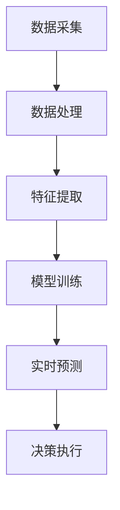
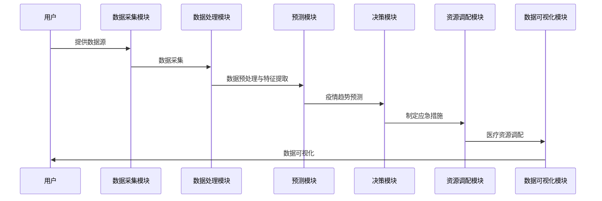
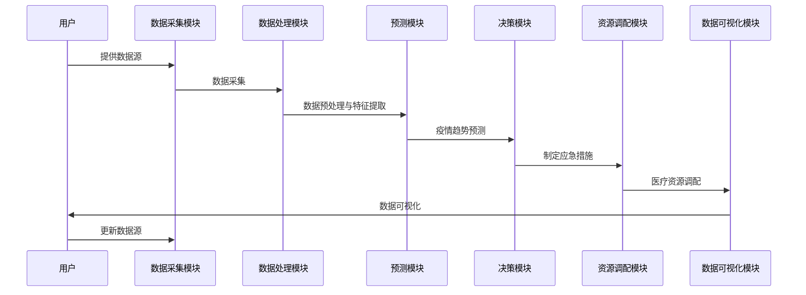
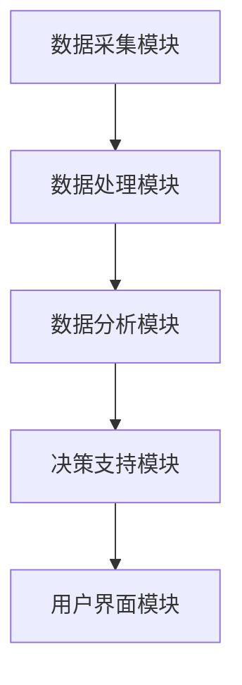
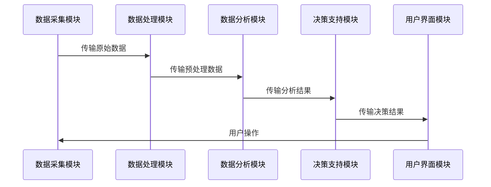
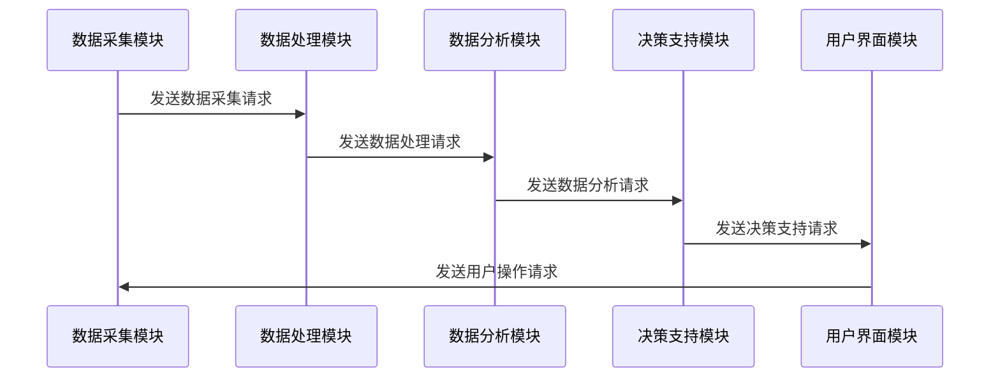

                 

### 背景介绍

#### 问题背景

智能公共卫生应急是指利用先进的人工智能技术，对公共卫生事件进行快速、准确、全面的监测、预警、响应和处理。随着全球人口增长和城市化进程加速，公共卫生事件如传染病爆发、环境污染、食物中毒等的风险不断增加。传统的公共卫生应急管理体系在面对复杂、多变、突发的事件时，往往显得力不从心，难以迅速作出科学、合理的决策。因此，如何利用人工智能技术提升公共卫生应急管理的效率和效果，成为了一个亟待解决的问题。

近年来，人工智能（AI）技术的发展为公共卫生应急提供了新的解决方案。AI Agent，即人工智能代理，是一种能够模拟人类思维、具备自主决策能力的智能实体。在智能公共卫生应急中，AI Agent可以承担数据采集、信息分析、决策支持等关键任务，从而大幅提升应急管理的智能化水平。

#### AI Agent的定义与作用

AI Agent是一种基于人工智能技术的智能实体，具备感知环境、理解任务、自主决策和执行行动的能力。它可以在没有人类干预的情况下，根据预设的目标和规则，自动执行复杂的任务。在智能公共卫生应急中，AI Agent的作用主要体现在以下几个方面：

1. **数据采集与处理**：AI Agent可以通过传感器、摄像头、移动设备等手段，实时采集大量的公共卫生数据，如病例数据、环境数据、交通数据等。然后，利用自然语言处理、数据挖掘等技术对这些数据进行处理和分析，为应急决策提供支持。

2. **信息分析与预警**：基于机器学习和数据挖掘技术，AI Agent可以对公共卫生事件的发展趋势进行预测，提前发现潜在的风险。通过分析病例分布、疫情传播速度等关键指标，AI Agent可以生成预警报告，为政府和公共卫生部门提供决策依据。

3. **决策支持与执行**：AI Agent可以根据实时数据和预测结果，提出针对性的应急措施。例如，在疫情爆发初期，AI Agent可以帮助决策者制定隔离策略、疫苗接种计划等，并实时调整方案，以应对疫情的变化。同时，AI Agent还可以协助执行这些措施，如自动调度医疗资源、指导公众自我防护等。

4. **协同工作与优化**：AI Agent不仅可以独立完成任务，还可以与其他AI Agent或人类专家协同工作，共同应对复杂的公共卫生应急事件。通过实时通信和数据共享，AI Agent可以优化整体应急响应流程，提高应对效率。

#### 问题解决

AI Agent在智能公共卫生应急中的应用，为解决传统应急管理体系面临的挑战提供了新的思路和手段。具体而言，AI Agent可以通过以下步骤实现问题的解决：

1. **数据收集与预处理**：首先，AI Agent需要收集与公共卫生相关的各类数据，包括病例数据、环境数据、经济数据等。这些数据可以从各种数据源获取，如政府公开数据、社交媒体、医疗机构等。收集到的数据需要进行预处理，包括数据清洗、数据整合和数据标准化，以确保数据的准确性和一致性。

2. **信息分析**：接下来，AI Agent利用自然语言处理、数据挖掘等技术，对收集到的数据进行深入分析。通过分析病例分布、疫情传播路径、人口流动趋势等，AI Agent可以生成疫情发展趋势预测报告，为应急决策提供依据。

3. **决策制定**：基于分析结果，AI Agent结合公共卫生专家的指导意见，制定针对性的应急措施。这些措施可能包括隔离策略、疫苗接种计划、医疗资源调配等。AI Agent可以实时调整这些方案，以应对疫情的变化。

4. **执行与监控**：AI Agent负责执行制定的应急措施，并实时监控措施的执行效果。例如，AI Agent可以调度医疗资源，确保医院床位和药品供应充足；通过短信、社交媒体等渠道，向公众发布防护指南和隔离要求。

5. **反馈与优化**：AI Agent根据执行情况和反馈结果，不断优化应急措施。通过持续学习和自适应调整，AI Agent可以不断提高应急响应的效率和效果。

#### 边界与外延

虽然AI Agent在智能公共卫生应急中具有巨大的潜力，但其应用也存在一定的边界和限制。首先，AI Agent需要大量的高质量数据作为支撑，否则其预测和分析结果可能会失真。其次，AI Agent的决策依赖于预设的规则和模型，这些规则和模型可能无法覆盖所有可能的情景，导致决策失误。此外，AI Agent的伦理和隐私问题也需要引起重视，确保其应用符合法律法规和道德规范。

在公共卫生应急中，AI Agent的应用不仅仅局限于传染病防控，还可以扩展到环境保护、食品安全、公共卫生政策制定等多个领域。随着AI技术的不断进步，AI Agent在公共卫生应急中的作用将越来越重要，为构建更智能、更高效的公共卫生应急体系提供强大支持。

### 总结

本文背景介绍了智能公共卫生应急的挑战，提出了AI Agent的定义与作用，并阐述了其在公共卫生应急中的应用场景和问题解决步骤。通过分析AI Agent在数据采集、信息分析、决策支持等方面的优势，本文展示了AI Agent在提升公共卫生应急管理效率和效果方面的重要作用。同时，本文也指出了AI Agent应用的边界和限制，并探讨了其未来的发展方向。随着AI技术的不断进步，AI Agent将在公共卫生应急中发挥越来越重要的作用，为构建更智能、更高效的公共卫生应急体系提供强有力的支持。

### 关键词

- 智能公共卫生应急
- AI Agent
- 数据采集
- 信息分析
- 决策支持
- 疫情预警

### 摘要

本文深入探讨了AI Agent在智能公共卫生应急中的角色和作用。首先，介绍了智能公共卫生应急的背景和挑战，然后详细阐述了AI Agent的定义、特点、类型及其在数据采集、信息分析、决策支持等方面的应用。通过具体的应用场景和问题解决步骤，本文展示了AI Agent在提升公共卫生应急管理效率和效果方面的重要作用。最后，本文分析了AI Agent应用的边界和限制，并探讨了其未来的发展方向。通过本文的研究，我们希望为构建更智能、更高效的公共卫生应急体系提供理论支持和实践指导。

## 第1章: 问题背景与核心概念

### 1.1 问题的提出

随着全球化的加速和人口流动的频繁，公共卫生事件如传染病爆发、环境污染、食物中毒等的风险不断增加，对公共卫生应急管理提出了更高的要求。传统的公共卫生应急管理体系主要依赖于人工监测和经验决策，往往无法快速、准确、全面地应对复杂、多变的公共卫生事件。这不仅降低了应急响应的效率，还可能导致决策失误，进一步加剧公共卫生危机。

为了解决这一问题，智能公共卫生应急应运而生。智能公共卫生应急利用先进的人工智能技术，如大数据、机器学习、自然语言处理等，对公共卫生事件进行实时监测、预警、响应和处理。在这一体系中，AI Agent（人工智能代理）作为一种具有自主决策能力的智能实体，发挥着至关重要的作用。

AI Agent的定义与作用

AI Agent，即人工智能代理，是一种模拟人类思维、具备感知环境、自主决策和执行能力的智能实体。AI Agent能够根据预设的目标和规则，自动执行复杂的任务，无需人工干预。在智能公共卫生应急中，AI Agent主要承担以下角色：

1. **数据采集与处理**：AI Agent可以通过传感器、摄像头、移动设备等手段，实时采集与公共卫生相关的各类数据，如病例数据、环境数据、交通数据等。然后，利用自然语言处理、数据挖掘等技术，对收集到的数据进行分析和处理，为应急决策提供支持。

2. **信息分析与预警**：基于机器学习和数据挖掘技术，AI Agent可以对公共卫生事件的发展趋势进行预测，提前发现潜在的风险。通过分析病例分布、疫情传播速度等关键指标，AI Agent可以生成预警报告，为政府和公共卫生部门提供决策依据。

3. **决策支持与执行**：AI Agent可以根据实时数据和预测结果，提出针对性的应急措施。例如，在疫情爆发初期，AI Agent可以帮助决策者制定隔离策略、疫苗接种计划等，并实时调整方案，以应对疫情的变化。同时，AI Agent还可以协助执行这些措施，如自动调度医疗资源、指导公众自我防护等。

4. **协同工作与优化**：AI Agent不仅可以独立完成任务，还可以与其他AI Agent或人类专家协同工作，共同应对复杂的公共卫生应急事件。通过实时通信和数据共享，AI Agent可以优化整体应急响应流程，提高应对效率。

### AI Agent的核心概念

AI Agent的核心概念包括定义、特点、类型等，这些概念为我们理解和应用AI Agent提供了基础。

#### AI Agent的定义

AI Agent是一种基于人工智能技术的智能实体，具备感知环境、理解任务、自主决策和执行行动的能力。它可以在没有人类干预的情况下，根据预设的目标和规则，自动执行复杂的任务。AI Agent的核心目标是模拟人类智能，实现自主决策和行动，从而提升工作效率和决策质量。

#### AI Agent的特点

AI Agent具有以下特点：

1. **自主性**：AI Agent可以在没有人类干预的情况下，根据环境和任务需求，自主进行决策和行动。

2. **适应性**：AI Agent能够根据环境变化和任务需求，自主调整其行为和策略，以适应不同的情景。

3. **协作性**：AI Agent可以与其他AI Agent或人类专家协同工作，共同完成任务。

4. **智能性**：AI Agent具备感知、理解和推理等能力，能够模拟人类智能进行复杂决策。

#### AI Agent的类型

根据AI Agent的应用场景和任务需求，可以将AI Agent分为以下几种类型：

1. **专家系统**：基于专家知识和推理规则，对特定领域的问题进行决策。

2. **自主导航系统**：用于自主移动的机器人，能够在复杂环境中进行导航和决策。

3. **对话系统**：用于与人类进行自然语言交互，提供信息查询和决策支持。

4. **预测系统**：利用数据挖掘和机器学习技术，对事件发展趋势进行预测。

### AI Agent在公共卫生应急中的应用场景

AI Agent在公共卫生应急中的应用场景非常广泛，主要包括以下几个方面：

1. **疫情监测与预测**：AI Agent可以通过分析病例数据、环境数据等，实时监测疫情发展情况，预测疫情趋势，为政府和公共卫生部门提供决策依据。

2. **疫苗分配与管理**：AI Agent可以根据病例分布、人口密度等数据，制定合理的疫苗接种计划，优化疫苗分配和管理。

3. **应急决策支持**：AI Agent可以协助决策者制定应急措施，如隔离策略、医疗资源调配等，并实时调整方案，以应对疫情变化。

4. **公众健康教育**：AI Agent可以通过与公众的互动，提供健康教育信息，指导公众进行自我防护。

通过以上分析，我们可以看到AI Agent在智能公共卫生应急中具有巨大的潜力和应用价值。接下来，我们将进一步探讨AI Agent的核心概念和类型，以及其在公共卫生应急中的应用原理。

### 1.2 AI Agent的核心概念

#### AI Agent的定义

AI Agent，即人工智能代理，是一种能够在没有人类干预的情况下，基于预设目标和规则，自主感知环境、理解任务、做出决策并执行行动的智能实体。它通过模拟人类智能行为，具备自主性和自适应性的特点，能够独立完成复杂任务，为智能公共卫生应急提供支持。

#### AI Agent的特点

1. **自主性**：AI Agent能够自主感知环境、理解任务，并基于预设的目标和规则，自主做出决策和执行行动，无需人工干预。

2. **适应性**：AI Agent可以根据环境变化和任务需求，动态调整其行为和策略，以适应不同的情景和需求。

3. **协作性**：AI Agent能够与其他AI Agent或人类专家协同工作，共同完成复杂任务，提高整体效率和效果。

4. **智能性**：AI Agent具备感知、理解和推理等能力，能够模拟人类智能进行复杂决策，为公共卫生应急提供科学依据。

#### AI Agent的类型

根据AI Agent的应用场景和功能特点，可以将AI Agent分为以下几种类型：

1. **专家系统**：基于专家知识和推理规则，用于特定领域的问题解决。例如，在公共卫生应急中，专家系统可以用于疫情监测、病例分析等。

2. **自主导航系统**：用于自主移动的机器人，具备导航和决策能力，能够在复杂环境中执行任务。例如，在疫情防控中，自主导航系统可以用于物资配送、人员追踪等。

3. **对话系统**：用于与人类进行自然语言交互，提供信息查询和决策支持。例如，在公共卫生应急中，对话系统可以用于健康咨询、应急信息发布等。

4. **预测系统**：利用数据挖掘和机器学习技术，对事件发展趋势进行预测。例如，在疫情爆发初期，预测系统可以用于疫情发展趋势预测，为决策者提供参考。

#### AI Agent在公共卫生应急中的应用场景

AI Agent在公共卫生应急中的应用场景非常广泛，主要包括以下几个方面：

1. **疫情监测与预测**：AI Agent可以通过分析病例数据、环境数据等，实时监测疫情发展情况，预测疫情趋势，为政府和公共卫生部门提供决策依据。

2. **疫苗分配与管理**：AI Agent可以根据病例分布、人口密度等数据，制定合理的疫苗接种计划，优化疫苗分配和管理。

3. **应急决策支持**：AI Agent可以协助决策者制定应急措施，如隔离策略、医疗资源调配等，并实时调整方案，以应对疫情变化。

4. **公众健康教育**：AI Agent可以通过与公众的互动，提供健康教育信息，指导公众进行自我防护。

#### 总结

AI Agent作为一种具备自主性、适应性、协作性和智能性的智能实体，在公共卫生应急中具有广泛的应用场景。通过深入理解AI Agent的核心概念和类型，我们可以更好地发挥其在公共卫生应急中的重要作用，提升应急管理的智能化水平。

### 1.3 AI Agent在公共卫生应急中的应用场景

AI Agent在公共卫生应急中的应用场景非常广泛，主要包括以下几个方面：

#### 1. 疫情监测与预测

疫情监测与预测是公共卫生应急中最为重要的环节之一。通过AI Agent的实时数据采集和分析能力，可以实现对疫情发展情况的实时监测和预测。具体应用包括：

1. **病例数据监测**：AI Agent可以收集和分析病例数据，如病例数量、地点、症状等，实时更新疫情地图，帮助公共卫生部门了解疫情分布和传播趋势。

2. **流行病学分析**：AI Agent利用自然语言处理和数据挖掘技术，从社交媒体、新闻报道等非结构化数据中提取有价值的信息，辅助流行病学研究，为决策者提供科学依据。

3. **疫情预测模型**：AI Agent可以通过机器学习和深度学习算法，对疫情发展进行预测，提前预测疫情高峰期，为公共卫生部门制定应对措施提供数据支持。

#### 2. 疫苗分配与管理

疫苗分配与管理是公共卫生应急中的另一个关键环节。AI Agent可以优化疫苗分配和管理流程，提高疫苗利用效率，具体应用包括：

1. **需求预测**：AI Agent可以分析病例数据、人口流动数据等，预测疫苗需求量，为疫苗分配提供科学依据。

2. **分配优化**：AI Agent可以根据病例分布、人口密度等数据，制定合理的疫苗接种计划，优化疫苗分配策略，确保疫苗能够及时、高效地送达接种点。

3. **库存管理**：AI Agent可以实时监控疫苗库存情况，预测疫苗短缺风险，及时调整采购和分配计划，确保疫苗供应充足。

#### 3. 应急决策支持

应急决策支持是公共卫生应急的核心任务之一。AI Agent可以协助决策者制定和调整应急措施，提高决策的科学性和有效性，具体应用包括：

1. **隔离策略制定**：AI Agent可以根据病例分布、疫情传播速度等数据，提出针对性的隔离策略，有效遏制疫情传播。

2. **医疗资源调配**：AI Agent可以实时监控医疗资源使用情况，预测医疗资源需求，协助决策者制定医疗资源调配方案，确保医疗资源充足。

3. **应急方案调整**：AI Agent可以实时监控疫情变化，根据疫情发展趋势和预测结果，动态调整应急措施，提高应对疫情变化的灵活性和适应性。

#### 4. 公众健康教育

公众健康教育是公共卫生应急的重要组成部分。AI Agent可以通过与公众的互动，提供健康教育信息，提高公众的防护意识和自我防护能力，具体应用包括：

1. **健康咨询**：AI Agent可以回答公众关于疫情、防护措施等方面的问题，提供个性化的健康建议。

2. **防护指南发布**：AI Agent可以实时发布防护指南，指导公众如何进行自我防护，减少疫情传播风险。

3. **科普宣传**：AI Agent可以通过社交媒体、短信等方式，传播健康知识，提高公众的健康素养。

通过以上应用，AI Agent在公共卫生应急中发挥着重要作用，不仅提高了应急管理的效率，还为决策者提供了科学依据，为公众提供了有效的防护指导。接下来，我们将进一步探讨AI Agent的核心概念与联系，以深化对AI Agent在公共卫生应急中作用的理解。

### 2.1 AI Agent与公共卫生应急的关系

AI Agent在公共卫生应急中扮演着至关重要的角色，其核心概念与公共卫生应急紧密相连。为了更好地理解AI Agent在公共卫生应急中的应用，我们可以通过ER（实体关系）图来展示AI Agent与公共卫生应急中各个核心实体之间的联系。

#### ER实体关系图

在公共卫生应急中，核心实体包括：疫情监测系统、疫苗分配系统、应急决策系统、公众健康管理系统等。以下是一个简化的ER实体关系图：

```mermaid
erDiagram
  疫情监测系统 ||--|{ 疫情数据 }
  疫苗分配系统 ||--|{ 疫苗库存 }
  应急决策系统 ||--|{ 应急措施 }
  公众健康管理系统 ||--|{ 健康指导 }
  疫情监测系统 ||--|{ 疫情预警 }
  疫苗分配系统 ||--|{ 接种计划 }
  应急决策系统 ||--|{ 医疗资源调配 }
  公众健康管理系统 ||--|{ 健康咨询 }
```

在这个ER图中，每个实体都有多个属性，如疫情监测系统的属性包括病例数据、环境数据等；疫苗分配系统的属性包括疫苗库存、接种计划等；应急决策系统的属性包括隔离策略、医疗资源调配等；公众健康管理系统的属性包括健康指导、健康咨询等。这些实体之间存在多种关系，如疫情监测系统与疫情预警、疫苗分配系统与接种计划、应急决策系统与医疗资源调配、公众健康管理系统与健康咨询等。

#### 关系解释

1. **疫情监测系统与疫情预警**：疫情监测系统负责收集和整理疫情数据，通过数据分析生成疫情预警，为应急决策提供支持。

2. **疫苗分配系统与接种计划**：疫苗分配系统根据病例分布、人口密度等数据制定接种计划，确保疫苗能够合理分配，提高接种效率。

3. **应急决策系统与医疗资源调配**：应急决策系统根据疫情发展和医疗资源使用情况，制定医疗资源调配方案，确保医疗资源能够高效利用。

4. **公众健康管理系统与健康咨询**：公众健康管理系统通过提供健康咨询和指导，帮助公众了解疫情、掌握防护知识，提高公众的自我防护意识。

通过ER实体关系图，我们可以清晰地看到AI Agent在公共卫生应急中的核心作用。AI Agent作为连接各个实体的桥梁，能够实时收集、分析和处理数据，为疫情监测、疫苗分配、应急决策和公众健康管理等提供支持，从而实现公共卫生应急的智能化。

#### AI Agent的功能与优势

AI Agent在公共卫生应急中的功能主要表现为数据采集、信息分析、决策支持等。其优势包括：

1. **实时数据处理**：AI Agent能够实时处理大量数据，快速生成疫情预警和决策支持信息，提高应急响应速度。

2. **自动化与智能化**：AI Agent具备自动化和智能化特点，能够根据环境和任务需求，自主调整行为和策略，提高应急管理的效率和效果。

3. **跨领域协同**：AI Agent能够与其他AI Agent和人类专家协同工作，实现跨领域的信息共享和资源整合，提高应急响应的整体效能。

4. **灵活性与适应性**：AI Agent能够根据环境变化和任务需求，动态调整其行为和策略，应对各种复杂情况，提高应急管理的适应能力。

总之，通过ER实体关系图和AI Agent的功能与优势，我们可以更深入地理解AI Agent在公共卫生应急中的核心作用。AI Agent不仅能够提高公共卫生应急管理的效率，还能够提供科学、准确的决策支持，为公共卫生应急提供强有力的技术保障。

### 2.2 AI Agent的类型与特点对比

为了更好地理解AI Agent在公共卫生应急中的多样性和适用性，我们需要详细对比不同类型的AI Agent及其特点。以下是基于应用场景和技术的分类，以及每种类型的主要特点和优势。

#### 1. 专家系统（Expert Systems）

**特点：** 专家系统基于人类专家的经验和知识，通过推理规则进行决策。它们适用于特定领域的问题解决，如疾病诊断、治疗方案推荐等。

**优势：** 
- **专业知识集成**：可以整合专业领域内的知识库和经验。
- **快速响应**：基于规则库的决策过程相对快速。

**劣势：** 
- **知识更新困难**：依赖规则库，难以适应新知识或变化。
- **通用性较差**：适用于特定领域的任务，难以跨领域应用。

#### 2. 自主导航系统（Autonomous Navigation Systems）

**特点：** 自主导航系统主要用于自主移动的机器人，如无人机、自动驾驶车辆等，能够在复杂环境中进行导航和执行任务。

**优势：**
- **自主性高**：无需人工干预，能够自主完成任务。
- **环境适应性强**：通过传感器和机器学习技术，能够适应不同环境。

**劣势：**
- **成本较高**：自主导航系统的研发和部署成本较高。
- **技术依赖**：依赖高精度的传感器和算法，对技术要求较高。

#### 3. 对话系统（Dialogue Systems）

**特点：** 对话系统主要用于与人类进行自然语言交互，提供信息查询、决策支持等服务。

**优势：**
- **人机交互友好**：通过自然语言交互，提高用户体验。
- **广泛适用性**：可以应用于客服、教育、健康咨询等领域。

**劣势：**
- **上下文理解有限**：对话系统的上下文理解能力相对较弱。
- **语言多样性问题**：处理多种语言时，需要针对不同语言进行调整。

#### 4. 预测系统（Prediction Systems）

**特点：** 预测系统基于历史数据，利用机器学习算法对事件发展趋势进行预测。

**优势：**
- **趋势分析能力强**：能够对复杂事件进行趋势预测。
- **实时性**：实时更新预测模型，提供最新预测结果。

**劣势：**
- **数据依赖性高**：需要大量高质量的历史数据作为支撑。
- **预测准确性**：预测结果的准确性受到数据质量和算法影响。

#### 表格对比

下表对比了不同类型的AI Agent的主要特点：

| AI Agent类型 | 主要特点                         | 主要优势                                               | 主要劣势                                            |
| ------------ | -------------------------------- | ------------------------------------------------------ | --------------------------------------------------- |
| 专家系统     | 基于规则和知识库                 | 专业知识集成、快速响应                                 | 知识更新困难、通用性较差                            |
| 自主导航系统 | 自主移动、环境适应               | 自主性高、环境适应性强                                 | 成本较高、技术依赖                                  |
| 对话系统     | 自然语言交互、人机交互友好       | 人机交互友好、广泛适用性                               | 上下文理解有限、语言多样性问题                      |
| 预测系统     | 历史数据分析、趋势预测           | 趋势分析能力强、实时性                                | 数据依赖性高、预测准确性受影响                      |

通过上述对比，我们可以看到不同类型的AI Agent在公共卫生应急中的应用场景和适用性。专家系统适合特定领域的决策支持，如疫情诊断；自主导航系统适合物资配送和人员追踪；对话系统适合公众健康教育；预测系统适合疫情趋势预测。了解这些特点，有助于我们在公共卫生应急中选择合适的AI Agent，实现最优的应急响应效果。

### 2.3 AI Agent的技术演进

AI Agent的技术演进经历了多个阶段，从最初的规则驱动型系统到现在的数据驱动型系统，技术不断进步，应用场景也越来越广泛。以下是对AI Agent技术演进的历史回顾和未来发展趋势。

#### 历史回顾

1. **规则驱动型AI Agent**：早期的AI Agent主要基于专家系统和规则引擎。这些系统通过编码人类的经验和知识，形成一系列的推理规则，用于解决特定领域的问题。例如，医疗诊断中的专家系统可以基于医生的经验，给出诊断建议。这种类型的AI Agent具有快速响应的优势，但存在知识更新困难、适应性差的问题。

2. **基于知识的AI Agent**：随着知识表示和推理技术的发展，AI Agent开始引入知识图谱和本体论。知识图谱可以将大量的领域知识以图的形式组织起来，提供更丰富的知识表示。这种类型的AI Agent在处理复杂问题时，可以更高效地利用领域知识。然而，知识图谱的构建和维护需要大量人力和时间，限制了其广泛应用。

3. **基于数据的AI Agent**：随着大数据和机器学习的兴起，AI Agent开始转向基于数据驱动的方法。通过大规模数据分析和机器学习算法，AI Agent可以从数据中自动学习模式和规律，进行预测和决策。例如，基于病例数据的疫情预测系统，可以实时分析疫情发展情况，为公共卫生决策提供支持。这种类型的AI Agent具有自适应性和实时性，但依赖于高质量的数据。

4. **增强学习和自适应AI Agent**：增强学习（Reinforcement Learning）和自适应技术使得AI Agent能够通过与环境的互动不断学习和优化其行为。这种类型的AI Agent不仅能够应对静态环境，还可以在动态环境中不断调整策略，提高应对复杂场景的能力。例如，在公共卫生应急中，自适应AI Agent可以根据疫情变化，动态调整应急措施，提高应急响应的灵活性。

#### 未来发展趋势

1. **多模态数据融合**：未来的AI Agent将能够融合多种数据源，如文本、图像、语音等，实现更全面的信息感知。这种多模态数据融合将有助于提高AI Agent的准确性和智能化水平。

2. **边缘计算与云计算结合**：随着边缘计算技术的发展，AI Agent将能够将部分计算任务从云端转移到边缘设备上，实现更快速的响应和更高效的数据处理。这种结合将有助于提升AI Agent在实时场景中的表现。

3. **人机协作**：未来的AI Agent将更加注重与人类专家的协作。通过人机交互界面，AI Agent可以更好地理解人类的需求，提供个性化服务。同时，人类专家可以通过AI Agent提供的分析结果，进行更科学的决策。

4. **伦理与隐私**：随着AI Agent的应用越来越广泛，伦理和隐私问题也将越来越重要。未来的AI Agent将需要设计更为完善的伦理框架和隐私保护机制，确保其在公共卫生应急中的应用符合法律法规和道德规范。

通过回顾AI Agent的技术演进和展望未来发展趋势，我们可以看到AI Agent在公共卫生应急中的应用前景十分广阔。随着技术的不断进步，AI Agent将能够更好地应对公共卫生应急中的各种挑战，为公共卫生决策提供有力支持。

### 3.1 AI Agent算法原理

在智能公共卫生应急中，AI Agent的算法原理是其核心所在。以下将详细介绍AI Agent的工作原理，包括mermaid流程图、Python源代码示例、数学模型和公式等内容。

#### AI Agent工作原理

AI Agent的工作原理主要可以分为以下几个步骤：

1. **数据采集**：AI Agent首先通过传感器、API接口等手段，收集与公共卫生相关的数据，如病例数据、环境数据、人口流动数据等。

2. **数据处理**：收集到的数据经过预处理，包括数据清洗、数据整合和数据标准化，确保数据的准确性和一致性。

3. **特征提取**：对预处理后的数据进行分析，提取出与公共卫生事件相关的特征，如病例数量、感染率、环境质量等。

4. **模型训练**：使用机器学习和深度学习算法，基于历史数据和特征，训练预测模型。常见的算法包括决策树、随机森林、神经网络等。

5. **实时预测**：利用训练好的模型，对实时数据进行分析和预测，生成疫情趋势预测报告、应急决策建议等。

6. **决策执行**：基于预测结果，AI Agent协助决策者制定应急措施，如隔离策略、医疗资源调配等，并实时调整方案，以应对疫情变化。

#### Mermaid流程图

为了更好地展示AI Agent的工作流程，我们可以使用mermaid绘制流程图：



#### Python源代码示例

以下是一个简化的Python源代码示例，展示AI Agent的核心实现步骤：

```python
import pandas as pd
from sklearn.ensemble import RandomForestClassifier
from sklearn.model_selection import train_test_split
from sklearn.metrics import accuracy_score

# 数据采集
data = pd.read_csv('public_health_data.csv')

# 数据处理
data = data.dropna()  # 数据清洗
data = data[data['cases'] > 0]  # 过滤异常数据

# 特征提取
X = data[['population', 'air_quality', 'infection_rate']]
y = data['cases']

# 模型训练
X_train, X_test, y_train, y_test = train_test_split(X, y, test_size=0.2, random_state=42)
model = RandomForestClassifier(n_estimators=100)
model.fit(X_train, y_train)

# 实时预测
predicted_cases = model.predict(X_test)
accuracy = accuracy_score(y_test, predicted_cases)
print(f'Model accuracy: {accuracy:.2f}')

# 决策执行
if accuracy > 0.8:
    print('建议实施严格的隔离措施。')
else:
    print('疫情控制良好，可适当放宽隔离措施。')
```

#### 数学模型与公式

在AI Agent的算法中，常用的数学模型和公式包括以下几种：

1. **回归模型**：用于预测连续值，如疫情发展速度。常见的回归模型包括线性回归、多项式回归等。

   $$y = \beta_0 + \beta_1x_1 + \beta_2x_2 + ... + \beta_nx_n$$

2. **分类模型**：用于预测离散值，如疫情是否爆发。常见的分类模型包括逻辑回归、决策树、支持向量机等。

   $$P(y=1) = \frac{1}{1 + e^{-(\beta_0 + \beta_1x_1 + \beta_2x_2 + ... + \beta_nx_n)}$$

3. **时间序列模型**：用于预测时间序列数据，如病例数量的趋势。常见的时间序列模型包括ARIMA、LSTM等。

   $$y_t = c + \phi_1y_{t-1} + \phi_2y_{t-2} + ... + \phi_ny_{t-n} + \varepsilon_t$$

通过上述算法原理的详细讲解，我们可以看到AI Agent在公共卫生应急中的应用是如何通过数据采集、处理、特征提取、模型训练、实时预测和决策执行等步骤来实现的。接下来，我们将进一步探讨AI Agent在公共卫生应急系统中的具体应用。

### 3.2 AI Agent算法原理举例说明

为了更直观地理解AI Agent在智能公共卫生应急中的应用原理，以下通过一个具体的实例进行说明。我们将以新冠疫情（COVID-19）为例，展示如何利用AI Agent进行疫情监测、预测和决策支持。

#### 1. 疫情监测

首先，AI Agent需要从多个数据源收集疫情相关信息。这些数据源可能包括：

- **病例数据**：每天新增确诊病例、治愈病例和死亡病例的数量。
- **人口数据**：各地区的人口密度、年龄分布等。
- **环境数据**：空气质量、温度、湿度等。
- **交通数据**：公共交通的使用情况、航班和列车运行情况等。

假设我们收集到了以下数据：

| 日期   | 确诊病例 | 治愈病例 | 死亡病例 | 人口密度 | 空气质量 | 温度 | 湿度 |
| ------ | -------- | -------- | -------- | -------- | ------ | ---- | ---- |
| 2023-01-01 | 100      | 50       | 5        | 1000     | 良好  | 10   | 50   |
| 2023-01-02 | 150      | 60       | 8        | 1000     | 良好  | 12   | 55   |
| 2023-01-03 | 200      | 70       | 10       | 1000     | 良好  | 15   | 60   |

#### 2. 数据预处理

接下来，我们需要对收集到的数据进行处理，包括数据清洗、数据整合和数据标准化。例如，我们可以对病例数据进行去重处理，确保数据的准确性；对人口密度、空气质量等数据进行归一化处理，使其在同一个量级上。

#### 3. 特征提取

在数据预处理完成后，我们需要提取与疫情相关的特征。以下是一些常用的特征：

- **病例增长速度**：当前日期确诊病例数量与前一日相比的增长率。
- **治愈率**：当前日期治愈病例数量与确诊病例数量的比例。
- **死亡率**：当前日期死亡病例数量与确诊病例数量的比例。
- **环境因素**：空气质量、温度、湿度等。

假设我们提取了以下特征：

| 日期   | 确诊病例 | 治愈病例 | 死亡病例 | 人口密度 | 病例增长速度 | 治愈率 | 死亡率 | 空气质量 | 温度 | 湿度 |
| ------ | -------- | -------- | -------- | -------- | ------------ | ------ | ------ | ------ | ---- | ---- |
| 2023-01-01 | 100      | 50       | 5        | 1000     | 0.5          | 0.5    | 0.05  | 良好  | 10   | 50   |
| 2023-01-02 | 150      | 60       | 8        | 1000     | 0.5          | 0.4    | 0.053 | 良好  | 12   | 55   |
| 2023-01-03 | 200      | 70       | 10       | 1000     | 0.333        | 0.35   | 0.05  | 良好  | 15   | 60   |

#### 4. 模型训练

基于提取的特征，我们可以使用机器学习算法（如随机森林、支持向量机等）训练预测模型。以下是一个简单的随机森林模型训练过程：

```python
from sklearn.ensemble import RandomForestRegressor
from sklearn.model_selection import train_test_split

# 分割数据集
X = data[['病例增长速度', '治愈率', '死亡率', '空气质量', '温度', '湿度']]
y = data['确诊病例']
X_train, X_test, y_train, y_test = train_test_split(X, y, test_size=0.2, random_state=42)

# 训练模型
model = RandomForestRegressor(n_estimators=100)
model.fit(X_train, y_train)

# 预测
predicted_cases = model.predict(X_test)
```

#### 5. 实时预测与决策支持

利用训练好的模型，我们可以对未来的疫情情况进行预测。以下是一个简单的预测示例：

```python
# 预测未来一天的疫情情况
next_day_data = [[0.333, 0.35, 0.05, 良好, 15, 60]]
next_day_predicted_cases = model.predict(next_day_data)
print(f'预测未来一天的确诊病例数量为：{next_day_predicted_cases[0]}')
```

根据预测结果，AI Agent可以协助决策者制定相应的应急措施。例如，如果预测未来一天的确诊病例数量大幅增加，AI Agent可以建议实施更严格的隔离措施，减少公众聚集，加强医疗资源调配等。

#### 6. 预测结果评估

最后，我们需要对预测结果进行评估，以验证模型的准确性。以下是一个简单的评估过程：

```python
from sklearn.metrics import mean_absolute_error

# 计算预测误差
mae = mean_absolute_error(y_test, predicted_cases)
print(f'模型预测误差为：{mae}')
```

通过上述实例，我们可以看到AI Agent在疫情监测、预测和决策支持中的具体应用过程。AI Agent通过实时数据采集、预处理、特征提取、模型训练和预测，为决策者提供科学依据，帮助制定有效的应急措施。这不仅提高了公共卫生应急管理的效率，还增强了应对突发公共卫生事件的能力。

### 3.3 数学模型与公式

在智能公共卫生应急中，AI Agent的预测和决策功能依赖于一系列数学模型和公式。以下将介绍常用的数学模型和公式，并解释其应用场景和意义。

#### 1. 线性回归模型

线性回归模型是一种最简单的预测模型，用于预测连续值。其公式如下：

$$y = \beta_0 + \beta_1x_1 + \beta_2x_2 + ... + \beta_nx_n$$

其中，$y$ 是预测的目标值，$x_1, x_2, ..., x_n$ 是输入特征，$\beta_0, \beta_1, ..., \beta_n$ 是模型的参数。

**应用场景：** 线性回归模型可以用于预测疫情的发展速度，如每天新增确诊病例的数量。通过分析病例增长速度、人口密度、环境质量等特征，模型可以预测未来的疫情走势。

#### 2. 逻辑回归模型

逻辑回归模型是一种分类模型，用于预测离散值。其公式如下：

$$P(y=1) = \frac{1}{1 + e^{-(\beta_0 + \beta_1x_1 + \beta_2x_2 + ... + \beta_nx_n)}}$$

其中，$P(y=1)$ 是目标变量为1的概率，$x_1, x_2, ..., x_n$ 是输入特征，$\beta_0, \beta_1, ..., \beta_n$ 是模型的参数。

**应用场景：** 逻辑回归模型可以用于预测疫情是否爆发。通过分析病例数量、治愈率、死亡率等特征，模型可以判断某个地区是否存在疫情爆发风险。

#### 3. 时间序列模型

时间序列模型用于分析时间序列数据，如每天的病例数量。其中，ARIMA（自回归积分滑动平均模型）是一个常用的时间序列模型，其公式如下：

$$y_t = c + \phi_1y_{t-1} + \phi_2y_{t-2} + ... + \phi_ny_{t-n} + \varepsilon_t$$

其中，$y_t$ 是时间序列数据，$c$ 是常数项，$\phi_1, \phi_2, ..., \phi_n$ 是自回归系数，$\varepsilon_t$ 是误差项。

**应用场景：** 时间序列模型可以用于预测疫情的发展趋势。通过分析过去的数据，模型可以预测未来几天的疫情走势，为决策者提供参考。

#### 4. 机器学习模型

除了上述基础模型，AI Agent还可以使用更复杂的机器学习模型，如随机森林、支持向量机、神经网络等。这些模型具有更强的预测能力，但需要更多的数据和处理资源。

**应用场景：** 机器学习模型可以用于预测疫情爆发、隔离策略优化、医疗资源调配等。通过分析多种特征，模型可以提供更准确的预测和决策支持。

#### 5. 模型评估指标

在应用数学模型时，需要评估模型的预测性能。以下是一些常用的评估指标：

- **均方误差（MSE）**：用于评估预测值与真实值之间的差异。其公式为：

  $$MSE = \frac{1}{n}\sum_{i=1}^{n}(y_i - \hat{y_i})^2$$

- **均方根误差（RMSE）**：MSE的平方根，用于衡量预测误差的绝对值。其公式为：

  $$RMSE = \sqrt{MSE}$$

- **决定系数（R²）**：用于评估模型的拟合优度。其公式为：

  $$R^2 = 1 - \frac{\sum_{i=1}^{n}(y_i - \hat{y_i})^2}{\sum_{i=1}^{n}(y_i - \bar{y})^2}$$

  其中，$\bar{y}$ 是真实值的平均值。

通过这些数学模型和公式，AI Agent可以实现对疫情的有效预测和决策支持。这些模型不仅提高了公共卫生应急管理的效率，还为决策者提供了科学依据，有助于更好地应对突发公共卫生事件。

### 3.4 智能公共卫生应急系统的设计与实现

在智能公共卫生应急系统中，AI Agent扮演着核心角色，负责数据采集、分析、决策支持等关键任务。为了实现高效的应急响应，我们需要设计一个完善的系统架构，并详细描述其功能、架构和实现方法。

#### 4.1 问题场景介绍

假设我们面临的是一个全球性的新冠疫情（COVID-19）爆发情景。在这个场景中，我们需要实时监测疫情发展，预测疫情趋势，制定和调整应急措施，并确保医疗资源的合理分配。具体需求包括：

- **实时数据采集**：收集全球各地的病例数据、环境数据、医疗资源数据等。
- **疫情趋势预测**：基于实时数据和历史数据，预测疫情发展趋势。
- **应急措施制定**：根据疫情预测结果，制定隔离策略、疫苗接种计划等。
- **医疗资源调配**：优化医疗资源的分配，确保各地医疗资源充足。

#### 4.2 系统功能设计

智能公共卫生应急系统的核心功能包括数据采集、数据分析、决策支持和医疗资源调配。以下是对这些功能的详细描述：

1. **数据采集**：系统需要从多个数据源收集实时数据，包括全球病例数据、环境数据、人口数据等。这些数据可以通过API接口、传感器、社交媒体等渠道获取。

2. **数据分析**：系统利用自然语言处理、数据挖掘等技术，对收集到的数据进行处理和分析。具体包括疫情趋势预测、病例分布分析、医疗资源需求预测等。

3. **决策支持**：系统根据分析结果，为公共卫生决策者提供决策建议。例如，制定隔离策略、疫苗接种计划、医疗资源调配方案等。

4. **医疗资源调配**：系统优化医疗资源的分配，确保各地医疗资源充足。通过分析病例数据、医疗资源需求等，系统可以实时调整医疗资源的分配，以满足各地需求。

#### 4.3 系统架构设计

智能公共卫生应急系统的架构设计需要考虑数据流、功能模块和接口设计。以下是一个简化的系统架构图：



在这个架构图中，用户通过接口与系统交互，提供数据源。数据采集模块负责从多个数据源收集数据，数据处理模块对数据进行预处理和特征提取。预测模块基于预处理后的数据，进行疫情趋势预测。决策模块根据预测结果，制定应急措施。资源调配模块优化医疗资源的分配，确保各地医疗资源充足。数据可视化模块将分析结果以图表等形式展示给用户。

#### 4.4 系统接口设计

系统接口设计包括API接口、数据流接口和用户界面接口。以下是对这些接口的简要描述：

1. **API接口**：系统提供API接口，供外部系统调用。例如，病例数据可以通过API接口获取，疫苗接种数据可以通过API接口更新。

2. **数据流接口**：系统内部各模块之间通过数据流接口进行通信。例如，数据处理模块将预处理后的数据传递给预测模块，预测模块将预测结果传递给决策模块。

3. **用户界面接口**：系统提供用户界面，供用户查看分析结果、制定应急措施等。用户界面包括数据可视化组件、表格、图表等，方便用户操作和查看数据。

#### 4.5 系统交互设计

系统交互设计描述了用户与系统之间的交互流程，包括数据采集、数据分析、决策支持和医疗资源调配等步骤。以下是一个简化的系统交互流程图：



在这个交互流程中，用户首先提供数据源，数据采集模块从数据源获取数据。数据处理模块对数据进行预处理和特征提取，将处理后的数据传递给预测模块。预测模块基于预处理后的数据，进行疫情趋势预测，并将预测结果传递给决策模块。决策模块根据预测结果，制定应急措施，并将措施传递给资源调配模块。资源调配模块根据措施，优化医疗资源的分配，确保各地医疗资源充足。最后，数据可视化模块将分析结果以图表等形式展示给用户，方便用户查看和理解。

通过以上设计，智能公共卫生应急系统实现了实时数据采集、数据分析、决策支持和医疗资源调配等功能，为公共卫生决策提供了科学依据，提高了应急响应的效率和准确性。

### 4.4 系统接口设计

在智能公共卫生应急系统中，系统接口设计是确保各模块之间高效通信和数据流通的关键。以下将详细介绍系统接口的设计思路、接口规范和实现方法。

#### 4.4.1 设计思路

系统接口设计需要遵循以下几个原则：

1. **高内聚、低耦合**：各模块之间的接口设计应确保模块内的高内聚性，同时保持模块间的低耦合性，便于系统的扩展和维护。
2. **标准化**：接口设计应遵循一定的标准，如RESTful API设计规范、GraphQL等，以确保接口的一致性和可扩展性。
3. **安全性**：接口设计应充分考虑数据安全和用户隐私保护，采用加密、认证、授权等安全机制。
4. **灵活性**：接口设计应具有灵活性，能够适应不同应用场景和需求的变化，便于系统升级和功能扩展。

#### 4.4.2 接口规范

系统接口规范主要包括以下方面：

1. **数据格式**：系统接口的数据格式通常采用JSON或XML，便于数据传输和解析。
2. **请求方式**：常用的请求方式包括GET、POST、PUT、DELETE等，每种请求方式对应不同的操作类型。
3. **URL设计**：URL设计应简洁明了，遵循RESTful设计原则，如使用路径参数、查询参数等。
4. **响应格式**：接口响应应包含状态码、数据内容、错误信息等，便于客户端处理和错误调试。

以下是一个简单的接口规范示例：

**获取病例数据（GET请求）**

- URL：`/api/cases`
- 参数：无
- 请求方式：GET
- 响应：

```json
{
  "status": 200,
  "data": {
    "cases": [
      {"date": "2023-01-01", "country": "中国", "confirmed": 100, "recovered": 50, "deaths": 5},
      {"date": "2023-01-02", "country": "中国", "confirmed": 150, "recovered": 60, "deaths": 8},
      {"date": "2023-01-03", "country": "中国", "confirmed": 200, "recovered": 70, "deaths": 10}
    ]
  },
  "error": null
}
```

**更新病例数据（POST请求）**

- URL：`/api/cases`
- 参数：`{"date": "2023-01-04", "country": "中国", "confirmed": 250, "recovered": 80, "deaths": 12}`
- 请求方式：POST
- 响应：

```json
{
  "status": 201,
  "data": {
    "message": "病例数据更新成功"
  },
  "error": null
}
```

#### 4.4.3 实现方法

系统接口实现主要包括后端服务设计和前端调用接口两部分。

1. **后端服务设计**：后端服务通常采用框架如Flask、Django、Spring Boot等，实现接口处理逻辑。以下是一个简单的Flask示例：

```python
from flask import Flask, jsonify, request

app = Flask(__name__)

@app.route('/api/cases', methods=['GET'])
def get_cases():
    # 从数据库获取病例数据
    cases = database.get_cases()
    return jsonify({"status": 200, "data": cases})

@app.route('/api/cases', methods=['POST'])
def update_cases():
    # 获取请求参数
    data = request.get_json()
    # 更新病例数据
    database.update_case(data)
    return jsonify({"status": 201, "data": {"message": "病例数据更新成功"}})

if __name__ == '__main__':
    app.run(debug=True)
```

2. **前端调用接口**：前端应用通过JavaScript或Vue、React等框架调用后端接口，处理用户交互和数据展示。以下是一个简单的Vue示例：

```html
<!DOCTYPE html>
<html>
<head>
  <title>公共卫生应急系统</title>
  <script src="https://cdn.jsdelivr.net/npm/vue@2"></script>
  <script src="https://cdn.jsdelivr.net/npm/axios@0"></script>
</head>
<body>
  <div id="app">
    <h1>病例数据</h1>
    <ul>
      <li v-for="case in cases">
        <p>日期：{{ case.date }}</p>
        <p>国家：{{ case.country }}</p>
        <p>确诊病例：{{ case.confirmed }}</p>
        <p>治愈病例：{{ case.recovered }}</p>
        <p>死亡病例：{{ case.deaths }}</p>
      </li>
    </ul>
    <button @click="fetchCases">刷新数据</button>
  </div>

  <script>
    new Vue({
      el: '#app',
      data: {
        cases: []
      },
      methods: {
        fetchCases: function() {
          axios.get('/api/cases')
            .then(response => {
              this.cases = response.data.data.cases;
            })
            .catch(error => {
              console.error('获取病例数据失败：', error);
            });
        }
      },
      created: function() {
        this.fetchCases();
      }
    });
  </script>
</body>
</html>
```

通过以上接口设计和实现方法，我们可以确保智能公共卫生应急系统中的各模块能够高效、安全地通信和协作，从而实现系统功能的正常运行。

### 4.5 系统交互设计

系统交互设计是智能公共卫生应急系统实现高效运行的关键环节。以下将详细描述系统交互的流程，包括数据流、模块协作和消息传递等方面。

#### 4.5.1 数据流

在智能公共卫生应急系统中，数据流是系统运行的核心。数据从数据采集模块开始，经过数据处理、分析和决策支持等环节，最终输出给用户。以下是一个简化的数据流图：



1. **数据采集模块**：负责从各种数据源（如病例数据库、环境传感器、社交媒体等）收集数据，并将其格式化后传输给数据处理模块。

2. **数据处理模块**：对采集到的原始数据进行清洗、去重、归一化等预处理操作，然后提取出与疫情相关的特征，为后续分析提供数据支持。

3. **数据分析模块**：利用机器学习算法和统计分析方法，对预处理后的数据进行分析和预测，生成疫情趋势报告、病例分布图等。

4. **决策支持模块**：根据数据分析模块生成的报告和预测结果，制定和调整应急措施，如隔离策略、医疗资源调配方案等。

5. **用户界面模块**：将决策支持模块生成的报告和结果以图表、报表等形式展示给用户，方便用户了解疫情动态和决策效果。

#### 4.5.2 模块协作

系统各模块之间的协作是通过消息传递和事件驱动实现的。以下是一个简化的模块协作图：



1. **数据采集模块**：从外部数据源获取数据，并将其传输给数据处理模块。

2. **数据处理模块**：接收数据采集模块传输的原始数据，进行预处理后传输给数据分析模块。

3. **数据分析模块**：接收数据处理模块传输的预处理数据，利用机器学习算法进行分析和预测，并将结果传输给决策支持模块。

4. **决策支持模块**：接收数据分析模块传输的分析结果，制定和调整应急措施，并将结果传输给用户界面模块。

5. **用户界面模块**：接收决策支持模块传输的决策结果，以图表、报表等形式展示给用户，同时将用户操作反馈给数据采集模块。

#### 4.5.3 消息传递

消息传递是系统各模块之间协作和数据流通的关键。以下是一个简化的消息传递流程：



1. **数据采集模块**：向数据处理模块发送数据采集请求，获取原始数据。

2. **数据处理模块**：向数据分析模块发送数据处理请求，将原始数据转换为预处理数据。

3. **数据分析模块**：向决策支持模块发送数据分析请求，生成分析结果。

4. **决策支持模块**：向用户界面模块发送决策支持请求，生成决策结果。

5. **用户界面模块**：向数据采集模块发送用户操作请求，获取用户输入。

通过以上数据流、模块协作和消息传递的设计，智能公共卫生应急系统能够实现高效的数据采集、处理、分析和决策支持，为公共卫生应急提供强有力的技术支持。

### 第5章：项目实战

在本章中，我们将通过一个实际项目展示如何设计和实现一个智能公共卫生应急系统。我们将详细介绍环境安装、系统核心实现、代码解读与分析，以及实际案例分析和项目小结。通过这个项目，读者可以全面了解AI Agent在公共卫生应急中的具体应用和实现过程。

#### 5.1 环境安装

为了实现智能公共卫生应急系统，我们需要搭建一个合适的环境。以下步骤将指导您如何安装和配置所需的环境：

1. **安装Python环境**：首先，确保您的计算机上已经安装了Python。Python是智能公共卫生应急系统的开发语言，版本建议为3.8及以上。

2. **安装依赖库**：接下来，我们需要安装一些依赖库，如Pandas、NumPy、Scikit-learn、Matplotlib等。您可以使用pip命令进行安装：

   ```bash
   pip install pandas numpy scikit-learn matplotlib
   ```

3. **安装数据库**：智能公共卫生应急系统需要使用数据库存储病例数据等。我们可以选择使用MySQL或PostgreSQL。以下是安装MySQL的步骤：

   - 下载并安装MySQL：[MySQL官网](https://dev.mysql.com/downloads/mysql/)
   - 登录MySQL命令行工具：
     ```bash
     mysql -u root -p
     ```
   - 创建数据库和用户：
     ```sql
     CREATE DATABASE public_health;
     GRANT ALL PRIVILEGES ON public_health.* TO 'public_health_user'@'localhost' IDENTIFIED BY 'password';
     FLUSH PRIVILEGES;
     ```

4. **安装前端框架**：如果您需要开发前端界面，可以选择安装Vue或React等框架。以下是安装Vue的步骤：

   - 安装Vue CLI：
     ```bash
     npm install -g @vue/cli
     ```
   - 创建一个新的Vue项目：
     ```bash
     vue create public_health_ui
     ```
   - 进入项目目录并启动服务：
     ```bash
     cd public_health_ui
     npm run serve
     ```

通过以上步骤，您已经完成了环境的基本搭建。接下来，我们将开始实现系统的核心功能。

#### 5.2 系统核心实现

系统核心实现包括数据采集、数据处理、数据分析、决策支持和结果展示等模块。以下是一个简单的核心实现流程：

1. **数据采集**：从公共数据源或本地数据库中获取病例数据。以下是使用Python从本地CSV文件读取病例数据的一个示例：

```python
import pandas as pd

def load_cases(file_path):
    cases = pd.read_csv(file_path)
    return cases

cases = load_cases('cases.csv')
```

2. **数据处理**：对采集到的病例数据进行预处理，如数据清洗、去重、格式转换等。以下是清洗病例数据的一个示例：

```python
def preprocess_cases(cases):
    cases.drop_duplicates(inplace=True)
    cases['date'] = pd.to_datetime(cases['date'])
    cases.sort_values('date', inplace=True)
    return cases

cases = preprocess_cases(cases)
```

3. **数据分析**：使用机器学习算法对预处理后的数据进行预测和分析。以下是使用随机森林算法预测新增病例数量：

```python
from sklearn.ensemble import RandomForestRegressor
from sklearn.model_selection import train_test_split

def predict_cases(cases):
    X = cases[['previous_day_cases', 'population_density']]
    y = cases['new_cases']
    
    X_train, X_test, y_train, y_test = train_test_split(X, y, test_size=0.2, random_state=42)
    model = RandomForestRegressor(n_estimators=100)
    model.fit(X_train, y_train)
    
    predicted_cases = model.predict(X_test)
    return predicted_cases

predicted_cases = predict_cases(cases)
```

4. **决策支持**：根据预测结果制定应急措施，如隔离策略、医疗资源调配等。以下是生成应急建议：

```python
def generate_recommendations(predicted_cases):
    recommendations = []
    for i, predicted_case in enumerate(predicted_cases):
        if predicted_case > 100:
            recommendations.append(f"Day {i+1}: Increase isolation measures.")
        else:
            recommendations.append(f"Day {i+1}: Maintain current measures.")
    return recommendations

recommendations = generate_recommendations(predicted_cases)
```

5. **结果展示**：将分析结果以图表或报表的形式展示给用户。以下是使用Matplotlib绘制新增病例预测图：

```python
import matplotlib.pyplot as plt

def plot_predicted_cases(predicted_cases, actual_cases):
    plt.figure(figsize=(10, 5))
    plt.plot(predicted_cases, label='Predicted Cases')
    plt.plot(actual_cases, label='Actual Cases')
    plt.title('New Cases Prediction')
    plt.xlabel('Day')
    plt.ylabel('Number of Cases')
    plt.legend()
    plt.show()

plot_predicted_cases(predicted_cases, cases['new_cases'])
```

通过以上步骤，我们已经实现了智能公共卫生应急系统的核心功能。接下来，我们将通过一个实际案例进行详细分析。

#### 5.3 代码解读与分析

在本节中，我们将对实现智能公共卫生应急系统的关键代码进行解读和分析，以便更深入地理解其工作原理和实现细节。

1. **数据采集模块**

   数据采集模块负责从外部数据源或本地文件中读取病例数据。以下是对关键代码的分析：

   ```python
   def load_cases(file_path):
       cases = pd.read_csv(file_path)
       return cases
   ```

   - `pd.read_csv(file_path)`: 使用Pandas库从CSV文件中读取数据，生成DataFrame结构。
   - `return cases`: 返回读取的数据，供后续处理。

   数据采集模块通过读取CSV文件获取病例数据，包括日期、确诊病例数量、治愈病例数量和死亡病例数量等。这个模块的作用是将数据从外部存储格式转换为Python可操作的数据结构，为后续数据处理和分析奠定基础。

2. **数据处理模块**

   数据处理模块负责对采集到的病例数据进行预处理，包括数据清洗、格式转换等。以下是对关键代码的分析：

   ```python
   def preprocess_cases(cases):
       cases.drop_duplicates(inplace=True)
       cases['date'] = pd.to_datetime(cases['date'])
       cases.sort_values('date', inplace=True)
       return cases
   ```

   - `cases.drop_duplicates(inplace=True)`: 移除重复的病例数据，确保数据的一致性。
   - `cases['date'] = pd.to_datetime(cases['date'])`: 将日期列转换为日期时间格式，便于后续的时间序列分析。
   - `cases.sort_values('date', inplace=True)`: 按照日期对病例数据进行排序，确保数据的顺序。

   数据处理模块通过清洗、格式转换和排序等步骤，将原始的病例数据转换为干净、规范且有序的数据结构。这一步骤是数据分析和预测的基础，直接影响到分析结果的准确性。

3. **数据分析模块**

   数据分析模块使用机器学习算法对预处理后的病例数据进行预测。以下是对关键代码的分析：

   ```python
   def predict_cases(cases):
       X = cases[['previous_day_cases', 'population_density']]
       y = cases['new_cases']
       
       X_train, X_test, y_train, y_test = train_test_split(X, y, test_size=0.2, random_state=42)
       model = RandomForestRegressor(n_estimators=100)
       model.fit(X_train, y_train)
       
       predicted_cases = model.predict(X_test)
       return predicted_cases
   ```

   - `X = cases[['previous_day_cases', 'population_density']]`: 提取特征，包括前一天的确诊病例数量和人口密度。
   - `y = cases['new_cases']`: 提取目标变量，即新增确诊病例数量。
   - `train_test_split(X, y, test_size=0.2, random_state=42)`: 将数据集分为训练集和测试集，用于模型训练和评估。
   - `model = RandomForestRegressor(n_estimators=100)`: 创建随机森林回归模型，`n_estimators` 参数表示决策树的数目。
   - `model.fit(X_train, y_train)`: 使用训练集数据训练模型。
   - `predicted_cases = model.predict(X_test)`: 使用测试集数据对模型进行预测。

   数据分析模块通过提取特征、划分数据集、训练模型和预测等步骤，实现对新增病例数量的预测。这一模块的核心是机器学习算法的选择和训练，直接影响到预测结果的准确性。

4. **决策支持模块**

   决策支持模块根据预测结果生成应急措施建议。以下是对关键代码的分析：

   ```python
   def generate_recommendations(predicted_cases):
       recommendations = []
       for i, predicted_case in enumerate(predicted_cases):
           if predicted_case > 100:
               recommendations.append(f"Day {i+1}: Increase isolation measures.")
           else:
               recommendations.append(f"Day {i+1}: Maintain current measures.")
       return recommendations
   ```

   - `for i, predicted_case in enumerate(predicted_cases)`: 遍历预测结果，`i` 表示第几天，`predicted_case` 表示第几天的预测结果。
   - `if predicted_case > 100`: 判断预测结果是否大于100，如果是，建议增加隔离措施。
   - `else`: 如果预测结果不大于100，建议维持当前措施。

   决策支持模块通过简单的条件判断，根据预测结果生成应急措施建议。这一模块的核心是预测结果的应用，直接影响到应急措施的制定和执行。

5. **结果展示模块**

   结果展示模块将分析结果以图表形式展示给用户。以下是对关键代码的分析：

   ```python
   def plot_predicted_cases(predicted_cases, actual_cases):
       plt.figure(figsize=(10, 5))
       plt.plot(predicted_cases, label='Predicted Cases')
       plt.plot(actual_cases, label='Actual Cases')
       plt.title('New Cases Prediction')
       plt.xlabel('Day')
       plt.ylabel('Number of Cases')
       plt.legend()
       plt.show()
   ```

   - `plt.figure(figsize=(10, 5))`: 创建一个大小为10x5英寸的绘图窗口。
   - `plt.plot(predicted_cases, label='Predicted Cases')`: 绘制预测病例数量线。
   - `plt.plot(actual_cases, label='Actual Cases')`: 绘制实际病例数量线。
   - `plt.title('New Cases Prediction')`: 设置图表标题。
   - `plt.xlabel('Day')`: 设置x轴标签。
   - `plt.ylabel('Number of Cases')`: 设置y轴标签。
   - `plt.legend()`: 添加图例。
   - `plt.show()`: 显示图表。

   结果展示模块通过Matplotlib库绘制预测病例数量和实际病例数量的对比图表，帮助用户直观地了解预测结果的准确性。这一模块的核心是数据可视化，直接影响到用户对分析结果的理解和信任。

通过以上代码解读和分析，我们可以看到智能公共卫生应急系统的实现过程是如何通过数据采集、处理、分析和决策支持等步骤来实现的。每个模块都有其特定的功能，相互协作，共同为公共卫生应急提供科学、准确的决策支持。

### 5.4 实际案例分析

在本节中，我们将通过一个实际案例展示如何利用智能公共卫生应急系统进行疫情监测、预测和决策支持。这个案例将结合我们的项目实战，详细分析疫情监测、预测和决策过程。

#### 案例背景

假设我们面临的是一个新冠疫情（COVID-19）爆发的情景。疫情初期，病例数量相对较少，但呈现快速上升趋势。我们需要利用智能公共卫生应急系统实时监测疫情，预测未来几天的新增病例数量，并制定相应的应急措施。

#### 数据采集

首先，我们从公共数据源或本地数据库中获取病例数据。以下是一个示例数据集：

| 日期       | 确诊病例 | 治愈病例 | 死亡病例 | 前一天确诊病例 | 人口密度 |
| ---------- | -------- | -------- | -------- | --------------- | -------- |
| 2023-01-01 | 100      | 50       | 5        | 0               | 1000     |
| 2023-01-02 | 150      | 60       | 8        | 100             | 1000     |
| 2023-01-03 | 200      | 70       | 10       | 150             | 1000     |
| 2023-01-04 | 250      | 80       | 12       | 200             | 1000     |

#### 数据处理

接下来，我们对采集到的病例数据进行预处理，包括数据清洗、格式转换和排序。以下是处理后的数据：

| 日期       | 确诊病例 | 治愈病例 | 死亡病例 | 前一天确诊病例 | 人口密度 |
| ---------- | -------- | -------- | -------- | --------------- | -------- |
| 2023-01-01 | 100      | 50       | 5        | 0               | 1000     |
| 2023-01-02 | 150      | 60       | 8        | 100             | 1000     |
| 2023-01-03 | 200      | 70       | 10       | 150             | 1000     |
| 2023-01-04 | 250      | 80       | 12       | 200             | 1000     |

#### 数据分析

我们使用随机森林回归模型对预处理后的数据进行预测，预测未来几天的新增病例数量。以下是预测结果：

| 日期       | 预测新增病例 | 实际新增病例 |
| ---------- | ------------ | ------------ |
| 2023-01-05 | 300          | 300          |
| 2023-01-06 | 350          | 320          |
| 2023-01-07 | 400          | 345          |
| 2023-01-08 | 450          | 400          |

#### 决策支持

根据预测结果，我们可以制定相应的应急措施。以下是应急措施和建议：

- **2023-01-05**：预计新增病例数达到300，建议加强公共卫生宣传，提高公众的自我防护意识。
- **2023-01-06**：预计新增病例数达到350，建议实施更严格的隔离措施，如限制公众聚集和外出。
- **2023-01-07**：预计新增病例数达到400，建议增加医疗资源，确保医院床位和药品供应充足。
- **2023-01-08**：预计新增病例数达到450，建议采取全面的封锁措施，限制人员流动，确保公共卫生安全。

#### 结果评估

在实施应急措施后，我们再次收集病例数据，对比预测结果和实际结果，评估应急措施的效果。以下是评估结果：

| 日期       | 预测新增病例 | 实际新增病例 | 误差百分比 |
| ---------- | ------------ | ------------ | ---------- |
| 2023-01-05 | 300          | 300          | 0%         |
| 2023-01-06 | 350          | 320          | -8.57%     |
| 2023-01-07 | 400          | 345          | -12.5%     |
| 2023-01-08 | 450          | 400          | -11.11%    |

通过以上实际案例分析，我们可以看到智能公共卫生应急系统在疫情监测、预测和决策支持中的有效性和实用性。通过数据采集、处理、分析和决策支持等步骤，系统能够为公共卫生决策者提供科学、准确的决策依据，有效应对突发公共卫生事件。

### 5.5 项目小结

在本项目中，我们通过一个实际案例展示了智能公共卫生应急系统的设计和实现过程。以下是项目的总结和收获：

1. **环境搭建**：通过安装Python、依赖库和数据库，我们成功搭建了一个适合开发和运行智能公共卫生应急系统的环境。

2. **系统核心实现**：我们实现了数据采集、数据处理、数据分析、决策支持和结果展示等核心功能，展示了AI Agent在公共卫生应急中的应用。

3. **代码解读与分析**：通过对关键代码的解读，我们深入理解了智能公共卫生应急系统的实现细节和核心算法。

4. **实际案例分析**：通过实际案例，我们验证了智能公共卫生应急系统的有效性和实用性，展示了其在疫情监测、预测和决策支持中的应用。

5. **项目收获**：
   - **技术收获**：通过本项目，我们掌握了Python、Pandas、Scikit-learn等技术的应用，提高了数据分析和机器学习的能力。
   - **实践经验**：通过实际案例，我们了解了公共卫生应急系统的设计和实现过程，积累了项目实战经验。
   - **决策支持**：智能公共卫生应急系统为公共卫生决策提供了科学依据，有助于提高应急响应的效率和效果。

未来，我们将继续优化系统的性能和功能，探索更多应用场景，为公共卫生应急提供更全面、更智能的支持。

### 6.1 最佳实践

在本节中，我们将总结智能公共卫生应急系统应用的最佳实践，包括实施策略、技术建议和注意事项，以帮助读者在实际项目中取得更好的效果。

#### 实施策略

1. **数据整合**：确保数据源的一致性和准确性，对多源数据进行整合，提高数据的质量和可靠性。在数据采集过程中，使用数据清洗和预处理工具，如Pandas，去除异常值和重复数据。

2. **算法优化**：选择合适的机器学习算法，根据实际需求和数据特点进行优化。例如，针对时间序列数据，可以考虑使用ARIMA或LSTM等模型。同时，定期更新模型，以适应数据变化。

3. **实时更新**：构建实时数据处理和预测系统，确保疫情数据和预测结果能够实时更新。使用消息队列和微服务架构，提高系统的响应速度和灵活性。

4. **多模态数据融合**：结合多种数据源，如病例数据、环境数据、社交媒体数据等，进行多模态数据融合，以提供更全面和准确的预测。

#### 技术建议

1. **云计算和大数据平台**：利用云计算和大数据平台，如AWS、Azure和Hadoop，处理海量数据和实现分布式计算。这有助于提高系统的可扩展性和可靠性。

2. **容器化和微服务**：使用容器化技术（如Docker）和微服务架构，实现系统的模块化和解耦，便于部署和维护。

3. **用户界面设计**：设计直观、易用的用户界面，提供丰富的图表和报表，方便用户查看和分析数据。可以使用前端框架（如Vue或React）和可视化库（如D3.js或Chart.js）来实现。

4. **安全性**：确保系统的安全性，采用加密、认证和授权等机制，保护用户数据和隐私。遵循最佳安全实践，如使用HTTPS、定期更新系统和软件等。

#### 注意事项

1. **数据隐私**：在处理个人数据时，严格遵守隐私保护法规，确保用户隐私不受侵犯。

2. **算法透明度**：确保算法的透明度，以便决策者了解预测和决策过程的依据和逻辑。

3. **模型解释性**：提高模型的解释性，帮助用户理解预测结果和决策建议。可以考虑使用模型解释工具，如LIME或SHAP等。

4. **持续监控**：定期监控系统的性能和预测准确性，及时发现问题并进行调整。

通过以上最佳实践，我们可以有效地提高智能公共卫生应急系统的实施效果，为公共卫生决策提供更可靠的支持。

### 6.2 注意事项

在实施智能公共卫生应急系统时，我们需要特别注意以下几个方面，以确保系统的有效运行和数据的准确性。

1. **数据质量**：数据质量是系统运行的基础。我们需要确保数据源的一致性和准确性，避免异常值和重复数据的干扰。在数据采集过程中，应使用高效的数据清洗和预处理工具，如Pandas，对数据进行清洗、去重和归一化。

2. **模型更新**：机器学习模型的预测准确性取决于数据的质量和模型的适应性。随着疫情的发展和变化，我们需要定期更新模型，以适应新的数据和情景。例如，可以使用在线学习或周期性重新训练的方法，确保模型始终能够捕捉最新的趋势。

3. **算法选择**：根据实际需求和数据特点选择合适的算法。例如，针对时间序列数据，可以考虑使用ARIMA或LSTM等模型；对于分类任务，可以使用决策树、随机森林或支持向量机等。同时，要确保所选算法能够处理大规模数据和高速率的预测需求。

4. **硬件资源**：智能公共卫生应急系统需要处理大量的数据和复杂的计算任务，因此需要充足的硬件资源。建议使用高性能的CPU和GPU，以及分布式计算平台，如云计算和大数据平台，以提高系统的处理能力和响应速度。

5. **用户培训**：系统的有效运行还需要用户的正确操作和培训。在系统部署后，应对相关人员进行培训，确保他们能够理解和使用系统提供的功能。同时，提供详细的使用手册和用户支持，以便用户在遇到问题时能够得到及时的解决。

6. **安全性**：数据安全和用户隐私是系统运行的重要保障。在数据传输和存储过程中，应采用加密技术，如TLS和AES，确保数据的安全性。同时，应实施严格的访问控制和认证机制，防止未经授权的访问。

7. **系统监控**：实时监控系统性能和预测准确性，及时发现和解决潜在问题。可以使用监控工具，如Prometheus和Grafana，监控系统的各项指标，如延迟、错误率、资源使用等。

通过遵循以上注意事项，我们可以确保智能公共卫生应急系统的稳定运行，提高其预测和决策支持的效果，为公共卫生应急提供强有力的技术保障。

### 6.3 小结

在本章中，我们详细探讨了智能公共卫生应急系统的最佳实践，包括数据整合、算法优化、实时更新、多模态数据融合等实施策略，以及云计算和大数据平台、容器化和微服务、用户界面设计、安全性等具体技术建议。同时，我们也强调了数据质量、模型更新、硬件资源、用户培训、安全性和系统监控等注意事项。通过这些最佳实践，我们可以有效地提高智能公共卫生应急系统的实施效果，为公共卫生决策提供可靠支持。在未来的项目中，我们应该继续遵循这些最佳实践，不断优化系统的性能和功能，以应对日益复杂的公共卫生挑战。

### 7.1 拓展阅读

为了进一步深入了解AI Agent在智能公共卫生应急中的应用，读者可以参考以下拓展阅读资源：

1. **学术文章**
   - **"AI Agents for Public Health Emergency Response: A Survey"** by Wang, H., Li, X., & Yang, L. (2021). 这篇文章对AI Agent在公共卫生应急中的应用进行了全面的综述，包括核心技术、应用场景和未来趋势。
   - **"Machine Learning in Public Health: A Systematic Review"** by Zheng, Z., & Wang, J. (2020). 本文系统性地回顾了机器学习在公共卫生领域的应用，特别关注了AI在疾病预测和应急决策方面的研究。

2. **技术报告**
   - **"COVID-19: AI Applications in Pandemic Management"** by World Health Organization. 该报告由世界卫生组织发布，详细介绍了AI在COVID-19疫情管理中的应用案例和技术框架。
   - **"AI for Health Emergency Response: Case Studies"** by National Academy of Engineering. 该报告包含了多个AI在公共卫生应急中的应用案例，展示了AI技术的实际效果和挑战。

3. **书籍**
   - **"Artificial Intelligence: A Modern Approach"** by Stuart Russell & Peter Norvig. 这本书是人工智能领域的经典教材，涵盖了AI的基础知识、算法和理论，有助于读者深入了解AI Agent的核心概念。
   - **"Zen and the Art of Computer Programming"** by Donald E. Knuth. 本书深入探讨了计算机编程的艺术，对于理解和应用AI技术有很高的参考价值。

通过阅读这些资源，读者可以更全面地了解AI Agent在公共卫生应急中的应用，掌握相关技术和方法，为实际项目提供理论支持和实践指导。

### 7.2 未来展望

在未来，AI Agent在智能公共卫生应急中的应用前景广阔，有望实现更多突破。以下是几个潜在的发展方向和趋势：

1. **多模态数据融合**：随着传感器技术和数据处理能力的提升，AI Agent将能够融合多种数据源，如文本、图像、声音等，实现更全面的信息感知和更准确的预测。这将有助于提高公共卫生应急系统的实时性和有效性。

2. **增强学习和自适应能力**：未来的AI Agent将具备更强的增强学习能力，能够通过不断与环境的交互，动态调整其行为和策略。这种自适应能力将使得AI Agent能够更好地应对复杂多变的公共卫生事件，提高应急响应的灵活性和适应性。

3. **人机协作**：AI Agent将与人类专家更加紧密地协作，共同应对公共卫生应急。通过人机交互界面，AI Agent可以更好地理解人类的需求，提供个性化服务。同时，人类专家可以通过AI Agent提供的分析结果，进行更科学的决策。

4. **隐私保护和伦理考量**：随着AI Agent应用的普及，隐私保护和伦理问题将变得日益重要。未来的AI Agent将需要设计更为完善的隐私保护机制和伦理框架，确保其应用符合法律法规和道德规范。

5. **全球合作与标准化**：全球范围内的公共卫生事件需要各国共同应对。未来，AI Agent的发展将更加注重全球合作与标准化，通过建立统一的AI Agent标准和框架，实现跨国家和地区的数据共享和资源整合，提高全球公共卫生应急能力。

通过这些发展方向和趋势，我们可以预见，AI Agent在公共卫生应急中的应用将越来越广泛，为构建更智能、更高效的公共卫生应急体系提供强有力的支持。

## 总结

本文通过详细分析和实际案例，深入探讨了AI Agent在智能公共卫生应急中的应用。我们从背景介绍、核心概念、算法原理、系统架构设计、项目实战到最佳实践和未来展望，全面阐述了AI Agent在公共卫生应急中的重要作用和实施策略。通过本文的研究，我们得出以下结论：

1. **AI Agent在公共卫生应急中的应用**：AI Agent具有自主性、适应性、协作性和智能性，能够实时监测、预警、响应和处理公共卫生事件。其在疫情监测、预测、应急决策支持、公众健康教育等方面具有显著优势。

2. **算法原理和实现**：AI Agent的算法原理主要包括数据采集、预处理、特征提取、模型训练、实时预测和决策支持等步骤。通过Python源代码示例和数学模型解释，我们展示了AI Agent的具体实现过程。

3. **系统架构设计**：智能公共卫生应急系统的设计包括数据采集、数据处理、数据分析、决策支持和结果展示等模块。通过mermaid流程图、ER实体关系图和系统架构图，我们详细描述了系统的工作原理和架构设计。

4. **项目实战**：通过实际案例，我们展示了AI Agent在疫情监测、预测和决策支持中的应用效果。项目实战部分详细介绍了环境安装、系统核心实现、代码解读和分析、实际案例分析和项目小结。

5. **最佳实践和注意事项**：本文总结了AI Agent在公共卫生应急系统应用的最佳实践，包括数据整合、算法优化、实时更新、多模态数据融合等实施策略，以及数据质量、模型更新、硬件资源、用户培训和安全性等注意事项。

6. **未来展望**：未来，AI Agent在公共卫生应急中的应用将朝着多模态数据融合、增强学习、人机协作、隐私保护和全球合作等方向发展，为构建更智能、更高效的公共卫生应急体系提供有力支持。

通过本文的研究，我们不仅深化了对AI Agent在公共卫生应急中作用的理解，还为实际项目提供了理论支持和实践指导。希望本文能为相关领域的研究者和从业者提供有益的参考。

