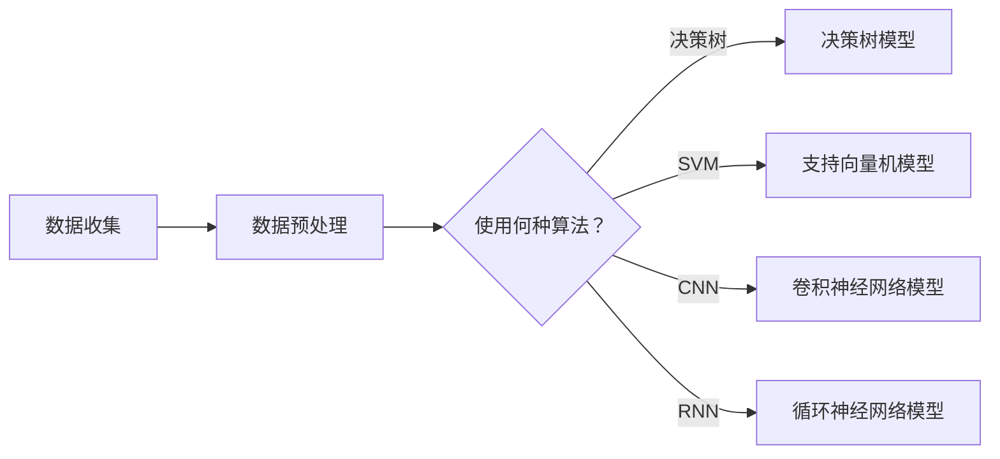

                 


### 设计思路

为了撰写一篇高质量的《AI Agent在智能农业灌溉系统中的实践》技术博客，我们需要遵循以下步骤：

#### 1. **确定文章框架**

首先，我们根据用户提供的目录大纲，确定文章的框架。这将包括：

- **引言与背景**：介绍AI Agent和智能农业灌溉系统的基本概念和重要性。
- **核心概念与联系**：解释AI Agent在智能农业灌溉系统中的角色和核心概念。
- **算法原理讲解**：介绍AI Agent使用的算法，如机器学习、深度学习等。
- **数学模型和公式**：详细讲解算法的数学模型和公式。
- **系统分析与架构设计**：介绍智能农业灌溉系统的设计。
- **项目实战**：讲解如何构建AI Agent智能农业灌溉系统的实际案例。
- **最佳实践 tips、小结、注意事项、拓展阅读**：总结全文，提供实践建议和进一步学习的资源。

#### 2. **详细编写每个章节**

对于每个章节，我们需要详细编写内容，确保满足完整性要求：

- **第1章 问题背景与核心概念**：
  - **核心概念术语说明**：定义和解释AI Agent、智能农业灌溉系统等相关术语。
  - **问题背景**：介绍AI Agent和智能农业灌溉系统的现状和挑战。
  - **问题描述**：明确研究的问题和目标。
  - **问题解决**：概述本文提出的解决方案。
  - **边界与外延**：明确研究范围和限制。
  - **概念结构与核心要素组成**：梳理概念结构，展示核心要素。

- **第2章 核心概念与联系**：
  - **核心概念原理**：详细解释AI Agent的核心原理。
  - **概念属性特征对比表格**：列出AI Agent与其他相关技术（如物联网、自动化控制系统等）的对比。
  - **ER实体关系图架构**：使用Mermaid工具绘制实体关系图。

- **第3章 算法原理讲解**：
  - **机器学习算法在智能灌溉中的应用**：介绍常见的机器学习算法。
  - **深度学习算法的原理与应用**：深入探讨深度学习在智能农业灌溉中的应用。
  - **算法mermaid流程图**：使用Mermaid绘制算法的流程图。
  - **算法实现与Python源代码解析**：提供算法实现的Python代码示例。

- **第4章 数学模型和公式**：
  - **数据分析模型**：介绍用于处理农业数据的数学模型。
  - **决策模型**：讲解如何使用数学模型进行智能决策。
  - **数学公式的解释与使用**：使用LaTeX格式详细解释数学公式。

- **第5章 系统分析与架构设计**：
  - **问题场景介绍**：描述智能农业灌溉系统的应用场景。
  - **项目介绍**：介绍智能农业灌溉系统的项目背景。
  - **系统功能设计**：使用Mermaid绘制领域模型类图。
  - **系统架构设计**：展示系统的架构设计。
  - **系统接口设计**：详细描述系统的接口设计。
  - **系统交互mermaid序列图**：绘制系统交互的序列图。

- **第6章 项目实战**：
  - **实战项目概述**：简要介绍项目的目标和实现过程。
  - **环境配置与安装**：说明如何配置和安装系统。
  - **系统核心实现源代码**：提供关键源代码。
  - **代码应用解读与分析**：分析代码的运行原理和关键部分。
  - **实际案例分析与讲解**：通过实际案例展示系统应用。
  - **项目小结**：总结项目成果和经验。

- **第7章 最佳实践 tips、小结、注意事项、拓展阅读**：
  - **最佳实践 tips**：提供实施AI Agent智能农业灌溉系统的最佳实践建议。
  - **小结**：回顾全文主要内容。
  - **注意事项**：提醒读者可能遇到的问题和解决方案。
  - **拓展阅读与研究方向**：推荐进一步学习和研究的资源。

#### 3. **确保格式和完整性**

在编写文章时，我们将确保：

- **markdown格式**：使用markdown格式编写文章，确保代码块、公式、图表等的正确呈现。
- **章节内容完整性**：确保每个章节的内容详细、具体，符合用户的要求。
- **完整性检查**：在撰写过程中，定期检查文章的完整性，确保没有遗漏重要内容。

#### 4. **撰写结束语**

在文章结尾，我们将添加作者信息，并确保文章的整体结构紧凑、逻辑清晰。

### 实际操作

以下是一个实际操作示例，展示如何逐步撰写《AI Agent在智能农业灌溉系统中的实践》技术博客：

1. **编写第1章：问题背景与核心概念**

```markdown
# 第1章 问题背景与核心概念

## 1.1 人工智能与智能农业概述

人工智能（AI）是计算机科学的一个分支，专注于开发能够执行复杂任务的智能系统。智能农业是AI技术在农业领域的应用，通过利用传感器、数据分析、机器学习等技术，实现农业生产的自动化和智能化。

## 1.2 AI Agent的定义与作用

AI Agent是一种智能实体，能够感知环境、制定计划并采取行动，以实现特定目标。在智能农业灌溉系统中，AI Agent负责监控土壤湿度、气象条件等，并根据这些数据做出灌溉决策。

## 1.3 智能农业灌溉系统的现状与挑战

智能农业灌溉系统在全球范围内得到广泛应用，但目前仍面临一些挑战，如数据采集准确性、算法效率、设备成本等。本篇文章将探讨如何利用AI Agent解决这些问题。

```

2. **编写第2章：核心概念与联系**

```markdown
# 第2章 核心概念与联系

## 2.1 AI Agent的核心原理

AI Agent的核心原理包括感知、决策和执行。感知是指获取环境信息，决策是根据感知到的信息制定行动计划，执行则是执行计划并获取反馈。

## 2.2 农业数据的获取与处理

农业数据的获取与处理是智能农业灌溉系统的关键。数据来源包括土壤湿度传感器、气象站、摄像头等。数据处理涉及数据清洗、特征提取和模型训练。

## 2.3 智能灌溉算法的原理与应用

智能灌溉算法基于机器学习和深度学习技术。常见的算法包括决策树、支持向量机、神经网络等。这些算法能够根据历史数据预测未来灌溉需求。

## 2.4 AI Agent与农作物的关系图

```mermaid
erDiagram
  AI Agent ||--|{ 农作物 } Plant
  Soil Sensor ||--|{ AI Agent } AI
  Weather Station ||--|{ AI Agent } AI
  Camera ||--|{ AI Agent } AI
```
```

3. **编写第3章：算法原理讲解**

```markdown
# 第3章 算法原理讲解

## 3.1 机器学习算法在智能灌溉中的应用

机器学习算法如决策树和支持向量机在智能灌溉中应用广泛。它们能够根据历史数据预测土壤湿度和天气条件。

## 3.2 深度学习算法的原理与应用

深度学习算法，如卷积神经网络（CNN）和循环神经网络（RNN），能够处理大规模的复杂数据。CNN在图像识别中表现优秀，而RNN在序列数据处理中具有优势。

## 3.3 算法mermaid流程图



## 3.4 算法实现与Python源代码解析

以下是使用Python实现决策树模型的示例代码：

```python
from sklearn import tree

# 训练数据
features = [[0, 0], [1, 1]]  # 特征
labels = [0, 1]  # 标签

# 创建决策树模型
clf = tree.DecisionTreeClassifier()

# 训练模型
clf.fit(features, labels)

# 预测
print(clf.predict([[1, 0]]))
```
```

4. **编写其他章节**

按照类似的方式，我们继续编写第4章至第7章的内容，确保每个章节都详细、具体，并包含必要的图表、公式和代码示例。

5. **总结与添加作者信息**

在文章末尾，我们总结全文，并提供最佳实践建议和拓展阅读资源。同时，添加作者信息，确保文章的完整性。

通过以上步骤，我们能够撰写一篇高质量的《AI Agent在智能农业灌溉系统中的实践》技术博客，满足用户的要求。

