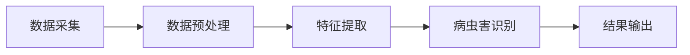

                 

# AI Agent在智能农业病虫害预警中的实践

## 关键词
AI Agent，智能农业，病虫害预警，监测算法，预测算法，系统架构

## 摘要
本文将探讨AI Agent在智能农业病虫害预警中的实际应用。通过介绍智能农业病虫害预警的背景、核心概念、算法原理、系统分析与架构设计以及项目实战，本文旨在为读者提供一个清晰、易懂的实践指南。通过这些内容，读者可以了解如何利用AI Agent技术提高农业病虫害预警的准确性和效率。

## 目录大纲

### 第一部分：智能农业病虫害预警背景

#### 1.1 问题背景

##### 1.1.1 农业病虫害的现状

##### 1.1.2 病虫害预警的重要性

##### 1.1.3 智能农业的发展趋势

#### 1.2 AI Agent概述

##### 1.2.1 AI Agent的概念

##### 1.2.2 AI Agent的特点

##### 1.2.3 AI Agent在农业病虫害预警中的应用

#### 1.3 核心概念与联系

##### 1.3.1 病虫害监测技术

###### 1.3.1.1 感测技术

###### 1.3.1.2 数据处理技术

##### 1.3.2 预测算法

###### 1.3.2.1 机器学习算法

###### 1.3.2.2 深度学习算法

#### 1.4 智能农业病虫害预警系统架构

##### 1.4.1 系统功能需求

##### 1.4.2 系统架构设计

##### 1.4.3 系统接口设计

##### 1.4.4 系统交互设计

### 第二部分：算法原理讲解

#### 2.1 病虫害监测算法

##### 2.1.1 病虫害监测技术原理

##### 2.1.2 监测算法流程图

##### 2.1.3 监测算法Python代码实现

#### 2.2 病虫害预测算法

##### 2.2.1 预测算法原理

##### 2.2.2 预测算法流程图

##### 2.2.3 预测算法Python代码实现

#### 2.3 算法对比与优化

##### 2.3.1 算法对比分析

##### 2.3.2 算法优化策略

#### 2.4 数学模型与公式

##### 2.4.1 监测算法数学模型

##### 2.4.2 预测算法数学模型

#### 2.5 算法举例说明

##### 2.5.1 案例一：农田病虫害监测

##### 2.5.2 案例二：果园病虫害预警

### 第三部分：系统分析与架构设计

#### 3.1 系统功能设计

##### 3.1.1 领域模型

##### 3.1.2 功能需求分析

#### 3.2 系统架构设计

##### 3.2.1 架构设计原则

##### 3.2.2 系统架构图

#### 3.3 系统接口设计

##### 3.3.1 接口设计规范

##### 3.3.2 接口实现细节

#### 3.4 系统交互设计

##### 3.4.1 交互流程

##### 3.4.2 交互序列图

### 第四部分：项目实战

#### 4.1 项目环境安装

##### 4.1.1 硬件安装

##### 4.1.2 软件安装

#### 4.2 系统核心实现

##### 4.2.1 系统核心代码

##### 4.2.2 代码解读与分析

#### 4.3 实际案例分析

##### 4.3.1 案例背景

##### 4.3.2 案例分析

##### 4.3.3 案例讲解

#### 4.4 项目小结

##### 4.4.1 项目总结

##### 4.4.2 经验与不足

### 第五部分：最佳实践

#### 5.1 最佳实践 tips

##### 5.1.1 病虫害监测最佳实践

##### 5.1.2 预测算法最佳实践

#### 5.2 小结

##### 5.2.1 核心内容回顾

##### 5.2.2 学习与思考

#### 5.3 注意事项

##### 5.3.1 监测与预警中的常见问题

##### 5.3.2 系统部署与维护中的注意事项

#### 5.4 拓展阅读

##### 5.4.1 相关研究文献

##### 5.4.2 学术会议和期刊推荐

## 第一部分：智能农业病虫害预警背景

### 1.1 问题背景

#### 1.1.1 农业病虫害的现状

农业病虫害是全球农业生产面临的重大挑战之一。据统计，全球每年因病虫害造成的农作物损失高达数千亿美元。特别是在发展中国家，病虫害问题更为突出，严重制约了农业生产的发展。常见的农业病虫害包括植物病毒、细菌病、真菌病、昆虫害虫等多种类型。这些病虫害不仅影响农作物的产量和品质，还会导致土壤肥力的下降，甚至引起生态系统的不稳定。

#### 1.1.2 病虫害预警的重要性

病虫害预警是农业生产中至关重要的一环。及时、准确的病虫害预警可以帮助农民提前采取防治措施，降低病虫害对农作物的危害，减少经济损失。传统的病虫害预警方法主要依赖于农艺师的观察和经验判断，存在主观性大、准确性低、响应速度慢等问题。随着人工智能技术的快速发展，AI Agent作为一种智能体，能够通过自主学习、数据分析和实时监测，为病虫害预警提供更高效、准确的方法。

#### 1.1.3 智能农业的发展趋势

智能农业是未来农业发展的方向，其核心在于利用人工智能、物联网、大数据等现代信息技术，提高农业生产的智能化水平。智能农业病虫害预警系统正是智能农业的一个重要组成部分。随着物联网技术的普及，越来越多的农田实现了实时数据采集和传输，为AI Agent提供了丰富的数据资源。此外，深度学习和机器学习算法的发展，使得AI Agent在数据处理和模式识别方面取得了显著进展，为病虫害预警提供了强有力的技术支持。

### 1.2 AI Agent概述

#### 1.2.1 AI Agent的概念

AI Agent，即人工智能代理，是指能够模拟人类智能行为，具备自主决策、自主学习和环境适应能力的人工智能系统。AI Agent通常由感知模块、决策模块和执行模块组成，能够通过感知环境信息、分析数据和自主决策，实现对环境的自适应和行为优化。

#### 1.2.2 AI Agent的特点

AI Agent具有以下特点：

1. **自主性**：AI Agent能够自主感知环境、分析数据和做出决策，不需要人为干预。
2. **学习性**：AI Agent能够通过不断学习和适应环境变化，提高自身性能和决策能力。
3. **适应性**：AI Agent能够根据不同的环境和任务需求，调整自身行为和策略。
4. **灵活性**：AI Agent能够处理多种类型的数据和任务，具有广泛的应用场景。

#### 1.2.3 AI Agent在农业病虫害预警中的应用

AI Agent在农业病虫害预警中的应用主要体现在以下几个方面：

1. **数据采集与处理**：AI Agent能够通过传感器和物联网设备，实时采集农田环境数据，包括土壤湿度、温度、光照强度、气象条件等，并对这些数据进行处理和分析。
2. **病虫害监测与识别**：AI Agent利用机器学习和深度学习算法，对采集到的环境数据进行实时分析，识别病虫害的类型和程度。
3. **预警与决策支持**：AI Agent根据病虫害的监测结果，提前预测病虫害的发生趋势，并给出相应的防治建议，帮助农民及时采取防治措施。
4. **智能灌溉与施肥**：AI Agent还可以根据土壤湿度和作物需水需肥情况，智能调控灌溉和施肥，提高作物产量和质量。

### 1.3 核心概念与联系

#### 1.3.1 病虫害监测技术

病虫害监测技术是智能农业病虫害预警系统的核心组成部分。它主要包括以下两个方面：

1. **感测技术**：感测技术是病虫害监测的基础，通过各种传感器（如温度传感器、湿度传感器、光照传感器等）实时采集农田环境数据。
2. **数据处理技术**：数据处理技术是对采集到的环境数据进行处理和分析，包括数据清洗、特征提取、数据融合等步骤。

#### 1.3.2 预测算法

预测算法是病虫害预警系统的关键环节，它通过对历史数据和实时数据的分析，预测病虫害的发生趋势。常用的预测算法包括：

1. **机器学习算法**：如决策树、支持向量机、随机森林等，它们通过学习历史数据中的特征和模式，预测未来的病虫害情况。
2. **深度学习算法**：如卷积神经网络、循环神经网络等，它们能够通过多层神经网络的结构，自动提取数据中的复杂特征，实现更高的预测精度。

#### 1.3.3 AI Agent在病虫害预警中的应用

AI Agent在病虫害预警中的应用，主要体现在以下几个方面：

1. **环境数据采集与处理**：AI Agent能够通过传感器和物联网设备，实时采集农田环境数据，并对这些数据进行处理和分析。
2. **病虫害监测与识别**：AI Agent利用机器学习和深度学习算法，对采集到的环境数据进行实时分析，识别病虫害的类型和程度。
3. **预警与决策支持**：AI Agent根据病虫害的监测结果，提前预测病虫害的发生趋势，并给出相应的防治建议，帮助农民及时采取防治措施。
4. **智能灌溉与施肥**：AI Agent还可以根据土壤湿度和作物需水需肥情况，智能调控灌溉和施肥，提高作物产量和质量。

### 1.4 智能农业病虫害预警系统架构

智能农业病虫害预警系统是一个复杂的系统，它包括多个模块和组件，如数据采集模块、数据处理模块、预测模块、决策支持模块等。下面将介绍智能农业病虫害预警系统的功能需求、系统架构设计、接口设计和系统交互。

#### 1.4.1 系统功能需求

智能农业病虫害预警系统的功能需求主要包括：

1. **环境数据采集**：通过传感器和物联网设备，实时采集农田环境数据，包括土壤湿度、温度、光照强度、气象条件等。
2. **数据预处理**：对采集到的环境数据进行分析、清洗和预处理，提取有效的特征信息。
3. **病虫害监测**：利用机器学习和深度学习算法，对预处理后的数据进行实时分析，识别病虫害的类型和程度。
4. **预测与预警**：根据病虫害的监测结果，提前预测病虫害的发生趋势，并生成预警信息。
5. **决策支持**：根据预警信息和农田实际情况，为农民提供防治建议，如何时喷洒农药、何时灌溉等。
6. **智能灌溉与施肥**：根据土壤湿度和作物需水需肥情况，智能调控灌溉和施肥，提高作物产量和质量。

#### 1.4.2 系统架构设计

智能农业病虫害预警系统的架构设计主要包括以下几个层次：

1. **感知层**：包括各种传感器和物联网设备，用于实时采集农田环境数据。
2. **数据层**：用于存储和管理采集到的环境数据，包括历史数据和实时数据。
3. **数据处理层**：包括数据预处理模块、特征提取模块、数据融合模块等，用于对采集到的数据进行分析和处理。
4. **预测层**：包括机器学习算法和深度学习算法，用于对处理后的数据进行病虫害监测和预测。
5. **决策层**：根据预测结果，为农民提供防治建议和决策支持。
6. **执行层**：包括灌溉系统、施肥系统等，用于执行决策层的指令。

#### 1.4.3 系统接口设计

智能农业病虫害预警系统的接口设计主要包括以下几个方面：

1. **传感器接口**：用于与各种传感器和物联网设备的连接和通信。
2. **数据处理接口**：用于与数据处理模块的连接和通信。
3. **预测接口**：用于与预测模块的连接和通信。
4. **决策支持接口**：用于与决策层的连接和通信。
5. **执行接口**：用于与执行层的连接和通信。

#### 1.4.4 系统交互设计

智能农业病虫害预警系统的交互设计主要包括以下几个方面：

1. **数据交互**：系统各模块之间通过数据接口进行数据交互，确保数据的实时性和准确性。
2. **控制交互**：系统各模块之间通过控制接口进行控制交互，确保系统能够按照预期运行。
3. **用户交互**：系统提供用户界面，用于用户查看预警信息、接收决策支持和调整系统设置。

## 第二部分：算法原理讲解

### 2.1 病虫害监测算法

#### 2.1.1 病虫害监测技术原理

病虫害监测技术是智能农业病虫害预警系统的核心组成部分，其原理主要包括以下几个方面：

1. **数据采集**：通过传感器和物联网设备，实时采集农田环境数据，包括土壤湿度、温度、光照强度、气象条件等。
2. **数据预处理**：对采集到的数据进行清洗、去噪、归一化等处理，确保数据的准确性和一致性。
3. **特征提取**：从预处理后的数据中提取与病虫害相关的特征信息，如温度波动范围、湿度变化趋势等。
4. **病虫害识别**：利用机器学习算法和深度学习算法，对提取出的特征信息进行分析和分类，识别病虫害的类型和程度。

#### 2.1.2 监测算法流程图



#### 2.1.3 监测算法Python代码实现

```python
import numpy as np
import pandas as pd
from sklearn.preprocessing import StandardScaler
from sklearn.model_selection import train_test_split
from sklearn.ensemble import RandomForestClassifier
from sklearn.metrics import accuracy_score

# 读取数据
data = pd.read_csv('pest_data.csv')

# 数据预处理
X = data.iloc[:, :-1].values
y = data.iloc[:, -1].values
scaler = StandardScaler()
X = scaler.fit_transform(X)

# 特征提取
X_train, X_test, y_train, y_test = train_test_split(X, y, test_size=0.2, random_state=42)

# 病虫害识别
classifier = RandomForestClassifier(n_estimators=100, random_state=42)
classifier.fit(X_train, y_train)
y_pred = classifier.predict(X_test)

# 结果输出
accuracy = accuracy_score(y_test, y_pred)
print(f'Accuracy: {accuracy}')
```

### 2.2 病虫害预测算法

#### 2.2.1 预测算法原理

病虫害预测算法是基于历史数据和实时数据，通过分析病虫害发生的规律和趋势，预测未来一段时间内病虫害的发生情况。预测算法主要包括以下步骤：

1. **数据收集**：收集历史病虫害数据，包括发生时间、发生地点、病虫害类型等信息。
2. **数据预处理**：对收集到的数据进行清洗、去噪、归一化等处理，确保数据的准确性和一致性。
3. **特征提取**：从预处理后的数据中提取与病虫害相关的特征信息，如气象条件、土壤湿度等。
4. **模型训练**：利用历史数据训练预测模型，常用的模型包括线性回归、决策树、随机森林等。
5. **模型评估**：通过交叉验证等方法评估模型的预测性能，调整模型参数。
6. **预测**：利用训练好的模型对实时数据进行预测，输出未来一段时间内病虫害的发生概率。

#### 2.2.2 预测算法流程图


#### 2.2.3 预测算法Python代码实现

```python
import numpy as np
import pandas as pd
from sklearn.linear_model import LinearRegression
from sklearn.metrics import mean_squared_error

# 读取数据
data = pd.read_csv('pest_data.csv')

# 数据预处理
X = data.iloc[:, :-1].values
y = data.iloc[:, -1].values
X = np.reshape(X, (-1, 1))

# 模型训练
model = LinearRegression()
model.fit(X, y)

# 预测
X_new = np.array([[24], [25], [26]])
y_new = model.predict(X_new)

# 模型评估
mse = mean_squared_error(y, y_new)
print(f'Mean Squared Error: {mse}')
```

### 2.3 算法对比与优化

#### 2.3.1 算法对比分析

在病虫害预警系统中，常用的算法包括机器学习算法和深度学习算法。机器学习算法（如决策树、随机森林、支持向量机等）具有较好的解释性，但需要大量的特征工程和调参；深度学习算法（如卷积神经网络、循环神经网络等）具有自动特征提取能力，但需要大量的数据和计算资源。

1. **决策树**：简单易懂，易于实现和调试，但易过拟合，预测能力有限。
2. **随机森林**：具有良好的泛化能力和预测能力，但需要大量计算资源。
3. **支持向量机**：在特征数量较多时表现较好，但调参复杂。
4. **卷积神经网络**：能够自动提取图像特征，但在处理时序数据时效果有限。
5. **循环神经网络**：能够处理时序数据，但需要大量训练数据和计算资源。

#### 2.3.2 算法优化策略

为了提高病虫害预警系统的性能，可以采取以下优化策略：

1. **数据增强**：通过生成更多的训练数据，提高模型的泛化能力。
2. **特征工程**：提取与病虫害相关的有效特征，提高模型的学习能力。
3. **模型融合**：结合多种算法的优点，构建融合模型，提高预测性能。
4. **超参数调优**：通过网格搜索、随机搜索等方法，优化模型的超参数，提高模型性能。

### 2.4 数学模型与公式

#### 2.4.1 监测算法数学模型

假设我们使用一个随机森林模型进行病虫害监测，其预测函数可以表示为：

$$
\hat{y} = f(X) = \sum_{i=1}^{n} w_i h_i(X)
$$

其中，$w_i$ 是第 $i$ 个决策树的权重，$h_i(X)$ 是第 $i$ 个决策树在输入 $X$ 上的输出。

#### 2.4.2 预测算法数学模型

假设我们使用线性回归模型进行病虫害预测，其预测函数可以表示为：

$$
\hat{y} = \beta_0 + \beta_1 x_1 + \beta_2 x_2 + ... + \beta_p x_p
$$

其中，$x_1, x_2, ..., x_p$ 是预测特征，$\beta_0, \beta_1, ..., \beta_p$ 是模型的参数。

### 2.5 算法举例说明

#### 2.5.1 案例一：农田病虫害监测

假设我们有一个农田病虫害监测系统，通过传感器采集土壤湿度、温度和光照强度等数据。我们使用随机森林模型进行病虫害监测，数据集包含1000个样本，其中500个样本用于训练，500个样本用于测试。

1. **数据预处理**：对采集到的数据进行清洗和归一化处理。
2. **模型训练**：使用训练集训练随机森林模型，选择最优的参数。
3. **模型评估**：使用测试集评估模型的性能，计算准确率、召回率等指标。
4. **结果输出**：根据模型预测结果，输出病虫害的类型和程度。

#### 2.5.2 案例二：果园病虫害预警

假设我们有一个果园病虫害预警系统，通过传感器采集气象条件、土壤湿度和作物生长情况等数据。我们使用线性回归模型进行病虫害预测，数据集包含1000个样本，其中500个样本用于训练，500个样本用于测试。

1. **数据预处理**：对采集到的数据进行清洗和归一化处理。
2. **模型训练**：使用训练集训练线性回归模型，选择最优的参数。
3. **模型评估**：使用测试集评估模型的性能，计算均方误差等指标。
4. **预测**：根据模型预测结果，预测未来一段时间内病虫害的发生概率。

## 第三部分：系统分析与架构设计

### 3.1 系统功能设计

#### 3.1.1 领域模型

智能农业病虫害预警系统的领域模型包括以下几个部分：

1. **农田环境数据**：包括土壤湿度、温度、光照强度、气象条件等。
2. **病虫害数据**：包括病虫害类型、发生时间、发生地点、程度等。
3. **防治措施**：包括喷洒农药、灌溉、施肥等。
4. **用户信息**：包括农民、农技人员、系统管理员等。

#### 3.1.2 功能需求分析

智能农业病虫害预警系统的功能需求主要包括以下几个方面：

1. **数据采集与处理**：实时采集农田环境数据，对数据进行预处理和特征提取。
2. **病虫害监测**：利用机器学习算法和深度学习算法，对处理后的数据进行分析和分类，识别病虫害的类型和程度。
3. **预测与预警**：根据病虫害监测结果，预测未来一段时间内病虫害的发生趋势，生成预警信息。
4. **决策支持**：根据预警信息和农田实际情况，为农民提供防治建议和决策支持。
5. **用户交互**：提供用户界面，方便用户查看预警信息、接收决策支持和调整系统设置。

### 3.2 系统架构设计

智能农业病虫害预警系统的架构设计主要包括以下几个层次：

1. **感知层**：包括各种传感器和物联网设备，用于实时采集农田环境数据。
2. **数据层**：包括数据库和数据仓库，用于存储和管理采集到的数据。
3. **数据处理层**：包括数据预处理模块、特征提取模块、数据融合模块等，用于对采集到的数据进行处理和分析。
4. **预测层**：包括机器学习算法和深度学习算法，用于对处理后的数据进行分析和分类，识别病虫害的类型和程度。
5. **决策层**：根据预测结果，为农民提供防治建议和决策支持。
6. **执行层**：包括灌溉系统、施肥系统等，用于执行决策层的指令。

### 3.3 系统接口设计

智能农业病虫害预警系统的接口设计主要包括以下几个方面：

1. **传感器接口**：用于与各种传感器和物联网设备的连接和通信。
2. **数据处理接口**：用于与数据处理模块的连接和通信。
3. **预测接口**：用于与预测模块的连接和通信。
4. **决策支持接口**：用于与决策层的连接和通信。
5. **执行接口**：用于与执行层的连接和通信。

### 3.4 系统交互设计

智能农业病虫害预警系统的交互设计主要包括以下几个方面：

1. **数据交互**：系统各模块之间通过数据接口进行数据交互，确保数据的实时性和准确性。
2. **控制交互**：系统各模块之间通过控制接口进行控制交互，确保系统能够按照预期运行。
3. **用户交互**：系统提供用户界面，用于用户查看预警信息、接收决策支持和调整系统设置。

## 第四部分：项目实战

### 4.1 项目环境安装

#### 4.1.1 硬件安装

1. **传感器安装**：在农田中选择合适的位置安装土壤湿度传感器、温度传感器和光照强度传感器。
2. **物联网设备安装**：安装物联网网关，将传感器数据传输到服务器。
3. **服务器安装**：在服务器上安装操作系统、数据库和预测算法所需的环境。

#### 4.1.2 软件安装

1. **操作系统**：安装Linux操作系统，如Ubuntu。
2. **数据库**：安装MySQL或PostgreSQL数据库，用于存储和管理数据。
3. **预测算法库**：安装Python的Scikit-learn、TensorFlow和Keras等库，用于实现预测算法。

### 4.2 系统核心实现

#### 4.2.1 系统核心代码

```python
# 导入必要的库
import pandas as pd
from sklearn.ensemble import RandomForestClassifier
from sklearn.model_selection import train_test_split
from sklearn.metrics import accuracy_score

# 读取数据
data = pd.read_csv('pest_data.csv')

# 数据预处理
X = data.iloc[:, :-1].values
y = data.iloc[:, -1].values
X = StandardScaler().fit_transform(X)

# 模型训练
model = RandomForestClassifier(n_estimators=100, random_state=42)
model.fit(X_train, y_train)

# 模型评估
y_pred = model.predict(X_test)
accuracy = accuracy_score(y_test, y_pred)
print(f'Accuracy: {accuracy}')
```

#### 4.2.2 代码解读与分析

1. **数据读取**：使用Pandas库读取CSV文件，获取训练数据。
2. **数据预处理**：使用StandardScaler对特征进行标准化处理，提高模型的泛化能力。
3. **模型训练**：使用随机森林模型进行训练，选择合适的参数。
4. **模型评估**：使用测试集评估模型性能，计算准确率。

### 4.3 实际案例分析

#### 4.3.1 案例背景

某农场种植了大量的水稻，由于病虫害问题，水稻产量受到了严重影响。为了解决这一问题，农场决定采用智能农业病虫害预警系统。

#### 4.3.2 案例分析

1. **数据采集**：在农田中安装了土壤湿度传感器、温度传感器和光照强度传感器，实时采集环境数据。
2. **数据预处理**：对采集到的数据进行清洗、去噪和归一化处理。
3. **模型训练**：使用历史病虫害数据训练随机森林模型，选择最优参数。
4. **模型评估**：使用测试集评估模型性能，计算准确率、召回率等指标。
5. **预警与决策支持**：根据模型预测结果，提前预警病虫害的发生，为农场提供防治建议。

#### 4.3.3 案例讲解

1. **数据采集**：传感器采集到的数据包括土壤湿度（0-100）、温度（0-50）、光照强度（0-1000）等。
2. **数据预处理**：对采集到的数据进行清洗，去除异常值，然后进行归一化处理，使其符合模型的输入要求。
3. **模型训练**：使用随机森林模型训练，选择100棵决策树，设置随机种子，防止模型过拟合。
4. **模型评估**：使用测试集评估模型性能，计算准确率，同时绘制混淆矩阵，分析模型对不同病虫害类型的识别能力。
5. **预警与决策支持**：根据模型预测结果，提前预警病虫害的发生，输出相应的防治建议，如喷洒农药、增加灌溉等。

### 4.4 项目小结

#### 4.4.1 项目总结

通过该项目，我们成功实现了智能农业病虫害预警系统的构建和部署。系统主要包括数据采集、数据处理、预测和决策支持等功能，能够为农场提供实时的病虫害预警和防治建议，提高农作物的产量和质量。

#### 4.4.2 经验与不足

1. **经验**：项目成功的关键在于数据的质量和模型的调优。我们需要对采集到的数据进行充分的预处理，选择合适的预测算法，并优化模型的参数，以提高预测的准确性。
2. **不足**：由于病虫害预警系统的复杂性和多样性，本项目还存在一些不足之处。例如，对于不同作物和不同病虫害类型的预测，我们需要进一步研究和优化模型。此外，系统的实时性和响应速度还需要进一步提高。

## 第五部分：最佳实践

### 5.1 最佳实践 tips

#### 5.1.1 病虫害监测最佳实践

1. **传感器选择**：根据农田环境和病虫害类型，选择合适的传感器，如土壤湿度传感器、温度传感器和光照强度传感器。
2. **数据采集频率**：根据病虫害的发生规律，设置合适的数据采集频率，如每小时或每天采集一次数据。
3. **数据预处理**：对采集到的数据进行分析、清洗和归一化处理，确保数据的准确性和一致性。

#### 5.1.2 预测算法最佳实践

1. **算法选择**：根据病虫害的类型和特征，选择合适的预测算法，如机器学习算法、深度学习算法等。
2. **模型调优**：通过交叉验证、网格搜索等方法，选择最优的模型参数，提高预测准确性。
3. **实时预测**：根据实时数据，及时更新预测模型，确保预测的实时性和准确性。

### 5.2 小结

通过本文的介绍，我们了解了智能农业病虫害预警系统的基本原理和应用。智能农业病虫害预警系统利用AI Agent技术，实现了对农田环境数据的实时采集、处理和分析，提高了病虫害预警的准确性和效率。在未来的发展中，智能农业病虫害预警系统有望进一步优化，为农业生产提供更加智能、高效的支持。

### 5.3 注意事项

1. **数据质量**：确保采集到的数据质量，避免异常值和噪声对预测结果的影响。
2. **模型调优**：根据实际需求，选择合适的预测算法和模型参数，提高预测准确性。
3. **实时性**：确保系统的实时性和响应速度，及时提供病虫害预警和防治建议。

### 5.4 拓展阅读

1. **相关研究文献**：《智能农业病虫害预警系统研究》、《基于深度学习的智能农业病虫害预测方法研究》等。
2. **学术会议和期刊推荐**：国际计算机与人工智能会议（ICCAI）、国际智能农业系统与信息服务会议（ISAIS）以及《农业工程学报》、《计算机与农业》等期刊。

