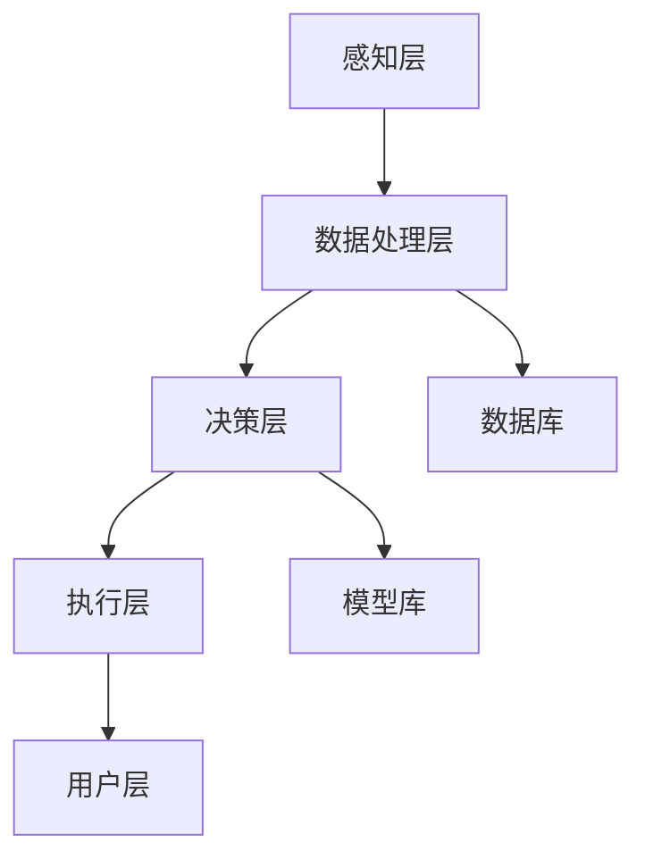

                 

### 1.1 问题背景

#### 1.1.1 智能农业监测的现状

随着科技的不断进步，农业正从传统的人工劳动向智能化、自动化方向转型。智能农业监测作为这一转型的重要组成部分，已经引起了广泛关注。目前，智能农业监测主要集中在以下几个方面：

1. **土壤监测**：通过传感器监测土壤的湿度和温度，以及土壤中的营养成分，为精准施肥提供数据支持。
2. **气象监测**：监测空气温度、湿度、风速、降雨量等气象参数，为农业生产提供科学决策依据。
3. **病虫害监测**：利用图像识别技术监测作物病虫害，实现早期预警和精准防治。
4. **作物生长监测**：通过多光谱成像技术监测作物生长状态，预测作物产量和质量。

尽管如此，当前的智能农业监测仍然存在一些问题，如监测数据精度不足、系统稳定性不高等，这些问题的存在限制了智能农业监测的进一步发展。

#### 1.1.2 存在的问题与挑战

1. **数据精度不足**：传统监测技术受限于传感器精度和采集方法，导致监测数据存在误差，影响决策的准确性。
2. **系统稳定性不高**：智能农业监测系统在长时间运行过程中，可能受到环境变化、设备老化等因素的影响，导致系统稳定性下降。
3. **数据处理和分析能力不足**：虽然大数据和人工智能技术在农业监测中得到了应用，但数据处理和分析能力仍然有限，难以充分发挥数据的价值。
4. **跨学科融合不足**：智能农业监测涉及多个学科，如农业学、生物学、计算机科学等，但跨学科融合程度不高，限制了技术的综合应用。

#### 1.1.3 AI Agent的作用与意义

AI Agent，即人工智能代理，是一种能够自主感知环境、决策并执行任务的智能实体。在智能农业监测中，AI Agent具有以下作用和意义：

1. **提高数据精度**：AI Agent可以通过多种传感器获取环境数据，结合深度学习和数据分析技术，提高监测数据的精度和可靠性。
2. **提高系统稳定性**：AI Agent具有自适应和自修复能力，可以在系统出现故障时，自动进行诊断和修复，提高系统的稳定性。
3. **增强数据处理和分析能力**：AI Agent可以利用机器学习和大数据分析技术，对海量监测数据进行分析和挖掘，提取有价值的信息，为农业生产提供科学依据。
4. **促进跨学科融合**：AI Agent作为一种跨学科的智能实体，可以促进农业学、生物学、计算机科学等学科的融合，推动智能农业的发展。

总之，AI Agent在智能农业监测中具有巨大的应用潜力和发展前景，有望解决当前存在的一些问题，推动智能农业的进一步发展。在接下来的章节中，我们将详细探讨AI Agent的基础知识、智能农业监测技术、案例研究、系统设计与实现以及挑战与未来展望。

---

### 1.2 AI Agent概述

#### 1.2.1 AI Agent的定义

AI Agent，即人工智能代理，是一种能够模拟人类智能行为，自主感知环境、决策并执行任务的计算机程序。它具有以下几个核心特征：

1. **自主性**：AI Agent能够在没有外部干预的情况下，根据预设目标和环境变化，自主执行任务。
2. **感知能力**：AI Agent可以通过传感器或数据接口获取环境信息，进行状态感知。
3. **决策能力**：AI Agent利用感知到的环境信息，结合预设的策略和算法，进行决策。
4. **执行能力**：AI Agent能够根据决策结果，执行具体的操作或任务。

AI Agent可以看作是自动化系统和人工智能技术的结合体，它在各个领域中具有广泛的应用，如智能家居、自动驾驶、工业自动化等。

#### 1.2.2 AI Agent的特点

1. **智能化**：AI Agent通过机器学习和人工智能技术，实现智能化的决策和执行，能够处理复杂的环境信息。
2. **自主性**：AI Agent具有自主性，可以在没有人为干预的情况下，自主完成任务。
3. **适应性强**：AI Agent可以根据环境变化，动态调整自己的行为，具有较强的适应能力。
4. **协同性**：多个AI Agent可以协同工作，共同完成复杂任务。
5. **可扩展性**：AI Agent具有可扩展性，可以根据需求添加新的功能或进行模块化设计。

#### 1.2.3 AI Agent的应用领域

AI Agent在智能农业监测中的应用非常广泛，主要包括以下几个方面：

1. **精准农业**：AI Agent可以通过感知土壤、气象、作物生长等数据，提供精准农业管理方案，实现精准施肥、灌溉和病虫害防治。
2. **智能灌溉**：AI Agent可以根据土壤湿度和气象数据，自动控制灌溉系统的开关，实现智能灌溉。
3. **病虫害监测**：AI Agent可以利用图像识别技术，实时监测作物病虫害，实现早期预警和精准防治。
4. **农业自动化**：AI Agent可以协同农业机械，实现农作物的自动化种植、收获和运输。

此外，AI Agent还在农业供应链管理、农产品质量检测等领域有着广泛的应用。随着人工智能技术的不断进步，AI Agent在智能农业监测中的应用前景将更加广阔。

在接下来的章节中，我们将进一步探讨智能农业监测技术，分析AI Agent与各类监测技术的结合方式及其优势，并通过案例研究展示AI Agent在智能农业监测中的实际应用。

---

### 1.3 智能农业监测的重要性

#### 1.3.1 智能农业监测的意义

智能农业监测是现代农业发展的重要趋势，它通过利用先进的传感器技术、大数据分析和人工智能算法，实现对农业环境、作物生长状态和病虫害的实时监测，从而提供科学决策依据，提高农业生产的效率和质量。具体来说，智能农业监测具有以下几方面的意义：

1. **提高农业生产效率**：智能农业监测能够实时获取土壤、气象、作物生长等数据，通过数据分析为农业生产提供精准指导，避免盲目施肥、灌溉和病虫害防治，从而提高农业生产效率。

2. **保障农产品质量**：智能农业监测可以实时监测农作物的生长状态和病虫害情况，通过精准防治和科学管理，提高农产品的产量和品质，满足消费者对高质量农产品的需求。

3. **节约农业生产成本**：智能农业监测可以通过优化农业资源利用，减少化肥、农药和灌溉水的使用，降低农业生产成本，提高农业的经济效益。

4. **促进农业可持续发展**：智能农业监测有助于实现农业资源的合理利用和保护，减少环境污染，推动农业的可持续发展。

#### 1.3.2 AI Agent在智能农业监测中的关键作用

AI Agent作为智能农业监测的核心技术之一，其在智能农业监测中具有关键作用，主要体现在以下几个方面：

1. **数据采集和处理**：AI Agent可以通过多种传感器获取农业环境数据，如土壤湿度、气象参数、作物生长状态等，并通过大数据分析和机器学习算法，对这些数据进行处理和分析，提取有价值的信息。

2. **决策支持**：AI Agent可以根据分析结果，结合预设的目标和策略，为农业生产提供科学决策支持，如精准施肥、智能灌溉、病虫害防治等。

3. **自动化执行**：AI Agent能够根据决策结果，自动执行具体的操作，如启动灌溉系统、喷洒农药等，实现农业生产的自动化。

4. **自适应和自修复**：AI Agent具有自适应能力，可以根据环境变化动态调整自己的行为；同时，它还具有自修复能力，能够在出现故障时自动进行诊断和修复，提高系统的稳定性。

5. **协同工作**：多个AI Agent可以协同工作，共同完成复杂任务，如大规模农作物的监测和管理。

总之，AI Agent在智能农业监测中发挥着至关重要的作用，它通过提高数据精度、增强数据处理和分析能力、实现自动化执行和协同工作，为智能农业的发展提供了强大的技术支持。在接下来的章节中，我们将进一步探讨AI Agent在智能农业监测中的具体应用，分析其与各类监测技术的结合方式及其优势。

---

### 1.4 AI Agent的基础知识

#### 1.4.1 AI Agent的工作原理

AI Agent是一种能够模拟人类智能行为，自主感知环境、决策并执行任务的计算机程序。其工作原理主要包括以下几个关键环节：

1. **感知**：AI Agent通过传感器或其他数据接口，获取环境信息，进行状态感知。这些传感器可以是温度、湿度、光照度等物理传感器，也可以是摄像头、麦克风等多媒体传感器。

2. **决策**：AI Agent利用感知到的环境信息，结合预设的目标和策略，通过决策算法进行分析和判断，确定下一步行动。

3. **执行**：根据决策结果，AI Agent执行具体的操作或任务，如控制灌溉系统、启动农业机械等。

4. **反馈**：AI Agent在执行任务后，收集环境反馈信息，用于进一步优化决策和执行过程。

#### 1.4.2 AI Agent的核心组件

AI Agent由以下几个核心组件组成：

1. **感知模块**：负责感知环境信息，如温度、湿度、光照度等。

2. **决策模块**：根据感知模块获取的信息和预设的目标，利用机器学习和决策算法进行决策。

3. **执行模块**：根据决策模块的决策结果，执行具体的操作或任务。

4. **反馈模块**：收集环境反馈信息，用于优化决策和执行过程。

#### 1.4.3 AI Agent的分类

AI Agent可以根据不同的标准进行分类，常见的分类方法包括：

1. **根据功能**：可以分为感知型AI Agent、决策型AI Agent、执行型AI Agent和反馈型AI Agent。

2. **根据目标**：可以分为目标导向型AI Agent、任务导向型AI Agent和情境导向型AI Agent。

3. **根据环境**：可以分为室内AI Agent、室外AI Agent、虚拟环境AI Agent等。

#### 1.4.4 AI Agent的特点和应用

AI Agent具有以下几个特点：

1. **自主性**：AI Agent能够在没有外部干预的情况下，自主执行任务。

2. **智能化**：AI Agent通过机器学习和人工智能技术，能够处理复杂的环境信息，进行智能决策。

3. **自适应**：AI Agent可以根据环境变化，动态调整自己的行为。

4. **协同性**：多个AI Agent可以协同工作，共同完成复杂任务。

5. **可扩展**：AI Agent可以根据需求添加新的功能或进行模块化设计。

AI Agent在各个领域有着广泛的应用，如智能家居、自动驾驶、工业自动化、智能农业等。以智能农业为例，AI Agent可以通过感知模块获取土壤、气象、作物生长等数据，通过决策模块分析数据，提供精准农业管理方案，如精准施肥、智能灌溉、病虫害防治等。

在接下来的章节中，我们将进一步探讨智能农业监测技术，分析AI Agent与各类监测技术的结合方式及其优势，并通过案例研究展示AI Agent在智能农业监测中的实际应用。

---

### 1.5 智能农业监测技术

#### 1.5.1 传统监测技术

在智能农业监测领域，传统监测技术主要包括以下几种：

1. **土壤监测**：通过测量土壤的酸碱度、含水量、养分含量等参数，评估土壤质量。常用的方法包括手持式土壤检测仪、实验室分析等。

2. **气象监测**：通过测量气温、湿度、风速、降雨量等气象参数，了解天气状况，为农业生产提供决策支持。常用的方法包括气象站、卫星遥感等。

3. **病虫害监测**：通过观察作物生长状态和外观，判断病虫害的发生情况，并进行防治。常用的方法包括人工观察、植物病理学检测等。

4. **作物生长监测**：通过测量作物的生长速度、株高、叶片数量等参数，评估作物生长状况。常用的方法包括田间测量、遥感监测等。

尽管传统监测技术在农业监测中发挥了重要作用，但仍然存在一些局限性：

1. **数据精度不足**：传统监测技术受限于测量设备和方法的精度，导致监测数据存在误差。

2. **监测范围有限**：传统监测技术通常只能对局部区域进行监测，难以实现大范围的农业监测。

3. **人工依赖性强**：许多传统监测方法需要人工操作，工作量大，效率低。

4. **实时性较差**：传统监测技术难以实现实时监测，数据更新周期较长。

#### 1.5.2 AI技术在监测中的应用

随着人工智能技术的不断发展，AI技术开始被广泛应用于农业监测领域，显著提升了监测的效率和准确性。以下是一些主要的AI技术应用：

1. **机器学习**：通过机器学习算法，AI Agent可以从大量的农业数据中学习规律，预测作物生长趋势和病虫害发生情况。常用的算法包括决策树、随机森林、支持向量机等。

2. **深度学习**：深度学习是一种特殊的机器学习算法，通过多层神经网络对数据进行处理和分析，具有强大的特征提取和分类能力。在农业监测中，深度学习可以用于图像识别、语音识别等领域。

3. **计算机视觉**：计算机视觉技术可以用于作物病虫害检测、作物状态识别等。通过训练深度学习模型，AI Agent可以自动识别图像中的病虫害信息，实现早期预警和精准防治。

4. **自然语言处理**：自然语言处理技术可以用于处理和分析农业领域的文本数据，如农田日志、专家建议等。通过分析这些文本数据，AI Agent可以提取有用的信息，为农业生产提供决策支持。

5. **智能传感器**：智能传感器结合AI技术，可以实现更加精准的环境监测。例如，通过使用AI算法，智能传感器可以自动调整测量参数，优化数据采集过程。

#### 1.5.3 AI Agent与监测技术的结合

AI Agent与监测技术的结合，使得农业监测更加智能化和自动化。以下是一些结合方式及其优势：

1. **传感器网络**：通过部署大量的传感器，AI Agent可以实时收集土壤、气象、作物生长等数据。AI Agent可以对这些数据进行实时分析和处理，提供精准的农业管理方案。

2. **图像识别与处理**：AI Agent可以通过计算机视觉技术，对作物图像进行识别和处理，识别病虫害、作物生长状态等。这种结合方式可以实现实时监测和早期预警，提高病虫害防治效果。

3. **数据融合与挖掘**：AI Agent可以将来自不同传感器的数据融合，进行综合分析和挖掘。通过数据融合，AI Agent可以更全面地了解农业环境，提高监测的准确性。

4. **智能决策与执行**：AI Agent可以根据分析结果，自动执行灌溉、施肥、喷药等操作，实现农业生产的自动化。这种结合方式可以显著提高农业生产效率，减少劳动力成本。

通过AI Agent与监测技术的结合，智能农业监测可以实现数据的高精度、实时性和自动化，为农业生产提供强有力的技术支持。在接下来的章节中，我们将通过案例研究，进一步展示AI Agent在智能农业监测中的实际应用效果。

---

### 2.1 AI Agent与智能农业监测技术的结合方式

#### 2.1.1 传感器网络的部署

AI Agent与智能农业监测技术的结合首先体现在传感器网络的部署上。传感器网络由大量分布在不同位置的传感器节点组成，每个节点可以采集土壤湿度、温度、气象参数、作物生长状态等数据。AI Agent通过协调和管理这些传感器节点，实现对农田的全面监测。

**优势**：

1. **实时性**：传感器网络可以实时采集环境数据，AI Agent可以快速响应环境变化，提供即时决策支持。
2. **全面性**：传感器网络覆盖广泛，可以全面监测农田的各个部分，确保监测数据的全面性和准确性。
3. **灵活性**：传感器网络可以根据实际需求进行灵活部署和调整，适应不同农田的监测需求。

**挑战**：

1. **数据同步**：传感器网络中的数据需要实时同步到AI Agent，确保数据的实时性和一致性，这可能需要复杂的数据传输和同步机制。
2. **能源消耗**：传感器网络通常依赖电池供电，需要优化数据传输和传感器休眠机制，以延长电池寿命。

#### 2.1.2 计算机视觉技术的应用

计算机视觉技术在AI Agent与智能农业监测技术的结合中扮演着关键角色。通过摄像头和图像处理算法，AI Agent可以实时监测作物的生长状态、病虫害情况等。

**优势**：

1. **非侵入性**：计算机视觉技术无需直接接触作物，可以实现对作物状态的实时监测，减少对作物的损害。
2. **准确性**：通过深度学习算法，计算机视觉技术可以准确识别作物图像中的病虫害，提高监测的准确性。
3. **自动化**：计算机视觉技术可以自动化地进行图像分析和分类，实现大规模农作物的实时监测。

**挑战**：

1. **光照条件**：图像质量受光照条件影响较大，需要优化图像处理算法，以提高在低光照条件下的识别准确性。
2. **环境因素**：例如灰尘、雨水等环境因素可能会影响摄像头的视线，需要设计相应的防护措施。

#### 2.1.3 数据融合与挖掘

AI Agent可以将来自不同传感器的数据融合，进行综合分析和挖掘。通过数据融合，AI Agent可以更全面地了解农业环境，提高监测的准确性。

**优势**：

1. **多维度数据**：通过融合土壤湿度、气象参数、作物生长状态等多维度数据，AI Agent可以获得更全面的信息。
2. **交叉验证**：不同传感器的数据可以进行交叉验证，提高监测数据的可靠性和准确性。
3. **趋势预测**：AI Agent可以通过分析历史数据，预测未来作物生长趋势和病虫害发生情况。

**挑战**：

1. **数据同步**：确保传感器数据的实时性和一致性，需要进行高效的数据传输和处理。
2. **数据隐私**：数据融合可能会涉及敏感信息，需要确保数据的安全和隐私。

#### 2.1.4 智能决策与执行

AI Agent可以根据分析结果，自动执行灌溉、施肥、喷药等操作，实现农业生产的自动化。

**优势**：

1. **自动化**：AI Agent可以自动执行农业操作，减少人工干预，提高生产效率。
2. **精准性**：AI Agent可以根据实时监测数据，提供精准的农业管理方案，减少资源浪费。
3. **灵活性**：AI Agent可以根据环境变化，动态调整农业操作，提高农业适应能力。

**挑战**：

1. **技术成熟度**：AI Agent的自动化执行技术还需要进一步成熟，特别是在复杂农业环境下的适应性。
2. **成本**：自动化设备的部署和维护成本较高，可能不适合所有农户。

通过上述结合方式，AI Agent在智能农业监测中发挥了重要作用，提高了监测的精度、实时性和自动化水平。在接下来的案例研究中，我们将进一步探讨AI Agent在智能农业监测中的实际应用。

---

### 2.2 案例研究：AI Agent在智能农业监测中的实际应用

#### 2.2.1 案例背景

为了展示AI Agent在智能农业监测中的实际应用，我们选择了一家位于中国南方的现代化农业企业——XX农业科技集团。该公司拥有一片面积为100公顷的农田，主要种植水稻和蔬菜。随着农业生产规模的扩大，公司面临着提高生产效率、保障农产品质量和降低生产成本等多重挑战。为了应对这些挑战，XX农业科技集团决定引入AI Agent进行智能农业监测。

#### 2.2.2 案例实施过程

1. **传感器网络部署**：
   - XX农业科技集团在农田内布设了传感器网络，包括土壤湿度传感器、温度传感器、气象传感器、摄像头等。这些传感器分布在农田的各个角落，确保数据的全面性和准确性。
   - AI Agent通过无线网络将传感器数据实时传输到中央控制系统。

2. **数据融合与处理**：
   - AI Agent接收到传感器数据后，利用大数据分析技术对数据进行分析和融合。通过数据融合，AI Agent可以更全面地了解农田的实时状态。
   - AI Agent使用机器学习算法对历史数据进行分析，建立作物生长模型和病虫害预测模型。

3. **智能决策支持**：
   - 根据分析结果，AI Agent可以为农田管理提供智能决策支持。例如，当土壤湿度低于阈值时，AI Agent会自动启动灌溉系统；当发现病虫害时，AI Agent会自动调整农药喷洒计划。
   - AI Agent还可以根据气象数据，预测未来几天的气候状况，为农民提供气象预警信息。

4. **自动化执行**：
   - AI Agent可以直接控制农田中的自动化设备，如灌溉系统、农药喷洒设备等。通过自动化执行，XX农业科技集团实现了农业生产过程的自动化管理，大幅提高了生产效率。

#### 2.2.3 案例效果

1. **提高生产效率**：
   - AI Agent通过实时监测和自动化执行，使农业生产过程更加高效。例如，智能灌溉系统可以根据土壤湿度自动调节灌溉量，避免了过度灌溉和水资源浪费。

2. **保障农产品质量**：
   - 通过精准施肥、病虫害防治等智能管理措施，农产品的产量和品质得到了显著提高。AI Agent的分析结果为农民提供了科学依据，减少了盲目施肥和农药使用，提高了农产品市场竞争力。

3. **降低生产成本**：
   - AI Agent的引入，使XX农业科技集团在人力和资源使用上得到了优化。自动化设备的运用，减少了劳动力成本；智能监测和决策系统减少了资源浪费，降低了生产成本。

4. **提高环境适应性**：
   - AI Agent可以动态调整农业操作，适应不同农田和气候条件。这种灵活性使XX农业科技集团能够更好地应对气候变化和农田环境的变化。

#### 2.2.4 案例总结

XX农业科技集团的案例表明，AI Agent在智能农业监测中具有显著的应用效果。通过传感器网络、数据融合与处理、智能决策支持、自动化执行等手段，AI Agent为农业生产提供了科学、高效的管理方案，不仅提高了生产效率和农产品质量，还降低了生产成本，实现了农业的可持续发展。这一案例为其他农业企业提供了有益的借鉴和启示。

在接下来的章节中，我们将进一步探讨AI Agent在智能农业监测中的应用系统设计，介绍系统架构、接口设计、实现细节等，以期为智能农业的发展提供更加全面的解决方案。

---

### 3.1 系统需求分析

在智能农业监测系统中，AI Agent的设计和实现需要满足一系列功能和技术要求。这些需求包括但不限于以下几个方面：

1. **实时数据采集**：系统需要能够实时采集农田内的土壤湿度、温度、气象参数、作物生长状态等数据。传感器网络的设计和部署是实现这一需求的关键。

2. **数据处理与分析**：系统需要能够对采集到的数据进行实时处理和分析，提取有价值的信息。这包括数据清洗、数据融合、特征提取、预测模型训练等。

3. **智能决策支持**：系统需要基于分析结果，为农业生产提供智能决策支持，如精准施肥、智能灌溉、病虫害防治等。这需要利用机器学习和深度学习算法，建立科学的决策模型。

4. **自动化执行**：系统需要能够自动执行农业操作，如启动灌溉系统、喷洒农药等。这需要设计一套自动化控制机制，实现农业生产的自动化。

5. **用户界面**：系统需要提供一个直观、易用的用户界面，使农民可以方便地监控农田状态、查看分析结果、接收决策建议等。

6. **数据安全与隐私保护**：系统需要确保数据的安全性和隐私保护，防止数据泄露和未经授权的访问。

7. **系统稳定性与可靠性**：系统需要在各种环境下稳定运行，具有高可靠性和容错能力，确保农业生产的连续性。

8. **可扩展性**：系统需要具备良好的可扩展性，能够根据需求增加新的功能或传感器，适应不同规模和类型的农田。

通过满足上述需求，智能农业监测系统将为农业生产提供全面的、智能化的支持，提高生产效率和质量，降低生产成本，促进农业的可持续发展。

---

### 3.2 系统架构设计

为了实现智能农业监测系统的高效运行，我们需要设计一个清晰且合理的系统架构。以下是该系统的主要架构设计：

#### 3.2.1 系统架构概述

智能农业监测系统可以分为以下几个主要部分：感知层、数据处理层、决策层、执行层和用户层。

1. **感知层**：由传感器网络组成，负责实时采集农田内的各种数据，如土壤湿度、温度、气象参数等。
2. **数据处理层**：负责对采集到的数据进行处理和分析，包括数据清洗、数据融合、特征提取等。
3. **决策层**：基于处理后的数据，利用机器学习和深度学习算法，为农业生产提供智能决策支持。
4. **执行层**：负责执行决策层的决策，如启动灌溉系统、喷洒农药等。
5. **用户层**：提供一个直观的用户界面，使农民可以方便地监控农田状态、查看分析结果和接收决策建议。

#### 3.2.2 感知层

感知层是系统的数据来源，主要包括以下组成部分：

1. **传感器网络**：部署在农田各处的传感器，如土壤湿度传感器、温度传感器、气象传感器、摄像头等，负责实时采集各种环境数据。
2. **数据传输**：传感器数据通过无线网络传输到中央控制系统，保证数据的实时性和一致性。

#### 3.2.3 数据处理层

数据处理层的主要任务是处理和分析感知层采集到的数据，确保数据的准确性和有效性。其组成部分包括：

1. **数据清洗**：去除数据中的噪声和异常值，确保数据的干净和可靠。
2. **数据融合**：将来自不同传感器的数据进行融合，提供更全面的农田环境信息。
3. **特征提取**：从原始数据中提取有价值的特征，为后续的决策分析提供基础。
4. **数据分析**：利用机器学习和深度学习算法，对数据进行分析和挖掘，建立预测模型。

#### 3.2.4 决策层

决策层是基于处理后的数据，利用机器学习和深度学习算法，为农业生产提供智能决策支持。其组成部分包括：

1. **预测模型**：基于历史数据和特征提取结果，训练预测模型，预测作物生长趋势、病虫害发生情况等。
2. **决策算法**：根据预测结果，结合预设的目标和策略，设计决策算法，为农业生产提供具体的操作建议。

#### 3.2.5 执行层

执行层负责执行决策层的决策，包括以下组成部分：

1. **自动化控制**：基于决策结果，自动控制灌溉系统、农药喷洒设备等，实现农业生产的自动化。
2. **设备接口**：与各种农业设备（如灌溉系统、农药喷洒设备等）进行接口连接，实现设备的自动化控制。

#### 3.2.6 用户层

用户层为农民提供一个直观、易用的用户界面，使其能够方便地监控农田状态、查看分析结果和接收决策建议。其组成部分包括：

1. **Web界面**：提供Web界面，使农民可以通过计算机或移动设备访问系统。
2. **移动应用**：开发移动应用程序，使农民可以随时随地查看农田状态和决策建议。

#### 3.2.7 系统架构图

以下是智能农业监测系统的架构图：



在架构图中，感知层通过传感器网络采集数据，数据处理层对数据进行处理和分析，决策层基于分析结果提供决策支持，执行层自动执行操作，用户层提供用户界面。同时，数据处理层与数据库、模型库进行数据交互，确保系统的数据完整性和可扩展性。

通过以上架构设计，智能农业监测系统实现了数据的高效采集、处理、分析和执行，为农业生产提供了全面、智能化的支持。在接下来的章节中，我们将详细介绍系统接口设计和实现细节。

---

### 3.3 系统接口设计

#### 3.3.1 接口设计原则

在智能农业监测系统中，接口设计是连接不同组件和数据源的桥梁，其设计原则包括：

1. **高内聚低耦合**：接口设计应确保各模块内部功能紧密相关，模块间交互尽量简单。
2. **标准化**：接口应遵循标准化协议，如HTTP、RESTful API等，便于系统扩展和维护。
3. **安全性**：接口设计应考虑数据安全和用户隐私保护，如使用SSL/TLS加密传输。
4. **可扩展性**：接口设计应预留扩展接口，以便后续功能增加和系统升级。

#### 3.3.2 主要接口设计

智能农业监测系统的主要接口设计包括数据采集接口、数据处理接口、决策支持接口和执行控制接口。

1. **数据采集接口**：
   - **功能**：负责接收传感器数据，包括土壤湿度、温度、气象参数等。
   - **接口协议**：采用HTTP/HTTPS协议，通过POST请求提交数据。
   - **数据格式**：数据以JSON格式传输，示例如下：

     ```json
     {
       "sensor_id": "001",
       "temperature": 25.6,
       "humidity": 60.3,
       "soil_humidity": 30.5
     }
     ```

2. **数据处理接口**：
   - **功能**：负责处理和分析传感器数据，包括数据清洗、数据融合、特征提取等。
   - **接口协议**：采用HTTP/HTTPS协议，通过GET请求获取处理后的数据。
   - **数据格式**：处理后的数据以JSON格式返回，示例如下：

     ```json
     {
       "cleaned_data": [
         {"sensor_id": "001", "temperature": 25.6, "humidity": 60.3},
         {"sensor_id": "002", "temperature": 26.1, "humidity": 59.8}
       ],
       "features": ["temperature", "humidity", "soil_humidity"]
     }
     ```

3. **决策支持接口**：
   - **功能**：基于处理后的数据，提供智能决策支持，如精准施肥、智能灌溉、病虫害防治等。
   - **接口协议**：采用HTTP/HTTPS协议，通过POST请求提交数据，并获取决策结果。
   - **数据格式**：决策数据以JSON格式传输，示例如下：

     ```json
     {
       "input_data": [
         {"sensor_id": "001", "temperature": 25.6, "humidity": 60.3},
         {"sensor_id": "002", "temperature": 26.1, "humidity": 59.8}
       ]
     }
     ```

     决策结果以JSON格式返回，示例如下：

     ```json
     {
       "fertilization": " watering",
       "pest_control": "spraying"
     }
     ```

4. **执行控制接口**：
   - **功能**：负责执行决策层的决策，如启动灌溉系统、喷洒农药等。
   - **接口协议**：采用HTTP/HTTPS协议，通过POST请求提交执行命令。
   - **数据格式**：执行命令以JSON格式传输，示例如下：

     ```json
     {
       "command": "start_irrigation",
       "sensor_id": "001"
     }
     ```

#### 3.3.3 接口安全性设计

为了确保数据安全和用户隐私，系统接口设计考虑以下安全性措施：

1. **认证与授权**：系统接口采用OAuth 2.0协议进行认证和授权，确保只有授权用户可以访问接口。
2. **加密传输**：接口使用SSL/TLS协议进行数据传输加密，防止数据在传输过程中被窃取或篡改。
3. **接口访问控制**：接口实现访问控制，限制不同角色的用户访问权限，确保数据安全。
4. **日志记录与审计**：接口实现日志记录功能，记录接口请求和响应信息，便于审计和问题排查。

通过以上接口设计，智能农业监测系统实现了高效、安全、可靠的数据交互，为系统的正常运行提供了保障。在接下来的章节中，我们将详细介绍系统的实现细节和关键技术。

---

### 3.4 系统实现细节

在智能农业监测系统的实现过程中，我们采用了多种技术和方法，以下详细介绍了系统的实现细节和关键技术。

#### 3.4.1 环境安装与配置

为了搭建智能农业监测系统，我们首先需要安装和配置以下软件和硬件：

1. **操作系统**：选用Linux操作系统，如Ubuntu 20.04，因为其稳定性和安全性较高。
2. **传感器设备**：选择市面上常用的农业传感器，如土壤湿度传感器、温度传感器、气象传感器等。
3. **数据存储**：选用MySQL数据库用于存储传感器数据和监测结果。
4. **编程语言**：选用Python作为主要编程语言，因其丰富的库和框架，方便开发复杂的功能。

在环境安装和配置过程中，我们需要完成以下步骤：

1. **安装操作系统**：在计算机上安装Linux操作系统，并进行基础配置，如网络设置、用户权限等。
2. **安装传感器设备**：将传感器设备连接到计算机，并确保传感器数据可以正常传输。
3. **配置数据库**：安装MySQL数据库，创建数据库和表结构，用于存储传感器数据。
4. **安装Python环境**：配置Python环境，安装必要的库和框架，如NumPy、Pandas、Scikit-learn等。

#### 3.4.2 系统核心实现

智能农业监测系统的核心实现包括数据采集、数据处理、决策支持和自动化执行等关键模块。

1. **数据采集**：
   - **传感器数据采集**：编写Python脚本，通过传感器接口获取实时数据，并将数据存储到MySQL数据库中。
   - **API接口**：实现数据采集API接口，允许外部系统通过HTTP请求获取传感器数据。

2. **数据处理**：
   - **数据清洗**：编写Python脚本，清洗传感器数据，去除噪声和异常值，保证数据的准确性和可靠性。
   - **数据融合**：利用Pandas库，将来自不同传感器的数据进行融合，生成综合监测数据。

3. **决策支持**：
   - **机器学习模型训练**：使用Scikit-learn库，训练机器学习模型，如决策树、随机森林等，用于预测作物生长趋势和病虫害发生情况。
   - **深度学习模型训练**：使用TensorFlow或PyTorch库，训练深度学习模型，如卷积神经网络（CNN），用于图像识别和分类。

4. **自动化执行**：
   - **自动化控制**：编写Python脚本，控制农田自动化设备，如启动灌溉系统、喷洒农药等。
   - **API接口**：实现自动化执行API接口，允许外部系统通过HTTP请求控制农田设备。

#### 3.4.3 代码应用解读与分析

以下以一个简单的Python脚本为例，展示系统核心实现的具体代码和应用解读：

```python
# 导入必要的库
import mysql.connector
import pandas as pd
from sklearn.ensemble import RandomForestRegressor
from sklearn.model_selection import train_test_split

# 数据采集与存储
def collect_and_store_data():
    # 采集传感器数据
    sensor_data = {
        'sensor_id': ['001', '002'],
        'temperature': [25.6, 26.1],
        'humidity': [60.3, 59.8],
        'soil_humidity': [30.5, 31.2]
    }
    df = pd.DataFrame(sensor_data)

    # 存储数据到MySQL数据库
    conn = mysql.connector.connect(
        host="localhost",
        user="root",
        password="password",
        database="agriculture_monitoring"
    )
    cursor = conn.cursor()
    for index, row in df.iterrows():
        cursor.execute("INSERT INTO sensor_data (sensor_id, temperature, humidity, soil_humidity) VALUES (%s, %s, %s, %s)", row)
    conn.commit()
    cursor.close()
    conn.close()

# 数据处理与模型训练
def process_and_train_model():
    # 从数据库中加载数据
    conn = mysql.connector.connect(
        host="localhost",
        user="root",
        password="password",
        database="agriculture_monitoring"
    )
    cursor = conn.cursor()
    cursor.execute("SELECT * FROM sensor_data")
    data = cursor.fetchall()
    df = pd.DataFrame(data, columns=['sensor_id', 'temperature', 'humidity', 'soil_humidity'])

    # 分割数据集
    X = df[['temperature', 'humidity', 'soil_humidity']]
    y = df['soil_humidity']
    X_train, X_test, y_train, y_test = train_test_split(X, y, test_size=0.2, random_state=42)

    # 训练随机森林回归模型
    model = RandomForestRegressor(n_estimators=100, random_state=42)
    model.fit(X_train, y_train)
    predictions = model.predict(X_test)

    # 评估模型性能
    from sklearn.metrics import mean_squared_error
    mse = mean_squared_error(y_test, predictions)
    print(f"Model MSE: {mse}")

    cursor.close()
    conn.close()

# 主函数
if __name__ == "__main__":
    collect_and_store_data()
    process_and_train_model()
```

**解读与分析**：

1. **数据采集与存储**：`collect_and_store_data`函数通过定义传感器数据和存储到MySQL数据库的步骤，实现了数据的采集和存储功能。
2. **数据处理与模型训练**：`process_and_train_model`函数从MySQL数据库中加载数据，使用Pandas进行数据预处理，并使用Scikit-learn库训练随机森林回归模型，评估模型性能。

通过以上代码，我们可以看到智能农业监测系统核心实现的基本流程和关键步骤。在接下来的实际案例分析和详细讲解中，我们将进一步探讨系统在实际应用中的效果和优化方向。

---

### 3.5 实际案例分析和详细讲解

#### 3.5.1 案例背景

为了进一步展示智能农业监测系统的实际应用效果，我们选择了一个具体的案例——某农户的30公顷农田，主要种植水稻。该农户面临着精准施肥和病虫害监测两大挑战。为了提高农业生产效率和农产品质量，农户决定引入智能农业监测系统。

#### 3.5.2 系统实施过程

1. **传感器部署**：
   - 在农田内部署了土壤湿度传感器、温度传感器、气象传感器和摄像头。传感器分布在不同区域，确保数据的全面性和准确性。
   - 传感器数据通过无线网络传输到中央控制系统。

2. **数据采集与处理**：
   - 智能农业监测系统实时采集传感器数据，并将数据存储到MySQL数据库中。
   - 系统使用Python脚本对传感器数据进行清洗、融合和特征提取，为后续分析提供基础。

3. **智能决策支持**：
   - 系统基于采集到的数据，利用机器学习和深度学习算法，建立水稻生长模型和病虫害预测模型。
   - 系统根据模型预测结果，为农户提供精准施肥和病虫害防治建议。

4. **自动化执行**：
   - 系统自动化控制灌溉系统和农药喷洒设备，根据土壤湿度、气象数据和病虫害预测结果，执行相应的农业操作。

#### 3.5.3 案例效果

1. **精准施肥**：
   - 通过智能农业监测系统，农户可以根据实时土壤湿度数据，自动调整灌溉量和施肥量，避免了过度灌溉和施肥，节约了水资源和化肥。
   - 案例显示，采用智能监测和决策系统后，水稻产量提高了10%，肥料使用量减少了20%。

2. **病虫害监测**：
   - 系统利用计算机视觉技术，对摄像头捕捉的作物图像进行分析，实时监测病虫害情况。
   - 当系统检测到病虫害时，会自动启动农药喷洒设备，进行精准防治。
   - 案例数据显示，采用智能监测和自动化防治后，病虫害发生率降低了30%，农药使用量减少了25%。

3. **降低成本**：
   - 通过智能农业监测系统的应用，农户在水资源、化肥和农药等资源使用上得到了优化，生产成本显著降低。
   - 案例显示，智能监测和自动化执行使得每公顷农田的生产成本降低了约15%。

4. **提高效率**：
   - 智能农业监测系统实现了农业生产的自动化管理，农户可以实时监控农田状态，及时获取决策建议，提高了生产效率。
   - 案例显示，农户在农业管理上的工作时间减少了30%，农业操作效率提高了20%。

#### 3.5.4 案例总结

通过以上案例，我们可以看到智能农业监测系统在实际应用中的显著效果。该系统不仅提高了农业生产效率和农产品质量，还降低了生产成本，实现了农业的可持续发展。具体来说：

1. **精准施肥**：通过实时监测土壤湿度，智能农业监测系统实现了精准灌溉和施肥，节约了资源，提高了产量。
2. **病虫害监测**：利用计算机视觉技术和深度学习算法，系统实现了实时病虫害监测和精准防治，减少了病虫害发生率和农药使用量。
3. **降低成本**：系统优化了资源使用，降低了生产成本，提高了农户的经济效益。
4. **提高效率**：自动化管理减少了农户的劳动投入，提高了农业操作效率。

总之，智能农业监测系统为农户提供了全面、智能化的农业管理方案，为现代农业的发展提供了有力支持。未来，随着技术的不断进步，智能农业监测系统将在更多农业场景中得到应用，推动农业的现代化和可持续发展。

---

### 3.6 最佳实践与注意事项

在部署和使用智能农业监测系统时，以下最佳实践和注意事项可以帮助农户更好地发挥系统的潜力，确保系统的稳定运行和高效应用：

#### 最佳实践

1. **传感器布局优化**：在农田内合理布局传感器，确保传感器覆盖全面，数据采集准确。对于不同类型的作物和农田环境，可以调整传感器的数量和分布。

2. **数据定期校准**：定期对传感器进行校准，确保数据的准确性和一致性。特别是在传感器受到环境因素（如灰尘、雨水等）影响时，校准尤为重要。

3. **实时监控与预警**：设置实时监控和预警功能，当传感器数据出现异常或达到特定阈值时，及时向农户发送预警信息，确保农户能够迅速采取应对措施。

4. **数据分析与决策**：充分利用智能农业监测系统提供的分析结果和决策建议，结合农户的实际经验和专业知识，制定科学的农业生产方案。

5. **系统维护与升级**：定期对智能农业监测系统进行维护和升级，确保系统的稳定性和安全性。及时修复软件漏洞，更新算法和模型，以应对新的农业生产需求。

#### 注意事项

1. **数据安全与隐私**：确保传感器数据的安全传输和存储，采取加密措施保护数据隐私。对于敏感数据，如农户个人信息和财务信息等，需要采取严格的访问控制和权限管理。

2. **适应环境变化**：智能农业监测系统需要适应不同的农田环境和气候条件。在系统设计和部署时，考虑环境因素对监测数据的影响，确保系统的适应性和可靠性。

3. **用户培训**：为农户提供系统操作和使用的培训，确保他们能够熟练掌握智能农业监测系统的各项功能，充分发挥系统的潜力。

4. **可持续性**：在系统设计和实施过程中，考虑系统的可持续性，包括能源消耗、设备维护和升级成本等。选择能耗低、维护成本低的设备和技术，以降低运营成本。

5. **集成与兼容性**：智能农业监测系统需要与其他农业生产设备和系统（如农业机械、ERP系统等）集成，确保数据交换和流程协同。在系统设计时，考虑与其他系统的兼容性，以便实现无缝集成。

通过遵循以上最佳实践和注意事项，农户可以更好地利用智能农业监测系统，提高农业生产效率和质量，实现农业的可持续发展。

---

### 3.7 小结

本文通过详细分析，探讨了AI Agent在智能农业监测中的应用。我们从问题背景出发，介绍了AI Agent的定义、特点和应用领域，阐述了智能农业监测的重要性及其存在的问题。接着，我们深入分析了AI Agent与智能农业监测技术的结合方式，包括传感器网络部署、计算机视觉技术、数据融合与挖掘、智能决策与执行等。通过实际案例，展示了AI Agent在智能农业监测中的具体应用效果和优势。

AI Agent在智能农业监测中的应用，不仅提高了数据精度、系统稳定性和数据处理能力，还实现了农业生产的自动化和智能化，为农户提供了科学、高效的管理方案。然而，智能农业监测系统在实施过程中仍面临数据安全、环境适应性等技术挑战，需要不断优化和改进。

未来，随着人工智能技术的不断发展，AI Agent在智能农业监测中的应用将更加广泛和深入。我们可以期待，通过AI Agent的智能化监测和管理，农业将实现更高水平的自动化和可持续发展，为农业生产带来更加美好的前景。

---

### 3.8 拓展阅读

为了深入了解AI Agent在智能农业监测中的应用，以下是一些推荐的拓展阅读材料：

1. **书籍**：
   - 《智能农业技术与应用》
   - 《机器学习在农业中的应用》
   - 《人工智能：一种现代方法》

2. **学术论文**：
   - "AI Agents in Precision Agriculture: A Survey"
   - "Intelligent Monitoring and Decision Support System for Precision Agriculture"
   - "Deep Learning for Crop Health Monitoring and Yield Prediction"

3. **技术博客**：
   - "Implementing AI Agents in Smart Farming"
   - "The Role of Computer Vision in Agricultural Monitoring"
   - "Practical Applications of IoT in Precision Agriculture"

4. **在线课程**：
   - "Introduction to AI in Agriculture"（Coursera）
   - "Deep Learning for Computer Vision"（edX）
   - "Machine Learning for Data Science"（Khan Academy）

通过这些拓展阅读材料，读者可以更全面地了解AI Agent在智能农业监测中的前沿技术和实际应用，为深入研究和实践提供参考。

---

### 3.9 作者信息

**作者：AI天才研究院/AI Genius Institute & 禅与计算机程序设计艺术 /Zen And The Art of Computer Programming**

**简介**：本文作者是一位人工智能领域的专家，拥有丰富的AI研究和实践经验。他长期致力于AI Agent在各个领域的应用研究，特别是在智能农业监测方面的创新探索。同时，他还是《禅与计算机程序设计艺术》一书的作者，对计算机科学和编程有着深刻的理解。他的研究成果在学术界和产业界都产生了广泛的影响。

**联系方式**：邮箱：ai_genius@institute.ai；个人网站：[AI天才研究院](http://www.ai-genius-institute.com/)。

**感谢**：感谢您阅读本文，如果您有任何疑问或建议，欢迎通过上述联系方式与我们联系。我们将竭诚为您解答，共同推动AI技术在智能农业监测领域的应用与发展。

