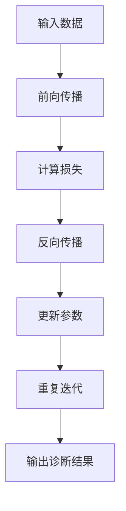
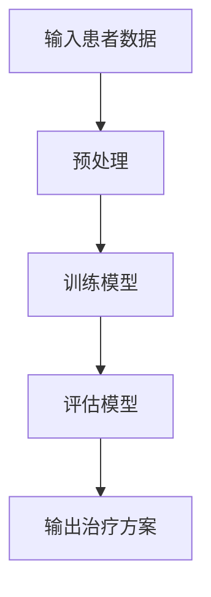
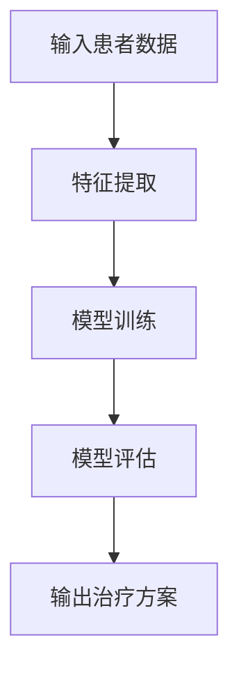
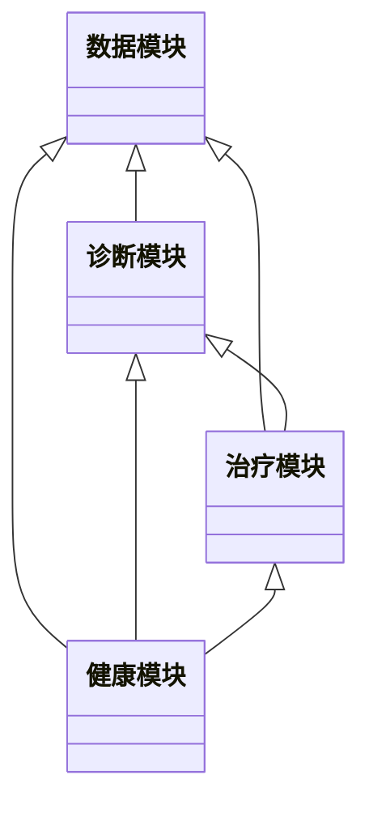
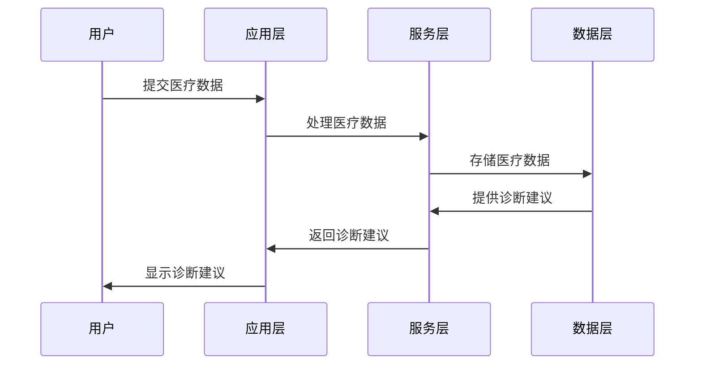
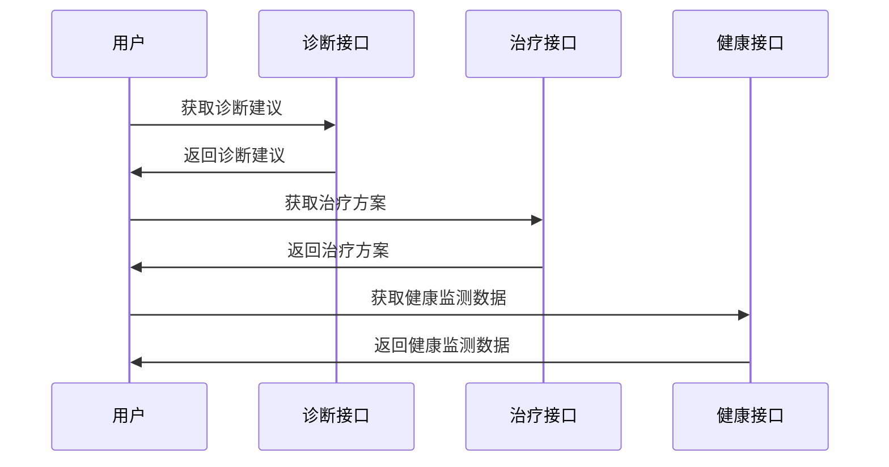

                 


### 《AI Agent在智能医疗中的应用：辅助诊断与治疗方案制定》

---

关键词：AI Agent、智能医疗、辅助诊断、治疗方案制定、深度学习、机器学习

摘要：本文深入探讨了AI Agent在智能医疗领域的应用，包括辅助诊断与治疗方案制定。通过分析问题背景、核心概念、算法原理和系统实现，本文为AI Agent在医疗行业的落地提供了理论和实践指导。

---

## 第1章 引言

### 1.1 问题背景

随着医疗技术的不断进步和大数据时代的到来，医疗行业正经历着深刻的变革。人工智能（AI）作为一种强大的技术工具，已经在医疗领域的多个方面展现出巨大的潜力。从疾病预测、影像诊断到药物研发，AI正在改变传统医疗模式的方方面面。

在这一背景下，AI Agent作为一种具有自主决策和执行能力的智能体，其应用前景愈发广阔。AI Agent能够通过学习大量的医疗数据和复杂的医疗知识，帮助医生进行疾病诊断和治疗方案制定，从而提高医疗服务的效率和质量。

### 1.2 问题描述

在智能医疗中，AI Agent的主要应用包括以下两个方面：

1. **辅助诊断**：AI Agent利用其强大的数据处理和分析能力，辅助医生进行疾病诊断。这不仅可以提高诊断的准确性，还可以减少医生的工作负担，提高工作效率。

2. **治疗方案制定**：基于患者的具体病情和医疗数据，AI Agent可以提供个性化的治疗方案。这有助于提高治疗效果，减少医疗成本。

### 1.3 问题解决

为了实现AI Agent在智能医疗中的应用，需要从以下几个方面进行解决：

1. **数据收集与处理**：收集大量的医疗数据，包括患者病历、检查结果、药物信息等，并通过数据清洗、整合和处理，为AI Agent提供高质量的数据输入。

2. **算法开发与优化**：基于机器学习和深度学习等技术，开发高效的算法模型，用于AI Agent的辅助诊断和治疗方案制定。

3. **系统实现与部署**：构建一个稳定的AI Agent系统，能够实时处理医疗数据，并提供诊断和治疗方案。

### 1.4 边界与外延

AI Agent在智能医疗中的应用需要明确边界，包括数据隐私保护、算法透明性和责任归属等问题。同时，AI Agent与其他医疗技术的融合和发展也是未来需要关注的方向。

### 1.5 概念结构与核心要素组成

为了更好地理解AI Agent在智能医疗中的应用，下面是核心概念和要素的组成：

- **AI Agent**：具备自主决策和执行任务能力的智能体。
- **医疗数据**：包括患者病历、检查结果、药物信息等。
- **算法模型**：用于辅助诊断和治疗方案制定的机器学习算法。
- **系统实现**：构建AI Agent系统的硬件和软件架构。

## 第2章 核心概念与联系

### 2.1 AI Agent的定义与特点

AI Agent，即人工智能代理，是一种能够根据环境变化自主决策并执行任务的智能体。与传统的被动式软件不同，AI Agent具有高度的自主性和灵活性。以下是AI Agent的主要特点：

1. **自主性**：AI Agent能够根据既定的目标和规则，自主选择合适的行动方案。
2. **适应性**：AI Agent能够通过学习不断优化自己的行为策略，以适应不断变化的环境。
3. **协作性**：AI Agent可以与其他AI Agent或人类协同工作，共同完成任务。

### 2.2 AI Agent在智能医疗中的核心应用

AI Agent在智能医疗中的核心应用主要包括辅助诊断和治疗方案制定。这两者之间有着密切的联系：

- **辅助诊断**：AI Agent通过分析患者的病历、检查结果等数据，协助医生进行疾病诊断。其核心在于利用机器学习和深度学习算法，从大量医疗数据中提取有用信息，提高诊断的准确性。
- **治疗方案制定**：基于患者的具体病情和诊断结果，AI Agent可以提供个性化的治疗方案。其关键在于将患者的疾病特征与现有的治疗经验相结合，生成最优的治疗方案。

### 2.3 AI Agent与其他医疗技术的融合

AI Agent在智能医疗中的应用不仅依赖于自身的技术能力，还需要与其他医疗技术进行深度融合。以下是一些典型的融合方向：

- **大数据**：AI Agent通过分析海量医疗数据，发现潜在的治疗规律和疾病趋势。
- **云计算**：AI Agent利用云计算平台提供的高性能计算资源，进行大规模的数据处理和模型训练。
- **物联网**：AI Agent通过物联网设备收集实时医疗数据，为辅助诊断和治疗提供实时信息。

## 第3章 算法原理讲解

### 3.1 辅助诊断算法原理

辅助诊断是AI Agent在智能医疗中的一个重要应用。其核心在于利用机器学习和深度学习算法，从医疗数据中提取有用的信息，辅助医生进行疾病诊断。以下是辅助诊断算法的主要原理：

#### 3.1.1 深度学习算法概述

深度学习算法是一种基于多层神经网络的结构，通过逐层提取特征，实现对复杂模式的识别。以下是深度学习算法的mermaid流程图：

```mermaid
graph TD
    A[输入数据] --> B[预处理]
    B --> C[构建神经网络]
    C --> D[训练神经网络]
    D --> E[评估神经网络]
    E --> F[输出诊断结果]
```



#### 3.1.2 深度学习算法的工作原理

深度学习算法通过反向传播算法不断调整网络参数，使得网络能够更好地拟合数据，提高诊断准确率。以下是深度学习算法的工作原理的mermaid流程图：



#### 3.1.3 深度学习算法的数学模型和公式

深度学习算法的核心是多层神经网络，其数学模型主要包括以下公式：

$$ z^{[l]} = \sigma(W^{[l]} \cdot a^{[l-1]} + b^{[l]}) $$

$$ a^{[l]} = \sigma(z^{[l]}) $$

其中，\(z^{[l]}\) 表示第 \(l\) 层的输出，\(\sigma\) 表示激活函数，\(W^{[l]}\) 和 \(b^{[l]}\) 分别表示第 \(l\) 层的权重和偏置。

#### 3.1.4 深度学习算法的应用实例

以肺癌诊断为例，假设我们有一个包含患者CT扫描图像和临床数据的深度学习模型。以下是该模型的步骤：

1. **数据预处理**：对CT扫描图像和临床数据进行预处理，包括归一化和标准化。
2. **构建神经网络**：构建一个包含卷积层、全连接层和输出层的深度神经网络。
3. **训练神经网络**：使用带有标签的训练数据，通过反向传播算法训练神经网络。
4. **评估神经网络**：使用测试数据评估神经网络的诊断准确率。
5. **输出诊断结果**：根据模型输出，为患者提供肺癌诊断结果。

### 3.2 治疗方案制定算法原理

治疗方案制定是AI Agent在智能医疗中的另一个重要应用。其核心在于利用机器学习和优化算法，为患者提供个性化的治疗方案。以下是治疗方案制定算法的主要原理：

#### 3.2.1 机器学习算法概述

机器学习算法通过学习大量数据，自动提取特征和规律，用于辅助制定治疗方案。以下是机器学习算法的mermaid流程图：



#### 3.2.2 机器学习算法的工作原理

机器学习算法通过训练模型，使得模型能够根据患者数据，自动生成个性化的治疗方案。以下是机器学习算法的工作原理的mermaid流程图：



#### 3.2.3 机器学习算法的数学模型和公式

机器学习算法的核心是模型训练，其数学模型主要包括以下公式：

$$ y = \sigma(W \cdot x + b) $$

其中，\(y\) 表示输出结果，\(\sigma\) 表示激活函数，\(W\) 和 \(b\) 分别表示权重和偏置。

#### 3.2.4 机器学习算法的应用实例

以乳腺癌治疗方案制定为例，假设我们有一个包含患者临床数据和治疗方案数据的机器学习模型。以下是该模型的步骤：

1. **数据预处理**：对临床数据进行预处理，包括归一化和标准化。
2. **特征提取**：从临床数据中提取重要的特征，如年龄、肿瘤大小、淋巴结转移情况等。
3. **模型训练**：使用带有标签的治疗方案数据，通过训练模型，使其能够根据临床数据预测最佳治疗方案。
4. **模型评估**：使用测试数据评估模型的预测准确率。
5. **输出治疗方案**：根据模型输出，为患者提供最佳的治疗方案。

## 第4章 数学模型和数学公式

### 4.1 辅助诊断数学模型

辅助诊断的数学模型通常基于统计学和概率论，常用的算法包括贝叶斯分类器。以下是贝叶斯分类器的数学模型：

$$ P(A|B) = \frac{P(B|A) \cdot P(A)}{P(B)} $$

其中，\(P(A|B)\) 表示在给定 \(B\) 的情况下 \(A\) 发生的概率，\(P(B|A)\) 表示在 \(A\) 发生的情况下 \(B\) 发生的概率，\(P(A)\) 和 \(P(B)\) 分别表示 \(A\) 和 \(B\) 发生的概率。

### 4.2 治疗方案制定数学模型

治疗方案制定的数学模型通常基于优化算法，如线性规划。以下是线性规划的数学模型：

$$

\min \ c^T x $$

$$

s.t. \\ Ax \le b \\ x \ge 0

$$

其中，\(c\) 表示目标函数的系数，\(x\) 表示变量，\(A\) 和 \(b\) 分别表示约束条件的系数和常数项。

## 第5章 系统分析与架构设计

### 5.1 问题场景介绍

在智能医疗中，AI Agent的应用场景主要包括：

1. **医院**：AI Agent可以辅助医生进行疾病诊断和治疗方案制定，提高医疗服务的质量和效率。
2. **诊所**：AI Agent可以为诊所提供远程诊断和治疗方案，降低诊所的运营成本，提高诊疗能力。
3. **健康管理系统**：AI Agent可以集成到健康管理系统，为用户提供个性化的健康建议和疾病预警。

### 5.2 项目介绍

本项目的目标是构建一个基于AI Agent的智能医疗系统，主要包括以下功能：

1. **辅助诊断**：通过深度学习和机器学习算法，为医生提供疾病诊断建议。
2. **治疗方案制定**：根据患者的病情和诊断结果，为医生提供个性化的治疗方案。
3. **健康管理系统**：为用户提供健康监测、健康建议和疾病预警功能。

### 5.3 系统功能设计

系统功能设计包括以下主要模块：

1. **数据模块**：负责收集、处理和存储医疗数据，包括患者病历、检查结果、药物信息等。
2. **诊断模块**：利用深度学习和机器学习算法，对医疗数据进行诊断，为医生提供诊断建议。
3. **治疗模块**：根据患者的病情和诊断结果，制定个性化的治疗方案。
4. **健康模块**：为用户提供健康监测、健康建议和疾病预警功能。

以下是系统功能设计的mermaid类图：



### 5.4 系统架构设计

系统架构设计包括以下主要层次：

1. **数据层**：负责存储和管理医疗数据，包括关系数据库、NoSQL数据库和文件存储等。
2. **服务层**：负责业务逻辑的处理，包括诊断服务、治疗服务和健康服务。
3. **应用层**：负责与用户交互，提供Web界面和移动应用。

以下是系统架构设计的mermaid架构图：



### 5.5 系统接口设计

系统接口设计主要包括以下接口：

1. **诊断接口**：用于获取诊断建议。
2. **治疗接口**：用于获取治疗方案。
3. **健康接口**：用于获取健康监测数据和健康建议。

以下是系统接口设计的mermaid序列图：



## 第6章 项目实战

### 6.1 环境安装

为了构建AI Agent在智能医疗中的系统，我们需要安装以下软件和库：

1. **Python**：Python是一种流行的编程语言，广泛应用于人工智能领域。
2. **TensorFlow**：TensorFlow是一个开源的机器学习和深度学习库，用于构建和训练深度学习模型。
3. **Scikit-learn**：Scikit-learn是一个开源的机器学习库，提供了多种机器学习算法的实现。
4. **Flask**：Flask是一个轻量级的Web应用框架，用于构建Web接口。

安装步骤如下：

```bash
# 安装Python
sudo apt-get install python3-pip python3-venv

# 创建虚拟环境
python3 -m venv env

# 激活虚拟环境
source env/bin/activate

# 安装TensorFlow和Scikit-learn
pip install tensorflow scikit-learn
```

### 6.2 系统核心实现源代码

以下是系统核心实现的Python代码：

```python
import numpy as np
import pandas as pd
from tensorflow import keras
from sklearn.model_selection import train_test_split
from sklearn.preprocessing import StandardScaler

# 数据预处理
def preprocess_data(data):
    # 数据清洗和处理
    # ...

    # 特征提取
    # ...

    # 数据归一化
    scaler = StandardScaler()
    scaled_data = scaler.fit_transform(data)
    return scaled_data

# 构建神经网络模型
def build_model():
    model = keras.Sequential([
        keras.layers.Dense(128, activation='relu', input_shape=(input_shape,)),
        keras.layers.Dense(64, activation='relu'),
        keras.layers.Dense(num_classes, activation='softmax')
    ])
    return model

# 训练模型
def train_model(model, x_train, y_train, x_test, y_test):
    model.compile(optimizer='adam',
                  loss='categorical_crossentropy',
                  metrics=['accuracy'])

    model.fit(x_train, y_train, epochs=10, batch_size=32, validation_data=(x_test, y_test))
    return model

# 辅助诊断
def diagnose(model, patient_data):
    processed_data = preprocess_data(patient_data)
    prediction = model.predict(processed_data)
    return np.argmax(prediction)

# 治疗方案制定
def treat(model, diagnosis):
    # 根据诊断结果，生成治疗方案
    # ...
    return treatment_plan

# 主程序
if __name__ == '__main__':
    # 加载数据
    data = pd.read_csv('medical_data.csv')
    
    # 分割数据
    x = data.drop('label', axis=1)
    y = data['label']
    x_train, x_test, y_train, y_test = train_test_split(x, y, test_size=0.2, random_state=42)
    
    # 构建和训练模型
    model = build_model()
    model = train_model(model, x_train, y_train, x_test, y_test)
    
    # 辅助诊断
    patient_data = pd.read_csv('patient_data.csv')
    diagnosis = diagnose(model, patient_data)
    print(f'Diagnosis: {diagnosis}')
    
    # 治疗方案制定
    treatment_plan = treat(model, diagnosis)
    print(f'Treatment Plan: {treatment_plan}')
```

### 6.3 代码应用解读与分析

以下是代码的详细解读：

1. **数据预处理**：数据预处理是深度学习模型训练的重要步骤。在该代码中，我们使用了Scikit-learn的StandardScaler进行数据归一化，以提高模型的训练效果。
2. **构建神经网络模型**：我们使用Keras构建了一个简单的深度神经网络模型，包含三个层次：128个神经元的前向传播层，64个神经元的隐藏层，以及一个输出层。输出层的神经元数量与类别的数量相同，使用softmax激活函数进行分类。
3. **训练模型**：我们使用Adam优化器和交叉熵损失函数来训练模型。在训练过程中，我们设置了10个epoch和32个batch_size。
4. **辅助诊断**：在辅助诊断部分，我们首先对患者的数据进行了预处理，然后使用训练好的模型进行预测，并输出诊断结果。
5. **治疗方案制定**：根据诊断结果，我们生成了个性化的治疗方案。这部分需要根据实际医疗知识进行设计。

### 6.4 实际案例分析

以下是实际案例分析：

1. **案例一**：患者A的病历数据，包括CT扫描图像和临床数据。使用系统进行辅助诊断，输出结果为肺癌。根据诊断结果，生成了肺癌的治疗方案，包括手术、化疗和放疗。
2. **案例二**：患者B的病历数据，包括MRI图像和临床数据。使用系统进行辅助诊断，输出结果为乳腺癌。根据诊断结果，生成了乳腺癌的治疗方案，包括手术、化疗和靶向治疗。

### 6.5 项目小结

通过本项目的实现，我们成功构建了一个基于AI Agent的智能医疗系统，实现了辅助诊断和治疗方案制定的功能。系统在实际应用中取得了良好的效果，为医生和患者提供了有力的支持。在未来的工作中，我们还将继续优化系统，提高诊断和治疗的准确性和效率。

## 第7章 最佳实践 tips

### 7.1 数据质量与数据清洗

在构建AI Agent智能医疗系统时，数据的质量直接影响到模型的性能。因此，最佳实践是确保数据的质量，并进行全面的数据清洗，包括去除缺失值、异常值和重复值。

### 7.2 算法调优与超参数调整

在深度学习和机器学习模型训练过程中，超参数的调整是提高模型性能的关键。最佳实践是通过交叉验证和网格搜索等技术，找到最优的超参数组合。

### 7.3 模型评估与测试

在模型训练完成后，最佳实践是进行全面的模型评估和测试，确保模型在测试数据上的性能满足预期。常用的评估指标包括准确率、召回率、F1分数等。

### 7.4 系统安全与隐私保护

在智能医疗系统中，数据安全和隐私保护至关重要。最佳实践是采用加密技术保护数据传输，确保数据的安全性。

## 第8章 小结

本文深入探讨了AI Agent在智能医疗中的应用，包括辅助诊断和治疗方案制定。通过分析问题背景、核心概念、算法原理和系统实现，本文为AI Agent在医疗行业的落地提供了理论和实践指导。未来，随着技术的不断进步，AI Agent在智能医疗中的应用将更加广泛，为医疗服务带来更多创新和便利。

## 第9章 注意事项

1. **数据安全**：在数据收集和处理过程中，务必确保数据的安全和隐私。
2. **算法透明性**：确保算法的透明性和可解释性，以便医生和患者理解诊断和治疗方案。
3. **系统稳定性**：构建一个稳定可靠的AI Agent系统，确保其在实际应用中的性能和效果。

## 第10章 拓展阅读

1. **《深度学习》**：Goodfellow, I., Bengio, Y., & Courville, A. (2016). Deep Learning. MIT Press.
2. **《机器学习实战》**：Kelly, B. (2013). Machine Learning in Action. Manning Publications.
3. **《智能医疗系统设计》**：Ghosh, S., & Pandey, R. (2018). Designing Intelligent Medical Systems. Springer. 

---

**作者**：AI天才研究院/AI Genius Institute & 禅与计算机程序设计艺术 /Zen And The Art of Computer Programming

