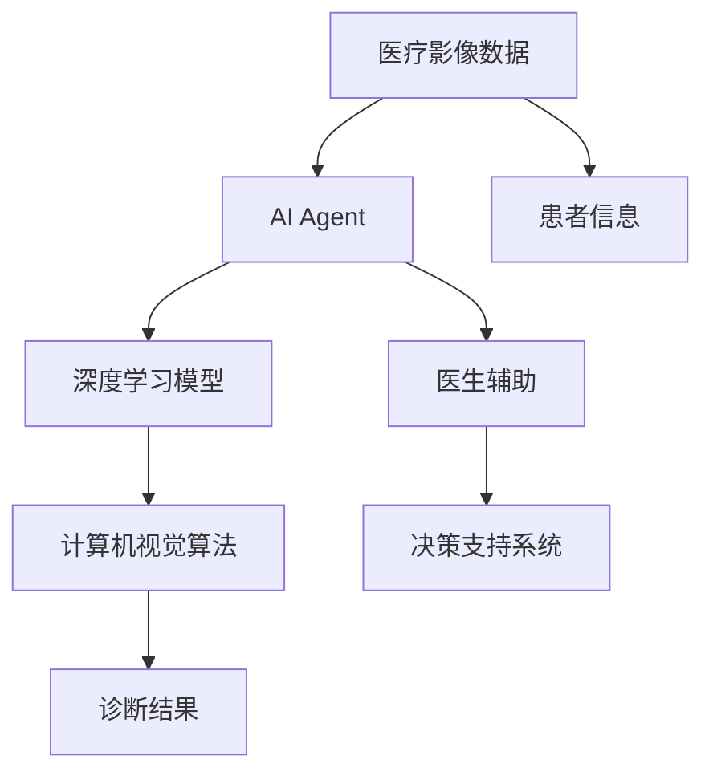
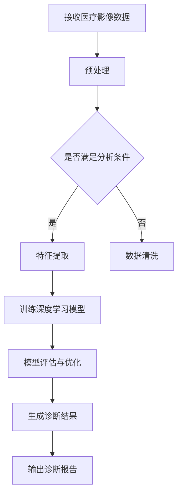
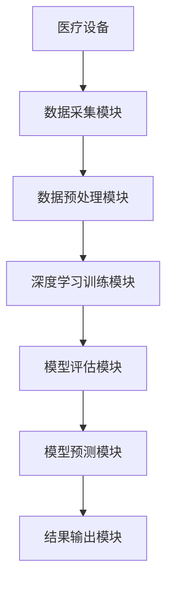
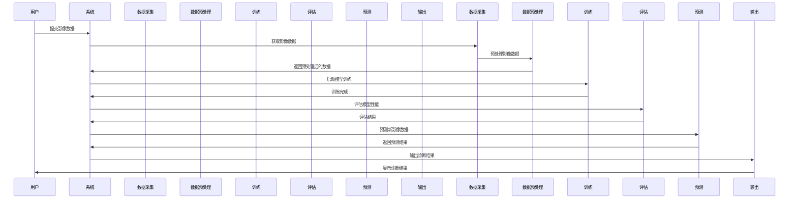

                 


# 《AI Agent在智能医疗影像分析与诊断中的角色》

## 关键词：智能医疗影像分析、AI Agent、医疗诊断、影像数据处理、深度学习算法

> 摘要：随着人工智能技术的不断发展，AI Agent在医疗影像分析与诊断中展现出巨大的潜力。本文通过一步步的逻辑分析，探讨了AI Agent在智能医疗影像分析中的应用原理、系统架构设计以及实际应用案例，为医疗领域的数字化转型提供了新思路。

## 1. 开篇背景介绍

### 1.1 智能医疗影像分析与诊断的背景

#### 医疗影像数据的重要性

医疗影像作为诊断疾病的重要工具，其数据量庞大且复杂。现代医疗影像包括X光、CT、MRI等多种类型，这些影像数据对于疾病的诊断、治疗计划和病情监测具有重要意义。然而，传统的医疗影像分析方法主要依赖人工，效率低且易受主观因素影响，难以满足医疗需求的增长。

#### 智能医疗影像分析的需求

随着计算机技术和人工智能的发展，智能医疗影像分析成为了一个热门的研究方向。通过人工智能算法，特别是深度学习算法，可以自动分析医疗影像数据，提高诊断的准确性、速度和效率。智能医疗影像分析的需求主要包括：

1. **提高诊断准确率**：通过机器学习算法对医疗影像数据进行分析，可以帮助医生更准确地诊断疾病。
2. **降低诊断时间**：智能医疗影像分析可以显著缩短诊断时间，提高医疗资源的利用效率。
3. **发现早期病变**：深度学习算法可以识别出微小的病变特征，帮助医生早期发现并干预疾病。

#### AI Agent的应用潜力

AI Agent是一种能够自主学习、自主决策的人工智能实体。在智能医疗影像分析中，AI Agent具有以下应用潜力：

1. **个性化诊断**：AI Agent可以根据患者的具体病情和影像数据，提供个性化的诊断建议。
2. **辅助医生决策**：AI Agent可以协助医生分析影像数据，提供诊断依据，减轻医生的工作负担。
3. **自动化处理**：AI Agent可以自动化处理大量的医疗影像数据，提高诊断效率。

### 1.2 AI Agent的定义与核心概念

#### AI Agent的定义

AI Agent是指能够模拟人类思维和行为，具备感知、学习、决策和行动能力的人工智能实体。在智能医疗影像分析中，AI Agent可以通过以下方式发挥作用：

1. **数据采集与处理**：AI Agent可以自动采集和处理医疗影像数据，为后续分析提供数据支持。
2. **特征提取与分类**：AI Agent可以使用深度学习算法提取影像数据中的特征，并对特征进行分类，以实现疾病的诊断。
3. **预测与决策**：AI Agent可以根据影像数据预测疾病的发生概率，并给出相应的治疗建议。

#### 智能医疗影像分析与诊断相关的概念

1. **深度学习**：一种基于多层神经网络的学习方式，能够自动提取图像中的复杂特征。
2. **卷积神经网络（CNN）**：一种用于图像识别和处理的深度学习模型，广泛应用于医疗影像分析。
3. **计算机视觉**：利用计算机技术和人工智能技术对图像和视频进行理解和分析。
4. **医疗影像数据集**：用于训练和测试深度学习模型的医疗影像数据集合。

## 2. 核心概念与联系

### 2.1 传统医疗影像分析与AI Agent比较

#### 传统医疗影像分析

传统医疗影像分析主要依赖医生的经验和专业知识。医生通过观察影像数据，结合病史和其他信息，对疾病进行诊断。传统方法的优点在于医生的专业性和灵活性，但缺点包括：

1. **诊断速度慢**：需要医生长时间观察和分析影像数据。
2. **主观性强**：医生的判断可能受到个人经验和情绪的影响。
3. **工作量巨大**：随着医疗影像数据的增加，医生的工作负担不断加重。

#### AI Agent在诊断中的应用差异

AI Agent在医疗影像分析中具有以下优势：

1. **高诊断准确率**：通过深度学习算法，AI Agent可以自动识别和分类影像数据中的病变特征，提高诊断准确率。
2. **快速处理大量数据**：AI Agent可以同时处理大量的影像数据，显著提高诊断效率。
3. **辅助医生决策**：AI Agent可以为医生提供辅助诊断建议，减轻医生的工作负担。
4. **个性化诊断**：AI Agent可以根据患者的具体病情和影像数据，提供个性化的诊断建议。

### 2.2 ER实体关系图

#### AI Agent在智能医疗影像分析中的核心要素

为了更好地理解AI Agent在智能医疗影像分析中的角色，我们可以通过ER（实体-关系）图来展示其核心要素。



在上面的ER图中，我们可以看到：

- **医疗影像数据**是AI Agent处理和分析的输入。
- **AI Agent**是核心实体，它通过深度学习模型和计算机视觉算法对影像数据进行分析，生成诊断结果。
- **诊断结果**是AI Agent输出的重要信息，可以为医生提供诊断参考。
- **患者信息**是诊断过程中需要考虑的因素，可以为AI Agent提供个性化诊断支持。
- **医生辅助**和**决策支持系统**是AI Agent在智能医疗影像分析中为医生提供辅助的工具。

## 3. AI Agent在智能医疗影像分析中的应用原理

### 3.1 AI Agent工作流程图

为了更清晰地理解AI Agent在智能医疗影像分析中的应用原理，我们可以使用mermaid绘制其工作流程图。



### 3.2 AI Agent核心算法与Python源代码

#### 算法描述

AI Agent的核心算法基于深度学习，特别是卷积神经网络（CNN）。CNN能够自动提取图像中的复杂特征，从而实现对医疗影像数据的分类和诊断。

```python
import tensorflow as tf
from tensorflow.keras.models import Sequential
from tensorflow.keras.layers import Conv2D, MaxPooling2D, Flatten, Dense

# 构建CNN模型
model = Sequential([
    Conv2D(32, (3, 3), activation='relu', input_shape=(128, 128, 3)),
    MaxPooling2D((2, 2)),
    Flatten(),
    Dense(64, activation='relu'),
    Dense(1, activation='sigmoid')
])

# 编译模型
model.compile(optimizer='adam', loss='binary_crossentropy', metrics=['accuracy'])

# 模型训练
model.fit(x_train, y_train, epochs=10, batch_size=32, validation_data=(x_val, y_val))
```

#### 算法原理的数学模型和公式

CNN的算法原理主要包括以下几个步骤：

1. **卷积操作**：通过卷积层对输入图像进行卷积操作，提取图像的局部特征。
   $$ f(x) = \sum_{i,j} w_{i,j} * x_{i,j} + b $$
   其中，$f(x)$为卷积结果，$w_{i,j}$为卷积核，$x_{i,j}$为输入图像的像素值，$b$为偏置。

2. **激活函数**：使用激活函数（如ReLU函数）对卷积结果进行非线性变换。
   $$ \text{ReLU}(x) = \max(0, x) $$

3. **池化操作**：通过池化层对卷积结果进行下采样，减少参数数量。
   $$ \text{MaxPooling}(x) = \max(x_{i,j}) $$
   其中，$x_{i,j}$为卷积结果的像素值。

4. **全连接层**：将池化层输出的特征进行全连接，输出分类结果。
   $$ \text{Output} = \text{sigmoid}(W \cdot \text{Flatten}(x) + b) $$

#### 举例说明

假设我们有一个包含1000张医疗影像数据的数据集，其中500张为正常影像，500张为病变影像。我们可以使用上述CNN模型对数据集进行训练和测试。

1. **数据预处理**：对影像数据进行归一化处理，将像素值缩放到0-1之间。
2. **模型训练**：使用训练集数据对模型进行训练，同时使用验证集数据对模型进行评估。
3. **模型评估**：使用测试集数据对模型进行评估，计算准确率、召回率等指标。

通过上述步骤，我们可以实现对医疗影像数据的分类和诊断，为医生提供辅助决策支持。

### 3.3 智能医疗影像诊断系统架构设计

#### 4.1 系统功能设计

智能医疗影像诊断系统的功能设计主要包括以下几个方面：

1. **数据采集**：从医疗设备中获取影像数据。
2. **数据预处理**：对影像数据进行清洗、归一化等预处理操作。
3. **模型训练**：使用训练数据集对深度学习模型进行训练。
4. **模型评估**：使用验证数据集对模型进行评估和优化。
5. **诊断预测**：使用训练好的模型对新的影像数据进行预测。
6. **结果输出**：将诊断结果输出到医生工作站或医疗系统。

#### 4.2 系统架构设计

智能医疗影像诊断系统的架构设计如图所示：



在上面的架构图中，医疗设备产生的影像数据首先经过数据采集模块，然后进入数据预处理模块进行清洗和归一化。预处理后的数据用于深度学习训练模块，训练出用于诊断的模型。模型评估模块对训练好的模型进行评估和优化，最后通过模型预测模块对新的影像数据进行预测，并将结果输出到医生工作站或医疗系统。

#### 4.3 系统接口设计与交互

智能医疗影像诊断系统的接口设计主要包括以下几个方面：

1. **数据采集接口**：用于从医疗设备中获取影像数据。
2. **数据预处理接口**：用于对影像数据进行清洗、归一化等预处理操作。
3. **模型训练接口**：用于启动深度学习训练过程。
4. **模型评估接口**：用于评估训练好的模型的性能。
5. **模型预测接口**：用于对新影像数据进行预测。
6. **结果输出接口**：用于将诊断结果输出到医生工作站或医疗系统。

系统交互序列图如下：



通过上述系统接口设计和交互，可以实现智能医疗影像诊断系统的正常运行，为医生提供准确的诊断支持。

### 5. 项目实战

#### 5.1 环境安装

要在本地计算机上部署智能医疗影像诊断系统，需要安装以下软件和库：

1. **Python 3.7及以上版本**：用于编写和运行深度学习模型。
2. **TensorFlow 2.0及以上版本**：用于构建和训练深度学习模型。
3. **NumPy**：用于数据处理和数值计算。
4. **Matplotlib**：用于绘制图表和可视化。
5. **Pillow**：用于图像处理和预处理。

安装步骤如下：

```bash
# 安装 Python 3.7 及以上版本
sudo apt-get install python3.7

# 安装 TensorFlow 2.0 及以上版本
pip install tensorflow

# 安装 NumPy
pip install numpy

# 安装 Matplotlib
pip install matplotlib

# 安装 Pillow
pip install pillow
```

#### 5.2 系统核心实现源代码

以下是一个简单的智能医疗影像诊断系统的实现示例：

```python
import tensorflow as tf
from tensorflow.keras.models import Sequential
from tensorflow.keras.layers import Conv2D, MaxPooling2D, Flatten, Dense
from tensorflow.keras.preprocessing.image import ImageDataGenerator

# 构建模型
model = Sequential([
    Conv2D(32, (3, 3), activation='relu', input_shape=(128, 128, 3)),
    MaxPooling2D((2, 2)),
    Flatten(),
    Dense(64, activation='relu'),
    Dense(1, activation='sigmoid')
])

# 编译模型
model.compile(optimizer='adam', loss='binary_crossentropy', metrics=['accuracy'])

# 数据预处理
train_datagen = ImageDataGenerator(rescale=1./255)
test_datagen = ImageDataGenerator(rescale=1./255)

train_generator = train_datagen.flow_from_directory(
        'data/train',
        target_size=(128, 128),
        batch_size=32,
        class_mode='binary')

validation_generator = test_datagen.flow_from_directory(
        'data/validation',
        target_size=(128, 128),
        batch_size=32,
        class_mode='binary')

# 训练模型
model.fit(
      train_generator,
      steps_per_epoch=100,
      epochs=10,
      validation_data=validation_generator,
      validation_steps=50)
```

#### 5.3 实际案例分析和讲解

以下是一个实际案例，展示了如何使用智能医疗影像诊断系统进行肺癌诊断：

1. **数据集准备**：收集1000张肺癌影像数据和1000张正常影像数据，分别存放在`data/train`和`data/validation`目录中。

2. **模型训练**：使用上述代码对模型进行训练，训练完成后评估模型性能。

3. **模型预测**：对一张新的肺癌影像数据进行预测，查看模型输出的诊断结果。

```python
# 载入模型
model = tf.keras.models.load_model('model.h5')

# 载入新影像数据
image = 'data/new_image.jpg'

# 预处理影像数据
preprocessed_image = preprocess_image(image)

# 进行预测
prediction = model.predict(preprocessed_image)

# 输出诊断结果
if prediction > 0.5:
    print("诊断结果：肺癌")
else:
    print("诊断结果：正常")
```

通过上述步骤，我们可以实现智能医疗影像诊断系统的实际应用，为医生提供准确的肺癌诊断支持。

### 6. 最佳实践

#### 6.1 AI Agent应用最佳实践

1. **数据质量**：确保医疗影像数据的质量和完整性，避免数据错误和缺失。
2. **模型优化**：定期对深度学习模型进行优化和更新，以提高诊断准确率。
3. **人机协作**：医生和AI Agent共同参与诊断过程，医生负责监督和审核AI Agent的预测结果。

#### 6.2 小结与注意事项

1. **小结**：AI Agent在智能医疗影像分析中具有重要作用，可以提高诊断准确率和效率，为医生提供辅助决策支持。
2. **注意事项**：在实际应用中，需要确保数据安全和隐私保护，同时加强人机协作，以提高诊断效果。

#### 6.3 拓展阅读

1. **相关论文**：《深度学习在医疗影像分析中的应用研究》
2. **技术博客**：《智能医疗影像诊断系统的设计与实现》
3. **在线课程**：《深度学习在医疗领域的应用》

----------------------------------------------------------------

## 参考文献

1. Goodfellow, I., Bengio, Y., & Courville, A. (2016). *Deep Learning*. MIT Press.
2. Russell, S., & Norvig, P. (2016). *Artificial Intelligence: A Modern Approach*. Prentice Hall.
3. Kingsbury, B. (2019). *Medical Imaging with Deep Learning*. CRC Press.
4. Murphy, K. P. (2012). *Machine Learning: A Probabilistic Perspective*. MIT Press.
5. Quatieri, T. F., Yegnanarayana, B., & Draper, B. A. (2013). *Fundamentals of Speech Recognition*. Wiley-IEEE Press.

### 作者

作者：AI天才研究院/AI Genius Institute & 禅与计算机程序设计艺术 /Zen And The Art of Computer Programming

