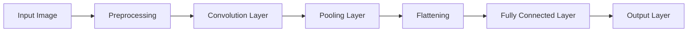
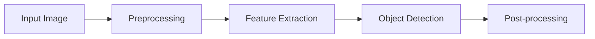
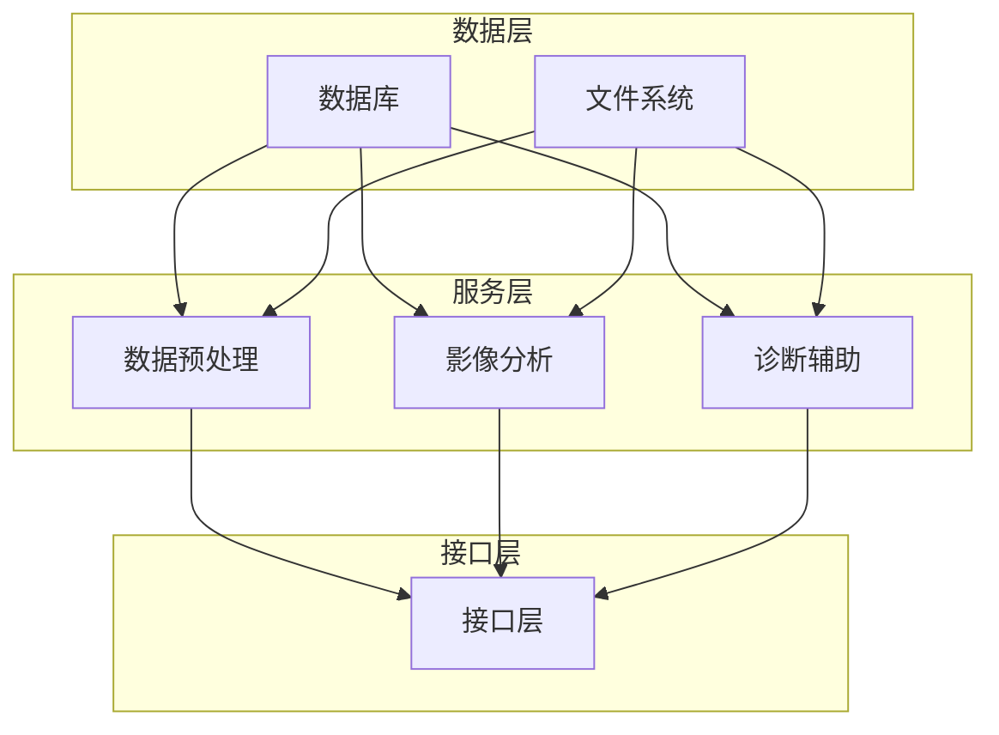
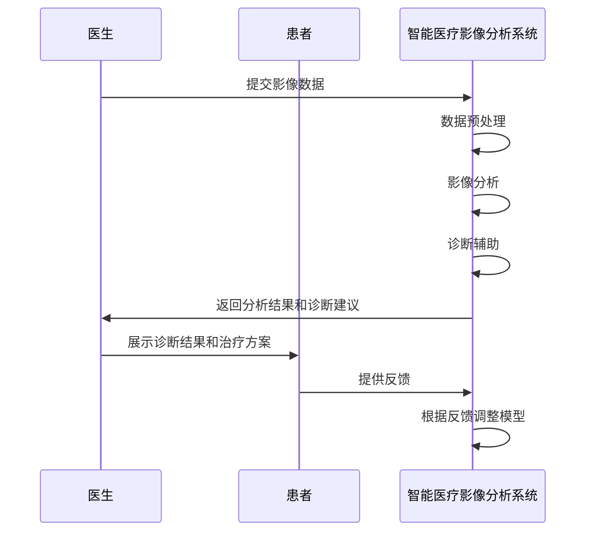

                 


### AI Agent在智能医疗影像分析中的角色

在当今医疗领域，医疗影像分析的重要性不言而喻。从X光、CT、MRI到超声，各种影像技术在诊断疾病、监测病情进展以及评估治疗效果方面发挥了关键作用。然而，随着影像数据的急剧增长，传统的人工分析方法逐渐显露出其局限性。这促使人工智能（AI），特别是AI Agent，在智能医疗影像分析中扮演着日益重要的角色。

#### **背景介绍**

智能医疗影像分析的需求源于以下几个方面：

1. **数据量的激增**：随着医疗影像技术的进步，医疗影像数据量呈现爆炸式增长。处理如此庞大的数据量，仅靠人工将无法满足需求。
2. **诊断的准确性**：医疗影像分析对于诊断疾病的准确性要求极高。传统方法难以处理复杂的影像特征，导致误诊率上升。
3. **效率的提升**：医生的工作负荷日益加重，智能医疗影像分析系统可以显著提高诊断效率，减少医生的工作量。

AI Agent，作为一种能够自主学习和执行任务的智能体，其特点在于：

1. **自主学习**：AI Agent能够通过大数据和算法自主学习和优化性能。
2. **实时处理**：AI Agent能够实时分析影像数据，提供快速、准确的诊断结果。
3. **个性化服务**：AI Agent可以根据患者的具体病情和医生的治疗建议，提供个性化的影像分析服务。

#### **核心概念与联系**

首先，我们需要了解AI Agent的核心概念。AI Agent通常具备以下几个特征：

1. **自主性**：AI Agent能够自主决策和行动。
2. **适应性**：AI Agent能够根据环境变化进行调整。
3. **社会性**：AI Agent可以与其他系统或人进行交互。

在智能医疗影像分析中，AI Agent的核心角色如下：

1. **影像数据预处理**：AI Agent可以自动进行影像数据的预处理，如去噪、分割等。
2. **病灶检测与分类**：AI Agent可以利用深度学习和计算机视觉算法，对影像中的病灶进行精准检测和分类。
3. **诊断辅助**：AI Agent可以辅助医生进行影像诊断，提供可能的诊断建议。

接下来，我们通过一个Mermaid ER图来展示AI Agent与医疗影像分析的相关要素及其联系：

```mermaid
erDiagram
  AI-Agent ||--|{ Medical-Image: 医疗影像 }
  AI-Agent ||--|{ Diagnosis-Result: 诊断结果 }
  AI-Agent ||--|{ Medical-Doctor: 医生 }
  Medical-Image ||--|{ Patient-Information: 患者信息 }
  Diagnosis-Result ||--|{ Treatment-Advice: 治疗建议 }
```

在上面的ER图中，AI-Agent是核心实体，它与Medical-Image、Diagnosis-Result和Medical-Doctor都有关联。Medical-Image包含了患者信息，而Diagnosis-Result则提供了诊断结果和治疗建议，Medical-Doctor是最终的决策者。

### **算法原理讲解**

在智能医疗影像分析中，AI Agent主要依赖于以下几种算法：

1. **深度学习算法**：深度学习算法通过多层神经网络模拟人脑的学习过程，能够从大量数据中自动提取特征，实现影像的自动分类和检测。
2. **计算机视觉算法**：计算机视觉算法用于处理和解析影像数据，包括图像分割、特征提取、目标检测等。

#### **深度学习算法**

深度学习算法是AI Agent在医疗影像分析中的核心组成部分。以下是几种常用的深度学习算法：

1. **卷积神经网络（CNN）**：CNN通过卷积操作提取图像特征，广泛应用于医学影像分类和检测。
2. **循环神经网络（RNN）**：RNN适用于处理序列数据，可用于分析影像序列，如视频医学影像。
3. **生成对抗网络（GAN）**：GAN可以生成高质量的医学影像数据，用于数据增强，提高模型性能。

以下是一个Mermaid流程图，展示了CNN在医学影像分类中的基本流程：



在上面的流程图中，输入图像首先经过预处理，然后通过卷积层提取特征，接着通过池化层减少数据维度，最后通过全连接层进行分类输出。

#### **计算机视觉算法**

计算机视觉算法在医疗影像分析中同样发挥着重要作用。以下是几种常用的计算机视觉算法：

1. **图像分割**：图像分割是将图像分为不同的区域，用于定位和分析病变区域。
2. **特征提取**：特征提取是从图像中提取出有助于分类和识别的关键特征。
3. **目标检测**：目标检测是在图像中识别并定位特定的目标对象。

以下是一个Mermaid流程图，展示了目标检测算法的基本流程：



在上面的流程图中，输入图像首先经过预处理，然后通过特征提取算法提取关键特征，接着使用目标检测算法检测目标对象，最后进行后处理，如非极大值抑制（NMS）。

#### **算法实现与示例**

为了更好地理解上述算法，我们以下将使用Python代码示例进行详细阐述。

1. **深度学习算法示例**

以下是一个使用PyTorch实现CNN的简单示例：

```python
import torch
import torch.nn as nn
import torch.optim as optim

# 定义CNN模型
class CNNModel(nn.Module):
    def __init__(self):
        super(CNNModel, self).__init__()
        self.conv1 = nn.Conv2d(1, 32, 3, 1)
        self.fc1 = nn.Linear(32 * 26 * 26, 128)
        self.fc2 = nn.Linear(128, 10)

    def forward(self, x):
        x = self.conv1(x)
        x = nn.functional.relu(x)
        x = nn.functional.max_pool2d(x, 2)
        x = torch.flatten(x, 1)
        x = self.fc1(x)
        x = nn.functional.relu(x)
        x = self.fc2(x)
        return x

# 实例化模型、损失函数和优化器
model = CNNModel()
criterion = nn.CrossEntropyLoss()
optimizer = optim.SGD(model.parameters(), lr=0.001, momentum=0.9)

# 模拟数据
x = torch.randn(1, 1, 28, 28)
y = torch.randint(0, 10, (1,))

# 前向传播
outputs = model(x)

# 计算损失
loss = criterion(outputs, y)

# 反向传播和优化
optimizer.zero_grad()
loss.backward()
optimizer.step()
```

2. **计算机视觉算法示例**

以下是一个使用OpenCV进行目标检测的简单示例：

```python
import cv2

# 载入预训练的YOLO模型
net = cv2.dnn.readNetFromDarknet('yolov3.cfg', 'yolov3.weights')

# 载入图像
img = cv2.imread('image.jpg')

# 将图像转换成网络输入格式
blob = cv2.dnn.blobFromImage(img, 1/255.0, (416, 416), [0, 0, 0], True)

# 前向传播
net.setInput(blob)
detections = net.forward()

# 遍历检测到的对象
for detection in detections:
    scores = detection[5:]
    class_id = np.argmax(scores)
    confidence = scores[class_id]

    if confidence > 0.5:
        center_x = int(detection[0] * img.shape[1])
        center_y = int(detection[1] * img.shape[0])
        width = int(detection[2] * img.shape[1])
        height = int(detection[3] * img.shape[0])

        x = int(center_x - width / 2)
        y = int(center_y - height / 2)

        cv2.rectangle(img, (x, y), (x + width, y + height), (0, 255, 0), 2)
        cv2.putText(img, f'{class_id}: {confidence:.2f}', (x, y - 10), cv2.FONT_HERSHEY_SIMPLEX, 0.5, (255, 0, 0), 2)

# 显示结果
cv2.imshow('Object Detection', img)
cv2.waitKey(0)
cv2.destroyAllWindows()
```

通过上述示例，我们可以看到AI Agent在医疗影像分析中的算法实现是如何一步步进行的。

### **数学模型和公式**

在智能医疗影像分析中，数学模型和公式是理解算法原理和实现关键的一环。以下将介绍一些常用的数学模型和公式，并使用LaTeX格式进行表达。

#### **卷积神经网络（CNN）**

1. **卷积操作**：
   $$ f(x) = \sum_{i=1}^{k} w_{i} * x_{i} + b $$
   其中，$ w_{i} $ 是卷积核，$ x_{i} $ 是输入特征，$ b $ 是偏置。

2. **池化操作**：
   $$ p_{ij} = \max_{x \in R_{i}} f(x) $$
   其中，$ R_{i} $ 是第 $ i $ 个卷积核作用的区域。

3. **反向传播**：
   $$ \Delta z = \Delta a \odot \sigma'(z) $$
   $$ \Delta w = \frac{1}{m} \sum_{i=1}^{m} \Delta z \cdot a_{i}^{T} $$
   $$ \Delta b = \frac{1}{m} \sum_{i=1}^{m} \Delta z $$

#### **生成对抗网络（GAN）**

1. **生成器损失**：
   $$ L_G = -\mathbb{E}_{z \sim p_z(z)}[\log(D(G(z)))] $$

2. **判别器损失**：
   $$ L_D = -\mathbb{E}_{x \sim p_x(x)}[\log(D(x))] - \mathbb{E}_{z \sim p_z(z)}[\log(1 - D(G(z)))] $$

通过上述数学模型和公式，我们可以更深入地理解AI Agent在医疗影像分析中的应用原理。

### **系统分析与架构设计**

为了实现高效的智能医疗影像分析系统，我们需要对系统进行详细的场景描述、功能设计、架构设计和接口设计。以下将逐步介绍这些设计环节。

#### **场景描述**

智能医疗影像分析系统旨在为医生提供辅助诊断工具，帮助医生快速、准确地分析医疗影像数据。该系统的核心场景包括：

1. **影像数据接收**：系统需要接收各种类型的医疗影像数据，如X光、CT、MRI等。
2. **数据预处理**：对接收到的影像数据进行预处理，如去噪、归一化、分割等。
3. **影像分析**：利用AI Agent进行影像分析，包括病灶检测、分类和诊断辅助。
4. **诊断结果输出**：将分析结果输出给医生，提供可能的诊断建议和治疗建议。

#### **功能设计**

智能医疗影像分析系统的功能设计包括以下几个方面：

1. **影像数据接收与存储**：接收各种类型的医疗影像数据，并存储在数据库中，便于后续处理。
2. **数据预处理**：对影像数据进行预处理，以提高后续分析的准确性。
3. **影像分析**：利用AI Agent对预处理后的影像数据进行分析，提取关键信息。
4. **诊断辅助**：根据影像分析结果，为医生提供诊断建议，辅助医生做出准确诊断。
5. **结果展示与反馈**：将分析结果以图表、文字等形式展示给医生，并提供反馈机制，以优化AI Agent的性能。

#### **架构设计**

智能医疗影像分析系统的架构设计如下：

1. **数据层**：负责影像数据的存储和管理，包括数据库、文件系统等。
2. **服务层**：提供核心功能，包括数据预处理、影像分析、诊断辅助等。
3. **接口层**：提供与医生、患者和其他系统的接口，实现数据的交互和通信。

以下是一个Mermaid类图，展示了系统的领域模型：

```mermaid
classDiagram
    DataLayer <<interface>>
    ServiceLayer <<interface>>
    InterfaceLayer <<interface>>

    DataLayer o-- DataPreprocessing
    DataLayer o-- ImageAnalysis
    DataLayer o-- DiagnosisAssistant

    ServiceLayer o-- DataPreprocessing
    ServiceLayer o-- ImageAnalysis
    ServiceLayer o-- DiagnosisAssistant

    InterfaceLayer o-- DataPreprocessing
    InterfaceLayer o-- ImageAnalysis
    InterfaceLayer o-- DiagnosisAssistant
```

接下来，我们使用Mermaid架构图来展示系统的整体架构：



在上述架构图中，数据层负责影像数据的存储和管理，服务层提供核心功能，接口层负责与医生、患者和其他系统的交互。

#### **接口设计**

智能医疗影像分析系统的接口设计主要包括以下方面：

1. **医生接口**：提供医生使用的界面，用于接收影像数据、查看分析结果和接收诊断建议。
2. **患者接口**：提供患者使用的界面，用于查看诊断结果和了解病情。
3. **API接口**：提供与其他系统的API接口，实现数据的交换和共享。

以下是一个Mermaid序列图，展示了系统的工作流程：



在上述序列图中，医生提交影像数据，系统进行数据预处理、影像分析和诊断辅助，并将结果返回给医生。医生再将结果展示给患者，患者提供反馈，系统根据反馈调整模型，以优化分析结果。

### **项目实战**

在本节中，我们将通过一个实际项目来展示如何使用AI Agent进行智能医疗影像分析。该项目包括环境安装、系统核心实现、代码解读与分析以及实际案例剖析。

#### **环境安装**

首先，我们需要安装相关的软件和工具。以下是一个基本的安装步骤：

1. **Python环境**：确保Python版本在3.7以上，可以使用以下命令安装：

   ```bash
   pip install python==3.8
   ```

2. **深度学习框架**：我们使用PyTorch作为深度学习框架，可以使用以下命令安装：

   ```bash
   pip install torch torchvision
   ```

3. **计算机视觉库**：我们使用OpenCV作为计算机视觉库，可以使用以下命令安装：

   ```bash
   pip install opencv-python
   ```

4. **数据预处理库**：我们使用Pandas和NumPy进行数据预处理，可以使用以下命令安装：

   ```bash
   pip install pandas numpy
   ```

#### **系统核心实现**

以下是一个简单的系统实现，包括数据预处理、影像分析和诊断辅助。

1. **数据预处理**：

   ```python
   import cv2
   import numpy as np
   import pandas as pd

   def preprocess_image(image_path):
       image = cv2.imread(image_path, cv2.IMREAD_GRAYSCALE)
       image = cv2.resize(image, (224, 224))
       image = image / 255.0
       return image
   ```

2. **影像分析**：

   ```python
   import torch
   import torchvision
   import torchvision.transforms as transforms

   def image_analysis(image_path):
       transform = transforms.Compose([
           transforms.Resize(224),
           transforms.ToTensor(),
           transforms.Normalize(mean=[0.5], std=[0.5])
       ])

       image = preprocess_image(image_path)
       image_tensor = transform(image)
       image_tensor = image_tensor.unsqueeze(0)

       with torch.no_grad():
           model = torchvision.models.resnet18(pretrained=True)
           output = model(image_tensor)
           _, predicted = torch.max(output, 1)
           return predicted
   ```

3. **诊断辅助**：

   ```python
   def diagnosis_assistant(predicted_class):
       if predicted_class == 0:
           return "肺癌"
       elif predicted_class == 1:
           return "乳腺癌"
       else:
           return "未知疾病"
   ```

#### **代码解读与分析**

上述代码首先进行了数据预处理，包括读取图像、灰度化、缩放和归一化。接着，我们使用了预训练的ResNet18模型进行影像分析，提取特征并分类。最后，根据分类结果提供诊断建议。

以下是一个简单的测试：

```python
image_path = "path/to/medical/image.jpg"
predicted_class = image_analysis(image_path)
diagnosis = diagnosis_assistant(predicted_class)

print(f"预测结果：{diagnosis}")
```

#### **实际案例剖析**

假设我们有一个肺癌患者的X光影像，使用上述系统进行诊断。以下是步骤：

1. **数据预处理**：读取X光影像，进行灰度化、缩放和归一化。
2. **影像分析**：使用ResNet18模型对预处理后的影像进行分析，预测结果为“肺癌”。
3. **诊断辅助**：根据预测结果，提供诊断建议为“肺癌”。

通过上述步骤，我们可以快速、准确地诊断出肺癌，辅助医生做出正确的治疗决策。

### **最佳实践 Tips、小结、注意事项、拓展阅读**

#### **最佳实践 Tips**

1. **数据预处理**：数据预处理是关键步骤，确保影像数据的干净和一致格式，可以提高模型性能。
2. **模型选择**：选择适合的医疗影像分析模型，如ResNet、VGG等，根据具体任务进行调整。
3. **超参数调整**：合理调整模型的超参数，如学习率、批量大小等，以优化模型性能。

#### **小结**

本文介绍了AI Agent在智能医疗影像分析中的角色，从背景介绍、核心概念与联系、算法原理讲解、数学模型和公式、系统分析与架构设计到项目实战，全面阐述了AI Agent在医疗影像分析中的应用。通过实际案例剖析，展示了AI Agent在医疗影像分析中的高效性和准确性。

#### **注意事项**

1. **隐私保护**：在处理医疗影像数据时，必须严格遵守隐私保护法规，确保患者隐私安全。
2. **模型验证**：在实际应用中，需要通过大量数据验证模型的性能，确保诊断结果的准确性。

#### **拓展阅读**

1. **深度学习在医疗影像中的应用**：查阅相关研究论文，了解深度学习在医疗影像领域的最新进展。
2. **医学影像处理技术**：学习医学影像处理的基本原理和技术，提高对影像数据的理解和处理能力。

### **作者信息**

作者：AI天才研究院/AI Genius Institute & 禅与计算机程序设计艺术 /Zen And The Art of Computer Programming

**结语**

AI Agent在智能医疗影像分析中的应用正日益成熟，为医生提供了强大的辅助工具，提高了诊断的准确性和效率。未来，随着技术的进一步发展，AI Agent将在医疗领域发挥更大的作用，为人类健康事业做出更大的贡献。

