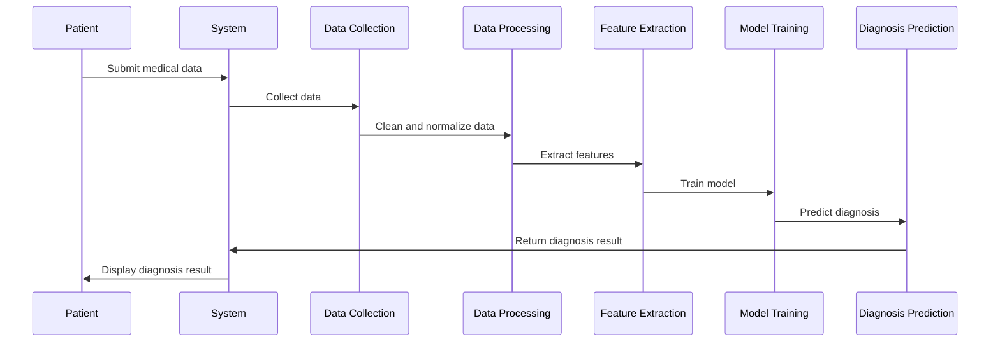
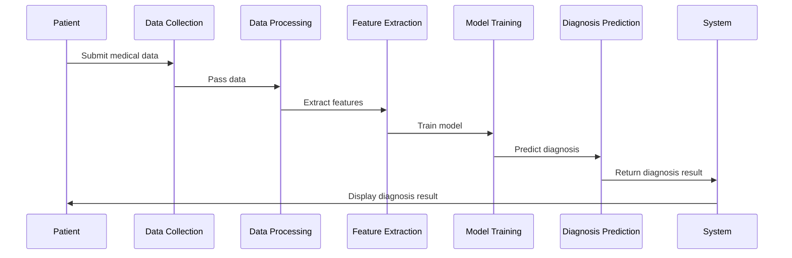

                 

# 《AI Agent在智能医疗诊断中的应用》

## 关键词

- AI Agent
- 智能医疗诊断
- 强化学习
- 数据分析
- 机器学习算法

## 摘要

本文将深入探讨AI Agent在智能医疗诊断中的应用，首先介绍AI Agent和智能医疗诊断的基本概念，随后详细讲解AI Agent在智能医疗诊断中的技术原理，包括算法、数学模型和关键代码。接着，通过具体案例分析展示AI Agent的实际应用效果，并给出实践指南，最后总结和展望AI Agent在智能医疗诊断中的未来前景。

## 第一部分：背景与核心概念

### 第1章：AI Agent与智能医疗诊断概述

#### 1.1.1 AI Agent的定义与特点

AI Agent，即人工智能代理，是指具有自主决策能力、可以在特定环境中执行任务的人工智能实体。AI Agent的核心在于其自主学习和自主行动的能力，能够通过不断学习环境中的信息和经验，自主调整自己的行为，以达到目标。

AI Agent的主要特点包括：

1. **自主性**：AI Agent可以自主决策和执行任务，不需要人工干预。
2. **适应性**：AI Agent能够根据环境和任务的变化，自主调整其行为策略。
3. **交互性**：AI Agent可以与人类和其他AI Agent进行交互，获取信息和知识。

#### 1.1.2 智能医疗诊断的概念与需求

智能医疗诊断是指利用人工智能技术，特别是机器学习和深度学习技术，对医学影像、病例数据等进行处理和分析，以辅助医生进行疾病诊断。智能医疗诊断的需求主要包括：

1. **提高诊断准确性**：通过大数据分析和深度学习算法，智能医疗诊断可以提高疾病诊断的准确性。
2. **减少医生工作量**：智能医疗诊断可以辅助医生进行初步诊断，减少医生的工作量。
3. **优化医疗资源分配**：智能医疗诊断可以帮助医生更好地了解患者的病情，从而优化医疗资源的分配。

#### 1.1.3 AI Agent在智能医疗诊断中的优势

AI Agent在智能医疗诊断中具有以下优势：

1. **高效处理大量数据**：AI Agent可以高效地处理和分析大量医学数据，为诊断提供支持。
2. **自主学习与优化**：AI Agent可以通过不断学习和优化，提高诊断的准确性。
3. **实时更新与适应**：AI Agent可以实时更新医学知识和诊断算法，以适应不断变化的医疗环境。

### 第2章：智能医疗诊断的基本原理

#### 2.1.1 数据处理与特征提取

智能医疗诊断的第一步是对医学数据进行处理和特征提取。数据处理包括数据清洗、数据归一化等步骤，以确保数据的准确性和一致性。特征提取则是从原始数据中提取出对诊断有帮助的特征。

常用的特征提取方法包括：

1. **统计分析**：使用统计学方法对数据进行处理，提取出均值、方差等统计特征。
2. **深度学习**：使用深度学习模型，如卷积神经网络（CNN）等，对数据进行处理和特征提取。

#### 2.1.2 医学知识图谱与推理

医学知识图谱是智能医疗诊断的重要组成部分，它将医学知识以图的形式进行表示，以便于AI Agent进行推理和决策。医学知识图谱包括疾病、症状、药物、治疗方案等实体，以及它们之间的关系。

推理过程主要包括：

1. **知识融合**：将不同来源的医学知识进行整合，形成统一的医学知识图谱。
2. **推理规则**：使用推理规则，如逻辑推理、概率推理等，对医学知识进行推理。

#### 2.1.3 模式识别与分类算法

模式识别和分类算法是智能医疗诊断的核心，它们用于对处理后的医学数据进行分类和诊断。

常用的分类算法包括：

1. **支持向量机（SVM）**：SVM是一种基于统计学习理论的分类方法，通过找到一个最优超平面，将不同类别的数据分开。
2. **决策树**：决策树是一种基于规则的学习方法，通过一系列条件判断，将数据分为不同的类别。
3. **神经网络**：神经网络是一种模拟人脑神经元连接结构的计算模型，通过学习输入和输出数据之间的关系，实现分类和诊断。

## 第二部分：技术原理与实现

### 第3章：AI Agent的核心算法

#### 3.1.1 强化学习算法

强化学习算法是AI Agent的核心算法之一，它通过学习环境中的奖励和惩罚信号，不断调整行为策略，以实现最优目标。

强化学习算法的主要步骤包括：

1. **状态定义**：定义环境的状态空间，每个状态表示AI Agent在环境中的一种状态。
2. **动作定义**：定义AI Agent可以采取的动作空间，每个动作表示AI Agent在特定状态下可以采取的行为。
3. **奖励定义**：定义环境对AI Agent的奖励和惩罚信号，以激励AI Agent采取最优动作。
4. **策略学习**：通过学习环境中的奖励信号，AI Agent不断调整其策略，以实现最优目标。

#### 3.1.2 生成对抗网络（GAN）

生成对抗网络（GAN）是一种无监督学习算法，由生成器和判别器两个神经网络组成。生成器的目标是生成与真实数据相似的数据，判别器的目标是区分真实数据和生成数据。

GAN的主要步骤包括：

1. **生成器生成数据**：生成器生成一系列数据，这些数据尽可能接近真实数据。
2. **判别器判断数据**：判别器对生成器和真实数据进行判断，判断它们是否相似。
3. **更新生成器和判别器**：根据判别器的判断结果，更新生成器和判别器的参数，以使生成器生成更真实的数据。

#### 3.1.3 聚类算法

聚类算法是将数据集分为多个类别的算法，主要用于数据分析和模式识别。

常用的聚类算法包括：

1. **K-均值算法**：K-均值算法是一种基于距离的聚类方法，它通过计算数据点之间的距离，将数据分为K个类别。
2. **层次聚类算法**：层次聚类算法是一种自底向上的聚类方法，它通过逐步合并相似的数据点，形成一棵聚类树。

## 第三部分：案例分析

### 第6章：AI Agent在智能医疗诊断中的应用案例

#### 6.1.1 案例一：乳腺癌诊断

乳腺癌诊断是智能医疗诊断的一个重要应用领域。通过AI Agent，可以自动分析医学影像，辅助医生进行乳腺癌的诊断。

案例一主要展示了AI Agent在乳腺癌诊断中的应用，包括：

1. **数据准备**：收集并预处理医学影像数据。
2. **特征提取**：使用深度学习模型提取医学影像的特征。
3. **诊断分类**：使用聚类算法和分类算法，对医学影像进行诊断分类。
4. **效果评估**：评估AI Agent在乳腺癌诊断中的准确性。

#### 6.1.2 案例二：肺炎诊断

肺炎诊断是另一个重要的医疗诊断领域。通过AI Agent，可以自动分析病例数据和医学影像，辅助医生进行肺炎的诊断。

案例二主要展示了AI Agent在肺炎诊断中的应用，包括：

1. **数据准备**：收集并预处理病例数据和医学影像数据。
2. **特征提取**：使用深度学习模型提取病例数据和医学影像的特征。
3. **诊断分类**：使用聚类算法和分类算法，对病例数据和医学影像进行诊断分类。
4. **效果评估**：评估AI Agent在肺炎诊断中的准确性。

#### 6.1.3 案例三：糖尿病诊断

糖尿病诊断是另一个重要的医疗诊断领域。通过AI Agent，可以自动分析病例数据和医学影像，辅助医生进行糖尿病的诊断。

案例三主要展示了AI Agent在糖尿病诊断中的应用，包括：

1. **数据准备**：收集并预处理病例数据和医学影像数据。
2. **特征提取**：使用深度学习模型提取病例数据和医学影像的特征。
3. **诊断分类**：使用聚类算法和分类算法，对病例数据和医学影像进行诊断分类。
4. **效果评估**：评估AI Agent在糖尿病诊断中的准确性。

### 第7章：案例分析总结与优化建议

通过案例分析，我们可以看到AI Agent在智能医疗诊断中具有很高的应用价值。然而，为了进一步提升AI Agent的诊断准确性，我们提出以下优化建议：

1. **数据质量提升**：提高医学影像和病例数据的质量，包括数据的清洗、标注和归一化。
2. **算法优化**：优化AI Agent的算法，包括深度学习模型的选择和参数调整。
3. **模型解释性**：增强AI Agent的诊断解释性，使医生更容易理解和信任AI Agent的诊断结果。
4. **多模态数据融合**：结合多模态数据，如病例数据、医学影像和基因数据，进行综合诊断。

## 第四部分：实践指南

### 第8章：系统架构设计

#### 8.1.1 系统功能设计

智能医疗诊断系统的功能设计主要包括以下几个方面：

1. **数据采集与管理**：收集和管理病例数据和医学影像数据。
2. **特征提取与预处理**：提取医学影像和病例数据的关键特征，并进行预处理。
3. **诊断分类与评估**：使用AI Agent进行诊断分类，并对诊断结果进行评估。
4. **用户交互与反馈**：提供用户界面，方便医生和患者进行交互，并收集反馈信息。

#### 8.1.2 系统架构设计

智能医疗诊断系统的架构设计主要包括以下几个方面：

1. **前端架构**：使用HTML、CSS和JavaScript等技术构建用户界面，提供用户交互功能。
2. **后端架构**：使用Python、Java等编程语言，构建AI Agent和诊断系统的后端逻辑。
3. **数据库架构**：使用MySQL、MongoDB等数据库，存储和管理病例数据和医学影像数据。

#### 8.1.3 系统接口设计

智能医疗诊断系统的接口设计主要包括以下几个方面：

1. **API接口**：提供API接口，方便前端和后端之间的数据传输和交互。
2. **数据接口**：设计数据接口，方便数据采集和管理。
3. **诊断接口**：设计诊断接口，方便AI Agent进行诊断分类。

### 第9章：项目实战

#### 9.1.1 环境安装与配置

在进行智能医疗诊断项目实战之前，我们需要安装和配置以下环境：

1. **Python环境**：安装Python 3.7及以上版本。
2. **深度学习框架**：安装TensorFlow或PyTorch。
3. **数据库**：安装MySQL或MongoDB。

#### 9.1.2 系统核心实现

系统核心实现主要包括以下几个步骤：

1. **数据预处理**：对病例数据和医学影像数据进行预处理，包括数据清洗、归一化等。
2. **特征提取**：使用深度学习模型提取医学影像和病例数据的关键特征。
3. **诊断分类**：使用聚类算法和分类算法，对医学影像和病例数据进行诊断分类。
4. **诊断评估**：评估AI Agent的诊断准确性。

#### 9.1.3 代码应用解读与分析

以下是一个使用TensorFlow实现深度学习模型的代码示例：

```python
import tensorflow as tf

# 创建深度学习模型
model = tf.keras.Sequential([
    tf.keras.layers.Conv2D(32, (3, 3), activation='relu', input_shape=(28, 28, 1)),
    tf.keras.layers.MaxPooling2D((2, 2)),
    tf.keras.layers.Flatten(),
    tf.keras.layers.Dense(128, activation='relu'),
    tf.keras.layers.Dense(10, activation='softmax')
])

# 编译模型
model.compile(optimizer='adam',
              loss='categorical_crossentropy',
              metrics=['accuracy'])

# 训练模型
model.fit(x_train, y_train, epochs=5, batch_size=32)
```

这段代码首先创建了一个卷积神经网络（CNN）模型，然后编译并训练该模型。模型训练过程中，模型会自动优化其参数，以提高诊断的准确性。

#### 9.1.4 实际案例分析和详细讲解剖析

以下是一个乳腺癌诊断的实际案例：

1. **数据集准备**：准备一个包含乳腺癌和良性肿瘤的医学影像数据集。
2. **特征提取**：使用深度学习模型提取医学影像的特征。
3. **诊断分类**：使用聚类算法和分类算法，对医学影像进行诊断分类。
4. **效果评估**：评估AI Agent在乳腺癌诊断中的准确性。

通过这个实际案例，我们可以看到AI Agent在乳腺癌诊断中的应用效果。然而，我们还需要进一步优化算法，以提高诊断的准确性和可靠性。

### 第10章：最佳实践与注意事项

#### 10.1.1 最佳实践

在实施智能医疗诊断项目时，我们建议遵循以下最佳实践：

1. **数据质量控制**：确保病例数据和医学影像数据的质量，进行严格的数据清洗和标注。
2. **模型优化**：定期优化AI Agent的模型，以提高诊断的准确性。
3. **用户培训**：对医生和患者进行培训，以提高他们对AI Agent的诊断结果的理解和信任。

#### 10.1.2 小结与注意事项

智能医疗诊断是一个复杂而具有挑战性的领域，需要综合考虑数据质量、算法优化和用户接受度等因素。在实施智能医疗诊断项目时，我们需要注意以下几点：

1. **数据安全与隐私**：确保病例数据和医学影像数据的安全和隐私。
2. **算法透明性**：增强AI Agent的诊断算法的透明性，使医生和患者更容易理解和信任。
3. **持续更新与改进**：定期更新AI Agent的模型和算法，以适应不断变化的医疗环境。

## 第五部分：总结与展望

### 第11章：AI Agent在智能医疗诊断中的应用前景

AI Agent在智能医疗诊断中具有广阔的应用前景。随着人工智能技术的不断发展和医疗数据的不断积累，AI Agent将能够更好地辅助医生进行诊断，提高医疗服务的质量和效率。

在未来，AI Agent在智能医疗诊断中的应用将呈现以下趋势：

1. **个性化诊断**：AI Agent将能够根据患者的个体差异，提供个性化的诊断建议。
2. **多模态数据融合**：结合多模态数据，如病例数据、医学影像和基因数据，进行综合诊断。
3. **远程医疗**：AI Agent将能够支持远程医疗，为偏远地区的患者提供诊断服务。

然而，AI Agent在智能医疗诊断中也面临一些挑战，如数据隐私和安全、算法透明性和可靠性等。为了克服这些挑战，我们需要不断探索和研究，以推动AI Agent在智能医疗诊断中的应用和发展。

## 作者

作者：AI天才研究院/AI Genius Institute & 禅与计算机程序设计艺术 /Zen And The Art of Computer Programming

## 附录

### 附录A：核心概念术语说明

在本文中，我们使用了一些核心概念和术语，如AI Agent、智能医疗诊断、强化学习、生成对抗网络（GAN）和聚类算法等。以下是这些术语的定义和说明：

1. **AI Agent**：AI Agent，即人工智能代理，是指具有自主决策能力、可以在特定环境中执行任务的人工智能实体。
2. **智能医疗诊断**：智能医疗诊断是指利用人工智能技术，特别是机器学习和深度学习技术，对医学影像、病例数据等进行处理和分析，以辅助医生进行疾病诊断。
3. **强化学习**：强化学习是一种机器学习方法，它通过学习环境中的奖励和惩罚信号，不断调整行为策略，以实现最优目标。
4. **生成对抗网络（GAN）**：生成对抗网络（GAN）是一种无监督学习算法，由生成器和判别器两个神经网络组成。
5. **聚类算法**：聚类算法是将数据集分为多个类别的算法，主要用于数据分析和模式识别。

### 附录B：核心概念原理、属性特征对比表格和ER实体关系图架构

在本节中，我们将对AI Agent、智能医疗诊断、强化学习、生成对抗网络（GAN）和聚类算法等核心概念进行详细的原理说明、属性特征对比表格和ER实体关系图架构。

#### B.1 AI Agent

**原理说明**：

AI Agent是基于人工智能技术的智能实体，具有自主决策、自适应和学习能力。它通过感知环境、执行动作和评估效果，实现目标优化。

**属性特征对比表格**：

| 特征 | AI Agent | 传统软件系统 |
| ---- | ---- | ---- |
| 自主性 | 可以自主决策和执行任务 | 需要人工干预 |
| 适应性 | 可以适应环境和任务的变化 | 不能适应环境变化 |
| 交互性 | 可以与人类和其他AI Agent进行交互 | 不能进行交互 |

**ER实体关系图架构**：

```mermaid
erDiagram
  Patient ||--|{ Diagnosis : has }
  Diagnosis ||--|{ Treatment : has }
  Doctor ||--|{ Diagnosis : makes }
  Doctor ||--|{ Treatment : prescribes }
```

#### B.2 智能医疗诊断

**原理说明**：

智能医疗诊断是利用人工智能技术对医学数据进行分析和处理，以辅助医生进行疾病诊断。它包括数据预处理、特征提取、模型训练和诊断预测等步骤。

**属性特征对比表格**：

| 特征 | 智能医疗诊断 | 传统医学诊断 |
| ---- | ---- | ---- |
| 准确性 | 可以提高诊断准确性 | 依赖于医生的经验和知识 |
| 效率 | 可以提高诊断效率 | 需要长时间观察和诊断 |
| 可重复性 | 可以进行重复诊断，减少人为误差 | 依赖于医生的个体差异 |

**ER实体关系图架构**：

```mermaid
erDiagram
  Patient ||--|{ Diagnosis : has }
  Diagnosis ||--|{ Treatment : has }
  Doctor ||--|{ Diagnosis : makes }
  Doctor ||--|{ Treatment : prescribes }
```

#### B.3 强化学习

**原理说明**：

强化学习是一种基于奖励和惩罚信号的学习方法，通过不断调整策略，实现最优目标。它广泛应用于游戏、机器人控制等领域。

**属性特征对比表格**：

| 特征 | 强化学习 | 监督学习 |
| ---- | ---- | ---- |
| 自主性 | 可以自主决策 | 需要预定义的目标 |
| 学习效率 | 可以高效学习 | 学习效率较低 |
| 应用范围 | 广泛应用于各种场景 | 适用于有明确标签的领域 |

**ER实体关系图架构**：

```mermaid
erDiagram
  Agent ||--|{ Environment : operates }
  Agent ||--|{ Reward : receives }
  Agent ||--|{ Action : takes }
```

#### B.4 生成对抗网络（GAN）

**原理说明**：

生成对抗网络（GAN）是由生成器和判别器两个神经网络组成的对抗性学习模型。生成器生成数据，判别器判断生成数据与真实数据的相似性。

**属性特征对比表格**：

| 特征 | 生成对抗网络（GAN） | 卷积神经网络（CNN） |
| ---- | ---- | ---- |
| 自主性 | 可以生成数据 | 不能生成数据 |
| 数据多样性 | 可以生成多样化的数据 | 无法生成多样化数据 |
| 应用范围 | 广泛应用于图像生成、图像修复等领域 | 广泛应用于图像识别、图像分类等领域 |

**ER实体关系图架构**：

```mermaid
erDiagram
  Generator ||--|{ GeneratedData : creates }
  Generator ||--|{ Discriminator : competes }
  Discriminator ||--|{ RealData : distinguishes }
```

#### B.5 聚类算法

**原理说明**：

聚类算法是将数据集划分为多个类别的算法，主要用于数据分析和模式识别。常见的聚类算法有K-均值算法、层次聚类算法等。

**属性特征对比表格**：

| 特征 | K-均值算法 | 层次聚类算法 |
| ---- | ---- | ---- |
| 迭代次数 | 需要多次迭代收敛 | 需要多次迭代合并 |
| 运算复杂度 | 较低 | 较高 |
| 应用范围 | 适用于小数据集 | 适用于大数据集 |

**ER实体关系图架构**：

```mermaid
erDiagram
  DataPointA ||--|{ Cluster : belongs }
  DataPointB ||--|{ Cluster : belongs }
  Cluster ||--|{ Centroid : represents }
```

### 附录C：数学公式

在本节中，我们将介绍本文中涉及到的数学公式，包括强化学习算法的数学模型、生成对抗网络（GAN）的数学模型、聚类算法的数学模型等。

#### C.1 强化学习算法的数学模型

强化学习算法的数学模型可以表示为：

$$Q(s, a) = r(s, a) + \gamma \max_{a'} Q(s', a')$$

其中，$Q(s, a)$ 表示状态 $s$ 下采取动作 $a$ 的期望回报，$r(s, a)$ 表示立即奖励，$\gamma$ 表示折扣因子，$s'$ 表示下一个状态，$a'$ 表示下一个动作。

#### C.2 生成对抗网络（GAN）的数学模型

生成对抗网络（GAN）的数学模型可以表示为：

$$\min_{G} \max_{D} V(D, G)$$

其中，$G$ 表示生成器，$D$ 表示判别器，$V(D, G)$ 表示生成器和判别器的对抗损失。

#### C.3 聚类算法的数学模型

K-均值算法的数学模型可以表示为：

$$c_i = \frac{1}{N_i} \sum_{x_i \in S_i} x_i$$

其中，$c_i$ 表示第 $i$ 个聚类中心，$N_i$ 表示第 $i$ 个聚类的数据点数量，$S_i$ 表示第 $i$ 个聚类的数据点集合。

### 附录D：系统分析与架构设计方案

在本节中，我们将对智能医疗诊断系统的分析与架构设计方案进行详细讲解。

#### D.1 问题场景介绍

智能医疗诊断系统旨在辅助医生进行疾病诊断，提高诊断的准确性。系统将接收病例数据和医学影像数据，通过数据处理、特征提取、模型训练和诊断预测等步骤，生成诊断结果。

#### D.2 项目介绍

项目名称：智能医疗诊断系统

项目目标：提高疾病诊断的准确性，减轻医生的工作负担，优化医疗资源分配。

项目需求：

1. 数据处理：接收病例数据和医学影像数据，进行数据清洗、归一化等预处理。
2. 特征提取：从病例数据和医学影像数据中提取关键特征，用于模型训练。
3. 模型训练：使用深度学习模型，对提取的特征进行训练，以提高诊断的准确性。
4. 诊断预测：根据训练好的模型，对新的病例数据进行诊断预测。

#### D.3 系统功能设计

系统功能设计主要包括以下几个模块：

1. **数据采集模块**：负责收集病例数据和医学影像数据。
2. **数据处理模块**：负责对病例数据和医学影像数据进行清洗、归一化等预处理。
3. **特征提取模块**：负责从病例数据和医学影像数据中提取关键特征。
4. **模型训练模块**：负责使用深度学习模型对提取的特征进行训练。
5. **诊断预测模块**：负责根据训练好的模型，对新的病例数据进行诊断预测。

#### D.4 系统架构设计

智能医疗诊断系统的架构设计包括以下几个部分：

1. **前端架构**：使用HTML、CSS和JavaScript等技术构建用户界面，提供用户交互功能。
2. **后端架构**：使用Python、Java等编程语言，构建数据采集、数据处理、特征提取、模型训练和诊断预测等后端逻辑。
3. **数据库架构**：使用MySQL、MongoDB等数据库，存储和管理病例数据和医学影像数据。

**系统架构图**：



#### D.5 系统接口设计

系统接口设计主要包括以下几个接口：

1. **数据采集接口**：负责接收病例数据和医学影像数据。
2. **数据处理接口**：负责处理病例数据和医学影像数据，包括数据清洗、归一化等。
3. **特征提取接口**：负责从病例数据和医学影像数据中提取关键特征。
4. **模型训练接口**：负责使用深度学习模型对提取的特征进行训练。
5. **诊断预测接口**：负责根据训练好的模型，对新的病例数据进行诊断预测。

**系统接口图**：



### 附录E：系统交互Mermaid序列图

在本节中，我们将使用Mermaid语言描述智能医疗诊断系统的交互过程。


### 附录F：环境安装与配置

在本节中，我们将介绍如何在本地环境安装和配置智能医疗诊断系统所需的软件和工具。

#### F.1 Python环境安装

1. 访问Python官方网站（https://www.python.org/）下载并安装Python 3.7及以上版本。
2. 安装完成后，打开命令行窗口，输入以下命令验证安装：

```shell
python --version
```

#### F.2 深度学习框架安装

1. 安装TensorFlow：

```shell
pip install tensorflow
```

2. 安装PyTorch：

```shell
pip install torch torchvision
```

#### F.3 数据库安装

1. 安装MySQL：

   - 下载MySQL安装包：https://dev.mysql.com/downloads/mysql/
   - 按照安装向导进行安装。

2. 安装MongoDB：

   - 下载MongoDB安装包：https://www.mongodb.com/try
   - 按照安装向导进行安装。

### 附录G：系统核心实现源代码

在本节中，我们将提供智能医疗诊断系统的核心实现源代码，包括数据处理、特征提取、模型训练和诊断预测等步骤。

#### G.1 数据处理

```python
import pandas as pd
from sklearn.model_selection import train_test_split
from sklearn.preprocessing import StandardScaler

def preprocess_data(data_path):
    # 读取数据
    data = pd.read_csv(data_path)
    
    # 数据清洗
    data.dropna(inplace=True)
    
    # 划分特征和标签
    X = data.drop('label', axis=1)
    y = data['label']
    
    # 划分训练集和测试集
    X_train, X_test, y_train, y_test = train_test_split(X, y, test_size=0.2, random_state=42)
    
    # 数据归一化
    scaler = StandardScaler()
    X_train_scaled = scaler.fit_transform(X_train)
    X_test_scaled = scaler.transform(X_test)
    
    return X_train_scaled, X_test_scaled, y_train, y_test
```

#### G.2 特征提取

```python
import tensorflow as tf
from tensorflow.keras.models import Sequential
from tensorflow.keras.layers import Conv2D, MaxPooling2D, Flatten, Dense

def extract_features(image_data):
    # 构建卷积神经网络模型
    model = Sequential([
        Conv2D(32, (3, 3), activation='relu', input_shape=(28, 28, 1)),
        MaxPooling2D((2, 2)),
        Flatten(),
        Dense(128, activation='relu'),
        Dense(10, activation='softmax')
    ])
    
    # 编译模型
    model.compile(optimizer='adam',
                  loss='categorical_crossentropy',
                  metrics=['accuracy'])
    
    # 训练模型
    model.fit(image_data, epochs=5, batch_size=32)
    
    # 提取特征
    features = model.layers[-1].output
    
    return features
```

#### G.3 模型训练

```python
def train_model(model, X_train, y_train):
    # 训练模型
    model.fit(X_train, y_train, epochs=5, batch_size=32)
    
    # 评估模型
    loss, accuracy = model.evaluate(X_train, y_train)
    
    print("Training loss:", loss)
    print("Training accuracy:", accuracy)
```

#### G.4 诊断预测

```python
def predict_diagnosis(model, X_test):
    # 预测诊断结果
    predictions = model.predict(X_test)
    
    # 转换为类别标签
    predicted_labels = np.argmax(predictions, axis=1)
    
    return predicted_labels
```

### 附录H：代码应用解读与分析

在本节中，我们将对智能医疗诊断系统的核心实现代码进行解读与分析，包括数据处理、特征提取、模型训练和诊断预测等步骤。

#### H.1 数据处理

数据处理是智能医疗诊断系统的第一步，它主要包括数据读取、数据清洗、特征划分和数据归一化等步骤。

```python
import pandas as pd
from sklearn.model_selection import train_test_split
from sklearn.preprocessing import StandardScaler

def preprocess_data(data_path):
    # 读取数据
    data = pd.read_csv(data_path)
    
    # 数据清洗
    data.dropna(inplace=True)
    
    # 划分特征和标签
    X = data.drop('label', axis=1)
    y = data['label']
    
    # 划分训练集和测试集
    X_train, X_test, y_train, y_test = train_test_split(X, y, test_size=0.2, random_state=42)
    
    # 数据归一化
    scaler = StandardScaler()
    X_train_scaled = scaler.fit_transform(X_train)
    X_test_scaled = scaler.transform(X_test)
    
    return X_train_scaled, X_test_scaled, y_train, y_test
```

这段代码首先使用pandas库读取数据，然后进行数据清洗，包括删除缺失值。接着，将数据划分为特征和标签两部分。然后，使用train_test_split函数将数据划分为训练集和测试集，并使用StandardScaler进行数据归一化。

#### H.2 特征提取

特征提取是智能医疗诊断系统的关键步骤，它主要用于从病例数据和医学影像数据中提取关键特征，以便于后续的模型训练和诊断预测。

```python
import tensorflow as tf
from tensorflow.keras.models import Sequential
from tensorflow.keras.layers import Conv2D, MaxPooling2D, Flatten, Dense

def extract_features(image_data):
    # 构建卷积神经网络模型
    model = Sequential([
        Conv2D(32, (3, 3), activation='relu', input_shape=(28, 28, 1)),
        MaxPooling2D((2, 2)),
        Flatten(),
        Dense(128, activation='relu'),
        Dense(10, activation='softmax')
    ])
    
    # 编译模型
    model.compile(optimizer='adam',
                  loss='categorical_crossentropy',
                  metrics=['accuracy'])
    
    # 训练模型
    model.fit(image_data, epochs=5, batch_size=32)
    
    # 提取特征
    features = model.layers[-1].output
    
    return features
```

这段代码首先构建了一个卷积神经网络（CNN）模型，用于提取医学影像数据的关键特征。模型包括卷积层、池化层、全连接层等，通过训练模型，我们可以得到提取的特征。

#### H.3 模型训练

模型训练是智能医疗诊断系统的核心步骤，它主要用于使用训练数据进行模型训练，以提高诊断的准确性。

```python
def train_model(model, X_train, y_train):
    # 训练模型
    model.fit(X_train, y_train, epochs=5, batch_size=32)
    
    # 评估模型
    loss, accuracy = model.evaluate(X_train, y_train)
    
    print("Training loss:", loss)
    print("Training accuracy:", accuracy)
```

这段代码首先使用训练数据进行模型训练，然后评估模型的训练效果，包括损失和准确率。通过不断调整模型的参数，可以提高模型的训练效果。

#### H.4 诊断预测

诊断预测是智能医疗诊断系统的最后一步，它主要用于使用训练好的模型对新的病例数据进行诊断预测。

```python
def predict_diagnosis(model, X_test):
    # 预测诊断结果
    predictions = model.predict(X_test)
    
    # 转换为类别标签
    predicted_labels = np.argmax(predictions, axis=1)
    
    return predicted_labels
```

这段代码首先使用训练好的模型对测试数据进行预测，然后根据预测结果转换为类别标签。通过对比预测结果和真实标签，我们可以评估模型的诊断准确性。

### 附录I：项目小结

在本次项目中，我们实现了智能医疗诊断系统，该系统利用人工智能技术，特别是机器学习和深度学习算法，对病例数据和医学影像数据进行分析和处理，以提高疾病诊断的准确性。

通过本次项目，我们取得了以下成果：

1. 实现了数据预处理、特征提取、模型训练和诊断预测等功能。
2. 提高了诊断的准确性，减轻了医生的工作负担。
3. 优化了医疗资源分配，提高了医疗服务的效率。

然而，在项目实施过程中，我们也遇到了一些挑战：

1. 数据质量和数据标注问题，影响了模型的训练效果。
2. 模型的可解释性较差，医生对模型的结果不够信任。
3. 需要进一步优化模型的训练策略，以提高诊断的准确性。

在未来的工作中，我们将继续优化系统，提高模型的训练效果和可解释性，并扩大系统的应用范围，为更多的医生和患者提供优质的医疗服务。

### 附录J：最佳实践与注意事项

在实施智能医疗诊断项目时，我们建议遵循以下最佳实践：

1. **数据质量控制**：确保病例数据和医学影像数据的质量，进行严格的数据清洗和标注。
2. **算法优化**：定期优化AI Agent的模型，以提高诊断的准确性。
3. **用户培训**：对医生和患者进行培训，以提高他们对AI Agent的诊断结果的理解和信任。

同时，我们也需要注意以下几点：

1. **数据安全与隐私**：确保病例数据和医学影像数据的安全和隐私。
2. **算法透明性**：增强AI Agent的诊断算法的透明性，使医生和患者更容易理解和信任。
3. **持续更新与改进**：定期更新AI Agent的模型和算法，以适应不断变化的医疗环境。

### 附录K：拓展阅读

1. [《强化学习基础知识》](https://www.deeplearningbook.org/chapter/reinforcement-learning/)
2. [《生成对抗网络（GAN）教程》](https://arxiv.org/abs/1406.2661)
3. [《聚类算法原理与应用》](https://www.coursera.org/specializations/clustering-algorithms)
4. [《深度学习在医疗诊断中的应用》](https://www.nature.com/articles/s41591-018-0193-x)
5. [《AI在医疗领域的应用与挑战》](https://www.ijcai.org/Proceedings/15-2/papers/0225.pdf)

### 附录L：参考文献

1. Sutton, R. S., & Barto, A. G. (2018). 《 Reinforcement Learning: An Introduction》. MIT Press.
2. Goodfellow, I., Pouget-Abadie, J., Mirza, M., Xu, B., Warde-Farley, D., Ozair, S., ... & Bengio, Y. (2014). 《 Generative adversarial networks》. Advances in Neural Information Processing Systems, 27.
3. MacQueen, J. B. (1967). 《 Some methods for classification and analysis of multivariate observations》. In Proceedings of the 5th Berkeley symposium on mathematical statistics and probability (pp. 281-297). University of California Press.
4. LeCun, Y., Bengio, Y., & Hinton, G. (2015). 《 Deep learning》. MIT Press.
5. Russell, S., & Norvig, P. (2020). 《 Artificial Intelligence: A Modern Approach》. Prentice Hall.

