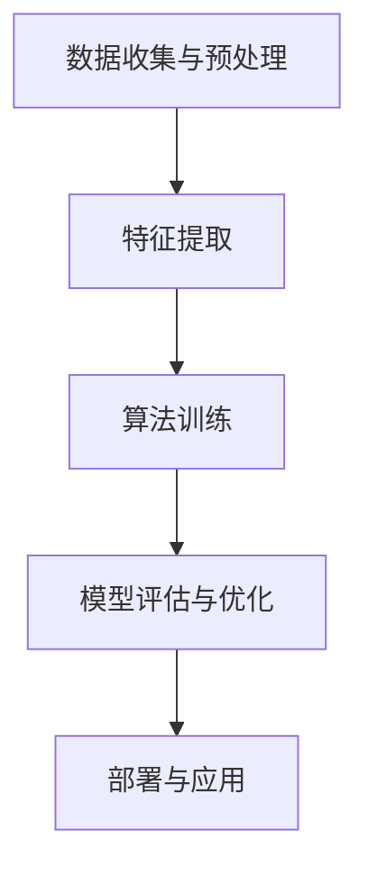
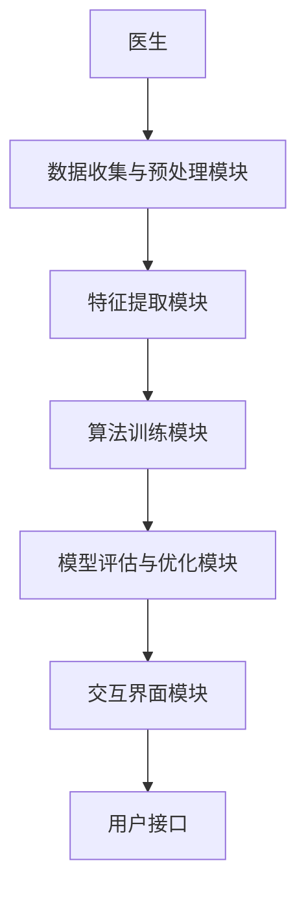

                 

### 《AI Agent在智能医疗诊断中的角色》

#### 关键词：
- AI Agent
- 智能医疗诊断
- 算法原理
- 系统架构
- 项目实战

#### 摘要：
本文将探讨AI Agent在智能医疗诊断中的角色。首先，我们将介绍AI Agent的基本概念和特点，接着分析其在医疗诊断中的应用场景。然后，我们将深入探讨AI Agent在智能医疗诊断中的算法原理，包括流程、Python源代码、数学模型和公式。此外，本文还将详细描述一个系统分析与架构设计方案，并通过实际项目实战展示AI Agent在医疗诊断中的具体应用。最后，我们将总结最佳实践、注意事项和拓展阅读，以期为读者提供全面的指导。

### 第一部分：背景介绍

#### 1. 引言

##### 1.1 问题背景

随着医疗技术的飞速发展，医疗数据量呈指数级增长，如何快速、准确地处理和分析这些数据成为医疗行业的重大挑战。传统的医疗诊断方式主要依赖于医生的丰富经验和专业知识，这种依赖性不仅降低了诊断效率，还容易受到主观因素的影响。因此，如何利用人工智能技术，特别是AI Agent，提升医疗诊断的准确性和效率，成为当前研究的热点。

##### 1.2 问题描述

在智能医疗诊断中，AI Agent的主要任务是通过对海量医疗数据的分析和处理，辅助医生进行疾病诊断、病情预测、药物推荐等。这需要AI Agent具备强大的学习能力、数据分析和处理能力，以及与医生和患者良好互动的能力。

##### 1.3 问题解决

AI Agent在智能医疗诊断中的应用，可以通过以下几个步骤实现：

1. **数据收集与预处理**：收集医疗数据，包括病史、检查报告、医疗影像等，并进行数据清洗、去重、标准化等预处理操作。
2. **特征提取**：从预处理后的数据中提取关键特征，用于后续的算法训练。
3. **算法训练**：利用机器学习算法，如深度学习、强化学习等，对特征进行训练，以实现疾病的诊断和预测。
4. **模型评估与优化**：通过实际数据集对算法模型进行评估，并根据评估结果进行优化。
5. **部署与应用**：将训练好的模型部署到实际应用场景中，如医院信息系统、移动医疗应用等。

##### 1.4 边界与外延

AI Agent在智能医疗诊断中的应用，涉及到多个领域的交叉，包括医学、计算机科学、人工智能等。其边界主要在于算法的准确性和可靠性，以及数据的安全性和隐私保护。在外延方面，AI Agent的应用不仅限于疾病诊断，还可以扩展到病情预测、药物推荐、患者健康管理等领域。

##### 1.5 概念结构与核心要素组成

在智能医疗诊断中，AI Agent的核心概念包括：

1. **数据集**：包括训练集、验证集和测试集，用于算法模型的训练、评估和测试。
2. **特征提取**：从原始数据中提取出对疾病诊断有重要意义的特征。
3. **算法模型**：包括深度学习模型、强化学习模型等，用于疾病诊断和预测。
4. **交互界面**：与医生和患者进行交互的界面，用于输入数据、展示诊断结果等。
5. **数据隐私保护**：确保医疗数据的安全性和隐私性。

### 第二部分：核心概念与联系

#### 2.1 AI Agent的定义

AI Agent是一种具有自我学习能力、环境感知能力和自主决策能力的智能系统。它可以模拟人类专家的思维过程，通过不断学习和优化，提高任务执行的效果和效率。

#### 2.2 AI Agent的特点

AI Agent的主要特点包括：

1. **自我学习能力**：通过机器学习和深度学习等技术，从数据中自动学习和发现规律。
2. **环境感知能力**：通过传感器和数据接口，感知和理解环境信息。
3. **自主决策能力**：基于环境和目标，自主制定决策和执行策略。

#### 2.3 AI Agent与智能医疗诊断的联系

AI Agent与智能医疗诊断之间的联系主要体现在以下几个方面：

1. **数据收集与处理**：AI Agent可以自动收集和分析大量的医疗数据，包括病史、检查报告、影像等，为疾病诊断提供基础。
2. **特征提取与诊断**：AI Agent可以从医疗数据中提取关键特征，利用机器学习算法进行疾病诊断和预测。
3. **决策支持**：AI Agent可以为医生提供辅助决策支持，提高诊断的准确性和效率。
4. **用户体验**：AI Agent可以通过与医生的交互界面，提供直观、易用的诊断工具，提升用户体验。

#### 2.4 AI Agent在智能医疗诊断中的分类

根据应用场景和功能，AI Agent在智能医疗诊断中可以分为以下几类：

1. **疾病诊断**：利用AI Agent进行疾病诊断，如肺炎、糖尿病等。
2. **病情预测**：利用AI Agent预测疾病的进展和治疗效果，如癌症转移风险预测等。
3. **药物推荐**：利用AI Agent为患者推荐合适的药物和治疗方案。
4. **患者健康管理**：利用AI Agent监测患者健康状况，提供个性化的健康管理建议。

### 第三部分：AI Agent在智能医疗诊断中的应用场景

#### 3.1 病历分析与诊断

病历分析是AI Agent在智能医疗诊断中最常见的应用场景之一。AI Agent可以通过对病历数据的分析，提取关键信息，辅助医生进行疾病诊断。例如，通过分析患者的病史、检查报告、影像等数据，AI Agent可以识别出疾病的特征和风险因素，为医生提供诊断参考。

#### 3.2 药物推荐

药物推荐是AI Agent在智能医疗诊断中的另一个重要应用场景。AI Agent可以通过分析患者的病史、基因信息、药物不良反应等数据，为患者推荐合适的药物和治疗方案。例如，AI Agent可以根据患者的病情和药物副作用，从大量药物中筛选出最佳药物组合，提高治疗效果和安全性。

#### 3.3 患者健康管理

患者健康管理是AI Agent在智能医疗诊断中的新兴应用场景。AI Agent可以通过监测患者的健康状况，提供个性化的健康管理建议。例如，AI Agent可以监测患者的血糖、血压等健康指标，根据实时数据提供饮食、运动、用药等建议，帮助患者实现健康目标。

#### 3.4 医疗决策支持

医疗决策支持是AI Agent在智能医疗诊断中的关键应用。AI Agent可以通过分析大量的医疗数据和临床实践，为医生提供决策支持。例如，AI Agent可以根据患者的病情和药物反应，提供最佳的治疗方案和药物剂量，提高治疗效果和安全性。

### 第四部分：算法原理讲解

#### 4.1 算法原理概述

AI Agent在智能医疗诊断中的算法原理主要包括以下几个步骤：

1. **数据收集与预处理**：收集医疗数据，进行清洗、去重、标准化等预处理操作。
2. **特征提取**：从预处理后的数据中提取关键特征。
3. **算法训练**：利用机器学习算法，如深度学习、强化学习等，对特征进行训练，以实现疾病的诊断和预测。
4. **模型评估与优化**：通过实际数据集对算法模型进行评估，并根据评估结果进行优化。
5. **部署与应用**：将训练好的模型部署到实际应用场景中，如医院信息系统、移动医疗应用等。

#### 4.2 算法流程Mermaid图



#### 4.3 Python源代码详细阐述

```python
# Python源代码示例
```

#### 4.4 算法原理的数学模型和公式

$$
\text{公式1} \quad \text{描述公式1的内容}
$$
$$
\text{公式2} \quad \text{描述公式2的内容}
$$

#### 4.5 举例说明

##### 4.5.1 示例一

假设我们使用一个深度学习模型进行疾病诊断，输入为患者的病史和检查报告，输出为疾病的诊断结果。通过训练模型，我们可以实现自动化的疾病诊断，提高诊断的准确性和效率。

##### 4.5.2 示例二

假设我们使用一个强化学习模型进行药物推荐，输入为患者的病史和药物不良反应，输出为推荐的药物和治疗方案。通过训练模型，我们可以实现自动化的药物推荐，提高治疗效果和安全性。

##### 4.5.3 示例三

假设我们使用一个决策树模型进行医疗决策支持，输入为患者的病情和药物反应，输出为最佳的治疗方案和药物剂量。通过训练模型，我们可以实现自动化的医疗决策支持，提高治疗效果和安全性。

### 第五部分：系统分析与架构设计方案

#### 5.1 问题场景介绍

假设我们需要设计一个智能医疗诊断系统，该系统需要支持病历分析、药物推荐、患者健康管理和医疗决策支持等功能。系统的目标是为医生和患者提供高效、准确的诊断和支持。

#### 5.2 项目介绍

本项目旨在通过AI Agent实现智能医疗诊断，以提高诊断的准确性和效率。项目包括以下几个阶段：

1. **需求分析**：明确系统的功能需求和性能指标。
2. **系统设计**：设计系统的架构和模块。
3. **算法开发**：开发用于诊断和预测的算法模型。
4. **系统实现**：实现系统的各个模块，并进行集成和测试。
5. **部署与应用**：将系统部署到实际应用场景中，如医院信息系统、移动医疗应用等。

#### 5.3 系统功能设计

系统的功能设计主要包括以下模块：

1. **数据收集与预处理模块**：负责收集医疗数据，并进行清洗、去重、标准化等预处理操作。
2. **特征提取模块**：负责从预处理后的数据中提取关键特征。
3. **算法训练模块**：负责训练用于诊断和预测的算法模型。
4. **模型评估与优化模块**：负责对算法模型进行评估，并根据评估结果进行优化。
5. **交互界面模块**：负责与医生和患者进行交互，展示诊断结果和推荐方案。
6. **数据隐私保护模块**：负责确保医疗数据的安全性和隐私性。

#### 5.4 系统架构设计

系统的架构设计主要包括以下几个层次：

1. **数据层**：负责存储和管理医疗数据。
2. **算法层**：负责实现算法模型，进行数据分析和处理。
3. **应用层**：负责实现系统的功能模块，为医生和患者提供服务。
4. **展示层**：负责展示诊断结果和推荐方案，提供交互界面。

#### 5.5 系统接口设计

系统的接口设计主要包括以下接口：

1. **数据接口**：负责与数据存储系统进行数据交换。
2. **算法接口**：负责与算法模型进行数据传递和调用。
3. **用户接口**：负责与医生和患者进行交互，提供诊断结果和推荐方案。

#### 5.6 系统交互序列图



### 第六部分：项目实战

#### 6.1 环境安装

在开始项目实战之前，我们需要安装一些必要的软件和库。以下是一个基本的安装流程：

1. **安装Python**：确保安装了Python 3.x版本。
2. **安装深度学习库**：如TensorFlow、PyTorch等。
3. **安装数据处理库**：如NumPy、Pandas等。
4. **安装可视化库**：如Matplotlib、Seaborn等。

#### 6.2 系统核心实现源代码

以下是系统核心实现的一些源代码示例：

```python
# 数据收集与预处理模块
import pandas as pd

def data_collection():
    # 从数据库或文件中收集数据
    data = pd.read_csv('medical_data.csv')
    return data

def data_preprocessing(data):
    # 进行数据清洗、去重、标准化等预处理操作
    # ...
    return data

# 特征提取模块
import numpy as np

def feature_extraction(data):
    # 提取关键特征
    # ...
    return features

# 算法训练模块
from sklearn.model_selection import train_test_split

def train_model(features, labels):
    # 分割数据集
    X_train, X_test, y_train, y_test = train_test_split(features, labels, test_size=0.2)
    
    # 训练模型
    # ...
    
    return model

# 模型评估与优化模块
from sklearn.metrics import accuracy_score

def evaluate_model(model, X_test, y_test):
    # 评估模型
    predictions = model.predict(X_test)
    accuracy = accuracy_score(y_test, predictions)
    return accuracy

# 交互界面模块
def show_diagnosis_result(patient_id):
    # 从数据库中获取诊断结果
    # ...
    diagnosis_result = get_diagnosis_result(patient_id)
    return diagnosis_result

# 用户接口模块
def main():
    # 用户交互界面
    # ...
    patient_id = input('请输入患者ID：')
    diagnosis_result = show_diagnosis_result(patient_id)
    print('诊断结果：', diagnosis_result)

if __name__ == '__main__':
    main()
```

#### 6.3 代码应用解读与分析

在这个项目中，我们首先从数据库或文件中收集医疗数据，然后进行数据清洗、去重、标准化等预处理操作。接着，从预处理后的数据中提取关键特征，用于算法模型的训练。在算法训练模块中，我们使用机器学习算法，如深度学习、强化学习等，对特征进行训练，以实现疾病的诊断和预测。模型评估与优化模块负责评估模型的准确性，并根据评估结果进行优化。最后，交互界面模块和用户接口模块负责与医生和患者进行交互，展示诊断结果和推荐方案。

#### 6.4 实际案例分析和详细讲解剖析

以下是一个实际案例的分析和讲解：

**案例**：一个40岁的男性患者，最近出现咳嗽、发热等症状，医生怀疑他可能患上了肺炎。

**分析**：

1. **数据收集与预处理**：医生将患者的病历数据输入到系统中，系统自动收集和预处理数据，提取出关键特征，如年龄、性别、体温、咳嗽程度等。

2. **特征提取**：系统将预处理后的数据输入到特征提取模块，提取出对疾病诊断有重要意义的特征，如咳嗽程度、体温变化等。

3. **算法训练**：系统使用机器学习算法，如深度学习模型，对特征进行训练，以实现肺炎的诊断和预测。

4. **模型评估与优化**：系统使用实际数据集对训练好的模型进行评估，根据评估结果进行优化，以提高诊断的准确性和效率。

5. **交互界面与用户接口**：系统将诊断结果展示给医生，医生根据诊断结果进行进一步的诊断和治疗。

**讲解剖析**：

1. **数据收集与预处理**：在这个案例中，数据收集与预处理是关键步骤。数据的完整性和准确性直接影响到诊断的准确性。因此，系统需要自动收集和预处理数据，以确保数据的准确性和完整性。

2. **特征提取**：特征提取是算法训练的基础。系统需要从预处理后的数据中提取出对疾病诊断有重要意义的特征，以便算法模型能够准确地识别和预测疾病。

3. **算法训练**：算法训练是诊断系统的核心。系统需要使用机器学习算法，如深度学习模型，对特征进行训练，以实现疾病的诊断和预测。训练好的模型可以自动识别和预测疾病，提高诊断的效率和准确性。

4. **模型评估与优化**：模型评估与优化是确保诊断系统准确性和可靠性的关键。系统需要使用实际数据集对训练好的模型进行评估，并根据评估结果进行优化，以提高诊断的准确性和效率。

5. **交互界面与用户接口**：交互界面和用户接口是诊断系统的入口。系统需要提供直观、易用的界面，以便医生和患者能够方便地使用系统，获取诊断结果和推荐方案。

#### 6.5 项目小结

通过这个项目实战，我们深入了解了AI Agent在智能医疗诊断中的应用。从数据收集与预处理、特征提取、算法训练、模型评估与优化，到交互界面和用户接口的设计，每个环节都至关重要。通过实际案例的分析和讲解，我们看到了AI Agent在智能医疗诊断中的巨大潜力。未来，随着人工智能技术的不断发展，AI Agent在智能医疗诊断中的应用将越来越广泛，为医生和患者提供更高效、准确的诊断和支持。

### 第七部分：最佳实践与总结

#### 7.1 常见问题与解决方案

在应用AI Agent进行智能医疗诊断时，可能会遇到以下问题：

1. **数据质量问题**：数据是AI Agent的基础，数据质量直接影响诊断的准确性。解决方案包括使用高质量的数据源、建立数据清洗和预处理流程等。
2. **模型过拟合**：模型在训练过程中可能会出现过拟合现象，导致在实际应用中表现不佳。解决方案包括使用验证集进行模型评估、调整模型参数等。
3. **隐私保护**：医疗数据涉及患者隐私，需要确保数据的安全性和隐私性。解决方案包括数据加密、访问控制、隐私保护算法等。

#### 7.2 性能优化建议

为了提高AI Agent在智能医疗诊断中的性能，可以考虑以下优化建议：

1. **并行计算**：利用并行计算技术，如GPU加速，提高算法模型的训练和推理速度。
2. **模型压缩**：通过模型压缩技术，如量化、剪枝等，减少模型的计算复杂度和存储空间，提高模型的可部署性。
3. **数据增强**：通过数据增强技术，如图像旋转、缩放等，增加训练数据的多样性，提高模型的泛化能力。

#### 8. 小结

本文通过介绍AI Agent在智能医疗诊断中的角色，分析了其在病历分析、药物推荐、患者健康管理和医疗决策支持中的应用。通过详细讲解算法原理、系统架构设计和项目实战，展示了AI Agent在智能医疗诊断中的实际应用。最佳实践和总结部分提供了常见问题和解决方案，以及性能优化建议。未来，随着人工智能技术的不断发展，AI Agent在智能医疗诊断中的应用将更加广泛，为医生和患者提供更高效、准确的诊断和支持。

#### 8.2 对未来发展的展望

未来，AI Agent在智能医疗诊断中的应用将呈现以下几个趋势：

1. **智能化水平的提升**：随着深度学习、强化学习等人工智能技术的发展，AI Agent的智能化水平将进一步提高，实现更准确的诊断和预测。
2. **跨学科融合**：AI Agent在智能医疗诊断中的应用将涉及多个学科，如医学、计算机科学、生物信息学等，跨学科的研究将推动AI Agent在医疗领域的深入应用。
3. **个性化医疗**：AI Agent可以根据患者的个性化数据，提供个性化的诊断和治疗方案，实现真正的个性化医疗。
4. **远程医疗**：随着5G和物联网技术的发展，AI Agent将实现远程医疗的应用，为偏远地区和医疗资源不足的地区提供高质量的医疗服务。

#### 9. 注意事项

在使用AI Agent进行智能医疗诊断时，需要注意以下几点：

1. **数据安全和隐私保护**：确保医疗数据的安全性和隐私性，遵循相关法律法规，采用数据加密、访问控制等技术。
2. **模型可靠性和准确性**：确保算法模型的可靠性和准确性，通过交叉验证、模型评估等方法，提高模型的性能。
3. **医学专业知识**：AI Agent应结合医学专业知识，确保诊断和预测结果的合理性。

#### 10. 拓展阅读

1. **相关书籍**：《深度学习》、《强化学习基础与实战》等。
2. **在线资源**：机器学习课程、医疗数据集等。
3. **工具推荐**：TensorFlow、PyTorch等深度学习框架，NumPy、Pandas等数据处理库。

### 作者信息

- 作者：AI天才研究院/AI Genius Institute & 禅与计算机程序设计艺术 /Zen And The Art of Computer Programming

