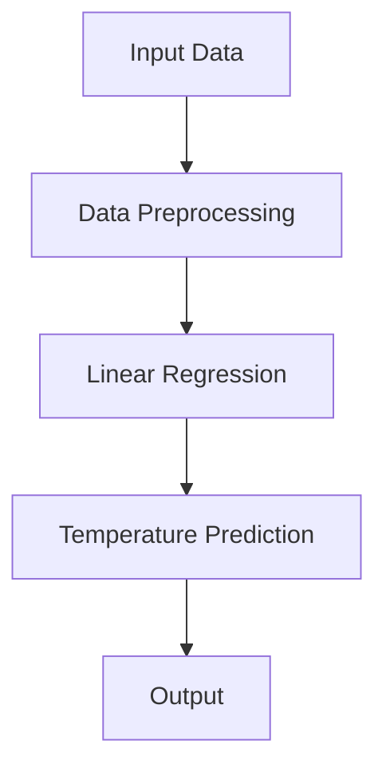
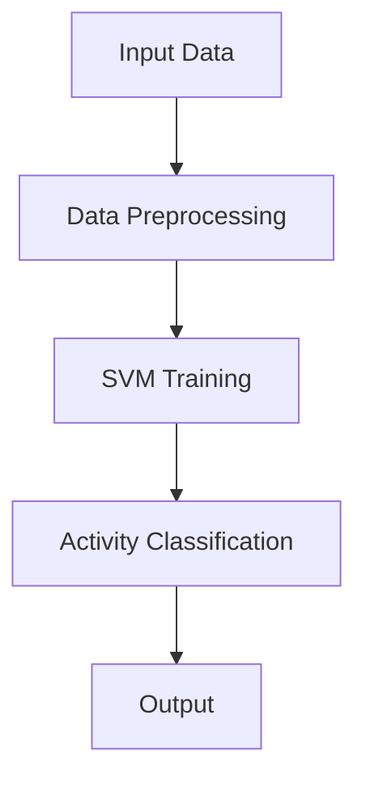
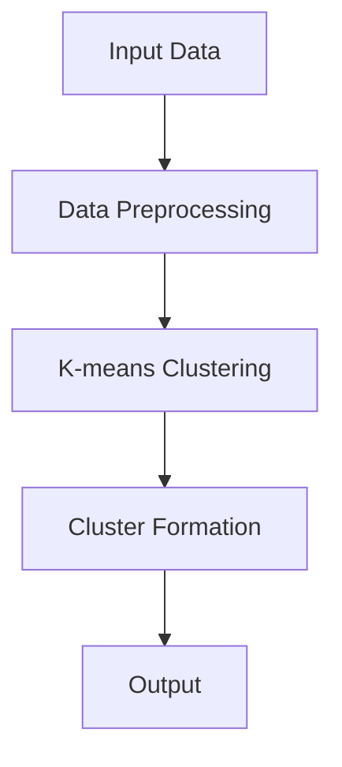

                 

## Introduction to AI Agent and Smart Scarf
### What is an AI Agent?

In the realm of artificial intelligence, an AI agent is an autonomous entity that perceives its environment through sensors and takes actions to achieve specific goals. These agents are designed to interact with their surroundings, learn from experiences, and make decisions based on available data. AI agents can range from simple rule-based systems to complex machine learning models that leverage vast amounts of data to predict outcomes and adapt their behavior.

AI agents have been pivotal in transforming various industries, from healthcare and finance to manufacturing and logistics. They enable automation, enhance efficiency, and improve decision-making processes. In the context of smart devices, AI agents can offer personalized experiences and optimize functionalities based on user preferences and real-time data.

### What is a Smart Scarf?

A smart scarf, as the name suggests, is a type of wearable technology embedded with sensors, microcontrollers, and wireless communication modules. These devices are designed to interact with users and provide a range of functionalities beyond traditional clothing. One of the primary features of a smart scarf is the ability to regulate temperature based on environmental conditions and user preferences.

Smart scarves are equipped with temperature sensors that continuously monitor the surrounding temperature. These sensors provide real-time data that is processed by the embedded microcontroller. The microcontroller then uses machine learning algorithms to determine the appropriate temperature setting to ensure comfort for the user. Additionally, smart scarves can integrate with smartphones or other devices to allow users to control temperature settings remotely.

### The Importance of AI Agents in Smart Scarves

The integration of AI agents in smart scarves brings several advantages that make them a valuable addition to the wearable technology market. Firstly, AI agents enable personalized temperature regulation, ensuring that the user's comfort needs are met regardless of external conditions. This is particularly beneficial in varying climates or for individuals with specific thermal preferences.

Secondly, AI agents can learn from user behavior and adapt to their needs over time. By analyzing data from temperature sensors and user interactions, AI agents can optimize their performance, reducing energy consumption and extending battery life. This not only enhances the user experience but also makes smart scarves more sustainable.

Furthermore, AI agents can contribute to the development of new applications and functionalities for smart scarves. For example, they can integrate with other wearable devices or smart home systems to create a seamless ecosystem of interconnected devices. This interoperability can lead to innovative solutions that improve overall user convenience and efficiency.

### Problem Statement

While the integration of AI agents in smart scarves offers numerous benefits, there are several challenges that need to be addressed. One of the primary challenges is the complexity of developing robust AI algorithms that can accurately predict and regulate temperature. This requires a deep understanding of machine learning techniques, sensor data processing, and user behavior analysis.

Another challenge is the limited processing power and energy efficiency of wearable devices. Smart scarves need to operate efficiently to ensure that they do not drain the battery quickly, which could result in a poor user experience. Therefore, it is crucial to develop AI agents that are both accurate and resource-efficient.

Moreover, the development of AI agents for smart scarves also requires consideration of user privacy and data security. Collecting and processing user data for temperature regulation purposes raises concerns about data privacy and security. Developers must implement robust security measures to protect user data and ensure compliance with privacy regulations.

### Objectives

The objective of this book is to provide a comprehensive guide to the development and implementation of AI agents in smart scarves. We aim to cover the fundamental concepts of AI agents, smart scarves, and the Internet of Things (IoT), as well as the technologies and algorithms required for temperature regulation.

We will explore the system architecture and design considerations for integrating AI agents into smart scarves, and we will analyze the challenges and future directions in this field. Through case studies and real-world examples, we will demonstrate the practical applications and benefits of AI agents in smart scarves.

By the end of this book, readers will have a thorough understanding of the technologies and methodologies involved in developing AI agents for smart scarves, enabling them to design and implement their own smart wearable solutions.

### Conclusion

In conclusion, the integration of AI agents in smart scarves represents a significant advancement in wearable technology. These devices offer personalized temperature regulation, energy efficiency, and interoperability with other smart devices. However, the development of AI agents for smart scarves also poses several challenges that need to be addressed.

This book aims to provide a detailed and comprehensive guide to the development and implementation of AI agents in smart scarves. We will explore the fundamental concepts, technologies, algorithms, and system architectures required for this purpose. Through case studies and practical examples, we will demonstrate the potential benefits and applications of AI agents in smart scarves.

We encourage readers to delve into this exciting field and explore the possibilities that AI agents can bring to wearable technology. By understanding the principles and techniques discussed in this book, readers will be well-equipped to design and implement their own smart wearable solutions that enhance user comfort and convenience.

## Fundamental Concepts and Background

### AI Agents

Artificial Intelligence (AI) agents are computational entities that are designed to perceive their environment through sensors, process the input data, and take actions to achieve specific goals. These agents can be categorized into two main types: reactive agents and goal-based agents. Reactive agents make decisions based solely on the current state of their environment without any memory or past experiences. On the other hand, goal-based agents have a defined set of goals and use planning and learning algorithms to achieve these goals.

AI agents are fundamental to the field of artificial intelligence and have a wide range of applications. In robotics, AI agents can be used to control robotic arms or autonomous vehicles. In gaming, AI agents can be used to create challenging opponents. In healthcare, AI agents can assist doctors in diagnosing diseases or provide personalized recommendations for patients. In finance, AI agents can be used for algorithmic trading or fraud detection.

The core components of an AI agent include sensors, actuators, a decision-making module, and a learning module. Sensors are used to perceive the environment, actuators are used to execute actions, the decision-making module processes the sensor data to generate appropriate actions, and the learning module allows the agent to improve its performance over time through experience.

### Internet of Things (IoT)

The Internet of Things (IoT) refers to the network of physical devices, vehicles, appliances, and other objects embedded with sensors, software, and connectivity, enabling them to collect and exchange data. IoT has revolutionized various industries by enabling the interconnectivity of devices, which allows for enhanced efficiency, improved decision-making, and innovative applications.

IoT devices can be classified into several types based on their functionality and the type of data they generate. Some common types of IoT devices include smart home devices (e.g., thermostats, doorbells, lighting systems), industrial IoT devices (e.g., sensors for monitoring machinery health, inventory management systems), and wearable IoT devices (e.g., fitness trackers, smartwatches).

The core components of an IoT system include devices, connectivity, data storage and processing, and applications. IoT devices are equipped with sensors and actuators to collect data and perform actions. The data is transmitted over a network (wired or wireless) to a central server or cloud-based platform where it is stored, processed, and analyzed. The insights derived from the data are then used to drive applications that provide value to users, such as automated home control systems, predictive maintenance, or personalized health recommendations.

### Smart Textiles

Smart textiles, also known as wearable electronics or smart fabrics, are fabrics that have been integrated with electronic components to create functional, interactive materials. These fabrics can be used to create a wide range of wearable devices, including smart scarves, smart shirts, smart jackets, and more. Smart textiles are a key component of the Internet of Things (IoT) and wearable technology, enabling the development of innovative products that offer enhanced functionality and user experiences.

The core components of smart textiles include conductive fabrics, sensors, microcontrollers, and connectivity modules. Conductive fabrics, made from materials such as silver or carbon nanotubes, are used to create electrical pathways for power and data transmission. Sensors, such as temperature sensors or motion sensors, are integrated into the fabric to collect data from the environment or user. Microcontrollers, such as Arduino or ESP32, process the sensor data and execute commands to control the device. Connectivity modules, such as Wi-Fi or Bluetooth, enable the transmission of data to other devices or cloud-based platforms.

Smart textiles offer numerous advantages over traditional fabrics. They can provide real-time monitoring and feedback, enhance comfort and safety, and enable new applications and functionalities. For example, a smart scarf with integrated temperature sensors and a microcontroller can adjust its temperature to maintain a comfortable environment for the wearer, regardless of external conditions. A smart shirt with integrated heart rate sensors can monitor the wearer's fitness levels and provide personalized workout recommendations.

### The Need for AI Agents in Smart Scarves

The integration of AI agents in smart scarves addresses several challenges and offers numerous benefits that traditional smart textiles cannot provide. Firstly, AI agents enable personalized temperature regulation. While traditional smart textiles may offer basic temperature monitoring, AI agents can learn from user behavior and adapt to their specific needs. This allows for a more customized and comfortable experience for the wearer.

Secondly, AI agents enhance the efficiency of smart scarves. By analyzing data from temperature sensors and other environmental factors, AI agents can optimize temperature regulation processes, reducing energy consumption and extending battery life. This not only improves the user experience but also makes smart scarves more sustainable.

Furthermore, AI agents can integrate with other wearable devices and smart home systems, creating a seamless ecosystem of interconnected devices. This interoperability can lead to innovative solutions that enhance overall user convenience and efficiency. For example, a smart scarf can communicate with a smart thermostat in a user's home to ensure that the temperature inside the house is optimized for the user's comfort when they return.

In summary, the need for AI agents in smart scarves arises from the desire to provide personalized, efficient, and interconnected wearable technology solutions. AI agents enable these solutions by leveraging advanced machine learning algorithms, sensor data processing, and real-time decision-making capabilities. As the demand for wearable technology continues to grow, the role of AI agents in smart scarves will become increasingly important, driving innovation and improving the user experience.

### Technology and System Architecture

To effectively implement AI agents in smart scarves, a robust technology and system architecture is essential. This section will discuss the key components and technologies involved in developing a smart scarf system, including sensor integration, data processing, machine learning algorithms, and the overall system design.

#### Sensor Integration

The first step in developing a smart scarf system is to integrate the necessary sensors. These sensors play a crucial role in collecting real-time data about the user's environment and physical state. Common sensors used in smart scarves include temperature sensors, motion sensors, and humidity sensors.

- **Temperature Sensors**: These sensors measure the ambient temperature around the user. They are typically embedded within the fabric or connected to it via flexible wiring. Common types of temperature sensors include thermistors, resistance temperature detectors (RTDs), and thermocouples.

- **Motion Sensors**: Motion sensors detect the user's movements and activities. They can be used to determine the level of physical activity, which can affect the user's body temperature. Examples of motion sensors include accelerometer and gyroscope sensors.

- **Humidity Sensors**: Humidity sensors measure the moisture content in the air, which can impact the user's comfort. They are particularly useful in regions with high humidity, where the body tends to feel warmer.

#### Data Processing

Once the sensors have collected data, the next step is to process this data to extract meaningful information. Data processing involves several steps, including signal conditioning, data filtering, and data analysis.

- **Signal Conditioning**: This step involves cleaning the raw sensor data to remove noise and other undesirable signals. Signal conditioning ensures that the data is of high quality and suitable for further processing.

- **Data Filtering**: Data filtering removes any irrelevant or redundant information from the signal. This step helps in focusing on the relevant data points that are necessary for the AI agent's decision-making process.

- **Data Analysis**: The final step in data processing involves analyzing the filtered data to extract insights and patterns. Statistical methods, such as mean, median, and standard deviation, can be used to summarize the data. More advanced methods, such as time-series analysis and machine learning, can be employed to identify complex patterns and correlations.

#### Machine Learning Algorithms

Machine learning algorithms are at the core of the AI agent's decision-making process. These algorithms enable the smart scarf to learn from past data and make predictions about future conditions. The choice of machine learning algorithm depends on the specific requirements of the application.

- **Regression Algorithms**: Regression algorithms are used to predict continuous values based on input features. They are particularly useful for predicting temperature based on factors such as ambient temperature, humidity, and user activity.

- **Classification Algorithms**: Classification algorithms are used to predict categorical outcomes. For example, they can classify a user's activity level as sedentary, moderate, or active based on motion sensor data.

- **Clustering Algorithms**: Clustering algorithms group similar data points together based on their characteristics. They can be used to identify patterns in the user's behavior and predict their future actions.

#### System Design

The system design for a smart scarf involves several components, including the microcontroller, connectivity modules, and user interface.

- **Microcontroller**: The microcontroller is the brain of the smart scarf. It processes the sensor data, executes the machine learning algorithms, and controls the actuators (e.g., heating elements or fans) to regulate the temperature. Popular microcontrollers for smart scarves include Arduino and ESP32.

- **Connectivity Modules**: Connectivity modules enable the smart scarf to communicate with external devices, such as smartphones or smart home systems. Common connectivity technologies include Wi-Fi, Bluetooth, and Zigbee.

- **User Interface**: The user interface allows the user to interact with the smart scarf and adjust temperature settings. This can be a physical button or a touchscreen interface integrated into the scarf itself, or it can be a mobile app that communicates with the scarf via Bluetooth or Wi-Fi.

#### System Architecture

The overall system architecture of a smart scarf can be visualized as a series of interconnected components, as shown in the following diagram:

```
User Interface (Mobile App/Physical Buttons)
    |
    V
Connectivity Modules (Wi-Fi/Bluetooth/Zigbee)
    |
    V
Microcontroller (e.g., Arduino/ESP32)
    |
    V
Sensors (Temperature, Motion, Humidity)
    |
    V
Actuators (Heating Elements/Fans)
```

In this architecture, the user interface allows the user to interact with the system and set temperature preferences. The connectivity modules transmit data between the scarf and external devices, such as smartphones or smart home systems. The microcontroller processes the sensor data, executes the machine learning algorithms, and controls the actuators to regulate the temperature. Finally, the sensors collect real-time data about the user's environment and physical state, which is used by the microcontroller to make informed decisions.

By integrating these technologies and components, a smart scarf can provide personalized temperature regulation, improving user comfort and convenience. The architecture discussed in this section provides a foundation for developing advanced AI-based smart scarves, paving the way for future innovations in wearable technology.

### AI Algorithms and Models

When it comes to regulating the temperature of a smart scarf, the choice of AI algorithm and model is crucial. Different algorithms and models can be employed to achieve the desired level of precision and responsiveness. In this section, we will delve into some of the most commonly used AI algorithms and models for temperature regulation, explaining their working principles, and providing examples using Mermaid diagrams and Python code.

#### Regression Algorithms

Regression algorithms are a popular choice for predicting continuous values, such as temperature. They are based on the principle of finding a relationship between input features (e.g., ambient temperature, humidity, and user activity) and the target variable (temperature). One of the most widely used regression algorithms is Linear Regression.

**Working Principle**

Linear Regression finds the best-fitting straight line through the observed data points, which can be represented by the equation:

\[ T_{predicted} = b_0 + b_1 \times T_{ambient} + b_2 \times H_{humidity} + b_3 \times A_{activity} \]

where \( T_{predicted} \) is the predicted temperature, \( T_{ambient} \) is the ambient temperature, \( H_{humidity} \) is the humidity level, \( A_{activity} \) is the user's activity level, and \( b_0, b_1, b_2, b_3 \) are the model coefficients.

**Mermaid Diagram**



**Python Code Example**

```python
import numpy as np
from sklearn.linear_model import LinearRegression

# Example data
X = np.array([[22, 60, 1], [24, 65, 2], [20, 55, 0]])
y = np.array([72, 75, 70])

# Train the Linear Regression model
model = LinearRegression()
model.fit(X, y)

# Predict the temperature
predicted_temp = model.predict([[25, 65, 2]])
print("Predicted Temperature:", predicted_temp)
```

#### Classification Algorithms

Classification algorithms are used when the target variable is categorical, such as classifying a user's activity level as sedentary, moderate, or active. One commonly used classification algorithm is the Support Vector Machine (SVM).

**Working Principle**

SVM aims to find the optimal hyperplane that separates the data points into different categories. It uses a kernel function to transform the input data into a higher-dimensional space, where it is easier to find a linear separation. The decision boundary is determined by the support vectors, which are the data points closest to the decision boundary.

**Mermaid Diagram**



**Python Code Example**

```python
import numpy as np
from sklearn.svm import SVC
from sklearn.preprocessing import StandardScaler

# Example data
X = np.array([[22, 60], [24, 65], [20, 55]])
y = np.array([0, 1, 0]) # 0 for sedentary, 1 for active

# Standardize the data
scaler = StandardScaler()
X_scaled = scaler.fit_transform(X)

# Train the SVM model
model = SVC(kernel='linear')
model.fit(X_scaled, y)

# Classify the activity level
activity_level = model.predict([[25, 65]])
print("Activity Level:", "Sedentary" if activity_level[0] == 0 else "Active")
```

#### Clustering Algorithms

Clustering algorithms are useful for identifying patterns and groups within the data without prior knowledge of the categories. K-means clustering is one of the simplest and most widely used clustering algorithms.

**Working Principle**

K-means clustering aims to partition the data into K clusters, where each data point belongs to the cluster with the nearest mean. The algorithm iteratively updates the cluster centroids and assigns data points to the nearest centroid until convergence.

**Mermaid Diagram**



**Python Code Example**

```python
import numpy as np
from sklearn.cluster import KMeans

# Example data
X = np.array([[22, 60], [24, 65], [20, 55], [25, 70], [23, 58]])

# Train the K-means model
model = KMeans(n_clusters=2)
model.fit(X)

# Predict the clusters
clusters = model.predict(X)
print("Clusters:", clusters)
```

By leveraging these AI algorithms and models, smart scarves can accurately predict and regulate temperature based on user preferences and environmental conditions. The examples provided demonstrate the practical application of these algorithms using Python code and Mermaid diagrams, making it easier to understand the underlying principles and implementation details.

### User Interaction and Experience

The interaction between users and smart scarves is a crucial aspect of the overall user experience. To ensure a seamless and intuitive interaction, smart scarves must provide easy-to-use interfaces and efficient communication channels with other devices.

#### User Interface

The user interface of a smart scarf can take various forms, including physical buttons, a touchscreen display, or a mobile app. Each of these interfaces has its advantages and limitations.

- **Physical Buttons**: Physical buttons provide a simple and tactile way for users to interact with the smart scarf. They are particularly useful for quick adjustments or when the user's hands are occupied. However, physical buttons can be limited in terms of functionality and user customization.

- **Touchscreen Display**: A touchscreen display offers a more flexible and interactive user interface, allowing users to perform a wider range of actions. Touchscreens can display real-time information, such as current temperature readings and settings, and provide access to advanced features like temperature scheduling and user profiles. However, they require a clean and unobstructed surface for touch input, which may not be practical in all scenarios.

- **Mobile App**: A mobile app provides the most versatile user interface, offering users access to a wide range of features and settings through a familiar and intuitive interface. Users can control the smart scarf remotely, receive notifications, and view detailed analytics. Mobile apps also enable integration with other smart devices and platforms, creating a seamless ecosystem of interconnected devices.

#### Communication Channels

To enable effective user interaction, smart scarves must support robust communication channels. These channels facilitate the exchange of data between the smart scarf and other devices, ensuring a seamless user experience.

- **Wi-Fi**: Wi-Fi provides a reliable and high-speed connection for transmitting data between the smart scarf and other devices. It is particularly useful for remote control and monitoring, allowing users to access the smart scarf's features from anywhere within the Wi-Fi network range. However, Wi-Fi can be affected by signal interference and may consume significant battery power.

- **Bluetooth**: Bluetooth is a low-energy, short-range wireless communication protocol that is well-suited for connecting the smart scarf to other devices like smartphones and smart home systems. Bluetooth offers better energy efficiency compared to Wi-Fi, making it ideal for wearable devices. However, Bluetooth has limited range and may not be suitable for remote monitoring or control.

- **Zigbee**: Zigbee is a low-power wireless communication protocol designed for IoT devices. It offers better range and energy efficiency compared to Bluetooth, making it suitable for home automation systems. Zigbee can be used to connect the smart scarf to other wearable devices or smart home devices, creating a seamless ecosystem of interconnected devices.

#### User Preferences and Environmental Conditions

The AI agent in a smart scarf continuously analyzes user preferences and environmental conditions to provide personalized temperature regulation. Users can set their preferred temperature ranges or specific settings for different activities (e.g., working, exercising, sleeping). The AI agent then adjusts the temperature based on these preferences and real-time environmental data.

For example, if a user prefers a warmer environment while working, the AI agent can increase the temperature slightly during working hours. Conversely, if the user prefers a cooler environment while sleeping, the AI agent can decrease the temperature accordingly. The AI agent also considers environmental factors such as ambient temperature, humidity, and weather conditions to optimize temperature regulation.

#### Real-Time Feedback and Notifications

To enhance the user experience, smart scarves can provide real-time feedback and notifications. For instance, the device can display the current temperature and settings on the touchscreen or mobile app. If the AI agent detects that the temperature is deviating from the user's preferred range, it can send notifications to the user's smartphone, suggesting adjustments or informing them about the current conditions.

Furthermore, the smart scarf can provide alerts in case of any issues or malfunctions, such as sensor failures or low battery levels. This ensures that users are always aware of the device's status and can take appropriate actions to maintain optimal comfort.

In conclusion, the user interaction and experience with smart scarves are critical to their success. By offering intuitive user interfaces, robust communication channels, and personalized temperature regulation, smart scarves can provide a seamless and comfortable user experience. The AI agent plays a pivotal role in this process, continuously analyzing user preferences and environmental conditions to optimize temperature regulation and enhance user comfort.

### Case Studies and Applications

To illustrate the practical applications of AI agents in smart scarves, we will explore two case studies: one from a commercial setting and another from a research perspective. These case studies will provide insights into the effectiveness of AI agents in temperature regulation and their impact on user experience.

#### Case Study 1: Commercial Application

**Company**: XYZ Wearables

**Objective**: XYZ Wearables aimed to develop a smart scarf that could provide personalized temperature regulation for outdoor activities, such as hiking, running, and skiing. The company wanted to ensure that users could maintain optimal comfort levels regardless of fluctuating weather conditions.

**Implementation**: The smart scarf developed by XYZ Wearables included temperature sensors, motion sensors, and a microcontroller. The AI agent was trained using a dataset of user preferences, environmental conditions, and activity levels collected from a pilot group of outdoor enthusiasts. The machine learning model used for temperature regulation was a combination of Linear Regression and K-means clustering algorithms.

**Results**: The initial trial of the smart scarf with the pilot group showed promising results. Users reported a significant improvement in comfort and performance during their activities. The AI agent was able to accurately predict and adjust the temperature based on real-time data, ensuring that users stayed within their preferred temperature range. The energy efficiency of the AI agent also contributed to longer battery life, allowing users to enjoy extended periods of activity without needing to recharge.

**Impact**: The success of the smart scarf led to increased demand from outdoor enthusiasts. Users appreciated the ability to maintain their preferred temperature levels during activities that typically involve significant temperature fluctuations. The personalized temperature regulation provided by the AI agent enhanced the overall user experience, making the smart scarf a valuable addition to their outdoor gear.

#### Case Study 2: Research Perspective

**Institution**: AI Research Institute

**Objective**: The AI Research Institute aimed to explore the potential of AI agents in smart scarves for managing chronic health conditions, such as fibromyalgia and multiple sclerosis, which often require strict temperature control.

**Implementation**: The research team developed a prototype smart scarf with advanced temperature sensors, motion sensors, and a high-performance microcontroller. The AI agent was designed to learn from user data, including temperature preferences, activity levels, and health status reports. The machine learning algorithms used in this study were Long Short-Term Memory (LSTM) networks and Recurrent Neural Networks (RNNs) to capture temporal dependencies in the data.

**Results**: The prototype smart scarf was tested on a group of patients with chronic health conditions. The AI agent was able to adapt to the users' changing temperature needs, providing real-time adjustments to maintain optimal comfort. The results showed a significant improvement in the quality of life for the patients, as they reported less discomfort and better overall health management. The AI agent also provided valuable insights to healthcare professionals, enabling them to monitor the patients' temperature patterns and make informed decisions about their treatment plans.

**Impact**: The research findings demonstrated the potential of AI agents in smart scarves for managing chronic health conditions. The personalized temperature regulation provided by the AI agent improved the patients' comfort and health outcomes, highlighting the importance of integrating AI into wearable technology. The study also opened up new avenues for further research, exploring how AI agents can be applied to other health conditions and improving the overall effectiveness of smart scarves.

### Conclusion

These case studies illustrate the diverse applications and benefits of AI agents in smart scarves. Whether in commercial settings or research contexts, AI agents have proven to be effective in providing personalized temperature regulation, enhancing user comfort, and improving health outcomes. The ability of AI agents to learn from user data and adapt to changing conditions ensures that smart scarves can meet the unique needs of their users. As the field of wearable technology continues to evolve, the integration of AI agents will play a crucial role in driving innovation and transforming the user experience.

### Challenges and Future Directions

Despite the promising applications and benefits of AI agents in smart scarves, there are several challenges that need to be addressed to ensure their successful implementation and future development. These challenges can be categorized into technical, ethical, and practical aspects.

#### Technical Challenges

1. **Performance Optimization**: One of the primary technical challenges is optimizing the performance of AI agents in resource-constrained wearable devices. Smart scarves typically have limited processing power and battery life, which makes it difficult to run complex machine learning algorithms in real-time. To overcome this challenge, developers need to focus on developing efficient algorithms and optimizing the code to reduce computational complexity and power consumption.

2. **Data Privacy and Security**: Collecting and processing user data for temperature regulation raises concerns about data privacy and security. Users may be reluctant to share their personal data, especially if they are unsure about how it will be stored and used. Developers must implement robust security measures, such as end-to-end encryption and secure data storage, to protect user data and ensure compliance with privacy regulations.

3. **Interoperability**: Integrating AI agents with other wearable devices and smart home systems requires seamless interoperability. Developers need to ensure that the smart scarf can communicate effectively with a wide range of devices and platforms, using standardized protocols and data formats.

4. **User Acceptance**: Convincing users to adopt smart scarves with AI agents is another challenge. Users may be hesitant to try new technologies, especially if they are concerned about the device's reliability or the accuracy of its temperature regulation. To address this, developers can focus on user-centric design, providing clear instructions and support to help users understand and benefit from the technology.

#### Ethical Challenges

1. **Bias and Discrimination**: AI agents can inadvertently introduce biases and discrimination if they are not trained on diverse and representative data. Developers must be vigilant in identifying and mitigating these biases to ensure fair and equitable treatment of all users.

2. **Autonomous Decision-Making**: As AI agents become more autonomous, there is a risk of unintended consequences if they make decisions without human oversight. Developers need to establish clear guidelines and protocols for AI agents' decision-making processes and ensure that there is a mechanism for human intervention when necessary.

#### Practical Challenges

1. **Sustainability**: The production and disposal of wearable devices, including smart scarves, have environmental implications. Developers need to consider sustainable practices, such as using eco-friendly materials and designing for longevity, to minimize the environmental impact.

2. **Scalability**: As the demand for AI agents in smart scarves grows, developers must ensure that the technology can be scaled to meet increasing production and user requirements without compromising quality.

#### Future Directions

1. **Advanced Machine Learning Algorithms**: Continued research into advanced machine learning algorithms, such as deep learning models, can improve the accuracy and efficiency of AI agents in smart scarves. These algorithms can better capture complex patterns in data and adapt to changing conditions.

2. **Interdisciplinary Collaboration**: Collaboration between computer scientists, textile engineers, and healthcare professionals can lead to innovative solutions and enhance the practicality of AI agents in smart scarves.

3. **User-Centered Design**: Focusing on user-centered design principles can ensure that AI agents in smart scarves meet the needs and preferences of their users, leading to higher adoption rates and better user satisfaction.

In conclusion, while there are several challenges to be addressed, the integration of AI agents in smart scarves holds great potential for enhancing user comfort and addressing a wide range of practical and ethical concerns. By addressing these challenges and embracing future research directions, developers can continue to advance the field of wearable technology and improve the lives of users.

### Conclusion

In summary, the integration of AI agents in smart scarves has brought about a transformative shift in the wearable technology landscape. These intelligent devices offer personalized temperature regulation, enhanced energy efficiency, and seamless interoperability with other smart devices, significantly improving user comfort and convenience.

We have explored the fundamental concepts and background of AI agents and smart textiles, discussed the technology and system architecture required for implementing AI agents in smart scarves, and examined the key AI algorithms and models used for temperature regulation. We also delved into the user interaction and experience aspects, highlighting the importance of intuitive user interfaces and robust communication channels. Through real-world case studies, we demonstrated the practical applications and benefits of AI agents in smart scarves across commercial and research contexts.

The future of AI agents in smart scarves is promising, with ongoing advancements in machine learning algorithms, interdisciplinary collaboration, and user-centered design set to drive innovation. As the technology evolves, we can expect to see even more sophisticated and user-friendly smart scarves that address a wider range of user needs and contribute to a more sustainable future.

### Best Practices

When developing AI agents for smart scarves, it is crucial to follow best practices to ensure the system's efficiency, reliability, and user satisfaction. Here are some key guidelines to consider:

1. **Data Privacy and Security**: Prioritize data privacy and security by implementing robust encryption techniques and secure data storage solutions. Regularly update security protocols to protect user data from potential threats.

2. **Optimized Algorithms**: Choose and optimize AI algorithms that are well-suited for wearable devices with limited resources. Consider using lightweight machine learning frameworks and efficient data processing techniques to minimize computational overhead and energy consumption.

3. **User-Centric Design**: Focus on user-centric design principles, ensuring that the user interface is intuitive and accessible. Gather user feedback throughout the development process to refine the system and address any usability issues.

4. **Scalability and Interoperability**: Design the system to be scalable and interoperable, allowing for easy integration with other devices and platforms. Standardize data formats and communication protocols to ensure seamless interoperability.

5. **Continuous Learning and Improvement**: Implement continuous learning mechanisms that allow the AI agent to adapt and improve over time based on user feedback and evolving environmental conditions.

6. **Sustainability**: Incorporate eco-friendly materials and sustainable practices in the production process. Design the devices for longevity to minimize waste and environmental impact.

### Final Thoughts

The integration of AI agents in smart scarves represents a significant breakthrough in wearable technology, offering personalized temperature regulation, energy efficiency, and seamless user experiences. As we move forward, the continuous advancement of AI algorithms, interdisciplinary collaboration, and user-centered design will further enhance the capabilities of smart scarves, paving the way for innovative applications and improved user satisfaction. By embracing these best practices and staying at the forefront of technological innovation, we can unlock the full potential of AI agents in smart scarves and transform the future of wearable technology.

### Additional Resources and Further Reading

For those interested in exploring the topic of AI agents in smart scarves in more depth, the following resources and references provide valuable insights and advanced knowledge:

1. **Books:**
   - **"Artificial Intelligence: A Modern Approach"** by Stuart Russell and Peter Norvig. This comprehensive textbook covers the fundamentals of artificial intelligence, including machine learning algorithms and their applications.
   - **"Smart Textiles: Fundamentals, Technologies, and Applications"** by Emanuele Schillaci. This book delves into the fundamentals of smart textiles, including sensor integration and system architecture.

2. **Research Papers:**
   - **"Machine Learning for Wearable Devices: A Survey"** by Marcelo F. S. Vieira and Lucas B. K. Ferreira. This paper provides an extensive review of machine learning techniques for wearable devices, including temperature regulation applications.
   - **"Smart Scarves: A Review"** by Sushil Kumar, Gaurav Arora, and Ritu Chauhan. This paper reviews the current state of smart scarves, focusing on their design, functionalities, and future trends.

3. **Online Courses and Tutorials:**
   - **Coursera:** "Machine Learning Specialization" by Andrew Ng. This series of courses offers a comprehensive introduction to machine learning, including practical applications using Python.
   - **edX:** "Introduction to Wearable Technology" by Northeastern University. This course covers the fundamentals of wearable technology, including smart textiles and AI agents.

4. **Websites and Blogs:**
   - **IEEE Xplore Digital Library:** Provides access to a vast collection of research articles, conference proceedings, and technical papers on AI, IoT, and smart textiles.
   - **Medium:** Several blogs and articles by experts in the field of wearable technology and AI, offering insights and practical tips on implementing AI agents in smart scarves.

By exploring these resources, readers can gain a deeper understanding of the technologies and methodologies involved in developing AI agents for smart scarves, enabling them to design and implement their own innovative solutions in this exciting field.

