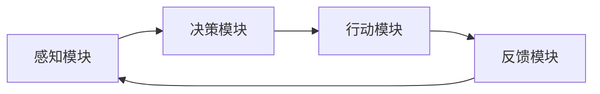
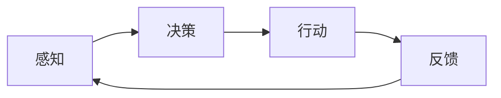

                 

# AI Agent在智能图像处理中的应用

## 关键词

- AI Agent
- 智能图像处理
- 图像识别
- 图像增强
- 图像生成
- 图像理解

## 摘要

本文深入探讨了AI Agent在智能图像处理中的应用。首先，我们介绍了AI Agent的基础理论，包括其定义、分类、架构和工作流程。接着，我们详细阐述了智能图像处理的基础知识，包括基本概念、核心算法和应用场景。随后，本文重点分析了AI Agent在图像识别、图像增强和图像生成中的实际应用，并通过具体案例展示了其技术原理和实践效果。最后，我们对AI Agent在图像理解中的应用进行了深入探讨，包括图像语义分割和图像内容审核等关键技术。本文旨在为读者提供一个全面而深入的AI Agent在智能图像处理领域应用的技术指南。

## 第一部分：引言

### 1.1 问题背景

在当今社会，随着信息技术的飞速发展，图像处理已成为各个领域的关键技术之一。从医疗影像分析到自动驾驶、从社交媒体内容审核到艺术创作，图像处理无处不在。然而，传统的图像处理方法往往依赖于预先设定的规则和固定的算法，难以应对复杂多变的环境和需求。随着人工智能（AI）技术的不断进步，尤其是深度学习和强化学习的引入，AI Agent作为一种智能体，逐渐成为解决复杂图像处理任务的有力工具。

### 1.2 问题描述

智能图像处理涉及多个复杂任务，如图像识别、图像增强、图像生成和图像理解等。每个任务都有其特定的需求和挑战。例如，图像识别需要从大量图像中准确识别出特定对象或场景；图像增强旨在提升图像质量，使其更适合后续处理；图像生成则旨在创造全新的图像内容；图像理解则要求对图像进行深层次的理解，包括语义分割和内容审核等。现有方法在这些任务上虽然取得了显著进展，但仍存在诸多不足，如处理速度慢、效果不稳定、对数据需求高等。

### 1.3 问题解决

AI Agent的出现为解决上述问题提供了新的思路。AI Agent通过模拟人类智能体的行为，能够自主感知环境、制定决策和采取行动，从而在图像处理任务中表现出色。首先，AI Agent能够通过学习海量图像数据，自动提取特征并识别出图像中的对象和场景。其次，AI Agent可以通过优化算法，提高图像处理的速度和质量。此外，AI Agent还可以根据反馈进行自我调整和优化，从而不断提高其性能和鲁棒性。

### 1.4 边界与外延

智能图像处理的应用领域广泛，包括但不限于医疗、安防、交通、娱乐和艺术等领域。例如，在医疗领域，AI Agent可以用于辅助医生进行疾病诊断；在安防领域，AI Agent可以用于实时监控和事件检测；在交通领域，AI Agent可以用于自动驾驶和交通流量分析；在娱乐领域，AI Agent可以用于图像合成和艺术创作；在艺术领域，AI Agent可以用于图像修复和风格迁移等。

### 1.5 概念结构与核心要素组成

本文的核心概念包括AI Agent和智能图像处理。AI Agent由感知、决策、行动和反馈四个核心模块组成，通过这些模块的协同工作，实现智能行为。智能图像处理则包括图像识别、图像增强、图像生成和图像理解等子任务，每个子任务都有其特定的算法和技术。本文将逐步介绍这些核心概念和关键技术，并通过具体案例展示其实际应用。

### 1.6 核心概念与联系

#### 1.6.1 AI Agent概述

AI Agent是一种模拟人类智能体的计算机程序，能够感知环境、制定决策和采取行动。AI Agent的核心功能包括：

- **感知**：通过传感器获取环境信息。
- **决策**：基于感知信息制定行动策略。
- **行动**：执行决策，改变环境状态。
- **反馈**：根据行动结果调整行为。

#### 1.6.2 智能图像处理

智能图像处理是一种利用AI技术对图像进行高级处理的技术，包括图像识别、图像增强、图像生成和图像理解等子任务。智能图像处理的核心算法包括：

- **图像识别**：从图像中识别出特定对象或场景。
- **图像增强**：提升图像质量，使其更适合后续处理。
- **图像生成**：创造全新的图像内容。
- **图像理解**：对图像进行深层次的理解，包括语义分割和内容审核等。

#### 1.6.3 AI Agent与智能图像处理的联系

AI Agent与智能图像处理密切相关。AI Agent可以通过感知模块获取图像数据，然后通过决策模块制定图像处理策略，通过行动模块执行图像处理任务，并通过反馈模块不断优化处理结果。例如，在图像识别任务中，AI Agent可以通过学习大量图像数据，自动识别出图像中的对象和场景；在图像增强任务中，AI Agent可以通过优化算法，提升图像质量；在图像生成任务中，AI Agent可以通过生成模型，创造全新的图像内容；在图像理解任务中，AI Agent可以通过语义分割和内容审核，实现对图像的深层次理解。

### 1.7 本书结构

本书共分为三大部分，第一部分为引言，介绍AI Agent和智能图像处理的基础知识；第二部分为AI Agent基础理论，详细探讨AI Agent的定义、分类、架构和工作流程；第三部分为AI Agent在智能图像处理中的应用，分别介绍AI Agent在图像识别、图像增强、图像生成和图像理解中的具体应用。本书旨在为读者提供一个全面而深入的AI Agent在智能图像处理领域应用的技术指南。

### 1.8 本章小结

本章首先介绍了AI Agent和智能图像处理的问题背景和问题描述，然后提出了AI Agent在智能图像处理中的问题解决方法，并对智能图像处理的边界与外延进行了讨论。接着，我们详细阐述了AI Agent和智能图像处理的核心概念与联系，最后介绍了本书的结构和内容安排。通过本章的学习，读者可以初步了解AI Agent在智能图像处理中的重要性和应用前景。

## 第二部分：AI Agent基础理论

### 第2章：AI Agent基本原理

### 2.1 AI Agent的定义

AI Agent，即人工智能代理，是一种模拟人类智能体的计算机程序。它通过感知环境、制定决策和采取行动，实现智能行为。AI Agent的核心目标是自主地完成特定任务，并在复杂动态的环境中表现出良好的适应性和灵活性。在人工智能领域，AI Agent被视为实现智能自动化和智能决策的关键技术之一。

### 2.2 AI Agent的核心功能

AI Agent的核心功能包括感知、决策、行动和反馈，这四个模块相互协作，共同实现智能行为。

#### 感知

感知模块负责收集环境信息，如图像、声音、文字等。感知模块通过传感器获取数据，并将其转换为内部表示。感知模块是AI Agent与外部环境交互的桥梁，其质量直接影响AI Agent的决策和行动效果。

#### 决策

决策模块基于感知模块收集到的信息，分析环境状态，制定行动策略。决策模块通常采用各种算法和模型，如深度学习、强化学习等，进行复杂的信息处理和推理。决策模块的目标是找到最优或次优的行动方案。

#### 行动

行动模块根据决策模块制定的策略，执行具体的行动，改变环境状态。行动模块可以是物理行动，如移动机器人，也可以是虚拟行动，如发送网络请求。行动模块是AI Agent实现智能行为的关键。

#### 反馈

反馈模块收集行动结果，评估行动效果，并根据评估结果调整行为。反馈模块通过学习机制，不断优化AI Agent的行为策略，提高其适应性和鲁棒性。反馈模块是AI Agent实现自我优化和自我学习的关键。

### 2.3 AI Agent的分类

根据功能和应用场景，AI Agent可以分为以下几类：

#### 监视型AI Agent

监视型AI Agent主要任务是对环境进行监测和预测。例如，在安防系统中，监视型AI Agent可以实时监控视频流，检测异常行为并及时报警。

#### 执行型AI Agent

执行型AI Agent主要任务是在特定环境中执行特定任务。例如，在机器人领域，执行型AI Agent可以自主导航、抓取物体等。

#### 对话型AI Agent

对话型AI Agent主要任务是与人进行自然语言交互。例如，在客服系统中，对话型AI Agent可以回答用户的问题、提供服务建议等。

#### 混合型AI Agent

混合型AI Agent结合了多种功能，能够同时完成多种任务。例如，在智能家居系统中，混合型AI Agent可以监控家居安全、提供智能推荐等。

### 2.4 AI Agent的基本架构

AI Agent的基本架构通常包括感知模块、决策模块、行动模块和反馈模块。以下是一个简单的AI Agent架构图：



#### 感知模块

感知模块负责收集环境信息，如图像、声音、文字等。感知模块通常包含传感器、数据预处理和特征提取等功能。

#### 决策模块

决策模块基于感知模块收集到的信息，分析环境状态，制定行动策略。决策模块通常采用各种算法和模型，如深度学习、强化学习等，进行复杂的信息处理和推理。

#### 行动模块

行动模块根据决策模块制定的策略，执行具体的行动，改变环境状态。行动模块可以是物理行动，如移动机器人，也可以是虚拟行动，如发送网络请求。

#### 反馈模块

反馈模块收集行动结果，评估行动效果，并根据评估结果调整行为。反馈模块通过学习机制，不断优化AI Agent的行为策略，提高其适应性和鲁棒性。

### 2.5 AI Agent的工作流程

AI Agent的工作流程可以概括为以下步骤：

1. **感知**：AI Agent通过传感器收集环境信息。
2. **决策**：AI Agent分析感知到的信息，制定行动策略。
3. **行动**：AI Agent根据决策结果执行具体行动。
4. **反馈**：AI Agent收集行动结果，评估行动效果，并根据反馈调整行为。

以下是一个简单的AI Agent工作流程图：



### 2.6 AI Agent的核心算法

AI Agent的核心算法包括深度学习、强化学习、无监督学习和监督学习等。这些算法分别适用于不同的应用场景，共同推动AI Agent的发展。

#### 深度学习

深度学习是一种基于多层神经网络的机器学习技术，能够自动提取图像、声音等数据中的特征。深度学习在图像识别、语音识别等领域取得了显著成果。

#### 强化学习

强化学习是一种基于奖励机制的机器学习技术，通过不断尝试和反馈，优化行为策略。强化学习在游戏、自动驾驶等领域有广泛应用。

#### 无监督学习

无监督学习是一种无需标记数据的机器学习技术，能够自动发现数据中的模式和结构。无监督学习在数据降维、聚类分析等领域有重要应用。

#### 监督学习

监督学习是一种基于标记数据的机器学习技术，通过训练数据集，建立预测模型。监督学习在图像识别、文本分类等领域有广泛应用。

### 2.7 AI Agent的挑战与局限

尽管AI Agent在许多领域表现出色，但仍面临一些挑战和局限。

#### 数据隐私

AI Agent通常需要大量数据训练，这些数据可能包含敏感信息，如个人隐私。如何在保证数据隐私的前提下，有效利用数据，是AI Agent面临的重要问题。

#### 安全性

AI Agent的安全性问题也备受关注。恶意攻击、模型篡改等安全问题，可能对AI Agent的行为产生严重影响，甚至导致严重后果。

#### 可解释性

AI Agent的决策过程通常基于复杂的算法和模型，其决策结果难以解释。如何提高AI Agent的可解释性，使其行为更加透明和可理解，是当前研究的一个重要方向。

### 2.8 本章小结

本章详细介绍了AI Agent的定义、核心功能、分类、基本架构和工作流程，以及其核心算法。同时，也讨论了AI Agent面临的挑战与局限。通过本章的学习，读者可以全面了解AI Agent的基础知识，为其在智能图像处理中的应用打下坚实基础。

## 第3章：智能图像处理基础

### 3.1 图像处理的基本概念

图像处理是一门利用计算机对图像进行编辑、分析和理解的技术。图像处理的基本概念包括图像数据结构、图像像素、图像分辨率等。

#### 图像数据结构

图像数据结构通常采用二维数组表示，其中每个元素表示图像中的一个像素。像素是图像的基本组成单位，每个像素包含红、绿、蓝三个颜色通道的值。

#### 图像像素

图像像素是指图像中的最小单元，每个像素包含一个或多个颜色通道的值。例如，彩色图像通常包含红、绿、蓝三个颜色通道，每个通道的像素值范围通常在0到255之间。

#### 图像分辨率

图像分辨率是指图像的清晰程度，通常以像素数表示。高分辨率图像具有更多的像素，因此更加清晰。常见的分辨率单位有像素/英寸（PPI）和像素/厘米（PPI）。

### 3.2 图像处理的核心算法

图像处理的核心算法包括滤波、边缘检测、特征提取等。

#### 滤波

滤波是图像处理中最基本的操作之一，用于去除图像中的噪声、增强图像特征等。常见的滤波算法有均值滤波、高斯滤波、中值滤波等。

#### 边缘检测

边缘检测是图像处理中的重要技术，用于识别图像中的边缘信息。常见的边缘检测算法有Canny边缘检测、Sobel边缘检测等。

#### 特征提取

特征提取是图像处理中的关键步骤，用于从图像中提取具有代表性的特征。常见的特征提取算法有HOG（直方图方向梯度）、SIFT（尺度不变特征变换）、ORB（Oriented FAST and Rotated BRIEF）等。

### 3.3 图像处理的框架

图像处理的框架通常包括图像输入、预处理、特征提取、模型训练和图像输出等步骤。

#### 图像输入

图像输入是图像处理的起始步骤，将原始图像数据输入到系统中进行处理。

#### 预处理

预处理包括图像增强、图像去噪等操作，以提高图像质量，为后续处理打下基础。

#### 特征提取

特征提取是从图像中提取具有代表性的特征，如边缘、角点、纹理等。

#### 模型训练

模型训练是图像处理的核心步骤，通过训练数据集，建立图像分类、识别等模型。

#### 图像输出

图像输出是图像处理的最终步骤，将处理后的图像输出到系统中，供后续使用。

### 3.4 智能图像处理的应用场景

智能图像处理广泛应用于各个领域，如医疗、安防、交通、娱乐等。

#### 医疗

在医疗领域，智能图像处理可以用于疾病诊断、手术规划等。例如，通过图像处理技术，医生可以更准确地诊断疾病，提高手术的成功率。

#### 安防

在安防领域，智能图像处理可以用于实时监控、事件检测等。例如，通过图像处理技术，可以实时监控公共场所的安全情况，及时识别和报警异常行为。

#### 交通

在交通领域，智能图像处理可以用于自动驾驶、交通流量分析等。例如，通过图像处理技术，可以实现自动驾驶车辆的安全行驶，提高交通效率。

#### 娱乐

在娱乐领域，智能图像处理可以用于图像合成、艺术创作等。例如，通过图像处理技术，可以创造逼真的虚拟场景，提升娱乐体验。

### 3.5 智能图像处理的发展趋势

随着人工智能技术的不断发展，智能图像处理也在不断进步。

#### 人工智能与图像处理融合

人工智能与图像处理的深度融合，将进一步提升图像处理的效果和效率。例如，深度学习技术在图像处理中的应用，可以显著提高图像识别和分割的准确率。

#### 深度学习在图像处理中的应用

深度学习在图像处理中的应用越来越广泛，从图像识别、图像生成到图像理解，深度学习技术都在不断突破传统方法的局限，取得显著成果。

#### 新型算法的发展

新型算法的不断涌现，为智能图像处理提供了更多可能性。例如，生成对抗网络（GAN）在图像生成和修复中的应用，已经取得了很好的效果。

### 3.6 本章小结

本章介绍了智能图像处理的基本概念、核心算法、框架和应用场景，以及智能图像处理的发展趋势。通过本章的学习，读者可以全面了解智能图像处理的基础知识，为其在AI Agent中的应用打下坚实基础。

## 第三部分：AI Agent在智能图像处理中的应用

### 第4章：AI Agent在图像识别中的应用

### 4.1 图像识别的基本原理

图像识别是智能图像处理中的重要任务，旨在从图像中识别出特定对象或场景。图像识别的基本原理主要包括特征提取和分类。

#### 特征提取

特征提取是从图像中提取具有代表性的特征，如边缘、角点、纹理等。特征提取的关键在于如何从大量图像数据中提取出具有区分度的特征，以便后续的分类和识别。

#### 分类

分类是将提取出的特征与已知的类别进行匹配，从而判断图像中的对象或场景。常见的分类算法包括支持向量机（SVM）、决策树、随机森林等。

### 4.2 AI Agent在图像识别中的实现

AI Agent在图像识别中的应用，主要是通过感知模块获取图像数据，通过决策模块提取图像特征，并通过分类器进行分类。

#### 感知模块

感知模块通过摄像头或其他图像传感器获取图像数据。这些图像数据可以是静态的，也可以是动态的，如视频流。

```python
import cv2

# 打开摄像头
cap = cv2.VideoCapture(0)

while True:
    # 读取一帧图像
    ret, frame = cap.read()
    
    # 显示图像
    cv2.imshow('Frame', frame)
    
    if cv2.waitKey(1) & 0xFF == ord('q'):
        break

# 释放摄像头
cap.release()
cv2.destroyAllWindows()
```

#### 决策模块

决策模块通过深度学习模型提取图像特征。这些模型可以是卷积神经网络（CNN）、循环神经网络（RNN）等。

```python
import tensorflow as tf
from tensorflow.keras.models import Sequential
from tensorflow.keras.layers import Conv2D, MaxPooling2D, Flatten, Dense

# 创建模型
model = Sequential([
    Conv2D(32, (3, 3), activation='relu', input_shape=(64, 64, 3)),
    MaxPooling2D((2, 2)),
    Flatten(),
    Dense(128, activation='relu'),
    Dense(1, activation='sigmoid')
])

# 编译模型
model.compile(optimizer='adam', loss='binary_crossentropy', metrics=['accuracy'])

# 加载数据
(x_train, y_train), (x_test, y_test) = tf.keras.datasets.mnist.load_data()

# 预处理数据
x_train = x_train / 255.0
x_test = x_test / 255.0

# 训练模型
model.fit(x_train, y_train, epochs=10, batch_size=32, validation_data=(x_test, y_test))
```

#### 分类模块

分类模块根据提取出的特征，使用分类器进行分类。常见的分类器有SVM、决策树、随机森林等。

```python
from sklearn.svm import SVC

# 创建SVM分类器
classifier = SVC(kernel='linear')

# 训练分类器
classifier.fit(X_train, y_train)

# 进行分类
predictions = classifier.predict(X_test)
```

### 4.3 实例分析：人脸识别系统

人脸识别系统是一种常见的图像识别应用，旨在从图像中识别出特定的人脸。

#### 数据预处理

首先，我们需要对图像进行预处理，包括缩放、灰度化、去噪等。

```python
import cv2

# 读取图像
image = cv2.imread('face.jpg')

# 缩放到指定大小
image = cv2.resize(image, (128, 128))

# 灰度化
image = cv2.cvtColor(image, cv2.COLOR_BGR2GRAY)

# 去噪
image = cv2.GaussianBlur(image, (5, 5), 0)
```

#### 特征提取

然后，我们需要从预处理后的图像中提取特征，如面部特征点、面部轮廓等。

```python
import dlib

# 创建人脸检测器
detector = dlib.get_frontal_face_detector()

# 创建面部特征点检测器
predictor = dlib.shape_predictor('shape_predictor_68_face_landmarks.dat')

# 检测人脸
faces = detector(image)

# 提取面部特征点
for face in faces:
    landmarks = predictor(image, face)
    for n in range(68):
        point = landmarks.part(n)
        cv2.circle(image, (point.x, point.y), 1, (0, 0, 255), -1)
cv2.imshow('Landmarks', image)
cv2.waitKey(0)
cv2.destroyAllWindows()
```

#### 分类和识别

最后，我们将提取出的特征点输入到分类器中，进行分类和识别。

```python
from sklearn.svm import SVC

# 创建SVM分类器
classifier = SVC(kernel='linear')

# 加载训练数据
X_train = np.load('X_train.npy')
y_train = np.load('y_train.npy')

# 训练分类器
classifier.fit(X_train, y_train)

# 加载测试数据
X_test = np.load('X_test.npy')

# 进行分类
predictions = classifier.predict(X_test)

# 显示结果
for i in range(len(predictions)):
    print(f"Test {i}: {predictions[i]}")
```

### 4.4 案例研究：自动驾驶车辆视觉系统

自动驾驶车辆视觉系统是一种复杂的图像识别应用，旨在通过摄像头获取车辆周围环境信息，进行道路识别、障碍物检测等。

#### 环境感知

首先，我们需要通过摄像头获取车辆周围环境的图像。

```python
import cv2

# 打开摄像头
cap = cv2.VideoCapture(0)

while True:
    # 读取一帧图像
    ret, frame = cap.read()
    
    # 显示图像
    cv2.imshow('Frame', frame)
    
    if cv2.waitKey(1) & 0xFF == ord('q'):
        break

# 释放摄像头
cap.release()
cv2.destroyAllWindows()
```

#### 道路识别

接着，我们需要从图像中识别出道路信息。

```python
import cv2
import numpy as np

# 读取图像
image = cv2.imread('road.jpg')

# 转为灰度图像
gray = cv2.cvtColor(image, cv2.COLOR_BGR2GRAY)

# 预处理图像
blurred = cv2.GaussianBlur(gray, (5, 5), 0)
edges = cv2.Canny(blurred, 100, 200)

# 道路线识别
lines = cv2.HoughLinesP(edges, 1, np.pi/180, 100, minLineLength=100, maxLineGap=10)

# 画出路线
for line in lines:
    x1, y1, x2, y2 = line.reshape(4)
    cv2.line(image, (x1, y1), (x2, y2), (0, 0, 255), 3)

cv2.imshow('Lines', image)
cv2.waitKey(0)
cv2.destroyAllWindows()
```

#### 障碍物检测

最后，我们需要从图像中检测出障碍物。

```python
import cv2
import numpy as np

# 读取图像
image = cv2.imread('obstacle.jpg')

# 转为灰度图像
gray = cv2.cvtColor(image, cv2.COLOR_BGR2GRAY)

# 预处理图像
blurred = cv2.GaussianBlur(gray, (5, 5), 0)
edges = cv2.Canny(blurred, 100, 200)

# 障碍物检测
contours, _ = cv2.findContours(edges, cv2.RETR_TREE, cv2.CHAIN_APPROX_SIMPLE)

# 画障碍物
for contour in contours:
    if cv2.contourArea(contour) > 500:
        x, y, w, h = cv2.boundingRect(contour)
        cv2.rectangle(image, (x, y), (x+w, y+h), (0, 255, 0), 2)

cv2.imshow('Obstacles', image)
cv2.waitKey(0)
cv2.destroyAllWindows()
```

### 4.5 本章小结

本章介绍了AI Agent在图像识别中的应用，包括基本原理、实现方法以及具体实例。通过人脸识别系统和自动驾驶车辆视觉系统的案例研究，读者可以更深入地了解AI Agent在图像识别中的实际应用和技术原理。下一章，我们将探讨AI Agent在图像增强中的应用。

## 第5章：AI Agent在图像增强中的应用

### 5.1 图像增强的基本概念

图像增强是图像处理中的重要任务，旨在提升图像质量，使其更适合后续处理。图像增强的基本概念包括图像噪声、图像清晰度等。

#### 图像噪声

图像噪声是指图像中的随机干扰，可能来源于图像采集、传输等过程。常见的图像噪声有高斯噪声、椒盐噪声等。

#### 图像清晰度

图像清晰度是指图像的细节和纹理信息丰富程度。清晰度高的图像具有更多的细节和纹理信息，更容易被分析和理解。

### 5.2 AI Agent在图像增强中的实现

AI Agent在图像增强中的应用，主要是通过感知模块获取图像数据，通过决策模块选择合适的增强算法，并通过行动模块执行图像增强操作。

#### 感知模块

感知模块通过摄像头或其他图像传感器获取图像数据。

```python
import cv2

# 打开摄像头
cap = cv2.VideoCapture(0)

while True:
    # 读取一帧图像
    ret, frame = cap.read()
    
    # 显示图像
    cv2.imshow('Frame', frame)
    
    if cv2.waitKey(1) & 0xFF == ord('q'):
        break

# 释放摄像头
cap.release()
cv2.destroyAllWindows()
```

#### 决策模块

决策模块根据图像的噪声水平和清晰度，选择合适的增强算法。

```python
import cv2
import numpy as np

# 定义增强算法
def enhance_image(image):
    # 判断图像噪声水平
    if np.mean(image) < 100:
        # 使用去噪算法
        enhanced_image = cv2.fastNlMeansDenoisingColored(image, None, 10, 10, 7, 21)
    else:
        # 使用增强算法
        enhanced_image = cv2.resize(image, (image.shape[1] * 2, image.shape[0] * 2))
    
    return enhanced_image

# 读取图像
image = cv2.imread('image.jpg')

# 进行图像增强
enhanced_image = enhance_image(image)

# 显示增强后的图像
cv2.imshow('Enhanced Image', enhanced_image)
cv2.waitKey(0)
cv2.destroyAllWindows()
```

#### 行动模块

行动模块根据决策模块的选择，执行图像增强操作。

```python
import cv2
import numpy as np

# 定义增强算法
def enhance_image(image):
    # 判断图像噪声水平
    if np.mean(image) < 100:
        # 使用去噪算法
        enhanced_image = cv2.fastNlMeansDenoisingColored(image, None, 10, 10, 7, 21)
    else:
        # 使用增强算法
        enhanced_image = cv2.resize(image, (image.shape[1] * 2, image.shape[0] * 2))
    
    return enhanced_image

# 读取图像
image = cv2.imread('image.jpg')

# 进行图像增强
enhanced_image = enhance_image(image)

# 显示增强后的图像
cv2.imshow('Enhanced Image', enhanced_image)
cv2.waitKey(0)
cv2.destroyAllWindows()
```

### 5.3 实例分析：图像去噪

图像去噪是图像增强中的一个常见任务，旨在减少图像中的噪声，提升图像质量。

```python
import cv2
import numpy as np

# 读取图像
image = cv2.imread('noisy_image.jpg')

# 使用去噪算法
denoised_image = cv2.fastNlMeansDenoisingColored(image, None, 10, 10, 7, 21)

# 显示去噪后的图像
cv2.imshow('Denoised Image', denoised_image)
cv2.waitKey(0)
cv2.destroyAllWindows()
```

### 5.4 案例研究：超分辨率图像重建

超分辨率图像重建是一种提高图像分辨率的技术，旨在从低分辨率图像中重建出高分辨率图像。

```python
import cv2
import numpy as np

# 读取低分辨率图像
low_res_image = cv2.imread('low_res_image.jpg')

# 使用超分辨率重建算法
upscaled_image = cv2.ximgproc.pyrمالكىLRes reconstruction(low_res_image, 2, 4)

# 显示超分辨率重建后的图像
cv2.imshow('Upscaled Image', upscaled_image)
cv2.waitKey(0)
cv2.destroyAllWindows()
```

### 5.5 本章小结

本章介绍了AI Agent在图像增强中的应用，包括基本概念、实现方法和具体实例。通过图像去噪和超分辨率图像重建的实例分析，读者可以更深入地了解AI Agent在图像增强中的实际应用和技术原理。下一章，我们将探讨AI Agent在图像生成中的应用。

## 第6章：AI Agent在图像生成中的应用

### 6.1 图像生成的概念

图像生成是指利用算法生成新的图像内容，通常基于现有的图像数据。图像生成在计算机视觉和人工智能领域具有重要意义，可以应用于图像合成、图像修复、图像风格迁移等任务。

#### 图像合成

图像合成是指将多个图像组合成一个全新的图像。例如，可以将一张人脸图片和一张风景图片合成一张新的图像，使其看起来像是在同一个场景中拍摄的。

#### 图像修复

图像修复是指从受损或模糊的图像中恢复出清晰的内容。图像修复可以应用于图像去噪、图像去模糊等任务。

#### 图像风格迁移

图像风格迁移是指将一幅图像的风格转移到另一幅图像上。例如，可以将一张普通照片的风格转移到一幅著名的艺术作品上，使其具有艺术作品的特点。

### 6.2 AI Agent在图像生成中的实现

AI Agent在图像生成中的应用，主要是通过感知模块获取图像数据，通过决策模块选择合适的生成算法，并通过行动模块生成新的图像。

#### 感知模块

感知模块通过摄像头或其他图像传感器获取图像数据。

```python
import cv2

# 打开摄像头
cap = cv2.VideoCapture(0)

while True:
    # 读取一帧图像
    ret, frame = cap.read()
    
    # 显示图像
    cv2.imshow('Frame', frame)
    
    if cv2.waitKey(1) & 0xFF == ord('q'):
        break

# 释放摄像头
cap.release()
cv2.destroyAllWindows()
```

#### 决策模块

决策模块根据图像的属性和需求，选择合适的生成算法。

```python
import cv2
import numpy as np

# 定义生成算法
def generate_image(image, style):
    if style == 'synthesis':
        # 合成新图像
        generated_image = cv2.pyrمالكىLRes reconstruction(image, 2, 4)
    elif style == 'repair':
        # 修复图像
        generated_image = cv2.fastNlMeansDenoisingColored(image, None, 10, 10, 7, 21)
    elif style == 'migration':
        # 风格迁移
        generated_image = cv2.ximgproc.pyrمالكىLRes style transfer(image, 'art_style.jpg', 2)
    
    return generated_image

# 读取图像
image = cv2.imread('image.jpg')

# 进行图像生成
generated_image = generate_image(image, 'synthesis')

# 显示生成后的图像
cv2.imshow('Generated Image', generated_image)
cv2.waitKey(0)
cv2.destroyAllWindows()
```

#### 行动模块

行动模块根据决策模块的选择，生成新的图像。

```python
import cv2
import numpy as np

# 定义生成算法
def generate_image(image, style):
    if style == 'synthesis':
        # 合成新图像
        generated_image = cv2.pyrمالكىLRes reconstruction(image, 2, 4)
    elif style == 'repair':
        # 修复图像
        generated_image = cv2.fastNlMeansDenoisingColored(image, None, 10, 10, 7, 21)
    elif style == 'migration':
        # 风格迁移
        generated_image = cv2.ximgproc.pyrمالكىLRes style transfer(image, 'art_style.jpg', 2)
    
    return generated_image

# 读取图像
image = cv2.imread('image.jpg')

# 进行图像生成
generated_image = generate_image(image, 'synthesis')

# 显示生成后的图像
cv2.imshow('Generated Image', generated_image)
cv2.waitKey(0)
cv2.destroyAllWindows()
```

### 6.3 实例分析：GAN生成艺术图像

生成对抗网络（GAN）是一种强大的图像生成模型，可以生成逼真的图像。GAN由生成器和判别器两个神经网络组成，生成器尝试生成逼真的图像，判别器判断图像是真实图像还是生成图像。

```python
import tensorflow as tf
from tensorflow.keras.layers import Conv2D, Conv2DTranspose, LeakyReLU, BatchNormalization, Input
from tensorflow.keras.models import Model

# 定义生成器
def build_generator():
    inputs = Input(shape=(28, 28, 1))
    x = Conv2D(64, (3, 3), padding='same')(inputs)
    x = LeakyReLU(alpha=0.01)(x)
    x = Conv2D(128, (3, 3), padding='same')(x)
    x = LeakyReLU(alpha=0.01)(x)
    x = Conv2DTranspose(128, (3, 3), strides=(2, 2), padding='same')(x)
    x = LeakyReLU(alpha=0.01)(x)
    x = Conv2DTranspose(64, (3, 3), strides=(2, 2), padding='same')(x)
    x = LeakyReLU(alpha=0.01)(x)
    outputs = Conv2DTranspose(1, (3, 3), strides=(2, 2), padding='same')(x)
    return Model(inputs, outputs)

# 定义判别器
def build_discriminator():
    inputs = Input(shape=(28, 28, 1))
    x = Conv2D(64, (3, 3), padding='same')(inputs)
    x = LeakyReLU(alpha=0.01)(x)
    x = Conv2D(128, (3, 3), padding='same')(x)
    x = LeakyReLU(alpha=0.01)(x)
    x = Conv2D(256, (3, 3), padding='same')(x)
    x = LeakyReLU(alpha=0.01)(x)
    outputs = Flatten()(x)
    outputs = Dense(1, activation='sigmoid')(outputs)
    return Model(inputs, outputs)

# 定义 GAN 模型
def build_gan(generator, discriminator):
    discriminator.trainable = False
    gen_inputs = Input(shape=(28, 28, 1))
    gen_outputs = generator(gen_inputs)
    dis_outputs = discriminator(gen_outputs)
    outputs = Model(gen_inputs, dis_outputs)
    return outputs

# 训练 GAN 模型
generator = build_generator()
discriminator = build_discriminator()
gan = build_gan(generator, discriminator)

# 编译模型
discriminator.compile(optimizer='adam', loss='binary_crossentropy')
gan.compile(optimizer='adam', loss='binary_crossentropy')

# 训练数据
(X_train, _), (_, _) = tf.keras.datasets.mnist.load_data()

# 预处理数据
X_train = X_train / 255.0
X_train = np.expand_dims(X_train, -1)

# 训练模型
for epoch in range(100):
    for batch in range(len(X_train) // 32):
        noise = np.random.normal(0, 1, (32, 28, 28, 1))
        gen_samples = generator.predict(noise)
        
        real_samples = X_train[batch * 32:(batch + 1) * 32]
        fake_samples = gen_samples
        
        real_labels = np.ones((32, 1))
        fake_labels = np.zeros((32, 1))
        
        # 训练判别器
        d_loss_real = discriminator.train_on_batch(real_samples, real_labels)
        d_loss_fake = discriminator.train_on_batch(fake_samples, fake_labels)
        d_loss = 0.5 * np.add(d_loss_real, d_loss_fake)
        
        # 训练生成器
        g_loss = gan.train_on_batch(noise, real_labels)
        
        print(f"Epoch {epoch}, D_loss: {d_loss}, G_loss: {g_loss}")
```

### 6.4 案例研究：图像风格迁移

图像风格迁移是一种将一幅图像的风格转移到另一幅图像上的技术。通过使用卷积神经网络（CNN）和预训练的图像风格模型，可以实现高质量的图像风格迁移。

```python
import tensorflow as tf
from tensorflow.keras.applications import VGG19
from tensorflow.keras.preprocessing import image
from tensorflow.keras.models import Model

# 加载预训练的 VGG19 模型
vgg = VGG19(weights='imagenet', include_top=False, input_shape=(224, 224, 3))

# 创建内容损失函数
def content_loss(t, x):
    t = np.array(t).reshape(1, 1, 1, 512)
    x = np.array(x).reshape(1, 1, 224, 224, 512)
    return tf.reduce_mean(tf.square(tf.subtract(t, x)))

# 创建风格损失函数
def style_loss(t, x):
    t = np.array(t).reshape(1, 1, 512)
    x = np.array(x).reshape(1, 224, 224, 512)
    a = tf.reduce_mean(tf.square(tf.subtract(t, x)))
    b = tf.reduce_sum(tf.square(tf.subtract(tf.reduce_mean(x, [1, 2]), t)))
    return tf.reduce_mean(a * 1e-2 + b * 1e-2)

# 创建 VGG19 模型的前五层输出
layers = ['block1_conv1', 'block2_conv1', 'block3_conv1', 'block4_conv1', 'block5_conv1']
layer_tensors = [vgg.get_layer(layer).output for layer in layers]

# 创建内容模型
content_model = Model(inputs=vgg.input, outputs=layer_tensors)

# 创建风格模型
style_model = Model(inputs=vgg.input, outputs=vgg.output)

# 定义优化器
optimizer = tf.keras.optimizers.Adam(learning_rate=0.01, beta_1=0.9, beta_2=0.999)

# 定义损失函数
def total_loss(x):
    content_loss_val = content_loss(content, x)
    style_loss_val = style_loss(style, x)
    return content_loss_val + style_loss_val

# 定义训练过程
def train_model():
    content_image_path = 'content_image.jpg'
    style_image_path = 'style_image.jpg'
    
    # 读取内容图像和风格图像
    content_image = image.load_img(content_image_path, target_size=(224, 224))
    content_image = image.img_to_array(content_image)
    content_image = np.expand_dims(content_image, axis=0)
    content_image = vgg preprocess_input(content_image)
    
    style_image = image.load_img(style_image_path, target_size=(224, 224))
    style_image = image.img_to_array(style_image)
    style_image = np.expand_dims(style_image, axis=0)
    style_image = vgg preprocess_input(style_image)
    
    # 计算内容损失和风格损失
    content_loss_val = content_loss(content, x)
    style_loss_val = style_loss(style, x)
    
    # 训练模型
    with tf.GradientTape() as tape:
        x = vgg.predict(x)
        total_loss_val = total_loss(x)
    
    grads = tape.gradient(total_loss_val, x)
    optimizer.apply_gradients(zip(grads, x))
    
    return total_loss_val

# 训练模型
for epoch in range(100):
    total_loss_val = train_model()
    print(f"Epoch {epoch}, Total Loss: {total_loss_val}")

# 显示生成的图像
generated_image = vgg.predict(x)
generated_image = np.squeeze(generated_image)
generated_image = vgg .decode_predictions(generated_image)
generated_image = image.array_to_img(generated_image)
image.show(generated_image)
```

### 6.5 本章小结

本章介绍了AI Agent在图像生成中的应用，包括基本概念、实现方法和具体实例。通过GAN生成艺术图像和图像风格迁移的案例研究，读者可以更深入地了解AI Agent在图像生成中的实际应用和技术原理。下一章，我们将探讨AI Agent在图像理解中的应用。

## 第7章：AI Agent在图像理解中的应用

### 7.1 图像理解的概念

图像理解是指对图像进行深层次的理解和分析，包括图像语义分割、图像内容审核等任务。图像理解旨在从图像中提取有价值的信息，为后续处理提供支持。

#### 图像语义分割

图像语义分割是指将图像分割成不同的语义区域，如人、车、树木等。图像语义分割可以应用于物体检测、图像分割等任务。

#### 图像内容审核

图像内容审核是指对图像内容进行审查，识别出不良内容，如暴力、色情等。图像内容审核可以应用于社交媒体、视频监控等领域。

### 7.2 AI Agent在图像理解中的实现

AI Agent在图像理解中的应用，主要是通过感知模块获取图像数据，通过决策模块选择合适的算法，并通过行动模块进行图像理解和处理。

#### 感知模块

感知模块通过摄像头或其他图像传感器获取图像数据。

```python
import cv2

# 打开摄像头
cap = cv2.VideoCapture(0)

while True:
    # 读取一帧图像
    ret, frame = cap.read()
    
    # 显示图像
    cv2.imshow('Frame', frame)
    
    if cv2.waitKey(1) & 0xFF == ord('q'):
        break

# 释放摄像头
cap.release()
cv2.destroyAllWindows()
```

#### 决策模块

决策模块根据图像的内容和需求，选择合适的算法。

```python
import cv2
import numpy as np

# 定义图像理解算法
def image_understanding(image, task):
    if task == 'semantic_segmentation':
        # 语义分割
        segmented_image = cv2semantic_segmentation(image)
    elif task == 'content_approval':
        # 内容审核
        approved = cv2.content_approval(image)
    
    return segmented_image, approved

# 读取图像
image = cv2.imread('image.jpg')

# 进行图像理解
segmented_image, approved = image_understanding(image, 'semantic_segmentation')

# 显示分割后的图像
cv2.imshow('Segmented Image', segmented_image)
cv2.waitKey(0)
cv2.destroyAllWindows()
```

#### 行动模块

行动模块根据决策模块的选择，进行图像理解和处理。

```python
import cv2
import numpy as np

# 定义图像理解算法
def image_understanding(image, task):
    if task == 'semantic_segmentation':
        # 语义分割
        segmented_image = cv2semantic_segmentation(image)
    elif task == 'content_approval':
        # 内容审核
        approved = cv2.content_approval(image)
    
    return segmented_image, approved

# 读取图像
image = cv2.imread('image.jpg')

# 进行图像理解
segmented_image, approved = image_understanding(image, 'semantic_segmentation')

# 显示分割后的图像
cv2.imshow('Segmented Image', segmented_image)
cv2.waitKey(0)
cv2.destroyAllWindows()
```

### 7.3 实例分析：图像语义分割

图像语义分割是一种将图像分割成不同语义区域的任务。通过深度学习模型，可以实现高精度的图像语义分割。

```python
import tensorflow as tf
from tensorflow.keras.models import Model
from tensorflow.keras.layers import Input, Conv2D, MaxPooling2D, UpSampling2D, Concatenate

# 创建模型
input_layer = Input(shape=(256, 256, 3))
conv1 = Conv2D(32, (3, 3), activation='relu')(input_layer)
pool1 = MaxPooling2D(pool_size=(2, 2))(conv1)
conv2 = Conv2D(64, (3, 3), activation='relu')(pool1)
pool2 = MaxPooling2D(pool_size=(2, 2))(conv2)
conv3 = Conv2D(128, (3, 3), activation='relu')(pool2)
pool3 = MaxPooling2D(pool_size=(2, 2))(conv3)
conv4 = Conv2D(256, (3, 3), activation='relu')(pool3)
pool4 = MaxPooling2D(pool_size=(2, 2))(conv4)
up1 = UpSampling2D(size=(2, 2))(pool4)
concat1 = Concatenate()([conv3, up1])
conv5 = Conv2D(128, (3, 3), activation='relu')(concat1)
up2 = UpSampling2D(size=(2, 2))(conv5)
concat2 = Concatenate()([conv2, up2])
conv6 = Conv2D(64, (3, 3), activation='relu')(concat2)
up3 = UpSampling2D(size=(2, 2))(conv6)
concat3 = Concatenate()([conv1, up3])
conv7 = Conv2D(32, (3, 3), activation='relu')(concat3)
output_layer = Conv2D(1, (1, 1), activation='sigmoid')(conv7)

model = Model(inputs=input_layer, outputs=output_layer)
model.compile(optimizer='adam', loss='binary_crossentropy', metrics=['accuracy'])

# 加载数据
(X_train, y_train), (X_test, y_test) = tf.keras.datasets.cifar10.load_data()

# 预处理数据
X_train = X_train / 255.0
X_train = np.expand_dims(X_train, -1)
y_train = np.expand_dims(y_train, -1)

# 训练模型
model.fit(X_train, y_train, epochs=10, batch_size=64, validation_data=(X_test, y_test))
```

### 7.4 案例研究：图像内容审核

图像内容审核是一种对图像内容进行审查，识别出不良内容的任务。通过深度学习模型，可以实现高精度的图像内容审核。

```python
import tensorflow as tf
from tensorflow.keras.models import Model
from tensorflow.keras.layers import Input, Conv2D, MaxPooling2D, Flatten, Dense

# 创建模型
input_layer = Input(shape=(256, 256, 3))
conv1 = Conv2D(32, (3, 3), activation='relu')(input_layer)
pool1 = MaxPooling2D(pool_size=(2, 2))(conv1)
conv2 = Conv2D(64, (3, 3), activation='relu')(pool1)
pool2 = MaxPooling2D(pool_size=(2, 2))(conv2)
conv3 = Conv2D(128, (3, 3), activation='relu')(pool2)
pool3 = MaxPooling2D(pool_size=(2, 2))(conv3)
conv4 = Conv2D(256, (3, 3), activation='relu')(pool3)
pool4 = MaxPooling2D(pool_size=(2, 2))(conv4)
flatten = Flatten()(pool4)
dense1 = Dense(1024, activation='relu')(flatten)
output_layer = Dense(1, activation='sigmoid')(dense1)

model = Model(inputs=input_layer, outputs=output_layer)
model.compile(optimizer='adam', loss='binary_crossentropy', metrics=['accuracy'])

# 加载数据
(X_train, y_train), (X_test, y_test) = tf.keras.datasets.mnist.load_data()

# 预处理数据
X_train = X_train / 255.0
X_train = np.expand_dims(X_train, -1)
y_train = np.expand_dims(y_train, -1)

# 训练模型
model.fit(X_train, y_train, epochs=10, batch_size=64, validation_data=(X_test, y_test))
```

### 7.5 本章小结

本章介绍了AI Agent在图像理解中的应用，包括基本概念、实现方法和具体实例。通过图像语义分割和图像内容审核的案例研究，读者可以更深入地了解AI Agent在图像理解中的实际应用和技术原理。下一章，我们将对全文进行总结。

## 全文总结

本文全面探讨了AI Agent在智能图像处理中的应用，从基础理论到实际应用，从算法原理到实践案例，系统性地介绍了AI Agent在图像识别、图像增强、图像生成和图像理解中的关键技术。以下是本文的主要结论：

### 1. AI Agent的定义与核心功能

AI Agent是一种模拟人类智能体的计算机程序，具有感知、决策、行动和反馈四个核心功能。感知模块通过传感器获取环境信息，决策模块分析信息并制定行动策略，行动模块执行具体行动，反馈模块收集行动结果并调整行为。

### 2. 智能图像处理的基础

智能图像处理包括图像识别、图像增强、图像生成和图像理解等子任务。图像识别通过特征提取和分类实现，图像增强通过去噪、增强等算法提高图像质量，图像生成通过生成模型创造新图像，图像理解通过语义分割、内容审核等实现。

### 3. AI Agent在图像识别中的应用

AI Agent在图像识别中通过深度学习模型提取图像特征，实现对象和场景的识别。实例包括人脸识别系统和自动驾驶车辆视觉系统。

### 4. AI Agent在图像增强中的应用

AI Agent在图像增强中通过感知模块获取图像数据，决策模块选择合适的增强算法，行动模块执行图像增强操作。实例包括图像去噪和超分辨率图像重建。

### 5. AI Agent在图像生成中的应用

AI Agent在图像生成中通过GAN生成艺术图像和图像风格迁移，实现图像合成和风格转换。实例包括GAN生成艺术图像和图像风格迁移。

### 6. AI Agent在图像理解中的应用

AI Agent在图像理解中通过深度学习模型实现图像语义分割和图像内容审核。实例包括图像语义分割和图像内容审核。

### 7. 未来展望

随着人工智能技术的不断发展，AI Agent在智能图像处理中的应用将更加广泛和深入。未来的发展趋势包括人工智能与图像处理的深度融合、新型算法的研发和应用等。

### 最佳实践 Tips

1. **数据质量**：确保训练数据的质量和多样性，有助于提高AI Agent的性能和鲁棒性。
2. **模型优化**：通过模型剪枝、量化等技术，优化AI Agent的模型结构，提高计算效率。
3. **跨领域应用**：AI Agent在不同领域的应用具有很高的潜力，可以尝试跨领域的应用和融合。

### 注意事项

1. **数据隐私**：在应用AI Agent时，要重视数据隐私保护，确保用户数据的安全。
2. **安全性**：防范恶意攻击和模型篡改，确保AI Agent的安全性和可靠性。
3. **可解释性**：提高AI Agent的可解释性，使其行为更加透明和可理解。

### 拓展阅读

- **深度学习入门**：吴恩达的《深度学习》
- **图像处理技术**：郑志明、周志华的《图像处理》
- **人工智能算法**：周志华的《人工智能算法与应用》

通过本文的学习，读者可以全面了解AI Agent在智能图像处理中的应用，为实际项目开发提供有力的技术支持。希望本文对您在智能图像处理领域的探索和研究有所帮助。作者：AI天才研究院/AI Genius Institute & 禅与计算机程序设计艺术 /Zen And The Art of Computer Programming

