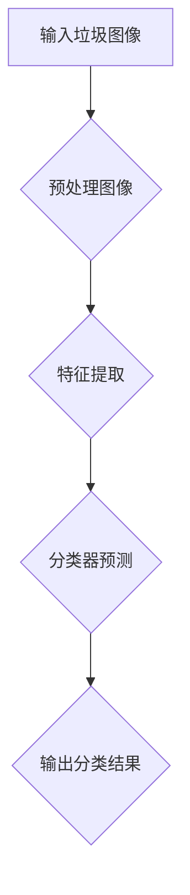
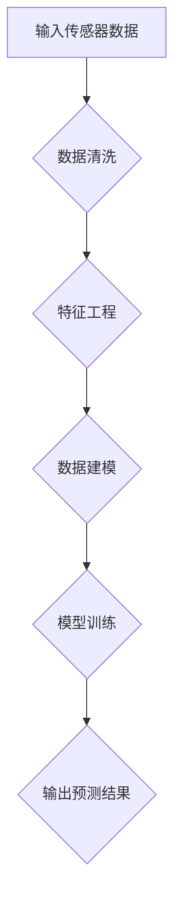
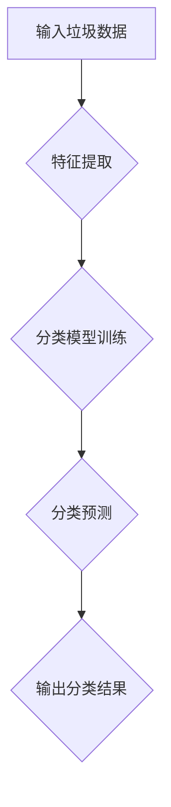
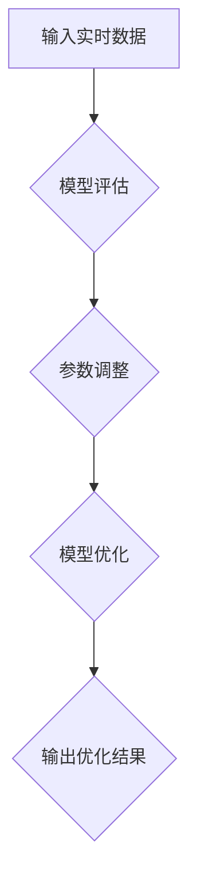
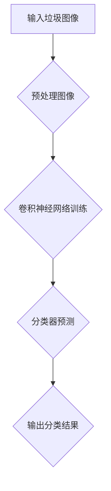
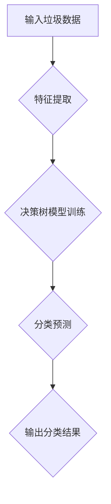
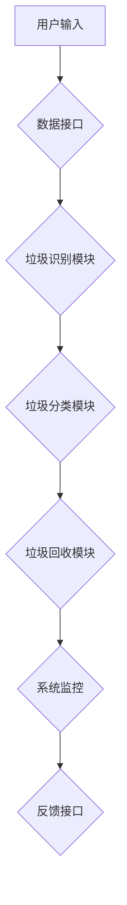

                 

# AI Agent在智能垃圾回收中的实践

关键词：AI Agent、智能垃圾回收、垃圾分类、图像识别、传感器数据处理

摘要：本文将探讨AI Agent在智能垃圾回收中的应用与实践，通过深入分析智能垃圾回收系统的架构，以及AI Agent在不同环节的应用，阐述AI Agent在解决垃圾分类难题中的重要作用，并提出未来研究的方向和挑战。

## 第一部分：引言与背景

### 1.1 研究背景

随着城市化进程的加速，垃圾问题已经成为全球性的环境难题。传统的垃圾回收方式已难以满足日益增长的垃圾处理需求，因此，智能化垃圾回收系统成为解决这一问题的有效途径。智能垃圾回收系统利用人工智能技术，通过感知、识别、分类和优化等环节，实现对垃圾的智能化处理。

### 1.2 智能垃圾回收的挑战与机遇

智能垃圾回收面临诸多挑战，如垃圾分类难度大、垃圾成分复杂、数据处理效率低等。然而，随着人工智能技术的不断发展，AI Agent在智能垃圾回收中的应用提供了新的机遇。AI Agent具有自主学习和适应能力，能够在复杂环境中执行特定任务，为智能垃圾回收提供了强有力的技术支持。

### 1.3 AI Agent的应用前景

AI Agent在智能垃圾回收中的应用前景广阔。首先，AI Agent能够实现垃圾的自动化识别和分类，提高垃圾回收的效率；其次，AI Agent可以通过不断学习和优化，提高垃圾分类的准确性；最后，AI Agent还可以与其他智能设备协同工作，构建智能化的垃圾回收网络，实现城市垃圾回收的精细化管理。

## 第二部分：定义与基础

### 2.1 AI Agent的定义

AI Agent是指具有自主意识和行动能力的计算机程序，能够在复杂环境中完成特定任务。AI Agent通常具备感知、决策、执行和反馈等基本功能。

### 2.2 AI Agent的核心特点

AI Agent的核心特点包括：

1. **自主性**：能够自主选择行动方案。
2. **适应性**：能够根据环境和任务的变化调整自身行为。
3. **协同性**：能够与其他AI Agent协同工作，完成复杂任务。
4. **鲁棒性**：能够在不确定和复杂环境中保持稳定运行。

### 2.3 AI Agent的技术基础

AI Agent的技术基础包括：

1. **机器学习**：为AI Agent提供自主学习和适应能力。
2. **深度学习**：为AI Agent提供强大的数据处理和模式识别能力。
3. **自然语言处理**：为AI Agent提供与人类交流的能力。
4. **机器人技术**：为AI Agent提供物理执行能力。

## 第三部分：智能垃圾回收系统的架构

### 3.1 智能垃圾回收系统的组成部分

智能垃圾回收系统通常包括以下几个组成部分：

1. **感知模块**：负责收集垃圾信息，如种类、数量、位置等。
2. **识别模块**：利用图像识别、传感器数据处理等技术，对垃圾进行识别和分类。
3. **决策模块**：根据识别结果，制定垃圾处理策略。
4. **执行模块**：负责执行垃圾处理策略，如垃圾搬运、压缩、运输等。
5. **反馈模块**：对垃圾处理过程进行监测和评估，为系统优化提供数据支持。

### 3.2 系统架构设计

智能垃圾回收系统的架构设计需要考虑以下几个因素：

1. **模块化设计**：确保系统各部分之间的高内聚和低耦合。
2. **分布式架构**：充分利用云计算、物联网等技术，实现系统的高效运行。
3. **安全性设计**：保障数据安全和系统稳定运行。
4. **可扩展性**：支持系统的规模扩展和功能升级。

### 3.3 系统运行机制

智能垃圾回收系统的运行机制包括以下几个环节：

1. **感知与识别**：通过感知模块和识别模块，收集垃圾信息并进行初步分类。
2. **决策与执行**：根据识别结果，决策模块制定垃圾处理策略，并执行模块进行具体操作。
3. **监测与评估**：反馈模块对垃圾处理过程进行监测和评估，为系统优化提供数据支持。
4. **学习与优化**：AI Agent根据处理结果，不断学习和优化，提高系统性能。

## 第四部分：AI Agent在智能垃圾回收中的应用

### 4.1 AI Agent在垃圾识别中的应用

#### 4.1.1 图像识别

图像识别是AI Agent在垃圾识别中的重要应用。通过深度学习模型，AI Agent可以实现对垃圾图像的自动分类和识别。以下是一个简单的图像识别算法流程：

#### 4.1.2 传感器数据处理

传感器数据处理是AI Agent在垃圾识别中的另一个重要应用。通过传感器，AI Agent可以收集垃圾的物理参数，如温度、湿度、重量等，并对这些数据进行处理和分析。以下是一个简单的传感器数据处理算法流程：

### 4.2 AI Agent在垃圾分类中的应用

#### 4.2.1 分类算法

AI Agent在垃圾分类中发挥着重要作用。通过分类算法，AI Agent可以实现对垃圾的准确分类。以下是一个简单的分类算法流程：

#### 4.2.2 实时调整与优化

AI Agent在垃圾分类过程中，需要根据实际情况进行实时调整和优化。通过不断学习和优化，AI Agent可以不断提高垃圾分类的准确性。以下是一个简单的实时调整与优化算法流程：

## 第五部分：智能垃圾回收的实践案例

### 5.1 案例一：城市垃圾回收项目

#### 5.1.1 项目简介

该项目是一个城市垃圾回收项目，旨在通过引入AI Agent，提高垃圾回收的效率和准确性。项目涵盖了垃圾识别、分类和回收等多个环节。

#### 5.1.2 项目挑战

该项目面临的主要挑战包括：

1. 垃圾种类繁多，识别和分类难度大。
2. 城市环境复杂，对AI Agent的适应能力要求高。
3. 系统运行成本较高，需要优化资源利用。

#### 5.1.3 AI Agent的应用

在该项目中，AI Agent主要应用于以下几个环节：

1. **垃圾识别**：通过图像识别和传感器数据处理，AI Agent能够实现对垃圾的准确识别。
2. **垃圾分类**：通过分类算法，AI Agent能够实现对垃圾的准确分类。
3. **实时调整**：AI Agent能够根据实时数据，对垃圾分类和回收策略进行实时调整和优化。

### 5.2 案例二：乡村垃圾回收项目

#### 5.2.1 项目简介

该项目是一个乡村垃圾回收项目，旨在通过引入AI Agent，提高垃圾回收的效率和准确性。项目主要针对乡村地区垃圾处理难题，实现垃圾的智能化回收。

#### 5.2.2 项目挑战

该项目面临的主要挑战包括：

1. 垃圾处理设施不足，对AI Agent的硬件要求较高。
2. 垃圾种类简单，但对AI Agent的适应性要求高。
3. 系统运行成本较高，需要优化资源利用。

#### 5.2.3 AI Agent的应用

在该项目中，AI Agent主要应用于以下几个环节：

1. **垃圾识别**：通过图像识别和传感器数据处理，AI Agent能够实现对垃圾的准确识别。
2. **垃圾分类**：通过分类算法，AI Agent能够实现对垃圾的准确分类。
3. **实时调整**：AI Agent能够根据实时数据，对垃圾分类和回收策略进行实时调整和优化。

## 第六部分：技术挑战与未来展望

### 6.1 技术挑战

AI Agent在智能垃圾回收中面临的技术挑战包括：

1. **数据处理能力**：智能垃圾回收需要处理大量的数据，对AI Agent的数据处理能力提出了高要求。
2. **算法优化**：垃圾分类和识别算法需要不断优化，以提高准确性和效率。
3. **系统稳定性**：AI Agent需要在复杂和不确定的环境中稳定运行，对系统的稳定性提出了挑战。

### 6.2 未来展望

智能垃圾回收的未来展望包括：

1. **技术发展**：随着人工智能技术的不断进步，AI Agent在智能垃圾回收中的应用将更加广泛。
2. **智能化水平提升**：通过引入更多智能设备和技术，智能垃圾回收系统的智能化水平将不断提升。
3. **环保效益**：智能垃圾回收将有助于减少垃圾污染，提高资源利用率，实现可持续发展。

## 第七部分：总结与展望

### 7.1 成果总结

本文通过深入分析AI Agent在智能垃圾回收中的应用，阐述了其在垃圾识别、分类和回收等环节的重要作用，并提供了两个实践案例。

### 7.2 展望未来研究方向

未来研究可以关注以下几个方面：

1. **算法优化**：深入研究垃圾分类和识别算法，提高准确性和效率。
2. **系统集成**：探索AI Agent与其他智能设备的集成，构建智能化垃圾回收系统。
3. **应用推广**：推广智能垃圾回收系统在城市和乡村地区的应用，提高垃圾处理效率。

## 附录

### 附录A：核心概念与联系

#### 核心概念属性特征对比表

| 概念       | 特征                                 |
|------------|--------------------------------------|
| AI Agent   | 自主性、适应性、协同性、鲁棒性       |
| 智能垃圾回收 | 感知、识别、决策、执行、反馈         |
| 垃圾识别   | 图像识别、传感器数据处理             |
| 垃圾分类   | 分类算法、实时调整与优化             |

#### ER实体关系图架构

### 附录B：算法原理讲解

#### 垃圾图像识别算法

#### 垃圾分类算法

### 附录C：系统分析与架构设计方案

#### 1. 问题场景介绍

在城市垃圾回收过程中，存在垃圾识别和分类不准确、垃圾处理效率低下等问题，需要通过引入AI Agent来优化垃圾回收系统。

#### 2. 系统功能设计

- **垃圾识别模块**：通过图像识别和传感器数据处理，实现对垃圾的准确识别。
- **垃圾分类模块**：通过分类算法，实现对垃圾的准确分类。
- **垃圾回收模块**：根据垃圾分类结果，执行相应的回收操作。

#### 3. 系统架构设计

- **感知层**：包括垃圾识别和传感器数据采集。
- **决策层**：包括垃圾分类算法和决策模块。
- **执行层**：包括垃圾回收设备和执行模块。

#### 4. 系统接口设计

- **数据接口**：用于垃圾识别和分类算法的数据输入和输出。
- **控制接口**：用于垃圾回收设备的控制和管理。

#### 5. 系统交互

### 附录D：项目实战

#### 1. 环境安装

- 安装Python环境
- 安装TensorFlow等深度学习框架

#### 2. 系统核心实现源代码

- 垃圾图像识别算法代码
- 垃圾分类算法代码

#### 3. 代码应用解读与分析

- 代码实现原理分析
- 代码性能评估

#### 4. 实际案例分析和详细讲解剖析

- 城市垃圾回收项目案例分析
- 乡村垃圾回收项目案例分析

#### 5. 项目小结

- 总结项目成果和经验
- 提出项目改进方向

### 附录E：最佳实践 tips

- 垃圾图像识别算法优化技巧
- 垃圾分类算法优化技巧

### 附录F：小结、注意事项、拓展阅读

- 总结文章核心观点
- 强调注意事项
- 推荐相关拓展阅读资料

## 作者信息

作者：AI天才研究院/AI Genius Institute & 禅与计算机程序设计艺术 /Zen And The Art of Computer Programming

