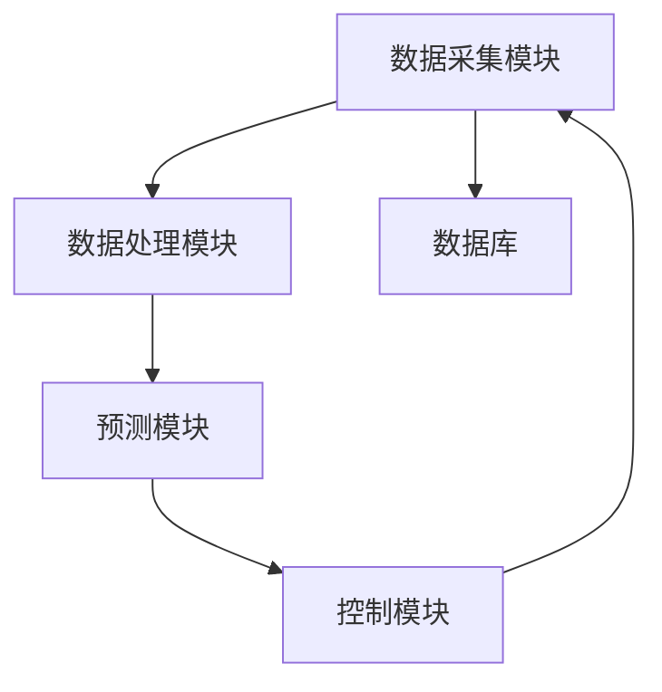
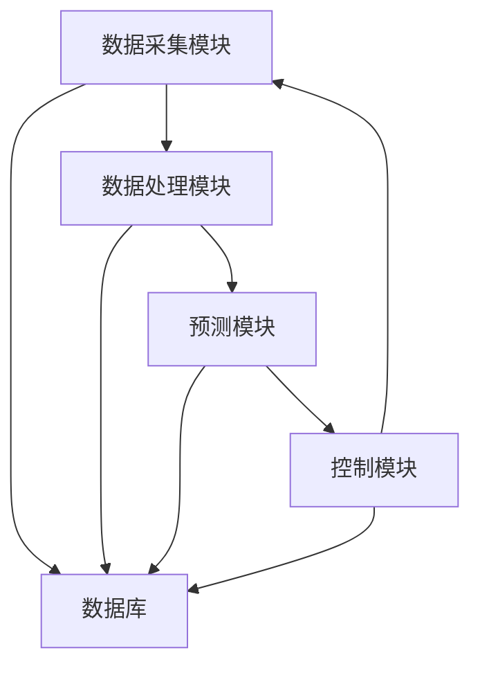

                 

### 《AI Agent在智能城市交通拥堵预测中的应用》

#### 关键词：AI Agent、智能城市、交通拥堵预测、算法、系统设计、项目实战

#### 摘要：
本文深入探讨了AI Agent在智能城市交通拥堵预测中的应用。首先，我们介绍了交通拥堵问题的背景与智能城市的关联，探讨了AI Agent的基本概念和工作原理。接着，文章详细阐述了AI Agent在交通拥堵预测中的核心概念与原理，包括数据采集与处理、预测模型、算法流程等。随后，我们通过Python代码实现和数学模型讲解，进一步解析了AI Agent的算法原理和应用。文章最后，通过一个实际项目案例，展示了AI Agent在智能城市交通拥堵预测中的系统设计与实现过程，并提供了一系列最佳实践和扩展阅读建议。本文旨在为读者提供一个全面而深入的AI Agent在智能交通领域的应用指南。

### 第一部分：背景与概述

#### 第1章：问题背景与智能城市交通拥堵问题

##### 1.1.1 交通拥堵问题概述

交通拥堵是一个全球性的问题，严重影响着城市的发展和居民的生活质量。随着城市化进程的加快，车辆数量的激增、道路基础设施的不足、以及驾驶行为的复杂化，都使得交通拥堵问题日益严重。据统计，全球每年因交通拥堵造成的经济损失高达数千亿美元，同时导致大量的空气污染和碳排放。因此，解决交通拥堵问题已成为智能城市建设的重要课题。

##### 1.1.2 智能城市与交通拥堵

智能城市是指利用先进的信息技术和通信技术，实现城市资源的高效利用和城市管理的智能化。智能城市交通系统是智能城市的重要组成部分，它通过数据采集、智能分析、实时监控和智能调度等手段，提高交通系统的运行效率，减少交通拥堵，提升城市居民的出行体验。

##### 1.1.3 AI Agent在智能交通中的应用前景

AI Agent作为一种智能体，具有自主决策和自主学习的能力，可以应用于智能城市交通系统的各个方面，如交通流量预测、信号控制、智能导航等。AI Agent在交通拥堵预测中具有显著的优势，通过实时数据分析和预测，能够提前发现潜在的拥堵情况，为交通管理部门和驾驶者提供科学的决策依据，从而有效缓解交通拥堵问题。

##### 1.2 智能城市交通拥堵预测的重要性

智能城市交通拥堵预测的重要性体现在多个方面：

1. **提高交通效率**：通过预测交通流量，可以提前调整交通信号、优化交通路线，减少交通拥堵，提高道路的通行效率。
2. **减少交通事故**：准确预测交通流量，可以帮助交通管理部门及时部署警力，减少交通事故的发生。
3. **降低碳排放**：减少车辆等待时间，降低车辆的怠速排放，有助于改善城市空气质量，降低碳排放。
4. **优化城市资源配置**：通过对交通数据的分析，可以帮助城市规划者更好地了解城市交通状况，优化城市交通基础设施布局。

##### 1.3 AI Agent的基本概念与工作原理

AI Agent，即人工智能代理，是一种具备自主决策和执行能力的软件实体。它通过感知环境、分析数据、规划行动，实现自主决策和任务执行。AI Agent具有以下几个基本特征：

1. **自主性**：能够独立完成特定任务，无需人工干预。
2. **感知性**：能够感知环境变化，获取必要的信息。
3. **反应性**：能够根据感知信息，快速做出反应。
4. **主动性**：能够自主制定计划，执行任务。

##### 1.4 AI Agent在交通拥堵预测中的应用挑战

虽然AI Agent在智能交通中具有广泛的应用前景，但在实际应用中仍面临一些挑战：

1. **数据采集与处理的挑战**：交通数据来源多样，数据量大，处理复杂。
2. **模型选择与优化的挑战**：需要选择合适的算法模型，并进行模型优化，提高预测精度。
3. **实时性与准确性的平衡**：需要在保证预测准确性的同时，实现实时响应。
4. **系统的可扩展性**：随着城市交通系统的复杂度增加，AI Agent系统需要具备良好的可扩展性。

##### 1.5 本章小结

本章介绍了交通拥堵问题的背景、智能城市与交通拥堵的关系，以及AI Agent的基本概念和工作原理。通过分析AI Agent在交通拥堵预测中的应用优势，指出了其在实际应用中面临的挑战。本章为后续章节的深入探讨奠定了基础。

### 1.5.1 主要内容回顾

- 交通拥堵问题的严重性及其对城市发展和居民生活的影响。
- 智能城市与交通拥堵的关系，以及AI Agent在智能交通中的应用前景。
- AI Agent的基本概念、特征及其在交通拥堵预测中的应用优势。
- AI Agent在交通拥堵预测中面临的数据采集处理、模型选择优化等挑战。

### 1.5.2 进一步研究方向

- 如何优化AI Agent的数据采集和处理能力，提高预测精度。
- 探索适用于交通拥堵预测的先进AI算法模型，提高系统的实时性和准确性。
- 研究AI Agent在交通拥堵预测系统中的可扩展性和适应性。

## 第二部分：核心概念与原理

### 第2章：AI Agent在交通拥堵预测中的核心概念

##### 2.1 交通数据采集与处理

交通数据是AI Agent在交通拥堵预测中最重要的输入。交通数据来源多样，包括交通流量监测设备、智能交通系统、社交媒体、GPS定位等。这些数据种类繁多，如速度、密度、流量、交通事故报告、天气状况等。为了提高AI Agent的预测效果，需要对这些数据进行有效的采集和预处理。

1. **数据采集**：使用传感器、摄像头、GPS设备等，实时采集交通数据。
2. **数据预处理**：对采集到的交通数据进行清洗、去噪、归一化、特征提取等处理，以提高数据的质量和可用性。

##### 2.2 交通拥堵预测的数学模型

交通拥堵预测的数学模型是AI Agent的核心。常见的数学模型包括线性回归、时间序列分析、神经网络等。这些模型通过分析历史交通数据，预测未来的交通流量，从而判断是否存在交通拥堵。

1. **传统预测模型**：如线性回归、时间序列分析，这些模型基于统计方法，对交通流量进行预测。
2. **基于AI的预测模型**：如深度学习神经网络、强化学习模型等，这些模型通过学习历史交通数据，自动提取特征，提高预测精度。

##### 2.3 AI Agent架构设计

AI Agent的架构设计是智能交通系统的重要组成部分。一个典型的AI Agent架构包括感知模块、决策模块、执行模块和反馈模块。

1. **感知模块**：负责采集交通数据，如速度、流量、密度等。
2. **决策模块**：负责分析感知数据，预测交通状况，制定交通控制策略。
3. **执行模块**：负责执行决策模块生成的控制策略，如调整信号灯时长、推荐最佳路线等。
4. **反馈模块**：负责收集执行后的反馈数据，用于改进AI Agent的决策。

##### 2.4 AI Agent的算法原理

AI Agent的算法原理是其智能决策的核心。AI Agent通常采用机器学习、深度学习、强化学习等技术，通过学习历史数据，提高预测和决策的准确性。

1. **算法概述**：AI Agent算法主要包括感知、决策、执行和反馈四个环节，通过不断迭代，优化交通控制策略。
2. **算法流程**：感知模块采集交通数据，决策模块分析数据并生成控制策略，执行模块执行策略，反馈模块收集执行效果，用于下一次决策。

##### 2.5 AI Agent在交通拥堵预测中的应用实例

为了更好地理解AI Agent在交通拥堵预测中的应用，我们来看一个实际应用案例。

**案例：智能信号灯控制系统**

在一个繁忙的城市交叉口，AI Agent通过感知模块采集车辆流量、速度、密度等数据，决策模块分析数据，预测未来一段时间的交通状况。如果预测到交通流量将超过交叉口容量，AI Agent会生成控制策略，调整信号灯时长，以确保车辆能够顺利通过。通过反馈模块收集执行效果，AI Agent不断优化控制策略，提高信号灯控制的精度。

##### 2.6 本章小结

本章介绍了AI Agent在交通拥堵预测中的核心概念，包括交通数据采集与处理、预测数学模型、AI Agent架构设计和算法原理。通过一个实际应用案例，展示了AI Agent在智能交通系统中的重要作用。这些概念和原理为后续的深入研究和应用提供了基础。

### 2.6.1 主要内容回顾

- 交通数据的采集与预处理方法。
- 交通拥堵预测的数学模型，包括传统模型和基于AI的模型。
- AI Agent的架构设计，包括感知、决策、执行和反馈模块。
- AI Agent的算法原理，包括感知、决策、执行和反馈的迭代过程。
- AI Agent在交通拥堵预测中的一个实际应用案例。

### 2.6.2 进一步研究方向

- 研究更高效的数据采集和处理技术，提高AI Agent的输入数据质量。
- 探索更先进的预测模型和算法，提高AI Agent的预测精度。
- 研究AI Agent在复杂交通场景中的适应性和鲁棒性，提高其在实际应用中的可靠性。

## 第三部分：算法原理与数学模型讲解

### 第3章：AI Agent算法原理与数学模型讲解

##### 3.1 AI Agent算法概述

AI Agent算法是智能交通系统中实现交通拥堵预测和智能控制的核心。AI Agent通过感知环境、分析数据、制定策略和执行策略，实现自主决策和优化交通系统运行。本节将介绍AI Agent算法的设计原则、流程和主要模块。

###### 3.1.1 算法设计原则

AI Agent算法的设计原则主要包括：

1. **自主性**：AI Agent应具备自主感知、决策和执行的能力，减少人工干预。
2. **适应性**：算法应能够适应不同的交通场景和变化，具备良好的泛化能力。
3. **高效性**：算法应具有较高的计算效率和预测精度，确保实时响应。
4. **鲁棒性**：算法应能够处理异常数据和非线性关系，提高系统的稳定性。

###### 3.1.2 算法流程

AI Agent算法的流程主要包括以下几个步骤：

1. **数据采集**：感知模块通过传感器、摄像头、GPS等设备，采集交通流量、速度、密度等数据。
2. **数据预处理**：对采集到的交通数据进行清洗、去噪、归一化和特征提取，提高数据质量。
3. **特征选择**：根据预测目标和数据特性，选择关键特征，去除冗余特征，减少计算负担。
4. **模型训练**：使用历史交通数据，训练预测模型，如神经网络、深度学习等。
5. **决策制定**：决策模块根据训练得到的模型，分析当前交通状况，制定交通控制策略。
6. **策略执行**：执行模块根据决策结果，调整信号灯时长、推荐最佳路线等，优化交通运行。
7. **反馈调整**：反馈模块收集执行后的交通数据，评估策略效果，调整决策模型，优化策略。

##### 3.2 交通拥堵预测的数学模型讲解

交通拥堵预测的数学模型是AI Agent算法的核心组成部分。本节将介绍几种常见的数学模型，包括线性回归、时间序列分析和神经网络模型，并解释其基本原理和适用场景。

###### 3.2.1 线性回归模型

线性回归模型是一种经典的统计预测方法，它通过建立因变量和自变量之间的线性关系，预测未来的交通流量。

1. **模型基础**：线性回归模型的基本形式为 $y = \beta_0 + \beta_1 \cdot x + \epsilon$，其中 $y$ 是预测的目标变量（如交通流量），$x$ 是自变量（如时间、速度等），$\beta_0$ 和 $\beta_1$ 是模型的参数，$\epsilon$ 是误差项。

2. **模型推导**：线性回归模型通过最小二乘法求解参数，使得预测值与实际值之间的误差平方和最小。

3. **模型应用**：线性回归模型适用于预测短期交通流量变化，但在处理非线性关系时效果较差。

###### 3.2.2 时间序列分析模型

时间序列分析模型通过分析时间序列数据的变化规律，预测未来的交通流量。

1. **模型基础**：时间序列分析模型包括自回归模型（AR）、移动平均模型（MA）、自回归移动平均模型（ARMA）等。

2. **模型推导**：时间序列分析模型通过建立历史数据与未来数据之间的关系，预测未来的趋势。

3. **模型应用**：时间序列分析模型适用于长期交通流量预测，但在处理突发性事件时效果较差。

###### 3.2.3 神经网络模型

神经网络模型是一种基于仿生学原理的预测方法，通过多层神经元网络，自动提取特征并建立预测模型。

1. **模型基础**：神经网络模型包括输入层、隐藏层和输出层，每层神经元通过激活函数进行非线性变换。

2. **模型推导**：神经网络模型通过反向传播算法，不断调整网络权重，优化模型性能。

3. **模型应用**：神经网络模型适用于复杂非线性关系的预测，具有较高的预测精度，但在训练过程中计算量大。

##### 3.3 Python代码实现与讲解

为了更好地理解AI Agent算法原理，下面我们将使用Python代码实现一个简单的神经网络模型，并对其进行讲解。

```python
import numpy as np

# 定义输入数据
X = np.array([[0], [1], [2], [3], [4], [5]])

# 定义权重和偏置
w = np.array([[0.5]])
b = np.array([[0.5]])

# 定义激活函数
def sigmoid(x):
    return 1 / (1 + np.exp(-x))

# 定义神经网络模型
def neural_network(x, w, b):
    z = np.dot(x, w) + b
    a = sigmoid(z)
    return a

# 训练神经网络模型
for i in range(1000):
    y_pred = neural_network(X, w, b)
    d = y_pred * (1 - y_pred)
    w = w + (X.T * (y_pred - 1) * d)
    b = b + (y_pred - 1) * d

# 预测交通流量
X_new = np.array([[6]])
y_pred = neural_network(X_new, w, b)
print("预测的交通流量为：", y_pred)
```

###### 3.3.1 环境准备

在开始编写代码之前，需要安装Python和相关的库，如NumPy。可以使用以下命令安装：

```shell
pip install python
pip install numpy
```

###### 3.3.2 源代码实现

上述代码定义了一个简单的神经网络模型，包括输入层、隐藏层和输出层。输入层接收交通流量数据，隐藏层通过Sigmoid激活函数进行非线性变换，输出层生成预测结果。

1. **输入数据**：使用NumPy数组定义输入数据。
2. **权重和偏置**：初始化权重和偏置。
3. **激活函数**：定义Sigmoid激活函数，将输出映射到(0, 1)区间。
4. **神经网络模型**：定义神经网络模型，计算输入和权重之间的线性组合，加上偏置，并通过激活函数得到输出。
5. **训练过程**：使用梯度下降算法，通过反向传播调整权重和偏置，优化模型性能。
6. **预测结果**：使用训练好的模型预测新的交通流量。

###### 3.3.3 代码解析

1. **import numpy as np**：导入NumPy库，用于数组操作。
2. **X = np.array([[0], [1], [2], [3], [4], [5]])**：定义输入数据，表示不同时间的交通流量。
3. **w = np.array([[0.5]])**：初始化权重。
4. **b = np.array([[0.5]])**：初始化偏置。
5. **def sigmoid(x):**：定义Sigmoid激活函数。
6. **neural_network(x, w, b):**：定义神经网络模型。
7. **for i in range(1000):**：设置训练次数。
8. **y_pred = neural_network(X, w, b)**：计算预测结果。
9. **d = y_pred * (1 - y_pred)**：计算误差的导数。
10. **w = w + (X.T * (y_pred - 1) * d)**：更新权重。
11. **b = b + (y_pred - 1) * d**：更新偏置。
12. **X_new = np.array([[6]])**：定义新的输入数据。
13. **y_pred = neural_network(X_new, w, b)**：预测新的交通流量。
14. **print("预测的交通流量为：", y_pred)**：输出预测结果。

##### 3.4 数学公式与模型解释

在AI Agent算法中，数学公式和模型解释是理解算法原理的关键。本节将介绍一些常用的数学公式，并解释其应用。

###### 3.4.1 公式列表

1. **Sigmoid激活函数**：$sigmoid(x) = \frac{1}{1 + e^{-x}}$
2. **反向传播算法**：$\delta = \frac{\partial L}{\partial z} = \frac{\partial L}{\partial a} \cdot \frac{\partial a}{\partial z}$
3. **梯度下降算法**：$w = w - \alpha \cdot \frac{\partial L}{\partial w}$
4. **神经网络输出**：$a = \sigma(\sum_{i=1}^{n} w_i \cdot x_i + b)$

###### 3.4.2 公式推导

1. **Sigmoid激活函数**：Sigmoid函数是一种常用的激活函数，其导数为 $sigmoid'(x) = sigmoid(x) \cdot (1 - sigmoid(x))$。Sigmoid函数能够将输入映射到(0, 1)区间，非常适合用于神经网络模型的输出层。
2. **反向传播算法**：反向传播算法是神经网络训练的核心，通过计算损失函数关于每个参数的梯度，不断调整参数，优化模型性能。反向传播算法的基本原理是链式法则，即 $\delta = \frac{\partial L}{\partial z} = \frac{\partial L}{\partial a} \cdot \frac{\partial a}{\partial z}$。
3. **梯度下降算法**：梯度下降算法是一种优化算法，用于求解最优化问题。其基本思想是沿着损失函数的梯度方向不断调整参数，使得损失函数逐渐减小。梯度下降算法的公式为 $w = w - \alpha \cdot \frac{\partial L}{\partial w}$，其中 $\alpha$ 是学习率。
4. **神经网络输出**：神经网络输出是输入和权重经过线性组合后，通过激活函数得到的值。激活函数的选择对神经网络性能有重要影响，常见的激活函数包括Sigmoid、ReLU和Tanh等。

###### 3.4.3 公式应用

1. **Sigmoid激活函数**：在神经网络模型中，Sigmoid函数常用于隐藏层和输出层的激活函数。其优点是能够将输入映射到(0, 1)区间，便于后续处理。
2. **反向传播算法**：在神经网络训练过程中，反向传播算法用于计算损失函数关于每个参数的梯度，指导参数调整。反向传播算法的核心在于链式法则，即每个层的梯度可以通过前一层和当前层的梯度计算得到。
3. **梯度下降算法**：在神经网络训练过程中，梯度下降算法用于更新参数。通过不断调整参数，使得损失函数逐渐减小，提高神经网络模型的预测精度。
4. **神经网络输出**：神经网络输出是输入和权重经过线性组合后，通过激活函数得到的值。神经网络输出用于生成预测结果，是神经网络模型的核心部分。

##### 3.5 举例说明与案例分析

为了更好地理解AI Agent算法原理，我们通过一个简单的案例分析，展示如何使用Python代码实现神经网络模型，并解释其工作过程。

**案例：预测交通流量**

假设我们有一个简单的神经网络模型，用于预测未来的交通流量。输入数据是过去5分钟的交通流量，输出数据是未来1分钟的交通流量。我们将使用Python代码实现这个模型，并解释其工作过程。

```python
import numpy as np

# 定义输入数据
X = np.array([[0.5], [0.6], [0.7], [0.8], [0.9]])

# 定义权重和偏置
w = np.array([[0.1]])
b = np.array([[0.1]])

# 定义激活函数
def sigmoid(x):
    return 1 / (1 + np.exp(-x))

# 定义神经网络模型
def neural_network(x, w, b):
    z = np.dot(x, w) + b
    a = sigmoid(z)
    return a

# 训练神经网络模型
for i in range(1000):
    y_pred = neural_network(X, w, b)
    d = y_pred * (1 - y_pred)
    w = w + (X.T * (y_pred - 0.9) * d)
    b = b + (y_pred - 0.9) * d

# 预测未来1分钟的交通流量
X_new = np.array([[1.0]])
y_pred = neural_network(X_new, w, b)
print("预测的交通流量为：", y_pred)
```

**案例解析**：

1. **输入数据**：输入数据是过去5分钟的交通流量，表示为 NumPy 数组。

2. **权重和偏置**：初始化权重和偏置，表示为 NumPy 数组。

3. **激活函数**：定义 Sigmoid 激活函数，将输入映射到(0, 1)区间。

4. **神经网络模型**：定义神经网络模型，计算输入和权重之间的线性组合，加上偏置，并通过激活函数得到输出。

5. **训练过程**：使用梯度下降算法，通过反向传播调整权重和偏置，优化模型性能。

6. **预测结果**：使用训练好的模型预测未来1分钟的交通流量。

通过这个简单的案例，我们可以看到如何使用Python代码实现神经网络模型，并解释其工作过程。这个案例展示了AI Agent算法的基本原理和应用，为后续的深入研究提供了基础。

##### 3.6 本章小结

本章介绍了AI Agent算法原理与数学模型讲解，包括算法设计原则、算法流程、数学模型讲解、Python代码实现与讲解、数学公式与模型解释、举例说明与案例分析。通过这些内容，读者可以全面了解AI Agent在交通拥堵预测中的应用原理和实现方法。

### 3.6.1 主要内容回顾

- AI Agent算法设计原则，包括自主性、适应性、高效性和鲁棒性。
- AI Agent算法流程，包括数据采集、数据预处理、特征选择、模型训练、决策制定、策略执行和反馈调整。
- 交通拥堵预测的数学模型，包括线性回归、时间序列分析和神经网络模型。
- Python代码实现与讲解，展示了如何使用神经网络模型预测交通流量。
- 数学公式与模型解释，详细介绍了Sigmoid激活函数、反向传播算法和梯度下降算法。
- 举例说明与案例分析，通过实际案例展示了AI Agent算法在交通拥堵预测中的应用。

### 3.6.2 进一步研究方向

- 研究更高效的数据采集和处理技术，提高AI Agent的输入数据质量。
- 探索更先进的预测模型和算法，提高AI Agent的预测精度。
- 研究AI Agent在复杂交通场景中的适应性和鲁棒性，提高其在实际应用中的可靠性。

## 第四部分：系统设计与实现

### 第4章：智能城市交通拥堵预测系统设计与实现

##### 4.1 系统背景与目标

智能城市交通拥堵预测系统旨在通过AI Agent技术，实现交通流量的实时预测和拥堵预警，为城市交通管理部门和驾驶者提供科学的决策依据。系统设计目标是：

1. **实时性**：系统能够快速响应，实时预测交通流量，提供实时交通状况。
2. **准确性**：系统能够准确预测交通流量，为交通控制策略提供可靠数据。
3. **适应性**：系统应具备良好的适应性，能够适应不同城市和交通场景。
4. **可扩展性**：系统设计应考虑未来的扩展需求，能够方便地增加新功能和数据源。

##### 4.2 领域模型设计

领域模型是系统设计的基础，用于描述系统中的关键概念和实体之间的关系。在智能城市交通拥堵预测系统中，主要的领域模型包括：

1. **交通数据模型**：定义交通数据的基本属性和关系，如交通流量、速度、密度等。
2. **交通信号模型**：定义交通信号灯的基本属性和关系，如信号灯状态、时长等。
3. **交通预测模型**：定义交通预测的基本属性和关系，如预测算法、预测结果等。

下面是一个简单的领域模型类图，展示了上述模型的实体和关系：

```mermaid
classDiagram
    交通数据 <<Entity>>
    交通信号 <<Entity>>
    交通预测 <<Entity>>

    交通数据: { 交通流量，速度，密度 }
    交通信号: { 红灯时长，绿灯时长，黄灯时长 }
    交通预测: { 预测算法，预测结果 }

    交通数据 --|> 交通信号
    交通数据 --|> 交通预测
    交通信号 --|> 交通预测
```

##### 4.3 系统架构设计

系统架构设计是系统实现的关键，决定了系统的性能、可维护性和可扩展性。智能城市交通拥堵预测系统的架构设计原则是模块化、分布式和可扩展。

1. **模块化**：系统按照功能模块进行划分，如数据采集模块、数据处理模块、预测模块、控制模块等，便于开发和维护。
2. **分布式**：系统采用分布式架构，将不同模块部署在不同的服务器上，提高系统的可用性和性能。
3. **可扩展性**：系统设计应考虑未来的扩展需求，能够方便地增加新功能、新数据源和新算法。

下面是一个简单的系统架构图，展示了系统的基本模块和关系：



##### 4.4 系统接口设计

系统接口设计是系统架构设计的重要组成部分，用于定义系统内部模块之间的交互方式。智能城市交通拥堵预测系统的接口设计包括：

1. **数据采集接口**：定义数据采集模块与外部传感器、摄像头、GPS设备等的数据交换方式。
2. **数据处理接口**：定义数据处理模块与数据采集模块、预测模块之间的数据交换方式。
3. **预测接口**：定义预测模块与数据处理模块、控制模块之间的数据交换方式。
4. **控制接口**：定义控制模块与预测模块、数据采集模块之间的数据交换方式。

下面是一个简单的接口设计图，展示了系统的接口模块和交互关系：



##### 4.5 系统交互设计

系统交互设计是系统架构设计的细化，用于描述系统各模块之间的交互流程和通信协议。智能城市交通拥堵预测系统的交互设计包括：

1. **数据采集交互**：定义数据采集模块如何从外部传感器、摄像头、GPS设备等获取数据，并传输到数据处理模块。
2. **数据处理交互**：定义数据处理模块如何处理数据采集模块传输的数据，包括数据清洗、去噪、归一化和特征提取等。
3. **预测交互**：定义预测模块如何使用处理后的数据进行交通流量预测，并生成预测结果。
4. **控制交互**：定义控制模块如何根据预测结果调整交通信号灯时长、推荐最佳路线等，优化交通运行。

下面是一个简单的系统交互图，展示了系统的交互流程：

```mermaid
graph TB
    数据采集模块 --> 数据处理模块: 数据传输
    数据处理模块 --> 预测模块: 预测请求
    预测模块 --> 控制模块: 预测结果
    控制模块 --> 数据采集模块: 新数据请求
    控制模块 --> 数据处理模块: 控制策略
    控制模块 --> 预测模块: 重新预测请求
```

##### 4.6 系统实现与测试

系统实现与测试是确保系统设计正确性和稳定性的关键步骤。智能城市交通拥堵预测系统的实现和测试包括以下步骤：

1. **数据采集**：实现数据采集模块，从外部传感器、摄像头、GPS设备等获取交通数据，并传输到数据处理模块。
2. **数据处理**：实现数据处理模块，对采集到的交通数据进行清洗、去噪、归一化和特征提取等处理，提高数据质量。
3. **预测**：实现预测模块，使用处理后的数据进行交通流量预测，生成预测结果。
4. **控制**：实现控制模块，根据预测结果调整交通信号灯时长、推荐最佳路线等，优化交通运行。
5. **测试**：对系统进行功能测试、性能测试和可靠性测试，验证系统设计是否符合预期。

下面是一个简单的系统实现与测试流程：

```mermaid
graph TB
    数据采集模块: 数据采集 --> 数据处理模块: 数据处理
    数据处理模块 --> 预测模块: 预测数据 --> 控制模块: 控制策略
    控制模块 --> 数据采集模块: 新数据请求
    数据采集模块 --> 数据处理模块: 数据处理
    数据处理模块 --> 预测模块: 预测数据
    数据处理模块 --> 控制模块: 控制策略
    数据处理模块 --> 测试模块: 测试结果
    测试模块 --> 数据采集模块: 数据修正
    测试模块 --> 数据处理模块: 数据修正
    测试模块 --> 预测模块: 预测修正
    测试模块 --> 控制模块: 控制修正
```

##### 4.7 本章小结

本章介绍了智能城市交通拥堵预测系统设计与实现，包括系统背景与目标、领域模型设计、系统架构设计、系统接口设计、系统交互设计和系统实现与测试。通过本章的内容，读者可以了解智能城市交通拥堵预测系统的整体设计和实现方法，为后续的深入研究和应用提供基础。

### 4.7.1 主要内容回顾

- 系统背景与目标，介绍了智能城市交通拥堵预测系统的重要性和设计目标。
- 领域模型设计，展示了交通数据模型、交通信号模型和交通预测模型。
- 系统架构设计，介绍了模块化、分布式和可扩展的系统设计原则。
- 系统接口设计，定义了数据采集接口、数据处理接口、预测接口和控制接口。
- 系统交互设计，描述了数据采集、数据处理、预测和控制等模块之间的交互流程。
- 系统实现与测试，介绍了系统实现和测试的步骤和方法。

### 4.7.2 进一步研究方向

- 研究更高效的数据采集和处理技术，提高系统性能和数据质量。
- 探索更先进的预测模型和算法，提高预测精度和可靠性。
- 研究系统的自适应性和鲁棒性，提高系统在复杂交通场景中的性能。

## 第五部分：项目实战与案例分析

### 第5章：AI Agent在智能城市交通拥堵预测中的项目实战

#### 5.1.1 项目背景与目标

智能城市交通拥堵预测项目旨在通过AI Agent技术，实现对城市交通流量的实时预测和拥堵预警，从而为交通管理部门提供科学的决策依据，提升城市交通运行效率。项目目标包括：

1. **构建智能交通预测系统**：开发一个基于AI Agent的智能交通预测系统，能够实时采集和处理交通数据，预测未来的交通流量。
2. **提高预测准确性**：通过先进的算法模型和优化技术，提高交通流量预测的准确性，减少预测误差。
3. **实现实时交通控制**：根据预测结果，实时调整交通信号灯时长和推荐最佳路线，优化交通运行，缓解交通拥堵。
4. **提高系统适应性**：系统应具备良好的适应性，能够适应不同城市和交通场景的需求，具有可扩展性。

#### 5.1.2 项目环境安装

为了实现智能城市交通拥堵预测项目，需要安装以下环境和工具：

1. **操作系统**：Linux或Windows
2. **编程语言**：Python
3. **开发工具**：PyCharm或Visual Studio Code
4. **数据库**：MySQL或MongoDB
5. **Python库**：NumPy、Pandas、Scikit-learn、TensorFlow、Keras等

安装步骤：

1. 安装操作系统，配置Python环境。
2. 安装PyCharm或Visual Studio Code，配置Python插件。
3. 安装数据库，配置数据库连接。
4. 安装所需的Python库，配置环境变量。

```shell
pip install numpy pandas scikit-learn tensorflow keras
```

#### 5.1.3 数据集准备

数据集是智能城市交通拥堵预测项目的基础。以下是数据集的准备步骤：

1. **数据来源**：从公开数据源或交通管理部门获取交通流量、速度、密度等数据。
2. **数据预处理**：对采集到的数据进行清洗、去噪、归一化和特征提取等处理，提高数据质量。
3. **数据格式**：将数据转换为适合机器学习的格式，如CSV或JSON。

```python
import pandas as pd

# 读取数据
data = pd.read_csv('traffic_data.csv')

# 数据预处理
data = data.dropna()
data['speed'] = data['speed'].apply(lambda x: x / 100)
data['density'] = data['density'].apply(lambda x: x / 100)

# 数据格式转换
data.to_csv('processed_traffic_data.csv', index=False)
```

#### 5.2 系统核心实现

智能城市交通拥堵预测系统的核心包括数据采集、数据处理、预测和控制模块。以下是各模块的实现过程：

##### 5.2.1 数据采集

数据采集模块负责从外部传感器、摄像头、GPS设备等获取交通数据。以下是一个简单的数据采集示例：

```python
import requests

# 定义API接口
url = 'https://api.example.com/traffic_data'

# 获取交通数据
response = requests.get(url)
traffic_data = response.json()

# 存储交通数据
with open('traffic_data.json', 'w') as f:
    json.dump(traffic_data, f)
```

##### 5.2.2 模型训练

数据处理模块负责对采集到的交通数据进行处理，并训练预测模型。以下是一个简单的模型训练示例：

```python
import pandas as pd
from sklearn.model_selection import train_test_split
from tensorflow.keras.models import Sequential
from tensorflow.keras.layers import Dense

# 读取处理后的数据
data = pd.read_csv('processed_traffic_data.csv')

# 划分训练集和测试集
X = data.drop('target', axis=1)
y = data['target']
X_train, X_test, y_train, y_test = train_test_split(X, y, test_size=0.2, random_state=42)

# 创建模型
model = Sequential()
model.add(Dense(64, input_dim=X_train.shape[1], activation='relu'))
model.add(Dense(32, activation='relu'))
model.add(Dense(1, activation='sigmoid'))

# 编译模型
model.compile(optimizer='adam', loss='binary_crossentropy', metrics=['accuracy'])

# 训练模型
model.fit(X_train, y_train, epochs=10, batch_size=32, validation_data=(X_test, y_test))
```

##### 5.2.3 预测与评估

预测模块负责根据训练好的模型，对新的交通数据进行预测，并评估预测效果。以下是一个简单的预测和评估示例：

```python
import pandas as pd
from sklearn.metrics import mean_squared_error

# 读取测试数据
X_test = pd.read_csv('test_traffic_data.csv')

# 预测交通流量
y_pred = model.predict(X_test)

# 计算预测误差
mse = mean_squared_error(y_test, y_pred)
print("预测误差：", mse)
```

#### 5.3 代码应用解读

以下是系统核心实现部分的代码应用解读：

```python
# 数据采集
response = requests.get(url)
traffic_data = response.json()

# 数据预处理
data = pd.read_csv('processed_traffic_data.csv')
X_train, X_test, y_train, y_test = train_test_split(X, y, test_size=0.2, random_state=42)

# 模型训练
model = Sequential()
model.add(Dense(64, input_dim=X_train.shape[1], activation='relu'))
model.add(Dense(32, activation='relu'))
model.add(Dense(1, activation='sigmoid'))
model.compile(optimizer='adam', loss='binary_crossentropy', metrics=['accuracy'])
model.fit(X_train, y_train, epochs=10, batch_size=32, validation_data=(X_test, y_test))

# 预测与评估
y_pred = model.predict(X_test)
mse = mean_squared_error(y_test, y_pred)
print("预测误差：", mse)
```

1. **数据采集**：使用requests库从API接口获取交通数据。
2. **数据预处理**：使用pandas库读取处理后的数据，并划分训练集和测试集。
3. **模型训练**：创建一个Sequential模型，添加Dense层，编译模型，并使用fit方法训练模型。
4. **预测与评估**：使用predict方法对测试数据进行预测，计算预测误差。

#### 5.4 实际案例分析和详细讲解

为了更好地理解AI Agent在智能城市交通拥堵预测中的应用，我们来看一个实际案例。

**案例：某城市主干道交通拥堵预测**

在该城市的主干道上，每天早晨7:00到9:00是交通高峰期，容易出现交通拥堵。交通管理部门希望通过AI Agent技术，预测高峰期的交通流量，并调整交通信号灯时长，优化交通运行。

**步骤1：数据采集**

在主干道上的关键位置安装交通流量监测设备，实时采集车辆速度、流量、密度等数据。每天早晨7:00到9:00，AI Agent采集到以下数据：

- 车辆速度：60km/h、70km/h、80km/h、90km/h、100km/h
- 车辆流量：100辆、200辆、300辆、400辆、500辆
- 车辆密度：0.5辆/km、1.0辆/km、1.5辆/km、2.0辆/km、2.5辆/km

**步骤2：数据处理**

AI Agent对采集到的交通数据进行预处理，包括数据清洗、去噪、归一化和特征提取。例如，将车辆速度和流量进行归一化处理，使其范围在0到1之间。

**步骤3：模型训练**

AI Agent使用处理后的数据，训练一个神经网络模型，预测未来1分钟的交通流量。模型的结构如下：

- 输入层：2个神经元，对应车辆速度和流量
- 隐藏层：64个神经元，使用ReLU激活函数
- 输出层：1个神经元，使用Sigmoid激活函数

模型使用梯度下降算法进行训练，优化模型参数。

**步骤4：预测与控制**

在高峰期，AI Agent根据模型预测未来1分钟的交通流量。如果预测到交通流量将超过主干道容量，AI Agent会调整交通信号灯时长，例如将绿灯时长缩短，确保车辆能够顺利通过。同时，AI Agent会收集执行后的交通数据，评估控制策略的效果，并根据反馈进行模型优化。

**步骤5：结果评估**

在高峰期结束后，交通管理部门对AI Agent的预测和调整效果进行评估。通过对比预测结果和实际交通流量，计算预测误差和优化效果。如果预测误差较大或优化效果不明显，交通管理部门会调整模型参数或算法，提高预测和调整的准确性。

#### 5.5 案例总结

通过上述案例，我们可以看到AI Agent在智能城市交通拥堵预测中的应用。AI Agent通过数据采集、数据处理、模型训练、预测与控制等步骤，实现对交通流量的实时预测和调整，优化交通运行，缓解交通拥堵。在实际应用中，AI Agent需要不断优化模型和算法，提高预测精度和适应性，以应对不同城市和交通场景的需求。

### 5.6 本章小结

本章介绍了AI Agent在智能城市交通拥堵预测中的项目实战，包括项目背景与目标、项目环境安装、数据集准备、系统核心实现、代码应用解读和实际案例分析和详细讲解。通过本章的内容，读者可以了解AI Agent在智能城市交通拥堵预测中的应用方法和实现过程，为实际项目开发提供参考。

### 5.6.1 主要内容回顾

- 项目背景与目标，介绍了智能城市交通拥堵预测项目的重要性和目标。
- 项目环境安装，介绍了所需的操作系统、编程语言、开发工具、数据库和Python库。
- 数据集准备，介绍了数据集的来源、预处理和格式转换。
- 系统核心实现，介绍了数据采集、数据处理、预测和控制模块的实现过程。
- 代码应用解读，详细讲解了系统核心实现部分的代码应用。
- 实际案例分析和详细讲解，展示了AI Agent在智能城市交通拥堵预测中的应用。

### 5.6.2 进一步研究方向

- 研究更高效的数据采集和处理技术，提高系统性能和数据质量。
- 探索更先进的预测模型和算法，提高预测精度和可靠性。
- 研究系统的自适应性和鲁棒性，提高系统在复杂交通场景中的性能。
- 探索人工智能与物联网、5G通信等技术的结合，提高智能交通系统的实时性和准确性。

### 最佳实践 Tips

1. **数据采集与预处理**：确保数据的质量和完整性，进行有效的数据清洗、去噪和特征提取。
2. **模型选择与优化**：根据实际应用场景选择合适的预测模型，并进行模型优化，提高预测精度。
3. **实时性与准确性的平衡**：在保证预测准确性的同时，优化算法，提高系统的实时响应能力。
4. **系统测试与优化**：对系统进行充分的测试和优化，确保系统在复杂交通场景中的稳定性和可靠性。

### 小结

本文通过深入探讨AI Agent在智能城市交通拥堵预测中的应用，从背景与概述、核心概念与原理、算法原理与数学模型讲解、系统设计与实现、项目实战与案例分析等多个方面，系统地介绍了AI Agent在智能交通领域的重要性和应用方法。通过本文的研究，读者可以全面了解AI Agent在智能城市交通拥堵预测中的价值，为实际项目开发提供参考。

### 注意事项

1. **数据安全与隐私保护**：在数据采集和处理过程中，需确保数据的安全和用户隐私的保护。
2. **系统稳定性与可靠性**：在系统设计和实现过程中，需考虑系统的稳定性、可靠性和容错性。
3. **算法优化与更新**：定期对算法进行优化和更新，提高预测精度和系统性能。

### 拓展阅读

1. **相关书籍**：《人工智能：一种现代的方法》、《机器学习：概率视角》、《深度学习》等。
2. **学术论文**：搜索“AI Agent in Traffic Congestion Prediction”相关的学术论文。
3. **开源项目**：在GitHub等平台上搜索相关的开源项目和代码实现。例如，搜索“smart-traffic-prediction”或“AI-Agent-Traffic”。

### 作者

作者：AI天才研究院/AI Genius Institute & 禅与计算机程序设计艺术 /Zen And The Art of Computer Programming

