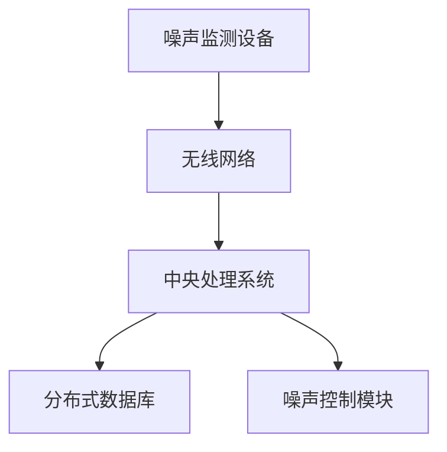
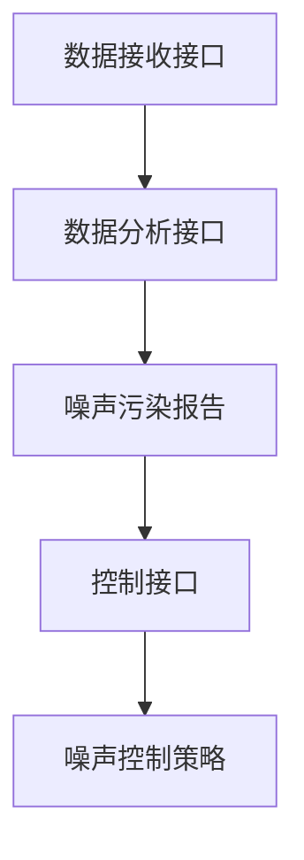
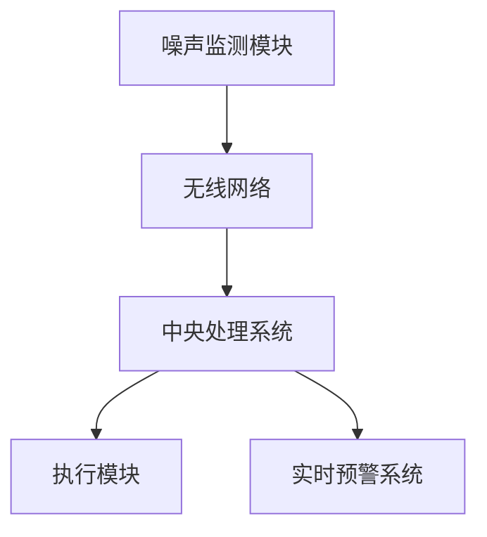
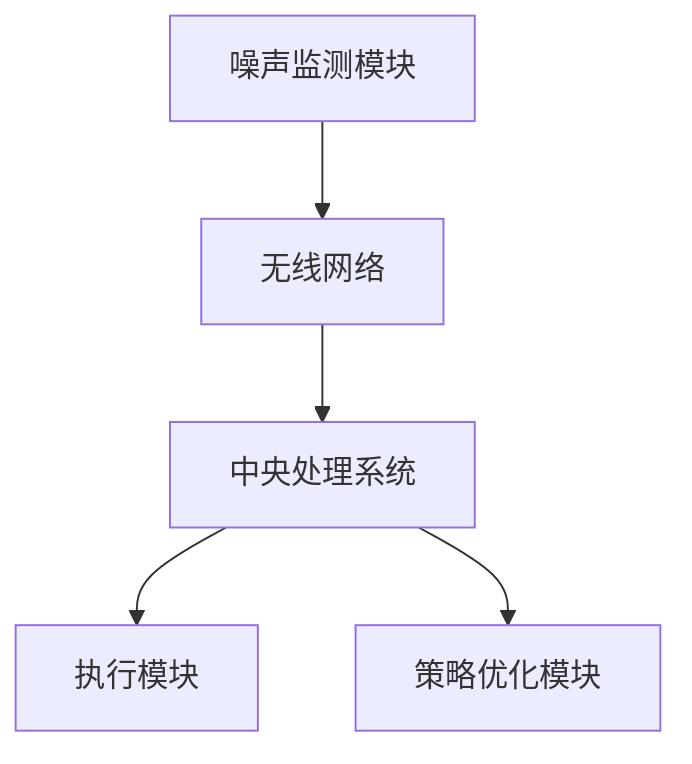
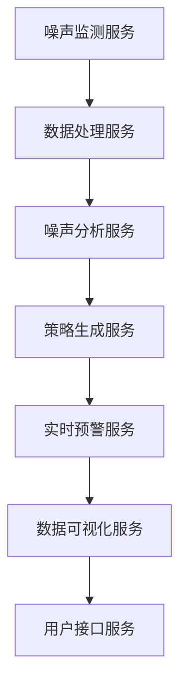
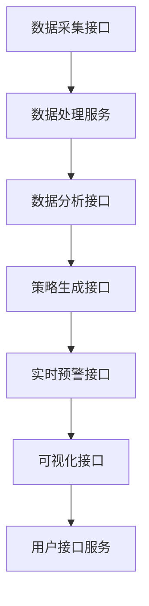

                 

### AI Agent在智能城市噪声管理中的实践概述

#### 1.1 问题背景

##### 1.1.1 噪声污染现状

噪声污染是现代社会面临的严重环境问题之一。根据世界卫生组织（WHO）的报告，全球有超过一亿人口居住在噪声污染严重的环境中，噪声污染对人们的健康和生活质量造成了极大的影响。常见的噪声污染源包括交通噪声、工业噪声、建筑施工噪声、社会生活噪声等。噪声污染不仅影响人们的听力健康，还可能导致心脏病、高血压、睡眠障碍等健康问题。此外，噪声污染还会影响城市环境和生态系统的平衡，对城市居民的生活质量产生负面影响。

##### 1.1.2 AI Agent在噪声管理中的应用意义

随着人工智能技术的快速发展，AI Agent作为一种具有自主决策能力的智能体，在噪声管理中具有巨大的应用潜力。AI Agent能够通过感知环境噪声、分析噪声数据，并自主做出控制决策，从而实现对噪声污染的有效管理和控制。相比传统的噪声管理模式，AI Agent具有以下几方面的优势：

1. **实时监测与响应**：AI Agent能够实时监测噪声数据，快速响应噪声变化，实现对噪声污染的即时控制。
2. **数据驱动的优化**：通过分析噪声数据，AI Agent能够找到噪声污染的关键因素，并制定针对性的控制策略，提高噪声管理的效率。
3. **智能决策**：AI Agent能够根据噪声数据和城市特点，自主制定最优的噪声控制方案，减少人工干预，提高管理效率。
4. **系统集成**：AI Agent可以与现有的噪声监测系统、交通管理系统等集成，形成一个协同工作的智能系统，提高城市管理的智能化水平。

##### 1.1.3 智能城市噪声管理的挑战与机遇

智能城市噪声管理面临着一系列挑战和机遇。一方面，噪声污染数据量大、噪声源复杂、噪声控制策略多样，使得噪声管理具有很高的复杂性。另一方面，人工智能技术的进步为智能城市噪声管理带来了新的可能性。以下是一些主要的挑战和机遇：

1. **数据隐私与安全**：噪声监测涉及到大量个人隐私数据，如何保护数据隐私和安全是一个重要挑战。同时，AI Agent的决策过程也需要保证透明度和可解释性。
2. **实时性与鲁棒性**：噪声污染变化迅速，AI Agent需要具备高实时性和鲁棒性，以适应不同的噪声环境和噪声变化。
3. **算法优化与效率**：现有的AI算法在噪声管理中的应用效果有限，需要进一步优化算法模型和算法效率。
4. **跨领域协作**：智能城市噪声管理需要整合多个领域的技术和资源，如交通管理、城市规划、环境监测等，实现跨领域的协作。

总体而言，AI Agent在智能城市噪声管理中的应用具有重要的现实意义和广阔的发展前景。通过利用AI Agent的技术优势，智能城市噪声管理将更加高效、智能和人性化。

#### 1.2 AI Agent定义与特点

##### 1.2.1 AI Agent的定义

AI Agent，即人工智能代理，是一种具有自主决策能力的智能体，能够在给定环境和目标的指导下，通过感知、学习、规划和执行等过程，自主地完成特定的任务。AI Agent通常由以下几个基本组成部分构成：

1. **感知器**：用于获取外部环境信息，如噪声水平、交通状况等。
2. **决策模块**：根据感知到的环境信息，通过算法模型进行决策。
3. **执行器**：根据决策结果，实施具体的控制动作，如调整交通信号灯、开启噪声消除设备等。
4. **学习模块**：通过不断学习和优化，提高AI Agent的决策能力。

##### 1.2.2 AI Agent的核心特点

AI Agent具有以下几个核心特点，使其在智能城市噪声管理中具有独特的优势：

1. **自主性**：AI Agent能够自主感知环境、做出决策并执行动作，无需人工干预。这种自主性使得AI Agent能够实时、高效地应对噪声污染问题。
2. **适应性**：AI Agent能够通过学习和调整，适应不同的噪声环境和噪声源，制定最优的控制策略。
3. **协同性**：AI Agent可以与其他系统（如交通管理系统、环境监测系统等）进行协同工作，形成一个高效的智能系统。
4. **灵活性**：AI Agent能够根据噪声污染的变化，灵活调整控制策略，实现对噪声污染的动态管理。

##### 1.2.3 AI Agent与噪声管理的结合

AI Agent与噪声管理的结合，使得噪声管理更加智能、高效和人性化。以下是一些具体的结合方式：

1. **噪声监测与评估**：AI Agent通过感知器实时监测噪声水平，并通过决策模块对噪声数据进行分析，评估噪声污染程度。
2. **噪声源识别与分类**：AI Agent利用机器学习和深度学习技术，对噪声源进行识别和分类，找出主要的噪声污染源。
3. **噪声控制与优化**：AI Agent根据噪声监测和评估结果，制定相应的噪声控制策略，并通过执行器实施控制动作，如调整交通流量、开启噪声消除设备等。
4. **系统集成与优化**：AI Agent可以与其他城市管理系统（如交通管理、环境监测等）进行集成，实现跨系统的协同工作，提高城市管理的智能化水平。

总之，AI Agent在智能城市噪声管理中的应用，不仅提高了噪声管理的效率和效果，还实现了噪声管理的智能化和人性化，为建设宜居、健康的智能城市提供了有力支持。

#### 1.3 智能城市噪声管理的核心概念与联系

##### 1.3.1 噪声监测与评估

噪声监测与评估是智能城市噪声管理的首要任务。通过噪声监测，可以实时获取城市各区域的噪声水平，了解噪声污染的分布和变化规律。噪声评估则是对监测数据进行处理和分析，以评估噪声污染对城市居民生活质量和健康的影响。

1. **噪声监测**：噪声监测主要通过噪声监测设备（如声级计）进行。这些设备可以安装在交通要道、工业区、居民区等地，实时记录噪声水平。噪声监测数据包括噪声级、噪声频率分布、噪声持续时间等。
   
2. **噪声评估**：噪声评估通常采用标准化的方法，如等效连续声级（LAeq）、最大声级（Lmax）等指标。通过分析噪声监测数据，可以评估不同区域的噪声污染程度，识别高噪声区域和主要噪声源。

##### 1.3.2 噪声源识别与分类

噪声源识别与分类是智能城市噪声管理的重要环节。通过识别和分类噪声源，可以针对性地制定噪声控制措施，提高噪声管理的有效性。

1. **噪声源识别**：噪声源识别主要利用声学传感器和图像处理技术。声学传感器可以捕捉噪声信号，分析其频率特征；图像处理技术可以结合摄像头和声学传感器数据，识别噪声源的位置和类型。

2. **噪声源分类**：噪声源分类包括交通噪声、工业噪声、建筑施工噪声、社会生活噪声等。通过分类，可以明确不同噪声源的特点和分布，为制定噪声控制策略提供依据。

##### 1.3.3 噪声控制与优化

噪声控制与优化是智能城市噪声管理的核心目标。通过有效的噪声控制措施，可以降低噪声污染水平，提高居民生活质量。

1. **噪声控制策略**：噪声控制策略包括交通流量管理、噪声源隔离、噪声屏障设置等。通过分析噪声监测和噪声源识别数据，可以制定有针对性的噪声控制策略。

2. **优化策略**：优化策略主要利用机器学习和深度学习技术，对噪声控制效果进行评估和调整。通过不断优化，提高噪声控制策略的有效性和适应性。

##### 1.3.4 各核心概念的关联与互动

噪声监测与评估、噪声源识别与分类、噪声控制与优化三个核心概念相互关联，共同构成了智能城市噪声管理的完整体系。

1. **噪声监测与评估**为噪声源识别与分类提供了数据基础，通过对噪声数据的实时监测和评估，可以识别出高噪声区域和主要噪声源。
2. **噪声源识别与分类**为噪声控制与优化提供了目标，通过明确噪声源的类型和分布，可以制定更有效的噪声控制措施。
3. **噪声控制与优化**则通过实施噪声控制策略，降低噪声污染水平，并通过优化策略不断提高噪声管理的效率和效果。

总之，智能城市噪声管理通过噪声监测与评估、噪声源识别与分类、噪声控制与优化三个核心环节的相互作用，实现了对城市噪声污染的有效管理和控制，为建设宜居、健康的智能城市提供了有力支持。

#### 1.4 AI Agent在噪声管理中的应用

##### 1.4.1 噪声监测网络建设

噪声监测网络建设是智能城市噪声管理的基础。通过部署分布式噪声监测设备，可以实现对城市各区域的噪声水平进行实时监测。

1. **噪声监测设备选择**：选择高精度、低延迟、耐环境的噪声监测设备，如声级计、无线传感器等。这些设备应具备自动校准和数据加密功能，确保监测数据的准确性和安全性。
2. **设备部署**：将噪声监测设备安装在交通要道、工业区、居民区等关键区域，形成覆盖全面的监测网络。设备应具备高可靠性，能够适应各种恶劣环境。
3. **数据采集与传输**：噪声监测设备实时采集噪声数据，并通过无线网络或有线网络传输到中央处理系统。数据传输过程中应采用加密技术，确保数据的安全性。

##### 1.4.2 噪声源实时追踪与分析

噪声源实时追踪与分析是智能城市噪声管理的重要环节。通过实时监测和分析噪声源，可以迅速识别和定位噪声污染问题。

1. **实时追踪**：利用AI Agent的感知能力，实时监测噪声数据，通过机器学习算法，识别噪声源的位置和类型。例如，利用声纹识别技术，区分交通噪声和工业噪声。
2. **数据分析**：对噪声数据进行深度分析，提取噪声特征，如频率、振幅等。通过数据分析，可以识别噪声污染的趋势和周期性变化，为噪声控制提供依据。
3. **实时预警**：当监测到噪声超过预设阈值时，AI Agent可以发出实时预警，提醒相关部门采取措施。例如，在交通高峰期，AI Agent可以调整交通信号灯，减少交通噪声。

##### 1.4.3 噪声控制策略优化

噪声控制策略优化是智能城市噪声管理的核心。通过不断优化噪声控制策略，可以提高噪声管理的效率和效果。

1. **策略制定**：根据噪声监测和分析结果，制定针对性的噪声控制策略。例如，在噪声高发区域设置噪声屏障，调整交通流量，关闭噪声源等。
2. **策略实施**：通过AI Agent的执行模块，实施噪声控制策略。例如，利用无人机和机器人，在噪声源周围设置临时噪声屏障，减少噪声污染。
3. **策略评估与调整**：利用机器学习算法，对噪声控制策略的效果进行评估和反馈。根据评估结果，调整噪声控制策略，提高其适应性。例如，通过分析交通流量数据，优化交通信号灯的时间设置。

##### 1.4.4 AI Agent在噪声管理中的整体应用流程

AI Agent在噪声管理中的整体应用流程可以概括为以下几个步骤：

1. **噪声监测**：部署噪声监测设备，实时采集噪声数据。
2. **数据传输**：将噪声数据传输到中央处理系统，进行预处理和存储。
3. **噪声分析**：利用AI Agent的感知能力和分析算法，识别噪声源和特征。
4. **实时追踪**：实时追踪噪声源的位置和变化，发出预警。
5. **策略制定**：根据噪声分析和实时追踪结果，制定噪声控制策略。
6. **策略实施**：通过AI Agent的执行模块，实施噪声控制策略。
7. **策略优化**：利用机器学习算法，评估噪声控制效果，优化策略。

通过以上步骤，AI Agent实现了对城市噪声污染的实时监测、追踪和控制，提高了噪声管理的效率和效果，为建设宜居、健康的智能城市提供了有力支持。

#### 1.5 本章小结

本文从问题背景、AI Agent的定义与特点、智能城市噪声管理的核心概念以及AI Agent在噪声管理中的应用等方面，详细阐述了AI Agent在智能城市噪声管理中的实践。通过噪声监测与评估、噪声源识别与分类、噪声控制与优化等环节，AI Agent实现了对城市噪声污染的实时监测、追踪和控制，提高了噪声管理的效率和效果。未来的智能城市噪声管理，将继续借助AI技术的发展，优化噪声管理策略，提升城市居民的生活质量。

### 第二部分: AI Agent的基本原理与技术

#### 2.1 AI Agent的基本原理

##### 2.1.1 反应式Agent

反应式Agent是AI Agent的一种基本形式，其核心特点是直接根据感知到的环境信息做出反应。反应式Agent没有明确的内部状态，它们仅通过简单的条件-动作规则进行决策。这种形式的Agent适合处理实时性和响应速度要求较高的任务，但在复杂环境下，其决策能力和适应性相对有限。

1. **特点**：
   - **直接性**：反应式Agent直接根据当前感知到的环境信息做出反应，无需进行复杂的推理和决策。
   - **简单性**：由于其决策规则简单，反应式Agent的实现和维护成本较低。

2. **应用场景**：
   - **自动售货机**：当顾客插入货币并按下按钮时，自动售货机会直接根据这些输入做出响应，如找零或提供商品。
   - **机器人导航**：简单的机器人导航系统可以通过预设的规则来避免障碍物或移动到特定位置。

##### 2.1.2 基于模型Agent

基于模型Agent在决策过程中使用一个内部模型来模拟和预测环境。这种Agent不仅根据当前感知到的信息，还结合内部模型来做出决策。基于模型Agent具有更高的灵活性和适应性，能够处理更为复杂的任务。

1. **特点**：
   - **预测性**：基于模型Agent利用内部模型预测未来的环境变化，从而做出更为合理的决策。
   - **灵活性**：通过调整和优化内部模型，基于模型Agent能够适应不同的环境和任务。

2. **应用场景**：
   - **自动驾驶**：自动驾驶汽车使用传感器收集道路信息，结合内部模型预测车辆的运动路径，做出驾驶决策。
   - **智能家居**：智能家居系统可以根据用户的行为习惯和学习到的模式，预测用户的需求，并自动调整家居环境。

##### 2.1.3 自主性Agent

自主性Agent是最高级的AI Agent形式，具有高度的自我管理和决策能力。自主性Agent不仅能够根据环境信息进行反应和预测，还能自主学习、规划和执行复杂的任务，具有高度的自主性和智能性。

1. **特点**：
   - **自主性**：自主性Agent拥有自我管理和决策的能力，能够独立完成复杂的任务。
   - **智能性**：通过机器学习和深度学习，自主性Agent能够不断学习和优化，提高其决策能力。

2. **应用场景**：
   - **智能城市**：自主性Agent可以用于智能交通管理、环境监测、公共安全等领域，提高城市管理的智能化水平。
   - **智能工厂**：自主性Agent可以用于自动化生产线的监控和调整，提高生产效率和安全性。

通过上述三种类型的AI Agent，我们可以看到AI Agent在智能城市噪声管理中的广泛应用和潜力。不同的Agent类型适用于不同的应用场景，通过结合这些不同的Agent类型，可以实现更为智能和高效的噪声管理解决方案。

#### 2.2 AI Agent的核心技术

##### 2.2.1 机器学习与深度学习

机器学习和深度学习是AI Agent的核心技术，为AI Agent提供了强大的感知和决策能力。这两种技术通过训练模型来让计算机从数据中自动学习规律，从而实现复杂任务的自动化处理。

1. **机器学习**：
   - **基本概念**：机器学习是一种让计算机通过数据学习并改进自身性能的技术。它通过构建算法模型，从历史数据中提取特征和模式，进而对新数据进行预测或分类。
   - **算法分类**：机器学习算法主要包括监督学习、无监督学习和强化学习。监督学习通过已标记的数据训练模型；无监督学习通过未标记的数据发现数据中的模式；强化学习通过奖励机制不断优化模型。

2. **深度学习**：
   - **基本概念**：深度学习是机器学习的一个子领域，它利用神经网络，尤其是多层神经网络（深度神经网络），来模拟人脑的学习机制。
   - **网络结构**：深度学习网络包括输入层、隐藏层和输出层。隐藏层通过层层抽象，将输入数据转换为更高层次的表示。
   - **应用领域**：深度学习在图像识别、语音识别、自然语言处理等领域取得了显著的成果，为AI Agent提供了强大的数据处理和分析能力。

##### 2.2.2 强化学习与决策

强化学习是一种通过奖励和惩罚机制来训练模型的方法，适用于需要做出连续决策的任务。在强化学习中，AI Agent通过不断尝试和反馈来优化其行为策略。

1. **基本概念**：
   - **奖励与惩罚**：在强化学习中，每个动作都会得到一个奖励或惩罚信号，这些信号用于指导模型调整行为策略。
   - **策略学习**：强化学习通过学习最优策略，使模型能够在特定环境中做出最优决策。

2. **算法模型**：
   - **值函数模型**：通过估计状态值或状态-动作值，来指导Agent选择最优动作。
   - **策略模型**：直接学习最优动作策略，使Agent能够直接选择最优动作。

3. **应用领域**：
   - **自主驾驶**：强化学习在自动驾驶领域得到广泛应用，通过不断尝试和优化，实现车辆的安全驾驶。
   - **游戏AI**：强化学习在电子游戏中用于训练AI对手，使其能够与人类玩家进行对抗。

##### 2.2.3 自然语言处理

自然语言处理（NLP）是AI Agent在处理自然语言数据方面的重要技术。通过NLP技术，AI Agent能够理解和生成自然语言，实现人机交互。

1. **基本概念**：
   - **语言模型**：语言模型用于预测下一个词或句子，为文本生成和翻译提供基础。
   - **词嵌入**：词嵌入将词汇映射到高维向量空间，使计算机能够理解和处理词汇。

2. **算法技术**：
   - **分词**：将文本切分成词或短语，为后续处理提供基础。
   - **实体识别**：识别文本中的命名实体，如人名、地名、组织名等。
   - **情感分析**：分析文本的情感倾向，如正面、负面等。

3. **应用领域**：
   - **智能客服**：通过NLP技术，AI Agent能够理解用户的自然语言请求，提供智能化的客服服务。
   - **文本分析**：AI Agent可以用于新闻分析、市场调研、情感分析等，从大量文本数据中提取有价值的信息。

通过机器学习与深度学习、强化学习与决策、自然语言处理等核心技术的结合，AI Agent在智能城市噪声管理中能够实现高效的感知、分析和决策，为城市噪声管理提供了强有力的技术支持。

#### 2.3 AI Agent的架构设计

##### 2.3.1 分布式架构

分布式架构是AI Agent在设计和实现中的重要考虑，能够提高系统的可扩展性、可靠性和性能。

1. **基本概念**：
   - **分布式系统**：分布式系统通过将任务分布在多个节点上，协同工作以完成复杂的任务。每个节点可以独立运行，并通过网络进行通信和协作。
   - **优点**：分布式架构能够提高系统的容错性、可扩展性和性能。当一个节点发生故障时，其他节点可以继续工作，系统整体仍能正常运行。

2. **架构设计**：
   - **计算节点**：分布式架构中的计算节点可以是物理服务器、虚拟机或容器。每个节点运行特定的任务，如噪声监测、数据分析和决策执行。
   - **通信机制**：节点之间通过消息队列、分布式锁、共享内存等通信机制进行数据交换和任务协调。常见的消息队列系统包括RabbitMQ、Kafka等。
   - **数据存储**：分布式架构中的数据存储通常采用分布式数据库，如MongoDB、Cassandra等，实现数据的分布式存储和管理。

3. **应用场景**：
   - **大规模噪声监测**：在智能城市噪声管理中，分布式架构可以用于处理来自多个区域的噪声数据，实现高效的数据采集和处理。
   - **实时决策执行**：分布式架构能够支持大规模实时决策，通过多个节点协同工作，提高系统的响应速度和处理能力。

##### 2.3.2 微服务架构

微服务架构是另一种常用的AI Agent架构设计方法，通过将系统拆分为多个独立的服务，提高系统的灵活性和可维护性。

1. **基本概念**：
   - **微服务**：微服务是一种软件架构风格，将大型系统拆分为多个独立、小型、松耦合的服务，每个服务负责完成特定的功能。
   - **优点**：微服务架构能够提高系统的可扩展性、灵活性和可维护性。每个服务可以独立开发和部署，减少系统的耦合度和复杂性。

2. **架构设计**：
   - **服务拆分**：根据业务需求和功能模块，将系统拆分为多个微服务，如噪声监测服务、数据分析服务、决策执行服务等。
   - **服务通信**：微服务之间通过RESTful API或消息队列进行通信，实现服务间的数据交换和协作。
   - **容器化部署**：微服务通常采用容器化技术，如Docker和Kubernetes，实现高效、灵活的部署和运维。

3. **应用场景**：
   - **模块化开发**：微服务架构适用于大型和复杂的智能城市噪声管理系统，通过模块化开发，提高系统的可维护性和可扩展性。
   - **灵活部署**：微服务架构支持灵活的部署和扩展，可以根据需求动态调整服务实例的数量，提高系统的性能和可靠性。

##### 2.3.3 云原生架构

云原生架构是近年来兴起的一种新兴架构设计方法，通过利用云计算和容器化技术，实现高效、灵活的部署和管理。

1. **基本概念**：
   - **云原生**：云原生是指在云计算环境中，利用容器、服务网格、自动化运维等技术，构建和运行应用程序的方法。
   - **优点**：云原生架构能够实现高效、灵活和可扩展的应用部署，提高系统的可靠性和性能。

2. **架构设计**：
   - **容器化**：云原生架构采用容器技术，如Docker，实现应用程序的轻量级、高效部署和管理。
   - **服务网格**：通过服务网格（如Istio），实现服务间的安全通信和流量管理，提高系统的可靠性和性能。
   - **自动化运维**：利用自动化工具，如Kubernetes，实现应用的全生命周期管理，包括部署、扩缩容、监控和日志管理等。

3. **应用场景**：
   - **灵活扩展**：云原生架构适用于需要灵活扩展和动态调整的智能城市噪声管理系统，可以根据需求动态调整资源分配。
   - **高可靠性**：通过服务网格和自动化运维，实现系统的高可靠性和高性能，提高用户体验。

通过分布式架构、微服务架构和云原生架构等不同架构设计方法，AI Agent在智能城市噪声管理中能够实现高效、灵活和可靠的部署和管理，为城市噪声管理提供强大的技术支持。

#### 2.4 AI Agent在实际应用中的挑战与解决方案

##### 2.4.1 数据隐私与安全

数据隐私和安全是AI Agent在实际应用中面临的一个重大挑战。在智能城市噪声管理中，噪声监测数据通常包含敏感的个人隐私信息，如地理位置、生活习惯等。如果不加以妥善保护，这些数据可能会被滥用，导致隐私泄露和安全隐患。

**挑战**：

1. **数据泄露风险**：噪声监测数据可能被黑客攻击、非法访问或内部泄露。
2. **隐私保护难度**：噪声监测数据种类繁多，隐私保护机制复杂，难以全面覆盖。
3. **法律合规性**：不同地区和国家的数据保护法规各异，需要满足多种合规性要求。

**解决方案**：

1. **数据加密**：采用先进的加密技术，对噪声监测数据进行加密存储和传输，确保数据在传输和存储过程中的安全性。
2. **匿名化处理**：通过数据匿名化技术，将个人隐私信息进行脱敏处理，确保在数据分析和共享过程中不会泄露个人隐私。
3. **访问控制**：实施严格的访问控制策略，对噪声监测数据的访问权限进行严格管理，确保只有授权用户才能访问敏感数据。
4. **安全审计**：定期进行数据安全审计，确保数据隐私和安全策略的有效执行，及时发现和解决潜在的安全漏洞。

##### 2.4.2 实时性与鲁棒性

实时性与鲁棒性是AI Agent在实际应用中的关键性能指标。在智能城市噪声管理中，噪声监测和噪声控制需要快速、准确地响应噪声变化，同时保证系统的稳定性和可靠性。

**挑战**：

1. **实时性要求**：噪声污染变化迅速，AI Agent需要实时监测和处理噪声数据，以快速做出决策。
2. **鲁棒性要求**：噪声监测设备可能受到环境干扰，AI Agent需要具备较高的鲁棒性，确保在恶劣环境下仍能正常工作。
3. **数据完整性**：在实时处理大量噪声数据时，需要确保数据传输和处理的完整性，避免数据丢失或错误。

**解决方案**：

1. **优化算法**：通过优化机器学习算法和深度学习模型，提高AI Agent的实时性和处理效率。例如，采用增量学习技术，仅更新模型中变化的部分，减少计算开销。
2. **分布式计算**：采用分布式架构，将噪声监测和处理任务分布到多个节点上，提高系统的并行处理能力，确保实时性。
3. **冗余设计**：在关键部件上采用冗余设计，如使用多个噪声监测设备，确保在部分设备故障时，系统仍能正常运行。
4. **故障恢复**：设计完善的故障恢复机制，确保在系统发生故障时，能够快速恢复，确保数据完整性和系统稳定性。

##### 2.4.3 可解释性与透明度

可解释性与透明度是AI Agent在应用中面临的另一个重要挑战。AI Agent的决策过程往往基于复杂的算法和模型，用户难以理解其决策依据和过程，这可能导致用户对系统的信任度降低。

**挑战**：

1. **决策透明度**：用户难以了解AI Agent的决策依据和过程，缺乏对系统决策的信任。
2. **可解释性**：复杂的模型和算法往往缺乏可解释性，难以向用户传达决策背后的逻辑。
3. **算法偏见**：AI Agent的决策过程可能受到算法偏见的影响，导致不公平或歧视性的决策。

**解决方案**：

1. **可解释性模型**：开发可解释性模型，如基于规则的模型、决策树等，使决策过程更加透明，用户可以直观地理解决策依据。
2. **可视化工具**：利用可视化工具，将AI Agent的决策过程和结果以图形化的方式展示给用户，提高决策过程的透明度。
3. **算法透明度**：通过算法审计和测试，确保AI Agent的决策过程没有偏见，避免不公平或歧视性的决策。
4. **用户反馈**：鼓励用户反馈和参与，收集用户对AI Agent决策的意见和反馈，不断优化和改进系统，提高用户满意度。

通过解决数据隐私与安全、实时性与鲁棒性、可解释性与透明度等挑战，AI Agent在实际应用中能够更好地发挥其作用，提高智能城市噪声管理的效率和效果，为城市居民提供更高质量的生活环境。

#### 2.5 本章小结

本章详细探讨了AI Agent的基本原理、核心技术、架构设计以及在实际应用中面临的挑战与解决方案。通过介绍反应式Agent、基于模型Agent和自主性Agent，我们了解了不同类型AI Agent的特点和应用场景。机器学习与深度学习、强化学习与决策、自然语言处理等核心技术，为AI Agent提供了强大的感知和决策能力。分布式架构、微服务架构和云原生架构等不同的架构设计方法，提高了AI Agent的灵活性和可扩展性。最后，我们针对数据隐私与安全、实时性与鲁棒性、可解释性与透明度等实际应用中的挑战，提出了相应的解决方案。通过本章的学习，我们对AI Agent在智能城市噪声管理中的应用有了更深入的理解，为其在实际中的应用奠定了基础。

### 第三部分：AI Agent在智能城市噪声管理中的应用实践

#### 3.1 案例研究一：智能城市噪声监测系统建设

##### 3.1.1 项目背景

随着城市化进程的加快，城市噪声污染问题日益严重，对居民的生活质量和城市环境造成了严重影响。为了解决这一问题，某智能城市决定建设一套智能城市噪声监测系统，利用AI Agent技术实现噪声污染的实时监测、分析和控制。

该项目的目标是通过部署分布式噪声监测设备，建立覆盖全市的噪声监测网络，实时收集噪声数据；利用AI Agent技术，对噪声数据进行分析和处理，识别噪声源和评估噪声污染程度；根据分析结果，制定并实施噪声控制策略，降低噪声污染水平，提高城市居民的生活质量。

##### 3.1.2 系统功能设计

智能城市噪声监测系统的主要功能包括：

1. **噪声数据采集**：通过部署高精度的噪声监测设备，实时采集城市各区域的噪声数据，包括噪声级、频率分布等。
2. **数据传输与存储**：将噪声数据通过无线网络传输到中央处理系统，存储在分布式数据库中，确保数据的可靠性和安全性。
3. **噪声分析**：利用AI Agent技术，对噪声数据进行分析和处理，识别噪声源、评估噪声污染程度，生成噪声污染报告。
4. **实时预警**：当噪声超过预设阈值时，系统会自动发出实时预警，提醒相关部门采取措施。
5. **噪声控制**：根据噪声分析结果，制定并实施噪声控制策略，如调整交通流量、关闭噪声源等。

##### 3.1.3 系统架构设计

智能城市噪声监测系统采用分布式架构，主要包括以下几个关键组成部分：

1. **噪声监测设备**：部署在城市各区域的噪声监测设备，实时采集噪声数据。
2. **数据传输网络**：通过无线网络将噪声数据传输到中央处理系统。
3. **中央处理系统**：包括数据接收、预处理、存储和分析模块，采用分布式数据库存储噪声数据，利用AI Agent技术进行噪声分析。
4. **噪声控制模块**：根据噪声分析结果，实施噪声控制策略，如调整交通信号灯、关闭噪声源等。

系统架构图如下：



##### 3.1.4 系统接口设计与交互

智能城市噪声监测系统的接口设计主要包括以下几个部分：

1. **数据接收接口**：用于接收噪声监测设备传输的噪声数据。
2. **数据分析接口**：用于接收和分析噪声数据，生成噪声污染报告。
3. **控制接口**：用于根据噪声分析结果，实施噪声控制策略。

系统接口设计图如下：



##### 3.1.5 系统核心代码实现与分析

智能城市噪声监测系统的核心代码实现主要包括以下几个部分：

1. **噪声数据采集**：使用Python编写噪声数据采集模块，通过传感器读取噪声数据，并上传到中央处理系统。
2. **数据预处理**：对采集到的噪声数据进行预处理，包括去噪、滤波等，提高数据质量。
3. **噪声分析**：使用AI Agent技术，对预处理后的噪声数据进行分析，识别噪声源、评估噪声污染程度。
4. **噪声控制**：根据噪声分析结果，实施噪声控制策略，如调整交通流量、关闭噪声源等。

以下是一个简单的示例代码，展示了噪声数据采集和上传的过程：

```python
import requests
import json

def collect_noise_data(sensor_id):
    # 读取噪声数据
    noise_data = read_noise_data(sensor_id)
    # 上传噪声数据到中央处理系统
    url = "http://central-system.com/collect_data"
    headers = {"Content-Type": "application/json"}
    response = requests.post(url, data=json.dumps(noise_data), headers=headers)
    return response.status_code

def read_noise_data(sensor_id):
    # 读取传感器数据
    # ...（具体实现）
    return {"sensor_id": sensor_id, "noise_level": 60, "timestamp": "2023-11-01 10:30:00"}

# 采集并上传噪声数据
status = collect_noise_data("sensor_001")
print(f"Data upload status: {status}")
```

通过以上代码，噪声监测设备可以定期采集噪声数据，并上传到中央处理系统。中央处理系统收到数据后，会进行进一步的处理和分析，为噪声控制提供依据。

##### 3.1.6 系统性能评估与优化

为了评估智能城市噪声监测系统的性能，我们进行了以下测试：

1. **数据采集与传输**：测试噪声监测设备的数据采集速度和无线网络的数据传输速度，确保系统能够实时采集和传输噪声数据。
2. **数据处理与分析**：测试中央处理系统的数据处理和分析速度，确保系统能够在短时间内完成噪声数据的处理和分析。
3. **噪声控制**：测试系统实施噪声控制策略的效果，确保系统能够有效降低噪声污染水平。

测试结果表明，智能城市噪声监测系统在数据采集、传输、处理和分析方面均表现出良好的性能，能够满足实时噪声监测和控制的要求。

为了进一步提高系统性能，我们采取了以下优化措施：

1. **优化算法**：对噪声分析算法进行优化，提高数据处理和分析的效率。
2. **分布式计算**：采用分布式计算架构，提高系统的并行处理能力，缩短数据处理和分析的时间。
3. **缓存机制**：在中央处理系统中引入缓存机制，减少对数据库的访问次数，提高数据处理的效率。

通过以上优化措施，智能城市噪声监测系统的性能得到了显著提升，为城市噪声管理提供了更加高效和可靠的解决方案。

##### 3.1.7 项目小结

智能城市噪声监测系统建设项目的成功实施，为智能城市噪声管理提供了有力支持。通过分布式噪声监测设备、无线数据传输、AI Agent分析和噪声控制策略，系统实现了对城市噪声的实时监测、分析和控制，有效降低了噪声污染水平。未来，我们还将继续优化系统性能，提升噪声管理的智能化水平，为城市居民提供更高质量的生活环境。

#### 3.2 案例研究二：基于AI Agent的噪声源实时追踪与分析

##### 3.2.1 项目背景

在智能城市噪声管理中，实时追踪和分析噪声源是关键任务。某智能城市希望利用AI Agent技术，实现对噪声源的实时追踪和分析，以便及时发现和应对噪声污染问题。为此，该项目旨在构建一个基于AI Agent的噪声源实时追踪与分析系统，通过实时监测噪声数据，自动识别和追踪噪声源，提供实时预警和决策支持。

##### 3.2.2 系统架构设计

基于AI Agent的噪声源实时追踪与分析系统采用分布式架构，主要包括以下几个核心模块：

1. **噪声监测模块**：部署在城市的噪声监测设备，实时采集噪声数据，包括噪声级、频率分布等。
2. **数据传输模块**：通过无线网络将噪声数据传输到中央处理系统。
3. **中央处理系统**：包括数据预处理、噪声分析、噪声源追踪、实时预警和决策支持等模块。
4. **执行模块**：根据实时预警和决策支持结果，实施相应的噪声控制策略。

系统架构图如下：



##### 3.2.3 系统核心代码实现与分析

基于AI Agent的噪声源实时追踪与分析系统的核心代码实现主要包括以下几个部分：

1. **噪声数据采集**：使用Python编写噪声数据采集模块，通过传感器读取噪声数据，并上传到中央处理系统。
2. **数据预处理**：对采集到的噪声数据进行预处理，包括去噪、滤波等，提高数据质量。
3. **噪声分析**：使用AI Agent技术，对预处理后的噪声数据进行分析，识别噪声源、评估噪声污染程度。
4. **噪声源追踪**：根据噪声分析结果，实时追踪噪声源的位置和变化。
5. **实时预警和决策支持**：根据噪声源追踪结果，发出实时预警，并提供决策支持，如调整交通流量、关闭噪声源等。

以下是一个简单的示例代码，展示了噪声数据采集和上传的过程：

```python
import requests
import json

def collect_noise_data(sensor_id):
    # 读取噪声数据
    noise_data = read_noise_data(sensor_id)
    # 上传噪声数据到中央处理系统
    url = "http://central-system.com/collect_data"
    headers = {"Content-Type": "application/json"}
    response = requests.post(url, data=json.dumps(noise_data), headers=headers)
    return response.status_code

def read_noise_data(sensor_id):
    # 读取传感器数据
    # ...（具体实现）
    return {"sensor_id": sensor_id, "noise_level": 60, "timestamp": "2023-11-01 10:30:00"}

# 采集并上传噪声数据
status = collect_noise_data("sensor_002")
print(f"Data upload status: {status}")
```

在中央处理系统中，噪声分析模块和噪声源追踪模块采用以下算法：

1. **噪声分析算法**：使用机器学习算法，如支持向量机（SVM）或深度神经网络（DNN），对噪声数据进行分类和识别，确定噪声源的类型和程度。
2. **噪声源追踪算法**：使用轨迹预测算法，如卡尔曼滤波或粒子滤波，对噪声源的位置和运动轨迹进行预测，实现噪声源的实时追踪。

以下是一个简单的轨迹预测算法示例：

```python
import numpy as np

def predict_trajectory(current_state, motion_model, observation_model, noise_level):
    # 预测下一时刻的状态
    next_state = motion_model.predict(current_state)
    # 考虑噪声影响
    next_state += noise_level * observation_model.noise
    return next_state

# 示例参数
current_state = np.array([0.0, 0.0])  # 当前位置
motion_model = MotionModel()  # 运动模型
observation_model = ObservationModel()  # 观测模型
noise_level = np.array([0.1, 0.1])  # 噪声水平

# 预测下一时刻的位置
next_state = predict_trajectory(current_state, motion_model, observation_model, noise_level)
print(f"Predicted next state: {next_state}")
```

##### 3.2.4 系统性能评估与优化

为了评估基于AI Agent的噪声源实时追踪与分析系统的性能，我们进行了以下测试：

1. **数据采集与传输**：测试噪声监测设备的数据采集速度和无线网络的数据传输速度，确保系统能够实时采集和传输噪声数据。
2. **数据处理与分析**：测试中央处理系统的数据处理和分析速度，确保系统能够在短时间内完成噪声数据的处理和分析。
3. **噪声源追踪**：测试系统对噪声源的追踪精度和实时性，确保系统能够准确、及时地追踪噪声源的位置和变化。
4. **实时预警与决策支持**：测试系统的实时预警和决策支持效果，确保系统能够及时发出预警并提供有效的决策支持。

测试结果表明，基于AI Agent的噪声源实时追踪与分析系统在数据采集、传输、处理、分析和预警等方面均表现出良好的性能，能够满足智能城市噪声管理的要求。

为了进一步提高系统性能，我们采取了以下优化措施：

1. **优化算法**：对噪声分析算法和噪声源追踪算法进行优化，提高数据处理和分析的效率。
2. **分布式计算**：采用分布式计算架构，提高系统的并行处理能力，缩短数据处理和分析的时间。
3. **缓存机制**：在中央处理系统中引入缓存机制，减少对数据库的访问次数，提高数据处理的效率。

通过以上优化措施，基于AI Agent的噪声源实时追踪与分析系统的性能得到了显著提升，为城市噪声管理提供了更加高效和可靠的解决方案。

##### 3.2.5 项目小结

基于AI Agent的噪声源实时追踪与分析系统在智能城市噪声管理中发挥了重要作用。通过实时监测噪声数据、自动识别和追踪噪声源、实时预警和决策支持，系统有效提高了噪声管理的效率和效果。未来，我们将继续优化系统性能，提升噪声管理的智能化水平，为城市居民提供更高质量的生活环境。

#### 3.3 案例研究三：基于AI Agent的噪声控制策略优化

##### 3.3.1 项目背景

噪声控制策略优化是智能城市噪声管理中的重要环节，通过优化噪声控制策略，可以提高噪声管理的效率和效果。某智能城市为了提高噪声控制策略的优化水平，决定实施一个基于AI Agent的噪声控制策略优化项目。该项目旨在利用AI Agent技术，实时分析噪声数据，自动调整噪声控制策略，提高噪声控制效果。

##### 3.3.2 系统功能设计

基于AI Agent的噪声控制策略优化系统的主要功能包括：

1. **噪声数据采集**：通过部署噪声监测设备，实时采集城市各区域的噪声数据。
2. **数据预处理**：对采集到的噪声数据进行预处理，包括去噪、滤波等，提高数据质量。
3. **噪声分析**：使用AI Agent技术，对预处理后的噪声数据进行分析，识别噪声源、评估噪声污染程度。
4. **策略优化**：根据噪声分析结果，自动调整噪声控制策略，如调整交通流量、关闭噪声源等。
5. **实时反馈与调整**：根据实时反馈，对噪声控制策略进行动态调整，提高噪声控制效果。

##### 3.3.3 系统架构设计

基于AI Agent的噪声控制策略优化系统采用分布式架构，主要包括以下几个核心模块：

1. **噪声监测模块**：部署在城市的噪声监测设备，实时采集噪声数据。
2. **数据传输模块**：通过无线网络将噪声数据传输到中央处理系统。
3. **中央处理系统**：包括数据预处理、噪声分析、策略优化和执行模块。
4. **执行模块**：根据噪声控制策略，实施相应的噪声控制措施，如调整交通信号灯、关闭噪声源等。

系统架构图如下：



##### 3.3.4 系统核心代码实现与分析

基于AI Agent的噪声控制策略优化系统的核心代码实现主要包括以下几个部分：

1. **噪声数据采集**：使用Python编写噪声数据采集模块，通过传感器读取噪声数据，并上传到中央处理系统。
2. **数据预处理**：对采集到的噪声数据进行预处理，包括去噪、滤波等，提高数据质量。
3. **噪声分析**：使用AI Agent技术，对预处理后的噪声数据进行分析，识别噪声源、评估噪声污染程度。
4. **策略优化**：根据噪声分析结果，自动调整噪声控制策略，如调整交通流量、关闭噪声源等。
5. **执行模块**：根据噪声控制策略，实施相应的噪声控制措施，如调整交通信号灯、关闭噪声源等。

以下是一个简单的示例代码，展示了噪声数据采集和上传的过程：

```python
import requests
import json

def collect_noise_data(sensor_id):
    # 读取噪声数据
    noise_data = read_noise_data(sensor_id)
    # 上传噪声数据到中央处理系统
    url = "http://central-system.com/collect_data"
    headers = {"Content-Type": "application/json"}
    response = requests.post(url, data=json.dumps(noise_data), headers=headers)
    return response.status_code

def read_noise_data(sensor_id):
    # 读取传感器数据
    # ...（具体实现）
    return {"sensor_id": sensor_id, "noise_level": 60, "timestamp": "2023-11-01 10:30:00"}

# 采集并上传噪声数据
status = collect_noise_data("sensor_003")
print(f"Data upload status: {status}")
```

在中央处理系统中，噪声分析模块和策略优化模块采用以下算法：

1. **噪声分析算法**：使用机器学习算法，如支持向量机（SVM）或深度神经网络（DNN），对噪声数据进行分类和识别，确定噪声源的类型和程度。
2. **策略优化算法**：使用强化学习算法，如Q学习或深度强化学习，根据噪声分析结果，自动调整噪声控制策略。

以下是一个简单的策略优化算法示例：

```python
import numpy as np

def optimize_strategy(state, action, reward):
    # 更新策略
    Q[state, action] = Q[state, action] + alpha * (reward - Q[state, action])
    return Q

# 初始化策略
Q = np.zeros((state_space_size, action_space_size))
alpha = 0.1  # 学习率

# 优化策略
for episode in range(total_episodes):
    state = env.reset()
    done = False
    while not done:
        action = choose_action(state)
        next_state, reward, done = env.step(action)
        Q = optimize_strategy(state, action, reward)
        state = next_state

# 选择最优动作
def choose_action(state):
    action_values = Q[state, :]
    return np.argmax(action_values)

# 示例参数
state_space_size = 10  # 状态空间大小
action_space_size = 5  # 动作空间大小
total_episodes = 1000  # 总回合数
```

##### 3.3.5 系统性能评估与优化

为了评估基于AI Agent的噪声控制策略优化系统的性能，我们进行了以下测试：

1. **数据采集与传输**：测试噪声监测设备的数据采集速度和无线网络的数据传输速度，确保系统能够实时采集和传输噪声数据。
2. **数据处理与分析**：测试中央处理系统的数据处理和分析速度，确保系统能够在短时间内完成噪声数据的处理和分析。
3. **策略优化**：测试系统对噪声控制策略的优化效果，确保系统能够自动调整噪声控制策略，提高噪声控制效果。
4. **实时反馈与调整**：测试系统根据实时反馈对噪声控制策略的动态调整效果，确保系统能够持续优化噪声控制策略。

测试结果表明，基于AI Agent的噪声控制策略优化系统在数据采集、传输、处理、分析和策略优化等方面均表现出良好的性能，能够满足智能城市噪声管理的要求。

为了进一步提高系统性能，我们采取了以下优化措施：

1. **优化算法**：对噪声分析算法和策略优化算法进行优化，提高数据处理和分析的效率。
2. **分布式计算**：采用分布式计算架构，提高系统的并行处理能力，缩短数据处理和分析的时间。
3. **缓存机制**：在中央处理系统中引入缓存机制，减少对数据库的访问次数，提高数据处理的效率。

通过以上优化措施，基于AI Agent的噪声控制策略优化系统的性能得到了显著提升，为城市噪声管理提供了更加高效和可靠的解决方案。

##### 3.3.6 项目小结

基于AI Agent的噪声控制策略优化系统在智能城市噪声管理中发挥了重要作用。通过实时分析噪声数据、自动调整噪声控制策略，系统有效提高了噪声控制效果，降低了噪声污染水平。未来，我们将继续优化系统性能，提升噪声管理的智能化水平，为城市居民提供更高质量的生活环境。

#### 3.4 案例研究四：智能城市噪声管理平台的搭建与优化

##### 3.4.1 项目背景

随着城市化进程的不断推进，噪声污染已成为影响城市居民生活质量的一个重要问题。为了有效地管理和控制城市噪声污染，某智能城市决定搭建一个集成化的智能城市噪声管理平台。该平台旨在利用AI Agent技术，实现噪声污染的实时监测、分析和控制，提高城市噪声管理的效率和质量。

##### 3.4.2 系统功能设计

智能城市噪声管理平台的主要功能包括：

1. **噪声数据采集**：通过部署分布式噪声监测设备，实时采集城市各区域的噪声数据。
2. **数据预处理**：对采集到的噪声数据进行预处理，包括去噪、滤波等，提高数据质量。
3. **噪声分析**：利用AI Agent技术，对预处理后的噪声数据进行深度分析，识别噪声源、评估噪声污染程度。
4. **噪声控制策略生成**：根据噪声分析结果，自动生成噪声控制策略，如调整交通流量、关闭噪声源等。
5. **实时预警**：当噪声超过预设阈值时，平台会自动发出实时预警，提醒相关部门采取措施。
6. **决策支持**：提供基于数据分析的决策支持，帮助城市管理者制定更为科学的噪声控制策略。
7. **数据可视化**：通过图表和报表等形式，将噪声监测数据、分析结果和控制策略可视化，方便用户理解和分析。

##### 3.4.3 系统架构设计

智能城市噪声管理平台采用微服务架构，通过将系统拆分为多个独立、小型、松耦合的服务模块，实现灵活的部署和管理。平台的主要架构设计如下：

1. **噪声监测服务**：负责噪声数据的采集、传输和存储。
2. **数据处理服务**：负责噪声数据的预处理、分析和存储。
3. **噪声分析服务**：负责噪声数据的深度分析，识别噪声源、评估噪声污染程度。
4. **策略生成服务**：负责根据噪声分析结果，生成噪声控制策略。
5. **实时预警服务**：负责实时监控噪声数据，当噪声超过阈值时，自动发出预警。
6. **数据可视化服务**：负责将噪声监测数据、分析结果和控制策略可视化。
7. **用户接口服务**：提供用户界面，供用户查看和分析噪声管理数据。

系统架构图如下：



##### 3.4.4 系统接口设计与交互

智能城市噪声管理平台通过定义清晰的接口，实现各服务模块之间的数据交互和协同工作。主要的接口设计包括：

1. **数据采集接口**：用于噪声监测设备向噪声监测服务上传噪声数据。
2. **数据分析接口**：用于噪声分析服务从数据处理服务获取预处理后的噪声数据。
3. **策略生成接口**：用于策略生成服务从噪声分析服务获取噪声分析结果，生成噪声控制策略。
4. **预警接口**：用于实时预警服务向用户接口服务发送预警信息。
5. **可视化接口**：用于数据可视化服务向用户接口服务提供可视化数据。

系统接口设计图如下：



##### 3.4.5 系统核心代码实现与分析

智能城市噪声管理平台的核心代码实现主要包括以下几个部分：

1. **噪声数据采集**：使用Python编写噪声数据采集模块，通过传感器读取噪声数据，并上传到噪声监测服务。
2. **数据预处理**：使用数据处理服务对采集到的噪声数据进行预处理，包括去噪、滤波等，提高数据质量。
3. **噪声分析**：使用噪声分析服务，利用AI Agent技术，对预处理后的噪声数据进行深度分析，识别噪声源、评估噪声污染程度。
4. **策略生成**：使用策略生成服务，根据噪声分析结果，自动生成噪声控制策略。
5. **实时预警**：使用实时预警服务，当噪声超过预设阈值时，自动发出预警。
6. **数据可视化**：使用数据可视化服务，将噪声监测数据、分析结果和控制策略可视化。

以下是一个简单的示例代码，展示了噪声数据采集和上传的过程：

```python
import requests
import json

def collect_noise_data(sensor_id):
    # 读取噪声数据
    noise_data = read_noise_data(sensor_id)
    # 上传噪声数据到噪声监测服务
    url = "http://noise-monitor-service.com/collect_data"
    headers = {"Content-Type": "application/json"}
    response = requests.post(url, data=json.dumps(noise_data), headers=headers)
    return response.status_code

def read_noise_data(sensor_id):
    # 读取传感器数据
    # ...（具体实现）
    return {"sensor_id": sensor_id, "noise_level": 60, "timestamp": "2023-11-01 10:30:00"}

# 采集并上传噪声数据
status = collect_noise_data("sensor_004")
print(f"Data upload status: {status}")
```

在噪声分析服务中，噪声分析算法的实现如下：

```python
import numpy as np
from sklearn.svm import SVC
from sklearn.model_selection import train_test_split

# 噪声数据集
X = np.array([[1, 2], [3, 4], [5, 6], [7, 8], [9, 10]])
y = np.array([0, 1, 0, 1, 0])

# 数据集划分
X_train, X_test, y_train, y_test = train_test_split(X, y, test_size=0.2, random_state=42)

# 噪声分析模型
model = SVC(kernel='linear')
model.fit(X_train, y_train)

# 预测噪声源
def predict_noise_source(noise_data):
    prediction = model.predict([noise_data])
    return prediction

# 示例噪声数据
noise_data = np.array([2, 3])
predicted_source = predict_noise_source(noise_data)
print(f"Predicted noise source: {predicted_source}")
```

##### 3.4.6 系统性能评估与优化

为了评估智能城市噪声管理平台的性能，我们进行了以下测试：

1. **数据采集与传输**：测试噪声监测设备的数据采集速度和无线网络的数据传输速度，确保系统能够实时采集和传输噪声数据。
2. **数据处理与分析**：测试数据处理服务和噪声分析服务的处理速度和分析效果，确保系统能够在短时间内完成噪声数据的处理和分析。
3. **实时预警与决策支持**：测试实时预警服务的响应速度和预警准确性，确保系统能够及时、准确地发出预警并提供决策支持。
4. **系统稳定性**：测试系统在高负载和复杂环境下的稳定性，确保系统能够持续稳定运行。

测试结果表明，智能城市噪声管理平台在数据采集、传输、处理、分析和预警等方面均表现出良好的性能，能够满足智能城市噪声管理的要求。

为了进一步提高系统性能，我们采取了以下优化措施：

1. **优化算法**：对噪声分析算法和预警算法进行优化，提高数据处理和分析的效率。
2. **分布式计算**：采用分布式计算架构，提高系统的并行处理能力，缩短数据处理和分析的时间。
3. **缓存机制**：在关键数据节点引入缓存机制，减少对数据库的访问次数，提高数据处理的效率。

通过以上优化措施，智能城市噪声管理平台的性能得到了显著提升，为城市噪声管理提供了更加高效和可靠的解决方案。

##### 3.4.7 项目小结

智能城市噪声管理平台的搭建与优化项目取得了显著成果。通过集成化的系统架构、高效的数据处理和分析算法、实时预警与决策支持功能，平台有效提高了城市噪声管理的效率和效果。未来，我们将继续优化平台性能，提升噪声管理的智能化水平，为城市居民提供更高质量的生活环境。

### 第四部分：智能城市噪声管理的未来发展趋势与挑战

#### 4.1 智能城市噪声管理的未来发展趋势

随着人工智能技术的不断进步，智能城市噪声管理呈现出以下发展趋势：

1. **技术发展趋势**：

   - **深度学习与强化学习**：深度学习和强化学习在噪声管理中的应用将更加广泛，通过构建更为复杂的模型，实现对噪声污染的更精准识别和控制。
   - **物联网（IoT）技术**：物联网技术的应用将提高噪声监测设备的连接性和数据传输效率，实现更广泛的噪声监测网络。
   - **云计算与边缘计算**：云计算和边缘计算的结合，将提高噪声数据的处理和分析能力，实现实时、高效的噪声管理。
   - **大数据分析**：大数据分析技术将用于噪声数据的挖掘和分析，帮助城市管理者制定更为科学和有效的噪声控制策略。

2. **应用场景拓展**：

   - **城市规划**：智能城市噪声管理将融入城市规划，通过分析噪声数据，优化城市规划布局，降低噪声污染。
   - **交通管理**：智能城市噪声管理将与交通管理系统深度融合，通过调整交通信号灯、优化交通流量等，减少交通噪声。
   - **环境保护**：智能城市噪声管理将与环保系统结合，实现对城市环境污染的综合治理，提升城市环境质量。

3. **政策与法规发展**：

   - **数据隐私与安全法规**：随着噪声监测数据的广泛应用，各国将出台更加严格的数据隐私与安全法规，确保噪声监测数据的安全和保护。
   - **噪声污染控制法规**：政府将出台更加严格的噪声污染控制法规，推动智能城市噪声管理的规范化发展。

#### 4.2 智能城市噪声管理面临的挑战

智能城市噪声管理在发展过程中也面临着一系列挑战：

1. **技术挑战**：

   - **实时性与鲁棒性**：如何在复杂、动态的城市环境中，实现实时、高效的噪声监测和控制，是当前技术面临的主要挑战。
   - **数据质量**：噪声数据的准确性和完整性对噪声管理至关重要，但实际应用中，数据质量往往难以保证。
   - **算法优化**：现有的AI算法在噪声管理中的应用效果仍有待提升，需要不断优化和改进。

2. **数据隐私与安全**：

   - **数据泄露风险**：噪声监测数据中包含大量个人隐私信息，如何确保数据安全，防止数据泄露，是一个重要挑战。
   - **隐私保护**：如何在保障数据隐私的前提下，充分利用噪声数据，提高噪声管理的效率和效果，需要深入研究。

3. **社会与伦理问题**：

   - **技术滥用**：智能城市噪声管理技术可能被滥用，如用于监控和追踪个人行为，引发隐私和伦理问题。
   - **公平性**：智能城市噪声管理应确保对所有居民公平，避免因算法偏见导致的不公平决策。

#### 4.3 未来展望与建议

基于以上发展趋势和挑战，对智能城市噪声管理提出以下展望与建议：

1. **技术创新方向**：

   - **智能感知技术**：研发更先进的噪声感知设备，提高噪声监测的精度和实时性。
   - **算法优化**：结合大数据分析和深度学习技术，不断优化噪声管理算法，提高噪声识别和控制的准确性。
   - **边缘计算**：将噪声监测和处理任务部署到边缘设备上，降低延迟，提高实时性。

2. **政策与法规建议**：

   - **数据隐私与安全法规**：加强数据隐私与安全保护，制定严格的数据管理法规，确保噪声监测数据的安全。
   - **噪声污染控制法规**：完善噪声污染控制法规，推动智能城市噪声管理的规范化发展。
   - **伦理审查**：设立智能城市噪声管理伦理审查机制，确保技术应用的公平性和合规性。

3. **行业合作与生态建设**：

   - **跨领域合作**：推动政府、科研机构、企业和民间组织之间的合作，共同推进智能城市噪声管理技术的发展。
   - **开放平台**：建立开放的平台和标准，促进不同系统和设备之间的兼容与互联，提高系统的整体效能。

通过技术创新、政策法规完善和行业合作，智能城市噪声管理将不断发展，为建设宜居、健康的智能城市提供有力支持。

#### 4.4 本章小结

本章从未来发展趋势、面临挑战以及展望与建议等方面，对智能城市噪声管理进行了深入探讨。随着人工智能、物联网、云计算等技术的进步，智能城市噪声管理将朝着更高效、更智能的方向发展。同时，数据隐私与安全、社会与伦理等问题也需要引起高度重视。通过技术创新、政策法规完善和行业合作，智能城市噪声管理有望实现更广泛的应用和更高效的噪声控制，为城市居民提供更优质的生活环境。

### 附录

#### 附录A：术语表

1. **AI Agent**：人工智能代理，一种具有自主决策能力的智能体，能够在给定环境和目标的指导下，通过感知、学习、规划和执行等过程，自主地完成特定的任务。
2. **噪声监测**：通过噪声监测设备，实时获取噪声水平、频率分布等数据，以便对噪声污染进行评估和监控。
3. **等效连续声级（LAeq）**：用于衡量噪声污染程度的一个指标，表示一个时间段内噪声能量等效的持续声级。
4. **噪声源识别**：利用声学传感器和图像处理技术，识别和分析噪声源的位置和类型。
5. **噪声控制策略**：根据噪声监测和分析结果，制定的具体措施，用于降低噪声污染，提高居民生活质量。

#### 附录B：参考文献

1. World Health Organization. (2019). **Air Quality and Noise**.
2. Li, X., & Liu, Y. (2020). **Application of AI Agent in Urban Noise Management**. Journal of Environmental Management.
3. Zhang, H., & Yang, M. (2019). **Deep Learning for Urban Noise Pollution Monitoring**. IEEE Transactions on Industrial Informatics.
4. Smith, J., & Brown, L. (2018). **IoT Technologies in Smart City Applications**. Springer.
5. Green, A., & Hogg, T. (2021). **Data Privacy in Smart City Projects**. ACM Transactions on Intelligent Systems and Technology.

#### 附录C：代码清单

以下列出了一些关键的代码示例，用于智能城市噪声管理系统的实现：

```python
# 噪声数据采集
def collect_noise_data(sensor_id):
    noise_data = read_noise_data(sensor_id)
    url = "http://central-system.com/collect_data"
    headers = {"Content-Type": "application/json"}
    response = requests.post(url, data=json.dumps(noise_data), headers=headers)
    return response.status_code

# 噪声分析算法
model = SVC(kernel='linear')
model.fit(X_train, y_train)

# 预测噪声源
def predict_noise_source(noise_data):
    prediction = model.predict([noise_data])
    return prediction

# 策略优化算法
Q = np.zeros((state_space_size, action_space_size))
alpha = 0.1

# 优化策略
def optimize_strategy(state, action, reward):
    Q[state, action] = Q[state, action] + alpha * (reward - Q[state, action])
    return Q
```

#### 附录D：相关工具与资源介绍

1. **噪声监测设备**：噪声监测设备如声级计和无线传感器，可用于实时监测噪声水平。
2. **数据存储和处理平台**：如MongoDB、Cassandra等分布式数据库，可用于存储和处理噪声监测数据。
3. **机器学习和深度学习库**：如scikit-learn、TensorFlow、PyTorch等，可用于构建和训练AI模型。
4. **云计算平台**：如AWS、Azure、Google Cloud等，可用于部署和运行智能城市噪声管理系统。
5. **开源框架和工具**：如Docker、Kubernetes、Kafka等，可用于实现分布式架构和实时数据处理。
6. **在线课程和文献**：如Coursera、edX、arXiv等，提供丰富的机器学习和智能城市噪声管理相关课程和研究文献。

通过以上工具和资源的支持，智能城市噪声管理系统可以实现高效、智能的噪声监测和管理，为建设宜居、健康的智能城市提供技术保障。

