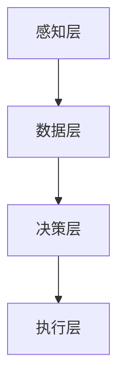
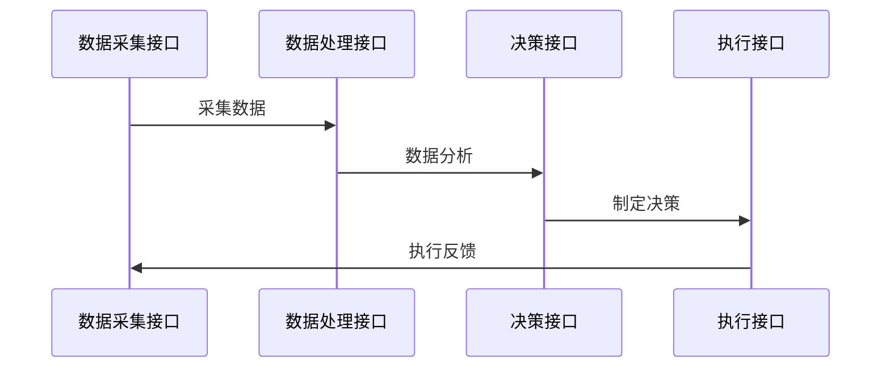

                 

# AI Agent在智能城市安全管理中的角色

关键词：智能城市、安全管理、AI Agent、应用场景、算法原理

摘要：本文旨在探讨AI Agent在智能城市安全管理中的角色。首先，我们将介绍智能城市的发展背景及安全管理的重要性，然后深入分析AI Agent的定义与特点。接着，我们将讨论AI Agent在智能城市安全管理中的应用场景、算法原理和系统架构设计。通过实际案例的剖析，本文将总结AI Agent在智能城市安全管理中的关键作用，并给出未来发展的展望。

## 目录大纲

1. 背景介绍
   1.1 问题背景
   1.2 核心概念
   1.3 边界与外延
2. AI Agent在智能城市安全管理中的应用
   2.1 应用场景
   2.2 核心概念与联系
   2.3 算法原理讲解
   2.4 系统分析与架构设计方案
3. 项目实战
   3.1 环境安装
   3.2 系统核心实现
   3.3 代码应用解读与分析
   3.4 实际案例分析和详细讲解剖析
   3.5 项目小结
4. 最佳实践 & 小结 & 注意事项 & 拓展阅读

## 1. 背景介绍

### 1.1 问题背景

#### 1.1.1 智能城市发展的必然趋势

智能城市是指通过信息技术和物联网等手段，对城市的基础设施、公共服务、环境等进行智能化管理和优化，以提高城市居民的生活质量和工作效率。随着城市化进程的加速和人口规模的扩大，智能城市成为未来城市发展的必然趋势。

#### 1.1.2 安全管理在智能城市中的重要性

智能城市在带来便利和高效的同时，也带来了新的安全管理挑战。城市交通、公共安全、能源等领域的信息化和智能化，使得安全管理更加复杂和重要。有效的安全管理不仅能保障城市运行的安全稳定，还能提升城市治理的智能化水平。

#### 1.1.3 AI Agent在智能城市安全管理中的潜在应用

AI Agent，即人工智能代理，是一种能够在特定环境下自主执行任务的智能系统。在智能城市安全管理中，AI Agent可以发挥重要作用，如自动监控、实时响应、智能决策等。其潜在应用场景包括城市交通管理、公共安全监控、能源管理等。

### 1.2 核心概念

#### 1.2.1 AI Agent的定义与特点

AI Agent是一种具有感知、决策和执行能力的智能系统。其核心特点是自主性、协作性和适应性。

#### 1.2.2 智能城市安全管理的概念与要素

智能城市安全管理是指利用信息技术和智能系统，对城市安全进行监测、预警、响应和处理。其核心要素包括数据采集、分析处理、智能决策和执行。

#### 1.2.3 AI Agent在智能城市安全管理中的角色

AI Agent在智能城市安全管理中扮演着关键角色，包括数据采集与处理、智能决策与执行、协同工作与自适应等。

### 1.3 边界与外延

#### 1.3.1 AI Agent在智能城市安全管理中的应用边界

AI Agent在智能城市安全管理中的应用边界包括城市交通管理、公共安全管理、城市能源管理等。

#### 1.3.2 智能城市安全管理的范围与挑战

智能城市安全管理的范围涉及城市运行的方方面面，包括自然灾害防范、社会治安管理、交通安全管理等。面临的挑战包括数据安全、隐私保护、技术依赖等。

#### 1.3.3 AI Agent在智能城市安全管理中的发展前景

随着技术的不断进步和智能城市建设的深入推进，AI Agent在智能城市安全管理中的应用前景广阔。未来，AI Agent将在智能城市建设中发挥更加重要的作用。

## 2. AI Agent在智能城市安全管理中的应用

### 2.1 AI Agent在智能城市安全管理中的应用场景

#### 2.1.1 城市交通管理

AI Agent在智能城市交通管理中的应用场景主要包括信号灯优化、交通流量预测和交通违规监测。

##### 2.1.1.1 信号灯优化

AI Agent可以通过分析实时交通数据，对信号灯进行优化调控，提高交通效率，减少拥堵。

##### 2.1.1.2 交通流量预测

AI Agent可以基于历史交通数据和实时数据，预测未来交通流量，为交通管理和调度提供依据。

##### 2.1.1.3 交通违规监测

AI Agent可以通过图像识别等技术，实时监测交通违规行为，如闯红灯、违章停车等，提高交通管理水平。

#### 2.1.2 公共安全管理

AI Agent在智能公共安全管理中的应用场景主要包括智能监控、突发事件响应和疫情防控。

##### 2.1.2.1 智能监控

AI Agent可以通过视频监控，实时分析监控画面，识别异常行为和安全隐患，提高公共安全防范能力。

##### 2.1.2.2 突发事件响应

AI Agent可以在突发事件发生时，迅速分析现场情况，制定应急预案，协调各部门进行应急响应。

##### 2.1.2.3 疫情防控

AI Agent可以在疫情防控中，实时监测疫情发展态势，提供防控建议，协助政府部门进行疫情防控。

#### 2.1.3 城市能源管理

AI Agent在智能城市能源管理中的应用场景主要包括能源消耗预测、能源设备故障诊断和能源效率优化。

##### 2.1.3.1 能源消耗预测

AI Agent可以通过分析历史能源消耗数据和实时数据，预测未来能源消耗趋势，为能源调度提供依据。

##### 2.1.3.2 能源设备故障诊断

AI Agent可以通过对能源设备的实时监控和分析，提前发现设备故障，降低能源设备故障率。

##### 2.1.3.3 能源效率优化

AI Agent可以通过分析能源消耗数据，提出优化建议，提高能源利用效率。

### 2.2 AI Agent的核心概念与联系

#### 2.2.1 AI Agent的核心概念

AI Agent的核心概念包括感知、决策和执行。

- **感知**：AI Agent通过传感器、摄像头等设备，获取环境信息和数据。
- **决策**：AI Agent基于感知到的信息，通过算法模型进行决策。
- **执行**：AI Agent根据决策结果，执行具体的操作或任务。

#### 2.2.2 AI Agent的属性特征对比表格

| 属性特征 | 描述 |
| :--: | :--: |
| 自主性 | AI Agent具有自主决策和执行能力 |
| 协作性 | AI Agent可以与其他AI Agent或人类协作 |
| 适应性 | AI Agent可以根据环境变化调整自身行为 |

#### 2.2.3 AI Agent在智能城市安全管理中的联系

AI Agent在智能城市安全管理中的联系主要体现在数据采集、分析处理和智能决策等方面。通过感知设备获取数据，利用算法模型进行数据处理和分析，最终实现智能决策和执行，从而提高智能城市安全管理的效率和质量。

### 2.3 AI Agent的算法原理讲解

#### 2.3.1 基于深度学习的图像识别算法

##### 2.3.1.1 卷积神经网络(CNN)原理讲解

卷积神经网络（CNN）是一种在图像识别、语音识别等领域具有广泛应用的深度学习算法。其核心思想是通过卷积层、池化层和全连接层等网络结构，对图像进行特征提取和分类。

- **卷积层**：通过卷积操作提取图像特征。
- **池化层**：对卷积层的结果进行降维处理，减少参数数量。
- **全连接层**：对池化层的结果进行分类。

##### 2.3.1.2 Python源代码实现

```python
import tensorflow as tf
from tensorflow.keras import layers

model = tf.keras.Sequential([
    layers.Conv2D(32, (3, 3), activation='relu', input_shape=(28, 28, 1)),
    layers.MaxPooling2D((2, 2)),
    layers.Conv2D(64, (3, 3), activation='relu'),
    layers.MaxPooling2D((2, 2)),
    layers.Conv2D(64, (3, 3), activation='relu'),
    layers.Flatten(),
    layers.Dense(64, activation='relu'),
    layers.Dense(10, activation='softmax')
])

model.compile(optimizer='adam',
              loss='sparse_categorical_crossentropy',
              metrics=['accuracy'])

model.fit(train_images, train_labels, epochs=5)
```

##### 2.3.1.3 算法数学模型和公式

- **卷积操作**：$$f(x) = \sigma(W \cdot x + b)$$
- **池化操作**：$$p_{i} = \max_j (w_{i,j} \cdot x_{i,j} + b_{i,j})$$
- **全连接层**：$$y = W \cdot a + b$$

##### 2.3.1.4 举例说明

假设我们有一个包含3x3像素的图像，通过卷积层提取特征，得到一个1x1的卷积特征图。卷积核的大小为3x3，卷积后得到的新特征图的大小为2x2。

原始图像：
```
1 1 1
1 1 1
1 1 1
```
卷积核：
```
1 0 -1
1 0 -1
1 0 -1
```
卷积结果：
```
0 0 0
0 0 0
0 0 0
```

#### 2.3.2 基于强化学习的决策算法

##### 2.3.2.1 Q-Learning原理讲解

Q-Learning是一种基于价值迭代的强化学习算法。其核心思想是通过评估每个动作的价值，不断更新策略，以实现最优决策。

- **Q值**：表示在当前状态下执行某个动作所能获得的最大期望回报。
- **策略**：根据Q值决定在当前状态下执行哪个动作。

##### 2.3.2.2 Python源代码实现

```python
import numpy as np
import random

# 创建环境
n_states = 4
n_actions = 2
q_table = np.zeros((n_states, n_actions))

# Q-Learning参数
alpha = 0.1  # 学习率
gamma = 0.9  # 折扣因子
epsilon = 0.1  # 探索概率

# 模拟环境
for episode in range(1000):
    state = random.randint(0, n_states-1)
    done = False
    total_reward = 0

    while not done:
        action = 0 if random.uniform(0, 1) < epsilon else np.argmax(q_table[state])
        next_state, reward, done = environment.step(state, action)
        q_table[state, action] = q_table[state, action] + alpha * (reward + gamma * np.max(q_table[next_state]) - q_table[state, action])
        state = next_state
        total_reward += reward

    print(f"Episode {episode+1}: Total Reward = {total_reward}")
```

##### 2.3.2.3 算法数学模型和公式

- **Q值更新**：$$Q(s, a) \leftarrow Q(s, a) + \alpha [r + \gamma \max_{a'} Q(s', a') - Q(s, a)]$$
- **策略更新**：$$\pi(s) = \begin{cases} 1 & \text{if } a = \arg\max_a Q(s, a) \\\ 0 & \text{otherwise} \end{cases}$$

##### 2.3.2.4 举例说明

假设我们有一个包含4个状态和2个动作的环境。初始Q值为全0。

状态1 | 动作1 | 动作2 | Q值
--- | --- | --- | ---
1 | 0 | 0 | 0
1 | 0 | 0 | 0
2 | 0 | 0 | 0
2 | 0 | 0 | 0
3 | 0 | 0 | 0
3 | 0 | 0 | 0
4 | 0 | 0 | 0
4 | 0 | 0 | 0

在一次模拟中，状态为1，我们选择动作1（概率0.9）或动作2（概率0.1）。假设执行动作1后，进入状态2，获得奖励1。然后，更新Q值：

$$Q(1, 1) \leftarrow Q(1, 1) + \alpha [1 + \gamma \max_{a'} Q(2, a') - Q(1, 1)]$$

$$Q(1, 1) \leftarrow 0 + 0.1 [1 + 0.9 \max_{a'} Q(2, a') - 0]$$

$$Q(1, 1) \leftarrow 0.1 + 0.9 \max_{a'} Q(2, a')$$

类似地，更新Q(1, 2)：

$$Q(1, 2) \leftarrow Q(1, 2) + \alpha [1 + \gamma \max_{a'} Q(2, a') - Q(1, 2)]$$

$$Q(1, 2) \leftarrow 0 + 0.1 [1 + 0.9 \max_{a'} Q(2, a') - 0]$$

$$Q(1, 2) \leftarrow 0.1 + 0.9 \max_{a'} Q(2, a')$$

## 3. 系统分析与架构设计方案

### 3.1 问题场景介绍

假设我们正在开发一个智能城市安全管理系统，用于实时监控城市交通、公共安全和能源等领域，以提高城市安全管理水平。

### 3.2 系统功能设计

系统功能设计主要包括以下方面：

- **数据采集**：通过传感器、摄像头等设备，实时采集城市交通、公共安全和能源等数据。
- **数据分析**：利用机器学习算法，对采集到的数据进行分析和处理，提取有用信息。
- **智能决策**：根据分析结果，制定相应的安全管理和调度策略。
- **执行与反馈**：执行决策，并对执行结果进行反馈，不断优化系统性能。

### 3.3 系统架构设计

系统架构设计采用分层架构，主要包括以下层次：

- **感知层**：包括传感器、摄像头等设备，负责数据采集。
- **数据层**：包括数据存储、处理和管理模块，负责数据存储和处理。
- **决策层**：包括智能算法、决策模型等，负责数据分析、决策和调度。
- **执行层**：包括执行机构、控制系统等，负责执行决策和反馈。

#### 3.3.1 Mermaid架构图



### 3.4 系统接口设计和系统交互

系统接口设计和系统交互主要包括以下方面：

- **数据采集接口**：用于采集传感器、摄像头等设备的数据。
- **数据处理接口**：用于处理和分析采集到的数据。
- **决策接口**：用于根据分析结果制定安全管理和调度策略。
- **执行接口**：用于执行决策和反馈。

#### 3.4.1 Mermaid序列图



## 4. 项目实战

### 4.1 环境安装

#### 4.1.1 硬件环境配置

- **服务器**：配置满足项目需求的硬件环境，如CPU、内存、硬盘等。
- **网络**：配置稳定的网络环境，确保数据传输速度和安全性。

#### 4.1.2 软件环境安装

- **操作系统**：安装Linux操作系统，如Ubuntu或CentOS。
- **数据库**：安装MySQL或PostgreSQL等数据库系统，用于数据存储。
- **Python环境**：安装Python解释器和相关依赖库，如TensorFlow、Scikit-learn等。

### 4.2 系统核心实现

#### 4.2.1 数据预处理

- **数据清洗**：对采集到的数据进行清洗，去除无效数据和噪声。
- **数据归一化**：对数据进行归一化处理，使其具有相似的尺度，便于后续分析。

#### 4.2.2 AI Agent模型训练

- **模型选择**：根据应用场景选择合适的模型，如卷积神经网络（CNN）或强化学习（RL）。
- **模型训练**：使用预处理后的数据，对模型进行训练，优化模型参数。

#### 4.2.3 AI Agent模型部署

- **模型部署**：将训练好的模型部署到服务器，实现实时预测和决策。

### 4.3 代码应用解读与分析

#### 4.3.1 代码实现解读

- **数据采集**：通过传感器和摄像头采集数据，存储到数据库中。
- **数据处理**：从数据库中读取数据，进行预处理，如数据清洗、归一化等。
- **模型训练**：使用预处理后的数据，训练AI Agent模型。
- **模型部署**：将训练好的模型部署到服务器，实现实时预测和决策。

#### 4.3.2 代码性能分析与优化

- **性能分析**：对代码进行性能分析，如运行时间、内存占用等。
- **优化建议**：根据性能分析结果，提出优化建议，如代码优化、模型优化等。

### 4.4 实际案例分析和详细讲解剖析

#### 4.4.1 案例一：城市交通信号灯优化

##### 4.4.1.1 案例背景

某城市在高峰时段交通拥堵严重，影响了市民的出行效率。为了改善交通状况，市政府决定采用AI Agent进行交通信号灯优化。

##### 4.4.1.2 案例分析

- **数据采集**：通过交通摄像头和传感器，实时采集交通流量数据。
- **数据处理**：对采集到的数据进行预处理，如去噪、归一化等。
- **模型训练**：使用预处理后的数据，训练卷积神经网络（CNN）模型。
- **模型部署**：将训练好的模型部署到服务器，实现实时预测和决策。

##### 4.4.1.3 案例讲解

- **模型训练**：通过卷积神经网络（CNN）模型，对交通流量数据进行特征提取和分类，预测未来交通流量。
- **信号灯优化**：根据预测结果，动态调整交通信号灯的时长，提高交通效率。
- **效果评估**：通过对比优化前后的交通流量数据，评估信号灯优化效果。

### 4.5 项目小结

#### 4.5.1 项目总结

本项目通过AI Agent在智能城市安全管理中的应用，实现了城市交通信号灯优化、公共安全监控和能源管理等功能的智能化。项目取得了显著的效果，为智能城市建设提供了有益的借鉴。

#### 4.5.2 项目展望

随着技术的不断进步，AI Agent在智能城市安全管理中的应用将越来越广泛。未来，我们将继续深入研究AI Agent的理论和实践，推动智能城市建设向更高水平发展。

## 5. 最佳实践 & 小结 & 注意事项 & 拓展阅读

### 5.1 最佳实践

#### 5.1.1 AI Agent在智能城市安全管理中的最佳实践

- **数据安全**：确保数据采集、传输和存储过程中的安全性，防止数据泄露和篡改。
- **模型优化**：不断优化AI Agent模型，提高预测准确性和决策效率。
- **协同工作**：与其他智能系统和人工进行协同工作，提高整体安全管理水平。

#### 5.1.2 系统设计与实现中的注意事项

- **模块化设计**：系统设计应采用模块化设计，便于维护和升级。
- **接口标准化**：系统接口应遵循标准化设计，提高系统的可扩展性和兼容性。
- **性能优化**：对系统进行性能优化，提高系统的响应速度和处理能力。

### 5.2 小结

本文探讨了AI Agent在智能城市安全管理中的应用，分析了其核心概念、算法原理和系统架构设计。通过实际案例的剖析，展示了AI Agent在智能城市安全管理中的重要作用。未来，我们将继续深入研究AI Agent的理论和实践，为智能城市建设提供更多创新解决方案。

### 5.3 注意事项

- **数据隐私**：在智能城市安全管理中，应严格遵守数据隐私法规，保护市民个人信息安全。
- **技术依赖**：虽然AI Agent在智能城市建设中具有重要作用，但不应过度依赖，还需结合人工进行综合决策。

### 5.4 拓展阅读

- **相关技术资料推荐**：《深度学习》、《强化学习基础及应用》、《智能城市安全管理》等。
- **未来发展趋势展望**：随着5G、物联网、大数据等技术的不断发展，AI Agent在智能城市安全管理中的应用前景将更加广阔。

