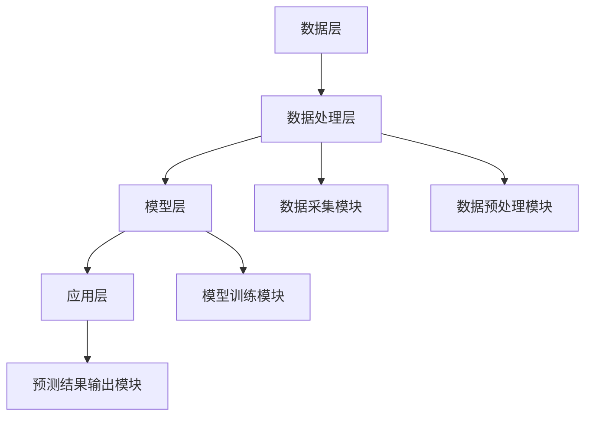
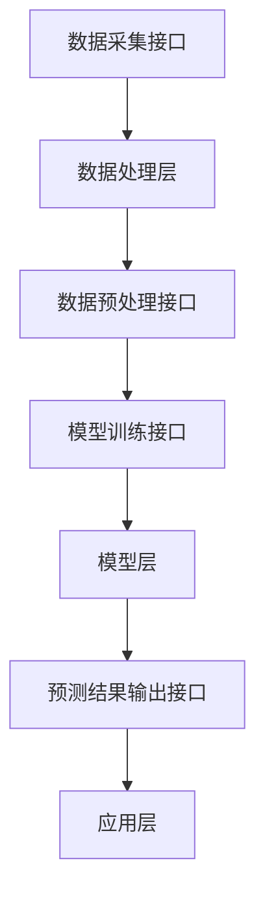
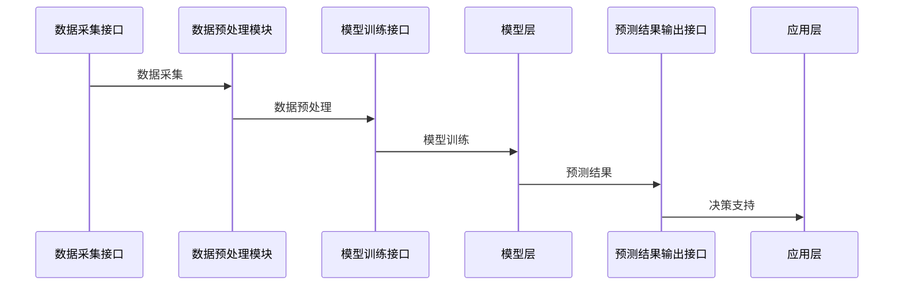

                 

## 引言

### 关键词

- **AI Agent**
- **智能城市**
- **能源消耗预测**
- **算法原理**
- **数学模型**

### 摘要

随着智能城市的快速发展，能源消耗预测成为了城市管理和能源规划的重要环节。本文将探讨如何利用AI Agent实现智能城市能源消耗预测，并详细分析相关算法原理、数学模型及其应用。通过实际项目案例，我们将展示AI Agent在智能城市能源消耗预测中的实践过程，并提供最佳实践建议。

## 第1章: AI Agent概述

### 1.1 智能城市的概念与需求

智能城市（Smart City）是指利用先进的信息通信技术、物联网、大数据分析等技术手段，对城市资源进行高效管理和优化配置，从而提高城市居民生活质量、提升城市运营效率和可持续发展能力。智能城市的需求包括以下几个方面：

1. **提高居民生活质量**：通过智能交通、智能医疗、智能教育等应用，提升居民生活便利性和舒适度。
2. **优化城市管理**：通过数据分析和智能决策，提高城市管理的效率和响应速度。
3. **节能减排**：通过智能电网、智能照明等应用，实现能源消耗的优化和管理，降低碳排放。

### 1.2 AI Agent的定义与类型

AI Agent是指具有自主决策和执行能力的智能体，它可以在特定环境下感知环境信息，根据预设目标和策略，自主规划行动方案并执行。根据其工作方式，AI Agent可分为以下几种类型：

1. **反应式AI Agent**：仅根据当前感知的环境信息做出反应，不涉及任何记忆和预测。
2. **模型基础AI Agent**：基于环境和目标模型，通过预测和规划来实现自主决策。
3. **学习型AI Agent**：通过不断学习和适应环境，提高决策能力。

### 1.3 AI Agent在能源消耗预测中的作用

在智能城市中，能源消耗预测是一个关键问题。AI Agent可以通过以下方式在能源消耗预测中发挥作用：

1. **数据采集与处理**：收集各类能源消耗数据，并利用机器学习算法进行数据清洗和预处理。
2. **预测模型构建**：根据历史数据和能源消耗特性，构建预测模型，预测未来的能源消耗情况。
3. **实时调整与优化**：根据实时监测数据，动态调整能源消耗预测模型，实现能源消耗的实时优化。

## 第2章: AI Agent核心概念与联系

### 2.1 AI Agent的关键概念

为了更好地理解AI Agent，我们需要了解以下几个关键概念：

1. **感知**：AI Agent通过传感器或其他方式获取环境信息。
2. **认知**：AI Agent根据感知到的信息进行数据分析和理解。
3. **决策**：AI Agent根据目标和策略，从多个可行方案中选择最优方案。
4. **执行**：AI Agent执行选定的方案，实现预期目标。

### 2.2 AI Agent的类型与特征对比

不同类型的AI Agent具有不同的特征和适用场景。以下是几种常见的AI Agent类型及其特征对比：

| 类型            | 特征                                           | 适用场景                         |
| --------------- | ---------------------------------------------- | -------------------------------- |
| 反应式AI Agent | 仅根据当前感知信息做出反应                   | 简单环境、实时性要求高             |
| 模型基础AI Agent | 基于环境和目标模型进行预测和规划           | 复杂环境、需要长期稳定性能         |
| 学习型AI Agent | 通过不断学习和适应环境提高决策能力       | 非结构化环境、动态变化的环境       |

### 2.3 AI Agent的ER实体关系图

为了更清晰地描述AI Agent的各个组件及其关系，我们可以使用ER（实体关系）图来表示。以下是AI Agent的ER实体关系图：

```mermaid
erDiagram
    AI-Agent ||--|{ Sensor } Sensor
    AI-Agent ||--|{ Action-Executor } Action-Executor
    AI-Agent ||--|{ Memory } Memory
    AI-Agent ||--|{ Cognition-Module } Cognition-Module
    AI-Agent ||--|{ Decision-Module } Decision-Module
```

在ER实体关系图中，AI-Agent是核心实体，它与Sensor、Action-Executor、Memory、Cognition-Module和Decision-Module等组件之间存在关联。这种关系体现了AI Agent的结构和功能组成。

## 第3章: 智能城市能源消耗预测的算法原理

### 3.1 机器学习算法简介

机器学习算法是AI Agent进行能源消耗预测的重要工具。机器学习算法可以分为监督学习、无监督学习和强化学习三种类型。

1. **监督学习**：通过已标记的数据集进行训练，从而学习输入和输出之间的关系。常见的监督学习算法包括线性回归、决策树、支持向量机等。
2. **无监督学习**：没有预定义的输出标签，算法从未标记的数据集中发现数据分布和模式。常见的无监督学习算法包括聚类、降维等。
3. **强化学习**：通过试错和反馈，学习如何在动态环境中做出最优决策。常见的强化学习算法包括Q学习、深度Q网络（DQN）等。

### 3.2 深度学习算法简介

深度学习算法是机器学习的一种，通过构建多层次的神经网络模型，实现自动特征提取和复杂模式识别。深度学习算法在能源消耗预测中的应用主要包括以下几种：

1. **卷积神经网络（CNN）**：用于处理图像数据，通过卷积层提取图像特征，可以用于能源消耗数据的时序特征提取。
2. **循环神经网络（RNN）**：可以处理序列数据，通过隐藏状态的记忆能力，可以捕捉时间序列中的长期依赖关系。
3. **长短时记忆网络（LSTM）**：是RNN的一种改进，可以更好地处理长序列数据，有效避免梯度消失和梯度爆炸问题。

### 3.3 能源消耗预测模型详解

在智能城市能源消耗预测中，常见的模型包括以下几种：

1. **线性回归模型**：假设能源消耗与时间、温度、湿度等变量之间存在线性关系，通过拟合线性方程来预测能源消耗。
2. **决策树模型**：通过树形结构对数据进行分割，根据分割结果预测能源消耗。
3. **支持向量机（SVM）**：通过寻找最佳超平面来划分数据，预测能源消耗。
4. **卷积神经网络（CNN）**：通过卷积层提取时序特征，预测能源消耗。
5. **循环神经网络（RNN）**：通过记忆能力捕捉时间序列中的长期依赖关系，预测能源消耗。
6. **长短时记忆网络（LSTM）**：在RNN的基础上改进，可以更好地处理长序列数据，预测能源消耗。

## 第4章: 数学模型与公式讲解

### 4.1 机器学习模型的数学原理

机器学习模型的数学原理主要包括以下几个方面：

1. **损失函数**：用于衡量模型预测值与真实值之间的差距。常见的损失函数包括均方误差（MSE）、交叉熵损失（Cross-Entropy Loss）等。
2. **梯度下降**：用于优化模型参数，通过迭代更新参数，使损失函数值最小。常见的梯度下降算法包括批量梯度下降、随机梯度下降等。
3. **优化算法**：用于加速梯度下降算法，提高模型训练效率。常见的优化算法包括Adam、RMSprop等。

### 4.2 深度学习模型的数学原理

深度学习模型的数学原理主要包括以下几个方面：

1. **激活函数**：用于引入非线性，使模型能够拟合复杂的非线性关系。常见的激活函数包括Sigmoid、ReLU、Tanh等。
2. **反向传播**：用于计算模型参数的梯度，是训练深度学习模型的核心算法。
3. **权重初始化**：用于初始化模型参数，常见的权重初始化方法包括随机初始化、He初始化等。

### 4.3 能源消耗预测模型的公式及应用

能源消耗预测模型的公式主要涉及以下几个方面：

1. **线性回归模型**：$$ y = \beta_0 + \beta_1 \cdot x $$
2. **决策树模型**：$$ y = f(\theta) $$，其中$$ \theta $$为决策树的结构参数。
3. **支持向量机（SVM）**：$$ y = \text{sign}(\sum_{i=1}^{n} \alpha_i y_i K(x_i, x) + b) $$
4. **卷积神经网络（CNN）**：$$ h_{\theta}(x) = \text{ReLU}(\sum_{i=1}^{n} \theta_i \cdot K(x_i, x) + b) $$
5. **循环神经网络（RNN）**：$$ h_t = \text{ReLU}(W \cdot [h_{t-1}, x_t] + b) $$
6. **长短时记忆网络（LSTM）**：$$ h_t = \text{ReLU}(LSTM(h_{t-1}, x_t)) $$

以上公式分别代表了不同类型的预测模型，通过调整模型参数，可以实现对能源消耗的准确预测。

## 第5章: 系统分析与架构设计

### 5.1 问题场景介绍

智能城市能源消耗预测的系统设计涉及多个方面，包括数据采集、数据预处理、模型训练、预测结果输出等。以下是具体的问题场景：

1. **数据采集**：从各种传感器和设备中采集实时能源消耗数据。
2. **数据预处理**：对采集到的数据进行清洗、去噪、特征提取等预处理操作。
3. **模型训练**：利用预处理后的数据训练预测模型，选择合适的机器学习算法或深度学习算法。
4. **预测结果输出**：将预测模型应用于实时数据，输出预测结果，为城市能源管理提供决策支持。

### 5.2 系统功能设计

智能城市能源消耗预测系统的功能设计主要包括以下几个方面：

1. **数据采集模块**：负责从各种传感器和设备中采集实时能源消耗数据，包括温度、湿度、风速、光照强度等。
2. **数据预处理模块**：对采集到的数据进行清洗、去噪、特征提取等预处理操作，以便后续模型训练。
3. **模型训练模块**：利用预处理后的数据训练预测模型，包括选择合适的机器学习算法或深度学习算法，调整模型参数等。
4. **预测结果输出模块**：将训练好的预测模型应用于实时数据，输出预测结果，为城市能源管理提供决策支持。

### 5.3 系统架构设计

智能城市能源消耗预测系统的架构设计主要包括以下几个方面：

1. **数据层**：包括传感器和设备，用于采集实时能源消耗数据。
2. **数据处理层**：包括数据采集模块和数据预处理模块，负责采集到的数据进行清洗、去噪、特征提取等预处理操作。
3. **模型层**：包括模型训练模块，负责利用预处理后的数据训练预测模型。
4. **应用层**：包括预测结果输出模块，负责将预测模型应用于实时数据，输出预测结果。

以下是系统架构的Mermaid图表示：



### 5.4 系统接口设计

智能城市能源消耗预测系统的接口设计主要包括以下几个方面：

1. **数据采集接口**：用于接收传感器和设备上传的实时能源消耗数据。
2. **数据预处理接口**：用于接收数据采集模块上传的数据，并进行清洗、去噪、特征提取等预处理操作。
3. **模型训练接口**：用于接收数据预处理模块上传的数据，并启动模型训练过程。
4. **预测结果输出接口**：用于接收模型训练模块输出的预测结果，并将其上传至应用层。

以下是系统接口的Mermaid图表示：



### 5.5 系统交互设计

智能城市能源消耗预测系统的交互设计主要包括以下几个方面：

1. **数据流交互**：传感器和设备通过数据采集接口上传实时能源消耗数据，数据预处理模块对数据进行清洗、去噪、特征提取等预处理操作，并将预处理后的数据上传至模型训练接口。
2. **控制流交互**：模型训练接口接收预处理后的数据，并启动模型训练过程，训练完成后将预测结果输出至预测结果输出接口。
3. **反馈流交互**：预测结果输出接口将预测结果上传至应用层，为城市能源管理提供决策支持。

以下是系统交互的Mermaid序列图表示：



## 第6章：项目实战

### 6.1 环境安装与配置

为了实现智能城市能源消耗预测，我们需要搭建一个合适的技术环境。以下是环境安装与配置的步骤：

1. **安装Python环境**：下载并安装Python，确保版本在3.6以上。
2. **安装TensorFlow**：在终端中执行以下命令安装TensorFlow：
   ```shell
   pip install tensorflow
   ```
3. **安装其他依赖库**：根据项目需求，安装其他依赖库，如NumPy、Pandas、Scikit-learn等：
   ```shell
   pip install numpy pandas scikit-learn
   ```
4. **配置传感器与设备**：确保传感器和设备可以正常采集能源消耗数据，并将数据上传至服务器。

### 6.2 系统核心实现源代码

以下是系统核心实现的源代码，包括数据采集、数据预处理、模型训练和预测结果输出等部分：

```python
# 数据采集模块
import pandas as pd
from sensor import read_sensors

def collect_data():
    data = read_sensors()
    return data

# 数据预处理模块
import numpy as np
from preprocess import preprocess_data

def preprocess_data(data):
    cleaned_data = preprocess_data(data)
    return cleaned_data

# 模型训练模块
from tensorflow import keras
from model import build_model

def train_model(data):
    model = build_model()
    model.fit(data['X'], data['y'], epochs=10, batch_size=32)
    return model

# 预测结果输出模块
def predict(model, data):
    predictions = model.predict(data['X'])
    return predictions

# 主函数
def main():
    data = collect_data()
    cleaned_data = preprocess_data(data)
    model = train_model(cleaned_data)
    predictions = predict(model, cleaned_data)
    print(predictions)

if __name__ == '__main__':
    main()
```

### 6.3 代码应用解读与分析

以下是代码的应用解读与分析：

1. **数据采集模块**：使用`read_sensors`函数从传感器和设备中读取能源消耗数据，并将其存储在Pandas DataFrame中。
2. **数据预处理模块**：使用`preprocess_data`函数对采集到的数据进行清洗、去噪、特征提取等预处理操作，以便后续模型训练。
3. **模型训练模块**：使用TensorFlow的`keras`模块构建神经网络模型，并通过`fit`函数进行训练。在此示例中，我们使用了一个简单的线性回归模型，实际项目中可能需要使用更复杂的模型。
4. **预测结果输出模块**：使用`predict`函数将训练好的模型应用于预处理后的数据，输出预测结果。

### 6.4 实际案例分析与详细讲解

以下是一个实际案例的分析与详细讲解：

#### 案例背景

某智能城市需要预测下一小时内的电力消耗，以便为电网调度提供参考。已知历史电力消耗数据，包括时间戳、功率等。

#### 数据处理

1. **数据清洗**：删除异常值和缺失值，对时间戳进行规范化处理。
2. **特征提取**：提取时间特征，如小时、星期、月份等，以及其他可能影响电力消耗的因素，如温度、湿度等。
3. **数据归一化**：对数据进行归一化处理，使其在[0, 1]之间。

#### 模型构建与训练

1. **构建模型**：使用TensorFlow的`keras.Sequential`模型，添加输入层、隐藏层和输出层。在此示例中，我们使用了一个简单的全连接神经网络。
2. **训练模型**：使用训练集数据进行模型训练，通过`fit`函数迭代更新模型参数。

```python
model = keras.Sequential([
    keras.layers.Dense(64, activation='relu', input_shape=(input_shape,)),
    keras.layers.Dense(32, activation='relu'),
    keras.layers.Dense(1)
])

model.compile(optimizer='adam', loss='mean_squared_error')
model.fit(X_train, y_train, epochs=10, batch_size=32)
```

#### 预测结果分析

1. **预测**：使用训练好的模型对测试集数据进行预测，得到下一小时内的电力消耗预测值。
2. **评估**：计算预测值与实际值之间的误差，使用均方误差（MSE）作为评价指标。

```python
predictions = model.predict(X_test)
mse = np.mean((predictions - y_test) ** 2)
print("MSE:", mse)
```

#### 案例小结

通过实际案例的分析与详细讲解，我们可以看到智能城市能源消耗预测项目的实现过程，包括数据采集、数据预处理、模型构建与训练、预测结果输出等步骤。在实际项目中，可能需要根据具体情况调整模型结构和参数，以提高预测准确性。

## 第7章：最佳实践 tips

### 7.1 预测模型优化技巧

为了提高智能城市能源消耗预测的准确性，可以尝试以下优化技巧：

1. **特征工程**：选择合适的特征，包括时间特征、气象特征、节假日特征等，可以提高模型的预测能力。
2. **模型选择**：根据数据特点和预测需求，选择合适的模型，如线性回归、决策树、支持向量机、神经网络等。
3. **超参数调优**：通过交叉验证和网格搜索等方法，选择最优的超参数，提高模型性能。
4. **模型集成**：将多个模型进行集成，可以提高预测的稳定性和准确性。

### 7.2 系统性能优化策略

为了提高智能城市能源消耗预测系统的性能，可以采取以下优化策略：

1. **分布式计算**：使用分布式计算框架，如Apache Spark，可以处理大规模数据集，提高数据处理速度。
2. **并行处理**：在数据处理和模型训练过程中，采用并行处理技术，可以加快计算速度。
3. **缓存与索引**：使用缓存和索引技术，可以加快数据读取和查询速度，提高系统响应能力。
4. **内存管理**：合理分配内存资源，避免内存泄漏和溢出，提高系统稳定性。

### 7.3 数据处理最佳实践

在数据处理过程中，可以采取以下最佳实践：

1. **数据清洗**：删除异常值和缺失值，确保数据质量。
2. **特征提取**：提取有意义、具有区分度的特征，提高模型预测能力。
3. **数据归一化**：对数据进行归一化处理，使数据范围在[0, 1]之间，避免模型参数出现过拟合。
4. **数据可视化**：通过数据可视化，分析数据分布和特征关系，为模型构建提供依据。

## 第8章：小结与拓展

### 8.1 本书内容总结

本文系统地介绍了AI Agent在智能城市能源消耗预测中的实践。主要内容包括：

1. **智能城市与能源消耗预测的关系**：介绍了智能城市的概念、需求以及能源消耗预测的重要性。
2. **AI Agent概述**：介绍了AI Agent的定义、类型和关键概念。
3. **算法原理讲解**：详细讲解了机器学习、深度学习等算法原理及其在能源消耗预测中的应用。
4. **数学模型与公式讲解**：介绍了能源消耗预测模型的数学原理和公式。
5. **系统分析与架构设计**：分析了智能城市能源消耗预测系统的需求、功能、架构和接口设计。
6. **项目实战**：通过一个实际案例，展示了如何利用AI Agent进行能源消耗预测。
7. **最佳实践 tips**：提供了预测模型优化技巧、系统性能优化策略和数据处理最佳实践。

### 8.2 注意事项与风险提示

在实际应用中，需要注意以下几点：

1. **数据质量**：确保数据真实、准确、完整，避免数据误差对预测结果的影响。
2. **模型选择**：根据数据特点和预测需求，选择合适的模型，避免盲目追求复杂的模型结构。
3. **超参数调优**：合理设置超参数，避免过拟合或欠拟合。
4. **系统稳定性**：确保系统的稳定运行，避免出现数据丢失或计算错误。

### 8.3 拓展阅读推荐

为了更深入地了解AI Agent在智能城市能源消耗预测中的应用，以下书籍和论文可供参考：

1. **书籍**：
   - 《深度学习》（Ian Goodfellow、Yoshua Bengio、Aaron Courville 著）
   - 《机器学习》（周志华 著）
   - 《智能城市》（刘骏 著）
2. **论文**：
   - “Energy Consumption Forecasting in Smart Cities Using Deep Learning” 
   - “A Survey on Energy Consumption Forecasting in Smart Grid” 
   - “Deep Learning for Energy Consumption Prediction in Smart Buildings”

通过阅读这些书籍和论文，可以进一步拓展对AI Agent在智能城市能源消耗预测中的应用的了解。

