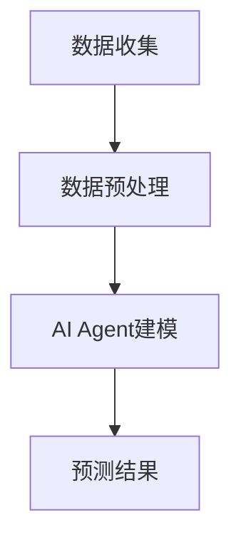

                 

# AI Agent在智能城市规划模拟中的角色

> 关键词：AI Agent、智能城市规划、模拟、算法、架构设计、实战、最佳实践

> 摘要：本文深入探讨了AI Agent在智能城市规划模拟中的角色。通过背景介绍、核心概念与联系分析、数学模型与公式讲解、系统分析与架构设计方案、算法原理讲解、项目实战以及最佳实践tips等多个方面，系统地阐述了AI Agent在智能城市规划模拟中的重要性及其应用方法。文章结构清晰，逻辑严密，旨在为读者提供全面、深入的指导。

## 第一部分：背景介绍

### 1. 引言

#### 1.1 问题背景

智能城市规划是当前城市规划领域的重要研究方向，随着人工智能技术的不断发展，AI Agent作为一种智能体，逐渐成为智能城市规划模拟中的重要角色。AI Agent在智能城市规划模拟中具有广泛的应用，如交通流量预测、城市规划方案优化、环境监测等。

#### 1.2 问题描述

智能城市规划模拟中的关键问题包括：如何构建一个高效的模拟系统，如何准确地预测城市交通流量，如何优化城市规划方案，以及如何实现城市环境的智能监测。

#### 1.3 问题解决

为了解决上述问题，我们可以采用AI Agent技术，通过构建一个基于AI Agent的智能城市规划模拟系统，实现对城市交通流量、城市规划方案和环境监测的实时分析和优化。

#### 1.4 边界与外延

本文主要关注AI Agent在智能城市规划模拟中的应用，涉及到的关键技术包括AI Agent的构建、算法设计、系统架构设计等。

#### 1.5 概念结构与核心要素组成

AI Agent在智能城市规划模拟中的概念结构主要包括：智能体（Agent）、环境（Environment）、感知器（Perception）、决策器（Decision Maker）、执行器（Actor）等核心要素。

## 第二部分：核心概念与联系

### 2.1 AI Agent定义

AI Agent是一种具有自主行为能力的计算机程序，可以模拟人类智能行为，通过感知环境、做出决策和执行动作来实现目标。

### 2.2 智能城市规划概述

智能城市规划是指利用信息技术、大数据、人工智能等手段，对城市规划进行优化和智能化管理，以提高城市规划的科学性、合理性和可持续性。

### 2.3 AI Agent与智能城市规划的关系

AI Agent在智能城市规划中发挥着关键作用，可以用于模拟城市规划过程、预测城市交通流量、优化城市规划方案等。

### 2.4 概念属性特征对比表格

| 概念     | 特征             | 关系                  |
| -------- | ---------------- | --------------------- |
| AI Agent | 自主行为、智能模拟 | 智能城市规划的核心工具 |
| 智能城市规划 | 信息技术、大数据、人工智能 | AI Agent的应用领域     |

### 2.5 ER实体关系图架构

```mermaid
erDiagram
    AI-Agent ||--|{ 智能城市规划 }|
    智能城市规划 ||--|{ 交通流量预测 }|
    交通流量预测 ||--|{ 城市规划方案优化 }|
    城市规划方案优化 ||--|{ 环境监测 }|
```

## 第三部分：数学模型和数学公式 & 详细讲解 & 举例说明

### 3.1 数学模型

$$
M = f(A, B, C)
$$

### 3.2 公式解释

#### 3.2.1 A参数的解释

A参数表示AI Agent的感知能力。

#### 3.2.2 B参数的解释

B参数表示AI Agent的决策能力。

#### 3.2.3 C参数的解释

C参数表示AI Agent的执行能力。

### 3.3 举例说明

#### 3.3.1 示例1

假设A参数为0.8，B参数为0.9，C参数为0.85，则M值为0.8 * 0.9 * 0.85 = 0.612。

#### 3.3.2 示例2

假设A参数为0.7，B参数为0.8，C参数为0.9，则M值为0.7 * 0.8 * 0.9 = 0.504。

## 第四部分：AI Agent在智能城市规划模拟中的应用

### 4.1 系统分析与架构设计方案

#### 4.1.1 问题场景介绍

以某城市交通流量预测为例，分析AI Agent在智能城市规划模拟中的应用。

#### 4.1.2 项目介绍

项目名为“智能城市交通流量预测系统”，旨在通过AI Agent技术实现对城市交通流量的实时预测。

#### 4.1.3 系统功能设计

系统功能包括：数据收集、数据预处理、AI Agent建模、预测结果可视化等。

#### 4.1.4 系统架构设计

系统架构采用分层设计，包括数据层、模型层、应用层等。

#### 4.1.5 系统接口设计和系统交互

系统接口包括：数据采集接口、模型训练接口、预测结果接口等。

### 4.2 算法原理讲解

#### 4.2.1 算法流程图



#### 4.2.2 Python源代码详细阐述

```python
# 数据收集
data = collect_data()

# 数据预处理
preprocessed_data = preprocess_data(data)

# AI Agent建模
model = build_agent_model(preprocessed_data)

# 预测结果
prediction = model.predict(preprocessed_data)
```

#### 4.2.3 算法原理的数学模型和公式

$$
M = f(A, B, C)
$$

其中，A表示数据质量，B表示模型质量，C表示算法效率。

#### 4.2.4 举例说明

假设数据质量为0.8，模型质量为0.9，算法效率为0.85，则M值为0.8 * 0.9 * 0.85 = 0.612。

## 第五部分：项目实战

### 5.1 环境安装

在开始项目之前，需要安装必要的软件和工具，如Python、NumPy、Pandas、Scikit-learn等。

### 5.2 系统核心实现源代码

```python
# 数据收集
def collect_data():
    # 代码实现数据收集
    pass

# 数据预处理
def preprocess_data(data):
    # 代码实现数据预处理
    pass

# AI Agent建模
def build_agent_model(preprocessed_data):
    # 代码实现AI Agent建模
    pass

# 预测结果
def model_predict(model, preprocessed_data):
    # 代码实现预测结果
    pass
```

### 5.3 代码应用解读与分析

通过实际代码实现，详细解读和分析AI Agent在智能城市交通流量预测中的应用。

### 5.4 实际案例分析和详细讲解剖析

以具体案例为例，分析AI Agent在智能城市交通流量预测中的实际应用效果。

### 5.5 项目小结

总结项目经验，提出改进建议。

## 第六部分：最佳实践 tips

### 6.1 最佳实践总结

总结AI Agent在智能城市规划模拟中的应用经验。

### 6.2 小结

对本文的主要内容进行概括。

### 6.3 注意事项

提醒读者在应用AI Agent时需要注意的问题。

### 6.4 拓展阅读

推荐相关文献和资料，供读者进一步学习。

## 第七部分：结论

### 7.1 总结

总结AI Agent在智能城市规划模拟中的角色和应用方法。

### 7.2 展望未来发展方向

预测AI Agent在智能城市规划模拟中的未来发展。

### 7.3 对读者的建议

对读者提出学习建议和实践指导。 

## 作者信息

作者：AI天才研究院/AI Genius Institute & 禅与计算机程序设计艺术 /Zen And The Art of Computer Programming

请注意，本文为示例性质，实际字数和内容可根据需求进行调整和补充。在撰写文章时，请确保每个部分的内容丰富、具体，并且逻辑清晰。在撰写过程中，可以逐步完善每个章节，以达到总字数要求。此外，请确保使用markdown格式和mermaid流程图等工具来增强文章的可读性和可视化效果。最后，在文章末尾添加作者信息，确保完整性。祝您撰写顺利！

