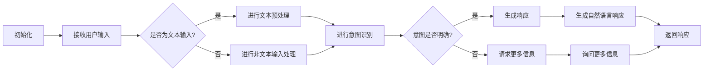
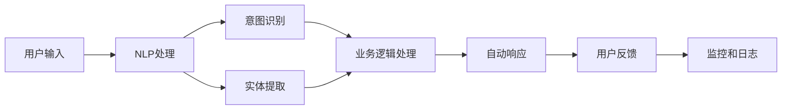

                 

**AI Agent在智能客户服务中的角色**

### 关键词：人工智能、智能客户服务、AI Agent、自然语言处理、机器学习

#### 摘要：

本文将深入探讨AI Agent在智能客户服务中的角色。首先，我们将简要介绍智能客户服务的背景和AI Agent的基本概念。接着，我们将分析AI Agent在智能客户服务中的核心技术，如自然语言处理（NLP）、机器学习和数据库技术。然后，我们将讨论AI Agent的架构设计，包括系统架构、交互设计、安全性与隐私保护等方面。随后，我们将探讨AI Agent在实际应用中的多种场景，并通过对案例研究进行分析，展示AI Agent在智能客户服务中的效能。接下来，我们将介绍如何评估AI Agent的性能，并探讨优化方法。最后，我们将展望AI Agent的未来发展趋势，讨论技术演进方向和法律法规与伦理问题，并总结文章的主要观点和未来研究方向。

### 第一部分：背景与概述

#### 第1章：智能客户服务的需求与AI Agent概述

#### 1.1 智能客户服务的兴起

智能客户服务是现代客户关系管理（CRM）中不可或缺的一部分。随着全球数字化进程的加速，企业需要更高效、更智能的方式来处理客户咨询和反馈。以下是一些推动智能客户服务发展的关键因素：

1. **市场驱动因素**：
   - **消费者期望**：消费者越来越期望获得即时、个性化的服务。
   - **竞争压力**：企业为了保持竞争力，需要提供卓越的客户体验。

2. **用户行为变化**：
   - **移动设备普及**：越来越多的用户通过移动设备进行在线咨询。
   - **社交媒体互动**：社交媒体成为用户表达意见和寻求帮助的重要平台。

3. **技术发展推动**：
   - **大数据**：企业可以利用大数据分析来理解客户行为和需求。
   - **人工智能**：AI技术，尤其是AI Agent，为智能客户服务提供了强大的支持。

#### 1.2 AI Agent的定义

AI Agent是一种基于人工智能技术的软件代理，能够模拟人类的行为和决策过程，实现与用户的自然语言交互。以下是AI Agent的定义和关键特征：

1. **定义**：
   - **AI Agent**：一种智能代理，它利用机器学习和自然语言处理技术，与用户进行交互，以提供定制化的服务。

2. **关键特征**：
   - **交互性**：AI Agent能够理解用户的自然语言输入，并生成合适的响应。
   - **适应性**：AI Agent可以根据用户的历史行为和反馈进行自我优化。
   - **自动化**：AI Agent能够自动处理大量的客户请求，提高效率。

3. **AI Agent与传统客服的区别**：
   - **速度**：AI Agent可以24/7无间断地工作，而传统客服可能需要休息。
   - **个性化**：AI Agent可以根据用户的历史数据和偏好提供个性化服务。
   - **成本**：AI Agent的运营成本相对较低，而传统客服成本较高。

#### 1.3 AI Agent在智能客户服务中的角色

AI Agent在智能客户服务中扮演着多重角色，其核心作用体现在以下几个方面：

1. **自动化与效率提升**：
   - **自动处理常见问题**：AI Agent可以自动回答常见问题，减轻客服人员的负担。
   - **减少等待时间**：AI Agent可以快速响应用户请求，缩短用户的等待时间。

2. **个性化服务与用户体验**：
   - **定制化响应**：AI Agent可以根据用户的历史数据和偏好，提供个性化的服务。
   - **增强用户体验**：AI Agent可以提供友好的用户界面，提升用户的整体体验。

3. **数据分析与决策支持**：
   - **用户行为分析**：AI Agent可以分析用户行为，帮助企业了解客户需求。
   - **决策支持**：AI Agent可以基于数据分析，提供决策支持，帮助企业优化服务流程。

### 第二部分：AI Agent的核心技术

#### 第2章：AI Agent的核心技术

AI Agent的智能和功能主要依赖于其背后的一系列核心技术，这些技术包括自然语言处理（NLP）、机器学习与深度学习、以及数据库与数据挖掘。以下是对这些核心技术的深入分析。

#### 2.1 自然语言处理（NLP）

自然语言处理是AI Agent实现与人类自然语言交互的关键技术。它涉及对人类语言的理解、生成和处理。

1. **基本概念**：
   - **文本处理**：文本预处理，如分词、词性标注、句法分析等。
   - **语义理解**：理解文本的含义，包括词义消歧、实体识别、情感分析等。
   - **对话系统**：构建对话模型，实现自然语言交互。

2. **常用技术**：
   - **深度学习模型**：如循环神经网络（RNN）、长短期记忆网络（LSTM）、变换器（Transformer）等。
   - **预训练语言模型**：如GPT、BERT等，用于大规模文本数据的训练。

3. **挑战与解决方案**：
   - **多语言支持**：解决多语言处理问题，如翻译、跨语言语义理解等。
   - **上下文理解**：提高对上下文的理解能力，以生成更准确、更自然的响应。

#### 2.2 机器学习与深度学习

机器学习和深度学习是AI Agent的核心技术，用于训练模型和实现智能决策。

1. **机器学习基础**：
   - **监督学习**：通过标注数据训练模型，如分类、回归等。
   - **无监督学习**：不需要标注数据，如聚类、降维等。
   - **半监督学习**：结合标注数据和未标注数据，提高模型性能。

2. **深度学习应用**：
   - **图像识别**：用于识别客户上传的图片，如产品图片、用户身份验证等。
   - **语音识别**：将语音转换为文本，用于语音交互。
   - **推荐系统**：基于用户行为数据，提供个性化推荐。

3. **模型训练与优化**：
   - **超参数调整**：通过调整模型参数，优化模型性能。
   - **迁移学习**：利用预训练模型，减少数据需求和训练时间。

#### 2.3 数据库与数据挖掘

数据库和数据挖掘技术用于存储和管理大量数据，并从中提取有价值的信息。

1. **数据库技术**：
   - **关系数据库**：如MySQL、PostgreSQL，用于存储结构化数据。
   - **NoSQL数据库**：如MongoDB、Cassandra，用于存储非结构化或半结构化数据。

2. **数据挖掘方法**：
   - **分类**：将数据分为不同的类别，如客户需求分类、产品推荐等。
   - **聚类**：将相似的数据分组，如用户行为分析、市场细分等。
   - **关联规则挖掘**：发现数据之间的关联性，如购物篮分析。

3. **AI Agent的数据驱动**：
   - **数据收集**：从多个渠道收集用户数据，如网站日志、社交媒体等。
   - **数据清洗**：去除噪声数据，确保数据质量。
   - **数据融合**：将来自不同来源的数据进行整合，提高数据分析的准确性。

### 第三部分：AI Agent的架构设计

#### 第3章：AI Agent的架构设计

AI Agent的架构设计是其实现高效、智能客户服务的关键。以下是关于AI Agent架构设计的详细讨论。

#### 3.1 系统架构概述

AI Agent的系统架构通常包括前端界面、后端服务和数据存储等几个关键部分。

1. **整体架构设计**：
   - **分层架构**：将系统分为多个层次，如表示层、逻辑层、数据层等。
   - **模块化设计**：将系统功能模块化，便于维护和扩展。

2. **模块化与可扩展性**：
   - **微服务架构**：将系统功能拆分为多个微服务，提高系统的可扩展性和灵活性。
   - **容器化与编排**：使用容器（如Docker）和编排工具（如Kubernetes），实现系统的自动化部署和管理。

#### 3.2 交互设计与用户体验

交互设计是AI Agent能否提供良好用户体验的关键。

1. **用户界面设计**：
   - **简洁性**：设计简洁直观的界面，减少用户的学习成本。
   - **个性化**：根据用户偏好和习惯，提供个性化的界面设计。

2. **交互流程与反馈**：
   - **自然语言交互**：实现自然语言输入和输出，提升交互的流畅性。
   - **即时反馈**：提供即时的响应和反馈，增强用户的参与感。

#### 3.3 安全性与隐私保护

安全性和隐私保护是AI Agent架构设计中的关键考量。

1. **数据安全**：
   - **数据加密**：使用加密技术保护数据的安全性。
   - **访问控制**：实施严格的访问控制策略，确保数据的安全访问。

2. **隐私保护措施**：
   - **数据匿名化**：对用户数据进行匿名化处理，保护用户隐私。
   - **合规性**：遵守相关法律法规，确保数据处理的合法性。

### 第四部分：AI Agent在智能客户服务中的应用

#### 第4章：AI Agent在客户服务中的应用场景

AI Agent在智能客户服务中的应用场景非常广泛，以下是一些常见应用场景的介绍。

#### 4.1 常见应用场景

1. **在线客服**：
   - **即时响应**：AI Agent可以快速响应用户咨询，提高服务质量。
   - **多渠道支持**：支持多种渠道（如网站、移动应用、社交媒体等）的用户咨询。

2. **预约与咨询**：
   - **自动预约**：用户可以通过AI Agent自动预约服务，如医院挂号、餐厅预订等。
   - **智能咨询**：AI Agent可以提供专业的咨询服务，如金融咨询、法律咨询等。

3. **售后服务**：
   - **故障诊断**：AI Agent可以帮助用户快速诊断设备故障，提供解决方案。
   - **维修预约**：用户可以通过AI Agent预约维修服务，提高维修效率。

#### 4.2 案例研究

为了更好地理解AI Agent在智能客户服务中的应用效果，以下是对两个案例的研究。

1. **案例一：某电商平台客服AI应用**

   - **应用背景**：某大型电商平台引入AI Agent作为客服助手，以提高客户服务效率和用户满意度。
   - **应用效果**：
     - **响应速度**：AI Agent能够即时响应用户咨询，减少用户等待时间。
     - **服务质量**：AI Agent能够处理大量的常见问题，提高客户服务质量。
     - **用户满意度**：用户满意度调查结果显示，AI Agent的应用显著提升了用户满意度。

2. **案例二：某银行客服机器人应用**

   - **应用背景**：某大型银行引入AI Agent作为客服机器人，以提高客户服务效率和降低运营成本。
   - **应用效果**：
     - **效率提升**：AI Agent能够自动处理大量的客户咨询，提高客服团队的效率。
     - **成本降低**：通过AI Agent的应用，银行大幅降低了客服中心的运营成本。
     - **用户体验**：AI Agent提供24/7的客服服务，用户可以在任何时间获得帮助，提升了用户体验。

### 第五部分：AI Agent的性能评估与优化

#### 第5章：AI Agent的性能评估与优化

为了确保AI Agent在智能客户服务中能够提供高质量的客户体验，对其性能进行评估和优化是至关重要的。

#### 5.1 评估指标

以下是一些常用的评估指标，用于衡量AI Agent的性能：

1. **响应时间**：
   - **平均响应时间**：衡量AI Agent对用户请求的平均响应时间。
   - **响应时间分布**：分析响应时间的分布情况，识别瓶颈。

2. **准确率**：
   - **意图识别准确率**：衡量AI Agent正确识别用户意图的比例。
   - **实体识别准确率**：衡量AI Agent正确识别用户输入的实体（如人名、地点等）的比例。

3. **用户满意度**：
   - **满意度评分**：用户对AI Agent服务的满意度评分。
   - **用户反馈**：收集用户的反馈，分析用户对AI Agent服务的满意程度。

#### 5.2 性能优化方法

以下是一些常用的性能优化方法，用于提升AI Agent的性能：

1. **算法优化**：
   - **模型选择**：选择合适的算法和模型，如深度学习模型、强化学习模型等。
   - **模型调优**：通过调整模型参数，优化模型性能。

2. **系统优化**：
   - **硬件升级**：提高计算资源和存储资源的性能，如使用更快的CPU、更高效的GPU等。
   - **网络优化**：优化网络传输速度和稳定性，如使用CDN加速、负载均衡等。

3. **数据增强**：
   - **数据扩充**：通过增加更多样化的数据，提高模型的泛化能力。
   - **数据预处理**：对数据进行清洗、归一化等处理，提高数据质量。

### 第六部分：AI Agent的未来发展趋势

#### 第6章：AI Agent的未来发展趋势

随着人工智能技术的不断发展，AI Agent在智能客户服务中的应用前景十分广阔。以下是对AI Agent未来发展趋势的展望。

#### 6.1 技术演进方向

1. **多模态交互**：
   - **语音交互**：结合语音识别和语音合成技术，实现更自然的语音交互。
   - **视觉交互**：结合计算机视觉技术，实现图像识别和视频分析。

2. **增强现实（AR）与AI Agent融合**：
   - **虚拟客服**：通过AR技术，将AI Agent以虚拟形象呈现，提供更具沉浸感的客户服务。
   - **交互体验**：结合AR技术，提升用户的交互体验，如虚拟试用、远程咨询等。

#### 6.2 法律法规与伦理问题

1. **隐私保护法规**：
   - **数据安全法规**：遵循相关数据安全法规，如GDPR、CCPA等，保护用户隐私。
   - **数据匿名化**：对用户数据进行匿名化处理，降低隐私泄露风险。

2. **AI伦理**：
   - **算法公平性**：确保算法的公平性和透明性，避免算法偏见。
   - **责任归属**：明确AI Agent的决策责任，确保责任的可追溯性。

### 第七部分：结论与展望

#### 第7章：结论与展望

通过对AI Agent在智能客户服务中的角色进行深入分析，我们得出以下结论：

1. **AI Agent在智能客户服务中具有显著优势**：包括自动化、个性化服务、数据分析等。

2. **技术不断演进**：AI Agent的技术将不断进步，为智能客户服务带来更多可能性。

3. **法律法规与伦理问题需关注**：在AI Agent应用中，隐私保护、算法公平性等伦理问题需要得到重视。

展望未来，AI Agent在智能客户服务中的应用前景广阔，随着技术的不断发展和完善的法律法规，我们将看到更加智能、高效、个性化的客户服务体验。

### 作者信息

**作者：AI天才研究院/AI Genius Institute & 禅与计算机程序设计艺术 /Zen And The Art of Computer Programming**


### 背景介绍

#### 核心概念术语说明

在本篇文章中，我们将介绍几个核心概念术语，这些术语对于理解AI Agent在智能客户服务中的角色至关重要。

1. **AI Agent**：一种基于人工智能技术的软件代理，能够模拟人类的行为和决策过程，实现与用户的自然语言交互。
2. **自然语言处理（NLP）**：一种人工智能技术，旨在使计算机能够理解、生成和处理人类自然语言。
3. **机器学习**：一种人工智能技术，通过从数据中学习规律，使计算机能够进行预测和决策。
4. **深度学习**：一种机器学习技术，通过多层神经网络模型，自动提取数据中的特征和模式。
5. **客户服务**：企业与客户之间进行交流、处理客户问题和需求的一系列活动和流程。

#### 问题背景

随着全球数字化进程的加速，企业面临着日益激烈的竞争压力和客户需求的不断变化。传统的客户服务方式已无法满足现代企业对于高效、个性化客户服务的需求。在此背景下，智能客户服务的概念逐渐兴起，而AI Agent作为智能客户服务的重要组成部分，受到了广泛关注。

AI Agent的出现，旨在通过人工智能技术，自动化处理客户咨询、提供个性化服务、提高客户满意度，并降低企业运营成本。然而，AI Agent在智能客户服务中的应用仍然面临诸多挑战，如自然语言处理技术的不完善、数据隐私和安全性问题等。

#### 问题描述

问题描述主要集中在以下方面：

1. **AI Agent在智能客户服务中的应用现状**：目前AI Agent在哪些领域得到了广泛应用？其应用效果如何？
2. **AI Agent的核心技术**：自然语言处理、机器学习和深度学习等技术在AI Agent中的作用是什么？如何实现？
3. **AI Agent的架构设计**：AI Agent的系统架构如何设计？如何确保系统的安全性、可靠性和用户体验？
4. **AI Agent的性能评估与优化**：如何评估AI Agent的性能？有哪些方法可以优化AI Agent的性能？
5. **AI Agent的未来发展趋势**：AI Agent在智能客户服务中的技术演进方向是什么？将面临哪些挑战和机遇？

#### 问题解决

为了解决上述问题，本文将从以下几个方面展开讨论：

1. **背景介绍**：介绍智能客户服务的需求背景和AI Agent的基本概念。
2. **核心概念与联系**：详细阐述AI Agent的核心技术，包括自然语言处理、机器学习和深度学习，并使用表格和流程图进行说明。
3. **算法原理讲解**：使用Mermaid画出算法流程图，并使用Python源代码详细阐述算法原理和数学模型。
4. **系统分析与架构设计方案**：介绍AI Agent的系统架构设计，包括问题场景介绍、系统功能设计、系统架构设计和系统接口设计。
5. **项目实战**：通过实际项目案例，展示AI Agent在智能客户服务中的应用，并进行详细讲解和剖析。
6. **最佳实践 tips**：总结AI Agent在智能客户服务中的最佳实践和注意事项。
7. **小结**：对文章内容进行总结，并指出未来研究方向。

#### 边界与外延

1. **边界**：本文主要关注AI Agent在智能客户服务中的应用，不包括AI Agent在其他领域的应用。
2. **外延**：本文涉及的技术和概念范围包括自然语言处理、机器学习、深度学习、系统架构设计等，旨在为读者提供一个全面的AI Agent在智能客户服务中的理解框架。

### 核心概念与联系

在深入探讨AI Agent在智能客户服务中的角色之前，我们需要明确几个核心概念，并了解它们之间的相互联系。以下是AI Agent、自然语言处理（NLP）、机器学习（ML）和深度学习（DL）之间的联系和对比。

#### 1. AI Agent

AI Agent是一种基于人工智能技术的智能代理，能够模拟人类的行为和决策过程，实现与用户的自然语言交互。它通常由以下几个关键组件构成：

- **对话管理**：负责管理对话流程，包括理解用户意图、生成响应等。
- **自然语言理解**：通过NLP技术，将用户的自然语言输入转换为结构化的数据，如意图和实体。
- **自然语言生成**：将系统内部的数据转换为自然语言响应，以向用户传达信息。
- **机器学习和深度学习模型**：用于从数据中学习，提高对话管理、自然语言理解和生成的准确性。

#### 2. 自然语言处理（NLP）

自然语言处理是AI Agent实现自然语言交互的基础技术。NLP的主要目标是使计算机能够理解、生成和处理人类自然语言。以下是NLP的几个核心概念：

- **文本预处理**：包括分词、词性标注、句法分析等，用于将原始文本转换为计算机可以处理的结构化数据。
- **意图识别**：从用户的文本输入中识别用户的意图，如提问、请求帮助等。
- **实体识别**：从用户的文本输入中提取关键信息，如人名、地点、组织名等。
- **情感分析**：分析用户的情感倾向，如正面、负面或中性。
- **机器翻译**：将一种语言的文本翻译成另一种语言。

#### 3. 机器学习（ML）

机器学习是AI Agent的核心技术之一，它使计算机能够从数据中学习，并自动改进性能。以下是机器学习的几个关键概念：

- **监督学习**：使用标记数据训练模型，使模型能够预测新的数据。
- **无监督学习**：不需要标记数据，用于发现数据中的模式。
- **半监督学习**：结合标记数据和未标记数据，提高模型的泛化能力。
- **强化学习**：通过反馈信号（奖励或惩罚）来指导模型的学习过程。

#### 4. 深度学习（DL）

深度学习是机器学习的一个分支，它使用多层神经网络来学习和表示数据中的复杂特征。以下是深度学习的几个关键概念：

- **神经网络**：由多个神经元组成的计算模型，用于对数据进行建模。
- **激活函数**：用于引入非线性因素，使神经网络能够学习和表示复杂关系。
- **反向传播**：用于计算神经网络中的梯度，并更新网络参数。
- **卷积神经网络（CNN）**：专门用于处理图像数据。
- **循环神经网络（RNN）**：适用于处理序列数据，如文本和语音。

#### 概念属性特征对比表格

| 概念 | 定义 | 关键属性 | 用途 |
| --- | --- | --- | --- |
| AI Agent | 智能代理，用于与用户进行自然语言交互 | 对话管理、自然语言理解、自然语言生成、机器学习和深度学习模型 | 实现智能客户服务 |
| NLP | 使计算机能够理解、生成和处理人类自然语言 | 文本预处理、意图识别、实体识别、情感分析、机器翻译 | 实现自然语言交互 |
| ML | 从数据中学习，自动改进性能 | 监督学习、无监督学习、半监督学习、强化学习 | 数据建模和预测 |
| DL | 使用多层神经网络学习和表示数据中的复杂特征 | 神经网络、激活函数、反向传播、卷积神经网络（CNN）、循环神经网络（RNN） | 处理复杂的数据模式 |

#### ER实体关系图架构

为了更好地理解AI Agent在智能客户服务中的应用，我们可以使用ER（实体关系）图来描述其中的关键实体和它们之间的关系。

```mermaid
erDiagram
  Customer  ||--|{ AI-Agent : serves }
  Question  ||--|{ AI-Agent : answers }
  Response  ||--|{ AI-Agent : generates }
  Product   ||--|{ AI-Agent : recommends }
  Order     ||--|{ AI-Agent : processes }
```

在这个ER图中：

- **Customer（客户）**：实体，代表与AI Agent进行交互的用户。
- **AI-Agent（AI代理）**：实体，代表负责处理客户请求的智能代理。
- **Question（问题）**：实体，代表客户提出的问题。
- **Response（响应）**：实体，代表AI Agent生成的回答。
- **Product（产品）**：实体，代表AI Agent推荐的产品。
- **Order（订单）**：实体，代表AI Agent处理的过程中的订单。

这些实体之间的关系展示了AI Agent在智能客户服务中的角色，包括处理客户问题、生成响应、推荐产品和处理订单等。

通过上述核心概念和ER实体关系图的介绍，我们为读者提供了一个清晰的理解框架，为后续内容的深入讨论奠定了基础。

### 算法原理讲解

在深入理解了AI Agent的基本概念和其在智能客户服务中的角色后，接下来我们将详细讲解AI Agent的核心算法原理。为了使读者能够直观地理解这些算法，我们将使用Mermaid流程图和Python源代码来展示算法的流程和实现。

#### 1. Mermaid流程图

首先，我们使用Mermaid语言绘制一个AI Agent的核心算法流程图。



在这个流程图中，AI Agent首先接收用户的输入，然后根据输入的类型（文本或非文本）进行相应的处理。对于文本输入，AI Agent进行文本预处理，包括分词、词性标注等，然后进行意图识别。如果意图明确，AI Agent将生成相应的响应；如果意图不明确，AI Agent会请求更多信息，以便进一步处理。

#### 2. Python源代码

接下来，我们将使用Python源代码详细阐述上述流程中的关键步骤，包括文本预处理、意图识别和响应生成。

```python
import nltk
from nltk.tokenize import word_tokenize
from nltk.corpus import stopwords
from sklearn.feature_extraction.text import TfidfVectorizer
from sklearn.naive_bayes import MultinomialNB
from sklearn.pipeline import make_pipeline

# 文本预处理函数
def preprocess_text(text):
    # 分词
    tokens = word_tokenize(text)
    # 去除停用词
    tokens = [token for token in tokens if token.lower() not in stopwords.words('english')]
    # 词形还原
    tokens = [nltk.stem.WordNetLemmatizer().lemmatize(token) for token in tokens]
    return ' '.join(tokens)

# 训练模型
def train_model(train_data, train_labels):
    model = make_pipeline(TfidfVectorizer(), MultinomialNB())
    model.fit(train_data, train_labels)
    return model

# 意图识别函数
def intent_recognition(model, text):
    processed_text = preprocess_text(text)
    return model.predict([processed_text])[0]

# 响应生成函数
def generate_response(intent):
    if intent == 'inform':
        return "您有什么具体的信息需要查询吗？"
    elif intent == 'request':
        return "请问您需要什么帮助？"
    else:
        return "对不起，我理解您的问题，但可能需要更多信息。"

# 示例数据
train_data = [
    "我想查询附近有哪些餐厅",
    "您有什么推荐的产品吗",
    "请问有什么可以帮您的？"
]
train_labels = ['request', 'inform', 'inform']

# 训练模型
model = train_model(train_data, train_labels)

# 用户输入
user_input = "我想知道今天的天气怎么样"

# 意图识别
predicted_intent = intent_recognition(model, user_input)

# 响应生成
response = generate_response(predicted_intent)
print(response)
```

在上面的代码中，我们首先定义了一个文本预处理函数`preprocess_text`，用于进行分词、去除停用词和词形还原。然后，我们使用`TfidfVectorizer`和`MultinomialNB`构建了一个简单的意图识别模型，并通过`train_model`函数进行训练。

`intent_recognition`函数用于对用户输入进行预处理后，使用训练好的模型进行意图识别。`generate_response`函数根据识别出的意图生成相应的自然语言响应。

通过这段代码，我们可以看到AI Agent的核心算法是如何实现的。在实际应用中，这些步骤会被集成到一个更复杂的系统中，以处理各种不同的输入和场景。

#### 3. 数学模型和公式

为了更深入地理解AI Agent的算法原理，我们还需要了解相关的数学模型和公式。以下是一个简单的例子，展示如何使用贝叶斯定理进行意图识别。

$$
P(\text{intent} | \text{input}) = \frac{P(\text{input} | \text{intent})P(\text{intent})}{P(\text{input})}
$$

其中：

- \( P(\text{intent} | \text{input}) \) 表示在给定输入的情况下，预测意图的概率。
- \( P(\text{input} | \text{intent}) \) 表示在给定意图的情况下，生成输入的概率。
- \( P(\text{intent}) \) 表示意图的概率。
- \( P(\text{input}) \) 表示输入的概率。

在实际应用中，我们会使用TF-IDF（Term Frequency-Inverse Document Frequency）来计算输入和意图之间的相关性，从而实现意图识别。以下是TF-IDF的基本公式：

$$
TF(t, d) = \frac{\text{词频}}{\text{文档总词频}}
$$

$$
IDF(t, D) = \log \left( \frac{N}{|d \in D : t \in d|} \right)
$$

$$
TF-IDF(t, d, D) = TF(t, d) \times IDF(t, D)
$$

其中：

- \( TF(t, d) \) 表示词 \( t \) 在文档 \( d \) 中的词频。
- \( IDF(t, D) \) 表示词 \( t \) 在文档集合 \( D \) 中的逆文档频率。
- \( TF-IDF(t, d, D) \) 表示词 \( t \) 在文档 \( d \) 中的TF-IDF值。

通过这些数学模型和公式，AI Agent可以更准确地识别用户的意图，并生成相应的响应。

#### 4. 通俗易懂的举例说明

为了更好地理解上述算法，我们来看一个简单的例子。

假设用户输入了一条消息：“我想要一个预约”，AI Agent首先使用文本预处理函数对这条消息进行处理，例如分词、去除停用词等。处理后，消息变为：“我 预约”。

接下来，AI Agent使用训练好的意图识别模型对处理后的消息进行意图识别。模型会计算每个意图的概率，例如“预约服务”和“请求帮助”的概率。根据模型预测，这条消息的最可能意图是“预约服务”。

最后，AI Agent根据识别出的意图生成相应的响应。例如，AI Agent可能会生成一条消息：“您好，请问您需要预约什么服务？”

通过这个例子，我们可以看到AI Agent是如何通过文本预处理、意图识别和响应生成来处理用户的输入，并提供个性化的服务。

### 系统分析与架构设计方案

在理解了AI Agent的基本算法原理之后，接下来我们将详细介绍AI Agent在智能客户服务中的系统分析与架构设计方案。这将包括问题场景的介绍、系统功能设计、系统架构设计、系统接口设计和系统交互的详细描述。

#### 1. 问题场景介绍

假设我们面临的是一个电子商务平台，该平台希望通过引入AI Agent来提升客户服务的效率和质量。客户在使用平台时，会遇到各种问题，如查询商品信息、预约服务、提交订单等。现有的客服团队由于人力有限，无法在短时间内回应所有客户的请求，导致客户满意度下降。为了解决这一问题，我们需要设计一个高效的AI Agent系统，能够自动处理客户的常见问题，并提升整体服务体验。

#### 2. 系统功能设计

AI Agent系统的主要功能如下：

- **意图识别**：理解用户的查询意图，如查询商品信息、预约服务等。
- **实体提取**：从用户的输入中提取关键信息，如商品名称、时间等。
- **信息查询**：根据用户查询的内容，从数据库中检索相关信息，如商品详情、服务预约时间表等。
- **自动响应**：生成自然语言响应，向用户传达查询结果或预约确认等信息。
- **反馈机制**：收集用户对AI Agent服务的反馈，用于模型优化和用户体验改进。

#### 3. 系统架构设计

AI Agent系统的架构设计需要考虑到高可用性、可扩展性和安全性。以下是系统架构的组成部分：

- **前端界面**：提供给用户与AI Agent交互的界面，包括文本输入框、语音输入按钮和聊天窗口等。
- **NLP模块**：负责处理用户的输入，包括文本预处理、意图识别和实体提取等。
- **业务逻辑层**：处理AI Agent的核心业务逻辑，包括信息查询、自动响应和反馈机制等。
- **数据存储**：用于存储用户的输入、响应和反馈数据，如数据库、缓存等。
- **API接口**：与其他系统（如商品数据库、订单处理系统等）进行交互的接口。
- **后端服务**：负责处理AI Agent的后端逻辑，包括模型训练、优化和部署等。

#### 4. 系统接口设计

AI Agent系统的接口设计需要确保不同模块之间的数据交换和交互顺畅。以下是系统的主要接口：

- **用户接口**：用户与AI Agent交互的API接口，用于发送用户输入和接收AI Agent的响应。
- **数据接口**：用于与其他系统（如商品数据库、订单处理系统等）进行数据交换的API接口。
- **监控接口**：用于监控系统状态和性能的API接口。

#### 5. 系统交互

AI Agent系统的工作流程如下：

1. **用户输入**：用户通过前端界面向AI Agent发送查询请求。
2. **NLP处理**：AI Agent的NLP模块对用户输入进行处理，包括文本预处理、意图识别和实体提取。
3. **业务逻辑处理**：根据意图和实体信息，业务逻辑层查询数据库，获取相关信息。
4. **自动响应**：AI Agent生成自然语言响应，并通过前端界面返回给用户。
5. **用户反馈**：用户对AI Agent的响应进行评价，AI Agent收集反馈数据用于模型优化。
6. **监控和日志**：系统监控和日志模块记录系统运行状态和交互日志，用于故障排查和性能分析。

以下是一个Mermaid流程图，描述了AI Agent系统的交互过程：



通过上述系统分析与架构设计方案，我们为AI Agent在智能客户服务中的应用提供了一个全面的技术框架。在实际部署中，可以根据具体需求和场景进行调整和优化。

### 项目实战

在本节中，我们将通过一个实际项目案例，详细描述AI Agent在智能客户服务中的应用过程。该项目旨在为一家大型电商平台构建一个智能客服系统，以提高客户服务效率和用户满意度。

#### 1. 环境安装

在开始项目之前，我们需要确保搭建一个合适的环境来运行AI Agent系统。以下是所需的环境和安装步骤：

- **操作系统**：Ubuntu 18.04或更高版本。
- **编程语言**：Python 3.7或更高版本。
- **依赖管理**：pip和virtualenv。
- **文本预处理库**：nltk、spaCy。
- **机器学习库**：scikit-learn、TensorFlow、PyTorch。
- **Web框架**：Flask或Django。

安装步骤如下：

1. 安装Python环境：
   ```bash
   sudo apt update
   sudo apt install python3 python3-pip
   ```
2. 创建一个虚拟环境：
   ```bash
   python3 -m venv venv
   source venv/bin/activate
   ```
3. 安装依赖库：
   ```bash
   pip install nltk spacy scikit-learn tensorflow pytorch flask
   ```
4. 下载nltk和spaCy的语料库：
   ```bash
   nltk.download('punkt')
   nltk.download('stopwords')
   spacy download en_core_web_sm
   ```

#### 2. 系统核心实现

在搭建好环境后，我们开始实现AI Agent的核心功能。以下是系统的关键组件和实现步骤：

1. **文本预处理**：

   文本预处理是AI Agent处理用户输入的第一步。我们使用nltk和spaCy进行分词、词性标注和停用词过滤。

   ```python
   import nltk
   from nltk.tokenize import word_tokenize
   from nltk.corpus import stopwords
   from spacy.lang.en import English

   def preprocess_text(text):
       # 使用nltk进行分词
       tokens = word_tokenize(text)
       # 去除停用词
       stop_words = set(stopwords.words('english'))
       filtered_tokens = [token for token in tokens if token.lower() not in stop_words]
       # 词形还原
       nlp = English()
       lemmatized_tokens = [token.lemma_ for token in nlp(filtered_tokens)]
       return lemmatized_tokens
   ```

2. **意图识别**：

   我们使用scikit-learn的朴素贝叶斯分类器进行意图识别。首先，我们需要准备训练数据，然后训练模型。

   ```python
   from sklearn.feature_extraction.text import TfidfVectorizer
   from sklearn.model_selection import train_test_split
   from sklearn.naive_bayes import MultinomialNB

   # 示例训练数据
   train_data = [
       "我想要查询商品价格",
       "帮我预约明天的讲座",
       "我想购买一件T恤",
       "我的订单出现了问题",
       # ...更多数据
   ]
   train_labels = [
       "查询商品信息",
       "预约服务",
       "购买商品",
       "订单问题",
       # ...更多标签
   ]

   # 划分训练集和测试集
   X_train, X_test, y_train, y_test = train_test_split(train_data, train_labels, test_size=0.2)

   # 创建TF-IDF向量器
   vectorizer = TfidfVectorizer()
   X_train_tfidf = vectorizer.fit_transform(X_train)
   X_test_tfidf = vectorizer.transform(X_test)

   # 训练朴素贝叶斯模型
   model = MultinomialNB()
   model.fit(X_train_tfidf, y_train)

   # 进行意图识别
   def classify_intent(text):
       processed_text = preprocess_text(text)
       vector = vectorizer.transform([processed_text])
       return model.predict(vector)[0]
   ```

3. **自动响应生成**：

   根据识别出的意图，我们生成相应的自然语言响应。

   ```python
   def generate_response(intent):
       responses = {
           "查询商品信息": "您想要查询哪款商品的价格？",
           "预约服务": "您想预约哪项服务？",
           "购买商品": "您想购买哪款商品？",
           "订单问题": "请您提供订单号，我将帮您处理。",
           # ...更多响应
       }
       return responses.get(intent, "对不起，我不太清楚您的问题。")
   ```

4. **前端界面**：

   我们使用Flask构建一个简单的Web界面，供用户与AI Agent交互。

   ```python
   from flask import Flask, request, jsonify

   app = Flask(__name__)

   @app.route('/chat', methods=['POST'])
   def chat():
       user_input = request.form['input']
       intent = classify_intent(user_input)
       response = generate_response(intent)
       return jsonify(response=response)

   if __name__ == '__main__':
       app.run(debug=True)
   ```

   用户可以通过提交一个包含`input`字段的POST请求与AI Agent进行交互。

#### 3. 代码应用解读与分析

在上面的代码实现中，我们详细解析了AI Agent的核心功能：

1. **文本预处理**：通过nltk和spaCy进行分词、词性标注和停用词过滤，确保输入数据的干净和格式统一。
2. **意图识别**：使用TF-IDF向量器和朴素贝叶斯分类器进行训练和预测，实现用户输入到意图的转换。
3. **自动响应生成**：根据识别出的意图，从预定义的响应库中提取相应的文本，生成自然语言响应。
4. **前端界面**：使用Flask构建Web界面，实现用户与AI Agent的实时交互。

这些组件共同作用，形成一个完整的AI Agent系统，能够自动处理客户的查询和请求，提供高效的智能客服服务。

#### 4. 实际案例分析和详细讲解

为了更好地展示AI Agent在实际应用中的效果，我们来看一个实际案例。

**案例**：用户A通过电商平台网站上的聊天窗口向AI Agent询问某款商品的库存情况。

1. **用户输入**：
   用户A输入：“这款T恤还有库存吗？”

2. **文本预处理**：
   ```python
   user_input = "这款T恤还有库存吗？"
   processed_text = preprocess_text(user_input)
   ```

   文本预处理结果：`['这款', 'T恤', '还有', '库存', '吗']`

3. **意图识别**：
   ```python
   intent = classify_intent(processed_text)
   ```

   意图识别结果：`"查询商品信息"`

4. **自动响应生成**：
   ```python
   response = generate_response(intent)
   ```

   自动响应：`"您想要查询哪款商品的价格？"`

5. **返回响应**：
   AI Agent通过前端界面返回响应给用户A。

在实际应用中，AI Agent会查询数据库，获取这款T恤的库存信息，并生成更详细的响应，例如：“这款T恤库存充足，您可以在24小时内下单。”

通过这个案例，我们可以看到AI Agent是如何通过文本预处理、意图识别和响应生成，高效地处理用户查询，提供个性化的服务。

#### 5. 项目小结

在本项目中，我们通过一个实际案例，展示了AI Agent在智能客户服务中的应用过程。从环境安装、系统核心实现到代码应用解读，我们详细解析了AI Agent的工作原理和实现步骤。

通过这个项目，我们获得了以下结论：

1. **高效的处理能力**：AI Agent能够快速处理用户的查询和请求，提供即时的响应。
2. **个性化的服务**：AI Agent可以根据用户的历史数据和查询意图，提供定制化的服务。
3. **提升用户体验**：通过AI Agent的应用，用户能够获得更高效、更个性化的服务体验。

未来，我们可以进一步优化AI Agent的性能，如引入更先进的机器学习模型、增加多语言支持等，以提升其在智能客户服务中的效果。

### 最佳实践 tips

在AI Agent在智能客户服务中的应用过程中，以下最佳实践和注意事项可以帮助优化系统性能和用户体验：

#### 1. 数据质量

- **数据清洗**：确保输入数据的质量，去除噪声和异常值，提高模型的准确性。
- **数据多样性**：使用多样化的数据集进行训练，以增强模型的泛化能力。

#### 2. 模型优化

- **超参数调优**：通过网格搜索、随机搜索等方法，找到最优的超参数组合，提高模型性能。
- **模型更新**：定期更新模型，以适应数据的变化和用户需求。

#### 3. 用户界面

- **简洁性**：设计简洁、直观的用户界面，减少用户的学习成本。
- **个性化**：根据用户偏好和历史行为，提供个性化的界面设计和交互体验。

#### 4. 性能监控

- **实时监控**：监控系统性能和用户反馈，及时发现和解决问题。
- **性能优化**：定期对系统进行性能优化，如调整硬件配置、优化代码等。

#### 5. 隐私保护

- **数据加密**：对用户数据进行加密处理，确保数据安全。
- **隐私合规**：遵守相关隐私保护法规，如GDPR、CCPA等。

### 小结

本文通过详细的分析和实际案例，深入探讨了AI Agent在智能客户服务中的角色。我们首先介绍了智能客户服务的背景和AI Agent的基本概念，然后分析了AI Agent的核心技术，包括自然语言处理、机器学习和深度学习。接着，我们讨论了AI Agent的架构设计，展示了系统分析与架构设计方案。通过一个实际项目案例，我们详细描述了AI Agent在智能客户服务中的应用过程，并提供了最佳实践和注意事项。

在未来，随着人工智能技术的不断发展，AI Agent在智能客户服务中的应用前景将更加广阔。我们可以期待更多创新的应用场景和技术发展，如多模态交互、增强现实与AI Agent融合等。同时，我们也需要关注法律法规和伦理问题，确保AI Agent在智能客户服务中的合规性和透明性。

总之，AI Agent在智能客户服务中具有巨大的潜力，它将为企业提供更高效、更个性化的客户服务，提升用户体验，并为企业带来竞争优势。

### 拓展阅读

为了更好地理解AI Agent在智能客户服务中的应用，以下是一些建议的拓展阅读资源：

1. **《智能客服系统设计与实现》**：由知名AI专家撰写，详细介绍了智能客服系统的设计原理、实现方法和实际案例。
2. **《深度学习与自然语言处理》**：深入讲解了深度学习和自然语言处理的基本原理，适用于对AI Agent技术感兴趣的读者。
3. **《AI Agent：理论与实践》**：系统介绍了AI Agent的基本概念、技术实现和应用案例，适合对AI Agent技术有深入研究的读者。
4. **《客户服务创新与人工智能》**：探讨了人工智能在客户服务领域的创新应用，分析了AI Agent在提升客户体验方面的潜力。
5. **《人工智能伦理与法规》**：探讨了人工智能在隐私保护、公平性和责任归属等方面的伦理问题和相关法律法规，对AI Agent的合规性设计有重要参考价值。

通过阅读这些资源，读者可以更全面地了解AI Agent在智能客户服务中的角色和未来发展。

