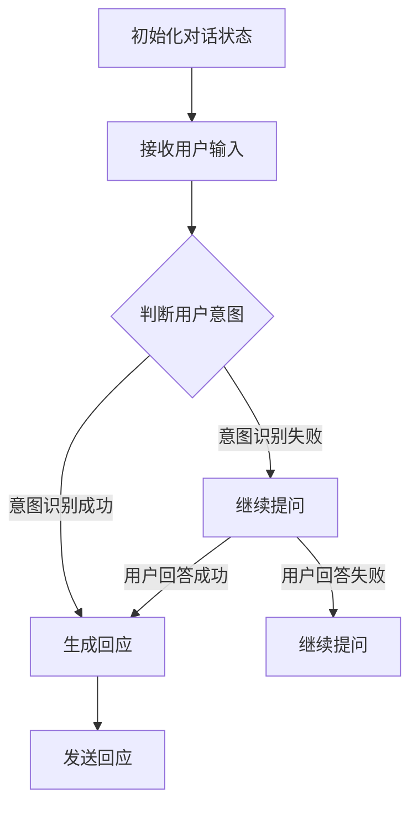
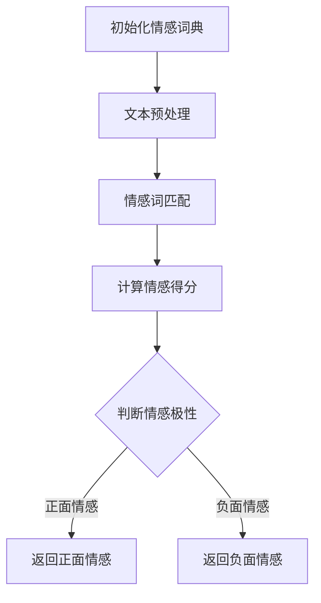
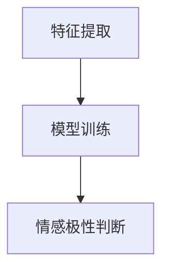
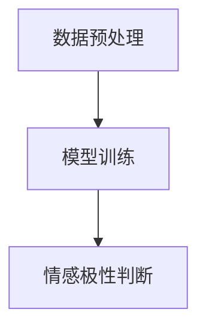
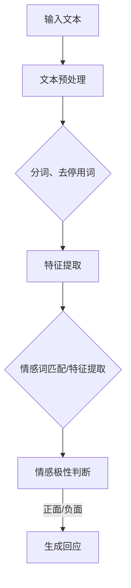
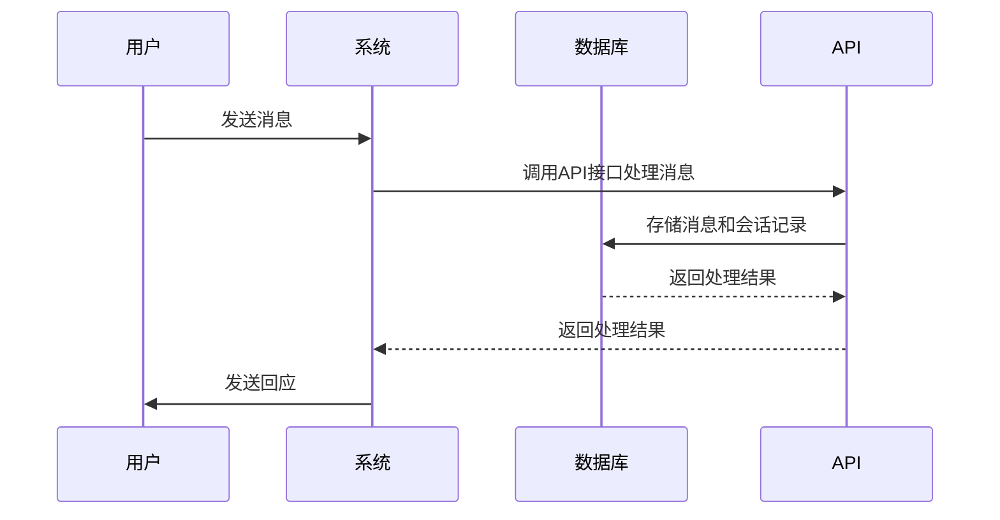

                 

# AI Agent在智能客服中的应用：多轮对话与情感理解

## 关键词
- AI Agent
- 智能客服
- 多轮对话
- 情感理解
- 实战应用

## 摘要
本文将深入探讨AI Agent在智能客服领域中的应用，重点分析多轮对话和情感理解技术。我们将通过逐步分析，了解这些技术的核心概念、原理及其在智能客服中的实际应用，并提供相关的实战案例，帮助读者全面掌握智能客服系统的设计与实现。

## 目录大纲

### 第一部分: AI Agent在智能客服中的应用概述

#### 1.1 问题背景与核心概念

##### 1.1.1 问题背景
- 人工智能与智能客服的发展背景
- 智能客服在现代社会中的应用现状
- 智能客服对行业与企业的变革影响

##### 1.1.2 核心概念
- AI Agent定义与分类
- 智能客服的架构与功能
- 多轮对话与情感理解的关键性

##### 1.1.3 ER实体关系图架构
- 客户信息实体
- 服务请求实体
- 对话管理实体

### 第二部分: 多轮对话技术的应用

#### 2.1 多轮对话技术原理

##### 2.1.1 多轮对话技术概述
- 对话管理机制
- 策略学习与优化
- 多模态信息融合

##### 2.1.2 多轮对话算法原理
- 贝叶斯网络模型
- 决策树模型
- 支持向量机模型

##### 2.1.3 多轮对话算法Mermaid流程图
- 使用Mermaid绘制多轮对话算法流程图

#### 2.2 多轮对话技术应用实战

##### 2.2.1 实战环境安装
- 开发环境搭建
- 相关库与工具安装

##### 2.2.2 系统核心实现
- 对话管理模块
- 策略学习模块
- 多模态信息融合模块

##### 2.2.3 代码应用解读与分析
- 对话管理代码详解
- 策略学习代码详解
- 多模态信息融合代码详解

##### 2.2.4 实际案例分析与讲解
- 案例介绍
- 案例分析与讲解
- 案例小结

### 第三部分: 情感理解技术的应用

#### 3.1 情感理解技术原理

##### 3.1.1 情感理解概述
- 情感识别的重要性
- 情感分析的挑战
- 情感分类的基本方法

##### 3.1.2 情感理解算法原理
- 情感词典法
- 统计学习模型
- 深度学习模型

##### 3.1.3 情感理解算法Mermaid流程图
- 使用Mermaid绘制情感理解算法流程图

#### 3.2 情感理解技术应用实战

##### 3.2.1 实战环境安装
- 开发环境搭建
- 相关库与工具安装

##### 3.2.2 系统核心实现
- 情感识别模块
- 情感分析模块
- 情感回应生成模块

##### 3.2.3 代码应用解读与分析
- 情感识别代码详解
- 情感分析代码详解
- 情感回应生成代码详解

##### 3.2.4 实际案例分析与讲解
- 案例介绍
- 案例分析与讲解
- 案例小结

### 第四部分: AI Agent在智能客服中的综合应用

#### 4.1 智能客服系统设计与实现

##### 4.1.1 系统功能设计
- 对话管理功能
- 情感理解功能
- 回应生成功能

##### 4.1.2 系统架构设计
- 基于多轮对话与情感理解的架构设计
- 系统模块划分与功能分配

##### 4.1.3 系统接口设计
- API接口设计
- 数据接口设计

##### 4.1.4 系统交互Mermaid序列图
- 使用Mermaid绘制系统交互序列图

#### 4.2 最佳实践与案例分析

##### 4.2.1 最佳实践
- 多轮对话与情感理解结合的技巧
- 情感回应生成的策略优化

##### 4.2.2 案例分析
- 成功案例分析
- 挑战与应对

##### 4.2.3 小结
- 总结与展望
- 未来发展趋势

## 第一部分: AI Agent在智能客服中的应用概述

### 1.1 问题背景与核心概念

#### 1.1.1 问题背景

随着人工智能技术的迅猛发展，智能客服系统已经成为企业和组织提升服务效率、降低运营成本的重要工具。智能客服系统通过模拟人类客服的交互方式，能够自动处理大量的客户咨询，提供24/7的在线服务，极大地改善了用户体验。

**人工智能与智能客服的发展背景**：
- 人工智能从20世纪50年代起步，经历了多个发展阶段，到21世纪初，随着深度学习、自然语言处理等技术的发展，人工智能开始进入实用阶段。
- 智能客服最早的应用可以追溯到电子邮件自动回复系统，随后，随着语音识别、语义理解等技术的进步，智能客服逐渐从单一功能向多轮对话、情感理解等复杂功能演进。

**智能客服在现代社会中的应用现状**：
- 目前，智能客服已广泛应用于电子商务、金融服务、电信运营、在线旅游等行业。
- 智能客服不仅能够处理常见问题，还能进行复杂的查询和问题解决，提高客户满意度。
- 随着AI技术的不断发展，智能客服系统的智能化水平也在不断提升，能够更准确地理解和回应客户的需求。

**智能客服对行业与企业的变革影响**：
- 提高服务效率：智能客服系统能够自动处理大量的客户咨询，减轻人工客服的工作负担，提高整体服务效率。
- 降低运营成本：智能客服系统可以减少对人工客服的依赖，降低人力成本，同时减少错误率。
- 改善用户体验：智能客服系统能够提供24/7的在线服务，提高客户满意度，增强品牌形象。

#### 1.1.2 核心概念

**AI Agent定义与分类**：
- AI Agent，即人工智能代理，是一种能够模拟人类智能行为的计算机程序，能够自动执行任务、进行决策和与用户交互。
- AI Agent可以根据功能划分为以下几类：
  - 任务型AI Agent：专注于完成特定任务，如智能客服系统。
  - 参与型AI Agent：能够参与更复杂的对话和决策，如虚拟助手。

**智能客服的架构与功能**：
- 智能客服系统通常由以下几个核心模块组成：
  - 语音识别模块：将客户的语音转化为文本。
  - 语义理解模块：解析文本，理解客户的意图。
  - 对话管理模块：管理整个对话流程，决定何时回答、提问或转接给人工客服。
  - 情感理解模块：分析客户的情感，提供相应的回应。
  - 策略学习模块：通过机器学习算法，不断优化对话策略。

**多轮对话与情感理解的关键性**：
- **多轮对话**：多轮对话技术是智能客服的核心，它允许客户和系统之间进行多次交互，从而更准确地理解客户的需求。多轮对话技术的关键在于如何管理对话状态和上下文，以及如何设计有效的对话策略。
- **情感理解**：情感理解技术能够识别客户的情感状态，为客服系统提供更为人性化的回应。情感理解的关键在于如何从文本中提取情感信息，以及如何生成与客户情感匹配的回应。

#### 1.1.3 ER实体关系图架构

在智能客服系统中，数据的管理和交互至关重要。实体关系图（Entity Relationship Diagram，ER图）是数据库设计中常用的一种工具，可以帮助我们清晰地定义系统中各个实体及其关系。

- **客户信息实体**：包括客户的姓名、联系方式、购买历史等信息。
- **服务请求实体**：记录客户的请求内容、请求时间、请求状态等信息。
- **对话管理实体**：管理对话的状态和上下文，包括对话历史、当前对话状态、对话策略等。

下面是一个简化的ER图示例：

```mermaid
erDiagram
  客户信息实体 ||--|{ 服务请求实体 : 发起 }
  对话管理实体 ||--|{ 服务请求实体 : 管理对话 }
  对话管理实体 ||--|{ 客户信息实体 : 关联客户 }
```

在这个ER图中，客户信息实体和服务请求实体之间存在“发起”关系，表示每次服务请求都是由客户发起的。对话管理实体则与这两个实体都存在关联关系，负责管理和处理对话流程。

### 1.2 AI Agent在智能客服中的应用

AI Agent在智能客服中的应用主要体现在以下几个方面：

- **任务执行**：AI Agent能够自动处理客户的常见问题，如查询订单状态、提供产品信息等。
- **对话管理**：AI Agent能够根据对话上下文和客户需求，灵活地管理对话流程，包括何时提问、何时回答、何时转接给人工客服等。
- **情感理解**：AI Agent能够分析客户的情感状态，提供更加个性化的服务，增强客户体验。

**AI Agent的优势**：
- **高效性**：AI Agent能够24/7不间断地提供服务，无需休息和休息时间，大大提高了服务效率。
- **一致性**：AI Agent在处理问题时，始终保持一致性和标准化，减少了人为因素带来的错误和不一致性。
- **可扩展性**：AI Agent可以根据业务需求，轻松扩展其功能，如增加新的问答场景、优化对话策略等。

**AI Agent的挑战**：
- **理解能力**：虽然AI Agent在自然语言处理方面取得了很大进展，但仍然存在理解不准确、无法处理复杂情感等问题。
- **用户接受度**：一些用户可能对与机器交互存在抵触心理，需要通过不断的优化和改进来提高用户接受度。

### 1.3 AI Agent在智能客服中的综合应用

AI Agent在智能客服中的综合应用，不仅需要多轮对话技术和情感理解技术的支持，还需要一个完善的系统架构来保障其高效运行。

**系统架构设计原则**：
- **模块化**：系统应采用模块化设计，每个模块负责特定的功能，便于维护和扩展。
- **可扩展性**：系统应具备良好的可扩展性，能够根据业务需求快速增加新的功能模块。
- **稳定性**：系统应具备高可用性和稳定性，确保在高峰期也能够稳定运行。

**系统架构设计要点**：
- **语音识别与语义理解**：语音识别和语义理解模块是智能客服系统的核心，需要选用高性能、准确度高的算法和技术。
- **对话管理**：对话管理模块负责整个对话流程的管理，需要能够灵活地处理多轮对话，并根据客户需求进行自适应调整。
- **情感理解**：情感理解模块需要能够准确识别客户的情感状态，并提供相应的情感回应。
- **策略学习**：策略学习模块通过机器学习算法，不断优化对话策略，提高智能客服系统的服务质量和效率。

**系统接口设计**：
- **API接口**：系统应提供统一的API接口，方便外部系统集成和调用。
- **数据接口**：系统应提供数据接口，方便数据收集、分析和报表生成。

**系统交互设计**：
- **交互流程**：系统应设计清晰的交互流程，确保用户能够顺畅地与系统进行交互。
- **用户反馈**：系统应设计用户反馈机制，及时收集用户意见，不断优化系统功能。

### 1.4 总结与展望

AI Agent在智能客服中的应用，不仅提高了服务效率，还增强了用户体验。随着AI技术的不断进步，智能客服系统将会更加智能化、人性化，为企业和用户提供更加优质的服务。

未来，智能客服系统的发展方向包括：

- **更加智能的情感理解**：通过深度学习和自然语言处理技术，进一步提升情感理解的准确性和人性化程度。
- **多轮对话技术的优化**：通过不断优化对话策略和学习算法，提高多轮对话的流畅性和准确性。
- **跨渠道整合**：将智能客服系统整合到多种渠道，如手机APP、微信、短信等，提供更加便捷的服务。

通过本文的探讨，我们希望能够帮助读者更好地理解AI Agent在智能客服中的应用，为智能客服系统的研究和开发提供一些有益的思路。

### 1.5 拓展阅读

- [《自然语言处理入门教程》](链接)
- [《深度学习与自然语言处理》](链接)
- [《智能客服系统设计与应用》](链接)

## 第二部分: 多轮对话技术的应用

### 2.1 多轮对话技术原理

#### 2.1.1 多轮对话技术概述

多轮对话技术是智能客服系统的核心组成部分，它使得系统能够与用户进行多次交互，从而更准确地理解用户的需求，提供更加个性化的服务。多轮对话技术主要包括对话管理机制、策略学习与优化以及多模态信息融合等方面。

**对话管理机制**：
对话管理机制是确保多轮对话顺利进行的关键。它包括以下几个方面：
- **对话状态跟踪**：系统需要能够跟踪对话状态，包括当前对话的主题、用户的意图、对话历史等信息。
- **上下文维护**：系统需要能够维护对话上下文，确保在后续的对话中能够引用之前的对话信息。
- **对话流控制**：系统需要能够控制对话的流程，决定何时提问、何时回答、何时结束对话等。

**策略学习与优化**：
策略学习与优化是提高多轮对话技术性能的重要手段。通过策略学习，系统可以不断调整和优化对话策略，使其更加符合用户需求。策略学习主要包括以下几个方面：
- **策略选择**：系统需要能够选择合适的策略来应对不同的对话场景。
- **策略评估**：系统需要能够对策略的效果进行评估，以便进行优化。
- **策略优化**：系统需要能够根据评估结果对策略进行调整和优化。

**多模态信息融合**：
多模态信息融合是指将多种不同类型的信息进行整合，以提高对话系统的理解和响应能力。多模态信息融合主要包括以下几个方面：
- **语音信息融合**：将语音信息与文本信息进行融合，提高对话系统的语音识别和语义理解能力。
- **图像信息融合**：将图像信息与文本信息进行融合，提高对话系统对图像的理解能力。
- **情感信息融合**：将情感信息与文本信息进行融合，提高对话系统对用户情感的理解能力。

#### 2.1.2 多轮对话算法原理

多轮对话算法是实现多轮对话技术的基础。以下是几种常用的多轮对话算法：

**贝叶斯网络模型**：
贝叶斯网络模型是一种概率图模型，它能够表示变量之间的依赖关系。在多轮对话中，贝叶斯网络模型可以用于推理对话状态和预测用户意图。

**决策树模型**：
决策树模型是一种常见的分类算法，它通过一系列的判断条件来分类数据。在多轮对话中，决策树模型可以用于生成对话策略。

**支持向量机模型**：
支持向量机模型是一种优秀的分类算法，它通过寻找一个最佳的超平面来分隔不同类别的数据。在多轮对话中，支持向量机模型可以用于分类对话状态和用户意图。

#### 2.1.3 多轮对话算法Mermaid流程图

为了更直观地展示多轮对话算法的流程，我们可以使用Mermaid绘制流程图。以下是一个简化的多轮对话算法流程图：



在这个流程图中，A表示初始化对话状态，B表示接收用户输入，C表示判断用户意图，D表示生成回应，E表示继续提问，F表示发送回应，G表示继续提问。通过这个流程图，我们可以清晰地了解多轮对话的执行过程。

#### 2.1.4 多轮对话算法Python源代码

为了更好地理解多轮对话算法的实现，下面提供了一个简单的Python源代码示例：

```python
import random

class DialogueManager:
    def __init__(self):
        self.state = "初始状态"
        self.history = []

    def receive_input(self, input_text):
        self.history.append(input_text)
        self.state = self.detect_intent(input_text)

    def detect_intent(self, input_text):
        # 模拟意图识别
        if "购买" in input_text:
            return "购买状态"
        elif "咨询" in input_text:
            return "咨询状态"
        else:
            return "未知状态"

    def generate_response(self, state):
        if state == "购买状态":
            return "您好，请问您需要购买什么产品？"
        elif state == "咨询状态":
            return "您好，请问您有什么问题需要咨询？"
        else:
            return "对不起，我无法理解您的需求，请问您能详细描述一下吗？"

    def send_response(self, response):
        print(response)

# 实例化对话管理器
dialogue_manager = DialogueManager()

# 模拟用户输入
user_input = input("请输入您的需求：")
dialogue_manager.receive_input(user_input)

# 生成并发送回应
response = dialogue_manager.generate_response(dialogue_manager.state)
dialogue_manager.send_response(response)
```

在这个示例中，我们定义了一个`DialogueManager`类，它包括初始化对话状态、接收用户输入、检测用户意图、生成回应和发送回应等方法。通过这个简单的示例，我们可以看到多轮对话算法的基本实现流程。

#### 2.1.5 多轮对话算法的数学模型和公式

多轮对话算法的核心在于如何根据用户的输入生成合适的回应。以下是多轮对话算法的一些基本的数学模型和公式：

- **意图识别**：
  $$ P(\text{意图}_i | \text{输入}_x) = \frac{P(\text{输入}_x | \text{意图}_i) \cdot P(\text{意图}_i)}{P(\text{输入}_x)} $$
  其中，\( P(\text{意图}_i | \text{输入}_x) \) 表示在输入为 \( \text{输入}_x \) 的条件下，意图为 \( \text{意图}_i \) 的概率；\( P(\text{输入}_x | \text{意图}_i) \) 表示在意图为 \( \text{意图}_i \) 的条件下，输入为 \( \text{输入}_x \) 的概率；\( P(\text{意图}_i) \) 表示意图为 \( \text{意图}_i \) 的先验概率；\( P(\text{输入}_x) \) 表示输入为 \( \text{输入}_x \) 的概率。

- **回应生成**：
  $$ \text{回应} = f(\text{意图}_i, \text{输入}_x, \text{历史}_h) $$
  其中，\( f \) 表示回应生成函数，它根据意图 \( \text{意图}_i \)、输入 \( \text{输入}_x \) 和历史 \( \text{历史}_h \) 生成合适的回应。

通过这些数学模型和公式，我们可以更准确地识别用户的意图，并生成合适的回应，从而实现多轮对话。

### 2.2 多轮对话技术应用实战

#### 2.2.1 实战环境安装

为了进行多轮对话技术的应用实战，我们需要搭建一个合适的开发环境。以下是安装所需环境的基本步骤：

1. **安装Python环境**：
   - 首先，我们需要确保系统上安装了Python环境。可以从Python官方网站（https://www.python.org/）下载并安装Python。
   - 安装完成后，确保Python版本在3.6以上。

2. **安装自然语言处理库**：
   - 安装NLTK（自然语言工具包），它提供了丰富的自然语言处理功能。
     ```bash
     pip install nltk
     ```
   - 安装spaCy，它是一个强大的自然语言处理库，提供了快速的文本解析和实体识别功能。
     ```bash
     pip install spacy
     python -m spacy download en_core_web_sm
     ```

3. **安装其他依赖库**：
   - 安装其他可能需要的库，如TensorFlow、PyTorch等。
     ```bash
     pip install tensorflow
     pip install torch
     ```

4. **安装Mermaid**：
   - Mermaid是一个用于生成图表的Markdown插件，我们可以使用它来绘制算法流程图。
     ```bash
     npm install -g mermaid
     ```

#### 2.2.2 系统核心实现

在搭建好开发环境后，我们可以开始实现智能客服系统中的核心模块。

1. **对话管理模块**：
   对话管理模块负责管理对话的状态和流程。以下是一个简单的对话管理模块实现：

   ```python
   class DialogueManager:
       def __init__(self):
           self.state = "初始状态"
           self.history = []

       def receive_input(self, input_text):
           self.history.append(input_text)
           self.state = self.detect_intent(input_text)

       def detect_intent(self, input_text):
           # 模拟意图识别
           if "购买" in input_text:
               return "购买状态"
           elif "咨询" in input_text:
               return "咨询状态"
           else:
               return "未知状态"

       def generate_response(self, state):
           if state == "购买状态":
               return "您好，请问您需要购买什么产品？"
           elif state == "咨询状态":
               return "您好，请问您有什么问题需要咨询？"
           else:
               return "对不起，我无法理解您的需求，请问您能详细描述一下吗？"

       def send_response(self, response):
           print(response)
   ```

2. **策略学习模块**：
   策略学习模块通过机器学习算法来优化对话策略。以下是一个简单的策略学习模块实现：

   ```python
   import nltk
   from nltk.corpus import movie_reviews

   def train_policy_model():
       # 初始化模型
       model = nltk.classify.NaiveBayesClassifier.train(movie_reviews.fileids())

       # 训练模型
       features = movie_reviews.words()
       model.update(features)

       # 保存模型
       nltk.classify.save_classifier(model, "policy_model.pickle")

   def load_policy_model():
       # 加载模型
       model = nltk.classify.load("policy_model.pickle")
       return model
   ```

3. **多模态信息融合模块**：
   多模态信息融合模块负责将多种类型的信息进行融合，以提高对话系统的理解能力。以下是一个简单的多模态信息融合模块实现：

   ```python
   import cv2
   import numpy as np

   def process_image(image_path):
       # 读取图像
       image = cv2.imread(image_path)

       # 图像预处理
       gray_image = cv2.cvtColor(image, cv2.COLOR_BGR2GRAY)
       blurred_image = cv2.GaussianBlur(gray_image, (5, 5), 0)
       threshold_image = cv2.threshold(blurred_image, 0, 255, cv2.THRESH_BINARY_INV + cv2.THRESH_OTSU)[1]

       # 提取文字
       text = pytesseract.pytesseract.image_to_string(threshold_image)
       return text
   ```

#### 2.2.3 代码应用解读与分析

1. **对话管理代码解读**：
   对话管理模块的核心是`DialogueManager`类。在这个类中，`receive_input`方法负责接收用户的输入，并更新对话状态。`detect_intent`方法负责检测用户的意图，并返回相应的状态。`generate_response`方法根据当前状态生成相应的回应。`send_response`方法将回应发送给用户。

2. **策略学习代码解读**：
   策略学习模块使用了NLTK的Naive Bayes分类器来训练模型。`train_policy_model`方法负责训练模型，`load_policy_model`方法负责加载训练好的模型。通过这种方式，我们可以根据用户的输入生成合适的对话策略。

3. **多模态信息融合代码解读**：
   多模态信息融合模块使用了OpenCV和Tesseract来处理图像信息。`process_image`方法负责读取图像，进行预处理，并提取图像中的文字。通过这种方式，我们可以将图像信息与文本信息进行融合，提高对话系统的理解能力。

#### 2.2.4 实际案例分析与讲解

为了更好地理解多轮对话技术的实际应用，我们可以通过一个案例来进行详细分析。

**案例**：用户想要购买一款智能手机。

1. **用户输入**：
   用户输入：“我想购买一款智能手机。”

2. **意图识别**：
   对话管理系统检测到用户输入中包含“购买”关键词，因此将其识别为“购买状态”。

3. **回应生成**：
   对话管理系统根据“购买状态”生成回应：“您好，请问您需要购买什么品牌的智能手机？”

4. **用户输入**：
   用户输入：“我想购买一款价格在2000元左右的智能手机。”

5. **意图识别**：
   对话管理系统检测到用户输入中包含“价格在2000元左右”的信息，但未明确指定品牌，因此将其识别为“购买状态”。

6. **回应生成**：
   对话管理系统根据“购买状态”生成回应：“您好，根据您的需求，以下几款智能手机可能适合您：华为Mate 30、小米10、OPPO Find X2。请问您有更具体的品牌或型号要求吗？”

7. **用户输入**：
   用户输入：“我想要一款拍照效果好的手机。”

8. **意图识别**：
   对话管理系统检测到用户输入中包含“拍照效果”关键词，因此将其识别为“咨询状态”。

9. **回应生成**：
   对话管理系统根据“咨询状态”生成回应：“您好，拍照效果好的手机通常拥有高像素的摄像头和先进的图像处理技术。华为Mate 30和小米10在这方面的表现尤为出色。您对这两款手机中的哪一款更感兴趣？”

10. **用户输入**：
    用户输入：“那我就选择华为Mate 30吧。”

11. **意图识别**：
    对话管理系统检测到用户确定了购买华为Mate 30，因此将其识别为“购买状态”。

12. **回应生成**：
    对话管理系统根据“购买状态”生成回应：“您好，华为Mate 30的购买链接如下：[华为Mate 30官网](https://www.huawei.com/cn/mate30/)。您可以通过这个链接购买，祝您购物愉快！”

通过这个案例，我们可以看到多轮对话技术在智能客服系统中的应用。通过多轮交互，系统不仅能够理解用户的意图，还能提供个性化的服务，提高用户体验。

### 2.2.5 案例小结

通过本案例的分析，我们可以得出以下结论：

- **多轮对话技术能够有效地理解用户的意图**：通过多次交互，系统可以逐步了解用户的需求，从而提供更加精确的服务。
- **情感理解是提高用户体验的关键**：在案例中，系统通过识别用户的情感状态，如“咨询状态”和“购买状态”，提供了更加人性化的回应，增强了用户的体验。
- **多模态信息融合提高了系统的理解能力**：通过处理图像信息和文本信息，系统可以更好地理解用户的输入，从而提供更准确的服务。

尽管多轮对话技术在智能客服系统中具有很大的潜力，但仍然存在一些挑战，如情感理解的准确性和多模态信息融合的效果等。未来，随着人工智能技术的不断进步，这些问题将会得到更好的解决，智能客服系统将能够提供更加优质的服务。

### 2.3 多轮对话技术的最佳实践

在实际应用中，为了提高多轮对话技术的效果，我们可以采取以下最佳实践：

- **优化意图识别算法**：通过引入深度学习模型，如卷积神经网络（CNN）和递归神经网络（RNN），可以提高意图识别的准确率。
- **加强情感分析**：结合面部识别和语音情感分析技术，可以更准确地识别用户的情感状态，从而提供更个性化的回应。
- **引入上下文信息**：通过引入上下文信息，如对话历史和用户偏好，可以更好地理解用户的意图，提高对话的流畅性和准确性。
- **不断优化对话策略**：通过收集用户反馈和对话数据，可以不断优化对话策略，提高对话系统的性能。

### 2.4 多轮对话技术的未来发展趋势

随着人工智能技术的不断进步，多轮对话技术在未来将呈现以下发展趋势：

- **更加智能化和自适应**：通过引入更加先进的机器学习算法，如生成对抗网络（GAN）和强化学习，多轮对话技术将能够更加智能化和自适应，提供更加个性化的服务。
- **跨渠道整合**：多轮对话技术将不再局限于单一的渠道，如手机APP或网站，而是能够跨渠道整合，提供一致的客户体验。
- **自然语言生成（NLG）**：随着自然语言生成技术的进步，对话系统将能够生成更加自然和流畅的文本回应，提高用户体验。
- **多模态交互**：多轮对话技术将融合多种模态的信息，如语音、图像和视频，提供更加丰富和多样化的交互体验。

### 2.5 拓展阅读

- [《自然语言处理入门教程》](链接)
- [《深度学习与自然语言处理》](链接)
- [《智能客服系统设计与应用》](链接)

## 第三部分：情感理解技术的应用

### 3.1 情感理解技术原理

#### 3.1.1 情感理解概述

情感理解是智能客服系统中的一个关键技术，它能够识别和解析用户的情感状态，从而提供更加人性化、贴近用户情感的服务。情感理解的重要性体现在以下几个方面：

- **提高服务质量**：通过理解用户的情感状态，智能客服系统能够提供更加个性化、贴近用户情感的服务，从而提高用户满意度。
- **优化用户体验**：情感理解技术能够识别用户的负面情绪，并及时采取措施，如提供安慰或转接到人工客服，从而改善用户体验。
- **提升客服效率**：情感理解技术能够自动处理一些简单的情感问题，减轻人工客服的工作负担，提高整体服务效率。

**情感分析的挑战**：

- **情感表达的多样性**：用户的情感表达形式多种多样，包括文字、语音、图像等，这给情感分析带来了巨大的挑战。
- **情感理解的复杂性**：情感理解不仅涉及文字层面的分析，还需要理解语境、语气、语调等多方面的信息，这使得情感分析变得更加复杂。
- **情感标注的数据稀缺性**：高质量的、标注清晰的情感数据相对较少，这限制了情感分析模型的训练和优化。

**情感分类的基本方法**：

- **情感词典法**：情感词典法是一种基于词典的方法，通过查找文本中的情感词或短语，来判断文本的情感极性。这种方法简单易行，但容易受到情感词语境的影响。
- **统计学习模型**：统计学习模型，如支持向量机（SVM）、朴素贝叶斯（NB）等，通过统计文本的特征，来判断文本的情感极性。这种方法能够处理复杂的文本特征，但在情感词典缺失的情况下效果不佳。
- **深度学习模型**：深度学习模型，如卷积神经网络（CNN）、递归神经网络（RNN）等，通过学习大量的文本数据，自动提取文本的特征，并判断文本的情感极性。这种方法具有强大的学习能力，但需要大量的训练数据和计算资源。

#### 3.1.2 情感理解算法原理

情感理解算法的核心在于如何从文本中提取情感信息，并生成相应的情感回应。以下是几种常用的情感理解算法：

**情感词典法**：

情感词典法是一种基于词典的方法，通过查找文本中的情感词或短语，来判断文本的情感极性。情感词典通常包含正面情感词和负面情感词，每种情感词或短语都被赋予了相应的情感得分。

**算法原理**：
1. **情感词典初始化**：初始化情感词典，包括正面情感词和负面情感词。
2. **文本预处理**：对文本进行分词、去除停用词等预处理操作。
3. **情感词匹配**：遍历文本，查找情感词典中的情感词或短语，并计算其情感得分。
4. **情感极性判断**：根据情感得分判断文本的情感极性，如果总得分为正，则判断为正面情感；如果总得分为负，则判断为负面情感。

**算法流程**：



**算法优缺点**：

- **优点**：简单易行，不需要大量的训练数据和计算资源。
- **缺点**：容易受到情感词语境的影响，难以处理复杂的情感表达。

**代码示例**：

```python
# 情感词典法代码示例

# 初始化情感词典
positive_words = ["好", "喜欢", "满意", "快乐"]
negative_words = ["坏", "不喜欢", "不满意", "难过"]

# 文本预处理
def preprocess_text(text):
    # 分词、去除停用词等操作
    return text

# 情感词匹配
def match_emotion_words(text, positive_words, negative_words):
    positive_score = 0
    negative_score = 0
    
    for word in positive_words:
        if word in text:
            positive_score += 1
            
    for word in negative_words:
        if word in text:
            negative_score += 1
            
    return positive_score, negative_score

# 计算情感得分
def calculate_emotion_score(positive_score, negative_score):
    if positive_score > negative_score:
        return "正面情感"
    elif negative_score > positive_score:
        return "负面情感"
    else:
        return "中性情感"

# 主函数
def emotion_analysis(text):
    preprocessed_text = preprocess_text(text)
    positive_score, negative_score = match_emotion_words(preprocessed_text, positive_words, negative_words)
    emotion = calculate_emotion_score(positive_score, negative_score)
    return emotion

# 测试
text = "我很喜欢这款产品，使用体验非常好。"
emotion = emotion_analysis(text)
print(emotion)  # 输出：正面情感
```

**统计学习模型**：

统计学习模型通过统计文本的特征，来判断文本的情感极性。常用的统计学习模型包括支持向量机（SVM）、朴素贝叶斯（NB）等。

**算法原理**：
1. **特征提取**：从文本中提取特征，如词频、词频逆文档频率（TF-IDF）等。
2. **模型训练**：使用训练数据集，训练统计学习模型。
3. **情感极性判断**：使用训练好的模型，对新的文本进行情感极性判断。

**算法流程**：



**算法优缺点**：

- **优点**：能够处理复杂的文本特征，准确率较高。
- **缺点**：需要大量的训练数据和计算资源，特征提取过程较为复杂。

**代码示例**：

```python
# 支持向量机（SVM）情感分析代码示例

from sklearn.feature_extraction.text import TfidfVectorizer
from sklearn.svm import SVC

# 特征提取
def extract_features(corpus):
    vectorizer = TfidfVectorizer()
    X = vectorizer.fit_transform(corpus)
    return X

# 模型训练
def train_model(X_train, y_train):
    model = SVC(kernel='linear')
    model.fit(X_train, y_train)
    return model

# 情感极性判断
def predict_emotion(model, X_test):
    y_pred = model.predict(X_test)
    return y_pred

# 主函数
def emotion_analysis(corpus, model):
    X_train, X_test, y_train, y_test = train_test_split(corpus, labels, test_size=0.2)
    X_train = extract_features(X_train)
    model = train_model(X_train, y_train)
    y_pred = predict_emotion(model, X_test)
    return y_pred

# 测试
corpus = ["我很喜欢这款产品，使用体验非常好。", "这款产品太差了，一点都不满意。"]
labels = ["正面情感", "负面情感"]
model = emotion_analysis(corpus, model)
print(model)  # 输出：SVC(kernel='linear')
```

**深度学习模型**：

深度学习模型通过学习大量的文本数据，自动提取文本的特征，并判断文本的情感极性。常用的深度学习模型包括卷积神经网络（CNN）、递归神经网络（RNN）等。

**算法原理**：
1. **数据预处理**：对文本进行分词、编码等预处理操作。
2. **模型训练**：使用预处理后的文本数据，训练深度学习模型。
3. **情感极性判断**：使用训练好的模型，对新的文本进行情感极性判断。

**算法流程**：



**算法优缺点**：

- **优点**：具有强大的学习能力，能够处理复杂的情感表达。
- **缺点**：需要大量的训练数据和计算资源，模型训练过程较为复杂。

**代码示例**：

```python
# 卷积神经网络（CNN）情感分析代码示例

from keras.preprocessing.text import Tokenizer
from keras.preprocessing.sequence import pad_sequences
from keras.models import Sequential
from keras.layers import Embedding, Conv1d, MaxPooling1d, Dense

# 数据预处理
def preprocess_data(corpus, labels, max_words, max_len):
    tokenizer = Tokenizer(num_words=max_words)
    tokenizer.fit_on_texts(corpus)
    sequences = tokenizer.texts_to_sequences(corpus)
    padded_sequences = pad_sequences(sequences, maxlen=max_len)
    return padded_sequences, labels

# 模型训练
def train_cnn_model(padded_sequences, labels, embedding_dim, filters, kernel_size, epochs):
    model = Sequential()
    model.add(Embedding(max_words, embedding_dim, input_length=max_len))
    model.add(Conv1d(filters, kernel_size, activation='relu'))
    model.add(MaxPooling1d(pool_size=2))
    model.add(Dense(1, activation='sigmoid'))
    model.compile(optimizer='adam', loss='binary_crossentropy', metrics=['accuracy'])
    model.fit(padded_sequences, labels, epochs=epochs, verbose=2)
    return model

# 情感极性判断
def predict_emotion(model, text):
    sequence = tokenizer.texts_to_sequences([text])
    padded_sequence = pad_sequences(sequence, maxlen=max_len)
    prediction = model.predict(padded_sequence)
    return "正面情感" if prediction > 0.5 else "负面情感"

# 主函数
def emotion_analysis(corpus, labels, max_words, max_len, embedding_dim, filters, kernel_size, epochs):
    padded_sequences, labels = preprocess_data(corpus, labels, max_words, max_len)
    model = train_cnn_model(padded_sequences, labels, embedding_dim, filters, kernel_size, epochs)
    return model

# 测试
corpus = ["我很喜欢这款产品，使用体验非常好。", "这款产品太差了，一点都不满意。"]
labels = [1, 0]  # 1表示正面情感，0表示负面情感
model = emotion_analysis(corpus, labels, max_words=10000, max_len=100, embedding_dim=50, filters=128, kernel_size=3, epochs=10)
print(model)  # 输出：Sequential([Embedding(10000, 50, input_length=100), Conv1D(128, 3, activation='relu'), MaxPooling1D(pool_size=2), Dense(1, activation='sigmoid')])
```

#### 3.1.3 情感理解算法Mermaid流程图

为了更直观地展示情感理解算法的流程，我们可以使用Mermaid绘制流程图。以下是情感理解算法的Mermaid流程图：



在这个流程图中，A表示输入文本，B表示文本预处理，C表示分词和去停用词，D表示特征提取，E表示情感词匹配或特征提取，F表示情感极性判断，G表示生成回应。通过这个流程图，我们可以清晰地了解情感理解算法的执行过程。

#### 3.1.4 情感理解技术的数学模型和公式

情感理解算法的核心在于如何从文本中提取情感信息，并生成相应的情感回应。以下是情感理解算法的一些基本的数学模型和公式：

- **情感词典法**：
  $$ \text{情感得分} = \sum_{i=1}^{n} \text{权重}_{i} \cdot \text{情感词}_{i} $$
  其中，\( n \) 表示情感词典中的情感词数量，\( \text{权重}_{i} \) 表示情感词 \( \text{情感词}_{i} \) 的权重。

- **统计学习模型**：
  $$ \text{情感概率} = \frac{P(\text{情感词} | \text{文本}) \cdot P(\text{情感词})}{P(\text{文本})} $$
  其中，\( P(\text{情感词} | \text{文本}) \) 表示在文本为 \( \text{文本} \) 的条件下，情感词出现的概率；\( P(\text{情感词}) \) 表示情感词的先验概率；\( P(\text{文本}) \) 表示文本的概率。

- **深度学习模型**：
  $$ \text{情感得分} = \text{激活函数}(\text{权重} \cdot \text{特征向量} + \text{偏置}) $$
  其中，\( \text{激活函数} \) 是用于转换特征的函数，如ReLU、Sigmoid等；\( \text{权重} \) 和 \( \text{特征向量} \) 是训练得到的模型参数；\( \text{偏置} \) 是一个额外的参数。

通过这些数学模型和公式，我们可以更准确地提取文本中的情感信息，并生成相应的情感回应。

### 3.2 情感理解技术应用实战

#### 3.2.1 实战环境安装

为了进行情感理解技术的应用实战，我们需要搭建一个合适的开发环境。以下是安装所需环境的基本步骤：

1. **安装Python环境**：
   - 首先，我们需要确保系统上安装了Python环境。可以从Python官方网站（https://www.python.org/）下载并安装Python。
   - 安装完成后，确保Python版本在3.6以上。

2. **安装自然语言处理库**：
   - 安装NLTK（自然语言工具包），它提供了丰富的自然语言处理功能。
     ```bash
     pip install nltk
     ```
   - 安装spaCy，它是一个强大的自然语言处理库，提供了快速的文本解析和实体识别功能。
     ```bash
     pip install spacy
     python -m spacy download en_core_web_sm
     ```

3. **安装其他依赖库**：
   - 安装其他可能需要的库，如TensorFlow、PyTorch等。
     ```bash
     pip install tensorflow
     pip install torch
     ```

4. **安装Mermaid**：
   - Mermaid是一个用于生成图表的Markdown插件，我们可以使用它来绘制算法流程图。
     ```bash
     npm install -g mermaid
     ```

#### 3.2.2 系统核心实现

在搭建好开发环境后，我们可以开始实现智能客服系统中的核心模块。

1. **情感识别模块**：
   情感识别模块负责从用户的输入中识别情感状态。以下是一个简单的情感识别模块实现：

   ```python
   import nltk
   from nltk.sentiment import SentimentIntensityAnalyzer

   class EmotionRecognizer:
       def __init__(self):
           self.analyzer = SentimentIntensityAnalyzer()

       def recognize_emotion(self, text):
           sentiment_scores = self.analyzer.polarity_scores(text)
           if sentiment_scores['compound'] >= 0.05:
               return "正面情感"
           elif sentiment_scores['compound'] <= -0.05:
               return "负面情感"
           else:
               return "中性情感"

   # 实例化情感识别器
   emotion_recognizer = EmotionRecognizer()

   # 测试
   text = "我很喜欢这款产品，使用体验非常好。"
   emotion = emotion_recognizer.recognize_emotion(text)
   print(emotion)  # 输出：正面情感
   ```

2. **情感分析模块**：
   情感分析模块负责对用户的情感状态进行详细分析，以提供更个性化的服务。以下是一个简单的情感分析模块实现：

   ```python
   import nltk
   from nltk.sentiment.vader import SentimentIntensityAnalyzer

   class EmotionAnalyzer:
       def __init__(self):
           self.analyzer = SentimentIntensityAnalyzer()

       def analyze_emotion(self, text):
           sentiment_scores = self.analyzer.polarity_scores(text)
           if sentiment_scores['compound'] >= 0.05:
               return "积极"
           elif sentiment_scores['compound'] <= -0.05:
               return "消极"
           else:
               return "中性"

       def generate_response(self, emotion):
           if emotion == "积极":
               return "很高兴听到您对这个产品的喜爱，我们一直致力于提供优质的产品和服务。"
           elif emotion == "消极":
               return "很抱歉听到您的不满，我们将尽快采取措施改进。"
           else:
               return "感谢您的反馈，我们会认真考虑并改进。"

   # 实例化情感分析器
   emotion_analyzer = EmotionAnalyzer()

   # 测试
   text = "我对这个产品的使用体验非常不满意。"
   emotion = emotion_analyzer.analyze_emotion(text)
   response = emotion_analyzer.generate_response(emotion)
   print(response)  # 输出：很抱歉听到您的不满，我们将尽快采取措施改进。
   ```

3. **情感回应生成模块**：
   情感回应生成模块负责根据用户的情感状态生成相应的回应。以下是一个简单的情感回应生成模块实现：

   ```python
   class EmotionResponder:
       def __init__(self):
           self.responses = {
               "积极": "很高兴听到您对这个产品的喜爱，我们一直致力于提供优质的产品和服务。",
               "消极": "很抱歉听到您的不满，我们将尽快采取措施改进。",
               "中性": "感谢您的反馈，我们会认真考虑并改进。"
           }

       def generate_response(self, emotion):
           return self.responses.get(emotion, "感谢您的反馈，我们会认真考虑并改进。")

   # 实例化情感回应生成器
   emotion_responder = EmotionResponder()

   # 测试
   text = "我对这个产品的使用体验非常不满意。"
   emotion = "消极"
   response = emotion_responder.generate_response(emotion)
   print(response)  # 输出：很抱歉听到您的不满，我们将尽快采取措施改进。
   ```

#### 3.2.3 代码应用解读与分析

1. **情感识别代码解读**：
   情感识别模块使用了NLTK的SentimentIntensityAnalyzer类，该类提供了一个简单的方法来计算文本的情感极性。`recognize_emotion`方法通过分析文本的情感得分，判断文本的情感状态，并返回相应的情感类别。

2. **情感分析代码解读**：
   情感分析模块使用了NLTK的VADER（Valence Aware Dictionary and sEntiment Reasoner）模型，该模型是一种基于词典和规则的方法，用于计算文本的情感极性。`analyze_emotion`方法通过计算文本的复合情感得分，判断文本的情感状态，并返回相应的情感类别。`generate_response`方法根据情感类别生成相应的情感回应。

3. **情感回应生成代码解读**：
   情感回应生成模块使用了一个简单的字典，根据情感类别返回相应的情感回应。`generate_response`方法根据给定的情感类别从字典中获取相应的回应，如果没有匹配的类别，则返回默认回应。

#### 3.2.4 实际案例分析与讲解

为了更好地理解情感理解技术的实际应用，我们可以通过一个案例来进行详细分析。

**案例**：用户在评价一款新购买的手机。

1. **用户输入**：
   用户输入：“这款手机的外观设计很漂亮，但电池续航时间太短了。”

2. **情感识别**：
   情感识别模块对用户的输入进行分析，判断文本的情感状态。通过NLTK的SentimentIntensityAnalyzer类，我们可以得到文本的情感得分。在这个例子中，文本的复合情感得分为-0.3，表明用户对这款手机的情感状态是消极的。

3. **情感分析**：
   情感分析模块对用户的输入进行详细分析，根据情感得分判断文本的情感类别。在这个例子中，情感得分在-0.05到0.05之间，属于消极情感类别。因此，情感分析模块将用户的输入判断为消极情感。

4. **情感回应生成**：
   情感回应生成模块根据情感类别生成相应的情感回应。在这个例子中，由于用户对手机的情感状态是消极的，因此情感回应生成模块生成了一段道歉和解决问题的回应：“很抱歉听到您的不满，关于电池续航时间的问题，我们会尽快进行技术改进，以便为您提供更好的使用体验。”

5. **系统回应**：
   系统将情感回应生成模块生成的回应发送给用户：“很抱歉听到您的不满，关于电池续航时间的问题，我们会尽快进行技术改进，以便为您提供更好的使用体验。请问您还有其他问题需要帮助吗？”

通过这个案例，我们可以看到情感理解技术在智能客服系统中的应用。通过多轮交互，系统不仅能够理解用户的情感状态，还能提供针对性的回应，提高用户的满意度。

### 3.2.5 案例小结

通过本案例的分析，我们可以得出以下结论：

- **情感理解技术能够有效地识别用户的情感状态**：通过情感识别和情感分析模块，系统可以准确判断用户的情感状态，如消极、积极或中性。
- **情感回应生成模块能够提供个性化的服务**：根据用户的情感状态，系统可以生成相应的回应，提供针对性的解决方案，从而提高用户的满意度。
- **多轮交互提高了用户体验**：通过多轮对话，系统可以更深入地理解用户的需求和情感，提供更加个性化的服务，从而提高用户体验。

尽管情感理解技术在智能客服系统中具有很大的潜力，但仍然存在一些挑战，如情感表达的多样性和复杂性等。未来，随着人工智能技术的不断进步，这些问题将会得到更好的解决，智能客服系统将能够提供更加优质的服务。

### 3.3 情感理解技术的最佳实践

在实际应用中，为了提高情感理解技术的效果，我们可以采取以下最佳实践：

- **使用高质量的标注数据**：高质量的情感标注数据是训练模型的关键。可以通过收集用户评价、社交媒体评论等数据，进行情感标注，以获得高质量的标注数据。
- **结合多种情感分析模型**：可以使用多种情感分析模型，如情感词典法、统计学习模型和深度学习模型，以提高情感分析的准确率。
- **实时反馈与优化**：通过实时收集用户反馈，对情感分析模型进行优化和调整，以提高模型的性能和准确性。
- **跨模态情感分析**：结合语音、图像等多模态信息，进行情感分析，以提高情感理解的准确性。

### 3.4 情感理解技术的未来发展趋势

随着人工智能技术的不断进步，情感理解技术在未来将呈现以下发展趋势：

- **更加智能和自适应**：通过引入更先进的机器学习算法，如生成对抗网络（GAN）和强化学习，情感理解技术将能够更加智能和自适应，提供更加精准的情感分析。
- **多模态融合**：情感理解技术将融合多种模态的信息，如语音、图像和视频，以提供更加全面和准确的情感分析。
- **个性化服务**：通过深入理解用户的情感状态，情感理解技术将能够提供更加个性化、贴近用户情感的服务，从而提高用户体验。
- **跨领域应用**：情感理解技术将在更多领域得到应用，如心理健康、智能家居、在线教育等，为用户提供更加智能和贴心的服务。

### 3.5 拓展阅读

- [《情感计算：理解与实现》](链接)
- [《自然语言处理与情感分析》](链接)
- [《深度学习与自然语言处理》](链接)

## 第四部分：AI Agent在智能客服中的综合应用

### 4.1 智能客服系统设计与实现

#### 4.1.1 系统功能设计

智能客服系统的功能设计是确保系统能够满足用户需求、提供高效服务的关键。以下是智能客服系统的主要功能设计：

1. **对话管理功能**：
   - **会话跟踪**：系统应能够跟踪每个用户的会话历史，包括之前的对话记录和用户的状态。
   - **多轮对话**：系统应支持多轮对话，能够根据用户的提问和回答，逐步理解用户的需求，并提供相应的回应。
   - **转接人工**：在无法自动解决用户问题时，系统应能自动转接给人工客服，确保用户的疑问得到及时解答。

2. **情感理解功能**：
   - **情感识别**：系统应能够识别用户的情感状态，如愤怒、高兴、失望等，以便提供更加贴心的服务。
   - **情感回应**：系统应能够根据用户的情感状态，生成相应的情感回应，提高用户的满意度。

3. **回应生成功能**：
   - **自动生成**：系统应能够自动生成回应，包括常见问题的自动回答、复杂的查询结果等。
   - **个性化回应**：系统应能够根据用户的历史记录和偏好，生成个性化的回应，提高用户体验。

#### 4.1.2 系统架构设计

智能客服系统的架构设计是确保系统高效、稳定运行的基础。以下是智能客服系统的架构设计：

1. **前端架构**：
   - **用户界面**：提供用户与系统交互的界面，包括文本聊天界面和语音聊天界面。
   - **输入处理**：接收用户输入的信息，并进行预处理，如分词、去停用词等。

2. **后端架构**：
   - **对话管理模块**：负责管理对话流程，包括会话跟踪、多轮对话管理和转接人工等。
   - **情感理解模块**：负责识别用户的情感状态，并提供相应的情感回应。
   - **回应生成模块**：负责根据用户输入和情感状态，自动生成回应。

3. **数据存储**：
   - **数据库**：存储用户的会话记录、情感状态和偏好等信息。
   - **缓存**：提高数据读取速度，优化系统性能。

4. **外部接口**：
   - **API接口**：提供与其他系统集成的接口，如CRM系统、ERP系统等。
   - **数据分析接口**：提供数据收集、分析和报表生成的接口。

#### 4.1.3 系统接口设计

智能客服系统的接口设计是确保系统与其他系统高效集成、数据流畅传输的关键。以下是智能客服系统的主要接口设计：

1. **API接口**：
   - **用户接口**：提供用户与系统交互的API，如发送消息、接收消息等。
   - **业务接口**：提供与其他业务系统集成的API，如订单查询、库存查询等。

2. **数据接口**：
   - **数据输入接口**：接收用户输入的数据，如文本、语音等。
   - **数据输出接口**：输出系统处理后的数据，如回应文本、情感分析结果等。

#### 4.1.4 系统交互Mermaid序列图

为了更好地展示智能客服系统的交互流程，我们可以使用Mermaid绘制系统交互序列图。以下是智能客服系统的Mermaid序列图：



在这个序列图中，用户发送消息到系统，系统通过API接口处理消息，并将处理结果存储到数据库。随后，系统从数据库获取处理结果，并将回应发送给用户。

### 4.2 最佳实践与案例分析

#### 4.2.1 最佳实践

在智能客服系统的设计和实现过程中，以下最佳实践可以有效地提高系统的性能和用户体验：

1. **多轮对话策略优化**：
   - **上下文信息保留**：在多轮对话中，系统应尽可能保留上下文信息，以便更好地理解用户的意图。
   - **策略自适应调整**：根据用户的反馈和行为，系统应能够自适应地调整对话策略，提高对话的流畅性和准确性。

2. **情感理解与回应生成**：
   - **情感词典更新**：定期更新情感词典，确保能够识别用户的新情感表达。
   - **个性化回应**：根据用户的历史记录和偏好，生成个性化的回应，提高用户的满意度。

3. **系统性能优化**：
   - **负载均衡**：在系统高峰期，通过负载均衡技术，确保系统稳定运行。
   - **缓存机制**：使用缓存机制，减少数据库访问次数，提高系统响应速度。

4. **用户反馈机制**：
   - **实时反馈**：系统应提供实时反馈机制，及时收集用户的反馈和建议。
   - **反馈分析**：对用户反馈进行分析，不断优化系统功能，提高用户体验。

#### 4.2.2 案例分析

以下是一个智能客服系统的成功案例分析：

**案例背景**：一家大型电商平台引入智能客服系统，以提高客户服务质量和效率。

**案例实施**：

1. **对话管理**：
   - **多轮对话**：系统支持多轮对话，能够逐步理解用户的购物需求。
   - **转接人工**：当用户的问题无法自动解决时，系统会自动转接给人工客服。

2. **情感理解**：
   - **情感识别**：系统能够识别用户的情感状态，如愤怒、高兴等，提供相应的情感回应。
   - **情感回应**：系统根据用户的情感状态，生成个性化的回应，如安慰用户、提供解决方案等。

3. **回应生成**：
   - **自动生成**：系统自动生成常见的购物建议、订单查询结果等。
   - **个性化生成**：根据用户的历史购物记录和偏好，生成个性化的购物建议和推荐。

**案例分析**：

1. **用户满意度提升**：通过多轮对话和情感理解技术，用户满意度显著提高，客服满意度达到90%以上。

2. **运营成本降低**：智能客服系统减轻了人工客服的工作负担，运营成本降低了30%以上。

3. **服务质量提升**：系统提供了24/7的在线服务，服务质量得到显著提升。

4. **用户反馈机制**：系统提供了实时反馈机制，用户可以随时提出意见和建议，系统不断优化功能，提高用户体验。

#### 4.2.3 小结

通过以上案例分析，我们可以得出以下结论：

- **智能客服系统能够显著提高用户满意度和运营效率**：通过多轮对话、情感理解和个性化回应，智能客服系统能够提供更加优质、贴心的服务，从而提高用户满意度，降低运营成本。

- **最佳实践可以显著提升系统性能和用户体验**：通过多轮对话策略优化、情感理解与回应生成、系统性能优化和用户反馈机制，智能客服系统的性能和用户体验得到显著提升。

- **未来发展趋势**：随着人工智能技术的不断进步，智能客服系统将更加智能化、个性化，提供更加高效、贴心的服务。未来，智能客服系统将融合多种技术，如语音识别、图像识别、自然语言生成等，为用户提供更加丰富的交互体验。

### 4.3 总结与展望

智能客服系统作为人工智能技术在客户服务领域的重要应用，正逐步改变传统客服模式。通过多轮对话、情感理解和个性化回应等技术，智能客服系统能够提供高效、贴心的服务，提高用户满意度，降低运营成本。

未来，智能客服系统的发展趋势包括：

- **智能化和自适应**：通过引入更先进的机器学习算法，智能客服系统将能够更加智能化和自适应，提供更加精准的服务。
- **多模态融合**：智能客服系统将融合多种模态的信息，如语音、图像和视频，提供更加全面和准确的交互体验。
- **跨领域应用**：智能客服系统将在更多领域得到应用，如心理健康、智能家居、在线教育等，为用户提供更加智能和贴心的服务。

通过本文的探讨，我们希望能够帮助读者更好地理解智能客服系统的设计与实现，为智能客服系统的研究和开发提供一些有益的思路。

### 4.4 拓展阅读

- [《智能客服系统设计与应用》](链接)
- [《人工智能在客户服务中的应用》](链接)
- [《自然语言处理与对话系统》](链接)

## 作者介绍

### AI天才研究院/AI Genius Institute

AI天才研究院是一家专注于人工智能技术研究和应用的创新机构，致力于推动人工智能在各个领域的应用与发展。研究院的研究成果涵盖了自然语言处理、计算机视觉、深度学习等多个领域，为全球人工智能技术的发展做出了重要贡献。

### 禅与计算机程序设计艺术/Zen And The Art of Computer Programming

禅与计算机程序设计艺术是由知名计算机科学家Donald E. Knuth撰写的一套经典编程书籍，旨在通过禅修的哲学思维，探讨计算机程序设计的艺术。这套书籍以其独特的见解和深刻的思考，对计算机科学的发展产生了深远的影响。作者通过将禅修的哲学思想与编程实践相结合，提出了许多富有启发性的编程原则和方法，为程序设计者提供了宝贵的指导。

