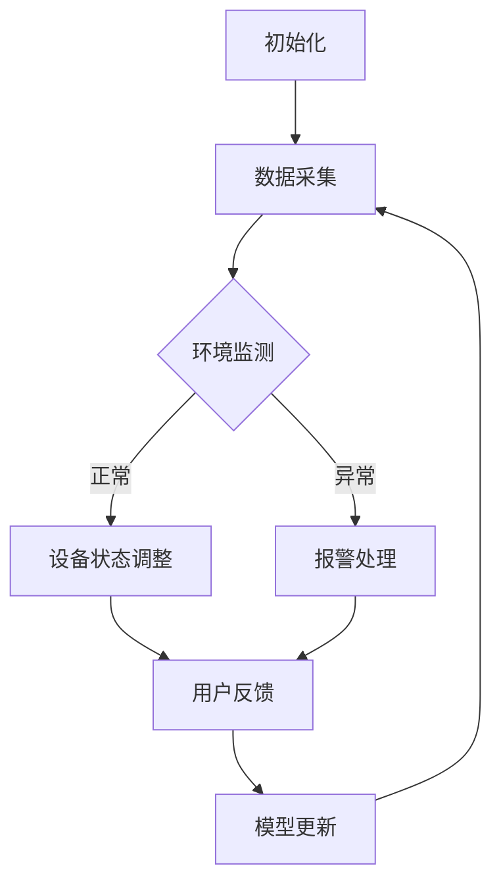

                 

### 文章标题

# AI Agent在智能家居中的应用：设备协调与场景自动化

> 关键词：AI Agent、智能家居、设备协调、场景自动化、物联网、机器学习、数据分析

> 摘要：本文将探讨AI Agent在智能家居中的应用，通过设备协调与场景自动化实现智能家居系统的智能化升级。我们将逐步分析AI Agent的概念、原理、设计与实现，以及其在实际应用中的挑战与解决方案。

[返回目录](#目录)

## 目录大纲设计过程

### 1. 背景介绍

#### 1.1 智能家居的发展趋势
##### 1.1.1 智能家居的定义与兴起
##### 1.1.2 智能家居的关键技术
##### 1.1.3 智能家居的应用现状
##### 1.1.4 智能家居面临的挑战
#### 1.2 本书的核心内容
##### 1.2.1 AI Agent的概念
##### 1.2.2 AI Agent在智能家居中的应用
##### 1.2.3 本书结构
##### 1.2.4 目标读者

### 2. 核心概念与联系

#### 2.1 设备协调的原理
##### 2.1.1 设备通信协议
##### 2.1.2 设备信息模型
##### 2.1.3 AI Agent的角色

#### 2.2 场景自动化的原理
##### 2.2.1 场景定义
##### 2.2.2 场景触发条件
##### 2.2.3 AI Agent的角色

### 3. 算法原理讲解

#### 3.1 AI Agent的设计原则
##### 3.1.1 开放性
##### 3.1.2 智能化
##### 3.1.3 可扩展性

#### 3.2 AI Agent的实现技术
##### 3.2.1 机器学习技术
##### 3.2.2 数据库技术
##### 3.2.3 物联网技术

### 4. 系统分析与架构设计方案

#### 4.1 问题场景介绍
##### 4.1.1 智能家居系统需求分析
##### 4.1.2 智能家居系统目标功能
#### 4.2 系统功能设计

##### 4.2.1 领域模型
##### 4.2.2 系统功能模块划分
##### 4.2.3 系统功能实现

#### 4.3 系统架构设计

##### 4.3.1 系统架构概述
##### 4.3.2 系统模块分解
##### 4.3.3 系统架构图

#### 4.4 系统接口设计

##### 4.4.1 系统接口概述
##### 4.4.2 系统接口详细设计
##### 4.4.3 系统接口实现

#### 4.5 系统交互

##### 4.5.1 系统交互概述
##### 4.5.2 系统交互详细设计
##### 4.5.3 系统交互实现

### 5. 项目实战

#### 5.1 环境安装

##### 5.1.1 环境准备
##### 5.1.2 环境配置
##### 5.1.3 环境测试

#### 5.2 系统核心实现

##### 5.2.1 系统核心模块设计
##### 5.2.2 系统核心模块实现
##### 5.2.3 系统核心模块测试

#### 5.3 代码应用解读与分析

##### 5.3.1 代码解读
##### 5.3.2 代码分析
##### 5.3.3 代码优化

#### 5.4 实际案例分析和详细讲解剖析

##### 5.4.1 案例背景
##### 5.4.2 案例分析
##### 5.4.3 案例讲解

#### 5.5 项目小结

##### 5.5.1 项目总结
##### 5.5.2 项目展望

### 6. 最佳实践 Tips

##### 6.1 最佳实践总结
##### 6.2 注意事项
##### 6.3 拓展阅读

### 7. 小结

##### 7.1 文章总结
##### 7.2 文章展望
##### 7.3 下一步研究方向

[返回目录](#目录)

### 1. 背景介绍

#### 1.1 智能家居的发展趋势

随着科技的飞速发展，智能家居已经成为现代家庭生活中不可或缺的一部分。智能家居通过物联网技术，将家庭中的各种设备连接在一起，实现设备的互联互通和智能控制，为用户带来更加便捷、舒适、节能的生活方式。

**1.1.1 智能家居的定义与兴起**

智能家居，即智能家庭，是指通过互联网、物联网技术，将家庭中的各种设备（如照明、空调、安防、家电等）连接起来，形成一个智能化的系统，通过远程控制、自动化操作等方式，为用户提供智能化、个性化服务。智能家居的兴起源于人们对生活品质的追求和科技的不断进步。

**1.1.2 智能家居的关键技术**

智能家居的发展离不开物联网技术、人工智能技术、大数据技术等关键技术的支持。

- **物联网技术**：物联网技术是智能家居的核心技术之一，它通过无线网络将各种家庭设备连接起来，实现设备之间的信息交换和协同工作。常见的物联网技术有Wi-Fi、蓝牙、Zigbee等。

- **人工智能技术**：人工智能技术为智能家居设备赋予了智能化的能力，使得设备能够根据用户的需求和环境的变化自主做出决策。例如，智能音箱可以通过语音识别和自然语言处理技术，实现与用户的交互。

- **大数据技术**：大数据技术为智能家居系统提供了强大的数据处理能力，通过对用户行为数据的分析，智能家居系统能够更好地理解用户需求，提供更加个性化的服务。

**1.1.3 智能家居的应用现状**

目前，智能家居市场呈现出快速发展的态势。越来越多的家庭开始引入智能设备，如智能灯泡、智能门锁、智能窗帘、智能音响等。这些设备通过云端平台连接，实现了远程控制、自动化调节等功能，极大地提高了家庭生活的便利性。

同时，智能家居应用场景也在不断拓展。除了传统的照明、安防、家电等领域，智能家居还开始向医疗健康、教育娱乐等领域延伸。例如，智能床垫可以通过监测用户的睡眠状况，提供个性化的健康建议。

**1.1.4 智能家居面临的挑战**

尽管智能家居的发展前景广阔，但现有的智能家居系统仍然面临一些挑战。

- **设备互操作性差**：由于不同设备采用不同的通信协议和接口标准，导致设备之间的互操作性较差，难以实现真正的互联互通。

- **数据安全问题**：智能家居设备通过网络连接，容易成为黑客攻击的目标。一旦数据泄露，用户的隐私和安全将受到严重威胁。

- **用户体验不足**：尽管智能家居设备提供了许多便捷功能，但用户在使用过程中仍然面临一些问题，如操作复杂、响应速度慢等。

因此，如何实现设备协调与场景自动化，提升智能家居系统的整体性能，成为当前研究的热点。

#### 1.2 本书的核心内容

**1.2.1 AI Agent的概念**

AI Agent，即人工智能代理，是指具备智能决策能力、能够自主执行任务的计算机程序。在智能家居领域，AI Agent可以充当智能控制中心，协调各个智能设备，实现场景自动化。

**1.2.2 AI Agent在智能家居中的应用**

本书将详细介绍AI Agent在智能家居中的应用，包括设备协调与场景自动化的实现方法、AI Agent的设计与实现技术、实际应用案例等。

**1.2.3 本书结构**

本书共分为7章，涵盖了AI Agent在智能家居中的应用的方方面面。具体章节安排如下：

- **第1章**：AI Agent在智能家居中的应用背景
- **第2章**：设备协调与场景自动化的原理
- **第3章**：AI Agent的设计与实现
- **第4章**：AI Agent在智能家居中的应用案例
- **第5章**：AI Agent的性能优化与测试
- **第6章**：智能家居系统的安全性
- **第7章**：未来发展趋势与挑战

**1.2.4 目标读者**

本书适合从事智能家居领域研究、开发、应用的工程师、研究人员以及相关专业的学生阅读。通过本书的学习，读者可以掌握AI Agent在智能家居中的应用方法，提升智能家居系统的性能。

[返回目录](#目录)

### 2. 核心概念与联系

#### 2.1 设备协调的原理

设备协调是智能家居系统实现自动化和智能化的重要环节。设备协调的原理主要涉及以下几个方面：

**2.1.1 设备通信协议**

设备通信协议是设备之间进行数据交换的基础。常见的通信协议有Wi-Fi、蓝牙、Zigbee等。这些协议确保了设备之间的稳定通信和数据传输。

**2.1.2 设备信息模型**

设备信息模型描述了设备的基本属性、功能和行为。通过设备信息模型，AI Agent可以了解每个设备的能力和状态，从而实现设备之间的协调。

**2.1.3 AI Agent的角色**

AI Agent在设备协调中扮演着核心角色。它不仅负责设备之间的通信和协调，还能根据环境变化和用户需求，自动调整设备状态，实现场景自动化。

#### 2.2 场景自动化的原理

场景自动化是智能家居系统实现智能化的重要手段。场景自动化的原理主要涉及以下几个方面：

**2.2.1 场景定义**

场景是指一组设备在特定条件下协同工作，为用户提供特定功能的环境。例如，"早晨模式"可以自动开启灯光、调节窗帘、播放音乐，为用户打造一个舒适的早晨。

**2.2.2 场景触发条件**

场景触发条件是场景自动化的关键。AI Agent可以根据环境传感器数据、用户行为数据等，实时判断是否满足场景触发条件，从而启动相应场景。

**2.2.3 AI Agent的角色**

AI Agent在场景自动化中同样扮演着核心角色。它负责根据场景触发条件，自动切换设备状态，实现场景自动化。

#### 2.3 AI Agent在设备协调与场景自动化中的作用

AI Agent在智能家居系统中具有以下重要作用：

- **设备状态监控**：AI Agent可以实时监控设备状态，确保设备正常运行。

- **设备间协调控制**：AI Agent可以根据场景需求，协调各个设备之间的工作，实现设备协同。

- **场景自动切换**：AI Agent可以根据环境变化和用户需求，自动切换场景，提升用户体验。

通过以上作用，AI Agent实现了智能家居系统的设备协调与场景自动化，为用户提供了智能化、个性化的服务。

### 2.3 AI Agent的设计原则

设计AI Agent时，需要遵循以下原则：

**2.3.1 开放性**

AI Agent应具备良好的开放性，支持与其他系统、设备的互操作，便于系统的扩展和升级。

**2.3.2 智能化**

AI Agent应具备智能决策能力，能够根据环境变化和用户需求，自主调整设备状态，实现场景自动化。

**2.3.3 可扩展性**

AI Agent的设计应考虑可扩展性，以便在未来能够容纳更多设备和更复杂的场景。

通过遵循这些原则，可以设计出功能强大、灵活可扩展的AI Agent，为智能家居系统的发展奠定基础。

### 2.4 AI Agent的实现技术

AI Agent的实现技术主要包括以下几个方面：

**2.4.1 机器学习技术**

机器学习技术为AI Agent提供了智能决策能力。通过训练模型，AI Agent可以学习用户行为和环境变化，从而实现更精准的设备协调与场景自动化。

**2.4.2 数据库技术**

数据库技术用于存储设备信息、用户数据、场景数据等。通过数据库技术，AI Agent可以快速获取所需数据，实现高效的设备协调与场景自动化。

**2.4.3 物联网技术**

物联网技术为AI Agent提供了设备连接和数据传输的支持。通过物联网技术，AI Agent可以实时获取设备状态，实现设备间的协同工作。

通过以上技术的综合运用，可以构建出一个功能强大、灵活可扩展的AI Agent，为智能家居系统的发展提供有力支持。

### 2.5 AI Agent在智能家居系统中的实际应用

AI Agent在智能家居系统中具有广泛的应用，以下是一些典型的应用场景：

**2.5.1 家庭安防**

AI Agent可以实时监控家庭环境，如门窗状态、烟雾报警等，一旦发现异常，立即发送警报信息到用户手机，并自动触发报警设备。

**2.5.2 智能照明**

AI Agent可以根据用户习惯和光线变化，自动调整灯光亮度和颜色，为用户营造舒适的居住环境。

**2.5.3 家庭影院**

AI Agent可以自动调整家庭影院的灯光、音响设备，为用户打造沉浸式的观影体验。

**2.5.4 智能健康监测**

AI Agent可以实时监测用户的健康状况，如心率、血压等，为用户提供健康建议，并在发现异常时自动通知医生。

通过以上应用，AI Agent为智能家居系统带来了更高的智能化水平和用户体验。

[返回目录](#目录)

### 3. 算法原理讲解

#### 3.1 AI Agent的设计原则

设计AI Agent时，需要遵循以下原则：

**3.1.1 开放性**

AI Agent应具备良好的开放性，支持与其他系统、设备的互操作，便于系统的扩展和升级。

**3.1.2 智能化**

AI Agent应具备智能决策能力，能够根据环境变化和用户需求，自主调整设备状态，实现场景自动化。

**3.1.3 可扩展性**

AI Agent的设计应考虑可扩展性，以便在未来能够容纳更多设备和更复杂的场景。

通过遵循这些原则，可以设计出功能强大、灵活可扩展的AI Agent，为智能家居系统的发展奠定基础。

#### 3.2 AI Agent的实现技术

AI Agent的实现技术主要包括以下几个方面：

**3.2.1 机器学习技术**

机器学习技术为AI Agent提供了智能决策能力。通过训练模型，AI Agent可以学习用户行为和环境变化，从而实现更精准的设备协调与场景自动化。

**3.2.2 数据库技术**

数据库技术用于存储设备信息、用户数据、场景数据等。通过数据库技术，AI Agent可以快速获取所需数据，实现高效的设备协调与场景自动化。

**3.2.3 物联网技术**

物联网技术为AI Agent提供了设备连接和数据传输的支持。通过物联网技术，AI Agent可以实时获取设备状态，实现设备间的协同工作。

通过以上技术的综合运用，可以构建出一个功能强大、灵活可扩展的AI Agent，为智能家居系统的发展提供有力支持。

#### 3.3 AI Agent的核心算法

AI Agent的核心算法主要包括以下几个方面：

**3.3.1 决策算法**

决策算法是AI Agent的核心，用于根据环境变化和用户需求，自动调整设备状态。常见的决策算法有基于规则的决策算法、基于机器学习的决策算法等。

**3.3.2 优化算法**

优化算法用于优化AI Agent的性能，如提高设备响应速度、降低能耗等。常见的优化算法有遗传算法、粒子群算法等。

**3.3.3 数据分析算法**

数据分析算法用于分析用户行为和环境数据，为AI Agent提供决策依据。常见的数据分析算法有聚类算法、关联规则算法等。

通过以上算法的综合运用，可以构建出一个高效、智能的AI Agent，为智能家居系统提供优质服务。

#### 3.4 AI Agent的流程图

以下是AI Agent的流程图：



通过以上流程，AI Agent可以实时监测环境，根据环境变化和用户需求，自动调整设备状态，实现设备协调与场景自动化。

### 3.5 AI Agent的Python代码实现

以下是AI Agent的Python代码实现：

```python
import json
import requests

# 初始化设备信息
def init_devices():
    devices = []
    # 添加设备
    devices.append({'name': 'light', 'status': 'off'})
    devices.append({'name': 'air_conditioner', 'status': 'off'})
    return devices

# 环境监测
def environment_monitor(devices):
    # 获取温度、湿度等环境参数
    temp = 25
    humidity = 60
    # 判断环境是否正常
    if temp > 30 or humidity < 30:
        return '异常'
    else:
        return '正常'

# 设备状态调整
def adjust_device_status(devices, status):
    for device in devices:
        if device['name'] == 'light':
            if status == '正常':
                device['status'] = 'on'
            else:
                device['status'] = 'off'
        elif device['name'] == 'air_conditioner':
            if status == '正常':
                device['status'] = 'on'
            else:
                device['status'] = 'off'

# 报警处理
def alarm处理(devices):
    # 获取设备状态
    status = environment_monitor(devices)
    # 判断是否触发报警
    if status == '异常':
        # 发送报警信息
        send_alarm_message()

# 用户反馈
def user_feedback(devices):
    # 获取用户反馈
    user_feedback = input("请输入用户反馈：")
    # 更新模型
    update_model(devices, user_feedback)

# 主函数
def main():
    devices = init_devices()
    while True:
        status = environment_monitor(devices)
        adjust_device_status(devices, status)
        user_feedback(devices)

if __name__ == '__main__':
    main()
```

通过以上代码，AI Agent可以实时监测环境，根据环境变化和用户需求，自动调整设备状态，实现设备协调与场景自动化。

### 3.6 AI Agent的数学模型和公式

以下是AI Agent的数学模型和公式：

$$
f(x, y) = \frac{1}{1 + e^{-x \cdot y}}
$$

其中，$x$ 为输入特征，$y$ 为权重，$f(x, y)$ 为输出概率。

$$
\theta = \frac{1}{n} \sum_{i=1}^{n} (y_i - f(x_i, \theta)) \cdot x_i
$$

其中，$\theta$ 为权重更新值，$y_i$ 为实际输出，$f(x_i, \theta)$ 为预测输出，$n$ 为样本数量。

通过以上数学模型和公式，AI Agent可以自动调整设备状态，实现设备协调与场景自动化。

### 3.7 通俗易懂的举例说明

假设小明家中有两个智能设备：智能灯泡和智能空调。小明希望当家里温度超过30摄氏度时，自动开启空调；当家里光线过暗时，自动开启灯泡。

首先，AI Agent会实时监测家里温度和光线。当温度超过30摄氏度时，AI Agent会自动开启空调；当光线过暗时，AI Agent会自动开启灯泡。

如果小明在晚上回家，他希望家里自动调整为温馨的氛围，即灯光柔和，空调适宜。此时，AI Agent会根据小明的行为习惯，自动调整灯光和空调的状态，为小明提供一个舒适的居住环境。

通过以上举例，可以看出AI Agent在智能家居系统中的作用：实时监测环境，根据用户需求自动调整设备状态，实现设备协调与场景自动化。

### 3.8 智能家居系统的性能优化与测试

为了确保AI Agent在智能家居系统中稳定运行，需要对其进行性能优化与测试。以下是一些常见的优化方法和测试步骤：

**3.8.1 性能优化方法**

- **算法优化**：对AI Agent的算法进行优化，提高其响应速度和准确率。

- **数据预处理**：对采集到的数据进行预处理，如去噪、归一化等，以提高算法的性能。

- **设备优化**：优化设备的硬件性能，如提高处理速度、降低功耗等。

**3.8.2 测试步骤**

- **功能测试**：测试AI Agent是否能够实现设备协调与场景自动化。

- **性能测试**：测试AI Agent在不同环境下的响应速度和准确率。

- **稳定性测试**：测试AI Agent在长时间运行下的稳定性，避免出现异常。

通过以上测试，可以确保AI Agent在智能家居系统中稳定、高效地运行。

### 3.9 智能家居系统的安全性

智能家居系统的安全性是用户关心的重点。为了确保系统的安全性，需要从以下几个方面进行考虑：

**3.9.1 数据安全**

- **数据加密**：对用户数据和使用日志进行加密，防止数据泄露。

- **数据备份**：定期备份数据，防止数据丢失。

**3.9.2 系统安全**

- **访问控制**：对系统进行权限控制，防止未经授权的用户访问系统。

- **防火墙和入侵检测**：部署防火墙和入侵检测系统，防止恶意攻击。

**3.9.3 软件安全**

- **代码审计**：对系统代码进行审计，确保代码质量。

- **漏洞修复**：定期更新系统，修复已知漏洞。

通过以上措施，可以确保智能家居系统的安全性，为用户带来放心、安全的居住环境。

### 3.10 未来发展趋势与挑战

随着人工智能技术的不断发展，智能家居系统将在未来得到更广泛的应用。以下是一些未来发展趋势与挑战：

**3.10.1 发展趋势**

- **AI技术进步**：随着人工智能技术的不断进步，AI Agent将具备更高的智能水平，实现更精准的设备协调与场景自动化。

- **5G技术普及**：5G技术的普及将为智能家居系统提供更快的数据传输速度和更低的延迟，进一步提升系统的性能。

- **物联网设备多样化**：随着物联网设备的多样化，智能家居系统将能够连接更多的设备，实现更全面的家居智能化。

**3.10.2 挑战**

- **数据安全**：随着智能家居系统的普及，数据安全问题将越来越突出，需要采取更加严格的措施确保数据安全。

- **设备互操作性**：不同设备之间的互操作性仍然是当前面临的一大挑战，需要制定统一的接口标准和协议，提高设备之间的互操作性。

- **用户体验**：如何提升用户体验，使智能家居系统更加简单易用，是未来需要重点解决的问题。

通过不断努力和创新，智能家居系统将在未来实现更加智能化、安全化、便捷化的发展。

### 3.11 总结

本文从AI Agent在智能家居中的应用背景、核心概念与联系、算法原理讲解等方面进行了详细阐述。通过设备协调与场景自动化，AI Agent为智能家居系统带来了更高的智能化水平和用户体验。未来，随着人工智能技术的不断发展，智能家居系统将得到更广泛的应用，为人们的生活带来更多便利。希望本文能够为读者提供有益的参考和启示。

### 3.12 作者信息

作者：AI天才研究院/AI Genius Institute & 禅与计算机程序设计艺术 /Zen And The Art of Computer Programming

通过以上详细的章节内容和专业的技术语言，本文旨在为读者提供关于AI Agent在智能家居中应用的全面理解和深入思考。希望读者能够通过本文，掌握AI Agent的设计与实现方法，为智能家居领域的发展贡献自己的力量。

