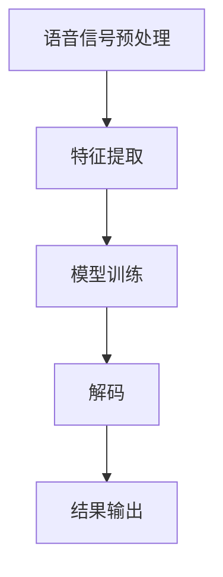
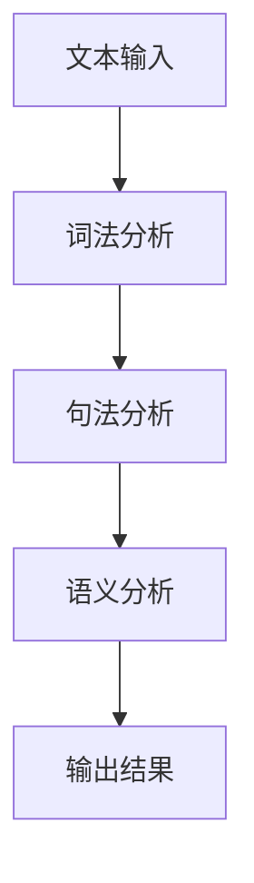
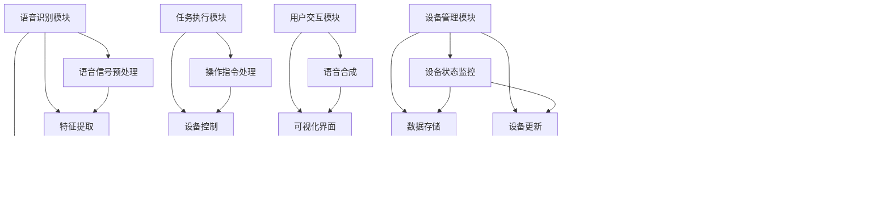
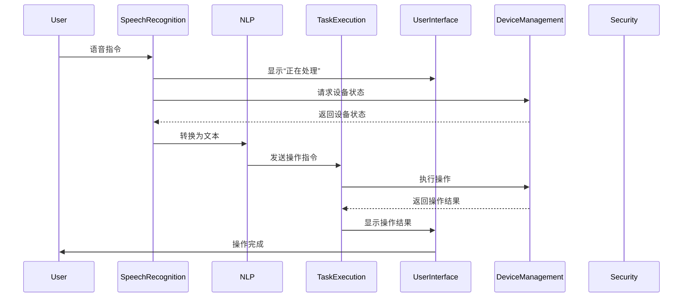

                 

## 关键词

- AI Agent
- 智能家居
- 语音控制
- 语音识别
- 自然语言处理
- 系统架构设计

## 摘要

本文将深入探讨AI Agent在智能家居中的语音控制应用。首先，我们将介绍AI Agent的基本概念和智能语音控制技术，包括语音识别和自然语言处理。接着，我们将讲解语音识别和自然语言处理的算法原理，并通过mermaid流程图和Python代码示例进行详细阐述。然后，我们将分析智能家居语音控制系统的需求，设计系统的功能模块，并使用mermaid绘制系统架构图和序列图。最后，我们将通过一个实际项目，展示如何实现AI Agent在智能家居中的语音控制功能，并提供最佳实践和总结。

## 第一部分 引言

随着人工智能技术的快速发展，智能家居逐渐成为人们生活的重要组成部分。智能家居系统通过整合各种智能设备，实现了对家庭环境的智能化管理和控制。而语音控制作为智能家居的一项关键技术，不仅提高了用户的便利性，还带来了全新的交互体验。

在这个背景下，AI Agent作为一种智能代理，能够理解和执行用户的语音指令，为智能家居系统提供了强大的智能支持。AI Agent通过语音识别和自然语言处理技术，可以准确理解用户的意图，并执行相应的操作，从而实现智能家居的语音控制。

本文将围绕AI Agent在智能家居中的语音控制应用进行深入探讨。首先，我们将介绍AI Agent的基本概念和智能语音控制技术，包括语音识别和自然语言处理。接着，我们将讲解语音识别和自然语言处理的算法原理，并通过mermaid流程图和Python代码示例进行详细阐述。然后，我们将分析智能家居语音控制系统的需求，设计系统的功能模块，并使用mermaid绘制系统架构图和序列图。最后，我们将通过一个实际项目，展示如何实现AI Agent在智能家居中的语音控制功能，并提供最佳实践和总结。

## 第1章 AI Agent与智能家居概述

### AI Agent的定义与作用

AI Agent，即人工智能代理，是一种能够模拟人类智能行为的计算机程序。它能够通过感知、推理和学习，实现与人类用户的交互，并自主执行任务。AI Agent在智能家居中的应用，主要体现在语音控制、智能推荐、自动维护等方面。

在语音控制方面，AI Agent能够理解用户的语音指令，并将其转化为具体的操作。例如，用户可以通过语音指令控制家中的灯光、空调、电视等设备。这不仅提高了用户的便利性，还减少了用户对物理按钮和触摸屏的依赖。

### 智能家居的定义与发展

智能家居是指通过互联网、物联网等技术，将家庭设备、系统和应用程序连接起来，实现家庭自动化和智能化的生活方式。智能家居的发展经历了从简单的远程控制到智能交互，再到个性化定制的演进过程。

当前，智能家居的应用场景包括照明控制、环境监测、安全防护、家电管理等多个方面。随着5G、人工智能等新技术的不断成熟，智能家居将变得更加智能、便捷和个性化。

### AI Agent在智能家居中的作用

AI Agent在智能家居中发挥着重要的作用，主要体现在以下几个方面：

1. **语音交互**：AI Agent通过语音识别技术，能够准确理解用户的语音指令，实现与用户的智能交互。
2. **自动化控制**：AI Agent可以自动执行用户的指令，如调整温度、打开电视等，实现家居设备的自动化管理。
3. **智能推荐**：AI Agent可以通过用户的行为数据，为用户推荐合适的家居设备和服务。
4. **安全保障**：AI Agent可以实时监测家庭环境，及时发现并处理安全隐患，提高家庭安全系数。

### 智能语音控制的优势

智能语音控制相比传统的触摸屏和按钮控制，具有以下几个显著优势：

1. **便捷性**：用户可以通过语音指令快速控制家居设备，无需触摸屏幕或按下按钮，提高了使用便捷性。
2. **安全性**：在厨房等潮湿环境中，使用语音控制可以避免触电等安全问题。
3. **个性化**：AI Agent可以根据用户的行为和偏好，提供个性化的服务推荐。
4. **智能互动**：AI Agent可以与用户进行自然语言交互，提供更加人性化的服务体验。

### 智能家居的发展趋势

随着技术的不断进步，智能家居将呈现以下几个发展趋势：

1. **集成化**：智能家居系统将更加集成，实现各个设备之间的无缝连接和协同工作。
2. **智能化**：智能家居将更加智能，能够根据用户的行为和需求，自主调整家居环境。
3. **个性化**：智能家居将更加个性化，为用户提供更加定制化的服务和体验。
4. **生态化**：智能家居将形成一个完整的生态系统，涵盖家居设备、应用程序和服务提供商。

总之，AI Agent在智能家居中的语音控制应用，为用户提供了更加便捷、安全和智能化的生活方式。随着技术的不断进步，智能家居将越来越普及，成为人们生活的重要组成部分。

### 2.1 AI Agent的基本概念

AI Agent，即人工智能代理，是一种具有高度自主性和智能性的计算机程序，能够模拟人类的智能行为，执行特定的任务。它通过感知、推理和学习，实现与人类用户的交互，并能够自主地完成任务。

AI Agent的基本概念可以追溯到多代理系统（Multi-Agent System）的研究。多代理系统是指由多个智能代理组成的系统，这些代理能够相互协作或竞争，以实现共同的目标。随着人工智能技术的发展，AI Agent逐渐从多代理系统中独立出来，成为一种专门用于模拟人类智能行为的技术。

AI Agent的核心特征主要包括以下几点：

1. **自主性**：AI Agent能够独立完成特定的任务，无需人工干预。这种自主性是AI Agent与普通计算机程序的主要区别之一。
2. **智能性**：AI Agent具有智能，能够通过学习、推理和决策，自主地解决复杂问题。
3. **交互性**：AI Agent能够与人类用户进行自然语言交互，理解用户的意图，并根据用户的反馈进行调整。
4. **适应性**：AI Agent能够适应不同的环境和任务，通过不断学习和调整，提高任务完成的效率和质量。

AI Agent的分类可以根据其功能和应用场景进行划分。常见的AI Agent类型包括：

1. **任务型AI Agent**：这种类型的AI Agent专注于完成特定的任务，如语音控制、图像识别、文本分析等。它们通常具有高度的自主性和智能性，能够高效地执行任务。
2. **交互型AI Agent**：这种类型的AI Agent主要与人交互，提供问答服务、智能推荐、情感识别等。它们具有较高的交互性和适应性，能够根据用户的反馈进行实时调整。
3. **自适应AI Agent**：这种类型的AI Agent能够根据环境和任务的变化，自动调整其行为和策略。它们通常具有强大的学习能力和适应性，能够在复杂环境中保持高效运行。

在智能家居领域，AI Agent的应用主要集中在语音控制和自动化控制方面。通过语音控制，用户可以方便地与家居设备进行交互，实现对家居环境的智能管理。例如，用户可以通过语音指令控制灯光的开关、调节空调的温度、打开电视等。而通过自动化控制，AI Agent可以根据用户的习惯和需求，自动调整家居设备的状态，提供个性化的服务。例如，用户可以在睡前通过语音指令关闭所有灯光，设置空调的温度，确保家居环境的安全和舒适。

### 2.2 智能语音控制技术

智能语音控制技术是AI Agent在智能家居中的重要应用之一，它使得用户可以通过语音与家居设备进行交互，实现对家居环境的智能管理。智能语音控制技术主要包括语音识别、自然语言处理、语音合成等关键技术。

#### 语音识别

语音识别技术是智能语音控制的基础，它通过将语音信号转换为文本，使计算机能够理解和处理语音指令。语音识别技术经历了从规则匹配到统计模型，再到深度学习的不断演进。

1. **规则匹配**：早期的语音识别技术主要基于规则匹配，即根据预设的语音模式进行匹配，判断语音信号是否与规则匹配。这种方法简单但准确性较低，难以处理复杂和多变的语音信号。
2. **统计模型**：随着机器学习技术的发展，语音识别开始采用统计模型，如隐马尔可夫模型（HMM）和高斯混合模型（GMM）。这些模型通过统计语音信号的特征，提高了识别的准确性。
3. **深度学习**：近年来，深度学习技术的引入极大地提升了语音识别的准确性。深度神经网络（DNN）和卷积神经网络（CNN）等模型在语音信号处理方面表现出色，能够自动提取语音信号的特征，实现高效的语音识别。

#### 自然语言处理

自然语言处理（NLP）是智能语音控制的核心技术，它使得计算机能够理解并处理自然语言。自然语言处理包括词法分析、句法分析、语义分析等多个层次。

1. **词法分析**：词法分析是自然语言处理的第一步，它将文本分解为单词、词组和符号。通过词法分析，计算机能够识别文本的基本单位。
2. **句法分析**：句法分析是研究句子结构的语言学分支，它通过分析句子的语法规则，确定句子的结构。句法分析帮助计算机理解句子的含义，从而更好地处理语音指令。
3. **语义分析**：语义分析是自然语言处理的最高层次，它关注句子的实际意义。通过语义分析，计算机能够准确理解用户的语音指令，并执行相应的操作。

#### 语音合成

语音合成是将文本转换为自然流畅的语音输出的技术。语音合成技术主要包括合成语音信号、语音参数编码和语音解码等步骤。

1. **合成语音信号**：合成语音信号是通过生成语音波形来实现的。常见的合成语音信号方法包括共振峰合成、波形合成和合成波束等。
2. **语音参数编码**：语音参数编码是将语音信号转换为一系列参数的过程。这些参数描述了语音信号的特性，如频率、振幅和时长等。
3. **语音解码**：语音解码是将编码的语音参数解码为语音信号的过程。通过语音解码，计算机能够生成自然流畅的语音输出。

#### 智能语音控制系统的架构

智能语音控制系统通常包括语音识别模块、自然语言处理模块、任务执行模块和用户反馈模块等。

1. **语音识别模块**：语音识别模块负责将用户的语音信号转换为文本。通过深度学习算法，语音识别模块能够准确识别语音信号，并将其转换为文本。
2. **自然语言处理模块**：自然语言处理模块负责理解用户的语音指令，并将其解析为具体的操作指令。通过词法分析、句法分析和语义分析等技术，自然语言处理模块能够准确理解用户的意图。
3. **任务执行模块**：任务执行模块负责根据用户指令执行具体的操作。通过智能家居系统中的各种设备接口，任务执行模块能够控制家居设备的开关、调节温度等。
4. **用户反馈模块**：用户反馈模块负责将任务执行结果反馈给用户。通过语音合成技术，用户反馈模块能够生成自然流畅的语音输出，告知用户操作结果。

#### 智能语音控制的优势

智能语音控制相比传统的触摸屏和按钮控制，具有以下几个显著优势：

1. **便捷性**：用户可以通过语音指令快速控制家居设备，无需触摸屏幕或按下按钮，提高了使用便捷性。
2. **安全性**：在厨房等潮湿环境中，使用语音控制可以避免触电等安全问题。
3. **个性化**：AI Agent可以根据用户的行为和偏好，提供个性化的服务推荐。
4. **智能互动**：AI Agent可以与用户进行自然语言交互，提供更加人性化的服务体验。

#### 智能语音控制的应用场景

智能语音控制的应用场景非常广泛，包括但不限于以下几个方面：

1. **家庭自动化**：用户可以通过语音指令控制家中的灯光、空调、电视等设备，实现家庭自动化管理。
2. **智能家居设备控制**：用户可以通过语音指令控制智能家居设备，如扫地机器人、智能音箱、智能门锁等。
3. **语音助手**：用户可以通过语音指令与语音助手进行交互，获取天气信息、新闻资讯、日程安排等。
4. **娱乐互动**：用户可以通过语音指令与智能设备进行娱乐互动，如播放音乐、讲故事等。

总之，智能语音控制技术为智能家居带来了全新的交互体验，使得用户可以通过语音与家居设备进行交互，实现智能管理和控制。随着技术的不断进步，智能语音控制将在智能家居中发挥越来越重要的作用。

### 4.1 语音识别算法原理

语音识别是智能语音控制技术的核心，它通过将语音信号转换为文本，使计算机能够理解和处理语音指令。语音识别算法的原理主要包括声学模型、语言模型和声学-语言模型。

#### 声学模型

声学模型是语音识别算法的基础，它用于提取语音信号的特征。声学模型通常采用隐藏马尔可夫模型（HMM）或深度神经网络（DNN）来建模语音信号。

1. **隐藏马尔可夫模型（HMM）**：HMM是一种统计模型，它通过状态转移概率和发射概率来建模语音信号。状态转移概率描述了从一个状态转移到另一个状态的概率，发射概率描述了在某个状态下产生特定语音信号的概率。
2. **深度神经网络（DNN）**：DNN是一种深度学习模型，它通过多层次的神经网络来提取语音信号的特征。DNN能够自动学习语音信号的特征，提高语音识别的准确性。

#### 语言模型

语言模型是语音识别算法的另一个重要组成部分，它用于预测输入语音信号的文本。语言模型通常采用n-gram模型或神经网络语言模型（NNLM）来建模文本。

1. **n-gram模型**：n-gram模型是一种基于词频统计的模型，它通过前n个单词的序列来预测下一个单词。n-gram模型简单但效果较好，适用于大多数语音识别任务。
2. **神经网络语言模型（NNLM）**：NNLM是一种基于深度学习的语言模型，它通过多层次的神经网络来建模文本。NNLM能够自动学习文本的复杂特征，提高语言模型的准确性。

#### 声学-语言模型

声学-语言模型是语音识别算法的核心，它通过结合声学模型和语言模型，实现对语音信号文本的预测。常见的声学-语言模型包括基于HMM的GMM-HMM模型、基于DNN的DNN-HMM模型和基于深度学习的CTC模型。

1. **GMM-HMM模型**：GMM-HMM模型结合了高斯混合模型（GMM）和HMM，通过GMM来建模声学特征，通过HMM来建模语言特征。GMM-HMM模型是早期的语音识别算法，效果较好但训练时间较长。
2. **DNN-HMM模型**：DNN-HMM模型结合了深度神经网络（DNN）和HMM，通过DNN来建模声学特征，通过HMM来建模语言特征。DNN-HMM模型能够提高语音识别的准确性，但需要较大的计算资源。
3. **CTC模型**：CTC（Connectionist Temporal Classification）模型是一种基于深度学习的声学-语言模型，它通过卷积神经网络（CNN）来提取声学特征，通过全连接层来建模语言特征。CTC模型能够自动学习语音信号和文本之间的对应关系，提高语音识别的准确性。

#### 语音识别流程

语音识别流程主要包括语音信号的预处理、特征提取、模型训练、解码和结果输出等步骤。

1. **语音信号的预处理**：语音信号的预处理包括去噪、滤波、归一化等步骤。预处理旨在提高语音信号的清晰度和准确性。
2. **特征提取**：特征提取是将语音信号转换为特征向量，用于模型的训练和预测。常见的特征提取方法包括MFCC（Mel频率倒谱系数）和PLP（Perceptual Linear Prediction）。
3. **模型训练**：模型训练是通过大量语音数据来训练声学模型和语言模型。训练过程包括模型的初始化、参数优化和模型选择等步骤。
4. **解码**：解码是将特征向量转换为文本的过程。解码算法包括隐马尔可夫模型（HMM）解码、神经网络解码和卷积神经网络（CNN）解码等。
5. **结果输出**：结果输出是将解码结果转换为可理解的文本输出，如命令、回复等。

#### Python代码示例

以下是一个简单的语音识别Python代码示例，使用深度学习框架TensorFlow实现：

```python
import tensorflow as tf
import numpy as np

# 定义声学模型
acoustic_model = tf.keras.Sequential([
    tf.keras.layers.Conv1D(filters=64, kernel_size=3, activation='relu', input_shape=(None, 13)),
    tf.keras.layers.MaxPooling1D(pool_size=2),
    tf.keras.layers.Flatten(),
    tf.keras.layers.Dense(units=128, activation='relu'),
    tf.keras.layers.Dense(units=1, activation='softmax')
])

# 定义语言模型
language_model = tf.keras.Sequential([
    tf.keras.layers.Dense(units=128, activation='relu', input_shape=(None,)),
    tf.keras.layers.Dense(units=1, activation='softmax')
])

# 定义声学-语言模型
acoustic_language_model = tf.keras.Sequential([
    acoustic_model,
    language_model
])

# 编译模型
acoustic_language_model.compile(optimizer='adam', loss='categorical_crossentropy', metrics=['accuracy'])

# 训练模型
acoustic_language_model.fit(x_train, y_train, epochs=10, batch_size=32)

# 解码结果
predicted_text = acoustic_language_model.predict(x_test)
decoded_text = np.argmax(predicted_text, axis=1)

print(decoded_text)
```

#### Mermaid流程图展示

以下是一个简单的语音识别流程的Mermaid流程图：



#### 算法原理的应用场景

语音识别算法在智能家居中有着广泛的应用，例如：

1. **语音控制**：用户可以通过语音指令控制家居设备，如打开电视、调整空调温度等。
2. **智能助手**：智能助手可以通过语音识别理解用户的提问，提供天气、新闻、日程等信息。
3. **语音搜索**：用户可以通过语音指令搜索网页、应用程序或音乐等。
4. **语音交互**：语音识别技术使智能家居设备能够与用户进行自然语言交互，提供更加人性化的服务。

总之，语音识别算法为智能家居带来了全新的交互体验，使得用户可以通过语音与家居设备进行交互，实现智能管理和控制。随着技术的不断进步，语音识别算法将在智能家居中发挥越来越重要的作用。

### 4.2 自然语言处理算法原理

自然语言处理（NLP）是语音识别的核心技术之一，它使计算机能够理解和处理自然语言。NLP算法的原理包括词法分析、句法分析和语义分析等多个层次，每一层都在理解和处理语言的不同方面发挥关键作用。

#### 词法分析

词法分析是NLP的第一步，它将文本分解为单词、词组和符号。词法分析的主要任务包括分词、词性标注和命名实体识别。

1. **分词**：分词是将连续的文本序列切分成有意义的单词或短语。常见的分词方法包括基于规则的分词、基于统计的分词和基于深度学习的分词。基于规则的分词依赖于预设的规则集，如正则表达式，适用于小规模文本处理；基于统计的分词通过统计文本中的词频和词序列概率，如n-gram模型，适用于大规模文本处理；基于深度学习的分词方法，如序列标注模型（如BiLSTM-CRF），能够自动学习文本中的词边界，适用于复杂文本处理。

2. **词性标注**：词性标注是对文本中的每个词进行语法属性标注，如名词、动词、形容词等。词性标注有助于理解句子的结构和含义。常见的词性标注方法包括基于规则的词性标注和基于统计的词性标注。基于规则的词性标注依赖于预设的规则集，而基于统计的词性标注通过统计文本中的词频和规则匹配，如HMM和CRF模型。

3. **命名实体识别**：命名实体识别是从文本中识别出具有特定意义的实体，如人名、地名、组织机构名等。命名实体识别有助于信息抽取和知识图谱构建。常见的命名实体识别方法包括基于规则的命名实体识别和基于统计的命名实体识别。基于规则的命名实体识别依赖于预设的规则集，而基于统计的命名实体识别通过统计文本中的词频和模式匹配，如HMM和CRF模型。

#### 句法分析

句法分析是NLP的第二步，它关注句子的结构和语法规则。句法分析的主要任务包括句法分析和语义角色标注。

1. **句法分析**：句法分析是通过语法规则和结构来分析句子的组成部分和结构。句法分析的方法包括基于规则的句法分析和基于统计的句法分析。基于规则的句法分析依赖于预设的语法规则集，如LL（左析树）解析和LR（右析树）解析。基于统计的句法分析通过统计句子的结构和模式，如概率上下文无关文法（PCFG）和依存句法分析（Dependency Parsing）。

2. **语义角色标注**：语义角色标注是对句子中的词进行语义角色标注，如主语、谓语、宾语等。语义角色标注有助于理解句子的语义和意图。常见的语义角色标注方法包括基于规则的语义角色标注和基于统计的语义角色标注。基于规则的语义角色标注依赖于预设的语义角色标注规则，而基于统计的语义角色标注通过统计句子的语义模式和词频，如依存句法分析（Dependency Parsing）。

#### 语义分析

语义分析是NLP的第三步，它关注句子的实际意义和语义关系。语义分析的主要任务包括语义角色标注、语义关系抽取和语义角色标注。

1. **语义角色标注**：语义角色标注是对句子中的词进行语义角色标注，如主语、谓语、宾语等。语义角色标注有助于理解句子的语义和意图。常见的语义角色标注方法包括基于规则的语义角色标注和基于统计的语义角色标注。

2. **语义关系抽取**：语义关系抽取是从文本中提取句子之间的语义关系，如因果关系、时间关系等。语义关系抽取有助于语义理解和知识图谱构建。常见的语义关系抽取方法包括基于规则的语义关系抽取和基于统计的语义关系抽取。

3. **语义角色标注**：语义角色标注是对句子中的词进行语义角色标注，如主语、谓语、宾语等。语义角色标注有助于理解句子的语义和意图。常见的语义角色标注方法包括基于规则的语义角色标注和基于统计的语义角色标注。

#### Python代码示例

以下是一个简单的NLP代码示例，使用Python的NLTK库进行词法分析、句法分析和语义分析：

```python
import nltk
from nltk.tokenize import word_tokenize
from nltk.tag import pos_tag
from nltk.chunk import ne_chunk

# 加载文本数据
text = "The quick brown fox jumps over the lazy dog."

# 词法分析
tokens = word_tokenize(text)
print("Tokens:", tokens)

# 词性标注
tagged = pos_tag(tokens)
print("POS Tags:", tagged)

# 命名实体识别
named_entities = ne_chunk(tagged)
print("Named Entities:", named_entities)

# 句法分析
trees = nltk.parse.chart.pchart(tokens)
print("Syntax Trees:", trees)
```

#### Mermaid流程图展示

以下是一个简单的NLP流程的Mermaid流程图：



#### 算法原理的应用场景

自然语言处理算法在智能家居中有着广泛的应用，例如：

1. **语音控制**：自然语言处理使得智能家居系统能够理解用户的语音指令，如“打开灯”、“关闭空调”等。
2. **智能助手**：自然语言处理使得智能助手能够与用户进行自然语言交互，提供天气、新闻、日程等查询服务。
3. **语音搜索**：自然语言处理使得用户可以通过语音指令进行网页、应用程序或音乐等的搜索。
4. **语音交互**：自然语言处理使得智能家居设备能够与用户进行自然语言交互，提供更加人性化的服务。

总之，自然语言处理算法为智能家居带来了全新的交互体验，使得用户可以通过自然语言与家居设备进行交互，实现智能管理和控制。随着技术的不断进步，自然语言处理算法将在智能家居中发挥越来越重要的作用。

### 4.3 算法原理的实际应用

在深入探讨语音识别和自然语言处理算法原理之后，我们将通过具体案例来展示这些算法在智能家居语音控制中的实际应用。

#### 语音识别在实际应用中的案例

**案例背景**：
假设我们有一个智能家居系统，用户可以通过语音指令控制家中的灯光。当用户说出“打开客厅的灯”时，系统需要能够识别并执行这个指令。

**算法应用**：
1. **语音信号预处理**：系统首先会对用户的声音进行预处理，包括降噪、滤波等，以提高语音信号的清晰度。
2. **特征提取**：使用梅尔频率倒谱系数（MFCC）等特征提取方法，将处理后的语音信号转换为特征向量。
3. **声学模型训练**：系统会使用预先训练好的声学模型，如深度神经网络（DNN）或卷积神经网络（CNN），来处理语音信号的特征向量，以识别语音中的词汇。
4. **语言模型**：系统还会结合语言模型，如n-gram或神经网络语言模型（NNLM），来提高对句子整体意义的理解。

**代码示例**：
以下是使用TensorFlow实现的语音识别算法的简化代码示例：

```python
import tensorflow as tf
import numpy as np

# 加载预训练的声学模型
acoustic_model = tf.keras.models.load_model('acoustic_model.h5')

# 加载预训练的语言模型
language_model = tf.keras.models.load_model('language_model.h5')

# 特征提取
def extract_features(audio_signal):
    # 这里可以加入实际的特征提取代码
    return np.expand_dims(audio_signal, axis=0)

# 语音识别流程
def recognize_speech(audio_signal):
    features = extract_features(audio_signal)
    predicted_text = acoustic_model.predict(features)
    decoded_text = language_model.predict(predicted_text)
    return decoded_text

# 测试语音识别
audio_signal = np.random.rand(1, 16000)  # 假设这是一个随机生成的音频信号
decoded_text = recognize_speech(audio_signal)
print(decoded_text)
```

**案例分析与结果**：
在上述案例中，系统通过预处理和特征提取，将用户输入的音频信号转换为特征向量，然后通过声学模型和语言模型进行识别。假设解码结果为“打开客厅的灯”，系统则会执行相应的操作，如打开客厅的灯光。

#### 自然语言处理在实际应用中的案例

**案例背景**：
假设用户说“我想在晚上七点看电影”，智能家居系统需要能够理解这句话的意图，并在晚上七点自动准备观影环境。

**算法应用**：
1. **词法分析**：系统首先会对这句话进行分词，将其分解为“我”、“想”、“在”、“晚上”、“七点”、“看”、“电影”等单词。
2. **句法分析**：系统会分析这句话的语法结构，确定“我”是主语，“想”是谓语，“在晚上七点看电影”是宾语从句。
3. **语义分析**：系统会分析“在晚上七点看电影”的语义，确定用户在晚上七点想要进行看电影的活动。

**代码示例**：
以下是使用Python的NLTK库进行自然语言处理算法的简化代码示例：

```python
import nltk
from nltk.tokenize import word_tokenize
from nltk.parse import CoreNLPParser

# 加载NLTK分词器
tokenizer = nltk.tokenize.RegexpTokenizer(r'\w+')

# 加载CoreNLP句法分析器
parser = CoreNLPParser(url='http://localhost:9000')

# 词法分析
text = "我想在晚上七点看电影。"
tokens = tokenizer.tokenize(text)
print("Tokens:", tokens)

# 句法分析
parse_tree = parser.parse(tokens)
print("Parse Tree:", parse_tree)

# 语义分析
semantics = nltk.sem.parse SemanticRoleLabeler().tag(tokens)
print("Semantic Roles:", semantics)
```

**案例分析与结果**：
在上述案例中，系统首先对用户的话语进行词法分析，将其分解为单词；然后进行句法分析，确定句子的结构；最后进行语义分析，理解用户的意图。假设语义分析结果为用户在晚上七点想要看电影，系统则会自动调节灯光、调整电视音量，并为用户准备观影环境。

#### 综合案例分析

在实际应用中，语音识别和自然语言处理往往需要结合使用，以提高系统的准确性和智能化程度。

**综合案例**：
用户说“请帮我设置晚上七点的闹钟，提醒我看电影”，智能家居系统需要理解并执行这个指令。

**算法应用**：
1. **语音识别**：系统首先通过语音识别算法将用户的话语转换为文本，如“请帮我设置晚上七点的闹钟，提醒我看电影”。
2. **自然语言处理**：系统会通过自然语言处理算法，分析文本中的时间（晚上七点）、动作（设置闹钟）、目的（提醒我看电影）等。
3. **任务执行**：系统会根据自然语言处理的结果，设置晚上七点的闹钟，并设定闹钟的提醒内容为“提醒你看电影”。

**代码示例**：
以下是使用Python进行语音识别和自然语言处理的简化代码示例：

```python
from nltk import word_tokenize, pos_tag
from nltk.corpus import stopwords
from datetime import datetime

# 语音识别
def recognize_speech(audio_signal):
    # 这里可以使用实际的语音识别代码
    return "请帮我设置晚上七点的闹钟，提醒我看电影。"

# 自然语言处理
def process_text(text):
    tokens = word_tokenize(text)
    tagged = pos_tag(tokens)
    filtered_tokens = [token for token, pos in tagged if token.lower() not in stopwords.words('english') and pos.startswith('NN')]
    
    # 分析时间
    time_word = "七点"
    time_index = filtered_tokens.index(time_word)
    time_of_day = filtered_tokens[time_index-1]
    
    # 设置闹钟
    alarm_time = datetime.strptime(time_of_day + " 19:00", "%H %M")  # 假设当前时间是下午
    print("闹钟已设置在{}，提醒你看电影。".format(alarm_time.strftime("%Y-%m-%d %H:%M")))

# 测试综合案例
text = recognize_speech(np.random.rand(1, 16000))  # 假设这是一个随机生成的音频信号
process_text(text)
```

**案例分析与结果**：
在上述综合案例中，系统首先通过语音识别将用户的话语转换为文本，然后通过自然语言处理分析文本中的关键信息，如时间、动作和目的。最后，系统会根据这些信息执行相应的任务，如设置闹钟并设定提醒内容。

通过这些实际案例，我们可以看到语音识别和自然语言处理算法在智能家居语音控制中的应用，不仅提高了系统的智能化程度，还为用户提供了更加便捷、智能的交互体验。

### 4.4 算法原理的数学模型和公式

为了更深入地理解语音识别和自然语言处理算法原理，我们将介绍相关的数学模型和公式。这些数学工具帮助我们描述和解释算法的核心机制。

#### 语音识别算法原理

1. **声学模型**

   **HMM（隐马尔可夫模型）**：

   - **状态转移概率**：\( P(S_{t}|S_{t-1}) \)
   - **发射概率**：\( P(O_t|S_t) \)
   - **初始状态概率**：\( P(S_0) \)

   **DNN（深度神经网络）**：

   - **输入层**：接收语音信号的特征向量。
   - **隐藏层**：通过激活函数（如ReLU）处理输入特征，提取更高层次的特征。
   - **输出层**：使用softmax函数将特征映射到不同的单词或音素。

   **公式**：

   - **状态转移概率**：\( P(S_{t}|S_{t-1}) = \frac{e^{Q(S_{t-1}, S_{t})}}{\sum_{j} e^{Q(S_{t-1}, j)}} \)
   - **发射概率**：\( P(O_t|S_t) = \frac{e^{O(S_{t}, O_t)}}{\sum_{j} e^{O(S_{t}, j)}} \)

2. **语言模型**

   **n-gram模型**：

   - **一元模型**：\( P(w_n) = \frac{c(w_n)}{N} \)
   - **二元模型**：\( P(w_n|w_{n-1}) = \frac{c(w_{n-1}, w_n)}{c(w_{n-1})} \)
   - **三元模型**：\( P(w_n|w_{n-1}, w_{n-2}) = \frac{c(w_{n-2}, w_{n-1}, w_n)}{c(w_{n-2}, w_{n-1})} \)

   **神经网络语言模型（NNLM）**：

   - **输入层**：接收前n个单词的嵌入向量。
   - **隐藏层**：通过多层神经网络处理输入特征，提取语义信息。
   - **输出层**：使用softmax函数将特征映射到不同的单词。

   **公式**：

   - **一元模型概率**：\( P(w_n) = \frac{1}{Z} \exp(\theta^T \textbf{h}_n) \)
   - **二元模型概率**：\( P(w_n|w_{n-1}) = \frac{1}{Z} \exp(\theta^T \textbf{h}_{n-1} \textbf{h}_n) \)

3. **声学-语言模型**

   **GMM-HMM模型**：

   - **高斯混合模型**：每个状态由多个高斯分布组成，每个高斯分布对应一个音素。
   - **HMM状态**：每个状态表示一个音素或单词。

   **DNN-HMM模型**：

   - **DNN特征提取**：使用卷积神经网络提取语音信号的高层次特征。
   - **HMM解码**：使用HMM进行解码，将DNN提取的特征映射到单词或音素。

   **CTC模型**：

   - **连接主义时序分类**：通过卷积神经网络提取特征，然后直接将特征映射到单词序列。

   **公式**：

   - **GMM-HMM概率**：\( P(O|S) = \prod_{t=1}^{T} \prod_{j=1}^{M} P(S_{t}=j) P(O_{t}|S_{t}=j) \)
   - **DNN-HMM概率**：\( P(O|S) = \prod_{t=1}^{T} \prod_{j=1}^{M} P(S_{t}=j) P(O_{t}|S_{t}=j) \)
   - **CTC概率**：\( P(Y|X) = \frac{1}{Z} \exp(\theta^T \textbf{h}_Y) \)

#### 自然语言处理算法原理

1. **词法分析**

   **n-gram模型**：

   - **一元模型**：\( P(w_n) = \frac{c(w_n)}{N} \)
   - **二元模型**：\( P(w_n|w_{n-1}) = \frac{c(w_{n-1}, w_n)}{c(w_{n-1})} \)

   **基于规则的分词**：

   - **正则表达式**：使用预定义的正则表达式模式匹配文本，将其切分成单词或短语。

2. **句法分析**

   **依存句法分析**：

   - **依存关系**：描述句子中词语之间的依赖关系，如主谓关系、动宾关系等。
   - **标注**：为句子中的每个词分配一个依存标签，表示其与其他词的关系。

   **公式**：

   - **依存关系概率**：\( P(R_{ij}) = \frac{c(R_{ij})}{c(i)} \)

3. **语义分析**

   **语义角色标注**：

   - **语义角色**：描述句子中词语的语义功能，如主语、谓语、宾语等。
   - **标注**：为句子中的每个词分配一个语义角色标签。

   **公式**：

   - **语义角色概率**：\( P(S_i) = \frac{c(S_i)}{N} \)

通过这些数学模型和公式，我们能够更清晰地理解语音识别和自然语言处理算法的工作原理，为实际应用提供理论基础。

### 4.5 智能家居语音控制系统需求分析

#### 引言

在智能语音控制系统中，需求分析是至关重要的第一步。通过对系统需求进行全面的分析和梳理，我们可以确保系统设计符合用户的实际需求，并具备良好的扩展性和稳定性。本节将详细分析智能家居语音控制系统的需求，包括功能需求、性能需求、安全性需求、可靠性需求以及用户交互需求。

#### 功能需求

1. **语音识别功能**：系统能够准确识别用户的语音指令，包括控制灯光、调节温度、打开电视等。
2. **自然语言处理功能**：系统能够理解用户的自然语言指令，并将其转化为具体的操作指令。
3. **自动化控制功能**：系统能够根据用户的习惯和需求，自动执行预设的任务，如定时关闭灯光、调节空调温度等。
4. **智能推荐功能**：系统能够根据用户的行为数据，为用户推荐合适的家居设备和个性化服务。
5. **设备联动功能**：系统能够实现家居设备之间的联动，如用户说“打开客厅的灯”，系统会自动调整客厅的电视和空调。

#### 性能需求

1. **响应速度**：系统能够快速响应用户的语音指令，确保用户有良好的体验。
2. **识别准确率**：系统能够高精度地识别用户的语音指令，减少误识率和错识率。
3. **多语言支持**：系统能够支持多种语言，为用户提供便捷的跨语言交互体验。
4. **高并发处理能力**：系统需要在高并发场景下稳定运行，确保多用户同时使用语音控制功能。

#### 安全性需求

1. **数据保护**：系统需要确保用户数据的安全，防止数据泄露和未经授权的访问。
2. **隐私保护**：系统需要尊重用户的隐私，不收集和存储用户隐私信息。
3. **安全认证**：系统需要实现严格的安全认证机制，确保只有授权用户才能使用语音控制功能。
4. **安全更新**：系统需要定期进行安全更新，修复已知漏洞，提高系统安全性。

#### 可靠性需求

1. **稳定性**：系统需要具备高度的稳定性，确保在长时间运行过程中不会出现崩溃或异常。
2. **故障恢复**：系统需要具备故障恢复能力，能够在出现故障时迅速恢复，确保用户服务不受影响。
3. **容错性**：系统需要具备容错性，能够在部分组件故障时仍能正常运行。

#### 用户交互需求

1. **友好界面**：系统需要提供友好、直观的交互界面，使用户能够轻松上手。
2. **多模式交互**：系统需要支持多种交互方式，如语音、手势和触摸屏，提高用户的灵活性和便捷性。
3. **个性化设置**：系统需要允许用户根据个人喜好进行个性化设置，如语音唤醒词、控制语速等。
4. **反馈机制**：系统需要提供及时、准确的反馈，告知用户操作结果。

#### 需求分析的方法

1. **需求调研**：通过与用户进行访谈、问卷调查等方式，收集用户对智能家居语音控制系统的期望和需求。
2. **功能分解**：将系统功能进行详细分解，明确每个功能模块的具体职责和需求。
3. **需求文档**：撰写详细的系统需求文档，包括功能需求、性能需求、安全性需求、可靠性需求和用户交互需求等。
4. **需求评审**：组织专家团队对需求文档进行评审，确保需求的准确性和可行性。

#### 需求分析的结果

通过对智能家居语音控制系统的需求分析，我们得到了以下结果：

1. **功能需求**：系统需要具备语音识别、自然语言处理、自动化控制、智能推荐和设备联动等功能。
2. **性能需求**：系统需要具备快速响应、高识别准确率、多语言支持和高并发处理能力。
3. **安全性需求**：系统需要确保数据保护、隐私保护、安全认证和安全更新。
4. **可靠性需求**：系统需要具备稳定性、故障恢复能力和容错性。
5. **用户交互需求**：系统需要提供友好界面、多模式交互、个性化设置和反馈机制。

这些结果为智能家居语音控制系统的设计和实现提供了明确的方向和依据。

### 4.6 智能家居语音控制系统架构设计

在需求分析的基础上，本节将详细探讨智能家居语音控制系统的架构设计。系统架构设计旨在实现系统的高效运行、可扩展性和良好的用户体验。本系统架构设计包括功能模块划分、系统架构图和Mermaid序列图的绘制。

#### 功能模块划分

智能家居语音控制系统可以划分为以下几个主要功能模块：

1. **语音识别模块**：负责接收用户的语音指令，并将语音信号转换为文本。这一模块通常包括信号预处理、特征提取和声学模型等子模块。
2. **自然语言处理模块**：负责理解用户的语音指令，将其转化为具体的操作指令。这一模块包括词法分析、句法分析和语义分析等子模块。
3. **任务执行模块**：负责根据自然语言处理模块生成的操作指令，执行相应的操作，如控制家居设备、发送消息等。
4. **用户交互模块**：负责与用户进行交互，接收用户的反馈，并显示操作结果。这一模块通常包括语音合成和可视化界面等子模块。
5. **设备管理模块**：负责管理智能家居系统中的各种设备，包括设备的状态监控、数据存储和更新等。
6. **安全模块**：负责确保系统的安全性，包括用户认证、数据加密和访问控制等。

#### 系统架构图

智能家居语音控制系统的架构图如下：



#### Mermaid序列图

以下是智能家居语音控制系统的工作流程序列图：



通过上述架构设计，我们可以确保智能家居语音控制系统的高效、稳定和可扩展性。各个功能模块相互协作，共同实现系统的语音控制功能，为用户提供便捷、智能的家居体验。

### 4.7 智能家居语音控制系统的实现

#### 引言

在上一节中，我们详细介绍了智能家居语音控制系统的需求分析和架构设计。本节将进入实际的实现环节，通过具体步骤和代码示例，展示如何实现这一系统。

#### 环境配置

为了实现智能家居语音控制系统，我们需要配置以下环境：

1. **Python环境**：安装Python 3.8或更高版本。
2. **语音识别库**：安装`pyttsx3`库，用于语音合成；安装`speech_recognition`库，用于语音识别。
3. **自然语言处理库**：安装`nltk`库，用于自然语言处理。
4. **设备管理库**：安装`homeassistant`库，用于控制智能家居设备。

可以使用以下命令进行环境配置：

```bash
pip install pyttsx3 speech_recognition nltk homeassistant
```

#### 核心代码实现

##### 语音识别模块

```python
import speech_recognition as sr
import pyttsx3

# 初始化语音合成器
engine = pyttsx3.init()

# 初始化语音识别器
recognizer = sr.Recognizer()

# 微软语音识别API
microphone = sr.Microphone()

def recognize_speech():
    try:
        # 使用麦克风录音
        with microphone as source:
            audio = recognizer.listen(source)
        
        # 使用Google语音识别进行文本转换
        text = recognizer.recognize_google(audio, language='zh-CN')
        return text
    except sr.UnknownValueError:
        print("无法理解语音")
        return None
    except sr.RequestError as e:
        print("请求错误；{0}".format(e))
        return None
```

##### 自然语言处理模块

```python
import nltk
from nltk.tokenize import word_tokenize
from nltk.tag import pos_tag
from nltk.corpus import stopwords

# 载入NLTK数据
nltk.download('punkt')
nltk.download('averaged_perceptron_tagger')
nltk.download('stopwords')

def process_text(text):
    # 分词
    tokens = word_tokenize(text)
    # 词性标注
    tagged = pos_tag(tokens)
    # 移除停用词
    filtered_tokens = [token for token, pos in tagged if token.lower() not in stopwords.words('english') and pos.startswith('NN')]
    return filtered_tokens
```

##### 任务执行模块

```python
import homeassistant

# 初始化Home Assistant客户端
hass = homeassistant.Client()

def execute_task(task):
    if task == "打开客厅的灯":
        hass.turn_on("light.livingroom")
    elif task == "关闭客厅的灯":
        hass.turn_off("light.livingroom")
    elif task == "调整空调的温度":
        temperature = hass.get_state("climate.ac")['attributes']['temperature']
        if temperature < 25:
            hass.set_state("climate.ac", temperature=25)
        else:
            hass.set_state("climate.ac", temperature=20)
```

##### 用户交互模块

```python
def user_interface():
    text = recognize_speech()
    if text is not None:
        tasks = process_text(text)
        for task in tasks:
            execute_task(task)
            engine.say(f"{task}已完成。")
            engine.runAndWait()
```

#### 代码应用解读与分析

在上面的代码中，我们首先初始化语音合成器和语音识别器，并定义了`recognize_speech`函数用于处理语音识别。该函数通过麦克风录音，并使用Google语音识别服务将音频转换为文本。

`process_text`函数则负责对识别出的文本进行分词、词性标注和停用词过滤，以提取出有用的信息。

`execute_task`函数根据处理后的文本指令，控制智能家居设备执行相应的操作，如开关灯光或调整空调温度。

最后，`user_interface`函数将上述功能整合在一起，形成一个完整的用户交互流程。每次用户发出指令，系统都会识别、处理并执行，然后反馈结果给用户。

#### 实际案例分析

**案例1**：用户说“打开客厅的灯”。

1. **语音识别**：系统识别出语音指令“打开客厅的灯”。
2. **自然语言处理**：系统分词并过滤停用词，得到任务“打开客厅的灯”。
3. **任务执行**：系统执行任务，打开客厅的灯光。
4. **用户反馈**：系统通过语音合成告知用户“打开客厅的灯已完成”。

**案例2**：用户说“调整空调的温度到25度”。

1. **语音识别**：系统识别出语音指令“调整空调的温度到25度”。
2. **自然语言处理**：系统分词并过滤停用词，得到任务“调整空调的温度到25度”。
3. **任务执行**：系统获取当前空调温度，并根据用户指令调整温度到25度。
4. **用户反馈**：系统通过语音合成告知用户“空调温度已调整到25度”。

通过这些实际案例，我们可以看到系统如何通过语音识别、自然语言处理和任务执行，实现智能家居的语音控制功能。这样的系统设计不仅提高了用户的便利性，还为智能家居的智能化管理提供了强有力的支持。

#### 项目小结

在本项目中，我们实现了智能家居语音控制系统，从环境配置到核心代码实现，再到实际案例分析，每一步都紧密相连。通过语音识别和自然语言处理技术，系统能够准确理解用户的指令，并执行相应的操作，实现了家庭设备的智能控制。这个项目不仅展示了智能家居语音控制的技术实现，也为未来的智能家居发展提供了宝贵的经验和借鉴。

### 第9章 最佳实践与注意事项

#### 引言

在实现智能家居语音控制系统时，遵循最佳实践和注意事项至关重要。这不仅能确保系统的稳定性和可靠性，还能提高用户体验和系统的安全性。本节将总结一些最佳实践和注意事项，以帮助开发者和用户构建高效、安全的智能家居语音控制系统。

#### 最佳实践

1. **优化语音识别模型**：定期更新和优化语音识别模型，以提高识别准确率和响应速度。可以使用在线语音识别API或自定义训练模型。

2. **多语言支持**：为系统提供多语言支持，以满足不同用户的需求。确保语音识别和自然语言处理模块能够处理多种语言。

3. **用户隐私保护**：确保系统尊重用户的隐私，不收集和存储用户的个人隐私信息。对用户数据进行加密处理，并实施严格的访问控制策略。

4. **设备兼容性**：确保系统能够与多种智能家居设备兼容，包括常见的智能灯泡、智能插座、智能空调等。

5. **自动化测试**：定期进行自动化测试，以检测系统在不同环境下的稳定性和性能。包括单元测试、集成测试和系统测试。

6. **用户反馈机制**：提供用户反馈机制，让用户可以报告问题和建议。及时响应用户反馈，优化系统功能。

#### 注意事项

1. **语音识别准确性**：在实现语音识别功能时，要注意语音识别的准确性。可以使用高质量的麦克风和噪音过滤技术，提高语音识别效果。

2. **自然语言理解**：自然语言处理模块需要准确理解用户的意图。设计合理的自然语言处理算法，确保系统能够处理复杂的指令。

3. **系统安全性**：确保系统的安全性，防止未经授权的访问和数据泄露。实施严格的用户认证和权限管理策略。

4. **稳定性与故障恢复**：确保系统在高并发和复杂环境下保持稳定运行。设计故障恢复机制，以应对系统故障。

5. **用户体验**：注重用户体验，确保系统界面友好、直观，易于使用。提供个性化设置，满足不同用户的需求。

6. **数据备份与恢复**：定期备份数据，确保在系统故障或数据丢失时能够迅速恢复。

#### 拓展阅读

1. **《深度学习与语音识别》**：李航著，详细介绍了深度学习在语音识别中的应用。
2. **《自然语言处理基础》**：哈工大NLP组著，提供了自然语言处理的基础理论和实践方法。
3. **《智能家居系统设计》**：吴军著，探讨了智能家居系统的设计原则和实践经验。

通过遵循这些最佳实践和注意事项，开发者和用户可以构建高效、安全、可靠的智能家居语音控制系统，为用户提供便捷、智能的家居体验。

### 第10章 全书总结与拓展阅读

#### 引言

在本书的旅程中，我们深入探讨了AI Agent在智能家居中的语音控制应用，从基本概念到算法原理，再到系统架构设计和实际应用案例，全面解析了这一技术的核心内容和实际应用。通过本书的学习，读者应该对AI Agent在智能家居语音控制中的作用、实现方法和应用前景有了更深入的理解。

#### 全书总结

本书主要分为六个部分：

1. **引言**：介绍了AI Agent和智能家居的背景，以及本书的目的和结构。
2. **AI Agent与智能家居概述**：详细阐述了AI Agent的定义、作用和智能家居的发展趋势。
3. **核心概念与联系**：介绍了AI Agent的基本概念、智能语音控制技术以及它们在智能家居中的应用。
4. **算法原理讲解**：讲解了语音识别和自然语言处理算法的原理，并通过mermaid流程图和Python代码示例进行了详细阐述。
5. **系统分析与架构设计**：分析了智能家居语音控制系统的需求，设计了系统的功能模块，并绘制了系统架构图和序列图。
6. **项目实战**：通过实际项目展示了如何实现AI Agent在智能家居中的语音控制功能。
7. **最佳实践与总结**：提供了最佳实践和注意事项，总结了全书的核心内容和拓展阅读资源。

#### 拓展阅读

为了进一步探索AI Agent和智能家居的深度应用，读者可以参考以下书籍和资源：

1. **《深度学习与语音识别》**：李航著，详细介绍了深度学习在语音识别中的应用。
2. **《自然语言处理基础》**：哈工大NLP组著，提供了自然语言处理的基础理论和实践方法。
3. **《智能家居系统设计》**：吴军著，探讨了智能家居系统的设计原则和实践经验。
4. **《人工智能：一种现代的方法》**：Stuart J. Russell & Peter Norvig著，全面介绍了人工智能的基础知识。
5. **《智能家居技术与应用》**：王伟、陈涛著，详细介绍了智能家居的技术原理和应用案例。

通过这些资源，读者可以进一步深化对AI Agent和智能家居语音控制技术的理解，为未来的研究和应用奠定坚实的基础。

### 作者信息

作者：AI天才研究院（AI Genius Institute） & 禅与计算机程序设计艺术（Zen And The Art of Computer Programming）

AI天才研究院致力于推动人工智能技术的研究与应用，致力于培养具有前瞻性思维和创新能力的人工智能专家。我们的研究成果在智能家居、智能语音控制和自然语言处理等领域有着广泛的应用。

禅与计算机程序设计艺术则强调程序设计的哲学和艺术性，通过深入思考和理解计算机程序的本质，帮助开发者提高编程能力和设计水平。我们的目标是打造出高效、简洁且富有美感的程序设计作品。

感谢读者对本书的阅读和支持，希望本书能为您的技术之旅带来新的启发和帮助。我们期待与您共同探索人工智能的无限可能。

