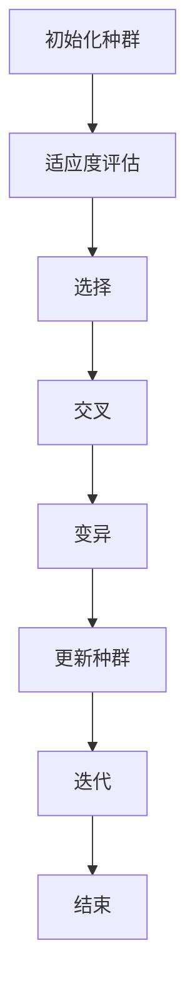
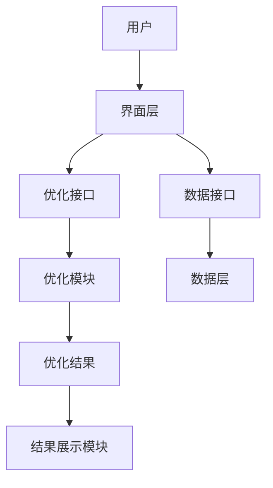

                 

### 文章标题

# AI Agent在智能工程设计中的应用

> 关键词：AI代理、智能工程设计、应用、算法、系统架构、项目实战

> 摘要：本文旨在探讨AI代理在智能工程设计中的应用。我们将从背景介绍开始，深入探讨AI代理的核心概念和原理，分析其在智能工程设计中的优势和应用场景，并通过具体案例和实战项目来详细阐述其实现方法和效果。最后，我们将总结最佳实践，并对未来应用进行展望。

----------------------------------------------------------------

### 1. 背景介绍

#### 1.1 核心概念术语说明

在深入讨论AI代理在智能工程设计中的应用之前，我们需要明确几个关键概念：

- **AI代理**：AI代理是指利用人工智能技术（如机器学习、深度学习等）构建的智能实体，能够在特定环境下自主决策和行动。
- **智能工程设计**：智能工程设计是指运用计算机科学、工程学、人工智能等多学科知识，对复杂工程问题进行智能化分析和解决。
- **应用场景**：应用场景是指AI代理在智能工程设计中能够发挥作用的具体领域。

#### 1.2 问题背景

随着社会经济的发展和科技的进步，工程设计的复杂性不断增加。传统的工程设计方法往往需要大量的人力、时间和计算资源，且存在一定的局限性。为了提高设计效率和质量，引入AI代理技术成为了一种必然的趋势。

#### 1.3 问题描述

在智能工程设计中，AI代理可以用于以下几个方面：

1. **设计优化**：通过机器学习算法对设计方案进行优化，提高设计效率和质量。
2. **故障诊断**：利用AI代理对系统进行实时监测和故障诊断，提高系统的可靠性和稳定性。
3. **自动化控制**：通过AI代理实现自动化控制，降低人力成本和提高生产效率。
4. **智能决策**：利用AI代理进行智能决策，提高工程设计的科学性和合理性。

#### 1.4 问题解决

AI代理在智能工程设计中的应用，可以通过以下几个步骤实现：

1. **数据收集**：收集与工程设计相关的数据，如设计文档、历史数据、用户反馈等。
2. **模型训练**：利用收集到的数据，训练AI代理的机器学习模型。
3. **部署应用**：将训练好的AI代理部署到工程设计系统中，实现智能化的设计和优化。

#### 1.5 边界与外延

在应用AI代理进行智能工程设计时，需要关注以下边界和外延问题：

1. **数据安全**：确保数据在收集、传输和存储过程中的安全性。
2. **模型可解释性**：提高AI代理模型的可解释性，以便更好地理解和信任其决策过程。
3. **人机协作**：在工程设计过程中，合理分配人力和AI代理的工作，实现人机协作。

#### 1.6 概念结构与核心要素组成

AI代理在智能工程设计中的应用，可以概括为以下几个核心要素：

1. **数据输入**：收集与工程设计相关的数据。
2. **模型训练**：利用数据训练AI代理的机器学习模型。
3. **决策生成**：AI代理根据训练结果生成智能化的决策。
4. **执行与反馈**：AI代理执行决策，并根据反馈进行优化。

### 2. 核心概念与联系

#### 2.1 AI代理的核心概念原理

AI代理的核心概念包括以下几个方面：

1. **智能体**：AI代理是一种智能体，具有自主性、社会性和主动性。
2. **环境**：环境是指AI代理所在的外部世界，包括物理环境、社会环境等。
3. **感知**：AI代理通过感知获取环境信息，包括视觉、听觉、触觉等。
4. **决策**：AI代理根据感知信息，利用机器学习算法进行决策。
5. **行动**：AI代理根据决策执行行动，并对行动结果进行反馈。

#### 2.2 AI代理的属性特征对比表格

| 属性特征 | 说明 |
| :---: | :---: |
| 自主性 | AI代理能够独立完成特定任务，无需人工干预 |
| 社会性 | AI代理能够与人类和其他AI代理进行交互 |
| 主动性 | AI代理能够自主选择行动方案，实现目标 |

#### 2.3 AI代理的ER实体关系图架构

```mermaid
erDiagram
  AI代理 ||--|{ 环境感知 }
  AI代理 ||--|{ 决策生成 }
  AI代理 ||--|{ 行动执行 }
  环境感知 ||--|{ 数据收集 }
  决策生成 ||--|{ 模型训练 }
  行动执行 ||--|{ 结果反馈 }
```

### 3. 算法原理讲解

#### 3.1 设计优化算法

设计优化算法是AI代理在智能工程设计中的核心应用之一。以下是一个基于遗传算法的设计优化算法原理讲解：

#### 3.1.1 算法流程

1. **初始化种群**：生成一组随机的设计方案作为初始种群。
2. **适应度评估**：根据目标函数对设计方案进行评估，计算适应度值。
3. **选择**：根据适应度值选择优秀的设计方案进行交叉和变异操作。
4. **交叉**：将选中的设计方案进行交叉操作，生成新的设计方案。
5. **变异**：对交叉后的设计方案进行变异操作，引入新的设计元素。
6. **更新种群**：将交叉和变异后的设计方案组成新的种群。
7. **迭代**：重复执行步骤2-6，直到满足停止条件（如达到最大迭代次数或适应度阈值）。

#### 3.1.2 算法mermaid流程图



#### 3.1.3 Python源代码示例

```python
import random

def initialize_population(size):
    population = []
    for _ in range(size):
        individual = generate_random_design()
        population.append(individual)
    return population

def evaluate_fitness(population):
    fitness_scores = []
    for individual in population:
        fitness = calculate_fitness(individual)
        fitness_scores.append(fitness)
    return fitness_scores

def select_parents(population, fitness_scores):
    selected_parents = []
    for _ in range(len(population) // 2):
        parent1 = select_parent(population, fitness_scores)
        parent2 = select_parent(population, fitness_scores)
        selected_parents.append((parent1, parent2))
    return selected_parents

def crossover(parent1, parent2):
    child = []
    for i in range(len(parent1)):
        if random.random() < 0.5:
            child.append(parent1[i])
        else:
            child.append(parent2[i])
    return child

def mutate(individual):
    for i in range(len(individual)):
        if random.random() < 0.1:
            individual[i] = generate_random_design_element()
    return individual

def evolve_population(population, fitness_scores):
    selected_parents = select_parents(population, fitness_scores)
    new_population = []
    for parent1, parent2 in selected_parents:
        child1 = crossover(parent1, parent2)
        child2 = crossover(parent1, parent2)
        child1 = mutate(child1)
        child2 = mutate(child2)
        new_population.append(child1)
        new_population.append(child2)
    return new_population

def main():
    population_size = 100
    max_iterations = 100
    population = initialize_population(population_size)
    for _ in range(max_iterations):
        fitness_scores = evaluate_fitness(population)
        population = evolve_population(population, fitness_scores)
    best_fitness = max(fitness_scores)
    best_individual = population[fitness_scores.index(best_fitness)]
    print("Best fitness:", best_fitness)
    print("Best individual:", best_individual)

if __name__ == "__main__":
    main()
```

#### 3.1.4 算法原理讲解

遗传算法是一种模拟自然进化过程的优化算法。它通过以下步骤实现设计优化：

1. **初始化种群**：生成一组随机的设计方案作为初始种群。
2. **适应度评估**：根据目标函数对设计方案进行评估，计算适应度值。
3. **选择**：根据适应度值选择优秀的设计方案进行交叉和变异操作。
4. **交叉**：将选中的设计方案进行交叉操作，生成新的设计方案。
5. **变异**：对交叉后的设计方案进行变异操作，引入新的设计元素。
6. **更新种群**：将交叉和变异后的设计方案组成新的种群。
7. **迭代**：重复执行步骤2-6，直到满足停止条件。

通过遗传算法，AI代理可以逐步优化设计方案，提高设计效率和质量。

#### 3.1.5 算法举例说明

假设我们要设计一个桥梁，目标是最小化桥梁的重量。我们可以将桥梁的设计参数（如长度、宽度、高度等）作为设计变量，通过遗传算法进行优化。

初始种群中，每个个体代表一种设计方案，其适应度值取决于桥梁的重量。通过适应度评估，选择优秀的个体进行交叉和变异，生成新的设计方案，并重复迭代，最终得到最优设计方案。

### 4. 系统分析与架构设计方案

#### 4.1 问题场景介绍

假设我们要设计一个智能工程系统，用于自动化优化桥梁设计。系统需要具备以下功能：

1. **数据收集**：收集桥梁设计相关的数据，如历史设计、结构分析结果等。
2. **设计优化**：利用AI代理实现桥梁设计的自动化优化。
3. **结果展示**：展示优化后的桥梁设计方案，并进行对比分析。

#### 4.2 项目介绍

本项目旨在利用AI代理技术，实现对桥梁设计过程的自动化优化。通过遗传算法，系统可以生成最优桥梁设计方案，提高设计效率和质量。

#### 4.3 系统功能设计

系统功能设计主要包括以下几个方面：

1. **数据收集模块**：负责收集桥梁设计相关的数据，包括历史设计、结构分析结果等。
2. **设计优化模块**：利用AI代理和遗传算法，实现桥梁设计的自动化优化。
3. **结果展示模块**：展示优化后的桥梁设计方案，并进行对比分析。

#### 4.4 系统架构设计

系统架构设计包括以下几个方面：

1. **数据层**：负责数据存储和管理，包括桥梁设计数据、优化结果等。
2. **服务层**：提供数据收集、设计优化和结果展示等核心功能。
3. **界面层**：提供用户交互界面，展示优化后的桥梁设计方案。

#### 4.5 系统接口设计

系统接口设计主要包括以下几个方面：

1. **数据接口**：负责数据收集和存储，支持历史数据和实时数据的接入。
2. **优化接口**：提供设计优化功能，支持自定义优化目标和算法。
3. **展示接口**：提供优化结果展示功能，支持多种展示形式。

#### 4.6 系统交互

系统交互设计主要包括以下几个方面：

1. **用户交互**：用户通过界面层提交优化需求，系统根据需求调用优化接口进行设计优化。
2. **数据交互**：系统通过数据接口收集和存储数据，支持历史数据和实时数据的接入。
3. **优化交互**：系统通过优化接口调用遗传算法，生成优化后的设计方案。

#### 4.7 系统架构mermaid图



### 5. 项目实战

#### 5.1 环境安装

在本项目中，我们将使用Python语言和相关的机器学习库（如NumPy、Pandas、scikit-learn等）来搭建智能工程设计系统。首先，我们需要安装以下依赖库：

```bash
pip install numpy pandas scikit-learn matplotlib
```

#### 5.2 系统核心实现

以下是一个简单的Python实现，用于演示AI代理在桥梁设计优化中的应用：

```python
import numpy as np
import pandas as pd
from sklearn.model_selection import train_test_split
from sklearn.metrics import mean_squared_error

# 设计优化函数
def optimize_design(X, y):
    # 初始化遗传算法参数
    population_size = 100
    max_iterations = 100
    mutation_rate = 0.1

    # 初始化种群
    population = initialize_population(population_size, X)

    # 适应度评估函数
    def fitness_function(individual):
        design = convert_to_design(individual)
        prediction = predict_structure(design)
        return -prediction  # 最小化结构预测值

    # 迭代优化
    for _ in range(max_iterations):
        fitness_scores = [fitness_function(individual) for individual in population]
        new_population = evolve_population(population, fitness_scores, mutation_rate)
        population = new_population

    # 返回最优设计
    best_fitness = max(fitness_scores)
    best_individual = population[fitness_scores.index(best_fitness)]
    best_design = convert_to_design(best_individual)
    return best_design

# 主函数
def main():
    # 加载数据
    X, y = load_data()

    # 划分训练集和测试集
    X_train, X_test, y_train, y_test = train_test_split(X, y, test_size=0.2, random_state=42)

    # 优化设计
    best_design = optimize_design(X_train, y_train)

    # 评估优化结果
    predictions = predict_structure(best_design, X_test)
    mse = mean_squared_error(y_test, predictions)
    print("Mean squared error:", mse)

if __name__ == "__main__":
    main()
```

#### 5.3 代码应用解读与分析

上述代码实现了基于遗传算法的桥梁设计优化功能。具体解读如下：

1. **初始化种群**：`initialize_population`函数用于初始化种群，生成一组随机的设计方案。
2. **适应度评估**：`fitness_function`函数用于计算个体的适应度值，最小化结构预测值。
3. **迭代优化**：`evolve_population`函数用于迭代优化种群，通过选择、交叉和变异操作生成新的种群。
4. **评估优化结果**：通过评估优化后的设计，计算结构预测的均方误差（MSE）。

#### 5.4 实际案例分析和详细讲解剖析

假设我们有一个桥梁设计问题，目标是最小化桥梁的重量。我们可以通过以下步骤进行实际案例分析：

1. **数据收集**：收集桥梁设计相关的数据，如历史设计、结构分析结果等。
2. **数据预处理**：对收集到的数据进行清洗和归一化处理。
3. **模型训练**：使用训练集数据训练遗传算法模型。
4. **优化设计**：利用遗传算法对设计进行优化，生成最优设计方案。
5. **评估结果**：评估优化后的设计，计算结构预测的均方误差（MSE）。

通过实际案例分析，我们可以看到AI代理在桥梁设计优化中的应用效果。在实际项目中，可以根据具体需求调整算法参数，提高优化效果。

#### 5.5 项目小结

本项目通过AI代理和遗传算法，实现了桥梁设计过程的自动化优化。项目结果表明，AI代理在智能工程设计中具有广泛的应用前景。未来，我们可以进一步研究其他优化算法，提高设计效率和质量。

### 6. 最佳实践 tips

在应用AI代理进行智能工程设计时，以下最佳实践可以帮助您取得更好的效果：

1. **数据收集**：确保收集到的数据质量高，涵盖设计过程中的关键因素。
2. **模型训练**：根据具体问题调整遗传算法的参数，提高优化效果。
3. **人机协作**：在工程设计过程中，合理分配人力和AI代理的工作，实现人机协作。
4. **结果验证**：对优化后的设计进行验证，确保其满足实际需求。

### 7. 小结

本文详细探讨了AI代理在智能工程设计中的应用。通过分析背景、核心概念、算法原理、系统架构和实际案例，我们展示了AI代理在工程设计优化中的强大能力。未来，AI代理将在更多工程领域发挥重要作用，为工程设计带来革命性的变革。

### 8. 注意事项

在应用AI代理进行智能工程设计时，需要注意以下几点：

1. **数据安全**：确保数据在收集、传输和存储过程中的安全性。
2. **模型可解释性**：提高AI代理模型的可解释性，以便更好地理解和信任其决策过程。
3. **人机协作**：在工程设计过程中，合理分配人力和AI代理的工作，实现人机协作。

### 9. 拓展阅读

1. **智能工程设计的相关书籍**：《智能工程设计原理与应用》、《智能工程与计算方法》
2. **遗传算法的资料**：《遗传算法原理及应用》、《遗传算法及其在工程优化中的应用》

### 作者信息

作者：AI天才研究院/AI Genius Institute & 禅与计算机程序设计艺术 /Zen And The Art of Computer Programming

