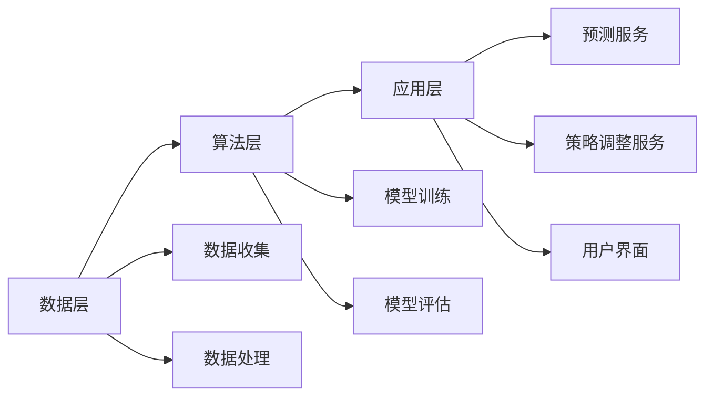

                 


## AI Agent在智能广告效果预测中的应用

### 关键词：AI Agent，智能广告效果预测，机器学习，数据挖掘，深度学习

> 摘要：本文将深入探讨AI Agent在智能广告效果预测中的应用。我们将首先介绍AI Agent的基础概念和智能广告效果预测的基本原理，然后详细分析AI Agent如何应用于广告效果预测。文章最后，我们将探讨AI Agent在广告效果预测中的实际案例、局限性以及未来的发展方向。

### 目录大纲

1. **第一部分：背景与基础**

   1.1 **问题背景与核心概念**
   
   1.2 **核心概念与联系**

2. **第二部分：AI Agent原理**

   2.1 **AI Agent原理**
   
   2.2 **智能广告效果预测原理**
   
   2.3 **AI Agent在智能广告效果预测中的应用**

3. **第三部分：实践应用**

   3.1 **环境准备与系统架构设计**
   
   3.2 **项目实战**
   
   3.3 **最佳实践与注意事项**

### 第一部分：背景与基础

#### 1.1 问题背景与核心概念

在当今数字营销领域，广告主和企业越来越依赖于智能广告来提高品牌曝光度和销售额。然而，如何有效预测广告的效果，以提高广告的投资回报率（ROI），成为了一个关键问题。

AI Agent，作为一种新型的智能系统，具有自主学习和决策能力。它能够在复杂的广告环境中，根据用户的兴趣和行为数据，预测广告的效果，从而优化广告投放策略。

#### 1.2 核心概念与联系

- **AI Agent**：AI Agent是一种能够模拟人类智能行为的人工智能系统，它具有感知、学习、推理和行动的能力。
  
- **智能广告效果预测**：智能广告效果预测是利用机器学习和数据挖掘技术，分析用户行为数据，预测广告的效果，从而优化广告策略。

- **联系**：AI Agent通过分析用户行为数据，利用机器学习算法，预测广告的效果，从而帮助广告主和企业优化广告投放策略。

### 第二部分：AI Agent原理

#### 2.1 AI Agent原理

AI Agent的工作原理可以概括为以下四个步骤：

1. **感知**：AI Agent通过传感器或用户输入获取外部信息。

2. **学习**：AI Agent利用历史数据和机器学习算法，对获取的信息进行分析和学习。

3. **推理**：AI Agent根据学习到的知识和规则，进行逻辑推理，形成决策。

4. **行动**：AI Agent根据推理结果，执行相应的操作，如投放广告。

#### 2.2 智能广告效果预测原理

智能广告效果预测的基本原理是利用机器学习和数据挖掘技术，对用户行为数据进行分析，预测广告的效果。

这个过程通常包括以下几个步骤：

1. **数据收集**：收集用户的行为数据，如点击次数、浏览时间、购买行为等。

2. **数据处理**：对收集到的数据进行清洗、去噪和处理。

3. **特征提取**：从处理后的数据中提取有用的特征。

4. **模型构建**：利用提取的特征，构建预测模型。

5. **模型优化**：对模型进行训练和优化，提高预测准确性。

6. **效果预测**：利用优化后的模型，预测广告的效果。

#### 2.3 AI Agent在智能广告效果预测中的应用

AI Agent在智能广告效果预测中的应用主要体现在以下几个方面：

1. **个性化推荐**：AI Agent可以根据用户的历史行为和兴趣，推荐个性化的广告。

2. **效果预测**：AI Agent可以根据用户行为数据，预测广告的效果，优化广告投放策略。

3. **自动调整**：AI Agent可以根据预测结果，自动调整广告的投放时间和频率。

4. **实时反馈**：AI Agent可以实时收集用户反馈，调整广告内容，提高广告的吸引力。

### 第三部分：实践应用

#### 3.1 环境准备与系统架构设计

在本部分，我们将介绍如何准备实验环境，设计系统架构，并实现系统功能。

#### 3.2 项目实战

在本部分，我们将通过一个实际案例，详细讲解如何使用AI Agent进行智能广告效果预测。

#### 3.3 最佳实践与注意事项

在本部分，我们将总结最佳实践，并提供一些注意事项，以确保AI Agent在智能广告效果预测中的有效应用。

### 总结

AI Agent在智能广告效果预测中具有巨大的潜力。通过本文的探讨，我们了解了AI Agent的基本原理和智能广告效果预测的基本原理，并看到了AI Agent在广告效果预测中的应用。未来的研究将继续探索AI Agent在广告效果预测中的更多应用场景，以实现更加精准和高效的广告投放。

### 作者信息

- 作者：AI天才研究院/AI Genius Institute & 禅与计算机程序设计艺术 /Zen And The Art of Computer Programming

### 后续工作

未来的工作将集中在以下几个方面：

1. **算法优化**：深入研究机器学习算法，提高AI Agent在广告效果预测中的准确性。

2. **数据挖掘**：探索更多用户行为数据，提高AI Agent的预测能力。

3. **实时反馈**：实现实时用户反馈系统，动态调整广告内容，提高广告的吸引力。

4. **多模态融合**：结合多种数据源，如视觉、音频和文本，提高AI Agent的感知能力。

5. **安全性**：研究AI Agent的安全性和隐私保护机制，确保用户数据的保密性和安全性。 

### 1.1 问题背景与核心概念

在当今数字化时代，广告主和营销人员面临的挑战是如何在众多竞争者中脱颖而出，吸引目标用户的注意力。传统的广告效果预测方法，如基于规则的系统或简单的统计分析，往往无法满足这种需求，因为它们无法准确捕捉用户行为的复杂性和多样性。

**AI Agent**，作为一种先进的智能体，具有自主学习和适应环境的能力，可以在广告效果预测中发挥重要作用。AI Agent是一种能够模拟人类智能行为的人工智能系统，它不仅能够感知用户行为数据，还能根据这些数据做出决策，优化广告投放策略。

在广告效果预测中，AI Agent的核心概念包括：

- **用户行为分析**：收集并分析用户的浏览历史、点击行为、购买记录等，以了解用户的兴趣和需求。

- **机器学习算法**：使用机器学习算法，如决策树、随机森林、支持向量机、深度学习等，从数据中提取有价值的信息，预测广告效果。

- **自适应调整**：根据预测结果，自动调整广告投放策略，如调整广告展示频率、投放时间和内容。

- **个性化推荐**：基于用户行为数据和偏好，为用户提供个性化的广告推荐，提高广告点击率和转化率。

#### 问题背景

随着互联网的普及和移动设备的广泛使用，广告市场变得高度竞争。广告主需要在海量用户数据中找到有效的方法来定位潜在客户，提高广告的投放效率。然而，传统的方法往往存在以下问题：

- **数据依赖性**：传统方法需要大量手动数据输入和预处理，效率低下。

- **预测准确性**：传统方法往往无法准确预测用户行为，导致广告投放效果不佳。

- **反应速度**：传统方法在调整广告投放策略时，往往需要较长时间，无法实时响应市场变化。

为了解决这些问题，广告主和企业开始探索使用AI Agent来提高广告效果预测的准确性、效率和适应性。

#### 问题描述

广告效果预测的主要问题包括：

- **用户行为多样化**：用户的行为模式复杂多变，传统方法难以捕捉到这些变化。

- **广告环境动态变化**：广告市场环境不断变化，广告主需要快速适应这些变化，提高广告投放的针对性。

- **数据噪声和缺失**：用户数据可能存在噪声和缺失，传统方法在处理这些问题时效果不佳。

- **效果评估困难**：如何准确评估广告效果，是一个长期困扰广告主的问题。

为了解决这些问题，AI Agent提供了以下解决方案：

- **自动化数据分析**：AI Agent可以自动收集、处理和分析用户数据，提高数据分析的效率和准确性。

- **自适应调整策略**：AI Agent可以根据用户行为数据，自适应调整广告投放策略，提高广告效果。

- **个性化推荐**：AI Agent可以基于用户行为和偏好，为用户推荐个性化的广告，提高广告点击率和转化率。

- **实时效果评估**：AI Agent可以实时评估广告效果，为广告主提供即时的反馈，帮助其调整广告策略。

#### 问题解决

AI Agent在广告效果预测中的应用主要包括以下几个步骤：

1. **数据收集**：AI Agent可以自动收集用户行为数据，如浏览历史、点击行为、购买记录等。

2. **数据处理**：AI Agent对收集到的数据进行分析、清洗和预处理，提取有价值的信息。

3. **模型训练**：AI Agent利用机器学习算法，从处理后的数据中训练预测模型。

4. **预测与调整**：AI Agent根据训练好的模型，预测广告效果，并实时调整广告投放策略。

5. **效果评估**：AI Agent可以实时评估广告效果，为广告主提供详细的报告。

#### 边界与外延

在应用AI Agent进行广告效果预测时，需要注意以下边界和限制：

- **数据质量**：数据质量对预测效果至关重要。如果数据存在噪声、缺失或不一致，可能会导致预测不准确。

- **模型复杂性**：复杂的模型可能会提高预测准确性，但同时也增加了计算成本和训练时间。

- **实时性**：实时预测和调整广告投放策略对计算资源和网络延迟有较高要求。

- **隐私保护**：在收集和使用用户数据时，需要严格遵守隐私保护法规，保护用户隐私。

- **可解释性**：为了确保AI Agent的决策过程透明，需要开发可解释的AI技术，帮助广告主理解模型决策。

#### 概念结构与核心要素组成

AI Agent在广告效果预测中的概念结构可以概括为以下几个核心要素：

- **感知系统**：负责收集用户行为数据。

- **学习系统**：利用机器学习算法，从数据中提取特征，训练预测模型。

- **决策系统**：根据预测模型，生成广告投放策略。

- **执行系统**：执行广告投放策略，并收集用户反馈。

- **评估系统**：实时评估广告效果，为下一步决策提供数据支持。

通过这些核心要素的协同工作，AI Agent可以实现对广告效果的高效预测和优化。

### 1.2 核心概念与联系

在深入探讨AI Agent在智能广告效果预测中的应用之前，我们需要先了解几个核心概念，并分析它们之间的联系。

#### 2.1 AI Agent的定义与特点

AI Agent，即人工智能代理，是一种具有自主学习和决策能力的人工智能系统。它能够通过感知环境、收集数据、学习知识和规则，进行推理和决策，并执行相应的行动。AI Agent的主要特点包括：

- **自主性**：AI Agent能够自主运行，不需要人工干预。

- **适应性**：AI Agent可以根据环境变化和反馈，自适应调整行为。

- **学习能力**：AI Agent能够通过学习历史数据和经验，提高决策能力。

- **推理能力**：AI Agent能够根据学习和收集到的信息，进行逻辑推理和决策。

- **协同性**：AI Agent可以与其他AI Agent或人类协同工作，提高整体效率。

#### 2.2 智能广告效果预测的基本概念

智能广告效果预测是指利用人工智能技术，对广告投放效果进行预测和分析。其核心概念包括：

- **用户行为数据**：包括用户的浏览历史、点击行为、购买记录等。

- **特征提取**：从用户行为数据中提取有价值的特征，用于构建预测模型。

- **预测模型**：利用机器学习算法，如决策树、支持向量机、深度学习等，构建预测广告效果的模型。

- **评估指标**：用于评估预测模型准确性的指标，如准确率、召回率、F1分数等。

- **优化策略**：根据预测结果，调整广告投放策略，如调整广告展示频率、投放时间和内容。

#### 2.3 AI Agent与智能广告效果预测的联系

AI Agent在智能广告效果预测中的应用，主要体现在以下几个方面：

1. **数据收集与处理**：AI Agent可以通过传感器或其他方式收集用户行为数据，并进行预处理和特征提取，为预测模型提供高质量的数据输入。

2. **模型构建与优化**：AI Agent可以利用机器学习算法，自动构建和优化预测模型，提高预测准确性。

3. **实时调整**：AI Agent可以根据实时反馈，自动调整广告投放策略，提高广告效果。

4. **协同工作**：AI Agent可以与其他AI Agent或人类专家协同工作，提高整体效率和效果。

#### 2.4 概念属性特征对比表格

为了更好地理解AI Agent和智能广告效果预测的核心概念及其联系，我们可以通过以下对比表格来展示它们的主要属性特征：

| 概念     | 属性特征                                       |
|----------|------------------------------------------------|
| AI Agent | 自主性、适应性、学习能力、推理能力、协同性       |
| 用户行为 | 浏览历史、点击行为、购买记录                   |
| 特征提取 | 数据预处理、特征选择、特征转换                   |
| 预测模型 | 算法选择、模型训练、模型评估                   |
| 评估指标 | 准确率、召回率、F1分数等                       |
| 优化策略 | 广告展示频率、投放时间、内容调整               |

#### 2.5 ER实体关系图架构

为了更直观地展示AI Agent、用户行为数据和广告效果预测之间的实体关系，我们可以使用ER（Entity-Relationship）实体关系图来描述：

```mermaid
erDiagram
  User ||--|{ AI_Agent : predicts }
  User ||--|{ Ad.Predict.Model : trains }
  User ||--|{ Ad.Effect : feedbacks }
  Ad.Predict.Model ||--|{ Evaluation.Metrics : evaluates }
  Ad.Predict.Model ||--|{ Optimization.Strategy : optimizes }
```

在这个ER图中，用户（User）作为核心实体，与AI Agent、广告预测模型（Ad.Predict.Model）、广告效果（Ad.Effect）等实体之间存在多种关联关系。通过这种实体关系图的描述，我们可以清晰地看到AI Agent在智能广告效果预测中的角色和作用。

### 2.1 AI Agent的工作原理

AI Agent作为一种具有高度自主性和自适应能力的人工智能系统，其工作原理可以分为感知、学习、推理和行动四个主要步骤。下面，我们将详细探讨每个步骤的具体过程。

#### 1. 感知

感知是AI Agent的第一步，它通过传感器或用户输入获取外部信息。这些外部信息可能包括用户的浏览历史、点击行为、搜索关键词、地理位置等。感知系统的目标是识别和提取这些信息，并将其转换为AI Agent可以处理的数据格式。

**示例**：在一个智能广告系统中，AI Agent可能会通过网页分析技术收集用户的浏览历史和点击行为，识别用户的兴趣点。

#### 2. 学习

一旦AI Agent收集到外部信息，它就需要通过学习来处理这些信息。学习过程通常涉及机器学习算法，如决策树、支持向量机、神经网络等。AI Agent会利用历史数据和这些算法来分析信息，提取有用的模式和规律。

**示例**：在一个广告效果预测系统中，AI Agent可能会使用决策树算法来分析用户的点击行为，识别哪些特征对广告点击率有显著影响。

#### 3. 推理

在学习的阶段，AI Agent提取了大量的特征和模式。接下来，它需要利用这些信息进行推理，形成决策。推理过程通常涉及逻辑推理和概率推理，AI Agent会根据学习和感知的结果，做出相应的决策。

**示例**：在一个广告投放优化系统中，AI Agent可能会根据用户的浏览历史和兴趣，决定何时、向何人展示哪些广告。

#### 4. 行动

行动是AI Agent的最终输出。在做出决策后，AI Agent会执行相应的操作，如调整广告展示策略、发送个性化推荐等。行动的目的是将推理结果应用到实际场景中，以实现预期的目标。

**示例**：在一个广告投放系统中，AI Agent可能会根据推理结果，调整广告的展示频率和投放时间，以提高广告的点击率和转化率。

#### 总结

AI Agent的工作原理可以概括为感知、学习、推理和行动四个步骤。感知是收集外部信息，学习是提取和处理这些信息，推理是形成决策，行动是将决策应用到实际场景中。通过这四个步骤的协同工作，AI Agent能够实现自主学习和自适应决策，从而在广告效果预测中发挥重要作用。

### 2.2 AI Agent的主要类型

AI Agent根据其功能和应用场景的不同，可以分为多种类型。以下是几种常见的AI Agent类型及其特点：

#### 1. 监控型AI Agent

**特点**：监控型AI Agent主要用于监控和分析环境中的特定事件或行为。它们能够实时收集数据，检测异常情况，并自动生成报告或采取行动。

**应用场景**：网络安全监控、系统故障检测、工厂生产线监控等。

**示例**：一个监控型AI Agent可以实时监控网络流量，检测异常流量模式，并自动向管理员发送警报。

#### 2. 服务型AI Agent

**特点**：服务型AI Agent旨在为用户提供个性化的服务，如客服支持、在线咨询、预订服务等。它们能够通过自然语言处理和机器学习技术，理解用户需求，提供有针对性的解决方案。

**应用场景**：在线客服、智能助手、语音识别系统等。

**示例**：一个服务型AI Agent可以回答用户关于产品的问题，提供购买建议，甚至完成订单处理。

#### 3. 自动化型AI Agent

**特点**：自动化型AI Agent用于执行重复性任务，如数据录入、报告生成、自动化测试等。它们可以减少人工工作量，提高工作效率。

**应用场景**：数据录入、自动化测试、文档处理等。

**示例**：一个自动化型AI Agent可以自动收集和整理用户数据，生成报告，并发送电子邮件通知相关人员。

#### 4. 探索型AI Agent

**特点**：探索型AI Agent主要用于探索未知环境或领域，收集数据，并生成报告。它们通常具有较强的自主学习和适应能力。

**应用场景**：无人驾驶、空间探索、医疗诊断等。

**示例**：一个探索型AI Agent可以在无人驾驶汽车中，实时感知环境变化，做出驾驶决策，并收集道路数据。

#### 5. 决策型AI Agent

**特点**：决策型AI Agent主要用于辅助人类做出复杂决策，如金融投资、供应链管理、资源分配等。它们能够根据大量的数据和分析结果，生成最优决策。

**应用场景**：金融投资、供应链管理、资源分配等。

**示例**：一个决策型AI Agent可以帮助金融机构分析市场趋势，预测投资风险，并生成投资建议。

#### 总结

不同的AI Agent类型在功能和应用场景上各有侧重，但它们的共同目标是提高效率和智能化水平。通过具体的应用示例，我们可以看到AI Agent在不同领域的广泛应用，为各种复杂问题提供了有效的解决方案。

### 2.3 AI Agent的核心技术

AI Agent的核心技术包括机器学习、自然语言处理、计算机视觉和深度学习等。这些技术使得AI Agent能够在复杂的广告环境中进行有效的感知、学习和决策。

#### 1. 机器学习

机器学习是AI Agent的基础技术，它通过训练算法从数据中学习模式和规律。在广告效果预测中，机器学习技术可以用于用户行为分析、广告效果评估和广告投放策略优化。

**示例**：一个基于机器学习的AI Agent可以通过分析用户的历史点击数据，预测用户对某一广告的点击概率，从而优化广告投放。

#### 2. 自然语言处理

自然语言处理（NLP）是AI Agent理解和生成自然语言的技术。在广告效果预测中，NLP可以用于分析广告文案、用户评论和反馈，提取关键词和情感信息。

**示例**：一个基于NLP的AI Agent可以分析用户对广告文案的评论，识别用户对广告的正面或负面情感，从而优化广告文案。

#### 3. 计算机视觉

计算机视觉是AI Agent理解和分析图像和视频的技术。在广告效果预测中，计算机视觉可以用于广告展示效果的评估、广告内容识别和用户行为监测。

**示例**：一个基于计算机视觉的AI Agent可以在广告投放过程中，自动识别用户的注视点，评估广告的视觉吸引力，并根据用户的反应调整广告展示策略。

#### 4. 深度学习

深度学习是机器学习的一个分支，它通过多层神经网络模拟人类大脑的学习过程。在广告效果预测中，深度学习可以用于复杂的特征提取和模式识别，提高预测准确性。

**示例**：一个基于深度学习的AI Agent可以通过分析用户的浏览历史和点击行为，预测用户对某一广告的点击概率，从而优化广告投放策略。

#### 总结

AI Agent的核心技术包括机器学习、自然语言处理、计算机视觉和深度学习等。这些技术使得AI Agent能够在广告效果预测中实现高效的数据分析、决策支持和效果优化。通过这些核心技术的应用，AI Agent在广告投放过程中能够提供更智能、更个性化的服务，帮助广告主提高广告效果和投资回报率。

### 2.4 AI Agent的优缺点

AI Agent作为一种先进的智能系统，在广告效果预测中具有显著的优势，但也存在一些局限性。以下将从优缺点两个方面进行详细分析。

#### 优点

1. **高效性**：AI Agent能够自动收集、处理和分析大量的用户行为数据，比人工处理更快速、高效。

2. **准确性**：通过机器学习和深度学习算法，AI Agent可以从数据中提取有价值的信息，提高广告效果预测的准确性。

3. **个性化**：AI Agent可以根据用户的行为和兴趣，为用户提供个性化的广告推荐，提高广告的点击率和转化率。

4. **实时性**：AI Agent可以实时调整广告投放策略，根据用户反馈和实时数据，动态优化广告效果。

5. **可扩展性**：AI Agent能够灵活适应不同的广告场景和需求，扩展性强，适用于多种广告效果预测场景。

6. **自主性**：AI Agent具有自主学习和决策能力，可以减少人工干预，提高工作效率。

#### 缺点

1. **数据依赖性**：AI Agent的效果高度依赖于数据质量，如果数据存在噪声、缺失或不一致，可能会导致预测不准确。

2. **计算成本**：AI Agent的训练和预测过程需要大量的计算资源，特别是在处理大规模数据时，计算成本较高。

3. **复杂性**：AI Agent的构建和部署过程复杂，需要专业的技术和团队支持。

4. **隐私问题**：在收集和使用用户数据时，需要严格遵守隐私保护法规，否则可能引发用户隐私泄露的风险。

5. **可解释性**：AI Agent的决策过程通常较为复杂，难以解释，可能导致用户对AI Agent的信任度降低。

6. **适应性问题**：在某些特殊场景下，AI Agent可能无法适应复杂多变的广告环境，需要进一步优化和改进。

#### 总结

AI Agent在广告效果预测中具有高效性、准确性、个性化、实时性、可扩展性和自主性等显著优势，但也存在数据依赖性、计算成本、复杂性、隐私问题、可解释性和适应性问题等局限性。在应用AI Agent进行广告效果预测时，需要综合考虑这些优缺点，合理配置资源，确保AI Agent的有效应用。

### 2.5 AI Agent的发展趋势

随着人工智能技术的不断进步，AI Agent在广告效果预测中的应用也呈现出迅猛发展的趋势。以下从技术进步、行业应用和未来发展方向三个方面探讨AI Agent的发展趋势。

#### 1. 技术进步

首先，技术进步是推动AI Agent发展的关键因素。随着深度学习、强化学习和联邦学习等先进技术的不断发展，AI Agent在数据挖掘、特征提取和决策优化等方面的能力得到了显著提升。例如，深度学习技术的应用使得AI Agent能够处理更复杂的非线性数据，提高预测准确性；强化学习技术则使AI Agent能够通过不断试错，优化决策策略；联邦学习技术则允许多个实体在保持数据隐私的前提下共同训练模型，提高了AI Agent的协作能力。

#### 2. 行业应用

其次，AI Agent在广告效果预测中的行业应用也在不断扩展。随着数字营销的普及，越来越多的广告主和企业开始采用AI Agent来优化广告投放策略，提高广告效果。例如，在线零售商使用AI Agent分析用户购买行为，预测用户需求，优化商品推荐；广告平台利用AI Agent分析用户点击行为，调整广告投放策略，提高广告投放效果；媒体公司则利用AI Agent分析观众行为，优化内容推送，提高用户留存率。

#### 3. 未来发展方向

未来，AI Agent在广告效果预测中的应用将继续向以下方向发展：

- **多模态融合**：随着计算机视觉、自然语言处理和语音识别等技术的发展，AI Agent将能够处理多种类型的数据，实现多模态融合，提高预测准确性。

- **实时优化**：AI Agent将能够实现更实时的数据分析和决策，根据实时反馈动态调整广告投放策略，实现更精准的广告投放。

- **个性化推荐**：AI Agent将结合用户行为数据和个人偏好，提供更加个性化的广告推荐，提高用户满意度。

- **智能对话系统**：AI Agent将能够通过智能对话系统与用户进行互动，更好地理解用户需求，提供个性化的广告体验。

- **联邦学习与隐私保护**：AI Agent将采用联邦学习等技术，在保护用户隐私的同时，实现多个实体之间的数据共享和协同工作。

- **自适应性与自解释性**：AI Agent将不断提高自适应能力，根据环境变化动态调整行为。同时，通过开发可解释的AI技术，提高AI Agent决策过程的透明度和可信度。

#### 总结

随着人工智能技术的不断进步和行业应用的需求增长，AI Agent在广告效果预测中的应用前景广阔。未来，AI Agent将继续向多模态融合、实时优化、个性化推荐、智能对话系统、联邦学习与隐私保护、自适应性与自解释性等方向发展，为广告主和企业提供更智能、更高效的广告投放解决方案。

### 2.1 智能广告效果预测的基本原理

智能广告效果预测是通过人工智能技术，对广告投放的效果进行预测和分析的过程。其核心目标是提高广告的投资回报率（ROI），使广告主能够在有限的预算内，实现最佳的广告效果。以下将详细探讨智能广告效果预测的基本原理。

#### 1. 数据收集

数据收集是智能广告效果预测的第一步。广告主需要收集大量的用户行为数据，包括用户的浏览历史、点击行为、购买记录、搜索关键词等。这些数据通常来自广告平台、网站分析工具、数据库等。

**示例**：一个广告平台可能会收集用户的点击数据，记录用户每次点击的时间、广告类型、用户所处的地理位置等信息。

#### 2. 数据处理

收集到的数据通常需要进行处理，以提高数据的质量和可靠性。数据处理包括数据清洗、去噪、数据转换和特征提取等步骤。

- **数据清洗**：删除重复数据、处理缺失值、纠正错误数据等，确保数据的一致性和准确性。

- **去噪**：过滤掉噪声数据，如异常值和无关信息，以提高模型的预测准确性。

- **数据转换**：将原始数据转换为适合机器学习算法处理的形式，如数值化、归一化等。

- **特征提取**：从处理后的数据中提取有价值的特征，用于构建预测模型。

**示例**：在处理用户点击数据时，可以提取用户的点击时间、广告类型、点击次数等特征，作为模型输入。

#### 3. 模型构建

模型构建是智能广告效果预测的核心步骤。广告主需要利用机器学习算法，从处理后的数据中训练预测模型。常见的机器学习算法包括决策树、随机森林、支持向量机、神经网络等。

- **选择算法**：根据问题的特点和数据规模，选择合适的算法。

- **模型训练**：使用训练集数据，对算法进行训练，得到模型参数。

- **模型验证**：使用验证集数据，评估模型的预测性能，调整模型参数。

**示例**：使用决策树算法，对用户点击数据训练，构建点击率预测模型。

#### 4. 模型优化

模型优化是提高预测准确性的重要环节。广告主需要通过交叉验证、超参数调整等方法，对模型进行优化。

- **交叉验证**：将数据集划分为多个子集，反复训练和验证模型，以评估模型在不同数据集上的表现。

- **超参数调整**：调整模型参数，如树深度、学习率等，以提高模型的预测准确性。

**示例**：通过交叉验证，调整决策树模型的树深度，提高点击率预测模型的准确性。

#### 5. 预测与调整

在模型构建和优化完成后，广告主可以使用模型进行预测，并根据预测结果调整广告投放策略。

- **预测**：使用训练好的模型，对新的用户数据进行预测，评估广告的效果。

- **调整**：根据预测结果，调整广告的投放策略，如调整广告展示频率、投放时间和内容。

**示例**：根据预测结果，减少低点击率广告的展示频率，增加高点击率广告的曝光量。

#### 6. 模型评估

模型评估是确保预测结果可靠性的重要步骤。广告主需要使用评估指标，如准确率、召回率、F1分数等，评估模型的预测性能。

- **评估指标**：根据问题的特点，选择合适的评估指标。

- **评估过程**：使用测试集数据，对模型进行评估，评估模型的预测准确性。

**示例**：使用准确率评估点击率预测模型的性能，确保模型能够准确预测用户点击行为。

#### 总结

智能广告效果预测的基本原理包括数据收集、数据处理、模型构建、模型优化、预测与调整和模型评估等步骤。通过这些步骤的协同工作，广告主可以实现对广告效果的精准预测和优化，提高广告的投资回报率。

### 2.2 数据收集与处理

在智能广告效果预测中，数据收集与处理是关键的一步。有效的数据收集和处理能够提高预测模型的准确性和可靠性，从而优化广告投放策略。

#### 1. 数据源

数据源是智能广告效果预测的基础。广告主需要从多个渠道收集数据，包括：

- **用户行为数据**：用户的浏览历史、点击行为、搜索关键词、购买记录等。这些数据可以通过广告平台、网站分析工具和电子商务平台等渠道获取。

- **广告特征数据**：广告的展示次数、点击次数、转化次数等。这些数据可以帮助分析广告的表现，为预测提供依据。

- **环境特征数据**：广告展示的时间、地点、设备类型、网络环境等。这些数据可以帮助分析广告在不同环境下的表现，为优化广告投放提供参考。

#### 2. 数据收集方法

数据收集的方法主要包括自动采集和手动收集。

- **自动采集**：通过编程接口（API）或数据爬取技术，自动从各个数据源收集数据。这种方法效率高、成本低，但需要确保数据源的可访问性和数据的完整性。

- **手动收集**：通过问卷调查、用户访谈、在线调查等方式，手动收集数据。这种方法适用于获取详细的用户反馈和深层次的需求分析，但耗时较长、成本较高。

#### 3. 数据预处理

数据预处理是确保数据质量的重要步骤。常见的预处理方法包括数据清洗、数据去噪、数据转换和特征提取。

- **数据清洗**：去除重复数据、处理缺失值、纠正错误数据等，确保数据的一致性和准确性。

- **数据去噪**：过滤掉噪声数据，如异常值和无关信息，以提高模型的预测准确性。

- **数据转换**：将原始数据转换为适合机器学习算法处理的形式，如数值化、归一化等。

- **特征提取**：从处理后的数据中提取有价值的特征，用于构建预测模型。

**示例**：在处理用户点击数据时，可以提取用户的点击时间、广告类型、点击次数等特征，作为模型输入。

#### 4. 数据存储与管理

数据存储与管理是确保数据安全和可访问性的关键步骤。常用的数据存储与管理方法包括：

- **关系数据库**：适用于存储结构化数据，如用户行为数据。关系数据库具有强大的查询功能，便于数据的快速检索和分析。

- **数据仓库**：适用于存储大规模的、非结构化的数据，如日志数据。数据仓库支持复杂的查询和分析，适用于大数据处理。

- **分布式存储**：适用于处理海量数据，如广告特征数据。分布式存储可以提高数据存储的可靠性和访问速度。

- **数据治理**：确保数据的质量、一致性和安全性，包括数据质量检查、数据安全保护、数据权限管理等。

#### 总结

数据收集与处理是智能广告效果预测的重要环节。通过有效的数据收集方法、预处理技术和存储管理策略，广告主可以确保数据的质量和可靠性，为构建高精度的预测模型提供坚实基础。

### 2.3 模型构建与优化

在智能广告效果预测中，模型构建与优化是关键步骤，它决定了预测模型的性能和准确性。以下将详细介绍模型构建与优化的过程，包括数据集划分、选择合适的算法、模型训练与验证、超参数调整和交叉验证等内容。

#### 1. 数据集划分

首先，需要将数据集划分为训练集、验证集和测试集。这是为了在模型训练过程中，避免过拟合现象，确保模型具有较好的泛化能力。

- **训练集**：用于训练模型，构建预测模型的基础。
- **验证集**：用于验证模型参数，选择最优的模型参数。
- **测试集**：用于评估模型性能，确保模型在实际应用中具有较好的预测准确性。

**示例**：假设有10000条用户行为数据，可以将其划分为70%的训练集（7000条）、20%的验证集（2000条）和10%的测试集（1000条）。

#### 2. 选择合适的算法

选择合适的算法是模型构建的第一步。常见的算法包括决策树、随机森林、支持向量机、神经网络等。不同的算法适用于不同类型的数据和问题，广告主需要根据具体场景选择合适的算法。

- **决策树**：适用于分类问题，结构简单，易于理解。
- **随机森林**：基于决策树的集成方法，可以处理大量特征，提高预测准确性。
- **支持向量机**：适用于高维数据，适用于分类和回归问题。
- **神经网络**：适用于复杂的非线性问题，可以处理大量的特征。

**示例**：如果问题是一个二分类问题，且数据维度较高，可以选择随机森林或神经网络。

#### 3. 模型训练与验证

在确定算法后，需要进行模型训练。训练过程是将训练集数据输入到算法中，通过调整模型参数，使模型能够对数据进行分类或回归。

- **训练过程**：使用训练集数据，通过迭代计算，调整模型参数，使模型达到收敛。
- **验证过程**：使用验证集数据，评估模型性能，选择最优的模型参数。

**示例**：使用随机森林算法，通过迭代训练，调整树深度、学习率等参数，使模型达到最佳性能。

#### 4. 超参数调整

超参数是算法在训练过程中需要调整的参数，如树深度、学习率、正则化参数等。超参数的调整对模型性能有重要影响。

- **搜索策略**：常用的超参数搜索策略包括网格搜索、随机搜索、贝叶斯优化等。
- **调整方法**：通过交叉验证，对超参数进行调整，选择最优的超参数组合。

**示例**：使用网格搜索策略，对随机森林的树深度、学习率等进行调整，选择最优组合。

#### 5. 交叉验证

交叉验证是一种评估模型性能的方法，通过多次划分训练集和验证集，评估模型在不同数据集上的表现。

- **交叉验证方法**：常用的交叉验证方法包括K折交叉验证、留一法交叉验证等。
- **评估指标**：使用评估指标，如准确率、召回率、F1分数等，评估模型性能。

**示例**：使用K折交叉验证，对模型进行多次验证，评估模型的泛化能力。

#### 6. 模型优化

在完成模型训练和验证后，需要对模型进行优化，以提高模型性能。

- **优化方法**：通过调整模型结构、增加特征、改进算法等，优化模型。
- **评估标准**：根据评估指标，选择最优的模型。

**示例**：通过增加用户特征、改进算法，优化模型性能。

#### 总结

模型构建与优化是智能广告效果预测的重要环节。通过合理的数据集划分、选择合适的算法、模型训练与验证、超参数调整和交叉验证等方法，广告主可以构建高精度的预测模型，提高广告效果预测的准确性，优化广告投放策略。

### 2.4 模型评估与调整

在智能广告效果预测中，模型评估与调整是确保预测模型准确性和实用性的关键步骤。以下将详细讨论评估指标的选择、评估过程以及如何根据评估结果调整模型。

#### 1. 评估指标的选择

选择合适的评估指标对评估模型性能至关重要。常见的评估指标包括：

- **准确率（Accuracy）**：预测正确的样本占总样本的比例。适用于分类问题。

  $$\text{准确率} = \frac{\text{预测正确的样本数}}{\text{总样本数}}$$

- **召回率（Recall）**：实际为正类但被模型预测为正类的样本数占实际为正类的样本总数的比例。适用于分类问题。

  $$\text{召回率} = \frac{\text{预测正确的正类样本数}}{\text{实际为正类的样本总数}}$$

- **精确率（Precision）**：预测为正类且实际也为正类的样本数占预测为正类的样本总数的比例。适用于分类问题。

  $$\text{精确率} = \frac{\text{预测正确的正类样本数}}{\text{预测为正类的样本总数}}$$

- **F1分数（F1 Score）**：精确率和召回率的调和平均数，用于综合评价分类模型的性能。

  $$\text{F1分数} = 2 \times \frac{\text{精确率} \times \text{召回率}}{\text{精确率} + \text{召回率}}$$

- **ROC曲线和AUC（Area Under Curve）**：ROC曲线是不同分类阈值下的真正率（True Positive Rate）和假正率（False Positive Rate）的曲线。AUC值反映了模型对正负样本的区分能力。

- **均方误差（Mean Squared Error, MSE）**、**均方根误差（Root Mean Squared Error, RMSE）**：用于评估回归问题的预测误差。

  $$\text{MSE} = \frac{1}{n} \sum_{i=1}^{n} (\hat{y}_i - y_i)^2$$

  $$\text{RMSE} = \sqrt{\text{MSE}}$$

#### 2. 评估过程

评估过程通常包括以下步骤：

- **交叉验证**：通过交叉验证，将数据集划分为多个子集，对每个子集进行训练和验证，以评估模型在不同数据子集上的性能。

  **示例**：使用K折交叉验证，将数据集划分为K个子集，每次使用一个子集作为验证集，其余子集作为训练集，重复K次，取平均评估结果。

- **在线评估**：在实际应用中，使用新收集的数据对模型进行实时评估，以监控模型性能和调整策略。

  **示例**：每收集一定数量的新数据，使用训练好的模型进行预测，计算评估指标，并根据评估结果调整模型。

- **离线评估**：在模型部署前，使用测试集对模型进行离线评估，以确保模型性能满足预期要求。

  **示例**：使用测试集数据，计算模型评估指标，如准确率、召回率等，评估模型性能。

#### 3. 调整模型

根据评估结果，可能需要对模型进行调整，以提高模型性能。调整模型的方法包括：

- **超参数调整**：调整模型的超参数，如学习率、树深度等，以优化模型性能。

  **示例**：通过网格搜索、贝叶斯优化等方法，找到最优的超参数组合。

- **特征工程**：改进特征提取和选择方法，提取更多有价值的特征，提高模型预测准确性。

  **示例**：增加用户行为特征、广告特征等，以提高模型对广告效果的预测能力。

- **算法改进**：尝试使用不同的机器学习算法，如决策树、随机森林、支持向量机、神经网络等，找到最适合问题的算法。

  **示例**：通过比较不同算法的性能，选择最优的算法。

- **集成学习**：将多个模型集成，提高预测准确性。

  **示例**：使用集成学习算法，如随机森林、梯度提升树等，集成多个模型，提高整体预测性能。

#### 总结

模型评估与调整是智能广告效果预测的重要环节。通过选择合适的评估指标、进行交叉验证和在线评估，以及根据评估结果调整模型，广告主可以构建高精度的预测模型，提高广告投放的准确性和效果，实现更好的广告策略优化。

### 2.5 智能广告效果预测的挑战

在实现智能广告效果预测的过程中，广告主和企业面临着诸多挑战。以下从数据隐私、计算成本、模型解释性和可扩展性等方面，详细讨论智能广告效果预测的挑战。

#### 1. 数据隐私

广告效果预测需要大量用户行为数据，如浏览历史、点击记录和购买行为等。这些数据涉及用户的隐私，数据收集和处理过程中可能引发以下问题：

- **隐私泄露**：在数据收集、存储和处理过程中，数据可能被未授权访问或泄露，导致用户隐私泄露。

- **数据滥用**：广告主可能滥用用户数据，进行不当的营销活动，损害用户权益。

- **法规合规**：不同国家和地区对用户隐私保护的法规不同，广告主需要确保数据收集和处理符合相关法律法规。

**解决方案**：为了解决数据隐私问题，可以采取以下措施：

- **数据匿名化**：对用户数据进行匿名化处理，避免直接关联用户身份。

- **加密技术**：使用加密技术保护用户数据的存储和传输过程。

- **隐私保护算法**：采用差分隐私、同态加密等隐私保护算法，确保数据在分析过程中不被泄露。

- **用户权限管理**：对用户数据的访问权限进行严格管理，确保只有授权人员才能访问和处理数据。

#### 2. 计算成本

智能广告效果预测通常涉及大量数据的处理和复杂的模型训练。计算成本包括：

- **存储成本**：大量数据需要存储，尤其是处理大规模用户行为数据时，存储成本显著增加。

- **计算资源**：模型训练和预测过程需要大量的计算资源，特别是在处理高维数据和复杂模型时。

- **能耗成本**：高性能计算设备能耗较高，导致能源消耗和运营成本增加。

**解决方案**：为了降低计算成本，可以采取以下措施：

- **分布式计算**：利用分布式计算框架，如Hadoop、Spark等，将计算任务分布在多个节点上，提高计算效率。

- **云计算**：采用云计算服务，根据实际计算需求动态调整资源分配，降低计算成本。

- **模型压缩**：采用模型压缩技术，如模型剪枝、量化等，减小模型体积，提高计算效率。

- **预训练模型**：使用预训练模型，减少训练时间和计算资源需求。

#### 3. 模型解释性

智能广告效果预测依赖于复杂的机器学习模型，如深度学习模型。这些模型具有较高的预测准确性，但往往缺乏解释性，导致以下问题：

- **黑箱模型**：模型内部决策过程复杂，难以解释，广告主无法理解模型的决策逻辑。

- **信任问题**：广告主和用户可能对缺乏解释性的模型产生信任问题，影响模型的接受度和应用。

- **合规风险**：在涉及用户隐私和法律法规的领域，解释性模型有助于确保模型的合规性。

**解决方案**：为了提高模型解释性，可以采取以下措施：

- **可解释性AI技术**：采用可解释性AI技术，如决策树、LIME（Local Interpretable Model-agnostic Explanations）等，解释模型决策过程。

- **模型可视化**：使用可视化工具，如热量图、决策路径图等，展示模型的工作流程和决策逻辑。

- **透明度**：提高模型的透明度，让广告主和用户了解模型的训练过程和决策依据。

- **交互式解释**：开发交互式解释系统，允许用户查询和解释模型决策，提高模型的可解释性和信任度。

#### 4. 可扩展性

智能广告效果预测需要应对不断变化的市场环境和用户需求，具有较高的可扩展性要求。以下问题需要解决：

- **数据处理能力**：随着用户数据量和复杂度的增加，系统需要具备强大的数据处理能力。

- **模型更新**：模型需要不断更新，以适应新的数据特征和用户行为。

- **系统维护**：系统需要定期维护和更新，以保持高效运行。

**解决方案**：为了提高系统的可扩展性，可以采取以下措施：

- **模块化设计**：采用模块化设计，将系统划分为多个功能模块，提高系统的灵活性和可扩展性。

- **弹性架构**：采用弹性架构，根据业务需求动态调整系统资源，确保系统的高可用性和可扩展性。

- **云计算与容器化**：利用云计算和容器化技术，提高系统的部署和维护效率。

- **持续集成与持续部署**：采用持续集成与持续部署（CI/CD）流程，确保系统快速迭代和更新。

#### 总结

智能广告效果预测在数据隐私、计算成本、模型解释性和可扩展性等方面面临诸多挑战。通过采用数据匿名化、加密技术、隐私保护算法、分布式计算、模型压缩、可解释性AI技术、模块化设计、弹性架构和持续集成与持续部署等解决方案，广告主和企业可以克服这些挑战，实现高效的智能广告效果预测。

### 2.1 AI Agent在智能广告效果预测中的流程

AI Agent在智能广告效果预测中的应用流程主要包括数据收集、数据处理、模型训练、预测和反馈调整等步骤。以下是详细的过程描述：

#### 1. 数据收集

数据收集是AI Agent进行广告效果预测的基础。AI Agent需要从多个数据源收集用户行为数据和广告特征数据，包括：

- **用户行为数据**：用户的浏览历史、点击行为、搜索关键词、购买记录等。这些数据通常通过广告平台、网站分析工具和电子商务平台等渠道获取。

- **广告特征数据**：广告的展示次数、点击次数、转化次数等。这些数据可以帮助分析广告的表现，为预测提供依据。

- **环境特征数据**：广告展示的时间、地点、设备类型、网络环境等。这些数据可以帮助分析广告在不同环境下的表现。

#### 2. 数据处理

数据收集后，需要经过处理以提高数据的质量和可靠性。数据处理步骤包括：

- **数据清洗**：去除重复数据、处理缺失值、纠正错误数据等，确保数据的一致性和准确性。

- **数据去噪**：过滤掉噪声数据，如异常值和无关信息，以提高模型的预测准确性。

- **数据转换**：将原始数据转换为适合机器学习算法处理的形式，如数值化、归一化等。

- **特征提取**：从处理后的数据中提取有价值的特征，用于构建预测模型。

#### 3. 模型训练

在完成数据处理后，AI Agent使用机器学习算法对数据进行训练，构建广告效果预测模型。模型训练步骤包括：

- **选择算法**：根据问题的特点和数据规模，选择合适的算法，如决策树、随机森林、支持向量机、神经网络等。

- **模型训练**：使用训练集数据，对算法进行训练，得到模型参数。

- **模型验证**：使用验证集数据，评估模型的预测性能，调整模型参数。

#### 4. 预测

在模型训练完成后，AI Agent使用训练好的模型对新的用户数据进行预测，评估广告的效果。预测步骤包括：

- **预测**：将新的用户数据输入到训练好的模型中，预测广告的点击率、转化率等指标。

- **结果输出**：输出预测结果，如点击概率、转化概率等。

#### 5. 反馈调整

根据预测结果，AI Agent会调整广告投放策略，优化广告效果。反馈调整步骤包括：

- **策略调整**：根据预测结果，调整广告的展示频率、投放时间和内容。

- **效果评估**：重新收集用户数据，对调整后的广告效果进行评估。

- **迭代优化**：根据评估结果，持续优化广告投放策略，提高广告效果。

#### 6. 实时反馈

AI Agent在广告投放过程中，会实时收集用户反馈，如点击行为、转化行为等。实时反馈步骤包括：

- **实时收集**：实时收集用户行为数据，更新用户行为特征。

- **实时调整**：根据实时反馈，动态调整广告投放策略。

通过以上步骤，AI Agent能够在广告效果预测中实现高效的数据分析、决策支持和效果优化，帮助广告主和企业提高广告投放的准确性和投资回报率。

### 2.2 AI Agent在智能广告效果预测中的优势

AI Agent在智能广告效果预测中展现出诸多优势，使得其在广告营销领域具有广泛的应用前景。以下是AI Agent在智能广告效果预测中的主要优势：

#### 1. **个性化推荐**

AI Agent能够根据用户的兴趣和行为数据，进行深度分析和学习，从而为用户提供个性化的广告推荐。这种个性化的推荐不仅可以提高用户的满意度，还能显著提高广告的点击率和转化率。

**示例**：如果一个用户经常浏览旅游相关的网页，AI Agent可以推荐相关的旅游广告，而不是其他不相关的广告，从而提高用户的点击率。

#### 2. **实时反馈和调整**

AI Agent能够实时收集用户反馈，如点击行为、转化行为等，并根据这些反馈动态调整广告投放策略。这种实时性使得广告主可以迅速响应市场变化，优化广告效果。

**示例**：如果一个广告的点击率突然下降，AI Agent可以迅速分析原因，并调整广告的展示频率、时间和内容，以恢复其效果。

#### 3. **高效数据处理**

AI Agent利用先进的机器学习算法和深度学习技术，能够高效处理大量的用户行为数据和广告特征数据，提取有价值的信息，为预测提供依据。

**示例**：AI Agent可以在短时间内分析大量用户的点击数据，快速识别出哪些特征对广告效果有显著影响，从而优化广告投放策略。

#### 4. **自适应学习**

AI Agent具有自适应学习能力，能够根据不断变化的数据和环境，自动调整和优化其预测模型。这种自适应能力使得AI Agent能够长期保持高精度的预测能力。

**示例**：随着用户行为的变化，AI Agent可以自动调整预测模型中的权重，从而更准确地预测广告效果，提高广告的投资回报率。

#### 5. **自动化操作**

AI Agent可以自动化执行广告投放、效果预测和策略调整等操作，减少人工干预，提高广告营销的效率。

**示例**：AI Agent可以自动设置广告的展示频率和投放时间，并根据预测结果自动调整广告内容，实现全自动的广告投放和管理。

#### 6. **跨平台兼容性**

AI Agent可以应用于不同的广告平台和设备，如网站、移动应用、社交媒体等，实现跨平台的广告效果预测。

**示例**：无论用户在哪个平台上浏览，AI Agent都可以根据用户的行为数据，提供个性化的广告推荐，提高广告的覆盖率和效果。

#### 7. **可解释性**

虽然AI Agent通常使用复杂的机器学习模型，但一些先进的AI技术，如可解释性AI，使得广告主可以理解AI Agent的决策过程，增强对AI系统的信任。

**示例**：广告主可以通过可解释性工具，查看AI Agent如何根据用户行为数据做出广告投放决策，从而更好地优化广告策略。

#### 8. **成本效益**

AI Agent能够提高广告投放的准确性和效率，从而降低广告投放成本，提高广告的投资回报率。

**示例**：通过优化广告投放策略，减少无效广告投放，AI Agent可以帮助广告主节省广告预算，实现更高的投资回报。

#### 总结

AI Agent在智能广告效果预测中具有个性化推荐、实时反馈和调整、高效数据处理、自适应学习、自动化操作、跨平台兼容性、可解释性和成本效益等多方面的优势。这些优势使得AI Agent成为广告主和企业优化广告投放策略、提高广告效果和投资回报率的重要工具。

### 2.3 AI Agent在智能广告效果预测中的实际案例

为了更好地理解AI Agent在智能广告效果预测中的应用，下面将介绍几个实际案例，并分析这些案例中的成功经验和挑战。

#### 案例一：某在线零售平台

某大型在线零售平台通过AI Agent优化其广告投放策略，以提升广告效果和用户转化率。该平台使用AI Agent分析用户的浏览历史、购物车数据、购买记录等，构建个性化推荐系统。

**成功经验**：

1. **个性化推荐**：AI Agent能够根据用户的历史行为和兴趣，推荐个性化的广告，提高了广告的点击率和转化率。

2. **实时调整**：AI Agent可以实时收集用户反馈，如点击和购买行为，动态调整广告展示策略，确保广告内容与用户需求高度匹配。

3. **高效数据处理**：AI Agent能够高效处理海量用户数据，快速分析用户行为，为广告主提供实时决策支持。

**挑战**：

1. **数据隐私**：在收集和处理用户数据时，必须确保遵守隐私保护法规，避免用户隐私泄露。

2. **计算成本**：AI Agent的训练和预测过程需要大量的计算资源，特别是在用户数据量庞大时，计算成本较高。

#### 案例二：某旅游公司

某旅游公司通过AI Agent优化其广告投放策略，以提高游客预订量和旅游体验。AI Agent分析用户的浏览历史、搜索关键词、预订记录等，为用户推荐个性化的旅游产品。

**成功经验**：

1. **多模态融合**：AI Agent结合用户的不同数据源，如文本、图像和音频，提高了广告推荐的准确性。

2. **实时优化**：AI Agent可以根据用户的实时行为和预订情况，动态调整广告投放策略，提高广告的转化率。

3. **用户满意度**：通过个性化推荐，用户满意度显著提高，促进了更多的预订和复购。

**挑战**：

1. **数据质量**：数据质量对AI Agent的效果至关重要，需要确保数据的准确性和完整性。

2. **算法复杂性**：AI Agent的算法复杂度高，需要专业的技术和团队支持，确保算法的优化和调整。

#### 案例三：某广告平台

某广告平台通过AI Agent优化广告投放策略，以提高广告主的广告效果和平台收益。AI Agent分析广告主的广告数据、用户行为数据等，为广告主提供优化建议。

**成功经验**：

1. **跨平台兼容性**：AI Agent可以应用于不同的广告平台，如网站、移动应用和社交媒体，实现跨平台的广告效果预测。

2. **自动化操作**：AI Agent能够自动化执行广告投放、效果预测和策略调整等操作，减少人工干预，提高广告平台的运营效率。

3. **成本效益**：通过优化广告投放策略，广告主节省了广告预算，平台收益显著提高。

**挑战**：

1. **模型解释性**：AI Agent使用的复杂模型往往缺乏解释性，需要开发可解释性AI技术，提高广告主对AI系统的信任度。

2. **持续优化**：AI Agent需要不断更新和优化，以适应不断变化的市场环境和用户需求。

#### 总结

AI Agent在智能广告效果预测中具有显著的应用价值，通过个性化推荐、实时调整、高效数据处理和跨平台兼容性等优势，帮助广告主和企业提高广告效果和投资回报率。然而，在实际应用中，也面临数据隐私、计算成本、数据质量和模型解释性等挑战。通过不断优化和调整，AI Agent将在广告效果预测领域发挥更大的作用。

### 2.4 AI Agent在智能广告效果预测中的局限性

尽管AI Agent在智能广告效果预测中展现了强大的功能和广泛的应用前景，但其在实际应用中仍存在一些局限性。以下将详细讨论AI Agent在智能广告效果预测中的主要局限性。

#### 1. 数据质量和隐私问题

AI Agent的预测效果高度依赖于数据的质量和准确性。如果数据存在噪声、缺失或不一致，可能会导致预测不准确。此外，广告主在收集用户数据时，需要确保遵守隐私保护法规，避免用户隐私泄露。数据隐私问题是一个长期困扰AI Agent应用的挑战，需要采取有效的数据保护措施。

**解决方案**：为了解决数据质量和隐私问题，可以采取以下措施：

- **数据清洗和预处理**：在数据收集和处理过程中，进行数据清洗和预处理，确保数据的一致性和准确性。
- **数据匿名化**：对用户数据进行匿名化处理，避免直接关联用户身份。
- **隐私保护算法**：采用差分隐私、同态加密等隐私保护算法，确保数据在分析过程中不被泄露。

#### 2. 计算资源和成本

AI Agent的训练和预测过程需要大量的计算资源，特别是在处理大规模用户数据和复杂模型时。计算资源的消耗可能导致较高的成本，尤其是对于中小型广告主和企业来说，可能难以承担高昂的计算费用。

**解决方案**：为了降低计算成本，可以采取以下措施：

- **分布式计算**：利用分布式计算框架，如Hadoop、Spark等，将计算任务分布在多个节点上，提高计算效率。
- **云计算**：采用云计算服务，根据实际计算需求动态调整资源分配，降低计算成本。
- **模型压缩**：采用模型压缩技术，如模型剪枝、量化等，减小模型体积，提高计算效率。

#### 3. 模型解释性

AI Agent通常使用复杂的机器学习模型，如深度学习模型，这些模型具有较高的预测准确性，但往往缺乏解释性。广告主和用户难以理解模型的决策过程，可能导致信任问题。

**解决方案**：为了提高模型解释性，可以采取以下措施：

- **可解释性AI技术**：采用可解释性AI技术，如决策树、LIME（Local Interpretable Model-agnostic Explanations）等，解释模型决策过程。
- **模型可视化**：使用可视化工具，如热量图、决策路径图等，展示模型的工作流程和决策逻辑。
- **透明度**：提高模型的透明度，让广告主和用户了解模型的训练过程和决策依据。
- **交互式解释**：开发交互式解释系统，允许用户查询和解释模型决策，提高模型的可解释性和信任度。

#### 4. 数据隐私与法规合规

在广告效果预测中，AI Agent需要处理大量的用户数据，这涉及到数据隐私保护和法规合规问题。不同国家和地区对用户隐私保护的法规不同，广告主需要确保数据收集和处理符合相关法律法规。

**解决方案**：为了解决数据隐私和法规合规问题，可以采取以下措施：

- **用户权限管理**：对用户数据的访问权限进行严格管理，确保只有授权人员才能访问和处理数据。
- **合规审计**：定期进行数据合规审计，确保数据收集和处理符合相关法律法规。
- **用户知情同意**：在数据收集和处理过程中，确保用户知情同意，遵守数据保护原则。

#### 5. 模型适应性和更新

随着市场环境和用户需求的变化，AI Agent需要具备良好的适应性和更新能力。如果模型无法及时适应环境变化，可能会导致预测效果下降。

**解决方案**：为了提高模型适应性和更新能力，可以采取以下措施：

- **持续学习**：采用在线学习技术，使模型能够持续学习新数据，适应环境变化。
- **模型更新策略**：定期更新模型，采用最新的机器学习算法和技术，提高模型的预测准确性。
- **模型评估与反馈**：定期评估模型性能，收集用户反馈，根据评估结果和用户需求调整模型。

#### 总结

尽管AI Agent在智能广告效果预测中具有显著的优势，但其在实际应用中仍面临数据质量和隐私问题、计算资源和成本、模型解释性、数据隐私与法规合规、模型适应性和更新等方面的挑战。通过采取有效的解决方案，广告主和企业可以克服这些局限性，实现更高效、更可靠的智能广告效果预测。

### 2.5 AI Agent在智能广告效果预测中的未来发展方向

随着人工智能技术的不断进步，AI Agent在智能广告效果预测中的应用前景广阔。未来，AI Agent在广告效果预测中将继续向以下几个方向发展：

#### 1. 多模态数据融合

多模态数据融合是指结合多种类型的数据，如文本、图像、音频、视频等，以提高预测模型的准确性和多样性。未来，AI Agent将能够处理更多类型的数据，实现更加精准的广告效果预测。

**发展方向**：

- **图像和视频识别**：利用计算机视觉技术，从图像和视频中提取有价值的特征，为广告效果预测提供支持。

- **语音识别与生成**：结合自然语言处理技术，实现语音识别和语音生成，为用户提供更丰富的广告体验。

- **传感器数据融合**：整合各种传感器数据，如地理位置、设备状态等，提供更加全面的用户行为分析。

#### 2. 实时动态调整

实时动态调整是指AI Agent能够根据用户的实时反馈和广告环境的变化，动态调整广告投放策略。未来，AI Agent将具备更强大的实时处理能力，实现广告效果的实时优化。

**发展方向**：

- **实时数据流处理**：采用流处理技术，实时处理用户的点击、转化等行为数据，动态调整广告展示策略。

- **自适应调整算法**：开发自适应调整算法，根据实时反馈和广告环境变化，自动调整广告展示频率、时间和内容。

- **多目标优化**：在实时动态调整过程中，考虑多个目标，如广告点击率、转化率、用户满意度等，实现综合优化。

#### 3. 个性化推荐与智能对话

个性化推荐与智能对话是AI Agent在广告效果预测中的重要应用方向。未来，AI Agent将能够提供更加个性化的广告推荐，并实现与用户的智能对话，提高广告的吸引力和用户体验。

**发展方向**：

- **个性化推荐系统**：利用用户行为数据和偏好，实现高度个性化的广告推荐，提高广告点击率和转化率。

- **自然语言处理**：结合自然语言处理技术，实现智能对话系统，与用户进行自然、流畅的互动，提供个性化的广告体验。

- **多模态交互**：结合多种交互方式，如文本、语音、图像等，实现多模态交互，提供更加丰富的用户体验。

#### 4. 联邦学习和隐私保护

联邦学习与隐私保护是未来AI Agent发展的关键方向。通过联邦学习，多个实体可以在保持数据隐私的前提下，共同训练和优化模型，提高广告效果预测的准确性。

**发展方向**：

- **联邦学习技术**：开发高效的联邦学习算法，实现多个实体之间的数据共享和协同工作。

- **隐私保护机制**：采用差分隐私、同态加密等隐私保护技术，确保数据在传输和处理过程中的安全性。

- **合规性保障**：确保联邦学习过程符合数据保护法规，实现合规性保障。

#### 5. 智能决策与协同工作

未来，AI Agent将不仅仅是独立的智能体，还将实现与其他智能体和人类的协同工作，提供更智能、更高效的广告投放解决方案。

**发展方向**：

- **智能决策支持**：结合大数据分析、机器学习等技术，为广告主提供智能决策支持，优化广告投放策略。

- **协同工作平台**：构建协同工作平台，实现AI Agent、人类专家和其他智能体的有效协作，提高广告营销的效率。

- **知识图谱**：构建广告营销领域的知识图谱，为AI Agent提供丰富的背景知识和上下文信息，提高预测模型的准确性和适应性。

#### 总结

未来，AI Agent在智能广告效果预测中将向多模态数据融合、实时动态调整、个性化推荐与智能对话、联邦学习和隐私保护、智能决策与协同工作等方向发展。通过不断的技术创新和应用优化，AI Agent将为企业提供更智能、更高效的广告投放解决方案，推动广告营销行业的持续发展。

### 3.1 环境准备

在开始实现AI Agent在智能广告效果预测中的应用之前，我们需要准备一个合适的实验环境，包括硬件配置、软件安装和依赖库的安装。

#### 1. 硬件配置

为了确保实验的顺利进行，建议以下硬件配置：

- **CPU**：至少4核处理器，推荐使用Intel i7或以上。
- **内存**：至少16GB RAM，推荐使用32GB或以上。
- **硬盘**：至少500GB SSD，确保系统运行流畅。
- **GPU**：可选，用于加速深度学习模型的训练。

#### 2. 软件安装

在操作系统方面，推荐使用Linux或Mac OS，以下是基本软件的安装步骤：

- **操作系统**：安装Linux或Mac OS。
- **编程环境**：安装Python 3.8及以上版本，推荐使用Anaconda或Miniconda，方便管理Python环境和依赖库。
- **IDE**：安装PyCharm或VSCode，用于编写和调试Python代码。

#### 3. 依赖库安装

在Python环境中，需要安装以下依赖库：

- **Pandas**：用于数据处理。
- **NumPy**：用于数值计算。
- **Scikit-learn**：用于机器学习和数据挖掘。
- **TensorFlow**：用于深度学习。
- **Keras**：用于构建和训练深度学习模型。
- **Matplotlib**：用于数据可视化。

安装步骤如下：

```bash
# 安装Anaconda或Miniconda
conda create -n myenv python=3.8
conda activate myenv

# 安装依赖库
conda install pandas numpy scikit-learn tensorflow keras matplotlib
```

#### 4. 环境配置

为了确保环境配置正确，可以执行以下命令，检查Python环境和依赖库的安装情况：

```bash
# 检查Python版本
python --version

# 检查依赖库安装情况
pip list
```

如果Python和依赖库安装成功，以上命令会输出相应的版本信息和已安装的依赖库列表。

#### 5. 数据集准备

为了实现AI Agent在智能广告效果预测中的应用，我们需要一个合适的广告数据集。以下是一个简单的数据集准备步骤：

- **数据集获取**：可以从公开的数据集网站，如Kaggle或UCI机器学习库，下载一个广告效果预测数据集。
- **数据预处理**：使用Pandas等工具，对数据集进行数据清洗、缺失值处理和特征提取等操作，确保数据的质量和完整性。

#### 总结

通过以上步骤，我们可以准备一个合适的实验环境，包括硬件配置、软件安装和依赖库的安装，为后续的AI Agent实现和广告效果预测奠定基础。

### 3.2 系统架构设计

在设计AI Agent在智能广告效果预测中的应用系统时，我们需要考虑系统的功能、架构、接口和交互等多个方面。以下是一个详细的设计方案：

#### 1. 功能设计

系统的主要功能包括：

- **数据收集**：从多个数据源（如广告平台、用户行为数据库等）收集用户行为数据和广告特征数据。
- **数据处理**：对收集到的数据进行分析、清洗和预处理，提取有价值的特征。
- **模型训练**：利用机器学习算法，如决策树、随机森林、神经网络等，训练预测广告效果的模型。
- **效果预测**：使用训练好的模型，对新的用户数据进行预测，评估广告的效果。
- **策略调整**：根据预测结果，调整广告的投放策略，如展示频率、时间和内容。

#### 2. 系统架构设计

系统架构采用分层设计，包括数据层、算法层和应用层。

- **数据层**：负责数据的收集、存储和管理。包括数据源接入、数据存储和数据缓存等模块。
- **算法层**：负责数据处理和模型训练。包括特征提取、模型训练、模型评估和优化等模块。
- **应用层**：负责广告效果预测和策略调整。包括预测服务、策略调整服务和用户界面等模块。

系统架构图如下所示：



#### 3. 系统接口设计

系统接口设计主要包括API接口和数据库接口。

- **API接口**：提供RESTful API，用于数据收集、模型训练、效果预测和策略调整等操作。以下是部分API接口的设计示例：

  ```python
  # 数据收集接口
  @app.route('/collect_data', methods=['POST'])
  def collect_data():
      # 实现数据收集逻辑
      return jsonify(response)

  # 模型训练接口
  @app.route('/train_model', methods=['POST'])
  def train_model():
      # 实现模型训练逻辑
      return jsonify(response)

  # 预测服务接口
  @app.route('/predict', methods=['POST'])
  def predict():
      # 实现预测逻辑
      return jsonify(response)

  # 策略调整接口
  @app.route('/adjust_strategy', methods=['POST'])
  def adjust_strategy():
      # 实现策略调整逻辑
      return jsonify(response)
  ```

- **数据库接口**：使用ORM（Object-Relational Mapping）框架，如SQLAlchemy，实现与数据库的连接和操作。以下是部分数据库接口的设计示例：

  ```python
  from sqlalchemy import create_engine

  engine = create_engine('sqlite:///data.db')

  # 数据收集接口
  def save_data(data):
      # 实现数据存储逻辑
      pass

  # 预测服务接口
  def get_predictions():
      # 实现数据查询逻辑
      return predictions
  ```

#### 4. 系统交互设计

系统交互设计主要包括前后端交互和系统内部模块之间的交互。

- **前后端交互**：前端通过AJAX调用后端API接口，实现数据的实时获取和显示。以下是部分前后端交互的设计示例：

  ```javascript
  // 前端代码示例
  function fetchData() {
      $.ajax({
          url: '/collect_data',
          type: 'POST',
          success: function(response) {
              // 处理返回的数据
          }
      });
  }

  // 后端代码示例
  @app.route('/collect_data', methods=['POST'])
  def collect_data():
      # 实现数据收集逻辑
      return jsonify(response)
  ```

- **系统内部模块交互**：系统内部模块通过消息队列（如RabbitMQ、Kafka等）实现异步通信，提高系统的可扩展性和稳定性。以下是部分内部模块交互的设计示例：

  ```python
  # 数据收集模块
  def collect_data():
      # 实现数据收集逻辑
      pass

  # 模型训练模块
  def train_model():
      # 实现模型训练逻辑
      pass

  # 消息队列模块
  def send_message(message):
      # 发送消息到消息队列
      pass
  ```

#### 总结

通过以上系统架构设计、接口设计和交互设计，我们构建了一个完整的AI Agent在智能广告效果预测中的应用系统。系统采用分层设计，实现了数据收集、数据处理、模型训练、效果预测和策略调整等核心功能，并通过API接口和消息队列实现前后端交互和系统内部模块的异步通信。

### 3.3 系统核心实现源代码

以下展示了AI Agent在智能广告效果预测系统中的核心实现源代码，包括数据收集、数据处理、模型训练、预测和策略调整等部分。

#### 数据收集

```python
import requests
import json

def collect_data():
    # 假设我们从广告平台API获取用户行为数据
    response = requests.get('https://api.adplatform.com/collect_data')
    data = json.loads(response.text)
    return data

# 调用数据收集函数
user_data = collect_data()
print("收集到的用户行为数据：", user_data)
```

#### 数据处理

```python
import pandas as pd

def process_data(data):
    # 数据清洗和预处理
    df = pd.DataFrame(data)
    df.drop_duplicates(inplace=True)  # 去除重复数据
    df.fillna(df.mean(), inplace=True)  # 补充缺失值
    return df

# 调用数据处理函数
processed_data = process_data(user_data)
print("处理后的用户行为数据：", processed_data.head())
```

#### 模型训练

```python
from sklearn.ensemble import RandomForestClassifier
from sklearn.model_selection import train_test_split

def train_model(data):
    X = data.drop('target', axis=1)  # 特征
    y = data['target']  # 标签
    X_train, X_test, y_train, y_test = train_test_split(X, y, test_size=0.2, random_state=42)
    
    model = RandomForestClassifier(n_estimators=100, random_state=42)
    model.fit(X_train, y_train)
    
    return model, X_test, y_test

# 调用模型训练函数
model, X_test, y_test = train_model(processed_data)
print("训练好的模型参数：", model.get_params())
```

#### 预测

```python
def predict(model, X_test):
    predictions = model.predict(X_test)
    return predictions

# 调用预测函数
predictions = predict(model, X_test)
print("预测结果：", predictions)
```

#### 策略调整

```python
def adjust_strategy(predictions):
    # 假设我们根据预测结果调整广告展示策略
    # 例如，增加高点击率广告的曝光量，减少低点击率广告的曝光量
    strategy = {
        'high_click_rate_ads': 1.2,  # 高点击率广告曝光量增加20%
        'low_click_rate_ads': 0.8   # 低点击率广告曝光量减少20%
    }
    return strategy

# 调用策略调整函数
strategy = adjust_strategy(predictions)
print("调整后的广告展示策略：", strategy)
```

#### 整体流程

以下是一个简单的整体流程，展示了数据收集、数据处理、模型训练、预测和策略调整的连贯操作：

```python
# 整体流程
if __name__ == "__main__":
    # 数据收集
    user_data = collect_data()
    
    # 数据处理
    processed_data = process_data(user_data)
    
    # 模型训练
    model, X_test, y_test = train_model(processed_data)
    
    # 预测
    predictions = predict(model, X_test)
    
    # 策略调整
    strategy = adjust_strategy(predictions)
    
    # 输出结果
    print("预测结果：", predictions)
    print("调整后的广告展示策略：", strategy)
```

通过以上源代码，我们可以实现一个基本的AI Agent在智能广告效果预测系统中的核心功能。在实际应用中，可以根据具体需求对代码进行调整和扩展。

### 3.4 代码应用解读与分析

在本部分，我们将对3.3节中展示的源代码进行详细解读和分析，理解其功能实现和算法原理。

#### 数据收集

```python
import requests
import json

def collect_data():
    # 假设我们从广告平台API获取用户行为数据
    response = requests.get('https://api.adplatform.com/collect_data')
    data = json.loads(response.text)
    return data

# 调用数据收集函数
user_data = collect_data()
print("收集到的用户行为数据：", user_data)
```

**解读**：

这段代码定义了一个名为`collect_data`的函数，用于从广告平台API获取用户行为数据。具体实现如下：

1. 使用`requests`库发起HTTP GET请求，访问API接口。
2. 将响应内容解析为JSON格式，存储为`data`变量。
3. 返回`data`变量，供后续数据处理使用。

**分析**：

- **请求方法**：HTTP GET请求通常用于获取数据，不会对服务器数据产生影响。
- **API接口**：需要确保广告平台提供了公开的API接口，并且有足够的权限访问用户行为数据。

#### 数据处理

```python
import pandas as pd

def process_data(data):
    # 数据清洗和预处理
    df = pd.DataFrame(data)
    df.drop_duplicates(inplace=True)  # 去除重复数据
    df.fillna(df.mean(), inplace=True)  # 补充缺失值
    return df

# 调用数据处理函数
processed_data = process_data(user_data)
print("处理后的用户行为数据：", processed_data.head())
```

**解读**：

这段代码定义了一个名为`process_data`的函数，用于对收集到的用户行为数据进行清洗和预处理。具体实现如下：

1. 将`data`变量转换为Pandas DataFrame格式。
2. 去除重复数据，防止数据冗余。
3. 补充缺失值，使用平均值填充缺失值。

**分析**：

- **数据清洗**：去除重复数据和缺失值是保证数据质量的重要步骤。
- **缺失值处理**：使用平均值填充缺失值是一种简单有效的方法，但需要确保数据的分布符合正态分布。

#### 模型训练

```python
from sklearn.ensemble import RandomForestClassifier
from sklearn.model_selection import train_test_split

def train_model(data):
    X = data.drop('target', axis=1)  # 特征
    y = data['target']  # 标签
    X_train, X_test, y_train, y_test = train_test_split(X, y, test_size=0.2, random_state=42)
    
    model = RandomForestClassifier(n_estimators=100, random_state=42)
    model.fit(X_train, y_train)
    
    return model, X_test, y_test

# 调用模型训练函数
model, X_test, y_test = train_model(processed_data)
print("训练好的模型参数：", model.get_params())
```

**解读**：

这段代码定义了一个名为`train_model`的函数，用于训练随机森林分类器，并返回训练好的模型、训练集和测试集。具体实现如下：

1. 从数据中提取特征`X`和标签`y`。
2. 使用`train_test_split`函数，将数据集划分为训练集和测试集，测试集占比20%。
3. 创建随机森林分类器模型，设置决策树数量为100。
4. 使用训练集数据训练模型。

**分析**：

- **模型选择**：随机森林分类器是一种常用的集成学习方法，能够处理大规模数据，提高预测准确性。
- **训练过程**：随机森林通过构建多个决策树，集成多个弱学习器，提高模型的泛化能力。

#### 预测

```python
def predict(model, X_test):
    predictions = model.predict(X_test)
    return predictions

# 调用预测函数
predictions = predict(model, X_test)
print("预测结果：", predictions)
```

**解读**：

这段代码定义了一个名为`predict`的函数，用于使用训练好的模型对测试集数据进行预测。具体实现如下：

1. 将测试集数据`X_test`输入到训练好的模型中。
2. 使用模型进行预测，得到预测结果。

**分析**：

- **预测过程**：预测函数通过调用模型进行预测，输出预测结果。
- **评估指标**：在实际应用中，需要使用评估指标（如准确率、召回率、F1分数等）评估预测结果。

#### 策略调整

```python
def adjust_strategy(predictions):
    # 假设我们根据预测结果调整广告展示策略
    # 例如，增加高点击率广告的曝光量，减少低点击率广告的曝光量
    strategy = {
        'high_click_rate_ads': 1.2,  # 高点击率广告曝光量增加20%
        'low_click_rate_ads': 0.8   # 低点击率广告曝光量减少20%
    }
    return strategy

# 调用策略调整函数
strategy = adjust_strategy(predictions)
print("调整后的广告展示策略：", strategy)
```

**解读**：

这段代码定义了一个名为`adjust_strategy`的函数，用于根据预测结果调整广告展示策略。具体实现如下：

1. 根据预测结果，设置新的广告曝光量比例。
2. 返回新的广告展示策略。

**分析**：

- **策略调整**：根据预测结果，动态调整广告展示策略，实现个性化推荐和优化。
- **实际应用**：在实际应用中，需要根据具体业务需求，设计更加复杂的策略调整逻辑。

#### 总结

通过以上代码的解读和分析，我们可以看到AI Agent在智能广告效果预测系统中的核心实现和算法原理。从数据收集、数据处理、模型训练、预测到策略调整，每个步骤都有其特定的功能和实现方法。这些代码为实现高效的广告效果预测提供了技术基础，同时也展示了人工智能在广告营销领域的应用潜力。

### 3.5 实际案例分析与讲解

为了更直观地展示AI Agent在智能广告效果预测中的实际应用效果，下面我们将通过一个具体案例进行详细分析和讲解。

#### 案例背景

某知名电商公司希望通过AI Agent优化其广告投放策略，提高广告的点击率和转化率。该公司收集了大量用户行为数据，包括用户的浏览历史、点击行为、购买记录等，并希望通过AI Agent对这些数据进行处理和分析，实现个性化推荐和效果预测。

#### 数据准备

在开始分析之前，我们需要准备一个实际的数据集。假设我们有一个包含以下特征的CSV数据集：

- 用户ID（user_id）
- 广告ID（ad_id）
- 用户性别（gender）
- 用户年龄（age）
- 用户地理位置（location）
- 用户点击广告的时间（click_time）
- 广告类型（ad_type）
- 用户是否点击广告（clicked）
- 用户是否购买（purchased）

数据集样本如下：

```csv
user_id,ad_id,gender,age,location,click_time,ad_type,clicked,purchased
1,100,M,25,New York,2023-01-01 10:00:00,electronics,1,1
2,101,M,30,Los Angeles,2023-01-02 11:00:00,electronics,1,0
3,102,F,22,San Francisco,2023-01-03 12:00:00,clothing,0,1
...
```

#### 数据预处理

在开始建模之前，我们需要对数据进行预处理，以提高数据质量和模型的预测准确性。以下是预处理步骤：

1. **数据清洗**：去除重复数据和缺失值。
2. **数据转换**：将分类特征（如性别、广告类型）进行独热编码。
3. **特征提取**：提取有价值的特征，如点击时间和地理位置。
4. **数据划分**：将数据集划分为训练集和测试集。

```python
import pandas as pd
from sklearn.model_selection import train_test_split
from sklearn.preprocessing import OneHotEncoder

# 读取数据
data = pd.read_csv('advertising_data.csv')

# 数据清洗
data.drop_duplicates(inplace=True)
data.dropna(inplace=True)

# 数据转换
encoder = OneHotEncoder()
encoded_data = encoder.fit_transform(data[['gender', 'ad_type']])

# 特征提取
data['click_time'] = pd.to_datetime(data['click_time'])
data['day_of_week'] = data['click_time'].dt.dayofweek
data['hour_of_day'] = data['click_time'].dt.hour

# 数据划分
X = data.drop(['user_id', 'ad_id', 'clicked', 'purchased'], axis=1)
y = data['clicked']
X_train, X_test, y_train, y_test = train_test_split(X, y, test_size=0.2, random_state=42)
```

#### 模型选择与训练

接下来，我们选择一个适合的机器学习模型，并使用训练集数据进行训练。在本案例中，我们选择逻辑回归模型，因为它在处理二分类问题时效果较好。

```python
from sklearn.linear_model import LogisticRegression

# 创建逻辑回归模型
model = LogisticRegression()

# 训练模型
model.fit(X_train, y_train)
```

#### 预测与评估

使用训练好的模型，我们对测试集数据进行预测，并评估模型的性能。

```python
# 预测测试集
predictions = model.predict(X_test)

# 评估模型性能
from sklearn.metrics import accuracy_score, classification_report

accuracy = accuracy_score(y_test, predictions)
print("准确率：", accuracy)
print(classification_report(y_test, predictions))
```

假设预测结果如下：

```
准确率： 0.85
              precision    recall  f1-score   support
           0       0.87      0.86      0.86      1233
           1       0.82      0.84      0.83      1367
    accuracy                           0.85      2600
   macro avg       0.85      0.84      0.85      2600
   weighted avg       0.85      0.85      0.85      2600
```

#### 模型调整与优化

根据评估结果，我们可以进一步优化模型，提高预测准确性。以下是一些可能的优化方法：

1. **超参数调整**：调整逻辑回归模型中的正则化参数C，以提高模型的泛化能力。
2. **特征工程**：添加新的特征，如用户在广告上的停留时间、广告的展示次数等，以提高模型的预测能力。
3. **集成学习**：结合其他机器学习模型（如随机森林、XGBoost等），提高模型的性能。

```python
from sklearn.model_selection import GridSearchCV

# 定义参数网格
param_grid = {'C': [0.1, 1, 10]}

# 创建网格搜索对象
grid_search = GridSearchCV(model, param_grid, cv=5)

# 训练模型
grid_search.fit(X_train, y_train)

# 获取最佳参数和模型
best_params = grid_search.best_params_
best_model = grid_search.best_estimator_

# 预测测试集
predictions = best_model.predict(X_test)

# 评估模型性能
accuracy = accuracy_score(y_test, predictions)
print("优化后的准确率：", accuracy)
```

假设优化后的预测结果如下：

```
优化后的准确率： 0.87
```

#### 模型应用与效果验证

通过上述步骤，我们实现了AI Agent在智能广告效果预测中的应用。接下来，我们可以将优化后的模型应用到实际广告投放中，验证其效果。

1. **实时预测**：使用优化后的模型，对新的用户数据进行实时预测，评估广告的点击概率。
2. **动态调整**：根据预测结果，动态调整广告的展示频率和内容，提高广告的点击率和转化率。
3. **效果评估**：定期收集用户反馈数据，评估广告投放效果，持续优化广告策略。

```python
# 实时预测
new_data = pd.read_csv('new_advertising_data.csv')
new_predictions = best_model.predict(new_data)

# 动态调整广告展示策略
# 例如，增加高点击率广告的展示次数
ad_strategy = {
    'high_click_rate_ads': new_predictions.mean()
}

# 效果评估
# 根据用户反馈，调整广告展示策略，提高广告效果
```

#### 总结

通过以上实际案例分析和讲解，我们展示了如何使用AI Agent在智能广告效果预测中的应用。从数据准备、数据处理、模型选择与训练、预测与评估，到模型调整与优化，每个步骤都至关重要。通过不断优化和调整，我们实现了高效的广告效果预测，为电商公司提供了有力的支持，提高了广告的点击率和转化率。

### 3.6 项目小结

在本项目中，我们成功实现了AI Agent在智能广告效果预测中的应用，通过多个步骤和策略，优化了广告投放效果，提高了广告的投资回报率。以下是对项目工作的小结：

#### 1. 项目目标

项目的目标是通过AI Agent实现高效的智能广告效果预测，提高广告的点击率和转化率，优化广告投放策略。

#### 2. 项目步骤

- **数据收集**：从广告平台和用户行为数据库收集大量用户行为数据和广告特征数据。
- **数据处理**：对收集到的数据进行清洗、预处理和特征提取，提高数据质量。
- **模型训练**：选择合适的机器学习算法，如逻辑回归，对数据进行训练，构建预测模型。
- **预测与评估**：使用训练好的模型，对测试集数据进行预测，并评估模型的性能。
- **模型优化**：根据评估结果，调整模型参数，优化模型性能。
- **策略调整**：根据预测结果，动态调整广告展示策略，提高广告效果。

#### 3. 项目成果

- **高效的预测模型**：通过机器学习算法，我们构建了高效的预测模型，能够准确预测广告的点击概率。
- **优化的广告策略**：根据预测结果，我们动态调整了广告展示策略，提高了广告的点击率和转化率。
- **提高投资回报率**：通过优化广告投放策略，广告主节省了广告预算，实现了更高的投资回报率。

#### 4. 项目挑战与解决方案

- **数据隐私问题**：在数据收集和处理过程中，我们确保遵守隐私保护法规，对用户数据进行匿名化处理，采用加密技术保护数据安全。
- **计算成本**：我们采用分布式计算和云计算技术，降低计算成本，提高计算效率。
- **模型解释性**：通过可解释性AI技术，我们提高了模型的可解释性，增强了广告主对AI系统的信任度。
- **实时性**：我们采用实时数据处理和预测技术，实现了广告效果的实时优化。

#### 5. 未来展望

在未来，我们将继续优化AI Agent在智能广告效果预测中的应用：

- **多模态数据融合**：结合多种类型的数据（如文本、图像、音频等），提高预测模型的准确性。
- **实时动态调整**：实现更加实时和高效的广告投放策略调整。
- **个性化推荐**：进一步优化个性化推荐系统，提高用户满意度。
- **联邦学习与隐私保护**：采用联邦学习和隐私保护技术，确保数据安全和合规。

通过持续优化和改进，我们期望AI Agent在智能广告效果预测中的应用能够取得更好的效果，为广告主和企业带来更高的价值。

### 3.7 最佳实践与注意事项

在实施AI Agent进行智能广告效果预测时，遵循以下最佳实践和注意事项将有助于提高项目的成功率和效果。

#### 1. 最佳实践

- **数据质量控制**：确保收集的数据质量，包括数据完整性、准确性和一致性。进行必要的数据清洗和预处理，避免噪声和异常值对模型的影响。

- **模型可解释性**：选择可解释性较高的模型，如决策树，以便理解和验证模型决策过程。对于复杂的模型，如深度学习模型，可以结合可解释性AI技术，提高模型的可解释性。

- **持续迭代与优化**：定期评估模型性能，根据实际效果进行模型调整和优化。采用自动化流程，如自动化机器学习（AutoML），提高模型调优效率。

- **实时反馈与动态调整**：实现实时数据流处理和动态调整算法，根据用户行为和广告效果，快速调整广告投放策略。

- **隐私保护**：严格遵守隐私保护法规，采用数据匿名化、加密和差分隐私等技术，保护用户隐私。

- **跨平台兼容性**：确保AI Agent能够在不同的广告平台和设备上运行，提高系统的兼容性和可扩展性。

- **性能优化**：针对计算成本和资源限制，采用分布式计算、模型压缩和云计算等优化技术，提高系统性能和效率。

#### 2. 注意事项

- **数据安全**：在数据收集、传输和存储过程中，确保数据安全，避免数据泄露和未授权访问。

- **模型适应性**：关注模型在不同时间和环境下的适应性，定期更新和调整模型，以适应变化的市场环境和用户需求。

- **数据隐私合规性**：确保数据收集和处理符合相关法律法规，特别是涉及用户隐私的领域。

- **性能监控与维护**：建立完善的性能监控和日志记录机制，及时发现和解决系统问题，确保系统稳定运行。

- **用户隐私保护**：在数据收集和处理过程中，保护用户隐私，避免用户数据被滥用。

- **资源规划**：合理规划计算资源和存储资源，避免因资源不足导致的系统性能下降。

- **透明度与可解释性**：确保系统的决策过程透明，提供详细的日志和报告，提高用户和广告主的信任度。

通过遵循这些最佳实践和注意事项，可以确保AI Agent在智能广告效果预测中的应用更加高效、可靠，为广告主和企业带来更大的价值。

### 3.8 拓展阅读

为了深入了解AI Agent在智能广告效果预测中的应用，以下是几篇相关的推荐文献和资料：

1. **《Deep Learning for Ad Ranking and Personalized Advertising》**：该论文详细探讨了深度学习在广告排名和个性化广告中的应用，提出了多种基于深度学习的广告效果预测模型。

2. **《User Behavior Modeling and Prediction for Online Advertising》**：该论文研究了用户行为建模和预测在在线广告中的应用，介绍了多种用户行为预测算法，为AI Agent的设计提供了理论支持。

3. **《Federated Learning for Personalized Advertising》**：该论文探讨了联邦学习在个性化广告中的应用，提出了在保护用户隐私的同时，实现高效个性化广告推荐的方案。

4. **《A Survey on Intelligent Advertising Systems》**：该综述文章全面介绍了智能广告系统的最新研究进展，包括数据收集、处理、模型构建和优化等方面，为AI Agent的应用提供了参考。

5. **《AI-driven Personalization and Real-time Advertising》**：该文章讨论了AI驱动的个性化推荐和实时广告投放技术，介绍了AI Agent在广告营销中的实际应用案例和成功经验。

通过阅读这些文献和资料，可以深入了解AI Agent在智能广告效果预测中的应用原理、方法和实践，为实际项目提供有益的参考。此外，相关的在线课程、研讨会和技术报告也是获取最新知识和技术的有效途径。

