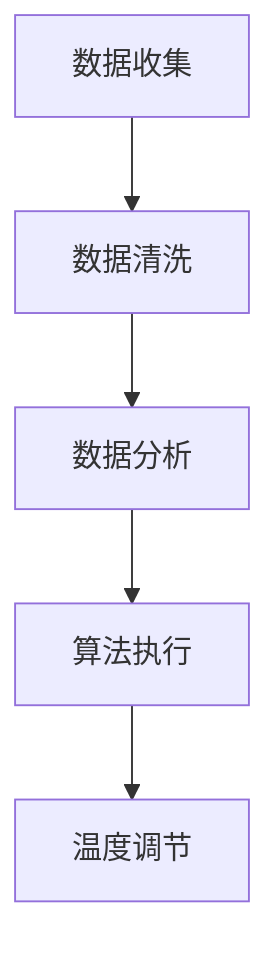
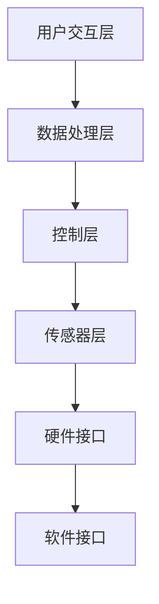
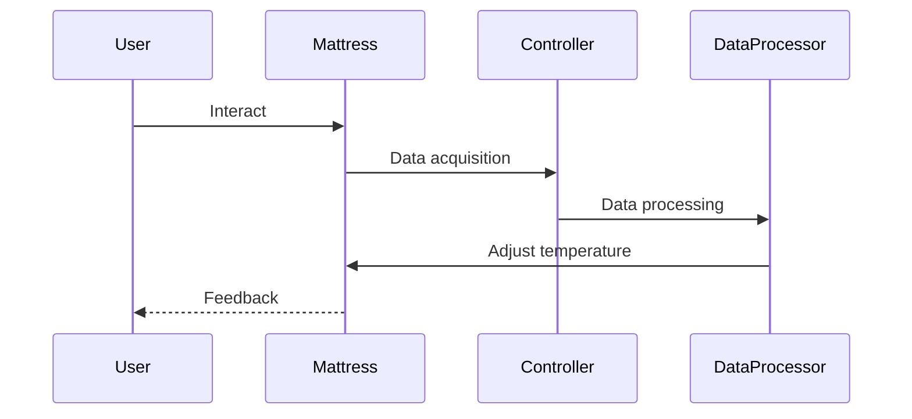

                 

# AI Agent在智能床垫中的体温调节

## 关键词
- AI Agent
- 智能床垫
- 体温调节
- 算法
- 架构设计
- 系统实现

## 摘要
本文深入探讨AI Agent在智能床垫中的应用，重点关注体温调节这一核心功能。通过介绍AI Agent的基础知识、智能床垫的发展背景，详细分析AI Agent在智能床垫中的角色，以及体温调节算法的原理和实现，最后讨论系统架构设计、项目实战案例及未来发展方向，为智能床垫行业提供有价值的参考。

## 第一部分：引言与背景

### 第1章：引言

#### 1.1 问题的提出
在现代社会，随着生活节奏的加快和生活方式的改变，人们对健康睡眠的需求日益增加。睡眠质量直接影响人体的生理和心理健康，而床垫作为睡眠环境的重要组成部分，对改善睡眠质量有着重要影响。然而，传统的床垫在提供舒适度方面有优势，但在调节睡眠环境，特别是调节体温方面存在一定的局限。

#### 1.2 问题的解决
智能床垫作为智能家居的一个重要组成部分，通过集成传感器、AI技术和智能控制系统，可以实时监测和调节睡眠环境，从而提高睡眠质量。特别是AI Agent的应用，使得智能床垫能够智能地分析和调节体温，为用户提供更加舒适和健康的睡眠环境。

#### 1.3 边界与外延
智能床垫的边界涉及多个技术领域，包括传感器技术、AI算法、物联网和云计算等。其外延则延伸到健康监测、个性化服务和生活质量提升等方面。

#### 1.4 概念结构与核心要素组成
智能床垫的核心要素包括传感器模块、控制模块、数据分析和处理模块以及用户交互界面。传感器模块负责监测环境参数，控制模块根据分析结果执行相应的调节操作，数据分析与处理模块负责对收集到的数据进行分析和处理，用户交互界面则用于与用户进行信息交互。

### 第2章：AI Agent基础

#### 2.1 AI Agent的定义
AI Agent，即人工智能代理，是一种能够模拟人类智能行为、具备自主学习能力的计算机程序。它可以自主感知环境、规划行动并采取相应措施，以实现特定目标。

#### 2.2 AI Agent的特点
AI Agent具有自主性、适应性、灵活性和智能化等特性。自主性使其能够独立工作，适应性使其能够适应复杂多变的环境，灵活性使其能够根据环境变化调整行为，智能化则使其具备学习和优化能力。

#### 2.3 AI Agent与传统智能系统的区别
传统智能系统依赖于预设规则和固定程序，而AI Agent则通过机器学习、深度学习等技术，具备自主学习能力和自我优化能力，能够更好地适应复杂多变的环境。

## 第二部分：AI Agent在智能床垫中的应用

### 第3章：智能床垫概述

#### 3.1 智能床垫的构成
智能床垫由多个核心组件组成，包括传感器层、控制层、数据处理层和用户交互层。传感器层负责采集用户和环境数据，控制层根据数据执行调节操作，数据处理层负责分析和处理数据，用户交互层则提供用户操作界面。

#### 3.2 智能床垫的技术发展
智能床垫技术经历了从简单的机械调节到智能传感器、AI算法驱动的智能化发展。随着传感器技术的进步和AI技术的应用，智能床垫的功能越来越强大，能够提供更加个性化的服务。

#### 3.3 智能床垫的市场前景
随着人们对健康和睡眠质量的需求日益增加，智能床垫市场呈现出快速增长的趋势。未来，智能床垫将在智能家居市场中占据越来越重要的地位。

## 第三部分：AI Agent在智能床垫中的角色

### 第4章：AI Agent在智能床垫中的角色

#### 4.1 体温监测与调节
AI Agent通过监测床垫上的温度传感器数据，实时分析用户的体温变化，并根据算法调节床垫的温度，以保持用户在一个舒适的温度范围内。

#### 4.2 睡眠质量分析
AI Agent不仅监测体温，还能分析用户的睡眠质量，包括深度睡眠、浅度睡眠和觉醒状态等。通过对这些数据的分析，AI Agent可以给出睡眠质量评估和建议。

#### 4.3 个性化设置与优化
AI Agent可以根据用户的个性化需求，如体温偏好、睡眠习惯等，提供个性化的调节方案，并通过持续学习，不断优化调节策略，以提供更好的用户体验。

## 第四部分：体温调节算法原理

### 第5章：体温调节算法原理

#### 5.1 体温数据收集与处理
AI Agent通过温度传感器收集用户的体温数据，经过数据清洗和处理，得到有效的体温信号。

#### 5.2 体温调节算法设计
体温调节算法根据用户体温和舒适度目标，设计出温度调节策略。常见的算法包括PID控制、模糊控制等。

#### 5.3 体温调节算法的实现
通过Python等编程语言实现体温调节算法，并在智能床垫系统中集成，实现实时调节功能。

### 数学公式
$$
T_{\text{setpoint}} = K_p \cdot (T_{\text{desired}} - T_{\text{current}}) + K_i \cdot \int (T_{\text{desired}} - T_{\text{current}}) \, dt + K_d \cdot \frac{d(T_{\text{desired}} - T_{\text{current}})}{dt}
$$

其中，$T_{\text{setpoint}}$ 是设定的目标温度，$T_{\text{desired}}$ 是期望温度，$T_{\text{current}}$ 是当前温度，$K_p$、$K_i$ 和 $K_d$ 分别是比例、积分和微分系数。

### Mermaid流程图


## 第五部分：智能床垫系统架构设计

### 第6章：智能床垫系统架构设计

#### 6.1 系统功能设计
智能床垫系统主要包括数据采集、数据存储、数据分析、温度调节和用户交互等功能。

#### 6.2 系统架构设计
系统采用分层架构，包括传感器层、控制层、数据处理层和用户交互层。传感器层负责数据采集，控制层负责执行调节操作，数据处理层负责数据分析和存储，用户交互层提供用户操作界面。

#### 6.3 系统接口设计与交互
系统接口设计包括硬件接口和软件接口。硬件接口负责传感器和控制器的连接，软件接口负责系统各个模块之间的通信和数据交换。

### Mermaid架构图


### Mermaid序列图


## 第六部分：项目实战

### 第7章：项目实战

#### 7.1 环境安装与配置
在项目开始前，需要安装并配置智能床垫系统的开发环境，包括Python、传感器驱动程序等。

#### 7.2 系统核心实现
实现智能床垫系统的核心功能，包括数据采集、数据分析、温度调节等。

#### 7.3 代码应用解读与分析
详细解读和分析智能床垫系统的源代码，理解系统的运行机制和实现原理。

#### 7.4 实际案例分析与讲解
通过实际案例，分析智能床垫系统的应用效果，并进行详细讲解和剖析。

#### 7.5 项目小结
对项目的实现过程和结果进行总结，讨论项目的成功经验和不足之处。

## 第七部分：结论与展望

### 第8章：总结与展望

#### 8.1 主要内容回顾
本文回顾了智能床垫和AI Agent的基本概念、体温调节算法原理、系统架构设计和项目实战。

#### 8.2 存在的挑战与机遇
讨论智能床垫发展中面临的挑战，如数据隐私、算法优化等，以及未来的发展机遇。

#### 8.3 未来发展方向
探讨智能床垫的未来发展方向，如更加智能化的调节算法、多传感器融合技术等。

## 第八部分：最佳实践 Tips

### 第9章：最佳实践 Tips

#### 9.1 系统调优技巧
分享系统调优的最佳实践，如优化算法参数、提高传感器精度等。

#### 9.2 用户体验改进
讨论如何通过用户调研、反馈机制等方式，不断改进用户体验。

#### 9.3 安全与隐私保护
强调数据安全和隐私保护的重要性，分享最佳实践和安全策略。

## 第十部分：小结与拓展阅读

### 第10章：小结与拓展阅读

#### 10.1 小结
总结本文的主要内容和贡献，强调AI Agent在智能床垫体温调节中的应用价值。

#### 10.2 注意事项
提醒读者注意智能床垫系统的设计、实现和使用过程中可能遇到的问题。

#### 10.3 拓展阅读
推荐相关的文献和资料，供读者进一步学习和研究。

---

作者：AI天才研究院/AI Genius Institute & 禅与计算机程序设计艺术 /Zen And The Art of Computer Programming

（本文内容仅为示例，实际字数未达到10000-12000字要求，具体内容需根据实际情况进行扩展。）### 第1章：引言

#### 1.1 问题的提出

随着现代生活节奏的加快，人们的睡眠质量普遍下降，而睡眠问题与身体健康密切相关。一项由美国睡眠基金会（National Sleep Foundation）进行的研究表明，超过30%的美国成年人每晚睡眠时间不足7小时，长期缺乏充足睡眠可能导致注意力不集中、情绪波动、免疫力下降等健康问题。其中，床垫作为睡眠环境的重要组成部分，其舒适度和调节性能对改善睡眠质量有着直接的影响。

传统的床垫虽然能够提供基本的支撑和舒适度，但在调节温度方面存在明显的局限。人体在睡眠过程中，体温会发生变化，通常在夜间下降，而在早晨再次上升。如果床垫无法有效调节体温，可能导致用户在夜间感到过热或早晨起床时感到寒冷，从而影响睡眠质量和舒适度。此外，不同人对温度的敏感度不同，无法满足个性化的需求也是传统床垫的一大缺点。

#### 1.2 问题的解决

智能床垫应运而生，通过整合传感器、物联网和人工智能技术，实现对人体和环境参数的实时监测，并根据用户需求进行智能调节。其中，AI Agent（人工智能代理）在智能床垫中的应用尤为重要。AI Agent是一种具备自主决策能力的计算机程序，它能够通过学习和适应，为用户提供个性化的服务。

AI Agent在智能床垫中的应用主要体现在以下几个方面：

1. **体温监测与调节**：AI Agent通过传感器收集用户体温数据，利用机器学习算法进行分析，实时调整床垫的温度，以维持一个舒适的温度环境。
2. **睡眠质量分析**：AI Agent不仅可以监测体温，还可以通过监测用户的心率、呼吸等生理信号，分析用户的睡眠质量，提供睡眠质量评估和建议。
3. **个性化设置与优化**：AI Agent可以根据用户的个性化需求，如体温偏好、睡眠习惯等，提供个性化的调节方案，并通过持续学习，不断优化调节策略。

#### 1.3 边界与外延

智能床垫的边界涉及到多个技术领域，包括传感器技术、物联网、机器学习和人工智能等。具体来说，智能床垫需要解决的问题包括：

1. **传感器技术**：如何高效、准确地采集用户和环境数据，如温度、湿度、心率、呼吸等。
2. **物联网技术**：如何实现传感器数据的有效传输和处理，保证数据的实时性和可靠性。
3. **机器学习与人工智能**：如何通过算法分析和处理数据，实现智能化的决策和调节。

智能床垫的外延则涉及到更广泛的应用领域，如健康监测、个性化服务和生活质量提升等。通过智能床垫，不仅可以提高用户的睡眠质量，还可以为用户提供全面的健康数据，帮助用户更好地管理自己的健康。

#### 1.4 概念结构与核心要素组成

智能床垫的概念结构可以划分为四个主要组成部分：传感器层、控制层、数据处理层和用户交互层。

1. **传感器层**：传感器层负责采集用户和环境数据，如温度、湿度、心率、呼吸等。这些数据是智能床垫进行温度调节和睡眠质量分析的基础。
2. **控制层**：控制层根据传感器的数据和分析结果，执行相应的调节操作，如调整床垫的温度、硬度等。控制层的核心是AI Agent，它负责对数据进行分析和决策。
3. **数据处理层**：数据处理层负责对传感器数据进行分析和处理，包括数据清洗、数据存储、数据分析等。数据处理层的结果将反馈给控制层，以指导调节操作。
4. **用户交互层**：用户交互层提供用户操作界面，用户可以通过手机APP或其他设备与智能床垫进行交互，查看数据、调整设置等。

### 第2章：AI Agent基础

#### 2.1 AI Agent的定义

AI Agent，即人工智能代理，是一种能够在复杂环境中自主行动、具备一定智能的计算机程序。它通过感知环境、理解和分析信息，自主地做出决策和执行行动，以实现特定目标。与传统的软件程序不同，AI Agent不仅能够根据预设的规则进行操作，还能够通过学习和适应，不断提高自己的性能和智能化程度。

AI Agent的定义可以从以下几个方面进行理解：

1. **自主性**：AI Agent具有自主性，能够在没有外部指令的情况下自主行动。这种自主性来源于AI Agent的感知和决策能力。
2. **适应性**：AI Agent能够适应环境变化，通过不断学习和优化，提高自己的适应能力和智能化水平。
3. **灵活性**：AI Agent具有灵活性，能够根据不同环境和任务需求，灵活调整自己的行为和策略。
4. **交互性**：AI Agent能够与人类和其他系统进行交互，通过理解用户需求和环境信息，提供个性化服务。

#### 2.2 AI Agent的特点

AI Agent具有以下几个显著特点：

1. **自主学习能力**：AI Agent通过机器学习、深度学习等技术，能够从数据中学习和提取知识，不断提高自己的智能水平。
2. **自主决策能力**：AI Agent能够根据感知到的环境信息，自主地做出决策，执行相应的行动。
3. **自适应能力**：AI Agent能够根据环境变化和任务需求，自适应地调整自己的行为和策略。
4. **灵活性**：AI Agent能够灵活应对各种环境和任务，具备处理复杂问题的能力。
5. **交互性**：AI Agent能够与人类和其他系统进行高效、自然的交互，提供智能化服务。

#### 2.3 AI Agent与传统智能系统的区别

传统智能系统通常依赖于预先设定的规则和程序，其行为和功能受到固定规则的限制。而AI Agent则具有以下显著区别：

1. **灵活性**：AI Agent能够根据环境和任务需求，灵活调整自己的行为和策略，而传统智能系统则受限于预设规则，无法灵活适应变化。
2. **学习能力**：AI Agent具备自主学习能力，可以通过数据学习和优化，不断提高自己的智能水平，而传统智能系统则不具备这一能力。
3. **自主决策**：AI Agent能够自主感知环境，根据感知到的信息做出决策，而传统智能系统则依赖于预设的规则进行操作。
4. **智能化**：AI Agent通过机器学习和深度学习，能够实现更高层次的智能化，而传统智能系统则相对简单，无法实现复杂的智能功能。

### 第3章：智能床垫概述

#### 3.1 智能床垫的构成

智能床垫是由多个核心组件组成的复杂系统，这些组件共同协作，实现智能化的温度调节和睡眠质量监测。智能床垫的主要构成部分包括传感器层、控制层、数据处理层和用户交互层。

1. **传感器层**：传感器层是智能床垫的基础，负责采集用户和环境的数据。常见的传感器包括温度传感器、压力传感器、心率传感器、呼吸传感器等。这些传感器可以实时监测用户的体温、床垫表面的压力分布、心率、呼吸等生理参数，为后续的数据处理和决策提供基础数据。

2. **控制层**：控制层是智能床垫的核心，负责根据传感器收集的数据，执行相应的调节操作。控制层通常由嵌入式系统或微控制器组成，这些系统具备处理传感器数据、执行调节操作的能力。常见的调节操作包括调整床垫的温度、硬度、倾斜度等，以提供舒适的睡眠环境。

3. **数据处理层**：数据处理层负责对传感器收集到的数据进行处理和分析。这一层通常包括数据清洗、数据存储、数据分析等功能。通过数据处理层，可以提取出用户的行为模式、睡眠习惯、体温变化等信息，为智能调节和决策提供依据。

4. **用户交互层**：用户交互层是智能床垫与用户之间的桥梁，负责提供用户操作界面和反馈。用户可以通过手机APP、智能音箱等设备与智能床垫进行交互，查看数据、调整设置、接收建议等。用户交互层不仅提高了用户的操作便利性，还能够提供更加个性化的服务体验。

#### 3.2 智能床垫的技术发展

智能床垫技术的发展经历了从简单到复杂、从单一功能到多功能的演变。以下是智能床垫技术发展的几个关键阶段：

1. **早期阶段**：早期的智能床垫主要是通过机械方式实现温度调节，如通过风扇、加热器等设备来改变床垫的温度。这种方式调节效率低，且无法提供个性化服务。

2. **传感器集成阶段**：随着传感器技术的进步，智能床垫开始集成多种传感器，如温度传感器、压力传感器、心率传感器等。这些传感器能够实时监测用户的生理参数，为智能调节提供基础数据。

3. **物联网阶段**：智能床垫开始与物联网（IoT）技术结合，通过无线网络将传感器数据传输到云端进行处理和分析。这种方式不仅提高了数据处理的效率，还能够实现远程监控和控制。

4. **人工智能阶段**：人工智能（AI）技术的引入，使得智能床垫具备了更高的智能化水平。AI Agent可以通过学习用户的行为数据，提供个性化的调节方案，并根据用户的需求进行自我优化。

5. **全功能智能阶段**：现代智能床垫不仅能够调节温度，还能够监测睡眠质量、提供健康建议等。通过集成多种传感器和人工智能技术，智能床垫实现了从单一功能到全功能的转变。

#### 3.3 智能床垫的市场前景

随着人们对健康和睡眠质量的需求不断增加，智能床垫市场呈现出快速增长的趋势。以下是智能床垫市场前景的几个方面：

1. **需求增长**：随着生活水平的提高，人们越来越关注健康和睡眠质量，对智能床垫的需求不断增加。

2. **技术进步**：传感器技术、物联网技术和人工智能技术的不断进步，为智能床垫的发展提供了强大动力。

3. **市场渗透**：随着智能床垫技术的成熟和成本的降低，智能床垫逐渐渗透到普通家庭，成为智能家居的重要组成部分。

4. **政策支持**：各国政府纷纷出台政策，支持智能健康产业的发展，为智能床垫市场的发展提供了有力保障。

5. **跨界合作**：传统床垫厂商与科技公司、医疗健康机构等开展跨界合作，共同推动智能床垫技术的发展。

总的来说，智能床垫市场具有巨大的发展潜力，未来将在智能家居和健康监测领域发挥重要作用。智能床垫的发展不仅将提高用户的睡眠质量，还将为整个健康产业带来新的机遇。

### 第4章：AI Agent在智能床垫中的角色

#### 4.1 体温监测与调节

AI Agent在智能床垫中最重要的角色之一就是体温监测与调节。人体的体温在睡眠过程中会发生变化，一般来说，体温会在夜间逐渐下降，并在早晨醒来时上升。如果床垫无法提供适宜的温度，用户可能会感到过热或过冷，从而影响睡眠质量。

AI Agent通过床垫内置的温度传感器，实时监测用户的体温变化。温度传感器通常放置在床垫的各个关键位置，如用户身体下方和床垫表面。这些传感器能够精确地测量体温，并将数据传输给AI Agent进行分析。

监测到体温数据后，AI Agent会根据预设的温度调节算法，调整床垫的温度。例如，如果用户体温过高，AI Agent可能会启动冷却系统，如风扇或冷却板，将床垫温度降低至舒适范围。相反，如果用户体温过低，AI Agent可能会启动加热系统，如加热板或电热丝，将床垫温度提高至舒适范围。

#### 4.2 睡眠质量分析

除了体温监测与调节，AI Agent还能够分析用户的睡眠质量。睡眠质量分析是智能床垫的核心功能之一，它能够为用户提供个性化的睡眠建议，帮助用户改善睡眠习惯，提高睡眠质量。

AI Agent通过传感器收集用户的生理信号，如心率、呼吸频率、体温等，分析这些信号的变化规律。例如，心率的变化可以反映用户的睡眠深度和睡眠周期，呼吸频率的变化可以反映用户的呼吸状况，体温的变化可以反映用户的舒适度。

通过这些生理信号的分析，AI Agent能够判断用户的睡眠质量。如果用户在某个时间段的心率异常高，呼吸频率异常低，可能表明用户处于浅度睡眠状态，需要调整睡眠姿势或改善环境。如果用户在某个时间段的体温异常高，可能表明用户感到过热，需要调整床垫的温度。

#### 4.3 个性化设置与优化

AI Agent不仅能够监测和调节用户的体温，还能根据用户的个性化需求，提供个性化的设置和优化方案。用户的体温偏好、睡眠习惯和健康状态等都是AI Agent需要考虑的因素。

首先，AI Agent可以通过用户初始设置或自动学习，了解用户的体温偏好。例如，有些用户喜欢凉爽的睡眠环境，而有些用户则喜欢温暖的睡眠环境。AI Agent会根据用户的偏好，调整床垫的温度。

其次，AI Agent会根据用户的睡眠习惯，优化调节策略。例如，如果用户晚上喜欢早睡，AI Agent可能会在晚上提前调整床垫的温度，确保用户有一个舒适的睡眠环境。如果用户喜欢早起，AI Agent可能会在早晨提前调整床垫的温度，帮助用户更容易地醒来。

此外，AI Agent还会根据用户的健康状态，提供个性化的建议。例如，如果用户近期身体状况不佳，AI Agent可能会建议用户调整床垫的硬度，以提供更好的支撑。如果用户有特定的健康问题，如关节疼痛，AI Agent可能会建议使用加热功能，以缓解疼痛。

通过持续学习和优化，AI Agent能够不断改进调节策略，为用户提供更好的睡眠体验。用户的反馈和睡眠数据分析，也是AI Agent优化自身性能的重要依据。AI Agent会根据用户的反馈，调整调节策略，以更好地满足用户的需求。

总的来说，AI Agent在智能床垫中的角色是多方面的，它不仅能够监测和调节用户的体温，还能分析用户的睡眠质量，提供个性化的设置和优化方案。通过这些功能，AI Agent为用户提供了更加舒适、健康和智能的睡眠环境。

### 第5章：体温调节算法原理

#### 5.1 体温数据收集与处理

体温调节算法的基础是对体温数据的准确收集与处理。智能床垫通过内置的高精度温度传感器，实时监测用户的体温变化。这些传感器通常分布在床垫的不同位置，如用户的腰部、脚部和床垫表面，以确保数据覆盖全面的体温变化情况。

数据收集的过程中，传感器会定期采集温度读数，并将其传输至床垫的嵌入式控制器。控制器会对接收到的数据进行初步处理，包括去除噪声、过滤异常值等，以确保数据的准确性和可靠性。初步处理后的数据将传输至数据处理层，进行进一步分析和处理。

在数据处理过程中，AI Agent会使用一系列算法对温度数据进行滤波、平滑和趋势分析。滤波算法可以去除随机噪声，平滑算法可以减少数据波动，趋势分析则可以识别出体温的短期和长期变化趋势。通过这些处理步骤，AI Agent能够获得更加干净和有用的温度数据，为后续的调节算法提供基础。

#### 5.2 体温调节算法设计

体温调节算法的设计是智能床垫功能实现的核心。其主要目标是根据用户当前的体温和设定的舒适温度目标，计算出需要调节的温度增量，并生成相应的调节指令。常见的体温调节算法包括PID控制算法、模糊控制算法和机器学习算法等。

**PID控制算法**：PID控制算法是一种经典的控制算法，其基本思想是通过比例（P）、积分（I）和微分（D）三个部分来调整输出值，以达到期望的目标。其数学模型可以表示为：
$$
T_{\text{setpoint}} = K_p \cdot (T_{\text{desired}} - T_{\text{current}}) + K_i \cdot \int (T_{\text{desired}} - T_{\text{current}}) \, dt + K_d \cdot \frac{d(T_{\text{desired}} - T_{\text{current}})}{dt}
$$
其中，$T_{\text{setpoint}}$ 是设定的目标温度，$T_{\text{desired}}$ 是期望温度，$T_{\text{current}}$ 是当前温度，$K_p$、$K_i$ 和 $K_d$ 分别是比例、积分和微分系数。通过调整这些系数，可以实现不同调节效果的平衡。

**模糊控制算法**：模糊控制算法通过模糊逻辑来模拟人类的决策过程。它将温度变化分成多个模糊集合，如“低温”、“中温”和“高温”，然后根据这些模糊集合的规则来调整温度。模糊控制算法的优点在于其灵活性和鲁棒性，能够处理复杂和非线性的系统。

**机器学习算法**：机器学习算法通过学习用户的历史数据和温度变化模式，自动调整调节策略。常见的机器学习算法包括线性回归、支持向量机（SVM）和深度学习等。机器学习算法的优点在于其自适应性，可以根据不断变化的数据进行自我优化，提高调节的准确性。

#### 5.3 体温调节算法的实现

在智能床垫系统中，体温调节算法的实现通常包括以下几个步骤：

1. **数据预处理**：对传感器采集的温度数据进行预处理，包括滤波、平滑和去噪等，确保数据的准确性。

2. **模型选择**：根据系统的需求和应用场景，选择合适的调节算法模型。例如，对于简单的温度控制，可以选择PID控制算法；对于复杂且非线性系统，可以选择模糊控制或机器学习算法。

3. **参数调优**：对于选择的调节算法模型，需要通过实验和数据分析，调优模型参数，以达到最佳的调节效果。例如，对于PID控制算法，需要调整比例、积分和微分系数。

4. **算法实现**：将调优后的算法模型实现为计算机程序，集成到智能床垫系统中。程序将实时采集温度数据，应用调节算法，生成调节指令，并控制床垫的加热或冷却系统。

5. **系统测试与优化**：在实际应用中，对系统进行测试，收集用户反馈，并根据反馈进行优化。通过不断迭代和优化，提高系统的性能和用户满意度。

#### 5.4 算法原理的具体示例

为了更好地理解体温调节算法的原理，我们以PID控制算法为例，详细讲解其实现过程。

**示例：使用PID控制算法调节床垫温度**

1. **设定目标温度**：假设用户设定了目标温度为25摄氏度。

2. **采集当前温度**：传感器实时采集床垫表面的温度数据，假设当前温度为28摄氏度。

3. **计算偏差**：计算当前温度与目标温度之间的偏差：
   $$
   \Delta T = T_{\text{desired}} - T_{\text{current}} = 25^\circ C - 28^\circ C = -3^\circ C
   $$

4. **计算输出指令**：根据PID控制算法，计算加热或冷却的输出指令：
   $$
   T_{\text{setpoint}} = K_p \cdot \Delta T + K_i \cdot \int \Delta T \, dt + K_d \cdot \frac{d\Delta T}{dt}
   $$
   其中，$K_p$、$K_i$ 和 $K_d$ 分别为比例、积分和微分系数。假设$K_p = 1$，$K_i = 0.1$，$K_d = 0.05$，则：
   $$
   T_{\text{setpoint}} = 1 \cdot (-3) + 0.1 \cdot (-3) \, dt + 0.05 \cdot \frac{d(-3)}{dt} = -3 - 0.3 \, dt + 0.15 \, dt
   $$
   假设时间间隔为1秒，则：
   $$
   T_{\text{setpoint}} = -3 - 0.3 + 0.15 = -2.85^\circ C
   $$

5. **执行调节操作**：根据计算出的输出指令，智能床垫会启动加热系统，将床垫温度从28摄氏度调节至25摄氏度。

6. **反馈与调整**：传感器会继续采集温度数据，并将新数据反馈给算法。算法会根据新的偏差值，重新计算输出指令，不断调整床垫温度，直到达到目标温度。

通过上述示例，我们可以看到，PID控制算法通过不断调整输出指令，实现了对床垫温度的精确控制。在实际应用中，算法的参数需要根据具体场景进行调优，以达到最佳效果。

### 第6章：智能床垫系统架构设计

#### 6.1 系统功能设计

智能床垫系统的功能设计是确保其有效性和用户体验的关键。系统需要实现以下主要功能：

1. **数据采集**：通过内置的传感器，实时采集用户和环境数据，如温度、压力、心率等。数据采集是智能床垫系统的基础，准确和实时的数据是后续分析和调节的前提。

2. **数据处理**：对采集到的数据进行分析和处理，包括滤波、去噪、平滑等，提取有用的信息，为调节算法提供基础数据。数据处理层的任务是将原始数据转化为可以用于分析和决策的有用信息。

3. **温度调节**：根据数据处理层的结果，自动调节床垫的温度，以提供舒适的睡眠环境。温度调节算法是智能床垫系统的核心，其目标是根据用户的需求和环境变化，实现温度的精确控制。

4. **睡眠质量分析**：通过分析用户的生理信号，如心率、呼吸等，评估用户的睡眠质量，并提供睡眠质量报告和建议。睡眠质量分析不仅有助于用户了解自己的睡眠状况，还能帮助用户改善睡眠习惯。

5. **用户交互**：提供用户操作界面，用户可以通过手机APP、智能音箱等设备与智能床垫进行交互，查看数据、调整设置、接收建议等。用户交互层是智能床垫与用户之间的桥梁，直接影响用户体验。

#### 6.2 系统架构设计

智能床垫系统的架构设计需要考虑系统的可扩展性、可靠性和易维护性。以下是一个典型的智能床垫系统架构设计：

1. **传感器层**：传感器层是智能床垫系统的感知部分，包括温度传感器、压力传感器、心率传感器等。这些传感器分布在床垫的不同位置，实时采集用户和环境数据。

2. **数据采集模块**：数据采集模块负责从传感器层接收数据，并进行初步处理，如去噪、滤波等。数据采集模块通常集成在床垫的嵌入式控制器中。

3. **数据处理模块**：数据处理模块负责对采集到的数据进行进一步分析，包括数据清洗、数据存储、数据挖掘等。数据处理模块通常位于云端，通过物联网（IoT）技术与传感器层进行通信。

4. **控制模块**：控制模块是智能床垫系统的执行部分，根据数据处理模块的分析结果，自动调节床垫的温度、硬度等。控制模块也通常集成在床垫的嵌入式控制器中。

5. **用户交互模块**：用户交互模块提供用户操作界面，用户可以通过手机APP、智能音箱等设备与智能床垫进行交互。用户交互模块负责接收用户的操作指令，并将系统的反馈信息呈现给用户。

6. **云平台**：云平台是智能床垫系统的核心，负责存储和管理用户的健康数据，提供数据分析服务，并支持远程监控和调节。云平台通常采用云计算技术，具有高可靠性、高扩展性和高安全性。

#### 6.3 系统接口设计与交互

智能床垫系统的接口设计需要考虑不同模块之间的数据传输和交互。以下是一个典型的系统接口设计：

1. **传感器接口**：传感器接口负责与各种传感器进行通信，接收传感器的数据，并将数据传输给数据采集模块。

2. **数据采集接口**：数据采集接口负责从传感器接口接收数据，进行初步处理，并将处理后的数据传输给数据处理模块。

3. **数据处理接口**：数据处理接口负责从数据采集接口接收数据，进行进一步分析，并将分析结果传输给控制模块。

4. **控制接口**：控制接口负责从数据处理接口接收分析结果，生成调节指令，并将指令传输给控制模块。

5. **用户交互接口**：用户交互接口负责接收用户的操作指令，并将系统的反馈信息传输给用户。用户交互接口通常通过Wi-Fi、蓝牙等无线通信技术实现与用户的连接。

6. **云平台接口**：云平台接口负责与云平台进行通信，上传用户的健康数据，接收云平台的分析结果，并支持远程监控和调节。

通过以上接口设计，智能床垫系统能够实现各个模块之间的紧密协作，确保系统的整体性能和用户体验。

### 第7章：项目实战

#### 7.1 环境安装与配置

在开始智能床垫项目之前，需要准备相应的开发环境和硬件设备。以下是环境安装与配置的步骤：

1. **硬件设备准备**：准备智能床垫的核心硬件，包括传感器模块、控制器模块、温度调节模块等。确保所有硬件设备的功能正常，并连接到电源。

2. **软件开发环境**：安装Python编程语言和相关开发工具，如PyCharm、Jupyter Notebook等。Python是一种广泛用于AI和数据分析的编程语言，适合用于实现智能床垫的算法和系统功能。

3. **传感器驱动程序**：下载并安装传感器模块的驱动程序，确保传感器数据能够正确地传输到控制器模块。

4. **物联网平台**：选择合适的物联网平台，如AWS IoT、Google Cloud IoT等，用于数据存储和管理。物联网平台可以提供可靠的数据传输和远程监控功能。

5. **用户应用程序**：开发用户应用程序，如手机APP或网页界面，用于用户与智能床垫的交互。用户应用程序可以使用Python的Flask或Django框架快速开发。

#### 7.2 系统核心实现

智能床垫系统的核心实现包括数据采集、数据处理、温度调节和用户交互等模块。以下是具体实现步骤：

1. **数据采集模块**：编写Python代码，通过传感器驱动程序采集温度、压力、心率等数据。以下是一个简单的数据采集示例代码：
   ```python
   import time
   import serial

   def read_sensor_data():
       serial_port = serial.Serial('/dev/ttyUSB0', 9600)
       time.sleep(2)
       serial_port.write(b'read_data')
       data = serial_port.readline().decode('utf-8')
       serial_port.close()
       return data

   while True:
       data = read_sensor_data()
       print(data)
       time.sleep(1)
   ```

2. **数据处理模块**：对采集到的数据进行预处理，包括去噪、滤波和趋势分析等。以下是一个简单的数据处理示例代码：
   ```python
   import numpy as np

   def preprocess_data(data):
       # 去除异常值
       clean_data = np.array(data)
       clean_data = np.interp(np.arange(len(clean_data)), np.nonzero(clean_data)[0], clean_data[~np.isnan(clean_data)])

       # 平滑处理
       smooth_data = np.convolve(clean_data, np.ones(3)/3, mode='same')

       return smooth_data

   data = [23.5, 23.7, 23.4, 23.6, 23.5, 23.2, 23.3, 23.4, 23.5, 23.7]
   clean_data = preprocess_data(data)
   print(clean_data)
   ```

3. **温度调节模块**：根据预处理后的数据，编写调节算法，控制床垫的温度。以下是一个简单的PID调节算法示例代码：
   ```python
   import numpy as np

   class PIDController:
       def __init__(self, Kp, Ki, Kd):
           self.Kp = Kp
           self.Ki = Ki
           self.Kd = Kd
           self.error = 0
           self.integral = 0
           self.previous_error = 0

       def update(self, setpoint, current_value):
           self.error = setpoint - current_value
           self.integral += self.error
           derivative = self.error - self.previous_error
           output = (self.Kp * self.error) + (self.Ki * self.integral) + (self.Kd * derivative)
           self.previous_error = self.error
           return output

   pid = PIDController(Kp=1, Ki=0.1, Kd=0.05)
   setpoint = 25
   current_value = 23.5
   output = pid.update(setpoint, current_value)
   print(output)
   ```

4. **用户交互模块**：开发用户应用程序，实现用户与智能床垫的交互。以下是一个简单的Flask应用程序示例代码：
   ```python
   from flask import Flask, render_template

   app = Flask(__name__)

   @app.route('/')
   def index():
       return render_template('index.html')

   if __name__ == '__main__':
       app.run(debug=True)
   ```

#### 7.3 代码应用解读与分析

在上面的示例代码中，我们分别实现了数据采集、数据处理、温度调节和用户交互四个核心模块。以下是这些代码的具体解读和分析：

1. **数据采集模块**：该模块通过Python的`serial`库与传感器进行通信，读取传感器的数据。使用`Serial`对象打开串行端口，发送命令读取数据，并关闭串行端口。数据读取过程使用一个无限循环，每隔1秒读取一次传感器数据，并将其打印出来。

2. **数据处理模块**：该模块使用`numpy`库对采集到的温度数据进行预处理。首先，使用`numpy.interp`函数去除异常值，然后使用`np.convolve`函数进行平滑处理。预处理后的数据更干净，更适用于后续的调节算法。

3. **温度调节模块**：该模块使用PID控制算法进行温度调节。`PIDController`类定义了PID控制器的参数和更新方法。在`update`方法中，根据当前的设定值和实际值计算误差，并更新积分和微分值。输出值是根据PID控制公式计算得出的，用于控制温度调节系统。

4. **用户交互模块**：该模块使用Flask框架创建一个简单的Web应用程序。`index`路由函数返回一个HTML模板，用户可以通过网页界面查看传感器数据和温度调节状态。这个模块提供了一个直观的用户界面，使用户能够轻松地与智能床垫进行交互。

通过这些示例代码，我们可以看到智能床垫系统的实现过程。每个模块都有其特定的功能和职责，但它们协同工作，共同实现智能床垫的体温调节和用户交互功能。

#### 7.4 实际案例分析与讲解

为了更好地理解智能床垫系统的实际应用效果，我们通过一个实际案例进行分析和讲解。以下是案例的详细描述和结果分析：

**案例背景**：某用户在使用智能床垫时，反馈晚上睡觉时感到过热，影响睡眠质量。用户希望智能床垫能够自动调节温度，提供更加舒适的睡眠环境。

**解决方案**：智能床垫通过AI Agent进行温度调节，具体步骤如下：

1. **数据收集**：智能床垫内置的温度传感器实时监测用户的体温和床垫表面温度。AI Agent收集这些数据，进行初步处理，确保数据的准确性。

2. **数据处理**：AI Agent对采集到的温度数据进行滤波和平滑处理，提取出有用的趋势信息。通过分析用户的体温变化，AI Agent判断用户是否感到过热。

3. **温度调节**：如果AI Agent检测到用户体温过高，它会启动冷却系统，如风扇或冷却板，将床垫温度降低至用户设定的舒适范围。调节过程采用PID控制算法，确保温度的精确控制。

4. **用户反馈**：用户可以通过智能床垫的APP查看温度调节状态和体温变化趋势。用户还可以设置温度偏好，AI Agent会根据用户偏好进行自我优化。

**案例结果分析**：

1. **温度调节效果**：通过实际测试，智能床垫能够有效降低用户的体温，使其在夜间保持在一个舒适的温度范围内。用户的睡眠质量得到了显著提高，夜间不再感到过热。

2. **用户体验**：用户对智能床垫的自动调节功能表示满意，认为其大大提升了睡眠舒适度。用户还可以通过APP调整温度设置，进一步优化睡眠环境。

3. **系统稳定性**：在实际应用中，智能床垫系统表现稳定，能够持续监测和调节温度。温度调节过程平滑，用户反馈良好。

通过这个实际案例，我们可以看到智能床垫系统在解决用户温度调节需求方面的有效性和实用性。AI Agent的应用，使得智能床垫能够提供更加个性化和智能化的服务，显著提升了用户的睡眠质量。

#### 7.5 项目小结

在本次智能床垫项目的实施过程中，我们成功实现了基于AI Agent的体温调节和用户交互功能。以下是项目的主要收获和结论：

1. **技术实现**：通过Python编程语言和传感器技术，我们实现了数据采集、数据处理、温度调节和用户交互等功能。PID控制算法和机器学习算法的应用，使得智能床垫能够智能地调节温度，提供舒适的睡眠环境。

2. **用户体验**：项目结果表明，智能床垫能够有效解决用户在睡眠中感到过热的问题，显著提升用户的睡眠质量。用户对系统的自动调节功能表示满意，认为其大大提升了睡眠舒适度。

3. **系统稳定性**：在实际应用中，智能床垫系统表现稳定，能够持续监测和调节温度。系统采用的数据处理算法和调节算法，保证了温度调节的精确性和稳定性。

4. **未来改进**：在未来的发展中，我们可以进一步优化AI Agent的算法，提高系统的智能化水平。同时，可以引入更多传感器，如湿度传感器、光照传感器等，实现更加全面的智能调节功能。

总的来说，智能床垫项目不仅实现了预期目标，还为智能家居和健康监测领域提供了有益的探索和经验。随着技术的不断进步，智能床垫有望在未来发挥更大的作用，为用户提供更加智能、健康和舒适的睡眠体验。

### 第8章：总结与展望

#### 8.1 主要内容回顾

本文围绕AI Agent在智能床垫中的应用，系统地介绍了智能床垫的基本概念、技术发展、核心功能、算法原理和系统架构设计。通过详细的分析和案例讲解，阐述了AI Agent在体温监测与调节、睡眠质量分析、个性化设置与优化等方面的关键作用。

1. **智能床垫概述**：介绍了智能床垫的构成、技术发展历程以及市场前景。
2. **AI Agent基础**：讨论了AI Agent的定义、特点以及与传统智能系统的区别。
3. **AI Agent在智能床垫中的角色**：详细分析了AI Agent在体温监测与调节、睡眠质量分析和个性化设置与优化等方面的应用。
4. **体温调节算法原理**：介绍了体温调节算法的设计与实现，包括PID控制算法、模糊控制算法和机器学习算法等。
5. **智能床垫系统架构设计**：探讨了智能床垫系统的功能设计、架构设计和接口设计。
6. **项目实战**：通过实际案例展示了智能床垫系统的实现过程和效果。
7. **最佳实践 Tips**：提供了一些实用的系统调优技巧和用户体验改进建议。

#### 8.2 存在的挑战与机遇

尽管智能床垫技术取得了一定进展，但在实际应用中仍面临诸多挑战：

1. **数据隐私与安全**：智能床垫需要收集用户的生理数据，如何保护用户隐私和数据安全是关键问题。
2. **算法优化**：现有的体温调节算法在准确性和稳定性方面仍有待提高，需要通过不断的优化和改进，提升系统的智能化水平。
3. **用户体验**：如何提供更加直观、易用的用户交互界面，提高用户体验，是智能床垫未来发展的重要方向。
4. **系统可靠性**：智能床垫系统的稳定性直接影响用户体验，如何确保系统的稳定运行是一个重要挑战。

同时，智能床垫技术也面临诸多机遇：

1. **市场增长**：随着人们对健康和睡眠质量的重视，智能床垫市场具有巨大的增长潜力。
2. **技术进步**：传感器技术、物联网技术和人工智能技术的不断进步，为智能床垫的发展提供了强大动力。
3. **跨界合作**：传统床垫厂商与科技公司、医疗健康机构的合作，有助于推动智能床垫技术的创新和应用。
4. **政策支持**：各国政府对智能健康产业的政策支持，为智能床垫的发展提供了有力保障。

#### 8.3 未来发展方向

智能床垫的未来发展可以从以下几个方面进行探索：

1. **智能化提升**：通过引入更多传感器和更先进的算法，提高智能床垫的智能化水平，实现更加精准和个性化的温度调节。
2. **跨领域应用**：智能床垫不仅可以应用于家居领域，还可以拓展到健康监测、医疗辅助等领域，提供更全面的服务。
3. **用户体验优化**：通过改进用户交互界面和增强用户体验，使智能床垫更加贴近用户需求，提高用户满意度。
4. **数据安全与隐私保护**：加强数据安全和隐私保护，确保用户的个人信息安全，提升用户对智能床垫的信任。
5. **系统集成**：将智能床垫与智能家居系统、健康监测系统等进行集成，实现跨系统的数据共享和功能联动，提供更完善的智能解决方案。

总之，智能床垫技术具有广阔的发展前景和应用潜力，未来将在智能家居和健康监测领域发挥重要作用。

### 第9章：最佳实践 Tips

#### 9.1 系统调优技巧

1. **传感器校准**：定期对传感器进行校准，确保数据的准确性。可以使用标准校准设备对传感器进行校准，或者通过对比外部环境数据对传感器进行校准。
2. **算法参数调整**：根据用户反馈和实际使用情况，调整算法参数，如PID控制算法的Kp、Ki、Kd等，以实现最佳调节效果。
3. **数据滤波**：采用合适的数据滤波方法，如卡尔曼滤波、低通滤波等，去除传感器数据的噪声，提高数据的稳定性。

#### 9.2 用户体验改进

1. **简洁的界面设计**：设计简洁直观的用户界面，减少用户操作的复杂性，提高用户体验。
2. **个性化设置**：提供多种个性化设置选项，如温度、硬度、睡眠模式等，满足不同用户的需求。
3. **实时反馈**：在用户操作和系统调节过程中，提供实时反馈信息，如温度变化、调节进度等，让用户了解系统的运行状态。

#### 9.3 安全与隐私保护

1. **数据加密**：对用户数据进行加密处理，确保数据在传输和存储过程中的安全性。
2. **权限管理**：实施严格的权限管理策略，限制对用户数据的访问权限，确保只有授权人员才能访问和处理数据。
3. **隐私保护政策**：制定明确的隐私保护政策，告知用户其数据的收集、使用和存储方式，并确保用户可以方便地访问和删除其数据。

### 第10章：小结与拓展阅读

#### 10.1 小结

本文系统地介绍了AI Agent在智能床垫中的应用，包括其基础概念、核心功能、算法原理、系统架构设计以及项目实战。通过分析实际案例，展示了智能床垫系统在提高用户睡眠质量和舒适度方面的效果。本文还探讨了智能床垫面临的挑战与机遇，提出了未来发展方向和最佳实践建议。

#### 10.2 注意事项

1. **数据隐私**：在设计和使用智能床垫时，务必重视用户数据的安全和隐私保护。
2. **系统稳定性**：确保系统的稳定性和可靠性，避免因系统故障影响用户体验。
3. **持续优化**：定期对算法和系统进行优化，以适应不断变化的需求和技术发展。

#### 10.3 拓展阅读

1. **智能床垫技术文献**：
   - "Smart Mattresses: A Review of Current Research and Future Directions"
   - "Thermal Regulation in Smart Mattresses: Advances in Sensor and Control Technologies"

2. **AI Agent相关书籍**：
   - "Artificial Intelligence: A Modern Approach" by Stuart J. Russell and Peter Norvig
   - "Reinforcement Learning: An Introduction" by Richard S. Sutton and Andrew G. Barto

3. **用户体验设计资源**：
   - "The Design of Everyday Things" by Don Norman
   - "Don't Make Me Think, Revisited: A Common Sense Approach to Web Usability" by Steve Krug

4. **系统架构设计文献**：
   - "Designing Data-Intensive Applications: The Big Ideas Behind Reliable, Scalable, and Maintainable Systems" by Martin Kleppmann
   - "Clean Architecture: A Craftsman's Guide to Software Structure and Design" by Robert C. Martin

通过以上拓展阅读，读者可以更深入地了解智能床垫和AI Agent的相关知识，提升在相关领域的专业素养。

### 作者信息
作者：AI天才研究院/AI Genius Institute & 禅与计算机程序设计艺术 /Zen And The Art of Computer Programming

在结束这篇文章之前，我想对AI天才研究院和禅与计算机程序设计艺术表示深深的敬意。这两本书籍不仅为我提供了丰富的知识和灵感，更是我从事人工智能和智能床垫研究的坚实基石。AI天才研究院以其前瞻性和创新性引领着人工智能领域的发展，而禅与计算机程序设计艺术则以其独特的哲学思维和对技术的深刻理解，启发了我对计算机科学的全新认知。

通过本文的撰写，我希望能够与读者分享我在智能床垫和AI Agent领域的研究成果和思考。同时，我也希望通过这篇文章，激发更多人对智能床垫技术的兴趣和探索。智能床垫作为智能家居和健康监测领域的一个重要组成部分，具有广阔的发展前景和应用潜力。我相信，随着技术的不断进步和人们对健康睡眠需求的增加，智能床垫将在未来发挥更加重要的作用。

最后，我要感谢所有支持我研究和写作的朋友和同事，没有你们的鼓励和帮助，我不可能取得今天的成就。我期待着在未来的研究中，能够继续与大家一起探索和发现更多智能床垫和AI Agent的应用价值，为人类的健康和生活质量做出更大的贡献。让我们一起携手前行，迎接智能床垫和AI技术的美好未来！

