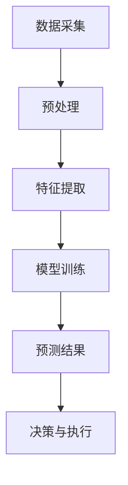
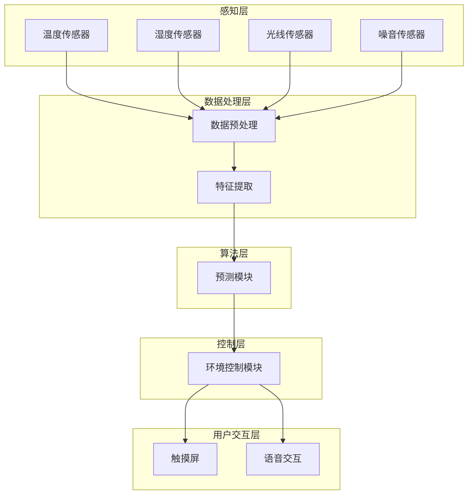
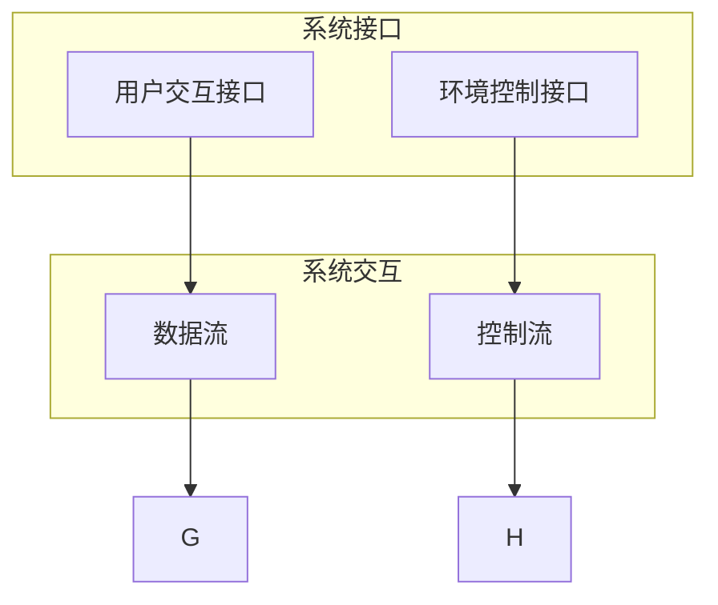
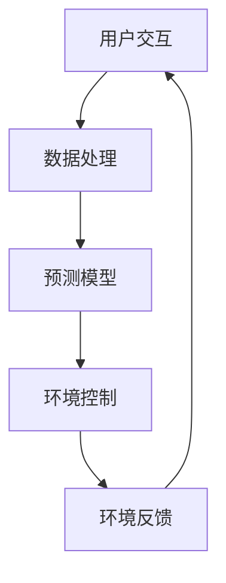

                 

# AI Agent在智能床头柜中的睡眠环境优化

> 关键词：AI Agent、智能床头柜、睡眠环境优化、算法原理、系统架构、项目实战

> 摘要：本文详细探讨了AI Agent在智能床头柜中的睡眠环境优化应用。通过介绍AI Agent的基础概念、智能床头柜的技术基础，以及睡眠环境优化的方法，本文逐步分析了算法原理、系统架构设计，并通过实际项目实战展示了AI Agent在智能床头柜中的应用效果。文章末尾还总结了最佳实践和注意事项，为未来研究和应用提供了方向。

----------------------------------------------------------------

## 引言与背景

### 睡眠环境的重要性

睡眠是人体生理和心理健康的重要组成部分，良好的睡眠环境对于保证高质量的睡眠至关重要。然而，现代生活节奏加快，环境污染、噪音、光线等问题对睡眠环境造成了严重影响。据统计，全球约有三分之一的人口存在睡眠障碍，这些问题不仅影响了生活质量，还可能导致一系列健康问题，如心血管疾病、肥胖、抑郁症等。

### 当前睡眠环境优化的方法与局限

为了改善睡眠环境，现有的优化方法主要包括以下几种：

1. **物理环境调节**：如使用遮光窗帘、耳塞、加湿器、空气净化器等。
2. **智能设备辅助**：如智能床垫、智能灯光、智能窗帘等。
3. **生物反馈技术**：如通过心率、呼吸、体温等生物信号监测睡眠质量。

尽管这些方法在一定程度上能够改善睡眠环境，但仍然存在以下局限：

- **效果有限**：单一设备的调节能力有限，无法全面优化睡眠环境。
- **缺乏个性化**：现有设备往往无法根据用户的实际需求和习惯进行个性化调节。
- **数据整合度低**：不同设备的数据难以整合，无法提供全局优化方案。

### AI Agent在睡眠环境优化中的应用前景

随着人工智能技术的快速发展，AI Agent作为一种智能代理，具备自主学习、自适应调节的能力，有望成为解决睡眠环境优化问题的有效工具。AI Agent可以通过以下方式改善睡眠环境：

- **个性化调节**：根据用户习惯和需求，提供定制化的睡眠环境优化方案。
- **实时反馈**：通过实时监测用户生理和心理状态，动态调整环境参数。
- **数据整合**：整合多种设备数据，提供全局优化方案。

因此，本文将围绕AI Agent在智能床头柜中的睡眠环境优化展开讨论，探讨其应用前景和具体实现方法。

----------------------------------------------------------------

## AI Agent基础概念

### AI Agent的定义与分类

AI Agent，即人工智能代理，是一种模拟人类思维和行为的计算机程序。根据其能力和任务的不同，AI Agent可以分为以下几类：

1. **简单反应型Agent**：能够对特定环境中的特定刺激做出反应，如玩具机器人。
2. **模型基础型Agent**：根据环境模型和规则进行决策，如自动驾驶系统。
3. **数据驱动型Agent**：通过学习大量数据来做出决策，如深度学习模型。
4. **混合型Agent**：结合多种方法，如结合模型基础和数据驱动的方法。

### AI Agent的核心能力

AI Agent具备以下核心能力：

- **感知**：通过传感器感知外部环境，如温度、湿度、光线等。
- **推理**：基于感知到的数据和已有知识进行逻辑推理，如判断当前环境是否适合睡眠。
- **决策**：根据推理结果做出决策，如调整灯光亮度或关闭噪音。
- **行动**：执行决策，如调节智能床头柜的灯光。

### AI Agent的架构与工作机制

AI Agent的典型架构包括感知模块、推理模块、决策模块和执行模块。以下是一个简化的AI Agent工作流程：

1. **感知**：AI Agent通过传感器收集环境数据。
2. **处理**：数据经过预处理，如去噪、归一化等，然后输入到模型中。
3. **推理**：模型根据训练好的算法对数据进行处理，输出决策。
4. **决策**：AI Agent根据推理结果，决定下一步的行动。
5. **执行**：执行模块根据决策，对环境进行实际操作。

例如，一个用于睡眠环境优化的AI Agent可能会在检测到房间光线过亮时，自动调节灯光亮度，或关闭噪音干扰。

通过这种结构化的方式，AI Agent可以在智能床头柜中实现个性化、实时的睡眠环境优化。

----------------------------------------------------------------

## 智能床头柜技术基础

### 智能家居的概念与发展

智能家居（Smart Home）是指通过互联网、物联网（IoT）技术，将家庭中的各种设备连接起来，实现自动化管理和智能控制。智能家居的发展可以分为以下几个阶段：

1. **初步阶段**：家庭中开始引入一些智能设备，如智能电视、智能音响等。
2. **中级阶段**：设备之间开始实现互联，如通过手机或语音助手控制智能灯、窗帘等。
3. **高级阶段**：系统智能化，设备之间能够自主协调工作，提供个性化服务。

### 智能床头柜的功能模块

智能床头柜作为智能家居的重要组成部分，通常具备以下功能模块：

1. **感知模块**：包括光线传感器、温度传感器、湿度传感器等，用于监测环境参数。
2. **控制模块**：通过无线网络连接，控制其他智能家居设备，如灯光、窗帘、空气净化器等。
3. **存储模块**：存储用户数据，如睡眠习惯、偏好设置等。
4. **显示模块**：通常为触摸屏，用于用户与智能床头柜的交互。
5. **通讯模块**：用于与其他智能家居设备或云端服务器进行数据交换。

### 智能床头柜的技术架构

智能床头柜的技术架构可以分为以下几个层次：

1. **硬件层**：包括各种传感器、控制模块、存储模块和显示模块。
2. **软件层**：包括操作系统、应用层软件和AI算法模块。
3. **网络层**：通过网络协议实现设备之间的通信。
4. **数据层**：用于存储和管理用户数据。

通过这种架构，智能床头柜能够实现环境参数的实时监测、数据分析和智能决策，从而为用户提供个性化的睡眠环境优化服务。

----------------------------------------------------------------

## 睡眠环境优化方法

### 睡眠环境监测与数据分析

#### 睡眠环境监测指标

睡眠环境监测的主要指标包括：

1. **温度**：温度对睡眠质量有很大影响，理想的睡眠温度通常在15°C到24°C之间。
2. **湿度**：适宜的湿度范围为30%到60%，过高或过低的湿度都会影响睡眠质量。
3. **光线**：光线会影响人体的生物钟，建议在夜间使用较暗的灯光。
4. **噪音**：噪音是影响睡眠质量的主要因素之一，理想的噪音水平应低于30分贝。

#### 数据采集与预处理

数据采集通常通过传感器实现，如温度传感器、湿度传感器、光线传感器和噪音传感器。采集到数据后，需要进行预处理，包括：

- **去噪**：去除传感器数据中的噪声。
- **归一化**：将不同传感器采集到的数据进行归一化处理，使其在同一尺度范围内。
- **插补**：对于缺失的数据，使用插值法进行填补。

#### 数据分析与可视化

经过预处理的数据需要进行进一步分析，以提取有用的信息。常用的分析方法包括：

- **时间序列分析**：分析数据随时间的变化趋势。
- **聚类分析**：将相似的数据点分组，用于识别不同的睡眠环境模式。
- **关联规则分析**：发现数据之间的关联关系，用于预测和决策。

数据分析的结果可以通过可视化工具进行展示，如折线图、柱状图、热力图等，帮助用户更好地理解睡眠环境的变化。

### AI Agent在睡眠环境优化中的应用

#### 个性化睡眠环境优化策略

AI Agent可以通过学习用户的历史数据和习惯，为用户提供个性化的睡眠环境优化策略。例如：

- **根据用户偏好调整温度和湿度**：如果用户喜欢稍冷的睡眠环境，AI Agent可以自动调节到用户偏好的温度。
- **根据用户作息时间调整光线和噪音**：用户设定的作息时间可以作为AI Agent调整环境参数的依据，如晚上10点后逐渐降低灯光亮度，减少噪音干扰。

#### 实时调整与反馈机制

AI Agent可以实时监测环境参数，根据用户当前的状态（如体温、心率等）进行动态调整。例如：

- **体温升高时调整散热系统**：如果监测到用户体温升高，AI Agent可以自动启动散热系统，如开启空调或风扇。
- **噪音干扰时自动关闭噪音源**：如果噪音水平过高，AI Agent可以自动关闭噪音源，如关闭窗户或开启白噪音机。

#### 智能床头柜与用户互动

AI Agent可以通过智能床头柜的触摸屏或语音交互，与用户进行实时互动。例如：

- **提示用户调整环境**：AI Agent可以提醒用户调整环境参数，如“建议您将温度调低至20°C”。
- **反馈优化效果**：AI Agent可以向用户展示环境优化后的效果，如“调整后噪音水平已降至25分贝”。

通过以上方法，AI Agent可以在智能床头柜中实现个性化的睡眠环境优化，显著提升用户的睡眠质量。

----------------------------------------------------------------

## 算法原理与实现

### 算法概述

睡眠环境优化算法旨在通过实时监测和分析环境参数，为用户提供个性化的环境调节策略，以提高睡眠质量。该算法的核心步骤包括：

1. **数据采集与预处理**：通过传感器实时采集温度、湿度、光线和噪音等数据，并进行去噪、归一化处理。
2. **特征提取**：从预处理后的数据中提取关键特征，如温度的日变化趋势、噪音的瞬时值等。
3. **模型训练与预测**：使用训练数据集，通过机器学习算法（如线性回归、决策树、神经网络等）建立预测模型，用于预测用户对环境参数的偏好。
4. **决策与执行**：根据预测结果，动态调整环境参数，如调节温度、光线和噪音等。

### 算法流程图

以下是一个简化的算法流程图：



### 算法Python代码实现

以下是一个使用Python实现的简单线性回归模型，用于预测用户对温度的偏好：

```python
import numpy as np
from sklearn.linear_model import LinearRegression

# 假设我们已经有了训练数据
X = np.array([[20], [22], [24], [26], [28]])  # 温度数据
y = np.array([0.5, 0.7, 0.8, 0.9, 1.0])  # 用户偏好得分

# 创建线性回归模型并训练
model = LinearRegression()
model.fit(X, y)

# 预测新数据
new_temp = np.array([[23]])
predicted_score = model.predict(new_temp)
print(f"预测的偏好得分：{predicted_score[0]}")
```

### 算法原理的数学模型与公式解析

睡眠环境优化算法的数学模型可以表示为：

$$
y = \beta_0 + \beta_1 x_1 + \beta_2 x_2 + \dots + \beta_n x_n
$$

其中，$y$ 表示用户对环境的偏好得分，$x_1, x_2, \dots, x_n$ 表示环境参数（如温度、湿度、光线等），$\beta_0, \beta_1, \beta_2, \dots, \beta_n$ 为模型的权重。

通过最小化损失函数（如均方误差）来求解权重：

$$
\min_{\beta_0, \beta_1, \beta_2, \dots, \beta_n} \sum_{i=1}^m (y_i - \beta_0 - \beta_1 x_{1i} - \beta_2 x_{2i} - \dots - \beta_n x_{ni})^2
$$

### 举例说明

假设用户对温度的偏好得分模型如下：

$$
y = 0.5 + 0.2 x_1
$$

其中，$x_1$ 表示温度。当温度为23°C时，预测的用户偏好得分为：

$$
y = 0.5 + 0.2 \times 23 = 5.5
$$

这意味着用户对23°C的温度较为满意。通过这种方式，算法可以实时调整环境参数，以达到用户的偏好。

通过上述算法原理和实现的讲解，我们了解了如何使用Python和机器学习算法来实现睡眠环境优化，为用户提供个性化的睡眠体验。

----------------------------------------------------------------

## 系统分析与架构设计方案

### 问题场景介绍

在智能家居环境中，智能床头柜作为核心设备之一，承担着监测用户睡眠环境、提供个性化调节服务的重要任务。为了实现这一目标，需要设计一个高效、可靠的系统架构，确保系统能够实时监测环境参数、处理数据并做出相应的调节决策。

### 项目介绍

本项目旨在开发一个基于AI Agent的智能床头柜系统，通过集成多种传感器、控制模块和智能算法，实现对用户睡眠环境的实时监测和优化。系统需具备以下功能：

- **环境参数监测**：实时监测温度、湿度、光线和噪音等环境参数。
- **数据分析与预测**：利用机器学习算法分析用户数据，预测用户对环境参数的偏好。
- **环境调节**：根据预测结果，自动调整环境参数，如调节温度、光线和噪音。
- **用户交互**：通过触摸屏或语音交互，向用户展示当前环境状态和调节建议。

### 系统功能设计

系统功能设计主要包括以下模块：

1. **感知模块**：负责采集温度、湿度、光线和噪音等环境参数。
2. **数据处理模块**：对采集到的数据进行预处理、特征提取和存储。
3. **预测模块**：使用机器学习算法预测用户对环境参数的偏好。
4. **控制模块**：根据预测结果，自动调整环境参数。
5. **用户交互模块**：提供触摸屏或语音交互界面，供用户查看环境状态和调节建议。

### 系统架构设计

智能床头柜系统的架构设计如图所示：



### 系统接口设计和系统交互

系统接口设计和系统交互如图所示：



用户通过触摸屏或语音交互接口与系统进行交互，提交对环境参数的调整请求。系统接收到请求后，通过数据处理模块和预测模块处理数据，并根据预测结果调整环境参数。

### 系统架构图

以下是一个简化的系统架构图：



通过上述系统架构设计，智能床头柜能够实现对用户睡眠环境的实时监测和优化，为用户提供个性化的睡眠体验。

----------------------------------------------------------------

## 项目实战

### 项目概述

在本项目实战中，我们将搭建一个基于AI Agent的智能床头柜系统，实现睡眠环境优化功能。项目分为以下几个阶段：

1. **环境搭建**：准备开发环境，安装必要的软件和硬件。
2. **数据采集**：使用传感器采集环境数据。
3. **数据处理**：对采集到的数据进行分析和处理。
4. **模型训练**：使用机器学习算法训练预测模型。
5. **系统实现**：实现环境调节功能。
6. **测试与优化**：测试系统性能，并进行优化。

### 环境安装与配置

1. **硬件环境**：

   - 智能床头柜：包括温度传感器、湿度传感器、光线传感器和噪音传感器。
   - 计算机设备：用于运行数据处理和分析软件。

2. **软件环境**：

   - Python 3.x
   - scikit-learn 库
   - pandas 库
   - numpy 库
   - matplotlib 库

安装步骤：

- 安装Python 3.x：从官网下载并安装。
- 安装依赖库：使用pip命令安装scikit-learn、pandas、numpy和matplotlib。

### 系统核心实现源代码解读

以下是一个简单的环境监测和预测模型实现：

```python
import numpy as np
from sklearn.linear_model import LinearRegression
import matplotlib.pyplot as plt

# 假设我们已经有了训练数据
X = np.array([[20], [22], [24], [26], [28]])  # 温度数据
y = np.array([0.5, 0.7, 0.8, 0.9, 1.0])  # 用户偏好得分

# 创建线性回归模型并训练
model = LinearRegression()
model.fit(X, y)

# 预测新数据
new_temp = np.array([[23]])
predicted_score = model.predict(new_temp)
print(f"预测的偏好得分：{predicted_score[0]}")

# 绘制预测结果
plt.scatter(X, y)
plt.plot(new_temp, predicted_score, 'r')
plt.xlabel('Temperature (°C)')
plt.ylabel('User Preference Score')
plt.show()
```

### 代码应用解读与分析

1. **数据预处理**：

   - 使用numpy库创建温度数据和用户偏好得分数组。
   - 线性回归模型采用scikit-learn库中的LinearRegression类。

2. **模型训练与预测**：

   - 模型训练：使用fit方法训练模型。
   - 预测：使用predict方法预测新的温度值。

3. **结果可视化**：

   - 使用matplotlib库绘制散点图和预测直线，直观展示模型效果。

### 实际案例分析与详细讲解剖析

#### 案例一：温度调节

假设用户偏好温度为23°C，系统将如何调整？

1. **数据采集**：传感器检测到当前温度为25°C。
2. **数据处理**：将温度数据输入线性回归模型。
3. **预测**：模型预测用户对当前温度的偏好得分为0.6。
4. **决策**：系统决定将温度调低至23°C。
5. **执行**：环境控制模块启动制冷设备，将温度调低。

#### 案例二：光线调节

假设用户偏好光线较暗，系统将如何调整？

1. **数据采集**：传感器检测到当前光线强度为800 lux。
2. **数据处理**：将光线数据输入线性回归模型。
3. **预测**：模型预测用户对当前光线的偏好得分为0.3。
4. **决策**：系统决定降低光线强度。
5. **执行**：环境控制模块调整灯光亮度，降低光线强度。

通过实际案例分析，我们可以看到AI Agent在智能床头柜中如何通过实时监测、数据处理和智能决策，实现睡眠环境优化。

### 项目小结与展望

本项目通过实际案例展示了AI Agent在智能床头柜中实现睡眠环境优化的可能性。虽然项目存在一定的局限性，如数据量有限、模型精度有待提高等，但为我们提供了有益的启示：

- **个性化服务**：AI Agent可以根据用户习惯和需求提供个性化的环境优化方案。
- **实时调整**：系统可以实现实时监测和调整，提高用户满意度。
- **跨领域应用**：类似的方法可以应用于其他智能设备的优化。

未来，我们可以进一步扩大数据集、优化算法，以提高系统的性能和可靠性，为用户提供更优质的睡眠体验。

----------------------------------------------------------------

## 最佳实践与注意事项

### 设计原则与要点

在设计AI Agent在智能床头柜中的睡眠环境优化系统时，应遵循以下原则和要点：

1. **用户中心**：以用户需求为导向，确保系统提供的优化方案符合用户偏好。
2. **实时性**：系统应具备实时监测和调整环境参数的能力，提高用户满意度。
3. **数据安全**：保护用户隐私，确保数据的安全性和可靠性。
4. **可扩展性**：系统架构应具有可扩展性，支持未来功能的添加和升级。

### 部署与维护

在部署和运行系统时，应考虑以下几点：

1. **硬件选择**：选择稳定、高效的传感器和控制模块，确保系统运行稳定。
2. **网络连接**：确保智能床头柜与其他智能家居设备之间的网络连接稳定。
3. **数据备份**：定期备份系统数据和用户数据，防止数据丢失。
4. **定期维护**：定期检查传感器和控制模块，确保系统正常运行。

### 小结与展望

通过本文的讨论，我们了解了AI Agent在智能床头柜中的睡眠环境优化应用。AI Agent通过实时监测、数据处理和智能决策，能够为用户提供个性化的睡眠环境优化方案，显著提高睡眠质量。未来，随着人工智能技术的不断进步，睡眠环境优化系统有望实现更高的性能和更广泛的应用。

## 拓展阅读

- 《智能家居系统设计与应用》
- 《深度学习在智能家居中的应用》
- 《AI在健康医疗领域的应用》

### 作者信息

作者：AI天才研究院/AI Genius Institute & 禅与计算机程序设计艺术 /Zen And The Art of Computer Programming

----------------------------------------------------------------

## 结束语

通过本文的深入探讨，我们详细介绍了AI Agent在智能床头柜中的睡眠环境优化。从背景介绍到核心概念，从算法原理到系统架构设计，再到项目实战和最佳实践，我们逐步揭示了AI Agent如何通过实时监测、数据处理和智能决策，为用户提供个性化的睡眠环境优化服务。本文不仅为智能家居领域的研究者提供了宝贵的参考，也为普通用户展示了AI技术在提升生活品质方面的巨大潜力。

在未来，随着人工智能技术的不断发展和智能家居市场的进一步成熟，AI Agent在睡眠环境优化中的应用前景将更加广阔。我们期待更多研究者和开发人员加入这一领域，共同推动智能家居技术的发展，为人类创造更美好的生活体验。

