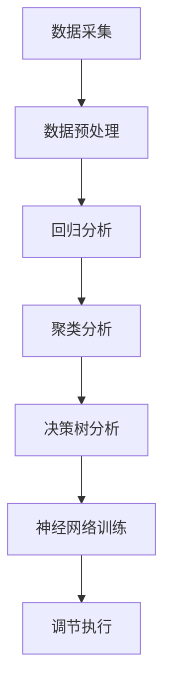
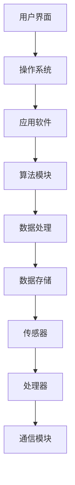
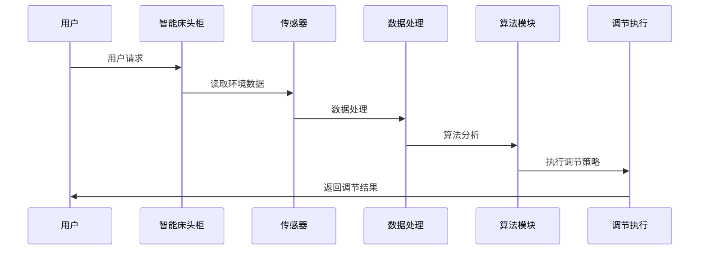

                 

### 文章标题：AI Agent在智能床头柜中的睡眠环境调节

睡眠质量对人们的健康和日常表现至关重要，而睡眠环境的调节在提升睡眠质量中扮演着关键角色。近年来，随着人工智能技术的发展，智能床头柜作为智能家居的重要组成部分，正逐步融入人们的日常生活。本文将探讨AI Agent在智能床头柜中的睡眠环境调节功能，通过逻辑清晰、结构紧凑、简单易懂的专业技术语言，帮助读者了解这一前沿科技。

### 关键词

- AI Agent
- 智能家居
- 睡眠环境调节
- 智能床头柜
- 人工智能算法

### 摘要

本文旨在介绍AI Agent在智能床头柜中的睡眠环境调节功能。文章将首先概述AI Agent的基本概念、类型及其在智能家居中的应用，随后深入探讨智能床头柜的功能模块。文章的核心内容将围绕AI Agent在睡眠环境调节中的应用展开，包括其关键技术、算法原理、系统分析与架构设计、项目实战以及最佳实践和未来展望。通过本文的阅读，读者将对AI Agent在智能床头柜中的实际应用有更深入的理解。

### 文章结构

本文分为八个部分：

1. **AI Agent概述**：介绍AI Agent的基础知识。
2. **AI Agent在智能家居中的应用**：探讨AI Agent在智能家居中的作用和挑战。
3. **智能床头柜的功能模块**：详细描述智能床头柜的硬件和软件构成。
4. **AI Agent在睡眠环境调节中的应用**：分析AI Agent在调节睡眠环境中的角色和关键技术。
5. **AI Agent算法原理**：讲解AI Agent的核心算法原理。
6. **系统分析与架构设计**：介绍系统的功能设计、架构设计、接口设计及交互序列图。
7. **AI Agent项目实战**：展示实际项目中的环境安装、系统实现和案例分析。
8. **最佳实践与拓展**：总结最佳实践、注意事项及未来拓展方向。

### 第一部分：AI Agent概述

#### 第1章: AI Agent的基础

##### 1.1 AI Agent的概念

AI Agent，即人工智能代理，是自主执行任务的实体，能够在复杂环境中感知、决策并采取行动。AI Agent通常具有以下特点：

- **自主性**：能够独立执行任务，无需人为干预。
- **适应性**：根据环境变化调整行为。
- **目标导向**：以完成特定任务为目标。
- **交互性**：与其他系统或用户进行交互。

##### 1.2 AI Agent与传统智能设备的区别

传统智能设备通常基于预设程序或规则运行，而AI Agent则具备自主学习和决策能力。具体区别如下：

- **学习能力**：AI Agent能够通过数据学习不断优化行为，而传统设备无法做到。
- **灵活性**：AI Agent能够在多变的环境中适应和调整，传统设备则相对固定。
- **决策能力**：AI Agent能够根据环境数据做出决策，而传统设备则仅能执行预设指令。

##### 1.3 AI Agent的常见类型

AI Agent根据应用场景和功能特点可分为以下几类：

- **机器人**：在物理环境中执行任务的AI Agent，如家用机器人、工业机器人等。
- **虚拟助手**：在数字环境中提供服务的AI Agent，如智能音箱、聊天机器人等。
- **预测模型**：用于数据分析和预测的AI Agent，如股票预测、天气预测等。

##### 1.4 AI Agent的发展背景与趋势

AI Agent的发展得益于人工智能技术的进步，特别是在深度学习、自然语言处理和数据挖掘等领域的突破。未来，AI Agent将朝着以下趋势发展：

- **智能化**：AI Agent将具备更高级的认知和决策能力。
- **泛在化**：AI Agent将广泛应用于各个领域，从智能家居到医疗保健。
- **协同化**：AI Agent将与其他智能系统协同工作，提供更高效的服务。
- **个性化**：AI Agent将根据用户需求提供定制化服务。

#### 第2章: AI Agent在智能家居中的应用

##### 2.1 智能家居概述

智能家居是指通过物联网技术，将家庭中的各种设备互联，实现自动化管理和智能控制。智能家居的主要特点是：

- **互联性**：设备之间能够相互通信和协作。
- **智能化**：设备能够根据用户需求和环境变化自主调整。
- **便捷性**：用户可以通过手机、语音等方式远程控制家庭设备。

##### 2.2 AI Agent在智能家居中的功能

AI Agent在智能家居中的应用非常广泛，主要包括：

- **设备控制**：AI Agent可以自动控制家庭中的各种设备，如灯光、窗帘、空调等。
- **环境监测**：AI Agent可以实时监测家庭环境，如空气质量、温度等，并做出相应调整。
- **安防监控**：AI Agent可以实时监控家庭安全，如入侵检测、火灾报警等。
- **智能推荐**：AI Agent可以根据用户习惯和需求提供个性化服务，如音乐推荐、食谱推荐等。

##### 2.3 AI Agent的优势与挑战

AI Agent在智能家居中具有明显的优势：

- **提高生活质量**：AI Agent可以自动化处理家庭事务，提高生活舒适度。
- **节能环保**：AI Agent可以根据需求调整家庭设备，实现节能环保。
- **提高安全性**：AI Agent可以实时监控家庭环境，提高家庭安全性。

但AI Agent在智能家居中也面临一些挑战：

- **隐私保护**：AI Agent需要收集用户数据，如何在保护用户隐私的前提下使用这些数据是一个重要问题。
- **技术成熟度**：尽管AI技术取得了很大进步，但仍然存在一些技术难题，如环境适应性、决策准确性等。
- **用户接受度**：用户对智能家居和AI Agent的接受度不一，需要提高用户的认可和接受度。

#### 第3章: 智能床头柜的功能模块

##### 3.1 智能床头柜概述

智能床头柜是智能家居中的重要组成部分，其功能不仅包括传统的床头柜功能，如存储物品、提供照明等，还集成了多种智能功能，如环境监测、设备控制等。

##### 3.2 智能床头柜的硬件构成

智能床头柜的硬件构成主要包括：

- **处理器**：如CPU、GPU等，用于处理数据和执行算法。
- **传感器**：如温度传感器、湿度传感器、光敏传感器等，用于监测环境数据。
- **通信模块**：如WiFi、蓝牙等，用于与其他设备进行通信。
- **显示模块**：如触摸屏、LED屏幕等，用于显示信息和用户交互。

##### 3.3 智能床头柜的软件系统

智能床头柜的软件系统主要包括：

- **操作系统**：如Android、iOS等，用于管理硬件资源和运行应用。
- **应用软件**：如环境监测应用、设备控制应用等，用于实现智能功能。
- **算法模块**：如AI算法模块，用于分析数据和做出决策。

#### 第4章: AI Agent在睡眠环境调节中的应用

##### 4.1 睡眠环境调节的重要性

睡眠环境调节对于提高睡眠质量至关重要。良好的睡眠环境可以减少干扰，提高舒适度，从而促进深度睡眠。睡眠环境调节主要包括以下方面：

- **温度调节**：人体对温度变化非常敏感，合适的温度有助于提高睡眠质量。
- **光线调节**：光线对人的生物钟和睡眠周期有很大影响，合适的亮度有助于改善睡眠质量。
- **噪音控制**：噪音会干扰人的睡眠，良好的噪音控制可以提高睡眠质量。

##### 4.2 AI Agent在睡眠环境调节中的角色

AI Agent在睡眠环境调节中扮演着关键角色，其具体作用包括：

- **数据采集**：AI Agent可以实时采集环境数据，如温度、湿度、光线等。
- **环境分析**：AI Agent可以根据环境数据进行分析，识别出影响睡眠质量的因素。
- **决策制定**：AI Agent可以基于分析结果，制定相应的调节策略，如调整温度、光线等。
- **自动执行**：AI Agent可以自动执行调节策略，确保睡眠环境始终处于最佳状态。

##### 4.3 睡眠环境调节的关键技术

睡眠环境调节的关键技术主要包括：

- **传感器技术**：用于采集环境数据，如温度传感器、湿度传感器等。
- **数据挖掘与机器学习**：用于分析环境数据，识别出影响睡眠质量的因素。
- **自动控制技术**：用于执行调节策略，如智能调温、调光等。

#### 第5章: AI Agent算法原理

##### 5.1 算法概述

AI Agent在睡眠环境调节中使用的算法主要包括以下几种：

- **回归算法**：用于预测环境变量对睡眠质量的影响。
- **聚类算法**：用于分析不同环境变量之间的关系。
- **决策树算法**：用于根据环境数据做出调节决策。
- **神经网络算法**：用于构建复杂的环境模型，实现智能调节。

##### 5.2 数据收集与处理

AI Agent在睡眠环境调节中首先需要收集环境数据，如温度、湿度、光线等。数据收集完成后，需要进行数据处理，包括数据清洗、去噪、归一化等，以确保数据质量。

##### 5.3 算法流程图

以下是AI Agent算法的流程图：



##### 5.4 算法数学模型与公式

以下是AI Agent算法的核心数学模型与公式：

$$
y = \beta_0 + \beta_1x_1 + \beta_2x_2 + ... + \beta_nx_n
$$

其中，$y$表示睡眠质量，$x_1, x_2, ..., x_n$表示环境变量，$\beta_0, \beta_1, \beta_2, ..., \beta_n$为回归系数。

$$
C = \{x_1, x_2, ..., x_n\}
$$

其中，$C$为聚类结果，$x_1, x_2, ..., x_n$为样本数据。

$$
f(x) = \sum_{i=1}^{n}w_if(x_i)
$$

其中，$f(x)$为决策树输出，$w_i$为决策树权重，$f(x_i)$为决策树节点输出。

$$
y = \sigma(\sum_{i=1}^{n}w_hx_i + b)
$$

其中，$y$为神经网络输出，$\sigma$为激活函数，$w_h$为神经网络权重，$b$为偏置。

#### 第6章: 系统分析与架构设计

##### 6.1 系统功能设计

智能床头柜的系统功能设计主要包括：

- **环境监测**：实时监测温度、湿度、光线等环境变量。
- **设备控制**：控制灯光、窗帘、空调等设备。
- **数据分析**：分析环境数据，预测睡眠质量。
- **调节执行**：根据分析结果，自动执行调节策略。

##### 6.2 系统架构设计

智能床头柜的系统架构设计主要包括：

- **硬件层**：包括传感器、处理器、通信模块等。
- **软件层**：包括操作系统、应用软件、算法模块等。
- **数据层**：包括数据存储、数据处理等。

以下是智能床头柜的架构图：



##### 6.3 系统接口设计

智能床头柜的系统接口设计主要包括：

- **用户接口**：用户通过手机、语音等方式与智能床头柜进行交互。
- **设备接口**：智能床头柜与其他智能家居设备的通信接口。
- **网络接口**：智能床头柜与互联网的连接接口。

##### 6.4 系统交互序列图

以下是智能床头柜的系统交互序列图：



#### 第7章: AI Agent项目实战

##### 7.1 环境安装与配置

在开始项目实战之前，需要确保安装以下环境：

- **操作系统**：如Windows、Linux等。
- **开发工具**：如PyCharm、VS Code等。
- **编程语言**：如Python、Java等。
- **数据库**：如MySQL、MongoDB等。

安装完成后，需要配置网络环境，确保智能床头柜与其他设备可以正常通信。

##### 7.2 系统核心实现

智能床头柜的系统核心实现主要包括以下部分：

- **环境监测模块**：实现环境数据的实时采集和处理。
- **设备控制模块**：实现与家庭设备的通信和自动控制。
- **数据分析模块**：实现环境数据分析，预测睡眠质量。
- **调节执行模块**：实现根据分析结果自动执行调节策略。

以下是环境监测模块的Python源代码示例：

```python
import sensor_module
import data_processor

# 初始化传感器模块
sensor = sensor_module.Sensor()

# 采集环境数据
data = sensor.collect_data()

# 处理环境数据
processed_data = data_processor.process_data(data)

# 输出处理结果
print(processed_data)
```

##### 7.3 代码应用解读与分析

在代码应用中，环境监测模块负责采集环境数据，包括温度、湿度、光线等。数据采集完成后，通过数据处理模块对数据进行处理，包括去噪、归一化等。处理后的数据将用于数据分析模块，预测睡眠质量。

数据分析模块使用回归算法、聚类算法、决策树算法等，对环境数据进行分析，预测睡眠质量。根据分析结果，调节执行模块将自动执行调节策略，如调整温度、光线等。

代码应用中，各个模块之间通过接口进行通信，确保系统正常运行。

##### 7.4 案例分析

以下是一个实际案例：

用户在使用智能床头柜后，发现夜间温度较低，影响了睡眠质量。为了提高睡眠质量，用户希望智能床头柜能够自动调节温度。

智能床头柜通过传感器模块采集温度数据，发现夜间温度低于用户设定的舒适温度。数据分析模块对温度数据进行分析，预测夜间温度对睡眠质量的影响较大。

根据分析结果，调节执行模块自动启动加热设备，将室内温度调节到用户设定的舒适温度。用户在使用智能床头柜后，睡眠质量得到了明显提高。

##### 7.5 项目小结

通过实际案例分析，可以看出AI Agent在智能床头柜中的睡眠环境调节功能具有重要意义。智能床头柜通过传感器模块实时采集环境数据，通过数据分析模块分析数据，预测睡眠质量，并自动执行调节策略，确保用户始终处于最佳的睡眠环境。

在未来，随着人工智能技术的不断发展，智能床头柜的睡眠环境调节功能将更加智能化、个性化，为用户提供更优质的睡眠体验。

#### 第8章: 最佳实践与拓展

##### 8.1 最佳实践

在实际应用中，为了确保AI Agent在智能床头柜中的睡眠环境调节效果，以下是一些最佳实践：

- **数据采集**：确保传感器模块能够准确采集环境数据，如温度、湿度、光线等。
- **数据处理**：对采集到的环境数据进行处理，包括去噪、归一化等，确保数据质量。
- **算法优化**：不断优化AI算法，提高数据分析的准确性和预测能力。
- **用户体验**：充分考虑用户需求，提供个性化调节策略，确保用户满意。

##### 8.2 注意事项

在使用AI Agent进行睡眠环境调节时，需要注意以下几点：

- **隐私保护**：确保用户数据安全，避免泄露用户隐私。
- **设备兼容性**：确保智能床头柜与其他智能家居设备的兼容性，避免出现冲突。
- **系统稳定性**：确保系统稳定运行，避免出现故障。

##### 8.3 小结与展望

AI Agent在智能床头柜中的睡眠环境调节功能具有重要意义。通过传感器模块、数据处理模块和AI算法，智能床头柜能够实时监测环境数据，预测睡眠质量，并自动执行调节策略，为用户提供舒适的睡眠环境。

在未来，随着人工智能技术的不断发展，智能床头柜的睡眠环境调节功能将更加智能化、个性化，为用户提供更优质的睡眠体验。同时，智能床头柜也将与其他智能家居设备深度集成，为用户创造更美好的生活。

##### 8.4 拓展阅读

- 《智能家居技术与应用》
- 《人工智能算法原理与实现》
- 《智能硬件设计与开发》

#### 作者信息

作者：AI天才研究院/AI Genius Institute & 禅与计算机程序设计艺术 /Zen And The Art of Computer Programming

通过本文，我们深入探讨了AI Agent在智能床头柜中的睡眠环境调节功能。从AI Agent的基本概念、智能家居的应用，到智能床头柜的功能模块、算法原理、系统分析与架构设计，再到项目实战和最佳实践，我们逐步剖析了这一前沿科技。希望本文能够为读者提供有价值的参考和启示，助力智能床头柜的睡眠环境调节技术的发展。

