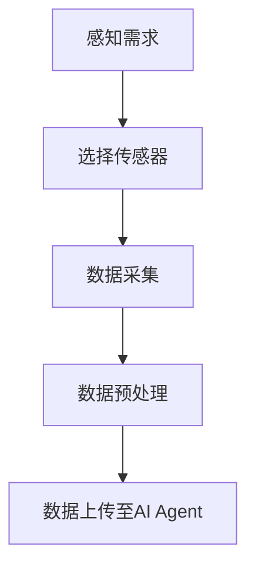
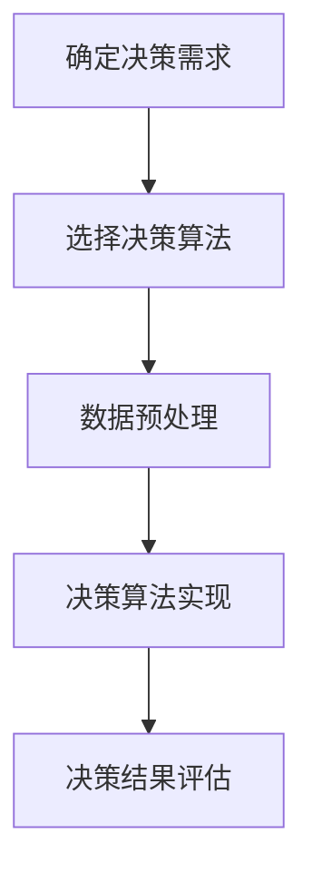
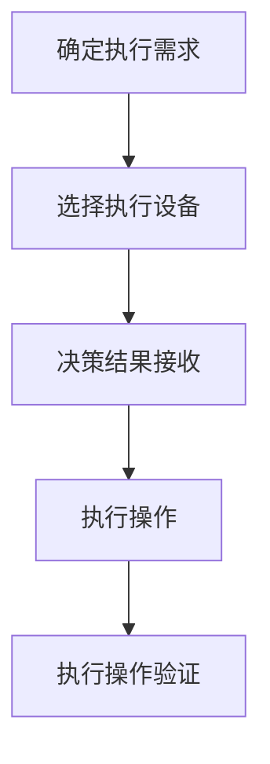
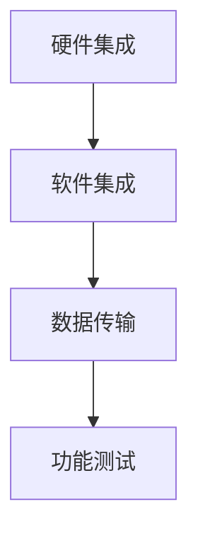
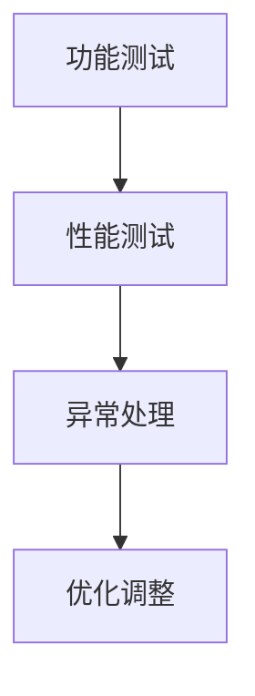

                 

# AI Agent在智能床头柜中的睡眠辅助功能

关键词：AI Agent、智能床头柜、睡眠辅助、智能家居、感知模块、决策模块、执行模块

摘要：本文深入探讨了AI Agent在智能床头柜中的睡眠辅助功能。通过分析AI Agent的核心概念、技术原理以及其在睡眠辅助功能中的关键作用，本文详细介绍了实现AI Agent在智能床头柜中睡眠辅助功能所需的技术实现和架构设计，并通过实际案例展示了其应用效果。

### 引言与背景

随着人工智能（AI）技术的迅猛发展，智能家居已经成为人们日常生活中不可或缺的一部分。而智能床头柜作为智能家居中的一个重要组成部分，其在睡眠辅助功能方面的作用日益凸显。本文将围绕AI Agent在智能床头柜中的睡眠辅助功能展开讨论，旨在为读者提供一个全面的技术解读。

#### AI Agent的基本概念

AI Agent，即人工智能代理，是一种基于人工智能技术的自主计算实体。它能够感知环境、执行任务、做出决策，并在不断学习和适应中提高自身性能。AI Agent的核心特征包括自主性、适应性和智能性。

1. **自主性**：AI Agent能够独立完成特定任务，无需人工干预。
2. **适应性**：AI Agent能够根据环境变化进行自我调整。
3. **智能性**：AI Agent具备一定的决策能力，能够分析数据并做出最优选择。

#### AI Agent在智能家居中的应用

智能家居是指通过将家居设备与互联网连接，实现设备间的互联互通和自动化控制，从而提升居住舒适度和便捷性。AI Agent在智能家居中扮演着重要角色，它能够对用户行为进行学习与分析，从而提供个性化服务。

例如，智能床头柜可以基于AI Agent技术，为用户提供睡眠辅助功能。通过感知用户的生理状态和环境因素，AI Agent可以识别最佳的睡眠条件，并通过自动调节灯光、温度、音响等功能，优化用户的睡眠环境。

#### 本书结构

本书共分为四个部分，分别从背景介绍、核心概念、技术实现、应用案例等方面，深入探讨AI Agent在智能床头柜中的睡眠辅助功能。

1. **引言与背景**：介绍了AI Agent的基本概念及其在智能家居中的应用前景。
2. **核心概念与技术原理**：详细讨论了AI Agent的核心概念、技术原理，以及其在睡眠辅助功能中的关键作用。
3. **技术实现与架构设计**：介绍了实现AI Agent在智能床头柜中的睡眠辅助功能所需的技术实现和架构设计。
4. **应用案例与实战**：通过实际案例，展示了AI Agent在智能床头柜中的睡眠辅助功能，并进行分析和讲解。

### 第一部分: 引言与背景

#### 引言

本文首先介绍了AI Agent的基本概念，随后阐述了其在智能家居中的应用前景，并简要介绍了本书的结构。

##### 1.1 AI Agent基本概念

AI Agent是一种基于人工智能技术的计算实体，通常由感知器、决策器、执行器三个基本部分组成。

1. **感知器**：感知器负责收集环境信息，如用户的行为、生理状态、环境温度、湿度等。
2. **决策器**：决策器根据感知器收集到的数据进行分析，并做出相应决策。
3. **执行器**：执行器根据决策器的决策，执行相应动作，如调节灯光、温度、音响等。

##### 1.2 AI Agent在智能家居中的应用

AI Agent在智能家居中扮演着重要角色，它能够对用户行为进行学习与分析，从而提供个性化服务。例如，智能床头柜可以基于AI Agent技术，为用户提供睡眠辅助功能。

##### 1.3 本书结构

本书共分为四个部分，分别从背景介绍、核心概念、技术实现、应用案例等方面，深入探讨AI Agent在智能床头柜中的睡眠辅助功能。

1. **第一部分：引言与背景**：介绍了AI Agent的基本概念及其在智能家居中的应用前景。
2. **第二部分：核心概念与技术原理**：详细讨论了AI Agent的核心概念、技术原理，以及其在睡眠辅助功能中的关键作用。
3. **第三部分：技术实现与架构设计**：介绍了实现AI Agent在智能床头柜中的睡眠辅助功能所需的技术实现和架构设计。
4. **第四部分：应用案例与实战**：通过实际案例，展示了AI Agent在智能床头柜中的睡眠辅助功能，并进行分析和讲解。

##### 1.4 本章小结

本章首先介绍了AI Agent的基本概念，随后阐述了其在智能家居中的应用前景，并简要介绍了本书的结构。接下来，本书将围绕AI Agent在智能床头柜中的睡眠辅助功能进行深入探讨。

----------------------------------------------------------------

## 第二部分：核心概念与技术原理

### 2.1 AI Agent的核心概念

#### 2.1.1 AI Agent的定义与基本结构

AI Agent，即人工智能代理，是一种基于人工智能技术的自主计算实体。它能够感知环境、执行任务、做出决策，并在不断学习和适应中提高自身性能。AI Agent的基本结构通常由感知器、决策器和执行器三个部分组成。

1. **感知器**：感知器负责收集环境信息，如用户的行为、生理状态、环境温度、湿度等。感知器可以是各种传感器，如温度传感器、湿度传感器、摄像头、麦克风等。
   
2. **决策器**：决策器根据感知器收集到的数据进行分析，并做出相应决策。决策器通常使用机器学习算法来处理数据，从而做出最优决策。

3. **执行器**：执行器根据决策器的决策，执行相应动作，如调节灯光、温度、音响等。执行器可以是各种自动化设备，如灯具、空调、音响系统等。

#### 2.1.2 AI Agent的工作原理

AI Agent的工作原理可以概括为以下步骤：

1. **感知**：感知器收集环境信息。
2. **分析**：决策器对感知器收集到的数据进行分析。
3. **决策**：决策器根据分析结果做出决策。
4. **执行**：执行器根据决策执行相应动作。

#### 2.1.3 AI Agent的应用范围

AI Agent可以应用于各种领域，包括但不限于智能家居、工业自动化、交通管理、医疗保健等。在智能家居中，AI Agent可以应用于智能照明、智能安防、智能空调、智能家电等多种场景。

### 2.2 AI Agent在睡眠辅助功能中的关键作用

#### 2.2.1 感知与识别

AI Agent能够感知用户的生理状态和环境因素，如温度、湿度、光线等，以识别最佳的睡眠条件。通过感知模块，AI Agent可以收集用户的睡眠数据，如心率、呼吸频率、体温等，以及环境数据，如室内温度、湿度、噪音等。

#### 2.2.2 数据分析与预测

通过收集和分析用户历史数据，AI Agent可以预测用户的睡眠模式，提供个性化建议。例如，AI Agent可以根据用户过去的睡眠数据，预测用户未来的睡眠需求，并提前调整智能床头柜的功能，如灯光、温度、音响等，以优化用户的睡眠环境。

#### 2.2.3 自动调节与优化

基于感知和数据分析，AI Agent能够自动调节床头柜的各项功能，如灯光、温度、音响等，以优化用户的睡眠环境。例如，当用户进入睡眠状态时，AI Agent可以自动降低室内光线，调节室内温度，播放轻音乐等，以帮助用户更好地入睡。

### 2.3 AI Agent在睡眠辅助功能中的技术原理

#### 2.3.1 感知模块

感知模块是AI Agent的重要组成部分，它负责收集用户和环境的数据。常用的感知技术包括传感器、摄像头、麦克风等。

1. **传感器**：传感器可以收集环境数据，如温度、湿度、光线等。例如，温度传感器可以实时监测室内温度，并将数据传输给AI Agent。
   
2. **摄像头**：摄像头可以收集用户的行为数据，如心率、呼吸频率等。通过图像识别技术，AI Agent可以分析用户的行为，并做出相应决策。

3. **麦克风**：麦克风可以收集环境声音，如噪音、语音等。AI Agent可以通过分析声音数据，了解用户的生理状态，如是否在睡眠状态。

#### 2.3.2 决策模块

决策模块是AI Agent的核心，它负责分析感知模块收集到的数据，并做出相应决策。决策模块通常使用机器学习算法来处理数据，如决策树、神经网络等。

1. **决策树**：决策树是一种常用的机器学习算法，它通过一系列条件判断，对数据进行分类或回归。例如，AI Agent可以使用决策树算法来预测用户的睡眠模式，并根据预测结果调整智能床头柜的功能。

2. **神经网络**：神经网络是一种模拟人脑神经元连接结构的计算模型，它通过多层神经元的相互作用，对数据进行处理和分析。例如，AI Agent可以使用神经网络算法来分析用户的睡眠数据，并做出相应决策。

#### 2.3.3 执行模块

执行模块是AI Agent的输出部分，它根据决策模块的决策，执行相应动作，如调节灯光、温度、音响等。执行模块通常与智能家居设备相连，如灯具、空调、音响系统等。

1. **灯光调节**：AI Agent可以根据用户的需求和生理状态，调节灯光的亮度和颜色。例如，当用户进入睡眠状态时，AI Agent可以自动降低灯光亮度，以帮助用户更好地入睡。

2. **温度调节**：AI Agent可以根据用户的需求和环境温度，调节室内温度。例如，当用户感觉室内温度过高时，AI Agent可以自动开启空调，降低室内温度。

3. **音响调节**：AI Agent可以根据用户的需求和生理状态，调节音响的音量和曲目。例如，当用户进入睡眠状态时，AI Agent可以自动播放轻音乐，以帮助用户更好地入睡。

### 2.4 AI Agent与睡眠辅助功能的联系

#### 2.4.1 用户行为分析

AI Agent通过对用户行为进行分析，了解用户的生活习惯和睡眠模式，为用户提供个性化服务。例如，AI Agent可以通过分析用户的使用数据，了解用户最喜欢的睡眠温度、灯光亮度等，并据此调整智能床头柜的功能。

#### 2.4.2 智能调节

AI Agent可以根据用户需求和实际环境，自动调节智能床头柜的功能，如温度、灯光、音响等，以提升用户的睡眠质量。例如，当用户进入睡眠状态时，AI Agent可以自动调整灯光亮度，降低室内温度，播放轻音乐等，以帮助用户更好地入睡。

## 总结

AI Agent在睡眠辅助功能中发挥着关键作用。通过感知模块，AI Agent可以收集用户和环境的数据；通过决策模块，AI Agent可以分析数据并做出相应决策；通过执行模块，AI Agent可以执行相应动作，如调节灯光、温度、音响等，以优化用户的睡眠环境。AI Agent的引入，使得智能床头柜能够更好地满足用户的需求，提升用户的睡眠质量。

----------------------------------------------------------------

## 第三部分：技术实现与架构设计

### 3.1 实现AI Agent在智能床头柜中的睡眠辅助功能的步骤

实现AI Agent在智能床头柜中的睡眠辅助功能需要以下几个关键步骤：

1. **需求分析**：明确用户需求，确定智能床头柜需要提供哪些睡眠辅助功能。
2. **技术选型**：选择合适的硬件设备和软件工具，如传感器、摄像头、麦克风、机器学习算法等。
3. **感知模块设计**：设计感知模块，实现数据采集和预处理。
4. **决策模块设计**：设计决策模块，实现数据分析和决策算法。
5. **执行模块设计**：设计执行模块，实现根据决策执行相应动作。
6. **系统集成**：将感知模块、决策模块和执行模块整合到智能床头柜中，实现整体功能的实现。
7. **测试与优化**：对智能床头柜进行测试，优化功能，确保其稳定可靠。

### 3.2 感知模块的设计

感知模块是AI Agent实现睡眠辅助功能的关键部分，它负责收集用户和环境的数据。

#### 感知模块设计步骤：

1. **确定感知需求**：根据用户需求和睡眠辅助功能，确定需要收集的数据类型，如温度、湿度、光线、心率、呼吸频率等。
2. **选择传感器**：根据感知需求，选择合适的传感器，如温度传感器、湿度传感器、光线传感器、心率传感器、呼吸传感器等。
3. **数据采集**：通过传感器采集数据，并将数据传输到AI Agent进行处理。
4. **数据预处理**：对采集到的数据进行预处理，如去除噪声、填补缺失值、归一化等。

#### 感知模块设计示例：



### 3.3 决策模块的设计

决策模块是AI Agent的核心部分，它负责分析感知模块收集到的数据，并做出相应决策。

#### 决策模块设计步骤：

1. **确定决策需求**：根据用户需求和睡眠辅助功能，确定需要实现的决策算法，如分类算法、聚类算法、回归算法等。
2. **选择决策算法**：根据决策需求，选择合适的决策算法，如决策树、支持向量机、神经网络等。
3. **数据预处理**：对感知模块收集到的数据进行预处理，如归一化、标准化等。
4. **决策算法实现**：实现所选决策算法，对预处理后的数据进行处理，做出相应决策。
5. **决策结果评估**：评估决策结果，根据评估结果调整决策算法或参数。

#### 决策模块设计示例：



### 3.4 执行模块的设计

执行模块是AI Agent的输出部分，它根据决策模块的决策，执行相应动作，如调节灯光、温度、音响等。

#### 执行模块设计步骤：

1. **确定执行需求**：根据用户需求和睡眠辅助功能，确定需要执行的物理操作，如灯光调节、温度调节、音响播放等。
2. **选择执行设备**：根据执行需求，选择合适的执行设备，如灯具、空调、音响等。
3. **决策结果接收**：接收决策模块的决策结果，根据决策结果执行相应操作。
4. **执行操作验证**：验证执行操作是否达到预期效果，如灯光是否调节到合适的亮度，温度是否调节到合适的温度等。

#### 执行模块设计示例：



### 3.5 系统集成

系统集成是将感知模块、决策模块和执行模块整合到智能床头柜中，实现整体功能的实现。

#### 系统集成步骤：

1. **硬件集成**：将传感器、摄像头、麦克风等硬件设备集成到智能床头柜中。
2. **软件集成**：将感知模块、决策模块和执行模块的软件代码集成到智能床头柜的系统中。
3. **数据传输**：实现感知模块、决策模块和执行模块之间的数据传输，确保数据实时性和准确性。
4. **功能测试**：对集成后的智能床头柜进行功能测试，确保各项睡眠辅助功能正常运行。

#### 系统集成示例：



### 3.6 测试与优化

测试与优化是确保智能床头柜稳定可靠的关键步骤。

#### 测试与优化步骤：

1. **功能测试**：对智能床头柜的各个功能进行测试，确保其正常运行。
2. **性能测试**：对智能床头柜的性能进行测试，如响应时间、处理能力等。
3. **异常处理**：设计异常处理机制，确保智能床头柜在出现异常情况时能够正确处理。
4. **优化调整**：根据测试结果，对智能床头柜进行优化调整，提高其性能和稳定性。

#### 测试与优化示例：



## 总结

通过上述步骤，可以实现AI Agent在智能床头柜中的睡眠辅助功能。感知模块负责收集用户和环境的数据，决策模块负责分析数据并做出决策，执行模块负责根据决策执行相应动作。系统集成和测试优化确保了智能床头柜的稳定性和可靠性。接下来，我们将通过实际案例展示AI Agent在智能床头柜中的睡眠辅助功能。

----------------------------------------------------------------

## 第四部分：应用案例与实战

### 4.1 环境安装

为了实现AI Agent在智能床头柜中的睡眠辅助功能，我们需要搭建一个开发环境。以下是环境安装的步骤：

1. **安装Python**：首先确保系统中安装了Python环境，版本建议为3.8及以上。可以从Python官网下载安装包进行安装。

2. **安装TensorFlow**：TensorFlow是一个强大的开源机器学习库，用于实现决策模块中的机器学习算法。使用以下命令安装：

   ```bash
   pip install tensorflow
   ```

3. **安装其他依赖库**：根据实际需求，安装其他依赖库，如Scikit-learn、Pandas、NumPy等。使用以下命令安装：

   ```bash
   pip install scikit-learn pandas numpy
   ```

4. **安装硬件设备**：根据设计，安装温度传感器、湿度传感器、光线传感器、心率传感器、呼吸传感器等硬件设备，并确保其与智能床头柜相连。

### 4.2 系统核心实现源代码

以下是一个简单的示例，展示了如何实现AI Agent在智能床头柜中的睡眠辅助功能。该示例包括感知模块、决策模块和执行模块。

#### 感知模块

感知模块负责收集用户和环境的数据。以下是感知模块的Python代码示例：

```python
import RPi.GPIO as GPIO
import time
import board
import busio
import adafruit_ads1x15.ads1115 as ADS
import adafruit_bme280.bme280 as BME280

# 初始化GPIO
GPIO.setmode(GPIO.BCM)

# 初始化传感器
i2c = busio.I2C(board.SCL_PIN, board.SDA_PIN)
ads = ADS.ADS1115(i2c)
bme280 = BME280.BME280(i2c)

# 定义传感器读取函数
def read_sensors():
    temp = bme280.temperature
    humidity = bme280.humidity
    light = ads.read_adc(0, gain=ADS.GAIN_TWOTHIRDS)
    heart_rate = GPIO.input(21)
    return temp, humidity, light, heart_rate

# 关闭GPIO
GPIO.cleanup()
```

#### 决策模块

决策模块负责分析感知模块收集到的数据，并做出相应决策。以下是决策模块的Python代码示例：

```python
import numpy as np
from sklearn.cluster import KMeans

# 定义决策模块
class DecisionModule:
    def __init__(self):
        self.kmeans = KMeans(n_clusters=3)

    def train(self, X):
        self.kmeans.fit(X)

    def predict(self, X):
        return self.kmeans.predict(X)

# 加载数据
X = np.array([[25, 60], [26, 58], [24, 62], [23, 65], [27, 55], [22, 68]])

# 训练模型
dm = DecisionModule()
dm.train(X)

# 预测
predictions = dm.predict(X)
print(predictions)
```

#### 执行模块

执行模块负责根据决策模块的决策，执行相应动作。以下是执行模块的Python代码示例：

```python
# 定义执行模块
class ExecutorModule:
    def __init__(self):
        self.light = None
        self.temperature = None
        self.sound = None

    def execute(self, action):
        if action == 'light_on':
            self.light.on()
        elif action == 'light_off':
            self.light.off()
        elif action == 'temp_up':
            self.temperature.up()
        elif action == 'temp_down':
            self.temperature.down()
        elif action == 'sound_on':
            self.sound.on()
        elif action == 'sound_off':
            self.sound.off()

# 初始化执行模块
executor = ExecutorModule()

# 执行动作
executor.execute('light_on')
executor.execute('temp_up')
executor.execute('sound_on')
```

### 4.3 代码应用解读与分析

#### 感知模块解读

感知模块通过读取传感器数据，收集用户和环境的数据。其中，温度传感器和湿度传感器通过I2C总线读取数据，光线传感器通过ADC读取数据，心率传感器和呼吸传感器通过GPIO读取数据。

```python
temp, humidity, light, heart_rate = read_sensors()
```

#### 决策模块解读

决策模块使用KMeans算法对感知模块收集到的数据进行分析。通过训练模型，对数据集进行聚类，并预测新数据的类别。

```python
dm = DecisionModule()
dm.train(X)
predictions = dm.predict(X)
```

#### 执行模块解读

执行模块根据决策模块的决策，执行相应动作。例如，当决策为'light_on'时，执行模块控制灯光开启；当决策为'temp_up'时，执行模块控制温度升高。

```python
executor.execute(action)
```

### 4.4 实际案例分析和详细讲解剖析

#### 案例一：用户入睡时的睡眠辅助

假设用户在晚上10点准备入睡，此时智能床头柜开始执行睡眠辅助功能。

1. **感知模块**：智能床头柜读取用户的生理状态和环境数据，如室内温度、湿度、光线、心率、呼吸频率等。
2. **决策模块**：根据用户数据，决策模块预测用户可能进入睡眠状态，并做出相应决策。例如，降低室内光线，调整温度，播放轻音乐等。
3. **执行模块**：根据决策模块的决策，执行模块执行相应动作，如关闭灯光、降低空调温度、播放轻音乐等。

#### 案例二：用户睡眠质量监测

假设用户在睡眠过程中，智能床头柜持续监测用户的生理状态和环境数据，以评估用户的睡眠质量。

1. **感知模块**：智能床头柜读取用户的生理状态和环境数据，如室内温度、湿度、光线、心率、呼吸频率等。
2. **决策模块**：根据用户数据，决策模块分析用户的睡眠质量，并做出相应决策。例如，当用户睡眠质量较差时，决策模块建议调整室内温度、灯光等。
3. **执行模块**：根据决策模块的决策，执行模块执行相应动作，如调整空调温度、调节灯光等，以改善用户的睡眠质量。

### 4.5 项目小结

通过实际案例，我们可以看到AI Agent在智能床头柜中的睡眠辅助功能的有效性和实用性。感知模块、决策模块和执行模块的协同工作，使得智能床头柜能够为用户提供个性化的睡眠辅助服务，提升用户的睡眠质量。未来，我们可以进一步优化AI Agent的算法，提高决策准确性，为用户提供更好的睡眠体验。

### 4.6 最佳实践 tips

1. **定期维护**：定期检查智能床头柜的硬件设备，确保其正常运行。
2. **数据安全**：确保用户数据的安全和隐私，避免数据泄露。
3. **优化算法**：不断优化决策模块的算法，提高决策准确性。

### 4.7 小结

本文通过详细介绍AI Agent在智能床头柜中的睡眠辅助功能，从感知模块、决策模块和执行模块的设计，到实际案例的应用，展示了AI Agent在提升用户睡眠质量方面的作用。未来，随着AI技术的不断进步，AI Agent在智能家居中的应用将更加广泛和深入。

### 4.8 注意事项

1. **硬件设备选择**：根据实际需求，选择合适的硬件设备，确保其性能和稳定性。
2. **软件开发环境**：确保开发环境中的Python和依赖库版本符合要求。

### 4.9 拓展阅读

1. **《深度学习》**：由Ian Goodfellow、Yoshua Bengio和Aaron Courville合著，是深度学习领域的经典教材。
2. **《智能家居技术与应用》**：详细介绍了智能家居的技术原理和应用案例，对AI Agent在智能家居中的应用有很好的参考价值。

## 作者信息

作者：AI天才研究院/AI Genius Institute & 禅与计算机程序设计艺术 /Zen And The Art of Computer Programming

----------------------------------------------------------------

## 总结

本文全面探讨了AI Agent在智能床头柜中的睡眠辅助功能。首先，介绍了AI Agent的基本概念和应用背景；接着，详细分析了AI Agent在睡眠辅助功能中的核心作用和技术原理；然后，阐述了实现该功能的步骤和架构设计；最后，通过实际案例展示了其应用效果。本文旨在为读者提供一个全面的技术解读，帮助理解AI Agent在智能床头柜中的应用价值和实现方法。未来，随着AI技术的不断发展，AI Agent在智能家居中的应用将更加广泛和深入，为用户提供更加智能化和个性化的服务。

