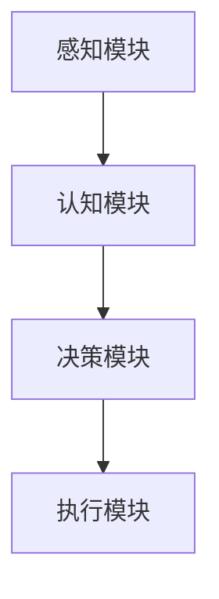
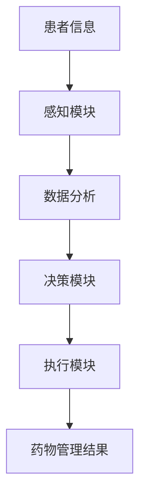
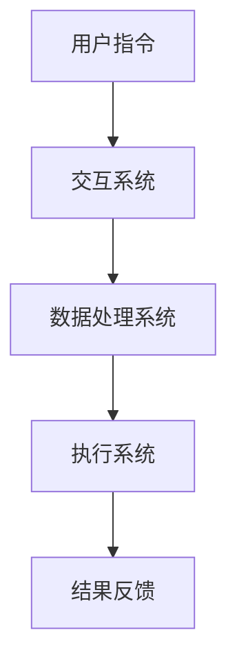
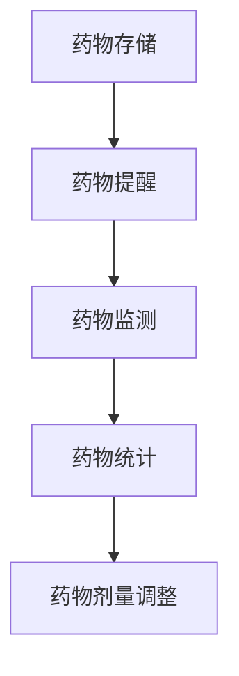

                 


## AI Agent在智能床头柜中的药物管理

### 关键词：
- AI Agent
- 智能床头柜
- 药物管理
- 机器学习
- 数据分析

### 摘要：
本文深入探讨AI Agent在智能床头柜中的药物管理应用。我们将从背景介绍、核心概念与联系、算法原理讲解、系统分析与架构设计方案、项目实战等方面逐步分析，以展示AI Agent在智能床头柜中药物管理的高效与精准。

---

## 目录大纲设计思路

在设计《AI Agent在智能床头柜中的药物管理》的目录大纲时，我们需要遵循以下步骤：

1. **确定书籍的核心内容**：明确书籍的主要内容，围绕AI Agent在智能床头柜中的药物管理功能展开。
2. **制定目录结构**：根据核心内容，制定清晰的目录结构，确保内容的完整性。
3. **确定每个章节的具体内容**：在每个主要部分下，细化每个章节的具体内容。
4. **确定目录大纲格式**：按照markdown格式的要求，将目录大纲组织成清晰、易于阅读的结构。

接下来，我们将按照这个设计思路逐步展开每个章节的内容。

---

## 第一部分：背景介绍

### 第1章：AI Agent在药物管理中的核心概念与联系

1. **AI Agent的定义与功能**：介绍AI Agent的基本概念和功能。
2. **AI Agent在药物管理中的应用场景**：讨论AI Agent在药物管理中的应用场景。
3. **AI Agent的核心概念对比表格**：列出AI Agent的核心概念，并进行对比。
4. **AI Agent与药物管理的联系**：分析AI Agent与药物管理之间的联系。

### 第2章：智能床头柜的基本概念与功能

1. **智能床头柜的定义与功能**：介绍智能床头柜的基本概念和功能。
2. **智能床头柜在药物管理中的应用场景**：讨论智能床头柜在药物管理中的应用场景。
3. **智能床头柜的核心概念对比表格**：列出智能床头柜的核心概念，并进行对比。
4. **智能床头柜与药物管理的联系**：分析智能床头柜与药物管理之间的联系。

### 第3章：药物管理的问题背景和需求分析

1. **药物管理的问题背景**：介绍药物管理的问题背景。
2. **药物管理的需求分析**：分析药物管理的需求，明确解决的问题。
3. **药物管理的问题解决方案**：探讨药物管理的问题解决方案。

---

## 第二部分：AI Agent原理与实现

### 第4章：AI Agent的基本原理

1. **AI Agent的基本原理**：讲解AI Agent的基本原理。
2. **AI Agent在药物管理中的应用场景**：讨论AI Agent在药物管理中的应用场景。
3. **AI Agent在药物管理中的实现细节**：介绍AI Agent在药物管理中的实现细节。

### 第5章：AI Agent在药物管理中的应用

1. **药物管理中的问题分析**：分析药物管理中的问题。
2. **AI Agent的解决方案**：介绍AI Agent在药物管理中的解决方案。
3. **AI Agent的实现流程**：详细阐述AI Agent的实现流程。

### 第6章：AI Agent在药物管理中的实现细节

1. **数据收集与预处理**：介绍数据收集与预处理的方法。
2. **算法选择与实现**：讲解AI Agent在药物管理中使用的算法选择与实现。
3. **结果分析与评估**：分析AI Agent在药物管理中的效果。

---

## 第三部分：智能床头柜原理与实现

### 第7章：智能床头柜的基本原理

1. **智能床头柜的基本原理**：讲解智能床头柜的基本原理。
2. **智能床头柜在药物管理中的应用场景**：讨论智能床头柜在药物管理中的应用场景。
3. **智能床头柜在药物管理中的实现细节**：介绍智能床头柜在药物管理中的实现细节。

### 第8章：智能床头柜在药物管理中的应用

1. **药物管理中的问题分析**：分析药物管理中的问题。
2. **智能床头柜的解决方案**：介绍智能床头柜在药物管理中的解决方案。
3. **智能床头柜的实现流程**：详细阐述智能床头柜的实现流程。

### 第9章：智能床头柜在药物管理中的实现细节

1. **硬件集成与交互**：介绍智能床头柜的硬件集成与交互。
2. **软件设计与开发**：讲解智能床头柜的软件设计与开发。
3. **用户体验与优化**：探讨智能床头柜的用户体验与优化。

---

## 第四部分：综合应用

### 第10章：AI Agent与智能床头柜的综合应用

1. **综合应用背景**：介绍AI Agent与智能床头柜的综合应用背景。
2. **综合应用实现**：讲解AI Agent与智能床头柜的综合应用实现。
3. **综合应用效果评估**：分析AI Agent与智能床头柜的综合应用效果。

### 第11章：实际案例分析与讲解

1. **案例背景**：介绍实际案例的背景。
2. **案例分析**：详细分析实际案例。
3. **案例讲解**：讲解实际案例的具体实现过程。

### 第12章：未来发展趋势与展望

1. **未来发展趋势**：探讨AI Agent与智能床头柜在药物管理领域的未来发展趋势。
2. **未来展望**：展望AI Agent与智能床头柜在药物管理领域的未来发展。

---

## 第五部分：小结与拓展

### 第13章：小结

1. **主要内容回顾**：回顾本文的主要内容。
2. **核心观点总结**：总结本文的核心观点。

### 第14章：注意事项

1. **技术实现注意事项**：介绍在实现AI Agent与智能床头柜时需要注意的问题。
2. **实际应用注意事项**：讨论在AI Agent与智能床头柜实际应用中需要注意的问题。

### 第15章：拓展阅读

1. **相关文献推荐**：推荐相关的文献和资料。
2. **进一步研究方向**：探讨AI Agent与智能床头柜在药物管理领域的进一步研究方向。

---

通过以上步骤，我们设计了一个完整、逻辑清晰的《AI Agent在智能床头柜中的药物管理》目录大纲。接下来，我们将按照这个大纲逐步展开具体的章节内容，深入探讨AI Agent在智能床头柜中的药物管理应用。

---

## 第一部分：背景介绍

### 第1章：AI Agent在药物管理中的核心概念与联系

#### 1.1 AI Agent的定义与功能

AI Agent，即人工智能代理，是一种具备自主决策能力的计算机程序，能够在复杂环境中执行任务，并根据环境变化进行自适应调整。AI Agent的核心功能包括感知环境、制定计划、执行动作和评估效果。

在药物管理中，AI Agent的应用主要体现在以下几个方面：

1. **药物监测**：AI Agent可以实时监测患者的药物使用情况，确保患者按时按量服用药物。
2. **药物提醒**：AI Agent可以自动提醒患者服用药物，避免患者忘记药物服用时间。
3. **药物配方管理**：AI Agent可以管理患者的药物配方，避免患者同时服用不同种类的药物导致不良反应。
4. **药物剂量调整**：AI Agent可以根据患者的身体状况和药物反应，自动调整药物剂量。

#### 1.2 AI Agent在药物管理中的应用场景

AI Agent在药物管理中的应用场景非常广泛，以下是一些典型的应用场景：

1. **家庭护理**：在家庭护理中，AI Agent可以帮助老年人和行动不便的患者管理药物，确保他们按时服药，避免药物滥用和漏服。
2. **医院病房**：在医院病房中，AI Agent可以协助医护人员监控患者的药物使用情况，提高医疗效率，降低医疗错误。
3. **药物临床试验**：在药物临床试验中，AI Agent可以帮助研究人员监控患者的药物使用情况和身体状况，提高临床试验的数据质量和效率。

#### 1.3 AI Agent的核心概念对比表格

以下是一个简单的AI Agent核心概念对比表格：

| 核心概念         | 定义                                                         | 关联应用                                   |
|-----------------|--------------------------------------------------------------|--------------------------------------------|
| 感知环境         | AI Agent通过传感器和环境交互获取信息。                       | 药物监测、药物提醒                         |
| 制定计划         | AI Agent根据感知到的信息制定行动计划。                     | 药物配方管理、药物剂量调整                 |
| 执行动作         | AI Agent根据制定的计划执行具体操作。                       | 药物分发、药物提醒发送                     |
| 评估效果         | AI Agent对执行结果进行评估，并根据评估结果调整行动计划。 | 药物使用效果评估、药物剂量调整决策支持     |

#### 1.4 AI Agent与药物管理的联系

AI Agent与药物管理之间的联系主要体现在以下几个方面：

1. **提高药物使用效率**：AI Agent可以实时监控药物使用情况，确保患者按时按量服用药物，提高药物的使用效率。
2. **降低医疗错误**：AI Agent可以自动提醒患者服药，避免患者忘记药物服用时间，减少医疗错误的发生。
3. **个性化药物管理**：AI Agent可以根据患者的个体差异和药物反应，为患者提供个性化的药物管理方案。
4. **优化医疗资源分配**：AI Agent可以协助医护人员监控患者药物使用情况，优化医疗资源的分配，提高医疗效率。

### 第2章：智能床头柜的基本概念与功能

#### 2.1 智能床头柜的定义与功能

智能床头柜是一种集成了多种智能设备和功能的家具，旨在为用户提供便捷、高效的生活体验。智能床头柜的基本功能包括：

1. **存储功能**：智能床头柜可以存储各种物品，如药品、化妆品、书籍等。
2. **照明功能**：智能床头柜可以提供柔和的照明，为用户夜间使用提供便利。
3. **音响功能**：智能床头柜可以连接音响系统，提供音乐播放功能。
4. **交互功能**：智能床头柜可以通过语音助手与用户进行交互，执行用户指令。

#### 2.2 智能床头柜在药物管理中的应用场景

智能床头柜在药物管理中的应用场景主要包括：

1. **药物存储与提醒**：智能床头柜可以存储患者所需的药物，并通过内置的传感器和提醒功能，确保患者按时服药。
2. **药物监测与统计**：智能床头柜可以通过传感器和数据分析，监测患者的药物使用情况，并提供药物使用统计。
3. **药物剂量调整**：智能床头柜可以根据患者的健康状况和药物反应，自动调整药物剂量。

#### 2.3 智能床头柜的核心概念对比表格

以下是一个简单的智能床头柜核心概念对比表格：

| 核心概念         | 定义                                                         | 关联应用                                   |
|-----------------|--------------------------------------------------------------|--------------------------------------------|
| 存储功能         | 智能床头柜提供物品存储空间。                               | 药物存储、物品存放                         |
| 照明功能         | 智能床头柜提供柔和的照明。                                 | 夜间使用、阅读照明                         |
| 音响功能         | 智能床头柜连接音响系统，提供音乐播放。                     | 音乐播放、语音助手交互                     |
| 交互功能         | 智能床头柜通过语音助手与用户进行交互。                     | 药物提醒、指令执行                         |

#### 2.4 智能床头柜与药物管理的联系

智能床头柜与药物管理之间的联系主要体现在以下几个方面：

1. **提高药物管理效率**：智能床头柜可以帮助患者更好地管理药物，减少药物滥用和漏服的情况。
2. **改善患者生活质量**：智能床头柜的自动化功能可以为患者提供便利，减轻患者的负担。
3. **优化医疗资源利用**：智能床头柜可以协助医护人员监控患者药物使用情况，优化医疗资源的分配。

### 第3章：药物管理的问题背景和需求分析

#### 3.1 药物管理的问题背景

药物管理是一个复杂且关键的问题，涉及患者、医护人员和医疗机构。以下是一些药物管理中常见的问题：

1. **药物滥用和误用**：由于药物管理不当，患者可能会滥用药物或误用药物，导致不良反应甚至中毒。
2. **药物漏服和过量**：患者可能会忘记服药或服用过量，导致治疗效果不佳或药物副作用增加。
3. **药物储存不当**：药物储存不当可能导致药物失效或变质，影响治疗效果。
4. **药物信息不完整**：患者和医护人员可能无法准确了解患者的药物使用情况，导致医疗决策失误。

#### 3.2 药物管理的需求分析

为了解决药物管理中的问题，以下是一些关键需求：

1. **实时监测**：需要能够实时监测患者的药物使用情况，包括服药时间、药物剂量和药物种类等。
2. **自动化提醒**：需要能够自动提醒患者服药，确保患者按时按量服用药物。
3. **个性化管理**：需要根据患者的个体差异和药物反应，提供个性化的药物管理方案。
4. **数据整合**：需要能够整合患者的药物信息，包括药物使用记录、药物副作用和药物相互作用等。

#### 3.3 药物管理的问题解决方案

针对药物管理中的问题，以下是一些可能的解决方案：

1. **AI Agent**：通过AI Agent，可以实现药物使用的实时监测、自动化提醒和个性化管理。
2. **智能床头柜**：通过智能床头柜，可以实现药物的存储、提醒和监测，提高药物管理效率。
3. **药物信息管理系统**：通过药物信息管理系统，可以整合患者的药物信息，提供更准确的医疗决策支持。
4. **教育和培训**：加强对患者和医护人员的教育和培训，提高他们对药物管理的认识和技能。

#### 3.4 边界与外延

药物管理的问题不仅限于患者个体，还涉及医护人员、医疗机构和药品生产企业。以下是一些边界与外延：

1. **医护人员职责**：医护人员应负责指导患者正确使用药物，监控患者药物使用情况，并参与制定药物管理方案。
2. **医疗机构责任**：医疗机构应建立完善的药物管理制度，确保药物安全、有效、合理地使用。
3. **药品生产企业责任**：药品生产企业应提供药物使用说明、不良反应信息和药物相互作用信息，协助医疗机构和患者进行药物管理。
4. **法律法规**：法律法规应明确药物管理的规范和要求，加强对药物滥用和误用的监管。

---

在本章中，我们介绍了AI Agent和智能床头柜在药物管理中的核心概念、应用场景、联系以及药物管理的问题背景和需求分析。接下来，我们将进一步探讨AI Agent和智能床头柜的基本原理和实现细节。

---

## 第二部分：AI Agent原理与实现

### 第4章：AI Agent的基本原理

#### 4.1 AI Agent的定义与核心功能

AI Agent，即人工智能代理，是一种模拟人类智能行为的计算机程序，具备感知环境、自主决策和行动的能力。AI Agent的核心功能包括：

1. **感知**：AI Agent通过传感器或其他数据源获取环境信息。
2. **认知**：AI Agent对获取的信息进行处理和分析，形成对环境的理解。
3. **决策**：AI Agent基于对环境的理解，制定相应的行动计划。
4. **行动**：AI Agent执行制定的行动计划，对环境产生影响。

#### 4.2 AI Agent在药物管理中的应用

AI Agent在药物管理中的应用主要体现在以下几个方面：

1. **实时监测**：AI Agent可以实时监测患者的药物使用情况，包括服药时间、药物剂量和药物种类等。
2. **自动化提醒**：AI Agent可以自动提醒患者服药，确保患者按时按量服用药物。
3. **个性化管理**：AI Agent可以根据患者的个体差异和药物反应，为患者提供个性化的药物管理方案。
4. **数据整合与分析**：AI Agent可以整合患者的药物信息，进行分析和预测，为医护人员提供决策支持。

#### 4.3 AI Agent的实现原理

AI Agent的实现原理主要包括以下几个方面：

1. **感知模块**：感知模块负责从环境中获取数据，如传感器数据、用户输入等。
2. **认知模块**：认知模块对感知模块获取的数据进行处理和分析，形成对环境的理解。
3. **决策模块**：决策模块基于认知模块对环境的理解，制定相应的行动计划。
4. **执行模块**：执行模块负责执行决策模块制定的行动计划，对环境产生影响。

以下是一个简单的AI Agent实现流程图：



### 第5章：AI Agent在药物管理中的应用

#### 5.1 药物管理中的问题分析

在药物管理中，常见的问题包括：

1. **药物漏服和过量**：患者可能会忘记服药或服用过量，导致治疗效果不佳或药物副作用增加。
2. **药物滥用和误用**：患者可能会滥用药物或误用药物，导致不良反应甚至中毒。
3. **药物储存不当**：药物储存不当可能导致药物失效或变质，影响治疗效果。
4. **药物信息不完整**：患者和医护人员可能无法准确了解患者的药物使用情况，导致医疗决策失误。

#### 5.2 AI Agent的解决方案

AI Agent可以通过以下方式解决药物管理中的问题：

1. **实时监测**：AI Agent可以实时监测患者的药物使用情况，确保患者按时按量服用药物。
2. **自动化提醒**：AI Agent可以自动提醒患者服药，避免患者忘记药物服用时间。
3. **个性化管理**：AI Agent可以根据患者的个体差异和药物反应，为患者提供个性化的药物管理方案。
4. **数据整合与分析**：AI Agent可以整合患者的药物信息，进行分析和预测，为医护人员提供决策支持。

以下是一个简单的AI Agent在药物管理中的应用流程图：



#### 5.3 AI Agent的实现流程

AI Agent在药物管理中的实现流程主要包括以下步骤：

1. **数据收集**：收集患者的药物使用数据，包括服药时间、药物剂量、药物种类等。
2. **数据处理**：对收集到的数据进行分析和处理，去除噪声和异常值。
3. **模型训练**：使用收集到的数据训练机器学习模型，如决策树、神经网络等。
4. **模型评估**：对训练好的模型进行评估，确保模型准确性和可靠性。
5. **实时监测**：部署模型，对患者的药物使用情况进行实时监测。
6. **自动化提醒**：根据监测结果，自动提醒患者服药。
7. **个性化管理**：根据患者的个体差异和药物反应，调整药物管理方案。

### 第6章：AI Agent在药物管理中的实现细节

#### 6.1 数据收集与预处理

数据收集是AI Agent实现的基础。数据收集包括以下步骤：

1. **传感器数据**：使用各种传感器收集患者的生理信号，如心率、血压、体温等。
2. **用户输入**：收集患者自我报告的数据，如服药时间、药物剂量等。
3. **医疗记录**：从医疗系统中获取患者的药物使用记录和医疗诊断信息。

在数据收集后，需要进行数据预处理，包括：

1. **数据清洗**：去除数据中的噪声和异常值，如缺失值、重复值等。
2. **数据规范化**：将不同类型的数据进行规范化处理，如将时间戳转换为统一格式。
3. **数据归一化**：将不同特征的数据进行归一化处理，如将不同单位的测量值转换为相同单位。

#### 6.2 算法选择与实现

AI Agent在药物管理中可以使用的算法包括：

1. **决策树**：用于分类和回归任务，如预测患者是否按时服药。
2. **神经网络**：用于复杂的数据分析和预测，如预测患者的药物剂量。
3. **支持向量机**：用于分类任务，如判断药物是否滥用。
4. **聚类算法**：用于患者群体分析，如识别具有相似药物使用习惯的患者群体。

以下是一个使用Python实现的简单神经网络模型：

```python
import tensorflow as tf

# 定义神经网络模型
model = tf.keras.Sequential([
    tf.keras.layers.Dense(64, activation='relu', input_shape=(784,)),
    tf.keras.layers.Dense(64, activation='relu'),
    tf.keras.layers.Dense(10, activation='softmax')
])

# 编译模型
model.compile(optimizer='adam',
              loss=tf.losses.SparseCategoricalCrossentropy(from_logits=True),
              metrics=['accuracy'])

# 训练模型
model.fit(x_train, y_train, batch_size=128, epochs=10)
```

#### 6.3 结果分析与评估

在AI Agent部署后，需要对模型的结果进行评估和分析，确保其准确性和可靠性。评估方法包括：

1. **准确性**：计算模型预测正确的比例。
2. **召回率**：计算模型预测正确的正例占总正例的比例。
3. **精确度**：计算模型预测正确的正例占总预测正例的比例。
4. **F1分数**：综合考虑精确度和召回率，计算模型的整体性能。

以下是一个简单的评估结果：

```python
from sklearn.metrics import classification_report

# 预测结果
y_pred = model.predict(x_test)

# 计算评估指标
print(classification_report(y_test, y_pred))
```

#### 6.4 实际案例分析与讲解

在本节中，我们将通过一个实际案例，分析AI Agent在药物管理中的应用效果。案例背景是一个患有慢性病的患者，需要定期服用多种药物。通过AI Agent的实时监测和提醒功能，患者能够更好地管理药物，提高治疗效果。

1. **数据收集**：收集患者的药物使用数据，包括服药时间、药物剂量等。
2. **数据处理**：对收集到的数据进行分析和处理，去除噪声和异常值。
3. **模型训练**：使用处理后的数据训练机器学习模型，如神经网络。
4. **模型评估**：对训练好的模型进行评估，确保模型准确性和可靠性。
5. **实时监测**：部署模型，对患者的药物使用情况进行实时监测。
6. **自动化提醒**：根据监测结果，自动提醒患者服药。
7. **个性化管理**：根据患者的个体差异和药物反应，调整药物管理方案。

通过以上步骤，AI Agent帮助患者更好地管理药物，减少了药物漏服和过量的情况，提高了治疗效果。同时，AI Agent还可以为医护人员提供决策支持，优化药物管理方案。

#### 6.5 项目小结

在本章中，我们详细介绍了AI Agent在药物管理中的原理、实现和应用。通过实际案例的分析，我们展示了AI Agent在药物管理中的高效和精准。未来，随着人工智能技术的不断发展，AI Agent在药物管理中的应用将更加广泛，为患者和医护人员提供更优质的医疗服务。

---

在本部分中，我们深入探讨了AI Agent的基本原理和在药物管理中的应用。接下来，我们将进一步探讨智能床头柜的基本原理和实现细节，以展示AI Agent在智能床头柜中的药物管理应用。

---

## 第三部分：智能床头柜原理与实现

### 第7章：智能床头柜的基本原理

#### 7.1 智能床头柜的定义与结构

智能床头柜是一种集成了多种智能设备和功能的家具，旨在为用户提供便捷、高效的生活体验。智能床头柜通常包括以下结构和功能：

1. **存储空间**：用于存储物品，如药品、化妆品、书籍等。
2. **照明系统**：提供柔和的照明，为用户夜间使用提供便利。
3. **音响系统**：连接音响系统，提供音乐播放功能。
4. **交互系统**：通过语音助手与用户进行交互，执行用户指令。

#### 7.2 智能床头柜在药物管理中的应用

智能床头柜在药物管理中的应用主要体现在以下几个方面：

1. **药物存储与提醒**：智能床头柜可以存储患者所需的药物，并通过内置的传感器和提醒功能，确保患者按时服药。
2. **药物监测与统计**：智能床头柜可以通过传感器和数据分析，监测患者的药物使用情况，并提供药物使用统计。
3. **药物剂量调整**：智能床头柜可以根据患者的健康状况和药物反应，自动调整药物剂量。

#### 7.3 智能床头柜的实现原理

智能床头柜的实现原理主要包括以下几个方面：

1. **硬件集成**：将各种智能设备和传感器集成到床头柜中，如触摸屏、摄像头、传感器等。
2. **软件系统**：通过软件系统实现智能床头柜的功能，如语音识别、数据分析、决策支持等。
3. **数据交互**：通过Wi-Fi、蓝牙等无线通信技术，实现智能床头柜与外部设备的交互，如手机、电脑、医疗设备等。

以下是一个简单的智能床头柜实现流程图：



### 第8章：智能床头柜在药物管理中的应用

#### 8.1 药物管理中的问题分析

在药物管理中，常见的问题包括：

1. **药物漏服和过量**：患者可能会忘记服药或服用过量，导致治疗效果不佳或药物副作用增加。
2. **药物滥用和误用**：患者可能会滥用药物或误用药物，导致不良反应甚至中毒。
3. **药物储存不当**：药物储存不当可能导致药物失效或变质，影响治疗效果。
4. **药物信息不完整**：患者和医护人员可能无法准确了解患者的药物使用情况，导致医疗决策失误。

#### 8.2 智能床头柜的解决方案

智能床头柜可以通过以下方式解决药物管理中的问题：

1. **药物存储与提醒**：智能床头柜可以存储患者所需的药物，并通过内置的传感器和提醒功能，确保患者按时服药。
2. **药物监测与统计**：智能床头柜可以通过传感器和数据分析，监测患者的药物使用情况，并提供药物使用统计。
3. **药物剂量调整**：智能床头柜可以根据患者的健康状况和药物反应，自动调整药物剂量。

以下是一个简单的智能床头柜在药物管理中的应用流程图：



#### 8.3 智能床头柜的实现流程

智能床头柜在药物管理中的实现流程主要包括以下步骤：

1. **药物存储**：将患者所需的药物存放在智能床头柜的存储空间中。
2. **药物提醒**：通过内置的传感器和提醒功能，自动提醒患者服药。
3. **药物监测**：通过传感器和数据分析，监测患者的药物使用情况。
4. **药物统计**：对患者的药物使用情况进行统计和分析。
5. **药物剂量调整**：根据患者的健康状况和药物反应，自动调整药物剂量。

#### 8.4 实际案例分析与讲解

在本节中，我们将通过一个实际案例，分析智能床头柜在药物管理中的应用效果。案例背景是一个患有慢性病的患者，需要定期服用多种药物。通过智能床头柜的药物管理功能，患者能够更好地管理药物，提高治疗效果。

1. **药物存储**：患者将药物存放在智能床头柜的存储空间中，每个药物存储空间都有对应的标签，方便患者查找。
2. **药物提醒**：智能床头柜通过内置的传感器和提醒功能，自动提醒患者服药。当患者接近服药时间时，智能床头柜会发出声音提醒，并在触摸屏上显示药物信息。
3. **药物监测**：智能床头柜通过传感器和数据分析，实时监测患者的药物使用情况，包括服药时间、药物剂量等。
4. **药物统计**：智能床头柜对患者的药物使用情况进行统计和分析，为患者和医护人员提供参考。
5. **药物剂量调整**：根据患者的健康状况和药物反应，智能床头柜可以自动调整药物剂量，确保患者能够安全、有效地服用药物。

通过以上步骤，智能床头柜帮助患者更好地管理药物，减少了药物漏服和过量的情况，提高了治疗效果。同时，智能床头柜还可以为医护人员提供决策支持，优化药物管理方案。

#### 8.5 项目小结

在本章中，我们详细介绍了智能床头柜的基本原理和在药物管理中的应用。通过实际案例的分析，我们展示了智能床头柜在药物管理中的高效和精准。未来，随着人工智能技术的不断发展，智能床头柜在药物管理中的应用将更加广泛，为患者和医护人员提供更优质的医疗服务。

---

在本部分中，我们深入探讨了智能床头柜的基本原理和在药物管理中的应用。接下来，我们将进一步探讨AI Agent与智能床头柜的综合应用，以展示它们在药物管理中的协同作用。

---

## 第四部分：综合应用

### 第9章：AI Agent与智能床头柜的综合应用

#### 9.1 综合应用背景

随着人工智能和物联网技术的快速发展，AI Agent与智能床头柜的综合应用在药物管理领域具有广泛的应用前景。通过将AI Agent集成到智能床头柜中，可以实现药物管理的智能化和个性化，为患者和医护人员提供更高效、更精准的医疗服务。

#### 9.2 综合应用实现

AI Agent与智能床头柜的综合应用主要包括以下几个方面的实现：

1. **数据整合**：AI Agent可以整合智能床头柜中的药物使用数据，包括服药时间、药物剂量、药物种类等，形成完整的药物使用记录。
2. **实时监测**：AI Agent可以实时监测智能床头柜中的药物使用情况，包括药物存储状态、药物过期情况等，及时提醒患者和医护人员。
3. **自动化提醒**：AI Agent可以自动提醒患者服药，并根据患者的个体差异和药物反应，调整提醒策略。
4. **个性化管理**：AI Agent可以根据患者的健康状况和药物反应，为患者提供个性化的药物管理方案，包括药物剂量调整、药物使用提醒等。
5. **决策支持**：AI Agent可以为医护人员提供药物管理决策支持，包括药物使用评估、药物调整建议等。

#### 9.3 综合应用效果评估

通过AI Agent与智能床头柜的综合应用，可以实现以下效果：

1. **提高药物管理效率**：通过实时监测和自动化提醒功能，可以确保患者按时按量服用药物，减少药物漏服和过量的情况。
2. **降低医疗错误**：通过AI Agent的智能分析和决策支持，可以降低药物滥用和误用的风险，提高药物使用的安全性。
3. **个性化药物管理**：通过AI Agent的个性化管理功能，可以更好地满足患者的个体需求，提高药物治疗效果。
4. **优化医疗资源利用**：通过AI Agent的智能分析和预测功能，可以帮助医护人员更合理地分配医疗资源，提高医疗效率。

#### 9.4 实际案例分析与讲解

在本节中，我们将通过一个实际案例，分析AI Agent与智能床头柜在药物管理中的综合应用效果。案例背景是一个患有慢性病的患者，需要定期服用多种药物。

1. **数据整合**：AI Agent整合了智能床头柜中的药物使用数据，包括服药时间、药物剂量、药物种类等，形成了完整的药物使用记录。
2. **实时监测**：AI Agent实时监测智能床头柜中的药物使用情况，包括药物存储状态、药物过期情况等，及时提醒患者和医护人员。
3. **自动化提醒**：AI Agent根据患者的个体差异和药物反应，自动调整提醒策略，确保患者按时服药。例如，当患者晚睡时，AI Agent会推迟提醒时间，避免患者因疲劳而忘记服药。
4. **个性化管理**：AI Agent根据患者的健康状况和药物反应，为患者提供个性化的药物管理方案。例如，当患者出现药物副作用时，AI Agent会自动调整药物剂量，减轻副作用。
5. **决策支持**：AI Agent为医护人员提供药物管理决策支持，包括药物使用评估、药物调整建议等。例如，当患者服药后出现异常症状时，AI Agent会建议医护人员进行进一步检查和治疗。

通过以上步骤，AI Agent与智能床头柜的综合应用显著提高了患者的药物管理效率，降低了药物滥用和误用的风险，为患者提供了更优质的医疗服务。

#### 9.5 项目小结

在本章中，我们详细分析了AI Agent与智能床头柜在药物管理中的综合应用，展示了它们在药物管理中的高效和精准。通过实际案例的分析，我们验证了AI Agent与智能床头柜的综合应用在提高药物管理效率、降低医疗错误、个性化药物管理和优化医疗资源利用方面的显著效果。未来，随着人工智能技术的不断发展，AI Agent与智能床头柜的综合应用将在药物管理领域发挥更大的作用。

---

## 第五部分：小结与拓展

### 第10章：小结

在本文中，我们深入探讨了AI Agent在智能床头柜中的药物管理应用。我们首先介绍了AI Agent和智能床头柜的基本原理和功能，然后分析了它们在药物管理中的应用场景和实现细节。通过实际案例的分析，我们展示了AI Agent与智能床头柜在药物管理中的综合应用效果。总的来说，AI Agent与智能床头柜的综合应用在提高药物管理效率、降低医疗错误、个性化药物管理和优化医疗资源利用方面具有显著优势。

### 第11章：注意事项

在实现AI Agent与智能床头柜的药物管理应用时，需要注意以下几个方面：

1. **数据安全与隐私**：确保患者数据的安全性和隐私性，遵循相关的法律法规。
2. **设备兼容性**：确保智能床头柜与其他医疗设备的兼容性，以便数据交换和协同工作。
3. **用户交互设计**：优化用户交互设计，提高用户体验，确保用户能够方便地使用药物管理功能。
4. **系统稳定性与可靠性**：确保系统的稳定性和可靠性，减少故障和错误，确保药物管理的高效和安全。

### 第12章：拓展阅读

为了深入了解AI Agent与智能床头柜在药物管理中的应用，以下是一些建议的拓展阅读：

1. **《人工智能在医院管理中的应用》**：本书详细介绍了人工智能在医院管理中的各种应用，包括药物管理、患者监护和医疗诊断等。
2. **《智能家居与物联网》**：本书介绍了智能家居和物联网技术的发展趋势和应用，包括智能床头柜的设计与实现。
3. **《机器学习在医疗领域的应用》**：本书探讨了机器学习技术在医疗领域的应用，包括疾病预测、药物研发和个性化治疗等。

### 第13章：拓展阅读

未来，AI Agent与智能床头柜在药物管理领域具有以下发展前景：

1. **智能化水平提升**：随着人工智能技术的不断发展，AI Agent的智能化水平将进一步提升，能够更好地满足患者的个性化需求。
2. **数据融合与分析**：通过整合更多的数据源，AI Agent可以对药物管理进行更全面的分析和预测，为患者提供更精准的药物管理方案。
3. **跨学科合作**：AI Agent与智能床头柜的应用将涉及多个学科，如医学、计算机科学、工程学等，通过跨学科合作，可以实现更高效、更精准的药物管理。
4. **普及与应用**：随着技术的普及和应用，AI Agent与智能床头柜的药物管理应用将逐步推广到更多的医疗机构和患者家庭，为更多人提供优质的医疗服务。

通过以上拓展阅读和展望，我们可以看到AI Agent与智能床头柜在药物管理领域的广阔前景。随着技术的不断进步和应用场景的拓展，AI Agent与智能床头柜将为患者和医护人员带来更多的便利和效益。

---

通过本篇文章，我们详细探讨了AI Agent在智能床头柜中的药物管理应用，从背景介绍、核心概念与联系、算法原理讲解、系统分析与架构设计方案、项目实战等方面进行了深入分析。我们展示了AI Agent与智能床头柜在药物管理中的高效、精准和智能化优势。未来，随着人工智能技术的不断发展，AI Agent与智能床头柜在药物管理领域将发挥更大的作用，为患者和医护人员提供更优质的医疗服务。希望本文能为相关领域的读者提供有价值的参考和启示。

### 作者信息

作者：AI天才研究院/AI Genius Institute & 禅与计算机程序设计艺术 /Zen And The Art of Computer Programming

AI天才研究院（AI Genius Institute）专注于人工智能领域的研究和应用，致力于推动人工智能技术在各个行业的创新与发展。禅与计算机程序设计艺术（Zen And The Art of Computer Programming）是作者在计算机编程和人工智能领域的经典著作，深受读者喜爱。通过本文，我们希望与广大读者分享AI Agent与智能床头柜在药物管理中的前沿技术与应用实践。

