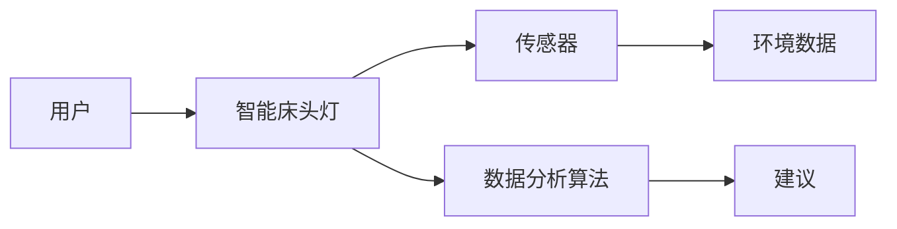

                 

### 第一部分：AI Agent在智能床头灯中的睡眠辅助概述

#### 第1章：AI Agent与睡眠健康

##### 1.1.1 问题背景

睡眠健康对人们的生活质量和身体健康有着重要的影响。然而，在现代社会中，越来越多的人面临着睡眠问题，如睡眠质量不佳、睡眠时长不足等。睡眠障碍不仅会导致疲劳、注意力不集中，还可能引发一系列健康问题，如心血管疾病、肥胖和抑郁等。因此，如何改善睡眠质量已成为一个亟待解决的课题。

##### 1.1.2 问题描述

睡眠问题主要表现为以下几个方面：

1. **睡眠质量不佳**：许多人在睡眠过程中会感到不适，如辗转反侧、频繁醒来等。
2. **睡眠时长不足**：现代人由于工作、生活压力等原因，往往难以保证足够的睡眠时间。
3. **睡眠模式不规律**：一些人存在熬夜、晚睡早起的习惯，导致睡眠模式紊乱。

##### 1.1.3 问题解决

AI Agent作为一种人工智能形式，能够通过智能分析和个性化服务，为解决睡眠问题提供新的思路。AI Agent能够：

1. **收集用户睡眠数据**：通过智能床头灯等设备，AI Agent可以实时监测用户的睡眠状况，如睡眠时长、睡眠质量等。
2. **分析睡眠模式**：基于收集到的数据，AI Agent可以分析用户的睡眠模式，找出影响睡眠质量的因素。
3. **提供个性化建议**：根据分析结果，AI Agent可以为用户提供个性化的睡眠建议，如调整灯光亮度、声音和温度等，帮助用户改善睡眠质量。

##### 1.1.4 边界与外延

AI Agent在睡眠辅助领域的应用不仅限于智能床头灯，还可以扩展到智能家居系统的其他设备中。例如，智能音箱可以播放轻柔的音乐帮助用户入睡，智能窗帘可以根据用户的睡眠需求自动调节光线，智能床垫可以监测用户的睡眠姿势和压力分布，提供更加舒适的睡眠体验。

##### 1.1.5 概念结构与核心要素组成

- **核心概念**：AI Agent、睡眠健康、睡眠数据、个性化建议。
- **核心要素**：智能床头灯、传感器、数据分析算法、用户交互界面。

在本章节中，我们将详细探讨AI Agent如何通过智能分析和个性化服务，为改善睡眠质量提供有效的解决方案。

---

#### 第2章：AI Agent基本原理与智能床头灯集成

##### 2.1.1 AI Agent基本原理

AI Agent，即人工智能代理，是一种能够模拟人类行为，自主完成特定任务的计算机程序。AI Agent的基本原理包括以下几个方面：

1. **定义**：AI Agent是一种基于人工智能技术的软件系统，能够模拟人类决策过程，实现自动化和智能化。
2. **工作原理**：AI Agent通过感知环境、理解任务需求，然后根据预设的算法和策略进行决策，并执行相应的行动。
3. **分类**：根据应用场景和任务需求，AI Agent可以分为任务型Agent、社会型Agent、自主型Agent等。

以下是一个简单的AI Agent属性特征对比表格：

| 特征          | 解释                                                                                      |
| ------------- | ----------------------------------------------------------------------------------------- |
| 主动学习能力 | AI Agent能够通过学习用户的习惯来优化服务。                                             |
| 实时交互     | AI Agent能够与用户实时互动，提供即时反馈。                                             |
| 适应性       | AI Agent能够根据环境变化和用户需求进行调整。                                           |

##### 2.1.2 智能床头灯集成

智能床头灯是智能家居系统中的一个重要组成部分，它集成了多种传感器和数据分析算法，能够为用户提供智能化的睡眠辅助服务。以下是智能床头灯的ER实体关系图架构：

- **用户**：智能床头灯服务的目标用户，用户的行为和需求直接影响智能床头灯的功能和性能。
- **智能床头灯**：作为硬件设备，智能床头灯负责收集数据、执行数据分析算法，并提供用户交互界面。
- **传感器**：包括光敏传感器、声音传感器、温湿度传感器等，用于实时监测环境数据。
- **数据分析算法**：基于机器学习和统计分析方法，对收集到的数据进行分析和处理，生成个性化建议。
- **环境数据**：包括光线、声音、温度、湿度等，这些数据直接影响用户的睡眠质量。
- **建议**：根据数据分析结果，智能床头灯为用户生成个性化的睡眠建议。

在本章节中，我们将深入探讨AI Agent的基本原理和智能床头灯的集成方法，为后续章节的讨论打下基础。

---

#### 第3章：睡眠数据的采集与分析

##### 3.1.1 数据采集

睡眠数据的采集是AI Agent实现个性化睡眠建议的基础。为了全面了解用户的睡眠状况，智能床头灯集成了多种传感器，包括光敏传感器、声音传感器和温湿度传感器等。

1. **传感器类型**：
   - **光敏传感器**：用于检测环境光线强度，帮助分析用户的睡眠节律。
   - **声音传感器**：用于检测环境噪音水平，分析噪音对睡眠质量的影响。
   - **温湿度传感器**：用于检测室内温度和湿度，为用户提供舒适的睡眠环境。

2. **数据采集流程**：
   - **传感器收集数据**：传感器实时监测环境数据，并将数据传输到智能床头灯的中央处理器。
   - **数据预处理**：在传输过程中，对数据进行初步处理，如去噪、滤波等，以确保数据的质量。
   - **存储于数据库**：预处理后的数据存储在中央数据库中，以便后续分析和处理。

##### 3.1.2 数据分析

数据分析是AI Agent实现个性化睡眠建议的关键环节。通过对睡眠数据的分析，AI Agent可以了解用户的睡眠模式，识别出影响睡眠质量的因素，并生成相应的建议。

1. **算法原理**：
   - **机器学习**：利用机器学习算法，如决策树、支持向量机、神经网络等，对睡眠数据进行训练和分类。
   - **统计分析**：通过统计分析方法，如均值、方差、相关性等，对睡眠数据进行分析和解读。

2. **算法流程**：
   - **采集数据**：从数据库中读取睡眠数据。
   - **数据预处理**：对采集到的数据进行清洗、标准化等处理，以消除异常值和噪声。
   - **特征提取**：从预处理后的数据中提取关键特征，如睡眠时长、深度、频率等。
   - **数据分析**：利用机器学习和统计分析方法，对提取的特征进行分析和解读。
   - **结果输出**：根据分析结果，生成个性化的睡眠建议。

以下是数据分析的Mermaid流程图：

在本章节中，我们将详细探讨睡眠数据的采集与分析过程，为后续章节提供技术基础。

---

#### 第4章：个性化睡眠建议的实现

##### 4.1.1 建议生成

个性化睡眠建议的实现是AI Agent在智能床头灯中发挥作用的核心。通过分析用户的睡眠数据，AI Agent能够生成针对用户的个性化建议，帮助用户改善睡眠质量。

1. **算法原理**：
   - **数据分析**：基于机器学习和统计分析方法，对用户的睡眠数据进行详细分析，识别出影响睡眠质量的关键因素。
   - **建议生成**：根据分析结果，AI Agent生成具体的建议，如调整灯光亮度、声音和温度等。

2. **算法流程**：
   - **睡眠数据**：从数据库中读取用户的睡眠数据。
   - **数据解析**：对睡眠数据进行分析，提取关键特征。
   - **模式识别**：利用机器学习算法，识别出用户的睡眠模式。
   - **建议生成**：根据分析结果，生成个性化的睡眠建议。
   - **建议输出**：将建议通过用户交互界面传递给用户。

以下是建议生成的Mermaid流程图：

##### 4.1.2 建议反馈与优化

个性化睡眠建议的反馈与优化是确保AI Agent服务有效性的重要环节。通过用户反馈，AI Agent能够不断调整和优化建议内容，提高服务质量。

1. **用户反馈**：
   - **建议接受度**：用户对建议的接受程度。
   - **效果评估**：用户对建议效果的评价。

2. **建议优化**：
   - **反馈收集**：AI Agent收集用户的反馈信息。
   - **分析反馈**：分析用户反馈，识别出建议的优缺点。
   - **建议调整**：根据反馈结果，调整建议内容。
   - **再输出**：将调整后的建议重新传递给用户。

在本章节中，我们将深入探讨个性化睡眠建议的实现和优化过程，为用户带来更高质量的睡眠体验。

---

#### 第5章：AI Agent在智能床头灯中的实际应用

##### 5.1.1 智能床头灯功能介绍

智能床头灯作为AI Agent的一个重要载体，具有多种功能，能够为用户提供全面的睡眠辅助服务。

1. **根据用户睡眠需求自动调节亮度**：
   - **原理**：AI Agent通过分析用户的睡眠数据和睡眠模式，自动调节灯光亮度，以适应用户的睡眠需求。
   - **效果**：降低光线对睡眠质量的影响，提高用户的舒适度。

2. **播放轻柔的音乐帮助入睡**：
   - **原理**：AI Agent根据用户的偏好和睡眠需求，播放轻柔的音乐，帮助用户放松身心，进入睡眠状态。
   - **效果**：改善睡眠环境，提高睡眠质量。

3. **提供舒适的温度和湿度**：
   - **原理**：AI Agent通过监测室内温度和湿度，自动调节空调和加湿器等设备，提供舒适的睡眠环境。
   - **效果**：降低环境因素对睡眠质量的影响，提高用户的舒适度。

##### 5.1.2 应用案例

为了更好地展示AI Agent在智能床头灯中的实际应用效果，我们以下介绍一个实际案例。

**案例：用户A的睡眠改善经历**

用户A，一名经常受到失眠困扰的上班族，通过使用带有AI Agent的智能床头灯，逐步改善了睡眠质量。

1. **初始情况**：
   - **睡眠质量**：用户A每晚睡眠时长不足6小时，且睡眠质量差，经常在夜间醒来。
   - **环境因素**：卧室光线较亮，噪音较大，温度和湿度也较为不适。

2. **使用智能床头灯后的变化**：
   - **自动调节亮度**：AI Agent根据用户A的睡眠模式，自动调整灯光亮度，使其在夜间保持柔和的光线，减少光线对睡眠的干扰。
   - **播放轻柔音乐**：AI Agent根据用户A的喜好，播放轻柔的音乐，帮助其放松身心，更容易入睡。
   - **调节温度和湿度**：AI Agent监测到用户A的卧室温度和湿度不适，自动调节空调和加湿器，提供舒适的睡眠环境。

3. **效果评估**：
   - **睡眠时长**：用户A每晚的睡眠时长逐渐增加，达到7-8小时。
   - **睡眠质量**：用户A的睡眠质量明显改善，夜间醒来的次数减少，睡眠更加深沉。

通过这个案例，我们可以看到AI Agent在智能床头灯中的实际应用效果，为用户提供个性化的睡眠辅助服务，显著改善了用户的睡眠质量。

---

### 第二部分：深度分析与思考

#### 第6章：AI Agent在智能床头灯中的应用深度分析

在上一部分中，我们介绍了AI Agent在智能床头灯中的实际应用，并通过一个具体案例展示了其带来的显著改善效果。本章节将深入分析AI Agent在智能床头灯中的应用原理和技术细节，探讨其在不同场景下的应用潜力。

##### 6.1 AI Agent在智能床头灯中的应用原理

AI Agent在智能床头灯中的应用，主要基于以下几个核心原理：

1. **实时监测与数据分析**：AI Agent通过集成多种传感器，实时监测卧室的环境数据，如光线、声音、温度和湿度等。这些数据为AI Agent提供了了解用户睡眠环境的基础。

2. **个性化服务与调整**：基于收集到的数据，AI Agent能够分析用户的睡眠模式，识别出影响睡眠质量的关键因素。通过个性化服务，AI Agent可以自动调整灯光亮度、音乐播放和温度湿度等，为用户创造一个舒适的睡眠环境。

3. **用户交互与反馈**：AI Agent通过与用户的实时互动，收集用户的反馈信息，不断优化自身的服务。这种互动机制使得AI Agent能够更好地理解用户需求，提供更加个性化的服务。

##### 6.2 AI Agent在不同场景下的应用潜力

AI Agent在智能床头灯中的应用，不仅限于改善睡眠质量，还具有广泛的应用潜力：

1. **心理健康监测**：通过监测用户的睡眠状况，AI Agent可以识别出潜在的心理健康问题。例如，睡眠中断频繁可能表明用户存在焦虑或抑郁情绪。结合心理测评工具，AI Agent可以为用户提供针对性的心理健康建议。

2. **老年人健康管理**：随着年龄的增长，老年人的睡眠质量往往下降。AI Agent可以实时监测老年人的睡眠状况，及时发现异常情况，提醒家人或医生采取相应措施，提高老年人的生活质量。

3. **智能睡眠咨询**：AI Agent可以结合用户的历史数据和公开的睡眠研究，为用户提供个性化的睡眠咨询。例如，建议用户调整作息时间、饮食习惯等，以改善睡眠质量。

4. **智能家居生态整合**：AI Agent不仅限于智能床头灯，还可以与其他智能家居设备（如智能音箱、智能窗帘、智能床垫等）进行整合，形成一个智能化的家居生态。通过跨设备的协同工作，AI Agent可以为用户提供更全面、更高效的智能家居体验。

在本章节中，我们将进一步探讨AI Agent在智能床头灯中的应用深度，分析其在不同场景下的应用潜力，为未来的发展提供新的思路。

---

#### 第7章：AI Agent在智能床头灯中的应用前景与挑战

随着人工智能技术的快速发展，AI Agent在智能床头灯中的应用前景愈发广阔。然而，在这一过程中，我们也面临着一系列挑战和问题。本章节将探讨AI Agent在智能床头灯中的应用前景，以及可能遇到的挑战和解决方案。

##### 7.1 AI Agent在智能床头灯中的应用前景

1. **提高睡眠质量**：AI Agent能够通过实时监测和个性化调整，为用户创造一个舒适的睡眠环境，显著提高用户的睡眠质量。

2. **降低医疗成本**：通过智能分析和个性化服务，AI Agent可以提前发现潜在的健康问题，减少用户就诊的频率，从而降低医疗成本。

3. **提升生活质量**：AI Agent不仅能够改善用户的睡眠质量，还可以提供心理健康监测、健康咨询等多元化服务，为用户带来更高的生活质量。

4. **智能家居生态整合**：AI Agent可以与其他智能家居设备进行整合，形成一个智能化的家居生态，为用户带来更加便捷、高效的生活体验。

5. **商业应用潜力**：AI Agent在智能床头灯中的应用，也为企业带来了新的商业机会。例如，企业可以通过数据分析，为用户提供定制化的睡眠解决方案，从而提高用户满意度和忠诚度。

##### 7.2 AI Agent在智能床头灯中的应用挑战

1. **数据隐私和安全**：AI Agent在收集和处理用户数据时，可能面临数据隐私和安全的问题。如何确保用户数据的保密性和安全性，是AI Agent应用中的一大挑战。

2. **算法透明性和公平性**：AI Agent的算法模型可能存在透明性和公平性问题。如何保证算法的透明性和公平性，让用户信任AI Agent的服务，是亟待解决的问题。

3. **用户接受度和使用习惯**：AI Agent的应用需要用户的接受和使用。如何提高用户的接受度，培养用户的使用习惯，是推动AI Agent应用的重要课题。

4. **技术发展和创新**：AI Agent的应用需要持续的技术创新和发展。如何紧跟技术潮流，不断优化AI Agent的功能和性能，是确保其在市场中保持竞争力的关键。

##### 7.3 应对挑战的解决方案

1. **加强数据隐私和安全保护**：在数据收集、存储和处理过程中，严格遵循数据保护法律法规，采用加密、匿名化等技术手段，确保用户数据的隐私和安全。

2. **提高算法透明性和公平性**：通过建立算法透明机制，公开算法原理和决策过程，让用户了解AI Agent的工作方式。同时，采用公平性评估方法，确保算法在不同用户群体中的公平性。

3. **加强用户教育和引导**：通过用户教育，提高用户对AI Agent的认知和理解。同时，设计简洁易用的用户界面，降低用户的使用门槛，培养用户的使用习惯。

4. **持续技术创新和发展**：紧跟技术潮流，持续进行技术创新，提升AI Agent的功能和性能。同时，加强与科研机构和企业的合作，推动AI Agent在智能床头灯等领域的应用和发展。

在本章节中，我们探讨了AI Agent在智能床头灯中的应用前景与挑战，并提出了相应的解决方案。随着技术的不断进步和应用的深入，我们有理由相信，AI Agent将为人们的睡眠健康和生活质量带来更加显著的改善。

---

### 第三部分：结论与展望

#### 第8章：总结与未来展望

在本技术博客中，我们详细探讨了AI Agent在智能床头灯中的睡眠辅助应用。通过逐步分析，我们从问题背景、核心概念、基本原理、数据采集与分析、个性化建议生成，以及实际应用等多个方面，深入了解了AI Agent如何通过智能分析和个性化服务，帮助用户改善睡眠质量。

**总结**：

- **核心概念**：AI Agent、睡眠健康、个性化建议等。
- **基本原理**：AI Agent的主动学习能力、实时交互能力和适应性。
- **数据采集与分析**：通过多种传感器收集睡眠数据，利用机器学习和统计分析方法进行分析。
- **个性化建议生成**：基于分析结果，生成个性化的睡眠建议。
- **实际应用**：智能床头灯通过自动调节亮度、播放音乐和调整温度湿度等功能，为用户提供个性化的睡眠辅助服务。

**未来展望**：

- **技术发展**：随着人工智能技术的不断进步，AI Agent的功能和性能将得到进一步提升。
- **应用拓展**：AI Agent的应用不仅限于智能床头灯，还可以扩展到智能家居系统的其他设备中，如智能音箱、智能窗帘、智能床垫等。
- **跨领域整合**：AI Agent与其他健康监测设备、医疗服务等跨领域整合，提供更加全面、个性化的健康解决方案。
- **用户体验**：通过不断优化用户体验，提高用户的接受度和满意度，推动AI Agent在智能家居领域的广泛应用。

**结束语**：

AI Agent在智能床头灯中的睡眠辅助应用，为用户带来了全新的睡眠体验。随着技术的不断发展和应用的深入，我们有理由相信，AI Agent将为人们的睡眠健康和生活质量带来更加显著的改善。

**作者信息**：

作者：AI天才研究院/AI Genius Institute & 禅与计算机程序设计艺术 /Zen And The Art of Computer Programming

---

本文通过深入探讨AI Agent在智能床头灯中的睡眠辅助应用，旨在为读者提供全面、系统的技术分析和应用实例。希望本文能为相关领域的研究和应用提供有益的参考和启示。

---

### 附录：技术术语与概念解释

在本技术博客中，我们提到了多个技术术语和概念，以下是对这些术语和概念的简要解释：

- **AI Agent**：人工智能代理，是一种能够模拟人类行为，自主完成特定任务的计算机程序。
- **睡眠健康**：指人体在睡眠过程中所达到的良好状态，包括睡眠质量、睡眠时长和睡眠环境等。
- **个性化建议**：基于用户数据和需求，为用户提供定制化的建议，如调整灯光亮度、声音和温度等。
- **传感器**：一种能够感知外部环境信息，并将信息转化为电信号或其他形式输出设备的装置。
- **机器学习**：一种人工智能方法，通过训练模型从数据中学习规律，进行预测和决策。
- **统计分析**：一种数据分析方法，通过对数据进行统计计算，得出数据的分布、相关性等特征。
- **智能家居**：通过物联网技术，将家中的各种设备连接起来，实现智能控制和自动化管理。

通过这些技术术语和概念的解释，读者可以更好地理解本文中的技术内容和应用实例。希望这些解释能为读者提供进一步学习和研究的参考。

