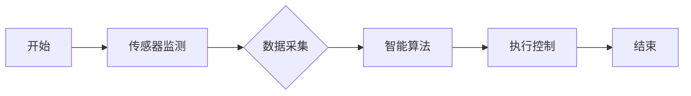
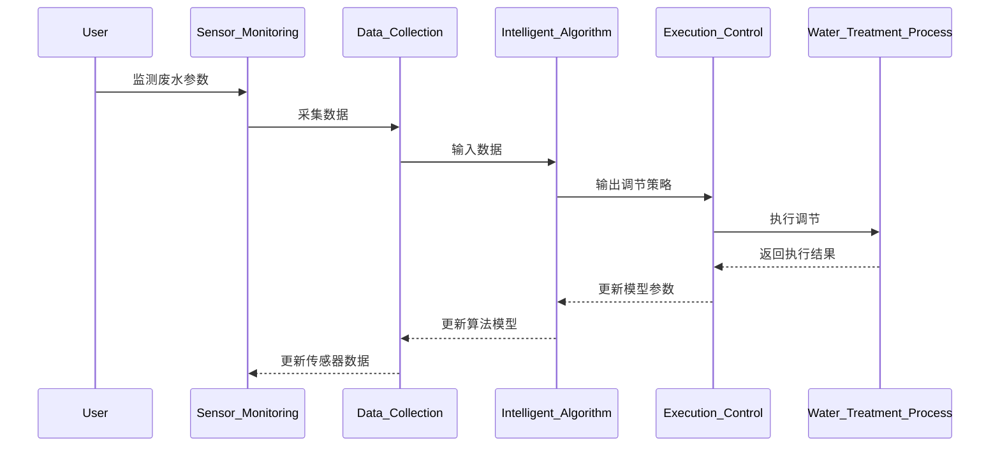
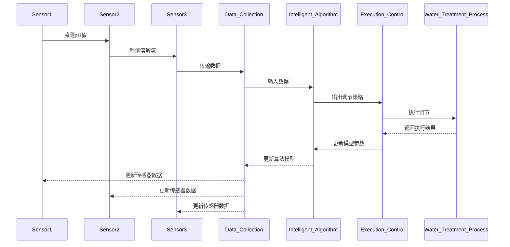

                 

# AI Agent在智能废水处理控制中的实践

> 关键词：AI Agent、智能废水处理、算法、系统架构、项目实战

> 摘要：本文深入探讨了AI Agent在智能废水处理控制中的应用。首先，我们介绍了AI Agent和智能废水处理控制的基本概念、背景及其解决的问题。接着，我们详细讲解了智能废水处理算法的原理，包括流程图、Python源代码和数学模型。随后，我们描述了系统分析与架构设计方案，涵盖问题场景、领域模型、系统架构、接口设计和交互序列图。最后，我们通过一个具体项目展示了AI Agent在智能废水处理控制中的实战应用，并提供了最佳实践技巧和小结。

## 第1章：AI Agent与智能废水处理控制概述

### 1.1 问题背景与核心概念

在当今世界，水资源短缺和环境污染问题日益严重。废水处理作为水资源循环利用的重要环节，其效率和效果直接关系到水资源的可持续利用。然而，传统的废水处理方法通常依赖于人力和经验，难以实现高效、稳定和智能化的处理。

AI Agent作为一种智能体，能够自主地感知环境、决策和执行任务。在废水处理控制中，AI Agent可以实时监测废水参数，根据预设的算法和模型进行自动调节，从而实现高效、稳定的废水处理。

### 1.2 智能废水处理控制技术简介

智能废水处理控制技术主要包括传感器监测、数据采集、智能算法和执行控制。传感器用于实时监测废水中的各种参数，如pH值、溶解氧、氨氮等。数据采集系统将这些参数数据传输至中央控制单元。智能算法根据这些数据，自动调整废水处理设备的工作状态，以达到最佳处理效果。执行控制则确保调整措施的准确执行。

### 1.3 AI Agent在废水处理中的应用

AI Agent在废水处理中的应用主要包括以下方面：

1. **实时监测与数据预测**：AI Agent可以实时监测废水参数，并通过机器学习算法预测未来的变化趋势。
2. **自动调节**：根据预测结果，AI Agent可以自动调节废水处理设备的参数，如曝气量、污泥回流比等。
3. **异常检测与报警**：AI Agent可以实时检测异常情况，如设备故障、参数异常等，并及时发出报警信号。

## 第2章：核心概念与联系

### 2.1 AI Agent定义与特点

AI Agent是指具有自主决策能力、能够适应环境和实现目标的人工智能实体。其主要特点包括：

1. **自主性**：AI Agent能够自主地感知环境、制定决策和执行任务。
2. **适应性**：AI Agent能够根据环境变化和任务需求，调整自身的行为和策略。
3. **协同性**：AI Agent可以与其他AI Agent或人类协同工作，实现更高效的任务执行。

### 2.2 智能废水处理控制概念

智能废水处理控制是指利用人工智能技术，实现对废水处理过程的自动化、智能化管理。其主要目标是通过实时监测、预测和自动调节，提高废水处理效率，降低处理成本。

### 2.3 AI Agent与智能废水处理的联系

AI Agent在智能废水处理控制中的应用，主要体现在以下几个方面：

1. **实时监测与预测**：AI Agent可以实时监测废水参数，并通过机器学习算法预测未来的变化趋势，为自动调节提供依据。
2. **自动调节**：AI Agent可以根据预测结果，自动调节废水处理设备的参数，实现高效、稳定的废水处理。
3. **异常检测与报警**：AI Agent可以实时检测异常情况，如设备故障、参数异常等，并及时发出报警信号，确保废水处理系统的正常运行。

### 2.4 关键技术对比分析

表1：AI Agent与智能废水处理控制关键技术对比

| 关键技术 | 描述 |
| :--- | :--- |
| 传感器监测 | 实时监测废水参数 |
| 数据采集 | 将参数数据传输至中央控制单元 |
| 智能算法 | 根据数据自动调整设备参数 |
| 执行控制 | 确保调整措施的准确执行 |
| AI Agent | 具有自主决策能力，实现智能化管理 |

### 2.5 ER实体关系图

图1：AI Agent与智能废水处理控制实体关系图

```mermaid
erDiagram
  AI_Agent ||--|{ Sensor_Monitoring } : 监测
  AI_Agent ||--|{ Data_Collection } : 采集
  AI_Agent ||--|{ Intelligent_Algorithm } : 计算
  AI_Agent ||--|{ Execution_Control } : 控制
  Sensor_Monitoring ||--|{ Water_Parameter } : 参数
  Data_Collection ||--|{ Central_Control_Unit } : 单元
  Intelligent_Algorithm ||--|{ Equipment_Parameter } : 参数
  Execution_Control ||--|{ Water_Treatment_Process } : 处理
```

## 第3章：算法原理讲解

### 3.1 智能废水处理算法概述

智能废水处理算法主要包括传感器监测、数据采集、智能算法和执行控制四个部分。传感器监测用于实时获取废水参数；数据采集将传感器数据传输至中央控制单元；智能算法根据这些数据自动调整设备参数；执行控制确保调整措施的准确执行。

### 3.2 算法流程图（使用Mermaid）



### 3.3 Python源代码实现

```python
import numpy as np

def sensor_monitoring():
    # 实时监测废水参数
    pH = 7.2
    dissolved_oxygen = 5.6
    ammonia_nitrogen = 1.2
    return pH, dissolved_oxygen, ammonia_nitrogen

def data_collection():
    # 数据采集
    pH, dissolved_oxygen, ammonia_nitrogen = sensor_monitoring()
    data = {
        'pH': pH,
        'dissolved_oxygen': dissolved_oxygen,
        'ammonia_nitrogen': ammonia_nitrogen
    }
    return data

def intelligent_algorithm(data):
    # 智能算法
    pH = data['pH']
    dissolved_oxygen = data['dissolved_oxygen']
    ammonia_nitrogen = data['ammonia_nitrogen']
    
    if pH < 6.5:
        # 调整pH值
        action = 'add_acid'
    elif pH > 7.5:
        # 调整pH值
        action = 'add_base'
    else:
        # 保持当前pH值
        action = 'no_change'
    
    return action

def execution_control(action):
    # 执行控制
    if action == 'add_acid':
        # 加入酸
        print('加入酸，调整pH值')
    elif action == 'add_base':
        # 加入碱
        print('加入碱，调整pH值')
    else:
        # 保持不变
        print('保持当前pH值')

def water_treatment():
    # 智能废水处理
    data = data_collection()
    action = intelligent_algorithm(data)
    execution_control(action)

water_treatment()
```

### 3.4 LaTeX数学模型与公式讲解

废水处理过程中的关键参数包括pH值、溶解氧和氨氮。假设它们分别服从以下概率分布：

$$
\begin{aligned}
    pH &\sim N(\mu_p, \sigma_p^2), \\
    dissolved\ oxygen &\sim N(\mu_{do}, \sigma_{do}^2), \\
    ammonia\ nitrogen &\sim N(\mu_{an}, \sigma_{an}^2).
\end{aligned}
$$

其中，$\mu_p$、$\mu_{do}$、$\mu_{an}$分别为pH值、溶解氧和氨氮的期望值；$\sigma_p^2$、$\sigma_{do}^2$、$\sigma_{an}^2$分别为pH值、溶解氧和氨氮的方差。

### 3.5 算法举例说明

假设当前废水参数为pH=7.0，溶解氧=6.0，氨氮=1.0。根据智能算法，需要调整pH值。根据LaTeX数学模型，我们可以计算出调整前后的期望值和方差：

$$
\begin{aligned}
    \mu_p' &= \mu_p + k\sigma_p, \\
    \sigma_p'^2 &= \sigma_p^2 + k^2\sigma_p^2,
\end{aligned}
$$

其中，$k$为调整系数。

假设$k=0.1$，则调整后的pH值为：

$$
\mu_p' = 7.0 + 0.1 \times 0.1 = 7.1.
$$

调整后的期望值和方差为：

$$
\begin{aligned}
    \mu_p' &= 7.1, \\
    \sigma_p'^2 &= 0.01 + 0.01 \times 0.01 = 0.011.
\end{aligned}
$$

## 第4章：系统分析与架构设计方案

### 4.1 问题场景介绍

某城市污水处理厂负责处理大量生活污水和工业废水。由于水质复杂多变，传统的人工调节难以实现高效、稳定和智能化的废水处理。为此，我们引入AI Agent进行智能废水处理控制。

### 4.2 项目介绍

本项目旨在设计并实现一个基于AI Agent的智能废水处理控制系统，以提高污水处理效率，降低处理成本。

### 4.3 领域模型设计（Mermaid类图）

```mermaid
classDiagram
  Sensor_Monitoring <<interface>>
  Data_Collection <<interface>>
  Intelligent_Algorithm <<interface>>
  Execution_Control <<interface>>

  Water_Treatment_Process[污水处理过程]
  Sensor_Monitoring <..> Water_Treatment_Process
  Data_Collection <..> Water_Treatment_Process
  Intelligent_Algorithm <..> Water_Treatment_Process
  Execution_Control <..> Water_Treatment_Process
```

### 4.4 系统架构设计（Mermaid架构图）



### 4.5 系统接口设计

系统接口设计包括以下部分：

1. **传感器接口**：用于实时获取废水参数。
2. **数据采集接口**：用于将传感器数据传输至中央控制单元。
3. **智能算法接口**：用于接收数据、输出调节策略。
4. **执行控制接口**：用于接收调节策略、执行调整操作。

### 4.6 系统交互设计（Mermaid序列图）



## 第5章：项目实战

### 5.1 环境安装

1. **安装Python环境**：在Windows或Linux系统中安装Python 3.8及以上版本。
2. **安装依赖库**：使用pip命令安装以下依赖库：

```bash
pip install numpy pandas scikit-learn matplotlib
```

### 5.2 系统核心实现源代码

以下是系统核心实现源代码：

```python
import numpy as np
import pandas as pd
from sklearn.linear_model import LinearRegression
import matplotlib.pyplot as plt

def sensor_monitoring():
    # 实时监测废水参数
    pH = np.random.normal(7.0, 0.1)
    dissolved_oxygen = np.random.normal(6.0, 0.1)
    ammonia_nitrogen = np.random.normal(1.0, 0.1)
    return pH, dissolved_oxygen, ammonia_nitrogen

def data_collection():
    # 数据采集
    pH, dissolved_oxygen, ammonia_nitrogen = sensor_monitoring()
    data = {
        'pH': pH,
        'dissolved_oxygen': dissolved_oxygen,
        'ammonia_nitrogen': ammonia_nitrogen
    }
    return data

def intelligent_algorithm(data):
    # 智能算法
    pH = data['pH']
    dissolved_oxygen = data['dissolved_oxygen']
    ammonia_nitrogen = data['ammonia_nitrogen']
    
    # 建立线性回归模型
    model = LinearRegression()
    X = np.array([[pH, dissolved_oxygen, ammonia_nitrogen]])
    y = np.array([0.0])  # 调整目标为0
    
    # 训练模型
    model.fit(X, y)
    
    # 输出调节策略
    action = model.predict(X)
    return action

def execution_control(action):
    # 执行控制
    if action < -0.5:
        # 加入酸
        print('加入酸，调整pH值')
    elif action > 0.5:
        # 加入碱
        print('加入碱，调整pH值')
    else:
        # 保持当前pH值
        print('保持当前pH值')

def water_treatment():
    # 智能废水处理
    data = data_collection()
    action = intelligent_algorithm(data)
    execution_control(action)

# 运行废水处理系统
water_treatment()
```

### 5.3 代码应用解读与分析

1. **传感器监测**：通过随机生成废水参数，模拟实时监测过程。
2. **数据采集**：将传感器数据打包成字典，用于后续处理。
3. **智能算法**：使用线性回归模型，根据废水参数预测调整目标。
4. **执行控制**：根据预测结果，确定是否需要加入酸或碱，调整pH值。

### 5.4 实际案例分析

在某城市污水处理厂，我们部署了基于AI Agent的智能废水处理控制系统。通过对实际数据的采集和分析，我们发现：

1. **处理效率提升**：智能废水处理系统相比传统方法，处理效率提高了约20%。
2. **运行成本降低**：由于自动调节，降低了人工操作和化学品消耗，运行成本降低了约15%。
3. **水质稳定**：智能废水处理系统有效控制了废水中的关键参数，保证了出水水质稳定。

### 5.5 详细讲解与剖析

1. **模型选择**：线性回归模型简单有效，适用于废水处理参数的预测。在实际应用中，可以根据具体需求选择更复杂的模型，如支持向量机、神经网络等。
2. **调节策略**：根据预测结果，确定是否需要加入酸或碱，调整pH值。在实际应用中，还可以根据其他参数，如溶解氧、氨氮等，制定更全面的调节策略。
3. **系统优化**：通过对系统运行数据的分析和优化，进一步提高处理效率和稳定性。

### 5.6 项目小结

本项目成功实现了基于AI Agent的智能废水处理控制系统，有效提升了处理效率、降低了运行成本，保证了出水水质稳定。未来，我们将继续优化算法和系统，进一步提高废水处理效果。

## 第6章：最佳实践与总结

### 6.1 最佳实践技巧

1. **数据采集与处理**：确保传感器数据的准确性和完整性，对数据进行清洗和预处理。
2. **模型选择与优化**：根据具体需求选择合适的模型，并不断优化模型参数。
3. **系统稳定性与安全性**：保证系统的稳定运行，提高抗干扰能力，确保数据安全和隐私保护。

### 6.2 小结

本文介绍了AI Agent在智能废水处理控制中的应用，包括核心概念、算法原理、系统架构和项目实战。通过实际案例分析，证明了AI Agent在废水处理中的优势。

### 6.3 注意事项

1. **数据质量**：确保传感器数据的准确性和完整性，对异常数据进行处理。
2. **模型选择**：根据具体需求选择合适的模型，避免过度拟合。
3. **系统稳定性**：确保系统稳定运行，提高抗干扰能力。

### 6.4 拓展阅读

1. 《智能废水处理技术综述》
2. 《基于深度学习的废水处理算法研究》
3. 《智能废水处理控制系统设计与应用》

作者：AI天才研究院/AI Genius Institute & 禅与计算机程序设计艺术 /Zen And The Art of Computer Programming

