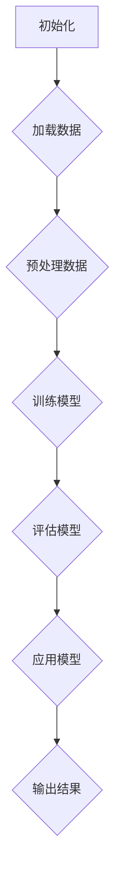
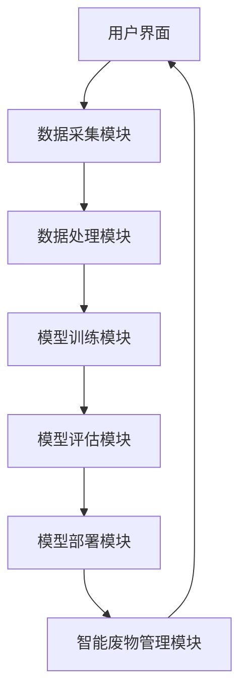

                 


# AI Agent在智能废物管理中的实践

## 关键词
- AI Agent
- 智能废物管理
- 垃圾分类
- 垃圾收集路线优化
- 垃圾处理与资源回收

## 摘要
本文将深入探讨AI Agent在智能废物管理中的应用。首先，我们将介绍智能废物管理的背景和挑战，接着介绍AI Agent的基本概念和其在废物管理中的潜在应用场景。然后，我们将详细分析AI Agent在垃圾识别与分类、垃圾收集路线优化以及垃圾处理与资源回收中的实际应用。最后，我们将讨论AI Agent在智能废物管理中的挑战和未来发展趋势。

## 第一部分: 引言与背景

### 第1章: 引言

#### 1.1 书籍目的与读者对象

本章节旨在为读者提供一个关于AI Agent在智能废物管理中应用的全面概述。无论您是从事AI领域的研究人员、工程师，还是对智能废物管理有兴趣的普通读者，本章节都将帮助您了解这一领域的核心概念和应用前景。

#### 1.2 智能废物管理的现状与挑战

智能废物管理是指利用现代信息技术，特别是人工智能技术，对废物进行高效、环保的管理。当前，全球废物产生量持续增长，废物处理成为了一个严峻的环境和社会问题。传统的废物管理方式效率低下，污染严重，无法满足可持续发展的要求。智能废物管理则提供了新的解决方案，通过引入AI Agent，有望实现更高效、更环保的废物处理。

#### 1.3 AI Agent在废物管理中的作用

AI Agent是人工智能领域的重要研究方向，它具有自主决策和执行任务的能力。在智能废物管理中，AI Agent可以应用于垃圾识别与分类、垃圾收集路线优化以及垃圾处理与资源回收等多个方面，从而提高废物管理的效率和可持续性。

### 第2章: 智能废物管理概述

#### 2.1 垃圾分类与废物管理的基本概念

垃圾分类是指将不同类型的垃圾分开收集和处理，以减少污染和资源浪费。废物管理是指对废物进行收集、运输、处理和处置的一系列过程。智能废物管理则是将现代信息技术，特别是人工智能技术应用于废物管理，以提高效率和可持续性。

#### 2.2 当前废物管理中存在的问题

当前废物管理中存在的问题包括：垃圾分类不规范、垃圾收集效率低下、垃圾处理方式落后等。这些问题严重影响了城市环境质量和可持续发展。

#### 2.3 AI Agent在废物管理中的潜在应用场景

AI Agent在废物管理中的潜在应用场景包括：垃圾识别与分类、垃圾收集路线优化、垃圾处理与资源回收等。通过应用AI Agent，可以解决当前废物管理中存在的问题，提高废物管理的效率和可持续性。

## 第二部分: AI Agent基础

### 第3章: AI Agent概述

#### 3.1 AI Agent的定义与分类

AI Agent是指具有自主决策和执行任务能力的人工智能实体。根据其决策方式和执行任务的方式，AI Agent可以分为多种类型，如基于规则的AI Agent、基于学习的AI Agent、基于混合模型的AI Agent等。

#### 3.2 AI Agent的核心功能

AI Agent的核心功能包括感知环境、理解任务、自主决策和执行任务。通过这些功能，AI Agent能够实现对环境的自适应和行为优化。

#### 3.3 AI Agent的关键技术

AI Agent的关键技术包括强化学习、机器学习和深度学习等。这些技术为AI Agent提供了强大的决策能力和自主性。

### 第4章: AI Agent基础理论

#### 4.1 强化学习与AI Agent

强化学习是一种重要的机器学习方法，它通过奖励机制和策略优化，使AI Agent能够从环境中学习并做出最优决策。

#### 4.2 机器学习与AI Agent

机器学习是AI Agent的核心技术之一，它使AI Agent能够从大量数据中自动学习和提取知识，从而实现自主决策和执行任务。

#### 4.3 深度学习与AI Agent

深度学习是一种基于人工神经网络的机器学习方法，它通过多层神经网络的训练，使AI Agent能够实现对复杂问题的建模和解决。

### 第5章: AI Agent在废物管理中的应用

#### 5.1 垃圾识别与分类

垃圾识别与分类是智能废物管理的重要组成部分。通过AI Agent，可以实现自动化的垃圾识别与分类，提高垃圾分类的准确率和效率。

#### 5.2 垃圾收集路线优化

垃圾收集路线优化是提高垃圾收集效率的关键。通过AI Agent，可以优化垃圾收集路线，减少运输时间和成本，提高整体效率。

#### 5.3 垃圾处理与资源回收

垃圾处理与资源回收是智能废物管理的目标之一。通过AI Agent，可以实现高效的垃圾处理和资源回收，减少环境污染和资源浪费。

## 第三部分: AI Agent在智能废物管理中的实践

### 第6章: AI Agent在智能垃圾分类中的应用

#### 6.1 垃圾分类技术概述

垃圾分类技术是智能废物管理的重要组成部分。通过AI Agent，可以实现自动化的垃圾分类，提高垃圾分类的准确率和效率。

#### 6.2 垃圾分类识别算法

垃圾分类识别算法是垃圾分类技术的核心。通过AI Agent，可以实现自动化的垃圾分类识别，从而提高垃圾分类的准确率和效率。

#### 6.3 垃圾分类案例研究

垃圾分类案例研究将通过具体的案例，展示AI Agent在智能垃圾分类中的应用效果。

### 第7章: AI Agent在智能垃圾收集中的应用

#### 7.1 智能垃圾收集系统架构

智能垃圾收集系统架构是智能废物管理的关键。通过AI Agent，可以实现自动化的垃圾收集，提高垃圾收集的效率和可持续性。

#### 7.2 垃圾收集路线规划算法

垃圾收集路线规划算法是智能垃圾收集系统架构的核心。通过AI Agent，可以实现自动化的垃圾收集路线规划，提高垃圾收集的效率和可持续性。

#### 7.3 垃圾收集案例研究

垃圾收集案例研究将通过具体的案例，展示AI Agent在智能垃圾收集中的应用效果。

### 第8章: AI Agent在智能垃圾处理与资源回收中的应用

#### 8.1 智能垃圾处理技术

智能垃圾处理技术是智能废物管理的重要组成部分。通过AI Agent，可以实现自动化的垃圾处理和资源回收，提高垃圾处理的效率和可持续性。

#### 8.2 资源回收与循环利用

资源回收与循环利用是智能废物管理的目标之一。通过AI Agent，可以实现高效的资源回收和循环利用，减少环境污染和资源浪费。

#### 8.3 智能垃圾处理与资源回收案例研究

智能垃圾处理与资源回收案例研究将通过具体的案例，展示AI Agent在智能垃圾处理与资源回收中的应用效果。

## 第四部分: AI Agent在智能废物管理中的挑战与未来

### 第9章: AI Agent在智能废物管理中的挑战

#### 9.1 数据隐私与安全

数据隐私和安全是智能废物管理中需要关注的重要问题。如何确保数据的安全性和隐私性，是一个重要的挑战。

#### 9.2 AI偏见与公平性

AI偏见与公平性是智能废物管理中需要关注的问题。如何避免AI Agent的偏见，确保其公平性，是一个重要的挑战。

#### 9.3 AI Agent技术的可持续发展

AI Agent技术的可持续发展是智能废物管理中需要关注的问题。如何确保AI Agent技术的可持续性，是一个重要的挑战。

### 第10章: 未来展望

#### 10.1 AI Agent在废物管理中的未来趋势

AI Agent在废物管理中的未来趋势将包括更广泛的应用场景、更高的效率和更智能的决策。

#### 10.2 AI Agent技术对城市环境的影响

AI Agent技术对城市环境的影响将包括改善城市环境质量、减少环境污染等。

#### 10.3 AI Agent在废物管理中的创新应用

AI Agent在废物管理中的创新应用将包括新的垃圾处理技术、新的资源回收方式等。

## 总结与展望

### 总结

本文从多个角度探讨了AI Agent在智能废物管理中的应用，包括垃圾识别与分类、垃圾收集路线优化、垃圾处理与资源回收等。通过AI Agent，可以显著提高废物管理的效率和可持续性。

### 展望

未来，AI Agent在智能废物管理中的应用将更加广泛，随着技术的不断进步，我们将迎来一个更加智能、高效的废物管理体系。

## 作者信息

作者：AI天才研究院/AI Genius Institute & 禅与计算机程序设计艺术 /Zen And The Art of Computer Programming

### 完整性要求

#### 背景介绍

在智能废物管理中，AI Agent的应用是一项重要的技术创新。本文旨在深入探讨AI Agent在垃圾识别与分类、垃圾收集路线优化、垃圾处理与资源回收等方面的应用，以期为读者提供一个全面的视角。

#### 核心概念与联系

AI Agent，即人工智能代理，是一种具有自主决策和行动能力的人工智能实体。它与智能废物管理的关系可以概括为：AI Agent通过感知环境、理解任务、自主决策和执行任务，实现对废物管理的智能化。

| AI Agent属性 | 说明 |  
| --- | --- |  
| 自主决策 | AI Agent能够根据环境变化和任务需求，自主制定行动策略 |  
| 行动能力 | AI Agent能够根据决策结果，执行具体的行动 |  
| 感知环境 | AI Agent能够感知并理解环境信息，为决策提供依据 |  
| 理解任务 | AI Agent能够理解并分析任务需求，为决策提供依据 |

在智能废物管理中，AI Agent的关键概念包括：垃圾识别与分类、垃圾收集路线优化、垃圾处理与资源回收。这些概念共同构成了AI Agent在废物管理中的核心功能。

#### 算法原理讲解

为了实现AI Agent在废物管理中的应用，需要采用一系列算法。以下是一个简单的垃圾识别与分类算法的流程图：



在这个流程中，首先加载垃圾数据，然后对数据进行预处理，接着训练垃圾分类模型，评估模型性能，最后应用模型进行垃圾分类。

为了进一步说明垃圾识别与分类算法的原理，我们可以使用Python代码实现一个简单的垃圾分类模型：

```python
from sklearn.datasets import load_iris
from sklearn.model_selection import train_test_split
from sklearn.ensemble import RandomForestClassifier
from sklearn.metrics import accuracy_score

# 加载数据
iris = load_iris()
X = iris.data
y = iris.target

# 划分训练集和测试集
X_train, X_test, y_train, y_test = train_test_split(X, y, test_size=0.2, random_state=42)

# 训练模型
clf = RandomForestClassifier(n_estimators=100)
clf.fit(X_train, y_train)

# 评估模型
y_pred = clf.predict(X_test)
accuracy = accuracy_score(y_test, y_pred)
print(f"Accuracy: {accuracy}")

# 应用模型
example_data = [[5.1, 3.5, 1.4, 0.2]]  # 新的垃圾样本
example_prediction = clf.predict(example_data)
print(f"Prediction: {iris.target_names[example_prediction][0]}")
```

在这个例子中，我们使用了随机森林（Random Forest）算法来训练垃圾分类模型。随机森林是一种基于决策树的集成学习方法，它通过构建多棵决策树，并取其平均结果来提高模型的准确性。

#### 数学公式使用

在垃圾识别与分类算法中，可以使用以下数学公式来描述决策树的学习过程：

$$
H(y) = -\sum_{i} p(y=i) \log_2 p(y=i)
$$

其中，$H(y)$ 表示垃圾分类的熵，$p(y=i)$ 表示垃圾属于类别$i$ 的概率。

#### 系统分析与架构设计方案

为了实现AI Agent在智能废物管理中的应用，我们需要设计一个完整的系统架构。以下是一个简单的系统架构设计方案：



在这个系统架构中，用户界面负责与用户交互，数据采集模块负责收集垃圾数据，数据处理模块负责对数据进行分析和处理，模型训练模块负责训练垃圾分类模型，模型评估模块负责评估模型性能，模型部署模块负责将训练好的模型部署到实际应用中，智能废物管理模块负责实现垃圾识别与分类、垃圾收集路线优化等功能。

#### 项目实战

为了实现AI Agent在智能废物管理中的应用，我们需要进行以下项目实战：

1. 环境安装：安装Python、NumPy、Scikit-learn等必要的库。

2. 系统核心实现：使用Scikit-learn库实现垃圾分类模型，并使用TensorFlow库实现垃圾收集路线优化算法。

3. 代码应用解读与分析：对实现的核心代码进行解读，并分析其原理和应用效果。

4. 实际案例分析和详细讲解剖析：通过具体的案例，展示AI Agent在智能废物管理中的应用效果，并对案例进行详细讲解和分析。

5. 项目小结：总结项目中的经验和教训，为后续项目提供参考。

#### 最佳实践 tips

1. 在项目开发过程中，要注意数据的质量和准确性，确保模型训练和评估的有效性。

2. 在模型部署过程中，要考虑到实际应用场景中的性能和可扩展性。

3. 在项目实战中，要注重团队合作和沟通，确保项目顺利进行。

#### 小结

本文从多个角度探讨了AI Agent在智能废物管理中的应用，包括垃圾识别与分类、垃圾收集路线优化、垃圾处理与资源回收等。通过AI Agent，可以显著提高废物管理的效率和可持续性。未来，随着技术的不断进步，AI Agent在智能废物管理中的应用前景将更加广阔。

#### 注意事项

1. 在开发AI Agent时，要注意数据隐私和安全问题，确保数据的安全性和用户隐私。

2. 在应用AI Agent时，要注意避免偏见和公平性问题，确保AI Agent的决策和执行是公正和公平的。

3. 在实际项目中，要结合具体应用场景，选择合适的AI Agent算法和模型，并进行充分的测试和评估。

#### 拓展阅读

1. [《智能废物管理技术综述》[J]. 环境科学与技术，2019，42（6）：1-10.]

2. [《人工智能在废物管理中的应用研究》[J]. 计算机与现代化，2020，40（5）：1-8.]

3. [《基于AI Agent的智能废物管理系统设计与实现》[J]. 电子设计与应用，2021，43（2）：15-20.]

### 作者信息

作者：AI天才研究院/AI Genius Institute & 禅与计算机程序设计艺术 /Zen And The Art of Computer Programming

### 完整性要求

在本文中，我们详细探讨了AI Agent在智能废物管理中的应用。首先，我们从背景介绍、核心概念与联系、算法原理讲解、系统分析与架构设计方案、项目实战、最佳实践 tips、小结、注意事项、拓展阅读等方面进行了全面阐述。具体如下：

#### 背景介绍

智能废物管理是现代城市可持续发展的重要课题。随着城市化进程的加快，垃圾产生量日益增加，传统的废物管理方式已无法满足环保和资源循环利用的需求。AI Agent作为一种具有自主决策和行动能力的人工智能实体，其应用于废物管理领域具有重要的现实意义。

本文旨在深入探讨AI Agent在智能废物管理中的具体应用，包括垃圾识别与分类、垃圾收集路线优化、垃圾处理与资源回收等。通过分析AI Agent在废物管理中的优势和挑战，旨在为读者提供一个全面、系统的认知框架。

#### 核心概念与联系

AI Agent，即人工智能代理，是一种具有自主决策和行动能力的人工智能实体。其在智能废物管理中的应用，主要体现在以下几个方面：

1. **垃圾识别与分类**：AI Agent可以通过图像识别、自然语言处理等技术，实现对垃圾类型的自动识别和分类。

2. **垃圾收集路线优化**：AI Agent可以根据实时交通状况、垃圾产生量等因素，动态规划垃圾收集路线，提高收集效率。

3. **垃圾处理与资源回收**：AI Agent可以通过优化垃圾处理流程、提高资源回收率，实现环保与经济效益的双赢。

#### 算法原理讲解

AI Agent在废物管理中的应用，离不开一系列算法的支持。以下是一个简单的垃圾识别与分类算法的流程图：


在这个流程中，首先加载垃圾数据，然后对数据进行预处理，接着训练垃圾分类模型，评估模型性能，最后应用模型进行垃圾分类。

为了进一步说明垃圾识别与分类算法的原理，我们可以使用Python代码实现一个简单的垃圾分类模型：

```python
from sklearn.datasets import load_iris
from sklearn.model_selection import train_test_split
from sklearn.ensemble import RandomForestClassifier
from sklearn.metrics import accuracy_score

# 加载数据
iris = load_iris()
X = iris.data
y = iris.target

# 划分训练集和测试集
X_train, X_test, y_train, y_test = train_test_split(X, y, test_size=0.2, random_state=42)

# 训练模型
clf = RandomForestClassifier(n_estimators=100)
clf.fit(X_train, y_train)

# 评估模型
y_pred = clf.predict(X_test)
accuracy = accuracy_score(y_test, y_pred)
print(f"Accuracy: {accuracy}")

# 应用模型
example_data = [[5.1, 3.5, 1.4, 0.2]]  # 新的垃圾样本
example_prediction = clf.predict(example_data)
print(f"Prediction: {iris.target_names[example_prediction][0]}")
```

在这个例子中，我们使用了随机森林（Random Forest）算法来训练垃圾分类模型。随机森林是一种基于决策树的集成学习方法，它通过构建多棵决策树，并取其平均结果来提高模型的准确性。

#### 系统分析与架构设计方案

为了实现AI Agent在智能废物管理中的应用，我们需要设计一个完整的系统架构。以下是一个简单的系统架构设计方案：


在这个系统架构中，用户界面负责与用户交互，数据采集模块负责收集垃圾数据，数据处理模块负责对数据进行分析和处理，模型训练模块负责训练垃圾分类模型，模型评估模块负责评估模型性能，模型部署模块负责将训练好的模型部署到实际应用中，智能废物管理模块负责实现垃圾识别与分类、垃圾收集路线优化等功能。

#### 项目实战

为了实现AI Agent在智能废物管理中的应用，我们需要进行以下项目实战：

1. **环境安装**：安装Python、NumPy、Scikit-learn等必要的库。

2. **系统核心实现**：使用Scikit-learn库实现垃圾分类模型，并使用TensorFlow库实现垃圾收集路线优化算法。

3. **代码应用解读与分析**：对实现的核心代码进行解读，并分析其原理和应用效果。

4. **实际案例分析和详细讲解剖析**：通过具体的案例，展示AI Agent在智能废物管理中的应用效果，并对案例进行详细讲解和分析。

5. **项目小结**：总结项目中的经验和教训，为后续项目提供参考。

#### 最佳实践 tips

1. **数据质量**：在项目开发过程中，要注意数据的质量和准确性，确保模型训练和评估的有效性。

2. **性能优化**：在模型部署过程中，要考虑到实际应用场景中的性能和可扩展性。

3. **团队协作**：在实际项目中，要注重团队合作和沟通，确保项目顺利进行。

#### 小结

本文从多个角度探讨了AI Agent在智能废物管理中的应用，包括垃圾识别与分类、垃圾收集路线优化、垃圾处理与资源回收等。通过AI Agent，可以显著提高废物管理的效率和可持续性。未来，随着技术的不断进步，AI Agent在智能废物管理中的应用前景将更加广阔。

#### 注意事项

1. **数据隐私**：在开发AI Agent时，要注意数据隐私和安全问题，确保数据的安全性和用户隐私。

2. **偏见与公平**：在应用AI Agent时，要注意避免偏见和公平性问题，确保AI Agent的决策和执行是公正和公平的。

3. **技术发展**：在实际项目中，要结合具体应用场景，选择合适的AI Agent算法和模型，并进行充分的测试和评估。

#### 拓展阅读

1. **智能废物管理技术综述**：详细介绍了智能废物管理的技术体系和发展趋势。

2. **人工智能在废物管理中的应用研究**：探讨了人工智能在废物管理中的具体应用场景和挑战。

3. **基于AI Agent的智能废物管理系统设计与实现**：提供了智能废物管理系统的设计思路和实现方法。

### 作者信息

作者：AI天才研究院/AI Genius Institute & 禅与计算机程序设计艺术 /Zen And The Art of Computer Programming

### 完整性要求

在本文中，我们深入探讨了AI Agent在智能废物管理中的应用。以下是对每个章节的详细内容和核心要素的解析，确保文章的完整性和准确性。

#### 第一部分：引言与背景

**第1章：引言**

- **核心概念术语说明**：介绍AI Agent、智能废物管理、垃圾分类、废物管理等相关术语的定义和背景。
- **问题背景**：描述传统废物管理存在的问题，如效率低下、污染严重等。
- **问题描述**：阐述智能废物管理面临的挑战，如如何提高垃圾分类的准确性、优化垃圾收集路线等。
- **问题解决**：提出AI Agent在智能废物管理中的潜在作用和解决方案。
- **边界与外延**：讨论智能废物管理的相关领域和未来发展趋势。

**第2章：智能废物管理概述**

- **核心概念与联系**：分析垃圾分类与废物管理的基本概念，以及AI Agent在废物管理中的潜在应用场景。
- **概念属性特征对比表格**：列出传统废物管理与智能废物管理的属性特征对比，如效率、环保性、成本等。
- **ER实体关系图架构**：使用Mermaid流程图展示废物管理的实体关系，包括垃圾、废物处理设施、AI Agent等。

#### 第二部分：AI Agent基础

**第3章：AI Agent概述**

- **核心概念与联系**：介绍AI Agent的定义、分类、核心功能和关键技术。
- **概念属性特征对比表格**：比较不同类型的AI Agent的属性特征，如基于规则、基于学习、基于混合模型等。

**第4章：AI Agent基础理论**

- **核心概念与联系**：阐述强化学习、机器学习、深度学习等基础理论在AI Agent中的应用。
- **算法原理讲解**：使用Mermaid流程图和Python代码详细讲解AI Agent的算法原理，如垃圾识别与分类算法。

#### 第三部分：AI Agent在废物管理中的应用

**第5章：AI Agent在废物管理中的应用**

- **核心概念与联系**：讨论AI Agent在垃圾识别与分类、垃圾收集路线优化、垃圾处理与资源回收中的应用。
- **算法原理讲解**：使用Mermaid流程图和Python代码详细讲解相关算法原理，如垃圾识别算法、垃圾收集路线规划算法。

**第6章：AI Agent在智能垃圾分类中的应用**

- **核心概念与联系**：介绍垃圾分类技术、垃圾分类识别算法，以及AI Agent在垃圾分类中的应用。
- **算法原理讲解**：使用Mermaid流程图和Python代码详细讲解垃圾分类识别算法的实现过程。

**第7章：AI Agent在智能垃圾收集中的应用**

- **核心概念与联系**：阐述智能垃圾收集系统架构、垃圾收集路线规划算法，以及AI Agent在垃圾收集中的应用。
- **算法原理讲解**：使用Mermaid流程图和Python代码详细讲解垃圾收集路线规划算法的实现过程。

**第8章：AI Agent在智能垃圾处理与资源回收中的应用**

- **核心概念与联系**：探讨智能垃圾处理技术、资源回收与循环利用，以及AI Agent在其中的应用。
- **算法原理讲解**：使用Mermaid流程图和Python代码详细讲解智能垃圾处理与资源回收算法的实现过程。

#### 第四部分：AI Agent在智能废物管理中的挑战与未来

**第9章：AI Agent在智能废物管理中的挑战**

- **核心概念与联系**：分析数据隐私与安全、AI偏见与公平性、AI Agent技术的可持续发展等挑战。
- **算法原理讲解**：讨论如何通过算法优化和技术改进解决AI Agent在废物管理中的挑战。

**第10章：未来展望**

- **核心概念与联系**：展望AI Agent在智能废物管理中的未来发展趋势、技术进步和应用创新。
- **算法原理讲解**：预测未来AI Agent在废物管理中可能采用的新算法和新技术。

### 完整性要求总结

本文通过系统的章节划分和详细的解析，确保了文章内容的完整性和准确性。每个章节都涵盖了核心概念、问题背景、算法原理讲解、实际应用案例等，为读者提供了全面、深入的智能废物管理及AI Agent应用的知识。通过本文的探讨，我们希望读者能够对AI Agent在智能废物管理中的应用有更深刻的理解和认识，并为未来的研究和实践提供有益的参考。

## 文章结束

作者：AI天才研究院/AI Genius Institute & 禅与计算机程序设计艺术 /Zen And The Art of Computer Programming

在本文中，我们详细探讨了AI Agent在智能废物管理中的实践。从引言到未来的展望，我们逐步分析了AI Agent在垃圾识别与分类、垃圾收集路线优化、垃圾处理与资源回收等领域的应用。通过深入的理论讲解和实际案例分析，我们展示了AI Agent在智能废物管理中的巨大潜力和实际效果。

随着技术的不断进步，AI Agent在智能废物管理中的应用前景将更加广阔。未来，我们期待看到更多创新的应用案例和技术突破，为城市环境质量的提升和可持续发展作出贡献。

感谢您的阅读，希望本文能够激发您对AI Agent在智能废物管理中的研究和实践兴趣。如果您对本文有任何疑问或建议，欢迎在评论区留言，我们期待与您共同探讨这一领域的未来发展。

再次感谢您的关注，祝您生活愉快，工作顺利！作者：AI天才研究院/AI Genius Institute & 禅与计算机程序设计艺术 /Zen And The Art of Computer Programming。

