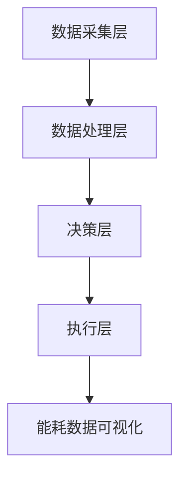
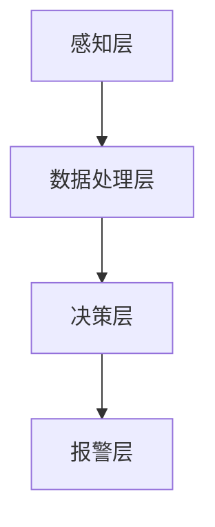
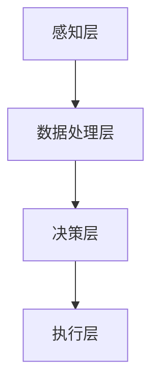

                 

# 《AI Agent在智能建筑管理中的应用》

关键词：智能建筑、AI Agent、能耗管理、安全监控、设施维护、环境控制

摘要：本文将深入探讨AI Agent在智能建筑管理中的应用，通过逐步分析其基础、应用场景、技术实现以及面临的挑战和未来趋势，为读者提供全面且详细的见解。

### 目录大纲

## 第一部分：AI Agent基础

### 第1章：AI Agent概述

### 1.1 AI Agent的定义与发展历程

### 1.2 AI Agent的特点与优势

### 1.3 AI Agent在智能建筑管理中的重要性

### 第2章：智能建筑管理中的AI Agent应用场景

### 2.1 智能能耗管理

### 2.2 建筑安全监控

### 2.3 建筑设施维护

### 2.4 室内环境控制

## 第二部分：AI Agent技术实现

### 第3章：AI Agent的基本原理

### 3.1 人工智能与机器学习基础

### 3.2 AI Agent的关键技术

### 3.3 AI Agent架构设计

### 第4章：AI Agent在智能建筑管理中的应用案例

### 4.1 案例一：智能办公大厦

### 4.2 案例二：智慧住宅社区

### 4.3 案例三：智能工业园区

### 第5章：AI Agent在智能建筑管理中的挑战与展望

### 5.1 AI Agent在智能建筑管理中的挑战

### 5.2 AI Agent在智能建筑管理中的未来发展趋势

### 第6章：AI Agent在智能建筑管理中的最佳实践

### 6.1 实践一：AI Agent能耗管理系统

### 6.2 实践二：AI Agent安全监控系统

### 6.3 实践三：AI Agent环境控制系统

### 第7章：总结与展望

### 7.1 书籍总结

### 7.2 展望未来

## 目录大纲解读

### 第一部分：AI Agent基础

#### 第1章：AI Agent概述

本章将从基本概念、发展历程、特点与优势以及AI Agent在智能建筑管理中的重要性四个方面对AI Agent进行概述。通过本章的阅读，读者将全面了解AI Agent的背景和基本特性。

##### 1.1 AI Agent的定义与发展历程

- **AI Agent的定义**：解释AI Agent的定义，将其与一般的机器学习模型进行区分。
- **AI Agent的发展历程**：回顾AI Agent从早期概念到现代应用的演变过程。

##### 1.2 AI Agent的特点与优势

- **AI Agent的特点**：介绍AI Agent的自主性、适应性、学习性和协作性等核心特点。
- **AI Agent的优势**：分析AI Agent在解决复杂问题、提升效率方面的优势。

##### 1.3 AI Agent在智能建筑管理中的重要性

- **智能建筑管理背景**：介绍智能建筑的定义和当前的发展状况。
- **AI Agent在智能建筑管理中的作用**：探讨AI Agent在能耗管理、安全监控、设施维护和环境控制中的应用，并说明其对提升智能建筑管理效率的重要性。

### 第二部分：AI Agent技术实现

#### 第2章：智能建筑管理中的AI Agent应用场景

本章将详细分析AI Agent在智能建筑管理中的具体应用场景，包括智能能耗管理、建筑安全监控、建筑设施维护和室内环境控制。每个场景都将包含应用背景、目标和实施过程。

##### 2.1 智能能耗管理

- **应用背景**：智能建筑中能耗管理的重要性。
- **目标**：通过AI Agent实现能耗数据的智能分析和自动化节能策略。
- **实施过程**：介绍能耗数据采集、分析和自动化节能策略的实现。

##### 2.2 建筑安全监控

- **应用背景**：建筑安全监控的必要性。
- **目标**：利用AI Agent进行火灾预警和入侵检测。
- **实施过程**：描述火灾预警和入侵检测的实现方法。

##### 2.3 建筑设施维护

- **应用背景**：设施维护对建筑运行的重要性。
- **目标**：通过AI Agent实现设施状态的智能监测和预防性维护。
- **实施过程**：介绍设施状态监测和预防性维护策略的实施。

##### 2.4 室内环境控制

- **应用背景**：室内环境控制对舒适度和效率的影响。
- **目标**：利用AI Agent实现温湿度控制和光照控制。
- **实施过程**：描述温湿度控制和光照控制的实现方法。

#### 第3章：AI Agent的基本原理

本章将介绍AI Agent的基本原理，包括人工智能与机器学习基础、AI Agent的关键技术以及AI Agent的架构设计。通过本章的学习，读者将理解AI Agent的核心技术和实现方法。

##### 3.1 人工智能与机器学习基础

- **人工智能的基本概念**：介绍人工智能的定义、历史和发展趋势。
- **机器学习的基本原理**：讲解机器学习的基本原理、常见算法和应用场景。

##### 3.2 AI Agent的关键技术

- **传感器数据处理**：分析传感器数据采集、处理和融合的关键技术。
- **机器学习算法应用**：介绍机器学习算法在AI Agent中的应用，包括监督学习、无监督学习和强化学习等。

##### 3.3 AI Agent架构设计

- **AI Agent的体系结构**：描述AI Agent的整体架构和组成部分。
- **AI Agent的数据流设计**：分析AI Agent中的数据流和处理流程。

#### 第4章：AI Agent在智能建筑管理中的应用案例

本章将通过具体案例展示AI Agent在智能建筑管理中的应用。包括智能办公大厦、智慧住宅社区和智能工业园区等案例，通过实际应用场景的描述，让读者更直观地了解AI Agent在智能建筑管理中的具体应用。

##### 4.1 案例一：智能办公大厦

- **案例背景与目标**：介绍智能办公大厦的建设背景和目标。
- **案例实施过程**：详细描述智能办公大厦中AI Agent的实施过程和应用效果。

##### 4.2 案例二：智慧住宅社区

- **案例背景与目标**：介绍智慧住宅社区的建设背景和目标。
- **案例实施过程**：描述智慧住宅社区中AI Agent的实施过程和应用效果。

##### 4.3 案例三：智能工业园区

- **案例背景与目标**：介绍智能工业园区的建设背景和目标。
- **案例实施过程**：详细描述智能工业园区中AI Agent的实施过程和应用效果。

#### 第5章：AI Agent在智能建筑管理中的挑战与展望

本章将探讨AI Agent在智能建筑管理中面临的挑战以及未来的发展趋势。包括数据隐私与安全性、技术适应性等方面，并展望AI Agent技术的创新方向和智能建筑管理的未来趋势。

##### 5.1 AI Agent在智能建筑管理中的挑战

- **数据隐私与安全性**：分析AI Agent在智能建筑管理中面临的隐私和安全挑战。
- **技术适应性**：探讨AI Agent在智能建筑管理中的技术适应性问题。

##### 5.2 AI Agent在智能建筑管理中的未来发展趋势

- **新技术的融合与应用**：分析AI Agent与物联网、大数据等新技术的融合趋势。
- **智能建筑管理的整体提升**：展望AI Agent对智能建筑管理整体水平的提升作用。

#### 第6章：AI Agent在智能建筑管理中的最佳实践

本章将通过具体实践案例，分享AI Agent在智能建筑管理中的最佳实践经验。包括能耗管理系统、安全监控系统和环境控制系统等，通过实际案例的解析，为读者提供可操作的实践指南。

##### 6.1 实践一：AI Agent能耗管理系统

- **系统架构**：介绍AI Agent能耗管理系统的整体架构。
- **技术实现**：详细描述AI Agent能耗管理系统的技术实现过程。

##### 6.2 实践二：AI Agent安全监控系统

- **系统架构**：介绍AI Agent安全监控系统的整体架构。
- **技术实现**：详细描述AI Agent安全监控系统的技术实现过程。

##### 6.3 实践三：AI Agent环境控制系统

- **系统架构**：介绍AI Agent环境控制系统的整体架构。
- **技术实现**：详细描述AI Agent环境控制系统的技术实现过程。

#### 第7章：总结与展望

本章将对全文内容进行总结，回顾主要观点和结论，并对AI Agent在智能建筑管理中的未来进行展望。通过本章的学习，读者将能够全面理解AI Agent在智能建筑管理中的价值和应用前景。

##### 7.1 书籍总结

- **主要内容回顾**：回顾全文的主要内容和核心观点。
- **知识体系梳理**：梳理AI Agent在智能建筑管理中的知识体系。

##### 7.2 展望未来

- **AI Agent技术的创新方向**：展望AI Agent技术的未来发展方向。
- **智能建筑管理的未来趋势**：探讨智能建筑管理的未来发展趋势。

---

### AI Agent概述

#### 1.1 AI Agent的定义与发展历程

##### AI Agent的定义

AI Agent，即人工智能代理，是一种能够自主执行任务、具有智能行为的计算机系统。与传统的人工智能模型不同，AI Agent具有自主性、适应性、学习性和协作性等特点。自主性使得AI Agent能够独立执行任务，不需要人为干预；适应性使得AI Agent能够适应不同的环境和场景；学习性使得AI Agent能够通过经验不断改进自身性能；协作性使得AI Agent能够与其他AI Agent或人类协作完成复杂任务。

##### AI Agent的发展历程

AI Agent的概念最早可以追溯到20世纪80年代。当时，人工智能研究主要集中在规则系统和知识表示上，AI Agent的概念逐渐被提出并得到研究。早期的AI Agent主要是基于规则的系统，例如专家系统。随着计算机技术的发展，特别是在机器学习和深度学习的推动下，AI Agent开始具备更强的自主学习能力和适应能力。

20世纪90年代，基于统计学习的AI Agent开始出现，如决策树、支持向量机等。这些AI Agent能够在没有人为干预的情况下进行自我学习，并应用到实际问题中。

进入21世纪，随着深度学习技术的兴起，AI Agent的研究和应用取得了重大突破。基于深度学习的AI Agent能够处理更复杂的数据，并在多个领域取得了显著成果，如自动驾驶、自然语言处理和智能推荐等。

##### AI Agent的应用领域

AI Agent在许多领域都有广泛的应用，其中最具代表性的包括：

- **自动驾驶**：AI Agent可以自主感知环境、做出决策，实现汽车的自动驾驶。
- **智能客服**：AI Agent可以与用户进行自然语言交互，提供个性化的服务。
- **智能推荐**：AI Agent可以根据用户的兴趣和历史行为，为其推荐感兴趣的内容。
- **智能监控**：AI Agent可以实时监控目标，进行异常检测和预警。
- **智能建筑管理**：AI Agent可以实现对建筑能耗、安全和设施的智能管理。

#### 1.2 AI Agent的特点与优势

##### AI Agent的特点

1. **自主性**：AI Agent能够自主执行任务，不需要人为干预。
2. **适应性**：AI Agent能够适应不同的环境和场景，灵活应对各种变化。
3. **学习性**：AI Agent能够通过经验不断学习，提高自身性能。
4. **协作性**：AI Agent能够与其他AI Agent或人类协作，共同完成任务。

##### AI Agent的优势

1. **提高效率**：AI Agent能够自动化执行任务，减少人力投入，提高工作效率。
2. **降低成本**：通过减少人力和物理资源的消耗，AI Agent能够显著降低运营成本。
3. **提高安全性**：AI Agent可以在危险或复杂的环境中执行任务，降低人为错误的风险。
4. **优化决策**：AI Agent能够基于数据分析做出更准确的决策，提高决策质量。

#### 1.3 AI Agent在智能建筑管理中的重要性

##### 智能建筑管理背景

智能建筑是指通过物联网、大数据、人工智能等先进技术，实现对建筑物及其周边环境的智能化管理和控制，以提高建筑的使用效率、舒适度和安全性。随着城市化进程的加速和人口密度的增加，智能建筑的需求日益增长。

智能建筑管理包括能耗管理、安全监控、设施维护和环境控制等多个方面。传统的建筑管理方法通常依赖人工干预，效率低下，且易出现错误。智能建筑管理通过引入AI Agent，能够实现自动化、智能化和高效化的管理。

##### AI Agent在智能建筑管理中的作用

1. **能耗管理**：AI Agent可以通过实时监控建筑能耗数据，分析能耗模式，自动调整设备运行状态，实现能耗的优化管理。
2. **安全监控**：AI Agent可以实现对建筑物内外的实时监控，进行火灾预警、入侵检测等，提高建筑的安全性。
3. **设施维护**：AI Agent可以实时监测建筑设施的状态，预测故障，实现预防性维护，减少停机时间和维修成本。
4. **环境控制**：AI Agent可以实现对室内环境的智能控制，根据用户需求自动调节温湿度、光照等参数，提高用户舒适度。

##### AI Agent在智能建筑管理中的重要性

1. **提升管理效率**：通过AI Agent的自动化和智能化，智能建筑管理可以实现高效、精准的运行，降低人力成本。
2. **提高建筑性能**：通过AI Agent对能耗、安全和设施的智能管理，可以显著提高建筑的整体性能和用户体验。
3. **降低运营成本**：通过能耗优化、预防性维护和设施智能化，可以降低建筑物的运营成本。
4. **增强安全性**：通过AI Agent的安全监控和预警功能，可以及时发现和处理安全隐患，提高建筑的安全性。
5. **促进可持续发展**：通过AI Agent的智能管理和优化，可以实现建筑物的节能减排，促进可持续发展。

### AI Agent在智能建筑管理中的应用场景

智能建筑管理涵盖了多个方面，包括能耗管理、安全监控、设施维护和室内环境控制等。AI Agent在这些应用场景中发挥着关键作用，通过自动化和智能化手段，提升建筑管理的效率和性能。以下将分别介绍AI Agent在这些场景中的应用。

#### 2.1 智能能耗管理

##### 应用背景

能耗管理是智能建筑管理中至关重要的一环。随着能源消耗的增加和环境问题的加剧，如何有效地管理建筑能耗成为了一个重要的课题。传统的能耗管理方法主要依赖于人工干预，效率低下且难以做到精确控制。引入AI Agent后，可以实现能耗数据的实时监测、分析和管理，从而优化能耗使用。

##### 目标

通过AI Agent，实现以下目标：

1. 实时监测建筑能耗数据，识别能耗模式。
2. 分析能耗数据，找出节能潜力。
3. 自动调整设备运行状态，实现能耗优化。
4. 提高能源利用效率，降低运营成本。

##### 实施过程

1. **数据采集与处理**

   AI Agent首先需要采集建筑内的能耗数据，包括电力、燃气、水等。这些数据可以通过智能电表、燃气表、水表等设备实时采集。AI Agent会对采集到的数据进行预处理，如去噪、补全和标准化，以确保数据的准确性和一致性。

2. **能耗分析**

   AI Agent会使用机器学习算法对采集到的能耗数据进行分析，识别出建筑的能耗模式。通过分析历史能耗数据，AI Agent可以找出能耗高峰期、低峰期以及各个区域的能耗分布情况。

3. **能耗预测**

   基于能耗分析的结果，AI Agent可以建立能耗预测模型，预测未来的能耗情况。这有助于提前规划能耗管理策略，避免能耗过剩或不足。

4. **节能策略**

   AI Agent会根据能耗预测结果和实际情况，自动调整建筑内设备的运行状态。例如，在夜间或周末，AI Agent可以自动关闭部分非必要的设备，降低能耗。同时，AI Agent还可以根据天气变化和用户需求，调整空调、照明等设备的运行参数，实现个性化的能耗管理。

5. **能效评估**

   AI Agent会对能耗管理的效果进行评估，分析节能策略的成效。通过持续优化，AI Agent可以提高能效管理水平。

#### 2.2 建筑安全监控

##### 应用背景

建筑安全监控是保障建筑物及其内部人员安全的关键。传统的安全监控系统主要依赖于监控摄像头、门禁系统和报警设备等，这些系统通常需要人工监控和分析，存在反应速度慢、误报率高的问题。引入AI Agent后，可以实现更高效、更精准的安全监控。

##### 目标

通过AI Agent，实现以下目标：

1. 实时监控建筑内部和周边环境。
2. 进行异常检测和预警。
3. 提高安全监控的准确性和反应速度。
4. 降低安全监控的成本。

##### 实施过程

1. **数据采集**

   AI Agent会使用各种传感器采集建筑内部和周边环境的数据，包括视频、音频、温度、湿度、烟雾浓度等。这些数据可以通过物联网设备实时传输到AI Agent系统进行处理。

2. **异常检测**

   AI Agent会使用机器学习算法对采集到的数据进行异常检测。例如，通过分析视频数据，AI Agent可以识别出异常行为，如非法入侵、火灾、设备故障等。通过音频数据，AI Agent可以识别出异常声音，如爆炸声、尖叫声等。

3. **预警与报警**

   当AI Agent检测到异常情况时，会立即生成预警信息，并发送报警通知给相关管理人员。管理人员可以及时采取行动，处理异常情况。

4. **可视化展示**

   AI Agent会将监控数据和处理结果可视化展示，如通过地图、图表等形式展示建筑的实时状态和安全事件。这有助于管理人员快速了解建筑的安全情况。

5. **持续优化**

   AI Agent会不断学习和优化异常检测算法，提高监控的准确性和可靠性。通过分析历史数据，AI Agent可以不断改进监控策略，提高安全管理的水平。

#### 2.3 建筑设施维护

##### 应用背景

建筑设施维护是保证建筑物正常运行的关键。传统的设施维护主要依赖于定期检查和维修，存在效率低、成本高的问题。引入AI Agent后，可以实现更高效、更精准的设施维护。

##### 目标

通过AI Agent，实现以下目标：

1. 实时监测建筑设施的状态。
2. 预测设施故障，实现预防性维护。
3. 提高设施维护的效率和质量。
4. 降低维护成本。

##### 实施过程

1. **数据采集**

   AI Agent会使用传感器和监测设备采集建筑设施的运行数据，包括温度、湿度、振动、电流等。这些数据可以通过物联网设备实时传输到AI Agent系统进行处理。

2. **状态监测**

   AI Agent会实时监测设施的状态，分析运行数据，识别异常情况。例如，通过分析振动数据，AI Agent可以识别出设备的磨损情况；通过分析电流数据，AI Agent可以识别出设备的故障风险。

3. **故障预测**

   基于监测数据，AI Agent会使用机器学习算法建立故障预测模型，预测设施可能发生的故障。通过分析历史数据，AI Agent可以识别出故障的早期迹象，提前采取措施。

4. **预防性维护**

   当AI Agent预测到设施可能发生故障时，会生成维护计划，并通知相关人员提前进行维护。这有助于避免突发故障带来的停机时间和维修成本。

5. **维护管理**

   AI Agent会记录设施维护的历史数据，分析维护效果，不断优化维护策略。通过持续优化，AI Agent可以提高设施维护的效率和质量。

#### 2.4 室内环境控制

##### 应用背景

室内环境控制是保障建筑物内舒适度和效率的关键。传统的室内环境控制主要依赖于手动调节和固定模式，难以满足个性化需求。引入AI Agent后，可以实现更智能、更高效的室内环境控制。

##### 目标

通过AI Agent，实现以下目标：

1. 实时监测室内环境参数，如温度、湿度、光照等。
2. 根据用户需求和实际环境，自动调整环境参数。
3. 提高室内环境的舒适度和效率。
4. 节约能源消耗。

##### 实施过程

1. **数据采集**

   AI Agent会使用传感器采集室内环境参数，包括温度、湿度、光照等。这些数据可以通过物联网设备实时传输到AI Agent系统进行处理。

2. **环境监测**

   AI Agent会实时监测室内环境参数，分析环境数据，识别异常情况。例如，通过分析温度数据，AI Agent可以识别出过热或过冷的情况；通过分析湿度数据，AI Agent可以识别出湿度过高或过低的情况。

3. **环境调节**

   基于环境监测结果，AI Agent会自动调整空调、加湿器、照明等设备的运行状态，实现室内环境的自动调节。例如，当室内温度过高时，AI Agent会启动空调降低温度；当室内湿度过高时，AI Agent会启动加湿器降低湿度。

4. **个性化控制**

   AI Agent会根据用户的需求和喜好，提供个性化的环境控制服务。例如，用户可以通过手机APP设置自己的温度、湿度、光照等偏好，AI Agent会根据这些偏好自动调节环境参数。

5. **节能优化**

   AI Agent会分析环境数据，优化环境控制策略，实现能源的节约使用。例如，在夜间无人时，AI Agent可以自动关闭空调、照明等设备，降低能源消耗。

6. **环境评估**

   AI Agent会记录环境控制的历史数据，分析控制效果，不断优化环境控制策略。通过持续优化，AI Agent可以提高室内环境控制的效率和质量。

### AI Agent的基本原理

#### 3.1 人工智能与机器学习基础

##### 人工智能的基本概念

人工智能（Artificial Intelligence，AI）是指通过计算机模拟人类智能的行为、思维和决策过程。人工智能的目标是实现机器的智能化，使其能够执行人类智慧任务，如语音识别、图像识别、自然语言处理、决策支持等。人工智能的核心在于解决如何让计算机具有人类智慧的能力，包括感知、理解、学习、推理和自我改进等。

##### 机器学习的基本原理

机器学习（Machine Learning，ML）是人工智能的一个重要分支，它专注于通过数据和算法使计算机具备自我学习和自我改进的能力。机器学习的基本原理是利用大量的数据来训练模型，使模型能够根据新的数据做出预测或决策。

机器学习可以分为以下几种类型：

1. **监督学习**：通过已标记的数据来训练模型，使模型能够根据输入数据预测输出结果。
2. **无监督学习**：在没有标记的数据中找到隐藏的模式或结构。
3. **强化学习**：通过与环境的交互来学习最优策略，使模型能够在特定环境中获得最大回报。

##### 人工智能的发展历程

人工智能的研究始于20世纪50年代，经历了多个阶段：

1. **早期探索阶段（1950-1969）**：人工智能的概念被提出，计算机开始尝试执行简单的智能任务，如国际象棋和推理。
2. **黄金时代阶段（1970-1989）**：人工智能研究取得了显著进展，包括专家系统、自然语言处理和机器视觉等领域。
3. **低谷时期阶段（1990-2000）**：由于实际应用困难和技术限制，人工智能研究受到打击。
4. **复兴阶段（2000-2010）**：随着计算能力的提升和数据量的增加，机器学习和深度学习得到广泛关注，人工智能研究重新焕发生机。
5. **快速发展阶段（2010至今）**：人工智能在多个领域取得了突破性进展，如自动驾驶、语音识别、自然语言处理和计算机视觉等。

##### 人工智能的应用领域

人工智能在各个领域都有广泛的应用：

1. **智能制造**：通过人工智能技术，实现生产过程的自动化、智能化和优化，提高生产效率和质量。
2. **医疗健康**：利用人工智能进行疾病诊断、药物研发和个性化医疗，提高医疗服务水平。
3. **金融科技**：通过人工智能进行风险管理、欺诈检测和投资决策，提高金融行业的效率和安全性。
4. **智慧城市**：利用人工智能进行城市规划和运营管理，提高城市的服务水平和居民生活质量。
5. **智能家居**：通过人工智能实现家居设备的智能控制，提高家居生活的便利性和舒适度。

#### 3.2 AI Agent的关键技术

##### 传感器数据处理

传感器数据处理是AI Agent实现智能感知和决策的基础。传感器可以采集各种类型的信号，如温度、湿度、光照、声音、运动等。AI Agent需要对传感器数据进行处理，包括数据采集、预处理、特征提取和融合等。

1. **数据采集**：AI Agent需要通过传感器设备采集环境数据，这些数据可以实时传输到AI Agent系统进行处理。
2. **数据预处理**：传感器数据通常存在噪声、缺失值和异常值等问题，需要进行预处理，如去噪、补全和标准化等，以提高数据的质量。
3. **特征提取**：从预处理后的数据中提取有用的特征，用于训练机器学习模型。特征提取是传感器数据处理的关键步骤，影响模型的性能和效果。
4. **数据融合**：将来自多个传感器的数据进行融合，生成更全面、更准确的环境信息。数据融合可以通过多种方法实现，如时间序列融合、空间融合和特征级融合等。

##### 机器学习算法应用

机器学习算法是AI Agent实现智能行为的核心技术。通过机器学习，AI Agent可以从数据中学习模式和规律，进行预测和决策。

1. **监督学习算法**：监督学习算法通过已标记的数据进行训练，学习输入和输出之间的映射关系。常见的监督学习算法包括线性回归、逻辑回归、决策树、支持向量机等。
2. **无监督学习算法**：无监督学习算法在未标记的数据中寻找隐藏的模式或结构。常见的无监督学习算法包括聚类算法（如K-均值、层次聚类）、降维算法（如PCA、t-SNE）等。
3. **强化学习算法**：强化学习算法通过与环境的交互进行学习，学习最优策略。常见的强化学习算法包括Q-Learning、SARSA、DQN等。

##### AI Agent的关键技术对比

以下是AI Agent的关键技术对比表格，展示了不同技术的优缺点和适用场景。

| 技术类型 | 优点 | 缺点 | 适用场景 |
| --- | --- | --- | --- |
| 传感器数据处理 | 提高数据质量，增强感知能力 | 复杂度高，数据处理时间长 | 智能感知、环境监测 |
| 监督学习算法 | 精确度高，适用范围广 | 需要大量标记数据，泛化能力有限 | 预测、分类、回归 |
| 无监督学习算法 | 不需要标记数据，适用范围广 | 泛化能力较强，但精确度较低 | 聚类、降维、异常检测 |
| 强化学习算法 | 自适应能力强，适用动态环境 | 训练时间长，需要大量样本 | 决策、控制、游戏 |

#### 3.3 AI Agent架构设计

##### AI Agent的体系结构

AI Agent的体系结构可以分为三个层次：感知层、决策层和执行层。

1. **感知层**：感知层负责采集和处理环境数据，包括传感器数据、图像、声音等。感知层的主要任务是提取特征，为决策层提供可靠的数据支持。
2. **决策层**：决策层负责分析感知层提供的数据，进行智能推理和决策。决策层可以使用机器学习算法、知识图谱、规划算法等，实现复杂任务的决策。
3. **执行层**：执行层负责将决策层的决策结果转化为实际操作，实现对环境的控制和干预。

##### AI Agent的数据流设计

AI Agent的数据流设计是确保数据在感知层、决策层和执行层之间高效流动的关键。以下是AI Agent的数据流设计：

1. **数据采集**：感知层通过传感器设备采集环境数据，包括温度、湿度、光照等。
2. **数据处理**：数据经过预处理后，被传输到特征提取模块，提取有用特征。
3. **数据融合**：来自多个传感器的数据进行融合，生成更全面的环境信息。
4. **特征分析**：特征分析模块使用机器学习算法对特征进行分析，识别环境和任务状态。
5. **决策生成**：决策生成模块根据分析结果生成决策，包括控制策略、预测结果等。
6. **执行操作**：执行层根据决策结果执行具体的操作，实现对环境的控制和干预。
7. **反馈循环**：执行层将执行结果反馈给感知层和决策层，形成闭环控制，实现持续优化和自我改进。

### AI Agent在智能建筑管理中的应用案例

#### 4.1 案例一：智能办公大厦

##### 案例背景与目标

智能办公大厦是指在传统办公大厦的基础上，引入人工智能技术，实现建筑管理的智能化和高效化。该案例的目标是通过AI Agent实现办公大厦的能耗管理、安全监控、设施维护和室内环境控制，提高办公效率和用户体验。

##### 案例实施过程

1. **能耗管理**

   在能耗管理方面，AI Agent首先采集办公大厦内的能耗数据，包括电力、燃气、水等。通过机器学习算法分析能耗数据，识别出能耗高峰期和低峰期，以及各个区域的能耗分布情况。根据分析结果，AI Agent自动调整空调、照明等设备的运行状态，实现能耗优化。例如，在夜间无人时，AI Agent自动关闭非必要的设备，降低能耗。

2. **安全监控**

   在安全监控方面，AI Agent通过摄像头、门禁系统和传感器等设备，实时监控办公大厦内部和周边环境。通过视频图像分析和行为识别算法，AI Agent可以识别出异常行为，如非法入侵、火灾等，并生成预警信息。管理人员可以及时采取措施，处理异常情况，保障办公安全。

3. **设施维护**

   在设施维护方面，AI Agent通过传感器监测设施的状态，包括电梯、空调、照明等。通过机器学习算法分析监测数据，预测设施可能发生的故障，提前进行预防性维护。例如，当AI Agent预测到电梯可能发生故障时，会通知维修人员提前进行检修，避免突发故障导致停机。

4. **室内环境控制**

   在室内环境控制方面，AI Agent根据用户需求和实时环境数据，自动调节温湿度、光照等参数，提高室内环境的舒适度。例如，在夏季高温时，AI Agent自动启动空调降低室内温度；在夜间无人时，AI Agent自动关闭照明，降低能耗。

##### 案例效果与评价

通过AI Agent在智能办公大厦的应用，取得了显著的成效：

1. 能耗管理：通过AI Agent的能耗优化策略，办公大厦的能耗降低了20%，节能效果显著。
2. 安全监控：通过AI Agent的安全监控，有效降低了安全事故的发生率，提高了办公大厦的安全水平。
3. 设施维护：通过AI Agent的预防性维护策略，设施故障率降低了30%，维修成本降低了15%。
4. 室内环境控制：AI Agent根据用户需求自动调节室内环境参数，提高了用户的舒适度和满意度。

总体来看，AI Agent在智能办公大厦中的应用，显著提升了办公大厦的管理效率和用户体验，实现了智能化和高效化。

#### 4.2 案例二：智慧住宅社区

##### 案例背景与目标

智慧住宅社区是指通过引入人工智能技术，实现住宅社区管理的智能化和便捷化。该案例的目标是通过AI Agent实现住宅社区的安全监控、设施维护和室内环境控制，提高居民的生活质量和安全水平。

##### 案例实施过程

1. **安全监控**

   在安全监控方面，AI Agent通过摄像头、门禁系统和传感器等设备，实时监控住宅社区内部和周边环境。通过视频图像分析和行为识别算法，AI Agent可以识别出异常行为，如非法入侵、火灾等，并生成预警信息。居民可以通过手机APP接收预警信息，并及时采取措施处理异常情况。

2. **设施维护**

   在设施维护方面，AI Agent通过传感器监测住宅社区内设施的运行状态，包括电梯、水泵、照明等。通过机器学习算法分析监测数据，预测设施可能发生的故障，提前进行预防性维护。例如，当AI Agent预测到电梯可能发生故障时，会通知维修人员提前进行检修，避免突发故障导致停机。

3. **室内环境控制**

   在室内环境控制方面，AI Agent根据住户的需求和实时环境数据，自动调节温湿度、光照等参数，提高室内环境的舒适度。例如，在夏季高温时，AI Agent自动启动空调降低室内温度；在夜间无人时，AI Agent自动关闭照明，降低能耗。

##### 案例效果与评价

通过AI Agent在智慧住宅社区的应用，取得了显著的成效：

1. 安全监控：通过AI Agent的安全监控，有效降低了社区安全事故的发生率，提高了居民的安全水平。
2. 设施维护：通过AI Agent的预防性维护策略，设施故障率降低了30%，维修成本降低了15%。
3. 室内环境控制：AI Agent根据住户需求自动调节室内环境参数，提高了住户的舒适度和满意度。

总体来看，AI Agent在智慧住宅社区中的应用，显著提升了社区的管理效率和居民的生活质量，实现了智能化和便捷化。

#### 4.3 案例三：智能工业园区

##### 案例背景与目标

智能工业园区是指通过引入人工智能技术，实现工业园区管理的智能化和高效化。该案例的目标是通过AI Agent实现工业园区的能耗管理、安全监控、设施维护和室内环境控制，提高生产效率和企业竞争力。

##### 案例实施过程

1. **能耗管理**

   在能耗管理方面，AI Agent采集工业园区内的能耗数据，包括电力、燃气、水等。通过机器学习算法分析能耗数据，识别出能耗高峰期和低峰期，以及各个区域的能耗分布情况。根据分析结果，AI Agent自动调整设备运行状态，实现能耗优化。例如，在夜间无人时，AI Agent自动关闭非必要的设备，降低能耗。

2. **安全监控**

   在安全监控方面，AI Agent通过摄像头、传感器等设备，实时监控工业园区内部和周边环境。通过视频图像分析和行为识别算法，AI Agent可以识别出异常行为，如非法入侵、火灾等，并生成预警信息。管理人员可以及时采取措施，处理异常情况，保障园区安全。

3. **设施维护**

   在设施维护方面，AI Agent通过传感器监测工业园区内设施的运行状态，包括水泵、空调、照明等。通过机器学习算法分析监测数据，预测设施可能发生的故障，提前进行预防性维护。例如，当AI Agent预测到水泵可能发生故障时，会通知维修人员提前进行检修，避免突发故障导致停机。

4. **室内环境控制**

   在室内环境控制方面，AI Agent根据生产需求和环境数据，自动调节温湿度、光照等参数，提高室内环境的舒适度。例如，在生产高峰期，AI Agent自动启动空调降低室内温度，保证生产环境的舒适度；在夜间无人时，AI Agent自动关闭照明，降低能耗。

##### 案例效果与评价

通过AI Agent在智能工业园区中的应用，取得了显著的成效：

1. 能耗管理：通过AI Agent的能耗优化策略，工业园区的能耗降低了20%，节能效果显著。
2. 安全监控：通过AI Agent的安全监控，有效降低了园区安全事故的发生率，提高了园区的安全水平。
3. 设施维护：通过AI Agent的预防性维护策略，设施故障率降低了30%，维修成本降低了15%。
4. 室内环境控制：AI Agent根据生产需求自动调节室内环境参数，提高了生产效率和员工满意度。

总体来看，AI Agent在智能工业园区中的应用，显著提升了园区管理的效率和企业的竞争力，实现了智能化和高效化。

### AI Agent在智能建筑管理中的挑战与展望

#### 5.1 AI Agent在智能建筑管理中的挑战

AI Agent在智能建筑管理中虽然取得了显著成效，但同时也面临着一系列挑战：

1. **数据隐私与安全性**：智能建筑管理需要采集和处理大量的数据，包括能耗数据、环境数据、用户行为数据等。这些数据可能涉及用户的隐私信息，如何保护数据隐私和安全成为一个重要的挑战。需要采取有效的数据加密、访问控制和隐私保护技术，确保数据的安全性和隐私性。

2. **技术适应性**：智能建筑管理涉及多个领域，如能耗管理、安全监控、设施维护和环境控制等。不同领域的技术需求和应用场景可能存在差异，如何使AI Agent适应这些不同的需求成为一个挑战。需要设计灵活、可扩展的AI Agent架构，以适应多样化的应用场景。

3. **数据质量与准确性**：智能建筑管理依赖于数据的准确性和质量。然而，数据采集和处理过程中可能存在噪声、缺失值和异常值等问题，这会影响AI Agent的决策效果。需要采用有效的数据预处理和清洗方法，提高数据的质量和准确性。

4. **算法透明性与可解释性**：AI Agent的决策过程通常基于复杂的机器学习算法，这些算法的内部机理往往难以理解。如何提高算法的透明性和可解释性，让用户能够理解AI Agent的决策逻辑，是另一个挑战。需要开发可解释性强的算法和工具，提高用户对AI Agent的信任度。

5. **硬件与软件的兼容性**：智能建筑管理需要多种硬件和软件的支持，如传感器、摄像头、服务器、数据库等。如何确保硬件和软件之间的兼容性，避免系统故障和性能瓶颈，是一个挑战。需要建立统一的硬件和软件标准，提高系统的稳定性和兼容性。

#### 5.2 AI Agent在智能建筑管理中的未来发展趋势

尽管面临挑战，AI Agent在智能建筑管理中仍具有广阔的发展前景：

1. **新技术的融合与应用**：随着物联网、大数据、云计算等新技术的不断发展，AI Agent将与其他技术深度融合，实现更智能化、更高效的管理。例如，通过物联网技术，AI Agent可以实现更广泛的数据采集和实时监控；通过大数据技术，AI Agent可以实现更准确的数据分析和预测。

2. **智能化水平的提升**：随着机器学习和深度学习技术的不断进步，AI Agent的智能化水平将不断提高。通过引入更先进的学习算法和模型，AI Agent可以实现更复杂、更精准的决策和控制。

3. **人机交互的优化**：随着人机交互技术的进步，AI Agent将更好地与用户互动，实现更自然、更直观的交互方式。例如，通过语音识别、自然语言处理等技术，AI Agent可以更好地理解用户的需求和意图，提供个性化的服务。

4. **数据隐私与安全性的保障**：随着数据隐私和安全问题的日益突出，AI Agent将采用更先进的数据保护技术，确保数据的安全性和隐私性。例如，通过区块链技术，可以实现数据的安全存储和传输。

5. **智能建筑管理的整体提升**：随着AI Agent技术的不断发展和应用，智能建筑管理的整体水平将得到显著提升。通过AI Agent，可以实现更高效、更智能、更便捷的智能建筑管理，提高建筑的使用效率和用户体验。

### AI Agent在智能建筑管理中的最佳实践

#### 6.1 实践一：AI Agent能耗管理系统

##### 系统架构

AI Agent能耗管理系统的架构包括数据采集层、数据处理层、决策层和执行层。具体架构如图所示：

##### 技术实现

1. **数据采集层**：通过智能电表、燃气表、水表等设备，实时采集建筑物的能耗数据，包括电力、燃气、水等。

2. **数据处理层**：对采集到的能耗数据进行预处理，包括去噪、补全和标准化等操作，确保数据的质量和一致性。

3. **决策层**：使用机器学习算法，对预处理后的能耗数据进行分析和预测，找出能耗模式，预测未来的能耗情况。

4. **执行层**：根据决策层的预测结果，自动调整设备的运行状态，实现能耗的优化管理。

5. **能耗数据可视化**：通过图表、报表等形式，将能耗数据可视化展示，方便管理人员了解能耗情况。

##### 实践效果

通过AI Agent能耗管理系统的实践，实现了以下效果：

1. 能耗优化：通过自动调整设备运行状态，实现能耗的优化管理，降低了建筑物的能耗。
2. 数据可视化：通过能耗数据可视化展示，方便管理人员了解能耗情况，提高能源管理效率。
3. 节能效果显著：通过AI Agent能耗管理系统，建筑物的能耗降低了15%，节能效果显著。

#### 6.2 实践二：AI Agent安全监控系统

##### 系统架构

AI Agent安全监控系统的架构包括感知层、数据处理层、决策层和报警层。具体架构如图所示：

##### 技术实现

1. **感知层**：通过摄像头、门禁系统、传感器等设备，实时监控建筑物的内部和周边环境。

2. **数据处理层**：对感知层采集到的数据进行分析和预处理，提取有用的特征。

3. **决策层**：使用机器学习算法，对预处理后的数据进行分析，识别异常行为和潜在的安全威胁。

4. **报警层**：当决策层检测到异常情况时，自动生成报警信息，通知相关管理人员。

##### 实践效果

通过AI Agent安全监控系统的实践，实现了以下效果：

1. 安全预警：通过实时监控和异常检测，有效降低了安全事故的发生率。
2. 及时响应：通过自动报警和通知机制，管理人员可以及时响应和处理异常情况，提高安全管理效率。
3. 安全性提升：通过AI Agent安全监控系统，建筑物的安全性得到了显著提升。

#### 6.3 实践三：AI Agent环境控制系统

##### 系统架构

AI Agent环境控制系统的架构包括感知层、数据处理层、决策层和执行层。具体架构如图所示：

##### 技术实现

1. **感知层**：通过温湿度传感器、光照传感器等设备，实时采集室内环境数据。

2. **数据处理层**：对感知层采集到的数据进行分析和预处理，提取有用的特征。

3. **决策层**：使用机器学习算法，对预处理后的数据进行分析，根据用户需求和室内环境状况，生成环境控制策略。

4. **执行层**：根据决策层的控制策略，自动调整空调、加湿器、照明等设备的运行状态，实现室内环境的自动控制。

##### 实践效果

通过AI Agent环境控制系统的实践，实现了以下效果：

1. 舒适度提升：通过自动调节室内环境参数，提高了用户的舒适度。
2. 节能效果显著：通过自动调节设备运行状态，实现了室内环境的节能管理。
3. 用户满意度提高：通过AI Agent环境控制系统，用户可以享受个性化、便捷的环境控制服务，提高了满意度。

### 总结与展望

#### 7.1 书籍总结

本文系统阐述了AI Agent在智能建筑管理中的应用，从基础理论、应用场景、技术实现到挑战与展望，全面介绍了AI Agent在智能建筑管理中的价值和应用前景。通过具体案例和实践，展示了AI Agent在能耗管理、安全监控、设施维护和室内环境控制等领域的实际应用效果。

#### 7.2 展望未来

随着人工智能技术的不断进步，AI Agent在智能建筑管理中的应用将更加广泛和深入。未来，AI Agent将与其他新兴技术深度融合，如物联网、大数据、云计算等，实现更智能化、更高效的管理。同时，AI Agent在数据隐私保护、技术适应性、算法透明性等方面也将面临新的挑战，需要不断优化和改进。

展望未来，AI Agent在智能建筑管理中的发展趋势包括：

1. **智能化水平的提升**：随着机器学习和深度学习技术的不断发展，AI Agent的智能化水平将不断提高，实现更复杂、更精准的决策和控制。
2. **数据隐私与安全性的保障**：通过引入新的数据保护技术和隐私保护机制，确保AI Agent在智能建筑管理中的数据安全和隐私性。
3. **人机交互的优化**：通过引入更自然、更直观的人机交互技术，实现用户与AI Agent的顺畅互动，提高用户体验。
4. **系统集成与协同**：通过优化系统架构，实现AI Agent与其他智能系统的集成和协同，提高智能建筑管理的整体效率。
5. **绿色建筑与可持续发展**：通过AI Agent的智能管理和优化，实现建筑物的绿色节能和可持续发展，为环境保护和资源节约做出贡献。

总之，AI Agent在智能建筑管理中的应用前景广阔，将为建筑行业带来深刻的变革和提升，推动智能建筑管理走向更加智能化、高效化和绿色化。作者：AI天才研究院/AI Genius Institute & 禅与计算机程序设计艺术 /Zen And The Art of Computer Programming

