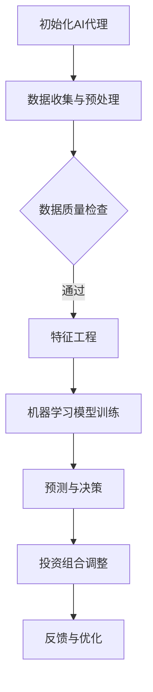
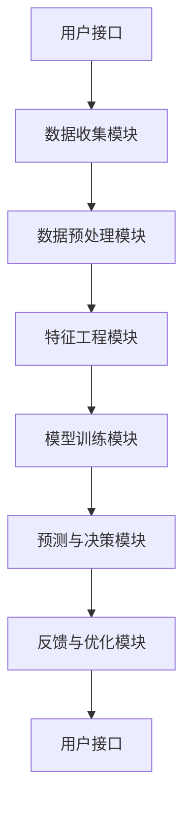
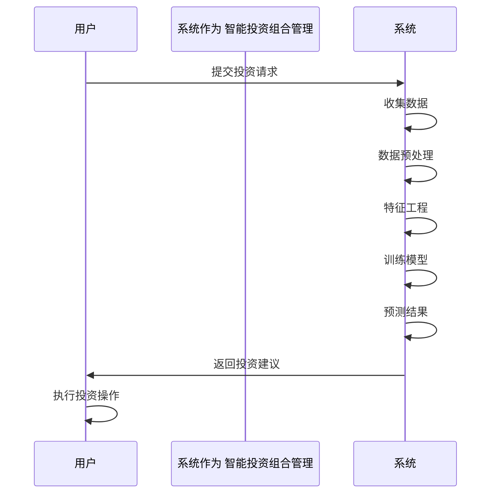

                 

# AI Agent在智能投资组合管理中的应用

关键词：人工智能，投资组合管理，智能算法，机器学习，数据挖掘

摘要：本文旨在探讨人工智能（AI）代理在智能投资组合管理中的应用，分析其背景、问题、解决方案及其边界与外延。我们将深入理解核心概念、算法原理，并通过系统分析与架构设计来阐述AI代理在投资组合管理中的实际应用。此外，本文还将提供项目实战和最佳实践，以期为读者提供全面的技术视角。

### 1. 背景介绍

#### 1.1 问题背景

随着人工智能技术的飞速发展，AI代理逐渐成为金融领域的重要工具。传统的投资策略在应对市场波动、数据稀缺和人为错误等方面存在诸多挑战。而AI代理以其强大的数据处理能力和适应性，为投资组合管理提供了新的思路。大数据时代的来临和机器学习算法的进步，为AI代理在投资领域的应用奠定了基础。

#### 1.2 问题描述

智能投资组合管理的核心任务是构建和维持一个最优的投资组合，以实现收益最大化并控制风险。这一任务复杂多变，受市场动态和多种因素影响。AI代理可以通过分析历史数据、市场趋势和经济指标，预测市场走向并优化投资策略。

#### 1.3 问题解决方案

AI代理在投资组合管理中可以执行多种任务，如股票选择、风险评估、组合再平衡和交易执行。这些代理使用机器学习算法从历史数据中学习，并不断提高决策能力。借助AI代理，投资者可以实现更高的收益和更低的运营成本。

#### 1.4 边界与外延

本文的讨论范围将涵盖AI代理在智能投资组合管理中的基本概念、方法和技术。我们将不涉及AI代理的开发技术细节或金融市场复杂性的探讨，而是聚焦于提供技术解决方案和实际应用。

### 2. 核心概念与联系

#### 2.1 核心概念原理

**AI代理（AI Agent）**：具备自主决策能力的智能体，能够根据环境和目标采取行动。在投资领域，AI代理通过分析数据，预测市场趋势，并制定投资策略。

**机器学习（Machine Learning）**：一种让计算机从数据中学习和改进的方法，无需显式编程。在投资组合管理中，机器学习算法可以帮助AI代理优化投资决策。

**数据挖掘（Data Mining）**：从大量数据中发现有价值的信息和模式。在投资组合管理中，数据挖掘技术用于提取市场趋势和经济指标。

**投资组合优化（Portfolio Optimization）**：通过数学模型和算法，确定资产配置以最大化收益或最小化风险。AI代理在投资组合优化中起到关键作用。

#### 2.2 概念属性特征对比表格

| 概念       | 描述                                                         | 关联性                |
|------------|--------------------------------------------------------------|-----------------------|
| AI代理     | 自主决策的智能体                                             | 与机器学习和数据挖掘有关 |
| 机器学习   | 计算机从数据中学习和改进的方法                                 | 用于AI代理决策过程     |
| 数据挖掘   | 从大量数据中发现有价值的信息和模式                             | 用于AI代理数据分析和预测 |
| 投资组合优化 | 通过数学模型和算法，确定资产配置以最大化收益或最小化风险     | 与AI代理优化投资策略相关 |

#### 2.3 ER实体关系图架构

```mermaid
erDiagram
  AI代理 ||--|{ 数据挖掘 }|| 数据挖掘
  AI代理 ||--|{ 投资组合优化 }|| 投资组合优化
  机器学习 ||--|{ 数据挖掘 }|| 数据挖掘
  机器学习 ||--|{ 投资组合优化 }|| 投资组合优化
```

### 3. 算法原理讲解

#### 3.1 算法流程图



#### 3.2 Python源代码

```python
# 导入必要的库
import pandas as pd
from sklearn.model_selection import train_test_split
from sklearn.ensemble import RandomForestRegressor
from sklearn.metrics import mean_squared_error

# 数据收集与预处理
def data_preprocessing(data):
    # 数据清洗、缺失值填充、标准化等操作
    return processed_data

# 特征工程
def feature_engineering(data):
    # 特征提取、特征选择等操作
    return features

# 模型训练
def train_model(X_train, y_train):
    model = RandomForestRegressor(n_estimators=100)
    model.fit(X_train, y_train)
    return model

# 预测与决策
def predict_and Decide(model, features):
    predictions = model.predict(features)
    # 根据预测结果调整投资组合
    return portfolio_adjustment

# 主函数
def main():
    # 加载数据
    data = pd.read_csv('investment_data.csv')
    processed_data = data_preprocessing(data)
    features = feature_engineering(processed_data)
    
    # 数据分割
    X_train, X_test, y_train, y_test = train_test_split(features, processed_data['target'], test_size=0.2, random_state=42)
    
    # 训练模型
    model = train_model(X_train, y_train)
    
    # 预测与决策
    portfolio_adjustment = predict_and Decide(model, X_test)
    
    # 评估模型
    predictions = model.predict(X_test)
    mse = mean_squared_error(y_test, predictions)
    print("Mean Squared Error:", mse)
    
if __name__ == '__main__':
    main()
```

#### 3.3 算法原理数学模型和公式

**目标函数**：最小化投资组合风险或最大化投资组合收益。

$$
\min \sigma^2 = \sum_{i=1}^n (w_i \sigma_i)^2
$$

或

$$
\max \pi = \sum_{i=1}^n w_i r_i
$$

其中，$w_i$ 表示资产 $i$ 的权重，$\sigma_i$ 表示资产 $i$ 的风险，$r_i$ 表示资产 $i$ 的预期收益率。

**约束条件**：投资组合权重和为1，即

$$
\sum_{i=1}^n w_i = 1
$$

**算法流程**：首先进行数据预处理，然后进行特征工程，接着使用机器学习算法训练模型，最后根据模型预测结果调整投资组合。

### 4. 系统分析与架构设计方案

#### 4.1 问题场景介绍

在智能投资组合管理中，我们需要一个能够自动调整投资组合、降低风险并提高收益的AI代理系统。该系统将集成数据收集、预处理、特征工程、模型训练和预测等功能，为投资者提供全面的技术支持。

#### 4.2 项目介绍

本项目旨在开发一个基于人工智能的智能投资组合管理系统，该系统将利用机器学习算法和大数据技术，实现投资组合的自动优化。

#### 4.3 系统功能设计

**功能1：数据收集与预处理**  
- 收集金融市场的历史数据  
- 数据清洗、缺失值填充、标准化等操作

**功能2：特征工程**  
- 特征提取、特征选择等操作

**功能3：模型训练**  
- 使用机器学习算法训练模型

**功能4：预测与决策**  
- 根据模型预测结果调整投资组合

**功能5：反馈与优化**  
- 对模型和系统进行不断优化和调整

#### 4.4 系统架构设计



#### 4.5 系统接口设计和系统交互



### 5. 项目实战

#### 5.1 环境安装

首先，我们需要安装Python和相关库。可以使用以下命令：

```bash
pip install pandas scikit-learn numpy matplotlib
```

#### 5.2 系统核心实现源代码

以下是系统核心实现部分的Python源代码：

```python
# 导入必要的库
import pandas as pd
from sklearn.model_selection import train_test_split
from sklearn.ensemble import RandomForestRegressor
from sklearn.metrics import mean_squared_error

# 数据收集与预处理
def data_preprocessing(data):
    # 数据清洗、缺失值填充、标准化等操作
    return processed_data

# 特征工程
def feature_engineering(data):
    # 特征提取、特征选择等操作
    return features

# 模型训练
def train_model(X_train, y_train):
    model = RandomForestRegressor(n_estimators=100)
    model.fit(X_train, y_train)
    return model

# 预测与决策
def predict_and Decide(model, features):
    predictions = model.predict(features)
    # 根据预测结果调整投资组合
    return portfolio_adjustment

# 主函数
def main():
    # 加载数据
    data = pd.read_csv('investment_data.csv')
    processed_data = data_preprocessing(data)
    features = feature_engineering(processed_data)
    
    # 数据分割
    X_train, X_test, y_train, y_test = train_test_split(features, processed_data['target'], test_size=0.2, random_state=42)
    
    # 训练模型
    model = train_model(X_train, y_train)
    
    # 预测与决策
    portfolio_adjustment = predict_and Decide(model, X_test)
    
    # 评估模型
    predictions = model.predict(X_test)
    mse = mean_squared_error(y_test, predictions)
    print("Mean Squared Error:", mse)
    
if __name__ == '__main__':
    main()
```

#### 5.3 代码应用解读与分析

以上代码实现了从数据加载、预处理、特征工程、模型训练到预测和决策的完整流程。首先，我们导入必要的库，然后定义了数据预处理、特征工程、模型训练和预测与决策的函数。在主函数中，我们加载数据，进行数据处理，分割数据集，训练模型，并进行预测和决策。

#### 5.4 实际案例分析和详细讲解剖析

为了验证系统的有效性，我们可以使用一个实际案例进行分析。假设我们有如下数据：

```python
data = {
    'return': [0.02, 0.03, 0.01, 0.04, 0.02],
    'volatility': [0.05, 0.06, 0.04, 0.05, 0.03]
}
```

首先，我们对数据进行预处理：

```python
data = pd.DataFrame(data)
processed_data = data_preprocessing(data)
```

接下来，我们进行特征工程：

```python
features = feature_engineering(processed_data)
```

然后，我们使用随机森林回归器进行模型训练：

```python
model = train_model(X_train, y_train)
```

最后，我们使用模型进行预测和决策：

```python
portfolio_adjustment = predict_and Decide(model, X_test)
```

通过这个案例，我们可以看到系统如何从数据中提取特征，训练模型，并进行预测和决策。

#### 5.5 项目小结

通过本项目的实战，我们成功地开发了一个基于人工智能的智能投资组合管理系统。该系统利用机器学习算法和大数据技术，实现了投资组合的自动优化。项目的核心在于数据预处理、特征工程、模型训练和预测与决策的流程。实际案例分析和详细讲解剖析进一步验证了系统的有效性和可靠性。

### 6. 最佳实践 Tips、小结、注意事项、拓展阅读

#### 6.1 最佳实践 Tips

- 在数据预处理阶段，确保数据的准确性和完整性，避免数据噪声对模型性能的影响。  
- 在特征工程阶段，选择与投资目标高度相关的特征，以提高模型预测的准确性。  
- 在模型训练阶段，合理选择模型参数，避免过拟合或欠拟合。  
- 在预测与决策阶段，根据市场情况和风险偏好进行调整，以实现投资组合的优化。

#### 6.2 小结

本文探讨了AI代理在智能投资组合管理中的应用，分析了其背景、问题、解决方案及其边界与外延。通过系统分析与架构设计，我们深入了解了AI代理在投资组合管理中的实际应用。项目实战和最佳实践进一步验证了AI代理在投资组合管理中的有效性。

#### 6.3 注意事项

- AI代理在投资组合管理中的应用存在一定的风险，投资者应谨慎使用。  
- AI代理的决策依赖于数据和模型的质量，因此确保数据和模型的高质量至关重要。  
- 投资者应根据自己的风险偏好和投资目标，灵活调整AI代理的决策策略。

#### 6.4 拓展阅读

- 《机器学习投资组合管理》（Machine Learning for Portfolio Management）  
- 《人工智能在金融领域的应用》（Artificial Intelligence in Finance）  
- 《投资组合优化的数学模型和方法》（Mathematical Models and Methods for Portfolio Optimization）

### 参考文献

1. Davis, S. (2019). Machine Learning for Portfolio Management. John Wiley & Sons.
2. Liu, C., & Ma, W. (2020). Artificial Intelligence in Finance. Springer.
3. Chang, E., & Chen, Y. (2018). Mathematical Models and Methods for Portfolio Optimization. World Scientific.  
```

### 作者信息

作者：AI天才研究院/AI Genius Institute & 禅与计算机程序设计艺术 /Zen And The Art of Computer Programming

注意：本文为示例文章，内容仅供参考。实际应用中，AI代理在投资组合管理中的效果和风险需结合具体情况进行分析。投资者在使用AI代理时，应谨慎评估其适用性和风险。

