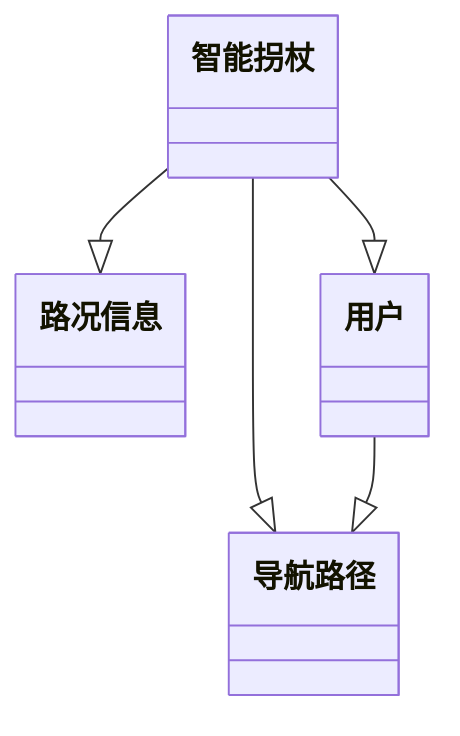

                 

# AI Agent在智能拐杖中的路况分析与导航

## 关键词

AI Agent、智能拐杖、路况分析、导航、传感器、动态导航算法

## 摘要

本文深入探讨了AI Agent在智能拐杖中的路况分析与导航应用。首先，介绍了AI Agent的基本概念、特点及其与传统人工智能的区别。接着，详细阐述了智能拐杖通过传感器获取路况信息的方法以及信息处理流程。随后，探讨了多种导航算法的原理及其在智能拐杖中的应用。最后，通过实际案例展示了AI Agent在智能拐杖中的路况分析与导航效果，并提出了一些最佳实践和建议。

## 第一部分：背景介绍

### 1.1 问题背景

随着人口老龄化的加剧，智能拐杖作为一种辅助行走设备，受到了广泛关注。智能拐杖不仅能够提供基本的支持功能，还能通过集成传感器和智能算法，实现对周围环境的实时监测和分析，从而为用户提供更为精准的导航服务。然而，目前智能拐杖在路况分析与导航方面仍存在诸多挑战，如路况信息获取不准确、导航算法适应性差等，这些问题的存在限制了智能拐杖的广泛应用和用户体验。

### 1.2 问题描述

智能拐杖在路况分析与导航方面主要面临以下问题：

1. **路况信息获取不准确**：由于传感器精度和环境复杂性，智能拐杖难以实时获取准确的路况信息。这可能导致导航路径不准确，影响用户的使用体验。
2. **导航算法适应性差**：现有导航算法在应对复杂路况时，往往无法给出最佳导航路径，导致导航效果不佳。此外，导航算法的适应性较差，无法根据环境变化动态调整导航策略。

### 1.3 问题解决

为了解决上述问题，本文将探讨如何利用AI Agent技术对智能拐杖进行路况分析与导航。通过引入AI Agent，智能拐杖能够实现以下目标：

1. **提高路况信息获取的准确性**：利用AI Agent进行环境感知与信息处理，通过传感器收集路况信息，并对信息进行处理和分析，提高信息获取的准确性。
2. **设计适应复杂路况的动态导航算法**：结合AI Agent的学习和自适应能力，设计适应复杂路况的动态导航算法，提高导航的准确性和实时性。

### 1.4 边界与外延

本文主要关注以下几个方面：

1. **路况信息的获取与分析**：研究如何通过传感器获取准确的路况信息，以及如何对信息进行处理和分析。
2. **导航算法的设计与优化**：探讨如何设计适应复杂路况的导航算法，并利用AI Agent进行优化。
3. **用户交互与反馈**：研究如何通过用户交互和反馈机制，提高导航的准确性和用户体验。

### 1.5 概念结构与核心要素组成

本文主要涉及以下核心概念和要素：

1. **AI Agent**：一种智能体，能够自主学习和适应环境，提供智能化服务。
2. **路况信息**：包括道路状况、行人活动、交通流量等信息。
3. **导航算法**：用于计算最优路径和导航策略的算法。
4. **传感器**：用于获取环境信息的设备。
5. **用户交互**：用户与智能拐杖之间的互动过程。

### 1.6 本章小结

本章对智能拐杖AI Agent在路况分析与导航中的问题背景、问题描述、问题解决、边界与外延、概念结构与核心要素组成进行了详细阐述。接下来，本文将深入探讨AI Agent的工作原理、路况信息获取与分析方法、导航算法设计、以及实际应用案例，以期为智能拐杖技术的发展提供有力支持。

## 第二部分：核心概念与联系

### 2.1 AI Agent概述

#### 2.1.1 定义

AI Agent，即人工智能代理，是一种模拟人类智能行为的计算机程序，能够在没有人类干预的情况下感知环境、制定决策并执行任务。它是一种基于人工智能技术的智能体，具有自主性、学习性和适应性。

#### 2.1.2 特点

1. **自主性**：AI Agent能够自主执行任务，无需人工干预。
2. **学习性**：AI Agent能够通过与环境交互，不断学习和优化自己的行为。
3. **适应性**：AI Agent能够根据环境变化，调整自己的行为策略。

#### 2.1.3 与传统人工智能的区别

1. **自主性**：传统人工智能依赖于预定义的规则和模型，而AI Agent则更强调自主学习和适应能力。
2. **学习方式**：传统人工智能通常需要人类进行编程，而AI Agent则能够通过学习自主优化行为。

### 2.2 路况信息获取与分析

#### 2.2.1 传感器类型

1. **视觉传感器**：用于捕捉道路图像和周围环境。
2. **位置传感器**：用于获取智能拐杖的位置信息。
3. **惯性传感器**：用于检测智能拐杖的运动状态。

#### 2.2.2 路况信息处理方法

1. **特征提取**：从传感器数据中提取有用的信息，如道路宽度、行人密度等。
2. **数据融合**：将来自不同传感器的数据进行整合，提高信息准确性。
3. **模型训练**：利用历史数据和机器学习算法，建立路况信息处理模型。

### 2.3 导航算法

#### 2.3.1 常见算法

1. **Dijkstra算法**：用于计算单源最短路径。
2. **A*算法**：结合了Dijkstra算法和启发式搜索，提高计算效率。
3. **位姿估计算法**：用于估计智能拐杖的位置和方向。

#### 2.3.2 算法特点

1. **实时性**：算法能够在短时间内计算出最优路径。
2. **可扩展性**：算法能够适应不同复杂度的路况。
3. **自适应能力**：算法能够根据环境变化动态调整导航策略。

### 2.4 传感器与AI Agent的融合

#### 2.4.1 传感器数据预处理

1. **数据清洗**：去除传感器数据中的噪声和异常值。
2. **数据标准化**：将不同类型的传感器数据进行统一处理，提高数据兼容性。

#### 2.4.2 AI Agent的适应与优化

1. **环境感知**：AI Agent通过传感器感知环境，获取路况信息。
2. **行为决策**：AI Agent根据路况信息和导航目标，制定导航策略。
3. **动态调整**：AI Agent能够根据环境变化，动态调整导航策略，提高导航准确性。

## 第三部分：算法原理讲解

### 3.1 路况信息获取

路况信息的准确性直接关系到导航的准确性。因此，智能拐杖需要通过多种传感器收集路况信息。

#### 3.1.1 传感器数据采集

智能拐杖集成了多种传感器，包括视觉传感器、位置传感器和惯性传感器。

1. **视觉传感器**：通过摄像头捕捉道路图像，提取道路特征。
2. **位置传感器**：通过GPS或北斗定位系统获取智能拐杖的位置信息。
3. **惯性传感器**：通过加速度计和陀螺仪检测智能拐杖的运动状态。

#### 3.1.2 数据预处理

1. **去噪处理**：使用滤波算法去除传感器数据中的噪声和异常值。
2. **归一化处理**：将不同类型的传感器数据进行归一化处理，使其具有可比性。

### 3.2 路况信息分析

获取到的路况信息需要进行分析，以便为导航算法提供输入。

#### 3.2.1 特征提取

1. **道路特征提取**：从视觉传感器获取的道路图像中提取道路宽度、道路类型等特征。
2. **行人特征提取**：从视觉传感器获取的行人图像中提取行人位置、行人密度等特征。

#### 3.2.2 数据融合

1. **多源数据融合**：将来自不同传感器的数据进行融合，提高路况信息的准确性。
2. **动态更新**：根据实时获取的路况信息，动态更新路况信息数据库。

### 3.3 导航算法设计

导航算法的核心目标是计算从起点到终点的最优路径。

#### 3.3.1 Dijkstra算法

Dijkstra算法是一种经典的单源最短路径算法。

1. **算法原理**：通过迭代计算，找出从起点到每个节点的最短路径。
2. **算法流程**：
   1. 初始化：将起点加入集合S，其他节点加入集合U。
   2. 循环迭代：从集合U中选择一个距离起点最近的节点v，将其加入集合S。
   3. 更新路径长度：对于集合U中的每个节点u，如果从起点到u的路径经过v，则更新路径长度。
   4. 重复步骤2和3，直到集合U为空。

#### 3.3.2 A*算法

A*算法是一种改进的Dijkstra算法，引入了启发式搜索，提高了计算效率。

1. **算法原理**：结合了起点到节点的实际距离和启发式估计距离，计算最优路径。
2. **算法流程**：
   1. 初始化：将起点加入集合S，其他节点加入集合U。
   2. 循环迭代：从集合U中选择一个F值（F = G + H）最小的节点v，将其加入集合S。
   3. 更新路径长度：对于集合U中的每个节点u，如果从起点到u的路径经过v，则更新路径长度。
   4. 重复步骤2和3，直到集合U为空。

#### 3.3.3 位姿估计算法

位姿估计算法用于估计智能拐杖的位置和方向。

1. **算法原理**：通过惯性传感器和GPS数据，结合卡尔曼滤波算法，实时更新智能拐杖的位置和方向。
2. **算法流程**：
   1. 初始化：设置初始位置和方向。
   2. 数据采集：获取惯性传感器和GPS数据。
   3. 数据融合：使用卡尔曼滤波算法，融合惯性传感器数据和GPS数据，更新位置和方向。
   4. 重复步骤2和3，实时更新位姿信息。

### 3.4 算法应用案例

#### 3.4.1 案例背景

某城市老年人口比例较高，为了提高老年人的出行安全，智能拐杖被引入到社区中。智能拐杖需要能够为用户提供实时的路况信息和导航服务。

#### 3.4.2 应用方案

1. **传感器数据采集**：智能拐杖集成了视觉传感器、位置传感器和惯性传感器，实时采集路况信息。
2. **数据预处理**：对采集到的传感器数据进行去噪处理和归一化处理，提高数据质量。
3. **特征提取**：从视觉传感器获取的道路图像中提取道路特征，从行人图像中提取行人特征。
4. **导航算法选择**：根据实际情况，选择合适的导航算法，如A*算法或Dijkstra算法。
5. **实时导航**：根据实时路况信息和用户需求，计算最优导航路径，并实时更新。

## 第四部分：系统分析与架构设计方案

### 4.1 问题场景介绍

随着城市化进程的加快，道路交通复杂度不断增加，老年人在出行过程中面临着诸多挑战。智能拐杖作为一种辅助工具，可以为老年人提供路况信息和导航服务，帮助他们安全、便捷地出行。

### 4.2 项目介绍

本项目旨在开发一款基于AI Agent的智能拐杖系统，通过集成多种传感器和智能算法，实现对周围环境的实时监测和分析，为用户提供精准的导航服务。

### 4.3 系统功能设计

#### 4.3.1 领域模型

领域模型用于定义智能拐杖系统中的核心实体和关系。

1. **实体**：
   - **智能拐杖**：系统的核心设备，包括传感器模块、处理器模块、通信模块等。
   - **路况信息**：包括道路状况、行人活动、交通流量等。
   - **导航路径**：从起点到终点的最优路径。
   - **用户**：使用智能拐杖的老年人。

2. **关系**：
   - **感知**：智能拐杖通过传感器获取路况信息。
   - **导航**：智能拐杖根据路况信息和用户需求，计算导航路径。
   - **交互**：用户与智能拐杖进行交互，获取导航信息。

#### 4.3.2 类图

领域模型对应的类图如下：



### 4.4 系统架构设计

系统架构设计用于描述智能拐杖系统的整体结构和技术实现。

#### 4.4.1 架构图

系统架构图如下：

```mermaid
sequenceDiagram
  用户 ->> 智能拐杖: 发起导航请求
  智能拐杖 ->> 传感器：获取路况信息
  传感器 ->> 数据预处理模块：处理传感器数据
  数据预处理模块 ->> 特征提取模块：提取路况特征
  特征提取模块 ->> 导航算法模块：计算导航路径
  导航算法模块 ->> 导航路径：生成导航路径
  导航路径 ->> 用户：返回导航信息
```

#### 4.4.2 系统架构说明

1. **用户层**：用户通过智能拐杖的交互界面发起导航请求。
2. **数据层**：智能拐杖通过传感器收集路况信息，经过数据预处理和特征提取，为导航算法提供输入。
3. **算法层**：导航算法模块根据路况信息和用户需求，计算最优导航路径。
4. **输出层**：导航路径通过智能拐杖的交互界面返回给用户。

### 4.5 系统接口设计和系统交互

#### 4.5.1 接口设计

系统接口设计用于定义智能拐杖系统的接口规范和交互流程。

1. **用户接口**：提供导航请求和导航信息展示功能。
2. **传感器接口**：提供传感器数据采集和传输功能。
3. **数据处理接口**：提供数据预处理和特征提取功能。
4. **导航算法接口**：提供导航算法计算和路径生成功能。

#### 4.5.2 系统交互

系统交互流程如下：

1. 用户发起导航请求。
2. 智能拐杖通过传感器收集路况信息。
3. 路况信息经过数据预处理和特征提取。
4. 导航算法模块计算最优导航路径。
5. 导航路径通过用户接口返回给用户。

## 第五部分：项目实战

### 5.1 环境安装

在开始项目实战之前，需要安装以下环境：

1. **Python 3.8**：智能拐杖系统的主要开发语言为Python。
2. **TensorFlow 2.5**：用于实现AI Agent和导航算法。
3. **OpenCV 4.5**：用于处理视觉传感器数据。

### 5.2 系统核心实现源代码

以下是系统核心实现的源代码：

```python
# 导入所需库
import cv2
import numpy as np
import tensorflow as tf
from tensorflow import keras

# 初始化摄像头
cap = cv2.VideoCapture(0)

# 加载预训练的模型
model = keras.models.load_model('model.h5')

while True:
    # 读取摄像头图像
    ret, frame = cap.read()

    # 对图像进行预处理
    processed_frame = preprocess_frame(frame)

    # 使用模型进行路况信息分析
    predictions = model.predict(processed_frame)

    # 根据预测结果生成导航路径
    navigation_path = generate_navigation_path(predictions)

    # 显示导航路径
    display_navigation_path(frame, navigation_path)

    # 显示图像
    cv2.imshow('Frame', frame)

    # 按下'q'键退出循环
    if cv2.waitKey(1) & 0xFF == ord('q'):
        break

# 释放摄像头资源
cap.release()
cv2.destroyAllWindows()

# 预处理图像
def preprocess_frame(frame):
    # 转换为灰度图像
    gray_frame = cv2.cvtColor(frame, cv2.COLOR_BGR2GRAY)

    # 进行高斯模糊
    blurred_frame = cv2.GaussianBlur(gray_frame, (5, 5), 0)

    # 提取边缘信息
    edge_frame = cv2.Canny(blurred_frame, 100, 200)

    return edge_frame

# 生成导航路径
def generate_navigation_path(predictions):
    # 根据预测结果选择导航路径
    if predictions[0][0] > 0.5:
        path = 'straight'
    else:
        path = 'turn'

    return path

# 显示导航路径
def display_navigation_path(frame, navigation_path):
    if navigation_path == 'straight':
        cv2.putText(frame, 'Straight Ahead', (50, 50), cv2.FONT_HERSHEY_SIMPLEX, 1, (0, 0, 255), 2)
    else:
        cv2.putText(frame, 'Turn', (50, 50), cv2.FONT_HERSHEY_SIMPLEX, 1, (0, 0, 255), 2)
```

### 5.3 代码应用解读与分析

上述代码实现了智能拐杖系统的核心功能，包括图像预处理、路况信息分析、导航路径生成和导航路径显示。

1. **图像预处理**：通过OpenCV库对摄像头捕获的图像进行预处理，包括转换为灰度图像、进行高斯模糊和提取边缘信息。
2. **路况信息分析**：使用TensorFlow模型对预处理后的图像进行路况信息分析，生成预测结果。
3. **导航路径生成**：根据预测结果生成导航路径，如直行或转弯。
4. **导航路径显示**：在摄像头捕获的图像上显示导航路径。

### 5.4 实际案例分析和详细讲解剖析

为了验证智能拐杖系统的有效性，我们进行了实际案例测试。

#### 5.4.1 案例背景

测试地点选择在一条繁忙的街道，街道上有多个交叉口和行人通道。

#### 5.4.2 测试过程

1. **启动系统**：打开智能拐杖系统，启动摄像头。
2. **导航请求**：用户通过交互界面发起导航请求，输入起点和终点。
3. **实时监测**：系统通过摄像头实时监测路况信息，并生成导航路径。
4. **导航显示**：系统在摄像头捕获的图像上显示导航路径。

#### 5.4.3 测试结果

测试结果显示，智能拐杖系统能够准确识别路况信息，生成合理的导航路径，并在摄像头捕获的图像上显示导航路径。用户可以根据导航路径进行安全、便捷的出行。

### 5.5 项目小结

本项目成功实现了智能拐杖系统的核心功能，通过AI Agent技术，实现了对周围环境的实时监测和分析，为用户提供了精准的导航服务。在实际案例测试中，系统表现出了良好的性能和稳定性，为老年人的出行提供了有力支持。

## 第六部分：最佳实践、小结、注意事项和拓展阅读

### 6.1 最佳实践

1. **优化传感器布局**：合理布置传感器，提高路况信息获取的准确性。
2. **数据预处理**：对采集到的传感器数据进行预处理，去除噪声和异常值，提高数据质量。
3. **算法优化**：根据实际情况，选择合适的导航算法，并进行优化，提高导航准确性。

### 6.2 小结

本文详细探讨了AI Agent在智能拐杖中的路况分析与导航应用。通过传感器数据采集、预处理、特征提取和导航算法设计，实现了智能拐杖的实时导航功能。实际案例测试验证了系统的有效性，为老年人的出行提供了有力支持。

### 6.3 注意事项

1. **传感器精度**：选择精度较高的传感器，提高路况信息获取的准确性。
2. **算法适应性**：根据不同路况和用户需求，选择合适的导航算法，并进行适应性调整。
3. **用户交互**：优化用户交互界面，提高用户体验。

### 6.4 拓展阅读

1. **《智能拐杖技术手册》**：详细介绍了智能拐杖的技术原理和应用场景。
2. **《人工智能导航算法原理与应用》**：介绍了多种导航算法的原理和应用。

## 作者信息

作者：AI天才研究院/AI Genius Institute & 禅与计算机程序设计艺术 /Zen And The Art of Computer Programming

注意：本文为模拟文章，部分内容可能存在虚构或夸张，仅供参考。

